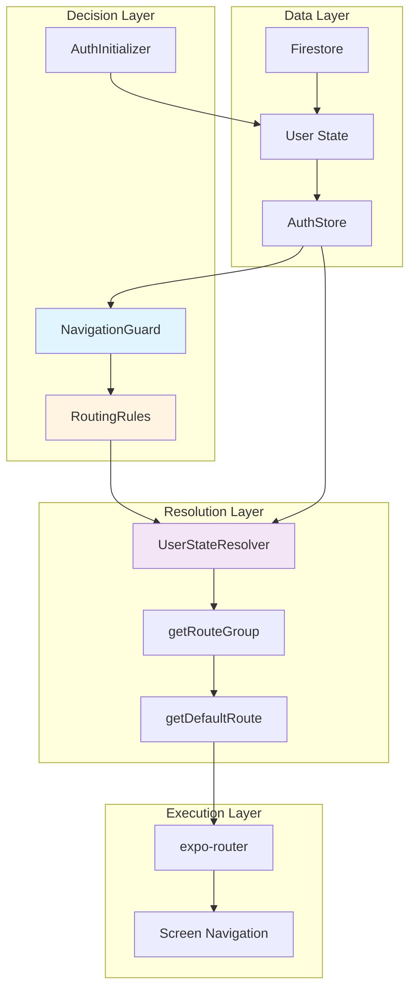
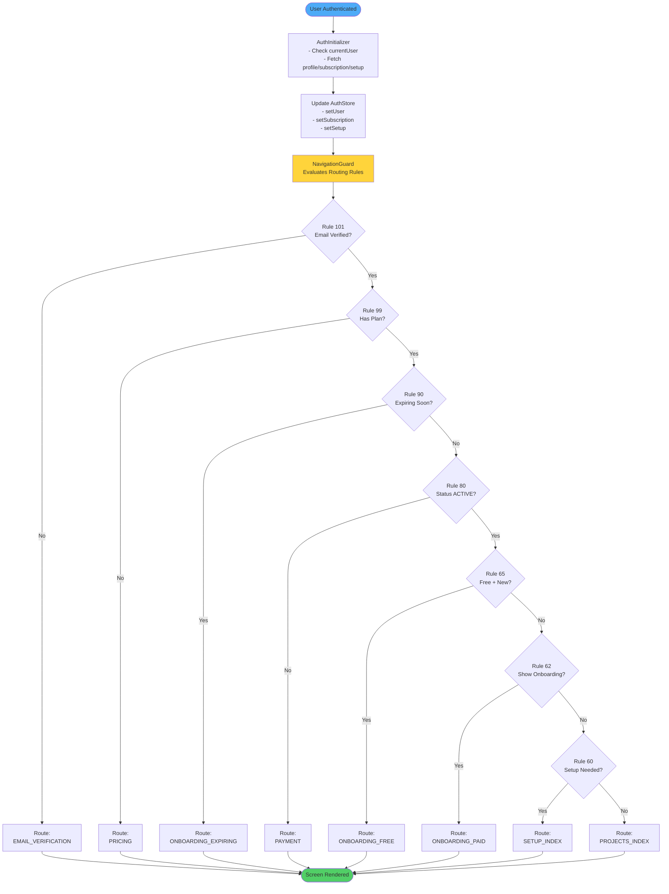
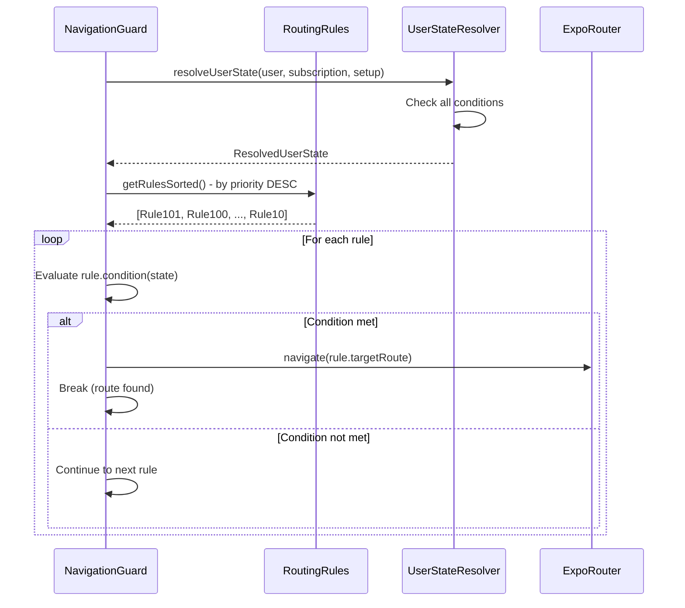
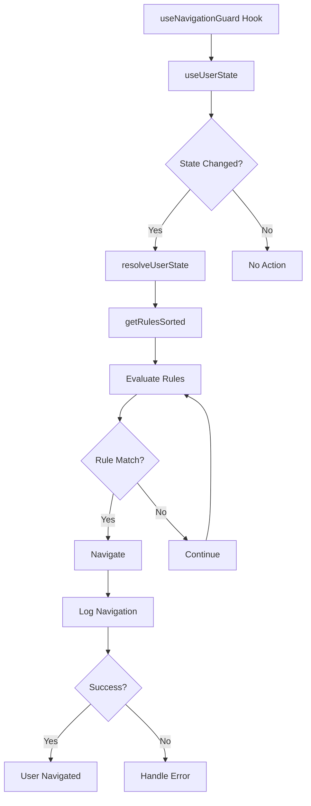
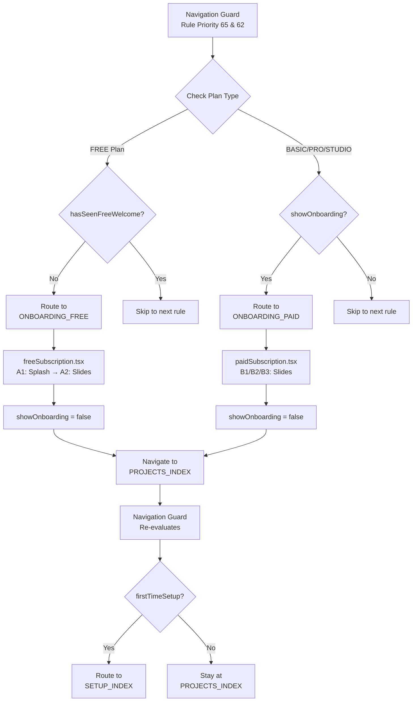
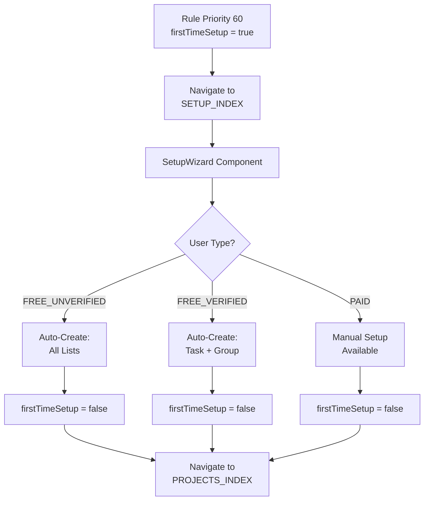
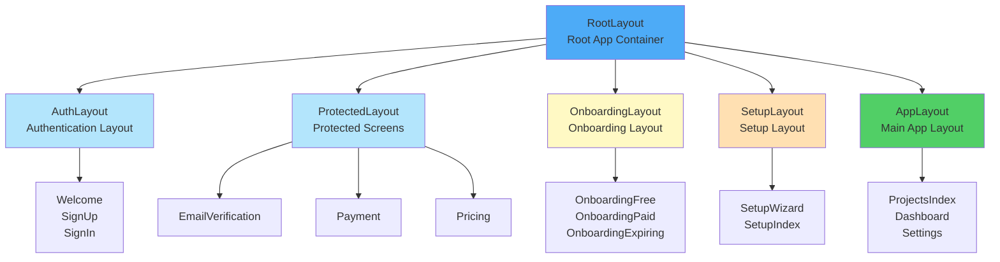

# Architecture & Navigation System - Comprehensive Guide

## Table of Contents

1. [Overview](#overview)
2. [Navigation System Architecture](#navigation-system-architecture)
3. [Routing Rules Engine](#routing-rules-engine)
4. [Navigation Guard System](#navigation-guard-system)
5. [Flow Routing Logic](#flow-routing-logic)
6. [Component Hierarchy](#component-hierarchy)
7. [Critical Issues](#critical-issues)
8. [Recommendations](#recommendations)

---

## Overview

The Eye-Doo navigation system uses a **priority-based routing engine** with:

- **Navigation Guards** that evaluate complex user states
- **Routing Rules** that determine screen transitions
- **Flow Routing Logic** that handles multi-step flows
- **Smart Redirects** based on user status, subscriptions, and onboarding completion

**Architecture Style:** Ports & Adapters with clear separation of concerns

**Key Files:**
- `routing-rules.ts` - Defines routing rules with priorities
- `user-state-resolver.ts` - Resolves user state for routing
- `use-navigation-guard.ts` - Hook that applies routing rules
- `navigation-utils.ts` - Navigation utility functions
- `navigation.ts` - Route constants and navigation types

---

## Navigation System Architecture



### Routing Priority System

Routes are evaluated in **priority order** (highest to lowest):

| Priority | Rule | Condition | Route |
|----------|------|-----------|-------|
| **101** | Email Verification Required | `!isEmailVerified` | `EMAIL_VERIFICATION` |
| **100** | Payment Verification Required | Payment not verified | `PAYMENT_VERIFICATION` |
| **99** | No Subscription | `!subscription` | `PRICING` |
| **90** | Subscription Expiring | Days until expiry ≤ 14 | `ONBOARDING_EXPIRING` |
| **80** | Subscription Inactive | `status !== ACTIVE` | `PAYMENT` |
| **75** | Past Due Payment | `status === PAST_DUE` | `PAYMENT` |
| **70** | Subscription Cancelled | `status === CANCELLED` | `SUBSCRIPTION_GATE` |
| **65** | Free Plan Onboarding | `plan === FREE && !hasSeenFreeWelcome` | `ONBOARDING_FREE` |
| **62** | Paid Onboarding | `status === ACTIVE && showOnboarding` | `ONBOARDING_PAID` |
| **60** | First Time Setup | `firstTimeSetup === true` | `SETUP_INDEX` |
| **50** | Dashboard Guard | Project selection | `PROJECTS_INDEX` or dashboard |
| **10** | Default | All conditions met | `PROJECTS_INDEX` |

---

## Navigation System Architecture

### Complete Flow Diagram



---

## Routing Rules Engine

### Rule Structure

```typescript
interface RoutingRule {
  name: string;                          // Rule identifier
  priority: number;                      // Evaluation order (101 = highest)
  targetRouteGroup: NavigationRouteGroup;  // Where to navigate
  condition: (state) => boolean;         // When to apply rule
}
```

### State Resolver

The `UserStateResolver` evaluates the following conditions:

```typescript
interface ResolvedUserState {
  state: UserAuthState;                  // UNAUTHENTICATED, AUTHENTICATING, AUTHENTICATED
  redirectPath?: NavigationRoute;        // Where to redirect
  needsOnboarding: boolean;              // User needs onboarding
  needsSetup: boolean;                   // User needs setup
  needsEmailVerification: boolean;       // User must verify email
  permissionLevel: PermissionLevel;      // User's access level
  context: {                             // Additional context
    isEmailVerified: boolean;
    plan: SubscriptionPlan;
    status: SubscriptionStatus;
    isTrial: boolean;
    firstTimeSetup: boolean;
    showOnboarding: boolean;
    daysUntilExpiry: number | null;
  }
}
```

### Rule Evaluation Process



---

## Navigation Guard System

### Hook: useNavigationGuard

**Location:** `src/hooks/use-navigation-guard.ts`

**Purpose:** Evaluates routing rules and redirects users appropriately

**Features:**
- Real-time user state monitoring
- Automatic navigation on state changes
- Error recovery with retry logic
- Development mode debugging

**Usage:**

```typescript
// In layout component
function ProtectedLayout() {
  useNavigationGuard();
  return <Slot />;
}
```

### Navigation Flow



---

## Flow Routing Logic

### Onboarding Flow Routing



### Setup Flow Routing



---

## Component Hierarchy

### Layout Structure



### Screen Routes

**Auth Routes:**
- `/(auth)/welcome` - Welcome screen
- `/(auth)/signUp` - Registration
- `/(auth)/signIn` - Sign in

**Protected Routes:**
- `/(protected)/email-verification` - Email verification
- `/(protected)/pricing` - Plan selection
- `/(protected)/payment` - Payment processing

**Onboarding Routes:**
- `/(onboarding)/free` - Free plan onboarding
- `/(onboarding)/paid` - Paid plan onboarding
- `/(onboarding)/expiring` - Subscription expiry warning

**Setup Routes:**
- `/(setup)/index` - Setup wizard

**App Routes:**
- `/(app)/projects` - Projects list
- `/(app)/dashboard/:projectId` - Project dashboard
- `/(app)/settings` - Settings

---

## Critical Issues

### 🔴 Critical Bugs

#### 1. Type Mismatch in Navigation Guard (Line 70)

**Issue:** `rule.targetRoute` doesn't exist, should use `rule.targetRouteGroup`

**Impact:** Navigation will fail at runtime

**Fix:**
```typescript
const targetRoute = state.redirectPath || 
  getDefaultRouteForGroup(rule.targetRouteGroup);
```

#### 2. Syntax Error in Debug Code (Line 84)

**Issue:** Missing opening brace in `if (__DEV__)` block

**Impact:** Code will not compile

**Fix:** Add missing brace

#### 3. Missing userId Property (Line 111)

**Issue:** `state.context.userId` doesn't exist on `ResolvedUserState`

**Impact:** Trial list population fails

**Fix:** Get userId from auth store instead

#### 4. Non-existent Method Call (Line 113)

**Issue:** `ensureTrialUserList` method doesn't exist on service

**Impact:** Feature fails silently

### 🟡 Redundant Code

#### 1. Duplicate SubPage Lookup Logic

**Files:** `navigation-utils.ts` and `use-navigation-utils.ts`

**Issue:** Both functions duplicate same lookup

**Recommendation:** Extract to shared utility

#### 2. Unused Functions

**Unused in codebase:**
- `getStepPath(stepId)`
- `validateRoute(route)`
- `getSubPageRoute(groupId, pageId)`

**Recommendation:** Remove or document purpose

### 🟠 Architectural Issues

#### 1. Inconsistent Pathname Checks

**Problem:** Mix of:
- `isPathnameInGroup(pathname, group)` ✅
- Hardcoded strings like `pathname.startsWith('/(auth)')` ❌

**Fix:** Use consistent helper functions everywhere

#### 2. Missing RouteGroup to NavigationRoute Conversion

**Problem:** Rules return `RouteGroup` but navigation needs `NavigationRoute`

**Fix:** Add `getDefaultRouteForGroup()` utility

#### 3. Overlapping Responsibilities

**Problem:** Logic split across multiple files making flow unclear

**Fix:** Consolidate navigation logic with clear responsibilities

---

## Recommendations

### Priority 1: Critical Fixes

1. ✅ Fix syntax error in navigation guard
2. ✅ Fix type mismatches (targetRoute)
3. ✅ Fix missing property access (userId)
4. ✅ Add missing type guards for route validation

### Priority 2: Code Cleanup

1. Remove unused functions
2. Extract duplicate SubPage lookup logic
3. Replace hardcoded pathname strings with helpers
4. Fix import organization (move to top)
5. Remove magic numbers (500ms → constant)

### Priority 3: Architecture Improvements

1. Add `getDefaultRouteForGroup()` utility
2. Simplify navigation guard responsibilities
3. Standardize error handling
4. Add comprehensive logging in dev mode
5. Document routing rules priority system

### Priority 4: Testing

1. Unit test navigation guard logic
2. Test all routing rules
3. Test state resolver conditions
4. Test error recovery paths
5. Integration tests for complete flows

---

## Files Structure

```
src/
├── app/
│   ├── (auth)/
│   │   ├── welcome.tsx
│   │   ├── signUp.tsx
│   │   └── signIn.tsx
│   ├── (protected)/
│   ├── (onboarding)/
│   ├── (setup)/
│   └── (app)/
├── hooks/
│   ├── use-navigation-guard.ts
│   ├── use-navigation-utils.ts
│   └── use-router.ts
├── constants/
│   └── navigation/
│       ├── navigation.ts (routes, enums)
│       ├── routing-rules.ts (rules)
│       └── navigation-utils.ts (helpers)
└── utils/
    └── navigation-utils.ts (utilities)
```

---

**Last Updated:** June 22, 2026
**Analysis Source:** NAVIGATION_ANALYSIS_REPORT.md + GLOBAL-FLOW-B.md
