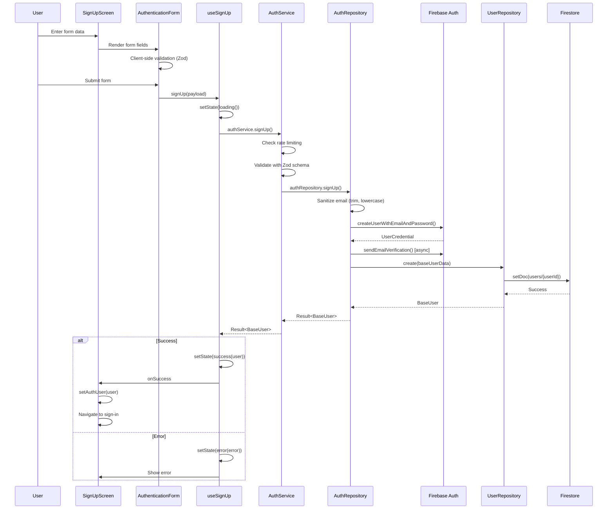
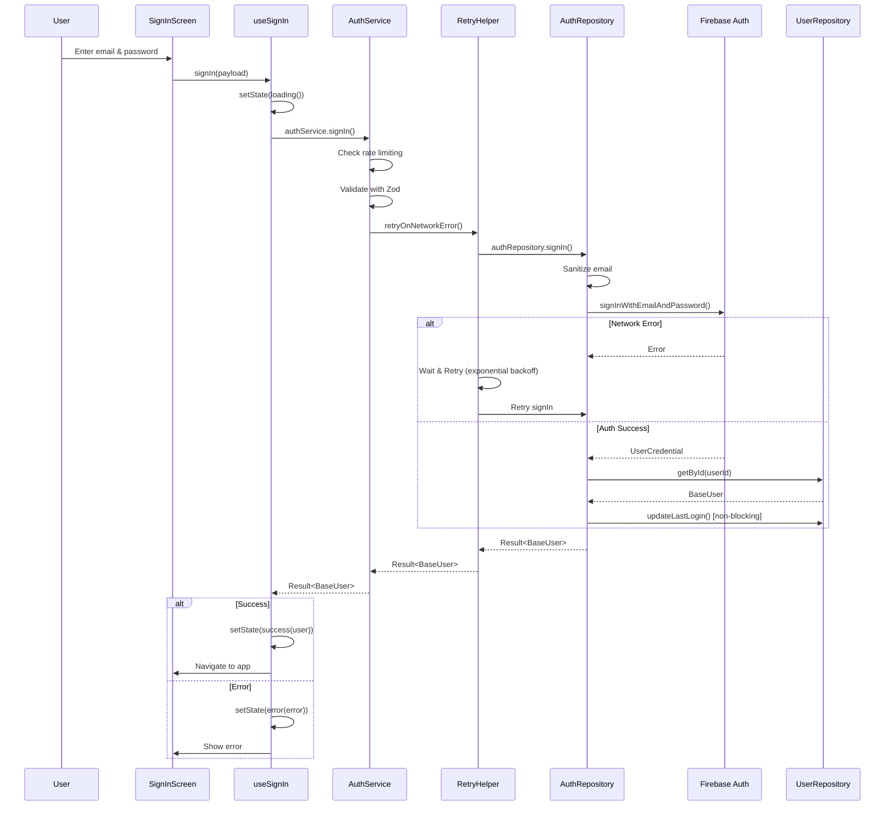
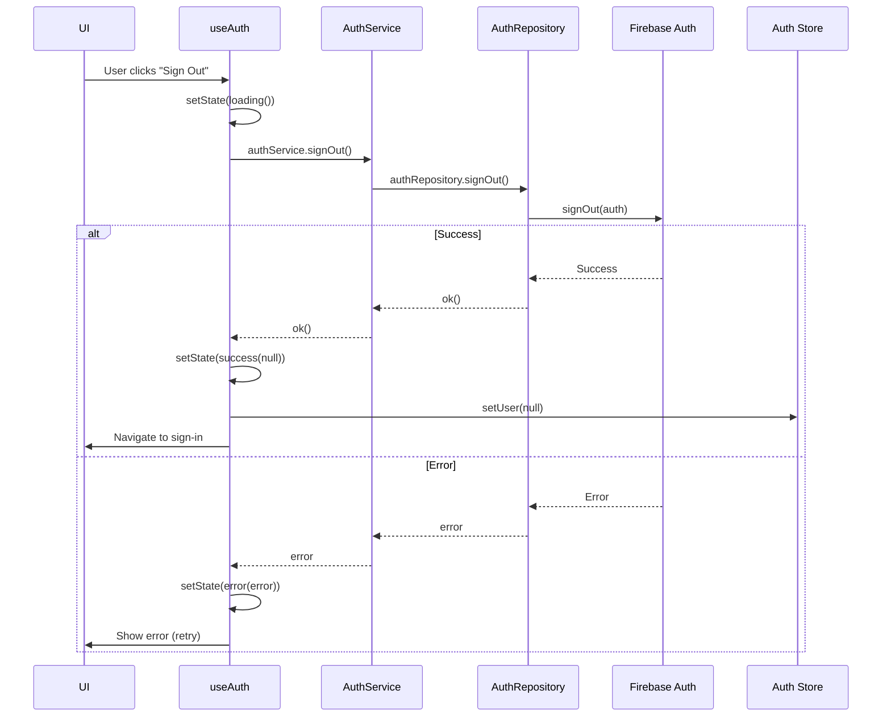
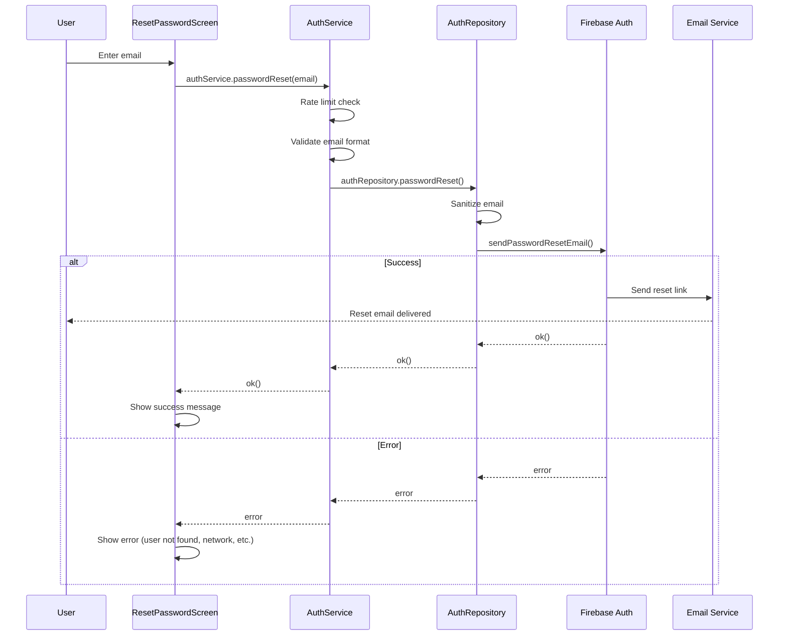
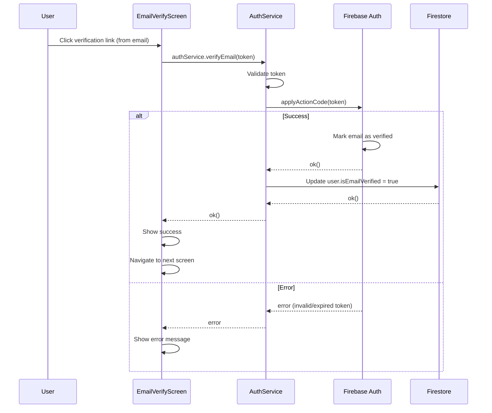
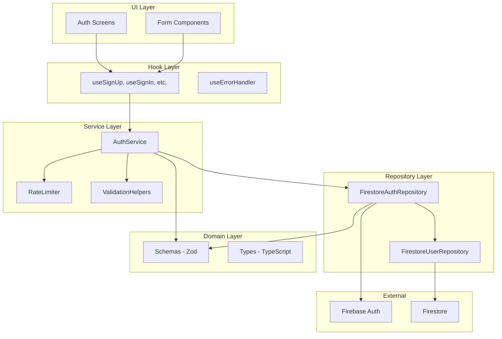
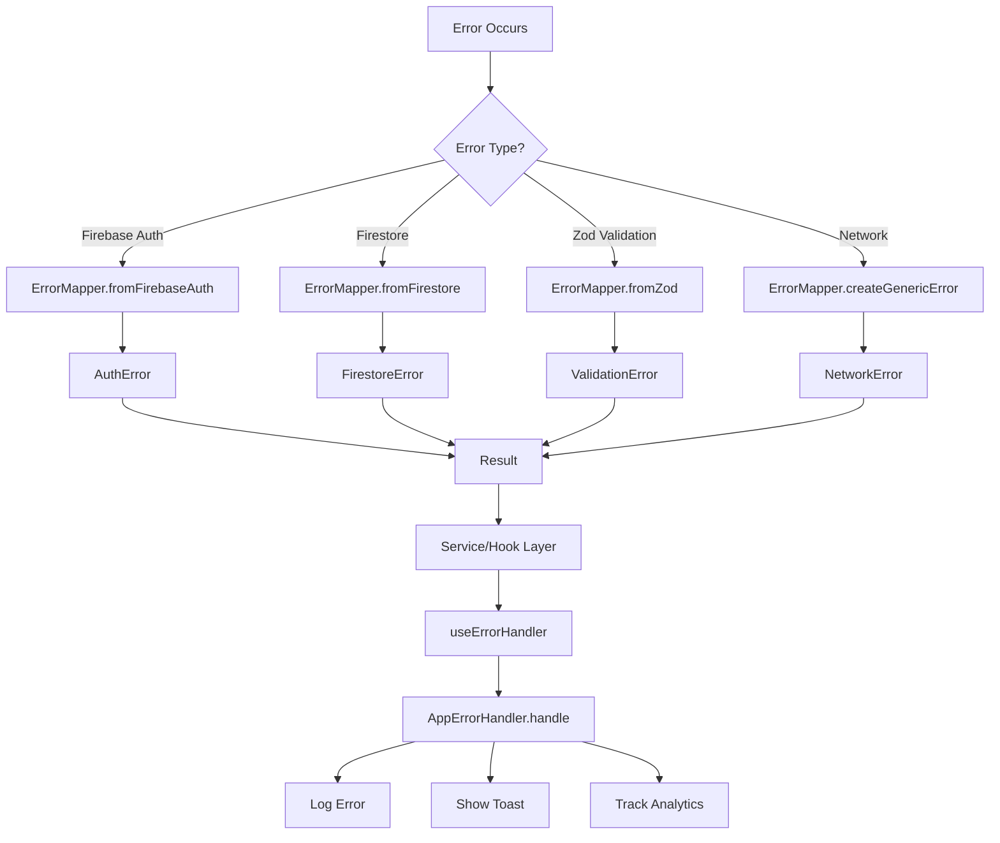
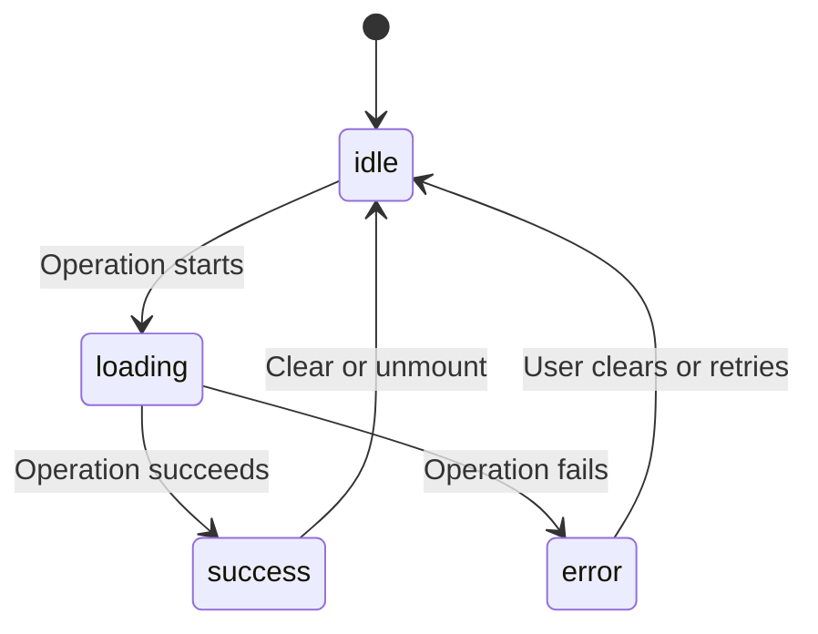

# Authentication System - Comprehensive Guide

## Table of Contents

1. [Overview](#overview)
2. [Sign-Up Flow](#sign-up-flow)
3. [Sign-In Flow](#sign-in-flow)
4. [Sign-Out Flow](#sign-out-flow)
5. [Password Reset](#password-reset)
6. [Email Verification](#email-verification)
7. [Architecture](#architecture)
8. [Data Structures](#data-structures)
9. [Validation & Sanitization](#validation--sanitization)
10. [Error Handling](#error-handling)
11. [Rate Limiting](#rate-limiting)
12. [Loading States](#loading-states)

---

## Overview

The Eye-Doo authentication system uses a **Ports & Adapters (Hexagonal) Architecture** with:

- **Result pattern** for error handling (never throws)
- **Multi-layer validation** (client-side Zod + service-level)
- **Rate limiting** on all auth operations
- **Comprehensive sanitization** at repository layer
- **Centralized error mapping** for user-friendly messages
- **Zustand store** for global auth state
- **Firebase Auth** for secure authentication
- **Firestore** for user data persistence

**Key Characteristics:**
- ✅ No exceptions - Result<T, AppError> pattern throughout
- ✅ Type-safe with TypeScript and Zod
- ✅ Clear separation of concerns
- ✅ Testable layers (UI, Service, Repository)
- ✅ Automatic error recovery with retry logic
- ✅ Analytics tracking for monitoring

---

## Sign-Up Flow

### Complete Sequence



### Input Validation

**SignUpInput Schema:**
```typescript
{
  displayName: string;        // Min 1, max 100 chars
  email: string;              // Valid email format, max 254 chars
  password: string;           // Min 8 chars, uppercase + lowercase + number
  confirmPassword: string;    // Must match password
  subscriptionPlan: Enum;     // FREE | PRO | STUDIO
  acceptTerms: boolean;       // Must be true
  acceptPrivacy: boolean;     // Must be true
  acceptMarketing?: boolean;  // Optional
}
```

### Default Values Created

```typescript
// Preferences
preferences: {
  notifications: true,
  darkMode: false,
  language: 'ENGLISH',
  marketingConsent: payload.acceptMarketing || false,
  timezone: 'UTC',
  dateFormat: 'DD/MM/YYYY',
  timeFormat: '24h'
}

// Subscription
subscription: {
  plan: payload.subscriptionPlan,  // User selected
  isActive: false,
  autoRenew: true,
  startDate: new Date(),
  billingCycle: 'MONTHLY'
}

// Setup
setup: {
  firstTimeSetup: true,
  showOnboarding: true,
  // ... other flags
}

// Projects
projects: {
  activeProjects: 0,
  totalProjects: 0,
  projects: []
}
```

### Rate Limiting

**Sign-Up Rate Limit:**
- Key: `signup-${email.toLowerCase()}`
- Max attempts: **3 per hour**
- Block duration: 1 hour
- Resets on success

---

## Sign-In Flow

### Complete Sequence



### Input Validation

**SignInInput Schema:**
```typescript
{
  email: string;        // Valid email format
  password: string;     // Min 8 chars
  rememberMe?: boolean; // Optional, defaults to false
}
```

### Rate Limiting

**Sign-In Rate Limit:**
- Key: `signin-${email.toLowerCase()}`
- Max attempts: **5 per 15 minutes**
- Block duration: 15 minutes
- Resets on success

### Retry Logic

**Automatic Retry for Network Errors:**
- Max attempts: 3 (initial + 2 retries)
- Exponential backoff: 1s, 2s, 4s (capped at 10s)
- Only retries: `NETWORK_CONNECTION_ERROR`, `NETWORK_TIMEOUT`
- Does NOT retry: Auth errors, validation errors

### Persistence (Remember Me)

**Web:**
- `rememberMe: true` → `browserLocalPersistence` (survives close)
- `rememberMe: false` → `browserSessionPersistence` (cleared on close)

**React Native:**
- Pre-configured at initialization
- `setPersistence()` may not be available

---

## Sign-Out Flow

### Process



---

## Password Reset

### Send Reset Email



### Reset Confirmation

**Process:**
1. User receives email with reset link (includes token)
2. User clicks link → app opens with token in URL
3. User enters new password + confirmation
4. Form validates (passwords match, meets requirements)
5. Service calls `Firebase.confirmPasswordReset(token, newPassword)`
6. Password updated in Firebase Auth
7. Success message shown, redirect to sign-in

**Rate Limiting:**
- Key: `password-reset-${email.toLowerCase()}`
- Max attempts: **3 per hour**

---

## Email Verification

### Verify Email



### Resend Verification Email

**Process:**
1. User clicks "Resend verification email" on verification screen
2. Service checks user is authenticated
3. Firebase sends verification email to user
4. If fails: Non-blocking error (doesn't fail flow)
5. Success message shown

**Rate Limiting:**
- Max attempts: **5 per hour** per user

---

## Architecture

### Layers



### File Structure

**Screens:**
- `src/app/(auth)/signUp.tsx`
- `src/app/(auth)/signIn.tsx`
- `src/app/(auth)/resetPassword.tsx`
- `src/app/(auth)/verifyEmail.tsx`

**Components:**
- `src/components/auth/AuthenticationForm.tsx`
- `src/components/auth/AuthInitializer.tsx`

**Hooks:**
- `src/hooks/use-sign-up.ts`
- `src/hooks/use-sign-in.ts`
- `src/hooks/use-auth.ts` (get profile)
- `src/hooks/use-error-handler.ts`

**Services:**
- `src/services/auth-service.ts` (orchestration)
- `src/services/error-handler-service.ts` (error handling)

**Repositories:**
- `src/repositories/firestore/firestore-auth-repository.ts`
- `src/repositories/firestore/firestore-base-user-repository.ts`
- `src/repositories/i-auth-repository.ts` (interface)

**Domain:**
- `src/domain/user/auth.schema.ts` (Zod schemas)
- `src/domain/user/user.schema.ts`
- `src/domain/common/errors.ts`

**Utils:**
- `src/utils/validation-helpers.ts`
- `src/utils/sanitization-helpers.ts`
- `src/utils/error-mapper.ts`
- `src/utils/rate-limiter.ts`
- `src/utils/error-context-builder.ts`
- `src/utils/retry-helper.ts`

**Stores:**
- `src/stores/use-auth-store.ts` (Zustand)

---

## Data Structures

### Schemas

**SignUpInput:**
```typescript
interface SignUpInput {
  displayName: string;        // 1-100 chars
  email: string;              // RFC-compliant
  password: string;           // 8+ chars, alphanumeric
  confirmPassword: string;    // Must match
  subscriptionPlan: Enum;     // FREE | PRO | STUDIO
  acceptTerms: boolean;       // Must be true
  acceptPrivacy: boolean;     // Must be true
  acceptMarketing?: boolean;  // Optional
}
```

**SignInInput:**
```typescript
interface SignInInput {
  email: string;        // RFC-compliant
  password: string;     // 8+ chars
  rememberMe?: boolean; // Optional
}
```

**BaseUser:**
```typescript
interface BaseUser {
  id: string;                   // Firebase Auth UID
  email: string;                // Sanitized
  displayName: string;          // From input
  phone: string | null;         // Nullable
  role: UserRole;               // Enum
  isEmailVerified: boolean;     // Initially false
  isActive: boolean;            // Initially true
  isBanned: boolean;            // Initially false
  lastLoginAt: Date | null;     // Set on sign-in
  deletedAt: Date | null;       // Null unless deleted
  createdAt: Date;              // Server timestamp
  updatedAt: Date | null;       // Server timestamp
}
```

---

## Validation & Sanitization

### Validation Layers

1. **Client-Side (Form):** React Hook Form + Zod
   - Real-time field validation
   - Shows field-specific errors immediately

2. **Service Layer:** `validateWithSchema()`
   - Second validation for security
   - Ensures data integrity

3. **Repository Layer:** Sanitization
   - Cleans input before Firebase
   - Removes dangerous characters

### Email Sanitization

```typescript
// Process:
1. Trim whitespace
2. Convert to lowercase
3. Remove internal spaces
4. Basic format validation regex
5. Return sanitized or null if invalid

// Example:
Input:  "  JOHN.DOE@EXAMPLE.COM  "
Output: "john.doe@example.com"
```

### String Sanitization

```typescript
// Process:
1. Trim leading/trailing whitespace
2. Return undefined if empty
3. Return trimmed value otherwise

// Does NOT normalize passwords (preserve intentional spaces)
```

### Validation Rules

**Email:**
- Required, min 1 char, max 254 chars
- RFC-compliant format check
- Auto-trimmed and lowercased

**Password:**
- Min 8 chars, max 128 chars
- Must contain: uppercase, lowercase, number
- NOT sanitized (passed as-is to Firebase)

**Display Name:**
- Min 2 chars, max 50 chars
- Auto-trimmed

**Terms & Privacy:**
- Both MUST be true (required checkboxes)

**Subscription Plan:**
- Must be enum value: FREE | PRO | STUDIO

---

## Error Handling

### Error Flow



### Error Types

**AuthError:**
- `AUTH_INVALID_CREDENTIALS` - Wrong email/password
- `AUTH_EMAIL_IN_USE` - Email already registered
- `AUTH_WEAK_PASSWORD` - Password doesn't meet requirements
- `AUTH_TOO_MANY_REQUESTS` - Rate limited
- `AUTH_USER_NOT_FOUND` - User doesn't exist

**ValidationError:**
- Contains `fieldErrors` object
- Field-specific error messages
- User-friendly format

**FirestoreError:**
- `DB_NOT_FOUND` - Document not found
- `DB_PERMISSION_DENIED` - No access
- `DB_NETWORK_ERROR` - Network issue

**NetworkError:**
- `NETWORK_CONNECTION_ERROR` - No internet
- `NETWORK_TIMEOUT` - Request timed out

### Error Context

Every error includes:
```typescript
{
  code: ErrorCode;              // Error type enum
  message: string;              // Technical message
  userMessage: string;          // User-friendly message
  context: string;              // "Service.method" or "Repository.method"
  retryable: boolean;           // Can user retry?
  timestamp: Date;              // When error occurred
  userId?: string;              // If available
  metadata?: Record<string, any>;
}
```

---

## Rate Limiting

### Implementation

In-memory rate limiter with:
- Email-based keys
- Configurable attempt limits
- Time-based expiration
- Manual reset on success

### Limits by Operation

| Operation | Max Attempts | Duration | Reset |
|-----------|-------------|----------|-------|
| Sign Up | 3 | 1 hour | On success |
| Sign In | 5 | 15 mins | On success |
| Password Reset | 3 | 1 hour | On success |
| Email Resend | 5 | 1 hour | N/A |

### Error Message

```
"Too many attempts. Please try again in X minutes."
```

---

## Loading States

### State Machine



### LoadingState Type

```typescript
type LoadingState<T> =
  | { status: 'idle' }
  | { status: 'loading'; data?: T }
  | { status: 'success'; data: T }
  | { status: 'error'; error: AppError; data?: T }
```

### UI Feedback

- **Idle:** Form ready for input
- **Loading:** Spinner, disabled submit button
- **Success:** Success message, navigation
- **Error:** Error message, retry button available

---

## Key Features

### ✅ Security
- Rate limiting prevents brute force
- Input sanitization removes dangerous chars
- Multi-layer validation ensures data integrity
- No sensitive data in error messages
- Password never logged or exposed

### ✅ Resilience
- Automatic retry for network errors
- Error recovery without data loss
- Non-blocking email verification
- Graceful error handling throughout

### ✅ User Experience
- Real-time field validation
- Clear, actionable error messages
- Loading indicators during operations
- Toast notifications for feedback
- Smooth navigation between screens

### ✅ Developer Experience
- Type-safe with TypeScript
- Clear error context for debugging
- Structured logging
- Testable architecture
- Well-documented code

---

## Troubleshooting

### "Too many requests" error
- Wait for the indicated time period
- Reset happens automatically after waiting
- Contact support if issue persists

### "Email already in use"
- Email is already registered
- Try signing in instead
- Use password reset if you forgot password

### "Invalid email or password"
- Email or password is incorrect
- Check email format and password
- Use password reset if forgotten

### "Email verification failed"
- Check internet connection
- Verify email link hasn't expired (24 hours)
- Click "Resend verification email" to get new link
- Check spam folder

### Network errors
- Check internet connection
- Try again after connection restored
- Automatic retry happens after 1-2 second delay

---

## Related Documentation

- **SUBSCRIPTION-PRICING.md** - Free, Pro, and Studio plan details
- **ONBOARDING-FLOWS.md** - Post-auth onboarding process
- **DATA-MODELS.md** - Complete schema documentation
- **ARCHITECTURE-NAVIGATION.md** - Navigation and routing

---

*Last updated: June 22, 2026*
