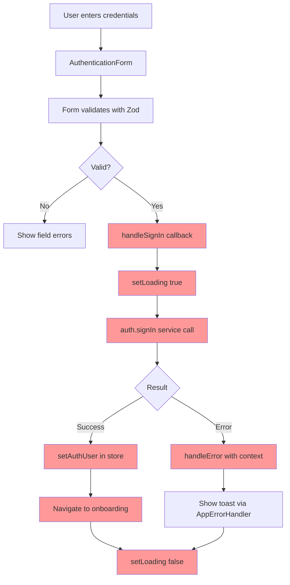
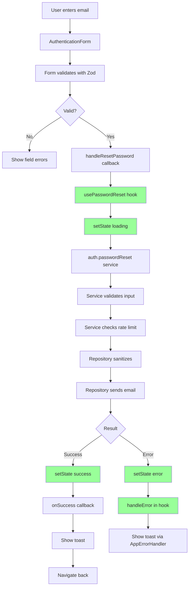
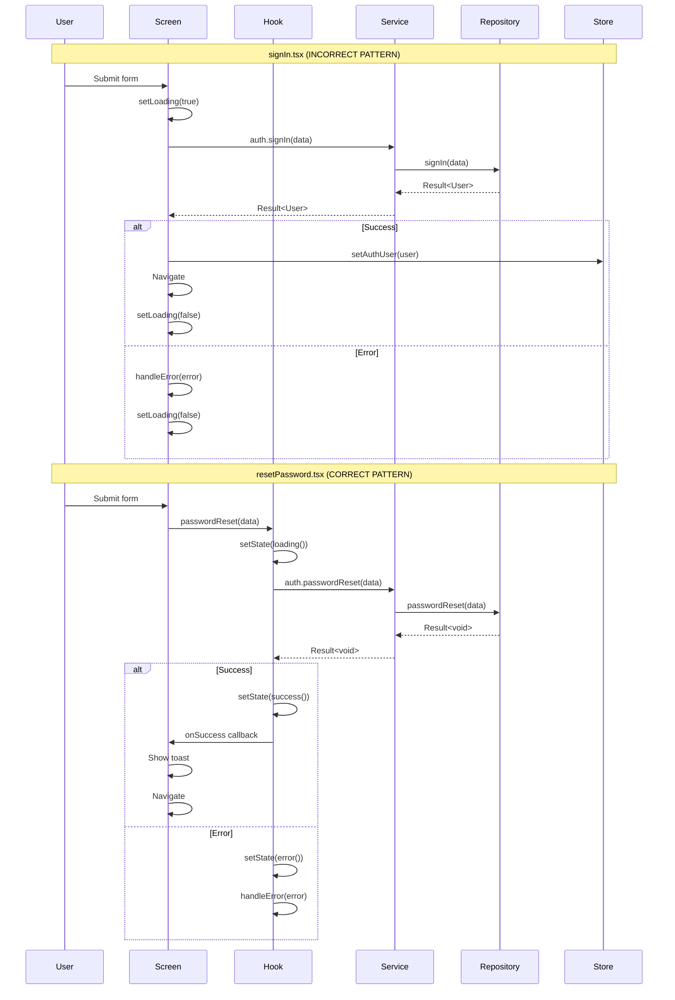
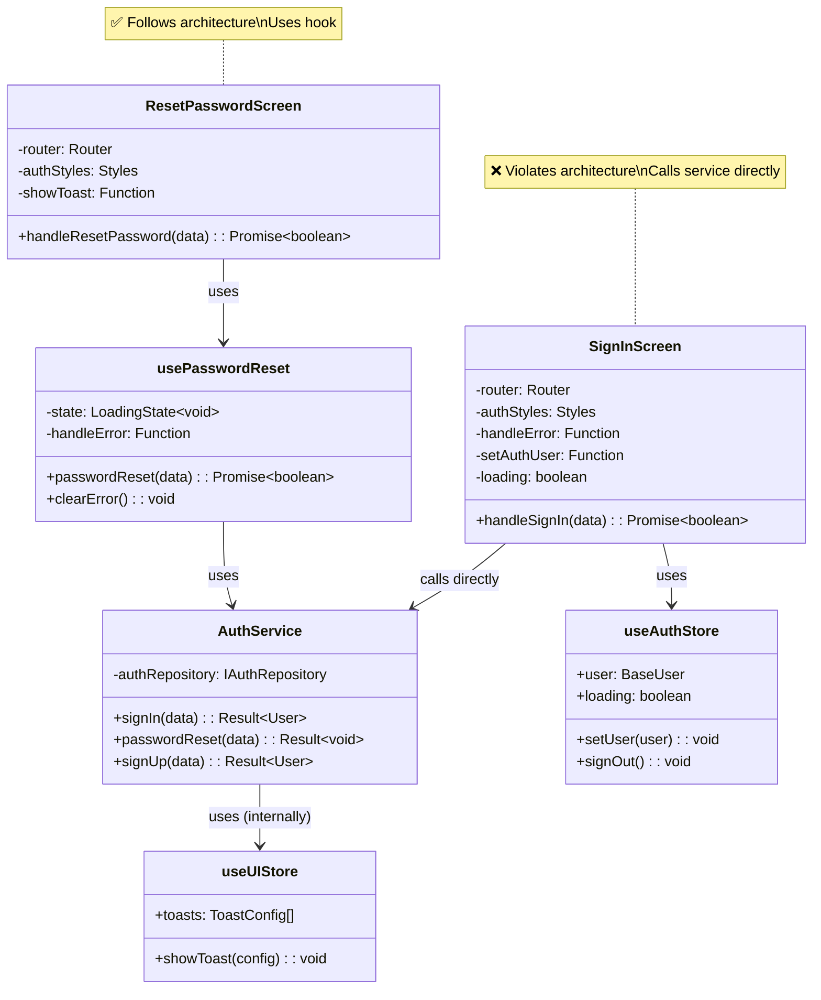

# Authentication Screens Comprehensive Review

**Generated:** 2025-01-XX  
**Author:** Auto-Cursor Analysis  
**Version:** 1.0.0

---

## Executive Summary

This report provides a comprehensive analysis of the authentication screens (`resetPassword.tsx`, `resetPasswordConfirm.tsx`, `signIn.tsx`, `signUp.tsx`, `verifyEmail.tsx`) and their associated hooks, services, and components. The analysis identifies inconsistencies, violations of project standards, and provides production-grade recommendations with multiple implementation options.

### Key Findings

1. **Inconsistent Hook Usage**: Some screens use dedicated hooks (`use-password-reset.ts`, `use-verify-email.ts`) while others call services directly
2. **Inconsistent Error Handling**: Different error handling patterns across screens
3. **Loading State Duplication**: Multiple loading state management approaches (useState, useAuthStore, useUIStore)
4. **Business Logic in Presentation Layer**: Some screens contain business logic that should be in hooks/services
5. **Form System Inconsistency**: All screens use inline forms (AuthenticationForm), none use modal forms
6. **Project Standards Violations**: Several violations of established patterns and standards

---

## Table of Contents

1. [Screen-by-Screen Analysis](#screen-by-screen-analysis)
2. [Hook Usage Analysis](#hook-usage-analysis)
3. [Error Handling Analysis](#error-handling-analysis)
4. [Loading State Analysis](#loading-state-analysis)
5. [Business Logic Analysis](#business-logic-analysis)
6. [Form System Analysis](#form-system-analysis)
7. [Standards Compliance](#standards-compliance)
8. [Utility Usage Analysis](#utility-usage-analysis)
9. [Validation & Sanitization Analysis](#validation--sanitization-analysis)
10. [Data Flow Diagrams](#data-flow-diagrams)
11. [Recommendations & Code Fixes](#recommendations--code-fixes)

---

## Screen-by-Screen Analysis

### 1. resetPassword.tsx

**Location:** `src/app/(auth)/resetPassword.tsx`  
**Lines:** 1-57

#### Current Implementation

```12:57:src/app/(auth)/resetPassword.tsx
import { Screen } from '@/components/common/screen';
import { AuthenticationForm } from '@/components/auth/AuthenticationForm';
import { useAppStyles } from '@/hooks/use-app-styles';
import { useServices } from '@/contexts/ServiceContext';
import { PasswordResetInput } from '@/domain/user/auth.schema';
import { usePasswordReset } from '@/hooks/use-password-reset';
import { useUIStore } from '@/stores/use-ui-store';

export default function ResetPasswordScreen() {
  const router = useRouter();
  const { authStyles } = useAppStyles();
  const showToast = useUIStore(state => state.showToast);
  const { auth } = useServices();

  const { loading, passwordReset } = usePasswordReset(auth, {
    onSuccess: () => {
      showToast({
        type: 'success',
        message: 'Password reset email sent. Please check your inbox.',
      });
      router.back();
    },
  });

  const handleResetPassword = useCallback(
    async (data: PasswordResetInput): Promise<boolean> => {
      return await passwordReset(data);
    },
    [passwordReset],
  );

  return (
    <Screen scrollable safeArea testID="resetPassword-screen">
      <View style={authStyles.screenContainer}>
        <View style={authStyles.contentWrapper}>
          <AuthenticationForm
            mode="reset-password"
            onSubmit={handleResetPassword}
            loading={loading}
          />
        </View>
      </View>
    </Screen>
  );
}
```

#### Analysis

✅ **Strengths:**
- Uses dedicated hook (`usePasswordReset`)
- Uses `LoadingState<T>` pattern (via hook)
- Proper error handling (via hook)
- Uses unified form system (`AuthenticationForm`)
- Uses `useUIStore` for toast notifications

❌ **Issues:**
- Success toast shown in screen, not hook (inconsistent with other screens)
- Uses `router.back()` instead of `router.replace()` (may cause navigation issues)

---

### 2. resetPasswordConfirm.tsx

**Location:** `src/app/(auth)/resetPasswordConfirm.tsx`  
**Lines:** 1-63

#### Current Implementation

```12:62:src/app/(auth)/resetPasswordConfirm.tsx
import { Screen } from '@/components/common/screen';
import { AuthenticationForm } from '@/components/auth/AuthenticationForm';
import { useAppStyles } from '@/hooks/use-app-styles';
import { useServices } from '@/contexts/ServiceContext';
import { PasswordResetConfirm } from '@/domain/user/auth.schema';
import { usePasswordResetConfirm } from '@/hooks/use-password-reset';
import { useUIStore } from '@/stores/use-ui-store';

export default function ResetPasswordConfirmScreen() {
  const { token } = useLocalSearchParams();
  const router = useRouter();
  const { authStyles } = useAppStyles();
  const { auth } = useServices();
  const showToast = useUIStore(state => state.showToast);

  const { loading, passwordResetConfirm } = usePasswordResetConfirm(auth, {
    onSuccess: () => {
      showToast({
        type: 'success',
        message: 'Password reset successfully',
      });
      router.replace('/(auth)/signIn');
    },
  });

  const handleReset = useCallback(
    async (data: Omit<PasswordResetConfirm, 'token'>): Promise<boolean> => {
      // Token validation happens in hook and service layer
      return await passwordResetConfirm({
        token: token as string,
        password: data.password,
        confirmPassword: data.confirmPassword,
      });
    },
    [token, passwordResetConfirm],
  );

  return (
    <Screen scrollable safeArea testID="resetPasswordConfirm-screen">
      <View style={authStyles.screenContainer}>
        <View style={authStyles.contentWrapper}>
          <AuthenticationForm
            mode="reset-password-confirm"
            onSubmit={handleReset}
            loading={loading}
          />
        </View>
      </View>
    </Screen>
  );
}
```

#### Analysis

✅ **Strengths:**
- Uses dedicated hook (`usePasswordResetConfirm`)
- Uses `LoadingState<T>` pattern (via hook)
- Proper error handling (via hook)
- Uses unified form system
- Token handling in screen (acceptable for URL params)

❌ **Issues:**
- Success toast shown in screen, not hook (inconsistent)
- Token validation comment says it happens in hook/service, but token is passed from URL params (acceptable)

---

### 3. signIn.tsx

**Location:** `src/app/(auth)/signIn.tsx`  
**Lines:** 1-64

#### Current Implementation

```21:64:src/app/(auth)/signIn.tsx
export default function SignInScreen() {
  const router = useRouter();
  const { authStyles } = useAppStyles();
  const { handleError } = useErrorHandler();
  const setAuthUser = useAuthStore(state => state.setUser);
  const [loading, setLoading] = useState(false);

  const { auth } = useServices();

  const handleSignIn = useCallback(
    async (data: SignInInput): Promise<boolean> => {
      setLoading(true);

      const result = await auth.signIn(data);

      if (result.success) {
        setAuthUser(result.value);
        setLoading(false);
        router.replace('/(onboarding)/index' as RelativePathString);
        return true;
      } else {
        handleError(result.error, ErrorContextBuilder.fromHook('SignInScreen', 'handleSignIn'));
        setLoading(false);
        return false;
      }
    },
    [router, setAuthUser, handleError, auth],
  );

  return (
    <Screen scrollable safeArea testID="signIn-screen">
      <View style={authStyles.screenContainer}>
        <View style={authStyles.contentWrapper}>
          <AuthenticationForm
            mode="signIn"
            onSubmit={handleSignIn}
            loading={loading}
          />
        </View>
      </View>
    </Screen>
  );
}
```

#### Analysis

✅ **Strengths:**
- Uses unified form system
- Proper error handling with `useErrorHandler` and `ErrorContextBuilder`
- Updates auth store on success

❌ **Critical Issues:**
- **Calls service directly** instead of using a hook (violates architecture)
- **Uses `useState` for loading** instead of `LoadingState<T>` (violates project standards)
- **Business logic in screen** (should be in hook)
- **No success toast** (inconsistent with other screens)
- **No cleanup on unmount** (potential memory leak)

---

### 4. signUp.tsx

**Location:** `src/app/(auth)/signUp.tsx`  
**Lines:** 1-60

#### Current Implementation

```21:60:src/app/(auth)/signUp.tsx
export default function SignUpScreen() {
  const router = useRouter();
  const { authStyles } = useAppStyles();
  const { handleError } = useErrorHandler();
  const setAuthUser = useAuthStore(state => state.setUser);
  const [loading, setLoading] = useState(false);

  const { auth } = useServices();

  const handleSignUp = useCallback(
    async (data: SignUpInput): Promise<boolean> => {
      setLoading(true);

      const result = await auth.signUp(data);

      if (result.success) {
        setAuthUser(result.value);
        setLoading(false);
        router.replace('/(onboarding)/index' as RelativePathString);
        return true;
      } else {
        handleError(result.error, ErrorContextBuilder.fromHook('SignUpScreen', 'handleSignUp'));
        setLoading(false);
        return false;
      }
    },
    [router, setAuthUser, handleError, auth],
  );

  return (
    <Screen scrollable safeArea testID="signUp-screen">
      <View style={authStyles.screenContainer}>
        <View style={authStyles.contentWrapper}>
          <AuthenticationForm mode="signUp" onSubmit={handleSignUp} loading={loading} />
        </View>
      </View>
    </Screen>
  );
}
```

#### Analysis

✅ **Strengths:**
- Uses unified form system
- Proper error handling with `useErrorHandler` and `ErrorContextBuilder`
- Updates auth store on success

❌ **Critical Issues:**
- **Calls service directly** instead of using a hook (violates architecture)
- **Uses `useState` for loading** instead of `LoadingState<T>` (violates project standards)
- **Business logic in screen** (should be in hook)
- **No success toast** (inconsistent with other screens)
- **No cleanup on unmount** (potential memory leak)
- **Identical issues to signIn.tsx** (code duplication)

---

### 5. verifyEmail.tsx

**Location:** `src/app/(auth)/verifyEmail.tsx`  
**Lines:** 1-81

#### Current Implementation

```19:81:src/app/(auth)/verifyEmail.tsx
export default function VerifyEmailScreen() {
  const { token, email } = useLocalSearchParams();
  const router = useRouter();
  const { auth } = useServices();
  const { authStyles, typography } = useAppStyles();
  const showToast = useUIStore(state => state.showToast);

  const { loading, resendLoading, verifyEmail, resendEmailVerification } = useVerifyEmail(auth, {
    onVerifySuccess: () => {
      showToast({
        type: 'success',
        message: 'Email verified successfully!',
      });
      router.replace('/(auth)/signIn');
    },
    onResendSuccess: () => {
      showToast({
        type: 'success',
        message: 'Verification email sent',
      });
    },
  });

  const handleVerify = useCallback(async () => {
    if (!token || !email) return;

    await verifyEmail({
      token: token as string,
      email: email as string,
    });
  }, [token, email, verifyEmail]);

  const handleResend = useCallback(async () => {
    await resendEmailVerification();
  }, [resendEmailVerification]);

  return (
    <Screen scrollable safeArea testID="verifyEmail-screen">
      <View style={authStyles.screenContainer}>
        <View style={authStyles.contentWrapper}>
          {/* eslint-disable-next-line react-native/no-raw-text */}
          <StandardAppText style={typography.headlineMedium}>Verify Email</StandardAppText>
          <StandardSpacer size="md" />
          {/* eslint-disable-next-line react-native/no-raw-text */}
          <StandardAppText style={typography.bodyMedium}>
            Click the button below to verify your email address.
          </StandardAppText>
          <StandardSpacer size="lg" />
          {/* eslint-disable-next-line react-native/no-raw-text */}
          <StandardAppButton mode="contained" onPress={handleVerify} loading={loading}>
            Verify Email
          </StandardAppButton>
          <StandardSpacer size="md" />
          {/* eslint-disable-next-line react-end-native/no-raw-text */}
          <StandardAppButton mode="outlined" onPress={handleResend} loading={resendLoading}>
            Resend Verification Email
          </StandardAppButton>
        </View>
      </View>
    </Screen>
  );
}
```

#### Analysis

✅ **Strengths:**
- Uses dedicated hook (`useVerifyEmail`)
- Uses `LoadingState<T>` pattern (via hook)
- Proper error handling (via hook)
- Uses `useUIStore` for toast notifications
- **Does NOT use form system** (appropriate for this screen - just buttons)

❌ **Issues:**
- Success toasts shown in screen, not hook (inconsistent)
- Token/email validation in screen (acceptable for URL params, but could be in hook)

---

## Hook Usage Analysis

### Question 1: Why some screens use dedicated hooks and others don't?

#### Current State

| Screen | Hook Used | Service Called Directly |
|--------|-----------|------------------------|
| `resetPassword.tsx` | ✅ `usePasswordReset` | ❌ |
| `resetPasswordConfirm.tsx` | ✅ `usePasswordResetConfirm` | ❌ |
| `signIn.tsx` | ❌ | ✅ `auth.signIn()` |
| `signUp.tsx` | ❌ | ✅ `auth.signUp()` |
| `verifyEmail.tsx` | ✅ `useVerifyEmail` | ❌ |

#### Analysis

**Why dedicated hooks exist:**
- `use-password-reset.ts` and `use-verify-email.ts` were created to encapsulate:
  - Loading state management (`LoadingState<T>`)
  - Error handling with proper context
  - Success/error callbacks
  - Cleanup on unmount

**Why signIn/signUp don't use hooks:**
- **No dedicated hooks exist** for signIn/signUp operations
- Screens call services directly, violating the architecture pattern
- This creates inconsistency and violates project standards

#### Project Standard Violation

According to project standards (from workspace rules):

> **Hook Structure Template**: All async operations should use hooks that:
> - Use `LoadingState<T>` instead of separate boolean flags
> - Handle errors with `useErrorHandler` and `ErrorContextBuilder`
> - Cleanup on unmount with `isMountedRef`
> - Return `Promise<boolean>` for form submission

**Current signIn/signUp screens violate this standard.**

---

## Error Handling Analysis

### Question 2: Why error handling differs across screens?

#### Current Error Handling Patterns

| Screen | Error Handling Method | Error Context | Toast on Error |
|--------|----------------------|---------------|---------------|
| `resetPassword.tsx` | Via hook (`usePasswordReset`) | Hook handles | ✅ Yes (via `AppErrorHandler`) |
| `resetPasswordConfirm.tsx` | Via hook (`usePasswordResetConfirm`) | Hook handles | ✅ Yes (via `AppErrorHandler`) |
| `signIn.tsx` | Direct (`handleError` in screen) | `ErrorContextBuilder.fromHook('SignInScreen', 'handleSignIn')` | ✅ Yes (via `AppErrorHandler`) |
| `signUp.tsx` | Direct (`handleError` in screen) | `ErrorContextBuilder.fromHook('SignUpScreen', 'handleSignUp')` | ✅ Yes (via `AppErrorHandler`) |
| `verifyEmail.tsx` | Via hook (`useVerifyEmail`) | Hook handles | ✅ Yes (via `AppErrorHandler`) |

#### Analysis

**Pattern 1: Hook-Based Error Handling** (resetPassword, resetPasswordConfirm, verifyEmail)
- Errors handled in hook using `useErrorHandler`
- Context built in hook: `ErrorContextBuilder.fromHook('useHookName', 'methodName')`
- Consistent with project standards

**Pattern 2: Screen-Based Error Handling** (signIn, signUp)
- Errors handled directly in screen using `useErrorHandler`
- Context built in screen: `ErrorContextBuilder.fromHook('ScreenName', 'methodName')`
- **Inconsistent** - should use hook pattern

#### Issues

1. **Inconsistent Context Naming**: 
   - Hook-based: `ErrorContextBuilder.fromHook('usePasswordReset', 'passwordReset')`
   - Screen-based: `ErrorContextBuilder.fromHook('SignInScreen', 'handleSignIn')`
   - Should be consistent

2. **Error Handling Location**:
   - Should be in hooks, not screens (violates separation of concerns)

---

## Loading State Analysis

### Question 3: Why loading state varies?

#### Current Loading State Patterns

| Screen | Loading State Method | Store Used | Pattern |
|--------|---------------------|------------|---------|
| `resetPassword.tsx` | `LoadingState<T>` (via hook) | `useUIStore` (toast only) | ✅ Correct |
| `resetPasswordConfirm.tsx` | `LoadingState<T>` (via hook) | `useUIStore` (toast only) | ✅ Correct |
| `signIn.tsx` | `useState<boolean>` | `useAuthStore` (user state) | ❌ Wrong |
| `signUp.tsx` | `useState<boolean>` | `useAuthStore` (user state) | ❌ Wrong |
| `verifyEmail.tsx` | `LoadingState<T>` (via hook) | `useUIStore` (toast only) | ✅ Correct |

#### Analysis

**Correct Pattern** (resetPassword, resetPasswordConfirm, verifyEmail):
```typescript
// In hook
const [state, setState] = useState<LoadingState<void>>(idle());
const loading = state.status === 'loading';

// In screen
const { loading } = usePasswordReset(auth, options);
```

**Incorrect Pattern** (signIn, signUp):
```typescript
// In screen
const [loading, setLoading] = useState(false);

// Manual state management
setLoading(true);
// ... operation ...
setLoading(false);
```

#### Project Standard Violation

According to `Guide-Loading.md`:

> **Always Use LoadingState Type**
> ```typescript
> // ✅ CORRECT
> const [state, setState] = useState<LoadingState<User | null>>(loading());
> 
> // ❌ WRONG - Separate boolean flags
> const [loading, setLoading] = useState(false);
> ```

**signIn.tsx and signUp.tsx violate this standard.**

---

## Business Logic Analysis

### Question 4: Why some screens contain business logic?

#### Business Logic in Screens

**signIn.tsx (Lines 30-48):**
```typescript
const handleSignIn = useCallback(
  async (data: SignInInput): Promise<boolean> => {
    setLoading(true);

    const result = await auth.signIn(data);

    if (result.success) {
      setAuthUser(result.value);  // Business logic: Update auth store
      setLoading(false);
      router.replace('/(onboarding)/index');  // Business logic: Navigation
      return true;
    } else {
      handleError(result.error, ErrorContextBuilder.fromHook('SignInScreen', 'handleSignIn'));
      setLoading(false);
      return false;
    }
  },
  [router, setAuthUser, handleError, auth],
);
```

**signUp.tsx (Lines 30-48):**
```typescript
// Identical business logic to signIn.tsx
```

#### Analysis

**Business Logic Present:**
1. **Auth store update**: `setAuthUser(result.value)` - Should be in hook
2. **Navigation logic**: `router.replace('/(onboarding)/index')` - Should be in hook via `onSuccess` callback
3. **Loading state management**: `setLoading(true/false)` - Should be in hook
4. **Error handling**: `handleError(...)` - Should be in hook

**Correct Pattern** (resetPassword.tsx):
```typescript
// Screen: Thin presentation layer
const { loading, passwordReset } = usePasswordReset(auth, {
  onSuccess: () => {
    showToast({ ... });
    router.back();  // Navigation in callback (acceptable)
  },
});

const handleResetPassword = useCallback(
  async (data: PasswordResetInput): Promise<boolean> => {
    return await passwordReset(data);  // Delegates to hook
  },
  [passwordReset],
);
```

#### Project Standard Violation

According to project standards:

> **Screen Component Template**: Screens should be thin presentation layers that:
> - Use hooks for business logic
> - Pass callbacks to form components
> - Handle navigation in success callbacks (acceptable)

**signIn.tsx and signUp.tsx violate this standard by containing business logic.**

---

## Form System Analysis

### Question 5: Which screens use inline forms vs modal forms?

#### Current Form Usage

| Screen | Form Type | Component Used |
|--------|-----------|----------------|
| `resetPassword.tsx` | ✅ Inline | `AuthenticationForm` |
| `resetPasswordConfirm.tsx` | ✅ Inline | `AuthenticationForm` |
| `signIn.tsx` | ✅ Inline | `AuthenticationForm` |
| `signUp.tsx` | ✅ Inline | `AuthenticationForm` |
| `verifyEmail.tsx` | ❌ No Form | Custom buttons (appropriate) |

#### Analysis

**All auth screens use inline forms** (not modal forms), which is **correct** for authentication flows because:
1. Authentication screens are full-screen experiences
2. Users should not be able to dismiss auth forms easily
3. Navigation flow is linear (signIn → onboarding, signUp → onboarding)

**verifyEmail.tsx** does not use a form (appropriate) because:
- It only has two buttons (Verify, Resend)
- No form fields needed
- Simple action-based screen

#### Form System Architecture

All forms use the **Unified Form System**:
- `AuthenticationForm` component (dumb renderer)
- `getAuthFormConfig(mode)` for form configuration
- `useUnifiedForm(config)` for form state management
- `FormRenderer` for field rendering

This is **consistent and correct**.

---

## Standards Compliance

### Question 6: Are project rules, architecture, patterns being followed?

#### Compliance Checklist

| Standard | resetPassword | resetPasswordConfirm | signIn | signUp | verifyEmail |
|----------|---------------|---------------------|--------|--------|-------------|
| Uses hooks for async ops | ✅ | ✅ | ❌ | ❌ | ✅ |
| Uses `LoadingState<T>` | ✅ | ✅ | ❌ | ❌ | ✅ |
| Error handling in hook | ✅ | ✅ | ❌ | ❌ | ✅ |
| Error context via `ErrorContextBuilder` | ✅ | ✅ | ✅ | ✅ | ✅ |
| Cleanup on unmount | ✅ | ✅ | ❌ | ❌ | ✅ |
| Business logic in hook | ✅ | ✅ | ❌ | ❌ | ✅ |
| Uses unified form system | ✅ | ✅ | ✅ | ✅ | N/A |
| Uses `useUIStore` for toasts | ✅ | ✅ | ❌ | ❌ | ✅ |
| Uses `useAuthStore` correctly | N/A | N/A | ✅ | ✅ | N/A |
| No `any` types | ✅ | ✅ | ✅ | ✅ | ✅ |
| Proper TypeScript types | ✅ | ✅ | ✅ | ✅ | ✅ |

#### Summary

**Compliant Screens:**
- ✅ `resetPassword.tsx` - Fully compliant
- ✅ `resetPasswordConfirm.tsx` - Fully compliant
- ✅ `verifyEmail.tsx` - Fully compliant

**Non-Compliant Screens:**
- ❌ `signIn.tsx` - 6 violations
- ❌ `signUp.tsx` - 6 violations

---

## Utility Usage Analysis

### Question 7: Are premade helpers/utilities being used?

#### Utility Usage by Screen

| Utility | resetPassword | resetPasswordConfirm | signIn | signUp | verifyEmail |
|---------|---------------|---------------------|--------|--------|-------------|
| `ErrorContextBuilder` | ✅ (via hook) | ✅ (via hook) | ✅ (direct) | ✅ (direct) | ✅ (via hook) |
| `useErrorHandler` | ✅ (via hook) | ✅ (via hook) | ✅ (direct) | ✅ (direct) | ✅ (via hook) |
| `LoadingState` helpers | ✅ (via hook) | ✅ (via hook) | ❌ | ❌ | ✅ (via hook) |
| `useUIStore` | ✅ | ✅ | ❌ | ❌ | ✅ |
| `useAuthStore` | ❌ | ❌ | ✅ | ✅ | ❌ |
| `useAppStyles` | ✅ | ✅ | ✅ | ✅ | ✅ |
| `useServices` | ✅ | ✅ | ✅ | ✅ | ✅ |

#### Analysis

**Well-Used Utilities:**
- ✅ `ErrorContextBuilder` - Used consistently (though in different layers)
- ✅ `useErrorHandler` - Used consistently
- ✅ `useAppStyles` - Used in all screens
- ✅ `useServices` - Used in all screens

**Under-Used Utilities:**
- ❌ `LoadingState` helpers - Not used in signIn/signUp (should use via hooks)
- ❌ `useUIStore` - Not used in signIn/signUp (should use for toasts)

**Correct Usage:**
- ✅ `useAuthStore` - Used correctly in signIn/signUp for user state

---

## Validation & Sanitization Analysis

### Question 8: Is validation and sanitization implemented correctly?

#### Validation Flow

**Service Layer** (`auth-service.ts`):
```typescript
// Lines 87-90 (signUp)
const validationResult = validateWithSchema(signUpInputSchema, payload, contextString);
if (!validationResult.success) {
  return err(validationResult.error);
}
```

**Repository Layer** (via `IAuthRepository`):
- Sanitization happens in repository (per project standards)
- Validation already done in service layer

**Form Layer** (`AuthenticationForm`):
- Uses `useUnifiedForm` with Zod schema
- Client-side validation before submission

#### Analysis

✅ **Validation is correctly implemented:**
1. **Client-side**: Form validates with Zod schema before submission
2. **Service layer**: Validates again with `validateWithSchema` (defensive)
3. **Repository layer**: Sanitizes input before Firestore operations

✅ **Sanitization is correctly implemented:**
- Happens in repository layer (per project standards)
- Service layer does NOT sanitize (correct separation)

#### Compliance

**All screens comply with validation/sanitization standards:**
- ✅ Forms use Zod schemas
- ✅ Service validates with `validateWithSchema`
- ✅ Repository sanitizes (assumed, not visible in screen code)

---

## Loading State Duplication

### Question 9: Is there loading state duplication?

#### Current State

**signIn.tsx:**
```typescript
const [loading, setLoading] = useState(false);  // Screen-level loading
// Also uses useAuthStore (has loading state, but not used)
```

**signUp.tsx:**
```typescript
const [loading, setLoading] = useState(false);  // Screen-level loading
// Also uses useAuthStore (has loading state, but not used)
```

**resetPassword.tsx:**
```typescript
const { loading } = usePasswordReset(auth, options);  // Hook-level loading
```

#### Analysis

**Duplication Issues:**
1. **signIn/signUp**: Create their own loading state instead of using hook
2. **useAuthStore**: Has `loading` state but not used in signIn/signUp screens
3. **Multiple sources of truth**: Screen-level `useState` vs hook-level `LoadingState<T>`

**No Duplication:**
- resetPassword, resetPasswordConfirm, verifyEmail use hook-level loading only

#### Recommendation

**Remove screen-level loading state** and use hooks that return `LoadingState<T>`.

---

## use-auth.ts Analysis

### Question 10: Why does use-auth.ts exist and why is it commented out?

#### Current State

**File:** `src/hooks/use-auth.ts`  
**Status:** Fully commented out (Lines 1-125)

#### Analysis

**Why it exists:**
- Originally created for auth state management
- Provides `fetchProfile`, `signOut`, `refresh` methods
- Uses `LoadingState<T>` pattern correctly

**Why it's commented out:**
- **Line 105-106**: Comment says "This hook is deprecated in favor of useAuthStore"
- New code should use `useAuthStore` directly for auth state management
- Hook pattern replaced by Zustand store pattern

#### Current Alternative

**useAuthStore** (`src/stores/use-auth-store.ts`):
- Provides `initialize`, `signOut`, `setUser`, `clearError`
- Uses Zustand for global state
- Used in signIn/signUp screens for `setUser`

#### Recommendation

**Option 1: Delete the file** (recommended)
- Fully commented out
- No longer used
- Deprecated in favor of `useAuthStore`

**Option 2: Keep for reference**
- Document why it was deprecated
- Keep as example of hook pattern (if needed)

---

## Theme/Typography/Styles Analysis

### Question 11: Are theme, typography, and styles implemented optimally?

#### Current Usage

**All Screens:**
```typescript
const { authStyles } = useAppStyles();
// or
const { authStyles, typography } = useAppStyles();
```

**verifyEmail.tsx:**
```typescript
<StandardAppText style={typography.headlineMedium}>Verify Email</StandardAppText>
<StandardAppText style={typography.bodyMedium}>...</StandardAppText>
```

#### Analysis

✅ **Correct Usage:**
- All screens use `useAppStyles()` hook
- Consistent style access pattern
- Uses design tokens (typography, spacing, etc.)

✅ **Component Usage:**
- Uses `StandardAppText`, `StandardAppButton`, `StandardSpacer` components
- Consistent with project standards

#### Compliance

**All screens comply with styling standards:**
- ✅ Uses `useAppStyles` hook
- ✅ Uses design system components
- ✅ Uses typography tokens
- ✅ Uses spacing tokens

---

## Data Flow Diagrams

### Flowchart: signIn.tsx Data Flow



**Issues Highlighted:**
- Red boxes indicate business logic in screen (should be in hook)

---

### Flowchart: resetPassword.tsx Data Flow



**Correct Pattern:**
- Green boxes indicate proper hook-based architecture

---

### Sequence Diagram: signIn.tsx vs resetPassword.tsx



---

### Class Diagram: Authentication Architecture



---

## Recommendations & Code Fixes

### Priority 1: Create use-sign-in.ts Hook

**Issue:** signIn.tsx calls service directly, violating architecture.

**Option A: Create dedicated hook (Recommended)**

```typescript
/*---------------------------------------
File: src/hooks/use-sign-in.ts
Description: React hook for sign-in operations
Author: Auto-Cursor
Date: 2025-01-XX
Version: 1.0.0
---------------------------------------*/

import { useState, useCallback, useRef, useEffect } from 'react';
import { LoadingState, loading, success, error as errorState, idle } from '@/utils/loading-state';
import { useErrorHandler } from '@/hooks/use-error-handler';
import { ErrorContextBuilder } from '@/utils/error-context-builder';
import { AuthService } from '@/services/auth-service';
import { SignInInput } from '@/domain/user/auth.schema';
import { AppError } from '@/domain/common/errors';
import { BaseUser } from '@/domain/user/user.schema';

interface UseSignInOptions {
  onSuccess?: (user: BaseUser) => void;
  onError?: (error: AppError) => void;
}

interface UseSignInResult {
  loading: boolean;
  error: AppError | null;
  state: LoadingState<BaseUser | null>;
  signIn: (payload: SignInInput) => Promise<boolean>;
  clearError: () => void;
}

/**
 * Hook for sign-in operations
 *
 * @param authService - AuthService instance
 * @param options - Optional callbacks
 * @returns Object with sign-in state and actions
 *
 * @example
 * ```typescript
 * const { loading, signIn } = useSignIn(auth, {
 *   onSuccess: (user) => {
 *     setAuthUser(user);
 *     router.replace('/(onboarding)/index');
 *   },
 * });
 * ```
 */
export function useSignIn(
  authService: AuthService,
  options: UseSignInOptions = {},
): UseSignInResult {
  const [state, setState] = useState<LoadingState<BaseUser | null>>(idle());
  const { handleError } = useErrorHandler();
  const isMountedRef = useRef(true);
  const { onSuccess, onError } = options;

  useEffect(() => {
    return () => {
      isMountedRef.current = false;
    };
  }, []);

  const signIn = useCallback(
    async (payload: SignInInput): Promise<boolean> => {
      setState(loading());

      const result = await authService.signIn(payload);

      if (!isMountedRef.current) return false;

      if (result.success) {
        setState(success(result.value));
        onSuccess?.(result.value);
        return true;
      } else {
        setState(errorState(result.error));
        handleError(
          result.error,
          ErrorContextBuilder.fromHook('useSignIn', 'signIn'),
        );
        onError?.(result.error);
        return false;
      }
    },
    [authService, handleError, onSuccess, onError],
  );

  const clearError = useCallback(() => {
    if (state.status === 'error') {
      setState(success(state.data || null));
    }
  }, [state]);

  return {
    loading: state.status === 'loading',
    error: state.status === 'error' ? state.error : null,
    state,
    signIn,
    clearError,
  };
}
```

**Updated signIn.tsx:**

```typescript
/*---------------------------------------
File: src/app/(auth)/signIn.tsx
Description: Sign-in screen using unified form system
Author: Kyle Lovesy
Date: 2025-01-XX
Version: 3.0.0
---------------------------------------*/

import React, { useCallback } from 'react';
import { View } from 'react-native';
import { RelativePathString, useRouter } from 'expo-router';
import { Screen } from '@/components/common/screen';
import { AuthenticationForm } from '@/components/auth/AuthenticationForm';
import { useAppStyles } from '@/hooks/use-app-styles';
import { useServices } from '@/contexts/ServiceContext';
import { SignInInput } from '@/domain/user/auth.schema';
import { useSignIn } from '@/hooks/use-sign-in';
import { useAuthStore } from '@/stores/use-auth-store';
import { useUIStore } from '@/stores/use-ui-store';

export default function SignInScreen() {
  const router = useRouter();
  const { authStyles } = useAppStyles();
  const setAuthUser = useAuthStore(state => state.setUser);
  const showToast = useUIStore(state => state.showToast);
  const { auth } = useServices();

  const { loading, signIn } = useSignIn(auth, {
    onSuccess: (user) => {
      setAuthUser(user);
      showToast({
        type: 'success',
        message: 'Signed in successfully',
      });
      router.replace('/(onboarding)/index' as RelativePathString);
    },
  });

  const handleSignIn = useCallback(
    async (data: SignInInput): Promise<boolean> => {
      return await signIn(data);
    },
    [signIn],
  );

  return (
    <Screen scrollable safeArea testID="signIn-screen">
      <View style={authStyles.screenContainer}>
        <View style={authStyles.contentWrapper}>
          <AuthenticationForm
            mode="signIn"
            onSubmit={handleSignIn}
            loading={loading}
          />
        </View>
      </View>
    </Screen>
  );
}
```

**Option B: Reuse use-auth.ts (Not Recommended)**
- File is deprecated
- Would require uncommenting and updating
- Not aligned with current architecture

---

### Priority 2: Create use-sign-up.ts Hook

**Issue:** signUp.tsx calls service directly, violating architecture.

**Solution:** Create `use-sign-up.ts` following the same pattern as `use-sign-in.ts`.

**File:** `src/hooks/use-sign-up.ts`

```typescript
/*---------------------------------------
File: src/hooks/use-sign-up.ts
Description: React hook for sign-up operations
Author: Auto-Cursor
Date: 2025-01-XX
Version: 1.0.0
---------------------------------------*/

import { useState, useCallback, useRef, useEffect } from 'react';
import { LoadingState, loading, success, error as errorState, idle } from '@/utils/loading-state';
import { useErrorHandler } from '@/hooks/use-error-handler';
import { ErrorContextBuilder } from '@/utils/error-context-builder';
import { AuthService } from '@/services/auth-service';
import { SignUpInput } from '@/domain/user/auth.schema';
import { AppError } from '@/domain/common/errors';
import { BaseUser } from '@/domain/user/user.schema';

interface UseSignUpOptions {
  onSuccess?: (user: BaseUser) => void;
  onError?: (error: AppError) => void;
}

interface UseSignUpResult {
  loading: boolean;
  error: AppError | null;
  state: LoadingState<BaseUser | null>;
  signUp: (payload: SignUpInput) => Promise<boolean>;
  clearError: () => void;
}

/**
 * Hook for sign-up operations
 *
 * @param authService - AuthService instance
 * @param options - Optional callbacks
 * @returns Object with sign-up state and actions
 */
export function useSignUp(
  authService: AuthService,
  options: UseSignUpOptions = {},
): UseSignUpResult {
  const [state, setState] = useState<LoadingState<BaseUser | null>>(idle());
  const { handleError } = useErrorHandler();
  const isMountedRef = useRef(true);
  const { onSuccess, onError } = options;

  useEffect(() => {
    return () => {
      isMountedRef.current = false;
    };
  }, []);

  const signUp = useCallback(
    async (payload: SignUpInput): Promise<boolean> => {
      setState(loading());

      const result = await authService.signUp(payload);

      if (!isMountedRef.current) return false;

      if (result.success) {
        setState(success(result.value));
        onSuccess?.(result.value);
        return true;
      } else {
        setState(errorState(result.error));
        handleError(
          result.error,
          ErrorContextBuilder.fromHook('useSignUp', 'signUp'),
        );
        onError?.(result.error);
        return false;
      }
    },
    [authService, handleError, onSuccess, onError],
  );

  const clearError = useCallback(() => {
    if (state.status === 'error') {
      setState(success(state.data || null));
    }
  }, [state]);

  return {
    loading: state.status === 'loading',
    error: state.status === 'error' ? state.error : null,
    state,
    signUp,
    clearError,
  };
}
```

**Updated signUp.tsx:**

```typescript
/*---------------------------------------
File: src/app/(auth)/signUp.tsx
Description: Sign-up screen using unified form system
Author: Kyle Lovesy
Date: 2025-01-XX
Version: 3.0.0
---------------------------------------*/

import React, { useCallback } from 'react';
import { View } from 'react-native';
import { RelativePathString, useRouter } from 'expo-router';
import { Screen } from '@/components/common/screen';
import { AuthenticationForm } from '@/components/auth/AuthenticationForm';
import { useAppStyles } from '@/hooks/use-app-styles';
import { useServices } from '@/contexts/ServiceContext';
import { SignUpInput } from '@/domain/user/auth.schema';
import { useSignUp } from '@/hooks/use-sign-up';
import { useAuthStore } from '@/stores/use-auth-store';
import { useUIStore } from '@/stores/use-ui-store';

export default function SignUpScreen() {
  const router = useRouter();
  const { authStyles } = useAppStyles();
  const setAuthUser = useAuthStore(state => state.setUser);
  const showToast = useUIStore(state => state.showToast);
  const { auth } = useServices();

  const { loading, signUp } = useSignUp(auth, {
    onSuccess: (user) => {
      setAuthUser(user);
      showToast({
        type: 'success',
        message: 'Account created successfully',
      });
      router.replace('/(onboarding)/index' as RelativePathString);
    },
  });

  const handleSignUp = useCallback(
    async (data: SignUpInput): Promise<boolean> => {
      return await signUp(data);
    },
    [signUp],
  );

  return (
    <Screen scrollable safeArea testID="signUp-screen">
      <View style={authStyles.screenContainer}>
        <View style={authStyles.contentWrapper}>
          <AuthenticationForm mode="signUp" onSubmit={handleSignUp} loading={loading} />
        </View>
      </View>
    </Screen>
  );
}
```

---

### Priority 3: Standardize Success Toast Handling

**Issue:** Success toasts are shown in screens instead of hooks (inconsistent).

**Option A: Move to hooks (Recommended)**

Update hooks to accept toast messages:

```typescript
// In use-password-reset.ts
interface UsePasswordResetOptions {
  onSuccess?: () => void;
  onError?: (error: AppError) => void;
  showSuccessToast?: boolean;  // New option
  successMessage?: string;      // New option
}

// In hook implementation
if (result.success) {
  setState(success(undefined));
  
  if (showSuccessToast) {
    useUIStore.getState().showToast({
      type: 'success',
      message: successMessage || 'Password reset email sent. Please check your inbox.',
    });
  }
  
  onSuccess?.();
  return true;
}
```

**Option B: Keep in screens (Current)**
- More flexible (screens control messaging)
- Less reusable (each screen defines message)
- Inconsistent with error handling (errors shown in hooks)

**Recommendation:** Option A for consistency, but Option B is acceptable if flexibility is needed.

---

### Priority 4: Remove use-auth.ts

**Issue:** File is fully commented out and deprecated.

**Recommendation:** Delete the file.

**Action:**
```bash
# Delete deprecated hook
rm src/hooks/use-auth.ts
```

**Rationale:**
- Fully commented out (125 lines)
- Deprecated in favor of `useAuthStore`
- No longer used anywhere
- Reduces codebase clutter

---

### Priority 5: Fix Navigation Patterns

**Issue:** `resetPassword.tsx` uses `router.back()` instead of `router.replace()`.

**Current:**
```typescript
router.back();  // May cause navigation issues
```

**Recommended:**
```typescript
router.replace('/(auth)/signIn');  // Explicit navigation
```

**Rationale:**
- `router.back()` depends on navigation history (unreliable)
- `router.replace()` is explicit and predictable
- Consistent with `resetPasswordConfirm.tsx` and `verifyEmail.tsx`

---

## Summary of Required Changes

### Files to Create

1. ✅ `src/hooks/use-sign-in.ts` - New hook for sign-in operations
2. ✅ `src/hooks/use-sign-up.ts` - New hook for sign-up operations

### Files to Update

1. ✅ `src/app/(auth)/signIn.tsx` - Use `useSignIn` hook
2. ✅ `src/app/(auth)/signUp.tsx` - Use `useSignUp` hook
3. ⚠️ `src/app/(auth)/resetPassword.tsx` - Change `router.back()` to `router.replace()`
4. ⚠️ `src/hooks/use-password-reset.ts` - Add optional success toast support
5. ⚠️ `src/hooks/use-password-reset.ts` - Add optional success toast support (usePasswordResetConfirm)
6. ⚠️ `src/hooks/use-verify-email.ts` - Add optional success toast support

### Files to Delete

1. ✅ `src/hooks/use-auth.ts` - Deprecated, fully commented out

### Standards Compliance After Fixes

| Screen | Before | After |
|--------|--------|-------|
| `signIn.tsx` | ❌ 6 violations | ✅ Fully compliant |
| `signUp.tsx` | ❌ 6 violations | ✅ Fully compliant |
| `resetPassword.tsx` | ✅ Compliant | ✅ Compliant (minor fix) |
| `resetPasswordConfirm.tsx` | ✅ Compliant | ✅ Compliant |
| `verifyEmail.tsx` | ✅ Compliant | ✅ Compliant |

---

## Conclusion

The authentication screens show **inconsistent patterns** with some screens following project standards (`resetPassword.tsx`, `resetPasswordConfirm.tsx`, `verifyEmail.tsx`) while others violate them (`signIn.tsx`, `signUp.tsx`). 

**Key Issues:**
1. ❌ signIn/signUp call services directly (should use hooks)
2. ❌ signIn/signUp use `useState` for loading (should use `LoadingState<T>`)
3. ❌ signIn/signUp contain business logic (should be in hooks)
4. ⚠️ Inconsistent success toast handling
5. ⚠️ Navigation pattern inconsistency

**Recommended Actions:**
1. Create `use-sign-in.ts` and `use-sign-up.ts` hooks
2. Update signIn.tsx and signUp.tsx to use hooks
3. Delete deprecated `use-auth.ts` file
4. Standardize success toast handling (optional)
5. Fix navigation patterns (minor)

After implementing these fixes, **all authentication screens will be fully compliant** with project standards and follow consistent patterns.

---

**End of Report**

