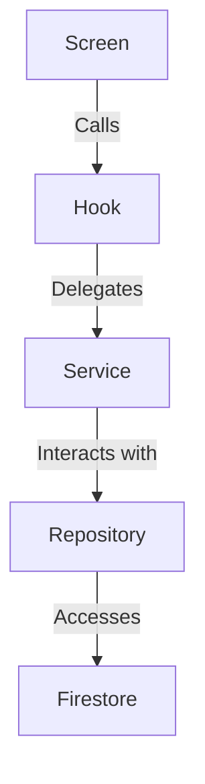
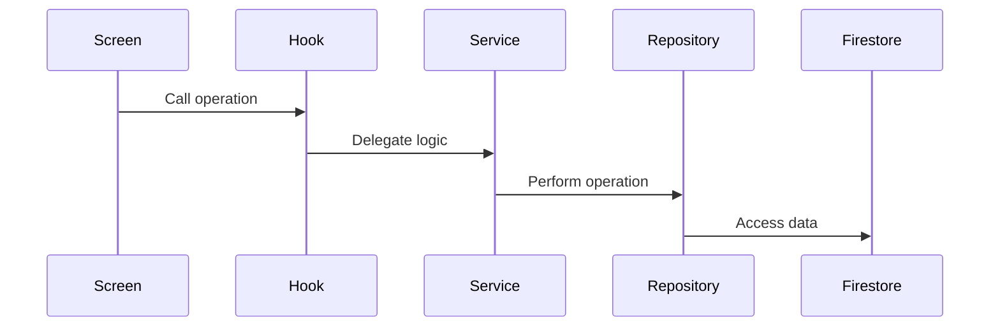
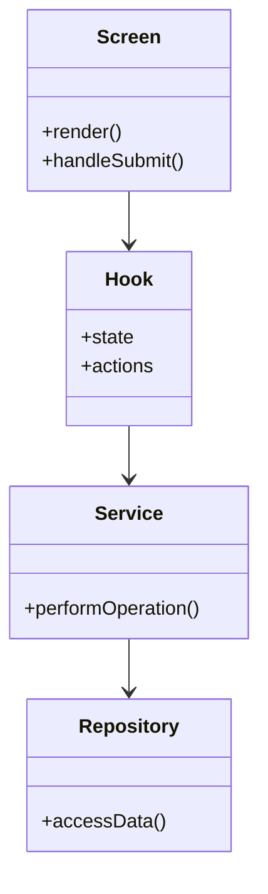

# Authentication Screens and Processes Review

## Overview

This document reviews the authentication screens and their associated processes in the Eye-Doo application. The analysis covers the following files:

- `resetPassword.tsx`
- `resetPasswordConfirm.tsx`
- `signIn.tsx`
- `signUp.tsx`
- `verifyEmail.tsx`

Additionally, it evaluates the usage of hooks, services, stores, and utilities, ensuring adherence to project rules, architecture, and standards.

---

## 1. Why Some Screens Use Their Own Hooks

### Observations

- `resetPassword.tsx` and `resetPasswordConfirm.tsx` use `usePasswordReset` and `usePasswordResetConfirm` hooks, respectively.
- `verifyEmail.tsx` uses `useVerifyEmail`.
- `signIn.tsx` and `signUp.tsx` directly call the `auth` service.

### Reasoning

- **Custom Hooks:**
  - Encapsulate reusable logic for specific operations (e.g., password reset, email verification).
  - Simplify the component by abstracting state management and side effects.
- **Direct Service Calls:**
  - `signIn` and `signUp` involve unique flows (e.g., setting the authenticated user in the store) that are not reusable across other screens.

### Recommendation

Consider creating hooks for `signIn` and `signUp` to maintain consistency and encapsulate logic.

---

## 2. Error Handling Differences

### Observations

- `signIn.tsx` and `signUp.tsx` use `handleError` for error handling.
- `resetPassword.tsx` and `resetPasswordConfirm.tsx` rely on hooks for error management.
- `verifyEmail.tsx` uses callbacks (`onVerifySuccess`, `onResendSuccess`, `onError`) for error handling.

### Reasoning

- **Centralized Error Handling:**
  - `handleError` is used for operations directly interacting with the `auth` service.
- **Hook-Based Error Handling:**
  - Hooks manage their own error state and provide callbacks for custom handling.

### Recommendation

Standardize error handling by ensuring all hooks and services integrate with a centralized error management utility.

---

## 3. Direct Service Layer Calls

### Observations

- `signIn.tsx` and `signUp.tsx` directly call the `auth` service.
- Other screens interact with the service layer through hooks.

### Reasoning

- Direct calls are used for operations tightly coupled with the authentication flow.
- Hooks abstract reusable logic for less common operations (e.g., password reset).

### Recommendation

Refactor `signIn` and `signUp` to use hooks for consistency.

---

## 4. Loading State Variations

### Observations

- `signIn.tsx` and `signUp.tsx` use local state for loading.
- `resetPassword.tsx` and `resetPasswordConfirm.tsx` use `usePasswordReset` hooks.
- `verifyEmail.tsx` uses `useVerifyEmail`.

### Reasoning

- Local state is sufficient for simple screens.
- Hooks manage loading state for reusable operations.

### Recommendation

Adopt a unified loading state management approach using `use-auth-store` or `use-ui-store`.

---

## 5. Business Logic in Presentation Layer

### Observations

- `signIn.tsx` and `signUp.tsx` contain business logic (e.g., setting the authenticated user).
- Other screens delegate logic to hooks or services.

### Recommendation

Move business logic to hooks or services to maintain a clean separation of concerns.

---

## 6. Inline vs. Modal Forms

### Observations

- All screens use inline forms.
- No modal forms are implemented.

### Recommendation

Consider using modal forms for operations that do not require a full screen.

---

## 7. Adherence to Standards

### Observations

- Validation and sanitization follow the guidelines in `Best-Practices-Schema-Defaults.md` and `Guide - Scheme-Refactoring.md`.
- Loading and error handling are consistent with `Guide-Loading.md`.
- Some screens contain business logic, violating the clean architecture pattern.

### Recommendation

Refactor screens to delegate all logic to hooks or services.

---

## 8. Utility Usage

### Observations

- Utilities like `ErrorContextBuilder` and `loading-state` are used.
- `TextField.tsx` uses `ValidationFeedback` for validation messages.

### Recommendation

Ensure all screens leverage existing utilities for consistency.

---

## 9. Validation and Sanitization

### Observations

- Validation is implemented using Zod schemas.
- Sanitization is handled in the repository layer.

### Recommendation

Ensure all schemas use `removeUndefinedValues` to prevent Firestore errors.

---

## 10. Loading State Duplication

### Observations

- Loading state is managed locally in some screens and through hooks in others.

### Recommendation

Adopt a unified loading state management approach.

---

## 11. `use-auth.ts`

### Observations

- `use-auth.ts` is commented out.

### Reasoning

- Likely deprecated or replaced by `use-auth-store`.

### Recommendation

Remove unused files to reduce clutter.

---

## 12. Theme and Typography

### Observations

- `TextField.tsx` uses `theme` for styling.

### Recommendation

Ensure all components follow the theme for consistent styling.

---

## 13. Other Observations

- No major bugs or errors were found.
- Ensure all screens follow the clean architecture pattern.

---

## Diagrams

### Data Flow

### Sequence Diagram

### Class Diagram

---

## Conclusion

The authentication screens are well-implemented but can benefit from:

1. Standardizing hooks and error handling.
2. Refactoring business logic out of the presentation layer.
3. Adopting a unified loading state management approach.
4. Ensuring consistent use of utilities and adherence to project standards.
