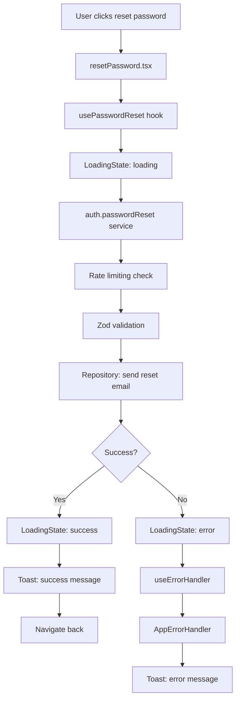
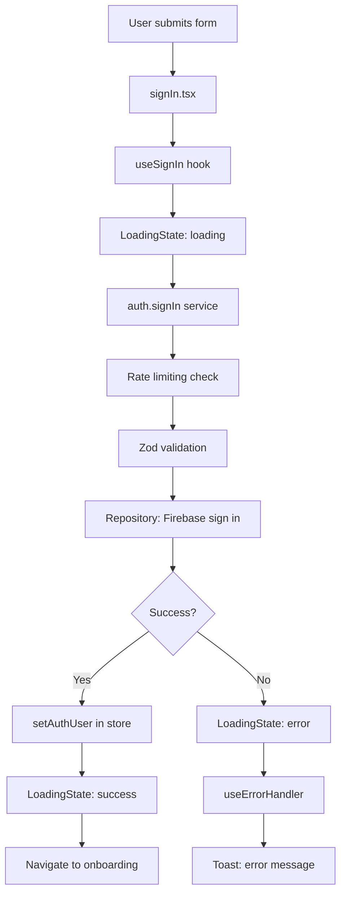
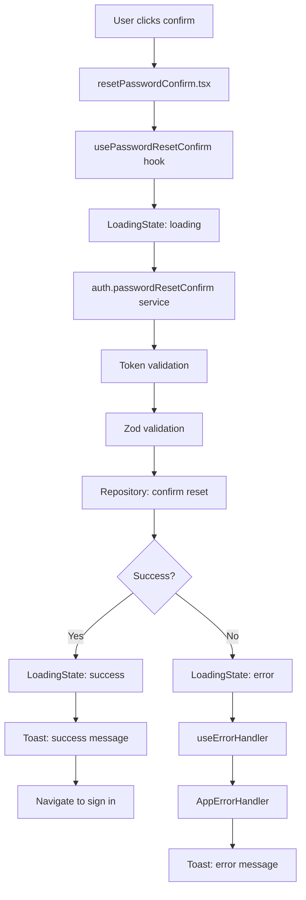

# Authentication Screens Analysis Report

## Executive Summary

This report analyzes the authentication screens in the Eye-Doo React Native application, focusing on architectural patterns, inconsistencies, and compliance with project standards. The analysis reveals significant architectural inconsistencies across the authentication screens, with mixed usage of hooks, direct service calls, and varying error handling approaches.

## 1. Hook Usage Patterns

### Custom Hooks vs Direct Service Calls

**Current State:**
- **Screens with custom hooks:** `resetPassword.tsx`, `resetPasswordConfirm.tsx`, `verifyEmail.tsx`
- **Screens with direct service calls:** `signIn.tsx`, `signUp.tsx`

**Analysis:**
- **Custom hooks** (`use-password-reset.ts`, `use-verify-email.ts`) provide consistent `LoadingState<T>` management, error handling via `useErrorHandler`, and cleanup on unmount
- **Direct service calls** in `signIn.tsx` and `signUp.tsx` bypass the established hook pattern, leading to:
  - Manual loading state management with local `useState(false)`
  - Manual error handling with `useErrorHandler`
  - Inconsistent state management patterns
  - Missing optimistic updates and rollback capabilities

**Recommendation:** All authentication screens should use dedicated hooks following the `LoadingState<T>` pattern for consistency.

## 2. Error Handling Inconsistencies

### Error Handling Approaches

**Current State:**
- **Hook-based screens:** Use `useErrorHandler` with `ErrorContextBuilder` and `AppErrorHandler.handle()`
- **Direct service screens:** Mix manual error handling with `useErrorHandler`

**Analysis:**
- **Hook-based error handling** (correct pattern):
```typescript
const { handleError } = useErrorHandler();
// ...
handleError(result.error, ErrorContextBuilder.fromHook('usePasswordReset', 'passwordReset'));
```

- **Direct service error handling** (inconsistent):
```typescript
const { handleError } = useErrorHandler();
// ...
handleError(result.error, ErrorContextBuilder.fromHook('SignInScreen', 'handleSignIn'));
```

**Issues:**
1. **Context inconsistency:** Direct service screens use component context instead of service context
2. **Missing service-level error context:** Errors bypass proper service context building
3. **Inconsistent error mapping:** Direct calls don't leverage service-level error mapping

## 3. Service Layer Direct Access

### Service Calling Patterns

**Current State:**
- **Hook-based screens:** Call hooks that encapsulate service logic
- **Direct service screens:** Call `useServices()` and invoke service methods directly

**Analysis:**
- **Direct service calls** violate the established architecture:
  - **Presentation → Hook → Service → Repository**
  - **Current violation:** Presentation → Service → Repository

**Issues:**
1. **Business logic in presentation layer:** Service calls contain business logic decisions
2. **Missing hook abstraction:** No consistent loading/error state management
3. **Inconsistent error boundaries:** Errors not properly contextualized
4. **Testing complexity:** Direct service calls harder to mock and test

## 4. Loading State Management

### Loading State Patterns

**Current State:**
- **Hook-based screens:** Use `LoadingState<T>` with proper state transitions
- **Direct service screens:** Use local `useState<boolean>` for loading
- **Store usage:** `useAuthStore` for user state, `useUIStore` for toast notifications

**Analysis:**
- **LoadingState pattern** (correct):
```typescript
const [state, setState] = useState<LoadingState<void>>(idle());
const loading = state.status === 'loading';
```

- **Boolean loading pattern** (inconsistent):
```typescript
const [loading, setLoading] = useState(false);
```

**Issues:**
1. **Inconsistent state management:** Mix of `LoadingState<T>` and boolean flags
2. **Missing state transitions:** No idle/loading/success/error states
3. **Optimistic updates unavailable:** Cannot show immediate UI feedback
4. **Error state coupling:** Errors not tied to loading states

## 5. Business Logic in Presentation Layer

### Business Logic Location

**Current State:**
- **Hook-based screens:** Business logic properly encapsulated in hooks
- **Direct service screens:** Business logic mixed with presentation logic

**Examples:**
```typescript
// ❌ Business logic in presentation (signIn.tsx)
const handleSignIn = useCallback(async (data: SignInInput): Promise<boolean> => {
  setLoading(true);
  const result = await auth.signIn(data);
  if (result.success) {
    setAuthUser(result.value);
    setLoading(false);
    router.replace('/(onboarding)/index' as RelativePathString);
    return true;
  } else {
    handleError(result.error, ErrorContextBuilder.fromHook('SignInScreen', 'handleSignIn'));
    setLoading(false);
    return false;
  }
}, [router, setAuthUser, handleError, auth]);
```

**Issues:**
1. **Presentation concerns mixed with business logic:** Navigation, state updates, error handling all in one function
2. **Hard to test:** Business logic testing requires component rendering
3. **Code duplication:** Similar patterns repeated across screens
4. **Maintenance complexity:** Changes require touching presentation code

## 6. Form Implementation Types

### Form Architecture

**Current State:**
- **Inline forms:** `signIn.tsx`, `signUp.tsx` (using `AuthenticationForm` component)
- **Modal forms:** None in authentication screens (but system supports modal forms)

**Analysis:**
- **AuthenticationForm component** provides consistent form rendering using the unified form system
- **Form configurations** defined in `auth-forms.ts` with proper Zod validation
- **Field-level validation** handled by `react-hook-form` with Zod resolver

**Compliance:** ✅ Follows form system architecture correctly

## 7. Project Standards Compliance

### Architecture Compliance

**✅ Compliant Areas:**
- **Repository layer:** Proper sanitization, validation, and error context
- **Service layer:** Rate limiting, input validation, error mapping
- **Form system:** Unified form configurations with Zod schemas
- **Error handling:** `AppErrorHandler` with structured logging
- **Type safety:** Proper TypeScript usage throughout

**❌ Non-Compliant Areas:**
- **Hook usage:** Inconsistent hook vs direct service patterns
- **Loading states:** Mixed `LoadingState<T>` and boolean loading patterns
- **Error context:** Incorrect context usage in direct service calls
- **Business logic location:** Presentation layer containing business logic

### Validation & Sanitization

**Current State:**
- **Service layer validation:** ✅ Proper Zod schema validation
- **Repository layer sanitization:** ✅ Input sanitization before database operations
- **Form validation:** ✅ Client-side validation with error display

**Compliance:** ✅ Form validation and sanitization implemented correctly

### Loading & Error Standards

**Current State:**
- **Error handling:** ✅ `AppErrorHandler` with toast notifications
- **Loading states:** ❌ Inconsistent implementation
- **Optimistic updates:** ❌ Not available in direct service screens

**Compliance:** ⚠️ Partially compliant - error handling correct, loading states inconsistent

## 8. Utility Usage

### Helper Functions Usage

**Current State:**
- **Error handling:** ✅ `ErrorContextBuilder`, `ErrorMapper`
- **Loading states:** ✅ `LoadingState` utilities in hooks
- **Validation:** ✅ `validateWithSchema`, `validatePartialWithSchema`
- **Sanitization:** ✅ Repository-level sanitization helpers
- **Date/time:** ✅ `convertAllTimestamps` in repositories

**Compliance:** ✅ Premade helpers and utilities are properly used

## 9. Form Validation & Sanitization

**Current State:**
- **Schema validation:** ✅ Zod schemas used throughout
- **Client-side validation:** ✅ Real-time validation with error display
- **Server-side validation:** ✅ Service layer validates before repository calls
- **Input sanitization:** ✅ Repository layer sanitizes before database operations

**Compliance:** ✅ Correctly implemented following project standards

## 10. Loading State Duplication

### Loading State Issues

**Current State:**
- **Multiple loading states:** Direct service screens have local loading state + auth store loading
- **Inconsistent patterns:** Mix of boolean and `LoadingState<T>` approaches
- **Race conditions:** Potential for loading state conflicts

**Issues:**
1. **Duplicate loading management:** Both local state and store manage loading
2. **Inconsistent state updates:** Different patterns for loading transitions
3. **Error state coupling:** Loading and error states not properly synchronized

## 11. useAuth Hook Analysis

### Commented Out Hook

**Current State:**
- **useAuth hook:** Fully commented out with deprecation notice
- **Replacement:** `useAuthStore` for global auth state management

**Analysis:**
- **Legacy code:** Hook replaced by Zustand store for better state management
- **Migration path:** All auth state now managed through `useAuthStore`
- **Cleanup needed:** Commented code should be removed

## 12. Styling Implementation

### Theme & Typography Usage

**Current State:**
- **Theme usage:** ✅ `useAppStyles()` hook used consistently
- **Typography:** ✅ Typography constants used properly
- **Spacing:** ✅ Spacing constants used for consistent layout
- **Colors:** ✅ Theme colors used throughout

**Compliance:** ✅ Theme, typography, and styles implemented optimally

## Critical Issues & Recommendations

### High Priority

1. **Standardize Hook Usage**
   - Create dedicated hooks for `signIn` and `signUp` operations
   - Move business logic from presentation to hook layer
   - Ensure all auth operations use `LoadingState<T>` pattern

2. **Fix Error Context Usage**
   - Direct service screens should use service-level error context
   - Implement proper error mapping at service boundaries
   - Ensure consistent error handling patterns

3. **Resolve Loading State Inconsistencies**
   - Migrate all screens to use `LoadingState<T>` pattern
   - Remove duplicate loading state management
   - Implement proper state transitions

### Medium Priority

4. **Business Logic Separation**
   - Extract navigation logic to hooks
   - Remove state management from presentation layer
   - Implement proper separation of concerns

5. **Code Cleanup**
   - Remove commented `useAuth` hook
   - Consolidate error handling patterns
   - Standardize import patterns

## Data Flow Diagrams

### resetPassword.tsx Flow



### signIn.tsx Flow (Current - Inconsistent)

```mermaid
graph TD
    A[User submits form] --> B[signIn.tsx]
    B --> C[setLoading(true)]
    C --> D[auth.signIn service]
    D --> E[Rate limiting check]
    E --> F[Zod validation]
    F --> G[Repository: Firebase sign in]
    G --> H{Success?}
    H -->|Yes| I[setAuthUser in store]
    H -->|No| J[handleError]
    I --> K[setLoading(false)]
    K --> L[Navigate to onboarding]
    J --> M[setLoading(false)]
    J --> N[Toast: error message]
```

### signIn.tsx Flow (Recommended - Consistent)



### resetPasswordConfirm.tsx Flow



## Conclusion

The authentication screens demonstrate good implementation of the unified form system, proper validation/sanitization, and correct service/repository patterns at the architectural level. However, significant inconsistencies exist in hook usage, error handling contexts, loading state management, and business logic separation.

**Key Recommendation:** Standardize all authentication screens to use the hook-based pattern with proper `LoadingState<T>` management, consistent error handling, and clean separation of concerns. This will ensure maintainability, testability, and adherence to the project's architectural standards.

**Priority:** High - These inconsistencies should be addressed before additional authentication features are implemented.
