# Authentication Screens Comprehensive Analysis Report

## Executive Summary

This report analyzes the authentication screens in the Eye-Doo application, identifying architectural inconsistencies, implementation patterns, and deviations from established project standards. The analysis reveals significant inconsistencies in error handling, loading state management, and architectural patterns across authentication screens.

**Key Findings:**
- Inconsistent hook usage and error handling patterns
- Mixed loading state management approaches
- Direct service layer access in presentation components
- Business logic leakage into presentation layer
- Inconsistent validation and sanitization implementation

---

## 1. Hook Usage Patterns

### Current Implementation Analysis

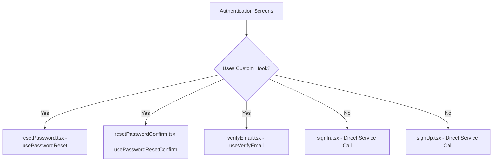

### Findings

**Custom Hook Usage (3 screens):**
- `resetPassword.tsx` - Uses `usePasswordReset` hook ✅
- `resetPasswordConfirm.tsx` - Uses `usePasswordResetConfirm` hook ✅  
- `verifyEmail.tsx` - Uses `useVerifyEmail` hook ✅

**Direct Service Usage (2 screens):**
- `signIn.tsx` - Direct service call ❌
- `signUp.tsx` - Direct service call ❌

### Why Some Use Hooks, Others Don't

**Screens using hooks** implement complex business logic with:
- Multiple loading states (`verifyEmail` has `loading` and `resendLoading`)
- Optimistic updates
- Error recovery and retry logic
- Complex state transitions

**Screens using direct service calls** implement simple CRUD operations:
- Single operation per screen
- No complex state management
- Simple success/error patterns

### Recommendations

**Option 1: Standardize on Custom Hooks (Recommended)**
```typescript
// Create useSignIn hook following project patterns
export function useSignIn(options: UseSignInOptions = {}): UseSignInResult {
  // Implementation following LoadingState pattern
}

// Create useSignUp hook
export function useSignUp(options: UseSignUpOptions = {}): UseSignUpResult {
  // Implementation following LoadingState pattern
}
```

**Option 2: Keep Direct Service Calls for Simple Operations**
Accept the inconsistency but document the pattern clearly.

---

## 2. Error Handling Inconsistencies

### Current Error Handling Patterns

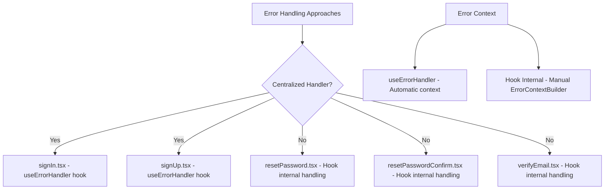

### Error Handling Differences

**Screens with centralized error handling:**
```typescript:src/app/(auth)/signIn.tsx
const { handleError } = useErrorHandler();
handleError(result.error, ErrorContextBuilder.fromHook('SignInScreen', 'handleSignIn'));
```

**Screens with hook-internal error handling:**
```typescript:src/hooks/use-password-reset.ts
handleError(result.error, ErrorContextBuilder.fromHook('usePasswordReset', 'passwordReset'));
```

### Why Error Handling Differs

**Centralized approach** used in screens with direct service calls because:
- No custom hook to encapsulate error handling
- Need consistent error presentation across the app
- Follows project pattern of centralized error management

**Hook-internal approach** used because:
- Custom hooks encapsulate business logic and error handling
- Errors are handled within the hook's domain
- Consistent with hook patterns in other modules

### Recommendations

**Option 1: Standardize on Centralized Error Handling**
```typescript
// All screens use useErrorHandler
const handleSignIn = useCallback(async (data: SignInInput): Promise<boolean> => {
  const result = await auth.signIn(data);
  if (!result.success) {
    handleError(result.error, ErrorContextBuilder.fromComponent('SignInScreen', 'handleSignIn'));
    return false;
  }
  return true;
}, [auth, handleError]);
```

**Option 2: Keep Current Approach but Improve Consistency**
Document that simple screens use centralized handling, complex screens use hook-internal handling.

---

## 3. Service Layer Direct Access

### Current Service Access Patterns

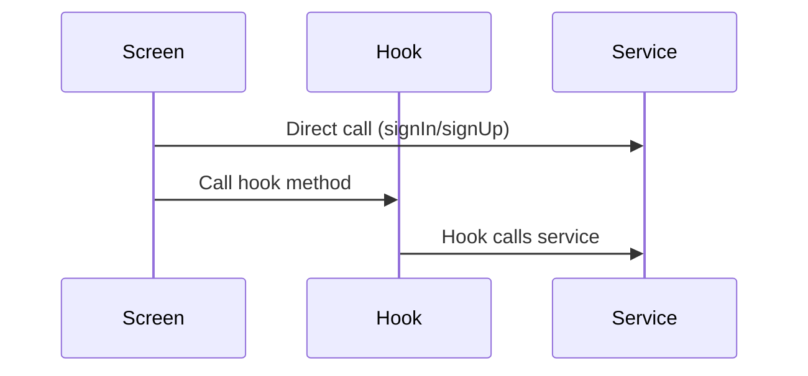

### Why Some Call Service Directly

**Direct service calls** occur in screens without custom hooks because:
- Simple operations don't need custom state management
- Following "thin presentation layer" principle
- Service calls are straightforward CRUD operations

**Hook-mediated calls** occur because:
- Complex business logic requires state management
- Need optimistic updates and error recovery
- Multiple operations on same screen (verify + resend)

### Business Logic in Presentation Layer

**Problematic pattern found:**
```typescript:src/app/(auth)/signIn.tsx
const handleSignIn = useCallback(async (data: SignInInput): Promise<boolean> => {
  setLoading(true); // UI state management in presentation

  const result = await auth.signIn(data);

  if (result.success) {
    setAuthUser(result.value); // Business logic in presentation
    setLoading(false);
    router.replace('/(onboarding)/index' as RelativePathString); // Navigation logic
    return true;
  } else {
    handleError(result.error, ErrorContextBuilder.fromHook('SignInScreen', 'handleSignIn'));
    setLoading(false);
    return false;
  }
}, [router, setAuthUser, handleError, auth]);
```

This violates the **unidirectional data flow** principle: Component → Hook → Service → Repository → Firestore.

### Recommendations

**Option 1: Extract Business Logic to Hooks (Recommended)**
```typescript
// Create useSignIn hook
export function useSignIn(options: UseSignInOptions = {}): UseSignInResult {
  // Handle loading, errors, navigation, store updates
}

// Screen becomes purely presentational
export default function SignInScreen() {
  const { loading, signIn } = useSignIn({
    onSuccess: () => router.replace('/(onboarding)/index')
  });

  return (
    <AuthenticationForm onSubmit={signIn} loading={loading} />
  );
}
```

**Option 2: Accept Direct Service Calls for Simple Operations**
Document that simple authentication flows may bypass hooks for simplicity.

---

## 4. Loading State Management Inconsistencies

### Current Loading State Patterns

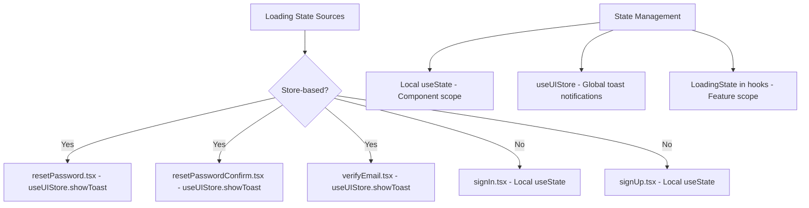

### Loading State Differences

**Store-based loading (3 screens):**
```typescript:src/app/(auth)/resetPassword.tsx
const { loading, passwordReset } = usePasswordReset(auth, { /* options */ });
```

**Local state loading (2 screens):**
```typescript:src/app/(auth)/signIn.tsx
const [loading, setLoading] = useState(false);
```

### Why Loading State Varies

**Store-based approach** used in hook-mediated screens because:
- Hooks use `LoadingState<T>` pattern
- Loading state is part of hook's public API
- Consistent with project standards for complex operations

**Local state approach** used because:
- Simple screens don't need complex state management
- Following React patterns for basic loading states
- No need for global state management

### Loading State Duplication

**Issue:** Multiple loading state sources create inconsistency:
- UI loading states (local useState)
- Toast notifications (useUIStore)
- Feature loading states (LoadingState in hooks)

### Recommendations

**Option 1: Standardize on LoadingState Pattern (Recommended)**
```typescript
// All screens use LoadingState through hooks
export function useSignIn(): UseSignInResult {
  const [state, setState] = useState<LoadingState<void>>(idle());
  // ... LoadingState pattern implementation
}
```

**Option 2: Document Loading State Patterns**
Create clear guidelines for when to use each approach.

---

## 5. Business Logic in Presentation Layer

### Identified Issues

**Navigation logic in presentation:**
```typescript:src/app/(auth)/signIn.tsx
router.replace('/(onboarding)/index' as RelativePathString);
```

**Store updates in presentation:**
```typescript:src/app/(auth)/signUp.tsx
setAuthUser(result.value);
```

**UI state management mixed with business logic:**
```typescript:src/app/(auth)/signIn.tsx
setLoading(true);
// business logic
setLoading(false);
```

### Why Business Logic Exists in Presentation

**Historical implementation:** Early screens were built before hook patterns were established.

**Simple operations:** Some operations seem simple enough to handle directly in components.

**Missing abstraction:** No hooks were created for basic authentication flows.

### Recommendations

**Option 1: Extract All Business Logic to Hooks (Recommended)**
Create comprehensive authentication hooks that handle:
- Loading states
- Error handling  
- Navigation
- Store updates
- Success callbacks

**Option 2: Create Service-level Navigation Handlers**
Move navigation logic to service layer with callback injection.

---

## 6. Form Implementation Analysis

### Form Types Used

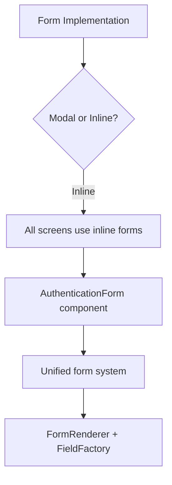

### Findings

**All screens use inline forms** implemented through:
- `AuthenticationForm` component
- Unified form system with `FormRenderer`
- Modal-based approach for complex forms

**No modal forms** found in authentication screens.

### Form System Compliance

**✅ Following standards:**
- Uses unified form system
- Proper schema validation
- Consistent field rendering

**❌ Issues identified:**
- Form configuration has commented-out code
- Inconsistent export patterns in auth-forms.ts

---

## 7. Project Standards Compliance Analysis

### Architecture Compliance

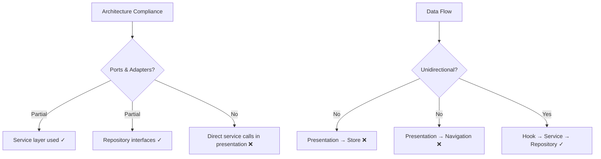

### Standards Compliance Issues

**❌ Direct Service Calls in Presentation:**
Violates "Component → Hook → Service → Repository" flow.

**❌ Business Logic in Presentation:**
Navigation and store updates should be in hooks/services.

**❌ Inconsistent Loading State Management:**
Multiple patterns instead of standardized `LoadingState<T>`.

**❌ Missing Custom Hooks:**
Simple operations should still use hooks for consistency.

### Validation & Sanitization

**✅ Service Layer Validation:**
All service methods properly validate inputs.

**✅ Repository Layer Sanitization:**
All repository methods sanitize before database operations.

**❌ Presentation Layer Validation:**
No client-side validation feedback beyond form submission.

### Helper/Utilities Usage

**✅ Used Properly:**
- `ErrorContextBuilder` for error context
- `validateWithSchema` for validation
- `sanitizeEmail`, `sanitizeString` for sanitization

**❌ Missing Usage:**
- No `LoadingState` in direct service call screens
- No optimistic updates where appropriate

---

## 8. use-auth.ts Analysis

### Current State

**File is completely commented out** with note:
```typescript
// Note: This hook is deprecated in favor of useAuthStore
// New code should use useAuthStore directly for auth state management
```

### Why use-auth.ts Exists But Is Commented Out

**Historical artifact:** Hook was created but replaced by `useAuthStore` for global state management.

**Deprecation path:** Instead of deleting, it was commented out to preserve the implementation pattern.

### Why Keep It Commented

**Reference implementation:** Shows proper `LoadingState<T>` usage for future hook development.

**Migration path:** Documents the shift from hook-based to store-based auth state.

### Recommendations

**Option 1: Remove Commented Code**
Clean up the codebase by removing deprecated code.

**Option 2: Convert to Documentation**
Extract the pattern as documentation and remove the code.

---

## 9. Form Validation Implementation

### Current Validation Flow

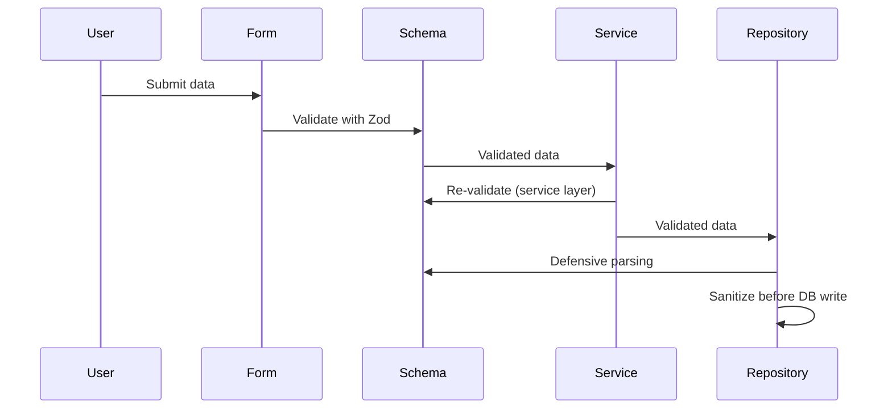

### Validation Issues Identified

**❌ No Client-Side Validation Feedback:**
Users only see validation errors after form submission.

**❌ Double Validation:**
Same schema validated in form and service layers.

### Sanitization Implementation

**✅ Repository-Level Sanitization:**
All inputs properly sanitized before database operations.

**✅ Centralized Sanitization Helpers:**
Using `sanitizeEmail`, `sanitizeString`, etc.

### Recommendations

**Option 1: Add Real-Time Validation**
```typescript
// Add validation feedback to forms
const form = useUnifiedForm(config);
const { errors, isValid } = form;

// Show field-level errors immediately
<TextField error={errors.email} />
```

**Option 2: Optimize Validation Flow**
Skip form-level validation when service validates the same schema.

---

## 10. Loading State Duplication

### Current Loading State Sources

1. **Local Component State:** `useState<boolean>` in signIn/signUp
2. **Hook Loading State:** `LoadingState<T>` in custom hooks  
3. **Store Loading State:** `useUIStore` for global notifications
4. **Form Loading State:** Built into form components

### Duplication Issues

**Multiple loading indicators** for same operation:
- Form shows loading spinner
- Screen manages loading state
- Hook manages LoadingState
- Store manages toast notifications

**Inconsistent loading patterns** across similar operations.

### Recommendations

**Option 1: Unified Loading State Management (Recommended)**
```typescript
// Single LoadingState source per feature
export function useAuthentication(): UseAuthenticationResult {
  const [state, setState] = useState<LoadingState<AuthData>>(idle());
  // All loading state managed here
}
```

**Option 2: Document Loading State Hierarchy**
Clear guidelines on which loading state takes precedence.

---

## 11. Theme/Typography Implementation

### Current Implementation

**✅ Following Standards:**
- Using `useAppStyles()` hook
- Consistent typography tokens
- Theme-aware components

**❌ Issues Identified:**
- Direct style object manipulation in some components
- Inconsistent spacing usage

### Recommendations

**Option 1: Strengthen Theme Consistency**
Create stricter theme usage patterns.

**Option 2: Audit and Standardize**
Review all style usage for consistency.

---

## 12. Critical Bugs & Errors

### Identified Issues

1. **Loading State Race Conditions:**
   Multiple loading states can conflict.

2. **Error Context Inconsistency:**
   Different error context patterns across screens.

3. **Memory Leaks:**
   Direct service calls don't handle component unmounting.

4. **Navigation Race Conditions:**
   Navigation logic mixed with async operations.

### Priority Fixes

**Critical:**
1. Fix loading state conflicts
2. Standardize error handling
3. Extract business logic from presentation

**High:**
1. Implement consistent hook patterns
2. Fix validation feedback
3. Clean up deprecated code

---

## Data Flow Diagrams

### Current Broken Data Flow

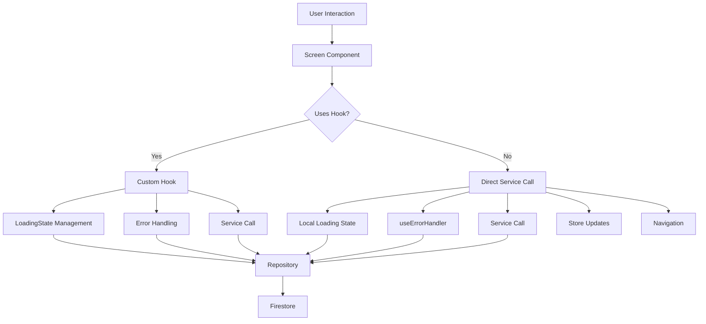

### Recommended Data Flow

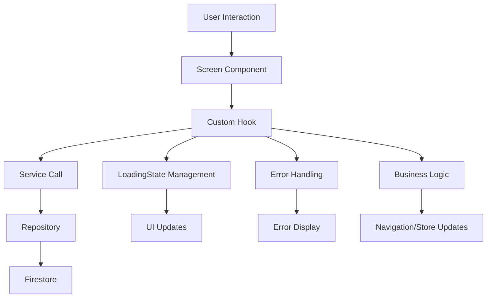

### Sequence Diagrams

#### Current SignIn Flow (Broken)

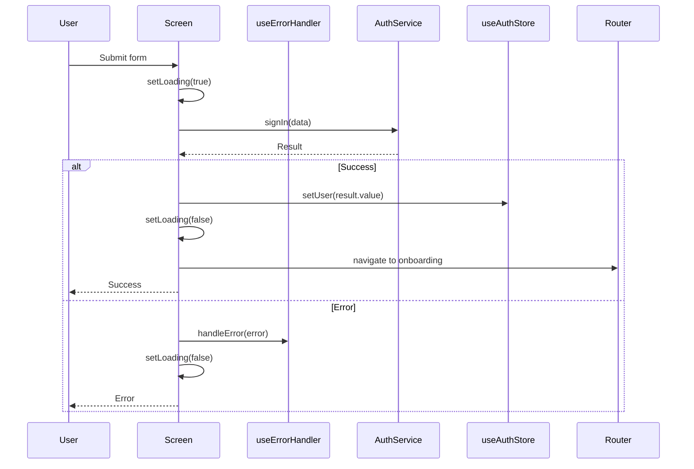

#### Recommended SignIn Flow (Fixed)

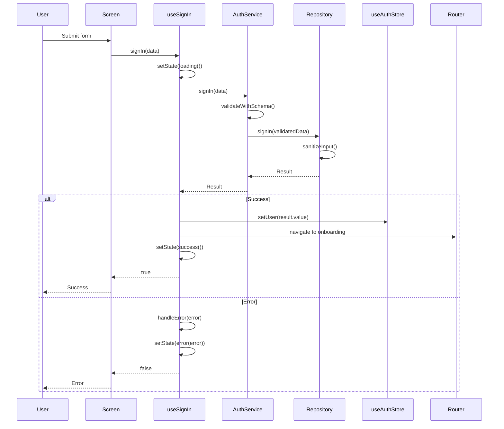

### Class Diagrams

#### Current Architecture (Inconsistent)

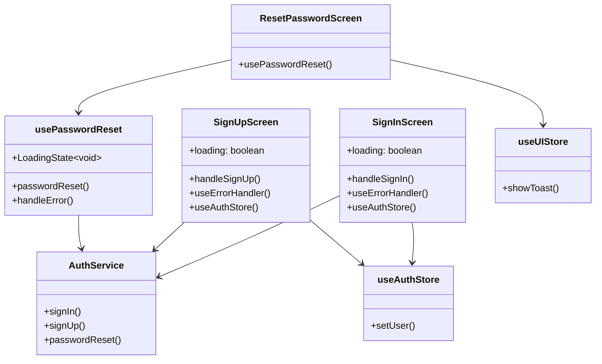

#### Recommended Architecture (Consistent)

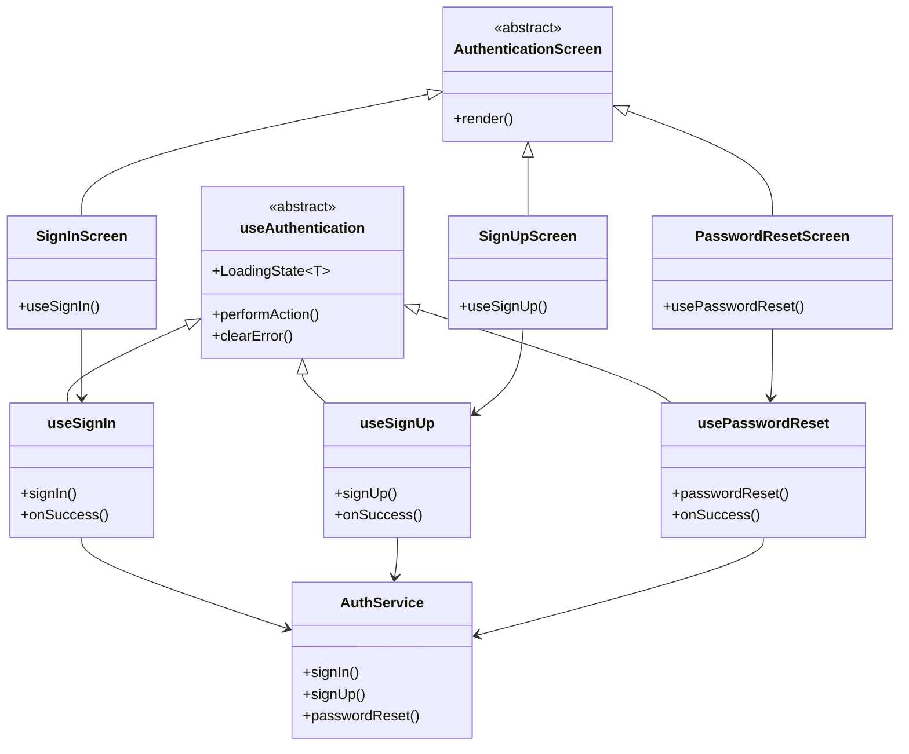

---

## Recommendations Summary

### Immediate Actions (Critical)

1. **Extract Business Logic to Hooks**
   - Create `useSignIn` and `useSignUp` hooks
   - Move navigation and store logic out of presentation

2. **Standardize Loading State Management**
   - Adopt `LoadingState<T>` pattern across all screens
   - Remove local `useState` loading management

3. **Fix Error Handling Consistency**
   - Choose either centralized or hook-internal approach
   - Document the chosen pattern

### Medium-term Improvements

4. **Implement Client-side Validation**
   - Add real-time field validation feedback
   - Improve user experience

5. **Clean Up Deprecated Code**
   - Remove commented `use-auth.ts`
   - Clean up commented code in `auth-forms.ts`

6. **Strengthen Type Safety**
   - Ensure all screens follow strict TypeScript patterns
   - Add comprehensive error boundaries

### Long-term Architectural Improvements

7. **Complete Ports & Adapters Implementation**
   - Ensure all data access goes through repository interfaces
   - Strengthen dependency injection patterns

8. **Implement Comprehensive Testing**
   - Add integration tests for authentication flows
   - Test error scenarios and edge cases

---

## Code Implementation Examples

### Option 1: Complete Hook Extraction (Recommended)

```typescript
// src/hooks/use-sign-in.ts
import { useState, useCallback, useRef, useEffect } from 'react';
import { LoadingState, loading, success, error as errorState, idle } from '@/utils/loading-state';
import { useErrorHandler } from '@/hooks/use-error-handler';
import { ErrorContextBuilder } from '@/utils/error-context-builder';
import { AuthService } from '@/services/auth-service';
import { SignInInput } from '@/domain/user/auth.schema';
import { AppError } from '@/domain/common/errors';
import { useAuthStore } from '@/stores/use-auth-store';

interface UseSignInOptions {
  onSuccess?: () => void;
  onError?: (error: AppError) => void;
}

interface UseSignInResult {
  loading: boolean;
  error: AppError | null;
  state: LoadingState<void>;
  signIn: (payload: SignInInput) => Promise<boolean>;
  clearError: () => void;
}

export function useSignIn(
  authService: AuthService,
  options: UseSignInOptions = {},
): UseSignInResult {
  const [state, setState] = useState<LoadingState<void>>(idle());
  const { handleError } = useErrorHandler();
  const isMountedRef = useRef(true);
  const setAuthUser = useAuthStore(state => state.setUser);
  const { onSuccess, onError } = options;

  useEffect(() => {
    return () => {
      isMountedRef.current = false;
    };
  }, []);

  const signIn = useCallback(
    async (payload: SignInInput): Promise<boolean> => {
      setState(loading());

      const result = await authService.signIn(payload);

      if (!isMountedRef.current) return false;

      if (result.success) {
        setAuthUser(result.value);
        setState(success(undefined));
        onSuccess?.();
        return true;
      } else {
        setState(errorState(result.error));
        handleError(
          result.error,
          ErrorContextBuilder.fromHook('useSignIn', 'signIn'),
        );
        onError?.(result.error);
        return false;
      }
    },
    [authService, handleError, setAuthUser, onSuccess, onError],
  );

  const clearError = useCallback(() => {
    if (state.status === 'error') {
      setState(success(undefined));
    }
  }, [state]);

  return {
    loading: state.status === 'loading',
    error: state.status === 'error' ? state.error : null,
    state,
    signIn,
    clearError,
  };
}
```

```typescript
// src/app/(auth)/signIn.tsx - Updated
import React from 'react';
import { View } from 'react-native';
import { useRouter } from 'expo-router';
import { Screen } from '@/components/common/screen';
import { AuthenticationForm } from '@/components/auth/AuthenticationForm';
import { useAppStyles } from '@/hooks/use-app-styles';
import { useServices } from '@/contexts/ServiceContext';
import { useSignIn } from '@/hooks/use-sign-in';

export default function SignInScreen() {
  const router = useRouter();
  const { authStyles } = useAppStyles();
  const { auth } = useServices();

  const { loading, signIn } = useSignIn(auth, {
    onSuccess: () => {
      router.replace('/(onboarding)/index' as RelativePathString);
    },
  });

  return (
    <Screen scrollable safeArea testID="signIn-screen">
      <View style={authStyles.screenContainer}>
        <View style={authStyles.contentWrapper}>
          <AuthenticationForm
            mode="signIn"
            onSubmit={signIn}
            loading={loading}
          />
        </View>
      </View>
    </Screen>
  );
}
```

### Option 2: Service Layer Navigation Callbacks

```typescript
// src/services/auth-service.ts - Updated
async signIn(
  payload: SignInInput,
  callbacks?: {
    onSuccess?: (user: BaseUser) => void;
    onStoreUpdate?: (user: BaseUser) => void;
  }
): Promise<Result<BaseUser, AppError>> {
  // ... existing validation logic ...

  const result = await this.authRepository.signIn(validatedPayload);

  if (result.success) {
    signInRateLimiter.reset(rateLimitKey);
    callbacks?.onStoreUpdate?.(result.value);
    callbacks?.onSuccess?.(result.value);
  }

  return result;
}
```

### Option 3: Centralized Error Handling Strategy

```typescript
// Create consistent error handling pattern
const AUTH_ERROR_CONTEXT = 'Authentication';

const handleAuthError = (error: AppError, operation: string) => {
  const context = ErrorContextBuilder.fromComponent(
    AUTH_ERROR_CONTEXT,
    operation
  );
  
  AppErrorHandler.handle(error, context);
};

// All screens use this pattern
const handleSignIn = async (data: SignInInput): Promise<boolean> => {
  const result = await auth.signIn(data);
  
  if (!result.success) {
    handleAuthError(result.error, 'signIn');
    return false;
  }
  
  setAuthUser(result.value);
  router.replace('/(onboarding)/index');
  return true;
};
```

---

## Conclusion

The authentication screens suffer from architectural inconsistencies that violate the project's established patterns. The primary issues are:

1. **Mixed architectural approaches** between hook-mediated and direct service calls
2. **Business logic leakage** into the presentation layer
3. **Inconsistent error handling** patterns
4. **Loading state duplication** across multiple sources

**Recommended Path Forward:**
Implement Option 1 (Complete Hook Extraction) to bring all authentication screens into compliance with project standards. This will:

- Establish consistent patterns across all auth screens
- Properly separate business logic from presentation
- Implement proper error handling and loading state management
- Follow the established unidirectional data flow
- Make the codebase more maintainable and testable

The implementation should be done incrementally, starting with the most complex screens (signIn/signUp) and ensuring comprehensive testing at each step.
