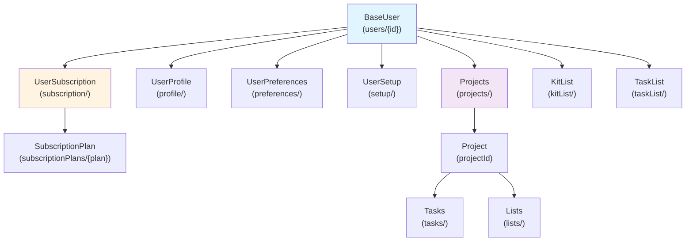

# Data Models - Complete Schema Documentation

## Table of Contents

1. [Overview](#overview)
2. [User Models](#user-models)
3. [Subscription Models](#subscription-models)
4. [Project & Task Models](#project--task-models)
5. [Preferences & Settings](#preferences--settings)
6. [Firestore Structure](#firestore-structure)
7. [Schema Validation](#schema-validation)
8. [Relationships](#relationships)

---

## Overview

All data models are defined in the `src/domain` directory with full TypeScript support and Zod validation schemas.

**Key Principles:**
- ✅ Type-safe with TypeScript
- ✅ Runtime validation with Zod
- ✅ Firestore timestamp conversion
- ✅ Atomic updates for consistency
- ✅ Server-side defaults with Cloud Functions

---

## User Models

### BaseUser (Core User Document)

**Firestore Path:** `users/{userId}`

```typescript
interface BaseUser {
  id: string;                      // Firebase Auth UID (primary key)
  email: string;                   // User email (unique, sanitized)
  displayName: string;             // User's display name (2-50 chars)
  phone: string | null;            // Optional phone number
  
  // Status flags
  isEmailVerified: boolean;        // Email verification status
  isActive: boolean;               // Account active status
  isBanned: boolean;               // Account banned status
  role: UserRole;                  // USER | ADMIN
  
  // Timestamps
  lastLoginAt: Date | null;        // Last successful sign-in
  createdAt: Date;                 // Account creation date (server)
  updatedAt: Date | null;          // Last update timestamp (server)
  deletedAt: Date | null;          // Soft delete timestamp
}
```

**Validation:**
- Email: Valid RFC format, max 254 chars, lowercase + trimmed
- DisplayName: 2-50 chars, trimmed
- Phone: Optional, E.164 format if provided
- Role: Enum (USER | ADMIN)

**Defaults (created by Cloud Function):**
```typescript
{
  isEmailVerified: false,
  isActive: true,
  isBanned: false,
  role: 'USER',
  lastLoginAt: null,
  deletedAt: null
}
```

---

## Subscription Models

### UserSubscription (Subscription Document)

**Firestore Path:** `users/{userId}/subscription/{subscriptionId}`

```typescript
interface UserSubscription {
  id: string;                           // Document ID
  userId: string;                       // Reference to user
  
  // Plan information
  plan: SubscriptionPlan;               // FREE | BASIC | PRO | STUDIO
  status: SubscriptionStatus;           // INACTIVE | ACTIVE | TRIALING | CANCELLED | PAST_DUE
  
  // Active status
  isActive: boolean;                    // Simplified active flag
  
  // Trial information
  isTrial: boolean;                     // Currently in trial period
  trialEndsAt: Date | null;             // Trial end date (if applicable)
  
  // Dates
  startDate: Date;                      // Subscription start
  endDate: Date | null;                 // Subscription end (if cancelled)
  
  // Billing
  billingCycle: 'MONTHLY' | 'ANNUAL';   // Billing frequency
  nextBillingDate: Date | null;         // Next charge date
  lastPaymentDate: Date | null;         // Last successful payment
  
  // Payment info
  transactionId: string | null;         // Stripe transaction ID
  autoRenew: boolean;                   // Auto-renewal enabled
  
  // Timestamps
  createdAt: Date;                      // Creation date (server)
  updatedAt: Date | null;               // Last update (server)
}
```

**Plan Types:**

| Plan | Price | Features | Status |
|------|-------|----------|--------|
| FREE | $0 | Limited features | Active immediately |
| BASIC | $9.99/mo | Standard features | Requires payment |
| PRO | $19.99/mo | Advanced features | Trial or paid |
| STUDIO | $49.99/mo | All features | Trial or paid |

**Status Lifecycle:**
```
INACTIVE → ACTIVE (payment)
         or TRIALING (trial) → ACTIVE (payment)
         or CANCELLED (user cancels)
         or PAST_DUE (failed payment)
```

---

## Project & Task Models

### Project

**Firestore Path:** `users/{userId}/projects/{projectId}`

```typescript
interface Project {
  id: string;                           // Document ID
  userId: string;                       // Owner ID
  
  // Basic info
  name: string;                         // Project name
  description: string | null;           // Project description
  status: 'ACTIVE' | 'ARCHIVED' | 'DELETED'; // Status
  
  // Configuration
  color: string;                        // Hex color code
  icon: string | null;                  // Icon identifier
  
  // Timestamps
  createdAt: Date;                      // Creation date
  updatedAt: Date | null;               // Last update
  deletedAt: Date | null;               // Soft delete
}
```

### Task (List)

**Firestore Path:** `users/{userId}/projects/{projectId}/tasks/{taskId}`

```typescript
interface Task {
  id: string;                           // Document ID
  projectId: string;                    // Parent project
  
  // Basic info
  name: string;                         // Task name
  description: string | null;           // Task description
  status: TaskStatus;                   // NEW | IN_PROGRESS | COMPLETED | ARCHIVED
  
  // Organization
  priority: 'LOW' | 'MEDIUM' | 'HIGH';  // Priority level
  order: number;                        // Display order
  
  // Timestamps
  dueDate: Date | null;                 // Due date
  createdAt: Date;                      // Creation date
  completedAt: Date | null;             // Completion date
}
```

---

## Preferences & Settings

### UserPreferences (User Preferences Sub-document)

**Firestore Path:** `users/{userId}/preferences/{prefId}` or embedded

```typescript
interface UserPreferences {
  // Notification settings
  notifications: boolean;               // Enable notifications
  emailNotifications: boolean;          // Email notifications
  pushNotifications: boolean;           // Push notifications
  
  // Display settings
  darkMode: boolean;                    // Dark theme enabled
  language: 'ENGLISH' | 'SPANISH' | 'FRENCH'; // Language
  timezone: string;                     // IANA timezone
  dateFormat: string;                   // Date format pattern
  timeFormat: '12h' | '24h';            // Time format
  
  // Privacy settings
  marketingConsent: boolean;            // Marketing emails
  analyticsConsent: boolean;            // Analytics tracking
  dataSharing: boolean;                 // Share data with partners
}
```

### UserSetup (Onboarding & Setup Flags)

**Firestore Path:** `users/{userId}/setup/{setupId}`

```typescript
interface UserSetup {
  // Onboarding flags
  showOnboarding: boolean;              // Show onboarding flow
  firstTimeSetup: boolean;              // First time setup done
  onboardingCompletedDate: Date | null; // Completion timestamp
  
  // Setup wizard
  setupWizardStep: number;              // Current step (0-5)
  setupWizardCompleted: boolean;        // Wizard completed
  
  // Feature flags
  skippedEmailVerification: boolean;    // User skipped verification
  hasSeenFreeWelcome: boolean;          // Seen free plan welcome
  hasSeenExpiryWarning: boolean;        // Seen expiry warning
  
  // Timestamps
  createdAt: Date;                      // Creation date
  updatedAt: Date | null;               // Last update
}
```

---

## Firestore Structure

### Collection Hierarchy

```
Firestore Root
├── users/
│   └── {userId}/
│       ├── [BaseUser Document]
│       ├── subscription/
│       │   └── {subscriptionId}/ [UserSubscription]
│       ├── profile/
│       │   └── {profileId}/ [UserProfile]
│       ├── preferences/
│       │   └── {prefId}/ [UserPreferences]
│       ├── setup/
│       │   └── {setupId}/ [UserSetup]
│       ├── customizations/
│       │   └── {customId}/ [UserCustomizations]
│       ├── projects/
│       │   └── {projectId}/ [Project]
│       │       ├── tasks/
│       │       │   └── {taskId}/ [Task]
│       │       └── lists/
│       │           └── {listId}/ [List]
│       ├── kitList/
│       │   └── {itemId}/ [KitItem]
│       └── taskList/
│           └── {itemId}/ [TaskItem]
│
├── subscriptionPlans/
│   ├── FREE/ [SubscriptionPlanData]
│   ├── BASIC/ [SubscriptionPlanData]
│   ├── PRO/ [SubscriptionPlanData]
│   └── STUDIO/ [SubscriptionPlanData]
│
└── payments/
    └── {paymentId}/ [PaymentRecord]
```

---

## Schema Validation

### Zod Schemas

**File:** `src/domain/user/user.schema.ts`

All schemas are defined with Zod and include:
- Type validation
- Field constraints (min/max length, patterns)
- Custom refinements
- Default values
- Nested object validation

**Example:**
```typescript
const baseUserSchema = z.object({
  id: z.string().uuid(),
  email: z.string().email().max(254),
  displayName: z.string().min(2).max(50),
  isEmailVerified: z.boolean().default(false),
  role: z.enum(['USER', 'ADMIN']).default('USER'),
  createdAt: z.date(),
  updatedAt: z.date().nullable(),
});
```

---

## Relationships

### User Relationships



### Data Dependencies

**Creation Order:**
1. BaseUser (Firebase Auth + Firestore)
2. UserSubscription (Cloud Function)
3. UserProfile (Cloud Function)
4. UserPreferences (Cloud Function)
5. UserSetup (Cloud Function)
6. UserCustomizations (Cloud Function)
7. Projects (User creates)
8. Tasks (User creates)

**Update Cascades:**
- Update User → Refresh auth store
- Update Subscription → Re-evaluate navigation rules
- Update Setup → Trigger onboarding/setup flows
- Update Project → Refresh project list

---

## Key Validation Rules

### Email
- Required, must be valid email format
- Max 254 characters (RFC 5321)
- Auto-sanitized: trimmed + lowercased
- Unique at Firebase Auth level

### Password (Sign-up only)
- Min 8 characters, max 128 characters
- Must include: uppercase, lowercase, number
- Special characters optional
- Never sanitized (preserved as-is)

### Display Name
- Min 2 characters, max 50 characters
- Auto-trimmed
- Special characters allowed

### Subscription Plan
- Must be enum: FREE | BASIC | PRO | STUDIO
- Immutable during subscription (can't change mid-cycle)
- Validated on selection and payment

### Timestamps
- Always server-generated (`serverTimestamp()`)
- Auto-converted from Firestore Timestamp
- UTC timezone
- Nullable for optional fields (null = not set)

---

**Last Updated:** June 22, 2026
**Sources:** allAuth.md, subscription.md, GLOBAL-FLOW-B.md
