# Global Flow Report: Complete Application Flow Analysis

## Table of Contents

1. [Overview](#overview)
2. [App Initialization Flow](#app-initialization-flow)
3. [Complete User Journey](#complete-user-journey)
4. [Authentication Flow](#authentication-flow)
5. [Registration Flow](#registration-flow)
6. [Email Verification Flow](#email-verification-flow)
7. [Onboarding Flow](#onboarding-flow)
8. [Setup Flow](#setup-flow)
9. [Project Creation Flow](#project-creation-flow)
10. [Navigation Guard System](#navigation-guard-system)
11. [State Management Flow](#state-management-flow)
12. [Data Flow Sequences](#data-flow-sequences)
13. [Component Hierarchy](#component-hierarchy)
14. [Critical Issues & Recommendations](#critical-issues--recommendations)

---

## Overview

This document provides a comprehensive breakdown of the Eye-Doo application's global flow, from app initialization through user registration, onboarding, setup, and project creation. The application follows a **ports & adapters architecture** with clear separation between:

- **Components**: UI layer (screens, forms)
- **Hooks**: React state management and business logic coordination
- **Services**: Business logic layer
- **Repositories**: Data access layer (Firestore adapters)
- **Stores**: Global state (Zustand)

### Key Architectural Principles

1. **Result Pattern**: All async operations return `Result<T, AppError>` (never throw)
2. **Unidirectional Data Flow**: Component → Hook → Service → Repository → Firestore
3. **Navigation Guards**: Component-level route protection in each layout
4. **Atomic State Updates**: Auth store updates are atomic to prevent UI tearing
5. **Error Context**: All errors include context via `ErrorContextBuilder`

---

## App Initialization Flow

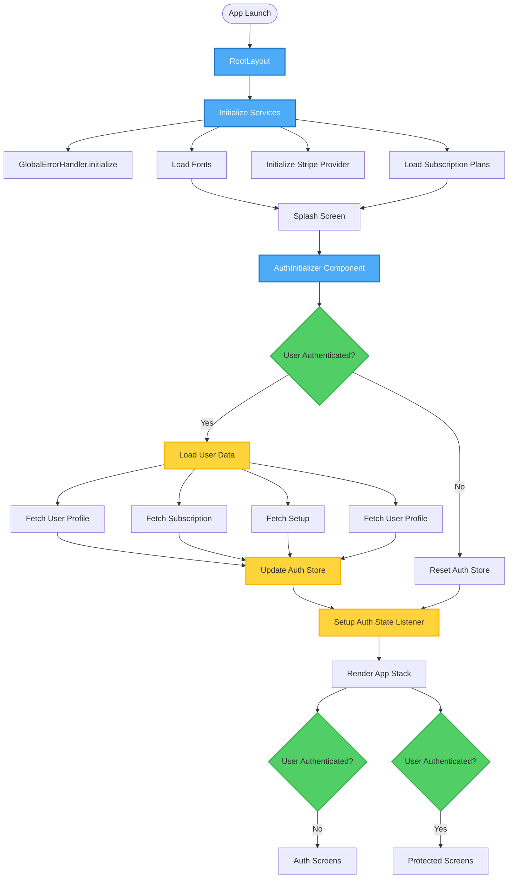
```mermaid
graph TB
    Start([App Launch]) --> RootLayout[RootLayout]

    RootLayout --> InitServices[Initialize Services]
    InitServices --> InitErrorHandler[GlobalErrorHandler.initialize]
    InitServices --> LoadFonts[Load Fonts]
    InitServices --> InitStripe[Initialize Stripe Provider]
    InitServices --> LoadPlans[Load Subscription Plans]

    LoadFonts --> SplashScreen[Splash Screen]
    LoadPlans --> SplashScreen

    SplashScreen --> AuthInit[AuthInitializer Component]

    AuthInit --> CheckAuth{User Authenticated?}

    CheckAuth -->|No| ResetStore[Reset Auth Store]
    CheckAuth -->|Yes| LoadUserData[Load User Data]

    LoadUserData --> FetchProfile[Fetch User Profile]
    LoadUserData --> FetchSubscription[Fetch Subscription]
    LoadUserData --> FetchSetup[Fetch Setup]
    LoadUserData --> FetchUserProfile[Fetch User Profile]

    FetchProfile --> UpdateStore[Update Auth Store]
    FetchSubscription --> UpdateStore
    FetchSetup --> UpdateStore
    FetchUserProfile --> UpdateStore

    UpdateStore --> AuthListener[Setup Auth State Listener]
    ResetStore --> AuthListener

    AuthListener --> RenderApp[Render App Stack]

    RenderApp --> AuthLayout{User Authenticated?}
    RenderApp --> ProtectedLayout{User Authenticated?}

    AuthLayout -->|No| AuthScreens[Auth Screens]
    ProtectedLayout -->|Yes| ProtectedScreens[Protected Screens]

    classDef initStyle fill:#4dabf7,stroke:#1971c2,stroke-width:2px,color:#fff
    classDef authStyle fill:#51cf66,stroke:#37b24d,stroke-width:2px
    classDef dataStyle fill:#ffd43b,stroke:#fab005,stroke-width:2px

    class RootLayout,InitServices,AuthInit initStyle
    class CheckAuth,AuthLayout,ProtectedLayout authStyle
    class LoadUserData,UpdateStore,AuthListener dataStyle
```

### Initialization Sequence

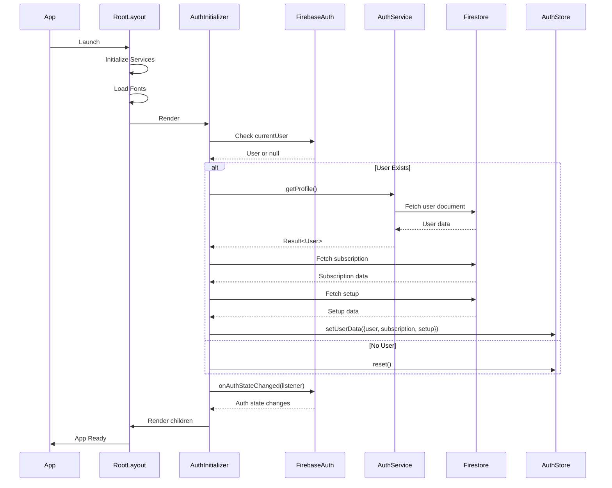
```mermaid
sequenceDiagram
    participant App
    participant RootLayout
    participant AuthInitializer
    participant FirebaseAuth
    participant AuthService
    participant Firestore
    participant AuthStore

    App->>RootLayout: Launch
    RootLayout->>RootLayout: Initialize Services
    RootLayout->>RootLayout: Load Fonts
    RootLayout->>AuthInitializer: Render

    AuthInitializer->>FirebaseAuth: Check currentUser
    FirebaseAuth-->>AuthInitializer: User or null

    alt User Exists
        AuthInitializer->>AuthService: getProfile()
        AuthService->>Firestore: Fetch user document
        Firestore-->>AuthService: User data
        AuthService-->>AuthInitializer: Result<User>

        AuthInitializer->>Firestore: Fetch subscription
        Firestore-->>AuthInitializer: Subscription data

        AuthInitializer->>Firestore: Fetch setup
        Firestore-->>AuthInitializer: Setup data

        AuthInitializer->>AuthStore: setUserData({user, subscription, setup})
    else No User
        AuthInitializer->>AuthStore: reset()
    end

    AuthInitializer->>FirebaseAuth: onAuthStateChanged(listener)
    FirebaseAuth-->>AuthInitializer: Auth state changes

    AuthInitializer->>RootLayout: Render children
    RootLayout->>App: App Ready
```

---

## Complete User Journey

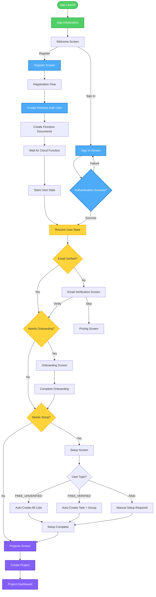
```mermaid
graph TB
    Start([App Launch]) --> Init[App Initialization]
    Init --> Welcome[Welcome Screen]

    Welcome -->|Register| Register[Register Screen]
    Welcome -->|Sign In| SignIn[Sign In Screen]

    Register --> RegisterFlow[Registration Flow]
    SignIn --> AuthCheck{Authentication Success?}

    RegisterFlow --> CreateUser[Create Firebase Auth User]
    CreateUser --> CreateDocs[Create Firestore Documents]
    CreateDocs --> WaitDocs[Wait for Cloud Function]
    WaitDocs --> StoreData[Store User Data]

    StoreData --> UserState[Resolve User State]
    AuthCheck -->|Success| UserState
    AuthCheck -->|Failure| SignIn

    UserState --> CheckEmail{Email Verified?}

    CheckEmail -->|No| EmailVerify[Email Verification Screen]
    CheckEmail -->|Yes| CheckOnboarding{Needs Onboarding?}

    EmailVerify -->|Skip| Pricing[Pricing Screen]
    EmailVerify -->|Verify| CheckOnboarding

    CheckOnboarding -->|Yes| Onboarding[Onboarding Screen]
    CheckOnboarding -->|No| CheckSetup{Needs Setup?}

    Onboarding --> CompleteOnboarding[Complete Onboarding]
    CompleteOnboarding --> CheckSetup

    CheckSetup -->|Yes| Setup[Setup Screen]
    CheckSetup -->|No| Projects[Projects Screen]

    Setup --> AutoSetup{User Type?}
    AutoSetup -->|FREE_UNVERIFIED| AutoCreateAll[Auto-Create All Lists]
    AutoSetup -->|FREE_VERIFIED| AutoCreatePartial[Auto-Create Task + Group]
    AutoSetup -->|PAID| ManualSetup[Manual Setup Required]

    AutoCreateAll --> SetupComplete[Setup Complete]
    AutoCreatePartial --> SetupComplete
    ManualSetup --> SetupComplete

    SetupComplete --> Projects

    Projects --> CreateProject[Create Project]
    CreateProject --> ProjectDashboard[Project Dashboard]

    classDef startStyle fill:#51cf66,stroke:#37b24d,stroke-width:3px,color:#fff
    classDef authStyle fill:#4dabf7,stroke:#1971c2,stroke-width:2px,color:#fff
    classDef flowStyle fill:#ffd43b,stroke:#fab005,stroke-width:2px
    classDef endStyle fill:#845ef7,stroke:#6741d9,stroke-width:2px,color:#fff

    class Start,Init startStyle
    class Register,SignIn,CreateUser,AuthCheck authStyle
    class UserState,CheckEmail,CheckOnboarding,CheckSetup flowStyle
    class Projects,CreateProject,ProjectDashboard endStyle
```

---

## Authentication Flow

### Sign In Flow

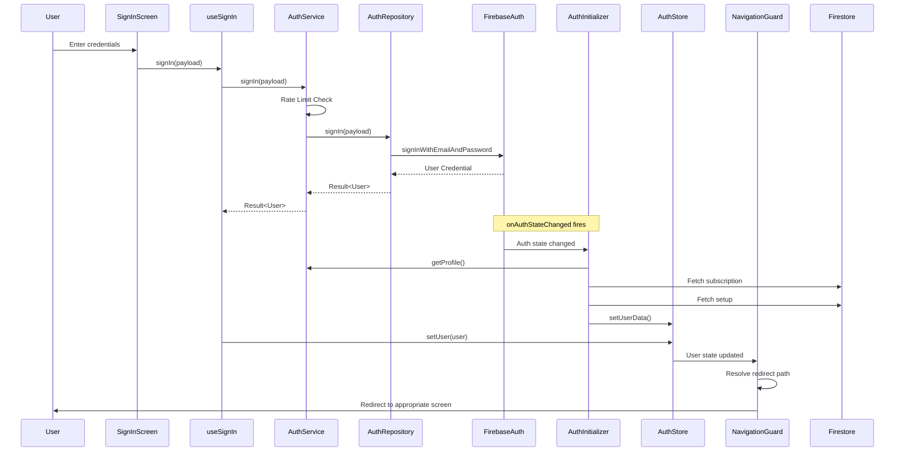
```mermaid
sequenceDiagram
    participant User
    participant SignInScreen
    participant useSignIn
    participant AuthService
    participant AuthRepository
    participant FirebaseAuth
    participant AuthInitializer
    participant AuthStore
    participant NavigationGuard

    User->>SignInScreen: Enter credentials
    SignInScreen->>useSignIn: signIn(payload)

    useSignIn->>AuthService: signIn(payload)
    AuthService->>AuthService: Rate Limit Check
    AuthService->>AuthRepository: signIn(payload)
    AuthRepository->>FirebaseAuth: signInWithEmailAndPassword
    FirebaseAuth-->>AuthRepository: User Credential
    AuthRepository-->>AuthService: Result<User>
    AuthService-->>useSignIn: Result<User>

    Note over FirebaseAuth,AuthInitializer: onAuthStateChanged fires
    FirebaseAuth->>AuthInitializer: Auth state changed
    AuthInitializer->>AuthService: getProfile()
    AuthInitializer->>Firestore: Fetch subscription
    AuthInitializer->>Firestore: Fetch setup
    AuthInitializer->>AuthStore: setUserData()

    useSignIn->>AuthStore: setUser(user)
    AuthStore->>NavigationGuard: User state updated
    NavigationGuard->>NavigationGuard: Resolve redirect path
    NavigationGuard->>User: Redirect to appropriate screen
```

### Sign Out Flow

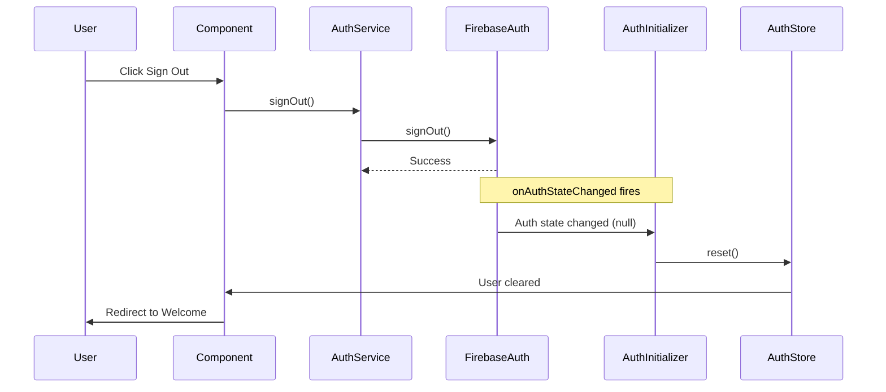
```mermaid
sequenceDiagram
    participant User
    participant Component
    participant AuthService
    participant FirebaseAuth
    participant AuthInitializer
    participant AuthStore

    User->>Component: Click Sign Out
    Component->>AuthService: signOut()
    AuthService->>FirebaseAuth: signOut()
    FirebaseAuth-->>AuthService: Success

    Note over FirebaseAuth,AuthInitializer: onAuthStateChanged fires
    FirebaseAuth->>AuthInitializer: Auth state changed (null)
    AuthInitializer->>AuthStore: reset()
    AuthStore->>Component: User cleared
    Component->>User: Redirect to Welcome
```

---

## Registration Flow

### Detailed Registration Sequence

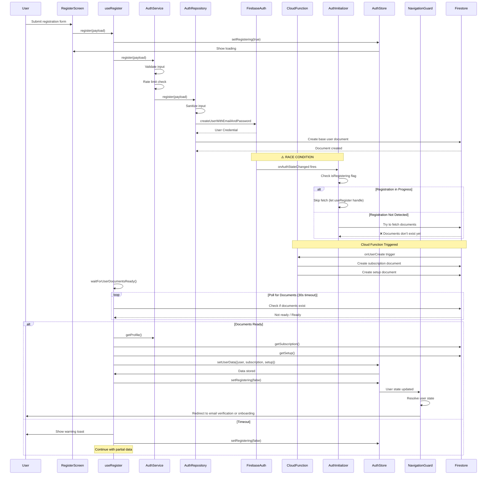
```mermaid
sequenceDiagram
    participant User
    participant RegisterScreen
    participant useRegister
    participant AuthService
    participant AuthRepository
    participant FirebaseAuth
    participant CloudFunction
    participant AuthInitializer
    participant AuthStore
    participant NavigationGuard

    User->>RegisterScreen: Submit registration form
    RegisterScreen->>useRegister: register(payload)

    useRegister->>AuthStore: setRegistering(true)
    AuthStore->>RegisterScreen: Show loading

    useRegister->>AuthService: register(payload)
    AuthService->>AuthService: Validate input
    AuthService->>AuthService: Rate limit check
    AuthService->>AuthRepository: register(payload)

    AuthRepository->>AuthRepository: Sanitize input
    AuthRepository->>FirebaseAuth: createUserWithEmailAndPassword
    FirebaseAuth-->>AuthRepository: User Credential

    AuthRepository->>Firestore: Create base user document
    Firestore-->>AuthRepository: Document created

    Note over FirebaseAuth,AuthInitializer: ⚠️ RACE CONDITION
    FirebaseAuth->>AuthInitializer: onAuthStateChanged fires
    AuthInitializer->>AuthInitializer: Check isRegistering flag
    alt Registration in Progress
        AuthInitializer->>AuthInitializer: Skip fetch (let useRegister handle)
    else Registration Not Detected
        AuthInitializer->>Firestore: Try to fetch documents
        Firestore-->>AuthInitializer: ❌ Documents don't exist yet
    end

    Note over Firestore,CloudFunction: Cloud Function Triggered
    Firestore->>CloudFunction: onUserCreate trigger
    CloudFunction->>Firestore: Create subscription document
    CloudFunction->>Firestore: Create setup document

    useRegister->>useRegister: waitForUserDocumentsReady()
    loop Poll for Documents (30s timeout)
        useRegister->>Firestore: Check if documents exist
        Firestore-->>useRegister: Not ready / Ready
    end

    alt Documents Ready
        useRegister->>AuthService: getProfile()
        useRegister->>Firestore: getSubscription()
        useRegister->>Firestore: getSetup()

        useRegister->>AuthStore: setUserData({user, subscription, setup})
        AuthStore->>useRegister: Data stored

        useRegister->>AuthStore: setRegistering(false)

        AuthStore->>NavigationGuard: User state updated
        NavigationGuard->>NavigationGuard: Resolve user state
        NavigationGuard->>User: Redirect to email verification or onboarding
    else Timeout
        useRegister->>User: Show warning toast
        useRegister->>AuthStore: setRegistering(false)
        Note over useRegister: Continue with partial data
    end
```

### Registration State Machine

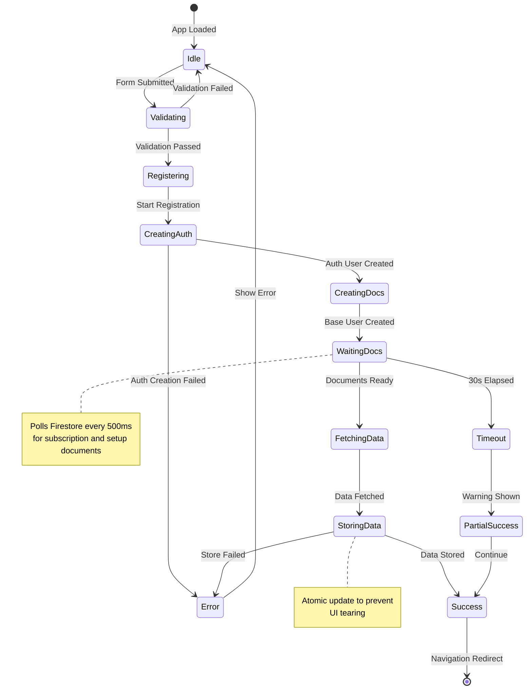
```mermaid
stateDiagram-v2
    [*] --> Idle: App Loaded

    Idle --> Validating: Form Submitted
    Validating --> Registering: Validation Passed
    Validating --> Idle: Validation Failed

    Registering --> CreatingAuth: Start Registration
    CreatingAuth --> CreatingDocs: Auth User Created
    CreatingAuth --> Error: Auth Creation Failed

    CreatingDocs --> WaitingDocs: Base User Created
    WaitingDocs --> FetchingData: Documents Ready
    WaitingDocs --> Timeout: 30s Elapsed

    FetchingData --> StoringData: Data Fetched
    StoringData --> Success: Data Stored
    StoringData --> Error: Store Failed

    Timeout --> PartialSuccess: Warning Shown
    PartialSuccess --> Success: Continue

    Success --> [*]: Navigation Redirect
    Error --> Idle: Show Error

    note right of WaitingDocs
        Polls Firestore every 500ms
        for subscription and setup documents
    end note

    note right of StoringData
        Atomic update to prevent
        UI tearing
    end note
```

---

## Email Verification Flow

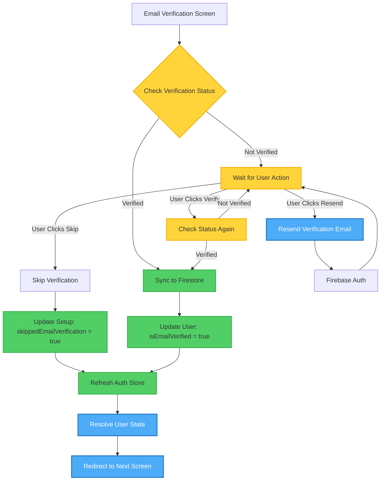
```mermaid
graph TB
    Start[Email Verification Screen] --> CheckStatus{Check Verification Status}

    CheckStatus -->|Verified| SyncFirestore[Sync to Firestore]
    CheckStatus -->|Not Verified| Wait[Wait for User Action]

    Wait -->|User Clicks Verify| CheckAgain[Check Status Again]
    Wait -->|User Clicks Skip| SkipVerification[Skip Verification]
    Wait -->|User Clicks Resend| ResendEmail[Resend Verification Email]

    CheckAgain -->|Verified| SyncFirestore
    CheckAgain -->|Not Verified| Wait

    ResendEmail --> FirebaseAuth[Firebase Auth]
    FirebaseAuth --> Wait

    SkipVerification --> UpdateSetup[Update Setup: skippedEmailVerification = true]
    SyncFirestore --> UpdateUser[Update User: isEmailVerified = true]

    UpdateSetup --> RefreshStore[Refresh Auth Store]
    UpdateUser --> RefreshStore

    RefreshStore --> ResolveState[Resolve User State]
    ResolveState --> Redirect[Redirect to Next Screen]

    classDef actionStyle fill:#4dabf7,stroke:#1971c2,stroke-width:2px,color:#fff
    classDef updateStyle fill:#51cf66,stroke:#37b24d,stroke-width:2px
    classDef decisionStyle fill:#ffd43b,stroke:#fab005,stroke-width:2px

    class CheckStatus,CheckAgain,Wait decisionStyle
    class SyncFirestore,UpdateSetup,UpdateUser,RefreshStore updateStyle
    class ResendEmail,ResolveState,Redirect actionStyle
```

### Email Verification Sequence

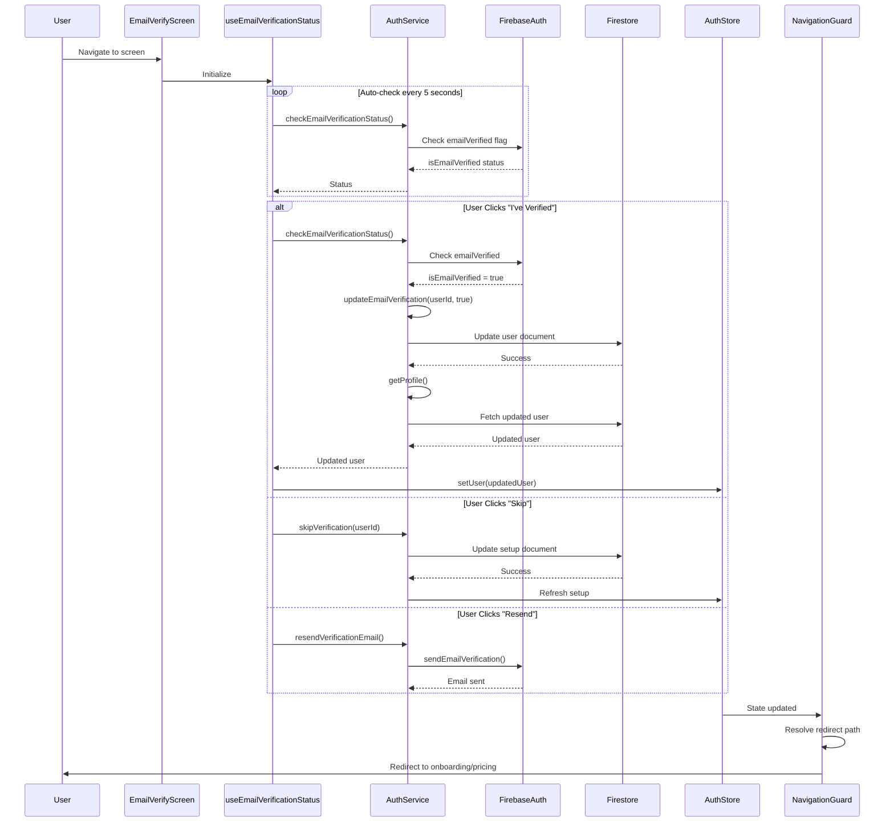
```mermaid
sequenceDiagram
    participant User
    participant EmailVerifyScreen
    participant useEmailVerificationStatus
    participant AuthService
    participant FirebaseAuth
    participant Firestore
    participant AuthStore
    participant NavigationGuard

    User->>EmailVerifyScreen: Navigate to screen
    EmailVerifyScreen->>useEmailVerificationStatus: Initialize

    loop Auto-check every 5 seconds
        useEmailVerificationStatus->>AuthService: checkEmailVerificationStatus()
        AuthService->>FirebaseAuth: Check emailVerified flag
        FirebaseAuth-->>AuthService: isEmailVerified status
        AuthService-->>useEmailVerificationStatus: Status
    end

    alt User Clicks "I've Verified"
        useEmailVerificationStatus->>AuthService: checkEmailVerificationStatus()
        AuthService->>FirebaseAuth: Check emailVerified
        FirebaseAuth-->>AuthService: isEmailVerified = true

        AuthService->>AuthService: updateEmailVerification(userId, true)
        AuthService->>Firestore: Update user document
        Firestore-->>AuthService: Success

        AuthService->>AuthService: getProfile()
        AuthService->>Firestore: Fetch updated user
        Firestore-->>AuthService: Updated user
        AuthService-->>useEmailVerificationStatus: Updated user

        useEmailVerificationStatus->>AuthStore: setUser(updatedUser)
    else User Clicks "Skip"
        useEmailVerificationStatus->>AuthService: skipVerification(userId)
        AuthService->>Firestore: Update setup document
        Firestore-->>AuthService: Success
        AuthService->>AuthStore: Refresh setup
    else User Clicks "Resend"
        useEmailVerificationStatus->>AuthService: resendVerificationEmail()
        AuthService->>FirebaseAuth: sendEmailVerification()
        FirebaseAuth-->>AuthService: Email sent
    end

    AuthStore->>NavigationGuard: State updated
    NavigationGuard->>NavigationGuard: Resolve redirect path
    NavigationGuard->>User: Redirect to onboarding/pricing
```

---

## Onboarding Flow

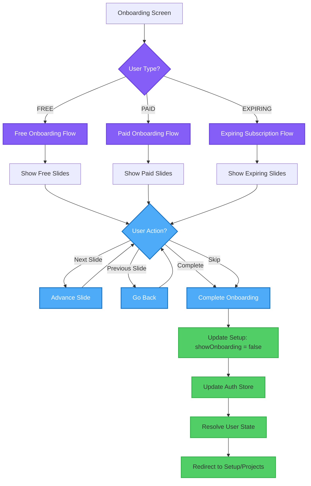
```mermaid
graph TB
    Start[Onboarding Screen] --> CheckType{User Type?}

    CheckType -->|FREE| OnboardingFree[Free Onboarding Flow]
    CheckType -->|PAID| OnboardingPaid[Paid Onboarding Flow]
    CheckType -->|EXPIRING| OnboardingExpiring[Expiring Subscription Flow]

    OnboardingFree --> SlidesFree[Show Free Slides]
    OnboardingPaid --> SlidesPaid[Show Paid Slides]
    OnboardingExpiring --> SlidesExpiring[Show Expiring Slides]

    SlidesFree --> UserAction{User Action?}
    SlidesPaid --> UserAction
    SlidesExpiring --> UserAction

    UserAction -->|Next Slide| NextSlide[Advance Slide]
    UserAction -->|Previous Slide| PrevSlide[Go Back]
    UserAction -->|Complete| CompleteOnboarding[Complete Onboarding]
    UserAction -->|Skip| CompleteOnboarding

    NextSlide --> UserAction
    PrevSlide --> UserAction

    CompleteOnboarding --> UpdateSetup[Update Setup: showOnboarding = false]
    UpdateSetup --> UpdateStore[Update Auth Store]
    UpdateStore --> ResolveState[Resolve User State]
    ResolveState --> Redirect[Redirect to Setup/Projects]

    classDef typeStyle fill:#845ef7,stroke:#6741d9,stroke-width:2px,color:#fff
    classDef actionStyle fill:#4dabf7,stroke:#1971c2,stroke-width:2px,color:#fff
    classDef updateStyle fill:#51cf66,stroke:#37b24d,stroke-width:2px

    class CheckType,OnboardingFree,OnboardingPaid,OnboardingExpiring typeStyle
    class UserAction,NextSlide,PrevSlide,CompleteOnboarding actionStyle
    class UpdateSetup,UpdateStore,ResolveState,Redirect updateStyle
```

### Onboarding Sequence

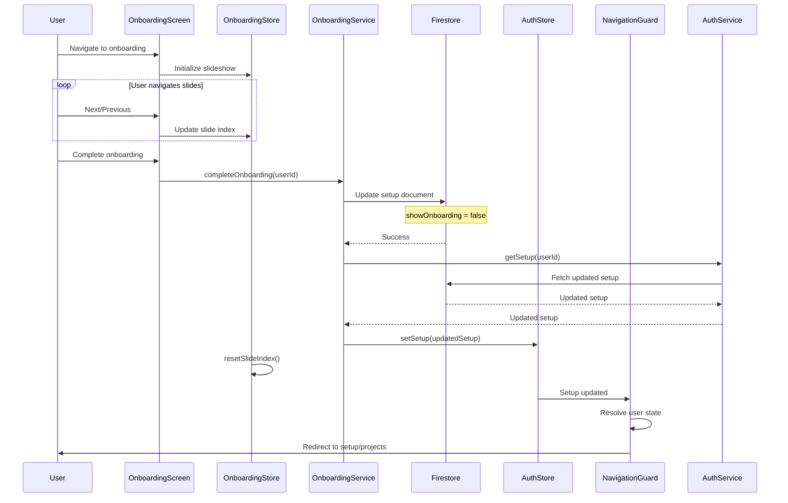
```mermaid
sequenceDiagram
    participant User
    participant OnboardingScreen
    participant OnboardingStore
    participant OnboardingService
    participant Firestore
    participant AuthStore
    participant NavigationGuard

    User->>OnboardingScreen: Navigate to onboarding
    OnboardingScreen->>OnboardingStore: Initialize slideshow

    loop User navigates slides
        User->>OnboardingScreen: Next/Previous
        OnboardingScreen->>OnboardingStore: Update slide index
    end

    User->>OnboardingScreen: Complete onboarding
    OnboardingScreen->>OnboardingService: completeOnboarding(userId)

    OnboardingService->>Firestore: Update setup document
    Note over Firestore: showOnboarding = false
    Firestore-->>OnboardingService: Success

    OnboardingService->>AuthService: getSetup(userId)
    AuthService->>Firestore: Fetch updated setup
    Firestore-->>AuthService: Updated setup
    AuthService-->>OnboardingService: Updated setup

    OnboardingService->>AuthStore: setSetup(updatedSetup)
    OnboardingStore->>OnboardingStore: resetSlideIndex()

    AuthStore->>NavigationGuard: Setup updated
    NavigationGuard->>NavigationGuard: Resolve user state
    NavigationGuard->>User: Redirect to setup/projects
```

---

## Setup Flow

### Setup Logic Flow

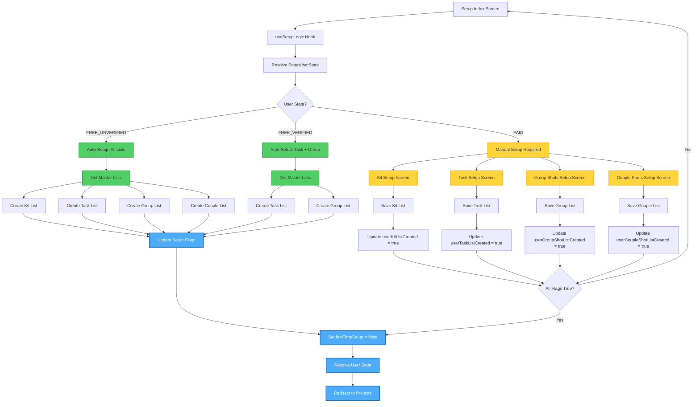
```mermaid
graph TB
    Start[Setup Index Screen] --> Init[useSetupLogic Hook]

    Init --> ResolveState[Resolve SetupUserState]

    ResolveState --> CheckState{User State?}

    CheckState -->|FREE_UNVERIFIED| AutoSetupAll[Auto-Setup: All Lists]
    CheckState -->|FREE_VERIFIED| AutoSetupPartial[Auto-Setup: Task + Group]
    CheckState -->|PAID| ManualSetup[Manual Setup Required]

    AutoSetupAll --> GetMasterAll[Get Master Lists]
    AutoSetupPartial --> GetMasterPartial[Get Master Lists]

    GetMasterAll --> CreateKit[Create Kit List]
    GetMasterAll --> CreateTask[Create Task List]
    GetMasterAll --> CreateGroup[Create Group List]
    GetMasterAll --> CreateCouple[Create Couple List]

    GetMasterPartial --> CreateTask2[Create Task List]
    GetMasterPartial --> CreateGroup2[Create Group List]

    CreateKit --> UpdateFlags[Update Setup Flags]
    CreateTask --> UpdateFlags
    CreateTask2 --> UpdateFlags
    CreateGroup --> UpdateFlags
    CreateGroup2 --> UpdateFlags
    CreateCouple --> UpdateFlags

    UpdateFlags --> SetComplete[Set firstTimeSetup = false]

    ManualSetup --> KitSetup[Kit Setup Screen]
    ManualSetup --> TaskSetup[Task Setup Screen]
    ManualSetup --> GroupSetup[Group Shots Setup Screen]
    ManualSetup --> CoupleSetup[Couple Shots Setup Screen]

    KitSetup --> SaveKit[Save Kit List]
    TaskSetup --> SaveTask[Save Task List]
    GroupSetup --> SaveGroup[Save Group List]
    CoupleSetup --> SaveCouple[Save Couple List]

    SaveKit --> UpdateFlagKit[Update userKitListCreated = true]
    SaveTask --> UpdateFlagTask[Update userTaskListCreated = true]
    SaveGroup --> UpdateFlagGroup[Update userGroupShotListCreated = true]
    SaveCouple --> UpdateFlagCouple[Update userCoupleShotListCreated = true]

    UpdateFlagKit --> CheckAllFlags{All Flags True?}
    UpdateFlagTask --> CheckAllFlags
    UpdateFlagGroup --> CheckAllFlags
    UpdateFlagCouple --> CheckAllFlags

    CheckAllFlags -->|Yes| SetComplete
    CheckAllFlags -->|No| Start

    SetComplete --> ResolveState2[Resolve User State]
    ResolveState2 --> Redirect[Redirect to Projects]

    classDef autoStyle fill:#51cf66,stroke:#37b24d,stroke-width:2px
    classDef manualStyle fill:#ffd43b,stroke:#fab005,stroke-width:2px
    classDef updateStyle fill:#4dabf7,stroke:#1971c2,stroke-width:2px,color:#fff

    class AutoSetupAll,AutoSetupPartial,GetMasterAll,GetMasterPartial autoStyle
    class ManualSetup,KitSetup,TaskSetup,GroupSetup,CoupleSetup manualStyle
    class UpdateFlags,SetComplete,ResolveState2,Redirect updateStyle
```

### Setup Sequence (Auto-Setup)

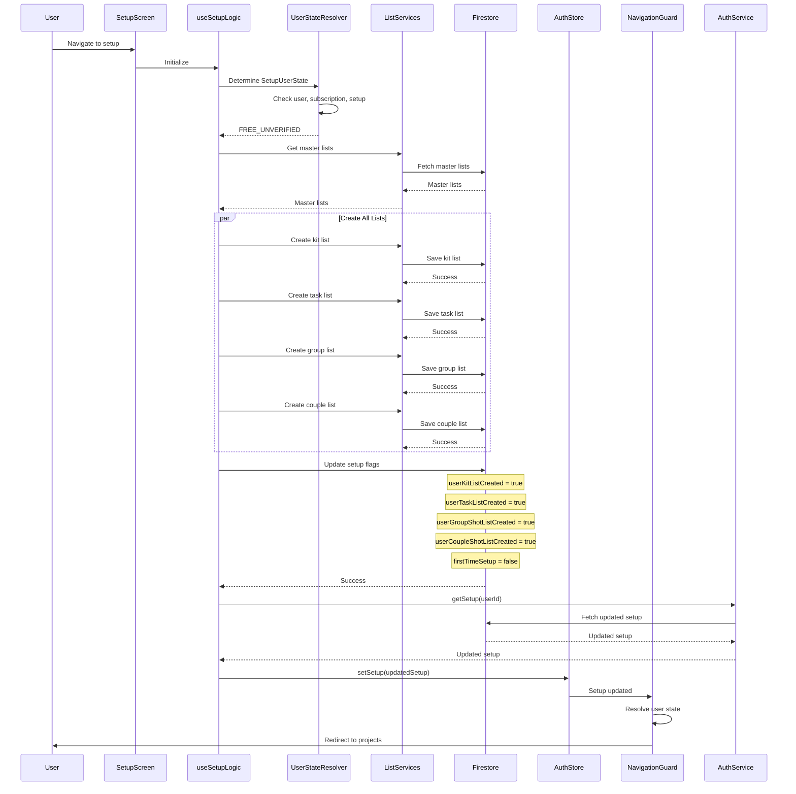
```mermaid
sequenceDiagram
    participant User
    participant SetupScreen
    participant useSetupLogic
    participant UserStateResolver
    participant ListServices
    participant Firestore
    participant AuthStore
    participant NavigationGuard

    User->>SetupScreen: Navigate to setup
    SetupScreen->>useSetupLogic: Initialize

    useSetupLogic->>UserStateResolver: Determine SetupUserState
    UserStateResolver->>UserStateResolver: Check user, subscription, setup
    UserStateResolver-->>useSetupLogic: FREE_UNVERIFIED

    useSetupLogic->>ListServices: Get master lists
    ListServices->>Firestore: Fetch master lists
    Firestore-->>ListServices: Master lists
    ListServices-->>useSetupLogic: Master lists

    par Create All Lists
        useSetupLogic->>ListServices: Create kit list
        ListServices->>Firestore: Save kit list
        Firestore-->>ListServices: Success

        useSetupLogic->>ListServices: Create task list
        ListServices->>Firestore: Save task list
        Firestore-->>ListServices: Success

        useSetupLogic->>ListServices: Create group list
        ListServices->>Firestore: Save group list
        Firestore-->>ListServices: Success

        useSetupLogic->>ListServices: Create couple list
        ListServices->>Firestore: Save couple list
        Firestore-->>ListServices: Success
    end

    useSetupLogic->>Firestore: Update setup flags
    Note over Firestore: userKitListCreated = true
    Note over Firestore: userTaskListCreated = true
    Note over Firestore: userGroupShotListCreated = true
    Note over Firestore: userCoupleShotListCreated = true
    Note over Firestore: firstTimeSetup = false
    Firestore-->>useSetupLogic: Success

    useSetupLogic->>AuthService: getSetup(userId)
    AuthService->>Firestore: Fetch updated setup
    Firestore-->>AuthService: Updated setup
    AuthService-->>useSetupLogic: Updated setup

    useSetupLogic->>AuthStore: setSetup(updatedSetup)
    AuthStore->>NavigationGuard: Setup updated
    NavigationGuard->>NavigationGuard: Resolve user state
    NavigationGuard->>User: Redirect to projects
```

---

## Project Creation Flow

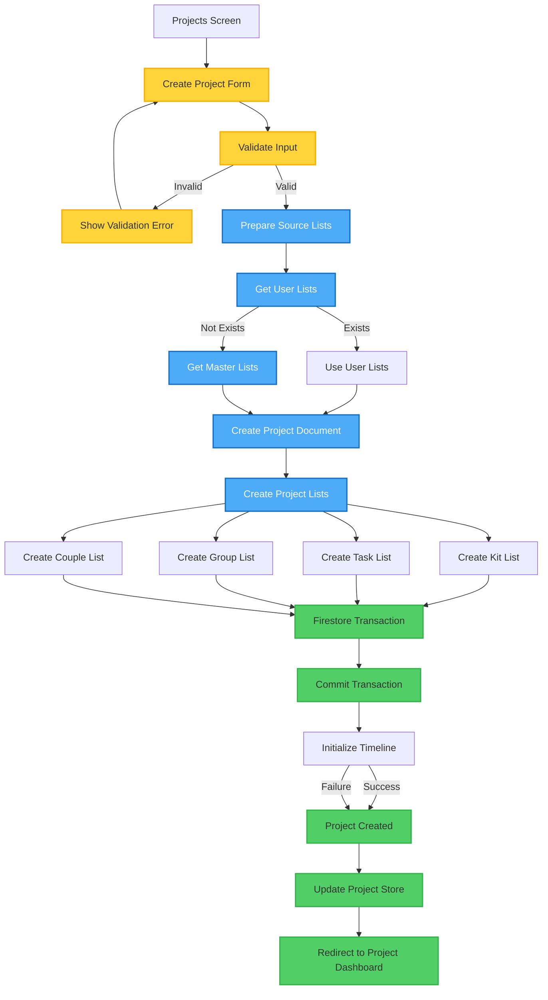
```mermaid
graph TB
    Start[Projects Screen] --> CreateProject[Create Project Form]

    CreateProject --> Validate[Validate Input]
    Validate -->|Invalid| ShowError[Show Validation Error]
    Validate -->|Valid| PrepareLists[Prepare Source Lists]

    ShowError --> CreateProject

    PrepareLists --> GetUserLists[Get User Lists]
    GetUserLists -->|Exists| UseUserLists[Use User Lists]
    GetUserLists -->|Not Exists| GetMasterLists[Get Master Lists]

    UseUserLists --> CreateProjectDoc[Create Project Document]
    GetMasterLists --> CreateProjectDoc

    CreateProjectDoc --> CreateLists[Create Project Lists]
    CreateLists --> CreateKitList[Create Kit List]
    CreateLists --> CreateTaskList[Create Task List]
    CreateLists --> CreateGroupList[Create Group List]
    CreateLists --> CreateCoupleList[Create Couple List]

    CreateKitList --> Transaction[Firestore Transaction]
    CreateTaskList --> Transaction
    CreateGroupList --> Transaction
    CreateCoupleList --> Transaction

    Transaction --> Commit[Commit Transaction]
    Commit --> InitTimeline[Initialize Timeline]

    InitTimeline -->|Success| ProjectCreated[Project Created]
    InitTimeline -->|Failure| ProjectCreated

    ProjectCreated --> UpdateStore[Update Project Store]
    UpdateStore --> Redirect[Redirect to Project Dashboard]

    classDef inputStyle fill:#ffd43b,stroke:#fab005,stroke-width:2px
    classDef dataStyle fill:#4dabf7,stroke:#1971c2,stroke-width:2px,color:#fff
    classDef successStyle fill:#51cf66,stroke:#37b24d,stroke-width:2px

    class CreateProject,Validate,ShowError inputStyle
    class PrepareLists,GetUserLists,GetMasterLists,CreateProjectDoc,CreateLists dataStyle
    class Transaction,Commit,ProjectCreated,UpdateStore,Redirect successStyle
```

### Project Creation Sequence

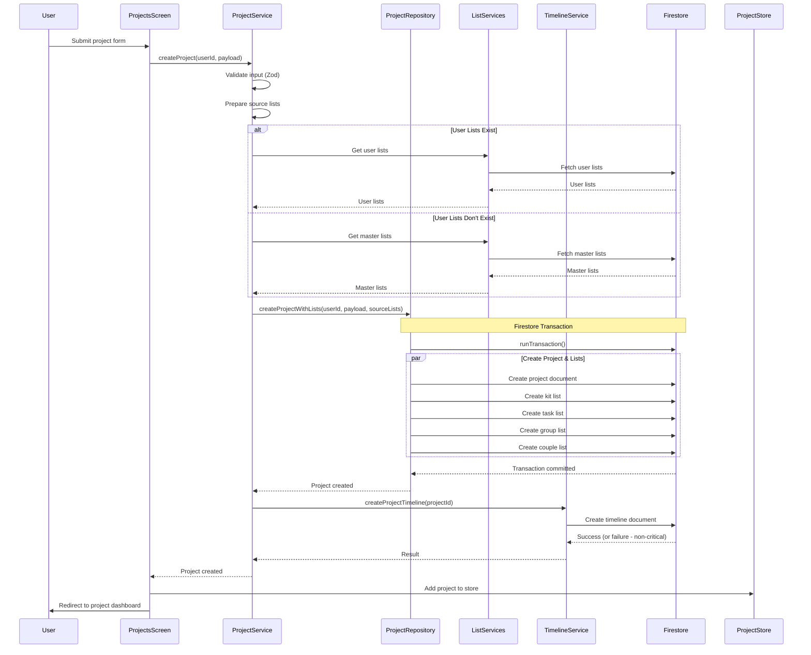
```mermaid
sequenceDiagram
    participant User
    participant ProjectsScreen
    participant ProjectService
    participant ProjectRepository
    participant ListServices
    participant TimelineService
    participant Firestore
    participant ProjectStore

    User->>ProjectsScreen: Submit project form
    ProjectsScreen->>ProjectService: createProject(userId, payload)

    ProjectService->>ProjectService: Validate input (Zod)
    ProjectService->>ProjectService: Prepare source lists

    alt User Lists Exist
        ProjectService->>ListServices: Get user lists
        ListServices->>Firestore: Fetch user lists
        Firestore-->>ListServices: User lists
        ListServices-->>ProjectService: User lists
    else User Lists Don't Exist
        ProjectService->>ListServices: Get master lists
        ListServices->>Firestore: Fetch master lists
        Firestore-->>ListServices: Master lists
        ListServices-->>ProjectService: Master lists
    end

    ProjectService->>ProjectRepository: createProjectWithLists(userId, payload, sourceLists)

    Note over ProjectRepository,Firestore: Firestore Transaction
    ProjectRepository->>Firestore: runTransaction()

    par Create Project & Lists
        ProjectRepository->>Firestore: Create project document
        ProjectRepository->>Firestore: Create kit list
        ProjectRepository->>Firestore: Create task list
        ProjectRepository->>Firestore: Create group list
        ProjectRepository->>Firestore: Create couple list
    end

    Firestore-->>ProjectRepository: Transaction committed
    ProjectRepository-->>ProjectService: Project created

    ProjectService->>TimelineService: createProjectTimeline(projectId)
    TimelineService->>Firestore: Create timeline document
    Firestore-->>TimelineService: Success (or failure - non-critical)
    TimelineService-->>ProjectService: Result

    ProjectService-->>ProjectsScreen: Project created
    ProjectsScreen->>ProjectStore: Add project to store
    ProjectsScreen->>User: Redirect to project dashboard
```

---

## Navigation Guard System

### Guard Hierarchy

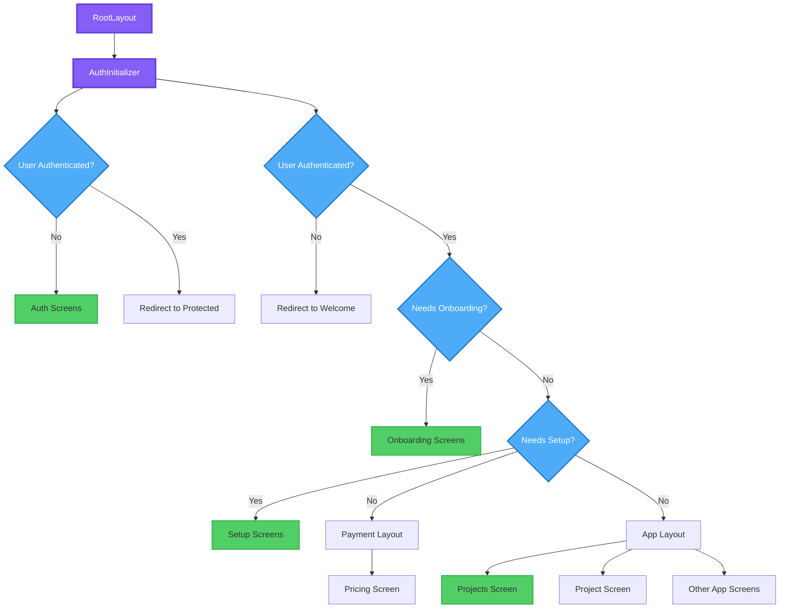
```mermaid
graph TB
    RootLayout[RootLayout] --> AuthInitializer[AuthInitializer]

    AuthInitializer --> AuthLayout{User Authenticated?}
    AuthInitializer --> ProtectedLayout{User Authenticated?}

    AuthLayout -->|No| AuthScreens[Auth Screens]
    AuthLayout -->|Yes| RedirectAuth[Redirect to Protected]

    ProtectedLayout -->|No| RedirectProtected[Redirect to Welcome]
    ProtectedLayout -->|Yes| OnboardingLayout{Needs Onboarding?}

    OnboardingLayout -->|Yes| OnboardingScreens[Onboarding Screens]
    OnboardingLayout -->|No| SetupLayout{Needs Setup?}

    SetupLayout -->|Yes| SetupScreens[Setup Screens]
    SetupLayout -->|No| PaymentLayout[Payment Layout]
    SetupLayout -->|No| AppLayout[App Layout]

    PaymentLayout --> PricingScreen[Pricing Screen]

    AppLayout --> ProjectsScreen[Projects Screen]
    AppLayout --> ProjectScreen[Project Screen]
    AppLayout --> OtherScreens[Other App Screens]

    classDef rootStyle fill:#845ef7,stroke:#6741d9,stroke-width:3px,color:#fff
    classDef guardStyle fill:#4dabf7,stroke:#1971c2,stroke-width:2px,color:#fff
    classDef screenStyle fill:#51cf66,stroke:#37b24d,stroke-width:2px

    class RootLayout,AuthInitializer rootStyle
    class AuthLayout,ProtectedLayout,OnboardingLayout,SetupLayout guardStyle
    class AuthScreens,OnboardingScreens,SetupScreens,ProjectsScreen screenStyle
```

### Navigation Guard Decision Tree

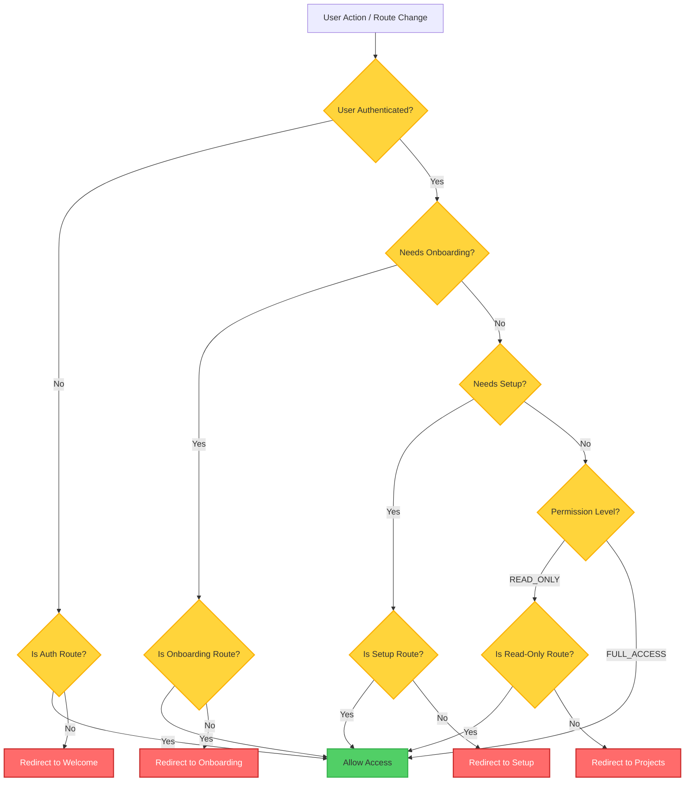
```mermaid
graph TD
    Start[User Action / Route Change] --> CheckAuth{User Authenticated?}

    CheckAuth -->|No| AuthRoute{Is Auth Route?}
    CheckAuth -->|Yes| CheckOnboarding{Needs Onboarding?}

    AuthRoute -->|Yes| Allow[Allow Access]
    AuthRoute -->|No| RedirectWelcome[Redirect to Welcome]

    CheckOnboarding -->|Yes| OnboardingRoute{Is Onboarding Route?}
    CheckOnboarding -->|No| CheckSetup{Needs Setup?}

    OnboardingRoute -->|Yes| Allow
    OnboardingRoute -->|No| RedirectOnboarding[Redirect to Onboarding]

    CheckSetup -->|Yes| SetupRoute{Is Setup Route?}
    CheckSetup -->|No| CheckPermission{Permission Level?}

    SetupRoute -->|Yes| Allow
    SetupRoute -->|No| RedirectSetup[Redirect to Setup]

    CheckPermission -->|READ_ONLY| ReadOnlyRoute{Is Read-Only Route?}
    CheckPermission -->|FULL_ACCESS| Allow

    ReadOnlyRoute -->|Yes| Allow
    ReadOnlyRoute -->|No| RedirectProjects[Redirect to Projects]

    classDef decisionStyle fill:#ffd43b,stroke:#fab005,stroke-width:2px
    classDef actionStyle fill:#51cf66,stroke:#37b24d,stroke-width:2px
    classDef redirectStyle fill:#ff6b6b,stroke:#c92a2a,stroke-width:2px,color:#fff

    class CheckAuth,CheckOnboarding,CheckSetup,CheckPermission,AuthRoute,OnboardingRoute,SetupRoute,ReadOnlyRoute decisionStyle
    class Allow actionStyle
    class RedirectWelcome,RedirectOnboarding,RedirectSetup,RedirectProjects redirectStyle
```

---

## State Management Flow

### Auth Store State Flow

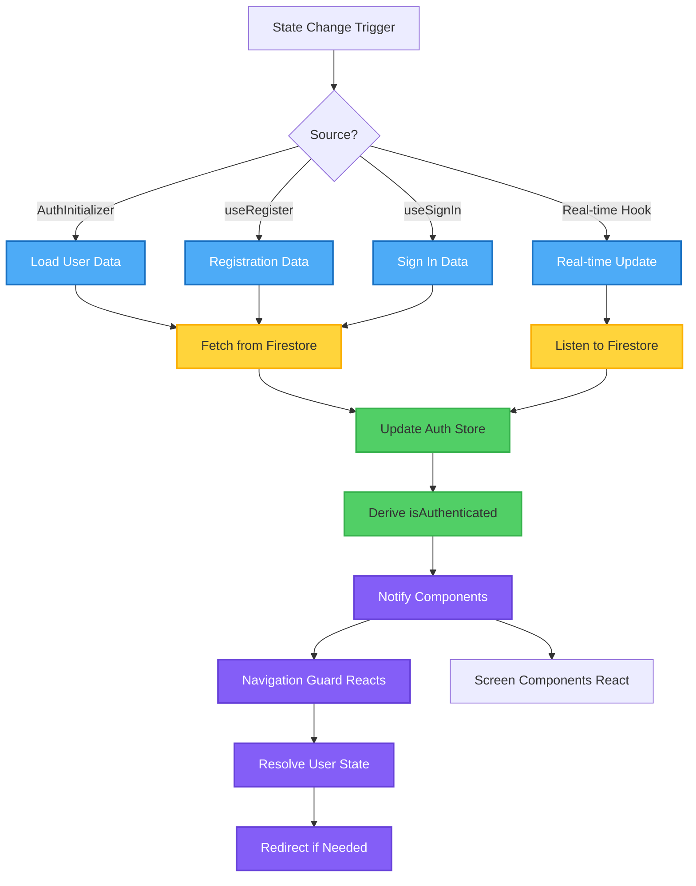
```mermaid
graph TB
    Start[State Change Trigger] --> Source{Source?}

    Source -->|AuthInitializer| LoadData[Load User Data]
    Source -->|useRegister| RegisterData[Registration Data]
    Source -->|useSignIn| SignInData[Sign In Data]
    Source -->|Real-time Hook| RealtimeData[Real-time Update]

    LoadData --> Fetch[Fetch from Firestore]
    RegisterData --> Fetch
    SignInData --> Fetch
    RealtimeData --> Listen[Listen to Firestore]

    Fetch --> UpdateStore[Update Auth Store]
    Listen --> UpdateStore

    UpdateStore --> DeriveState[Derive isAuthenticated]
    DeriveState --> NotifyComponents[Notify Components]

    NotifyComponents --> NavigationGuard[Navigation Guard Reacts]
    NotifyComponents --> ScreenComponents[Screen Components React]

    NavigationGuard --> ResolveState[Resolve User State]
    ResolveState --> Redirect[Redirect if Needed]

    classDef sourceStyle fill:#4dabf7,stroke:#1971c2,stroke-width:2px,color:#fff
    classDef dataStyle fill:#ffd43b,stroke:#fab005,stroke-width:2px
    classDef updateStyle fill:#51cf66,stroke:#37b24d,stroke-width:2px
    classDef reactStyle fill:#845ef7,stroke:#6741d9,stroke-width:2px,color:#fff

    class LoadData,RegisterData,SignInData,RealtimeData sourceStyle
    class Fetch,Listen dataStyle
    class UpdateStore,DeriveState updateStyle
    class NotifyComponents,NavigationGuard,ResolveState,Redirect reactStyle
```

### State Resolution Flow

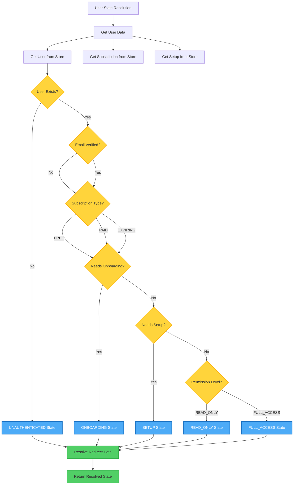
```mermaid
graph TB
    Start[User State Resolution] --> GetData[Get User Data]

    GetData --> GetUser[Get User from Store]
    GetData --> GetSubscription[Get Subscription from Store]
    GetData --> GetSetup[Get Setup from Store]

    GetUser --> CheckUser{User Exists?}
    CheckUser -->|No| Unauthenticated[UNAUTHENTICATED State]
    CheckUser -->|Yes| CheckEmail{Email Verified?}

    CheckEmail -->|No| CheckSubscription{Subscription Type?}
    CheckEmail -->|Yes| CheckSubscription

    CheckSubscription -->|FREE| CheckOnboarding{Needs Onboarding?}
    CheckSubscription -->|PAID| CheckOnboarding
    CheckSubscription -->|EXPIRING| CheckOnboarding

    CheckOnboarding -->|Yes| OnboardingState[ONBOARDING State]
    CheckOnboarding -->|No| CheckSetup{Needs Setup?}

    CheckSetup -->|Yes| SetupState[SETUP State]
    CheckSetup -->|No| CheckPermission{Permission Level?}

    CheckPermission -->|READ_ONLY| ReadOnlyState[READ_ONLY State]
    CheckPermission -->|FULL_ACCESS| FullAccessState[FULL_ACCESS State]

    Unauthenticated --> ResolveRedirect[Resolve Redirect Path]
    OnboardingState --> ResolveRedirect
    SetupState --> ResolveRedirect
    ReadOnlyState --> ResolveRedirect
    FullAccessState --> ResolveRedirect

    ResolveRedirect --> ReturnState[Return Resolved State]

    classDef checkStyle fill:#ffd43b,stroke:#fab005,stroke-width:2px
    classDef stateStyle fill:#4dabf7,stroke:#1971c2,stroke-width:2px,color:#fff
    classDef actionStyle fill:#51cf66,stroke:#37b24d,stroke-width:2px

    class CheckUser,CheckEmail,CheckSubscription,CheckOnboarding,CheckSetup,CheckPermission checkStyle
    class Unauthenticated,OnboardingState,SetupState,ReadOnlyState,FullAccessState stateStyle
    class ResolveRedirect,ReturnState actionStyle
```

---

## Data Flow Sequences

### Complete Registration Data Flow

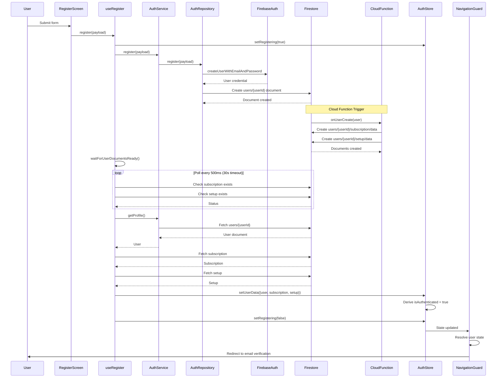
```mermaid
sequenceDiagram
    participant User
    participant RegisterScreen
    participant useRegister
    participant AuthService
    participant AuthRepository
    participant FirebaseAuth
    participant Firestore
    participant CloudFunction
    participant AuthStore
    participant NavigationGuard

    User->>RegisterScreen: Submit form
    RegisterScreen->>useRegister: register(payload)

    useRegister->>AuthStore: setRegistering(true)

    useRegister->>AuthService: register(payload)
    AuthService->>AuthRepository: register(payload)
    AuthRepository->>FirebaseAuth: createUserWithEmailAndPassword
    FirebaseAuth-->>AuthRepository: User credential

    AuthRepository->>Firestore: Create users/{userId} document
    Firestore-->>AuthRepository: Document created

    Note over Firestore,CloudFunction: Cloud Function Trigger
    Firestore->>CloudFunction: onUserCreate(user)
    CloudFunction->>Firestore: Create users/{userId}/subscription/data
    CloudFunction->>Firestore: Create users/{userId}/setup/data
    Firestore-->>CloudFunction: Documents created

    useRegister->>useRegister: waitForUserDocumentsReady()
    loop Poll every 500ms (30s timeout)
        useRegister->>Firestore: Check subscription exists
        useRegister->>Firestore: Check setup exists
        Firestore-->>useRegister: Status
    end

    useRegister->>AuthService: getProfile()
    AuthService->>Firestore: Fetch users/{userId}
    Firestore-->>AuthService: User document
    AuthService-->>useRegister: User

    useRegister->>Firestore: Fetch subscription
    Firestore-->>useRegister: Subscription

    useRegister->>Firestore: Fetch setup
    Firestore-->>useRegister: Setup

    useRegister->>AuthStore: setUserData({user, subscription, setup})
    AuthStore->>AuthStore: Derive isAuthenticated = true

    useRegister->>AuthStore: setRegistering(false)

    AuthStore->>NavigationGuard: State updated
    NavigationGuard->>NavigationGuard: Resolve user state
    NavigationGuard->>User: Redirect to email verification
```

### Real-time Data Sync Flow

```mermaid
sequenceDiagram
    participant Component
    participant useUserProfile
    participant UserProfileService
    participant Firestore
    participant AuthStore
    participant Component2

    Component->>useUserProfile: Initialize hook
    useUserProfile->>UserProfileService: subscribeToUserProfile(userId)

    UserProfileService->>Firestore: onSnapshot(users/{userId}/profile/data)

    loop Real-time Updates
        Firestore->>UserProfileService: Document changed
        UserProfileService->>UserProfileService: Parse snapshot
        UserProfileService->>useUserProfile: onData(result)
        useUserProfile->>AuthStore: setProfile(profile)
        AuthStore->>Component: State updated
        AuthStore->>Component2: State updated
    end

    Component->>useUserProfile: Unmount
    useUserProfile->>UserProfileService: Unsubscribe
    UserProfileService->>Firestore: Unsubscribe listener
```

---

## Component Hierarchy

### Complete Component Tree

```mermaid
graph TB
    RootLayout[RootLayout] --> ErrorBoundary[ErrorBoundary]
    ErrorBoundary --> ServiceContext[ServiceContext.Provider]
    ServiceContext --> StripeProvider[StripeProvider]
    StripeProvider --> SafeAreaProvider[SafeAreaProvider]
    SafeAreaProvider --> PaperProvider[PaperProvider]
    PaperProvider --> AuthInitializer[AuthInitializer]

    AuthInitializer --> Stack[Expo Router Stack]

    Stack --> AuthGroup[(auth) Route Group]
    Stack --> ProtectedGroup[(protected) Route Group]

    AuthGroup --> AuthLayout[AuthLayout]
    AuthLayout --> WelcomeScreen[Welcome Screen]
    AuthLayout --> RegisterScreen[Register Screen]
    AuthLayout --> SignInScreen[Sign In Screen]
    AuthLayout --> EmailVerifyScreen[Email Verification Screen]
    AuthLayout --> ResetPasswordScreen[Reset Password Screen]

    RegisterScreen --> AuthenticationForm[AuthenticationForm]
    AuthenticationForm --> useRegister[useRegister Hook]

    ProtectedGroup --> ProtectedLayout[ProtectedLayout]

    ProtectedLayout --> OnboardingGroup[(onboarding) Route Group]
    ProtectedLayout --> SetupGroup[(setup) Route Group]
    ProtectedLayout --> PaymentGroup[(payment) Route Group]
    ProtectedLayout --> AppGroup[(app) Route Group]

    OnboardingGroup --> OnboardingLayout[OnboardingLayout]
    OnboardingLayout --> OnboardingFreeScreen[Onboarding Free Screen]
    OnboardingLayout --> OnboardingPaidScreen[Onboarding Paid Screen]
    OnboardingLayout --> OnboardingExpiringScreen[Onboarding Expiring Screen]

    SetupGroup --> SetupLayout[SetupLayout]
    SetupLayout --> SetupIndexScreen[Setup Index Screen]
    SetupLayout --> KitSetupScreen[Kit Setup Screen]
    SetupLayout --> TaskSetupScreen[Task Setup Screen]
    SetupLayout --> GroupShotsSetupScreen[Group Shots Setup Screen]
    SetupLayout --> CoupleShotsSetupScreen[Couple Shots Setup Screen]

    SetupIndexScreen --> useSetupLogic[useSetupLogic Hook]

    AppGroup --> AppLayout[AppLayout]
    AppLayout --> ProjectsScreen[Projects Screen]
    AppLayout --> ProjectScreen[Project Screen]
    AppLayout --> DashboardScreen[Dashboard Screen]

    ProjectsScreen --> ProjectManagementService[ProjectManagementService]

    PaperProvider --> ToastContainer[ToastContainer]

    classDef rootStyle fill:#845ef7,stroke:#6741d9,stroke-width:3px,color:#fff
    classDef layoutStyle fill:#4dabf7,stroke:#1971c2,stroke-width:2px,color:#fff
    classDef screenStyle fill:#51cf66,stroke:#37b24d,stroke-width:2px
    classDef hookStyle fill:#ffd43b,stroke:#fab005,stroke-width:2px

    class RootLayout,ErrorBoundary,ServiceContext rootStyle
    class AuthLayout,ProtectedLayout,OnboardingLayout,SetupLayout,AppLayout layoutStyle
    class WelcomeScreen,RegisterScreen,ProjectsScreen screenStyle
    class useRegister,useSetupLogic hookStyle
```

---

## Critical Issues & Recommendations

### 🔴 Critical Issues

#### 1. Component Unmounting During Registration

**Location**: `src/hooks/use-register.ts`

**Issue**: Component may unmount before registration completes, causing data loss.

**Current Flow**:

1. Registration completes
2. Data is fetched
3. Component checks `isMountedRef`
4. If unmounted, returns early without storing data

**Fix**: Store data BEFORE checking mount status (already fixed in current code).

#### 2. Race Condition: AuthInitializer vs useRegister

**Location**: `src/components/auth/AuthInitializer.tsx`

**Issue**: `onAuthStateChanged` fires immediately when user is created, but documents don't exist yet.

**Current Flow**:

1. Firebase Auth creates user → `onAuthStateChanged` fires
2. AuthInitializer tries to fetch documents
3. Documents don't exist → 4 failed fetch attempts
4. Meanwhile, `useRegister` is waiting for Cloud Function

**Fix**: Check `isRegistering` flag before fetching (already implemented).

#### 3. Timeout Waiting for Documents

**Location**: `src/hooks/use-register.ts`

**Issue**: Cloud Function might take > 30 seconds to create documents.

**Current Solution**: 30-second timeout with graceful degradation (warning shown).

**Recommendation**: Consider increasing timeout or implementing retry mechanism.

### 🟡 Warnings

#### 1. Multiple Re-renders

**Location**: `src/app/(auth)/_layout.tsx`

**Issue**: AuthLayout re-renders multiple times during registration.

**Recommendation**: Memoize state resolution to reduce re-renders.

#### 2. Real-time Subscription Cleanup

**Location**: Various hooks using `onSnapshot`

**Issue**: Ensure all subscriptions return cleanup functions.

**Status**: ✅ All hooks properly return unsubscribe functions.

### ✅ Best Practices Implemented

1. **Result Pattern**: All async operations return `Result<T, AppError>`
2. **Error Context**: All errors include context via `ErrorContextBuilder`
3. **Atomic State Updates**: Auth store updates are atomic
4. **Navigation Guards**: Component-level route protection
5. **Cleanup Functions**: All subscriptions return unsubscribe functions
6. **Rate Limiting**: Auth operations are rate-limited
7. **Sanitization**: All inputs are sanitized at repository level
8. **Validation**: All inputs are validated at service level

---

## Summary

The Eye-Doo application follows a well-structured architecture with clear separation of concerns:

1. **Initialization**: App loads → Services initialize → Auth state checked → User data loaded
2. **Authentication**: Sign in/register → Firebase Auth → Firestore documents → Auth store updated
3. **Registration**: Create user → Wait for Cloud Function → Fetch documents → Store data → Navigate
4. **Email Verification**: Check status → Sync to Firestore → Update store → Navigate
5. **Onboarding**: Show slides → Complete → Update setup → Navigate
6. **Setup**: Auto-setup (FREE) or manual setup (PAID) → Update flags → Navigate
7. **Project Creation**: Validate → Get source lists → Create project & lists → Initialize timeline → Navigate

All flows use:

- **Result Pattern** for error handling
- **Atomic state updates** to prevent UI tearing
- **Navigation guards** for route protection
- **Real-time sync** where appropriate
- **Proper cleanup** for subscriptions

The architecture is maintainable, testable, and follows React Native best practices.
