# Global Flow Analysis: New User Journey from Welcome to Setup Completion

## Overview

This document provides a comprehensive analysis of the complete user flow from the welcome screen through registration, email verification, onboarding, setup, and project creation. It highlights all components, states, triggers, data flows, and **critical issues** that need to be addressed.

---

## Complete Flow Diagram

```mermaid
graph TB
    Start([App Launch]) --> RootLayout[RootLayout]
    RootLayout --> AuthInit[AuthInitializer]

    AuthInit --> CheckAuth{User Exists?}
    CheckAuth -->|No| NavGuard1[Navigation Guard]
    CheckAuth -->|Yes| LoadData[Load User Data]

    LoadData --> FetchAttempt1[Fetch Profile/Subscription/Setup]
    FetchAttempt1 -->|Documents Don't Exist| Error1[⚠️ ERROR: 4x Operation Failed]
    FetchAttempt1 -->|Success| NavGuard2[Navigation Guard]

    NavGuard1 --> Welcome[Welcome Screen]
    Welcome -->|Click Register| Register[Register Screen]

    Register --> RegisterForm[AuthenticationForm]
    RegisterForm -->|Submit| UseRegister[useRegister Hook]

    UseRegister --> SetFlag1[setRegistering = true]
    SetFlag1 --> AuthService[AuthService.register]
    AuthService --> AuthRepo[AuthRepository.register]

    AuthRepo --> CreateAuth[Create Firebase Auth User]
    AuthRepo --> CreateBaseUser[Create Base User Document]

    CreateBaseUser --> CloudFunc[Cloud Function Triggered]
    CloudFunc --> CreateSub[Create Subscription Document]
    CloudFunc --> CreateSetup[Create Setup Document]

    CreateAuth -->|onAuthStateChanged| AuthStateChange[AuthInitializer Detects Auth Change]
    AuthStateChange -->|⚠️ RACE CONDITION| FetchAttempt2[Try to Fetch Documents]
    FetchAttempt2 -->|Documents Don't Exist Yet| Error2[⚠️ ERROR: 4x Operation Failed]

    UseRegister --> WaitDocs[waitForUserDocumentsReady]
    WaitDocs -->|Timeout 15s| TimeoutWarning[⚠️ WARNING: Timeout]
    WaitDocs -->|Success| FetchAll[Fetch All Documents]

    FetchAll --> UpdateStore1[setUserData - Update Auth Store]
    UpdateStore1 --> SetFlag2[setRegistering = false]

    SetFlag2 --> CheckMounted{Component Mounted?}
    CheckMounted -->|⚠️ NO - Unmounted| UnmountError[⚠️ ERROR: Unmounted before completion]
    CheckMounted -->|Yes| Success1[Registration Success]

    UnmountError --> Welcome2[⚠️ Redirected to Welcome]
    Success1 --> NavGuard3[Navigation Guard]

    NavGuard3 --> UserState[useUserState Hook]
    UserState --> Resolver[UserStateResolver.resolve]

    Resolver --> CheckVerified{Email Verified?}
    CheckVerified -->|No| EmailVerify[Email Verification Screen]
    CheckVerified -->|Yes| CheckOnboarding{Needs Onboarding?}

    EmailVerify --> VerifyHook[useEmailVerificationStatus]
    VerifyHook -->|Auto Check| CheckStatus[Check Verification Status]
    VerifyHook -->|Skip| SkipVerify[skipVerification]
    VerifyHook -->|Resend| ResendEmail[Resend Verification Email]

    SkipVerify --> UpdateSetup1[Update Setup: skippedEmailVerification = true]
    UpdateSetup1 --> RefreshStore1[Refresh Auth Store]
    RefreshStore1 --> NavGuard4[Navigation Guard]

    CheckStatus -->|Verified| SyncFirestore[Sync Verification to Firestore]
    SyncFirestore --> UpdateUser1[Update User: isEmailVerified = true]
    UpdateUser1 --> RefreshStore2[Refresh Auth Store]
    RefreshStore2 --> NavGuard5[Navigation Guard]

    NavGuard4 --> Pricing[Pricing Screen]
    NavGuard5 --> CheckOnboarding

    CheckOnboarding -->|Yes| OnboardingFlow{Onboarding Flow?}
    CheckOnboarding -->|No| CheckSetup{Needs Setup?}

    OnboardingFlow -->|FREE| OnboardingFree[Onboarding Free Screen]
    OnboardingFlow -->|PAID| OnboardingPaid[Onboarding Paid Screen]
    OnboardingFlow -->|EXPIRING| OnboardingExpiring[Onboarding Expiring Screen]

    OnboardingFree --> CompleteOnboarding[completeOnboarding]
    CompleteOnboarding --> UpdateSetup2[Update Setup: showOnboarding = false]
    UpdateSetup2 --> RefreshStore3[Refresh Auth Store]
    RefreshStore3 --> NavGuard6[Navigation Guard]

    NavGuard6 --> CheckSetup

    CheckSetup -->|Yes| SetupIndex[Setup Index Screen]
    CheckSetup -->|No| Projects[Projects Screen]

    SetupIndex --> SetupLogic[useSetupLogic Hook]
    SetupLogic --> DetermineState[Determine SetupUserState]

    DetermineState --> StateCheck{User State?}

    StateCheck -->|FREE_UNVERIFIED| AutoSetup1[Auto-Create All 4 Lists]
    StateCheck -->|FREE_VERIFIED| AutoSetup2[Auto-Create Task + Group Lists]
    StateCheck -->|PAID| ManualSetup[Manual Setup Required]

    AutoSetup1 --> GetMaster1[Get Master Lists]
    GetMaster1 --> CreateKit1[Create Kit List]
    GetMaster1 --> CreateTask1[Create Task List]
    GetMaster1 --> CreateGroup1[Create Group List]
    GetMaster1 --> CreateCouple1[Create Couple List]

    AutoSetup2 --> GetMaster2[Get Master Lists]
    GetMaster2 --> CreateTask2[Create Task List]
    GetMaster2 --> CreateGroup2[Create Group List]

    CreateKit1 --> UpdateFlags1[Update Setup Flags]
    CreateTask1 --> UpdateFlags1
    CreateTask2 --> UpdateFlags2[Update Setup Flags]
    CreateGroup1 --> UpdateFlags1
    CreateGroup2 --> UpdateFlags2
    CreateCouple1 --> UpdateFlags1

    UpdateFlags1 --> SetFirstTime1[Set firstTimeSetup = false]
    UpdateFlags2 --> SetFirstTime2[Set firstTimeSetup = false]

    SetFirstTime1 --> NavGuard7[Navigation Guard]
    SetFirstTime2 --> NavGuard7

    ManualSetup --> KitSetup[Kit Setup Screen]
    ManualSetup --> TaskSetup[Task Setup Screen]
    ManualSetup --> GroupSetup[Group Shots Setup Screen]
    ManualSetup --> CoupleSetup[Couple Shots Setup Screen]

    KitSetup --> SaveKit[Save Kit List]
    TaskSetup --> SaveTask[Save Task List]
    GroupSetup --> SaveGroup[Save Group List]
    CoupleSetup --> SaveCouple[Save Couple List]

    SaveKit --> UpdateFlagKit[Update userKitListCreated = true]
    SaveTask --> UpdateFlagTask[Update userTaskListCreated = true]
    SaveGroup --> UpdateFlagGroup[Update userGroupShotListCreated = true]
    SaveCouple --> UpdateFlagCouple[Update userCoupleShotListCreated = true]

    UpdateFlagKit --> CheckAllFlags{All Flags True?}
    UpdateFlagTask --> CheckAllFlags
    UpdateFlagGroup --> CheckAllFlags
    UpdateFlagCouple --> CheckAllFlags

    CheckAllFlags -->|Yes| SetFirstTime3[Set firstTimeSetup = false]
    CheckAllFlags -->|No| SetupIndex

    SetFirstTime3 --> NavGuard8[Navigation Guard]
    NavGuard7 --> Projects
    NavGuard8 --> Projects

    Projects --> CreateProject[Create Project]
    CreateProject --> ProjectService[ProjectManagementService]
    ProjectService --> CreateProjectDoc[Create Project Document]
    ProjectService --> CreateTimeline[Create Timeline]
    ProjectService --> InitializeLists[Initialize Project Lists]

    CreateProjectDoc --> Dashboard[Project Dashboard]

    %% Error Styling
    classDef errorStyle fill:#ff6b6b,stroke:#c92a2a,stroke-width:3px,color:#fff
    classDef warningStyle fill:#ffd43b,stroke:#fab005,stroke-width:2px
    classDef successStyle fill:#51cf66,stroke:#37b24d,stroke-width:2px
    classDef processStyle fill:#4dabf7,stroke:#1971c2,stroke-width:2px,color:#fff

    class Error1,Error2,UnmountError,Welcome2 errorStyle
    class TimeoutWarning warningStyle
    class Success1,UpdateStore1,RefreshStore1,RefreshStore2,RefreshStore3 successStyle
    class AuthInit,UseRegister,SetupLogic,ProjectService processStyle
```



---

## Critical Issues Identified

### 🔴 **CRITICAL: Component Unmounting During Registration**

**Location**: `src/hooks/use-register.ts` (lines 74-78, 96-100, 122-125)

**Problem**:

- Component unmounts before registration completes
- `isMountedRef.current = false` prevents data from being stored
- User gets redirected back to welcome screen

**Flow**:

1. `setRegistering(true)` → AuthLayout shows loading
2. Component unmounts (navigation guard or state change)
3. Cleanup sets `isMountedRef.current = false`
4. Registration completes but returns early
5. Auth store doesn't have user data
6. AuthLayout redirects to welcome

**Fix Required**: Store user data BEFORE checking `isMountedRef` (line 127-132 should come before line 122-125)

---

### 🔴 **CRITICAL: Race Condition - AuthInitializer vs useRegister**

**Location**: `src/components/auth/AuthInitializer.tsx` (lines 148-275)

**Problem**:

- `onAuthStateChanged` fires immediately when user is created
- AuthInitializer tries to fetch documents that don't exist yet
- Results in 4 "Operation failed" errors (profile, subscription, setup, userProfile)
- Happens in parallel with `useRegister` waiting for documents

**Flow**:

1. Firebase Auth creates user → `onAuthStateChanged` fires
2. AuthInitializer detects change (line 148)
3. Checks `isRegistering` flag (line 161) - might be false if timing is off
4. Tries to fetch documents (lines 190-211)
5. Documents don't exist → 4 retry attempts fail
6. Meanwhile, `useRegister` is waiting for Cloud Function

**Fix Required**:

- Better synchronization between AuthInitializer and useRegister
- Don't fetch if documents don't exist (handle AUTH_USER_NOT_FOUND gracefully)
- Add delay for new user registrations

---

### 🟡 **WARNING: Multiple Re-renders**

**Location**: `src/app/(auth)/_layout.tsx` (line 44)

**Problem**:

- AuthLayout re-renders multiple times during registration
- Each render logs "Rendering AuthLayout - No Auth Required"
- Caused by state changes in useUserState and useAuthStore

**Flow**:

1. Registration starts → `isRegistering = true`
2. AuthLayout shows loading
3. State changes trigger re-renders
4. Multiple console logs appear

**Fix Required**:

- Memoize expensive computations
- Reduce unnecessary state subscriptions
- Use React.memo for AuthLayout if needed

---

### 🟡 **WARNING: Timeout Waiting for Documents**

**Location**: `src/hooks/use-register.ts` (lines 92-113)

**Problem**:

- Cloud Function might take > 15 seconds to create documents
- `waitForUserDocumentsReady` times out
- Registration continues with warning (graceful degradation)
- But user might see incomplete state

**Flow**:

1. `waitForUserDocumentsReady` starts (15s timeout)
2. Cloud Function is slow or fails
3. Timeout occurs
4. Warning shown but registration continues
5. User data might be incomplete

**Fix Required**:

- Increase timeout for slower networks
- Better error handling
- Retry mechanism for document creation

---

## Data Flow Details

### Registration Data Flow

```mermaid
sequenceDiagram
    participant User
    participant RegisterScreen
    participant useRegister
    participant AuthService
    participant AuthRepository
    participant FirebaseAuth
    participant CloudFunction
    participant AuthStore
    participant AuthInitializer
    participant AuthLayout

    User->>RegisterScreen: Submit Form
    RegisterScreen->>useRegister: register(payload)
    useRegister->>AuthStore: setRegistering(true)
    AuthStore->>AuthLayout: isRegistering = true
    AuthLayout->>AuthLayout: Show Loading

    useRegister->>AuthService: register(payload)
    AuthService->>AuthRepository: register(payload)
    AuthRepository->>FirebaseAuth: createUserWithEmailAndPassword
    FirebaseAuth-->>AuthRepository: User Created
    AuthRepository->>FirebaseAuth: onAuthStateChanged FIRES
    FirebaseAuth-->>AuthInitializer: Auth State Changed

    Note over AuthInitializer: ⚠️ RACE CONDITION
    AuthInitializer->>AuthInitializer: Try to fetch documents
    AuthInitializer-->>AuthInitializer: ❌ Documents don't exist

    AuthRepository->>CloudFunction: Trigger onUserCreate
    CloudFunction->>CloudFunction: Create Subscription
    CloudFunction->>CloudFunction: Create Setup

    useRegister->>useRegister: waitForUserDocumentsReady
    useRegister->>CloudFunction: Poll for documents
    CloudFunction-->>useRegister: Documents ready

    useRegister->>AuthService: getProfile()
    useRegister->>AuthService: getSubscription()
    useRegister->>AuthService: getSetup()

    useRegister->>AuthStore: setUserData({user, subscription, setup})

    Note over RegisterScreen: ⚠️ Component might unmount here
    RegisterScreen-->>RegisterScreen: Component Unmounts
    useRegister->>useRegister: Check isMountedRef
    useRegister-->>useRegister: ❌ isMountedRef = false

    Note over useRegister: ⚠️ Returns early, data not stored
    useRegister->>AuthStore: setRegistering(false)
    AuthStore->>AuthLayout: isRegistering = false
    AuthStore->>AuthLayout: user = null (not set)
    AuthLayout->>AuthLayout: Redirect to Welcome
```



### Email Verification Flow


### Setup Flow


---

## State Transitions

### User State Resolution Flow

```mermaid
stateDiagram-v2
    [*] --> UNAUTHENTICATED: App Launch

    UNAUTHENTICATED --> REGISTERING: Submit Registration
    REGISTERING --> UNVERIFIED_FREE: Registration Success (Email Not Verified)
    REGISTERING --> VERIFIED_FREE: Registration Success (Email Verified)

    UNVERIFIED_FREE --> EMAIL_VERIFY: Navigate to Email Verification
    EMAIL_VERIFY --> VERIFIED_FREE: Email Verified
    EMAIL_VERIFY --> UNVERIFIED_FREE: Skip Verification

    UNVERIFIED_FREE --> ONBOARDING_FREE: Navigate to Onboarding
    VERIFIED_FREE --> ONBOARDING_FREE: Navigate to Onboarding

    ONBOARDING_FREE --> SETUP: Complete Onboarding

    SETUP --> FREE_UNVERIFIED_SETUP: FREE_UNVERIFIED State
    SETUP --> FREE_VERIFIED_SETUP: FREE_VERIFIED State
    SETUP --> PAID_SETUP: PAID State

    FREE_UNVERIFIED_SETUP --> SETUP_COMPLETE: Auto-Create All Lists
    FREE_VERIFIED_SETUP --> SETUP_COMPLETE: Auto-Create Task + Group
    PAID_SETUP --> SETUP_COMPLETE: Manual Setup Complete

    SETUP_COMPLETE --> PROJECTS: Navigate to Projects

    UNVERIFIED_FREE --> PRICING: Skip to Pricing
    PRICING --> PAID_ACTIVE: Select Paid Plan
    PAID_ACTIVE --> ONBOARDING_PAID: Navigate to Onboarding
    ONBOARDING_PAID --> PAID_SETUP: Complete Onboarding

    note right of REGISTERING
        ⚠️ ISSUE: Component may unmount
        before completion
    end note

    note right of EMAIL_VERIFY
        ✅ Auto-detection via
        multiple triggers
    end note
```



---

## Component Hierarchy

### Screen Components

```
RootLayout
├── AuthInitializer
│   ├── AuthLayout (if unauthenticated)
│   │   ├── WelcomeScreen
│   │   ├── RegisterScreen
│   │   │   └── AuthenticationForm
│   │   ├── SignInScreen
│   │   ├── EmailVerificationScreen
│   │   │   └── useEmailVerificationStatus
│   │   └── ...
│   │
│   └── ProtectedLayout (if authenticated)
│       ├── OnboardingLayout
│       │   ├── OnboardingFreeScreen
│       │   ├── OnboardingPaidScreen
│       │   └── OnboardingExpiringScreen
│       │
│       ├── SetupLayout
│       │   ├── SetupIndexScreen
│       │   │   └── useSetupLogic
│       │   ├── KitSetupScreen
│       │   ├── TaskSetupScreen
│       │   ├── GroupShotsSetupScreen
│       │   └── CoupleShotsSetupScreen
│       │
│       ├── PaymentLayout
│       │   └── PricingScreen
│       │
│       └── AppLayout
│           └── ProjectsScreen
```

---

## Key Hooks and Services

### Hooks

1. **useRegister** (`src/hooks/use-register.ts`)
   - Handles registration flow
   - ⚠️ **ISSUE**: Unmount check happens after store update

2. **useEmailVerificationStatus** (`src/hooks/use-email-verification-status.ts`)
   - Auto-detects verification via multiple triggers
   - Handles resend and skip

3. **useUserState** (`src/hooks/use-user-state.ts`)
   - Resolves user state for navigation
   - Uses UserStateResolver

4. **useSetupLogic** (`src/hooks/use-setup-logic.ts`)
   - Determines setup user state
   - Handles auto-setup for FREE users

### Services

1. **AuthService** (`src/services/auth-service.ts`)
   - Registration, sign-in, email verification
   - Rate limiting

2. **OnboardingService** (`src/services/onboarding-service.ts`)
   - Completes onboarding
   - Updates setup flags

3. **ProjectManagementService** (`src/services/project-management-service.ts`)
   - Creates projects
   - Initializes project lists

### Stores

1. **useAuthStore** (`src/stores/use-auth-store.ts`)
   - User, subscription, setup data
   - `isRegistering` flag
   - `isInitializing` flag

---

## Navigation Guards

### Guard Hierarchy

```
RootLayout
└── AuthInitializer
    ├── AuthLayout (Guest Guard)
    │   └── Checks: !user && !isRegistering
    │
    └── ProtectedLayout (Auth Guard)
        └── Checks: user exists
            ├── OnboardingLayout
            │   └── Checks: needsOnboarding
            ├── SetupLayout
            │   └── Checks: needsSetup && !needsOnboarding
            ├── PaymentLayout
            │   └── Always accessible
            └── AppLayout
                └── Checks: !needsOnboarding && !needsSetup
```

---

## Data Stores

### Auth Store Structure

```typescript
{
  user: BaseUser | null,
  subscription: UserSubscription | null,
  setup: UserSetup | null,
  profile: UserProfile | null,
  isUserLoading: boolean,
  isInitializing: boolean,
  isRegistering: boolean,  // ⚠️ Critical flag
}
```

### User State Resolution

```typescript
UserStateResolver.resolve(user, subscription, setup) → {
  state: UserState,
  allowedRouteGroup: RouteGroup,
  needsOnboarding: boolean,
  needsSetup: boolean,
  redirectPath: string,
  permissionLevel: PermissionLevel,
  ...
}
```

---

## Recommended Fixes Priority

### 🔴 **PRIORITY 1: Fix Component Unmounting**

**File**: `src/hooks/use-register.ts`

**Change**:

```typescript
// BEFORE (lines 122-132)
if (!isMountedRef.current) {
  setRegistering(false);
  return false;
}

// Step 4: Atomically update auth store
setUserData({...});

// AFTER
// Step 4: Atomically update auth store FIRST
setUserData({
  user: userResult.success ? userResult.value : user,
  subscription: subResult.success ? subResult.value : null,
  setup: setupResult.success ? setupResult.value : null,
});

// THEN check if mounted (data is already stored)
if (!isMountedRef.current) {
  setRegistering(false);
  return true; // Return success since data is stored
}
```

### 🔴 **PRIORITY 2: Fix Race Condition**

**File**: `src/components/auth/AuthInitializer.tsx`

**Change**:

```typescript
// Add delay for new user registrations (line 186)
const isNewUser = !useAuthStore.getState().user;
if (isNewUser) {
  await new Promise(resolve => setTimeout(resolve, 2000));
}

// Better error handling (line 237)
if (!userResult.success) {
  if (userResult.error.code === ErrorCode.AUTH_USER_NOT_FOUND) {
    // Expected during registration - don't log as error
    if (__DEV__) {
      console.warn('[AuthInitializer] User document not found yet - may still be initializing');
    }
    return; // Don't continue fetching
  }
  handleError(userResult.error, stateChangeContext);
}
```

### 🟡 **PRIORITY 3: Reduce Re-renders**

**File**: `src/app/(auth)/_layout.tsx`

**Change**:

```typescript
// Memoize state resolution
const resolvedState = useMemo(() => {
  if (!user || !state) return null;
  return state;
}, [user?.id, state?.redirectPath]);

// Only log in dev mode and reduce frequency
if (__DEV__ && resolvedState === null) {
  console.log('Rendering AuthLayout - No Auth Required');
}
```

### 🟡 **PRIORITY 4: Increase Timeout**

**File**: `src/hooks/use-register.ts`

**Change**:

```typescript
// Increase timeout for slower networks
const waitResult = await waitForUserDocumentsReady(user.id, baseUser, {
  timeoutMs: 30000, // 30 seconds instead of 15
});
```

---

## Summary

The flow from welcome to setup completion involves:

1. **Registration** → Creates Firebase Auth user + Firestore documents
2. **Email Verification** → Optional step (can skip)
3. **Onboarding** → Shows feature overview
4. **Setup** → Auto-creates lists (FREE) or manual setup (PAID)
5. **Projects** → User can create projects

**Critical Issues**:

- Component unmounting prevents data persistence
- Race condition causes 4 failed fetch attempts
- Multiple re-renders create noise in logs
- Timeout might be too short for slow networks

**All issues are fixable** with the recommended changes above.
