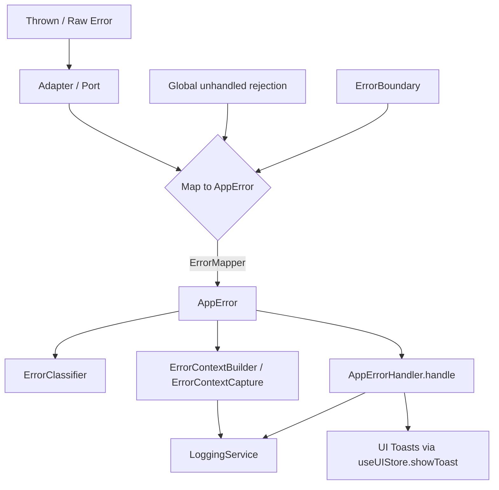
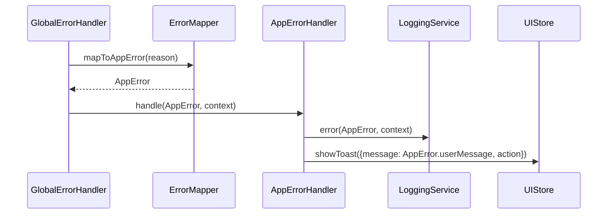
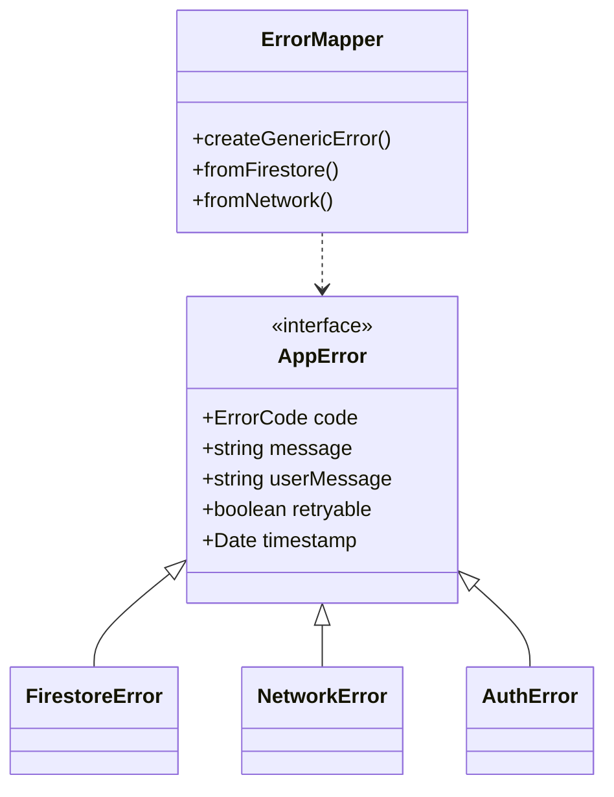
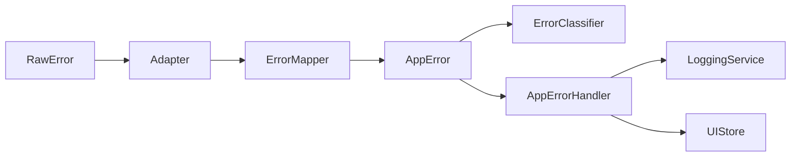
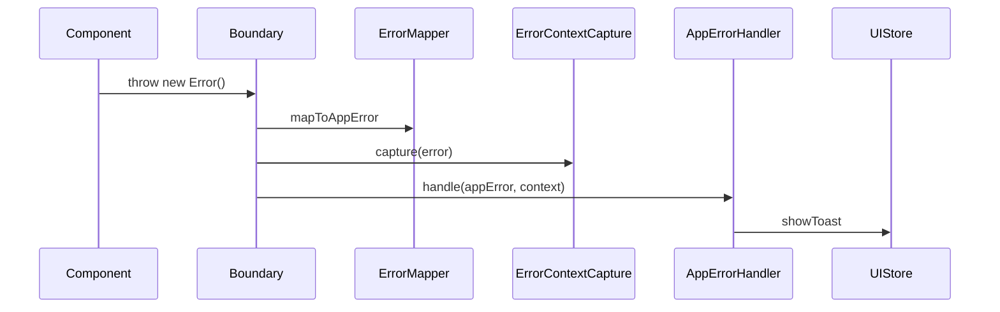

## Error Handling Guide — Full

This document describes the project's error handling system end-to-end. It explains each error-related file, how errors are classified, mapped, captured, logged, displayed, and recovered from across all layers (components, hooks, stores, services, ports/adapters). It includes production-grade examples and mermaid diagrams illustrating flows and interactions.

Date: 2025-11-10

---

## Summary

High-level error flow used across the app:

- Errors are created or mapped to AppError instances (see `src/domain/common/errors.ts`).
- External/native errors are mapped via `ErrorMapper` in `src/utils/error-mapper.ts`.
- Error context is built/enriched using `ErrorContextBuilder` and captured via `ErrorContextCapture`.
- Errors are classified by `ErrorClassifier` to decide UI treatment and recoverability.
- The central UI handling entrypoint is `AppErrorHandler.handle` (`src/services/error-handler-service.ts`), which logs (via `LoggingService`) and shows toasts (via `useUIStore`).
- Global unhandled errors are caught in `GlobalErrorHandler` and routed to the same pipeline.
- UI-level display is done by `ErrorDisplay` and `ErrorBoundary`.
- Recovery helpers (`src/utils/error-recovery.ts`) provide retry, timeout, circuit breaker, fallback and composed strategies.

---

## Files & Purpose (detailed)

Note: file paths shown are relative to the repository root.

- `src/domain/common/errors.ts`
  - Purpose: Defines the AppError interface and domain-specific error classes (AuthError, FirestoreError, NetworkError, ValidationError, PaymentError, AggregatedError, etc.).
  - What it does / Why: Provides a single typed shape for errors across layers so the UI and services can rely on stable fields (code, message, userMessage, retryable, timestamp, originalError, context).
  - Key types/props:
    - AppError: { code: ErrorCode, message: string, userMessage: string, context?: string, retryable: boolean, originalError?: unknown, timestamp: Date }
    - AggregatedError: extends AppError with `type: 'aggregated'`, `errors: Array<{operation, error}>`, `successCount`, `failureCount`.
  - Triggers / usage: Constructed by `ErrorMapper` or by domain code when raising application-specific errors.

- `src/constants/error-code-registry.ts`
  - Purpose: Central enum `ErrorCode` listing all codes used throughout the app.
  - What/Why: Single source of truth for error codes. Codes are stable keys (e.g., `AUTH_001`, `DB_001`) used for logging, i18n, monitoring, and deduplication.
  - Usage: When creating AppError instances, pass the corresponding `ErrorCode`. Also used in `ErrorClassifier` to categorize errors.

- `src/utils/error-mapper.ts`
  - Purpose: Convert raw/3rd-party/native errors into typed `AppError` instances. Create generic and aggregated AppErrors.
  - What/Why: External libs return untyped errors; mapper standardizes them so the rest of the stack can assume the `AppError` shape.
  - Important methods:
    - `createGenericError(code, message, userMessage, context?, originalError?, retryable=false): AppError`
    - `fromFirebaseAuth(error, context): AuthError`
    - `fromFirestore(error, context): FirestoreError`
    - `fromZod(error, context): ValidationError` (maps Zod validation errors to field-level messages)
    - `fromNetwork(error, context): NetworkError`
    - `fromUnknown(error, context): NetworkError` (fallback)
    - `createAggregatedError(...)` (batch failure wrapper)
  - Returns: domain-specific AppError classes (AuthError, FirestoreError, NetworkError) with correct `retryable` flags.
  - Triggers: Called by adapters, global handler, and UI boundary mapping code.

- `src/utils/error-classifier.ts`
  - Purpose: Categorize errors into `ErrorCategory` (severity, recoverability, UI display rules).
  - What/Why: Decides whether to show inline fallback vs full-screen, whether retry is allowed, and how urgent the error is.
  - Main API: `ErrorClassifier.classify(error)` returns { severity: 'critical'|'non-critical'|'recoverable', canRecover, shouldShowFullScreen, requiresUserAction }.
  - Triggers: Used by `ErrorBoundary`, `GlobalErrorHandler`, `ErrorRecovery` strategies when selecting behavior.

- `src/utils/error-context-builder.ts`
  - Purpose: Build standardized `LogContext` objects (service/repository/hook/component) with userId, projectId and metadata.
  - What/Why: Enforces consistent field names and ensures context is present when errors are logged.
  - Main API: `fromService`, `fromRepository`, `fromHook`, `fromComponent`, `withUserId`, `withProjectId`, `withMetadata`, `toString`, `fromString`.
  - Returns: `LogContext` objects used when calling `LoggingService` and `AppErrorHandler`.

- `src/utils/error-context-capture.ts`
  - Purpose: Capture runtime/environmental context: platform, appVersion, buildNumber, user actions, route, component stack.
  - What/Why: Used by global handlers and error boundaries to include telemetry context in logs and reports.
  - API: `capture(error, errorInfo)`, `recordUserAction(action)`, `setCurrentRoute(route)`, `getRecentActions()`.

- `src/utils/error-recovery.ts`
  - Purpose: Retry, fallback, timeout, circuit breaker and bulkhead utilities for transient errors.
  - What/Why: Built-in recoverability primitives to centralize retry logic and avoid ad-hoc retries across services.
  - Main exports:
    - `withRetry(operation, {maxAttempts, delayMs, exponential})` => retries only if returned AppError.retryable is true.
    - `withFallback(operation, fallbackValue)` => returns fallback on failure.
    - `withTimeout(operation, timeoutMs)` => returns `ErrorCode.NETWORK_TIMEOUT` on timeout.
    - `CircuitBreaker` and `Bulkhead` classes.
    - `withRecoveryStrategies(operation, {retry?, fallback?, timeout?})` => composes strategies.
  - Triggers: Use in services/adapters for network/database calls that may transiently fail.

- `src/services/error-handler-service.ts` (`AppErrorHandler`)
  - Purpose: Centralized error handling for caught application errors — logging, UI toasts, deduplication, aggregated error handling.
  - What/Why: Single entrypoint to ensure consistent UX and logging policy. Handles deduplication of toast messages, retry action wiring, aggregated errors.
  - Main method: `AppErrorHandler.handle(error: AppError, context?: string|LogContext, retryAction?: () => void)`
    - Logs structured error via `LoggingService.error(...)` with `LogContext` metadata.
    - Deduplicates toasts using `toastHistory` and TTL/cleanup.
    - For aggregations, creates an expandable toast with details and a `Retry Failed` action when retryable.
  - Side effects: calls `useUIStore.getState().showToast(toastConfig)` to show end-user messages.

- `src/services/global-error-handler-service.ts` (`GlobalErrorHandler`)
  - Purpose: Install global JS/native error handlers (ErrorUtils global handler and `global.onunhandledrejection`) and funnel those errors into `AppErrorHandler`.
  - What/Why: Capture uncaught exceptions and unhandled promise rejections uniformly, attach `ErrorContextCapture` data and map to `AppError` via `ErrorMapper`.
  - Methods: `initialize()`, `handleUnhandledRejection(reason)`, `handleNativeCrash(error, isFatal)`, `mapToAppError(error, context)`.
  - Notes: `initialize()` is intended to be called from app bootstrap code.

- `src/components/common/error-display.tsx`
  - Purpose: UI component to display an `AppError` with optional retry button.
  - Props: `{ error: AppError; onRetry?: () => void; testID?: string }`.
  - Behavior: shows `error.userMessage`, shows retry button only when `error.retryable` and `onRetry` provided. Uses theme/style hooks.

- `src/components/common/error-boundary.tsx`
  - Purpose: A React Error Boundary that classifies errors, maps to AppError, captures context, logs, and shows appropriate fallback UI.
  - What/Why: Catches render-time exceptions to avoid app crashes and provide friendly fallback UI or full-screen error when critical.
  - Props:
    - `fallback?: (error, reset, category) => ReactNode` - custom full-screen fallback
    - `forceFullScreen?: boolean` - force full-screen display
    - `inlineFallback?: (error, reset) => ReactNode` - component to show for inline errors
  - Triggers: catches errors in children components; uses `ErrorClassifier` and `AppErrorHandler.handle()`.

- `src/hooks/use-error-handler.ts`
  - Purpose: Small hook returning `{ handleError }` which calls `AppErrorHandler.handle`.
  - Usage: Used across hooks and components so calling code doesn't import the service directly.

---

## How the Pieces Fit (Flow)

Mermaid flowchart showing the canonical error path:



Sequence diagram (unhandled promise rejection -> handled):



Class diagram (simplified):



---

## Recommended Contracts & Patterns (short)

- All cross-boundary adapters (ports) must map external/native errors to `AppError` using `ErrorMapper` before bubbling errors upwards.
- Services should throw or return Result<T, AppError> and mark `retryable` where appropriate.
- UI components should not show raw JS error messages; use `error.userMessage` or `ErrorDisplay`.
- Use `ErrorContextBuilder` to add `component`, `method`, `userId`, `projectId`, and metadata for every logged error.
- Use `useErrorHandler()` hook in components/hooks to call the centralized `AppErrorHandler`.

---

## Examples — Production-grade (well commented)

Below are multiple examples at different levels showing mapping, catching, logging, retrying and recovery.

### 1) Adapter / Port (mapping external errors)

Purpose: Ensure all adapter code returns or throws `AppError` to the service layer.

Example: Firestore read adapter (pseudo-TS, production-ready pattern):

```ts
// src/repositories/project-repo.ts (example)
import { ErrorMapper } from '@/utils/error-mapper';
import { ErrorContextBuilder } from '@/utils/error-context-builder';
import { ErrorCode } from '@/constants/error-code-registry';

export async function getProject(docId: string, userId?: string) {
  const context = ErrorContextBuilder.fromRepository(
    'ProjectRepository',
    'getProject',
    userId,
    docId,
  );

  try {
    const doc = await firestore().collection('projects').doc(docId).get();
    if (!doc.exists) {
      // Map to typed AppError and return / throw
      throw ErrorMapper.projectNotFound(context.component + '.' + context.method);
    }

    return { success: true, data: doc.data() };
  } catch (rawError) {
    // Map raw Firestore/native error to AppError with context
    const appError = ErrorMapper.fromFirestore(rawError, ErrorContextBuilder.toString(context));
    // Option A: throw so service/store layer catches it
    throw appError;
    // Option B: return Result.err(appError) depending on the project's result pattern
  }
}
```

Why this pattern: Guarantees that services/stores never see raw error shapes and can rely on `AppError` fields like `.retryable`.

### 2) Service level — using recovery strategies

Example: Remote API call in a service with retry and timeout:

```ts
import { withRecoveryStrategies, RetryOptions } from '@/utils/error-recovery';
import { ErrorMapper } from '@/utils/error-mapper';
import { ErrorContextBuilder } from '@/utils/error-context-builder';

async function fetchUserProfile(userId: string) {
  const context = ErrorContextBuilder.fromService('UserService', 'fetchUserProfile', userId);

  return withRecoveryStrategies(
    async () => {
      try {
        const resp = await fetch(`/api/user/${userId}`);
        if (!resp.ok) throw new Error(`Status ${resp.status}`);
        const json = await resp.json();
        return { success: true, data: json };
      } catch (err) {
        // Map network or unknown error
        const appErr = ErrorMapper.fromNetwork(err, ErrorContextBuilder.toString(context));
        return { success: false, error: appErr };
      }
    },
    {
      retry: { maxAttempts: 3, delayMs: 500, exponential: true },
      timeout: 5000,
      // fallback optional
    },
  );
}
```

Notes: `withRecoveryStrategies` composes timeout -> retry -> fallback. Retry only occurs when `error.retryable === true`.

### 3) Store / State management — catching and presenting errors

Pattern: store action returns a `Result` and uses `AppErrorHandler` to show UI notifications.

```ts
// src/stores/user-store.ts (pseudocode)
import { AppErrorHandler } from '@/services/error-handler-service';
import { ErrorContextBuilder } from '@/utils/error-context-builder';

export const useUserStore = create(set => ({
  async loadProfile(userId: string) {
    const context = ErrorContextBuilder.fromService('UserStore', 'loadProfile', userId);

    try {
      const result = await userService.fetchUserProfile(userId);
      if (!result.success) {
        // Display user-facing toast and possible retry
        AppErrorHandler.handle(result.error, context, () => this.loadProfile(userId));
        return;
      }

      set({ profile: result.data });
    } catch (err) {
      // Map unexpected errors and handle
      const appErr = ErrorMapper.fromUnknown(err, ErrorContextBuilder.toString(context));
      AppErrorHandler.handle(appErr, context);
    }
  },
}));
```

### 4) Hook / Component level — useErrorHandler and ErrorBoundary

Use `useErrorHandler()` to avoid importing `AppErrorHandler` directly:

```tsx
import { useErrorHandler } from '@/hooks/use-error-handler';
import { ErrorDisplay } from '@/components/common/error-display';

function ProjectScreen({ projectId }) {
  const { handleError } = useErrorHandler();

  async function load() {
    try {
      const res = await projectRepo.getProject(projectId);
      // ...
    } catch (appError) {
      // appError is AppError (adapter mapped)
      handleError(appError, `ProjectScreen.load:${projectId}`, () => load());
    }
  }

  // For render-time exceptions, wrap with ErrorBoundary at the screen level
  return (
    <ErrorBoundary>
      <ProjectContents />
    </ErrorBoundary>
  );
}
```

`ErrorBoundary` will classify, map and call `AppErrorHandler.handle()` automatically for render-time exceptions.

### 5) Component-level display with retry

Use `ErrorDisplay` to render errors in an inline or full-screen fallback:

```tsx
<ErrorDisplay error={someAppError} onRetry={() => retryAction()} />
```

The component only renders a retry button if `someAppError.retryable === true` and `onRetry` is provided.

---

## Adding / Handling New Errors (Step-by-step templates)

These are step-by-step instructions and templates for adding new errors and ensuring consistent behavior across layers.

1. Add a new error code
   - Edit `src/constants/error-code-registry.ts` and add a new `ErrorCode` entry with a stable key.
   - Example:
     - `AUTH_TOKEN_EXPIRED = 'AUTH_008'`

2. Map incoming errors to the new code in the adapter
   - If the error originates from an external library (e.g., Firebase), add a mapping in `ErrorMapper.fromFirestore` or a suitable `fromX` method.
   - Example:
     ```ts
     if (message.includes('token-expired')) {
       code = ErrorCode.AUTH_TOKEN_EXPIRED;
       userMessage = 'Your login session expired. Please sign in again.';
       retryable = false; // user must re-authenticate
     }
     ```

3. Update ErrorClassifier if behavior differs
   - If this code should force a full-screen UI (e.g., session-expired), add it to `criticalCodes` in `ErrorClassifier.classifyAppError`.

4. Wire a handler when required
   - If the code requires a special user action (like redirect to login), call `AppErrorHandler.handle(appError, context, () => /* retry or action */)` and implement the retryAction to navigate to the login flow.

5. Add tests
   - Add unit tests for `ErrorMapper` mapping, `ErrorClassifier` classification and `AppErrorHandler` show/dedup behaviors.

6. Add UI copy / i18n
   - Make sure any `userMessage` matches product copy and is translatable if you use i18n.

7. Instrument monitoring
   - Add an entry to monitoring dashboards to alert when this code appears above a threshold.

---

## Editing / Removing Errors & Codes

- When retiring an `ErrorCode`:
  1. Search repository for the code constant and replace usages or migrate them to a new code.
  2. Update `ErrorMapper` mapping and `ErrorClassifier` if needed.
  3. Deprecate the code in monitoring and remove from `error-code-registry` after a release cycle.
  4. Update tests and documentation.

- When modifying user-facing copy (`userMessage`):
  - Change in `ErrorMapper` or where the error is created.
  - Update front-end integration and i18n resources.

---

## Deciding If Retry Should Be Required (Guidelines)

Use these rules to decide `AppError.retryable`:

- Transient network errors (timeouts, DNS, short lived server errors) -> retryable = true.
- Rate-limits or server overload that may resolve soon -> retryable = true (but with exponential backoff).
- Permission, authentication, validation errors -> retryable = false (requires user action).
- Non-idempotent operations (create/charge) -> prefer fallback/partial recovery, not automatic retry.
- Circuit-breaker opens when consecutive retry attempts fail — prefer failing fast and surfacing user message.

Checklist to choose retry:

1. Is the operation idempotent? (yes -> safe to retry)
2. Is the failure transient (network/timeouts)? (yes -> retryable)
3. Does retry risk duplication or financial impact? (yes -> avoid retry)

---

## Ensuring Consistent Usage (Enforcement & Guidance)

- Pattern review: All new adapters must include a mapping to `AppError`.
- Lint rule ideas (not implemented here): require `ErrorMapper` usage when referencing external API calls in repository files.
- PR checklist additions:
  - "Mapped external errors to AppError using ErrorMapper"
  - "Added LogContext using ErrorContextBuilder"
  - "Added unit test for error mapping or classifier if behavior changed"

---

## Example: Adding a New Error Code (Detailed)

1. Add code in `src/constants/error-code-registry.ts`:

```ts
  // near AUTH errors
  AUTH_TOKEN_EXPIRED = 'AUTH_008',
```

2. Map in `ErrorMapper.fromFirebaseAuth` or `mapToAppError`:

```ts
if (message.includes('token-expired')) {
  return new AuthError(
    ErrorCode.AUTH_TOKEN_EXPIRED,
    message,
    'Session expired. Please sign in again.',
    context,
    originalError,
    false,
  );
}
```

3. If this is critical (force re-auth), add to `ErrorClassifier.criticalCodes`.

4. Add unit tests in `__tests__/utils/error-mapper.spec.ts` and `error-classifier.spec.ts`.

5. Update handlers or UI flows that need to redirect to auth screen when `AUTH_TOKEN_EXPIRED` appears.

---

## Troubleshooting & Observability

- All AppErrors are logged via `LoggingService.error` with context metadata from `ErrorContextBuilder` and `ErrorContextCapture`.
- For aggregated failures, the `AggregatedError` contains sub-errors which should be visible in logs.

Suggested monitors:

- Alert on rate of `ErrorCode.UNKNOWN_ERROR` to spot unmapped conditions.
- Alert on `AUTH_SESSION_EXPIRED` increases to diagnose token expiry issues.

---

## Mermaid Diagrams (reference)

Flow (compact):



Sequence (component throws -> boundary handles):



---

## Quick Reference: Where to call what

- Adapters/Ports: call `ErrorMapper.fromX` and include `ErrorContextBuilder`.
- Services: use recovery wrappers from `error-recovery.ts`, and return `Result<T, AppError>` or throw `AppError` consistently.
- Stores: call `AppErrorHandler.handle` for UI-level side effects; do not render raw messages.
- UI Components: use `useErrorHandler()` and `ErrorBoundary` to surface errors.

---

## Closing / Next Steps

Files created/edited in this task: this guide at the repo root `Guide-Errors-Full.md`.

Recommended follow-ups:

1. Add unit/integration tests for new error mapping patterns.
2. Add optional lint rules or PR checklist items enforcing mapper usage in adapters.
3. Wire a production error reporting service (Sentry / Datadog) in `AppErrorHandler` in addition to `LoggingService`.
4. Add automatic i18n keys mapping from `ErrorCode` to user messages if multi-language support is required.

---

If you want, I can now:

- commit this file to the branch (done), run a quick search to ensure all error codes referenced in code are present in `error-code-registry.ts`, and generate suggested unit tests scaffolding for the newly-documented flows.
