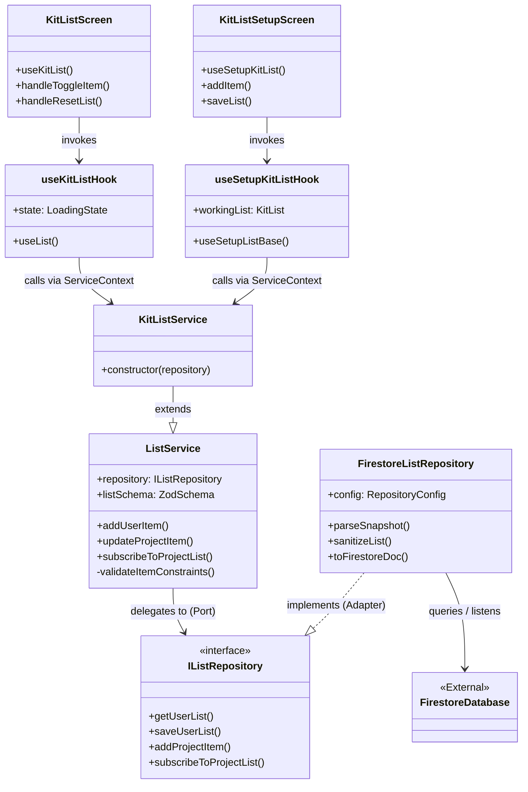
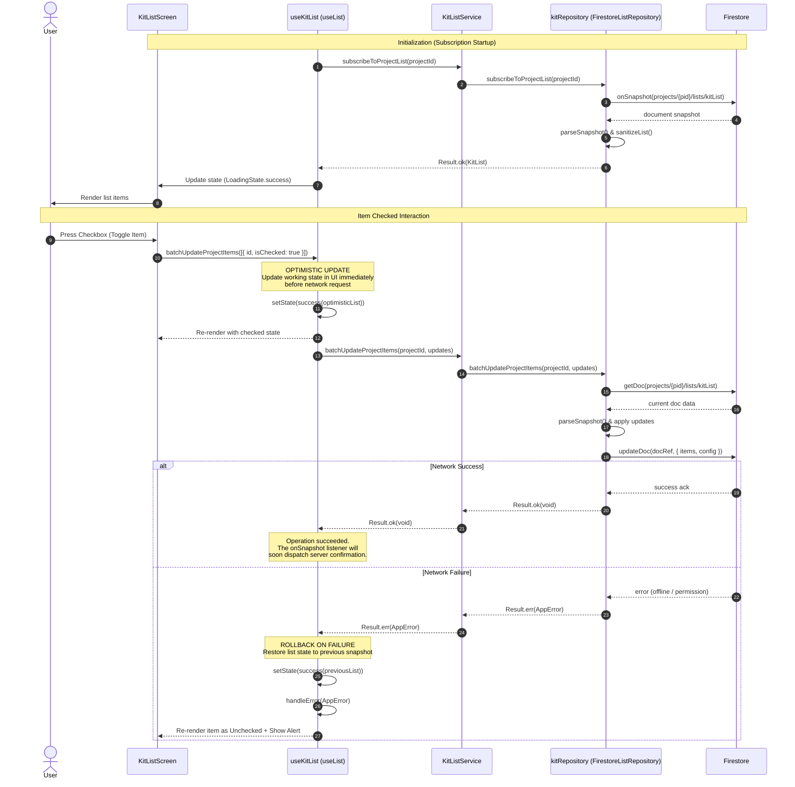
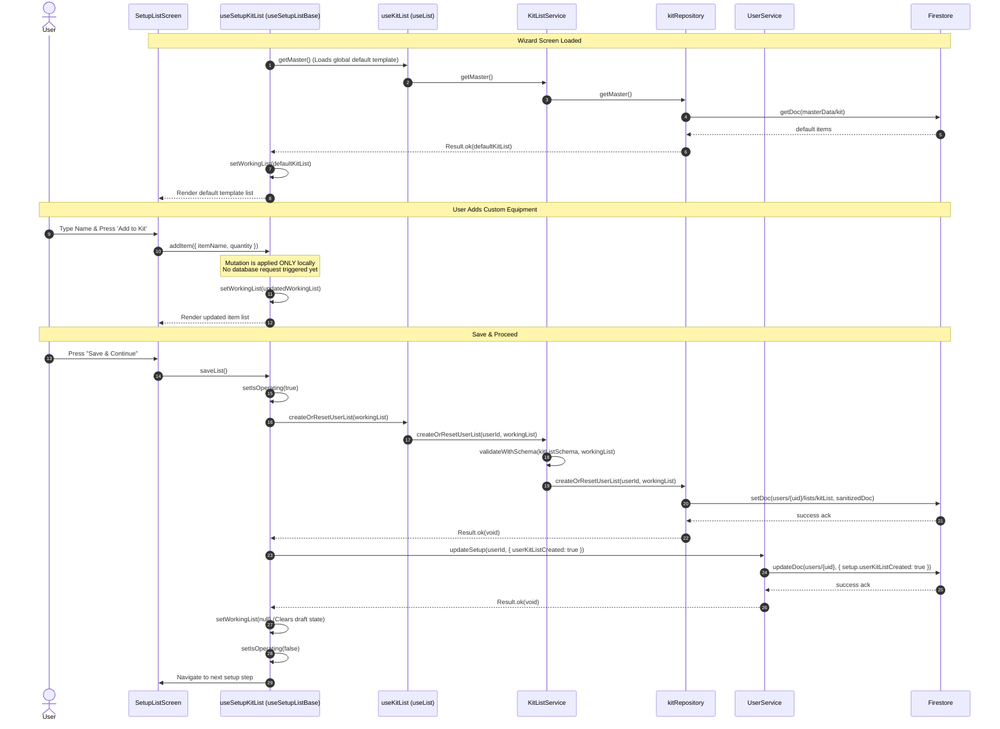
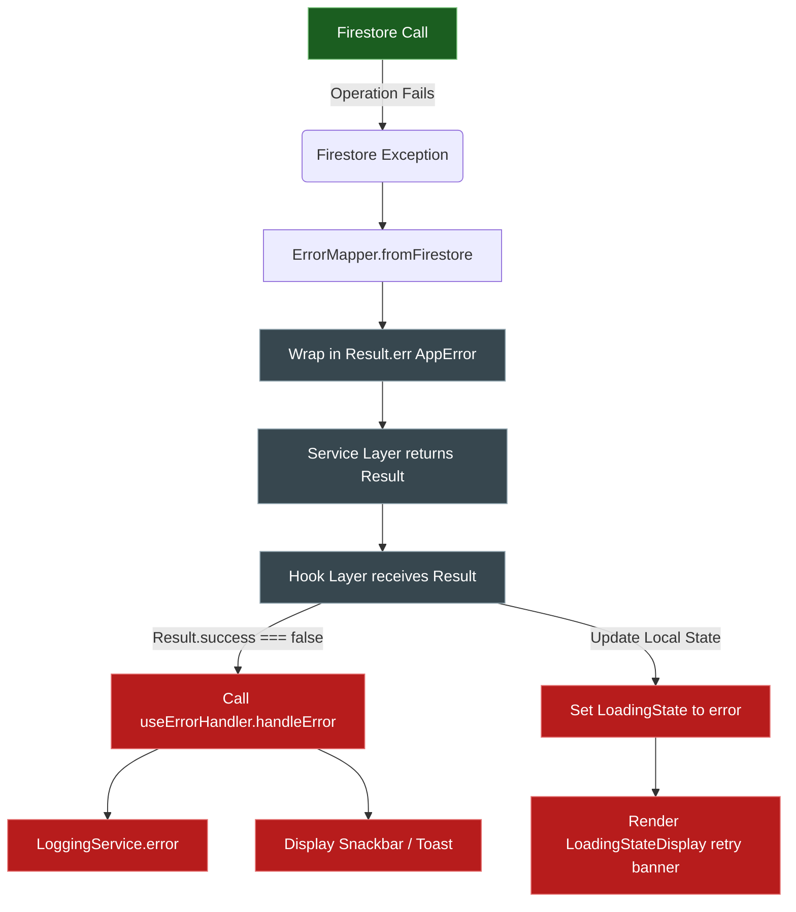

# Mobile Kit Module Architecture & Data Flows

This document details the architecture, component relationships, data flow patterns, database schema paths, validation rules, and error handling behaviors for the **Kit List module** (equipment and gear management) in the Eye-Doo mobile application.

---

## 1. Directory Structure & Key Files

The Kit List module utilizes a **Clean Architecture / Ports & Adapters** design, maintaining a strict unidirectional data flow and domain separation.

*   **Domain & Schema Definition:**
    *   [kit.schema.ts](file:///c:/eye-doo-monorepo/packages/domain/src/project/kit.schema.ts) — Single source of truth for Kit schemas, types, and defaults.
*   **User Interface & Forms:**
    *   [kit-list.tsx](file:///c:/eye-doo-monorepo/apps/mobile/src/app/(protected)/(app)/(dashboard)/(lists)/kit-list.tsx) — The dashboard interactive checklist screen.
    *   [kit.tsx](file:///c:/eye-doo-monorepo/apps/mobile/src/app/(protected)/(setup)/kit.tsx) — The onboarding setup page utilizing `SetupListScreen`.
    *   [kit-item-form.config.ts](file:///c:/eye-doo-monorepo/apps/mobile/src/components/forms/configs/kit-item-form.config.ts) — Renders the glassmorphic add/edit bottom-sheet form via `UnifiedFormModal`.
*   **Hooks (State & Lifecycle):**
    *   [list-hooks.ts](file:///c:/eye-doo-monorepo/apps/mobile/src/hooks/list-hooks.ts) — Declares `useKitList()`.
    *   [use-generic-list.ts](file:///c:/eye-doo-monorepo/apps/mobile/src/hooks/use-generic-list.ts) — Central custom React hook (`useList()`) that manages local list state, loading states, real-time database listener bindings, and optimistic UI updates/rollbacks.
    *   [use-setup-list.ts](file:///c:/eye-doo-monorepo/apps/mobile/src/hooks/setup/use-setup-list.ts) — Onboarding hook (`useSetupKitList()`) managing draft list modifications locally before final batch validation & submission.
*   **Business Logic (Services):**
    *   [kit-list-service.ts](file:///c:/eye-doo-monorepo/apps/mobile/src/services/kit-list-service.ts) — Specific domain service subclass.
    *   [list-service.ts](file:///c:/eye-doo-monorepo/apps/mobile/src/services/list-service.ts) — Generic orchestration service encapsulating max count restrictions and category ownership checks.
*   **Data Access (Repositories):**
    *   [i-list-repository.ts](file:///c:/eye-doo-monorepo/apps/mobile/src/repositories/i-list-repository.ts) — Interface definition (Port) ensuring decoupleability.
    *   [firestore-list-repository.ts](file:///c:/eye-doo-monorepo/apps/mobile/src/repositories/firestore/firestore-list-repository.ts) — Concrete Firebase Firestore implementation (Adapter).
    *   [list.repository.ts](file:///c:/eye-doo-monorepo/apps/mobile/src/repositories/firestore/list.repository.ts) — Singleton instance declarations (`kitRepository`).
    *   [firestore-list-paths.ts](file:///c:/eye-doo-monorepo/apps/mobile/src/repositories/firestore/paths/firestore-list-paths.ts) — Registry of Firestore document key templates.
*   **Utility & Cross-cutting:**
    *   [list-utils.ts](file:///c:/eye-doo-monorepo/apps/mobile/src/utils/list-utils.ts) — Item calculations, type guards, and total updates.

---

## 2. High-Level Component Relationship

The following class/dependency diagram illustrates the Port-Adapter mapping, showcasing how components interact. The UI layer speaks only to Hook wrappers, which access Services via a React `ServiceContext`. The Service layer drives business validations and calls the Repository interface, which maps to the concrete Firestore adapter.



---

## 3. Database Schema & Path Configuration

Kit lists are organized at three levels in Firestore, matching the user experience progression:

| Level | Path Registry | Firestore Path Template | Purpose |
| :--- | :--- | :--- | :--- |
| **Master Default** | `MASTER_LIST_PATHS.KIT` | `/masterData/kit` | Global static template containing default categories & core items. |
| **User Template** | `USER_LIST_PATHS.KIT` | `/users/{userId}/lists/kitList` | User-customized master template. Modified during setup and cloned when creating new projects. |
| **Project Instance** | `PROJECT_LIST_PATHS.KIT` | `/projects/{projectId}/lists/kitList` | Active project instance list. Checkmarks checked/unchecked here represent project-specific equipment states. |

### Zod Validation Constraints
*   **KitList Schema:** Contains a `config` (metadata), an array of `categories`, an array of `items`, and a `pendingUpdates` array.
*   **Category Limit:** Maximum of 100 items per category.
*   **Total List Limit:** Maximum of 500 items per list (validated in [list-service.ts](file:///c:/eye-doo-monorepo/apps/mobile/src/services/list-service.ts)).
*   **Kit Item Schema:** Quantity must be an integer, min value 1 (Zod validation: `z.number().int().min(1)`).

---

## 4. Primary Data Flows

### Flow A: Interactive Checklist (Dashboard Screen)

This flow illustrates what happens when a user toggles an equipment item on their dashboard. It utilizes a **real-time subscription** combined with a **local optimistic update**. If the Firestore operation fails, the state rolls back to the previous snapshot.



---

### Flow B: Onboarding Wizard (Setup Screen)

During the first-time app setup, the user configures their template equipment. Instead of hitting the database for every single custom item addition or quantity change, mutations are applied **entirely to local state**. A single batch database request is fired only when the user presses **"Save & Continue"**.



---

## 5. Normalization, Checks, & Defensive Parsing

Data validation and sanitization are applied at multiple architectural boundaries to ensure Firestore schema errors cannot crash the application:

```
[UI Layer] ---> [Service Layer] ------------------> [Repository Layer] ---------> [Firestore]
                  - Max Items Check                   - Sanitization Helpers
                  - Category Exists Check             - Date/Timestamp Converter
                  - Zod Input Parsing                 - Zod Defensive Parsing
```

### 1. Business Logic Checks (Service Boundary)
In `ListService.validateItemConstraints()`, when adding/editing items:
*   **Total Items Guard:** Rejects operation if list size $\ge 500$ items.
*   **Category Exists Guard:** Validates that the item's `categoryId` matches an ID within `list.categories`.
*   **Category Limit Guard:** Caps items at 100 per category to prevent document size growth issues in sub-lists.

### 2. Sanitization (Repository Output Boundary)
Before writing data to Firestore in `FirestoreListRepository.sanitizeList()`:
*   **Strings:** `sanitizeString()` cleans up whitespace, strips carriage returns, and strips malicious HTML.
*   **Deep Clean:** `removeUndefinedValuesDeep()` deletes any properties with undefined values to prevent Firestore serialization crashes.
*   **Metadata Sync:** Re-tallies `totalItems` and `totalCategories` dynamically based on actual arrays, ensuring counters remain consistent.

### 3. Defensive Parsing & Normalization (Repository Input Boundary)
When reading raw documents from Firestore inside `FirestoreListRepository.parseSnapshot()`:
*   **Timestamp Conversion:** Firestore timestamps are converted to JS Date objects recursively using `convertAllTimestamps()`.
*   **Normalizers:** Legacy lists (e.g. key people roles, priority keys) are dynamically translated into modern schema values before schema checks.
*   **Schema Enforcement:** The object runs through `ZodSchema.safeParse()`. If a validation mismatch occurs (e.g. data corruption by third-party tools/admins):
    *   It blocks corrupt data from reaching the UI.
    *   Logs a detailed error report containing the document path and missing fields using `LoggingService.error()`.
    *   Returns a safe railway error state `Result.err(AppError)` with code `DB_VALIDATION_ERROR` rather than throwing a runtime error.

---

## 6. Railway-Oriented Error Handling Flow

The mobile app does not throw async exceptions. Operations return `Result<T, AppError>`. This structure is propagated cleanly to the screen, where the custom hook wraps error logging and displays UI notices.



> [!IMPORTANT]
> **Key Error Scenarios Handled:**
> 1. **Offline Writes:** The repository utilizes Firebase's local caching. If a write fails permanently, the hook rolls back the optimistic state.
> 2. **Authentication Loss:** If the user session times out during a list operation, the path helper fails safely, the repository returns a `DB_PERMISSION_DENIED` mapped error, and the user is redirected to the login flow.
