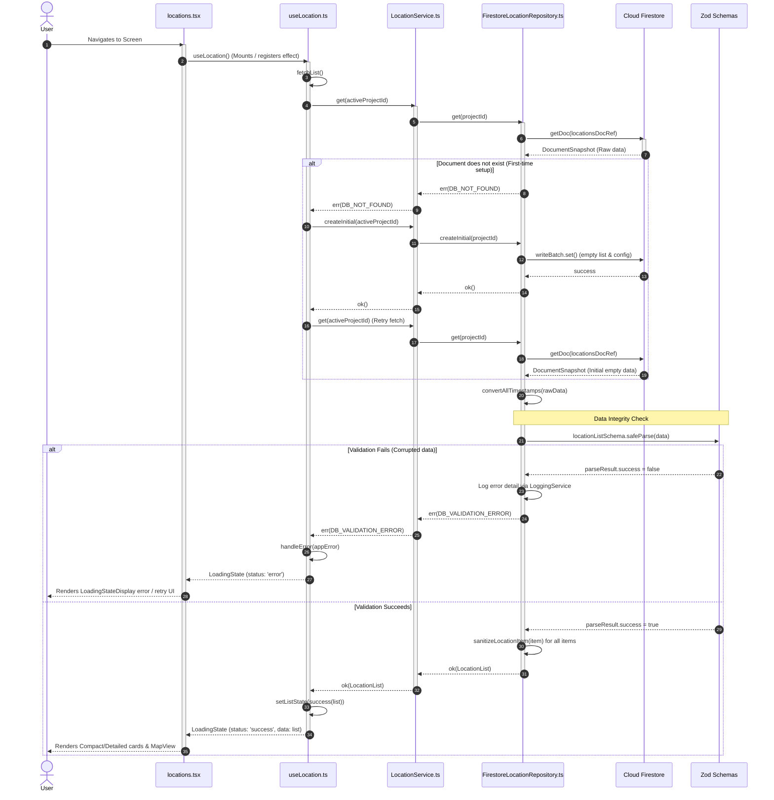
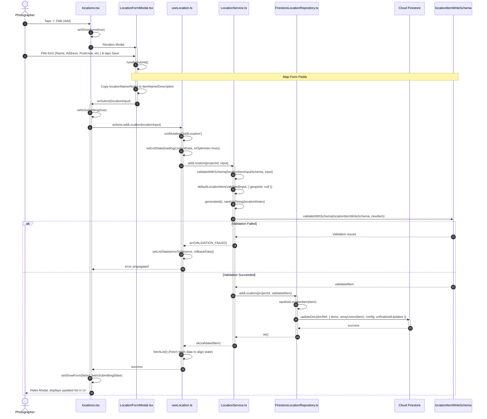
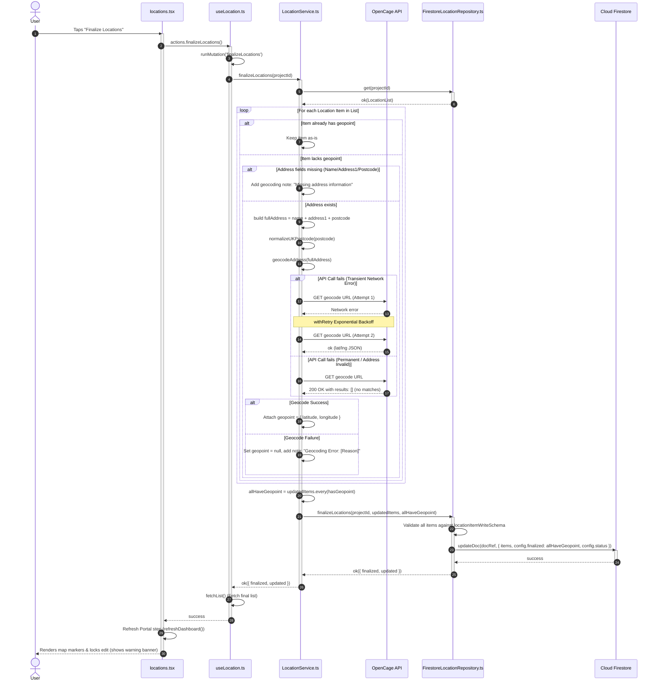
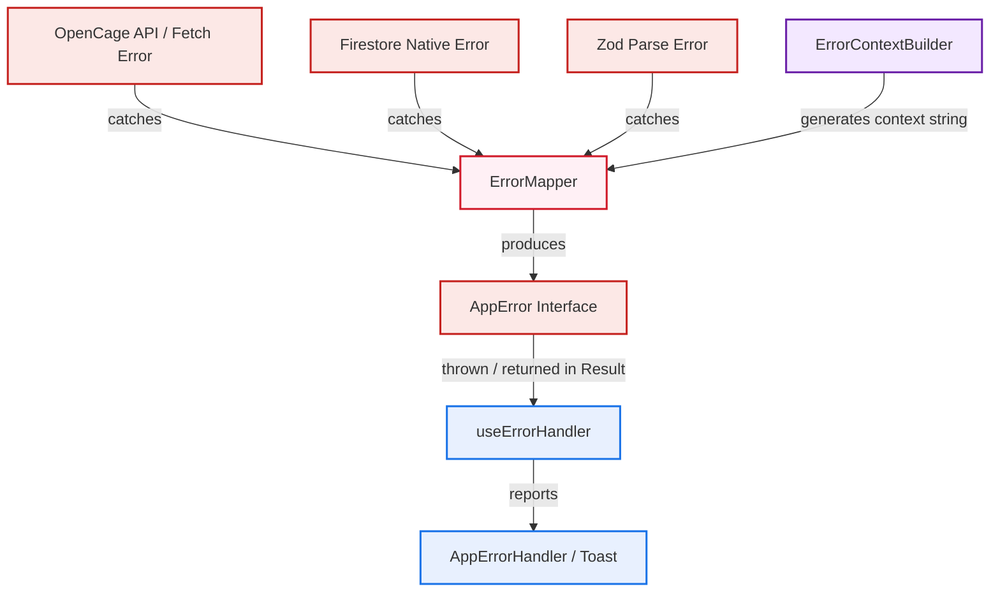

# Mobile Locations Module Architecture

This document maps out the architecture and data flows of the **Locations Module** in the Eye-Doo React Native application. It details how the UI components, forms, custom hooks, business logic services, repositories, and cross-cutting utility layers interact to provide a premium, type-safe, and robust experience.

---

## 1. High-Level Component & Architecture Overview

The Locations module follows a clean **Ports & Adapters (Clean Architecture)** design with domain-first principles. Data flows unidirectionally from the UI screen down to Firestore and back up via reactive subscriptions.

```mermaid
graph TD
    %% Styling
    classDef ui fill:#E8F0FE,stroke:#1A73E8,stroke-width:2px;
    classDef hook fill:#FFF0F5,stroke:#D11A2A,stroke-width:2px;
    classDef service fill:#E6F4EA,stroke:#137333,stroke-width:2px;
    classDef repo fill:#FEF7E0,stroke:#B06000,stroke-width:2px;
    classDef ext fill:#F1F3F4,stroke:#3C4043,stroke-width:2px;
    classDef util fill:#F3E8FF,stroke:#6B21A8,stroke-width:2px;

    %% Elements
    subgraph UI Layer [UI & Component Layer]
        Screen[[locations.tsx]]:::ui
        FormModal[LocationFormModal.tsx]:::ui
        CompactCard[CompactLocationCard.tsx]:::ui
        DetailedCard[DetailedLocationCard.tsx]:::ui
        LegacyCard[LocationCard.tsx]:::ui
    end

    subgraph Configs & Constants [Configs & Constants]
        FormConfig[location-form.config.ts]:::util
        CopyContent[dashboard-home-content.ts]:::util
    end

    subgraph State & Hook Layer [Hooks & Local State]
        LocationHook[useLocation.ts Hook]:::hook
        ProjStore[useActiveProjectId Store]:::hook
        FeatureHook[useFeatureAccess Hook]:::hook
        PortalHook[usePortalStepStatusCard Hook]:::hook
    end

    subgraph Service Layer [Business & Logic Layer]
        SvcFactory[ServiceFactory.ts]:::service
        LocService[LocationService.ts]:::service
    end

    subgraph Repository Layer [Data Access Layer]
        Port[ILocationRepository.ts Port]:::repo
        Adapter[FirestoreLocationRepository.ts Adapter]:::repo
    end

    subgraph External [External Services]
        Firestore[(Cloud Firestore)]:::ext
        OpenCage[OpenCage Geocoding API]:::ext
        GoogleMaps[Google Maps / Native Link]:::ext
    end

    subgraph Utils [Cross-Cutting Utilities]
        Sanitizer[sanitization-helpers.ts]:::util
        Validator[validation-helpers.ts]:::util
        DisplayHelpers[location-display-helpers.ts]:::util
        ErrorMapper[error-mapper.ts]:::util
        ErrorContext[error-context-builder.ts]:::util
    end

    %% Interactions
    Screen -->|reads state & dispatches| LocationHook
    Screen -->|controls visibility| FormModal
    Screen -->|renders| CompactCard
    Screen -->|renders| DetailedCard
    Screen -->|renders| LegacyCard
    Screen -->|fetches limits| FeatureHook
    Screen -->|syncs portal step| PortalHook

    FormModal -->|validates using| FormConfig
    FormConfig -->|uses copy from| CopyContent
    CompactCard & DetailedCard & LegacyCard -->|formats display with| DisplayHelpers

    LocationHook -->|gets active ID| ProjStore
    LocationHook -->|obtains instance| SvcFactory
    LocationHook -->|delegates operations to| LocService

    LocService -->|uses contract| Port
    LocService -->|calls OpenCage API| OpenCage
    LocService -->|triggers directions url| GoogleMaps
    LocService -->|validates schemas| Validator
    LocService -->|sanitizes strings| Sanitizer

    Port -.->|implemented by| Adapter
    SvcFactory -->|injects repository| Adapter
    Adapter -->|reads / writes document| Firestore
    Adapter -->|parses / validates snapshot| Validator
    Adapter -->|sanitizes loaded database data| Sanitizer

    %% Error Handling Connections
    LocationHook & LocService & Adapter -.->|maps exceptions| ErrorMapper
    LocationHook & LocService & Adapter -.->|builds diagnostic info| ErrorContext
```

---

## 2. Data Flow: Fetching & Data Integrity Parse

This sequence illustrates how locations are loaded reactively from Firestore, parsed against domain Zod schemas, sanitized, and fed into the UI.

---

## 3. Data Flow: Adding or Editing a Location

The process of collecting, validating, sanitizing, and committing a new location item.

---

## 4. Finalization & Geocoding Pipeline

Geocoding coordinates via the OpenCage API happens when the user clicks **Finalize Locations**.

---

## 5. Unified Error Handling & Context Mapping

How errors from various boundary failures (API, database, schema validation) are mapped, enriched with debugging context, and handled.

### Contextual Enrichment Example
When an error occurs, class/method details and entity details are collected:
1. **Repository layer**: `ErrorContextBuilder.fromRepository('FirestoreLocationRepository', 'addLocation', undefined, projectId, { itemId })`
2. **Service layer**: `ErrorContextBuilder.fromService('LocationService', 'addLocation', undefined, projectId, { locationName })`
3. **Hook layer**: `ErrorContextBuilder.fromHook('useLocation', 'addLocation', undefined, projectId)`

This makes debugging production issues easy by outputting a fully traced context string:
`[Hook:useLocation.addLocation][Service:LocationService.addLocation][Repository:FirestoreLocationRepository.addLocation] Project: {projectId}, Item: {itemId}`

---

## 6. Location Code Map (Files Directory)

| File / Component | Type | Responsibility / Description |
| :--- | :--- | :--- |
| [locations.tsx](file:///c:/eye-doo-monorepo/apps/mobile/src/app/(protected)/(app)/(dashboard)/(home)/locations.tsx) | **Screen** | Main layout container, segmented toggle between list views, finalize button, and MapView wrapper. |
| [LocationFormModal.tsx](file:///c:/eye-doo-monorepo/apps/mobile/src/components/dashboard/locations/LocationFormModal.tsx) | **Form Component** | Modal containing the unified form. Maps fields to input schema. |
| [location-form.config.ts](file:///c:/eye-doo-monorepo/apps/mobile/src/components/forms/configs/location-form.config.ts) | **Form Config** | Defines layout grids (groups, horizontal spacing, inputs) and validation schemas. |
| [CompactLocationCard.tsx](file:///c:/eye-doo-monorepo/apps/mobile/src/components/dashboard/locations/CompactLocationCard.tsx) | **UI Component** | Small list card focusing on names, addresses, and select checkmarks. |
| [DetailedLocationCard.tsx](file:///c:/eye-doo-monorepo/apps/mobile/src/components/dashboard/locations/DetailedLocationCard.tsx) | **UI Component** | Larger card displaying travel details, coordinate status, and directions actions. |
| [LocationCard.tsx](file:///c:/eye-doo-monorepo/apps/mobile/src/components/dashboard/locations/LocationCard.tsx) | **UI Component** | Legacy detail card fallback containing edit/delete action triggers directly in the header. |
| [use-location.ts](file:///c:/eye-doo-monorepo/apps/mobile/src/hooks/use-location.ts) | **Custom Hook** | Composition hook handling component level loading/error state management and callbacks. |
| [location-service.ts](file:///c:/eye-doo-monorepo/apps/mobile/src/services/location-service.ts) | **Domain Service** | Orchestrates geocoding API, postcode validation, formatting URLs for maps application launching. |
| [i-location-repository.ts](file:///c:/eye-doo-monorepo/apps/mobile/src/repositories/i-location-repository.ts) | **Port** | Contract defining all database methods (get, config updates, write, list subscription). |
| [firestore-location-repository.ts](file:///c:/eye-doo-monorepo/apps/mobile/src/repositories/firestore/firestore-location-repository.ts) | **Adapter** | Concrete repository storing coordinates list inside `projectOnlyLists/locations` in Firestore. |
| [ServiceFactory.ts](file:///c:/eye-doo-monorepo/apps/mobile/src/services/ServiceFactory.ts) | **Dependency Injector** | Singleton managing instances and injecting dependencies (e.g. repo into service). |
| [location-display-helpers.ts](file:///c:/eye-doo-monorepo/apps/mobile/src/utils/presentation/location-display-helpers.ts) | **Utility** | Presentation layer formatting helpers for address concatenations, time range strings. |
