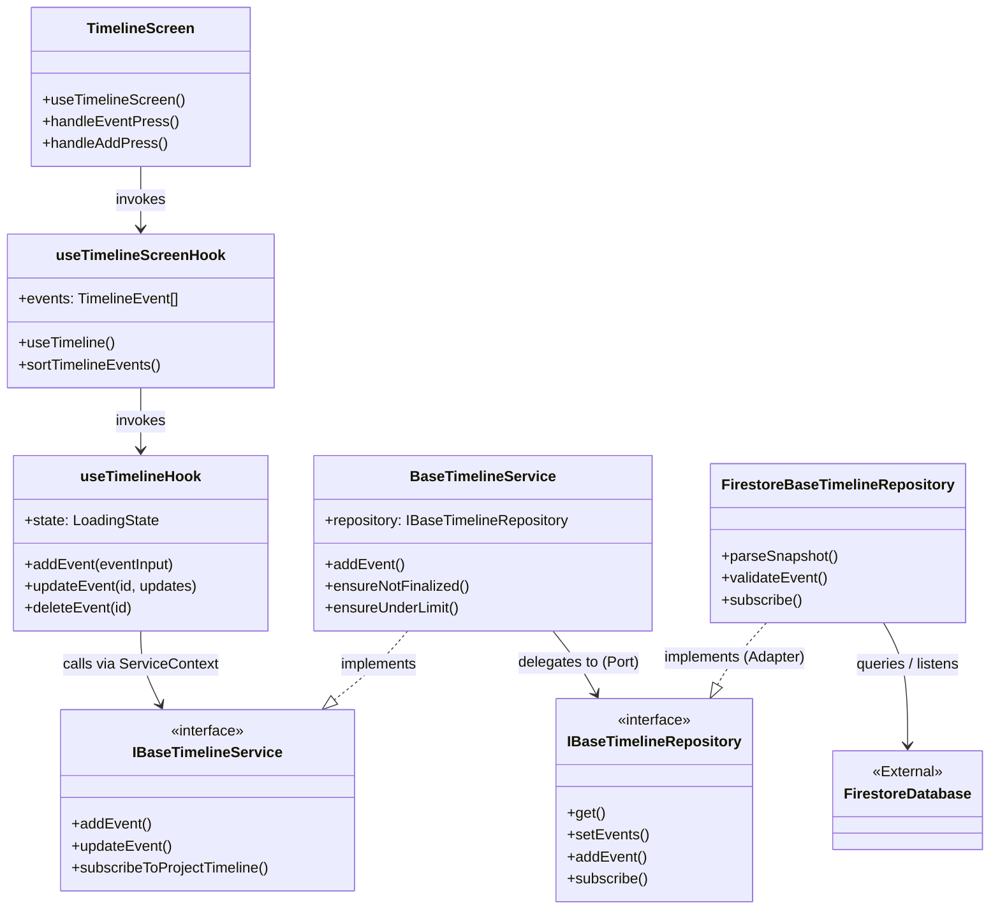
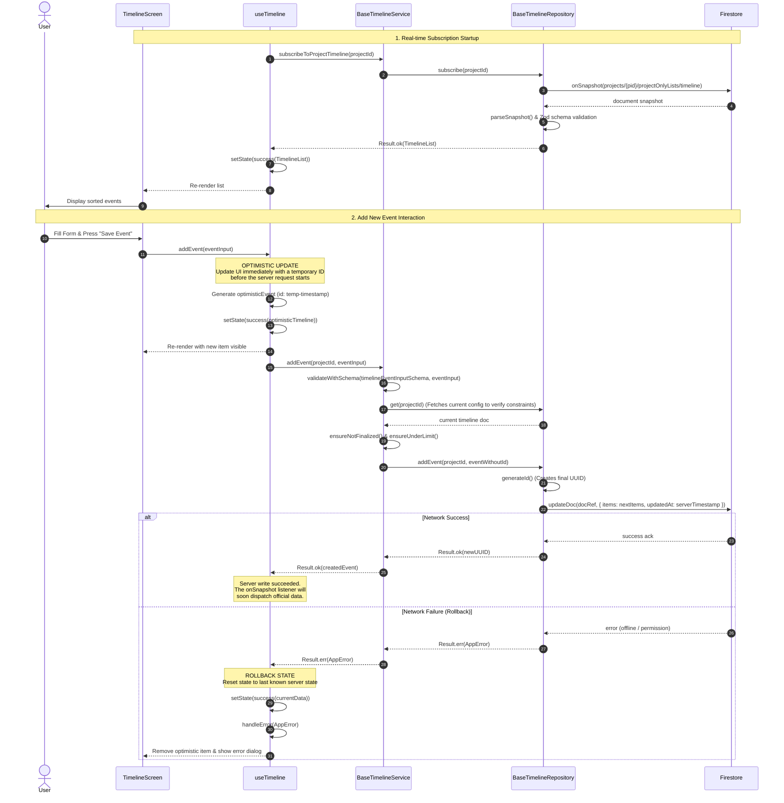
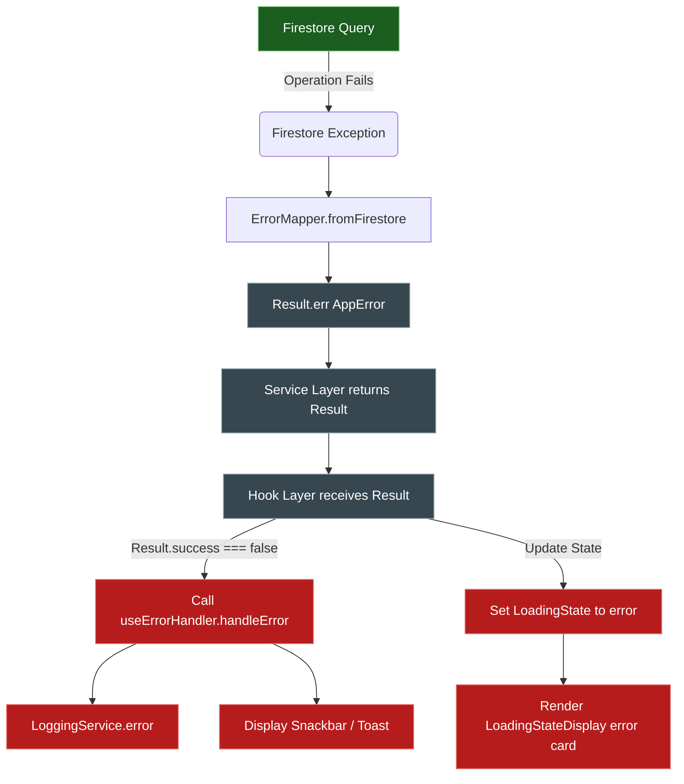

# Mobile Timeline Module Architecture & Data Flows

This document details the architecture, component relationships, data flow patterns, database schema paths, validation rules, and error handling behaviors for the **Project Timeline module** (schedule and chronological wedding day events management) in the Eye-Doo mobile application.

---

## 1. Directory Structure & Key Files

The Timeline module follows a strict **Clean Architecture / Ports & Adapters** design, separating UI views, local state hooks, business services, and database adapters.

*   **Domain & Schema Definition:**
    *   [timeline.schema.ts](file:///c:/eye-doo-monorepo/packages/domain/src/project/timeline.schema.ts) — Source of truth for timeline and event schemas, types, default values, and time sequence validation rules.
*   **User Interface & Screens:**
    *   [index.tsx](file:///c:/eye-doo-monorepo/apps/mobile/src/app/(protected)/(app)/(dashboard)/(timeline)/index.tsx) — Main timeline list view, utilizing `FlatList` to render event sequences.
    *   [edit.tsx](file:///c:/eye-doo-monorepo/apps/mobile/src/app/(protected)/(app)/(dashboard)/(timeline)/edit.tsx) — Event creation/modification editor screen (currently holds placeholder layout).
    *   [TimelineEventCard.tsx](file:///c:/eye-doo-monorepo/apps/mobile/src/components/dashboard/timeline/TimelineEventCard.tsx) — Renders individual cards detailing event type icons, times, and notes.
*   **Hooks (State & Lifecycle):**
    *   [use-timeline-screen.ts](file:///c:/eye-doo-monorepo/apps/mobile/src/hooks/use-timeline-screen.ts) — Custom layout hook sorting items chronologically and fetching active project IDs.
    *   [use-timeline.ts](file:///c:/eye-doo-monorepo/apps/mobile/src/hooks/use-timeline.ts) — Core hook implementing local state management, subscription handlers, and optimistic updates.
    *   [use-project-timeline.ts](file:///c:/eye-doo-monorepo/apps/mobile/src/hooks/use-project-timeline.ts) — Simple project-scoped wrapper around `useTimeline`.
*   **Global Stores (Caching & Background Context):**
    *   [use-timeline-store.ts](file:///c:/eye-doo-monorepo/apps/mobile/src/stores/use-timeline-store.ts) — Declares a global Zustand store for cross-cutting synchronization (declared but bypassed in favor of local hook subscriptions in the active dashboard screens).
*   **Business Logic (Services):**
    *   [base-timeline-service.ts](file:///c:/eye-doo-monorepo/apps/mobile/src/services/base-timeline-service.ts) — Validates events and applies business finalization/limit guards.
*   **Data Access (Repositories):**
    *   [i-base-timeline-repository.ts](file:///c:/eye-doo-monorepo/apps/mobile/src/repositories/i-base-timeline-repository.ts) — Repository interface Port.
    *   [firestore-base-timeline-repository.ts](file:///c:/eye-doo-monorepo/apps/mobile/src/repositories/firestore/firestore-base-timeline-repository.ts) — Concrete Firestore Adapter.
    *   [firestore-project-paths.ts](file:///c:/eye-doo-monorepo/apps/mobile/src/repositories/firestore/paths/firestore-project-paths.ts) — Firestore path template declarations (`PROJECT_PATHS.TIMELINE_LIST`).
*   **Utility & Formatting:**
    *   [timeline-display-helpers.ts](file:///c:/eye-doo-monorepo/apps/mobile/src/utils/presentation/timeline-display-helpers.ts) — Translates event types to SVG icon names, titles, and time range labels.

---

## 2. High-Level Component Relationship

Below is the class relationship and Ports & Adapters diagram for the Timeline module, detailing how components communicate unidirectionally.



---

## 3. Database Schema & Path Configuration

Timeline lists are **Project-Only** entities. Unlike equipment lists, there is no intermediate "user template". The document path is mapped directly to a project's sub-collection:

*   **Firestore Document Path:** `/projects/{projectId}/projectOnlyLists/timeline` (Registered under `PROJECT_PATHS.TIMELINE_LIST` in [firestore-project-paths.ts](file:///c:/eye-doo-monorepo/apps/mobile/src/repositories/firestore/paths/firestore-project-paths.ts)).

### Zod Validation Constraints
*   **TimelineList Schema:** Compiles a `config` (metadata), an array of `items` (`TimelineEvent` objects), and `pendingUpdates`.
*   **Time Sequence Rule:** In `timelineEventWithTimesSchema`, `endTime` must be strictly after `startTime` (Zod `refine` assertion).
*   **Volume Guard:** The list size is capped at 50 events max (validated in [base-timeline-service.ts](file:///c:/eye-doo-monorepo/apps/mobile/src/services/base-timeline-service.ts) against `DEFAULT_SECTION_LIMITS.timeline`).

---

## 4. Main Data Flows

### Flow A: Real-time Timeline Sync & Event Mutations

This diagram maps out the data flow from when a user views the timeline, to when they add a new event. It illustrates the **real-time subscription loop** combined with an **optimistic local update**.



---

## 5. Normalization, Checks, & Defensive Parsing

```
[UI Layer] ---> [Service Layer] --------------------> [Repository Layer] ------> [Firestore]
                  - Finalization Guard                 - Zod Defensive Parsing
                  - Max Count Guard (50)               - Date/Timestamp Converter
                  - Zod Input Parsing                  - UUID Generator
```

### 1. Business Logic Guards (Service Boundary)
In `BaseTimelineService`:
*   **Finalization Guard:** Verifies `config.finalized` is false. If true, rejects any modifications immediately.
*   **List Limit Guard:** Prevents additions if the event list is already at 50 events (`DEFAULT_SECTION_LIMITS.timeline`).

### 2. Defensive Parsing & Normalization (Repository Boundary)
*   **Timestamp Normalization:** Raw documents loaded from Firestore are ran through `convertAllTimestamps()`, recursively mapping Firebase Timestamp structures to native JavaScript Date objects.
*   **Display Value Normalization:** In [timeline-display-helpers.ts](file:///c:/eye-doo-monorepo/apps/mobile/src/utils/presentation/timeline-display-helpers.ts):
    *   **Time Labels:** Computes strings like `"09:00 - 10:30 • 90 min"` based on `startTime`, `endTime`, and `duration`.
    *   **Icons:** Map event types to specific icons (e.g. `BRIDAL_PREP` $\to$ `'account-circle'`, `GROUP_PHOTOS` $\to$ `'account-group'`).
*   **Data Integrity Check:** The repository parses Firestore snapshots through `timelineListSchema.safeParse()`. If any corrupted fields are found (e.g., end time preceding start time, missing fields), the error is logged to `LoggingService.error()` and a structured `Result.err(AppError)` is returned, shielding the UI.

---

## 6. Railway-Oriented Error Handling Flow

The repository and service levels return `Result<T, AppError>`. This structure propagates cleanly up to the screen, where the custom hook manages the error presentation.


