# User List Setup Flow - Mermaid Diagrams

This document provides comprehensive information about how user lists (Kit, Task, Group-Shots, Couple-Shots) are created, checked, and customized during the setup module, including subscription plan effects.

## Table of Contents

1. [Overview](#overview)
2. [Initial List Existence Checks](#initial-list-existence-checks)
3. [Master List Fetching](#master-list-fetching)
4. [User List Creation Flow](#user-list-creation-flow)
5. [List Customization Flow](#list-customization-flow)
6. [Subscription Plan Effects](#subscription-plan-effects)
7. [Setup Completion Tracking](#setup-completion-tracking)

---

## Overview

The setup module manages four types of user lists:

- **Kit List** - Equipment and gear management
- **Task List** - Task management
- **Group Shot List** - Group photography shot lists
- **Couple Shot List** - Couple photography shot lists

Each list follows a consistent pattern:

1. Check if user list exists
2. If not, fetch master list
3. Allow user to customize (if subscription allows)
4. Save user list
5. Mark setup as complete

---

## Initial List Existence Checks

### Sequence Diagram: List Existence Check

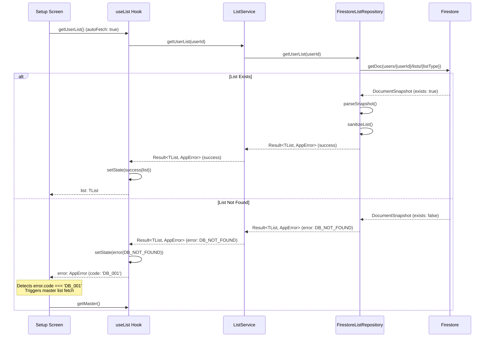

### Flow Diagram: List Check Logic

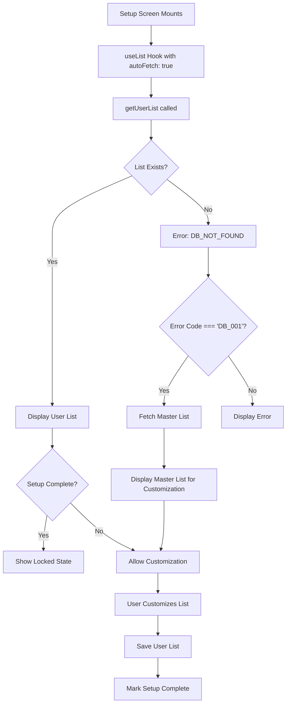

---

## Master List Fetching

### Sequence Diagram: Master List Fetch

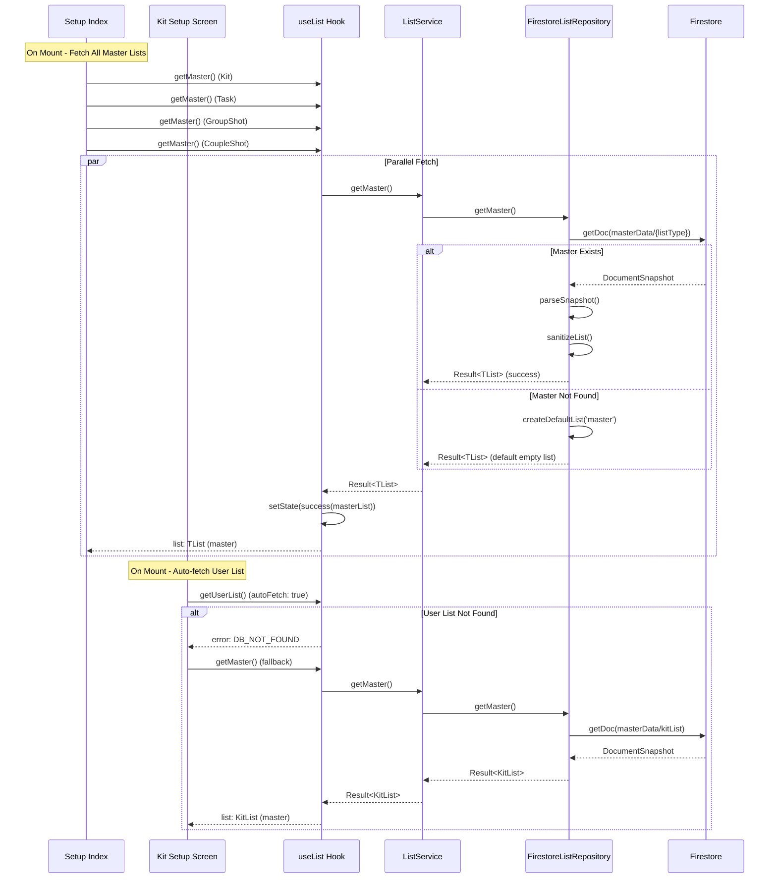

### Data Flow: Master List to User List

```mermaid
flowchart LR
    A["Master List<br/>masterData/listType"] -->|getMaster| B[ListService]
    B -->|validate| C[FirestoreListRepository]
    C -->|sanitize| D[Master List Data]

    D -->|createOrResetUserList| E[User List Creation]
    E -->|personalize| F["Set source: USER_LIST<br/>Set createdBy: userId"]
    F -->|save| G["User List<br/>users/userId/lists/listType"]

    G -->|getUserList| H[Display in Setup Screen]
    H -->|user edits| I[Customized User List]
    I -->|saveUserList| G
```

---

## User List Creation Flow

### Sequence Diagram: User List Creation

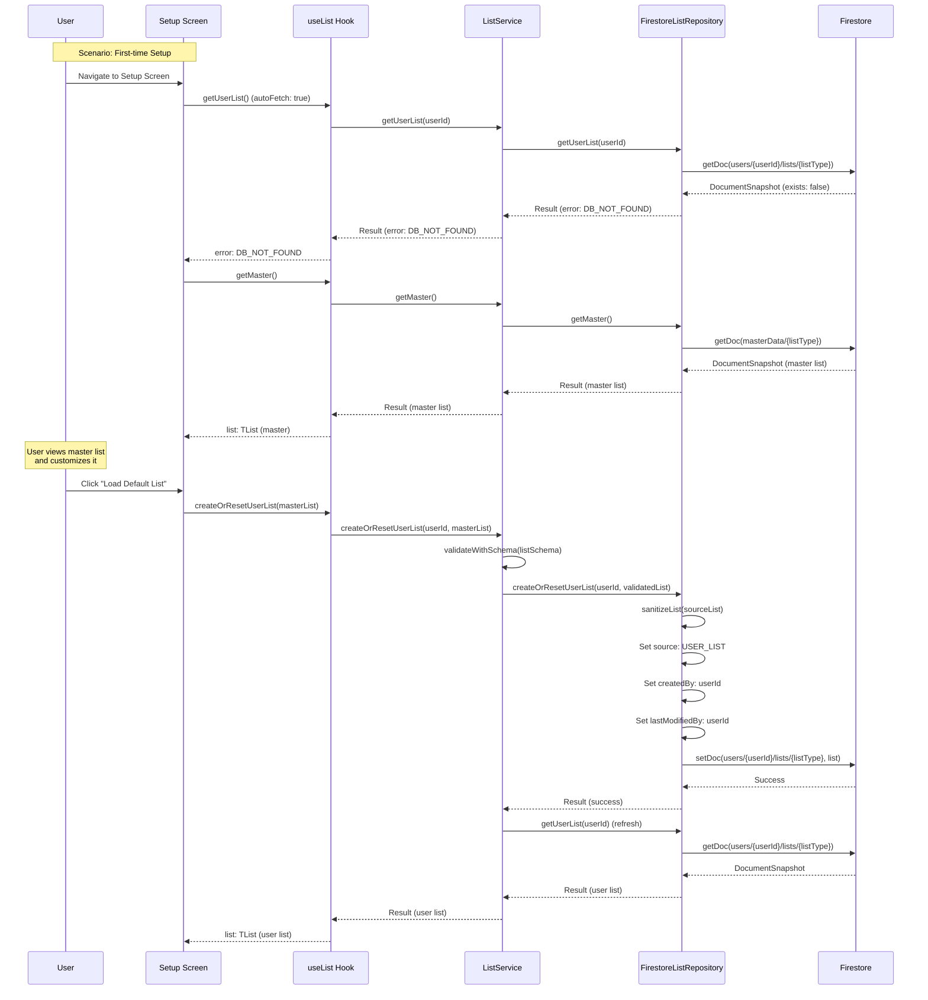

### Flow Diagram: User List Creation Options

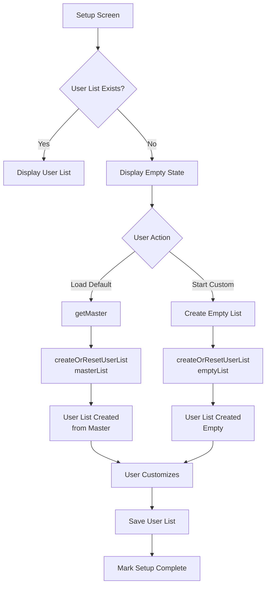

---

## List Customization Flow

### Sequence Diagram: Adding Items

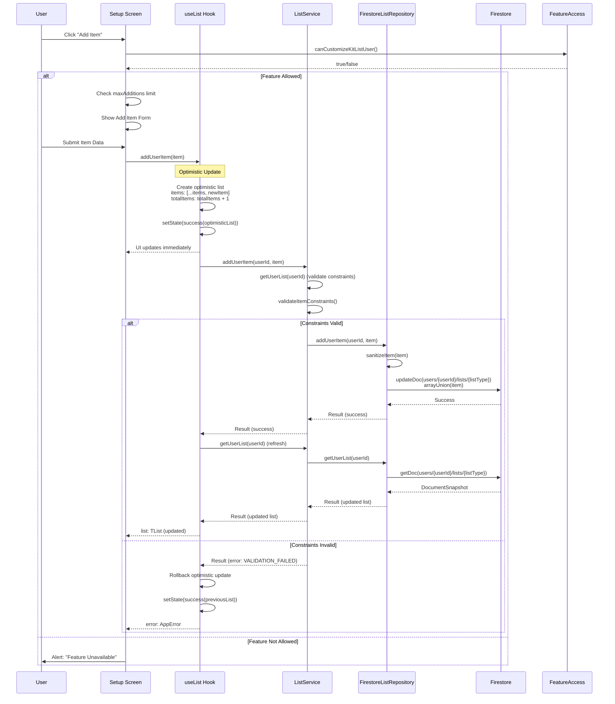

### Sequence Diagram: Deleting Items

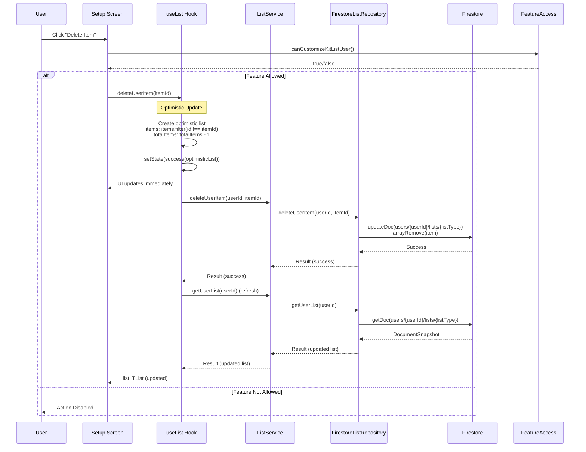

### Sequence Diagram: Batch Update Items

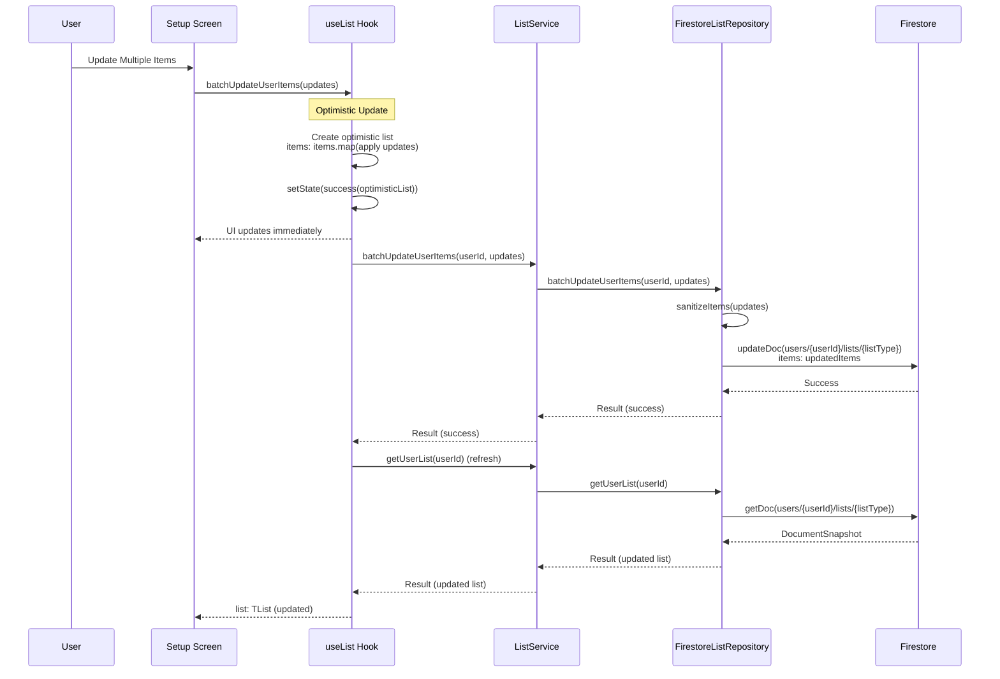

---

## Subscription Plan Effects

### Flow Diagram: Subscription Plan Feature Checks

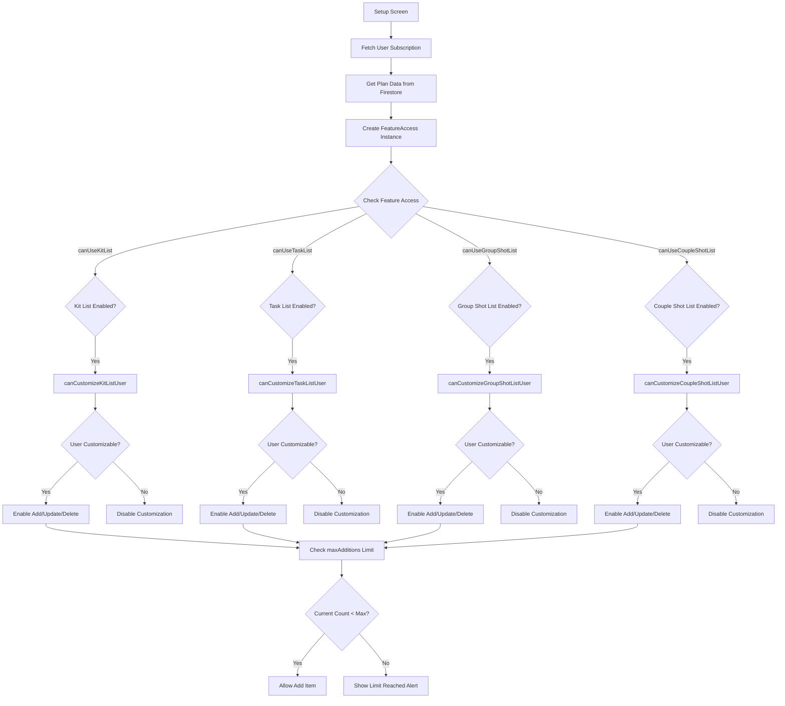

### Sequence Diagram: Subscription Plan Validation

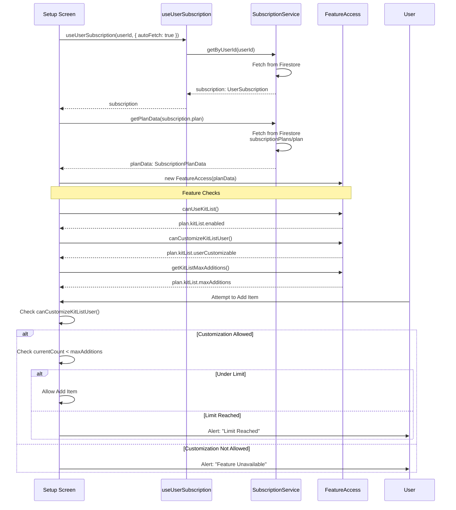

### Subscription Plan Feature Matrix

```mermaid
graph TB
    subgraph "Subscription Plans"
        FREE[FREE Plan]
        BASIC[BASIC Plan]
        PRO[PRO Plan]
        STUDIO[STUDIO Plan]
    end

    subgraph "Kit List Features"
        K1[Enabled]
        K2[User Customizable]
        K3[Max Additions: 0]
        K4[Max Additions: 10]
        K5[Max Additions: 50]
        K6[Max Additions: Unlimited]
    end

    subgraph "Task List Features"
        T1[Enabled]
        T2[User Customizable]
        T3[Max Additions: 0]
        T4[Max Additions: 10]
        T5[Max Additions: 50]
        T6[Max Additions: Unlimited]
    end

    subgraph "Group Shot List Features"
        G1[Enabled]
        G2[User Customizable]
        G3[Max Additions: 0]
        G4[Max Additions: 10]
        G5[Max Additions: 50]
        G6[Max Additions: Unlimited]
    end

    subgraph "Couple Shot List Features"
        C1[Enabled]
        C2[User Customizable]
        C3[Max Additions: 0]
        C4[Max Additions: 10]
        C5[Max Additions: 50]
        C6[Max Additions: Unlimited]
    end

    FREE --> K1
    FREE --> K2
    FREE --> K3
    FREE --> T1
    FREE --> T2
    FREE --> T3
    FREE --> G1
    FREE --> G2
    FREE --> G3
    FREE --> C1
    FREE --> C2
    FREE --> C3

    BASIC --> K1
    BASIC --> K2
    BASIC --> K4
    BASIC --> T1
    BASIC --> T2
    BASIC --> T4
    BASIC --> G1
    BASIC --> G2
    BASIC --> G4
    BASIC --> C1
    BASIC --> C2
    BASIC --> C4

    PRO --> K1
    PRO --> K2
    PRO --> K5
    PRO --> T1
    PRO --> T2
    PRO --> T5
    PRO --> G1
    PRO --> G2
    PRO --> G5
    PRO --> C1
    PRO --> C2
    PRO --> C5

    STUDIO --> K1
    STUDIO --> K2
    STUDIO --> K6
    STUDIO --> T1
    STUDIO --> T2
    STUDIO --> T6
    STUDIO --> G1
    STUDIO --> G2
    STUDIO --> G6
    STUDIO --> C1
    STUDIO --> C2
    STUDIO --> C6
```

---

## Setup Completion Tracking

### Sequence Diagram: Saving List and Marking Complete

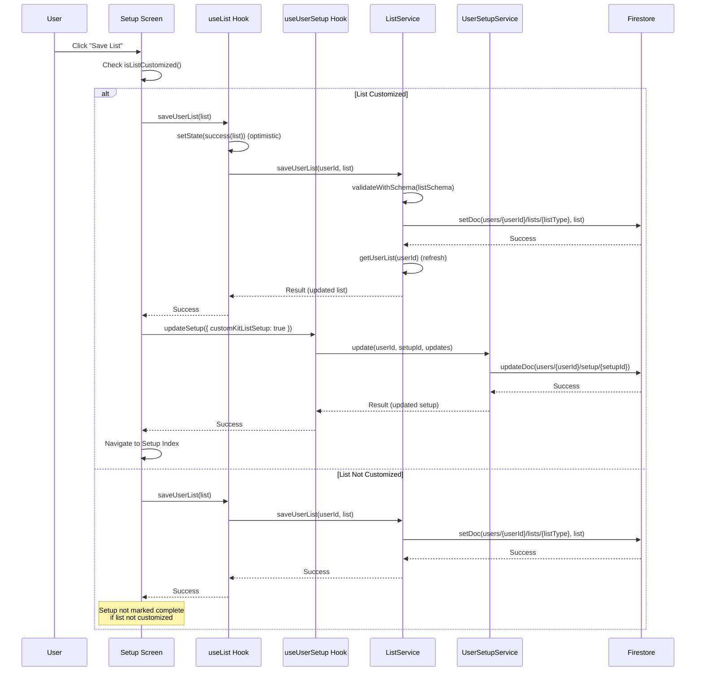

### Flow Diagram: Setup Completion Logic

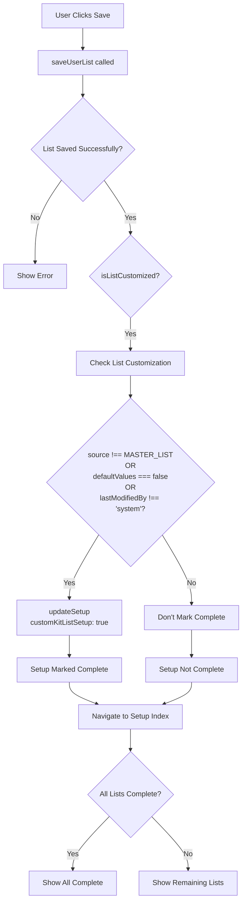

---

## Complete Setup Flow

### Complete Sequence: End-to-End Setup

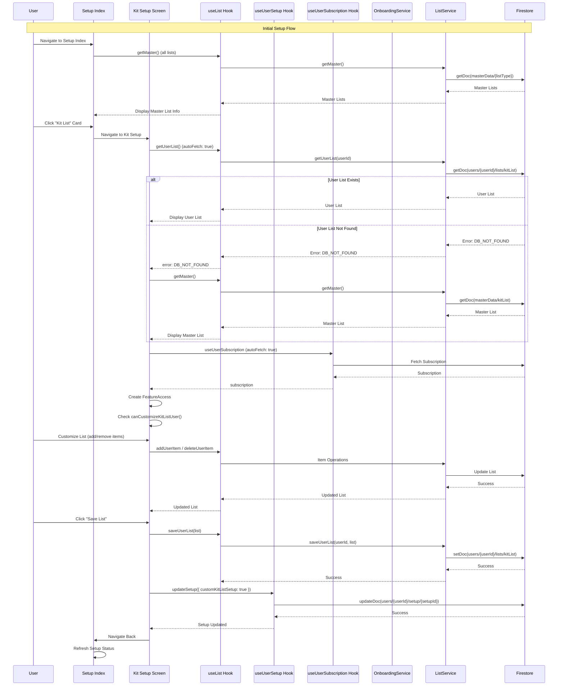

---

## Key Implementation Details

### List Existence Check

The system checks if a user list exists by:

1. **Repository Level** (`FirestoreListRepository.getUserList`):
   - Attempts to fetch document from `users/{userId}/lists/{listType}`
   - If document doesn't exist, returns `ErrorCode.DB_NOT_FOUND`
   - If document exists, parses and sanitizes the data

2. **Hook Level** (`useList`):
   - With `autoFetch: true`, automatically calls `getUserList()` on mount
   - If error code is `'DB_001'` (DB_NOT_FOUND), setup screens can trigger `getMaster()` as fallback

3. **Screen Level**:
   - Detects `error.code === 'DB_001'` to identify missing lists
   - Fetches master list to display for customization
   - Shows empty state if master list also unavailable

### Master List Fetching

Master lists are fetched from:

- **Path**: `masterData/{listType}` where `listType` is one of:
  - `kitList`
  - `taskList`
  - `groupShots`
  - `coupleShots`

**Timing**:

- **Setup Index**: Fetches all master lists on mount to display overview
- **Individual Setup Screens**: Fetches master list when user list not found (fallback)

### User List Creation

User lists are created via `createOrResetUserList`:

1. **Source**: Can be master list or empty list
2. **Personalization**:
   - Sets `config.source = ListSource.USER_LIST`
   - Sets `config.createdBy = userId`
   - Sets `config.lastModifiedBy = userId`
3. **Path**: `users/{userId}/lists/{listType}`

### Customization Operations

All customization operations use **optimistic updates**:

1. **Add Item**:
   - Immediately updates UI with new item
   - Calls service to persist
   - On success: refreshes from server
   - On error: rolls back to previous state

2. **Delete Item**:
   - Immediately removes from UI
   - Calls service to persist
   - On success: refreshes from server
   - On error: rolls back to previous state

3. **Batch Update**:
   - Immediately applies updates to UI
   - Calls service to persist
   - On success: refreshes from server
   - On error: rolls back to previous state

### Subscription Plan Effects

Subscription plans control:

1. **Feature Availability**:
   - `canUseKitList()` - Whether list feature is enabled
   - `canCustomizeKitListUser()` - Whether user can customize
   - `canCustomizeKitListProject()` - Whether project customization is allowed

2. **Limits**:
   - `getKitListMaxAdditions()` - Maximum custom items user can add
   - Limits are checked before allowing add operations
   - Alerts shown when limits reached

3. **Plan Data Source**:
   - Fetched from Firestore: `subscriptionPlans/{plan}`
   - Cached in `SubscriptionService`
   - Accessed via `FeatureAccess` helper class

### Setup Completion Tracking

Setup completion is tracked in `users/{userId}/setup/{setupId}`:

- `customKitListSetup: boolean`
- `customTaskListSetup: boolean`
- `customGroupShotsSetup: boolean`
- `customCoupleShotsSetup: boolean`

**Marked as complete when**:

- List is customized (source !== MASTER_LIST OR defaultValues === false OR lastModifiedBy !== 'system')
- AND user successfully saves the list

**Used to**:

- Show locked state on setup screens
- Track onboarding progress
- Prevent re-editing completed lists

---

## Error Handling

### Error Codes

- **DB_001 (DB_NOT_FOUND)**: List doesn't exist (expected for first-time setup)
- **DB_002 (DB_VALIDATION_ERROR)**: List data integrity failure
- **VALIDATION_FAILED**: Business logic constraints violated (e.g., max items reached)

### Error Recovery

1. **List Not Found**: Automatically fetch master list as fallback
2. **Validation Errors**: Show user-friendly messages, rollback optimistic updates
3. **Network Errors**: Retry with exponential backoff (handled by error recovery utilities)

---

## Summary

The setup module follows a consistent pattern for all list types:

1. **Check** if user list exists
2. **Fetch** master list if needed
3. **Display** list for customization (if subscription allows)
4. **Customize** with optimistic updates
5. **Save** user list
6. **Mark** setup as complete

Subscription plans control:

- Feature availability
- Customization permissions
- Maximum additions limits

All operations use the Result pattern for error handling and optimistic updates for responsive UI.
