# Complete User Journey: Registration → Skip Email Verification → FREE Plan → Onboarding → Auto-Setup → Projects

## Table of Contents

1. [App Launch & Initialization](#app-launch--initialization)
2. [Registration Flow](#registration-flow)
3. [Skip Email Verification](#skip-email-verification)
4. [FREE Plan Selection](#free-plan-selection)
5. [Onboarding Flow (FREE)](#onboarding-flow-free)
6. [Auto-Setup (Skip - Auto Populate Lists)](#auto-setup-skip---auto-populate-lists)
7. [Projects Access](#projects-access)
8. [Data Flow Diagrams](#data-flow-diagrams)
9. [Issues & Weaknesses](#issues--weaknesses)

---

## App Launch & Initialization

### Entry Point

**File**: `src/app/_layout.tsx`

**What Happens**:

1. **Font Loading**: Uses `useFonts` to load custom fonts from `@/constants/typography`
2. **Theme Setup**: Determines light/dark theme based on system preference (`useColorScheme()`)
3. **Global Services Initialization**:
   - `GlobalErrorHandler.initialize()` - Sets up global error handling
   - `serviceFactory.subscription.loadAllPlans()` - Pre-loads subscription plans (non-blocking)
4. **Provider Setup**:
   - `ServiceContext.Provider` - Provides service factory to all components
   - `StripeProvider` - Initializes Stripe for payments
   - `PaperProvider` - React Native Paper theme provider
   - `SafeAreaProvider` - Handles safe area insets
5. **Auth Initialization**: Wraps app in `<AuthInitializer>` component
6. **Route Stack**: Sets up Expo Router stack with `(auth)` and `(protected)` route groups

**Key Functions**:

- `RootLayout()` - Main layout component
- `useFonts(fontAssets)` - Loads custom fonts
- `useColorScheme()` - Detects system theme

**Dependencies**:

- `@/components/pre-auth/AuthInitializer`
- `@/contexts/ServiceContext`
- `@/services/ServiceFactory`
- `@/services/global-error-handler-service`

**Files Involved**:

- `src/app/_layout.tsx` - Root layout
- `src/constants/typography.ts` - Font assets
- `src/constants/theme.ts` - Theme definitions
- `src/services/ServiceFactory.ts` - Service factory
- `src/services/global-error-handler-service.ts` - Error handler

---

### Auth Initializer

**File**: `src/components/pre-auth/AuthInitializer.tsx`

**Purpose**: Loads user data on app start and watches for auth state changes. **Does NOT handle navigation** - that's done by guards.

**What Happens**:

1. **Initial Load** (runs once on app start):
   - Checks `auth.currentUser` from Firebase
   - If user exists, fetches in parallel:
     - `authService.getProfile()` - User document from `users/{userId}`
     - `userSubscription.getByUserId()` - Subscription document from `users/{userId}/subscription/main`
     - `userSetup.getByUserId()` - Setup document from `users/{userId}/setup/main`
   - Uses `withRetry` for resilience (3 attempts, 500ms delay, exponential backoff)
   - Stores data in `useAuthStore` via `setUserData()`
   - If no user, calls `reset()` to clear store

2. **Auth State Listener** (watches for sign in/out):
   - Subscribes to `onAuthStateChanged` from Firebase
   - Skips if `isRegistering` flag is true (prevents race conditions)
   - On sign in: Fetches user data (with more retries - 5 attempts)
   - On sign out: Calls `reset()` to clear store
   - Handles errors gracefully (logs but doesn't block)

**Key Functions**:

- `initializeAuth()` - Initial data load
- `onAuthStateChanged` callback - Watches for auth changes

**State Management**:

- `useAuthStore.setInitializing(true/false)` - Controls loading state
- `useAuthStore.setUserData({ user, subscription, setup })` - Stores fetched data
- `useAuthStore.reset()` - Clears all data

**Dependencies**:

- `@/stores/use-auth-store`
- `@/services/ServiceFactory` (via `useServices()`)
- `@/utils/error-recovery` (withRetry)
- `@/utils/error-context-builder`
- `firebase/auth` (onAuthStateChanged, currentUser)

**Important Notes**:

- Registration flow sets `isRegistering` flag to prevent AuthInitializer from interfering
- All data fetching uses retry logic for resilience
- Errors are logged but don't block app initialization

**Files Involved**:

- `src/components/pre-auth/AuthInitializer.tsx` - Auth initializer component
- `src/stores/use-auth-store.ts` - Auth store (Zustand)
- `src/utils/error-recovery.ts` - Retry logic
- `src/config/firebaseConfig.ts` - Firebase configuration

---

## Registration Flow

### Registration Screen

**File**: `src/app/(auth)/register.tsx`

**Purpose**: Presentation layer for registration form. Delegates all business logic to `useRegister` hook.

**What Happens**:

1. User fills out `AuthenticationForm` with:
   - `displayName` (string, required)
   - `email` (string, email format, required)
   - `password` (string, min 8 chars, required)
   - `confirmPassword` (string, must match password, required)
   - `acceptTermsAndPrivacy` (boolean, must be true)
   - `acceptMarketing` (boolean, optional)
2. On submit, calls `register()` from `useRegister` hook
3. Shows loading state while registration is in progress
4. Displays errors if registration fails
5. **Does NOT navigate** - `GuestGuard` handles navigation automatically

**Key Components**:

- `<AuthenticationForm mode="register" />` - Form component with validation
- `<Screen>` - Wrapper with loading/error states

**State Management**:

- Uses `useRegister` hook for registration logic
- Uses `useAuthStore` to check `isInitializing` state
- Shows loading overlay if auth is initializing

**Dependencies**:

- `@/hooks/use-register`
- `@/components/pre-auth/AuthenticationForm`
- `@/components/common/screen`
- `@/stores/use-auth-store`

**Files Involved**:

- `src/app/(auth)/register.tsx` - Registration screen
- `src/components/pre-auth/AuthenticationForm.tsx` - Form component
- `src/components/common/screen.tsx` - Screen wrapper

---

### Registration Hook

**File**: `src/hooks/use-register.ts`

**Purpose**: Orchestrates the complete registration flow including waiting for Cloud Functions.

**Flow**:

1. **Set Registration Flag**: `setRegistering(true)` - Prevents AuthInitializer from interfering
2. **Call Auth Service**: `auth.register(payload)` - Creates Firebase Auth user and base user document
3. **Wait for Cloud Function**: `waitForUserDocumentsReady()` - Waits up to 15 seconds for Cloud Function to create:
   - User subscription document (`users/{userId}/subscription/main`)
   - User setup document (`users/{userId}/setup/main`)
4. **Fetch All Documents**: Parallel fetch of:
   - `auth.getProfile()` - Full user document from `users/{userId}`
   - `userSubscription.getByUserId()` - Subscription document
   - `userSetup.getByUserId()` - Setup document
5. **Update Store**: `setUserData()` - Atomically updates auth store with all data
6. **Show Success Toast**: Displays success message
7. **Clear Flag**: `setRegistering(false)` - Allows navigation guards to proceed

**Key Functions**:

- `register(payload: RegisterInput): Promise<boolean>` - Main registration function
- `clearError()` - Clears error state

**State Management**:

- Uses `LoadingState<BaseUser | null>` pattern
- `loading` - Boolean derived from state
- `error` - AppError or null
- `state` - Full LoadingState object

**Dependencies**:

- `@/services/ServiceFactory` (auth, baseUser, userSubscription, userSetup)
- `@/utils/user-document-waiter` (waitForUserDocumentsReady)
- `@/stores/use-auth-store`
- `@/stores/use-ui-store` (showToast)

**Error Handling**:

- If Cloud Function timeout: Shows warning toast but continues (graceful degradation)
- If fetch fails: Logs warning but uses fallback data
- All errors are handled via `useErrorHandler`

**Files Involved**:

- `src/hooks/use-register.ts` - Registration hook
- `src/utils/user-document-waiter.ts` - Waits for Cloud Function documents
- `src/stores/use-ui-store.ts` - UI store for toasts

---

### Auth Service

**File**: `src/services/auth-service.ts`

**Purpose**: Business logic layer for authentication operations.

**Registration Method**: `register(payload: RegisterInput)`

**Flow**:

1. **Rate Limiting**: Checks `registerRateLimiter.canAttempt()` - Prevents abuse
   - Key: `Register-${email.toLowerCase()}`
   - If blocked, returns error with time until unblocked
2. **Validation**: `validateWithSchema(registerInputSchema, payload)` - Validates input with Zod
3. **Repository Call**: `authRepository.register(validatedPayload)` - Delegates to repository
4. **Reset Rate Limit**: On success, resets rate limiter
5. **Return Result**: Returns `{ user: BaseUser, verificationEmailSent: boolean }`

**Key Functions**:

- `register()` - Main registration method
- `signIn()` - Sign in method (not used in registration flow)
- `signOut()` - Sign out method

**Dependencies**:

- `@/repositories/i-auth-repository` (IAuthRepository interface)
- `@/utils/rate-limiter` (registerRateLimiter)
- `@/utils/validation-helpers` (validateWithSchema)
- `@/domain/user/auth.schema` (registerInputSchema)

**Error Handling**:

- Rate limit errors: Returns `AUTH_TOO_MANY_REQUESTS` error
- Validation errors: Returns `VALIDATION_FAILED` error from Zod
- Repository errors: Passes through from repository

**Files Involved**:

- `src/services/auth-service.ts` - Auth service
- `src/utils/rate-limiter.ts` - Rate limiting utilities
- `src/utils/validation-helpers.ts` - Validation utilities
- `src/domain/user/auth.schema.ts` - Auth schemas

---

### Auth Repository

**File**: `src/repositories/firestore/firestore-auth-repository.ts`

**Purpose**: Data access layer for authentication. Handles Firebase Auth and Firestore operations.

**Registration Method**: `register(payload: RegisterInput)`

**Flow**:

1. **Sanitize Email**: `sanitizeEmail(payload.email)` - Trims and lowercases
2. **Create Firebase Auth User**: `createUserWithEmailAndPassword(auth, email, password)`
3. **Update Display Name**: `updateProfile(userCredential.user, { displayName })` - Non-blocking
4. **Send Verification Email**: `sendEmailVerification(userCredential.user)` - Non-blocking
   - Stores status in memory for later retrieval
5. **Create Base User Document**: Calls `baseUserRepository.create()` to create:
   - Document path: `users/{userId}`
   - Contains: `id`, `email`, `displayName`, `isEmailVerified: false`, `createdAt`, `updatedAt`
6. **Return Result**: Returns `BaseUser` object

**Key Functions**:

- `register()` - Creates Firebase Auth user and base user document
- `wasVerificationEmailSent()` - Checks if email was sent (in-memory flag)
- `clearVerificationEmailStatus()` - Clears in-memory flag

**Dependencies**:

- `firebase/auth` (createUserWithEmailAndPassword, sendEmailVerification, updateProfile)
- `@/repositories/firestore/firestore-base-user-repository`
- `@/utils/sanitization-helpers` (sanitizeEmail)
- `@/utils/error-mapper` (ErrorMapper.fromFirebaseAuth)

**Error Handling**:

- Firebase Auth errors: Mapped via `ErrorMapper.fromFirebaseAuth()`
- Firestore errors: Mapped via `ErrorMapper.fromFirestore()`
- All errors wrapped in `Result<T, AppError>` pattern

**Important Notes**:

- Email verification is sent but doesn't block registration
- Base user document creation triggers Cloud Function to create subscription/setup documents
- Display name update failure is logged but doesn't fail registration

**Files Involved**:

- `src/repositories/firestore/firestore-auth-repository.ts` - Auth repository
- `src/repositories/firestore/firestore-base-user-repository.ts` - Base user repository
- `src/utils/sanitization-helpers.ts` - Sanitization utilities
- `src/utils/error-mapper.ts` - Error mapping utilities

---

### Cloud Function (Background)

**File**: `functions/src/index.ts` (inferred from codebase)

**Purpose**: Automatically creates user subscription and setup documents when base user is created.

**Trigger**: `onUserCreate` - Firebase Auth user creation trigger

**What Happens**:

1. **Create Subscription Document**:
   - Path: `users/{userId}/subscription/main`
   - Defaults:
     - `plan: SubscriptionPlan.FREE`
     - `status: SubscriptionStatus.NONE`
     - `billingCycle: BillingCycle.NONE`
     - `isActive: false`
     - `isTrial: false`
     - `createdAt: serverTimestamp()`
     - `updatedAt: serverTimestamp()`
2. **Create Setup Document**:
   - Path: `users/{userId}/setup/main`
   - Defaults:
     - `showOnboarding: true`
     - `firstTimeSetup: true`
     - `userKitListCreated: false`
     - `userTaskListCreated: false`
     - `userGroupShotListCreated: false`
     - `userCoupleShotListCreated: false`
     - `skippedEmailVerification: false`
     - `createdAt: serverTimestamp()`
     - `updatedAt: serverTimestamp()`
3. **Timeout**: Must complete within 30 seconds (Firebase Function timeout)

**Why This Matters**:

- Registration hook waits for these documents before proceeding
- If timeout occurs, registration continues with warning (graceful degradation)

**Files Involved**:

- `functions/src/index.ts` - Cloud Functions entry point
- `functions/src/api/onUserCreate.ts` - User creation trigger handler

---

## Skip Email Verification

### Email Verification Screen

**File**: `src/app/(auth)/email-verification.tsx`

**Purpose**: Allows user to verify email or skip verification.

**What Happens**:

1. **Auto-Detection**: Hook automatically checks verification status via:
   - App state listener (when app comes to foreground)
   - Auth state listener (when Firebase auth changes)
   - Mount check (on component mount)
2. **Display Options**:
   - Shows user's email address
   - "I've Verified - Check Now" button: Manually checks verification
   - "Resend Verification Email" button: Resends verification email
   - "Skip for Now" button: Skips verification
   - "Sign Out" button: Signs out user
3. **On Skip**: Calls `skipVerification()` from `useEmailVerificationStatus` hook
4. **Navigation**: On skip success, navigates to `/(protected)/(payment)/pricing`

**Key Functions**:

- `handleSkipVerification()` - Handles skip button press
- `handleManualCheck()` - Manually checks verification status
- `handleResendEmail()` - Resends verification email

**State Management**:

- Uses `useEmailVerificationStatus` hook for all verification logic
- `isVerified` - Boolean from hook
- `checking` - Loading state for verification check
- `skipLoading` - Loading state for skip operation

**Dependencies**:

- `@/hooks/use-email-verification-status`
- `@/stores/use-auth-store`
- `@/stores/use-ui-store` (showToast)
- `@/constants/navigation/navigation` (NavigationRoute)

**Files Involved**:

- `src/app/(auth)/email-verification.tsx` - Email verification screen
- `src/hooks/use-email-verification-status.ts` - Verification hook

---

### Email Verification Status Hook

**File**: `src/hooks/use-email-verification-status.ts`

**Purpose**: Manages email verification status checking and skipping.

**Skip Verification Method**: `skipVerification()`

**Flow**:

1. **Validate User**: Checks if user exists
2. **Get Current Setup**: Fetches setup document via `userSetup.getByUserId(user.id)`
3. **Update Setup**: Updates `users/{userId}/setup/main`:
   - `skippedEmailVerification: true`
   - `updatedAt: serverTimestamp()`
4. **Refresh Auth Store**: Fetches updated setup and updates auth store:
   - `useAuthStore.getState().setSetup(updatedSetup)`
5. **Call Success Callback**: Calls `onSkipSuccess()` callback
6. **Return Success**: Returns `true`

**Key Functions**:

- `skipVerification()` - Skips email verification
- `checkVerificationStatus()` - Checks if email is verified
- `resendEmailVerification()` - Resends verification email

**State Management**:

- Uses `LoadingState<void>` for skip operation
- `skipState` - LoadingState for skip operation
- `isVerified` - Boolean from Firebase Auth `currentUser.emailVerified`

**Dependencies**:

- `@/services/ServiceFactory` (userSetup service)
- `@/stores/use-auth-store`
- `firebase/auth` (currentUser, reload, sendEmailVerification)
- `@/repositories/firestore/paths/firestore-user-paths` (USER_SUBCOLLECTION_DOC_ID)

**Important Notes**:

- After skipping, setup document is refreshed in auth store to ensure navigation guard sees updated state
- Navigation is handled by screen component (not hook) - screen navigates to pricing on skip success

**Files Involved**:

- `src/hooks/use-email-verification-status.ts` - Verification status hook
- `src/services/user-setup-service.ts` - Setup service
- `src/repositories/firestore/firestore-user-setup-repository.ts` - Setup repository

---

### User Setup Service

**File**: `src/services/user-setup-service.ts`

**Purpose**: Business logic for setup operations.

**Update Method**: `update(userId: string, setupId: string, updates: UserSetupUpdate)`

**What Happens**:

1. **Validate Input**: Validates userId and setupId with `idSchema`
2. **Sanitize Updates**: Removes undefined values
3. **Call Repository**: `repository.update(userId, setupId, sanitizedUpdates)`
4. **Return Result**: Returns success or error

**Key Functions**:

- `update()` - Updates setup document
- `getByUserId()` - Gets setup document by user ID

**Dependencies**:

- `@/repositories/firestore/firestore-user-setup-repository`
- `@/utils/validation-helpers` (validateWithSchema)
- `@/domain/common/shared-schemas` (idSchema)

**Files Involved**:

- `src/services/user-setup-service.ts` - Setup service
- `src/repositories/firestore/firestore-user-setup-repository.ts` - Setup repository

---

### User Setup Repository

**File**: `src/repositories/firestore/firestore-user-setup-repository.ts`

**Purpose**: Data access for setup operations.

**Update Method**: `update(userId: string, setupId: string, updates: UserSetupUpdate)`

**What Happens**:

1. **Sanitize Input**: Sanitizes update payload
2. **Update Document**: Updates `users/{userId}/setup/{setupId}`:
   - Merges updates with existing document
   - Sets `updatedAt: serverTimestamp()`
3. **Return Result**: Returns success or error

**Key Functions**:

- `update()` - Updates setup document
- `getByUserId()` - Gets setup document by user ID
- `parseSnapshot()` - Parses Firestore snapshot with validation

**Dependencies**:

- `firebase/firestore` (doc, updateDoc, getDoc, serverTimestamp)
- `@/utils/sanitization-helpers` (removeUndefinedValues)
- `@/utils/error-mapper` (ErrorMapper.fromFirestore)
- `@/domain/user/user.schema` (userSetupSchema)

**Files Involved**:

- `src/repositories/firestore/firestore-user-setup-repository.ts` - Setup repository
- `src/repositories/firestore/paths/firestore-user-paths.ts` - Firestore path helpers

---

## FREE Plan Selection

### Pricing Screen

**File**: `src/app/(protected)/(payment)/pricing.tsx`

**Purpose**: Displays subscription plans and handles plan selection.

**What Happens**:

1. **Load Plans**: Fetches subscription plans from `subscriptionService.loadAllPlans()`
2. **Display Plans**: Shows FREE, BASIC, PRO, STUDIO plans with:
   - Monthly/Annual billing toggle (FREE plan doesn't use billing cycle)
   - Feature comparisons
   - Pricing information
3. **Plan Selection**: `handleSelectPlan(plan: SubscriptionPlan)`
   - For FREE plan: No email verification check (FREE doesn't require verification)
   - If FREE: Activates free plan immediately via `userSubscription.activateFreePlan(user.id)`
   - Updates auth store with new subscription
   - Navigates to `/(protected)/(onboarding)/free`

**Key Functions**:

- `handleSelectPlan()` - Handles plan selection
- `handleBillingCycleChange()` - Toggles monthly/annual (not used for FREE)
- `activateFreePlan()` - Activates free plan (calls `userSubscription.activateFreePlan()`)

**State Management**:

- `billingCycle` - Monthly or Annual (not used for FREE)
- `activatingFreePlan` - Loading state for free plan activation
- `showEmailModal` - Shows email verification prompt (not shown for FREE)

**Dependencies**:

- `@/services/ServiceFactory` (userSubscription, subscription)
- `@/hooks/use-user-subscription`
- `@/stores/use-auth-store`
- `@/constants/subscriptions` (getPrice, isPaidPlan)
- `@/constants/navigation/navigation` (NavigationRoute)

**Navigation**:

- FREE plan → `/(protected)/(onboarding)/free` with params: `{ plan: SubscriptionPlan.FREE }`

**Files Involved**:

- `src/app/(protected)/(payment)/pricing.tsx` - Pricing screen
- `src/services/user-subscription-service.ts` - Subscription service
- `src/constants/subscriptions.ts` - Subscription constants

---

### Free Plan Activation

**File**: `src/services/user-subscription-service.ts`

**Method**: `activateFreePlan(userId: string)`

**What Happens**:

1. **Validate User ID**: Validates with `idSchema`
2. **Get Current Subscription**: Fetches existing subscription document
3. **Update User Document**: Updates `users/{userId}`:
   - `isActive: true`
4. **Calculate Trial End Date**: Sets `trialEndsAt` to 120 hours (5 days) from now
5. **Update Subscription**: Updates `users/{userId}/subscription/main`:
   - `plan: SubscriptionPlan.FREE`
   - `status: SubscriptionStatus.ACTIVE`
   - `billingCycle: BillingCycle.NONE`
   - `isActive: true`
   - `isTrial: true`
   - `trialEndsAt: Date` (120 hours from now)
   - `activatedAt: serverTimestamp()`
   - `updatedAt: serverTimestamp()`
6. **Return Result**: Returns updated `UserSubscription` object

**Key Functions**:

- `activateFreePlan()` - Activates free plan
- `activateSubscription()` - Activates paid subscription (not used for FREE)

**Dependencies**:

- `@/repositories/firestore/firestore-user-subscription-repository`
- `@/repositories/firestore/firestore-base-user-repository` (baseUser)
- `@/utils/validation-helpers` (validateWithSchema)
- `@/domain/common/shared-schemas` (idSchema)

**Important Notes**:

- FREE plan gets 120-hour (5-day) trial period
- Trial starts immediately upon activation
- User document `isActive` flag is set to `true`

**Files Involved**:

- `src/services/user-subscription-service.ts` - Subscription service
- `src/repositories/firestore/firestore-user-subscription-repository.ts` - Subscription repository
- `src/repositories/firestore/firestore-base-user-repository.ts` - Base user repository

---

### User Subscription Repository

**File**: `src/repositories/firestore/firestore-user-subscription-repository.ts`

**Purpose**: Data access for subscription operations.

**Update Method**: `update(userId: string, subscriptionId: string, updates: UserSubscriptionUpdate)`

**What Happens**:

1. **Sanitize Input**: Sanitizes update payload
2. **Update Document**: Updates `users/{userId}/subscription/{subscriptionId}`:
   - Merges updates with existing document
   - Sets `updatedAt: serverTimestamp()`
3. **Return Result**: Returns updated `UserSubscription` object

**Key Functions**:

- `update()` - Updates subscription document
- `getByUserId()` - Gets subscription document by user ID
- `parseSnapshot()` - Parses Firestore snapshot with validation

**Dependencies**:

- `firebase/firestore` (doc, updateDoc, getDoc, serverTimestamp)
- `@/utils/sanitization-helpers` (removeUndefinedValues)
- `@/utils/error-mapper` (ErrorMapper.fromFirestore)
- `@/domain/user/user.schema` (userSubscriptionSchema)

**Files Involved**:

- `src/repositories/firestore/firestore-user-subscription-repository.ts` - Subscription repository
- `src/repositories/firestore/paths/firestore-user-paths.ts` - Firestore path helpers

---

## Onboarding Flow (FREE)

### Free Onboarding Screen

**File**: `src/app/(protected)/(onboarding)/free.tsx`

**Purpose**: Onboarding flow for FREE plan users.

**Flow Structure**:

- **A1**: Dynamic Splash Screen (account ready message)
- **A2**: 4-Step Feature Slideshow (core features overview)

**What Happens**:

1. **Render Splash (A1)**: Shows welcome message with "Proceed" button
   - Title: "Your Account is Ready!"
   - Description: Welcome message for free users
   - "Proceed" button: Advances to A2
2. **Render Slideshow (A2)**: Shows 4 slides with feature overview
   - Uses `useOnboardingStore` for slide navigation
   - Slides from `FREE_USER_SLIDES` constant
   - "Next" button: Advances to next slide
   - "Back" button: Goes to previous slide
   - "Finish" button: Completes onboarding
   - "Skip" button: Completes onboarding (same as Finish)
3. **On Finish**: Calls `completeOnboarding()` from `useOnboarding` hook
4. **Navigation**: On success, navigates to `/(protected)/projects` (navigation guard will redirect to setup if needed)

**State Management**:

- `flowStep` (local): 0 = A1 (splash), 1 = A2 (slideshow)
- `currentSlideIndex` (store): Current slide in A2 (0-3)
- Uses `useOnboardingStore` for slide navigation

**Key Components**:

- `<DynamicSplashContainer>` - Splash screen component
- `<Slideshow>` - Slideshow component
- `<TrialBanner>` - Trial banner overlay

**Dependencies**:

- `@/hooks/use-onboarding`
- `@/stores/use-onboarding-store`
- `@/constants/onboarding-content` (FREE_USER_SLIDES, SPLASH_CONTENT)
- `@/constants/navigation/navigation` (NavigationRoute)

**Files Involved**:

- `src/app/(protected)/(onboarding)/free.tsx` - Free onboarding screen
- `src/components/onboarding/DynamicSplashContainer.tsx` - Splash component
- `src/components/onboarding/SlideShow.tsx` - Slideshow component
- `src/components/onboarding/TrialBanner.tsx` - Trial banner component
- `src/constants/onboarding-content.ts` - Onboarding content constants

---

### Onboarding Hook

**File**: `src/hooks/use-onboarding.ts`

**Purpose**: Hook for onboarding operations.

**Key Method**: `completeOnboarding()`

**What Happens**:

1. **Call Service**: `onboardingService.completeOnboarding(userId)`
2. **On Success**:
   - Updates loading state
   - Calls `onSuccess` callback (navigates to projects)
3. **On Error**:
   - Updates error state
   - Calls `onError` callback

**State Management**:

- Uses `LoadingState<void>` pattern
- `loading` - Boolean
- `error` - AppError or null

**Dependencies**:

- `@/services/ServiceFactory` (onboarding service)
- `@/utils/loading-state`

**Files Involved**:

- `src/hooks/use-onboarding.ts` - Onboarding hook
- `src/services/onboarding-service.ts` - Onboarding service

---

### Onboarding Service

**File**: `src/services/onboarding-service.ts`

**Purpose**: Business logic for onboarding completion.

**Key Method**: `completeOnboarding(userId: string)`

**What Happens**:

1. **Validate User ID**: Validates with `idSchema`
2. **Update Setup Document**: Updates `users/{userId}/setup/main`:
   - `showOnboarding: false`
   - `firstTimeSetup: true` (if not already set)
   - `updatedAt: serverTimestamp()`
3. **Return Result**: Returns success or error

**Dependencies**:

- `@/repositories/firestore/firestore-user-setup-repository`
- `@/utils/validation-helpers`

**Files Involved**:

- `src/services/onboarding-service.ts` - Onboarding service
- `src/repositories/firestore/firestore-user-setup-repository.ts` - Setup repository

---

## Auto-Setup (Skip - Auto Populate Lists)

### Setup Index Screen

**File**: `src/app/(protected)/(setup)/index.tsx`

**Purpose**: Main setup screen showing progress and list of setup sections. For FREE_UNVERIFIED users, auto-populates all lists.

**What Happens**:

1. **Fetch Data**:
   - Subscription (via `useUserSubscription`)
   - Setup (via `useUserSetup`)
   - Features (via `useFeatureAccess`)
2. **Initialize List Hooks**:
   - `useKitList` (via `useList` hook)
   - `useTaskList` (via `useList` hook)
   - `useGroupShotList` (via `useList` hook)
   - `useCoupleShotList` (via `useList` hook)
3. **Determine User State**: Uses `useSetupContext` to get `userState`
4. **Auto-Populate Lists**: Based on user state:
   - **FREE_UNVERIFIED**: Auto-creates all 4 lists in background (handled by `useSetupLogic`)
   - **FREE_VERIFIED**: Auto-creates Task and Group lists
   - **PAID**: Shows manual setup options
5. **Display Setup Sections**: Shows cards for:
   - Kit List
   - Task List
   - Group Shots
   - Couple Shots
6. **Skip All Button**: Option to create all lists from master templates (for paid users)

**Key Functions**:

- `handleSkipAll()` - Creates all lists from master templates (for paid users)
- `handleResetLists()` - Resets lists to master templates

**State Management**:

- Uses `useSetupContext` for user state
- Uses `useSetupLogic` for automatic list creation
- Uses individual list hooks for list data

**Dependencies**:

- `@/hooks/use-setup-logic`
- `@/hooks/use-generic-list` (useList)
- `@/hooks/use-user-setup`
- `@/hooks/use-user-subscription`
- `@/contexts/SetupContext`

**Files Involved**:

- `src/app/(protected)/(setup)/index.tsx` - Setup index screen
- `src/hooks/use-setup-logic.ts` - Setup logic hook
- `src/hooks/use-generic-list.ts` - Generic list hook
- `src/contexts/SetupContext.tsx` - Setup context

---

### Setup Logic Hook

**File**: `src/hooks/use-setup-logic.ts`

**Purpose**: Handles automatic list creation based on user state.

**What Happens**:

1. **Determine User State**: Uses `useAuthStore` to determine state:
   - Checks `subscription.plan` (FREE)
   - Checks `user.isEmailVerified` (false - skipped)
   - Checks `setup.skippedEmailVerification` (true)
   - Checks `setup.firstTimeSetup` (true)
   - Checks list creation flags (all false)
   - Result: `SetupUserState.FREE_UNVERIFIED`

2. **Auto-Create Lists** (for FREE_UNVERIFIED):
   - Sets loading state: `isLoading: true`, `loadingMessage: 'Creating Template Lists...'`
   - Creates all 4 lists in parallel:
     - Kit List: `processList(kitList, 'userKitListCreated')`
     - Task List: `processList(taskList, 'userTaskListCreated')`
     - Group Shot List: `processList(groupShotList, 'userGroupShotListCreated')`
     - Couple Shot List: `processList(coupleShotList, 'userCoupleShotListCreated')`
   - Each `processList`:
     - Checks if list already created (via setup flags)
     - Fetches master list via `hook.getMaster()`
     - Creates user list via `hook.createOrResetUserList(hook.list)`
     - Updates setup flag: `setUserData({ setup: { ...setup, [listCreatedKey]: true } })`

3. **Update Setup Flags**: After all lists created:
   - Updates `firstTimeSetup: false`
   - Updates auth store with new setup state

4. **Navigate to Projects**: `router.replace(NavigationRoute.PROJECTS)`

**Key Functions**:

- `processList()` - Helper to create list and update setup flag
- `handleAutoSetup()` - Main auto-setup logic

**State Management**:

- `userState` - Current setup user state (FREE_UNVERIFIED, FREE_VERIFIED, PAID, etc.)
- `isLoading` - Loading state for auto-setup
- `loadingMessage` - Loading message to display

**Dependencies**:

- `@/hooks/list-hooks` (useKitList, useTaskList, useGroupShotList, useCoupleShotList)
- `@/hooks/use-user-setup`
- `@/stores/use-auth-store`
- `@/constants/navigation/navigation` (NavigationRoute)

**Important Notes**:

- For FREE_UNVERIFIED users, all lists are auto-created without user interaction
- Lists are created in parallel for performance
- Setup flags are updated optimistically in auth store
- After completion, navigates directly to projects

**Files Involved**:

- `src/hooks/use-setup-logic.ts` - Setup logic hook
- `src/hooks/list-hooks.ts` - List hooks (useKitList, etc.)
- `src/stores/use-auth-store.ts` - Auth store

---

### List Hooks (Generic Pattern)

**Files**: `src/hooks/list-hooks.ts`

**Purpose**: Generic hooks for list operations (Kit, Task, Group, Couple).

**Key Methods** (for each list type):

- `getMaster()` - Fetches master list template from `master/{listType}/data`
- `getUserList()` - Fetches user's custom list from `users/{userId}/lists/{listType}/data`
- `createOrResetUserList(list)` - Creates user list from provided list data
- `saveUserList(list)` - Saves user list
- `addUserItem(item)` - Adds item to user list
- `deleteUserItem(itemId)` - Deletes item from user list
- `batchUpdateUserItems(updates)` - Updates multiple items

**State Management**:

- Uses `LoadingState<List | null>` pattern
- `list` - Current list (master or user)
- `loading` - Loading state
- `error` - Error state

**Dependencies**:

- `@/services/ServiceFactory` (kit, task, groupShot, coupleShot services)
- `@/utils/loading-state`

**Files Involved**:

- `src/hooks/list-hooks.ts` - List hooks
- `src/hooks/use-generic-list.ts` - Generic list hook wrapper

---

### List Services

**Files**:

- `src/services/kit-list-service.ts`
- `src/services/task-list-service.ts`
- `src/services/group-shot-list-service.ts`
- `src/services/couple-shot-list-service.ts`

**Purpose**: Business logic for list operations.

**Key Methods** (all services follow same pattern):

- `getMaster()` - Gets master list template from `master/{listType}/data`
- `getUserList(userId)` - Gets user's custom list from `users/{userId}/lists/{listType}/data`
- `createOrResetUserList(userId, sourceList)` - Creates user list from source:
  - Path: `users/{userId}/lists/{listType}/data`
  - Copies items, categories, and config from source list
  - Sets `source: ListSource.USER_LIST`
  - Sets `lastModifiedBy: userId`
  - Sets `createdAt: serverTimestamp()`
  - Sets `updatedAt: serverTimestamp()`
- `saveUserList(userId, list)` - Saves user list
- `addUserItem(userId, item)` - Adds item
- `deleteUserItem(userId, itemId)` - Deletes item
- `batchUpdateUserItems(userId, updates)` - Updates items

**Dependencies**:

- `@/repositories/firestore/list.repository` (kitRepository, taskRepository, etc.)
- `@/utils/validation-helpers`
- `@/utils/error-mapper`

**Files Involved**:

- `src/services/kit-list-service.ts` - Kit list service
- `src/services/task-list-service.ts` - Task list service
- `src/services/group-shot-list-service.ts` - Group shot list service
- `src/services/couple-shot-list-service.ts` - Couple shot list service

---

### List Repositories

**File**: `src/repositories/firestore/list.repository.ts`

**Purpose**: Data access for list operations.

**Key Methods** (all repositories follow same pattern):

- `getMaster()` - Fetches master list from `master/{listType}/data` (single document)
- `getUserList(userId)` - Fetches user list from `users/{userId}/lists/{listType}/data` (single document)
- `createOrResetUserList(userId, sourceList)` - Creates/resets user list:
  - Path: `users/{userId}/lists/{listType}/data`
  - Uses `setDoc()` to create/overwrite document
  - Data structure:
    ```typescript
    {
      id: userId,
      items: sourceList.items,
      categories: sourceList.categories,
      config: {
        ...sourceList.config,
        source: ListSource.USER_LIST,
        lastModifiedBy: userId,
      },
      createdAt: serverTimestamp(),
      updatedAt: serverTimestamp(),
    }
    ```
- `saveUserList(userId, list)` - Saves user list (same as createOrResetUserList)
- `addUserItem(userId, item)` - Adds item to array using `updateDoc()` with `arrayUnion()`
- `deleteUserItem(userId, itemId)` - Removes item from array using `updateDoc()` with `arrayRemove()`
- `batchUpdateUserItems(userId, updates)` - Updates items in array using `updateDoc()`

**Firestore Structure**:

- Master lists: `master/{listType}/data` (single document)
- User lists: `users/{userId}/lists/{listType}/data` (single document)
- Project lists: `projects/{projectId}/lists/{listType}/data` (single document)

**Dependencies**:

- `firebase/firestore` (doc, getDoc, setDoc, updateDoc, serverTimestamp, arrayUnion, arrayRemove)
- `@/utils/sanitization-helpers`
- `@/utils/error-mapper`
- `@/repositories/firestore/paths/firestore-list-paths` (path helpers)

**Files Involved**:

- `src/repositories/firestore/list.repository.ts` - List repositories
- `src/repositories/firestore/paths/firestore-list-paths.ts` - List path helpers

---

### Setup Service

**File**: `src/services/setup-service.ts`

**Purpose**: Business logic for setup operations. Used by navigation guard for trial list population.

**Key Method**: `generateDefaultData(userId: string)`

**What Happens**:

1. **Check Idempotency**: Checks if lists already created via setup flags
2. **Get Master Lists**: Fetches master templates for:
   - Kit List from `master/kit/data`
   - Task List from `master/task/data`
   - Group Shot List from `master/groupShot/data`
   - Couple Shot List from `master/coupleShot/data`
3. **Create User Lists**: Creates user lists from master templates:
   - `kit.createOrResetUserList(userId, masterKitList)`
   - `task.createOrResetUserList(userId, masterTaskList)`
   - `groupShot.createOrResetUserList(userId, masterGroupShotList)`
   - `coupleShot.createOrResetUserList(userId, masterCoupleShotList)`
4. **Update Setup Flags**: Updates setup document with list creation flags (but sets all to `false` - this seems like a bug)

**Dependencies**:

- `@/services/ServiceFactory` (kit, task, groupShot, coupleShot services)
- `@/services/user-setup-service`

**Files Involved**:

- `src/services/setup-service.ts` - Setup service

---

## Projects Access

### Navigation Guard

**File**: `src/hooks/use-navigation-guard.ts`

**Purpose**: Routes users to correct screen based on their state.

**What Happens** (for FREE_UNVERIFIED user after auto-setup):

1. **Resolve User State**: Uses `useUserState` hook to get resolved state
2. **Check State**:
   - User: Exists
   - Subscription: `plan: FREE`, `status: ACTIVE`, `isTrial: true`
   - Setup: `firstTimeSetup: false`, all list flags: `true`, `skippedEmailVerification: true`
   - Resolved State: `UserState.UNVERIFIED_FREE` or `UserState.VERIFIED_FREE` (depending on skippedEmailVerification)
3. **Find Matching Rule**: Uses `findMatchingRule()` to find routing rule
4. **Navigate**: Redirects to `/(protected)/(app)/(projects)` or appropriate route

**Key Functions**:

- `handleNavigation()` - Main navigation logic
- `findMatchingRule()` - Finds matching routing rule

**Dependencies**:

- `@/hooks/use-user-state`
- `@/constants/navigation/routing-rules` (findMatchingRule)
- `@/constants/navigation/navigation` (NavigationRoute)

**Files Involved**:

- `src/hooks/use-navigation-guard.ts` - Navigation guard hook
- `src/utils/navigation/user-state-resolver.ts` - User state resolver
- `src/constants/navigation/routing-rules.ts` - Routing rules

---

### Projects Screen

**File**: `src/app/(protected)/(app)/(projects)/index.tsx` (inferred from navigation)

**Purpose**: Displays list of user's projects and allows creation of new projects.

**What Happens**:

1. **Fetch Projects**: Uses `useUserProjects` hook to fetch user's projects from `users/{userId}/projects`
2. **Display Projects**: Shows list of projects with:
   - Project name
   - Project date
   - Project status
3. **Create Project**: "Create Project" button opens project creation form
4. **Select Project**: Clicking project navigates to project dashboard

**Dependencies**:

- `@/hooks/use-user-projects`
- `@/services/ServiceFactory` (userProjects service)

**Files Involved**:

- `src/app/(protected)/(app)/(projects)/index.tsx` - Projects list screen
- `src/hooks/use-user-projects.ts` - User projects hook

---

### Project Creation Form

**File**: `src/app/(protected)/(app)/(projects)/create.tsx` (inferred from navigation)

**Purpose**: Form for creating new project.

**What Happens**:

1. **Collect Input**: User enters:
   - Project name (string, required)
   - Project date (Date, required)
   - Project type (optional)
2. **Validate**: Validates input with Zod schema (`baseProjectInputSchema`)
3. **Create Project**: Calls `projectManagementService.createProject()`
4. **Show Progress**: Displays progress indicator during creation
5. **Navigate**: On success, navigates to project dashboard

**Dependencies**:

- `@/services/ServiceFactory` (projectManagement service)
- `@/hooks/use-project-management`

**Files Involved**:

- `src/app/(protected)/(app)/(projects)/create.tsx` - Project creation screen
- `src/services/ProjectManagementService.ts` - Project management service

---

### Project Management Service

**File**: `src/services/ProjectManagementService.ts`

**Purpose**: Orchestrates project creation including all subcollections.

**Key Method**: `createProject(userId, payload, onProgress?)`

**Flow**:

1. **Validate Input**: Validates `BaseProjectInput` with Zod schema
2. **Prepare Source Lists** (30%):
   - Gets user's lists (Kit, Task, Group, Couple) from `users/{userId}/lists/{listType}/data`
   - Falls back to master lists if user lists don't exist
   - All reads happen before transaction (Firestore requirement)
3. **Create Project & Lists** (70%):
   - Calls `baseProjectRepository.createProjectWithLists()` in transaction:
     - Creates project document: `projects/{projectId}` (Firestore-generated ID)
     - Creates 4 list subcollections:
       - `projects/{projectId}/lists/kit/data`
       - `projects/{projectId}/lists/task/data`
       - `projects/{projectId}/lists/groupShot/data`
       - `projects/{projectId}/lists/coupleShot/data`
   - Uses `runTransaction` for atomicity
4. **Initialize Timeline** (90%):
   - Calls `baseTimelineService.createProjectTimeline(projectId)`
   - Creates timeline document: `projects/{projectId}/timeline/data`
   - Non-critical (project creation succeeds even if timeline fails)
5. **Complete** (100%): Returns created project

**Key Functions**:

- `createProject()` - Main creation method
- `prepareSourceLists()` - Helper to get source lists for project

**Dependencies**:

- `@/repositories/firestore/firestore-base-project-repository`
- `@/services/base-timeline-service`
- `@/services/kit-list-service`, `task-list-service`, etc.
- `@/utils/error-recovery` (withRetry)

**Error Handling**:

- Timeline failure is logged but doesn't fail project creation
- All operations use retry logic for resilience

**Files Involved**:

- `src/services/ProjectManagementService.ts` - Project management service
- `src/repositories/firestore/firestore-base-project-repository.ts` - Project repository
- `src/services/base-timeline-service.ts` - Timeline service

---

### Base Project Repository

**File**: `src/repositories/firestore/firestore-base-project-repository.ts`

**Purpose**: Data access for project operations.

**Key Method**: `createProjectWithLists(userId, projectInput, sourceLists, listRepositories)`

**What Happens**:

1. **Start Transaction**: `runTransaction(firestore, async (tx) => { ... })`
2. **Create Project Document**:
   - Path: `projects/{projectId}` (Firestore-generated ID)
   - Data: `BaseProject` object with:
     - `id` (Firestore-generated)
     - `userId`
     - `name`
     - `date`
     - `type` (optional)
     - `createdAt: serverTimestamp()`
     - `updatedAt: serverTimestamp()`
3. **Create List Subcollections** (inside transaction):
   - Calls `listRepositories.kit.createOrResetProjectList(userId, projectId, sourceLists.kit, tx)`
   - Calls `listRepositories.task.createOrResetProjectList(...)`
   - Calls `listRepositories.groupShot.createOrResetProjectList(...)`
   - Calls `listRepositories.coupleShot.createOrResetProjectList(...)`
   - Each creates document at `projects/{projectId}/lists/{listType}/data`
4. **Commit Transaction**: All writes succeed or all fail (atomicity)

**Key Functions**:

- `createProjectWithLists()` - Creates project and lists atomically
- `create()` - Creates project document (used inside transaction)

**Dependencies**:

- `firebase/firestore` (runTransaction, doc, setDoc)
- `@/repositories/firestore/list.repository` (list repositories)
- `@/utils/error-mapper`

**Important Notes**:

- All reads must happen before transaction starts (Firestore requirement)
- Transaction ensures atomicity (all or nothing)
- Project ID is Firestore-generated (not UUID)

**Files Involved**:

- `src/repositories/firestore/firestore-base-project-repository.ts` - Project repository
- `src/repositories/firestore/list.repository.ts` - List repositories

---

## Data Flow Diagrams

### Complete User Journey Flow (FREE_UNVERIFIED)


### Registration to Skip Verification Flow


### FREE Plan Activation to Auto-Setup Flow


### Auto-Setup List Creation Detail

```mermaid
sequenceDiagram
    participant SL as useSetupLogic Hook
    participant KL as useKitList Hook
    participant KS as Kit Service
    participant KR as Kit Repository
    participant FS as Firestore
    participant AS as Auth Store
    participant US as UserSetup Service
    participant USR as UserSetup Repository

    SL->>SL: userState = FREE_UNVERIFIED
    SL->>SL: setIsLoading(true)
    SL->>SL: setLoadingMessage('Creating Template Lists...')

    SL->>KL: getMaster()
    KL->>KS: getMaster()
    KS->>KR: getMaster()
    KR->>FS: Read master/kit/data
    FS-->>KR: Master Kit List Document
    KR-->>KS: Result<KitList>
    KS-->>KL: Result<KitList>
    KL->>KL: Update list state

    SL->>KL: createOrResetUserList(list)
    KL->>KS: createOrResetUserList(userId, list)
    KS->>KR: createOrResetUserList(userId, list)
    KR->>KR: Prepare user list data
    Note over KR: {<br/>id: userId,<br/>items: list.items,<br/>categories: list.categories,<br/>config: {...list.config,<br/>  source: USER_LIST,<br/>  lastModifiedBy: userId},<br/>createdAt: serverTimestamp(),<br/>updatedAt: serverTimestamp()<br/>}
    KR->>FS: setDoc(users/{userId}/lists/kit/data, userListData)
    FS-->>KR: Success
    KR-->>KS: Result<void>
    KS-->>KL: Result<void>
    KL->>KL: Update list state

    SL->>AS: Get current setup
    AS-->>SL: Current Setup
    SL->>AS: setUserData({setup: {...setup, userKitListCreated: true}})

    Note over SL,USR: Repeat for Task, Group, Couple
    SL->>SL: processList(taskList, 'userTaskListCreated')
    SL->>SL: processList(groupShotList, 'userGroupShotListCreated')
    SL->>SL: processList(coupleShotList, 'userCoupleShotListCreated')

    SL->>AS: Get current setup
    AS-->>SL: Updated Setup (all flags true)
    SL->>AS: setUserData({setup: {...setup, firstTimeSetup: false}})
    SL->>US: update(userId, 'main', {firstTimeSetup: false})
    US->>USR: update(userId, 'main', updates)
    USR->>FS: Update users/{userId}/setup/main
    FS-->>USR: Success
    USR-->>US: Result<void>
    US-->>SL: Result<void>

    SL->>SL: setIsLoading(false)
    SL->>SL: router.replace(PROJECTS)
```



### Project Creation Flow


---

## Issues & Weaknesses

### 1. **Setup Service Bug: Sets List Flags to False**

**Issue**: In `setup-service.ts`, `generateDefaultData()` method sets all list creation flags to `false` after creating lists.

**Location**: `src/services/setup-service.ts` (lines 129-134)

**Code**:

```typescript
const updateResult = await this.userSetup.update(userId, USER_SUBCOLLECTION_DOC_ID, {
  userKitListCreated: false, // ❌ Should be true
  userTaskListCreated: false, // ❌ Should be true
  userGroupShotListCreated: false, // ❌ Should be true
  userCoupleShotListCreated: false, // ❌ Should be true
});
```

**Impact**: High - Lists are created but flags indicate they're not created, causing navigation issues

**Fix**:

```typescript
const updateResult = await this.userSetup.update(userId, USER_SUBCOLLECTION_DOC_ID, {
  userKitListCreated: true,
  userTaskListCreated: true,
  userGroupShotListCreated: true,
  userCoupleShotListCreated: true,
  updatedAt: serverTimestamp(),
});
```

---

### 2. **Race Condition: Setup Logic Updates vs Repository Writes**

**Issue**: `useSetupLogic` updates setup flags optimistically in auth store, but repository writes may fail, causing inconsistent state.

**Location**: `src/hooks/use-setup-logic.ts` (lines 110-116)

**Impact**: Medium - Auth store may show lists as created when they're not

**Fix Option 1**: Wait for repository confirmation before updating store

```typescript
const processList = async (hook: any, listCreatedKey: keyof UserSetup) => {
  if (setup && setup[listCreatedKey]) return;

  await hook.getMaster();
  if (hook.list) {
    const success = await hook.createOrResetUserList(hook.list);
    if (success) {
      // Only update after successful write
      const currentSetup = useAuthStore.getState().setup;
      if (currentSetup) {
        setUserData({
          user: useAuthStore.getState().user,
          setup: { ...currentSetup, [listCreatedKey]: true },
        });
      }
    }
  }
};
```

**Fix Option 2**: Refresh setup from Firestore after all lists created

```typescript
// After all lists created
const refreshedSetup = await userSetup.getByUserId(userId);
if (refreshedSetup.success) {
  setUserData({
    user: useAuthStore.getState().user,
    setup: refreshedSetup.value,
  });
}
```

---

### 3. **No Atomicity in Auto-Setup List Creation**

**Issue**: Lists are created separately. If one fails, others may succeed, leaving inconsistent state.

**Location**: `src/hooks/use-setup-logic.ts` (lines 125-130)

**Impact**: Medium - User may have partial lists created

**Fix**: Use Firestore batch writes

```typescript
import { writeBatch, doc } from 'firebase/firestore';
import { firestore } from '@/config/firebaseConfig';

if (userState === SetupUserState.FREE_UNVERIFIED) {
  setIsLoading(true);
  setLoadingMessage('Creating Template Lists...');

  try {
    // Get all master lists first
    const [kitMaster, taskMaster, groupMaster, coupleMaster] = await Promise.all([
      kitList.getMaster(),
      taskList.getMaster(),
      groupShotList.getMaster(),
      coupleShotList.getMaster(),
    ]);

    // Create batch
    const batch = writeBatch(firestore);

    // Add all list writes to batch
    const kitRef = doc(firestore, 'users', userId, 'lists', 'kit', 'data');
    batch.set(kitRef, toFirestoreDoc(kitMaster));

    const taskRef = doc(firestore, 'users', userId, 'lists', 'task', 'data');
    batch.set(taskRef, toFirestoreDoc(taskMaster));

    const groupRef = doc(firestore, 'users', userId, 'lists', 'groupShot', 'data');
    batch.set(groupRef, toFirestoreDoc(groupMaster));

    const coupleRef = doc(firestore, 'users', userId, 'lists', 'coupleShot', 'data');
    batch.set(coupleRef, toFirestoreDoc(coupleMaster));

    // Update setup document
    const setupRef = doc(firestore, 'users', userId, 'setup', 'main');
    batch.update(setupRef, {
      userKitListCreated: true,
      userTaskListCreated: true,
      userGroupShotListCreated: true,
      userCoupleShotListCreated: true,
      firstTimeSetup: false,
      updatedAt: serverTimestamp(),
    });

    // Commit all writes atomically
    await batch.commit();

    // Update auth store
    const currentSetup = useAuthStore.getState().setup;
    if (currentSetup) {
      setUserData({
        user: useAuthStore.getState().user,
        setup: {
          ...currentSetup,
          userKitListCreated: true,
          userTaskListCreated: true,
          userGroupShotListCreated: true,
          userCoupleShotListCreated: true,
          firstTimeSetup: false,
        },
      });
    }

    router.replace(NavigationRoute.PROJECTS as NavigationRouteValue);
  } catch (error) {
    console.error('Error in auto setup:', error);
  } finally {
    setIsLoading(false);
    setLoadingMessage('');
  }
}
```

---

### 4. **Missing Error Handling in Auto-Setup**

**Issue**: Auto-setup catches errors but doesn't provide user feedback or recovery options.

**Location**: `src/hooks/use-setup-logic.ts` (lines 141-143)

**Impact**: Medium - User may be stuck if auto-setup fails silently

**Fix**: Add error handling and user feedback

```typescript
try {
  await Promise.all([
    processList(kitList, 'userKitListCreated'),
    processList(taskList, 'userTaskListCreated'),
    processList(groupShotList, 'userGroupShotListCreated'),
    processList(coupleShotList, 'userCoupleShotListCreated'),
  ]);

  // After all lists created, update firstTimeSetup and redirect
  const currentSetup = useAuthStore.getState().setup;
  if (currentSetup) {
    setUserData({
      user: useAuthStore.getState().user,
      setup: { ...currentSetup, firstTimeSetup: false },
    });
    router.replace(NavigationRoute.PROJECTS as NavigationRouteValue);
  }
} catch (error) {
  console.error('Error in auto setup:', error);

  // Show error to user
  useUIStore.getState().showToast({
    type: 'error',
    title: 'Setup Failed',
    message: 'Failed to create default lists. Please try again or contact support.',
    duration: 10000,
  });

  // Optionally: Allow manual setup
  // Don't navigate - let user see setup screen
}
```

---

### 5. **Type Safety: processList Uses `any`**

**Issue**: `processList` function uses `any` type for hook parameter.

**Location**: `src/hooks/use-setup-logic.ts` (line 96)

**Impact**: Low - Type safety issues

**Fix**: Use generic type constraints

```typescript
interface ListHook<TList, TItem> {
  list: TList | null;
  loading: boolean;
  error: AppError | null;
  getMaster: () => Promise<void>;
  createOrResetUserList: (list: TList) => Promise<boolean>;
}

type ListCreatedKey =
  | 'userKitListCreated'
  | 'userTaskListCreated'
  | 'userGroupShotListCreated'
  | 'userCoupleShotListCreated';

async function processList<TList, TItem>(
  hook: ListHook<TList, TItem>,
  listCreatedKey: ListCreatedKey,
  userId: string,
  updateSetup: (updates: Partial<UserSetup>) => Promise<boolean>,
): Promise<Result<void, AppError>> {
  if (!hook.list) {
    await hook.getMaster();
  }

  if (hook.list) {
    const success = await hook.createOrResetUserList(hook.list);
    if (success) {
      await updateSetup({ [listCreatedKey]: true });
      return ok(undefined);
    }
  }

  return err(
    ErrorMapper.createGenericError(
      ErrorCode.DB_WRITE_ERROR,
      'Failed to create list',
      'Failed to create list. Please try again.',
      'processList',
    ),
  );
}
```

---

### 6. **Navigation Guard Auto-Population Logic**

**Issue**: Navigation guard has auto-population logic that may conflict with setup logic hook.

**Location**: `src/hooks/use-navigation-guard.ts` (lines 122-152)

**Impact**: Medium - May cause duplicate list creation attempts

**Fix**: Remove auto-population from navigation guard (setup logic hook handles it)

```typescript
// Remove this section from use-navigation-guard.ts
// Auto-populate trial lists in background
if (
  state.context.isTrial &&
  state.context.plan === 'FREE' &&
  state.context.isEmailVerified &&
  state.context.firstTimeSetup
) {
  // ❌ Remove - handled by useSetupLogic hook
}
```

---

### 7. **No Progress Feedback During Auto-Setup**

**Issue**: User sees loading state but no progress indication during list creation.

**Location**: `src/hooks/use-setup-logic.ts` (lines 120-146)

**Impact**: Low - Poor UX during long operations

**Fix**: Add progress updates

```typescript
const [progress, setProgress] = useState(0);

const processList = async (
  hook: any,
  listCreatedKey: keyof UserSetup,
  index: number,
  total: number,
) => {
  // ... existing logic ...

  setProgress(((index + 1) / total) * 100);
  setLoadingMessage(`Creating ${listCreatedKey}... (${index + 1}/${total})`);
};

// In handleAutoSetup
await Promise.all([
  processList(kitList, 'userKitListCreated', 0, 4),
  processList(taskList, 'userTaskListCreated', 1, 4),
  processList(groupShotList, 'userGroupShotListCreated', 2, 4),
  processList(coupleShotList, 'userCoupleShotListCreated', 3, 4),
]);
```

---

### 8. **Setup Context Dependency**

**Issue**: `useSetupLogic` depends on `useAuthStore` which may have stale data.

**Location**: `src/hooks/use-setup-logic.ts` (line 19)

**Impact**: Medium - May use outdated setup state

**Fix**: Fetch fresh data before determining state

```typescript
useEffect(() => {
  const determineState = async () => {
    if (!user?.id) {
      setIsLoading(false);
      return;
    }

    // Fetch fresh data
    const [subResult, setupResult] = await Promise.all([
      userSubscription.getByUserId(user.id),
      userSetup.getByUserId(user.id),
    ]);

    if (!subResult.success || !setupResult.success) {
      setIsLoading(false);
      return;
    }

    // Use fresh data for state determination
    const plan = subResult.value.plan;
    const isEmailVerified = user.isEmailVerified;
    const firstTimeSetup = setupResult.value.firstTimeSetup;
    const skippedEmailVerification = setupResult.value.skippedEmailVerification;

    // ... state determination logic ...
  };

  determineState();
}, [user?.id, userSubscription, userSetup]);
```

---

### 9. **Missing Validation in List Creation**

**Issue**: Lists are created without validating that master lists exist and are valid.

**Location**: `src/hooks/use-setup-logic.ts` (line 103)

**Impact**: Low - May create invalid lists if master data is corrupted

**Fix**: Validate master list before creating user list

```typescript
const processList = async (hook: any, listCreatedKey: keyof UserSetup) => {
  if (setup && setup[listCreatedKey]) return;

  await hook.getMaster();

  if (!hook.list) {
    // Master list fetch failed
    console.error(`Failed to fetch master list for ${listCreatedKey}`);
    return;
  }

  // Validate list structure
  if (!hook.list.items || !Array.isArray(hook.list.items)) {
    console.error(`Invalid master list structure for ${listCreatedKey}`);
    return;
  }

  const success = await hook.createOrResetUserList(hook.list);
  // ... rest of logic ...
};
```

---

### 10. **No Retry Logic for List Creation**

**Issue**: If list creation fails, it's not retried.

**Location**: `src/hooks/use-setup-logic.ts` (line 105)

**Impact**: Medium - Transient failures may leave user without lists

**Fix**: Add retry logic

```typescript
import { withRetry } from '@/utils/error-recovery';

const processList = async (hook: any, listCreatedKey: keyof UserSetup) => {
  if (setup && setup[listCreatedKey]) return;

  await hook.getMaster();
  if (hook.list) {
    const result = await withRetry(() => hook.createOrResetUserList(hook.list), {
      maxAttempts: 3,
      delayMs: 1000,
      exponential: true,
    });

    if (result.success) {
      const currentSetup = useAuthStore.getState().setup;
      if (currentSetup) {
        setUserData({
          user: useAuthStore.getState().user,
          setup: { ...currentSetup, [listCreatedKey]: true },
        });
      }
    } else {
      console.error(`Failed to create ${listCreatedKey} after retries:`, result.error);
    }
  }
};
```

---

## Summary

This document provides a comprehensive overview of the complete user journey from app launch to project creation for a FREE_UNVERIFIED user who skips email verification:

1. **App Initialization**: RootLayout → AuthInitializer → Load user data
2. **Registration**: Register Screen → useRegister → AuthService → AuthRepository → Firebase Auth + Firestore → Cloud Function creates subscription/setup
3. **Skip Email Verification**: Email Verification Screen → skipVerification() → Updates setup.skippedEmailVerification = true → Navigates to Pricing
4. **FREE Plan Selection**: Pricing Screen → activateFreePlan() → Updates subscription to FREE, ACTIVE, isTrial=true → Navigates to Onboarding
5. **Onboarding**: Onboarding Free Screen → completeOnboarding() → Updates setup.showOnboarding=false, firstTimeSetup=true → Navigates to Projects (guard redirects to Setup)
6. **Auto-Setup**: Setup Index → useSetupLogic detects FREE_UNVERIFIED → Auto-creates all 4 lists in parallel → Updates setup flags → Sets firstTimeSetup=false → Navigates to Projects
7. **Projects**: Projects Screen → Create Project → ProjectManagementService → Creates Project + Lists + Timeline → Project Dashboard

Each step involves multiple layers (Component → Hook → Service → Repository → Firestore) following the ports & adapters architecture. All operations use the Result pattern for error handling and LoadingState for state management.

**Key Differences from Verified Flow**:

- Email verification is skipped (setup.skippedEmailVerification = true)
- All lists are auto-created (no manual customization)
- User state is FREE_UNVERIFIED (not FREE_VERIFIED)
- Setup happens automatically in background
- User goes directly to projects after auto-setup completes
