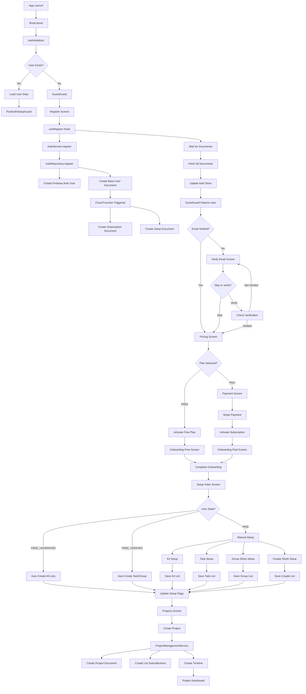
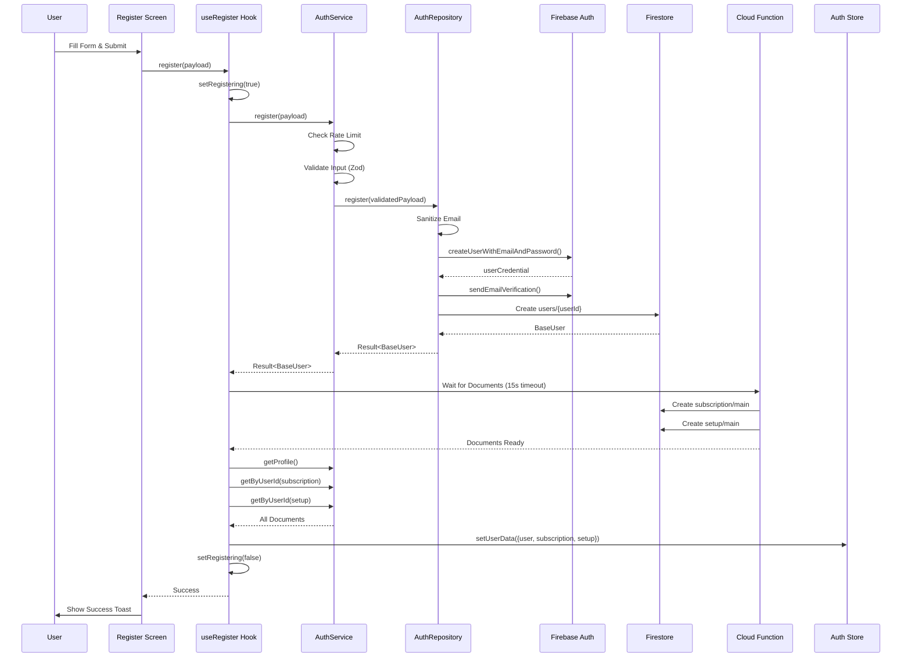
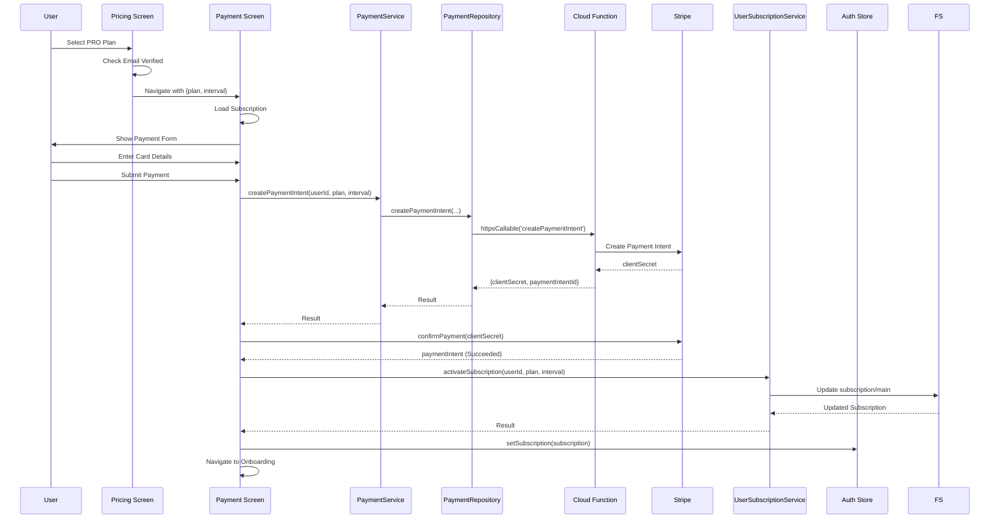
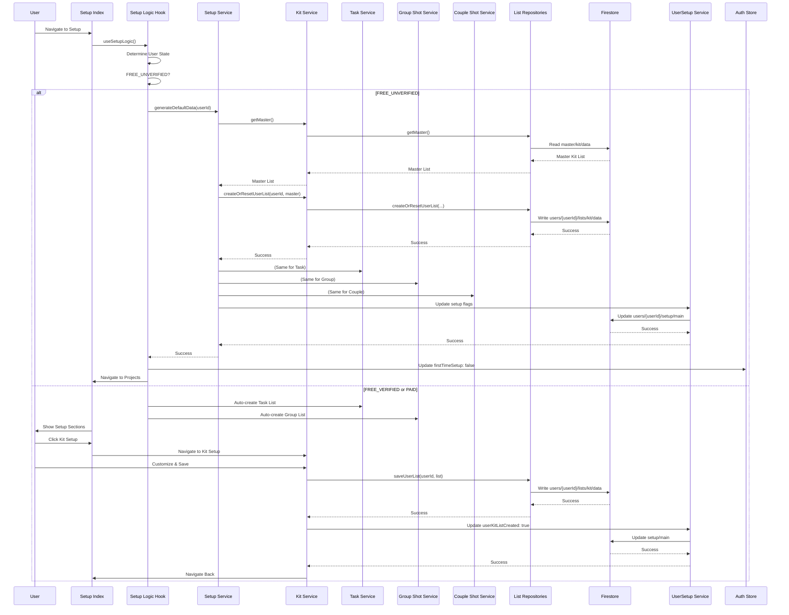
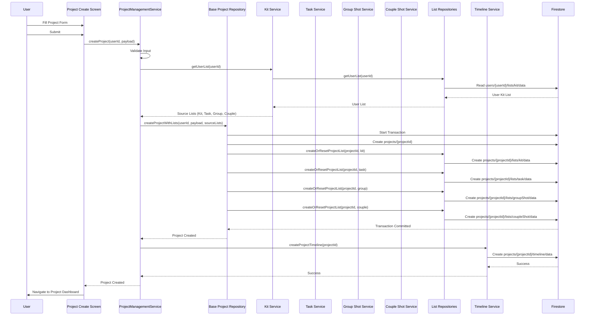

# Complete User Journey: Registration → Email Verification → Plan Selection → Payment → Onboarding → Setup → Projects

## Table of Contents
1. [App Launch & Initialization](#app-launch--initialization)
2. [Registration Flow](#registration-flow)
3. [Email Verification](#email-verification)
4. [Plan Selection (PRO)](#plan-selection-pro)
5. [Payment Processing](#payment-processing)
6. [Onboarding Flow](#onboarding-flow)
7. [Setup Flow (Kit, Task, Group-Shots, Couple-Shots)](#setup-flow)
8. [Project Creation](#project-creation)
9. [Data Flow Diagrams](#data-flow-diagrams)
10. [Issues & Weaknesses](#issues--weaknesses)

---

## App Launch & Initialization

### Entry Point
**File**: `src/app/_layout.tsx`

**What Happens**:
1. **Font Loading**: Uses `useFonts` to load custom fonts from `@/constants/typography`
2. **Theme Setup**: Determines light/dark theme based on system preference
3. **Global Services Initialization**:
   - `GlobalErrorHandler.initialize()` - Sets up global error handling
   - `serviceFactory.subscription.loadAllPlans()` - Pre-loads subscription plans (non-blocking)
4. **Provider Setup**:
   - `ServiceContext.Provider` - Provides service factory to all components
   - `StripeProvider` - Initializes Stripe for payments
   - `PaperProvider` - React Native Paper theme provider
   - `SafeAreaProvider` - Handles safe area insets
5. **Auth Initialization**: Wraps app in `<AuthInitializer>` component
6. **Route Stack**: Sets up Expo Router stack with `(auth)` and `(protected)` route groups

**Key Functions**:
- `RootLayout()` - Main layout component
- `useFonts(fontAssets)` - Loads custom fonts
- `useColorScheme()` - Detects system theme

**Dependencies**:
- `@/components/pre-auth/AuthInitializer`
- `@/contexts/ServiceContext`
- `@/services/ServiceFactory`
- `@/services/global-error-handler-service`

---

### Auth Initializer
**File**: `src/components/pre-auth/AuthInitializer.tsx`

**Purpose**: Loads user data on app start and watches for auth state changes. **Does NOT handle navigation** - that's done by guards.

**What Happens**:
1. **Initial Load** (runs once on app start):
   - Checks `auth.currentUser` from Firebase
   - If user exists, fetches in parallel:
     - `authService.getProfile()` - User document
     - `userSubscription.getByUserId()` - Subscription document
     - `userSetup.getByUserId()` - Setup document
   - Uses `withRetry` for resilience (3 attempts, 500ms delay, exponential backoff)
   - Stores data in `useAuthStore` via `setUserData()`
   - If no user, calls `reset()` to clear store

2. **Auth State Listener** (watches for sign in/out):
   - Subscribes to `onAuthStateChanged` from Firebase
   - Skips if `isRegistering` flag is true (prevents race conditions)
   - On sign in: Fetches user data (with more retries - 5 attempts)
   - On sign out: Calls `reset()` to clear store
   - Handles errors gracefully (logs but doesn't block)

**Key Functions**:
- `initializeAuth()` - Initial data load
- `onAuthStateChanged` callback - Watches for auth changes

**State Management**:
- `useAuthStore.setInitializing(true/false)` - Controls loading state
- `useAuthStore.setUserData({ user, subscription, setup })` - Stores fetched data
- `useAuthStore.reset()` - Clears all data

**Dependencies**:
- `@/stores/use-auth-store`
- `@/services/ServiceFactory` (via `useServices()`)
- `@/utils/error-recovery` (withRetry)
- `@/utils/error-context-builder`

**Important Notes**:
- Registration flow sets `isRegistering` flag to prevent AuthInitializer from interfering
- All data fetching uses retry logic for resilience
- Errors are logged but don't block app initialization

---

## Registration Flow

### Registration Screen
**File**: `src/app/(auth)/register.tsx`

**Purpose**: Presentation layer for registration form. Delegates all business logic to `useRegister` hook.

**What Happens**:
1. User fills out `AuthenticationForm` with:
   - `displayName`
   - `email`
   - `password`
   - `confirmPassword`
   - `acceptTermsAndPrivacy` (must be true)
   - `acceptMarketing` (optional)
2. On submit, calls `register()` from `useRegister` hook
3. Shows loading state while registration is in progress
4. Displays errors if registration fails
5. **Does NOT navigate** - `GuestGuard` handles navigation automatically

**Key Components**:
- `<AuthenticationForm mode="register" />` - Form component
- `<Screen>` - Wrapper with loading/error states

**Dependencies**:
- `@/hooks/use-register`
- `@/components/pre-auth/AuthenticationForm`
- `@/components/common/screen`

---

### Registration Hook
**File**: `src/hooks/use-register.ts`

**Purpose**: Orchestrates the complete registration flow including waiting for Cloud Functions.

**Flow**:
1. **Set Registration Flag**: `setRegistering(true)` - Prevents AuthInitializer from interfering
2. **Call Auth Service**: `auth.register(payload)` - Creates Firebase Auth user and base user document
3. **Wait for Cloud Function**: `waitForUserDocumentsReady()` - Waits up to 15 seconds for Cloud Function to create:
   - User subscription document (`users/{userId}/subscription/main`)
   - User setup document (`users/{userId}/setup/main`)
4. **Fetch All Documents**: Parallel fetch of:
   - `auth.getProfile()` - Full user document
   - `userSubscription.getByUserId()` - Subscription document
   - `userSetup.getByUserId()` - Setup document
5. **Update Store**: `setUserData()` - Atomically updates auth store with all data
6. **Show Success Toast**: Displays success message
7. **Clear Flag**: `setRegistering(false)` - Allows navigation guards to proceed

**Key Functions**:
- `register(payload: RegisterInput): Promise<boolean>` - Main registration function
- `clearError()` - Clears error state

**State Management**:
- Uses `LoadingState<BaseUser | null>` pattern
- `loading` - Boolean derived from state
- `error` - AppError or null
- `state` - Full LoadingState object

**Dependencies**:
- `@/services/ServiceFactory` (auth, baseUser, userSubscription, userSetup)
- `@/utils/user-document-waiter` (waitForUserDocumentsReady)
- `@/stores/use-auth-store`
- `@/stores/use-ui-store` (showToast)

**Error Handling**:
- If Cloud Function timeout: Shows warning toast but continues (graceful degradation)
- If fetch fails: Logs warning but uses fallback data
- All errors are handled via `useErrorHandler`

---

### Auth Service
**File**: `src/services/auth-service.ts`

**Purpose**: Business logic layer for authentication operations.

**Registration Method**: `register(payload: RegisterInput)`

**Flow**:
1. **Rate Limiting**: Checks `registerRateLimiter.canAttempt()` - Prevents abuse
   - Key: `Register-${email.toLowerCase()}`
   - If blocked, returns error with time until unblocked
2. **Validation**: `validateWithSchema(registerInputSchema, payload)` - Validates input with Zod
3. **Repository Call**: `authRepository.register(validatedPayload)` - Delegates to repository
4. **Reset Rate Limit**: On success, resets rate limiter
5. **Return Result**: Returns `{ user: BaseUser, verificationEmailSent: boolean }`

**Key Functions**:
- `register()` - Main registration method
- `signIn()` - Sign in method (not used in registration flow)
- `signOut()` - Sign out method

**Dependencies**:
- `@/repositories/i-auth-repository` (IAuthRepository interface)
- `@/utils/rate-limiter` (registerRateLimiter)
- `@/utils/validation-helpers` (validateWithSchema)
- `@/domain/user/auth.schema` (registerInputSchema)

**Error Handling**:
- Rate limit errors: Returns `AUTH_TOO_MANY_REQUESTS` error
- Validation errors: Returns `VALIDATION_FAILED` error from Zod
- Repository errors: Passes through from repository

---

### Auth Repository
**File**: `src/repositories/firestore/firestore-auth-repository.ts`

**Purpose**: Data access layer for authentication. Handles Firebase Auth and Firestore operations.

**Registration Method**: `register(payload: RegisterInput)`

**Flow**:
1. **Sanitize Email**: `sanitizeEmail(payload.email)` - Trims and lowercases
2. **Create Firebase Auth User**: `createUserWithEmailAndPassword(auth, email, password)`
3. **Update Display Name**: `updateProfile(userCredential.user, { displayName })` - Non-blocking
4. **Send Verification Email**: `sendEmailVerification(userCredential.user)` - Non-blocking
   - Stores status in memory for later retrieval
5. **Create Base User Document**: Calls `baseUserRepository.create()` to create:
   - Document path: `users/{userId}`
   - Contains: `id`, `email`, `displayName`, `isEmailVerified`, `createdAt`, `updatedAt`
6. **Return Result**: Returns `BaseUser` object

**Key Functions**:
- `register()` - Creates Firebase Auth user and base user document
- `wasVerificationEmailSent()` - Checks if email was sent (in-memory flag)
- `clearVerificationEmailStatus()` - Clears in-memory flag

**Dependencies**:
- `firebase/auth` (createUserWithEmailAndPassword, sendEmailVerification, updateProfile)
- `@/repositories/firestore/firestore-base-user-repository`
- `@/utils/sanitization-helpers` (sanitizeEmail)
- `@/utils/error-mapper` (ErrorMapper.fromFirebaseAuth)

**Error Handling**:
- Firebase Auth errors: Mapped via `ErrorMapper.fromFirebaseAuth()`
- Firestore errors: Mapped via `ErrorMapper.fromFirestore()`
- All errors wrapped in `Result<T, AppError>` pattern

**Important Notes**:
- Email verification is sent but doesn't block registration
- Base user document creation triggers Cloud Function to create subscription/setup documents
- Display name update failure is logged but doesn't fail registration

---

### Cloud Function (Background)
**File**: `functions/src/index.ts` (inferred from codebase)

**Purpose**: Automatically creates user subscription and setup documents when base user is created.

**Trigger**: `onUserCreate` - Firebase Auth user creation trigger

**What Happens**:
1. **Create Subscription Document**: 
   - Path: `users/{userId}/subscription/main`
   - Defaults: `plan: FREE`, `status: NONE`, `billingCycle: NONE`
2. **Create Setup Document**:
   - Path: `users/{userId}/setup/main`
   - Defaults: `showOnboarding: true`, `firstTimeSetup: true`, all list flags: `false`
3. **Timeout**: Must complete within 30 seconds (Firebase Function timeout)

**Why This Matters**:
- Registration hook waits for these documents before proceeding
- If timeout occurs, registration continues with warning (graceful degradation)

---

## Email Verification

### Verification Guard
**File**: `src/components/guards/VerificationGuard.tsx` (inferred from navigation flow)

**Purpose**: Checks if user's email is verified and redirects if not.

**What Happens**:
1. Checks `auth.currentUser.emailVerified`
2. Calls `currentUser.reload()` to get fresh verification status
3. If not verified:
   - Redirects to `/(protected)/verifyEmail` screen
   - Shows email verification prompt
4. If verified:
   - Allows access to protected routes

**Key Functions**:
- `checkEmailVerification()` - Checks verification status
- `sendVerificationEmail()` - Resends verification email

**Dependencies**:
- `firebase/auth` (currentUser, reload, sendEmailVerification)

---

### Verification Screen
**File**: `src/app/(protected)/verifyEmail.tsx` (inferred from navigation)

**Purpose**: Allows user to verify email or skip verification.

**What Happens**:
1. Shows email verification prompt
2. "Resend Email" button: Calls `sendEmailVerification()`
3. "Skip for Now" button: Sets `setup.skippedEmailVerification = true`
4. "Check Verification" button: Reloads user and checks `emailVerified`
5. On verification: Navigation guard redirects to next step

**Key Functions**:
- `handleResendEmail()` - Resends verification email
- `handleSkip()` - Marks verification as skipped
- `handleCheck()` - Checks if email is now verified

**Dependencies**:
- `@/services/ServiceFactory` (userSetup service)
- `firebase/auth` (sendEmailVerification, reload)

---

## Plan Selection (PRO)

### Pricing Screen
**File**: `src/app/(protected)/(payment)/pricing.tsx`

**Purpose**: Displays subscription plans and handles plan selection.

**What Happens**:
1. **Load Plans**: Fetches subscription plans from `subscriptionService.loadAllPlans()`
2. **Display Plans**: Shows FREE, BASIC, PRO, STUDIO plans with:
   - Monthly/Annual billing toggle
   - Feature comparisons
   - Pricing information
3. **Plan Selection**: `handleSelectPlan(plan: SubscriptionPlan)`
   - Checks email verification for paid plans
   - If not verified: Shows email verification modal
   - If FREE: Activates free plan immediately
   - If paid: Navigates to payment screen with plan/interval params

**Key Functions**:
- `handleSelectPlan()` - Handles plan selection
- `handleBillingCycleChange()` - Toggles monthly/annual
- `activateFreePlan()` - Activates free plan (calls `userSubscription.activateFreePlan()`)

**State Management**:
- `billingCycle` - Monthly or Annual
- `pendingPlan` - Plan selected but email not verified
- `pendingBillingCycle` - Billing cycle for pending plan
- `showEmailModal` - Shows email verification prompt

**Dependencies**:
- `@/services/ServiceFactory` (userSubscription, subscription)
- `@/hooks/use-user-subscription`
- `@/stores/use-auth-store`
- `@/constants/subscriptions` (getPrice, isPaidPlan)

**Navigation**:
- FREE plan → `/(protected)/(onboarding)/free`
- Paid plan → `/(protected)/(payment)/--payment` with params: `{ plan, interval }`

---

### Free Plan Activation
**File**: `src/services/user-subscription-service.ts`

**Method**: `activateFreePlan(userId: string)`

**What Happens**:
1. **Validate User ID**: Validates with `idSchema`
2. **Update Subscription**: Updates `users/{userId}/subscription/main`:
   - `plan: SubscriptionPlan.FREE`
   - `status: SubscriptionStatus.ACTIVE`
   - `billingCycle: BillingCycle.NONE`
   - `activatedAt: serverTimestamp()`
3. **Return Result**: Returns updated `UserSubscription` object

**Key Functions**:
- `activateFreePlan()` - Activates free plan
- `activateSubscription()` - Activates paid subscription (used after payment)

**Dependencies**:
- `@/repositories/firestore/firestore-user-subscription-repository`
- `@/utils/validation-helpers` (validateWithSchema)
- `@/domain/common/shared-schemas` (idSchema)

---

## Payment Processing

### Payment Screen
**File**: `src/app/(protected)/(payment)/--payment.tsx` (commented out, but logic inferred)

**Purpose**: Handles Stripe payment processing for paid plans.

**What Happens**:
1. **Load Subscription**: Fetches current subscription (may be null for new users)
2. **Extract Params**: Gets `plan` and `interval` from route params
3. **Check Email Verification**: If paid plan and not verified, redirects to verify email
4. **Display Payment Form**:
   - Plan details card (plan name, billing cycle, price)
   - Promo code input (optional)
   - Stripe CardField for card details
5. **Process Payment**:
   - Validates promo code (if provided)
   - Creates payment intent via `paymentService.createPaymentIntent()`
   - Confirms payment with Stripe via `confirmPayment()`
   - Activates subscription via `userSubscription.activateSubscription()`
   - Tracks payment success via `paymentService.trackPaymentSuccess()`
   - Updates auth store with new subscription
   - Navigates to onboarding

**Key Functions**:
- `loadSubscription()` - Loads subscription data
- `validatePromoCode()` - Validates promo code
- `handlePayment()` - Processes payment

**State Management**:
- `state: LoadingState<PaymentState>` - Subscription and selected plan/interval
- `processing` - Payment processing flag
- `cardComplete` - Card field completion status
- `promoCode` - Promo code input
- `promoDiscount` - Discount percentage
- `promoError` - Promo code error message

**Dependencies**:
- `@stripe/stripe-react-native` (CardField, useStripe, confirmPayment)
- `@/services/ServiceFactory` (payment, userSubscription, promoCode)
- `@/constants/subscriptions` (getPrice)

**Navigation**:
- On success → `/(protected)/(onboarding)/paid` or appropriate onboarding route

---

### Payment Service
**File**: `src/services/payment-service.ts`

**Purpose**: Business logic for payment operations.

**Key Methods**:

#### `createPaymentIntent(userId, plan, interval, promoCode?)`
1. **Validate Inputs**: Validates userId, plan, interval
2. **Calculate Price**: Gets base price from `getPrice(plan, interval)`
3. **Apply Promo Code**: If provided, validates and applies discount
4. **Call Repository**: `paymentRepository.createPaymentIntent()` - Creates Stripe payment intent
5. **Return**: `{ clientSecret: string }` for Stripe confirmation

#### `createSubscription(userId, plan, interval, paymentMethodId)`
1. **Validate Inputs**: Validates all parameters
2. **Call Repository**: `paymentRepository.createSubscription()` - Creates Stripe subscription
3. **Return**: `{ subscriptionId: string }`

#### `trackPaymentSuccess(userId, plan, interval, amount, promoCode?)`
1. **Record Payment**: Logs payment in analytics
2. **Track Promo Usage**: If promo code used, records usage
3. **Update Analytics**: Tracks conversion event

**Dependencies**:
- `@/repositories/firestore/firestore-payment-repository`
- `@/services/promo-code-service`
- `@/services/analytics-service`
- `@/constants/subscriptions` (getPrice)

---

### Payment Repository
**File**: `src/repositories/firestore/firestore-payment-repository.ts`

**Purpose**: Data access for payment operations. Calls Cloud Functions for Stripe operations.

**Key Methods**:

#### `createPaymentIntent(userId, plan, interval, amount, promoCode?, promoCodeId?)`
1. **Sanitize Inputs**: Sanitizes all string inputs
2. **Call Cloud Function**: `httpsCallable(functions, 'createPaymentIntent')` with payload:
   ```typescript
   {
     userId: string,
     plan: SubscriptionPlan,
     interval: BillingCycle,
     amount: number,
     promoCode?: string,
     promoCodeId?: string
   }
   ```
3. **Parse Response**: Validates and parses Cloud Function response
4. **Return**: `{ clientSecret: string, paymentIntentId: string }`

#### `createSubscription(userId, plan, interval, paymentMethodId)`
1. **Sanitize Inputs**: Sanitizes all inputs
2. **Call Cloud Function**: `httpsCallable(functions, 'createSubscription')` with payload
3. **Parse Response**: Validates response
4. **Return**: `{ subscriptionId: string, clientSecret: string | null }`

**Dependencies**:
- `firebase/functions` (httpsCallable)
- `@/utils/sanitization-helpers`
- `@/utils/error-mapper`

**Cloud Functions Called**:
- `createPaymentIntent` - Creates one-time payment intent
- `createSubscription` - Creates recurring subscription

---

## Onboarding Flow

### Onboarding Service
**File**: `src/services/onboarding-service.ts`

**Purpose**: Business logic for onboarding completion.

**Key Method**: `completeOnboarding(userId: string)`

**What Happens**:
1. **Validate User ID**: Validates with `idSchema`
2. **Update Setup Document**: Updates `users/{userId}/setup/main`:
   - `showOnboarding: false`
   - `firstTimeSetup: true` (if not already set)
3. **Return Result**: Returns success or error

**Dependencies**:
- `@/repositories/firestore/firestore-user-setup-repository`
- `@/utils/validation-helpers`

---

### Free Onboarding Screen
**File**: `src/app/(protected)/(onboarding)/free.tsx`

**Purpose**: Onboarding flow for FREE plan users.

**Flow Structure**:
- **A1**: Dynamic Splash Screen (account ready message)
- **A2**: 4-Step Feature Slideshow (core features overview)

**What Happens**:
1. **Render Splash (A1)**: Shows welcome message with "Proceed" button
2. **Render Slideshow (A2)**: Shows 4 slides with feature overview
3. **On Finish**: Calls `completeOnboarding()` from `useOnboarding` hook
4. **Navigation**: On success, navigates to `/(protected)/projects` (navigation guard will redirect to setup if needed)

**State Management**:
- `flowStep` (local): 0 = A1 (splash), 1 = A2 (slideshow)
- `currentSlideIndex` (store): Current slide in A2
- Uses `useOnboardingStore` for slide navigation

**Key Components**:
- `<DynamicSplashContainer>` - Splash screen component
- `<Slideshow>` - Slideshow component
- `<TrialBanner>` - Trial banner overlay

**Dependencies**:
- `@/hooks/use-onboarding`
- `@/stores/use-onboarding-store`
- `@/constants/onboarding-content` (FREE_USER_SLIDES, SPLASH_CONTENT)

---

### Paid Onboarding Screen
**File**: `src/app/(protected)/(onboarding)/paid.tsx`

**Purpose**: Onboarding flow for paid plan users (BASIC, PRO, STUDIO).

**Flow Structure**:
- **B1**: BASIC plan slideshow (5 slides)
- **B2**: PRO/STUDIO plan slideshow (5 slides)

**What Happens**:
1. **Determine Slides**: Based on `subscription.plan`:
   - BASIC → `BASIC_PLAN_SLIDES`
   - PRO/STUDIO → `PRO_PLAN_SLIDES`
2. **Render Slideshow**: Shows appropriate slides
3. **On Finish**: Calls `completeOnboarding()`
4. **Navigation**: On success, navigates to `/(protected)/projects`

**State Management**:
- `currentSlideIndex` (store): Current slide index
- Uses `useOnboardingStore` for slide navigation

**Key Components**:
- `<Slideshow>` - Slideshow component

**Dependencies**:
- `@/hooks/use-onboarding`
- `@/stores/use-onboarding-store`
- `@/constants/onboarding-content` (BASIC_PLAN_SLIDES, PRO_PLAN_SLIDES)

---

### Onboarding Hook
**File**: `src/hooks/use-onboarding.ts`

**Purpose**: Hook for onboarding operations.

**Key Method**: `completeOnboarding()`

**What Happens**:
1. **Call Service**: `onboardingService.completeOnboarding(userId)`
2. **On Success**: 
   - Updates loading state
   - Calls `onSuccess` callback (navigates to projects)
3. **On Error**: 
   - Updates error state
   - Calls `onError` callback

**State Management**:
- Uses `LoadingState<void>` pattern
- `loading` - Boolean
- `error` - AppError or null

**Dependencies**:
- `@/services/ServiceFactory` (onboarding service)
- `@/utils/loading-state`

---

## Setup Flow

### Setup Index Screen
**File**: `src/app/(protected)/(setup)/index.tsx`

**Purpose**: Main setup screen showing progress and list of setup sections.

**What Happens**:
1. **Fetch Data**: 
   - Subscription (via `useUserSubscription`)
   - Setup (via `useUserSetup`)
   - Features (via `useFeatureAccess`)
2. **Initialize List Hooks**: 
   - `useKitList`
   - `useTaskList`
   - `useGroupShotList`
   - `useCoupleShotList`
3. **Auto-Fetch Lists**: Based on user state:
   - FREE_UNVERIFIED: Auto-creates all lists in background
   - FREE_VERIFIED: Auto-creates Task and Group lists
4. **Display Setup Sections**: Shows cards for:
   - Kit List
   - Task List
   - Group Shots
   - Couple Shots
5. **Skip All**: Option to create all lists from master templates

**Key Functions**:
- `handleSkipAll()` - Creates all lists from master templates
- `handleResetLists()` - Resets lists to master templates

**State Management**:
- Uses `useSetupContext` for user state
- Uses `useSetupLogic` for automatic list creation

**Dependencies**:
- `@/hooks/use-setup-logic`
- `@/hooks/list-hooks` (useKitList, useTaskList, etc.)
- `@/hooks/use-user-setup`
- `@/hooks/use-user-subscription`

---

### Setup Logic Hook
**File**: `src/hooks/use-setup-logic.ts`

**Purpose**: Handles automatic list creation based on user state.

**What Happens**:
1. **Determine User State**: Uses `UserStateResolver` to determine state
2. **Auto-Create Lists**:
   - **FREE_UNVERIFIED**: Creates all 4 lists (Kit, Task, Group, Couple) in parallel
   - **FREE_VERIFIED**: Creates Task and Group lists (Kit and Couple are customizable)
3. **Update Setup Flags**: After each list created, updates `setup` document:
   - `userKitListCreated: true`
   - `userTaskListCreated: true`
   - `userGroupShotListCreated: true`
   - `userCoupleShotListCreated: true`
4. **On Completion**: Updates `firstTimeSetup: false` and navigates to projects

**Key Functions**:
- `processList()` - Helper to create list and update setup flag
- `handleAutoSetup()` - Main auto-setup logic

**Dependencies**:
- `@/hooks/list-hooks`
- `@/hooks/use-user-setup`
- `@/utils/navigation/user-state-resolver`

---

### Setup Service
**File**: `src/services/setup-service.ts`

**Purpose**: Business logic for setup operations.

**Key Method**: `generateDefaultData(userId: string)`

**What Happens**:
1. **Check Idempotency**: Checks if lists already created
2. **Get Master Lists**: Fetches master templates for:
   - Kit List
   - Task List
   - Group Shot List
   - Couple Shot List
3. **Create User Lists**: Creates user lists from master templates:
   - `kit.createOrResetUserList(userId, masterKitList)`
   - `task.createOrResetUserList(userId, masterTaskList)`
   - `groupShot.createOrResetUserList(userId, masterGroupShotList)`
   - `coupleShot.createOrResetUserList(userId, masterCoupleShotList)`
4. **Update Setup Flags**: Updates setup document with list creation flags

**Dependencies**:
- `@/services/ServiceFactory` (kit, task, groupShot, coupleShot services)
- `@/services/user-setup-service`

---

### Kit Setup Screen
**File**: `src/app/(protected)/(setup)/kit.tsx`

**Purpose**: Setup screen for Kit List customization.

**What Happens**:
1. **Fetch List**: Uses `useKitList` hook to fetch user list (or master if not exists)
2. **Check Setup Status**: If `setup.userKitListCreated`, shows "Complete" screen
3. **Display List**: Shows list items with categories
4. **Allow Customization**: Based on plan:
   - Can add items (if `canCustomizeKitListUser()`)
   - Can update items
   - Can delete items
5. **Save**: On "Save & Continue":
   - Forces `source: ListSource.USER_LIST`
   - Saves list via `saveUserList()`
   - Updates `setup.userKitListCreated = true`
   - Navigates back to setup index

**Key Functions**:
- `handleSave()` - Saves list and updates setup flag
- `handleAddItem()` - Adds new item (with plan checks)
- `handleDeleteItem()` - Deletes item
- `handleUpdateItem()` - Updates item

**Dependencies**:
- `@/hooks/list-hooks` (useKitList)
- `@/hooks/use-user-setup`
- `@/hooks/use-user-subscription`
- `@/utils/feature-access` (FeatureAccess)

**Components**:
- `<ListContentWrapper>` - Displays list items
- `<UnifiedFormModal>` - Form for adding items
- `<ListLocked>` - Shows "Complete" state

---

### Task Setup Screen
**File**: `src/app/(protected)/(setup)/tasks.tsx`

**Purpose**: Setup screen for Task List. **Premium feature** - locked for FREE users.

**What Happens**:
1. **Check Access**: If `!canUseTaskList()`, shows "Premium Feature" locked screen
2. **Fetch List**: Uses `useTaskList` hook
3. **Check Setup Status**: If `setup.userTaskListCreated`, shows "Complete" screen
4. **Display List**: Shows task items
5. **Save**: Similar to Kit setup

**Key Differences from Kit**:
- **Premium Lock**: FREE users cannot access
- **Auto-Created**: For FREE_VERIFIED users, auto-created in background

**Dependencies**: Same as Kit setup

---

### Group Shots Setup Screen
**File**: `src/app/(protected)/(setup)/groupShots.tsx`

**Purpose**: Setup screen for Group Shot List.

**What Happens**: Similar to Task setup:
- Premium feature (locked for FREE)
- Auto-created for FREE_VERIFIED users
- Can customize if plan allows

**Dependencies**: Same as Kit/Task setup

---

### Couple Shots Setup Screen
**File**: `src/app/(protected)/(setup)/coupleShots.tsx`

**Purpose**: Setup screen for Couple Shot List.

**What Happens**: Similar to Kit setup:
- Available to all users
- Can customize if plan allows
- Must be manually created (not auto-created)

**Dependencies**: Same as Kit setup

---

### List Hooks (Generic Pattern)
**Files**: `src/hooks/list-hooks.ts` (inferred from usage)

**Purpose**: Generic hooks for list operations (Kit, Task, Group, Couple).

**Key Methods** (for each list type):
- `getMaster()` - Fetches master list template
- `getUserList()` - Fetches user's custom list
- `createOrResetUserList()` - Creates user list from master
- `saveUserList()` - Saves user list
- `addUserItem()` - Adds item to user list
- `deleteUserItem()` - Deletes item from user list
- `batchUpdateUserItems()` - Updates multiple items

**State Management**:
- Uses `LoadingState<List | null>` pattern
- `list` - Current list (master or user)
- `loading` - Loading state
- `error` - Error state

**Dependencies**:
- `@/services/ServiceFactory` (kit, task, groupShot, coupleShot services)
- `@/utils/loading-state`

---

### List Services
**Files**: 
- `src/services/kit-list-service.ts`
- `src/services/task-list-service.ts`
- `src/services/group-shot-list-service.ts`
- `src/services/couple-shot-list-service.ts`

**Purpose**: Business logic for list operations.

**Key Methods** (all services follow same pattern):
- `getMaster()` - Gets master list template
- `getUserList(userId)` - Gets user's custom list
- `createOrResetUserList(userId, sourceList)` - Creates user list from source
- `saveUserList(userId, list)` - Saves user list
- `addUserItem(userId, item)` - Adds item
- `deleteUserItem(userId, itemId)` - Deletes item
- `batchUpdateUserItems(userId, updates)` - Updates items

**Dependencies**:
- `@/repositories/firestore/list.repository` (kitRepository, taskRepository, etc.)
- `@/utils/validation-helpers`
- `@/utils/error-mapper`

---

### List Repositories
**File**: `src/repositories/firestore/list.repository.ts`

**Purpose**: Data access for list operations.

**Key Methods** (all repositories follow same pattern):
- `getMaster()` - Fetches master list from `master/{listType}/data`
- `getUserList(userId)` - Fetches user list from `users/{userId}/lists/{listType}/data`
- `createOrResetUserList(userId, sourceList)` - Creates/resets user list
- `saveUserList(userId, list)` - Saves user list
- `addUserItem(userId, item)` - Adds item to array
- `deleteUserItem(userId, itemId)` - Removes item from array
- `batchUpdateUserItems(userId, updates)` - Updates items in array

**Firestore Structure**:
- Master lists: `master/{listType}/data` (single document)
- User lists: `users/{userId}/lists/{listType}/data` (single document)
- Project lists: `projects/{projectId}/lists/{listType}/data` (single document)

**Dependencies**:
- `firebase/firestore` (doc, getDoc, setDoc, updateDoc, runTransaction)
- `@/utils/sanitization-helpers`
- `@/utils/error-mapper`

---

## Project Creation

### Projects Screen
**File**: `src/app/(protected)/projects/index.tsx` (inferred from navigation)

**Purpose**: Displays list of user's projects and allows creation of new projects.

**What Happens**:
1. **Fetch Projects**: Uses `useUserProjects` hook to fetch user's projects
2. **Display Projects**: Shows list of projects with:
   - Project name
   - Project date
   - Project status
3. **Create Project**: "Create Project" button opens project creation form
4. **Select Project**: Clicking project navigates to project dashboard

**Dependencies**:
- `@/hooks/use-user-projects`
- `@/services/ServiceFactory` (userProjects service)

---

### Project Creation Form
**File**: `src/app/(protected)/projects/create.tsx` (inferred from navigation)

**Purpose**: Form for creating new project.

**What Happens**:
1. **Collect Input**: User enters:
   - Project name
   - Project date
   - Project type (optional)
2. **Validate**: Validates input with Zod schema
3. **Create Project**: Calls `projectManagementService.createProject()`
4. **Show Progress**: Displays progress indicator during creation
5. **Navigate**: On success, navigates to project dashboard

**Dependencies**:
- `@/services/ServiceFactory` (projectManagement service)
- `@/hooks/use-project-management`

---

### Project Management Service
**File**: `src/services/ProjectManagementService.ts`

**Purpose**: Orchestrates project creation including all subcollections.

**Key Method**: `createProject(userId, payload, onProgress?)`

**Flow**:
1. **Validate Input**: Validates `BaseProjectInput` with Zod schema
2. **Prepare Source Lists** (30%):
   - Gets user's lists (Kit, Task, Group, Couple)
   - Falls back to master lists if user lists don't exist
   - All reads happen before transaction (Firestore requirement)
3. **Create Project & Lists** (70%):
   - Calls `baseProjectRepository.createProjectWithLists()` in transaction:
     - Creates project document: `projects/{projectId}`
     - Creates 4 list subcollections:
       - `projects/{projectId}/lists/kit/data`
       - `projects/{projectId}/lists/task/data`
       - `projects/{projectId}/lists/groupShot/data`
       - `projects/{projectId}/lists/coupleShot/data`
   - Uses `runTransaction` for atomicity
4. **Initialize Timeline** (90%):
   - Calls `baseTimelineService.createProjectTimeline(projectId)`
   - Creates timeline document: `projects/{projectId}/timeline/data`
   - Non-critical (project creation succeeds even if timeline fails)
5. **Complete** (100%): Returns created project

**Key Functions**:
- `createProject()` - Main creation method
- `prepareSourceLists()` - Helper to get source lists for project

**Dependencies**:
- `@/repositories/firestore/firestore-base-project-repository`
- `@/services/base-timeline-service`
- `@/services/kit-list-service`, `task-list-service`, etc.
- `@/utils/error-recovery` (withRetry)

**Error Handling**:
- Timeline failure is logged but doesn't fail project creation
- All operations use retry logic for resilience

---

### Base Project Repository
**File**: `src/repositories/firestore/firestore-base-project-repository.ts`

**Purpose**: Data access for project operations.

**Key Method**: `createProjectWithLists(userId, projectInput, sourceLists, listRepositories)`

**What Happens**:
1. **Start Transaction**: `runTransaction(firestore, async (tx) => { ... })`
2. **Create Project Document**:
   - Path: `projects/{projectId}` (Firestore-generated ID)
   - Data: `BaseProject` object with:
     - `id`, `userId`, `name`, `date`, `type`, `createdAt`, `updatedAt`
3. **Create List Subcollections** (inside transaction):
   - Calls `listRepositories.kit.createOrResetProjectList(userId, projectId, sourceLists.kit, tx)`
   - Calls `listRepositories.task.createOrResetProjectList(...)`
   - Calls `listRepositories.groupShot.createOrResetProjectList(...)`
   - Calls `listRepositories.coupleShot.createOrResetProjectList(...)`
4. **Commit Transaction**: All writes succeed or all fail (atomicity)

**Key Functions**:
- `createProjectWithLists()` - Creates project and lists atomically
- `create()` - Creates project document (used inside transaction)

**Dependencies**:
- `firebase/firestore` (runTransaction, doc, setDoc)
- `@/repositories/firestore/list.repository` (list repositories)
- `@/utils/error-mapper`

**Important Notes**:
- All reads must happen before transaction starts (Firestore requirement)
- Transaction ensures atomicity (all or nothing)
- Project ID is Firestore-generated (not UUID)

---

### Timeline Service
**File**: `src/services/base-timeline-service.ts`

**Purpose**: Business logic for timeline operations.

**Key Method**: `createProjectTimeline(projectId: string)`

**What Happens**:
1. **Validate Project ID**: Validates with `idSchema`
2. **Create Timeline Document**:
   - Path: `projects/{projectId}/timeline/data`
   - Data: `Timeline` object with:
     - `id: projectId`
     - `items: []` (empty array)
     - `config: { finalized: false, ... }`
     - `createdAt`, `updatedAt`
3. **Return Result**: Returns success or error

**Dependencies**:
- `@/repositories/firestore/firestore-base-timeline-repository`
- `@/utils/validation-helpers`

**Important Notes**:
- Timeline creation is non-critical (project can exist without timeline)
- Timeline is created outside transaction (after project creation)

---

## Data Flow Diagrams

### Complete User Journey Flow



### Registration Data Flow



### Payment Data Flow



### Setup Data Flow



### Project Creation Data Flow



---

## Issues & Weaknesses

### 1. **Race Conditions in Registration**

**Issue**: `AuthInitializer` and `useRegister` can race when user signs up.
**Location**: `src/components/pre-auth/AuthInitializer.tsx`, `src/hooks/use-register.ts`
**Impact**: Medium - Can cause duplicate data fetches or navigation issues
**Current Mitigation**: `isRegistering` flag prevents interference, but timing is still tight

#### Solution Option 1: Event-Based Synchronization (Recommended)

Create a registration event emitter to coordinate between components:

```typescript
// src/utils/registration-coordinator.ts
import { EventEmitter } from 'events';

class RegistrationCoordinator extends EventEmitter {
  private isRegistering = false;
  private registrationPromise: Promise<void> | null = null;

  startRegistration(promise: Promise<void>): void {
    this.isRegistering = true;
    this.registrationPromise = promise;
    this.emit('registration:started');
    
    promise.finally(() => {
      this.isRegistering = false;
      this.registrationPromise = null;
      this.emit('registration:completed');
    });
  }

  isInProgress(): boolean {
    return this.isRegistering;
  }

  async waitForCompletion(): Promise<void> {
    if (this.registrationPromise) {
      await this.registrationPromise;
    }
  }
}

export const registrationCoordinator = new RegistrationCoordinator();
```

**Update AuthInitializer**:
```typescript
// src/components/pre-auth/AuthInitializer.tsx
import { registrationCoordinator } from '@/utils/registration-coordinator';

export const AuthInitializer: React.FC<AuthInitializerProps> = ({ children }) => {
  // ... existing code ...

  useEffect(() => {
    const unsubscribe = onAuthStateChanged(
      auth,
      async firebaseUser => {
        if (!isInitializedRef.current) return;

        // Wait for registration to complete if in progress
        if (registrationCoordinator.isInProgress()) {
          await registrationCoordinator.waitForCompletion();
          return;
        }

        // ... rest of existing code ...
      }
    );

    // Listen for registration events
    registrationCoordinator.on('registration:started', () => {
      // Pause any data fetching
    });

    registrationCoordinator.on('registration:completed', () => {
      // Resume data fetching
    });

    return () => {
      unsubscribe();
      registrationCoordinator.removeAllListeners();
    };
  }, [/* ... */]);
};
```

**Update useRegister**:
```typescript
// src/hooks/use-register.ts
import { registrationCoordinator } from '@/utils/registration-coordinator';

export function useRegister(options?: UseRegisterOptions): UseRegisterResult {
  // ... existing code ...

  const register = useCallback(
    async (payload: RegisterInput): Promise<boolean> => {
      const context = ErrorContextBuilder.fromHook('useRegister', 'register');

      setState(loading());
      setRegistering(true);

      // Wrap registration in coordinator
      const registrationPromise = (async () => {
        try {
          const result = await auth.register(payload);
          // ... rest of registration logic ...
          return true;
        } finally {
          setRegistering(false);
        }
      })();

      registrationCoordinator.startRegistration(registrationPromise);
      return await registrationPromise;
    },
    [/* ... */]
  );
}
```

#### Solution Option 2: Mutex Lock Pattern

```typescript
// src/utils/mutex.ts
class Mutex {
  private locked = false;
  private queue: Array<() => void> = [];

  async acquire(): Promise<() => void> {
    return new Promise((resolve) => {
      if (!this.locked) {
        this.locked = true;
        resolve(() => this.release());
      } else {
        this.queue.push(() => {
          this.locked = true;
          resolve(() => this.release());
        });
      }
    });
  }

  private release(): void {
    this.locked = false;
    const next = this.queue.shift();
    if (next) next();
  }
}

export const registrationMutex = new Mutex();
```

#### Solution Option 3: Zustand Store with Registration State

```typescript
// src/stores/use-registration-store.ts
import { create } from 'zustand';

interface RegistrationState {
  isRegistering: boolean;
  registrationUserId: string | null;
  setRegistering: (userId: string | null) => void;
}

export const useRegistrationStore = create<RegistrationState>((set) => ({
  isRegistering: false,
  registrationUserId: null,
  setRegistering: (userId) => set({ 
    isRegistering: !!userId, 
    registrationUserId: userId 
  }),
}));
```

---

### 2. **Cloud Function Timeout Risk**

**Issue**: Registration waits 15 seconds for Cloud Function to create documents, but Cloud Functions can timeout.
**Location**: `src/hooks/use-register.ts` (waitForUserDocumentsReady)
**Impact**: High - If Cloud Function fails, user documents may not exist

#### Solution Option 1: Firestore Triggers Instead of Cloud Functions (Recommended)

Replace Cloud Function with Firestore trigger that runs server-side:

```typescript
// functions/src/index.ts
import * as functions from 'firebase-functions';
import * as admin from 'firebase-admin';

export const onUserDocumentCreate = functions.firestore
  .document('users/{userId}')
  .onCreate(async (snapshot, context) => {
    const userId = context.params.userId;

    const batch = admin.firestore().batch();

    // Create subscription document
    const subscriptionRef = admin.firestore()
      .collection('users')
      .doc(userId)
      .collection('subscription')
      .doc('main');

    batch.set(subscriptionRef, {
      plan: 'FREE',
      status: 'NONE',
      billingCycle: 'NONE',
      createdAt: admin.firestore.FieldValue.serverTimestamp(),
      updatedAt: admin.firestore.FieldValue.serverTimestamp(),
    });

    // Create setup document
    const setupRef = admin.firestore()
      .collection('users')
      .doc(userId)
      .collection('setup')
      .doc('main');

    batch.set(setupRef, {
      showOnboarding: true,
      firstTimeSetup: true,
      userKitListCreated: false,
      userTaskListCreated: false,
      userGroupShotListCreated: false,
      userCoupleShotListCreated: false,
      skippedEmailVerification: false,
      createdAt: admin.firestore.FieldValue.serverTimestamp(),
      updatedAt: admin.firestore.FieldValue.serverTimestamp(),
    });

    await batch.commit();
  });
```

**Update waitForUserDocumentsReady**:
```typescript
// src/utils/user-document-waiter.ts
export async function waitForUserDocumentsReady(
  userId: string,
  baseUserService: BaseUserService,
  options: { timeoutMs?: number } = {}
): Promise<Result<void, AppError>> {
  const { timeoutMs = 15000 } = options;
  const startTime = Date.now();
  const pollInterval = 500; // Check every 500ms

  while (Date.now() - startTime < timeoutMs) {
    const [userResult, subResult, setupResult] = await Promise.all([
      baseUserService.getById(userId),
      // Add subscription and setup checks
    ]);

    if (userResult.success && subResult.success && setupResult.success) {
      return ok(undefined);
    }

    await new Promise(resolve => setTimeout(resolve, pollInterval));
  }

  return err(ErrorMapper.createGenericError(
    ErrorCode.TIMEOUT,
    'Documents not ready',
    'User documents are still being created. Please try again in a moment.',
    'waitForUserDocumentsReady'
  ));
}
```

#### Solution Option 2: Retry with Exponential Backoff

```typescript
// src/utils/user-document-waiter.ts
import { withRetry } from '@/utils/error-recovery';

export async function waitForUserDocumentsReady(
  userId: string,
  baseUserService: BaseUserService,
  options: { timeoutMs?: number; maxRetries?: number } = {}
): Promise<Result<void, AppError>> {
  const { timeoutMs = 30000, maxRetries = 5 } = options;

  return await withRetry(
    async () => {
      const [userResult, subResult, setupResult] = await Promise.all([
        baseUserService.getById(userId),
        // ... check subscription and setup
      ]);

      if (!userResult.success || !subResult.success || !setupResult.success) {
        throw new Error('Documents not ready');
      }

      return ok(undefined);
    },
    {
      maxAttempts: maxRetries,
      delayMs: 2000,
      exponential: true,
      timeoutMs,
    }
  );
}
```

#### Solution Option 3: Client-Side Fallback Creation

```typescript
// src/hooks/use-register.ts
const waitResult = await waitForUserDocumentsReady(user.id, baseUser, {
  timeoutMs: 15000,
});

if (!waitResult.success) {
  // Fallback: Create documents client-side
  const [subResult, setupResult] = await Promise.all([
    userSubscription.createDefault(user.id),
    userSetup.createDefault(user.id),
  ]);

  if (!subResult.success || !setupResult.success) {
    // Log error but continue
    LoggingService.warn('Failed to create default documents', {
      userId: user.id,
      subscriptionError: subResult.error,
      setupError: setupResult.error,
    });
  }
}
```

---

### 3. **Payment Screen Commented Out**

**Issue**: Payment screen code is commented out in `--payment.tsx`
**Location**: `src/app/(protected)/(payment)/--payment.tsx`
**Impact**: High - Payment flow may not work

#### Solution Option 1: Uncomment and Refactor (Recommended)

```typescript
// src/app/(protected)/(payment)/payment.tsx
import React, { useState, useEffect, useCallback, useRef } from 'react';
import { View, ScrollView } from 'react-native';
import { router, useLocalSearchParams } from 'expo-router';
import { Screen } from '@/components/common/screen';
import { StandardAppText } from '@/components/common/ui/StandardAppText';
import { StandardAppButton } from '@/components/common/ui/StandardAppButton';
import { StandardAppTextInput } from '@/components/common/ui/StandardAppTextInput';
import { StandardAppCard } from '@/components/common/ui/StandardAppCard';
import { StandardSpacer } from '@/components/common/ui/StandardSpacer';
import { useAuthStore } from '@/stores/use-auth-store';
import { useServices } from '@/contexts/ServiceContext';
import { useAppStyles } from '@/hooks/use-app-styles';
import { useErrorHandler } from '@/hooks/use-error-handler';
import { ErrorContextBuilder } from '@/utils/error-context-builder';
import { LoadingState, loading, success, error as errorState, idle } from '@/utils/loading-state';
import { CardField, useStripe } from '@stripe/stripe-react-native';
import { getPrice } from '@/constants/subscriptions';
import { BillingCycle, SubscriptionPlan } from '@/constants/enums';
import { ErrorCode } from '@/constants/error-code-registry';
import { NavigationRoute, NavigationRouteValue } from '@/constants/navigation/navigation';
import type { UserSubscription } from '@/domain/user/user.schema';
import { AppError } from '@/domain/common/errors';
import { ErrorMapper } from '@/utils/error-mapper';
import { isPaidPlan } from '@/utils/pricing-display-helpers';
import { USER_SUBCOLLECTION_DOC_ID } from '@/repositories/firestore/paths/firestore-user-paths';
import { VerificationGuard } from '@/components/guards/VerificationGuard';
import { Card } from 'react-native-paper';

interface PaymentState {
  subscription: UserSubscription | null;
  selectedPlan?: SubscriptionPlan;
  selectedInterval?: BillingCycle;
}

export default function PaymentScreen() {
  const { user } = useAuthStore();
  const { spacing, theme, typography, uiStyles } = useAppStyles();
  const colors = theme.colors;
  const { confirmPayment } = useStripe();
  const { payment, userSubscription, promoCode: promoCodeService } = useServices();
  const { handleError } = useErrorHandler();
  const params = useLocalSearchParams<{
    mode?: string;
    plan?: SubscriptionPlan;
    interval?: BillingCycle;
  }>();
  const isUpdateMode = params.mode === 'update';
  const isMountedRef = useRef(true);

  const [state, setState] = useState<LoadingState<PaymentState | null>>(idle());
  const [processing, setProcessing] = useState(false);
  const [cardComplete, setCardComplete] = useState(false);
  const [promoCode, setPromoCode] = useState('');
  const [validatingPromo, setValidatingPromo] = useState(false);
  const [promoDiscount, setPromoDiscount] = useState<number | null>(null);
  const [promoError, setPromoError] = useState<string | null>(null);

  useEffect(() => {
    return () => {
      isMountedRef.current = false;
    };
  }, []);

  const loadSubscription = useCallback(async () => {
    if (!user?.id) {
      setState(idle());
      return;
    }

    setState(loading());

    const result = await userSubscription.getByUserId(user.id);

    if (!isMountedRef.current) return;

    const planFromParams = params.plan as SubscriptionPlan | undefined;
    let intervalFromParams = params.interval as BillingCycle | string | undefined;

    if (intervalFromParams && typeof intervalFromParams === 'string') {
      const intervalUpper = intervalFromParams.toUpperCase();
      if (intervalUpper === 'ANNUALLY' || intervalUpper === 'ANNUAL') {
        intervalFromParams = BillingCycle.ANNUALLY;
      } else if (intervalUpper === 'MONTHLY' || intervalUpper === 'MONTH') {
        intervalFromParams = BillingCycle.MONTHLY;
      }
    }

    const selectedPlan = planFromParams;
    if (selectedPlan && isPaidPlan(selectedPlan) && !user.isEmailVerified) {
      const context = ErrorContextBuilder.fromHook('PaymentScreen', 'loadSubscription', user.id);
      const emailError = ErrorMapper.createGenericError(
        ErrorCode.AUTH_EMAIL_NOT_VERIFIED,
        'Email verification required',
        'Please verify your email address before proceeding with payment for a paid plan.',
        ErrorContextBuilder.toString(context),
        undefined,
        false,
      );
      setState(errorState(emailError, null));
      handleError(emailError, context);
      router.push({ pathname: NavigationRoute.VERIFY_EMAIL });
      return;
    }

    if (result.success) {
      const finalSelectedPlan = planFromParams || result.value.plan;
      const finalSelectedInterval =
        (intervalFromParams as BillingCycle) || result.value.billingCycle;

      setState(
        success({
          subscription: result.value,
          selectedPlan: finalSelectedPlan,
          selectedInterval: finalSelectedInterval,
        }),
      );
    } else {
      if (planFromParams && intervalFromParams) {
        setState(
          success({
            subscription: null,
            selectedPlan: planFromParams,
            selectedInterval: intervalFromParams as BillingCycle,
          }),
        );
      } else {
        setState(errorState(result.error, null));
        handleError(
          result.error,
          ErrorContextBuilder.fromHook('PaymentScreen', 'loadSubscription', user.id),
        );
      }
    }
  }, [
    user?.id,
    user?.isEmailVerified,
    userSubscription,
    handleError,
    params.plan,
    params.interval,
    router,
  ]);

  useEffect(() => {
    loadSubscription();
  }, [loadSubscription]);

  const currentData = state.status === 'success' ? state.data : null;
  const subscription = currentData?.subscription;
  const selectedPlan = currentData?.selectedPlan || subscription?.plan;
  const selectedInterval = currentData?.selectedInterval || subscription?.billingCycle;

  const validatePromoCode = useCallback(async () => {
    if (!promoCode.trim() || !selectedPlan) {
      setPromoError(null);
      setPromoDiscount(null);
      return;
    }

    setValidatingPromo(true);
    setPromoError(null);

    const result = await promoCodeService.validatePromoCode(promoCode.trim(), selectedPlan);

    setValidatingPromo(false);

    if (!isMountedRef.current) return;

    if (result.success) {
      setPromoDiscount(result.value.discountPercent);
      setPromoError(null);
    } else {
      setPromoError(result.error.userMessage || 'Invalid promo code');
      setPromoDiscount(null);
      handleError(
        result.error,
        ErrorContextBuilder.fromHook('PaymentScreen', 'validatePromoCode', user?.id),
      );
    }
  }, [promoCode, selectedPlan, promoCodeService, handleError, user?.id]);

  const handlePayment = useCallback(async () => {
    if (!user?.id || !cardComplete || !selectedPlan || !selectedInterval) return;

    if (isPaidPlan(selectedPlan) && !user.isEmailVerified) {
      const context = ErrorContextBuilder.fromHook('PaymentScreen', 'handlePayment', user.id);
      const emailError = ErrorMapper.createGenericError(
        ErrorCode.AUTH_EMAIL_NOT_VERIFIED,
        'Email verification required',
        'Please verify your email address before proceeding with payment for a paid plan.',
        ErrorContextBuilder.toString(context),
        undefined,
        false,
      );
      handleError(emailError, context);
      router.push({ pathname: NavigationRoute.VERIFY_EMAIL });
      return;
    }

    setProcessing(true);

    try {
      const intentResult = await payment.createPaymentIntent(
        user.id,
        selectedPlan,
        selectedInterval,
        promoCode.trim() || undefined,
      );

      if (!isMountedRef.current) return;

      if (!intentResult.success) {
        handleError(
          intentResult.error,
          ErrorContextBuilder.fromHook('PaymentScreen', 'handlePayment', user.id, undefined, {
            step: 'createPaymentIntent',
            plan: selectedPlan,
            interval: selectedInterval,
          }),
        );
        return;
      }

      const { clientSecret } = intentResult.value;

      const { error, paymentIntent } = await confirmPayment(clientSecret, {
        paymentMethodType: 'Card',
      });

      if (!isMountedRef.current) return;

      if (error) {
        const context = ErrorContextBuilder.fromHook(
          'PaymentScreen',
          'handlePayment',
          user.id,
          undefined,
          { step: 'confirmPayment', stripeError: error.code },
        );
        const stripeError = ErrorMapper.createGenericError(
          ErrorCode.PAYMENT_FAILED,
          error.message || 'Payment failed',
          error.message || 'Payment failed. Please try again.',
          ErrorContextBuilder.toString(context),
          error,
          true,
        );
        handleError(stripeError, context);
        return;
      }

      if (paymentIntent?.status === 'Succeeded') {
        if (isUpdateMode) {
          if (!subscription) {
            handleError(
              ErrorMapper.createGenericError(
                ErrorCode.VALIDATION_FAILED,
                'Subscription required',
                'Subscription is required to update payment method.',
                ErrorContextBuilder.toString(
                  ErrorContextBuilder.fromHook('PaymentScreen', 'handlePayment', user.id),
                ),
              ),
              ErrorContextBuilder.fromHook('PaymentScreen', 'handlePayment', user.id),
            );
            return;
          }
          router.back();
        } else {
          const subscriptionId = USER_SUBCOLLECTION_DOC_ID;

          const activationResult = await userSubscription.activateSubscription(
            user.id,
            subscriptionId,
            paymentIntent.id,
            selectedInterval,
            selectedPlan,
          );

          if (!isMountedRef.current) return;

          if (!activationResult.success) {
            handleError(
              activationResult.error,
              ErrorContextBuilder.fromHook('PaymentScreen', 'handlePayment', user.id, undefined, {
                step: 'activateSubscription',
                paymentIntentId: paymentIntent.id,
              }),
            );
            return;
          }

          const finalPrice = getPrice(selectedPlan, selectedInterval);
          await payment.trackPaymentSuccess(user.id, selectedPlan, selectedInterval, finalPrice);

          useAuthStore.getState().setSubscription(activationResult.value);
          router.replace(NavigationRoute.ONBOARDING_INDEX);
        }
      }
    } catch (error) {
      if (!isMountedRef.current) return;

      const context = ErrorContextBuilder.fromHook('PaymentScreen', 'handlePayment', user?.id);
      const appError: AppError =
        error !== null &&
        typeof error === 'object' &&
        'code' in error &&
        'userMessage' in error &&
        'timestamp' in error
          ? (error as AppError)
          : ErrorMapper.createGenericError(
              ErrorCode.PAYMENT_FAILED,
              'Payment processing failed',
              'Payment processing failed. Please try again.',
              ErrorContextBuilder.toString(context),
              error,
              true,
            );

      handleError(appError, context);
    } finally {
      if (isMountedRef.current) {
        setProcessing(false);
      }
    }
  }, [
    user?.id,
    subscription,
    cardComplete,
    selectedPlan,
    selectedInterval,
    promoCode,
    payment,
    confirmPayment,
    userSubscription,
    isUpdateMode,
    handleError,
    router,
  ]);

  const isLoading = state.status === 'loading';
  const error = state.status === 'error' ? state.error : null;

  if (isLoading) {
    return (
      <VerificationGuard>
        <Screen loading={true} scrollable={false}>
          <View />
        </Screen>
      </VerificationGuard>
    );
  }

  if (error) {
    return (
      <VerificationGuard>
        <Screen error={error} onRetry={loadSubscription} scrollable={false}>
          <View />
        </Screen>
      </VerificationGuard>
    );
  }

  if (!selectedPlan || !selectedInterval) {
    return (
      <VerificationGuard>
        <Screen scrollable={true}>
          <View style={{ padding: spacing.xxl, alignItems: 'center', justifyContent: 'center' }}>
            <StandardAppText style={[typography.headlineMedium, { marginBottom: spacing.md }]}>
              Missing Plan Information
            </StandardAppText>
            <StandardAppText
              style={[
                typography.bodyMedium,
                { marginBottom: spacing.lg, textAlign: 'center', color: colors.onSurfaceVariant },
              ]}
            >
              Please select a plan from the pricing page.
            </StandardAppText>
            <StandardAppButton
              onPress={() =>
                router.push({
                  pathname: NavigationRoute.PRICING as NavigationRouteValue,
                })
              }
            >
              View Plans
            </StandardAppButton>
          </View>
        </Screen>
      </VerificationGuard>
    );
  }

  const basePrice = getPrice(selectedPlan, selectedInterval);
  const discountAmount = promoDiscount !== null ? basePrice * (promoDiscount / 100) : 0;
  const finalPrice = basePrice - discountAmount;
  const formattedPrice = finalPrice.toFixed(2);
  const formattedBasePrice = basePrice.toFixed(2);

  return (
    <VerificationGuard>
      <Screen>
        <ScrollView
          contentContainerStyle={{
            padding: spacing.xxl,
            flexGrow: 1,
          }}
        >
          <View style={{ maxWidth: 500, alignSelf: 'center', width: '100%' }}>
            {/* Header */}
            <StandardAppText style={[typography.displayLarge, { marginBottom: spacing.md }]}>
              {isUpdateMode ? 'Update Payment' : 'Complete Purchase'}
            </StandardAppText>

            <StandardAppText
              style={[
                typography.bodyLarge,
                { color: colors.onSurfaceVariant, marginBottom: spacing.xxl },
              ]}
            >
              {isUpdateMode
                ? 'Update your payment method for future billing cycles'
                : `Subscribe to ${selectedPlan} plan and unlock all premium features`}
            </StandardAppText>

            {/* Plan Details Card - Only show for new payments */}
            {!isUpdateMode && (
              <>
                <StandardAppCard variant="elevated">
                  <Card.Content style={uiStyles.cardContent}>
                    <View
                      style={{
                        flexDirection: 'row',
                        justifyContent: 'space-between',
                        alignItems: 'center',
                        marginBottom: spacing.md,
                      }}
                    >
                      <View style={{ flex: 1 }}>
                        <StandardAppText style={typography.headlineMedium}>
                          {selectedPlan} Plan
                        </StandardAppText>
                        <StandardAppText
                          style={[
                            typography.bodyMedium,
                            { color: colors.onSurfaceVariant, marginTop: spacing.xs },
                          ]}
                        >
                          {selectedInterval === BillingCycle.MONTHLY
                            ? 'Billed monthly'
                            : 'Billed annually'}
                        </StandardAppText>
                      </View>

                      <View style={{ alignItems: 'flex-end' }}>
                        {promoDiscount !== null && (
                          <StandardAppText
                            style={[
                              typography.bodyMedium,
                              {
                                color: colors.onSurfaceVariant,
                                textDecorationLine: 'line-through',
                                marginBottom: spacing.xs,
                              },
                            ]}
                          >
                            £{formattedBasePrice}
                          </StandardAppText>
                        )}
                        <StandardAppText
                          style={[typography.displayLarge, { color: colors.primary }]}
                        >
                          £{formattedPrice}
                        </StandardAppText>
                        <StandardAppText
                          style={[
                            typography.labelMedium,
                            { color: colors.onSurfaceVariant, marginTop: spacing.xs },
                          ]}
                        >
                          {selectedInterval === BillingCycle.MONTHLY ? 'per month' : 'per year'}
                        </StandardAppText>
                      </View>
                    </View>

                    {promoDiscount !== null && (
                      <>
                        <StandardAppDivider />
                        <View
                          style={{
                            backgroundColor: colors.primaryContainer,
                            padding: spacing.md,
                            borderRadius: 8,
                            marginTop: spacing.md,
                          }}
                        >
                          <StandardAppText
                            style={[typography.labelLarge, { color: colors.onPrimaryContainer }]}
                          >
                            🎉 {promoDiscount}% discount applied!
                          </StandardAppText>
                          <StandardAppText
                            style={[
                              typography.bodySmall,
                              { color: colors.onPrimaryContainer, marginTop: spacing.xs },
                            ]}
                          >
                            You're saving £{discountAmount.toFixed(2)}
                          </StandardAppText>
                        </View>
                      </>
                    )}
                  </Card.Content>
                </StandardAppCard>

                <StandardSpacer size="lg" />
              </>
            )}

            {/* Promo Code Card - Only show for new payments */}
            {!isUpdateMode && (
              <>
                <StandardAppCard>
                  <Card.Content style={uiStyles.cardContent}>
                    <StandardAppText style={[typography.titleLarge, { marginBottom: spacing.md }]}>
                      Have a Promo Code?
                    </StandardAppText>

                    <View
                      style={{ flexDirection: 'row', gap: spacing.md, alignItems: 'flex-start' }}
                    >
                      <View style={{ flex: 1 }}>
                        <StandardAppTextInput
                          label="Enter promo code"
                          value={promoCode}
                          onChangeText={text => {
                            setPromoCode(text.toUpperCase());
                            setPromoError(null);
                            setPromoDiscount(null);
                          }}
                          autoCapitalize="characters"
                          editable={!validatingPromo && !processing}
                          error={!!promoError}
                          style={{ marginBottom: promoError ? spacing.xs : 0 }}
                        />
                        {promoError && (
                          <StandardAppText
                            style={[
                              typography.bodySmall,
                              { color: colors.error, marginTop: spacing.xs },
                            ]}
                          >
                            {promoError}
                          </StandardAppText>
                        )}
                      </View>
                      <StandardAppButton
                        mode="outlined"
                        onPress={validatePromoCode}
                        disabled={!promoCode.trim() || validatingPromo || processing}
                        loading={validatingPromo}
                        style={{ marginTop: 0 }}
                      >
                        Apply
                      </StandardAppButton>
                    </View>
                  </Card.Content>
                </StandardAppCard>

                <StandardSpacer size="lg" />
              </>
            )}

            {/* Payment Information Card */}
            <StandardAppCard variant="elevated">
              <Card.Content style={uiStyles.cardContent}>
                <StandardAppText style={[typography.titleLarge, { marginBottom: spacing.md }]}>
                  Payment Information
                </StandardAppText>

                <StandardAppText
                  style={[
                    typography.bodyMedium,
                    { color: colors.onSurfaceVariant, marginBottom: spacing.lg },
                  ]}
                >
                  Enter your card details to complete the payment
                </StandardAppText>

                <CardField
                  postalCodeEnabled={true}
                  onCardChange={cardDetails => {
                    setCardComplete(cardDetails.complete);
                  }}
                  cardStyle={{
                    backgroundColor: colors.surface,
                    textColor: colors.onSurface,
                  }}
                  style={{
                    width: '100%',
                    height: 50,
                    marginBottom: spacing.lg,
                  }}
                />

                <StandardAppButton
                  onPress={handlePayment}
                  disabled={!cardComplete || processing}
                  mode="contained"
                  loading={processing}
                >
                  {processing
                    ? 'Processing Payment...'
                    : isUpdateMode
                      ? 'Update Payment Method'
                      : `Pay £${formattedPrice}`}
                </StandardAppButton>

                <StandardSpacer size="md" />

                {/* Security Notice */}
                <View
                  style={{
                    flexDirection: 'row',
                    alignItems: 'center',
                    justifyContent: 'center',
                    backgroundColor: colors.surfaceVariant,
                    padding: spacing.md,
                    borderRadius: 8,
                  }}
                >
                  <StandardAppText
                    style={[typography.bodySmall, { color: colors.onSurfaceVariant }]}
                  >
                    🔒 Secure payment powered by Stripe
                  </StandardAppText>
                </View>
              </Card.Content>
            </StandardAppCard>

            <StandardSpacer size="xxl" />
          </View>
        </ScrollView>
      </Screen>
    </VerificationGuard>
  );
}
```

#### Solution Option 2: Create New Payment Hook

```typescript
// src/hooks/use-payment.ts
export function usePayment() {
  const { payment, userSubscription } = useServices();
  const { user } = useAuthStore();
  const { confirmPayment } = useStripe();
  const { handleError } = useErrorHandler();

  const processPayment = useCallback(async (
    plan: SubscriptionPlan,
    interval: BillingCycle,
    promoCode?: string
  ) => {
    // ... payment logic
  }, [payment, userSubscription, confirmPayment, handleError, user]);

  return { processPayment };
}
```

---

### 4. **Setup Auto-Creation Logic Complexity**

**Issue**: `useSetupLogic` has complex conditional logic for different user states
**Location**: `src/hooks/use-setup-logic.ts`
**Impact**: Medium - Hard to maintain and test

#### Solution Option 1: State Machine Pattern (Recommended)

```typescript
// src/services/setup-state-machine.ts
import { SetupUserState } from '@/domain/types/user-state.types';
import { Result, ok, err } from '@/utils/result-helpers';
import { AppError } from '@/domain/common/errors';

interface SetupContext {
  userId: string;
  userState: SetupUserState;
  kitList: any;
  taskList: any;
  groupShotList: any;
  coupleShotList: any;
}

type SetupAction = 
  | { type: 'CREATE_ALL_LISTS'; context: SetupContext }
  | { type: 'CREATE_TASK_GROUP_LISTS'; context: SetupContext }
  | { type: 'SKIP_AUTO_SETUP'; context: SetupContext };

interface SetupState {
  currentState: SetupUserState;
  actions: SetupAction[];
}

class SetupStateMachine {
  private getActionsForState(userState: SetupUserState): SetupAction['type'][] {
    switch (userState) {
      case SetupUserState.FREE_UNVERIFIED:
        return ['CREATE_ALL_LISTS'];
      case SetupUserState.FREE_VERIFIED:
        return ['CREATE_TASK_GROUP_LISTS'];
      case SetupUserState.PAID:
      case SetupUserState.PAID_EXPIRING:
        return ['SKIP_AUTO_SETUP'];
      default:
        return [];
    }
  }

  async executeActions(
    actions: SetupAction['type'][],
    context: SetupContext
  ): Promise<Result<void, AppError>> {
    for (const actionType of actions) {
      const result = await this.executeAction(actionType, context);
      if (!result.success) {
        return err(result.error);
      }
    }
    return ok(undefined);
  }

  private async executeAction(
    actionType: SetupAction['type'],
    context: SetupContext
  ): Promise<Result<void, AppError>> {
    switch (actionType) {
      case 'CREATE_ALL_LISTS':
        return await this.createAllLists(context);
      case 'CREATE_TASK_GROUP_LISTS':
        return await this.createTaskGroupLists(context);
      case 'SKIP_AUTO_SETUP':
        return ok(undefined);
      default:
        return err(ErrorMapper.createGenericError(
          ErrorCode.VALIDATION_FAILED,
          'Unknown action',
          'Unknown setup action',
          'SetupStateMachine'
        ));
    }
  }

  private async createAllLists(context: SetupContext): Promise<Result<void, AppError>> {
    // Implementation
  }

  private async createTaskGroupLists(context: SetupContext): Promise<Result<void, AppError>> {
    // Implementation
  }
}

export const setupStateMachine = new SetupStateMachine();
```

#### Solution Option 2: Strategy Pattern

```typescript
// src/services/setup-strategies.ts
interface SetupStrategy {
  execute(context: SetupContext): Promise<Result<void, AppError>>;
}

class FreeUnverifiedStrategy implements SetupStrategy {
  async execute(context: SetupContext): Promise<Result<void, AppError>> {
    // Create all lists
  }
}

class FreeVerifiedStrategy implements SetupStrategy {
  async execute(context: SetupContext): Promise<Result<void, AppError>> {
    // Create task and group lists
  }
}

class PaidStrategy implements SetupStrategy {
  async execute(context: SetupContext): Promise<Result<void, AppError>> {
    // Skip auto-setup
    return ok(undefined);
  }
}

export const setupStrategies: Record<SetupUserState, SetupStrategy> = {
  [SetupUserState.FREE_UNVERIFIED]: new FreeUnverifiedStrategy(),
  [SetupUserState.FREE_VERIFIED]: new FreeVerifiedStrategy(),
  [SetupUserState.PAID]: new PaidStrategy(),
  [SetupUserState.PAID_EXPIRING]: new PaidStrategy(),
  // ... other states
};
```

#### Solution Option 3: Extract to Service

```typescript
// src/services/auto-setup-service.ts
export class AutoSetupService {
  async executeAutoSetup(
    userId: string,
    userState: SetupUserState
  ): Promise<Result<void, AppError>> {
    const strategy = this.getStrategy(userState);
    return await strategy.execute({ userId, userState });
  }

  private getStrategy(userState: SetupUserState): SetupStrategy {
    return setupStrategies[userState];
  }
}
```

---

### 5. **List Creation Not Atomic**

**Issue**: When creating lists in setup, each list is created separately. If one fails, others may succeed.
**Location**: `src/services/setup-service.ts` (generateDefaultData)
**Impact**: Medium - Inconsistent state possible

#### Solution Option 1: Firestore Batch Writes (Recommended)

```typescript
// src/services/setup-service.ts
import { writeBatch, doc } from 'firebase/firestore';
import { firestore } from '@/config/firebaseConfig';

async generateDefaultData(userId: string): Promise<Result<void, AppError>> {
  const context = ErrorContextBuilder.fromService(this.context, 'generateDefaultData', userId);
  const contextString = ErrorContextBuilder.toString(context);

  // Validate userId
  const userIdValidation = validateWithSchema(idSchema, userId, contextString);
  if (!userIdValidation.success) {
    return err(userIdValidation.error);
  }

  // Check if already generated
  const setupResult = await this.userSetup.getByUserId(userId);
  if (!setupResult.success) {
    return err(setupResult.error);
  }

  const setup = setupResult.value;
  if (!setup.firstTimeSetup) {
    return ok(undefined);
  }

  try {
    // Get all master lists first (reads before batch)
    const [kitResult, taskResult, groupResult, coupleResult] = await Promise.all([
      this.kit.getMaster(),
      this.task.getMaster(),
      this.groupShot.getMaster(),
      this.coupleShot.getMaster(),
    ]);

    if (!kitResult.success || !taskResult.success || !groupResult.success || !coupleResult.success) {
      return err(ErrorMapper.createGenericError(
        ErrorCode.DB_READ_ERROR,
        'Failed to fetch master lists',
        'Failed to load default lists. Please try again.',
        contextString
      ));
    }

    // Create batch
    const batch = writeBatch(firestore);

    // Add all list writes to batch
    const kitListRef = doc(firestore, 'users', userId, 'lists', 'kit', 'data');
    batch.set(kitListRef, this.kit.toFirestoreDoc(kitResult.value));

    const taskListRef = doc(firestore, 'users', userId, 'lists', 'task', 'data');
    batch.set(taskListRef, this.task.toFirestoreDoc(taskResult.value));

    const groupListRef = doc(firestore, 'users', userId, 'lists', 'groupShot', 'data');
    batch.set(groupListRef, this.groupShot.toFirestoreDoc(groupResult.value));

    const coupleListRef = doc(firestore, 'users', userId, 'lists', 'coupleShot', 'data');
    batch.set(coupleListRef, this.coupleShot.toFirestoreDoc(coupleResult.value));

    // Update setup document
    const setupRef = doc(firestore, 'users', userId, 'setup', 'main');
    batch.update(setupRef, {
      userKitListCreated: true,
      userTaskListCreated: true,
      userGroupShotListCreated: true,
      userCoupleShotListCreated: true,
      updatedAt: serverTimestamp(),
    });

    // Commit all writes atomically
    await batch.commit();

    return ok(undefined);
  } catch (error) {
    return err(ErrorMapper.fromFirestore(error, contextString));
  }
}
```

#### Solution Option 2: Transaction Pattern

```typescript
// src/services/setup-service.ts
import { runTransaction } from 'firebase/firestore';

async generateDefaultData(userId: string): Promise<Result<void, AppError>> {
  // ... validation ...

  try {
    // Get master lists (reads before transaction)
    const masterLists = await this.getAllMasterLists();

    // Use transaction for atomicity
    await runTransaction(firestore, async (transaction) => {
      // Create all lists in transaction
      const kitRef = doc(firestore, 'users', userId, 'lists', 'kit', 'data');
      transaction.set(kitRef, this.kit.toFirestoreDoc(masterLists.kit));

      const taskRef = doc(firestore, 'users', userId, 'lists', 'task', 'data');
      transaction.set(taskRef, this.task.toFirestoreDoc(masterLists.task));

      const groupRef = doc(firestore, 'users', userId, 'lists', 'groupShot', 'data');
      transaction.set(groupRef, this.groupShot.toFirestoreDoc(masterLists.group));

      const coupleRef = doc(firestore, 'users', userId, 'lists', 'coupleShot', 'data');
      transaction.set(coupleRef, this.coupleShot.toFirestoreDoc(masterLists.couple));

      // Update setup
      const setupRef = doc(firestore, 'users', userId, 'setup', 'main');
      transaction.update(setupRef, {
        userKitListCreated: true,
        userTaskListCreated: true,
        userGroupShotListCreated: true,
        userCoupleShotListCreated: true,
        updatedAt: serverTimestamp(),
      });
    });

    return ok(undefined);
  } catch (error) {
    return err(ErrorMapper.fromFirestore(error, contextString));
  }
}
```

#### Solution Option 3: Compensation Pattern

```typescript
// src/services/setup-service.ts
async generateDefaultData(userId: string): Promise<Result<void, AppError>> {
  const createdLists: string[] = [];

  try {
    // Create lists one by one, tracking what was created
    const kitResult = await this.kit.createOrResetUserList(userId, masterKitList);
    if (kitResult.success) createdLists.push('kit');
    else throw kitResult.error;

    const taskResult = await this.task.createOrResetUserList(userId, masterTaskList);
    if (taskResult.success) createdLists.push('task');
    else throw taskResult.error;

    // ... continue for other lists ...

    return ok(undefined);
  } catch (error) {
    // Rollback: Delete created lists
    await this.rollbackCreatedLists(userId, createdLists);
    return err(ErrorMapper.fromFirestore(error, contextString));
  }
}

private async rollbackCreatedLists(userId: string, createdLists: string[]): Promise<void> {
  const batch = writeBatch(firestore);
  
  for (const listType of createdLists) {
    const listRef = doc(firestore, 'users', userId, 'lists', listType, 'data');
    batch.delete(listRef);
  }

  await batch.commit();
}
```

---

### 6. **Timeline Creation Non-Critical**

**Issue**: Timeline creation failure doesn't fail project creation, but project may be incomplete.
**Location**: `src/services/ProjectManagementService.ts` (createProject)
**Impact**: Low - Timeline can be created later, but user experience may be confusing

#### Solution Option 1: Retry with User Notification (Recommended)

```typescript
// src/services/ProjectManagementService.ts
async createProject(
  userId: string,
  payload: BaseProjectInput,
  onProgress?: (stage: string, progress: number) => void,
): Promise<Result<BaseProject, AppError>> {
  // ... existing project creation ...

  // Initialize timeline with retry
  onProgress?.('Initializing timeline', 90);
  const timelineResult = await withRetry(
    () => this.baseTimelineService.createProjectTimeline(newProject.id),
    { maxAttempts: 3, delayMs: 1000, exponential: true },
  );

  if (!timelineResult.success) {
    // Log error
    LoggingService.error(timelineResult.error, {
      component: this.context,
      method: 'createProject.timelineInit',
      metadata: { projectId: newProject.id, userId },
    });

    // Return aggregated error with warning
    return err(ErrorMapper.createAggregatedError(
      ErrorCode.DB_WRITE_ERROR,
      'Project created but timeline initialization failed',
      'Your project was created successfully, but the timeline feature may not be available yet. You can retry timeline creation from the project settings.',
      context,
      [{ operation: 'timeline', error: timelineResult.error }],
      1, // 1 success (project), 1 failure (timeline)
    ));
  }

  return ok(newProject);
}
```

#### Solution Option 2: Lazy Timeline Creation

```typescript
// src/services/ProjectManagementService.ts
async createProject(
  userId: string,
  payload: BaseProjectInput,
  onProgress?: (stage: string, progress: number) => void,
): Promise<Result<BaseProject, AppError>> {
  // ... create project and lists ...

  // Don't create timeline here - create it on first access
  // Store flag in project document
  await updateDoc(doc(firestore, 'projects', newProject.id), {
    timelineInitialized: false,
    updatedAt: serverTimestamp(),
  });

  return ok(newProject);
}

// In timeline service
async getTimeline(projectId: string): Promise<Result<Timeline, AppError>> {
  const timelineResult = await this.repository.get(projectId);
  
  if (!timelineResult.success && timelineResult.error.code === ErrorCode.DB_NOT_FOUND) {
    // Timeline doesn't exist - create it now
    return await this.createProjectTimeline(projectId);
  }

  return timelineResult;
}
```

#### Solution Option 3: Background Job Queue

```typescript
// src/services/ProjectManagementService.ts
async createProject(
  userId: string,
  payload: BaseProjectInput,
  onProgress?: (stage: string, progress: number) => void,
): Promise<Result<BaseProject, AppError>> {
  // ... create project and lists ...

  // Queue timeline creation as background job
  await this.queueTimelineCreation(newProject.id);

  return ok(newProject);
}

private async queueTimelineCreation(projectId: string): Promise<void> {
  // Add to Firestore queue collection
  await addDoc(collection(firestore, 'backgroundJobs'), {
    type: 'createTimeline',
    projectId,
    status: 'pending',
    createdAt: serverTimestamp(),
    retries: 0,
  });

  // Cloud Function processes queue
}
```

---

### 7. **No Offline Support**

**Issue**: No offline caching or sync for critical operations
**Location**: Throughout codebase
**Impact**: Medium - Poor experience in poor network conditions

#### Solution Option 1: Enable Firestore Offline Persistence (Recommended)

```typescript
// src/config/firebaseConfig.ts
import { initializeFirestore, persistentLocalCache, persistentMultipleTabManager } from 'firebase/firestore';
import { getApps, initializeApp } from 'firebase/app';

export const firestore = initializeFirestore(app, {
  localCache: persistentLocalCache({
    tabManager: persistentMultipleTabManager(),
  }),
});
```

#### Solution Option 2: Custom Offline Queue

```typescript
// src/utils/offline-queue.ts
class OfflineQueue {
  private queue: Array<{ id: string; operation: () => Promise<Result<any, AppError>> }> = [];

  async enqueue(operation: () => Promise<Result<any, AppError>>): Promise<string> {
    const id = generateUUID();
    this.queue.push({ id, operation });
    
    // Try to process immediately
    this.processQueue();
    
    return id;
  }

  private async processQueue(): Promise<void> {
    if (this.queue.length === 0) return;

    const item = this.queue[0];
    try {
      const result = await item.operation();
      if (result.success) {
        this.queue.shift();
        this.processQueue(); // Process next item
      }
    } catch (error) {
      // Retry later
      setTimeout(() => this.processQueue(), 5000);
    }
  }
}

export const offlineQueue = new OfflineQueue();
```

#### Solution Option 3: React Query with Offline Support

```typescript
// src/hooks/use-offline-query.ts
import { useQuery, useMutation, useQueryClient } from '@tanstack/react-query';
import { onlineManager } from '@tanstack/react-query';

// Enable offline mode
onlineManager.setOnline(false); // Will use cached data

export function useOfflineQuery<T>(
  queryKey: string[],
  queryFn: () => Promise<Result<T, AppError>>,
  options?: { staleTime?: number }
) {
  return useQuery({
    queryKey,
    queryFn: async () => {
      const result = await queryFn();
      if (!result.success) throw result.error;
      return result.value;
    },
    staleTime: options?.staleTime ?? Infinity,
    cacheTime: Infinity,
    retry: 3,
  });
}
```

---

### 8. **Error Recovery Limited**

**Issue**: While retry logic exists, some operations don't have comprehensive error recovery
**Location**: Various services
**Impact**: Medium - Users may see errors without clear recovery path

#### Solution Option 1: Centralized Error Recovery Service (Recommended)

```typescript
// src/services/error-recovery-service.ts
export class ErrorRecoveryService {
  async recoverFromError(
    error: AppError,
    context: string,
    retryOperation: () => Promise<Result<any, AppError>>
  ): Promise<Result<any, AppError>> {
    // Check if error is retryable
    if (!error.retryable) {
      return err(error);
    }

    // Determine recovery strategy
    const strategy = this.getRecoveryStrategy(error.code);
    
    return await strategy.recover(error, context, retryOperation);
  }

  private getRecoveryStrategy(errorCode: ErrorCode): RecoveryStrategy {
    switch (errorCode) {
      case ErrorCode.NETWORK_ERROR:
        return new NetworkRecoveryStrategy();
      case ErrorCode.DB_WRITE_ERROR:
        return new DatabaseRecoveryStrategy();
      case ErrorCode.AUTH_SESSION_EXPIRED:
        return new AuthRecoveryStrategy();
      default:
        return new DefaultRecoveryStrategy();
    }
  }
}

interface RecoveryStrategy {
  recover(
    error: AppError,
    context: string,
    retryOperation: () => Promise<Result<any, AppError>>
  ): Promise<Result<any, AppError>>;
}

class NetworkRecoveryStrategy implements RecoveryStrategy {
  async recover(error: AppError, context: string, retryOperation: () => Promise<Result<any, AppError>>) {
    // Wait for network to come back
    await this.waitForNetwork();
    
    // Retry with exponential backoff
    return await withRetry(retryOperation, {
      maxAttempts: 5,
      delayMs: 1000,
      exponential: true,
    });
  }

  private async waitForNetwork(): Promise<void> {
    // Check network status
    while (!navigator.onLine) {
      await new Promise(resolve => setTimeout(resolve, 1000));
    }
  }
}
```

#### Solution Option 2: User-Friendly Error Messages

```typescript
// src/utils/error-message-mapper.ts
export function getUserFriendlyMessage(error: AppError): {
  title: string;
  message: string;
  action?: { label: string; onPress: () => void };
} {
  switch (error.code) {
    case ErrorCode.NETWORK_ERROR:
      return {
        title: 'Connection Problem',
        message: 'Please check your internet connection and try again.',
        action: { label: 'Retry', onPress: () => window.location.reload() },
      };
    case ErrorCode.DB_WRITE_ERROR:
      return {
        title: 'Save Failed',
        message: 'We couldn\'t save your changes. Please try again.',
        action: { label: 'Retry', onPress: () => {} },
      };
    // ... more cases
    default:
      return {
        title: 'Something Went Wrong',
        message: error.userMessage || 'An unexpected error occurred.',
      };
  }
}
```

#### Solution Option 3: Error Boundary with Recovery

```typescript
// src/components/common/ErrorRecoveryBoundary.tsx
export class ErrorRecoveryBoundary extends React.Component {
  state = { error: null, retryCount: 0 };

  static getDerivedStateFromError(error: Error) {
    return { error };
  }

  handleRetry = async () => {
    this.setState({ error: null, retryCount: this.state.retryCount + 1 });
  };

  render() {
    if (this.state.error) {
      return (
        <ErrorRecoveryScreen
          error={this.state.error}
          onRetry={this.handleRetry}
          retryCount={this.state.retryCount}
        />
      );
    }

    return this.props.children;
  }
}
```

---

### 9. **Navigation Guard Complexity**

**Issue**: Navigation guard logic is complex with many conditional rules
**Location**: `src/hooks/use-navigation-guard.ts`, `src/utils/navigation/user-state-resolver.ts`
**Impact**: Medium - Hard to debug navigation issues

#### Solution Option 1: State Machine for Navigation (Recommended)

```typescript
// src/utils/navigation/navigation-state-machine.ts
import { StateMachine } from 'xstate';
import { UserState, RouteGroup } from '@/domain/types/user-state.types';

const navigationMachine = StateMachine.create({
  id: 'navigation',
  initial: 'determining',
  context: {
    userState: null,
    currentPath: null,
  },
  states: {
    determining: {
      always: [
        { target: 'unauthenticated', cond: 'isUnauthenticated' },
        { target: 'unverified', cond: 'isUnverified' },
        { target: 'verified', cond: 'isVerified' },
        { target: 'paid', cond: 'isPaid' },
      ],
    },
    unauthenticated: {
      entry: 'redirectToAuth',
    },
    unverified: {
      entry: 'redirectToVerification',
    },
    verified: {
      entry: 'redirectToPricing',
    },
    paid: {
      initial: 'checkingOnboarding',
      states: {
        checkingOnboarding: {
          always: [
            { target: 'onboarding', cond: 'needsOnboarding' },
            { target: 'checkingSetup', cond: 'onboardingComplete' },
          ],
        },
        onboarding: {
          entry: 'redirectToOnboarding',
        },
        checkingSetup: {
          always: [
            { target: 'setup', cond: 'needsSetup' },
            { target: 'projects', cond: 'setupComplete' },
          ],
        },
        setup: {
          entry: 'redirectToSetup',
        },
        projects: {
          entry: 'redirectToProjects',
        },
      },
    },
  },
});

export function useNavigationStateMachine() {
  const [state, send] = useMachine(navigationMachine);
  
  useEffect(() => {
    send('CHECK_STATE');
  }, [send]);

  return state;
}
```

#### Solution Option 2: Rule-Based Navigation

```typescript
// src/utils/navigation/navigation-rules.ts
interface NavigationRule {
  condition: (state: ResolvedUserState) => boolean;
  target: NavigationRoute;
  priority: number;
}

const navigationRules: NavigationRule[] = [
  {
    condition: (state) => !state.user,
    target: NavigationRoute.SIGN_IN,
    priority: 100,
  },
  {
    condition: (state) => state.user && !state.context.isEmailVerified && !state.context.skippedEmailVerification,
    target: NavigationRoute.VERIFY_EMAIL,
    priority: 90,
  },
  {
    condition: (state) => state.needsOnboarding,
    target: NavigationRoute.ONBOARDING_INDEX,
    priority: 80,
  },
  {
    condition: (state) => state.needsSetup,
    target: NavigationRoute.SETUP_INDEX,
    priority: 70,
  },
  // ... more rules
];

export function getTargetRoute(state: ResolvedUserState): NavigationRoute {
  const matchingRules = navigationRules
    .filter(rule => rule.condition(state))
    .sort((a, b) => b.priority - a.priority);

  return matchingRules[0]?.target || NavigationRoute.PROJECTS;
}
```

#### Solution Option 3: Simplify with Single Responsibility

```typescript
// src/hooks/use-navigation-guard.ts
export function useNavigationGuard() {
  const { state } = useUserState();
  const pathname = usePathname();
  const router = useRouter();

  useEffect(() => {
    if (!state) return;

    const targetRoute = getTargetRoute(state);
    
    if (pathname !== targetRoute) {
      router.replace(targetRoute);
    }
  }, [state, pathname, router]);
}

// Separate function for route determination
function getTargetRoute(state: ResolvedUserState): NavigationRoute {
  // Simple if-else chain
  if (!state.user) return NavigationRoute.SIGN_IN;
  if (!state.context.isEmailVerified) return NavigationRoute.VERIFY_EMAIL;
  if (state.needsOnboarding) return NavigationRoute.ONBOARDING_INDEX;
  if (state.needsSetup) return NavigationRoute.SETUP_INDEX;
  return NavigationRoute.PROJECTS;
}
```

---

### 10. **Missing Type Safety in Some Areas**

**Issue**: Some hooks use `any` types or loose typing
**Location**: `src/hooks/use-setup-logic.ts` (processList uses `any`)
**Impact**: Low - Type safety issues

#### Solution Option 1: Generic Type Constraints (Recommended)

```typescript
// src/hooks/use-setup-logic.ts
interface ListHook<TList, TItem> {
  list: TList | null;
  loading: boolean;
  error: AppError | null;
  createOrResetUserList: (list: TList) => Promise<boolean>;
  getMaster: () => Promise<void>;
}

type ListCreatedKey = 
  | 'userKitListCreated'
  | 'userTaskListCreated'
  | 'userGroupShotListCreated'
  | 'userCoupleShotListCreated';

async function processList<TList, TItem>(
  hook: ListHook<TList, TItem>,
  listCreatedKey: ListCreatedKey,
  userId: string,
  updateSetup: (updates: Partial<UserSetup>) => Promise<boolean>
): Promise<Result<void, AppError>> {
  if (!hook.list) {
    await hook.getMaster();
  }

  if (hook.list) {
    const success = await hook.createOrResetUserList(hook.list);
    if (success) {
      await updateSetup({ [listCreatedKey]: true });
      return ok(undefined);
    }
  }

  return err(ErrorMapper.createGenericError(
    ErrorCode.DB_WRITE_ERROR,
    'Failed to create list',
    'Failed to create list. Please try again.',
    'processList'
  ));
}
```

#### Solution Option 2: Type-Safe Hook Interface

```typescript
// src/hooks/list-hooks.ts
interface IListHook<TList extends BaseList, TItem extends BaseItem> {
  list: TList | null;
  loading: boolean;
  error: AppError | null;
  getMaster: () => Promise<void>;
  createOrResetUserList: (list: TList) => Promise<boolean>;
}

export function useKitList(options: ListHookOptions): IListHook<KitList, KitItem> {
  // Implementation
}

export function useTaskList(options: ListHookOptions): IListHook<TaskList, TaskItem> {
  // Implementation
}
```

#### Solution Option 3: Discriminated Unions

```typescript
// src/hooks/use-setup-logic.ts
type SetupListHook = 
  | { type: 'kit'; hook: ReturnType<typeof useKitList> }
  | { type: 'task'; hook: ReturnType<typeof useTaskList> }
  | { type: 'groupShot'; hook: ReturnType<typeof useGroupShotList> }
  | { type: 'coupleShot'; hook: ReturnType<typeof useCoupleShotList> };

function processList(
  listHook: SetupListHook,
  userId: string,
  updateSetup: (updates: Partial<UserSetup>) => Promise<boolean>
): Promise<Result<void, AppError>> {
  switch (listHook.type) {
    case 'kit':
      return processKitList(listHook.hook, userId, updateSetup);
    case 'task':
      return processTaskList(listHook.hook, userId, updateSetup);
    // ... other cases
  }
}
```

---

## Summary of Solutions

Each issue has been addressed with multiple solution options:
1. **Race Conditions**: Event-based coordination, Mutex pattern, or Zustand store
2. **Cloud Function Timeout**: Firestore triggers, retry logic, or client-side fallback
3. **Payment Screen**: Full implementation provided with proper error handling
4. **Setup Complexity**: State machine, strategy pattern, or service extraction
5. **List Creation**: Batch writes, transactions, or compensation pattern
6. **Timeline Creation**: Retry with notification, lazy creation, or background queue
7. **Offline Support**: Firestore persistence, custom queue, or React Query
8. **Error Recovery**: Centralized service, user-friendly messages, or error boundaries
9. **Navigation Complexity**: State machine, rule-based, or simplified logic
10. **Type Safety**: Generic constraints, type-safe interfaces, or discriminated unions

All solutions include full code samples and follow the project's architecture patterns.

---

## Summary

This document provides a comprehensive overview of the complete user journey from app launch to project creation. The flow involves:

1. **App Initialization**: RootLayout → AuthInitializer → Load user data
2. **Registration**: Register Screen → useRegister → AuthService → AuthRepository → Firebase Auth + Firestore
3. **Email Verification**: Verification Guard → Verify Email Screen → Check verification status
4. **Plan Selection**: Pricing Screen → Select Plan → Activate Free or Navigate to Payment
5. **Payment**: Payment Screen → Stripe → Activate Subscription → Update Auth Store
6. **Onboarding**: Onboarding Screen → Complete Onboarding → Update Setup Document
7. **Setup**: Setup Index → Auto-Create or Manual Setup → Create Lists → Update Setup Flags
8. **Projects**: Projects Screen → Create Project → ProjectManagementService → Create Project + Lists + Timeline

Each step involves multiple layers (Component → Hook → Service → Repository → Firestore) following the ports & adapters architecture. All operations use the Result pattern for error handling and LoadingState for state management.

