# Free Trial Registration Flow - Complete Architecture & Flow Analysis

## Table of Contents
1. [Executive Summary](#executive-summary)
2. [Architecture Overview](#architecture-overview)
3. [Complete Flow Diagram](#complete-flow-diagram)
4. [User Journey Breakdown](#user-journey-breakdown)
5. [Data Flow & Transformations](#data-flow--transformations)
6. [Subscription Plan Selection](#subscription-plan-selection)
7. [Cloud Function Document Creation](#cloud-function-document-creation)
8. [Trial Activation Logic](#trial-activation-logic)
9. [Navigation Flow](#navigation-flow)
10. [File Dependencies Map](#file-dependencies-map)
11. [Issues & Critical Gaps](#issues--critical-gaps)
12. [Simple Explanation](#simple-explanation)

---

## Executive Summary

The free trial registration flow in Eye-Doo is **partially implemented** with significant gaps:

**Current State:**
- ✅ User can select subscription plan during signUp (FREE, PRO, STUDIO)
- ✅ Form validates plan selection
- ✅ Cloud Function creates subscription subcollection
- ❌ **Subscription plan selection is NOT saved** (collected but ignored)
- ❌ **No trial activation logic** (trial never starts)
- ❌ **Cloud Function always creates FREE INACTIVE** (ignores user selection)
- ❌ **Onboarding is placeholder** (no trial activation step)

**Key Findings:**
1. **Critical Gap**: Plan selection during signUp is not persisted
2. **Critical Gap**: No trial activation mechanism exists
3. **Critical Gap**: Cloud Function hardcodes FREE INACTIVE subscription
4. **Missing**: Trial period calculation and `trialEndsAt` date setting
5. **Missing**: Trial status (`TRIALING`) activation logic

**Architecture:**
- Follows Ports & Adapters pattern
- Uses Result pattern for error handling
- Cloud Functions create subcollections server-side
- Client-side fallback for document creation

---

## Architecture Overview


---

## Complete Flow Diagram

```mermaid
sequenceDiagram
    participant User
    participant SignUpScreen as signUp.tsx
    participant PlanModal as PlanDetailsModal
    participant Form as AuthenticationForm
    participant Hook as useSignUp
    participant Service as AuthService
    participant Repo as FirestoreAuthRepository
    participant Firebase as Firebase Auth
    participant Firestore as Firestore DB
    participant CloudFunc as Cloud Function
    participant SignInScreen as signIn.tsx
    participant OnboardingScreen as onboarding/index.tsx

    User->>SignUpScreen: Opens signUp screen
    SignUpScreen->>Form: Renders AuthenticationForm
    Form->>Form: Initializes with default plan (PRO)
    
    User->>SignUpScreen: Clicks "View plan details"
    SignUpScreen->>PlanModal: Opens PlanDetailsModal
    PlanModal->>PlanModal: Shows plan features
    User->>PlanModal: Selects FREE plan
    PlanModal->>Form: Updates form value (subscriptionPlan)
    PlanModal->>SignUpScreen: Closes modal
    
    User->>Form: Fills form (name, email, password, etc.)
    User->>Form: Checks acceptTerms & acceptPrivacy
    User->>Form: Submits form
    
    Form->>Form: Validates with Zod schema
    alt Validation fails
        Form->>User: Shows field errors
    else Validation succeeds
        Form->>Hook: Calls signUp(data)
        Note over Hook: Data includes subscriptionPlan<br/>but it's NOT used!
        
        Hook->>Hook: setState(loading())
        Hook->>Service: authService.signUp(payload)
        
        Service->>Service: Rate limiting check
        Service->>Service: Validate input
        Service->>Repo: authRepository.signUp(validated)
        
        Repo->>Repo: Sanitize email
        Repo->>Firebase: createUserWithEmailAndPassword()
        Firebase-->>Repo: UserCredential
        
        Repo->>Firebase: sendEmailVerification()
        Repo->>Repo: Store verification status
        
        Repo->>Firestore: baseUserRepository.create()
        Firestore-->>Repo: BaseUser document created
        
        Repo-->>Service: Result<BaseUser>
        Service-->>Hook: Result<BaseUser>
        
        Hook->>Hook: setState(success(user))
        Hook->>SignUpScreen: onSuccess callback
        SignUpScreen->>SignUpScreen: setAuthUser(user)
        SignUpScreen->>SignUpScreen: showToast(success)
        SignUpScreen->>SignUpScreen: router.replace('/signIn')
        
        Note over CloudFunc: Cloud Function onUserCreated<br/>triggers automatically
        
        CloudFunc->>CloudFunc: createUserDocuments()
        CloudFunc->>Firestore: Creates base user (if not exists)
        CloudFunc->>Firestore: Creates profile subcollection
        CloudFunc->>Firestore: Creates preferences subcollection
        CloudFunc->>Firestore: Creates customizations subcollection
        CloudFunc->>Firestore: Creates subscription subcollection
        Note over CloudFunc: ⚠️ HARDCODED:<br/>plan = FREE<br/>status = INACTIVE<br/>trialEndsAt = null
        CloudFunc->>Firestore: Creates setup subcollection
        CloudFunc->>Firestore: Creates projects subcollection
        
        User->>SignInScreen: Navigates to signIn
        User->>SignInScreen: Enters credentials
        SignInScreen->>SignInScreen: Signs in successfully
        SignInScreen->>OnboardingScreen: router.replace('/onboarding')
        
        OnboardingScreen->>OnboardingScreen: Shows placeholder screen
        Note over OnboardingScreen: ⚠️ No trial activation logic!
    end
```



---

## User Journey Breakdown

### Step 1: User Arrives at SignUp Screen

**Screen**: `src/app/(auth)/signUp.tsx`

**User Actions:**
- Sees signUp form
- Sees "View plan details" button
- Form shows subscription plan selector (segmented buttons: Free, Pro, Studio)
- Default plan: **PRO** (from form config)

**UI Components:**
- `Screen` wrapper (loading, error handling)
- `AuthenticationForm` (form fields)
- `PlanDetailsModal` (plan information)
- Navigation links (sign in, etc.)

**State:**
- Form state: Managed by `useUnifiedForm`
- Modal state: `showPlanModal` (boolean)
- Form ref: `formRef` (for programmatic updates)

---

### Step 2: User Views Plan Details

**User Action**: Clicks "View plan details" button

**Component**: `PlanDetailsModal.tsx`

**What Happens:**
1. Modal opens (`showPlanModal = true`)
2. Shows plan features from `getSubscriptionPlanInfo()`
3. User can select plan (Free, Pro, Studio)
4. On "Select Plan" click:
   - Updates form value via `formRef.current.form.setValue()`
   - Closes modal

**Plan Information Source:**
- `constants/subscriptions.ts` → `getSubscriptionPlanInfo(plan)`
- Returns: name, price, features array, recommended flag

**Features Shown:**
- Photo request limits
- Key people limits
- Vendor limits
- Notes limits
- Tag limits

---

### Step 3: User Selects FREE Plan

**User Action**: Selects "Free" in plan selector or modal

**Form Field**: `subscriptionPlan` (segmented control)

**Options:**
- `SubscriptionPlan.FREE` - Free plan
- `SubscriptionPlan.PRO` - Pro plan ($19.99/month)
- `SubscriptionPlan.STUDIO` - Studio plan ($49.99/month)

**Default Value**: `SubscriptionPlan.PRO` (from form config)

**Validation:**
- Required field
- Must be one of the enum values
- Validated by Zod schema

**⚠️ Issue**: Plan is collected but **NOT saved** during signUp!

---

### Step 4: User Fills Form and Submits

**Form Fields:**
1. `displayName` - Full name (required)
2. `email` - Email address (required)
3. `password` - Password (required, min 8 chars)
4. `confirmPassword` - Confirm password (required, must match)
5. `subscriptionPlan` - Plan selection (required, default: PRO)
6. `acceptTerms` - Terms checkbox (required, must be true)
7. `acceptPrivacy` - Privacy checkbox (required, must be true)
8. `acceptMarketing` - Marketing checkbox (optional)

**Validation:**
- Client-side: Zod schema via `react-hook-form`
- Service-side: Zod schema validation
- Password match: Custom refinement

**Submission:**
- Form validates all fields
- Calls `onSubmit` with validated `SignUpInput`
- Includes `subscriptionPlan` in payload

---

### Step 5: SignUp Processing

**Flow**: Same as standard signUp (see New-SignUp.md)

**Key Points:**
1. Rate limiting check (3 attempts per hour)
2. Input validation
3. Email sanitization
4. Firebase Auth account creation
5. Email verification sent
6. Base user document created
7. **⚠️ subscriptionPlan is NOT used anywhere!**

**Data Flow:**
```
SignUpInput {
  email, password, displayName, confirmPassword,
  subscriptionPlan, acceptTerms, acceptPrivacy, acceptMarketing
}
↓
AuthService.signUp() - validates but doesn't use subscriptionPlan
↓
FirestoreAuthRepository.signUp() - doesn't use subscriptionPlan
↓
BaseUser created (no subscription info)
```

---

### Step 6: Cloud Function Creates Subcollections

**Trigger**: Firebase Auth `onUserCreated` event

**Function**: `functions/src/index.ts` → `createUserDocuments`

**What It Creates:**
1. Base user document (if not exists)
2. Profile subcollection
3. Preferences subcollection
4. Customizations subcollection
5. **Subscription subcollection** ⚠️
6. Setup subcollection
7. Projects subcollection

**Subscription Creation:**
```typescript
// ⚠️ HARDCODED - ignores user's plan selection!
subData.plan = SubscriptionPlan.FREE;
subData.status = SubscriptionStatus.INACTIVE;
subData.isActive = false;
subData.trialEndsAt = null; // ⚠️ No trial!
```

**Transaction:**
- All documents created atomically
- If transaction fails, auth user is deleted (cleanup)

---

### Step 7: User Redirected to SignIn

**After SignUp Success:**
- User stored in auth store
- Success toast shown
- Navigation: `router.replace('/(auth)/signIn')`

**User Must Sign In:**
- Cannot use account immediately
- Must sign in with credentials
- No automatic sign-in after signUp

---

### Step 8: User Signs In

**Flow**: Standard signIn (see New-SignIn.md)

**After Success:**
- User stored in auth store
- Success toast shown
- Navigation: `router.replace('/(onboarding)/index')`

---

### Step 9: User Arrives at Onboarding

**Screen**: `src/app/(onboarding)/index.tsx`

**Current State:**
- **Placeholder screen only!**
- Shows "Onboarding" text
- No actual onboarding flow
- **No trial activation logic!**

**What Should Happen:**
1. Check subscription status
2. If INACTIVE and plan is PRO/STUDIO, activate trial
3. Set `status = TRIALING`
4. Set `trialEndsAt = now + trialDays`
5. Set `isActive = true`
6. Show onboarding wizard

**What Actually Happens:**
- Shows placeholder
- User stuck with INACTIVE subscription
- No trial activation

---

## Data Flow & Transformations


### Data Transformations

1. **User Selection → Form State**
   - User selects plan in UI
   - Stored in form state
   - Type: `SubscriptionPlan` enum

2. **Form State → SignUpInput**
   - Included in validated form data
   - Type: `SignUpInput { subscriptionPlan, ... }`

3. **SignUpInput → AuthService**
   - Validated but **NOT USED**
   - Service doesn't access `subscriptionPlan` field

4. **AuthService → Repository**
   - Plan selection **LOST** (not passed to repository)

5. **Cloud Function → Subscription**
   - **HARDCODED** to FREE INACTIVE
   - Ignores user's selection completely

---

## Subscription Plan Selection

### Form Configuration

**File**: `src/components/forms/configs/auth-forms.ts`

**Field Definition:**
```typescript
{
  name: 'subscriptionPlan',
  label: 'Subscription Plan',
  type: 'segmented',
  required: true,
  helperText: 'Choose the plan that best fits your needs',
  options: [
    { label: 'Free', value: SubscriptionPlan.FREE },
    { label: 'Pro', value: SubscriptionPlan.PRO },
    { label: 'Studio', value: SubscriptionPlan.STUDIO },
  ],
}
```

**Default Value:**
```typescript
defaultValues: {
  subscriptionPlan: SubscriptionPlan.PRO, // Defaults to PRO
  // ...
}
```

### Plan Details Modal

**File**: `src/components/auth/PlanDetailsModal.tsx`

**Features:**
- Shows plan features from `getSubscriptionPlanInfo()`
- Allows plan selection
- Updates form value programmatically
- Displays plan benefits

**Plan Information:**
- **FREE**: $0, limited features
- **PRO**: $19.99/month, recommended
- **STUDIO**: $49.99/month, premium features

---

## Cloud Function Document Creation

### Function Overview

**File**: `functions/src/index.ts`

**Trigger**: `functions.auth.user().onCreate()`

**Purpose**: Create all user documents atomically

### Subscription Creation Logic

**Current Implementation:**
```typescript
// 5. Create Default Subscription Subcollection
const subRef = baseUserRef.collection('subscription').doc(subId);
const subData = defaultUserSubscription(uid);

// ⚠️ HARDCODED - ignores user's plan selection!
subData.plan = SubscriptionPlan.FREE;
subData.status = SubscriptionStatus.INACTIVE;
subData.isActive = false;
subData.startDate = now;

transaction.set(subRef, {
  ...subData,
  id: subId,
  createdAt: now,
  updatedAt: now,
});
```

**Issues:**
1. Always sets `plan = FREE` (ignores user selection)
2. Always sets `status = INACTIVE` (no trial activation)
3. Always sets `isActive = false` (subscription never active)
4. `trialEndsAt = null` (no trial period)

**What Should Happen:**
1. Read plan from signUp custom claims or Firestore metadata
2. If PRO/STUDIO, set `status = TRIALING`
3. Set `trialEndsAt = now + 14 days` (or configured trial period)
4. Set `isActive = true` for trial
5. Set `plan = userSelectedPlan`

---

## Trial Activation Logic

### Current State: ❌ NOT IMPLEMENTED

**Missing Components:**
1. No trial activation service method
2. No trial period calculation
3. No trial status update logic
4. No trial expiration checking

### What Should Exist

**Trial Activation Service:**
```typescript
// Should exist but doesn't:
async activateTrial(
  userId: string,
  plan: SubscriptionPlan
): Promise<Result<UserSubscription, AppError>> {
  // 1. Get current subscription
  // 2. Check if eligible for trial
  // 3. Calculate trial end date (e.g., 14 days)
  // 4. Update subscription:
  //    - status = TRIALING
  //    - isActive = true
  //    - trialEndsAt = now + 14 days
  //    - plan = selectedPlan
}
```

**Trial Period Calculation:**
- Should be configurable (e.g., 14 days, 30 days)
- Should be plan-specific (PRO vs STUDIO might have different trials)
- Should set `trialEndsAt` timestamp

**Trial Status:**
- `SubscriptionStatus.TRIALING` exists in enum
- But never set in codebase
- Only checked in `SubscriptionGateModal`

---

## Navigation Flow


### Navigation Paths

1. **App Launch** → `app/index.tsx`
   - Checks auth state
   - Redirects to signUp or onboarding

2. **SignUp Success** → `/(auth)/signIn`
   - User must sign in manually
   - No auto sign-in

3. **SignIn Success** → `/(onboarding)/index`
   - Goes to onboarding
   - Should activate trial here (but doesn't)

4. **Onboarding** → Should go to features
   - Currently just placeholder
   - No navigation logic

---

## File Dependencies Map


### Key Files

**Screens:**
- `src/app/(auth)/signUp.tsx` - SignUp screen
- `src/app/(auth)/signIn.tsx` - SignIn screen
- `src/app/(onboarding)/index.tsx` - Onboarding screen (placeholder)

**Components:**
- `src/components/auth/AuthenticationForm.tsx` - Form component
- `src/components/auth/PlanDetailsModal.tsx` - Plan selection modal
- `src/components/common/screen.tsx` - Screen wrapper

**Services:**
- `src/services/auth-service.ts` - Auth service (doesn't use subscriptionPlan)
- `src/services/user-subscription-service.ts` - Subscription service

**Repositories:**
- `src/repositories/firestore/firestore-auth-repository.ts` - Auth repository
- `src/repositories/firestore/firestore-user-subscription-repository.ts` - Subscription repository

**Cloud Functions:**
- `functions/src/index.ts` - Creates subscription (hardcoded FREE)

**Constants:**
- `src/constants/subscriptions.ts` - Plan info and limits
- `src/constants/enums.ts` - SubscriptionPlan, SubscriptionStatus

**Domain:**
- `src/domain/user/auth.schema.ts` - SignUpInput schema
- `src/domain/user/user.schema.ts` - Subscription schema

---

## Issues & Critical Gaps

### 1. 🔴 CRITICAL: Subscription Plan Not Saved

**Issue**: Plan selected during signUp is collected but never saved.

**Location**: 
- Form: `auth-forms.ts` - plan is in form
- Service: `auth-service.ts` - doesn't use `subscriptionPlan`
- Repository: `firestore-auth-repository.ts` - doesn't use `subscriptionPlan`
- Cloud Function: `functions/src/index.ts` - hardcodes FREE

**Impact**: **CRITICAL** - User's plan selection is completely ignored.

**Evidence:**
```typescript
// SignUpInput includes subscriptionPlan
interface SignUpInput {
  subscriptionPlan: SubscriptionPlan; // ✅ Collected
  // ...
}

// But AuthService doesn't use it
async signUp(payload: SignUpInput): Promise<Result<BaseUser, AppError>> {
  // Validates payload but never accesses payload.subscriptionPlan
  // ...
}

// Cloud Function hardcodes FREE
subData.plan = SubscriptionPlan.FREE; // ❌ Always FREE!
```

**Recommendation**: 
1. Pass `subscriptionPlan` to Cloud Function via custom claims or Firestore metadata
2. Or: Save plan in base user document during signUp
3. Or: Create subscription document client-side with selected plan
4. Cloud Function should read and use the selected plan

---

### 2. 🔴 CRITICAL: No Trial Activation

**Issue**: Trial is never activated, even if user selects PRO/STUDIO.

**Location**: No trial activation logic exists anywhere.

**Impact**: **CRITICAL** - Users can't start trials, subscription always INACTIVE.

**Missing Logic:**
- No service method to activate trial
- No trial period calculation
- No `trialEndsAt` date setting
- No status update to `TRIALING`

**Recommendation**:
1. Add `activateTrial()` method to `UserSubscriptionService`
2. Calculate trial end date (e.g., 14 days from now)
3. Update subscription: `status = TRIALING`, `isActive = true`, `trialEndsAt = calculatedDate`
4. Call during onboarding or after signUp

---

### 3. 🔴 CRITICAL: Cloud Function Hardcodes FREE

**Issue**: Cloud Function always creates FREE INACTIVE subscription.

**Location**: `functions/src/index.ts` lines 111-115

**Impact**: **CRITICAL** - All users get FREE plan regardless of selection.

**Code:**
```typescript
// ⚠️ HARDCODED
subData.plan = SubscriptionPlan.FREE;
subData.status = SubscriptionStatus.INACTIVE;
subData.isActive = false;
```

**Recommendation**:
1. Store selected plan in Firebase Auth custom claims during signUp
2. Or: Store in Firestore metadata field
3. Cloud Function reads selected plan and uses it
4. If PRO/STUDIO, activate trial automatically

---

### 4. ⚠️ Onboarding is Placeholder

**Issue**: Onboarding screen is just a placeholder with no functionality.

**Location**: `src/app/(onboarding)/index.tsx`

**Impact**: Medium - No onboarding flow, no trial activation point.

**Current State:**
```typescript
// Just shows text, no logic
<StandardAppText variant="headlineLarge">Onboarding</StandardAppText>
```

**Recommendation**:
1. Implement onboarding wizard
2. Add trial activation step
3. Check subscription status
4. Activate trial if eligible
5. Guide user through setup

---

### 5. ⚠️ No Trial Period Configuration

**Issue**: Trial period duration is not defined anywhere.

**Location**: No constants or configuration for trial duration.

**Impact**: Medium - Can't implement trial without knowing duration.

**Recommendation**:
1. Add trial duration constants (e.g., `TRIAL_DAYS = 14`)
2. Make it configurable per plan (PRO: 14 days, STUDIO: 30 days)
3. Use in trial activation logic

---

### 6. ⚠️ Subscription Gate Modal Not Used

**Issue**: `SubscriptionGateModal` exists but is never rendered.

**Location**: `src/components/auth/SubscriptionGateModel.tsx`

**Impact**: Low - Component exists but unused.

**Features:**
- Checks for `TRIALING` status
- Shows trial days remaining
- But subscription never reaches `TRIALING` status

**Recommendation**: 
1. Use modal in onboarding or app entry point
2. Check subscription status
3. Show appropriate message
4. Gate access if subscription invalid

---

### 7. ⚠️ SignUp Redirects to SignIn

**Issue**: After signUp, user must manually sign in.

**Location**: `signUp.tsx` line 42

**Impact**: Low - Extra step, but not critical.

**Current:**
```typescript
router.replace('/(auth)/signIn'); // Must sign in manually
```

**Recommendation**:
1. Auto sign-in after signUp (if desired)
2. Or: Keep current flow for security
3. Document the decision

---

### 8. ⚠️ No Subscription Plan Validation

**Issue**: Plan selection validated in form but not checked for trial eligibility.

**Location**: No validation for trial eligibility.

**Impact**: Low - Would be needed for trial activation.

**Recommendation**:
1. Add validation: FREE plans don't get trials
2. Only PRO/STUDIO eligible for trials
3. Check in trial activation logic

---

### 9. ⚠️ Trial Expiration Not Checked

**Issue**: No logic to check if trial has expired.

**Location**: No expiration checking logic.

**Impact**: Medium - Trials never expire (if they existed).

**Recommendation**:
1. Add scheduled function to check trial expiration
2. Or: Check on app launch
3. Update status from `TRIALING` to `INACTIVE` when expired
4. Notify user before expiration

---

### 10. ⚠️ Form Ref Null Check Missing

**Issue**: Form ref might be null when modal tries to update plan.

**Location**: `signUp.tsx` lines 62-66

**Impact**: Low - Usually works, but could fail.

**Code:**
```typescript
if (formRef.current?.form) { // ✅ Has null check
  formRef.current.form.setValue('subscriptionPlan', plan);
}
```

**Status**: Actually has null check (optional chaining), so this is fine.

---

## Simple Explanation

### What Happens When a User Registers for Free Trial?

**Current Reality (Broken):**

1. **User visits signUp screen**
   - Sees form with plan selector
   - Default plan is PRO (not FREE)

2. **User can view plan details**
   - Clicks "View plan details" button
   - Modal shows plan features
   - Can select Free, Pro, or Studio

3. **User selects FREE plan**
   - Selects "Free" in form
   - Plan is stored in form state
   - Form validates plan selection

4. **User fills form and submits**
   - Enters name, email, password
   - Checks terms & privacy boxes
   - Submits form

5. **Account is created**
   - Firebase Auth account created
   - Base user document created
   - Email verification sent

6. **Cloud Function creates subscription**
   - **⚠️ PROBLEM**: Always creates FREE INACTIVE
   - **Ignores user's plan selection completely!**
   - No trial activation
   - Subscription is INACTIVE (can't use app)

7. **User is redirected to signIn**
   - Must sign in manually
   - Cannot use account immediately

8. **User signs in**
   - Enters credentials
   - Successfully authenticated

9. **User goes to onboarding**
   - **⚠️ PROBLEM**: Just placeholder screen
   - No trial activation
   - No onboarding flow
   - User stuck with INACTIVE subscription

10. **Result**
    - User has FREE INACTIVE subscription
    - Cannot use app features (subscription gated)
    - No trial was activated
    - Plan selection was ignored

### What Should Happen (Fixed):

1. **User selects plan during signUp**
   - Plan selection is saved (e.g., in custom claims or Firestore)

2. **Cloud Function reads selected plan**
   - Uses user's selection (not hardcoded FREE)
   - If PRO/STUDIO, activates trial automatically

3. **Trial is activated**
   - Status set to `TRIALING`
   - `trialEndsAt` set to 14 days from now
   - `isActive` set to `true`
   - User can use app features

4. **Onboarding activates trial (if not done by Cloud Function)**
   - Checks subscription status
   - If INACTIVE and plan is PRO/STUDIO, activates trial
   - Shows onboarding wizard
   - Guides user through setup

5. **User can use app**
   - Subscription is active (trial)
   - Features are unlocked
   - Trial countdown shown

### Key Problems Summary

1. **Plan selection lost**: Collected but never saved
2. **No trial activation**: Trial never starts
3. **Hardcoded FREE**: All users get FREE regardless of selection
4. **Inactive subscription**: Users can't use app
5. **No onboarding**: Placeholder screen, no trial activation point

### How to Fix

1. **Save plan selection**:
   - Store in Firebase Auth custom claims during signUp
   - Or: Save in base user document
   - Or: Pass to Cloud Function via metadata

2. **Update Cloud Function**:
   - Read selected plan (from custom claims or metadata)
   - Use selected plan (not hardcoded FREE)
   - If PRO/STUDIO, activate trial:
     - `status = TRIALING`
     - `trialEndsAt = now + 14 days`
     - `isActive = true`

3. **Add trial activation service**:
   - `activateTrial(userId, plan)` method
   - Calculate trial end date
   - Update subscription status

4. **Implement onboarding**:
   - Check subscription status
   - Activate trial if needed
   - Guide user through setup
   - Show trial countdown

5. **Add trial expiration checking**:
   - Scheduled function or on app launch
   - Update status when trial expires
   - Notify user before expiration

---

## Summary

The free trial registration flow is **incomplete and broken**:

**What Works:**
- ✅ User can select subscription plan in form
- ✅ Form validates plan selection
- ✅ Cloud Function creates subscription document
- ✅ Subscription subcollection structure exists

**What's Broken:**
- ❌ Plan selection is not saved (collected but ignored)
- ❌ Cloud Function hardcodes FREE INACTIVE
- ❌ No trial activation logic exists
- ❌ Subscription always INACTIVE (users can't use app)
- ❌ Onboarding is placeholder (no trial activation)

**Critical Fixes Needed:**
1. Save plan selection during signUp (custom claims or Firestore)
2. Update Cloud Function to use selected plan
3. Add trial activation logic (status, trialEndsAt, isActive)
4. Implement onboarding flow with trial activation
5. Add trial expiration checking

**Impact**: **CRITICAL** - Users cannot start trials, and plan selection is completely ignored. The feature is non-functional in its current state.

