# PRO Version Registration Flow - Complete Architecture & Flow Analysis

## Table of Contents
1. [Executive Summary](#executive-summary)
2. [Architecture Overview](#architecture-overview)
3. [Complete Flow Diagram](#complete-flow-diagram)
4. [User Journey Breakdown](#user-journey-breakdown)
5. [Data Flow & Transformations](#data-flow--transformations)
6. [PRO Plan Features & Limits](#pro-plan-features--limits)
7. [Subscription Plan Selection](#subscription-plan-selection)
8. [Cloud Function Document Creation](#cloud-function-document-creation)
9. [Trial Activation Logic](#trial-activation-logic)
10. [Navigation Flow](#navigation-flow)
11. [File Dependencies Map](#file-dependencies-map)
12. [Issues & Critical Gaps](#issues--critical-gaps)
13. [Simple Explanation](#simple-explanation)

---

## Executive Summary

The PRO version registration flow in Eye-Doo is **partially implemented** with critical gaps that prevent users from actually receiving the PRO plan they select:

**Current State:**
- ✅ User can select PRO plan during signUp (default plan)
- ✅ Form validates plan selection
- ✅ PRO plan features are displayed in modal
- ✅ Cloud Function creates subscription subcollection
- ❌ **PRO plan selection is NOT saved** (collected but ignored)
- ❌ **Cloud Function hardcodes FREE INACTIVE** (ignores PRO selection)
- ❌ **No trial activation logic** (PRO users should get trial)
- ❌ **Subscription always INACTIVE** (users can't use PRO features)

**Key Findings:**
1. **Critical Gap**: PRO plan selection during signUp is not persisted
2. **Critical Gap**: Cloud Function hardcodes FREE INACTIVE subscription
3. **Critical Gap**: No trial activation mechanism for PRO users
4. **Missing**: PRO plan features are never unlocked
5. **Missing**: Payment processing integration (PRO is paid plan)

**PRO Plan Details:**
- **Price**: $19.99/month
- **Status**: Recommended plan (default in form)
- **Features**: Photo requests, key people, vendors, notes, tags
- **Limits**: See [PRO Plan Features & Limits](#pro-plan-features--limits)

**Architecture:**
- Follows Ports & Adapters pattern
- Uses Result pattern for error handling
- Cloud Functions create subcollections server-side
- Client-side fallback for document creation

---

## Architecture Overview


---

## Complete Flow Diagram

```mermaid
sequenceDiagram
    participant User
    participant SignUpScreen as signUp.tsx
    participant PlanModal as PlanDetailsModal
    participant Form as AuthenticationForm
    participant Hook as useSignUp
    participant Service as AuthService
    participant Repo as FirestoreAuthRepository
    participant Firebase as Firebase Auth
    participant Firestore as Firestore DB
    participant CloudFunc as Cloud Function
    participant SignInScreen as signIn.tsx
    participant OnboardingScreen as onboarding/index.tsx

    User->>SignUpScreen: Opens signUp screen
    SignUpScreen->>Form: Renders AuthenticationForm
    Note over Form: Default plan: PRO<br/>(from form config)
    Form->>Form: Initializes with PRO selected
    
    User->>SignUpScreen: Sees PRO plan selected by default
    User->>SignUpScreen: Clicks "View plan details"
    SignUpScreen->>PlanModal: Opens PlanDetailsModal
    PlanModal->>PlanModal: Shows PRO plan features
    Note over PlanModal: Features:<br/>- 3 images per request<br/>- 15 total images<br/>- 5 key people<br/>- 20 vendors<br/>- 50 notes<br/>- 50 tags<br/>- $19.99/month
    User->>PlanModal: Confirms PRO selection
    PlanModal->>Form: Updates form value (subscriptionPlan = PRO)
    PlanModal->>SignUpScreen: Closes modal
    
    User->>Form: Fills form (name, email, password, etc.)
    Note over Form: subscriptionPlan = PRO<br/>(in form state)
    User->>Form: Checks acceptTerms & acceptPrivacy
    User->>Form: Submits form
    
    Form->>Form: Validates with Zod schema
    alt Validation fails
        Form->>User: Shows field errors
    else Validation succeeds
        Form->>Hook: Calls signUp(data)
        Note over Hook: Data includes subscriptionPlan = PRO<br/>but it's NOT used!
        
        Hook->>Hook: setState(loading())
        Hook->>Service: authService.signUp(payload)
        
        Service->>Service: Rate limiting check
        Service->>Service: Validate input
        Note over Service: Validates subscriptionPlan<br/>but doesn't use it
        Service->>Repo: authRepository.signUp(validated)
        
        Repo->>Repo: Sanitize email
        Repo->>Firebase: createUserWithEmailAndPassword()
        Firebase-->>Repo: UserCredential
        
        Repo->>Firebase: sendEmailVerification()
        Repo->>Repo: Store verification status
        
        Repo->>Firestore: baseUserRepository.create()
        Firestore-->>Repo: BaseUser document created
        
        Repo-->>Service: Result<BaseUser>
        Service-->>Hook: Result<BaseUser>
        
        Hook->>Hook: setState(success(user))
        Hook->>SignUpScreen: onSuccess callback
        SignUpScreen->>SignUpScreen: setAuthUser(user)
        SignUpScreen->>SignUpScreen: showToast(success)
        SignUpScreen->>SignUpScreen: router.replace('/signIn')
        
        Note over CloudFunc: Cloud Function onUserCreated<br/>triggers automatically
        
        CloudFunc->>CloudFunc: createUserDocuments()
        CloudFunc->>Firestore: Creates base user (if not exists)
        CloudFunc->>Firestore: Creates profile subcollection
        CloudFunc->>Firestore: Creates preferences subcollection
        CloudFunc->>Firestore: Creates customizations subcollection
        CloudFunc->>Firestore: Creates subscription subcollection
        Note over CloudFunc: ⚠️ CRITICAL BUG:<br/>HARDCODED:<br/>plan = FREE<br/>status = INACTIVE<br/>trialEndsAt = null<br/><br/>User selected PRO but gets FREE!
        CloudFunc->>Firestore: Creates setup subcollection
        CloudFunc->>Firestore: Creates projects subcollection
        
        User->>SignInScreen: Navigates to signIn
        User->>SignInScreen: Enters credentials
        SignInScreen->>SignInScreen: Signs in successfully
        SignInScreen->>OnboardingScreen: router.replace('/onboarding')
        
        OnboardingScreen->>OnboardingScreen: Shows placeholder screen
        Note over OnboardingScreen: ⚠️ No trial activation logic!<br/>User has FREE INACTIVE<br/>instead of PRO TRIALING
    end
```



---

## User Journey Breakdown

### Step 1: User Arrives at SignUp Screen

**Screen**: `src/app/(auth)/signUp.tsx`

**User Actions:**
- Sees signUp form
- **PRO plan is selected by default** (from form config)
- Sees "View plan details" button
- Form shows subscription plan selector (segmented buttons: Free, Pro, Studio)

**UI Components:**
- `Screen` wrapper (loading, error handling)
- `AuthenticationForm` (form fields)
- `PlanDetailsModal` (plan information)
- Navigation links (sign in, etc.)

**State:**
- Form state: Managed by `useUnifiedForm`
- Modal state: `showPlanModal` (boolean)
- Form ref: `formRef` (for programmatic updates)
- **Default plan**: `SubscriptionPlan.PRO` (line 165 in auth-forms.ts)

**Styling:**
- Uses `authStyles` from `useAppStyles`
- Typography from theme
- Spacing from design tokens

---

### Step 2: User Views PRO Plan Details

**User Action**: Clicks "View plan details" button

**Component**: `PlanDetailsModal.tsx`

**What Happens:**
1. Modal opens (`showPlanModal = true`)
2. **Default selected plan**: `SubscriptionPlan.FREE` (line 48)
3. User can switch to PRO (or Studio)
4. Shows PRO plan features from `getSubscriptionPlanInfo(SubscriptionPlan.PRO)`
5. On "Select Plan" click:
   - Updates form value via `formRef.current.form.setValue()`
   - Closes modal

**PRO Plan Information:**
- **Name**: "Pro"
- **Price**: $19.99/month
- **Recommended**: `true` (marked as recommended)
- **Features**:
  - Up to 3 images per photo request
  - Up to 15 total images
  - 90 days storage
  - Up to 5 key people avatars
  - Up to 20 vendors
  - Global vendor management
  - Up to 50 notes
  - Global notes
  - Up to 50 tags
  - Photo sharing
  - Global tags

**Plan Details Source:**
- `constants/subscriptions.ts` → `getSubscriptionPlanInfo(SubscriptionPlan.PRO)`
- Returns: name, price, features array, recommended flag

**Modal Features:**
- Plan selector (segmented buttons)
- Feature list with checkmarks
- "Why Choose EyeDoo?" section
- "Select Plan" button
- "Close" button

---

### Step 3: User Confirms PRO Selection

**User Action**: Selects "Pro" in plan selector or modal

**Form Field**: `subscriptionPlan` (segmented control)

**Options:**
- `SubscriptionPlan.FREE` - Free plan ($0)
- `SubscriptionPlan.PRO` - Pro plan ($19.99/month) ✅ **Selected**
- `SubscriptionPlan.STUDIO` - Studio plan ($49.99/month)

**Default Value**: `SubscriptionPlan.PRO` (from form config line 165)

**Validation:**
- Required field
- Must be one of the enum values
- Validated by Zod schema (`signUpInputSchema`)

**⚠️ Issue**: Plan is collected but **NOT saved** during signUp!

**Form State:**
```typescript
{
  subscriptionPlan: SubscriptionPlan.PRO, // ✅ In form state
  displayName: "...",
  email: "...",
  password: "...",
  // ...
}
```

---

### Step 4: User Fills Form and Submits

**Form Fields:**
1. `displayName` - Full name (required)
2. `email` - Email address (required)
3. `password` - Password (required, min 8 chars)
4. `confirmPassword` - Confirm password (required, must match)
5. `subscriptionPlan` - Plan selection (required, default: **PRO**)
6. `acceptTerms` - Terms checkbox (required, must be true)
7. `acceptPrivacy` - Privacy checkbox (required, must be true)
8. `acceptMarketing` - Marketing checkbox (optional)

**Validation:**
- Client-side: Zod schema via `react-hook-form`
- Service-side: Zod schema validation
- Password match: Custom refinement
- Plan validation: Enum validation

**Submission:**
- Form validates all fields
- Calls `onSubmit` with validated `SignUpInput`
- Includes `subscriptionPlan = SubscriptionPlan.PRO` in payload

**SignUpInput Type:**
```typescript
{
  email: string;
  password: string;
  displayName: string;
  confirmPassword: string;
  subscriptionPlan: SubscriptionPlan.PRO; // ✅ Included
  acceptTerms: true;
  acceptPrivacy: true;
  acceptMarketing?: boolean;
}
```

---

### Step 5: SignUp Processing

**Flow**: Same as standard signUp (see New-SignUp.md)

**Key Points:**
1. Rate limiting check (3 attempts per hour)
2. Input validation (includes `subscriptionPlan` validation)
3. Email sanitization
4. Firebase Auth account creation
5. Email verification sent
6. Base user document created
7. **⚠️ subscriptionPlan is NOT used anywhere!**

**Data Flow:**
```
SignUpInput {
  email, password, displayName, confirmPassword,
  subscriptionPlan: PRO, acceptTerms, acceptPrivacy, acceptMarketing
}
↓
AuthService.signUp() - validates but doesn't use subscriptionPlan
↓
FirestoreAuthRepository.signUp() - doesn't use subscriptionPlan
↓
BaseUser created (no subscription info)
```

**Files Involved:**
- `src/hooks/use-sign-up.ts` - Hook manages state
- `src/services/auth-service.ts` - Service validates but ignores plan
- `src/repositories/firestore/firestore-auth-repository.ts` - Repository creates user

---

### Step 6: Cloud Function Creates Subcollections

**Trigger**: Firebase Auth `onUserCreated` event

**Function**: `functions/src/index.ts` → `createUserDocuments`

**What It Creates:**
1. Base user document (if not exists)
2. Profile subcollection
3. Preferences subcollection
4. Customizations subcollection
5. **Subscription subcollection** ⚠️
6. Setup subcollection
7. Projects subcollection

**Subscription Creation (CRITICAL BUG):**
```typescript
// ⚠️ HARDCODED - ignores user's PRO selection!
const subData = defaultUserSubscription(uid);
subData.plan = SubscriptionPlan.FREE; // ❌ Always FREE!
subData.status = SubscriptionStatus.INACTIVE; // ❌ Always INACTIVE!
subData.isActive = false; // ❌ Never active!
subData.trialEndsAt = null; // ❌ No trial!
```

**What Should Happen:**
```typescript
// Should read selected plan from custom claims or metadata
const selectedPlan = user.customClaims?.subscriptionPlan || SubscriptionPlan.FREE;

if (selectedPlan === SubscriptionPlan.PRO || selectedPlan === SubscriptionPlan.STUDIO) {
  // Activate trial
  subData.plan = selectedPlan;
  subData.status = SubscriptionStatus.TRIALING;
  subData.isActive = true;
  subData.trialEndsAt = new Date(Date.now() + 14 * 24 * 60 * 60 * 1000); // 14 days
} else {
  subData.plan = SubscriptionPlan.FREE;
  subData.status = SubscriptionStatus.INACTIVE;
  subData.isActive = false;
}
```

**Transaction:**
- All documents created atomically
- If transaction fails, auth user is deleted (cleanup)

---

### Step 7: User Redirected to SignIn

**After SignUp Success:**
- User stored in auth store
- Success toast shown
- Navigation: `router.replace('/(auth)/signIn')`

**User Must Sign In:**
- Cannot use account immediately
- Must sign in with credentials
- No automatic sign-in after signUp

---

### Step 8: User Signs In

**Flow**: Standard signIn (see New-SignIn.md)

**After Success:**
- User stored in auth store
- Success toast shown
- Navigation: `router.replace('/(onboarding)/index')`

---

### Step 9: User Arrives at Onboarding

**Screen**: `src/app/(onboarding)/index.tsx`

**Current State:**
- **Placeholder screen only!**
- Shows "Onboarding" text
- No actual onboarding flow
- **No trial activation logic!**

**What Should Happen:**
1. Check subscription status
2. If INACTIVE and plan is PRO/STUDIO, activate trial
3. Set `status = TRIALING`
4. Set `trialEndsAt = now + 14 days`
5. Set `isActive = true`
6. Set `plan = PRO` (from signUp)
7. Show onboarding wizard
8. Guide user through setup

**What Actually Happens:**
- Shows placeholder
- User stuck with INACTIVE subscription
- No trial activation
- User has FREE plan instead of PRO

---

## Data Flow & Transformations


### Data Transformations

1. **User Selection → Form State**
   - User selects PRO in UI (or it's default)
   - Stored in form state
   - Type: `SubscriptionPlan.PRO`

2. **Form State → SignUpInput**
   - Included in validated form data
   - Type: `SignUpInput { subscriptionPlan: SubscriptionPlan.PRO, ... }`

3. **SignUpInput → AuthService**
   - Validated but **NOT USED**
   - Service doesn't access `subscriptionPlan` field
   - Plan selection **LOST**

4. **AuthService → Repository**
   - Plan selection **LOST** (not passed to repository)

5. **Cloud Function → Subscription**
   - **HARDCODED** to FREE INACTIVE
   - Ignores user's PRO selection completely
   - User gets FREE instead of PRO

---

## PRO Plan Features & Limits

### Feature Limits

**Source**: `src/constants/subscriptions.ts`

#### Photo Requests
- **Max images per request**: 3
- **Max total images**: 15
- **Storage duration**: 90 days
- **Enabled**: ✅ Yes

#### Key People
- **Max avatars**: 5
- **Enabled**: ✅ Yes

#### Vendors
- **Max vendors**: 20
- **Global vendors**: ✅ Enabled
- **QR code scanning**: ❌ Not available (Studio only)
- **Enabled**: ✅ Yes

#### Notes
- **Max notes**: 50
- **Global notes**: ✅ Enabled
- **Enabled**: ✅ Yes

#### Tags
- **Max tags**: 50
- **Photo sharing**: ✅ Enabled
- **Global tags**: ✅ Enabled
- **Enabled**: ✅ Yes

### Pricing

- **Price**: $19.99/month
- **Billing cycle**: Monthly (default)
- **Recommended**: ✅ Yes (marked as recommended plan)

### Comparison: PRO vs FREE vs STUDIO

| Feature | FREE | PRO | STUDIO |
|---------|------|-----|--------|
| Price | $0 | $19.99/month | $49.99/month |
| Photo requests | ❌ | ✅ (3/15) | ✅ (10/100) |
| Key people | ❌ | ✅ (5) | ✅ (50) |
| Vendors | ❌ | ✅ (20) | ✅ (100) |
| Notes | ❌ | ✅ (50) | ✅ (500) |
| Tags | ❌ | ✅ (50) | ✅ (500) |
| QR scanning | ❌ | ❌ | ✅ |
| Recommended | ❌ | ✅ | ❌ |

---

## Subscription Plan Selection

### Form Configuration

**File**: `src/components/forms/configs/auth-forms.ts`

**Field Definition:**
```typescript
{
  name: 'subscriptionPlan',
  label: 'Subscription Plan',
  type: 'segmented',
  required: true,
  helperText: 'Choose the plan that best fits your needs',
  options: [
    { label: 'Free', value: SubscriptionPlan.FREE },
    { label: 'Pro', value: SubscriptionPlan.PRO },
    { label: 'Studio', value: SubscriptionPlan.STUDIO },
  ],
}
```

**Default Value:**
```typescript
defaultValues: {
  subscriptionPlan: SubscriptionPlan.PRO, // ✅ Defaults to PRO
  // ...
}
```

### Plan Details Modal

**File**: `src/components/auth/PlanDetailsModal.tsx`

**Features:**
- Shows plan features from `getSubscriptionPlanInfo()`
- Allows plan selection
- Updates form value programmatically
- Displays plan benefits

**PRO Plan Information:**
- **Name**: "Pro"
- **Price**: $19.99
- **Features**: See [PRO Plan Features & Limits](#pro-plan-features--limits)
- **Recommended**: ✅ Yes

**Modal Title**: "Why Go Pro?"
**Modal Subtitle**: "Get all the features you need to manage your wedding day photography."

---

## Cloud Function Document Creation

### Function Overview

**File**: `functions/src/index.ts`

**Trigger**: `functions.auth.user().onCreate()`

**Purpose**: Create all user documents atomically

### Subscription Creation Logic

**Current Implementation (BROKEN):**
```typescript
// 5. Create Default Subscription Subcollection
const subRef = baseUserRef.collection('subscription').doc(subId);
const subData = defaultUserSubscription(uid);

// ⚠️ HARDCODED - ignores user's PRO selection!
subData.plan = SubscriptionPlan.FREE; // ❌ Always FREE!
subData.status = SubscriptionStatus.INACTIVE; // ❌ Always INACTIVE!
subData.isActive = false; // ❌ Never active!
subData.startDate = now;

transaction.set(subRef, {
  ...subData,
  id: subId,
  createdAt: now,
  updatedAt: now,
});
```

**Issues:**
1. Always sets `plan = FREE` (ignores PRO selection)
2. Always sets `status = INACTIVE` (no trial activation)
3. Always sets `isActive = false` (subscription never active)
4. `trialEndsAt = null` (no trial period)

**What Should Happen:**
1. Read plan from signUp custom claims or Firestore metadata
2. If PRO/STUDIO, set `status = TRIALING`
3. Set `trialEndsAt = now + 14 days` (or configured trial period)
4. Set `isActive = true` for trial
5. Set `plan = userSelectedPlan` (PRO)

**Recommended Fix:**
```typescript
// Read selected plan from custom claims or metadata
const selectedPlan = user.customClaims?.subscriptionPlan || 
                     await getSelectedPlanFromMetadata(uid) || 
                     SubscriptionPlan.FREE;

const subData = defaultUserSubscription(uid);
subData.plan = selectedPlan;

if (selectedPlan === SubscriptionPlan.PRO || selectedPlan === SubscriptionPlan.STUDIO) {
  // Activate trial for paid plans
  subData.status = SubscriptionStatus.TRIALING;
  subData.isActive = true;
  subData.trialEndsAt = new Date(Date.now() + TRIAL_DAYS * 24 * 60 * 60 * 1000);
} else {
  subData.status = SubscriptionStatus.INACTIVE;
  subData.isActive = false;
}

subData.startDate = now;
```

---

## Trial Activation Logic

### Current State: ❌ NOT IMPLEMENTED

**Missing Components:**
1. No trial activation service method
2. No trial period calculation
3. No trial status update logic
4. No trial expiration checking

### What Should Exist

**Trial Activation Service:**
```typescript
// Should exist but doesn't:
async activateTrial(
  userId: string,
  plan: SubscriptionPlan
): Promise<Result<UserSubscription, AppError>> {
  // 1. Get current subscription
  const subResult = await this.repository.getByUserId(userId);
  if (!subResult.success) {
    return err(subResult.error);
  }

  // 2. Check if eligible for trial
  if (plan === SubscriptionPlan.FREE) {
    return err(ErrorMapper.createGenericError(
      ErrorCode.VALIDATION_FAILED,
      'Free plan has no trial',
      'Free plans do not include trial periods.',
      context
    ));
  }

  // 3. Calculate trial end date (e.g., 14 days)
  const trialDays = plan === SubscriptionPlan.PRO ? 14 : 30; // PRO: 14, STUDIO: 30
  const trialEndsAt = new Date(Date.now() + trialDays * 24 * 60 * 60 * 1000);

  // 4. Update subscription:
  return await this.repository.update(userId, subResult.value.id, {
    plan: plan,
    status: SubscriptionStatus.TRIALING,
    isActive: true,
    trialEndsAt: trialEndsAt,
  });
}
```

**Trial Period Calculation:**
- Should be configurable (e.g., 14 days for PRO, 30 days for STUDIO)
- Should be plan-specific
- Should set `trialEndsAt` timestamp

**Trial Status:**
- `SubscriptionStatus.TRIALING` exists in enum
- But never set in codebase
- Only checked in `SubscriptionGateModal`

---

## Navigation Flow


### Navigation Paths

1. **App Launch** → `app/index.tsx`
   - Checks auth state
   - Redirects to signUp or onboarding

2. **SignUp Success** → `/(auth)/signIn`
   - User must sign in manually
   - No auto sign-in

3. **SignIn Success** → `/(onboarding)/index`
   - Goes to onboarding
   - Should activate PRO trial here (but doesn't)

4. **Onboarding** → Should go to features
   - Currently just placeholder
   - No navigation logic
   - No trial activation

---

## File Dependencies Map


### Key Files

**Screens:**
- `src/app/(auth)/signUp.tsx` - SignUp screen (PRO default)
- `src/app/(auth)/signIn.tsx` - SignIn screen
- `src/app/(onboarding)/index.tsx` - Onboarding screen (placeholder)

**Components:**
- `src/components/auth/AuthenticationForm.tsx` - Form component
- `src/components/auth/PlanDetailsModal.tsx` - Plan selection modal
- `src/components/common/screen.tsx` - Screen wrapper

**Services:**
- `src/services/auth-service.ts` - Auth service (doesn't use subscriptionPlan)
- `src/services/user-subscription-service.ts` - Subscription service

**Repositories:**
- `src/repositories/firestore/firestore-auth-repository.ts` - Auth repository
- `src/repositories/firestore/firestore-user-subscription-repository.ts` - Subscription repository

**Cloud Functions:**
- `functions/src/index.ts` - Creates subscription (hardcoded FREE)

**Constants:**
- `src/constants/subscriptions.ts` - PRO plan info and limits
- `src/constants/enums.ts` - SubscriptionPlan, SubscriptionStatus

**Domain:**
- `src/domain/user/auth.schema.ts` - SignUpInput schema
- `src/domain/user/user.schema.ts` - Subscription schema

---

## Issues & Critical Gaps

### 1. 🔴 CRITICAL: PRO Plan Selection Not Saved

**Issue**: PRO plan selected during signUp is collected but never saved.

**Location**: 
- Form: `auth-forms.ts` - PRO is default and in form
- Service: `auth-service.ts` - doesn't use `subscriptionPlan`
- Repository: `firestore-auth-repository.ts` - doesn't use `subscriptionPlan`
- Cloud Function: `functions/src/index.ts` - hardcodes FREE

**Impact**: **CRITICAL** - User's PRO selection is completely ignored, they get FREE instead.

**Evidence:**
```typescript
// SignUpInput includes subscriptionPlan
interface SignUpInput {
  subscriptionPlan: SubscriptionPlan.PRO; // ✅ Collected
  // ...
}

// But AuthService doesn't use it
async signUp(payload: SignUpInput): Promise<Result<BaseUser, AppError>> {
  // Validates payload but never accesses payload.subscriptionPlan
  // ...
}

// Cloud Function hardcodes FREE
subData.plan = SubscriptionPlan.FREE; // ❌ Always FREE!
```

**Recommendation**: 
1. Pass `subscriptionPlan` to Cloud Function via custom claims or Firestore metadata
2. Or: Save plan in base user document during signUp
3. Or: Create subscription document client-side with selected plan
4. Cloud Function should read and use the selected plan

---

### 2. 🔴 CRITICAL: No Trial Activation for PRO

**Issue**: PRO users should get a trial period, but trial is never activated.

**Location**: No trial activation logic exists anywhere.

**Impact**: **CRITICAL** - PRO users can't start trials, subscription always INACTIVE.

**Missing Logic:**
- No service method to activate trial
- No trial period calculation
- No `trialEndsAt` date setting
- No status update to `TRIALING`

**Expected Behavior:**
- PRO users should get 14-day trial
- Status should be `TRIALING` during trial
- `isActive` should be `true` during trial
- `trialEndsAt` should be set to 14 days from now

**Recommendation**:
1. Add `activateTrial()` method to `UserSubscriptionService`
2. Calculate trial end date (14 days for PRO)
3. Update subscription: `status = TRIALING`, `isActive = true`, `trialEndsAt = calculatedDate`
4. Call during onboarding or after signUp

---

### 3. 🔴 CRITICAL: Cloud Function Hardcodes FREE

**Issue**: Cloud Function always creates FREE INACTIVE subscription, ignoring PRO selection.

**Location**: `functions/src/index.ts` lines 112-114

**Impact**: **CRITICAL** - All users get FREE plan regardless of PRO selection.

**Code:**
```typescript
// ⚠️ HARDCODED
subData.plan = SubscriptionPlan.FREE; // ❌ Always FREE!
subData.status = SubscriptionStatus.INACTIVE; // ❌ Always INACTIVE!
subData.isActive = false; // ❌ Never active!
```

**Recommendation**:
1. Store selected plan in Firebase Auth custom claims during signUp
2. Or: Store in Firestore metadata field
3. Cloud Function reads selected plan and uses it
4. If PRO/STUDIO, activate trial automatically

---

### 4. ⚠️ No Payment Processing Integration

**Issue**: PRO is a paid plan ($19.99/month) but no payment processing exists.

**Location**: No payment integration anywhere.

**Impact**: High - Can't actually charge users for PRO plan.

**Missing:**
- Payment provider integration (Stripe, PayPal, etc.)
- Payment method collection
- Subscription billing setup
- Payment webhook handling

**Recommendation**:
1. Integrate payment provider (e.g., Stripe)
2. Collect payment method during signUp or onboarding
3. Set up subscription billing
4. Handle payment webhooks
5. Update subscription status based on payment

---

### 5. ⚠️ Onboarding is Placeholder

**Issue**: Onboarding screen is just a placeholder with no functionality.

**Location**: `src/app/(onboarding)/index.tsx`

**Impact**: Medium - No onboarding flow, no trial activation point.

**Current State:**
```typescript
// Just shows text, no logic
<StandardAppText variant="headlineLarge">Onboarding</StandardAppText>
```

**Recommendation**:
1. Implement onboarding wizard
2. Add trial activation step
3. Check subscription status
4. Activate trial if eligible (PRO/STUDIO)
5. Guide user through setup

---

### 6. ⚠️ No Trial Period Configuration

**Issue**: Trial period duration is not defined anywhere.

**Location**: No constants or configuration for trial duration.

**Impact**: Medium - Can't implement trial without knowing duration.

**Recommendation**:
1. Add trial duration constants (e.g., `PRO_TRIAL_DAYS = 14`, `STUDIO_TRIAL_DAYS = 30`)
2. Make it configurable per plan
3. Use in trial activation logic

---

### 7. ⚠️ PRO Features Never Unlocked

**Issue**: PRO features are defined but never checked/enforced.

**Location**: Feature limits exist in `subscriptions.ts` but not enforced.

**Impact**: Medium - Features exist but users can't access them (subscription INACTIVE).

**Features Defined:**
- Photo requests (3/15)
- Key people (5)
- Vendors (20)
- Notes (50)
- Tags (50)

**Recommendation**:
1. Add subscription gate checks in feature components
2. Check `subscription.isActive` and `subscription.plan`
3. Enforce limits based on plan
4. Show upgrade prompts when limits reached

---

### 8. ⚠️ SignUp Redirects to SignIn

**Issue**: After signUp, user must manually sign in.

**Location**: `signUp.tsx` line 42

**Impact**: Low - Extra step, but not critical.

**Current:**
```typescript
router.replace('/(auth)/signIn'); // Must sign in manually
```

**Recommendation**:
1. Auto sign-in after signUp (if desired)
2. Or: Keep current flow for security
3. Document the decision

---

### 9. ⚠️ No Subscription Plan Validation

**Issue**: Plan selection validated in form but not checked for trial eligibility.

**Location**: No validation for trial eligibility.

**Impact**: Low - Would be needed for trial activation.

**Recommendation**:
1. Add validation: FREE plans don't get trials
2. Only PRO/STUDIO eligible for trials
3. Check in trial activation logic

---

### 10. ⚠️ Trial Expiration Not Checked

**Issue**: No logic to check if trial has expired.

**Location**: No expiration checking logic.

**Impact**: Medium - Trials never expire (if they existed).

**Recommendation**:
1. Add scheduled function to check trial expiration
2. Or: Check on app launch
3. Update status from `TRIALING` to `INACTIVE` when expired
4. Notify user before expiration
5. Prompt for payment when trial expires

---

## Simple Explanation

### What Happens When a User Registers for PRO Version?

**Current Reality (Broken):**

1. **User visits signUp screen**
   - Sees form with plan selector
   - **PRO plan is selected by default** (recommended plan)

2. **User can view PRO plan details**
   - Clicks "View plan details" button
   - Modal shows PRO features:
     - $19.99/month
     - 3 images per request, 15 total
     - 5 key people
     - 20 vendors
     - 50 notes
     - 50 tags
     - Global features enabled

3. **User confirms PRO selection**
   - PRO is already selected (default)
   - Can switch to Free or Studio if desired
   - Plan is stored in form state

4. **User fills form and submits**
   - Enters name, email, password
   - Checks terms & privacy boxes
   - Submits form with PRO plan selected

5. **Account is created**
   - Firebase Auth account created
   - Base user document created
   - Email verification sent

6. **Cloud Function creates subscription**
   - **⚠️ PROBLEM**: Always creates FREE INACTIVE
   - **Ignores user's PRO selection completely!**
   - No trial activation
   - Subscription is INACTIVE (can't use PRO features)

7. **User is redirected to signIn**
   - Must sign in manually
   - Cannot use account immediately

8. **User signs in**
   - Enters credentials
   - Successfully authenticated

9. **User goes to onboarding**
   - **⚠️ PROBLEM**: Just placeholder screen
   - No trial activation
   - No onboarding flow
   - User stuck with INACTIVE subscription

10. **Result**
    - User has FREE INACTIVE subscription
    - Cannot use PRO features (subscription gated)
    - No trial was activated
    - PRO selection was ignored
    - User paid nothing but also gets nothing

### What Should Happen (Fixed):

1. **User selects PRO during signUp**
   - PRO is default (already works)
   - Plan selection is saved (e.g., in custom claims or Firestore)

2. **Cloud Function reads selected plan**
   - Uses user's PRO selection (not hardcoded FREE)
   - Activates trial automatically for PRO

3. **Trial is activated**
   - Status set to `TRIALING`
   - `trialEndsAt` set to 14 days from now
   - `isActive` set to `true`
   - `plan` set to `PRO`
   - User can use PRO features

4. **Onboarding activates trial (if not done by Cloud Function)**
   - Checks subscription status
   - If INACTIVE and plan is PRO, activates trial
   - Shows onboarding wizard
   - Guides user through setup

5. **User can use PRO features**
   - Subscription is active (trial)
   - PRO features are unlocked
   - Trial countdown shown
   - After 14 days, prompt for payment

6. **Payment processing**
   - Collect payment method
   - Set up recurring billing
   - Update subscription to ACTIVE after payment
   - Continue PRO access after trial

### Key Problems Summary

1. **PRO selection lost**: Collected but never saved
2. **No trial activation**: PRO users should get trial but don't
3. **Hardcoded FREE**: All users get FREE regardless of PRO selection
4. **Inactive subscription**: Users can't use PRO features
5. **No payment**: PRO is paid but no payment processing
6. **No onboarding**: Placeholder screen, no trial activation point

### How to Fix

1. **Save PRO selection**:
   - Store in Firebase Auth custom claims during signUp
   - Or: Save in base user document
   - Or: Pass to Cloud Function via metadata

2. **Update Cloud Function**:
   - Read selected plan (from custom claims or metadata)
   - Use selected plan (not hardcoded FREE)
   - If PRO/STUDIO, activate trial:
     - `status = TRIALING`
     - `trialEndsAt = now + 14 days`
     - `isActive = true`
     - `plan = PRO`

3. **Add trial activation service**:
   - `activateTrial(userId, plan)` method
   - Calculate trial end date (14 days for PRO)
   - Update subscription status

4. **Implement onboarding**:
   - Check subscription status
   - Activate trial if needed
   - Guide user through setup
   - Show trial countdown

5. **Add payment processing**:
   - Integrate payment provider (Stripe)
   - Collect payment method
   - Set up subscription billing
   - Handle payment webhooks

6. **Add trial expiration checking**:
   - Scheduled function or on app launch
   - Update status when trial expires
   - Notify user before expiration
   - Prompt for payment

7. **Enforce PRO features**:
   - Add subscription gate checks
   - Check `subscription.isActive` and `subscription.plan`
   - Enforce limits based on plan
   - Show upgrade prompts

---

## Summary

The PRO version registration flow is **incomplete and broken**:

**What Works:**
- ✅ User can select PRO plan in form (default)
- ✅ Form validates plan selection
- ✅ PRO plan features are displayed
- ✅ Cloud Function creates subscription document
- ✅ Subscription subcollection structure exists

**What's Broken:**
- ❌ PRO plan selection is not saved (collected but ignored)
- ❌ Cloud Function hardcodes FREE INACTIVE
- ❌ No trial activation logic exists
- ❌ Subscription always INACTIVE (users can't use PRO features)
- ❌ No payment processing (PRO is paid plan)
- ❌ Onboarding is placeholder (no trial activation)

**Critical Fixes Needed:**
1. Save PRO plan selection during signUp (custom claims or Firestore)
2. Update Cloud Function to use selected plan
3. Add trial activation logic (status, trialEndsAt, isActive)
4. Implement payment processing integration
5. Implement onboarding flow with trial activation
6. Add trial expiration checking
7. Enforce PRO feature limits

**Impact**: **CRITICAL** - Users cannot access PRO features, and plan selection is completely ignored. The feature is non-functional in its current state. Users select PRO but get FREE, and there's no way to actually use PRO features or pay for PRO.

