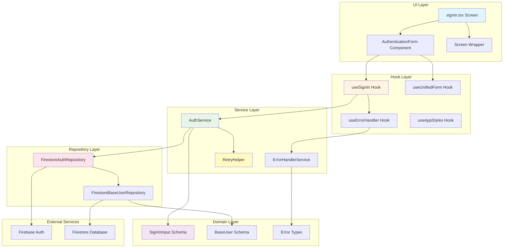
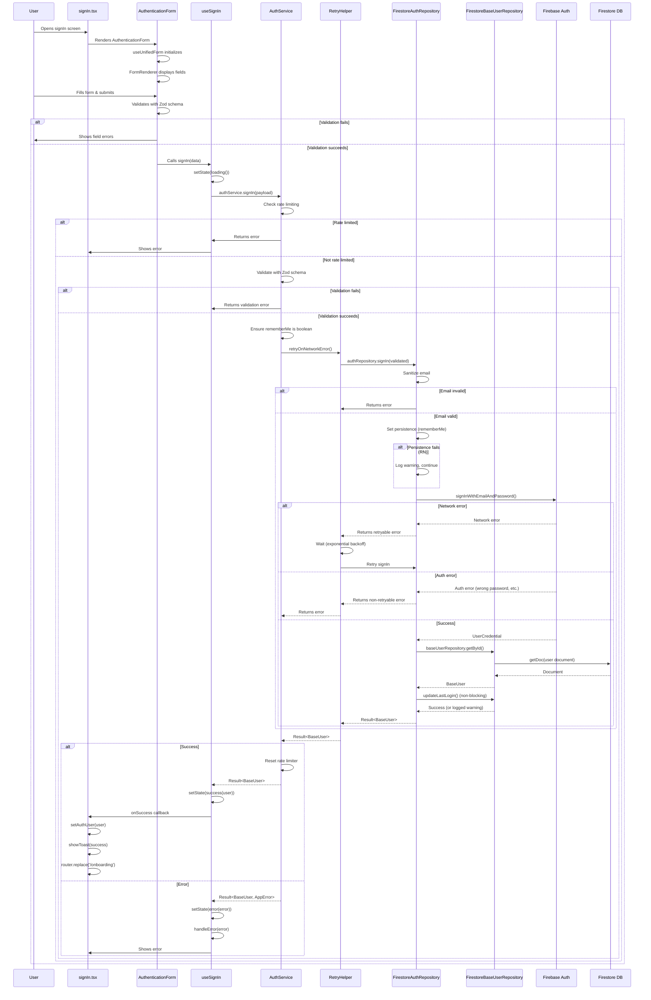
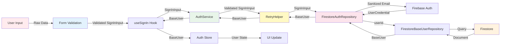
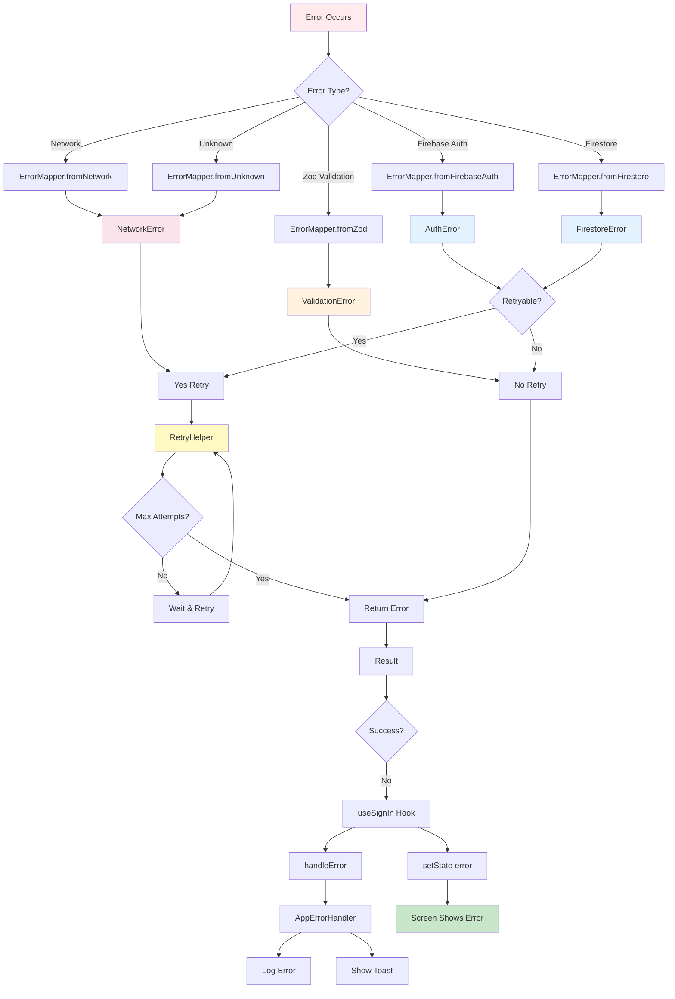
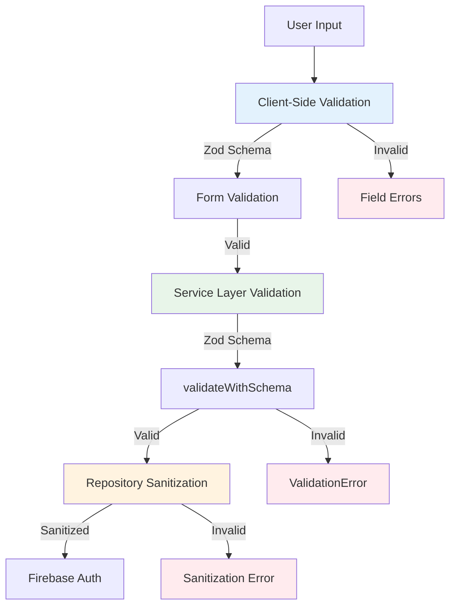
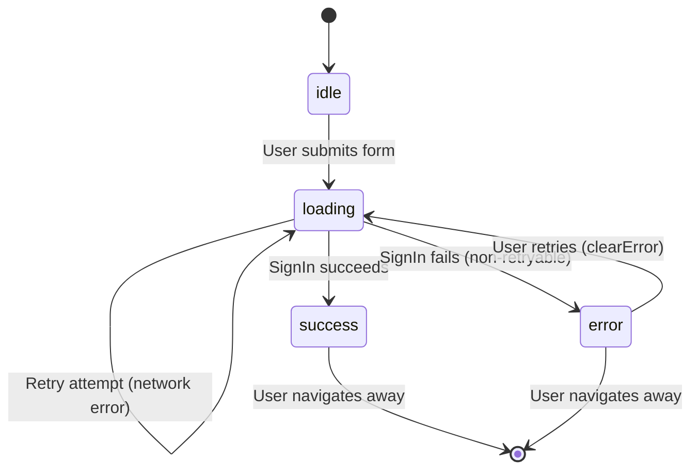
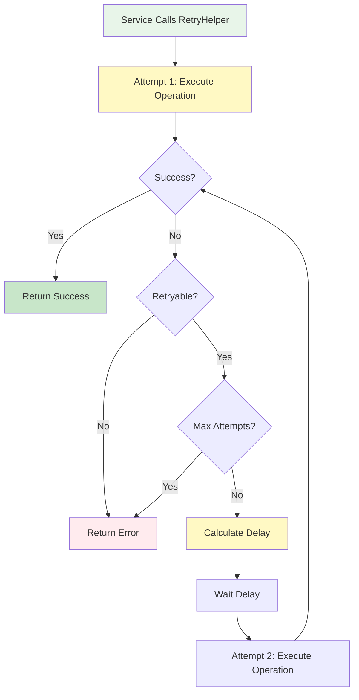
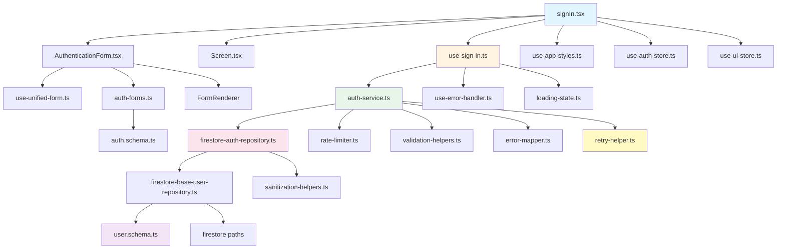

# SignIn Flow - Complete Architecture & Flow Analysis

## Table of Contents
1. [Executive Summary](#executive-summary)
2. [Architecture Overview](#architecture-overview)
3. [Complete Flow Diagram](#complete-flow-diagram)
4. [Layer-by-Layer Breakdown](#layer-by-layer-breakdown)
5. [Data Flow & Transformations](#data-flow--transformations)
6. [Error Handling Flow](#error-handling-flow)
7. [Validation & Sanitization](#validation--sanitization)
8. [Loading States Management](#loading-states-management)
9. [Retry Logic & Network Resilience](#retry-logic--network-resilience)
10. [Persistence & Remember Me](#persistence--remember-me)
11. [File Dependencies Map](#file-dependencies-map)
12. [Issues & Potential Pitfalls](#issues--potential-pitfalls)
13. [Simple Explanation](#simple-explanation)

---

## Executive Summary

The signIn flow in Eye-Doo follows a **Ports & Adapters (Hexagonal) Architecture** with enhanced network resilience:

- **Screen Layer**: React Native UI components
- **Hook Layer**: React hooks managing state and orchestration
- **Service Layer**: Business logic, validation, rate limiting, **retry logic**
- **Repository Layer**: Data access, sanitization, Firebase Auth operations, **persistence management**
- **Domain Layer**: Schemas, types, validation rules

**Key Characteristics:**
- ✅ Result pattern for all async operations (never throws)
- ✅ Comprehensive error handling with context
- ✅ Rate limiting on auth operations (5 attempts per 15 minutes)
- ✅ **Automatic retry for network errors** (3 attempts with exponential backoff)
- ✅ Client-side and server-side validation
- ✅ Sanitization at repository level
- ✅ Loading state management with `LoadingState<T>`
- ✅ **Persistence management** (remember me functionality)
- ✅ Type-safe with TypeScript and Zod

**Key Differences from SignUp:**
- ✅ Has retry logic for network errors
- ✅ Manages auth persistence (remember me)
- ✅ Updates last login timestamp
- ✅ Simpler flow (no email verification, no subscription plan)

---

## Architecture Overview



---

## Complete Flow Diagram



---

## Layer-by-Layer Breakdown

### 1. Screen Layer (`signIn.tsx`)

**File**: `src/app/(auth)/signIn.tsx`

**Responsibilities:**
- Render UI components
- Handle navigation
- Connect hooks to components
- Handle success/error callbacks
- Provide navigation links (sign up, forgot password)

**Key Components:**
- `Screen` wrapper (loading, error, scrollable)
- `AuthenticationForm` (form rendering)
- `StandardAppButton` (navigation links)

**State Management:**
- Global: `useAuthStore` (user state)
- Global: `useUIStore` (toast notifications)

**Navigation:**
- Success: Redirects to `/(onboarding)/index`
- Links: Sign up, Forgot password

**Flow:**
```typescript
User Input → Form → Hook → Service → Repository → Firebase
```

---

### 2. Form Component Layer (`AuthenticationForm.tsx`)

**File**: `src/components/auth/AuthenticationForm.tsx`

**Responsibilities:**
- Render form fields based on config
- Handle form state with `useUnifiedForm`
- Validate on submit
- Display validation errors
- Call `onSubmit` callback with validated data

**Form Configuration:**
- Uses `AUTH_SIGNIN_CONFIG` from `auth-forms.ts`
- Fields: email, password, rememberMe (checkbox)
- Validation: Zod schema (`signInInputSchema`)

**Validation Flow:**
1. Client-side validation via `react-hook-form` + `zodResolver`
2. Real-time validation on field change/blur
3. Submit validation before calling `onSubmit`

**Fields:**
- `email`: Email address (required)
- `password`: Password (required)
- `rememberMe`: Boolean checkbox (optional, defaults to false)

---

### 3. Hook Layer (`use-sign-in.ts`)

**File**: `src/hooks/use-sign-in.ts`

**Responsibilities:**
- Manage loading state (`LoadingState<BaseUser | null>`)
- Call service method
- Handle success/error callbacks
- Provide cleanup on unmount
- Expose `clearError` for error recovery

**State Transitions:**
```
idle → loading → success (user) | error (AppError)
```

**Key Features:**
- `isMountedRef` prevents state updates after unmount
- Error handling via `useErrorHandler`
- Success callback triggers navigation to onboarding

**Return Values:**
- `loading`: Boolean (derived from state)
- `error`: AppError | null (derived from state)
- `state`: LoadingState<BaseUser | null> (full state)
- `signIn`: Function to trigger sign in
- `clearError`: Function to clear error state

---

### 4. Service Layer (`auth-service.ts`)

**File**: `src/services/auth-service.ts`

**Responsibilities:**
- Business logic orchestration
- Rate limiting enforcement
- Input validation (Zod)
- Error context building
- **Retry logic for network errors**
- Delegation to repository

**Rate Limiting:**
- Key: `signin-${email.toLowerCase()}`
- Max attempts: **5 per 15 minutes** (more lenient than signUp)
- Block duration: 15 minutes
- Resets on success

**Validation:**
- Uses `validateWithSchema(signInInputSchema, payload, context)`
- Ensures `rememberMe` is boolean (handles Zod default inference)
- Returns `Result<T, AppError>` pattern

**Retry Logic:**
- Uses `retryOnNetworkError()` wrapper
- Max 2 retries (3 total attempts)
- Only retries network errors (not auth errors)
- Exponential backoff between retries

**Key Code:**
```typescript
// Sign in with retry for network errors
const result = await retryOnNetworkError(
  () => this.authRepository.signIn(validatedPayload),
  2, // Max 2 retries (3 total attempts)
);
```

---

### 5. Repository Layer (`firestore-auth-repository.ts`)

**File**: `src/repositories/firestore/firestore-auth-repository.ts`

**Responsibilities:**
- Sanitize inputs (email)
- **Set auth persistence** (remember me)
- Authenticate with Firebase Auth
- Get base user document
- **Update last login timestamp** (non-blocking)
- Map Firebase errors to AppError

**Sanitization:**
- Email: `sanitizeEmail()` (trim, lowercase, validate format)

**Persistence Management:**
- Web: Sets `browserLocalPersistence` or `browserSessionPersistence`
- React Native: Persistence already configured at initialization
- If `setPersistence` fails (RN), logs warning and continues

**Firebase Operations:**
1. `setPersistence()` - Sets auth persistence (web only)
2. `signInWithEmailAndPassword()` - Authenticates user
3. Delegates to `baseUserRepository.getById()` for user data
4. Calls `baseUserRepository.updateLastLogin()` (non-blocking)

**Error Handling:**
- Maps Firebase Auth errors via `ErrorMapper.fromFirebaseAuth()`
- Returns `Result<BaseUser, AppError>`

**Last Login Update:**
- Non-blocking: Uses `.catch()` to log warning if fails
- Doesn't fail signIn if update fails
- Updates `lastLoginAt` timestamp in Firestore

---

### 6. Base User Repository (`firestore-base-user-repository.ts`)

**File**: `src/repositories/firestore/firestore-base-user-repository.ts`

**Responsibilities:**
- Get base user document from Firestore
- Validate with Zod schema
- Parse Firestore data to domain models
- Update last login timestamp

**Document Structure:**
```
/users/{userId}
{
  id: string,
  email: string,
  displayName: string | null,
  phone: string | null,
  role: UserRole,
  isEmailVerified: boolean,
  isActive: boolean,
  isBanned: boolean,
  hasCustomizations: boolean,
  lastLoginAt: Timestamp | null,  // Updated on signIn
  deletedAt: Timestamp | null,
  createdAt: Timestamp,
  updatedAt: Timestamp
}
```

**Operations:**
1. `getById()` - Fetches user document
2. `updateLastLogin()` - Updates `lastLoginAt` timestamp

**Parsing:**
- Converts Firestore Timestamps to Date objects
- Validates with Zod schema
- Returns type-safe `BaseUser`

---

## Data Flow & Transformations



### Data Transformations

1. **User Input → SignInInput**
   - Raw form data
   - Client-side Zod validation
   - Type: `SignInInput` { email, password, rememberMe }

2. **SignInInput → Validated SignInInput**
   - Service layer validation
   - Ensures `rememberMe` is boolean
   - Same type, guaranteed valid

3. **Validated SignInInput → Firebase Auth**
   - Email sanitized (lowercase, trimmed)
   - Password passed as-is (no sanitization)
   - Persistence set based on `rememberMe`
   - Creates `UserCredential`

4. **UserCredential → BaseUser**
   - Extracts `uid` to query Firestore
   - Fetches user document
   - Parses Firestore data to `BaseUser`
   - Updates `lastLoginAt` timestamp

5. **BaseUser → Auth Store**
   - User data stored in Zustand store
   - Triggers UI updates
   - Navigation to onboarding

---

## Error Handling Flow



### Error Types

1. **ValidationError**
   - Source: Zod schema validation
   - Contains: `fieldErrors` object
   - Retryable: `false`
   - User message: Field-specific errors

2. **AuthError**
   - Source: Firebase Auth
   - Common codes:
     - `auth/user-not-found` → `AUTH_USER_NOT_FOUND`
     - `auth/wrong-password` → `AUTH_INVALID_CREDENTIALS`
     - `auth/invalid-credential` → `AUTH_INVALID_CREDENTIALS`
     - `auth/network-request-failed` → `NETWORK_CONNECTION_ERROR` (retryable)
   - Retryable: Depends on error code (network errors are retryable)

3. **FirestoreError**
   - Source: Firestore operations
   - Common codes:
     - `permission-denied` → `DB_PERMISSION_DENIED`
     - `not-found` → `DB_NOT_FOUND`
   - Retryable: Usually `true` for network errors

4. **NetworkError**
   - Source: Network issues
   - Retryable: `true`
   - User message: "Check your connection"
   - **Automatically retried** with exponential backoff

### Retry Logic

**Retryable Errors:**
- `NETWORK_CONNECTION_ERROR`
- `NETWORK_TIMEOUT`
- `DB_NETWORK_ERROR`
- `AUTH_NETWORK_ERROR`

**Retry Strategy:**
- Max attempts: 3 (initial + 2 retries)
- Exponential backoff: `delay * 2^(attempt-1)`
- Max delay: 10 seconds
- Only retries if `error.retryable === true` AND error code matches

**Example:**
```
Attempt 1: Immediate
Attempt 2: Wait 1 second
Attempt 3: Wait 2 seconds
```

---

## Validation & Sanitization

### Validation Layers



### Validation Rules

**SignInInput Schema** (`auth.schema.ts`):
```typescript
{
  email: emailSchema,                    // Valid email format
  password: passwordSchema,              // Min 8 chars, alphanumeric
  rememberMe: boolean (default: false)  // Optional checkbox
}
```

### Sanitization Rules

**Repository Level** (`firestore-auth-repository.ts`):

1. **Email**:
   - `sanitizeEmail()`: trim, lowercase, basic format check
   - Returns `null` if invalid

2. **Password**:
   - Not sanitized (passed directly to Firebase)
   - Firebase handles password validation

3. **RememberMe**:
   - Ensured to be boolean in service layer
   - Used to set auth persistence

---

## Loading States Management

### LoadingState Type

```typescript
type LoadingState<T> =
  | { status: 'idle' }
  | { status: 'loading'; data?: T; isOptimistic?: boolean }
  | { status: 'success'; data: T }
  | { status: 'error'; error: AppError; data?: T }
```

### State Transitions in signIn



### Loading State Flow

1. **Initial**: `idle()`
2. **On Submit**: `loading()` (no data)
3. **On Retry**: `loading()` (still loading, retry in progress)
4. **On Success**: `success(user)` (BaseUser data)
5. **On Error**: `error(appError)` (error, no data)

### UI Feedback

- **Loading**: `Screen` component shows `LoadingIndicator`
- **Error**: `Screen` component shows `ErrorDisplay` with retry button
- **Success**: Navigation to onboarding screen

---

## Retry Logic & Network Resilience

### Retry Helper Flow



### Retry Configuration

**For signIn:**
- Max attempts: 3 (initial + 2 retries)
- Initial delay: 1000ms (1 second)
- Exponential backoff: Yes
- Max delay: 10000ms (10 seconds)

**Delay Calculation:**
```
Attempt 1: 0ms (immediate)
Attempt 2: 1000ms * 2^0 = 1000ms (1 second)
Attempt 3: 1000ms * 2^1 = 2000ms (2 seconds)
```

**Retryable Error Codes:**
- `NETWORK_CONNECTION_ERROR`
- `NETWORK_TIMEOUT`
- `DB_NETWORK_ERROR`
- `AUTH_NETWORK_ERROR`

**Non-Retryable Errors:**
- `AUTH_INVALID_CREDENTIALS` (wrong password)
- `AUTH_USER_NOT_FOUND` (user doesn't exist)
- `VALIDATION_FAILED` (invalid input)
- `AUTH_TOO_MANY_REQUESTS` (rate limited)

---

## Persistence & Remember Me

### Persistence Types

**Web:**
- `browserLocalPersistence`: Survives browser close (rememberMe = true)
- `browserSessionPersistence`: Cleared on browser close (rememberMe = false)

**React Native:**
- Persistence configured at Firebase initialization
- `setPersistence()` may not be available
- If fails, logs warning and continues (persistence already set)

### Persistence Flow

```mermaid
graph TD
    A[User Checks Remember Me] --> B[Form: rememberMe = true]
    B --> C[Service: Ensure boolean]
    C --> D[Repository: Set Persistence]
    D --> E{Platform?}
    E -->|Web| F[setPersistence browserLocalPersistence]
    E -->|React Native| G[setPersistence may fail]
    G --> H[Log Warning]
    H --> I[Continue (already configured)]
    F --> J[Sign In]
    I --> J
    
    style A fill:#e1f5ff
    style F fill:#c8e6c9
    style G fill:#fff9c4
    style J fill:#e8f5e9
```

### Implementation Details

**Repository Code:**
```typescript
// 2. Set persistence based on rememberMe (web only)
try {
  const persistence = payload.rememberMe
    ? browserLocalPersistence // Survives browser close
    : browserSessionPersistence; // Cleared on browser close

  await setPersistence(auth, persistence);
} catch (persistenceError) {
  // setPersistence may not be available on all platforms (e.g., React Native)
  // Log warning but continue with sign-in
  LoggingService.warn('Failed to set auth persistence...');
  // Continue with sign-in - persistence is already configured for React Native
}
```

**Key Points:**
- Web: Persistence is set dynamically based on checkbox
- React Native: Persistence is pre-configured, `setPersistence` may fail
- Failure doesn't block signIn (non-critical)

---

## File Dependencies Map



### Key Files

**Screens:**
- `src/app/(auth)/signIn.tsx` - Main screen

**Components:**
- `src/components/auth/AuthenticationForm.tsx` - Form component
- `src/components/common/screen.tsx` - Screen wrapper

**Hooks:**
- `src/hooks/use-sign-in.ts` - SignIn hook
- `src/hooks/use-unified-form.ts` - Form hook
- `src/hooks/use-error-handler.ts` - Error handling
- `src/hooks/use-app-styles.ts` - Styling

**Services:**
- `src/services/auth-service.ts` - Auth business logic
- `src/services/error-handler-service.ts` - Error handling

**Repositories:**
- `src/repositories/firestore/firestore-auth-repository.ts` - Auth repository
- `src/repositories/firestore/firestore-base-user-repository.ts` - User repository
- `src/repositories/i-auth-repository.ts` - Auth interface
- `src/repositories/i-base-user-repository.ts` - User interface

**Domain:**
- `src/domain/user/auth.schema.ts` - Auth schemas
- `src/domain/user/user.schema.ts` - User schemas

**Utils:**
- `src/utils/loading-state.ts` - Loading state utilities
- `src/utils/error-mapper.ts` - Error mapping
- `src/utils/validation-helpers.ts` - Validation utilities
- `src/utils/sanitization-helpers.ts` - Sanitization utilities
- `src/utils/rate-limiter.ts` - Rate limiting
- `src/utils/retry-helper.ts` - **Retry logic**
- `src/utils/error-context-builder.ts` - Error context

**Stores:**
- `src/stores/use-auth-store.ts` - Auth state
- `src/stores/use-ui-store.ts` - UI state (toasts)

**Constants:**
- `src/constants/enums.ts` - Enums
- `src/constants/styles/` - Style constants

---

## Issues & Potential Pitfalls

### 1. ⚠️ Persistence Failure Handling

**Issue**: `setPersistence()` may fail on React Native, but error is swallowed.

**Location**: `firestore-auth-repository.ts` lines 202-226

**Problem**:
- Error is caught and logged, but operation continues
- If persistence is critical, user might not be remembered
- No user feedback if persistence fails

**Impact**: Low - Persistence is pre-configured for RN, but web users might not be remembered if it fails.

**Recommendation**: 
- Add user feedback if persistence fails on web
- Or: Make persistence failure block signIn (if critical)

---

### 2. ⚠️ Last Login Update Failure

**Issue**: Last login update is non-blocking and failures are silently logged.

**Location**: `firestore-auth-repository.ts` lines 239-247

**Problem**:
- If update fails, user is still signed in (correct behavior)
- But analytics/tracking might be incomplete
- No retry mechanism for failed updates

**Impact**: Low - Doesn't affect signIn, but tracking data might be incomplete.

**Recommendation**: 
- Add retry logic for last login update
- Or: Make it fire-and-forget with better logging

---

### 3. ⚠️ Rate Limiter Memory

**Issue**: Rate limiter uses in-memory storage.

**Location**: `rate-limiter.ts`

**Problem**:
- Lost on server restart
- Not shared across instances (if scaling)
- Memory could grow if not cleaned up

**Impact**: Low - Works for single instance, but not production-ready for scaling.

**Recommendation**: Use Redis or Firestore for distributed rate limiting.

---

### 4. ⚠️ Retry Logic Error Classification

**Issue**: Retry logic only checks error codes, not all retryable errors.

**Location**: `retry-helper.ts` lines 173-181

**Problem**:
- Only retries specific error codes
- Other retryable errors might not be retried
- Hardcoded list of retryable codes

**Impact**: Medium - Some network errors might not be retried.

**Recommendation**: 
- Use `error.retryable` flag as primary check
- Error codes as secondary check
- Or: Make retryable codes configurable

---

### 5. ⚠️ RememberMe Default Handling

**Issue**: `rememberMe` default is handled in multiple places.

**Location**: 
- Schema: `auth.schema.ts` (default: false)
- Service: `auth-service.ts` line 162 (ensures boolean)

**Problem**:
- Zod default might not be inferred correctly
- Service layer has defensive check
- Potential inconsistency

**Impact**: Low - Works correctly, but redundant.

**Recommendation**: Standardize on one place for default handling.

---

### 6. ⚠️ Retry Delay Calculation

**Issue**: Exponential backoff might be too aggressive for some networks.

**Location**: `retry-helper.ts` lines 145-154

**Problem**:
- Delay: 1s, 2s, 4s, 8s, 10s (capped)
- Might be too long for mobile networks
- No jitter (all retries happen at same time)

**Impact**: Low - Usually works, but might cause delays.

**Recommendation**: 
- Add jitter to prevent thundering herd
- Consider shorter delays for mobile
- Make delays configurable

---

### 7. ⚠️ User Document Not Found

**Issue**: If user document doesn't exist after auth, signIn fails.

**Location**: `firestore-auth-repository.ts` lines 236-251

**Problem**:
- Firebase Auth succeeds, but Firestore document missing
- User is authenticated but can't sign in
- Could happen if document creation failed during signUp

**Impact**: Medium - User is stuck (authenticated but no profile).

**Recommendation**: 
- Create document if missing (with defaults)
- Or: Show specific error message
- Or: Trigger document creation flow

---

### 8. ⚠️ Rate Limiter Reset Timing

**Issue**: Rate limiter is reset on success, but not on certain errors.

**Location**: `auth-service.ts` line 173

**Problem**:
- Reset only happens on success
- If user is rate limited, then succeeds, limiter is reset
- But if user is rate limited and gives up, limiter persists

**Impact**: Low - Correct behavior, but might confuse users.

**Recommendation**: Document behavior or add manual reset option.

---

### 9. ⚠️ Error Context in Retry

**Issue**: Error context might not reflect retry attempts.

**Location**: `retry-helper.ts` - errors from repository

**Problem**:
- Error context from repository doesn't include retry info
- Hard to debug which attempt failed
- Logs show retry info, but error context doesn't

**Impact**: Low - Logs have info, but error context could be richer.

**Recommendation**: Add retry attempt info to error context.

---

### 10. ⚠️ Navigation on Success

**Issue**: Navigation happens in screen callback, not hook.

**Location**: `signIn.tsx` line 37

**Problem**:
- Navigation logic in screen, not reusable
- If hook is used elsewhere, navigation might not happen
- Tight coupling between hook and screen

**Impact**: Low - Works for current use case, but not flexible.

**Recommendation**: 
- Make navigation optional in hook
- Or: Use navigation service
- Or: Return navigation path from hook

---

## Simple Explanation

### What Happens When a User Signs In?

1. **User fills out the form**
   - Enters email and password
   - Optionally checks "Remember me" checkbox

2. **Form validates the input**
   - Checks email format
   - Checks password is provided
   - Validates all required fields

3. **If validation passes, the app checks rate limiting**
   - Prevents too many signIn attempts (5 per 15 minutes per email)
   - If rate limited, shows error with time remaining

4. **Service validates again (defense in depth)**
   - Same validation rules as form
   - Ensures `rememberMe` is a boolean

5. **Repository sanitizes the email**
   - Trims whitespace
   - Converts to lowercase
   - Validates format

6. **Sets auth persistence (if "Remember me" checked)**
   - Web: Sets persistence to survive browser close
   - React Native: Already configured (may log warning if setPersistence fails)

7. **Firebase Auth authenticates the user**
   - Checks email and password
   - Creates authentication session
   - Returns user credentials

8. **If network error occurs, automatically retries**
   - Retries up to 3 times (initial + 2 retries)
   - Waits between retries (1 second, then 2 seconds)
   - Only retries network errors (not wrong password)

9. **Fetches user data from Firestore**
   - Gets user document using user ID
   - Validates and parses data

10. **Updates last login timestamp**
    - Updates when user last signed in
    - Doesn't fail signIn if update fails (non-blocking)

11. **Returns success**
    - User data is stored in app state
    - User is redirected to onboarding screen
    - Success message is shown

12. **If anything fails**
    - Error is caught and mapped to user-friendly message
    - Error is logged for debugging
    - User sees error with option to retry
    - Rate limiter is NOT reset (user must wait)

### Key Safety Features

- **Rate Limiting**: Prevents abuse (5 attempts per 15 minutes)
- **Double Validation**: Form + Service layer
- **Sanitization**: Cleans input before using
- **Error Handling**: All errors caught and handled gracefully
- **Retry Logic**: Automatically retries network errors
- **Persistence Management**: "Remember me" functionality
- **Type Safety**: TypeScript + Zod ensure data correctness
- **Loading States**: User sees feedback during operations

### Architecture Benefits

- **Separation of Concerns**: Each layer has one job
- **Testability**: Each layer can be tested independently
- **Maintainability**: Changes in one layer don't affect others
- **Type Safety**: TypeScript catches errors at compile time
- **Error Recovery**: Errors are handled consistently
- **Network Resilience**: Automatic retry for network errors
- **User Experience**: "Remember me" keeps users signed in

### Differences from SignUp

1. **Retry Logic**: SignIn has automatic retry for network errors
2. **Persistence**: SignIn manages auth persistence (remember me)
3. **Last Login**: SignIn updates last login timestamp
4. **Simpler Flow**: No email verification, no subscription plan
5. **More Lenient Rate Limiting**: 5 attempts vs 3 for signUp

---

## Summary

The signIn flow is well-architected with clear separation of concerns, comprehensive error handling, type safety, and **enhanced network resilience**. The main areas for improvement are:

1. **Persistence failure feedback** (currently silent on failure)
2. **Last login update retry** (currently fire-and-forget)
3. **Rate limiter persistence** (for production scaling)
4. **Retry error context** (could include attempt number)
5. **User document creation** (if missing after auth)

Overall, the flow is robust and follows best practices for React Native + Firebase applications, with excellent network error handling via automatic retry.

