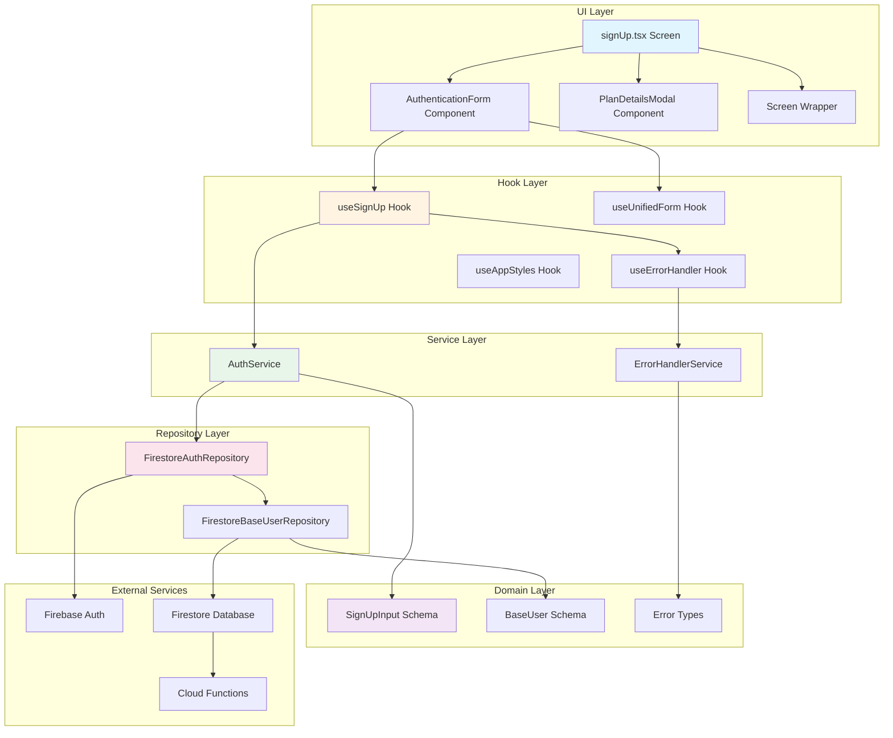
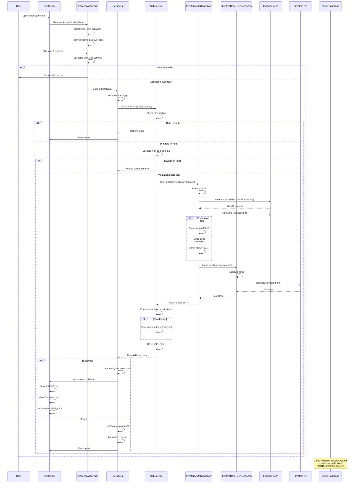
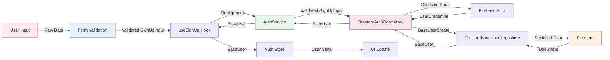
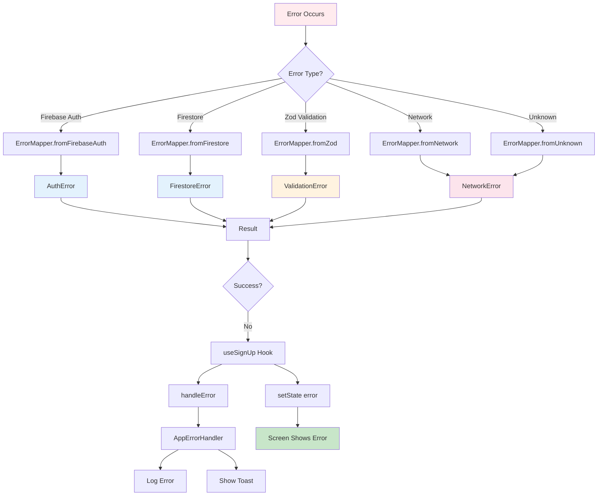
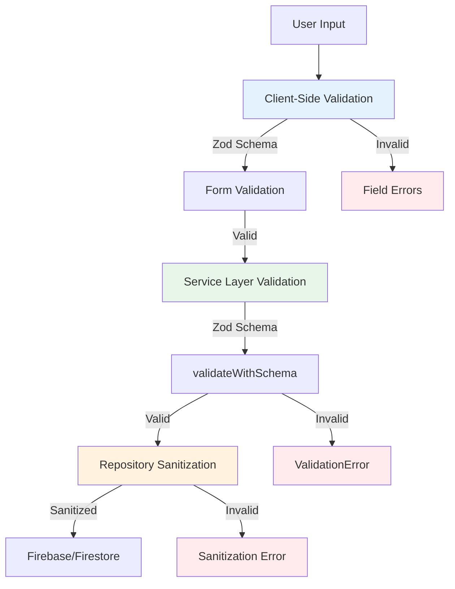
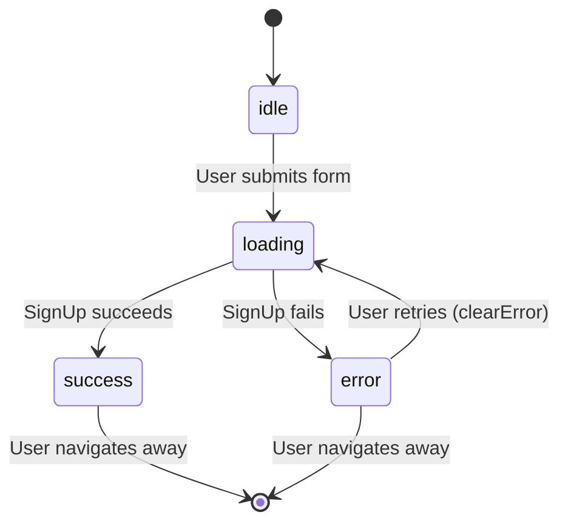
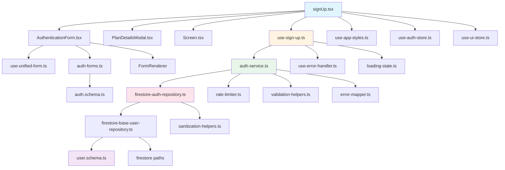

# SignUp Flow - Complete Architecture & Flow Analysis

## Table of Contents

1. [Executive Summary](#executive-summary)
2. [Architecture Overview](#architecture-overview)
3. [Complete Flow Diagram](#complete-flow-diagram)
4. [Layer-by-Layer Breakdown](#layer-by-layer-breakdown)
5. [Data Flow & Transformations](#data-flow--transformations)
6. [Error Handling Flow](#error-handling-flow)
7. [Validation & Sanitization](#validation--sanitization)
8. [Loading States Management](#loading-states-management)
9. [File Dependencies Map](#file-dependencies-map)
10. [Issues & Potential Pitfalls](#issues--potential-pitfalls)
11. [Simple Explanation](#simple-explanation)

---

## Executive Summary

The signUp flow in Eye-Doo follows a **Ports & Adapters (Hexagonal) Architecture** with clear separation of concerns:

- **Screen Layer**: React Native UI components
- **Hook Layer**: React hooks managing state and orchestration
- **Service Layer**: Business logic, validation, rate limiting
- **Repository Layer**: Data access, sanitization, Firestore operations
- **Domain Layer**: Schemas, types, validation rules

**Key Characteristics:**

- ✅ Result pattern for all async operations (never throws)
- ✅ Comprehensive error handling with context
- ✅ Rate limiting on auth operations
- ✅ Client-side and server-side validation
- ✅ Sanitization at repository level
- ✅ Loading state management with `LoadingState<T>`
- ✅ Type-safe with TypeScript and Zod

---

## Architecture Overview



---

## Complete Flow Diagram



---

## Layer-by-Layer Breakdown

### 1. Screen Layer (`signUp.tsx`)

**File**: `src/app/(auth)/signUp.tsx`

**Responsibilities:**

- Render UI components
- Handle navigation
- Manage local UI state (modal visibility)
- Connect hooks to components
- Handle success/error callbacks

**Key Components:**

- `Screen` wrapper (loading, error, scrollable)
- `AuthenticationForm` (form rendering)
- `PlanDetailsModal` (subscription plan selection)
- `StandardAppButton` (navigation links)

**State Management:**

- Local: `showPlanModal` (boolean)
- Form ref: `formRef` (for programmatic form control)
- Global: `useAuthStore` (user state)
- Global: `useUIStore` (toast notifications)

**Flow:**

```typescript
User Input → Form → Hook → Service → Repository → Firebase
```

---

### 2. Form Component Layer (`AuthenticationForm.tsx`)

**File**: `src/components/auth/AuthenticationForm.tsx`

**Responsibilities:**

- Render form fields based on config
- Handle form state with `useUnifiedForm`
- Validate on submit
- Display validation errors
- Call `onSubmit` callback with validated data

**Form Configuration:**

- Uses `AUTH_SIGNUP_CONFIG` from `auth-forms.ts`
- Fields: displayName, email, password, confirmPassword, subscriptionPlan, acceptTerms, acceptPrivacy, acceptMarketing
- Validation: Zod schema (`signUpInputSchema`)

**Validation Flow:**

1. Client-side validation via `react-hook-form` + `zodResolver`
2. Real-time validation on field change/blur
3. Submit validation before calling `onSubmit`

---

### 3. Hook Layer (`use-sign-up.ts`)

**File**: `src/hooks/use-sign-up.ts`

**Responsibilities:**

- Manage loading state (`LoadingState<BaseUser | null>`)
- Call service method
- Handle success/error callbacks
- Provide cleanup on unmount
- Expose `clearError` for error recovery

**State Transitions:**

```
idle → loading → success (user) | error (AppError)
```

**Key Features:**

- `isMountedRef` prevents state updates after unmount
- Error handling via `useErrorHandler`
- Success callback triggers navigation

---

### 4. Service Layer (`auth-service.ts`)

**File**: `src/services/auth-service.ts`

**Responsibilities:**

- Business logic orchestration
- Rate limiting enforcement
- Input validation (Zod)
- Error context building
- Delegation to repository

**Rate Limiting:**

- Key: `signup-${email.toLowerCase()}`
- Max attempts: 3 per hour
- Block duration: 1 hour
- Resets on success

**Validation:**

- Uses `validateWithSchema(signUpInputSchema, payload, context)`
- Returns `Result<T, AppError>` pattern

**Verification Email Handling:**

- Checks repository status after signup
- Shows warning toast if email failed (non-blocking)
- Cleans up status after notification

---

### 5. Repository Layer (`firestore-auth-repository.ts`)

**File**: `src/repositories/firestore/firestore-auth-repository.ts`

**Responsibilities:**

- Sanitize inputs (email)
- Create Firebase Auth user
- Send verification email
- Create base user document
- Track verification email status
- Map Firebase errors to AppError

**Sanitization:**

- Email: `sanitizeEmail()` (trim, lowercase, validate format)

**Firebase Operations:**

1. `createUserWithEmailAndPassword()` - Creates auth account
2. `sendEmailVerification()` - Sends verification email (non-blocking failure)
3. Delegates to `baseUserRepository.create()` for Firestore document

**Error Handling:**

- Maps Firebase Auth errors via `ErrorMapper.fromFirebaseAuth()`
- Returns `Result<BaseUser, AppError>`

**Verification Email Status:**

- Stores status in `Map<string, boolean>`
- Service checks status after signup
- Status cleaned up after notification

---

### 6. Base User Repository (`firestore-base-user-repository.ts`)

**File**: `src/repositories/firestore/firestore-base-user-repository.ts`

**Responsibilities:**

- Create base user document in Firestore
- Sanitize user data
- Validate with Zod schema
- Handle Firestore operations
- Parse Firestore data to domain models

**Document Structure:**

```
/users/{userId}
{
  id: string,
  email: string,
  displayName: string | null,
  phone: string | null,
  role: UserRole,
  isEmailVerified: boolean,
  isActive: boolean,
  isBanned: boolean,
  hasCustomizations: boolean,
  lastLoginAt: Timestamp | null,
  deletedAt: Timestamp | null,
  createdAt: Timestamp,
  updatedAt: Timestamp
}
```

**Sanitization:**

- Email: `sanitizeEmail()`
- DisplayName: `sanitizeString()`
- Phone: `sanitizePhone()`

**Note:** Cloud Functions also create this document server-side as a backup.

---

## Data Flow & Transformations



### Data Transformations

1. **User Input → SignUpInput**
   - Raw form data
   - Client-side Zod validation
   - Type: `SignUpInput`

2. **SignUpInput → Validated SignUpInput**
   - Service layer validation
   - Same type, guaranteed valid

3. **Validated SignUpInput → Firebase Auth**
   - Email sanitized (lowercase, trimmed)
   - Password passed as-is (no sanitization)
   - Creates `UserCredential`

4. **UserCredential → BaseUserCreate**
   - Extracts `uid` as `id`
   - Uses sanitized email
   - Uses `displayName` from input
   - Sets `phone: null`

5. **BaseUserCreate → Firestore Document**
   - Sanitized fields
   - Server timestamps added
   - Default values applied

6. **Firestore Document → BaseUser**
   - Timestamps converted to Date
   - Zod validation
   - Type-safe parsing

---

## Error Handling Flow



### Error Types

1. **ValidationError**
   - Source: Zod schema validation
   - Contains: `fieldErrors` object
   - Retryable: `false`
   - User message: Field-specific errors

2. **AuthError**
   - Source: Firebase Auth
   - Common codes:
     - `auth/email-already-in-use` → `AUTH_EMAIL_IN_USE`
     - `auth/weak-password` → `VALIDATION_FAILED`
     - `auth/network-request-failed` → `NETWORK_CONNECTION_ERROR`
   - Retryable: Depends on error code

3. **FirestoreError**
   - Source: Firestore operations
   - Common codes:
     - `permission-denied` → `DB_PERMISSION_DENIED`
     - `not-found` → `DB_NOT_FOUND`
   - Retryable: Usually `true` for network errors

4. **NetworkError**
   - Source: Network issues
   - Retryable: `true`
   - User message: "Check your connection"

### Error Context

Every error includes:

- **Context string**: `"ServiceName.methodName"` or `"RepositoryName.methodName"`
- **User ID**: If available
- **Project ID**: If available
- **Metadata**: Additional context

Example: `"AuthService.signUp"` or `"AuthRepository.signUp"`

---

## Validation & Sanitization

### Validation Layers



### Validation Rules

**SignUpInput Schema** (`auth.schema.ts`):

```typescript
{
  email: emailSchema,                    // Valid email format
  password: passwordSchema,              // Min 8 chars, alphanumeric
  displayName: displayNameSchema,        // Min 1, max 100 chars
  confirmPassword: passwordSchema,       // Must match password
  subscriptionPlan: SubscriptionPlan,    // Enum: FREE | PRO | STUDIO
  acceptTerms: boolean (must be true),   // Required
  acceptPrivacy: boolean (must be true), // Required
  acceptMarketing: boolean (optional)     // Optional
}
```

**Refinement:**

- `password === confirmPassword` (custom refinement)

### Sanitization Rules

**Repository Level** (`firestore-auth-repository.ts`):

1. **Email**:
   - `sanitizeEmail()`: trim, lowercase, basic format check
   - Returns `null` if invalid

2. **Display Name**:
   - `sanitizeString()`: trim whitespace
   - Returns `undefined` if empty

3. **Phone**:
   - Not used in signUp (set to `null`)

**Base User Repository** (`firestore-base-user-repository.ts`):

1. **Email**: `sanitizeEmail()`
2. **DisplayName**: `sanitizeString()` or empty string
3. **Phone**: `sanitizePhone()` or `null`

---

## Loading States Management

### LoadingState Type

```typescript
type LoadingState<T> =
  | { status: 'idle' }
  | { status: 'loading'; data?: T; isOptimistic?: boolean }
  | { status: 'success'; data: T }
  | { status: 'error'; error: AppError; data?: T };
```

### State Transitions in signUp



### Loading State Flow

1. **Initial**: `idle()`
2. **On Submit**: `loading()` (no data)
3. **On Success**: `success(user)` (BaseUser data)
4. **On Error**: `error(appError)` (error, no data)

### UI Feedback

- **Loading**: `Screen` component shows `LoadingIndicator`
- **Error**: `Screen` component shows `ErrorDisplay` with retry button
- **Success**: Navigation to signIn screen

---

## File Dependencies Map



### Key Files

**Screens:**

- `src/app/(auth)/signUp.tsx` - Main screen

**Components:**

- `src/components/auth/AuthenticationForm.tsx` - Form component
- `src/components/auth/PlanDetailsModal.tsx` - Plan selection modal
- `src/components/common/screen.tsx` - Screen wrapper

**Hooks:**

- `src/hooks/use-sign-up.ts` - SignUp hook
- `src/hooks/use-unified-form.ts` - Form hook
- `src/hooks/use-error-handler.ts` - Error handling
- `src/hooks/use-app-styles.ts` - Styling

**Services:**

- `src/services/auth-service.ts` - Auth business logic
- `src/services/error-handler-service.ts` - Error handling

**Repositories:**

- `src/repositories/firestore/firestore-auth-repository.ts` - Auth repository
- `src/repositories/firestore/firestore-base-user-repository.ts` - User repository
- `src/repositories/i-auth-repository.ts` - Auth interface
- `src/repositories/i-base-user-repository.ts` - User interface

**Domain:**

- `src/domain/user/auth.schema.ts` - Auth schemas
- `src/domain/user/user.schema.ts` - User schemas

**Utils:**

- `src/utils/loading-state.ts` - Loading state utilities
- `src/utils/error-mapper.ts` - Error mapping
- `src/utils/validation-helpers.ts` - Validation utilities
- `src/utils/sanitization-helpers.ts` - Sanitization utilities
- `src/utils/rate-limiter.ts` - Rate limiting
- `src/utils/error-context-builder.ts` - Error context

**Stores:**

- `src/stores/use-auth-store.ts` - Auth state
- `src/stores/use-ui-store.ts` - UI state (toasts)

**Constants:**

- `src/constants/enums.ts` - Enums (SubscriptionPlan, etc.)
- `src/constants/subscriptions.ts` - Subscription info
- `src/constants/styles/` - Style constants

---

## Issues & Potential Pitfalls

### 1. ⚠️ Verification Email Failure Handling

**Issue**: Verification email failure is non-blocking but status tracking uses in-memory Map.

**Location**: `firestore-auth-repository.ts` lines 119-138

**Problem**:

- Status stored in `Map<string, boolean>` (in-memory)
- Lost on server restart or multiple instances
- Status checked after signup, but cleanup happens later

**Impact**: Low - Email failure doesn't block signup, but user might not be notified if status is lost.

**Recommendation**: Consider storing status in Firestore for persistence.

---

### 2. ⚠️ Cloud Function Duplication

**Issue**: Both client and Cloud Function create user documents.

**Location**:

- Client: `firestore-base-user-repository.ts` line 159
- Server: Cloud Function `onUserCreated`

**Problem**:

- Potential race condition
- Duplicate creation attempts
- Repository method marked `@deprecated` but still used

**Impact**: Medium - Could cause conflicts or unnecessary writes.

**Recommendation**:

- Remove client-side creation (rely on Cloud Function)
- Or: Make Cloud Function idempotent
- Or: Use Firestore transactions

---

### 3. ⚠️ Rate Limiter Memory

**Issue**: Rate limiter uses in-memory storage.

**Location**: `rate-limiter.ts`

**Problem**:

- Lost on server restart
- Not shared across instances (if scaling)
- Memory could grow if not cleaned up

**Impact**: Low - Works for single instance, but not production-ready for scaling.

**Recommendation**: Use Redis or Firestore for distributed rate limiting.

---

### 4. ⚠️ Error Context String vs Object

**Issue**: Inconsistent error context usage.

**Location**:

- `auth-service.ts` line 66-67: Creates context object, then converts to string
- `error-mapper.ts`: Expects string context

**Problem**:

- Context object created but immediately converted to string
- Loses structured context benefits

**Impact**: Low - Works but not optimal.

**Recommendation**: Use context object throughout or standardize on string.

---

### 5. ⚠️ Form Ref Usage

**Issue**: Form ref used to programmatically set subscription plan.

**Location**: `signUp.tsx` lines 33, 54-58, 62-66

**Problem**:

- Form ref might be null when modal closes
- No null check before `setValue`
- Race condition possible

**Impact**: Low - Usually works, but could fail in edge cases.

**Recommendation**: Add null check or use form state directly.

---

### 6. ⚠️ Subscription Plan Not Saved

**Issue**: `subscriptionPlan` is collected in form but not used in signup.

**Location**:

- Form: `auth-forms.ts` line 130-140
- Service: `auth-service.ts` - doesn't use `subscriptionPlan`
- Repository: `firestore-auth-repository.ts` - doesn't use `subscriptionPlan`

**Problem**:

- User selects plan during signup
- Plan is validated but not saved
- Plan must be set later (probably in subscription flow)

**Impact**: Medium - User expectation mismatch.

**Recommendation**:

- Save plan during signup (create subscription subcollection)
- Or: Remove plan selection from signup form

---

### 7. ⚠️ Password Sanitization

**Issue**: Password is not sanitized (by design).

**Location**: `firestore-auth-repository.ts` line 115

**Problem**:

- Password passed directly to Firebase
- No trimming or normalization
- Could cause issues if user has leading/trailing spaces

**Impact**: Low - Firebase handles this, but inconsistent with other fields.

**Recommendation**: Document why password isn't sanitized (security).

---

### 8. ⚠️ Missing Error Recovery

**Issue**: No automatic retry for network errors in signUp.

**Location**: `auth-service.ts` - No retry logic

**Problem**:

- Network errors are retryable but not automatically retried
- User must manually retry

**Impact**: Low - User can retry, but poor UX.

**Recommendation**: Add automatic retry for network errors (with exponential backoff).

---

### 9. ⚠️ Toast Timing

**Issue**: Verification email warning toast uses `setTimeout`.

**Location**: `auth-service.ts` lines 106-112

**Problem**:

- Hardcoded 2-second delay
- Could conflict with success toast
- Not cancelable if component unmounts

**Impact**: Low - Usually works, but timing-dependent.

**Recommendation**: Use proper toast queue or state management.

---

### 10. ⚠️ Type Safety in Form

**Issue**: Form uses `FieldValues` type casting.

**Location**: `AuthenticationForm.tsx` line 94

**Problem**:

- Type cast: `data as AuthFormData<TMode>`
- Assumes validation passed, but not type-safe

**Impact**: Low - Validation ensures correctness, but not type-safe.

**Recommendation**: Use proper type guards or generics.

---

## Simple Explanation

### What Happens When a User Signs Up?

1. **User fills out the form**
   - Enters name, email, password, confirms password
   - Selects subscription plan (Free, Pro, or Studio)
   - Checks terms & privacy boxes

2. **Form validates the input**
   - Checks email format
   - Checks password strength (8+ characters)
   - Checks passwords match
   - Checks required checkboxes

3. **If validation passes, the app checks rate limiting**
   - Prevents too many signup attempts (3 per hour per email)
   - If rate limited, shows error with time remaining

4. **Service validates again (defense in depth)**
   - Same validation rules as form
   - Ensures data integrity

5. **Repository sanitizes the email**
   - Trims whitespace
   - Converts to lowercase
   - Validates format

6. **Firebase Auth creates the account**
   - Creates authentication account
   - Returns user ID

7. **Sends verification email**
   - Tries to send email
   - If it fails, doesn't block signup (user can resend later)

8. **Creates user document in Firestore**
   - Saves user data (email, name, etc.)
   - Sets default values (role, status, etc.)
   - Cloud Function also creates this as backup

9. **Returns success**
   - User data is stored
   - User is redirected to sign-in screen
   - Success message is shown

10. **If anything fails**
    - Error is caught and mapped to user-friendly message
    - Error is logged for debugging
    - User sees error with option to retry

### Key Safety Features

- **Rate Limiting**: Prevents abuse (3 attempts per hour)
- **Double Validation**: Form + Service layer
- **Sanitization**: Cleans input before saving
- **Error Handling**: All errors caught and handled gracefully
- **Type Safety**: TypeScript + Zod ensure data correctness
- **Loading States**: User sees feedback during operations

### Architecture Benefits

- **Separation of Concerns**: Each layer has one job
- **Testability**: Each layer can be tested independently
- **Maintainability**: Changes in one layer don't affect others
- **Type Safety**: TypeScript catches errors at compile time
- **Error Recovery**: Errors are handled consistently

---

## Summary

The signUp flow is well-architected with clear separation of concerns, comprehensive error handling, and type safety. The main areas for improvement are:

1. **Verification email status persistence** (use Firestore instead of memory)
2. **Subscription plan saving** (currently collected but not saved)
3. **Rate limiter persistence** (for production scaling)
4. **Cloud Function coordination** (avoid duplicate document creation)

Overall, the flow is robust and follows best practices for React Native + Firebase applications.
