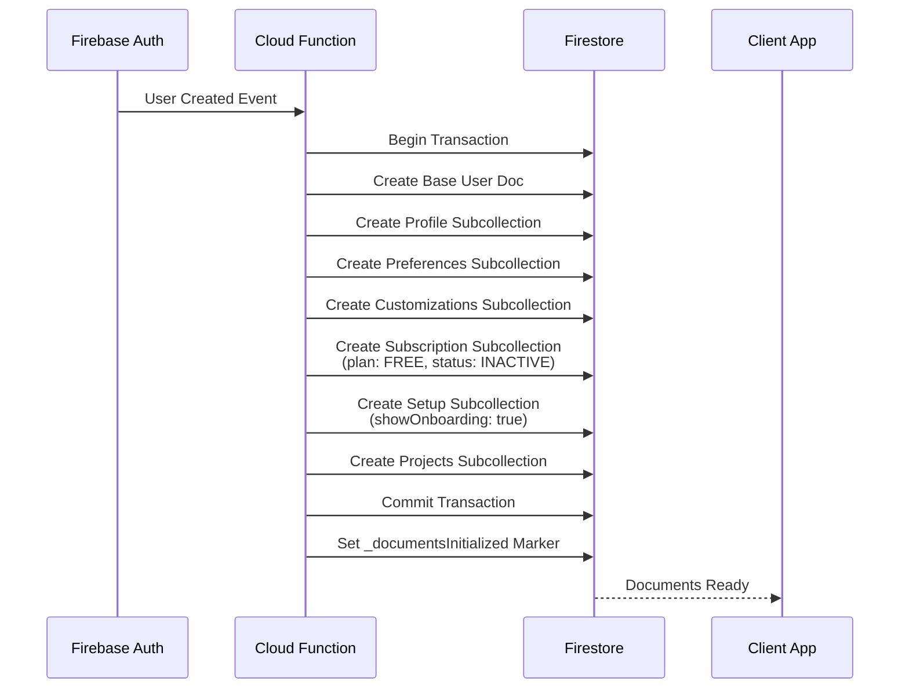
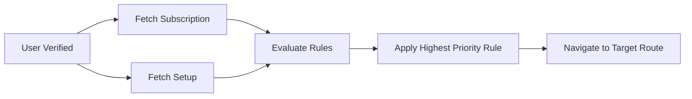

# New User FREE Tier Flow: App Launch → Projects Screen

## Overview

This document provides a comprehensive mapping of data flows, logic, sequences, interactions, and classes for a new user selecting the FREE tier from app launch through to the projects screen. It includes detailed explanations of every step, decision point, and data transformation.

## Complete Flow Diagram

```mermaid
flowchart TD
    %% App Launch
    START[App Launch] --> AUTH_INIT[AuthInitializer Component]
    AUTH_INIT --> CHECK_AUTH{Auth State Check}

    %% Unauthenticated Path
    CHECK_AUTH -->|No User| WELCOME[Welcome Screen<br/>src/app/auth/welcome.tsx]
    WELCOME --> USER_ACTION{User Action}
    USER_ACTION -->|Create Account| REGISTER[Register Screen<br/>src/app/auth/register.tsx]
    USER_ACTION -->|Sign In| SIGN_IN[Sign In Screen]
    USER_ACTION -->|View Demo| DEMO[Demo Mode]

    %% Registration Flow
    REGISTER --> REG_FORM[AuthenticationForm<br/>mode: register]
    REG_FORM --> REG_HOOK[useRegister Hook<br/>src/hooks/use-register.ts]
    REG_HOOK --> REG_VALIDATE[Validate RegisterInput<br/>Zod Schema]
    REG_VALIDATE -->|Invalid| REG_ERROR[Show Field Errors]
    REG_VALIDATE -->|Valid| AUTH_SVC[AuthService.register<br/>src/services/auth-service.ts]

    %% Rate Limiting
    AUTH_SVC --> RATE_CHECK{Rate Limit Check<br/>registerRateLimiter}
    RATE_CHECK -->|Blocked| RATE_ERROR[Too Many Requests Error]
    RATE_CHECK -->|Allowed| AUTH_REPO[FirestoreAuthRepository.register<br/>src/repositories/firestore/firestore-auth-repository.ts]

    %% Firebase Auth Creation
    AUTH_REPO --> SANITIZE[Sanitize Input<br/>sanitizeEmail, sanitizeString]
    SANITIZE --> FIREBASE_AUTH[Firebase Auth<br/>createUserWithEmailAndPassword]
    FIREBASE_AUTH -->|Success| SEND_VERIFY[Send Email Verification<br/>sendEmailVerification]
    FIREBASE_AUTH -->|Failure| AUTH_ERROR[Auth Error<br/>ErrorMapper.fromFirebaseAuth]

    %% Cloud Function Trigger
    SEND_VERIFY --> CLOUD_TRIGGER[Cloud Function Trigger<br/>functions.auth.user.onCreate]
    CLOUD_TRIGGER --> CLOUD_FUNC[createUserDocuments<br/>functions/src/index.ts]

    %% Atomic Transaction
    CLOUD_FUNC --> TRANSACTION[Firestore Transaction<br/>Atomic Document Creation]
    TRANSACTION --> CREATE_BASE["Create Base User Doc<br/>users/userId"]
    CREATE_BASE --> CREATE_PROFILE["Create Profile Subcollection<br/>users/userId/profile/profileId"]
    CREATE_PROFILE --> CREATE_PREFS["Create Preferences Subcollection<br/>users/userId/preferences/prefsId"]
    CREATE_PREFS --> CREATE_CUSTOM["Create Customizations Subcollection<br/>users/userId/customizations/customId"]
    CREATE_CUSTOM --> CREATE_SUB["Create Subscription Subcollection<br/>users/userId/subscription/subId<br/>plan: FREE, status: INACTIVE"]
    CREATE_SUB --> CREATE_SETUP["Create Setup Subcollection<br/>users/userId/setup/setupId<br/>showOnboarding: true, firstTimeSetup: true"]
    CREATE_SETUP --> CREATE_PROJECTS["Create Projects Subcollection<br/>users/userId/projects/projectsId"]
    CREATE_PROJECTS --> SET_MARKER[Set _documentsInitialized Marker]
    SET_MARKER --> TRANS_SUCCESS{Transaction Success?}

    %% Rollback on Failure
    TRANS_SUCCESS -->|No| ROLLBACK[Delete Orphaned Auth User<br/>auth.deleteUser]
    TRANS_SUCCESS -->|Yes| WAIT_DOCS[Client Waits for Documents<br/>waitForUserDocumentsReady]

    %% Document Ready Check
    WAIT_DOCS --> POLL_DOCS[Poll Firestore<br/>Check _documentsInitialized]
    POLL_DOCS -->|Not Ready| TIMEOUT_CHECK{Timeout?<br/>15 seconds}
    TIMEOUT_CHECK -->|Yes| TIMEOUT_WARN[Show Warning Toast<br/>Graceful Degradation]
    TIMEOUT_CHECK -->|No| POLL_DOCS
    POLL_DOCS -->|Ready| REG_SUCCESS[Registration Success]

    %% Email Verification Flow
    REG_SUCCESS --> EMAIL_VERIFY[Email Verification Screen<br/>src/app/auth/emailVerification.tsx]
    EMAIL_VERIFY --> VERIFY_HOOK[useEmailVerificationStatus Hook<br/>src/hooks/use-email-verification-status.ts]
    VERIFY_HOOK --> VERIFY_POLL[Auto-Poll Firebase Auth<br/>checkEmailVerified<br/>Every 3 seconds]
    VERIFY_POLL --> VERIFY_CHECK{Email Verified?}
    VERIFY_CHECK -->|No| VERIFY_WAIT[Show Waiting UI<br/>Resend Option Available]
    VERIFY_CHECK -->|Yes| VERIFY_SUCCESS[Verification Success<br/>Trigger Navigation Guard]

    %% Navigation Guard Activation
    VERIFY_SUCCESS --> NAV_GUARD[useNavigationGuard Hook<br/>src/hooks/use-navigation-guard.ts]
    CHECK_AUTH -->|User Exists| NAV_GUARD

    %% Navigation Guard Logic
    NAV_GUARD --> FETCH_DATA[Fetch User Data Concurrently<br/>Promise.all]
    FETCH_DATA --> FETCH_SUB[userSubscription.getByUserId]
    FETCH_DATA --> FETCH_SETUP[userSetup.getByUserId]
    FETCH_SUB --> SUB_RESULT{Subscription Result}
    FETCH_SETUP --> SETUP_RESULT{Setup Result}

    %% Error Handling
    SUB_RESULT -->|Error| SUB_ERROR[Handle Error<br/>Fallback to Projects]
    SETUP_RESULT -->|Error| SETUP_ERROR[Handle Error<br/>Fallback to Projects]

    %% Routing Rules Evaluation
    SUB_RESULT -->|Success| EVAL_RULES[Evaluate Routing Rules<br/>ROUTING_RULES from navigation.ts]
    SETUP_RESULT -->|Success| EVAL_RULES

    EVAL_RULES --> RULE_1{Email Verified?<br/>Priority: 100}
    RULE_1 -->|No| ROUTE_VERIFY[Route to Email Verification]
    RULE_1 -->|Yes| RULE_2{Newly Registered?<br/>INACTIVE + firstTimeSetup<br/>Priority: 98}
    RULE_2 -->|Yes| ROUTE_PRICING[Route to Pricing Screen]
    RULE_2 -->|No| RULE_3{FREE + showOnboarding?<br/>Priority: 90}

    %% FREE Plan Routing Decision
    RULE_3 -->|Yes| FREE_ONBOARD[FREE Plan Onboarding Rule<br/>Skip Onboarding Flag]
    RULE_3 -->|No| RULE_4{INACTIVE Subscription?<br/>Priority: 80}

    %% FREE Plan Onboarding Skip Logic
    FREE_ONBOARD --> UPDATE_SETUP[Update Setup<br/>showOnboarding: false<br/>firstTimeSetup: false]
    UPDATE_SETUP --> ROUTE_PROJECTS[Route to Projects<br/>NavigationRoute.PROJECTS_INDEX]

    %% Alternative Flow: flow-router (if showOnboarding still true)
    RULE_3 -->|Alternative Path| FLOW_ROUTER[flow-router Screen<br/>src/app/onboarding/flow-router.tsx]
    FLOW_ROUTER --> FLOW_CHECK[Check Subscription Plan]
    FLOW_CHECK -->|FREE Plan| FLOW_ONBOARD_CHECK{showOnboarding?}
    FLOW_ONBOARD_CHECK -->|Yes| START_FLOW_A[startOnboardingFlow 'A'<br/>useOnboardingStore]
    FLOW_ONBOARD_CHECK -->|No| ROUTE_PROJECTS

    %% Flow A Onboarding
    START_FLOW_A --> FREE_SLIDES[freeSlides Screen<br/>src/app/onboarding/freeSlides.tsx]
    FREE_SLIDES --> FLOW_STEP{Flow Step}
    FLOW_STEP -->|Step 0| DYNAMIC_SPLASH[DynamicSplash Component<br/>A1: Account Ready Message]
    FLOW_STEP -->|Step 1| FEATURE_SLIDES[Slideshow Component<br/>A2: 4 Feature Slides]

    %% Dynamic Splash
    DYNAMIC_SPLASH --> FETCH_SUB_DATA[Fetch Subscription Data<br/>useUserSubscription Hook]
    FETCH_SUB_DATA --> DISPLAY_SPLASH[Display:<br/>- Title: Your Free Account is Ready!<br/>- Description: Core features available<br/>- Proceed Button]
    DISPLAY_SPLASH --> PROCEED_BTN[User Clicks Proceed]
    PROCEED_BTN --> SET_FLOW_STEP[setFlowStep 1]

    %% Feature Slideshow
    SET_FLOW_STEP --> FEATURE_SLIDES
    FEATURE_SLIDES --> SLIDE_DATA[Display 4 Slides:<br/>1. Welcome to Eye-Doo<br/>2. Client Portals<br/>3. Smart Shot Lists<br/>4. Vendor Management]
    SLIDE_DATA --> SLIDE_NAV{User Action}
    SLIDE_NAV -->|Next| NEXT_SLIDE[Increment slideStep]
    SLIDE_NAV -->|Back| PREV_SLIDE[Decrement slideStep]
    SLIDE_NAV -->|Skip| SKIP_ONBOARD[Skip Onboarding]
    SLIDE_NAV -->|Finish| COMPLETE_ONBOARD[Complete Onboarding]

    %% Onboarding Completion
    COMPLETE_ONBOARD --> ONBOARD_STORE[useOnboardingStore.completeFlow]
    SKIP_ONBOARD --> ONBOARD_STORE
    ONBOARD_STORE --> ONBOARD_SVC[onboardingService.completeOnboarding<br/>src/services/onboarding-service.ts]
    ONBOARD_SVC --> UPDATE_ONBOARD[Update Setup Document<br/>showOnboarding: false<br/>firstTimeSetup: false]
    UPDATE_ONBOARD --> RESET_STORE[Reset Onboarding Store<br/>activeFlow: null, currentStep: 0]
    RESET_STORE --> ROUTE_PROJECTS

    %% Projects Screen
    ROUTE_PROJECTS --> PROJECTS[Projects Screen<br/>src/app/projects/index.tsx]
    PROJECTS --> APP_READY[User in Main App<br/>Full Access to FREE Features]

    %% Error Paths
    AUTH_ERROR --> ERROR_HANDLER[Error Handler<br/>AppErrorHandler.handle]
    RATE_ERROR --> ERROR_HANDLER
    REG_ERROR --> ERROR_HANDLER
    SUB_ERROR --> ERROR_HANDLER
    SETUP_ERROR --> ERROR_HANDLER
    ERROR_HANDLER --> ERROR_TOAST[Show Error Toast<br/>User-Friendly Message]

    %% Styling
    classDef authNode fill:#e1f5fe,stroke:#01579b,stroke-width:2px
    classDef cloudNode fill:#fff8e1,stroke:#f57f17,stroke-width:2px
    classDef navNode fill:#f3e5f5,stroke:#4a148c,stroke-width:2px
    classDef onboardNode fill:#fce4ec,stroke:#880e4f,stroke-width:2px
    classDef dataNode fill:#e8f5e8,stroke:#1b5e20,stroke-width:2px
    classDef errorNode fill:#ffebee,stroke:#b71c1c,stroke-width:2px
    classDef decisionNode fill:#fff3e0,stroke:#e65100,stroke-width:2px

    class AUTH_INIT,CHECK_AUTH,WELCOME,REGISTER,REG_FORM,REG_HOOK,AUTH_SVC,AUTH_REPO,FIREBASE_AUTH,SEND_VERIFY,EMAIL_VERIFY,VERIFY_HOOK authNode
    class CLOUD_TRIGGER,CLOUD_FUNC,TRANSACTION,CREATE_BASE,CREATE_PROFILE,CREATE_PREFS,CREATE_CUSTOM,CREATE_SUB,CREATE_SETUP,CREATE_PROJECTS,SET_MARKER cloudNode
    class NAV_GUARD,FETCH_DATA,EVAL_RULES,RULE_1,RULE_2,RULE_3,FLOW_ROUTER,FLOW_CHECK navNode
    class FREE_ONBOARD,START_FLOW_A,FREE_SLIDES,DYNAMIC_SPLASH,FEATURE_SLIDES,ONBOARD_STORE,ONBOARD_SVC onboardNode
    class FETCH_SUB,FETCH_SETUP,UPDATE_SETUP,UPDATE_ONBOARD,WAIT_DOCS,POLL_DOCS dataNode
    class AUTH_ERROR,RATE_ERROR,REG_ERROR,SUB_ERROR,SETUP_ERROR,ERROR_HANDLER,ROLLBACK errorNode
    class USER_ACTION,VERIFY_CHECK,TRANS_SUCCESS,TIMEOUT_CHECK,FLOW_STEP,SLIDE_NAV,FLOW_ONBOARD_CHECK decisionNode
```



## Detailed Component & Class Interactions

### 1. App Launch & Authentication Initialization

#### AuthInitializer Component (`src/components/auth/AuthInitializer.tsx`)

**Purpose**: Syncs Firebase auth state with Zustand store on app launch

**Flow**:

1. Component mounts → Calls `useAuthStore.initialize(authService)`
2. Checks existing Firebase Auth session
3. Sets up `onAuthStateChanged` listener
4. On auth state change:
   - If user exists → Fetch profile via `authService.getProfile()`
   - If no user → Clear store state
5. Enables `useNavigationGuard` after initialization

**Key Data**:

- `user: BaseUser | null` - Stored in `useAuthStore`
- `loading: boolean` - Initialization state

---

### 2. Welcome Screen

#### WelcomeScreen Component (`src/app/(auth)/welcome.tsx`)

**Purpose**: Entry point for unauthenticated users

**User Actions**:

- **Create Account** → Navigate to `NavigationRoute.REGISTER`
- **Sign In** → Navigate to `NavigationRoute.SIGN_IN`
- **View Demo** → Demo mode (TODO)

**Data Flow**:

```
User Click → router.push(NavigationRoute.REGISTER) → Register Screen
```

---

### 3. Registration Flow

#### RegisterScreen Component (`src/app/(auth)/register.tsx`)

**Purpose**: User registration form

**Component Structure**:

- `AuthenticationForm` (mode: "register")
- Social sign-in buttons (Google, Apple - TODO)
- Link to Sign In screen

**Data Flow**:

```typescript
AuthenticationForm → handleRegister → useRegister.register → AuthService.register
```

#### useRegister Hook (`src/hooks/use-register.ts`)

**Purpose**: Manages registration state and orchestrates registration process

**State Management**:

- Uses `LoadingState<BaseUser | null>` for state tracking
- `loading`: Registration in progress
- `error`: Registration error (if any)
- `state`: Full loading state object

**Key Logic**:

1. **Registration Call**:

   ```typescript
   const result = await auth.register(payload);
   ```

2. **Wait for Cloud Function**:

   ```typescript
   await waitForUserDocumentsReady(userId, baseUser, { timeoutMs: 15000 });
   ```

   - Polls Firestore for `_documentsInitialized` marker
   - Timeout: 15 seconds
   - Graceful degradation on timeout (shows warning toast)

3. **Success Handling**:
   - Updates state to `success(result.value)`
   - Calls `onSuccess` callback
   - Navigates to email verification

**Error Handling**:

- Maps service errors to user-friendly messages
- Uses `ErrorContextBuilder` for debugging context
- Shows error toast via `AppErrorHandler`

#### AuthService.register (`src/services/auth-service.ts`)

**Purpose**: Business logic for user registration

**Process**:

1. **Rate Limiting**:

   ```typescript
   const rateLimitKey = `Register-${email.toLowerCase()}`;
   if (!registerRateLimiter.canAttempt(rateLimitKey)) {
     return err(TOO_MANY_REQUESTS_ERROR);
   }
   ```

   - Key: Email-based
   - Prevents abuse

2. **Input Validation**:

   ```typescript
   const validationResult = validateWithSchema(registerInputSchema, payload, context);
   ```

   - Uses Zod schema validation
   - Returns structured errors

3. **Repository Call**:

   ```typescript
   const result = await this.authRepository.register(validatedPayload);
   ```

4. **Success Actions**:
   - Reset rate limiter
   - Check verification email status
   - Show warning if email failed to send

#### FirestoreAuthRepository.register (`src/repositories/firestore/firestore-auth-repository.ts`)

**Purpose**: Data access layer for authentication

**Process**:

1. **Sanitization**:

   ```typescript
   const sanitized = {
     email: sanitizeEmail(payload.email)!,
     displayName: sanitizeString(payload.displayName)!,
     // ... other fields
   };
   ```

2. **Firebase Auth Creation**:

   ```typescript
   const userCredential = await createUserWithEmailAndPassword(
     auth,
     sanitized.email,
     sanitized.password,
   );
   ```

3. **Send Verification Email**:

   ```typescript
   await sendEmailVerification(userCredential.user);
   ```

4. **Create Base User Document**:
   ```typescript
   await setDoc(userRef, {
     id: userId,
     email: sanitized.email.toLowerCase(),
     displayName: sanitized.displayName,
     isEmailVerified: false,
     // ... other fields
   });
   ```

**Error Mapping**:

- Firebase Auth errors → `AppError` via `ErrorMapper.fromFirebaseAuth`
- Includes user-friendly messages

---

### 4. Cloud Function: User Document Creation

#### createUserDocuments (`functions/src/index.ts`)

**Trigger**: `functions.auth.user().onCreate()`

**Purpose**: Atomically creates complete user document structure

**Process Flow**:



**Critical Data Created**:

1. **Base User Document** (`users/{userId}`):

   ```typescript
   {
     id: uid,
     email: email?.toLowerCase(),
     displayName: displayName || null,
     isEmailVerified: false, // For email/password sign-up
     role: UserRole.USER,
     isActive: false,
     createdAt: serverTimestamp(),
     updatedAt: serverTimestamp()
   }
   ```

2. **Subscription Document** (`users/{userId}/subscription/{subId}`):

   ```typescript
   {
     id: subId,
     userId: uid,
     plan: SubscriptionPlan.FREE, // Default
     status: SubscriptionStatus.INACTIVE, // Default
     isActive: false,
     autoRenew: false,
     startDate: serverTimestamp(),
     createdAt: serverTimestamp()
   }
   ```

3. **Setup Document** (`users/{userId}/setup/{setupId}`):
   ```typescript
   {
     id: setupId,
     userId: uid,
     showOnboarding: true, // FREE users see onboarding
     firstTimeSetup: true,
     createdAt: serverTimestamp()
   }
   ```

**Transaction Guarantees**:

- All documents created atomically
- Either all succeed or all fail
- Rollback: Deletes orphaned auth user on failure

**Completion Marker**:

```typescript
await baseUserRef.update({
  _documentsInitialized: true,
  _documentsInitializedAt: serverTimestamp(),
});
```

---

### 5. Email Verification Flow

#### EmailVerificationScreen (`src/app/(auth)/emailVerification.tsx`)

**Purpose**: Wait for email verification with auto-detection

#### useEmailVerificationStatus Hook

**Purpose**: Automatically detects email verification

**Detection Methods**:

1. **App State Listener**: Checks when app comes to foreground
2. **Firebase Auth Listener**: Listens to `onAuthStateChanged`
3. **Manual Check**: User clicks "I've Verified" button
4. **Auto-Poll**: Polls every 3 seconds (configurable)

**Flow**:

```typescript
// Auto-check on multiple triggers
useEffect(() => {
  // Check on app state change
  const subscription = AppState.addEventListener('change', checkStatus);

  // Check on auth state change
  const unsubscribe = onAuthStateChanged(auth, checkStatus);

  // Auto-poll interval
  const interval = setInterval(checkStatus, POLL_INTERVAL);

  return () => {
    subscription.remove();
    unsubscribe();
    clearInterval(interval);
  };
}, []);
```

**Verification Check**:

```typescript
const checkStatus = async () => {
  const user = auth.currentUser;
  if (user?.emailVerified) {
    // Update Firestore
    await syncEmailVerificationToFirestore(userId);
    // Trigger navigation guard
    onVerified();
  }
};
```

**Navigation After Verification**:

- Does NOT manually navigate
- Relies on `useNavigationGuard` to route based on user state
- Navigation guard activates when `user.isEmailVerified === true`

---

### 6. Navigation Guard System

#### useNavigationGuard Hook (`src/hooks/use-navigation-guard.ts`)

**Purpose**: Centralized routing logic based on user state

**Activation**:

- Enabled after auth initialization
- Runs when:
  - User state changes
  - Route segments change
  - Email verification completes

**Process**:



**Data Fetching**:

```typescript
const [subResult, setupResult] = await Promise.all([
  withRetry(() => userSubscription.getByUserId(user.id), {
    maxAttempts: 5,
    delayMs: 500,
  }),
  withRetry(() => userSetup.getByUserId(user.id), {
    maxAttempts: 5,
    delayMs: 500,
  }),
]);
```

**Routing Rules Evaluation** (`src/constants/navigation.ts`):

For FREE users, relevant rules:

1. **Email Verification Rule** (Priority: 100):

   ```typescript
   condition: user => !!user && !user.isEmailVerified;
   targetRoute: NavigationRoute.VERIFY_EMAIL;
   ```

2. **FREE Plan Skip Onboarding Rule** (Priority: 90):

   ```typescript
   condition: (user, subscription, setup) =>
     subscription.plan === SubscriptionPlan.FREE && setup.showOnboarding === true;
   targetRoute: NavigationRoute.PROJECTS_INDEX;
   onMatch: async (user, _subscription, setup, services) => {
     // Automatically disable onboarding
     await services.userSetup.update(user.id, setup.id, {
       showOnboarding: false,
       firstTimeSetup: false,
     });
   };
   ```

3. **Default Rule** (Priority: 10):
   ```typescript
   condition: () => true; // Always matches
   targetRoute: NavigationRoute.PROJECTS_INDEX;
   ```

**FREE User Routing Logic**:

- If `showOnboarding === true`:
  - Rule 90 matches → Updates setup → Routes to Projects
  - OR: Routes to `flow-router` (alternative path)
- If `showOnboarding === false`:
  - Default rule → Routes to Projects

---

### 7. Alternative Path: flow-router

#### FlowRouterScreen (`src/app/(onboarding)/flow-router.tsx`)

**Purpose**: Determines onboarding flow based on subscription plan

**FREE User Logic**:

```typescript
if (subscription.plan === SubscriptionPlan.FREE) {
  if (setup.showOnboarding) {
    startOnboardingFlow('A');
    router.replace('/(onboarding)/freeSlides');
    return;
  }
  // Onboarding already completed
  router.replace('/(projects)');
  return;
}
```

**Flow A Initialization**:

```typescript
startOnboardingFlow('A');
// Sets: activeFlow = 'A', currentStep = 0, flowBStep = null
```

---

### 8. FREE User Onboarding (Flow A)

#### freeSlides Screen (`src/app/(onboarding)/freeSlides.tsx`)

**Purpose**: FREE user onboarding with 2-step flow

**Flow Structure**:

- **A1**: Dynamic Splash Screen (Account Ready)
- **A2**: Feature Slideshow (4 slides)

**State Management**:

```typescript
const [flowStep, setFlowStep] = useState(0); // 0 = A1, 1 = A2
const [slideStep, setSlideStep] = useState(0); // For A2 slideshow
```

#### Step A1: DynamicSplash Component

**Purpose**: Welcome screen with account status

**Data Fetching**:

```typescript
const { subscription, state } = useUserSubscription(userId, userSubscription, {
  autoFetch: true,
  enableRealtime: true,
});
```

**Display**:

- Title: "Your Free Account is Ready!"
- Description: "You have access to all our core features. Let's see what you can do."
- Proceed Button

**User Action**:

- Click "Proceed" → `setFlowStep(1)` → Navigate to A2

#### Step A2: Slideshow Component

**Purpose**: Feature introduction slideshow

**Slides Data**:

```typescript
const FEATURE_SLIDES: OnboardingStep[] = [
  {
    id: 1,
    title: 'Welcome to Eye-Doo',
    description: 'Manage projects, track timelines, and organize clients all in one place.',
    image: '🎉',
  },
  {
    id: 2,
    title: 'Client Portals',
    description: 'Share timelines, shot lists, and photos with your clients in a branded portal.',
    image: '🖥',
  },
  {
    id: 3,
    title: 'Smart Shot Lists',
    description: 'Never miss a moment with dynamic group and couple shot lists.',
    image: '📸',
  },
  {
    id: 4,
    title: 'Vendor Management',
    description: 'Keep all your vendor contacts and details organized per project.',
    image: '🚚',
  },
];
```

**Navigation**:

- **Next**: Increment `slideStep`
- **Back**: Decrement `slideStep`
- **Skip**: Complete onboarding immediately
- **Finish**: Complete onboarding after last slide

**Auto-Play**: Enabled (slides advance automatically)

---

### 9. Onboarding Completion

#### useOnboardingStore.completeFlow (`src/stores/use-onboarding-store.ts`)

**Purpose**: Marks onboarding complete and navigates to main app

**Process**:

```typescript
const completeFlow = async (userId: string) => {
  // 1. Call service to update backend
  const result = await onboardingService.completeOnboarding(userId);

  // 2. Reset store state
  set({
    activeFlow: null,
    currentStep: 0,
    flowBStep: null,
  });

  // 3. Navigate to projects
  router.replace('/(projects)');
};
```

#### onboardingService.completeOnboarding (`src/services/onboarding-service.ts`)

**Purpose**: Updates setup document to mark onboarding complete

**Update**:

```typescript
await userSetup.update(userId, setupId, {
  showOnboarding: false,
  firstTimeSetup: false,
});
```

**Result**:

- User's `setup.showOnboarding` = `false`
- Future logins skip onboarding
- Navigation guard routes directly to Projects

---

### 10. Projects Screen

#### Projects Screen (`src/app/(projects)/index.tsx`)

**Purpose**: Main app entry point for FREE users

**Access**:

- User has completed onboarding
- `setup.showOnboarding === false`
- Full access to FREE tier features

**Features Available (FREE Tier)**:

- Project management
- Client portals
- Shot lists
- Vendor management
- Basic timeline features

---

## Data Structures & Classes

### RegisterInput Schema

```typescript
{
  email: string; // Validated email
  password: string; // Min 8 chars
  displayName: string; // Min 1 char
  subscriptionPlan: SubscriptionPlan; // Defaults to FREE
  acceptTerms: boolean; // Required: true
  acceptPrivacy: boolean; // Required: true
  acceptMarketing?: boolean; // Optional
}
```

### BaseUser Schema

```typescript
{
  id: string; // Firebase Auth UID
  email: string; // Lowercase
  displayName: string | null;
  isEmailVerified: boolean; // Starts as false
  role: UserRole; // USER
  isActive: boolean; // Starts as false
  createdAt: Timestamp;
  updatedAt: Timestamp;
}
```

### UserSubscription Schema (FREE)

```typescript
{
  id: string;
  userId: string;
  plan: SubscriptionPlan.FREE;
  status: SubscriptionStatus.INACTIVE;
  isActive: false;
  autoRenew: false;
  startDate: Timestamp;
  createdAt: Timestamp;
}
```

### UserSetup Schema (New FREE User)

```typescript
{
  id: string;
  userId: string;
  showOnboarding: true; // FREE users see onboarding
  firstTimeSetup: true;
  createdAt: Timestamp;
}
```

---

## Error Handling & Recovery

### Registration Errors

1. **Rate Limiting**:
   - Error: `AUTH_TOO_MANY_REQUESTS`
   - Message: "Too many register attempts. Please try again in X minutes."
   - Action: User must wait

2. **Validation Errors**:
   - Field-level errors shown in form
   - Zod schema validation messages
   - User can correct and retry

3. **Firebase Auth Errors**:
   - Email already in use → User-friendly message
   - Weak password → Validation message
   - Network error → Retry option

4. **Cloud Function Timeout**:
   - Warning toast: "Some features may not be available yet"
   - User can proceed (graceful degradation)
   - Documents will be ready eventually

### Email Verification Errors

1. **Verification Email Not Sent**:
   - Warning toast after registration
   - User can resend from email verification screen

2. **Verification Timeout**:
   - User can manually check
   - Resend email option available
   - Sign out option if needed

### Navigation Errors

1. **Subscription Fetch Error**:
   - Fallback to Projects screen
   - Error logged for debugging
   - User can retry later

2. **Setup Fetch Error**:
   - Fallback to Projects screen
   - Error logged for debugging
   - User can retry later

---

## Performance Optimizations

### Concurrent Data Fetching

```typescript
// Navigation guard fetches subscription and setup concurrently
const [subResult, setupResult] = await Promise.all([
  userSubscription.getByUserId(user.id),
  userSetup.getByUserId(user.id),
]);
```

### Retry Logic

```typescript
// Automatic retry on network errors
withRetry(() => userSubscription.getByUserId(user.id), {
  maxAttempts: 5,
  delayMs: 500,
  exponential: false,
});
```

### Document Ready Polling

```typescript
// Efficient polling with timeout
waitForUserDocumentsReady(userId, baseUser, {
  timeoutMs: 15000, // 15 second timeout
  pollInterval: 500, // Check every 500ms
});
```

### Real-time Subscriptions

```typescript
// DynamicSplash uses real-time subscription updates
useUserSubscription(userId, userSubscription, {
  enableRealtime: true, // Updates automatically
});
```

---

## Security Considerations

### Rate Limiting

- Registration: Email-based rate limiting
- Prevents abuse and brute force attacks
- Progressive delays on failures

### Input Sanitization

- All inputs sanitized at repository layer
- Email: Lowercase, trimmed
- Display name: Trimmed, HTML escaped

### Validation

- Zod schemas at service layer
- Client-side validation in forms
- Server-side validation in Cloud Functions

### Data Consistency

- Atomic transactions for user creation
- Rollback on failure
- Completion markers for client synchronization

---

## Testing Scenarios

### Happy Path

1. User launches app → Welcome screen
2. Clicks "Create Account" → Register screen
3. Fills form → Submits
4. Cloud Function creates documents
5. Email verification screen appears
6. User verifies email
7. Navigation guard routes to onboarding
8. User completes Flow A
9. Routes to Projects screen

### Error Scenarios

1. **Rate Limited**: User sees error, must wait
2. **Cloud Function Timeout**: Warning shown, user proceeds
3. **Email Verification Delay**: User can resend or wait
4. **Network Error**: Retry logic attempts recovery
5. **Partial Failure**: Graceful degradation to Projects

### Edge Cases

1. **User closes app during registration**: Can resume at email verification
2. **User verifies email before returning to app**: Auto-detected on app open
3. **Multiple devices**: Each device independently checks verification
4. **Slow network**: Timeout handling prevents indefinite waiting

---

## Summary

The FREE tier user flow is designed to be:

- **Simple**: Minimal steps to get started
- **Fast**: Concurrent data fetching, efficient polling
- **Resilient**: Error handling and graceful degradation
- **Secure**: Rate limiting, input sanitization, validation
- **User-Friendly**: Clear messaging, auto-detection, helpful errors

The flow ensures FREE users can quickly access core features while maintaining data integrity and providing a smooth onboarding experience.
