# Authentication System - Complete Architecture & Flow Analysis

## Table of Contents

1. [Executive Summary](#executive-summary)
2. [Architecture Overview](#architecture-overview)
3. [Complete Flow Diagrams](#complete-flow-diagrams)
4. [Data Structures & Schemas](#data-structures--schemas)
5. [Validation & Sanitization Flow](#validation--sanitization-flow)
6. [Error Handling System](#error-handling-system)
7. [Loading States & UI Management](#loading-states--ui-management)
8. [File Structure & Dependencies](#file-structure--dependencies)
9. [Issues & Potential Pitfalls](#issues--potential-pitfalls)
10. [Simple Explanation](#simple-explanation)

---

## Executive Summary

The Eye-Doo authentication system follows a **Ports & Adapters (Hexagonal) Architecture** with strict separation of concerns:

- **Presentation Layer**: React Native screens and components
- **Application Layer**: Services (business logic, validation, rate limiting)
- **Domain Layer**: Schemas, types, and business rules
- **Infrastructure Layer**: Firebase Auth, Firestore repositories

**Key Features:**

- ✅ Result pattern for error handling (no exceptions)
- ✅ Rate limiting on all auth operations
- ✅ Multi-layer validation (client-side Zod + service-level)
- ✅ Sanitization at repository level
- ✅ Centralized error mapping
- ✅ Zustand store for global auth state
- ✅ Firebase Auth state synchronization

---

## Architecture Overview

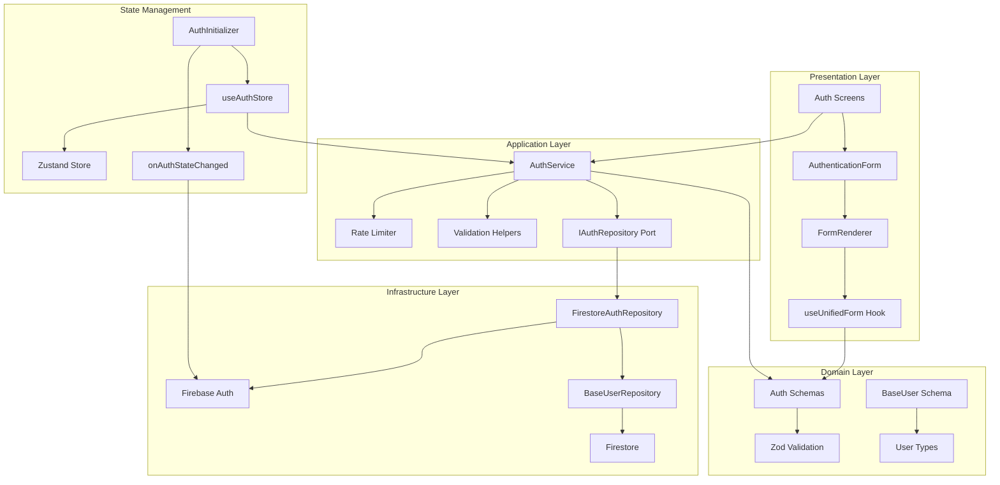

---

## Complete Flow Diagrams

### Sign Up Flow

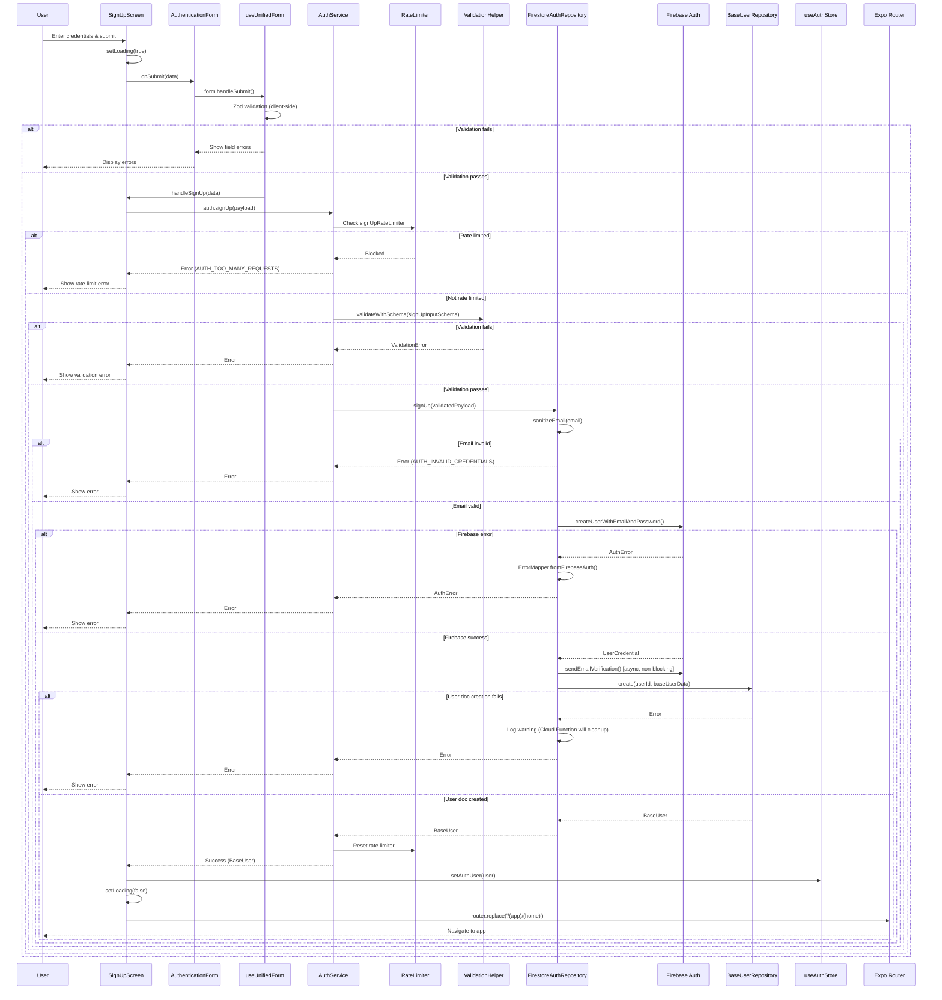

### Sign In Flow

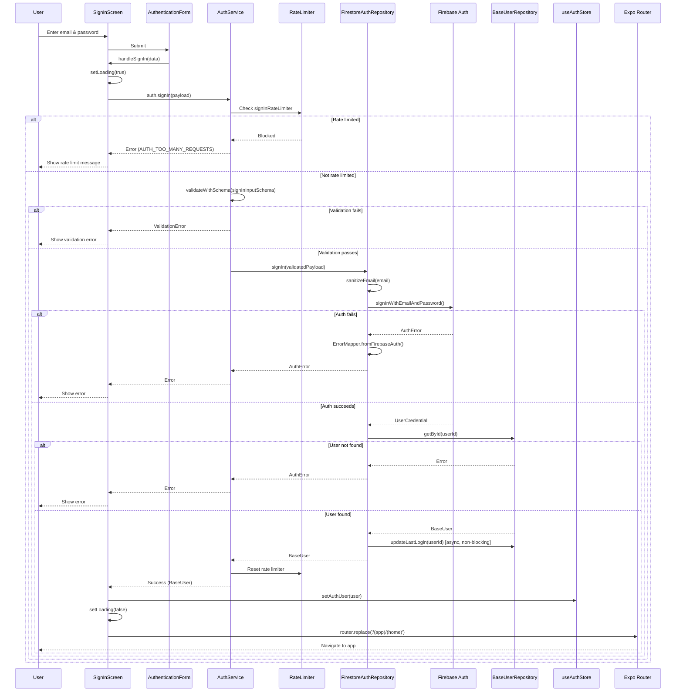

### Authentication Initialization Flow

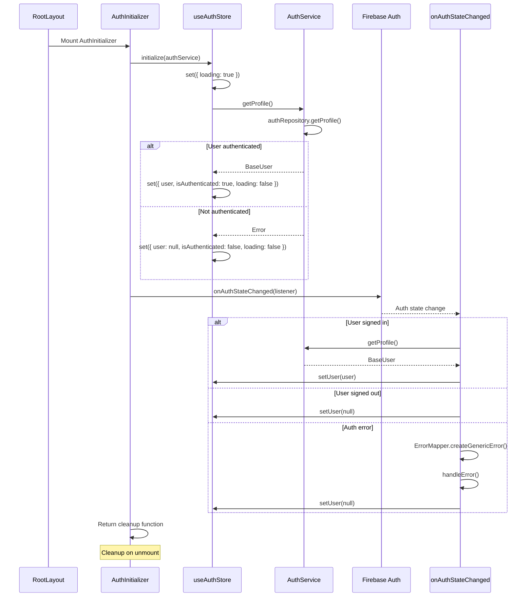

### Password Reset Flow

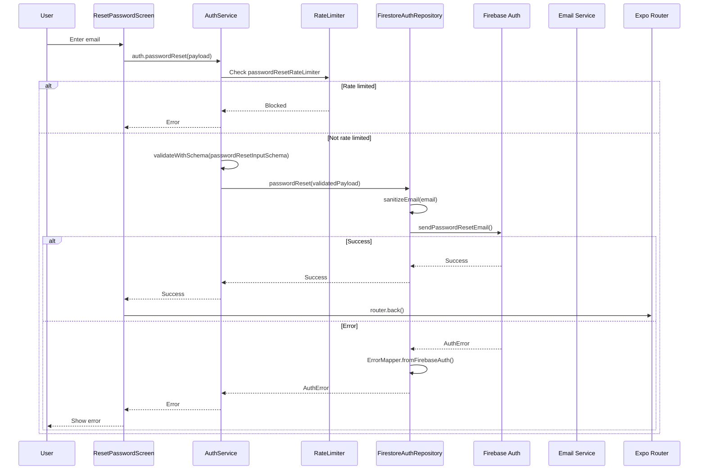

---

## Data Structures & Schemas

### Input Schemas

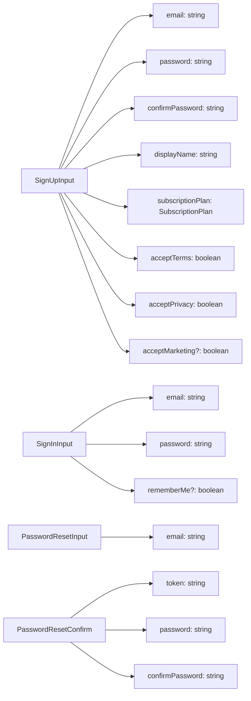

### BaseUser Schema

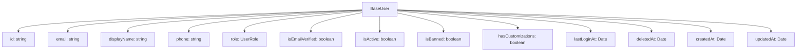

### Validation Flow

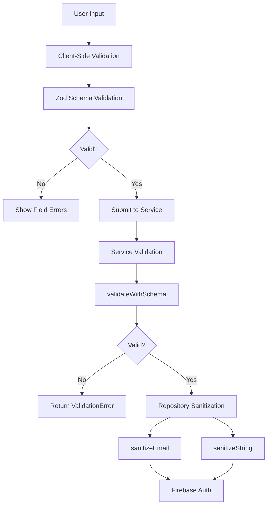

---

## Validation & Sanitization Flow

### Multi-Layer Validation

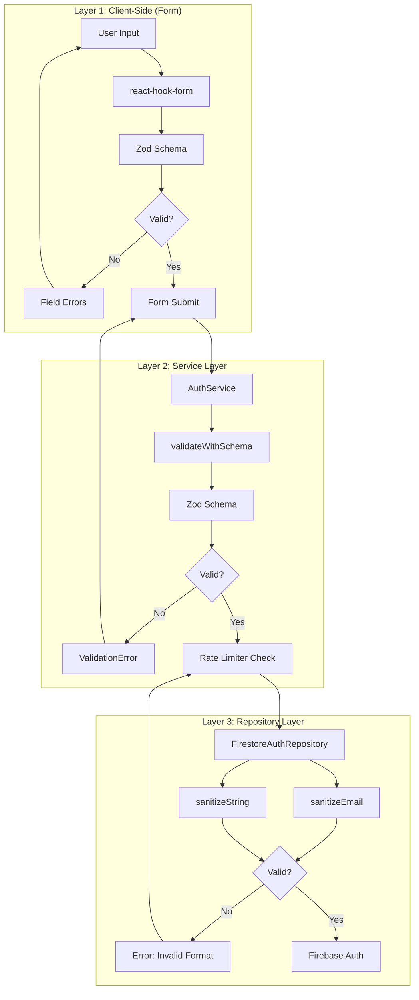

### Sanitization Functions

```typescript
// Email Sanitization
sanitizeEmail(email: string | null | undefined): string | null
  - Trims whitespace
  - Converts to lowercase
  - Validates basic email format (regex)
  - Returns null if invalid

// String Sanitization
sanitizeString(value: string | null | undefined): string | undefined
  - Trims whitespace
  - Returns undefined if empty
```

---

## Error Handling System

### Error Flow Architecture

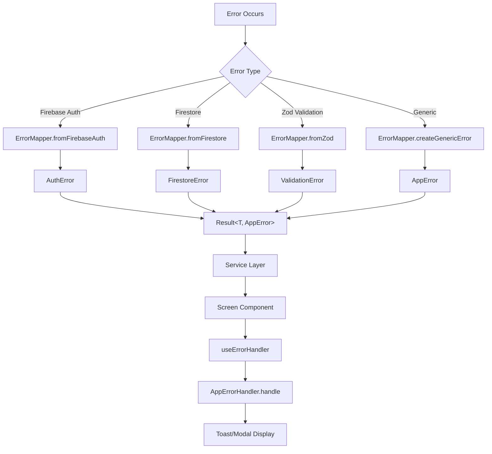

### Error Types

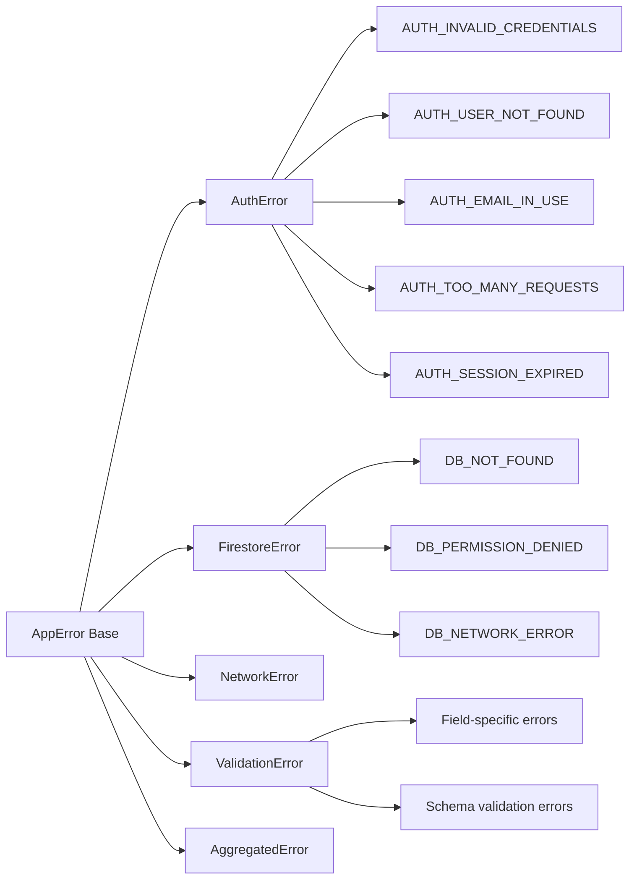

### Error Context Building

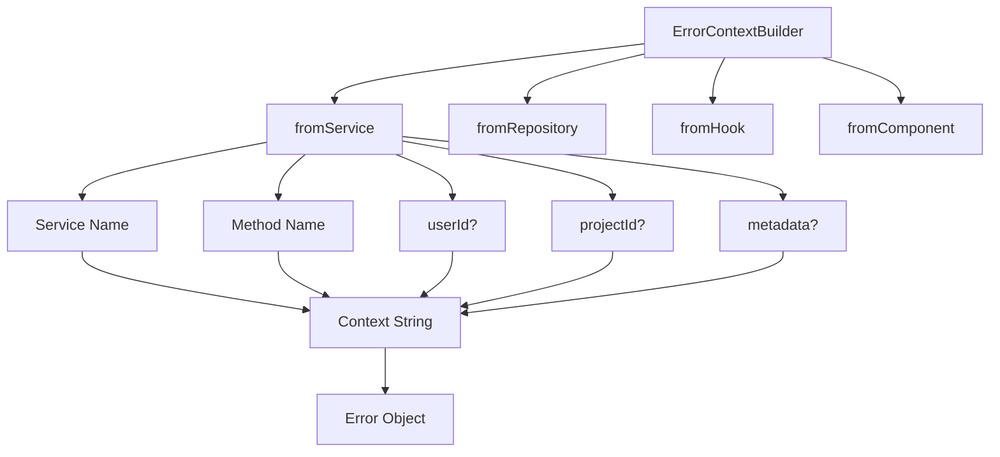

---

## Loading States & UI Management

### Loading State Flow

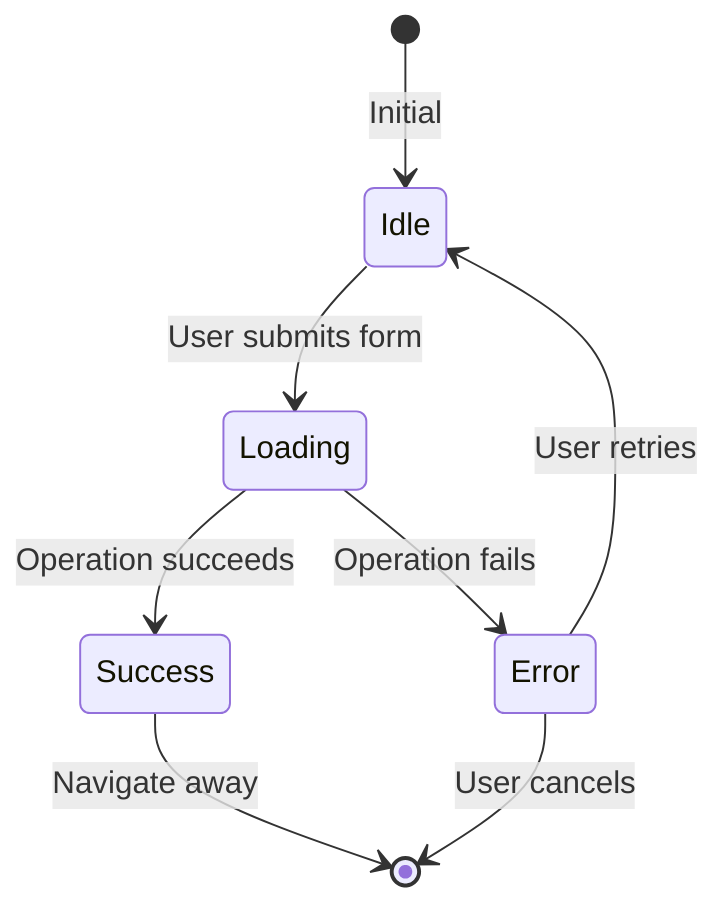

### Loading State Management

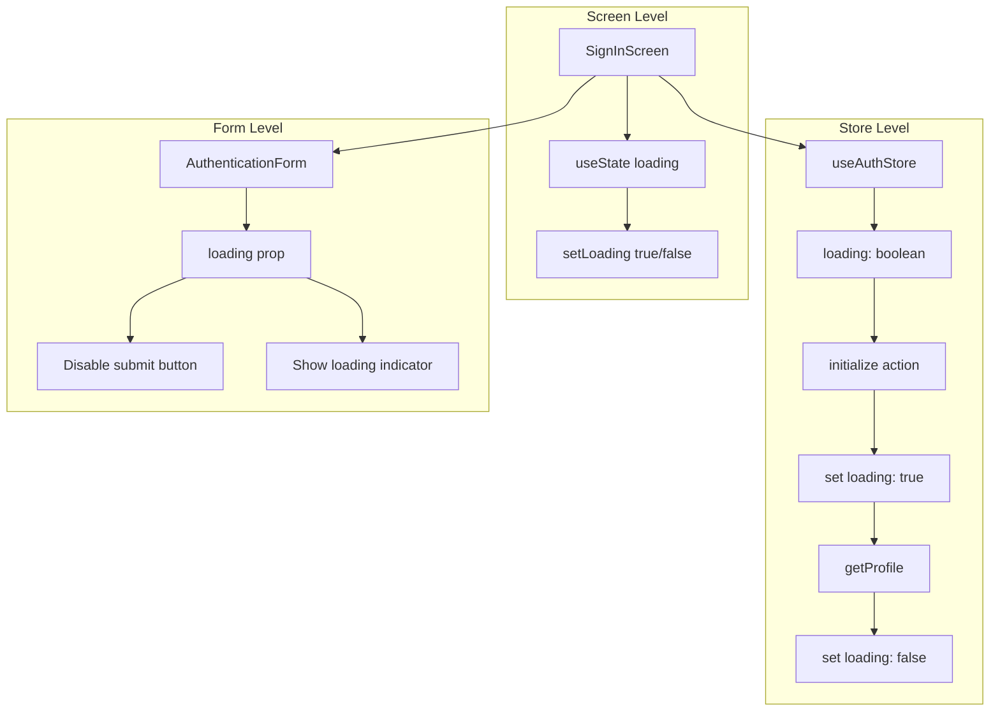

### UI Component Hierarchy

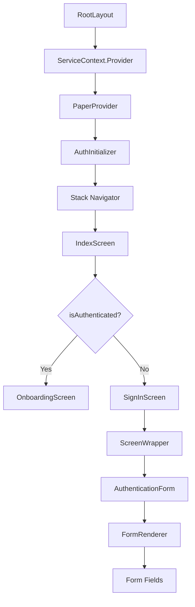

---

## File Structure & Dependencies

### Complete File Map

```mermaid
graph TB
    subgraph "Screens"
        A[app/index.tsx]
        B[app/_layout.tsx]
        C[app/(auth)/signIn.tsx]
        D[app/(auth)/signUp.tsx]
        E[app/(auth)/resetPassword.tsx]
        F[app/(auth)/resetPasswordConfirm.tsx]
    end

    subgraph "Components"
        G[components/auth/AuthInitializer.tsx]
        H[components/auth/AuthenticationForm.tsx]
        I[components/forms/core/FormRenderer.tsx]
        J[components/common/screen/ScreenWrapper.tsx]
    end

    subgraph "Services"
        K[services/auth-service.ts]
        L[services/ServiceFactory.ts]
        M[services/error-handler-service.ts]
    end

    subgraph "Repositories"
        N[repositories/i-auth-repository.ts]
        O[repositories/firestore/firestore-auth-repository.ts]
        P[repositories/firestore/firestore-base-user-repository.ts]
    end

    subgraph "Domain"
        Q[domain/user/auth.schema.ts]
        R[domain/user/user.schema.ts]
        S[domain/common/errors.ts]
        T[domain/common/result.ts]
    end

    subgraph "Hooks"
        U[hooks/use-unified-form.ts]
        V[hooks/use-error-handler.ts]
        W[hooks/use-app-styles.ts]
    end

    subgraph "Stores"
        X[stores/use-auth-store.ts]
    end

    subgraph "Utils"
        Y[utils/validation-helpers.ts]
        Z[utils/sanitization-helpers.ts]
        AA[utils/error-mapper.ts]
        AB[utils/rate-limiter.ts]
        AC[utils/error-context-builder.ts]
    end

    subgraph "Constants"
        AD[constants/theme.ts]
        AE[constants/typography.ts]
        AF[constants/styles/auth.styles.ts]
        AG[constants/error-code-registry.ts]
    end

    C --> H
    D --> H
    E --> H
    F --> H
    H --> U
    H --> I
    C --> K
    D --> K
    E --> K
    F --> K
    K --> N
    N --> O
    O --> P
    K --> Q
    O --> Q
    G --> X
    G --> K
    B --> G
    A --> X
```

### Dependency Graph

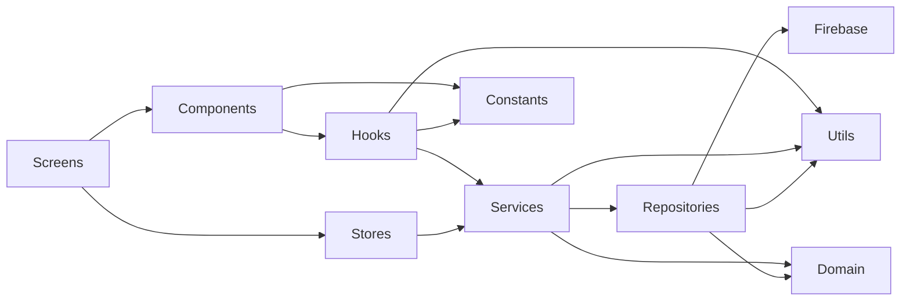

---

## Issues & Potential Pitfalls

### 🔴 Critical Issues

1. **Missing ScreenWrapper Component**
   - **Location**: Referenced in screens but file not found
   - **Impact**: Screens may fail to render
   - **Fix**: Create `src/components/common/screen/ScreenWrapper.tsx` or update imports

2. **Auth State Race Condition**
   - **Issue**: `AuthInitializer` calls `initialize()` and sets up `onAuthStateChanged` simultaneously
   - **Impact**: User might be fetched twice, causing race conditions
   - **Fix**: Ensure `initialize()` completes before setting up listener, or debounce

3. **Rate Limiter Memory Leak**
   - **Issue**: Rate limiter uses in-memory Map, never cleans up old entries
   - **Impact**: Memory usage grows over time
   - **Fix**: Implement periodic cleanup of expired entries

4. **Error in resetPasswordConfirm**
   - **Issue**: Line 85 uses `useUIStore.getState()` inside component (should use hook)
   - **Impact**: May cause React hooks violations
   - **Fix**: Use `const showToast = useUIStore(state => state.showToast)`

### 🟡 Potential Issues

1. **No Optimistic Updates for Auth**
   - **Current**: All auth operations wait for server response
   - **Impact**: Slower perceived performance
   - **Note**: This is intentional for auth (security > speed)

2. **Email Verification Non-Blocking**
   - **Issue**: `sendEmailVerification()` is called but errors are silently caught
   - **Impact**: User might not know if verification email failed
   - **Fix**: Log error but don't fail signup, show warning toast

3. **Password Reset Token Handling**
   - **Issue**: Token comes from URL params, no validation of format
   - **Impact**: Invalid tokens might cause confusing errors
   - **Fix**: Validate token format before submission

4. **Remember Me Not Implemented**
   - **Issue**: `rememberMe` field in SignInInput but not used
   - **Impact**: Feature exists in schema but doesn't work
   - **Fix**: Implement Firebase Auth persistence settings

5. **Cloud Function Dependency**
   - **Issue**: Signup relies on Cloud Function to cleanup orphaned auth accounts
   - **Impact**: If Cloud Function fails, orphaned accounts remain
   - **Fix**: Add client-side retry or manual cleanup endpoint

### 🟢 Minor Issues

1. **Type Safety in Form Handler**
   - **Issue**: `handleReset` uses type assertion `as Omit<PasswordResetConfirm, 'token'>`
   - **Impact**: Runtime errors possible if form data doesn't match
   - **Fix**: Add runtime type guard

2. **Error Context Inconsistency**
   - **Issue**: Some places use `ErrorContextBuilder.fromHook`, others use `fromComponent`
   - **Impact**: Error tracking less accurate
   - **Fix**: Standardize context building

3. **Loading State Duplication**
   - **Issue**: Both screen-level `useState` and store-level `loading` state
   - **Impact**: Potential state sync issues
   - **Fix**: Use single source of truth (prefer store)

4. **Missing Error Recovery**
   - **Issue**: No retry mechanism for transient errors
   - **Impact**: Users must manually retry
   - **Fix**: Add retry button/automatic retry for retryable errors

---

## Simple Explanation

### How Authentication Works (In Simple Terms)

Think of the authentication system like a **secure building with multiple checkpoints**:

1. **The Front Door (Form)**:
   - User enters email and password
   - Form checks if fields are filled correctly (client-side validation)
   - If something's wrong, shows error immediately

2. **The Security Desk (Service Layer)**:
   - Checks if user has tried too many times (rate limiting)
   - Validates the data format is correct
   - If everything looks good, sends to the repository

3. **The ID Check (Repository Layer)**:
   - Cleans up the email (removes spaces, makes lowercase)
   - Sends credentials to Firebase (the actual security system)
   - If Firebase says "OK", creates a user profile in the database

4. **The Welcome Desk (Store)**:
   - Once authenticated, saves user info in app memory (Zustand store)
   - This lets the app know "this person is logged in"

5. **The Watchtower (AuthInitializer)**:
   - Constantly watches Firebase to see if user signs out
   - If user signs out elsewhere, automatically updates the app
   - If user signs in elsewhere, automatically updates the app

### Data Flow (Like a Package Delivery)

```
User Input → Form Validation → Service Validation → Repository Sanitization → Firebase Auth → Database → Store → UI Update
```

Each step checks the "package" (user data) and either:

- ✅ **Passes it along** if everything is correct
- ❌ **Returns it with an error** if something's wrong

### Error Handling (Like a Help Desk)

When something goes wrong:

1. **Error is caught** at the layer where it happened
2. **Error is wrapped** in a standard format (AppError)
3. **Error is passed up** through the layers
4. **Error is displayed** to the user in a friendly way (toast/modal)
5. **Error is logged** for developers to debug

### Security Features

- **Rate Limiting**: Prevents brute force attacks (too many login attempts)
- **Input Sanitization**: Removes dangerous characters and formats data correctly
- **Multi-Layer Validation**: Checks data at multiple points
- **Error Context**: Tracks where errors happened for debugging
- **No Exceptions**: Uses Result pattern (always returns success or error, never throws)

### What Happens When You Sign Up

1. Enter your info in the form
2. Form validates (passwords match, email format, etc.)
3. Service checks rate limits (not too many signups)
4. Service validates data again
5. Repository sanitizes email (cleans it up)
6. Firebase creates your account
7. Database creates your user profile
8. Store saves your info
9. App navigates to the main screen

### What Happens When You Sign In

1. Enter email and password
2. Form validates
3. Service checks rate limits
4. Service validates
5. Repository sanitizes email
6. Firebase checks your credentials
7. If correct, fetches your user profile
8. Updates last login time
9. Store saves your info
10. App navigates to main screen

### Potential Problems

1. **Race Conditions**: If two things happen at the same time, might cause conflicts
2. **Memory Leaks**: Rate limiter never cleans up old data (grows over time)
3. **Missing Components**: Some files referenced but don't exist
4. **Type Safety**: Some places use type assertions that could fail at runtime

### Recommendations

1. ✅ **Fix missing ScreenWrapper** component
2. ✅ **Add cleanup** to rate limiter
3. ✅ **Fix useUIStore** usage in resetPasswordConfirm
4. ✅ **Implement rememberMe** feature or remove from schema
5. ✅ **Add error recovery** mechanisms
6. ✅ **Standardize error context** building
7. ✅ **Add retry logic** for transient errors

---

## Summary

The authentication system is **well-architected** with clear separation of concerns, comprehensive error handling, and security features. However, there are some **implementation issues** that need attention:

- Missing components
- Potential race conditions
- Memory leaks in rate limiter
- Inconsistent error context usage
- Unused features (rememberMe)

The system follows **best practices** for:

- ✅ Ports & Adapters architecture
- ✅ Result pattern (no exceptions)
- ✅ Multi-layer validation
- ✅ Centralized error handling
- ✅ Type safety with TypeScript and Zod

With the fixes mentioned above, this would be a **production-ready** authentication system.
