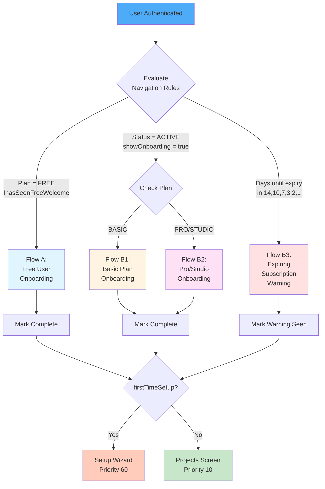
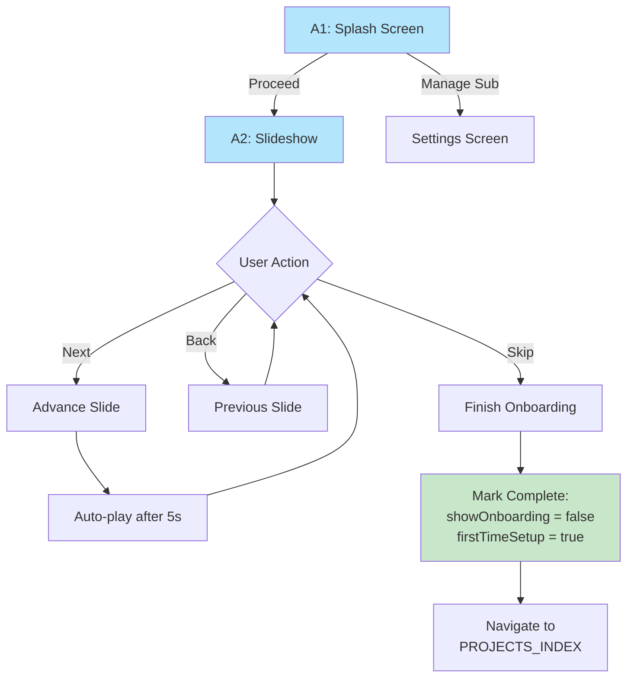
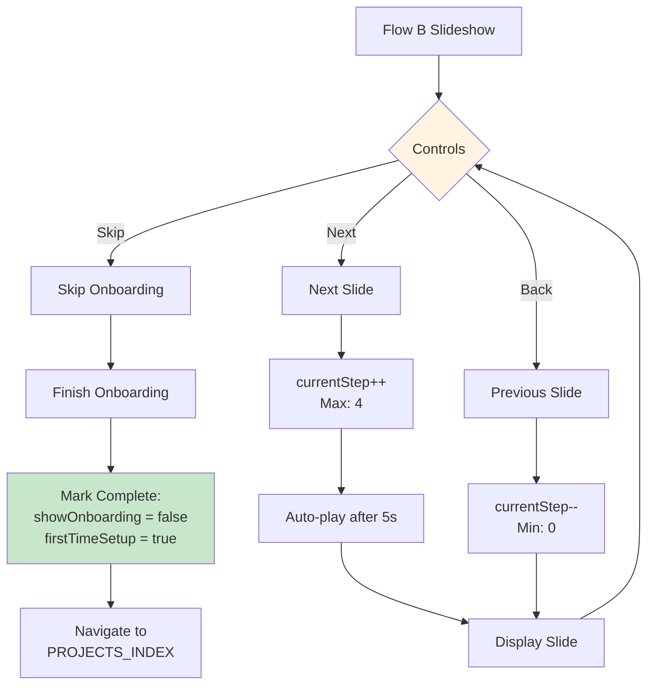
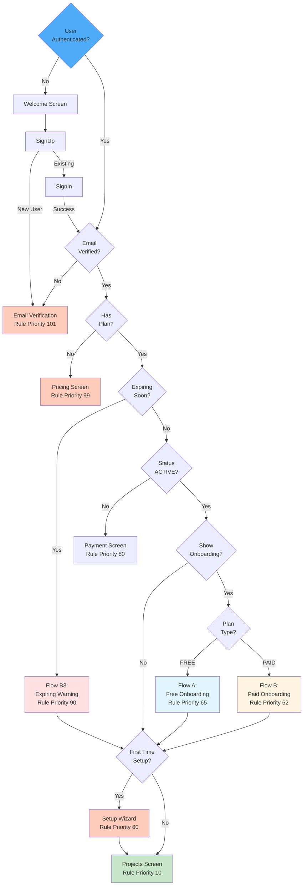

# User Onboarding - Complete Flows & Journeys

## Table of Contents

1. [Overview](#overview)
2. [Onboarding Flow Types](#onboarding-flow-types)
3. [Flow A: Free User Onboarding](#flow-a-free-user-onboarding)
4. [Flow B: Paid Plan Onboarding](#flow-b-paid-plan-onboarding)
5. [Flow B3: Expiring Subscription](#flow-b3-expiring-subscription)
6. [Post-Onboarding Setup](#post-onboarding-setup)
7. [Navigation Triggers](#navigation-triggers)
8. [State Management](#state-management)

---

## Overview

Eye-Doo has **4 different onboarding flows** triggered automatically by the navigation guard based on:
- User's subscription plan (FREE vs BASIC/PRO/STUDIO)
- Subscription status (INACTIVE, ACTIVE, TRIALING, EXPIRING)
- First-time setup flags
- User preferences

**Key Features:**
- ✅ Automatic flow selection
- ✅ Skip-able slideshows
- ✅ Auto-play after 5 seconds
- ✅ Progress tracking
- ✅ Non-blocking errors

---

## Onboarding Flow Types



---

## Flow A: Free User Onboarding

### Trigger Conditions

```typescript
// Routing rule priority 65
{
  condition: () => {
    return (
      subscription?.plan === SubscriptionPlan.FREE &&
      !sessionFlags.hasSeenFreeWelcome
    );
  },
  targetRoute: NavigationRoute.ONBOARDING_FREE
}
```

### Flow Steps

**Step 1: A1 Splash Screen**
- Title: "Your Free Account is Ready!"
- Description: Overview of core features
- Buttons:
  - "Manage Subscription" → Settings
  - "Proceed" → Continue to slideshow

**Step 2: A2 Slideshow** (4 slides)

Slide 1: Welcome to Eye-Doo
- Introduction to the platform
- Key benefits

Slide 2: Client Portals
- Share work with clients
- Get feedback

Slide 3: Smart Shot Lists
- Organize shots efficiently
- Track status

Slide 4: Vendor Management
- Manage vendors centrally
- Share information

### User Actions



### State Variables

| Variable | Type | Values | Purpose |
|----------|------|--------|----------|
| `flowStep` | number | 0, 1 | 0 = Splash, 1 = Slides |
| `slideStep` | number | 0-3 | Current slide index |
| `loading` | boolean | true/false | Loading state |
| `error` | AppError \| null | Error object | Error tracking |

---

## Flow B: Paid Plan Onboarding

### Trigger Conditions

```typescript
// Routing rule priority 62
{
  condition: () => {
    return (
      subscription?.status === SubscriptionStatus.ACTIVE &&
      setup?.showOnboarding === true
    );
  },
  targetRoute: NavigationRoute.ONBOARDING_PAID
}
```

### Flow B1: Basic Plan Onboarding

**5 Slides:**
1. Basic: Create a Project
2. Basic: Add a Client
3. Basic: Your Timeline
4. Basic: Add Notes
5. Basic: Get Started

**Features Highlighted:**
- Project creation
- Client management
- Timeline view
- Notes system

### Flow B2: Pro/Studio Plan Onboarding

**5 Slides:**
1. Pro: Client Portals
2. Pro: Smart Shot Lists
3. Pro: Vendor Lists
4. Pro: Custom Branding
5. Pro: Advanced Tools

**Features Highlighted:**
- Client portals
- Shot lists
- Vendor management
- Custom branding
- Advanced analytics

### Flow Controls



### Store State

```typescript
interface OnboardingStore {
  // Flow type
  activeFlow: 'A' | 'B' | null;
  
  // B flow specific
  flowBStep: 'B1' | 'B2' | 'B3' | null;
  
  // Current slide
  currentStep: number;  // 0-4
  
  // Methods
  nextStep: () => void;
  prevStep: () => void;
  resetFlow: () => void;
}
```

---

## Flow B3: Expiring Subscription

### Trigger Conditions

```typescript
// Routing rule priority 90 (highest)
{
  condition: () => {
    return (
      subscription?.plan !== SubscriptionPlan.FREE &&
      subscription?.autoRenew === false &&
      subscription?.endDate &&
      !sessionFlags.hasSeenExpiryWarning &&
      daysUntilExpiry in [14, 10, 7, 3, 2, 1]
    );
  },
  targetRoute: NavigationRoute.ONBOARDING_EXPIRING
}
```

### Warning Messages

**14 days:** "Your subscription renews in 14 days"
**10 days:** "Important: Subscription renews in 10 days"
**7 days:** "⚠️ One week until subscription expires"
**3 days:** "⚠️⚠️ 3 days to renew subscription"
**2 days:** "🚨 2 days left to update payment"
**1 day:** "🚨 LAST DAY to renew subscription"

### Flow Steps

**B3 Splash Screen:**
- Title: "Subscription Notice"
- Warning message (varies by days remaining)
- Data cards:
  - Trial days remaining (if applicable)
  - Auto-renew status (On/Off)
  - Promo code (if available)
- Buttons:
  - "Manage Subscription" → Settings
  - "Proceed" → Mark seen and continue

### State Variables

| Variable | Type | Values | Purpose |
|----------|------|--------|----------|
| `subscription.endDate` | Date | Date | Expiry date |
| `daysUntilExpiry` | number | 1-14 | Days left |
| `hasSeenExpiryWarning` | boolean | true/false | Session flag |

---

## Post-Onboarding Setup

### Setup Wizard Trigger

**Routing rule priority 60**

```typescript
{
  condition: () => {
    return setup?.firstTimeSetup === true;
  },
  targetRoute: NavigationRoute.SETUP_INDEX
}
```

### Setup Steps

**For FREE Users:**
1. Auto-create all lists (non-blocking)
2. Show setup wizard
3. Allow manual creation

**For VERIFIED FREE Users:**
1. Auto-create task list + groups
2. Show setup wizard
3. Allow additional creation

**For PAID Users:**
1. Show setup wizard
2. Guide through manual setup
3. Explain advanced features

### Setup Completion

```typescript
// When setup finishes
{
  firstTimeSetup: false,
  setupWizardCompleted: true,
  setupWizardStep: 0
}
```

Navigate to `PROJECTS_INDEX` → User can now use app

---

## Navigation Triggers

### Complete Routing Decision Tree



---

## State Management

### Zustand Store

**File:** `src/stores/use-onboarding-store.ts`

```typescript
interface OnboardingStore {
  // Current flow
  activeFlow: 'A' | 'B' | null;
  flowBStep: 'B1' | 'B2' | 'B3' | null;
  
  // Slide tracking
  currentStep: number;
  
  // Modal state
  featureModal: {
    isOpen: boolean;
    step: number;
  };
  
  // Actions
  setActiveFlow: (flow: 'A' | 'B' | null) => void;
  setFlowBStep: (step: 'B1' | 'B2' | 'B3' | null) => void;
  nextStep: () => void;
  prevStep: () => void;
  resetFlow: () => void;
}
```

### Firestore Updates

When onboarding completes:

```typescript
// In users/{userId}/setup/{setupId}
{
  showOnboarding: false,           // Hide onboarding next time
  firstTimeSetup: true,            // Trigger setup wizard
  onboardingCompletedDate: now(),  // Track completion
}
```

---

## Screen Components

### Free Onboarding

**File:** `src/app/(onboarding)/free.tsx` or `freeSubscription.tsx`

**Components:**
- `OnboardingFreeScreen` (main)
- `DynamicSplash` (A1 step)
- `Slideshow` (A2 step)
- `Screen` (wrapper)

### Paid Onboarding

**File:** `src/app/(onboarding)/paid.tsx` or `paidSubscription.tsx`

**Components:**
- `OnboardingPaidScreen` (main)
- `DynamicSplash` (paid splash)
- `Slideshow` (B1/B2 slides)
- `Screen` (wrapper)

### Expiring Onboarding

**File:** `src/app/(onboarding)/expiring.tsx` or `expiringSubscription.tsx`

**Components:**
- `OnboardingExpiringSubscriptionScreen` (main)
- `DynamicSplash` (B3 splash)
- `Screen` (wrapper)

---

**Last Updated:** June 22, 2026
**Sources:** onboarding-new.md, welcome-projects.md, GLOBAL-FLOW-B.md
