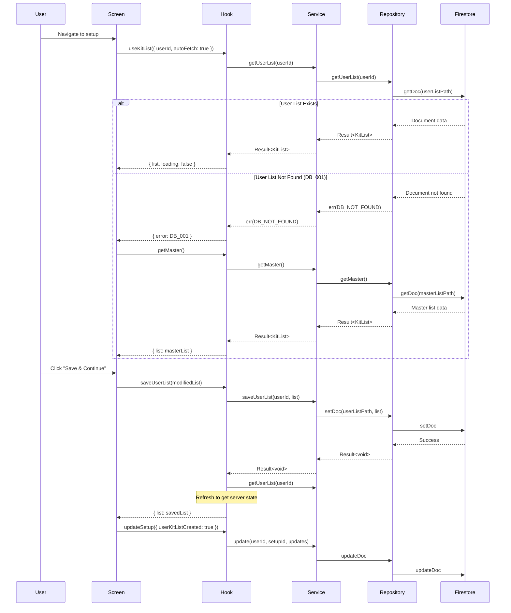
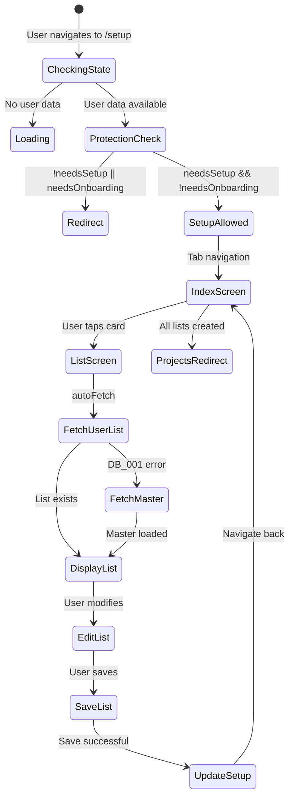
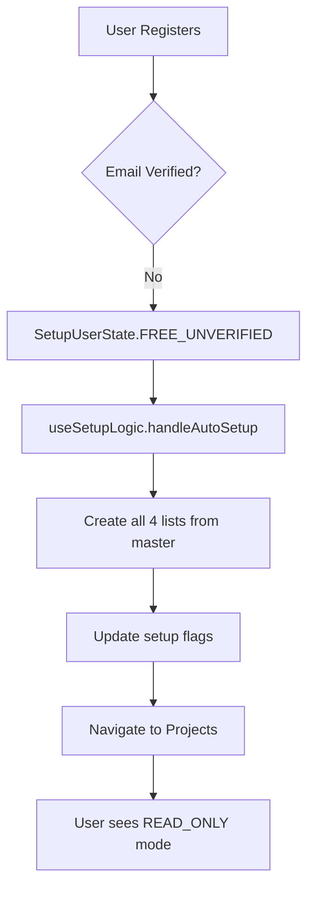
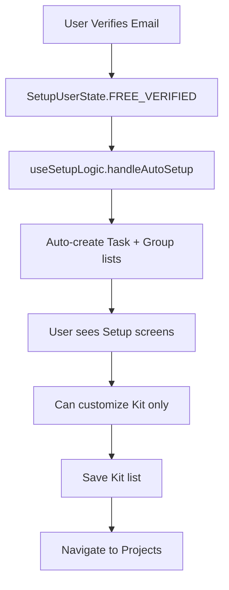
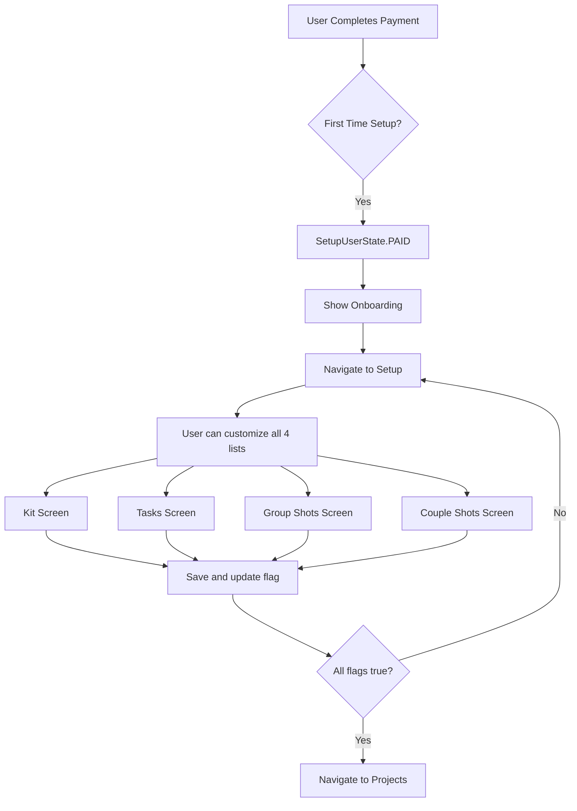
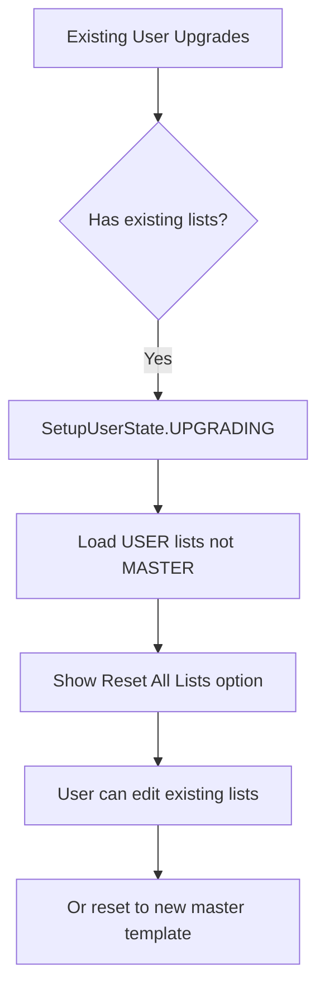
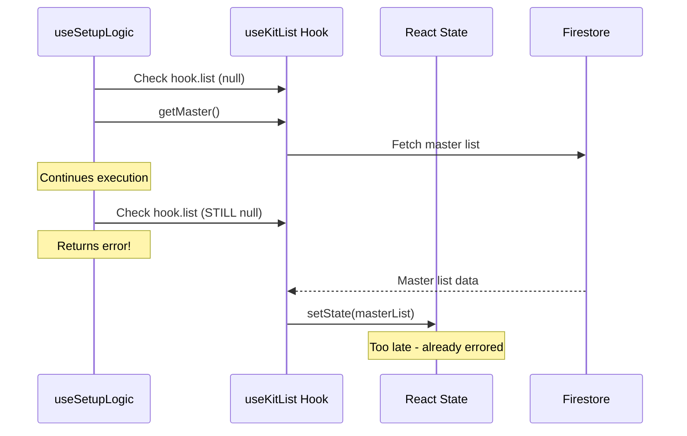
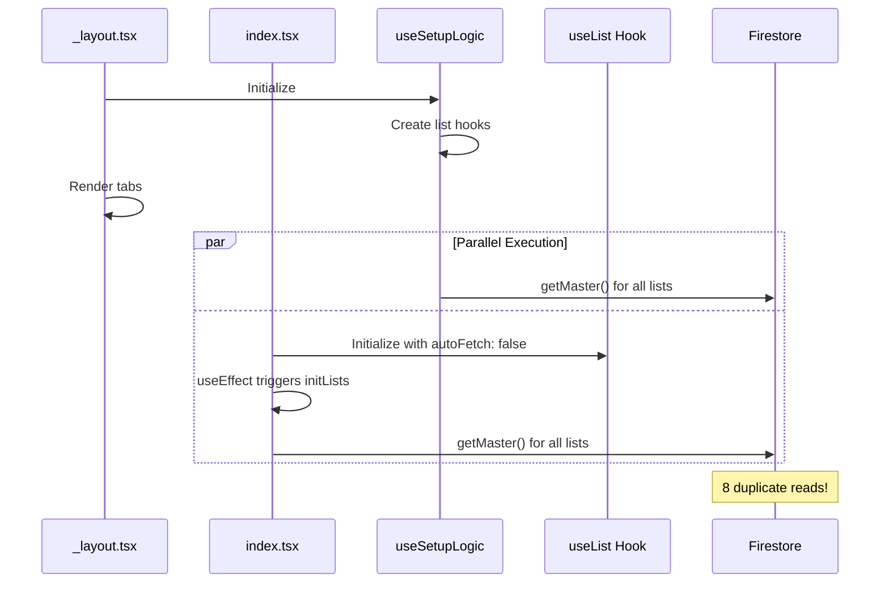
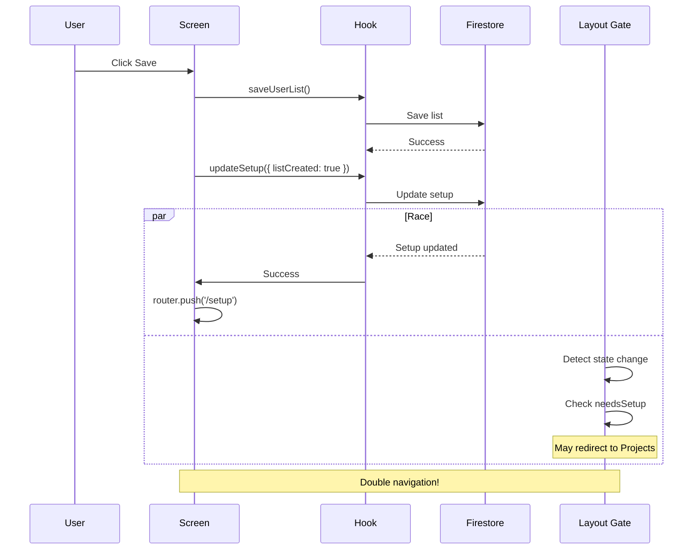

# Setup Module Analysis & Review

**Document Version:** 1.0.0  
**Date:** December 3, 2025  
**Author:** AI Code Analysis  
**Module:** `src/app/(protected)/(setup)/`

---

## Table of Contents

1. [Executive Summary](#executive-summary)
2. [Architecture Overview](#architecture-overview)
3. [Component Breakdown](#component-breakdown)
4. [Data Flow Analysis](#data-flow-analysis)
5. [User State Flows by Subscription](#user-state-flows-by-subscription)
6. [List Data Loading & Saving](#list-data-loading--saving)
7. [Issues & Bugs Identified](#issues--bugs-identified)
8. [Race Conditions](#race-conditions)
9. [Architectural Inconsistencies](#architectural-inconsistencies)
10. [Performance Concerns](#performance-concerns)
11. [Production-Ready Solutions](#production-ready-solutions)
12. [Implementation Priority Matrix](#implementation-priority-matrix)

---

## Executive Summary

The Setup Module is a critical part of the Eye-Doo application that handles the initial list customization flow for new users. It consists of a tab-based layout with screens for Kit, Tasks, Group Shots, and Couple Shots lists.

### Key Findings

| Category                | Critical | High  | Medium | Low   |
| ----------------------- | -------- | ----- | ------ | ----- |
| Race Conditions         | 2        | 1     | 0      | 0     |
| Architecture Violations | 1        | 3     | 2      | 1     |
| Code Quality            | 0        | 2     | 4      | 3     |
| Performance             | 1        | 2     | 1      | 0     |
| **Total**               | **4**    | **8** | **7**  | **4** |

### Overall Risk Assessment: **MEDIUM-HIGH**

The module functions but has several race conditions and architectural inconsistencies that could cause intermittent bugs and make maintenance difficult.

---

## Architecture Overview

### Module Structure

```
src/app/(protected)/(setup)/
├── _layout.tsx          # Tab layout with protection gate
├── index.tsx            # Setup overview/dashboard
├── kit.tsx              # Kit list customization
├── tasks.tsx            # Task list customization
├── group-shots.tsx      # Group shots customization
└── couple-shots.tsx     # Couple shots customization
```

### Dependency Graph

```mermaid
graph TB
    subgraph "Presentation Layer"
        Layout[_layout.tsx]
        Index[index.tsx]
        Kit[kit.tsx]
        Tasks[tasks.tsx]
        GroupShots[group-shots.tsx]
        CoupleShots[couple-shots.tsx]
    end

    subgraph "Hooks Layer"
        UseSetupLogic[useSetupLogic]
        UseUserState[useUserState]
        UseList[useList / use-generic-list]
        UseKitList[useKitList]
        UseTaskList[useTaskList]
        UseGroupShotList[useGroupShotList]
        UseCoupleShotList[useCoupleShotList]
        UseUserSetup[useUserSetup]
        UseUserSubscription[useUserSubscription]
        UseFeatureAccess[useFeatureAccess]
    end

    subgraph "Services Layer"
        KitService[kitListService]
        TaskService[taskListService]
        GroupShotService[groupShotListService]
        CoupleShotService[coupleShotListService]
        UserSetupService[userSetupService]
        UserSubscriptionService[userSubscriptionService]
        SubscriptionService[subscriptionService]
        AuthService[authService]
    end

    subgraph "Stores"
        AuthStore[useAuthStore]
    end

    subgraph "Context"
        SetupContext[SetupContext]
        ServiceContext[ServiceContext]
    end

    Layout --> UseSetupLogic
    Layout --> UseUserState
    Layout --> SetupContext

    Index --> UseList
    Index --> UseUserSetup
    Index --> UseUserSubscription
    Index --> UseFeatureAccess
    Index --> SetupContext

    Kit --> UseKitList
    Kit --> UseUserSetup
    Kit --> UseUserSubscription

    Tasks --> UseTaskList
    Tasks --> UseUserSetup
    Tasks --> UseUserSubscription

    GroupShots --> UseGroupShotList
    GroupShots --> UseUserSetup
    GroupShots --> UseUserSubscription

    CoupleShots --> UseCoupleShotList
    CoupleShots --> UseUserSetup
    CoupleShots --> UseUserSubscription

    UseSetupLogic --> UseKitList
    UseSetupLogic --> UseTaskList
    UseSetupLogic --> UseGroupShotList
    UseSetupLogic --> UseCoupleShotList
    UseSetupLogic --> AuthStore

    UseKitList --> KitService
    UseTaskList --> TaskService
    UseGroupShotList --> GroupShotService
    UseCoupleShotList --> CoupleShotService
    UseUserSetup --> UserSetupService
    UseUserSubscription --> UserSubscriptionService
    UseFeatureAccess --> UserSubscriptionService
    UseFeatureAccess --> SubscriptionService
```



---

## Component Breakdown

### 1. `_layout.tsx` - Tab Layout

**Purpose:** Protection gate and tab navigation for setup screens

**Dependencies:**

- `useSetupLogic` - Setup logic and user state determination
- `useUserState` - Resolved user state from UserStateResolver
- `SetupProvider` - Context for sharing state with child screens

**State Management:**
| State | Source | Description |
|-------|--------|-------------|
| `userState` | `useSetupLogic` | SetupUserState enum |
| `isLoading` | `useSetupLogic` | Loading indicator |
| `state` | `useUserState` | ResolvedUserState |
| `stateLoading` | `useUserState` | State resolution loading |

**Issue Identified:** ⚠️ Dual loading state sources cause inconsistency

### 2. `index.tsx` - Setup Dashboard

**Purpose:** Display setup status cards and allow skip/reset actions

**Dependencies:**

- `useList` (generic) - List management hook
- `useUserSetup` - Setup document management
- `useUserSubscription` - Subscription data
- `useFeatureAccess` - Feature gating
- `useSetupContext` - Shared setup state

**Key Operations:**
| Operation | Trigger | Effect |
|-----------|---------|--------|
| `handleResetLists` | Button press | Fetch master, overwrite user lists |
| `handleSkipAll` | Button press | Create user lists from master defaults |
| `handleSignOut` | Button press | Sign out and navigate to auth |

### 3. Individual List Screens (kit.tsx, tasks.tsx, etc.)

**Common Pattern:**

1. Fetch user list (autoFetch: true)
2. If not found (DB_001 error), fetch master list
3. Allow CRUD operations based on feature access
4. Save list and update setup flags on completion

---

## Data Flow Analysis

### List Data Flow Sequence



### Setup State Flow



---

## User State Flows by Subscription

### Flow Matrix

| User Type         | Email Verified | Plan             | Auto-Setup               | Setup Access | Customization      |
| ----------------- | -------------- | ---------------- | ------------------------ | ------------ | ------------------ |
| FREE_UNVERIFIED   | ❌             | FREE             | ✅ All lists from master | NONE         | None               |
| FREE_VERIFIED     | ✅             | FREE             | ✅ Task + Group only     | LIMITED      | Kit + Couple Shots |
| PAID (first time) | ✅             | BASIC/PRO/STUDIO | ❌ Manual setup          | FULL         | All 4 lists        |
| UPGRADING         | ✅             | BASIC/PRO/STUDIO | ❌ Keep existing         | FULL         | All 4 lists        |

### User Flow: FREE_UNVERIFIED



### User Flow: FREE_VERIFIED



### User Flow: PAID (First Time)



### User Flow: UPGRADING



---

## List Data Loading & Saving

### When Lists Are Loaded

| Screen             | Trigger              | Source         | Condition                          |
| ------------------ | -------------------- | -------------- | ---------------------------------- |
| `index.tsx`        | `useEffect` on mount | Master OR User | Based on `userState === UPGRADING` |
| `kit.tsx`          | `autoFetch: true`    | User first     | Falls back to Master on DB_001     |
| `tasks.tsx`        | `autoFetch: true`    | User first     | Falls back to Master on DB_001     |
| `group-shots.tsx`  | `autoFetch: true`    | User first     | Falls back to Master on DB_001     |
| `couple-shots.tsx` | `autoFetch: true`    | User first     | Falls back to Master on DB_001     |

### Where Lists Are Loaded From

```
Firestore Paths:
├── Master Lists (read-only templates)
│   ├── masterLists/kit/data
│   ├── masterLists/tasks/data
│   ├── masterLists/groupShots/data
│   └── masterLists/coupleShots/data
│
└── User Lists (user-customized)
    └── users/{userId}/lists/
        ├── kit/data
        ├── tasks/data
        ├── groupShots/data
        └── coupleShots/data
```

### When Lists Are Saved

| Action                      | Target    | Trigger                      |
| --------------------------- | --------- | ---------------------------- |
| Manual save                 | User list | "Save & Continue" button     |
| Auto-save (FREE_UNVERIFIED) | User list | `handleAutoSetup()`          |
| Reset                       | User list | "Reset All Lists" button     |
| Skip                        | User list | "Skip & Use Defaults" button |

### Where Lists Are Saved To

```
users/{userId}/lists/{listType}/data
```

All saves:

1. Set `config.source = ListSource.USER_LIST`
2. Set `config.lastModifiedBy = userId`
3. Update `setup.user{ListType}ListCreated = true`

---

## Issues & Bugs Identified

### Critical Issues

#### Issue #1: Race Condition in Auto-Setup

**Location:** `src/hooks/use-setup-logic.ts:228-233`

**Description:** `handleAutoSetup` calls `processList` for all 4 lists in parallel using `Promise.all()`, but `processList` checks if `hook.list` is null and calls `getMaster()`. Since hooks are initialized without `autoFetch`, the list is always null on first call, and `getMaster()` is async - the subsequent check `if (!hook.list)` may still fail.

**Code:**

```typescript
// Line 148-150: hook.list checked BEFORE getMaster resolves
if (!hook.list) {
  await hook.getMaster();
}

// Line 153-165: hook.list checked AFTER getMaster but hook state may not be updated
if (!hook.list) {
  return {
    success: false,
    error: ErrorMapper.createGenericError(...)
  };
}
```

**Impact:** Lists may not be created for FREE_UNVERIFIED users, causing them to be stuck or see empty data.

#### Issue #2: Duplicate Data Fetching

**Location:** `_layout.tsx` and `index.tsx`

**Description:** `_layout.tsx` initializes `useSetupLogic` which creates list hook instances (lines 56-59). Then `index.tsx` creates its own list hook instances (lines 71-80). Both may fetch data independently, causing:

- Duplicate Firestore reads
- Inconsistent state between layout and screen
- Race conditions in state updates

**Code:**

```typescript
// _layout.tsx - useSetupLogic internally uses:
const kitList = useKitList();
const taskList = useTaskList();
// ...

// index.tsx - creates new instances:
const kitHook = useList('useKitList', kitListService, { userId: user?.id, autoFetch: false });
const taskHook = useList('useTaskList', taskListService, { userId: user?.id, autoFetch: false });
```

#### Issue #3: Missing Error Boundaries

**Location:** All setup screens

**Description:** No error boundary wrapping the setup module. If a screen throws during render, the entire app crashes.

### High Priority Issues

#### Issue #4: Inconsistent Hook Usage

**Location:** `index.tsx` vs individual list screens

**Description:**

- `index.tsx` uses generic `useList()` with service injection
- List screens (kit.tsx, etc.) use typed wrappers (`useKitList()`)

This creates:

- Different state management patterns
- Potential type mismatches
- Harder to maintain consistency

#### Issue #5: Navigation Path Hardcoding

**Location:** Multiple screens

**Description:** Navigation uses hardcoded strings instead of `NavigationRoute` constants:

```typescript
// Wrong:
router.push('/(setup)/' as RelativePathString);
router.replace('/(dashboard)/projects' as RelativePathString);

// Correct:
router.push(NavigationRoute.SETUP_INDEX as RelativePathString);
router.replace(NavigationRoute.PROJECTS as RelativePathString);
```

#### Issue #6: Stale Closure in handleSave

**Location:** `kit.tsx:84-94`, similar in other screens

**Description:** The `handleSave` callback captures `list` and `userId` in closure. If these change before the callback executes, stale values may be used.

```typescript
const handleSave = useCallback(async () => {
  if (!list || !userId) return; // list may be stale
  // ...
}, [list, userId, saveUserList, updateSetup]); // deps are correct but closure issue remains
```

#### Issue #7: Missing isMountedRef Check After Async Operations

**Location:** Multiple screens

**Description:** After async operations, screens don't check if component is still mounted before updating state:

```typescript
// Missing check:
if (await saveUserList(listToSave)) {
  await updateSetup({ userKitListCreated: true }); // Component might be unmounted
  router.push('/(setup)/' as RelativePathString);
}
```

### Medium Priority Issues

#### Issue #8: Commented-Out Code

**Location:** All screen files

**Description:** Large blocks of commented-out code (lines 292-520 in index.tsx, similar in others) should be removed for production.

#### Issue #9: Inconsistent Feature Access Checks

**Location:** Across screens

**Description:**

- `tasks.tsx` checks `canUseList` and shows locked state
- `kit.tsx` does NOT check if kit list is available
- `couple-shots.tsx` and `group-shots.tsx` check `canUseList`

#### Issue #10: Missing Test IDs

**Location:** Various components

**Description:** Some screens have `testID` props on components, others don't. This makes testing inconsistent.

#### Issue #11: Setup Context Underutilized

**Location:** `index.tsx`, list screens

**Description:** `SetupContext` provides `userState` and `isLoading`, but screens still independently fetch subscription and setup data, not leveraging the context.

### Low Priority Issues

#### Issue #12: Inconsistent Alert API Usage

**Location:** All screens with sign-out

**Description:** `Alert.alert` is used inconsistently - some with 3 buttons, some with 2, different styles.

#### Issue #13: Missing JSDoc Comments

**Location:** Screen components

**Description:** Screen components lack JSDoc documentation as required by project standards.

---

## Race Conditions

### Race Condition #1: List Hook State Update Timing



**Solution:** See [Solution #1](#solution-1-fix-race-condition-in-auto-setup)

### Race Condition #2: Double Fetch on Mount



**Solution:** See [Solution #2](#solution-2-centralize-list-state-management)

### Race Condition #3: Setup Flag Update vs Navigation



**Solution:** See [Solution #3](#solution-3-coordinate-navigation-with-state-updates)

---

## Architectural Inconsistencies

### Violation #1: Service Access Pattern

**Standard Pattern (from Architecture-Overview.md):**

```typescript
// ✅ CORRECT - Use ServiceFactory or useServices()
import { ServiceFactory } from '@/services/ServiceFactory';
const result = await ServiceFactory.auth.signUp(input);

// OR via context
const services = useServices();
const result = await services.auth.signUp(input);
```

**Actual Pattern in index.tsx:**

```typescript
// ❌ MIXED - Direct import AND context
import {
  kitListService,
  taskListService,
  // ...
} from '@/services/ServiceFactory';

// Also uses context
const services = useServices();
```

### Violation #2: Loading State Management

**Standard Pattern:**

```typescript
// ✅ CORRECT - Use LoadingState<T>
const [state, setState] = useState<LoadingState<Data | null>>(idle());
```

**Actual Pattern:**

```typescript
// ❌ WRONG - Multiple boolean states
const isLoading = featuresLoading || subLoading || setupLoading;
const isLoading = loading || setupLoading || subLoading;
```

### Violation #3: Error Handling Consistency

**Standard Pattern:**

```typescript
// ✅ CORRECT - Always use ErrorContextBuilder
const context = ErrorContextBuilder.fromHook('hookName', 'methodName', userId);
handleError(result.error, context);
```

**Actual Pattern:**

```typescript
// ❌ MISSING - No error context in some places
} catch (err) {
  Alert.alert('Error', 'Failed to reset lists.');
}
```

### Violation #4: Hook Structure

**Standard Pattern:**

```typescript
// ✅ CORRECT - Return consistent shape
return {
  data: state.status === 'success' ? state.data : null,
  loading: state.status === 'loading',
  error: state.status === 'error' ? state.error : null,
  state,
  // ... actions
};
```

**Actual Pattern in screens:**

```typescript
// ❌ INCONSISTENT - Mixing hook returns with local state
const { list, loading, error, getMaster, ... } = useKitList({ userId, autoFetch: true });
// Plus separate:
const [addModalVisible, setAddModalVisible] = useState(false);
```

---

## Performance Concerns

### Concern #1: Excessive Firestore Reads

**Problem:** Each list screen fetches data independently, and the layout also triggers fetches through `useSetupLogic`. For a single session navigating through setup:

```
Reads per full setup flow:
- _layout.tsx initialization: 4 getMaster() calls
- index.tsx initialization: 4 getMaster() or getUserList() calls
- kit.tsx: 1-2 reads
- tasks.tsx: 1-2 reads
- group-shots.tsx: 1-2 reads
- couple-shots.tsx: 1-2 reads

Total: 14-20 Firestore reads per setup session
Optimal: 4-8 reads (one per list type)
```

### Concern #2: Unnecessary Re-renders

**Problem:** Each screen has multiple `useState` calls that trigger independent re-renders:

```typescript
// 5+ state updates can cause 5+ re-renders per action
const [addModalVisible, setAddModalVisible] = useState(false);
// Plus hook states: list, loading, error, setup, subscription, features
```

### Concern #3: Memory Pressure from Duplicate Hook Instances

**Problem:** Same list hooks are instantiated in multiple places:

- `useSetupLogic` (layout)
- `index.tsx` (dashboard)
- Individual list screens

Each instance maintains its own state, increasing memory usage.

---

## Production-Ready Solutions

### Solution #1: Fix Race Condition in Auto-Setup

**Problem:** `handleAutoSetup` checks `hook.list` before `getMaster()` has updated state.

**Solution A: Direct Service Calls (Recommended)**

Replace hook-based fetching with direct service calls that return results synchronously:

```typescript
// src/hooks/use-setup-logic.ts

const processList = useCallback(
  async <TList extends GenericList>(
    service: IListService<TList, any>,
    listCreatedKey: ListCreatedKey,
    userId: string,
  ): Promise<Result<void, AppError>> => {
    const context = ErrorContextBuilder.fromHook('useSetupLogic', 'processList', userId);
    const contextString = ErrorContextBuilder.toString(context);

    try {
      // Check if already created
      const currentSetup = useAuthStore.getState().setup;
      if (currentSetup && currentSetup[listCreatedKey]) {
        return { success: true, value: undefined };
      }

      // Fetch master directly from service
      const masterResult = await service.getMaster();
      if (!masterResult.success) {
        return {
          success: false,
          error: ErrorMapper.createGenericError(
            ErrorCode.DB_READ_ERROR,
            'Failed to load master list',
            `Failed to load ${listCreatedKey}. Please try again.`,
            contextString,
            undefined,
            true,
          ),
        };
      }

      // Create user list from master
      const createResult = await service.createOrResetUserList(userId, masterResult.value);
      if (!createResult.success) {
        return { success: false, error: createResult.error };
      }

      // Update store after successful write
      const updatedSetup = useAuthStore.getState().setup;
      if (updatedSetup) {
        useAuthStore.getState().setSetup({
          ...updatedSetup,
          [listCreatedKey]: true,
        });
      }

      return { success: true, value: undefined };
    } catch (error) {
      return {
        success: false,
        error: ErrorMapper.createGenericError(
          ErrorCode.DB_WRITE_ERROR,
          'Unexpected error',
          `Failed to create ${listCreatedKey}. Please try again.`,
          contextString,
          error,
          true,
        ),
      };
    }
  },
  [],
);
```

**Solution B: Await Hook State Update**

Use a ref-based approach to wait for hook state:

```typescript
const processList = useCallback(
  async <TList, TItem>(
    hook: ListHook<TList, TItem>,
    listCreatedKey: ListCreatedKey,
    userId: string,
  ): Promise<Result<void, AppError>> => {
    // ...existing validation...

    // Get master list
    await hook.getMaster();

    // Wait for state to update (with timeout)
    const list = await waitForHookList(hook, 5000);

    if (!list) {
      return {
        success: false,
        error: ErrorMapper.createGenericError(
          ErrorCode.DB_READ_ERROR,
          'Failed to load master list',
          'Timeout waiting for list data.',
          contextString,
        ),
      };
    }

    // Continue with list creation...
  },
  [],
);

// Helper function
const waitForHookList = async <TList>(
  hook: { list: TList | null },
  timeoutMs: number,
): Promise<TList | null> => {
  const startTime = Date.now();

  while (!hook.list && Date.now() - startTime < timeoutMs) {
    await new Promise(resolve => setTimeout(resolve, 50));
  }

  return hook.list;
};
```

### Solution #2: Centralize List State Management

**Problem:** Multiple components instantiate the same list hooks independently.

**Solution: Lift list state to SetupContext**

```typescript
// src/contexts/SetupContext.tsx

import React, { createContext, useContext, useCallback, useEffect, useMemo } from 'react';
import { SetupUserState } from '@/hooks/use-setup-logic';
import { useKitList, useTaskList, useGroupShotList, useCoupleShotList } from '@/hooks/list-hooks';
import { useAuthStore } from '@/stores/use-auth-store';
import { KitList, KitItem } from '@/domain/user/kit.schema';
import { TaskList, TaskItem } from '@/domain/user/task.schema';
import { GroupShotList, GroupShotItem, CoupleShotList, CoupleShotItem } from '@/domain/user/shots.schema';
import { UseListResult } from '@/hooks/use-generic-list';

interface SetupContextType {
  userState: SetupUserState;
  isLoading: boolean;

  // Centralized list state
  kitList: UseListResult<KitList, KitItem>;
  taskList: UseListResult<TaskList, TaskItem>;
  groupShotList: UseListResult<GroupShotList, GroupShotItem>;
  coupleShotList: UseListResult<CoupleShotList, CoupleShotItem>;

  // Actions
  initializeLists: () => Promise<void>;
  resetAllLists: () => Promise<void>;
}

const SetupContext = createContext<SetupContextType | undefined>(undefined);

export function SetupProvider({
  children,
  userState,
  isLoading: parentLoading
}: {
  children: React.ReactNode;
  userState: SetupUserState;
  isLoading: boolean;
}) {
  const user = useAuthStore(state => state.user);
  const userId = user?.id ?? null;

  // Single source of truth for all list hooks
  const kitList = useKitList({ userId, autoFetch: false });
  const taskList = useTaskList({ userId, autoFetch: false });
  const groupShotList = useGroupShotList({ userId, autoFetch: false });
  const coupleShotList = useCoupleShotList({ userId, autoFetch: false });

  const initializeLists = useCallback(async () => {
    if (!userId) return;

    if (userState === SetupUserState.UPGRADING) {
      // Fetch existing user lists
      await Promise.all([
        kitList.getUserList(),
        taskList.getUserList(),
        groupShotList.getUserList(),
        coupleShotList.getUserList(),
      ]);
    } else {
      // Fetch master lists
      await Promise.all([
        kitList.getMaster(),
        taskList.getMaster(),
        groupShotList.getMaster(),
        coupleShotList.getMaster(),
      ]);
    }
  }, [userId, userState, kitList, taskList, groupShotList, coupleShotList]);

  const resetAllLists = useCallback(async () => {
    // Fetch master lists
    await Promise.all([
      kitList.getMaster(),
      taskList.getMaster(),
      groupShotList.getMaster(),
      coupleShotList.getMaster(),
    ]);

    // Create user lists from masters
    if (kitList.list) await kitList.createOrResetUserList(kitList.list);
    if (taskList.list) await taskList.createOrResetUserList(taskList.list);
    if (groupShotList.list) await groupShotList.createOrResetUserList(groupShotList.list);
    if (coupleShotList.list) await coupleShotList.createOrResetUserList(coupleShotList.list);
  }, [kitList, taskList, groupShotList, coupleShotList]);

  // Auto-initialize on mount
  useEffect(() => {
    if (userId && !parentLoading) {
      initializeLists();
    }
  }, [userId, parentLoading, initializeLists]);

  const isLoading = parentLoading ||
    kitList.loading ||
    taskList.loading ||
    groupShotList.loading ||
    coupleShotList.loading;

  const value = useMemo(() => ({
    userState,
    isLoading,
    kitList,
    taskList,
    groupShotList,
    coupleShotList,
    initializeLists,
    resetAllLists,
  }), [
    userState,
    isLoading,
    kitList,
    taskList,
    groupShotList,
    coupleShotList,
    initializeLists,
    resetAllLists,
  ]);

  return (
    <SetupContext.Provider value={value}>
      {children}
    </SetupContext.Provider>
  );
}

export function useSetupContext() {
  const context = useContext(SetupContext);
  if (context === undefined) {
    throw new Error('useSetupContext must be used within a SetupProvider');
  }
  return context;
}
```

**Updated Screen Usage:**

```typescript
// src/app/(protected)/(setup)/kit.tsx

export default function KitListSetup() {
  const { kitList, userState, isLoading: contextLoading } = useSetupContext();
  const {
    list,
    loading,
    error,
    saveUserList,
    addUserItem,
    deleteUserItem,
    batchUpdateUserItems,
    clearError,
  } = kitList;

  // ... rest of component uses centralized state
}
```

### Solution #3: Coordinate Navigation with State Updates

**Problem:** Navigation can race with state updates causing double redirects.

**Solution: Use a navigation queue pattern**

```typescript
// src/hooks/use-navigation-queue.ts

import { useCallback, useRef } from 'react';
import { useRouter } from 'expo-router';

interface NavigationRequest {
  path: string;
  priority: number;
  timestamp: number;
}

export function useNavigationQueue() {
  const router = useRouter();
  const queueRef = useRef<NavigationRequest[]>([]);
  const processingRef = useRef(false);

  const navigate = useCallback((path: string, priority: number = 0) => {
    queueRef.current.push({
      path,
      priority,
      timestamp: Date.now(),
    });

    if (!processingRef.current) {
      processQueue();
    }
  }, []);

  const processQueue = useCallback(() => {
    if (queueRef.current.length === 0) {
      processingRef.current = false;
      return;
    }

    processingRef.current = true;

    // Sort by priority (highest first), then by timestamp (oldest first)
    queueRef.current.sort((a, b) => {
      if (b.priority !== a.priority) return b.priority - a.priority;
      return a.timestamp - b.timestamp;
    });

    const next = queueRef.current.shift()!;

    // Debounce: wait 100ms to collect any rapid navigation requests
    setTimeout(() => {
      router.replace(next.path as any);
      processingRef.current = false;
    }, 100);
  }, [router]);

  const clearQueue = useCallback(() => {
    queueRef.current = [];
    processingRef.current = false;
  }, []);

  return { navigate, clearQueue };
}
```

### Solution #4: Add Error Boundaries

```typescript
// src/components/common/SetupErrorBoundary.tsx

import React from 'react';
import { View, StyleSheet } from 'react-native';
import { useRouter } from 'expo-router';
import { StandardAppText } from '@/components/common/ui/StandardAppText';
import { StandardAppButton } from '@/components/common/ui/StandardAppButton';
import { useAppStyles } from '@/hooks/use-app-styles';
import { NavigationRoute } from '@/constants/navigation/navigation';

interface Props {
  children: React.ReactNode;
}

interface State {
  hasError: boolean;
  error: Error | null;
}

export class SetupErrorBoundary extends React.Component<Props, State> {
  constructor(props: Props) {
    super(props);
    this.state = { hasError: false, error: null };
  }

  static getDerivedStateFromError(error: Error): State {
    return { hasError: true, error };
  }

  componentDidCatch(error: Error, errorInfo: React.ErrorInfo) {
    if (__DEV__) {
      console.error('[SetupErrorBoundary] Error:', error);
      console.error('[SetupErrorBoundary] Error Info:', errorInfo);
    }
    // TODO: Log to error tracking service
  }

  render() {
    if (this.state.hasError) {
      return <SetupErrorFallback error={this.state.error} />;
    }

    return this.props.children;
  }
}

const SetupErrorFallback: React.FC<{ error: Error | null }> = ({ error }) => {
  const { theme, spacing } = useAppStyles();
  const router = useRouter();

  return (
    <View style={[styles.container, { backgroundColor: theme.colors.background }]}>
      <StandardAppText variant="headlineMedium" style={{ color: theme.colors.error }}>
        Something went wrong
      </StandardAppText>
      <StandardAppText variant="bodyMedium" style={{ marginTop: spacing.md, color: theme.colors.onSurfaceVariant }}>
        We encountered an error while loading setup. Please try again.
      </StandardAppText>
      {__DEV__ && error && (
        <StandardAppText variant="bodySmall" style={{ marginTop: spacing.sm, color: theme.colors.outline }}>
          {error.message}
        </StandardAppText>
      )}
      <StandardAppButton
        mode="contained"
        onPress={() => router.replace(NavigationRoute.PROJECTS as any)}
        style={{ marginTop: spacing.xl }}
      >
        Go to Projects
      </StandardAppButton>
    </View>
  );
};

const styles = StyleSheet.create({
  container: {
    flex: 1,
    justifyContent: 'center',
    alignItems: 'center',
    padding: 20,
  },
});
```

**Usage in \_layout.tsx:**

```typescript
import { SetupErrorBoundary } from '@/components/common/SetupErrorBoundary';

export default function SetupLayout() {
  // ...existing code...

  return (
    <SetupErrorBoundary>
      <SetupProvider value={{ userState, isLoading }}>
        <Tabs>
          {/* ...tabs... */}
        </Tabs>
      </SetupProvider>
    </SetupErrorBoundary>
  );
}
```

### Solution #5: Standardize Navigation Routes

**Create a navigation helper:**

```typescript
// src/utils/navigation/setup-navigation.ts

import { router, RelativePathString } from 'expo-router';
import { NavigationRoute } from '@/constants/navigation/navigation';

export const SetupNavigation = {
  toSetupIndex: () => {
    router.push(NavigationRoute.SETUP_INDEX as unknown as RelativePathString);
  },

  toSetupKit: () => {
    router.push(NavigationRoute.SETUP_KIT as unknown as RelativePathString);
  },

  toSetupTasks: () => {
    router.push(NavigationRoute.SETUP_TASKS as unknown as RelativePathString);
  },

  toSetupGroupShots: () => {
    router.push(NavigationRoute.SETUP_GROUP_SHOTS as unknown as RelativePathString);
  },

  toSetupCoupleShots: () => {
    router.push(NavigationRoute.SETUP_COUPLE_SHOTS as unknown as RelativePathString);
  },

  toProjects: () => {
    router.replace(NavigationRoute.PROJECTS as unknown as RelativePathString);
  },

  toSignIn: () => {
    router.replace(NavigationRoute.SIGN_IN as unknown as RelativePathString);
  },
};
```

### Solution #6: Standardize Loading State

**Create unified loading component for setup:**

```typescript
// src/components/setup/SetupLoadingState.tsx

import React from 'react';
import { View, ActivityIndicator, StyleSheet } from 'react-native';
import { StandardAppText } from '@/components/common/ui/StandardAppText';
import { useAppStyles } from '@/hooks/use-app-styles';

interface SetupLoadingStateProps {
  message?: string;
  testID?: string;
}

export const SetupLoadingState: React.FC<SetupLoadingStateProps> = ({
  message = 'Loading...',
  testID = 'setup-loading',
}) => {
  const { theme, spacing } = useAppStyles();

  return (
    <View
      style={[styles.container, { backgroundColor: theme.colors.background }]}
      testID={testID}
    >
      <ActivityIndicator size="large" color={theme.colors.primary} />
      <StandardAppText
        variant="bodyLarge"
        style={[styles.message, { color: theme.colors.onBackground, marginTop: spacing.md }]}
      >
        {message}
      </StandardAppText>
    </View>
  );
};

const styles = StyleSheet.create({
  container: {
    flex: 1,
    justifyContent: 'center',
    alignItems: 'center',
  },
  message: {
    textAlign: 'center',
  },
});
```

---

## Implementation Priority Matrix

| Priority | Issue                        | Solution          | Effort | Impact |
| -------- | ---------------------------- | ----------------- | ------ | ------ |
| **P0**   | Race condition in auto-setup | Solution #1A      | Medium | High   |
| **P0**   | Duplicate data fetching      | Solution #2       | High   | High   |
| **P1**   | Navigation race condition    | Solution #3       | Medium | Medium |
| **P1**   | Missing error boundaries     | Solution #4       | Low    | High   |
| **P2**   | Hardcoded navigation paths   | Solution #5       | Low    | Medium |
| **P2**   | Inconsistent loading states  | Solution #6       | Low    | Medium |
| **P3**   | Commented-out code           | Delete            | Low    | Low    |
| **P3**   | Missing JSDoc                | Add documentation | Medium | Low    |
| **P3**   | Inconsistent test IDs        | Add testID props  | Low    | Low    |

### Implementation Order

1. **Phase 1 (Critical - Week 1)**
   - Implement Solution #1A (fix race condition)
   - Implement Solution #4 (error boundaries)

2. **Phase 2 (High - Week 2)**
   - Implement Solution #2 (centralize state)
   - Implement Solution #3 (navigation queue)

3. **Phase 3 (Medium - Week 3)**
   - Implement Solution #5 (navigation helpers)
   - Implement Solution #6 (loading state)
   - Remove commented code

4. **Phase 4 (Polish - Week 4)**
   - Add JSDoc documentation
   - Add consistent test IDs
   - Performance optimization

---

## Appendix: File-by-File Issues Summary

### `_layout.tsx`

- [ ] Dual loading state sources
- [ ] `useSetupLogic` creates unused hook instances
- [ ] Commented-out code block (lines 38-49)

### `index.tsx`

- [ ] Inconsistent hook usage (generic vs typed)
- [ ] Missing isMountedRef cleanup
- [ ] Hardcoded navigation paths
- [ ] Large commented-out code block (293-520)
- [ ] Missing error context in catch blocks
- [ ] Missing test IDs on some components

### `kit.tsx`

- [ ] No `canUseList` check (unlike other screens)
- [ ] Stale closure in handleSave
- [ ] Hardcoded navigation paths
- [ ] Large commented-out code block
- [ ] Missing isMountedRef check

### `tasks.tsx`

- [ ] Stale closure in handleSave
- [ ] Hardcoded navigation paths
- [ ] Large commented-out code block
- [ ] Missing isMountedRef check

### `group-shots.tsx`

- [ ] Stale closure in handleSave
- [ ] Hardcoded navigation paths
- [ ] Large commented-out code block
- [ ] Missing isMountedRef check
- [ ] Unused import (NavigationRoute)

### `couple-shots.tsx`

- [ ] Stale closure in handleSave
- [ ] Hardcoded navigation paths
- [ ] Large commented-out code block
- [ ] Missing isMountedRef check

---

_Document generated for code review and improvement planning purposes._
