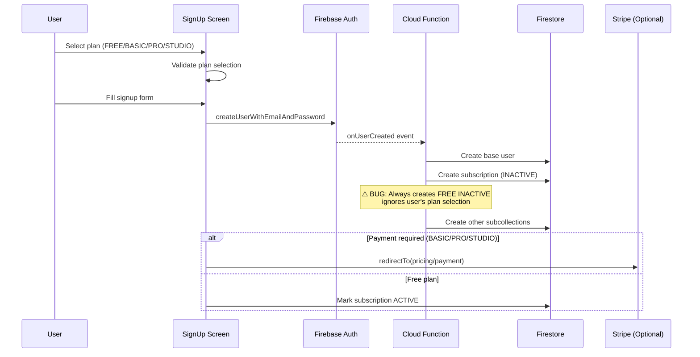
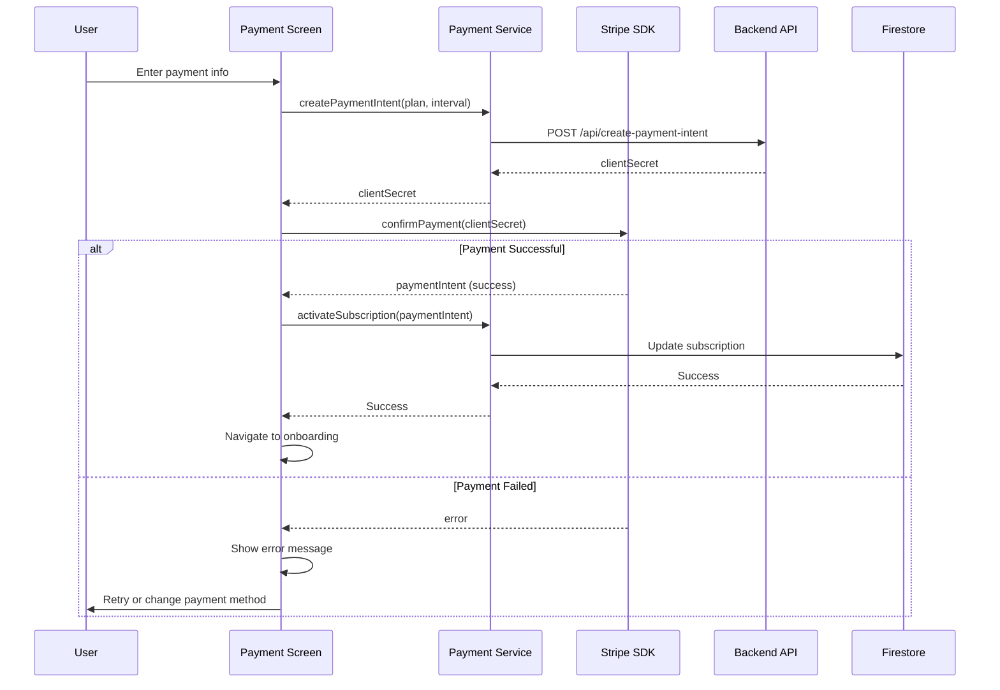
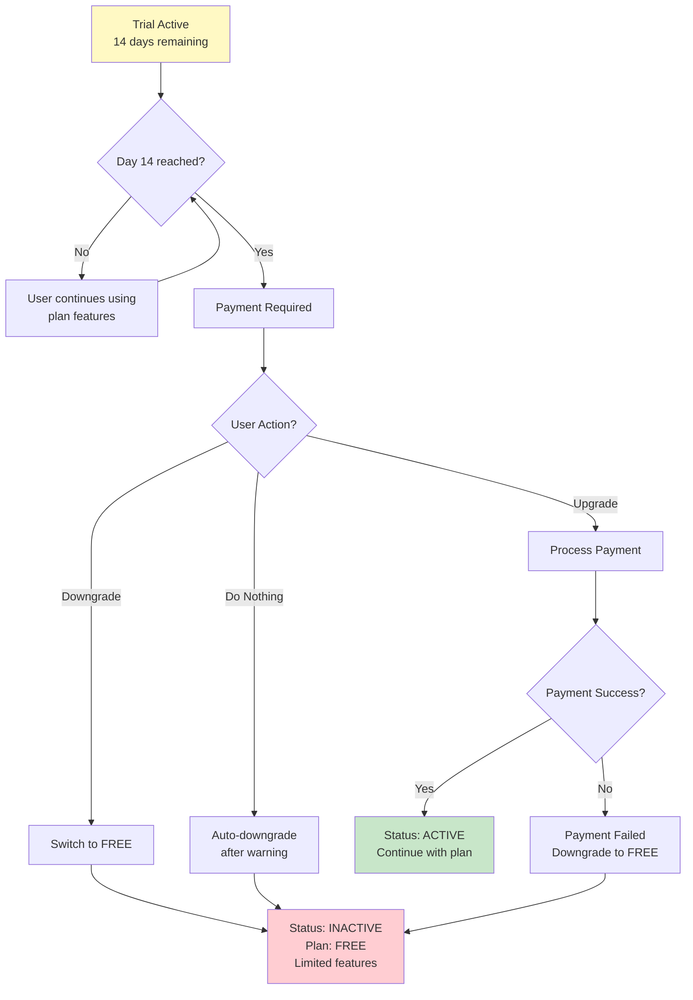

# Subscription & Pricing System - Comprehensive Guide

## Table of Contents

1. [Overview](#overview)
2. [Subscription Plans](#subscription-plans)
3. [Pricing Structure](#pricing-structure)
4. [Subscription Lifecycle](#subscription-lifecycle)
5. [Payment Processing](#payment-processing)
6. [Trial System](#trial-system)
7. [Plan Features](#plan-features)
8. [Billing Management](#billing-management)
9. [Issues & Gaps](#issues--gaps)

---

## Overview

Eye-Doo offers a freemium subscription model with 4 plans:
- **FREE** - No cost, limited features
- **BASIC** - $9.99/month, standard features
- **PRO** - $19.99/month, advanced features
- **STUDIO** - $49.99/month, all features

**Architecture:**
- Server-side subscription creation with Cloud Functions
- Client-side plan selection during signup
- Stripe integration for payments
- Real-time subscription status updates

---

## Subscription Plans

### FREE Plan

**Cost:** $0/month (no payment required)

**Activation:** Automatic on signup

**Status:** `INACTIVE` initially (becomes `ACTIVE` on signup completion)

**Features:**
- 1 project
- Solo user (no collaborators)
- 1 GB storage
- Basic support
- Core features only

**Limitations:**
- No advanced features
- No priority support
- No custom domain
- Limited API access

**Best For:** Individuals testing the platform

---

### BASIC Plan

**Cost:** $9.99/month or $99.90/year (save 17%)

**Billing Cycles:** Monthly or Annual

**Trial:** 14 days free

**Activation:** 
- After payment succeeds
- Or automatically after 14-day trial

**Status:** `TRIALING` (trial) → `ACTIVE` (paid)

**Features:**
- Up to 5 projects
- Up to 5 collaborators
- 50 GB storage
- Email support
- Standard features
- API access

**Billing:**
- Auto-renewal enabled by default
- Can be cancelled anytime
- Prorated refunds available

**Best For:** Small teams and freelancers

---

### PRO Plan

**Cost:** $19.99/month or $199.90/year (save 17%)

**Billing Cycles:** Monthly or Annual

**Trial:** 14 days free

**Activation:**
- After payment succeeds
- Or automatically after 14-day trial

**Status:** `TRIALING` (trial) → `ACTIVE` (paid)

**Features:**
- Unlimited projects
- Up to 20 collaborators
- 500 GB storage
- Priority email support
- Advanced features:
  - Custom branding
  - Advanced analytics
  - Team management
- Full API access

**Billing:**
- Auto-renewal enabled by default
- Can be cancelled anytime
- Prorated refunds available

**Best For:** Growing teams and agencies

**Recommended:** Default plan during signup

---

### STUDIO Plan

**Cost:** $49.99/month or $499.90/year (save 17%)

**Billing Cycles:** Monthly or Annual

**Trial:** 14 days free

**Activation:**
- After payment succeeds
- Or automatically after 14-day trial

**Status:** `TRIALING` (trial) → `ACTIVE` (paid)

**Features:**
- Unlimited projects
- Up to 100 collaborators
- 2 TB storage
- 24/7 phone + email support
- Enterprise features:
  - Custom domain
  - White-label options
  - Advanced integrations
  - SSO/SAML
- Unlimited API access

**Billing:**
- Auto-renewal enabled by default
- Can be cancelled anytime
- Prorated refunds available

**Best For:** Large enterprises and studios

---

## Pricing Structure

### Monthly Pricing

| Plan | Monthly | Annual | Savings |
|------|---------|--------|----------|
| FREE | $0 | - | - |
| BASIC | $9.99 | $99.90 | $19.98/yr (17%) |
| PRO | $19.99 | $199.90 | $39.98/yr (17%) |
| STUDIO | $49.99 | $499.90 | $99.98/yr (17%) |

### Discount Calculations

**Annual discount:** 17% off monthly rate
- BASIC: $9.99 × 12 = $119.88 → $99.90 (save $19.98)
- PRO: $19.99 × 12 = $239.88 → $199.90 (save $39.98)
- STUDIO: $49.99 × 12 = $599.88 → $499.90 (save $99.98)

**Promo codes:** Supported in payment flow

**Stripe Integration:**
- Amount stored in cents (e.g., $19.99 = 1999 cents)
- Stripe handles currency conversion
- Recurring payments via subscriptions API

---

## Subscription Lifecycle

### Signup → Subscription Creation



### Free Plan Flow

```
User Signup (FREE selected)
  ↓
Cloud Function creates subscription (INACTIVE)
  ↓
Signup completes (auto-activate)
  ↓
Subscription status: ACTIVE
  ↓
Access granted immediately
```

### Paid Plan Flow

```
User Signup (BASIC/PRO/STUDIO selected)
  ↓
Cloud Function creates subscription (INACTIVE)
  ↓
Redirect to Payment Screen
  ↓
User enters payment info (Stripe)
  ↓
Payment succeeds
  ↓
Cloud Function activates subscription
  ↓
Subscription status: ACTIVE (start date set)
  ↓
Access granted
```

### Trial Activation

```
Paid plan selected
  ↓
Payment page loads
  ↓
User clicks "Start 14-day trial" (optional)
  ↓
No payment required
  ↓
Subscription status: TRIALING
  ↓
trialEndsAt: currentDate + 14 days
  ↓
Access granted for 14 days
  ↓
After 14 days → Payment required or downgrade to FREE
```

---

## Payment Processing

### Payment Flow



### Subscription Activation After Payment

```typescript
// Update fields:
{
  status: SubscriptionStatus.ACTIVE,
  isActive: true,
  transactionId: paymentIntent.id,
  billingCycle: interval,  // MONTHLY or ANNUAL
  startDate: now(),
  nextBillingDate: calculateNextBillingDate(interval),
  endDate: calculateEndDate(interval),
  autoRenew: true,
  lastPaymentDate: now()
}
```

---

## Trial System

### Trial Activation

**Trigger:** User selects BASIC/PRO/STUDIO plan

**Duration:** 14 days

**Automatic Activation:**
- No payment required
- Subscription status: `TRIALING`
- `trialEndsAt` set to current date + 14 days
- `isActive: true` (can use features)

**Trial Expiration:**
- After 14 days, user must upgrade to paid
- Or account reverts to FREE plan
- Downgrade happens automatically

### Trial Conversion



### Trial Status Checks

**Check Points:**
1. **14 days remaining:** Show warning notification
2. **7 days remaining:** Show reminder in UI
3. **3 days remaining:** Show prominent banner
4. **1 day remaining:** Show urgent message
5. **Day 14:** Expire trial, show payment screen

---

## Billing Management

### Auto-Renewal

**Enabled by default** for all paid plans

**Renewal Dates:**
- Monthly: Same day each month
- Annual: Same day each year

**Cancellation:**
- Available in settings
- Takes effect at end of current billing period
- Access continues until end date

### Billing Dates

```typescript
// Monthly billing
startDate: 2026-06-22
nextBillingDate: 2026-07-22
billingCycle: MONTHLY

// Annual billing  
startDate: 2026-06-22
nextBillingDate: 2027-06-22
billingCycle: ANNUAL
```

### Invoice Management

**Stored in:** `users/{userId}/payments/{paymentId}`

**Contains:**
- Amount charged
- Plan selected
- Billing cycle
- Payment method
- Transaction ID (Stripe)
- Timestamp

**User Access:**
- Accessible in billing settings
- Email receipt on payment
- Downloadable PDF invoices (via Stripe)

---

## Issues & Gaps

### 🔴 Critical Issues

#### 1. Plan Selection Not Persisted

**Issue:** User selects plan during signup, but it's never saved

**Impact:** Cloud Function always creates FREE INACTIVE

**Fix Needed:**
- Pass selected plan to Cloud Function via custom claims
- Or store in signup request
- Or fetch from form data before function runs

#### 2. No Trial Activation Logic

**Issue:** Trial period selected but never activated

**Impact:** Users don't get trial access

**Fix Needed:**
- Implement trial activation in payment flow
- Set `trialEndsAt` on subscription creation
- Set `status: TRIALING` during trial

#### 3. Missing Payment Integration

**Issue:** Payment flow partially implemented

**Impact:** Can't complete paid plan signup

**Fix Needed:**
- Complete Stripe integration
- Handle payment success/failure
- Activate subscription on successful payment

### 🟡 Missing Features

#### 1. Promo Code System

- Designed but not fully implemented
- Validation logic exists
- Needs UI input field
- Needs discount application

#### 2. Subscription Management

- Cancel subscription
- Update billing cycle
- View invoice history
- Update payment method

#### 3. Trial Expiration Handling

- No automatic downgrade to FREE
- No warning notifications
- No payment reminders

### 🟠 Areas for Improvement

#### 1. Hardcoded Prices

Prices currently hardcoded in constants

**Improvement:** Fetch from Firestore at startup

#### 2. Error Handling

Payment errors need better handling

**Improvement:**
- Retry logic for failed payments
- Clear error messages
- Recovery options

#### 3. Analytics

Payment flow needs better tracking

**Improvement:**
- Track plan selection
- Track payment success/failure
- Track trial conversions
- Track churn reasons

---

**Last Updated:** June 22, 2026
**Sources:** New-FreeTrial.md, New-ProVersion.md, subscription.md
