# Add Item and Save User List KitList Flow Documentation

## Overview

This document traces two related flows for managing KitList items:
1. **addUserItem**: Adding a new item to a user's KitList
2. **saveUserList**: Saving/updating the entire user KitList

Both operations work together, as `addUserItem` internally calls `saveUserList` after adding the item to the list.

---

## Table of Contents

1. [High-Level Flow](#high-level-flow)
2. [Detailed Sequence Diagrams](#detailed-sequence-diagrams)
   - [Add Item Flow](#add-item-flow-sequence)
   - [Save List Flow](#save-list-flow-sequence)
3. [UI Component Structure](#ui-component-structure)
4. [Data Structures](#data-structures)
5. [Input Validation](#input-validation)
6. [Sanitization Process](#sanitization-process)
7. [Loading States](#loading-states)
8. [Error Handling](#error-handling)
9. [Optimistic Updates](#optimistic-updates)
10. [File Structure & Function Calls](#file-structure--function-calls)
11. [Hooks Usage](#hooks-usage)
12. [Ports & Adapters](#ports--adapters)
13. [Simple Explanation](#simple-explanation)

---

## High-Level Flow

### Add Item Flow

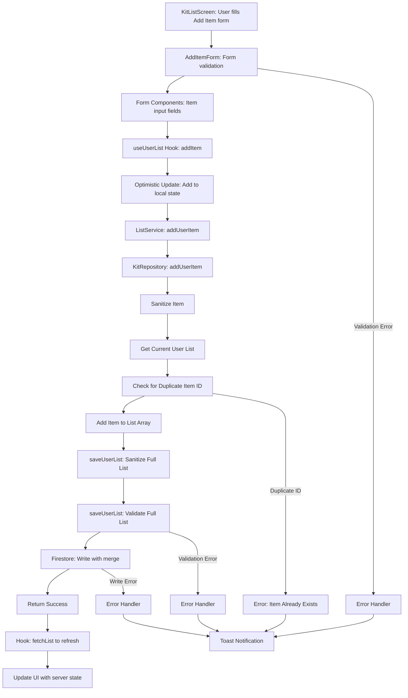

### Save List Flow

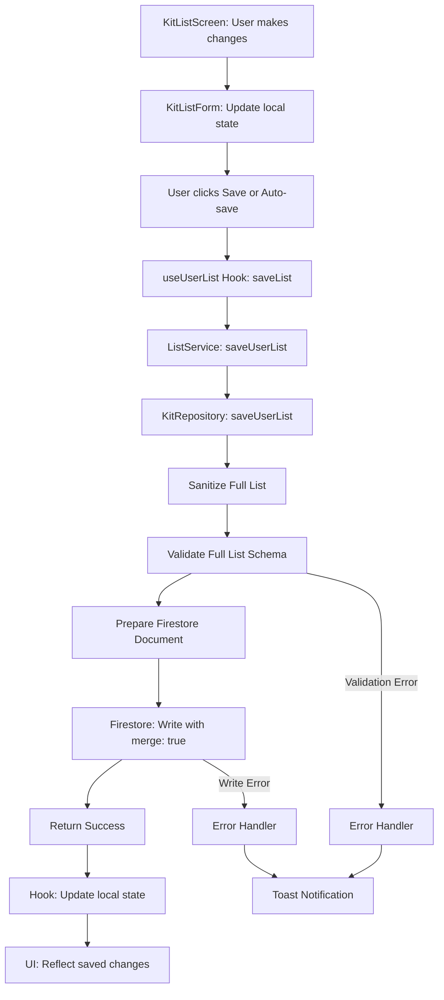

---

## Detailed Sequence Diagrams

### Add Item Flow Sequence

```mermaid
sequenceDiagram
    participant UI as KitListScreen Component
    participant Form as AddItemForm Component
    participant Inputs as Form Input Components
    participant Hook as useUserList Hook
    participant Service as ListService
    participant Repo as FirestoreListRepository
    participant Sanitize as Sanitization Helpers
    participant Validate as Validation Helpers
    participant Firestore as Cloud Firestore
    participant ErrorHandler as Error Handler
    participant Logger as Logging Service
    participant Toast as Toast UI

    UI->>Form: User fills Add Item form
    Form->>Inputs: Render itemName, itemDescription, quantity, categoryId
    User->>Inputs: Enter item details
    Inputs->>Form: Update form state
    
    User->>Form: Click "Add Item" button
    Form->>Form: Client-side validation (optional)
    alt Client-side validation fails
        Form->>UI: Show field errors
    else Client-side validation passes
        Form->>Form: Generate item ID (UUID)
        Form->>Hook: addItem(kitItem, optimistic=true)
        activate Hook
        
        Note over Hook: Optimistic Update (if enabled)
        alt Optimistic Update Enabled
            Hook->>Hook: Get previous list from state
            Hook->>Hook: Create optimistic list with new item
            Hook->>Hook: setList(optimisticList)
            Hook->>UI: UI updates immediately (optimistic)
        end
        
        Hook->>Hook: setError(null)
        Hook->>Service: addUserItem(userId, item)
        activate Service
        
        Service->>Repo: addUserItem(userId, item)
        activate Repo
        
        Repo->>Repo: Build Error Context
        Repo->>Sanitize: sanitizeItem(item)
        activate Sanitize
        Sanitize->>Sanitize: sanitizeString(itemName)
        Sanitize->>Sanitize: sanitizeString(itemDescription)
        Sanitize-->>Repo: Return sanitizedItem
        deactivate Sanitize
        
        Repo->>Repo: getUserList(userId)
        Repo->>Firestore: getDoc(doc('users', userId, 'lists', 'kitList'))
        activate Firestore
        alt List Not Found
            Firestore-->>Repo: Document doesn't exist
            Repo-->>Service: Return DB_NOT_FOUND Error
            Service-->>Hook: Return Error Result
            Hook->>Hook: Rollback optimistic update
            Hook->>ErrorHandler: handleError(error)
            Hook-->>Form: Return false
        else List Found
            Firestore-->>Repo: Return DocumentSnapshot
            Repo->>Validate: validateList(snapshot.data())
            Validate-->>Repo: Return validated KitList
            Repo->>Sanitize: sanitizeList(validatedList, userId)
            Sanitize-->>Repo: Return sanitized list
            Repo-->>Repo: Return listResult
        end
        deactivate Firestore
        
        Repo->>Repo: Check for duplicate item ID
        Note over Repo: if (listResult.value.items.some(existing => existing.id === sanitizedItem.id))
        alt Duplicate Item ID Found
            Repo-->>Service: Return VALIDATION_FAILED Error
            Service-->>Hook: Return Error Result
            Hook->>Hook: Rollback optimistic update (if enabled)
            Hook->>ErrorHandler: handleError(error)
            ErrorHandler->>Logger: Log error
            ErrorHandler->>Toast: Show "Item already exists" message
            Hook-->>Form: Return false
        else No Duplicate
            Repo->>Repo: Create updatedList
            Note over Repo: items: [...listResult.value.items, sanitizedItem]
            
            Repo->>Repo: saveUserList(userId, updatedList)
            Note over Repo: Calls saveUserList internally
            activate Repo
            
            Repo->>Sanitize: sanitizeList(updatedList, userId)
            activate Sanitize
            Sanitize->>Sanitize: Sanitize all items in list
            Sanitize->>Sanitize: Calculate metadata (totalCategories, totalItems)
            Sanitize-->>Repo: Return sanitized list
            deactivate Sanitize
            
            Repo->>Validate: validateList(sanitizedList)
            activate Validate
            Validate->>Validate: Check with kitListSchema
            Validate->>Validate: Validate config, categories, items
            alt Validation Fails
                Validate-->>Repo: Return ValidationError
                Repo-->>Service: Return Error Result
                Service-->>Hook: Return Error Result
                Hook->>Hook: Rollback optimistic update
                Hook->>ErrorHandler: handleError(error)
                Hook-->>Form: Return false
            else Validation Success
                Validate-->>Repo: Return validated KitList
            end
            deactivate Validate
            
            Repo->>Repo: toFirestoreDoc(validatedList)
            Note over Repo: Extract config, categories, items
            
            Repo->>Firestore: setDoc(doc, firestoreDoc, { merge: true })
            activate Firestore
            alt Write Fails
                Firestore-->>Repo: Error (permission, network, etc.)
                Repo->>Repo: ErrorMapper.fromFirestore(error)
                Repo-->>Service: Return FirestoreError Result
                Service-->>Hook: Return Error Result
                Hook->>Hook: Rollback optimistic update
                Hook->>ErrorHandler: handleError(error)
                ErrorHandler->>Logger: Log error with context
                ErrorHandler->>Toast: Show user-friendly message
                Hook-->>Form: Return false
            else Write Success
                Firestore-->>Repo: Success
            end
            deactivate Firestore
            
            Repo-->>Repo: Return Success (from saveUserList)
            deactivate Repo
            
            Repo-->>Service: Return sanitizedItem Result
            deactivate Repo
        end
        
        Service-->>Hook: Return Result
        deactivate Service
        
        alt Success
            Hook->>Hook: fetchList() to get server state
            Hook->>Service: getUserList(userId)
            Service->>Repo: getUserList(userId)
            Repo->>Firestore: getDoc(doc)
            Firestore-->>Repo: Return DocumentSnapshot
            Repo->>Validate: validateList(snapshot.data())
            Validate-->>Repo: Return validated KitList
            Repo->>Sanitize: sanitizeList(validatedList, userId)
            Sanitize-->>Repo: Return sanitized list
            Repo-->>Service: Return KitList Result
            Service-->>Hook: Return KitList Result
            Hook->>Hook: setList(updatedList)
            Hook-->>Form: Return true
            Form->>UI: Update UI (item added, form cleared)
        end
        deactivate Hook
    end
```

### Save List Flow Sequence

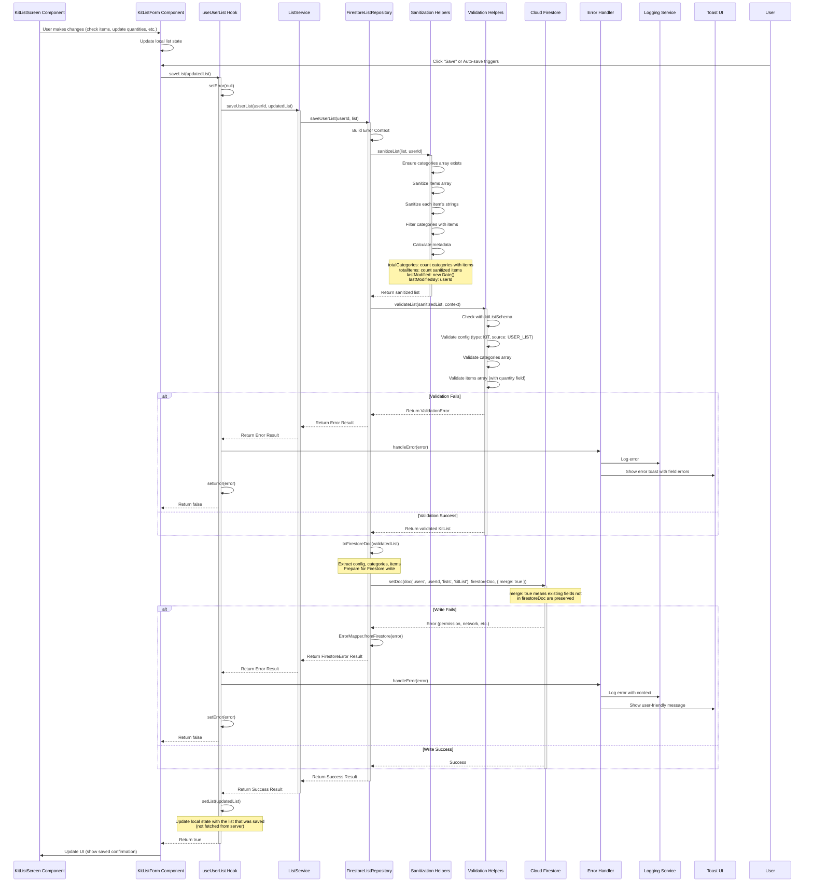

---

## UI Component Structure

### Component Hierarchy

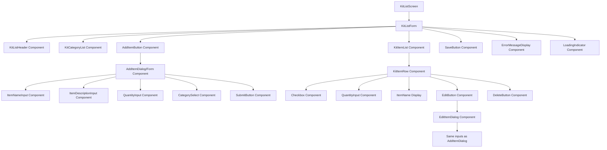

### Placeholder Components

#### KitListScreen Component

**Location**: `src/app/(features)/kit/index.tsx` (placeholder)

**Responsibilities**:
- Container for kit list management
- Navigation setup
- User context (userId)
- Error boundary wrapping
- Layout and styling

**Props**:
```typescript
interface KitListScreenProps {
  navigation: NavigationProp;
  userId: string;
}
```

**Usage**:
```typescript
const KitListScreen = ({ navigation, userId }: KitListScreenProps) => {
  const kitService = serviceFactory.kitService;
  const { list, loading, error, addItem, saveList, clearError } = useUserList(
    kitService,
    userId,
    { autoFetch: true, enableRealtime: true }
  );

  return (
    <KitListForm
      list={list}
      loading={loading}
      error={error}
      onAddItem={handleAddItem}
      onSave={handleSave}
      onClearError={clearError}
    />
  );
};
```

#### AddItemForm Component

**Location**: `src/components/kit/AddItemForm.tsx` (placeholder)

**Responsibilities**:
- Form state management for adding items
- Field validation coordination
- Submission handling
- Item ID generation

**Props**:
```typescript
interface AddItemFormProps {
  onSubmit?: (item: KitItemInput) => Promise<void>;
  onCancel?: () => void;
  categories?: KitCategory[];
  isLoading?: boolean;
}
```

**State**:
```typescript
{
  itemName: string;
  itemDescription: string;
  quantity: number;
  categoryId?: string;
  fieldErrors: Record<string, string>;
}
```

**Behavior**:
- Generates UUID for new item ID
- Validates fields before submission
- Calls `onSubmit` with KitItemInput
- Clears form on success

#### KitListForm Component

**Location**: `src/components/kit/KitListForm.tsx` (placeholder)

**Responsibilities**:
- List state management
- Item list display coordination
- Save action handling
- Auto-save coordination

**Props**:
```typescript
interface KitListFormProps {
  list: KitList | null;
  loading: boolean;
  error: AppError | null;
  onAddItem?: (item: KitItem) => Promise<void>;
  onSave?: (list: KitList) => Promise<void>;
  onClearError?: () => void;
}
```

#### SaveButton Component

**Location**: `src/components/kit/SaveButton.tsx` (placeholder)

**Responsibilities**:
- Display save button
- Show save status
- Trigger save action

**Props**:
```typescript
interface SaveButtonProps {
  onSave: () => Promise<void>;
  disabled?: boolean;
  loading?: boolean;
  hasChanges?: boolean;
}
```

**Behavior**:
- Disabled if no changes or loading
- Shows loading state during save
- Shows success indicator after save
- Auto-save support (debounced)

---

## Data Structures

### KitItem Input Structure

```typescript
// KitItemInput (from kit.schema.ts)
interface KitItemInput {
  itemName: string;                    // Validated: 1-50 chars, trimmed
  itemDescription: string;             // Validated: 1-500 chars, trimmed
  quantity?: number;                    // Validated: integer, min 1, default 1
  categoryId?: string;                  // Optional: category association
}

// KitItem (complete item structure)
interface KitItem {
  id: string;                           // Generated UUID
  categoryId?: string;                  // Optional category association
  itemName: string;                     // Sanitized and validated
  itemDescription: string;              // Sanitized and validated
  quantity: number;                      // Integer, min 1, default 1
  isCustom: boolean;                    // Set to true for user-added items
  isChecked: boolean;                   // Default false
  isDisabled: boolean;                  // Default false
}
```

### KitList Structure (for Save)

```typescript
// KitList (complete structure)
interface KitList {
  config: KitConfig;
  categories: KitCategory[];
  items: KitItem[];                     // Array of items (updated when adding)
  pendingUpdates?: KitPendingUpdate[];
}

// Config metadata (updated during save)
{
  metadata: {
    totalCategories: number;            // Recalculated during sanitize
    totalItems: number;                 // Recalculated during sanitize
    lastModified: Date;                  // Set to current date
    lastModifiedBy: string;             // Set to userId
  };
}
```

### Firestore Document Structure

```typescript
// Document saved to Firestore (via toFirestoreDoc)
{
  config: {
    id: string,
    type: ListType.KIT,
    source: ListSource.USER_LIST,
    audit: AuditMetadata,
    defaultValues: boolean,
    version: string,
    listMetadata: ListMetadata,
    metadata: {
      totalCategories: number,
      totalItems: number,
      lastModified: Timestamp,
      lastModifiedBy: string,
    },
    createdAt: Timestamp,
    updatedAt: Timestamp,
  },
  categories: KitCategory[],
  items: KitItem[],                     // Includes newly added item
}
```

---

## Input Validation

### KitItem Validation

**File**: `src/domain/user/kit.schema.ts`

```typescript
export const kitItemSchema = listBaseItemSchema.extend({
  quantity: z.number()
    .int()
    .min(1, 'Quantity must be at least 1')
    .default(1),
});
```

**Base Item Schema** (`src/domain/common/list-base.schema.ts`):
```typescript
export const listBaseItemSchema = z.object({
  id: idSchema,                        // String, min 1 char
  categoryId: idSchema.optional(),     // Optional category association
  itemName: z.string()
    .min(1, 'Name is required')
    .max(DEFAULTS.TEXT_LENGTHS.NAME, 'Name too long')
    .trim(),
  itemDescription: z.string()
    .min(1, 'Description is required')
    .max(DEFAULTS.TEXT_LENGTHS.DESCRIPTION, 'Description too long')
    .trim(),
  isCustom: z.boolean().default(false),
  isChecked: z.boolean().default(false),
  isDisabled: z.boolean().default(false),
});
```

**Validation Rules**:
- `id`: Required string, min 1 character (UUID generated by form)
- `itemName`: Required, 1-50 characters (default), trimmed
- `itemDescription`: Required, 1-500 characters (default), trimmed
- `quantity`: Integer, minimum 1, defaults to 1
- `categoryId`: Optional string (must be valid category ID if provided)
- `isCustom`: Boolean, defaults to false (set to true for user-added items)
- `isChecked`: Boolean, defaults to false
- `isDisabled`: Boolean, defaults to false

### KitList Validation (for Save)

**File**: `src/domain/user/kit.schema.ts`

```typescript
export const kitListSchema = listBaseWrapperSchema.extend({
  config: kitConfigSchema,
  categories: z.array(kitCategorySchema),
  items: z.array(kitItemSchema),      // Each item validated with kitItemSchema
  pendingUpdates: z.array(kitPendingUpdateSchema),
});
```

**Validation Flow**:

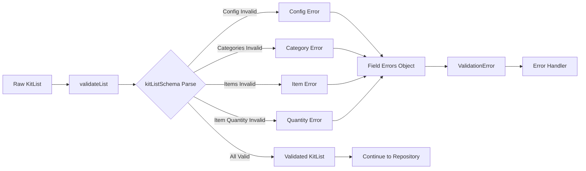

**Additional Validation** (in addUserItem):
- **Duplicate ID Check**: 
  ```typescript
  if (listResult.value.items.some(existing => existing.id === sanitizedItem.id)) {
    return VALIDATION_FAILED error;
  }
  ```

**Error Format**:
```typescript
ValidationError {
  code: ErrorCode.VALIDATION_FAILED,
  message: "Validation failed: ...",
  userMessage: "This item already exists in the list", // For duplicates
  fieldErrors: {
    "items[0].quantity": "Quantity must be at least 1",
    "items[0].itemName": "Name is required",
    "items[0].itemDescription": "Description is required",
  },
  context: "KitRepository.addUserItem",
  retryable: false
}
```

---

## Sanitization Process

### Item Sanitization

**File**: `src/repositories/firestore/firestore-list-repository.ts`

**Function**: `sanitizeItem(item: TItem): TItem`

**Process**:
```typescript
{
  ...item,
  itemName: sanitizeString(item.itemName),              // Trim whitespace
  itemDescription: sanitizeString(item.itemDescription), // Trim whitespace
}
```

**Sanitization Rules**:
- `itemName`: Trimmed (leading/trailing whitespace removed)
- `itemDescription`: Trimmed (leading/trailing whitespace removed)
- `quantity`: No sanitization (already validated as integer)
- Other fields: Preserved as-is

### List Sanitization (for Save)

**File**: `src/repositories/firestore/firestore-list-repository.ts`

**Function**: `sanitizeList(list: TList, lastModifiedBy: string): TList`

**Process**:
1. **Ensure Arrays**: 
   ```typescript
   const categories = Array.isArray(list.categories) ? list.categories : [];
   const items = Array.isArray(list.items) ? sanitizeArray(list.items) : [];
   ```

2. **Sanitize Items**: 
   ```typescript
   const sanitizedItems = items.map(item => this.sanitizeItem(item));
   ```

3. **Filter Categories**: 
   ```typescript
   const categoriesWithItems = categories.filter(category =>
     sanitizedItems.some(item => item.categoryId === category.id)
   );
   ```

4. **Calculate Metadata**:
   ```typescript
   const metadata = {
     ...list.config.metadata,
     totalCategories: categoriesWithItems.length,
     totalItems: sanitizedItems.length,
     lastModified: new Date(),
     lastModifiedBy,
   };
   ```

5. **Return Sanitized List**:
   ```typescript
   return {
     ...list,
     config: {
       ...list.config,
       metadata,
     },
     categories,
     items: sanitizedItems,
   };
   ```

---

## Loading States

### State Transitions

#### Add Item Flow

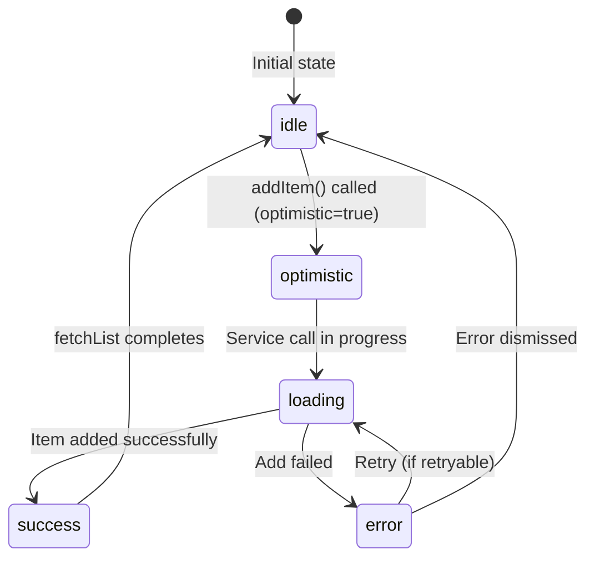

#### Save List Flow

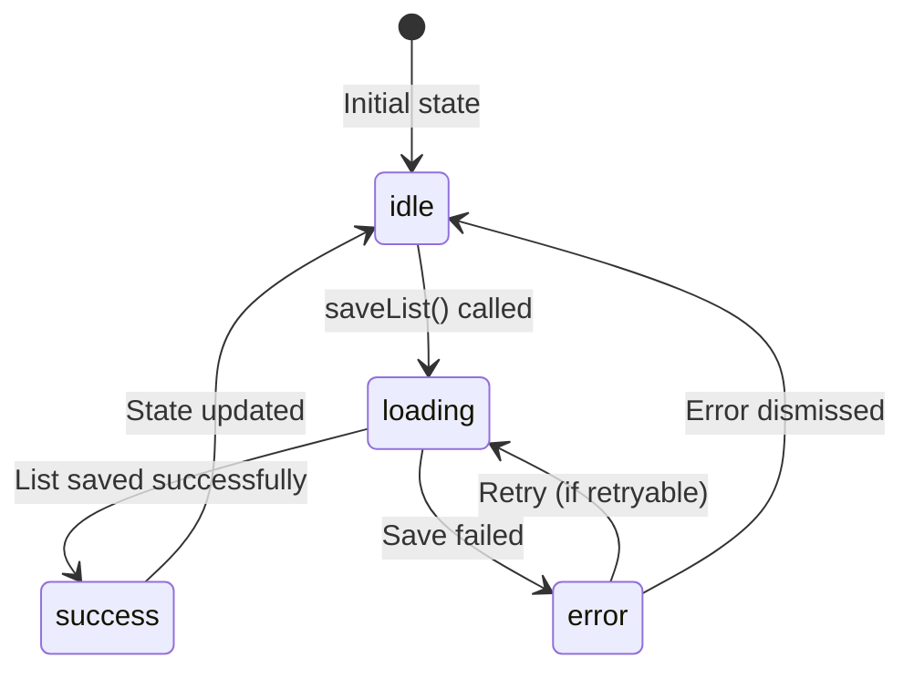

### Loading State Management

**File**: `src/hooks/use-list-actions.ts`

**State Management**:
```typescript
const [list, setList] = useState<KitList | null>(null);
const [loading, setLoading] = useState(autoFetch);
const [error, setError] = useState<AppError | null>(null);
```

**Add Item Flow**:
```typescript
const addItem = useCallback(async (item: TItem, optimistic = true): Promise<boolean> => {
  if (!userId) return false;
  
  const previousList = list;
  
  // 1. Optimistic update (if enabled)
  if (optimistic && previousList) {
    const optimisticList = {
      ...previousList,
      items: [...previousList.items, item],
    };
    setList(optimisticList);           // UI updates immediately
    setError(null);
  } else {
    setError(null);
  }
  
  // 2. Call service
  const result = await service.addUserItem(userId, item);
  
  if (!isMountedRef.current) return false;
  
  // 3a. Success: Refresh from server
  if (result.success) {
    await fetchList();                 // Get server state
    return true;
  }
  
  // 3b. Error: Rollback optimistic update
  else {
    if (optimistic && previousList) {
      setList(previousList);           // Rollback to previous state
    }
    setError(result.error);
    handleError(...);
    return false;
  }
}, [service, userId, list, fetchList, handleError]);
```

**Save List Flow**:
```typescript
const saveList = useCallback(async (updatedList: TList): Promise<boolean> => {
  if (!userId) return false;
  
  setError(null);
  
  // 1. Call service
  const result = await service.saveUserList(userId, updatedList);
  
  if (!isMountedRef.current) return false;
  
  // 2a. Success: Update local state
  if (result.success) {
    setList(updatedList);              // Use the list that was saved
    return true;
  }
  
  // 2b. Error: Set error state
  else {
    setError(result.error);
    handleError(...);
    return false;
  }
}, [service, userId, handleError]);
```

---

## Optimistic Updates

### What are Optimistic Updates?

Optimistic updates are a UX pattern where the UI is updated immediately before the server confirms the change. If the operation fails, the UI is rolled back.

### Add Item Optimistic Update Flow

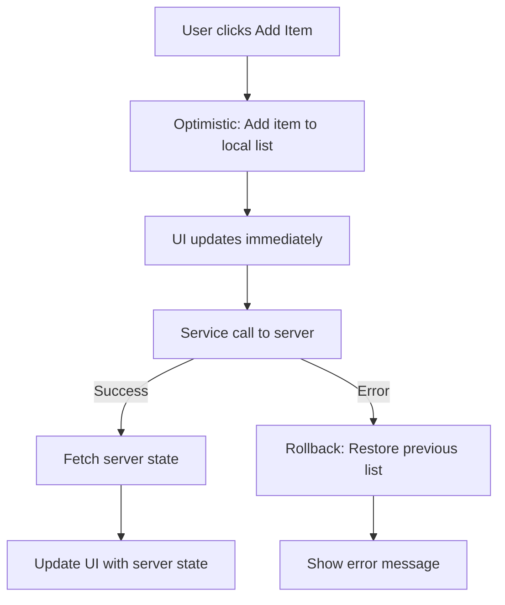

**Benefits**:
- Immediate UI feedback
- Better user experience
- Appears faster

**Risks**:
- If server fails, user sees the item briefly then it disappears
- Mitigated by rollback on error

### Implementation Details

**In Hook**:
```typescript
// Before service call
const previousList = list;
const optimisticList = {
  ...previousList,
  items: [...previousList.items, item],
};
setList(optimisticList);  // Immediate update

// After service call (if error)
if (optimistic && previousList) {
  setList(previousList);  // Rollback
}
```

**In UI**:
```typescript
// User sees item immediately
{list?.items.map(item => <KitItemRow item={item} />)}

// If error occurs, item disappears and error shows
{error && <ErrorMessageDisplay error={error} />}
```

---

## Error Handling

### Error Types

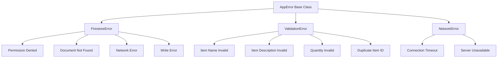

### Error Flow

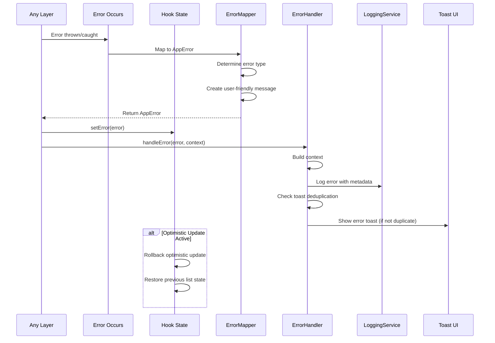

### Error Mapping

**File**: `src/utils/error-mapper.ts`

**Firestore Errors**:
- `permission-denied` → `DB_PERMISSION_DENIED`
  - User message: "You do not have permission to perform this action."
  - Retryable: false

- `not-found` → `DB_NOT_FOUND`
  - User message: "Kit list not found. Please reset your list first."
  - Retryable: false

- `unavailable` → `DB_NETWORK_ERROR`
  - User message: "Service temporarily unavailable. Please try again."
  - Retryable: true

- Write errors → `DB_WRITE_ERROR`
  - User message: "Failed to save changes. Please try again."
  - Retryable: true

**Validation Errors**:
- Duplicate item ID → `VALIDATION_FAILED`
  - User message: "This item already exists in the list."
  - Retryable: false

- Schema validation failures → `VALIDATION_ERROR`
  - User message: "Please check your input and try again."
  - Field-specific errors in `fieldErrors`
  - Retryable: false

**Error Handler**

**File**: `src/services/error-handler-service.ts`

**Process**:
1. **Log Error**: Structured logging with context metadata
2. **Deduplication**: Prevents duplicate toasts within 5 seconds
3. **Toast Display**: Shows user-friendly error message
4. **Retry Support**: Adds retry button for retryable errors

---

## File Structure & Function Calls

### Add Item Call Stack

```
UI Component (KitListScreen - placeholder)
  └─> AddItemForm Component (placeholder)
      ├─> Generate UUID for item.id
      └─> useUserList.addItem(item, optimistic=true)
          ├─> setError(null)
          ├─> [Optimistic Update] setList(optimisticList)
          └─> service.addUserItem(userId, item)
              └─> repository.addUserItem(userId, item)
                  ├─> ErrorContextBuilder.fromRepository()
                  ├─> sanitizeItem(item)
                  │   ├─> sanitizeString(item.itemName)
                  │   └─> sanitizeString(item.itemDescription)
                  │
                  ├─> getUserList(userId)
                  │   ├─> getDoc(doc('users', userId, 'lists', 'kitList'))
                  │   ├─> validateList(snapshot.data())
                  │   └─> sanitizeList(validatedList, userId)
                  │
                  ├─> Check for duplicate item.id
                  │
                  ├─> Create updatedList with new item
                  │
                  └─> saveUserList(userId, updatedList)
                      ├─> sanitizeList(updatedList, userId)
                      ├─> validateList(sanitizedList)
                      ├─> toFirestoreDoc(validatedList)
                      └─> setDoc(doc, firestoreDoc, { merge: true })
                          └─> Firestore API
          
          └─> fetchList() [on success]
              └─> service.getUserList(userId)
                  └─> repository.getUserList(userId)
                      └─> getDoc(doc)
```

### Save List Call Stack

```
UI Component (KitListScreen - placeholder)
  └─> KitListForm Component (placeholder)
      └─> useUserList.saveList(updatedList)
          ├─> setError(null)
          └─> service.saveUserList(userId, updatedList)
              └─> repository.saveUserList(userId, list)
                  ├─> ErrorContextBuilder.fromRepository()
                  ├─> sanitizeList(list, userId)
                  │   ├─> Ensure arrays exist
                  │   ├─> sanitizeArray(items)
                  │   ├─> items.map(sanitizeItem)
                  │   ├─> Filter categories with items
                  │   └─> Calculate metadata
                  │
                  ├─> validateList(sanitizedList)
                  │   └─> validateWithSchema(kitListSchema, data)
                  │
                  ├─> toFirestoreDoc(validatedList)
                  │   └─> Extract config, categories, items
                  │
                  └─> setDoc(doc('users', userId, 'lists', 'kitList'), firestoreDoc, { merge: true })
                      └─> Firestore API
          
          └─> setList(updatedList) [on success]
```

### Files Involved

| File | Purpose | Key Functions |
|------|---------|---------------|
| `src/app/(features)/kit/index.tsx` | Kit list screen (placeholder) | Screen component |
| `src/components/kit/KitListForm.tsx` | Kit list form (placeholder) | Form component |
| `src/components/kit/AddItemForm.tsx` | Add item form (placeholder) | Add item form component |
| `src/hooks/use-list-actions.ts` | React hook for list operations | `useUserList()`, `addItem()`, `saveList()` |
| `src/services/ListService.ts` | Business logic orchestration | `addUserItem()`, `saveUserList()` |
| `src/repositories/firestore/firestore-list-repository.ts` | Firestore list adapter | `addUserItem()`, `saveUserList()`, `sanitizeItem()`, `sanitizeList()` |
| `src/repositories/firestore/list.repository.ts` | Repository factory | `kitRepository` instance |
| `src/domain/user/kit.schema.ts` | Kit validation schemas | `kitListSchema`, `kitItemSchema` |
| `src/utils/id-generator.ts` | ID generation utilities | `generateUUID()` |
| `src/utils/validation-helpers.ts` | Validation utilities | `validateWithSchema()` |
| `src/utils/sanitization-helpers.ts` | Input sanitization | `sanitizeString()`, `sanitizeArray()` |
| `src/utils/error-mapper.ts` | Error type mapping | `fromFirestore()`, `listNotFound()` |
| `src/services/error-handler-service.ts` | Centralized error handling | `handle()` |

---

## Hooks Usage

### useUserList Hook

**File**: `src/hooks/use-list-actions.ts`

**Usage Pattern**:
```typescript
const kitService = serviceFactory.kitService;
const { list, loading, error, addItem, saveList, clearError } = useUserList(
  kitService,
  userId,
  { 
    autoFetch: true,      // Automatically fetch on mount
    enableRealtime: true  // Enable real-time updates
  }
);

// Add item
const handleAddItem = async (itemInput: KitItemInput) => {
  const newItem: KitItem = {
    id: generateUUID(),
    ...itemInput,
    quantity: itemInput.quantity || 1,
    isCustom: true,
    isChecked: false,
    isDisabled: false,
  };
  
  const success = await addItem(newItem, optimistic: true);
  if (success) {
    // Item added, form can be cleared
  }
};

// Save list
const handleSave = async () => {
  if (!list) return;
  
  const success = await saveList(list);
  if (success) {
    // Show success message
  }
};
```

**addItem Function**:
```typescript
const addItem = useCallback(async (item: TItem, optimistic = true): Promise<boolean> => {
  if (!userId) return false;
  
  const previousList = list;
  
  // Optimistic update
  if (optimistic && previousList) {
    const optimisticList = {
      ...previousList,
      items: [...previousList.items, item],
    };
    setList(optimisticList);
    setError(null);
  } else {
    setError(null);
  }
  
  const result = await service.addUserItem(userId, item);
  
  if (!isMountedRef.current) return false;
  
  if (result.success) {
    await fetchList();  // Refresh to get server state
    return true;
  } else {
    // Rollback on error
    if (optimistic && previousList) {
      setList(previousList);
    }
    setError(result.error);
    handleError(result.error, {...});
    return false;
  }
}, [service, userId, list, fetchList, handleError]);
```

**saveList Function**:
```typescript
const saveList = useCallback(async (updatedList: TList): Promise<boolean> => {
  if (!userId) return false;
  
  setError(null);
  const result = await service.saveUserList(userId, updatedList);
  
  if (!isMountedRef.current) return false;
  
  if (result.success) {
    setList(updatedList);  // Update local state
    return true;
  } else {
    setError(result.error);
    handleError(result.error, {...});
    return false;
  }
}, [service, userId, handleError]);
```

---

## Ports & Adapters

### Architecture Pattern

The application uses **Ports & Adapters (Hexagonal Architecture)**:

- **Ports**: Interfaces defining contracts (`IListRepository<TList, TItem>`)
- **Adapters**: Concrete implementations (`FirestoreListRepository<KitList, KitItem>`)

### Ports (Interfaces)

#### IListRepository

**File**: `src/repositories/i-list-repository.ts`

**Contract**:
```typescript
interface IListRepository<TList extends ListConstraint<TItem>, TItem extends ListBaseItem> {
  addUserItem(userId: string, item: TItem): Promise<Result<TItem, AppError>>;
  saveUserList(userId: string, list: TList): Promise<Result<void, AppError>>;
  // ... other methods
}
```

**Purpose**: Defines the contract for list item and save operations (generic for all list types)

### Adapters (Implementations)

#### FirestoreListRepository

**File**: `src/repositories/firestore/firestore-list-repository.ts`

**Implements**: `IListRepository<TList, TItem>`

**Key Methods**:
- `addUserItem()`: Sanitizes item, checks duplicates, adds to list, calls saveUserList
- `saveUserList()`: Sanitizes list, validates, writes to Firestore with merge

**Dependencies**:
- Firestore SDK
- Zod schemas for validation
- Sanitization helpers

### Dependency Injection

**File**: `src/services/ServiceFactory.ts`

**Pattern**: Service Factory creates services with injected repositories

```typescript
export class ListService<TList, TItem> {
  constructor(private repository: IListRepository<TList, TItem>) {}
}
```

---

## Simple Explanation

### What Happens When You Add an Item?

Imagine adding an item is like adding a new tool to your equipment checklist:

#### Step 1: You Fill Out the Form
- **Add Item Form**: You enter item details:
  - Item name (e.g., "Extra Memory Card")
  - Description (optional details)
  - Quantity (how many you want)
  - Category (optional: which category it belongs to)

#### Step 2: Optimistic Update (Immediate Feedback)
- **UI Update**: The item appears in your list immediately (before server confirms)
- This makes the app feel fast and responsive
- If something goes wrong later, it will disappear

#### Step 3: Generate Item ID
- **ID Generation**: The system generates a unique ID (like a serial number)
- This ensures no two items have the same ID

#### Step 4: Clean Up the Data
- **Sanitization**: The system cleans up your input:
  - Trims whitespace from name and description
  - Ensures quantity is valid (at least 1)

#### Step 5: Check for Duplicates
- **Duplicate Check**: The system checks if an item with that ID already exists
- If duplicate → **Error**: "This item already exists in the list"
- Otherwise, continue

#### Step 6: Get Your Current List
- **Fetch List**: The system gets your current kit list from the database
- If list doesn't exist → **Error**: "Kit list not found. Please reset your list first."

#### Step 7: Add Item to List
- **Update List**: The new item is added to your list array
- List now has: `[...existingItems, newItem]`

#### Step 8: Save the Updated List
- **Save List**: The system saves your updated list:
  - Cleans up all items in the list
  - Recalculates counts (how many categories, how many items)
  - Updates "last modified" timestamp
  - Validates everything is correct
  - Saves to Firestore

#### Step 9: Refresh from Server
- **Fetch Updated List**: After saving, the system fetches the list from the server
- This ensures your local copy matches what's stored
- UI updates with the server-confirmed list

#### Step 10: Success!
- **Complete**: The item is now permanently saved
- If there was an error, the optimistic update is rolled back and you see an error message

### What Happens When You Save the List?

Saving the list is like saving a document - it writes all your changes to the database:

#### Step 1: You Make Changes
- **Local Updates**: You check items, change quantities, add/remove items locally
- Changes are in memory but not yet saved

#### Step 2: You Click Save (or Auto-save)
- **Save Action**: The system saves your current list state

#### Step 3: Clean Up All Data
- **Sanitization**: The system cleans up:
  - All item names and descriptions are trimmed
  - All arrays are validated
  - Categories are filtered (only show categories that have items)
  - Metadata is recalculated (total counts, last modified info)

#### Step 4: Validate Everything
- **Validation**: The system checks that everything is valid:
  - All items have valid names, descriptions, quantities
  - List structure is correct
  - If anything is invalid → **Error**: Shows specific field errors

#### Step 5: Save to Database
- **Firestore Write**: Your list is saved:
  - Uses "merge: true" so existing fields not in your update are preserved
  - If write fails → **Error**: "Failed to save. Please try again."

#### Step 6: Update Local State
- **State Update**: Your local state is updated with the saved list
- UI reflects the saved changes
- Success indicator shows

### Optimistic Updates Explained

**What it means**: The UI updates immediately, before the server confirms.

**Example**:
1. You click "Add Item"
2. Item appears in list immediately (optimistic)
3. Server call happens in background
4. If server succeeds: Item stays (confirmed)
5. If server fails: Item disappears (rolled back), error shows

**Why use it**:
- Makes app feel fast
- Better user experience
- Common pattern in modern apps

**When it fails**:
- User sees item briefly then it disappears
- Error message explains what went wrong
- User can retry if error is retryable

### Error Handling

If anything goes wrong:

1. **Error is Caught**: The system catches the error
2. **Error is Classified**: Determines error type (validation, database, network)
3. **User-Friendly Message**: Converts to message you understand
4. **Optimistic Rollback**: If optimistic update was used, it's rolled back
5. **Error is Logged**: Technical details logged for developers
6. **You See a Toast**: Notification appears with error message
7. **Retry Option**: If retryable, you can try again

### Key Differences: Add Item vs Save List

**Add Item**:
- Adds one item at a time
- Gets current list first
- Checks for duplicates
- Uses optimistic updates
- Refreshes list after success

**Save List**:
- Saves entire list at once
- No duplicate checking (items already exist)
- No optimistic updates
- Updates local state directly

Both operations sanitize and validate data before saving.

---

## Summary Flow Charts

### Add Item Summary

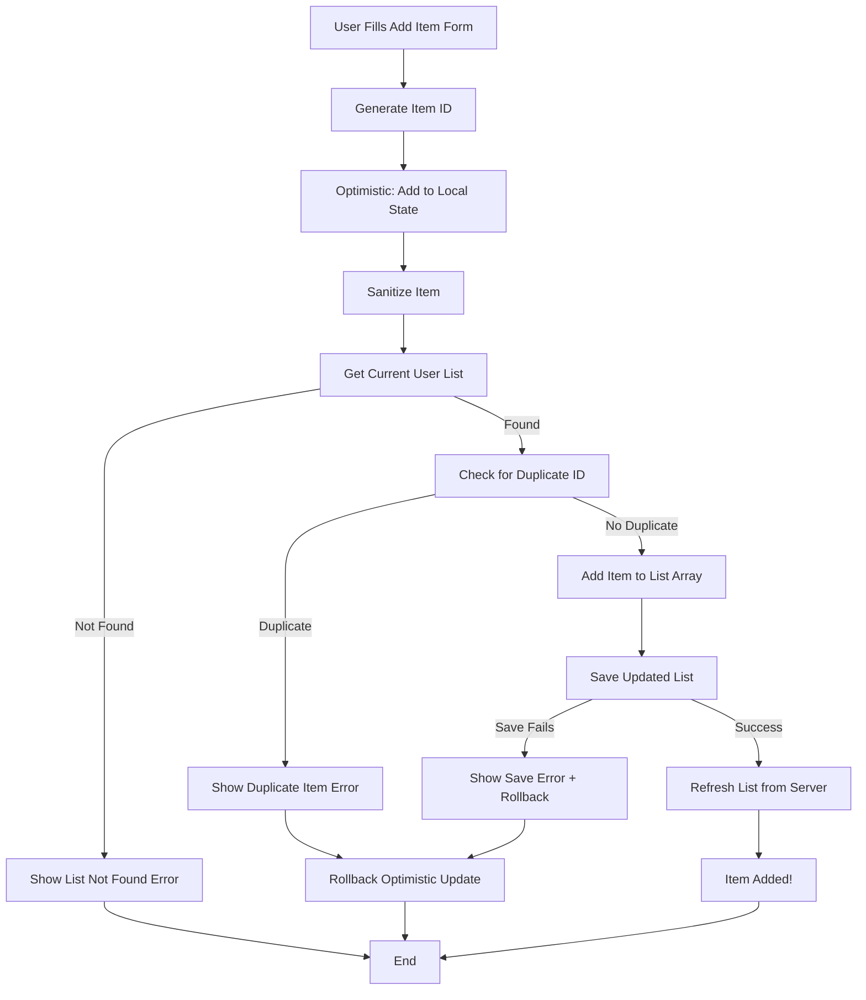

### Save List Summary

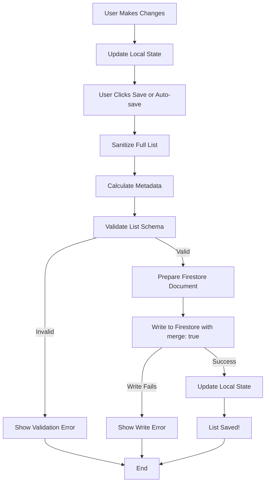

---

## Key Takeaways

1. **Add Item Flow**:
   - Uses optimistic updates for immediate feedback
   - Checks for duplicate item IDs
   - Gets current list before adding
   - Calls saveUserList internally
   - Refreshes list after success

2. **Save List Flow**:
   - Saves entire list at once
   - Sanitizes all items and recalculates metadata
   - Validates full list schema
   - Uses merge: true to preserve existing fields
   - Updates local state directly (no fetch)

3. **Sanitization**: 
   - Item strings (name, description) are trimmed
   - List metadata is recalculated on save
   - Categories are filtered to only show those with items

4. **Validation**:
   - Items validated with kitItemSchema (including quantity)
   - List validated with kitListSchema
   - Duplicate ID check for add operations

5. **Optimistic Updates**:
   - Immediate UI feedback
   - Rollback on error
   - Better user experience

6. **Error Handling**: 
   - Comprehensive error handling with rollback
   - User-friendly error messages
   - Retry support for retryable errors

7. **Generic Pattern**: 
   - Same pattern works for all list types (Kit, Tasks, Shots, etc.)
   - Type-safe with TypeScript generics

8. **Loading States**: 
   - Clear loading state management
   - Optimistic updates don't show loading (immediate update)

9. **Firestore Merge**: 
   - `merge: true` preserves fields not in update
   - Allows partial updates safely

10. **ID Generation**: 
    - UUIDs generated for new items
    - Ensures uniqueness

11. **Metadata Management**: 
    - Automatically recalculated on save
    - Includes counts and timestamps

12. **User Experience**: 
    - Fast, responsive feel with optimistic updates
    - Clear error messages
    - Success indicators

---

*Document generated: 2025-01-XX*
*Last updated: Based on current codebase structure*

