# Complete Authentication Processes Documentation

## Overview

This document traces **all** authentication processes including sign-up, sign-in, sign-out, password reset, password change, email verification, profile retrieval, and auth state management. It covers the complete flow from UI interaction through hooks, services, repositories, and Firebase Auth.

---

## Table of Contents

1. [High-Level Architecture](#high-level-architecture)
2. [Sign-Up Flow](#sign-up-flow)
3. [Sign-In Flow](#sign-in-flow)
4. [Sign-Out Flow](#sign-out-flow)
5. [Password Reset Flow](#password-reset-flow)
6. [Password Reset Confirm Flow](#password-reset-confirm-flow)
7. [Password Change Flow](#password-change-flow)
8. [Email Verification Flow](#email-verification-flow)
9. [Resend Email Verification Flow](#resend-email-verification-flow)
10. [Get Profile Flow](#get-profile-flow)
11. [Auth State Management](#auth-state-management)
12. [Data Structures](#data-structures)
13. [Validation & Sanitization](#validation--sanitization)
14. [Error Handling](#error-handling)
15. [Loading States](#loading-states)
16. [File Structure](#file-structure)
17. [Hooks Usage](#hooks-usage)
18. [Ports & Adapters](#ports--adapters)
19. [Simple Explanations](#simple-explanations)

---

## High-Level Architecture

### Architecture Overview

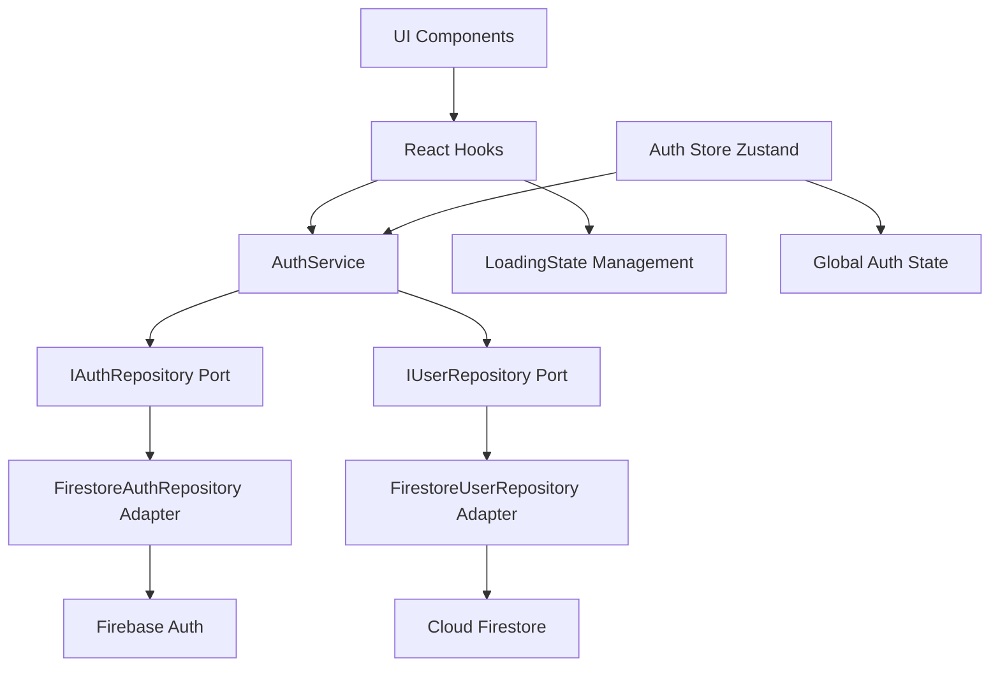
```mermaid
graph TD
    A[UI Components] --> B[React Hooks]
    B --> C[AuthService]
    C --> D[IAuthRepository Port]
    C --> E[IUserRepository Port]
    D --> F[FirestoreAuthRepository Adapter]
    E --> G[FirestoreUserRepository Adapter]
    F --> H[Firebase Auth]
    G --> I[Cloud Firestore]
    
    B --> J[LoadingState Management]
    K[Auth Store Zustand] --> C
    K --> L[Global Auth State]
```

### Authentication Flow Layers

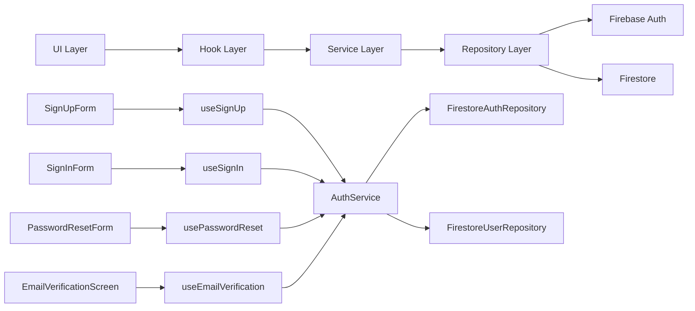
```mermaid
graph LR
    A[UI Layer] --> B[Hook Layer]
    B --> C[Service Layer]
    C --> D[Repository Layer]
    D --> E[Firebase Auth]
    D --> F[Firestore]
    
    A1[SignUpForm] --> B1[useSignUp]
    A2[SignInForm] --> B2[useSignIn]
    A3[PasswordResetForm] --> B3[usePasswordReset]
    A4[EmailVerificationScreen] --> B4[useEmailVerification]
    
    B1 --> C1[AuthService]
    B2 --> C1
    B3 --> C1
    B4 --> C1
    
    C1 --> D1[FirestoreAuthRepository]
    C1 --> D2[FirestoreUserRepository]
```

---

## Sign-Up Flow

### Complete Sign-Up Sequence

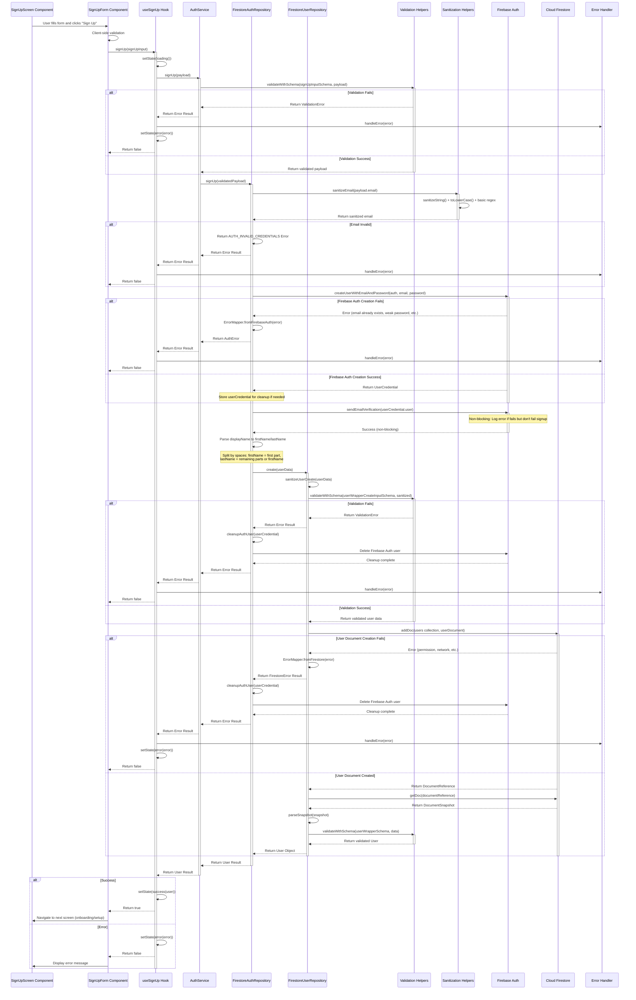
```mermaid
sequenceDiagram
    participant UI as SignUpScreen Component
    participant Form as SignUpForm Component
    participant Hook as useSignUp Hook
    participant Service as AuthService
    participant AuthRepo as FirestoreAuthRepository
    participant UserRepo as FirestoreUserRepository
    participant Validate as Validation Helpers
    participant Sanitize as Sanitization Helpers
    participant Firebase as Firebase Auth
    participant Firestore as Cloud Firestore
    participant ErrorHandler as Error Handler

    UI->>Form: User fills form and clicks "Sign Up"
    Form->>Form: Client-side validation
    Form->>Hook: signUp(signUpInput)
    activate Hook
    
    Hook->>Hook: setState(loading())
    Hook->>Service: signUp(payload)
    activate Service
    
    Service->>Validate: validateWithSchema(signUpInputSchema, payload)
    activate Validate
    alt Validation Fails
        Validate-->>Service: Return ValidationError
        Service-->>Hook: Return Error Result
        Hook->>ErrorHandler: handleError(error)
        Hook->>Hook: setState(error(error))
        Hook-->>Form: Return false
    else Validation Success
        Validate-->>Service: Return validated payload
        deactivate Validate
    end
    
    Service->>AuthRepo: signUp(validatedPayload)
    activate AuthRepo
    
    AuthRepo->>Sanitize: sanitizeEmail(payload.email)
    activate Sanitize
    Sanitize->>Sanitize: sanitizeString() + toLowerCase() + basic regex
    Sanitize-->>AuthRepo: Return sanitized email
    deactivate Sanitize
    
    alt Email Invalid
        AuthRepo->>AuthRepo: Return AUTH_INVALID_CREDENTIALS Error
        AuthRepo-->>Service: Return Error Result
        Service-->>Hook: Return Error Result
        Hook->>ErrorHandler: handleError(error)
        Hook-->>Form: Return false
    end
    
    AuthRepo->>Firebase: createUserWithEmailAndPassword(auth, email, password)
    activate Firebase
    alt Firebase Auth Creation Fails
        Firebase-->>AuthRepo: Error (email already exists, weak password, etc.)
        AuthRepo->>AuthRepo: ErrorMapper.fromFirebaseAuth(error)
        AuthRepo-->>Service: Return AuthError
        Service-->>Hook: Return Error Result
        Hook->>ErrorHandler: handleError(error)
        Hook-->>Form: Return false
    else Firebase Auth Creation Success
        Firebase-->>AuthRepo: Return UserCredential
        Note over AuthRepo: Store userCredential for cleanup if needed
    end
    deactivate Firebase
    
    AuthRepo->>Firebase: sendEmailVerification(userCredential.user)
    activate Firebase
    Note over Firebase: Non-blocking: Log error if fails but don't fail signup
    Firebase-->>AuthRepo: Success (non-blocking)
    deactivate Firebase
    
    AuthRepo->>AuthRepo: Parse displayName to firstName/lastName
    Note over AuthRepo: Split by spaces: firstName = first part,<br/>lastName = remaining parts or firstName
    
    AuthRepo->>UserRepo: create(userData)
    activate UserRepo
    
    UserRepo->>UserRepo: sanitizeUserCreate(userData)
    UserRepo->>Validate: validateWithSchema(userWrapperCreateInputSchema, sanitized)
    activate Validate
    alt Validation Fails
        Validate-->>UserRepo: Return ValidationError
        UserRepo-->>AuthRepo: Return Error Result
        AuthRepo->>AuthRepo: cleanupAuthUser(userCredential)
        AuthRepo->>Firebase: Delete Firebase Auth user
        Firebase-->>AuthRepo: Cleanup complete
        AuthRepo-->>Service: Return Error Result
        Service-->>Hook: Return Error Result
        Hook->>ErrorHandler: handleError(error)
        Hook-->>Form: Return false
    else Validation Success
        Validate-->>UserRepo: Return validated user data
        deactivate Validate
    end
    
    UserRepo->>Firestore: addDoc(users collection, userDocument)
    activate Firestore
    alt User Document Creation Fails
        Firestore-->>UserRepo: Error (permission, network, etc.)
        UserRepo->>UserRepo: ErrorMapper.fromFirestore(error)
        UserRepo-->>AuthRepo: Return FirestoreError Result
        AuthRepo->>AuthRepo: cleanupAuthUser(userCredential)
        AuthRepo->>Firebase: Delete Firebase Auth user
        Firebase-->>AuthRepo: Cleanup complete
        AuthRepo-->>Service: Return Error Result
        Service-->>Hook: Return Error Result
        Hook->>ErrorHandler: handleError(error)
        Hook->>Hook: setState(error(error))
        Hook-->>Form: Return false
    else User Document Created
        Firestore-->>UserRepo: Return DocumentReference
        UserRepo->>Firestore: getDoc(documentReference)
        Firestore-->>UserRepo: Return DocumentSnapshot
        UserRepo->>UserRepo: parseSnapshot(snapshot)
        UserRepo->>Validate: validateWithSchema(userWrapperSchema, data)
        activate Validate
        Validate-->>UserRepo: Return validated User
        deactivate Validate
        UserRepo-->>AuthRepo: Return User Object
    end
    deactivate Firestore
    deactivate UserRepo
    
    AuthRepo-->>Service: Return User Result
    deactivate AuthRepo
    
    Service-->>Hook: Return User Result
    deactivate Service
    
    alt Success
        Hook->>Hook: setState(success(user))
        Hook-->>Form: Return true
        Form->>UI: Navigate to next screen (onboarding/setup)
    else Error
        Hook->>Hook: setState(error(error))
        Hook-->>Form: Return false
        Form->>UI: Display error message
    end
    deactivate Hook
```

### Default Values Applied During Sign-Up

```typescript
// Default values set during user creation
preferences: {
  ...defaultUserPreferences,
  id: userId,
  userId: userId,
  marketingConsent: payload.acceptMarketing || false,
}

subscription: {
  ...defaultUserSubscription,
  id: userId,
  plan: payload.subscriptionPlan,  // From form
  startDate: new Date(),
}

setup: defaultUserSetup  // firstTimeSetup: true, showOnboarding: true, etc.
projects: defaultUserProjects  // activeProjects: 0, totalProjects: 0
role: UserRole.USER  // Default role
```

---

## Sign-In Flow

### Complete Sign-In Sequence

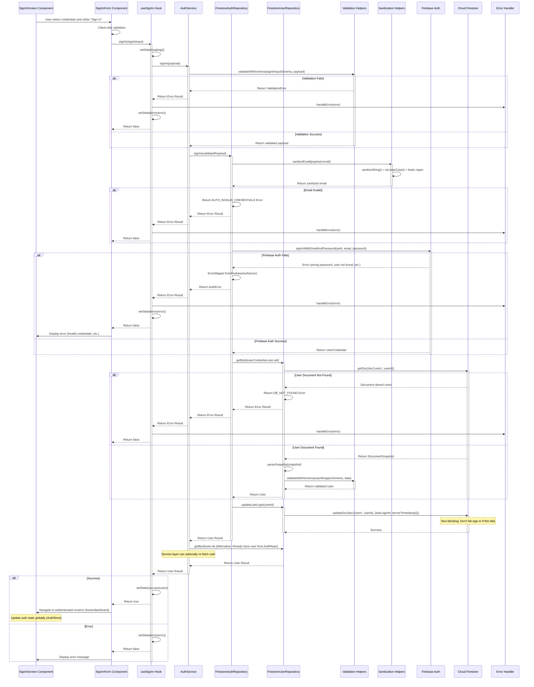
```mermaid
sequenceDiagram
    participant UI as SignInScreen Component
    participant Form as SignInForm Component
    participant Hook as useSignIn Hook
    participant Service as AuthService
    participant AuthRepo as FirestoreAuthRepository
    participant UserRepo as FirestoreUserRepository
    participant Validate as Validation Helpers
    participant Sanitize as Sanitization Helpers
    participant Firebase as Firebase Auth
    participant Firestore as Cloud Firestore
    participant ErrorHandler as Error Handler

    UI->>Form: User enters credentials and clicks "Sign In"
    Form->>Form: Client-side validation
    Form->>Hook: signIn(signInInput)
    activate Hook
    
    Hook->>Hook: setState(loading())
    Hook->>Service: signIn(payload)
    activate Service
    
    Service->>Validate: validateWithSchema(signInInputSchema, payload)
    activate Validate
    alt Validation Fails
        Validate-->>Service: Return ValidationError
        Service-->>Hook: Return Error Result
        Hook->>ErrorHandler: handleError(error)
        Hook->>Hook: setState(error(error))
        Hook-->>Form: Return false
    else Validation Success
        Validate-->>Service: Return validated payload
        deactivate Validate
    end
    
    Service->>AuthRepo: signIn(validatedPayload)
    activate AuthRepo
    
    AuthRepo->>Sanitize: sanitizeEmail(payload.email)
    activate Sanitize
    Sanitize->>Sanitize: sanitizeString() + toLowerCase() + basic regex
    Sanitize-->>AuthRepo: Return sanitized email
    deactivate Sanitize
    
    alt Email Invalid
        AuthRepo->>AuthRepo: Return AUTH_INVALID_CREDENTIALS Error
        AuthRepo-->>Service: Return Error Result
        Service-->>Hook: Return Error Result
        Hook->>ErrorHandler: handleError(error)
        Hook-->>Form: Return false
    end
    
    AuthRepo->>Firebase: signInWithEmailAndPassword(auth, email, password)
    activate Firebase
    alt Firebase Auth Fails
        Firebase-->>AuthRepo: Error (wrong password, user not found, etc.)
        AuthRepo->>AuthRepo: ErrorMapper.fromFirebaseAuth(error)
        AuthRepo-->>Service: Return AuthError
        Service-->>Hook: Return Error Result
        Hook->>ErrorHandler: handleError(error)
        Hook->>Hook: setState(error(error))
        Hook-->>Form: Return false
        Form->>UI: Display error (Invalid credentials, etc.)
    else Firebase Auth Success
        Firebase-->>AuthRepo: Return UserCredential
    end
    deactivate Firebase
    
    AuthRepo->>UserRepo: getById(userCredential.user.uid)
    activate UserRepo
    UserRepo->>Firestore: getDoc(doc('users', userId))
    activate Firestore
    alt User Document Not Found
        Firestore-->>UserRepo: Document doesn't exist
        UserRepo->>UserRepo: Return DB_NOT_FOUND Error
        UserRepo-->>AuthRepo: Return Error Result
        AuthRepo-->>Service: Return Error Result
        Service-->>Hook: Return Error Result
        Hook->>ErrorHandler: handleError(error)
        Hook-->>Form: Return false
    else User Document Found
        Firestore-->>UserRepo: Return DocumentSnapshot
        UserRepo->>UserRepo: parseSnapshot(snapshot)
        UserRepo->>Validate: validateWithSchema(userWrapperSchema, data)
        activate Validate
        Validate-->>UserRepo: Return validated User
        deactivate Validate
        UserRepo-->>AuthRepo: Return User
    end
    deactivate Firestore
    deactivate UserRepo
    
    AuthRepo->>UserRepo: updateLastLogin(userId)
    activate UserRepo
    UserRepo->>Firestore: updateDoc(doc('users', userId), {lastLoginAt: serverTimestamp()})
    activate Firestore
    Note over Firestore: Non-blocking: Don't fail sign-in if this fails
    Firestore-->>UserRepo: Success
    deactivate Firestore
    deactivate UserRepo
    
    AuthRepo-->>Service: Return User Result
    deactivate AuthRepo
    
    Service->>UserRepo: getById(user.id) [Alternative: Already have user from AuthRepo]
    Note over Service: Service layer can optionally re-fetch user
    UserRepo-->>Service: Return User Result
    Service-->>Hook: Return User Result
    deactivate Service
    
    alt Success
        Hook->>Hook: setState(success(user))
        Hook-->>Form: Return true
        Form->>UI: Navigate to authenticated screens (home/dashboard)
        Note over UI: Update auth state globally (AuthStore)
    else Error
        Hook->>Hook: setState(error(error))
        Hook-->>Form: Return false
        Form->>UI: Display error message
    end
    deactivate Hook
```

---

## Sign-Out Flow

### Complete Sign-Out Sequence

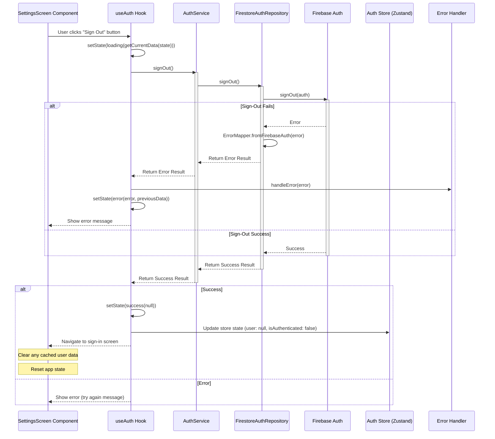
```mermaid
sequenceDiagram
    participant UI as SettingsScreen Component
    participant Hook as useAuth Hook
    participant Service as AuthService
    participant AuthRepo as FirestoreAuthRepository
    participant Firebase as Firebase Auth
    participant AuthStore as Auth Store (Zustand)
    participant ErrorHandler as Error Handler

    UI->>Hook: User clicks "Sign Out" button
    Hook->>Hook: setState(loading(getCurrentData(state)))
    Hook->>Service: signOut()
    activate Service
    
    Service->>AuthRepo: signOut()
    activate AuthRepo
    
    AuthRepo->>Firebase: signOut(auth)
    activate Firebase
    alt Sign-Out Fails
        Firebase-->>AuthRepo: Error
        AuthRepo->>AuthRepo: ErrorMapper.fromFirebaseAuth(error)
        AuthRepo-->>Service: Return Error Result
        Service-->>Hook: Return Error Result
        Hook->>ErrorHandler: handleError(error)
        Hook->>Hook: setState(error(error, previousData))
        Hook-->>UI: Show error message
    else Sign-Out Success
        Firebase-->>AuthRepo: Success
    end
    deactivate Firebase
    
    AuthRepo-->>Service: Return Success Result
    deactivate AuthRepo
    Service-->>Hook: Return Success Result
    deactivate Service
    
    alt Success
        Hook->>Hook: setState(success(null))
        Hook->>AuthStore: Update store state (user: null, isAuthenticated: false)
        Hook-->>UI: Navigate to sign-in screen
        Note over UI: Clear any cached user data
        Note over UI: Reset app state
    else Error
        Hook-->>UI: Show error (try again message)
    end
```

---

## Password Reset Flow

### Send Password Reset Email Sequence

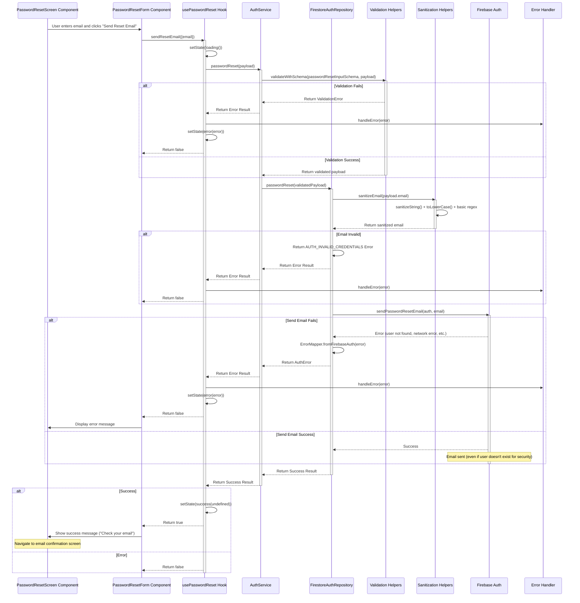
```mermaid
sequenceDiagram
    participant UI as PasswordResetScreen Component
    participant Form as PasswordResetForm Component
    participant Hook as usePasswordReset Hook
    participant Service as AuthService
    participant AuthRepo as FirestoreAuthRepository
    participant Validate as Validation Helpers
    participant Sanitize as Sanitization Helpers
    participant Firebase as Firebase Auth
    participant ErrorHandler as Error Handler

    UI->>Form: User enters email and clicks "Send Reset Email"
    Form->>Hook: sendResetEmail({email})
    activate Hook
    
    Hook->>Hook: setState(loading())
    Hook->>Service: passwordReset(payload)
    activate Service
    
    Service->>Validate: validateWithSchema(passwordResetInputSchema, payload)
    activate Validate
    alt Validation Fails
        Validate-->>Service: Return ValidationError
        Service-->>Hook: Return Error Result
        Hook->>ErrorHandler: handleError(error)
        Hook->>Hook: setState(error(error))
        Hook-->>Form: Return false
    else Validation Success
        Validate-->>Service: Return validated payload
        deactivate Validate
    end
    
    Service->>AuthRepo: passwordReset(validatedPayload)
    activate AuthRepo
    
    AuthRepo->>Sanitize: sanitizeEmail(payload.email)
    activate Sanitize
    Sanitize->>Sanitize: sanitizeString() + toLowerCase() + basic regex
    Sanitize-->>AuthRepo: Return sanitized email
    deactivate Sanitize
    
    alt Email Invalid
        AuthRepo->>AuthRepo: Return AUTH_INVALID_CREDENTIALS Error
        AuthRepo-->>Service: Return Error Result
        Service-->>Hook: Return Error Result
        Hook->>ErrorHandler: handleError(error)
        Hook-->>Form: Return false
    end
    
    AuthRepo->>Firebase: sendPasswordResetEmail(auth, email)
    activate Firebase
    alt Send Email Fails
        Firebase-->>AuthRepo: Error (user not found, network error, etc.)
        AuthRepo->>AuthRepo: ErrorMapper.fromFirebaseAuth(error)
        AuthRepo-->>Service: Return AuthError
        Service-->>Hook: Return Error Result
        Hook->>ErrorHandler: handleError(error)
        Hook->>Hook: setState(error(error))
        Hook-->>Form: Return false
        Form->>UI: Display error message
    else Send Email Success
        Firebase-->>AuthRepo: Success
        Note over Firebase: Email sent (even if user doesn't exist for security)
    end
    deactivate Firebase
    
    AuthRepo-->>Service: Return Success Result
    deactivate AuthRepo
    Service-->>Hook: Return Success Result
    deactivate Service
    
    alt Success
        Hook->>Hook: setState(success(undefined))
        Hook-->>Form: Return true
        Form->>UI: Show success message ("Check your email")
        Note over UI: Navigate to email confirmation screen
    else Error
        Hook-->>Form: Return false
    end
    deactivate Hook
```

---

## Password Reset Confirm Flow

### Confirm Password Reset Sequence

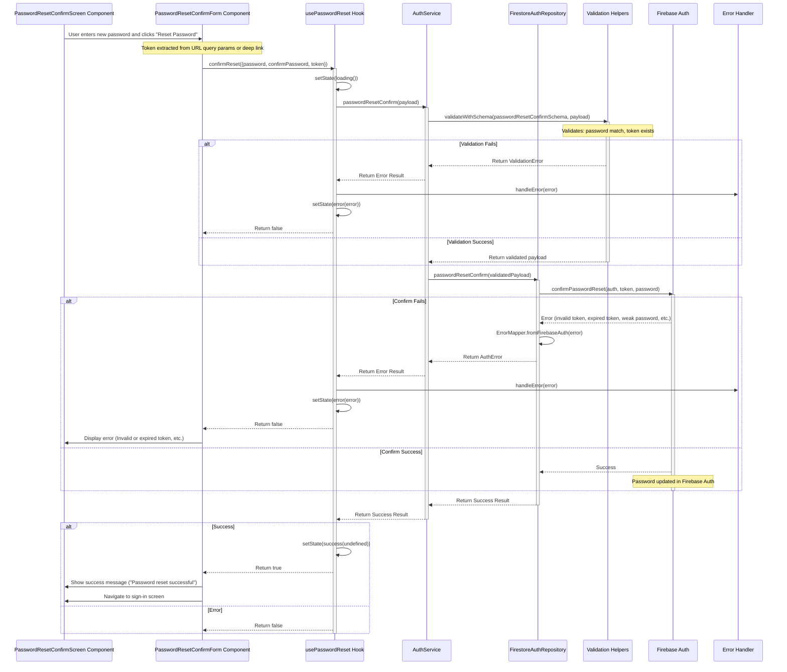
```mermaid
sequenceDiagram
    participant UI as PasswordResetConfirmScreen Component
    participant Form as PasswordResetConfirmForm Component
    participant Hook as usePasswordReset Hook
    participant Service as AuthService
    participant AuthRepo as FirestoreAuthRepository
    participant Validate as Validation Helpers
    participant Firebase as Firebase Auth
    participant ErrorHandler as Error Handler

    UI->>Form: User enters new password and clicks "Reset Password"
    Note over Form: Token extracted from URL query params or deep link
    Form->>Hook: confirmReset({password, confirmPassword, token})
    activate Hook
    
    Hook->>Hook: setState(loading())
    Hook->>Service: passwordResetConfirm(payload)
    activate Service
    
    Service->>Validate: validateWithSchema(passwordResetConfirmSchema, payload)
    activate Validate
    Note over Validate: Validates: password match, token exists
    alt Validation Fails
        Validate-->>Service: Return ValidationError
        Service-->>Hook: Return Error Result
        Hook->>ErrorHandler: handleError(error)
        Hook->>Hook: setState(error(error))
        Hook-->>Form: Return false
    else Validation Success
        Validate-->>Service: Return validated payload
        deactivate Validate
    end
    
    Service->>AuthRepo: passwordResetConfirm(validatedPayload)
    activate AuthRepo
    
    AuthRepo->>Firebase: confirmPasswordReset(auth, token, password)
    activate Firebase
    alt Confirm Fails
        Firebase-->>AuthRepo: Error (invalid token, expired token, weak password, etc.)
        AuthRepo->>AuthRepo: ErrorMapper.fromFirebaseAuth(error)
        AuthRepo-->>Service: Return AuthError
        Service-->>Hook: Return Error Result
        Hook->>ErrorHandler: handleError(error)
        Hook->>Hook: setState(error(error))
        Hook-->>Form: Return false
        Form->>UI: Display error (Invalid or expired token, etc.)
    else Confirm Success
        Firebase-->>AuthRepo: Success
        Note over Firebase: Password updated in Firebase Auth
    end
    deactivate Firebase
    
    AuthRepo-->>Service: Return Success Result
    deactivate AuthRepo
    Service-->>Hook: Return Success Result
    deactivate Service
    
    alt Success
        Hook->>Hook: setState(success(undefined))
        Hook-->>Form: Return true
        Form->>UI: Show success message ("Password reset successful")
        Form->>UI: Navigate to sign-in screen
    else Error
        Hook-->>Form: Return false
    end
    deactivate Hook
```

---

## Password Change Flow

### Change Password Sequence (When Logged In)

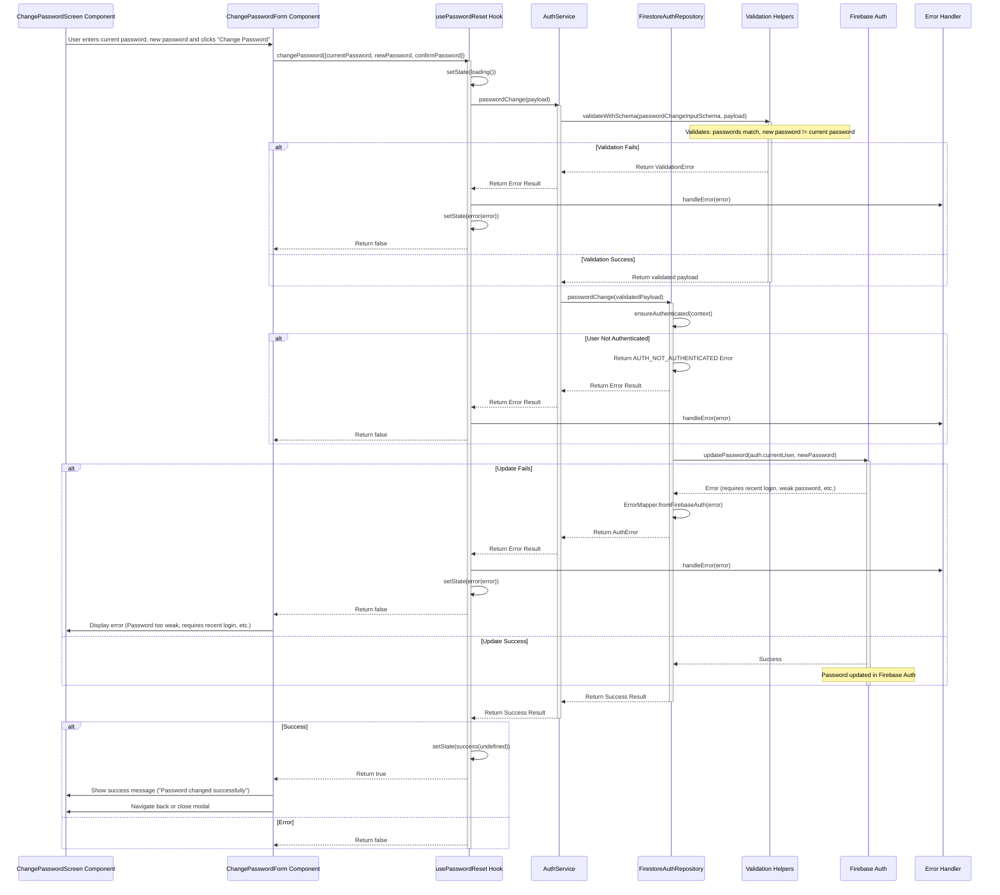
```mermaid
sequenceDiagram
    participant UI as ChangePasswordScreen Component
    participant Form as ChangePasswordForm Component
    participant Hook as usePasswordReset Hook
    participant Service as AuthService
    participant AuthRepo as FirestoreAuthRepository
    participant Validate as Validation Helpers
    participant Firebase as Firebase Auth
    participant ErrorHandler as Error Handler

    UI->>Form: User enters current password, new password and clicks "Change Password"
    Form->>Hook: changePassword({currentPassword, newPassword, confirmPassword})
    activate Hook
    
    Hook->>Hook: setState(loading())
    Hook->>Service: passwordChange(payload)
    activate Service
    
    Service->>Validate: validateWithSchema(passwordChangeInputSchema, payload)
    activate Validate
    Note over Validate: Validates: passwords match, new password != current password
    alt Validation Fails
        Validate-->>Service: Return ValidationError
        Service-->>Hook: Return Error Result
        Hook->>ErrorHandler: handleError(error)
        Hook->>Hook: setState(error(error))
        Hook-->>Form: Return false
    else Validation Success
        Validate-->>Service: Return validated payload
        deactivate Validate
    end
    
    Service->>AuthRepo: passwordChange(validatedPayload)
    activate AuthRepo
    
    AuthRepo->>AuthRepo: ensureAuthenticated(context)
    alt User Not Authenticated
        AuthRepo->>AuthRepo: Return AUTH_NOT_AUTHENTICATED Error
        AuthRepo-->>Service: Return Error Result
        Service-->>Hook: Return Error Result
        Hook->>ErrorHandler: handleError(error)
        Hook-->>Form: Return false
    end
    
    AuthRepo->>Firebase: updatePassword(auth.currentUser, newPassword)
    activate Firebase
    alt Update Fails
        Firebase-->>AuthRepo: Error (requires recent login, weak password, etc.)
        AuthRepo->>AuthRepo: ErrorMapper.fromFirebaseAuth(error)
        AuthRepo-->>Service: Return AuthError
        Service-->>Hook: Return Error Result
        Hook->>ErrorHandler: handleError(error)
        Hook->>Hook: setState(error(error))
        Hook-->>Form: Return false
        Form->>UI: Display error (Password too weak, requires recent login, etc.)
    else Update Success
        Firebase-->>AuthRepo: Success
        Note over Firebase: Password updated in Firebase Auth
    end
    deactivate Firebase
    
    AuthRepo-->>Service: Return Success Result
    deactivate AuthRepo
    Service-->>Hook: Return Success Result
    deactivate Service
    
    alt Success
        Hook->>Hook: setState(success(undefined))
        Hook-->>Form: Return true
        Form->>UI: Show success message ("Password changed successfully")
        Form->>UI: Navigate back or close modal
    else Error
        Hook-->>Form: Return false
    end
    deactivate Hook
```

---

## Email Verification Flow

### Verify Email Sequence

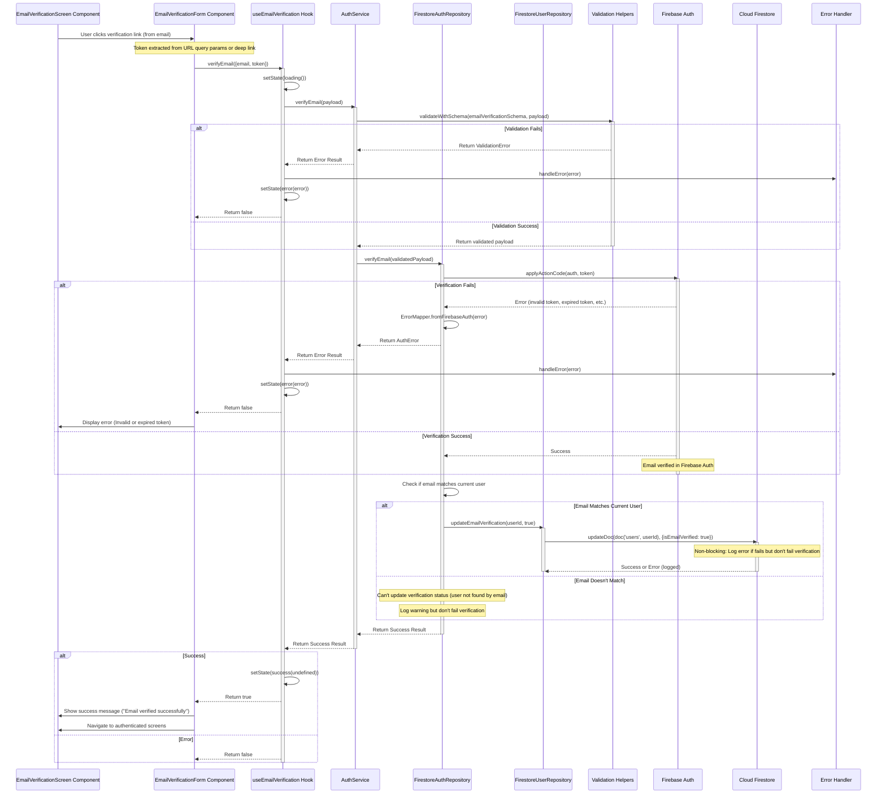
```mermaid
sequenceDiagram
    participant UI as EmailVerificationScreen Component
    participant Form as EmailVerificationForm Component
    participant Hook as useEmailVerification Hook
    participant Service as AuthService
    participant AuthRepo as FirestoreAuthRepository
    participant UserRepo as FirestoreUserRepository
    participant Validate as Validation Helpers
    participant Firebase as Firebase Auth
    participant Firestore as Cloud Firestore
    participant ErrorHandler as Error Handler

    UI->>Form: User clicks verification link (from email)
    Note over Form: Token extracted from URL query params or deep link
    Form->>Hook: verifyEmail({email, token})
    activate Hook
    
    Hook->>Hook: setState(loading())
    Hook->>Service: verifyEmail(payload)
    activate Service
    
    Service->>Validate: validateWithSchema(emailVerificationSchema, payload)
    activate Validate
    alt Validation Fails
        Validate-->>Service: Return ValidationError
        Service-->>Hook: Return Error Result
        Hook->>ErrorHandler: handleError(error)
        Hook->>Hook: setState(error(error))
        Hook-->>Form: Return false
    else Validation Success
        Validate-->>Service: Return validated payload
        deactivate Validate
    end
    
    Service->>AuthRepo: verifyEmail(validatedPayload)
    activate AuthRepo
    
    AuthRepo->>Firebase: applyActionCode(auth, token)
    activate Firebase
    alt Verification Fails
        Firebase-->>AuthRepo: Error (invalid token, expired token, etc.)
        AuthRepo->>AuthRepo: ErrorMapper.fromFirebaseAuth(error)
        AuthRepo-->>Service: Return AuthError
        Service-->>Hook: Return Error Result
        Hook->>ErrorHandler: handleError(error)
        Hook->>Hook: setState(error(error))
        Hook-->>Form: Return false
        Form->>UI: Display error (Invalid or expired token)
    else Verification Success
        Firebase-->>AuthRepo: Success
        Note over Firebase: Email verified in Firebase Auth
    end
    deactivate Firebase
    
    AuthRepo->>AuthRepo: Check if email matches current user
    alt Email Matches Current User
        AuthRepo->>UserRepo: updateEmailVerification(userId, true)
        activate UserRepo
        UserRepo->>Firestore: updateDoc(doc('users', userId), {isEmailVerified: true})
        activate Firestore
        Note over Firestore: Non-blocking: Log error if fails but don't fail verification
        Firestore-->>UserRepo: Success or Error (logged)
        deactivate Firestore
        deactivate UserRepo
    else Email Doesn't Match
        Note over AuthRepo: Can't update verification status (user not found by email)
        Note over AuthRepo: Log warning but don't fail verification
    end
    
    AuthRepo-->>Service: Return Success Result
    deactivate AuthRepo
    Service-->>Hook: Return Success Result
    deactivate Service
    
    alt Success
        Hook->>Hook: setState(success(undefined))
        Hook-->>Form: Return true
        Form->>UI: Show success message ("Email verified successfully")
        Form->>UI: Navigate to authenticated screens
    else Error
        Hook-->>Form: Return false
    end
    deactivate Hook
```

---

## Resend Email Verification Flow

### Resend Verification Email Sequence

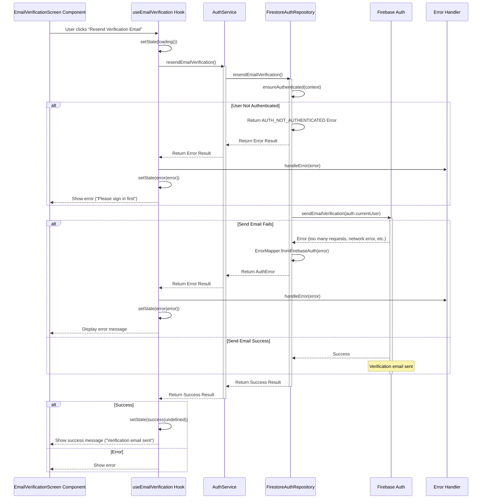
```mermaid
sequenceDiagram
    participant UI as EmailVerificationScreen Component
    participant Hook as useEmailVerification Hook
    participant Service as AuthService
    participant AuthRepo as FirestoreAuthRepository
    participant Firebase as Firebase Auth
    participant ErrorHandler as Error Handler

    UI->>Hook: User clicks "Resend Verification Email"
    Hook->>Hook: setState(loading())
    Hook->>Service: resendEmailVerification()
    activate Service
    
    Service->>AuthRepo: resendEmailVerification()
    activate AuthRepo
    
    AuthRepo->>AuthRepo: ensureAuthenticated(context)
    alt User Not Authenticated
        AuthRepo->>AuthRepo: Return AUTH_NOT_AUTHENTICATED Error
        AuthRepo-->>Service: Return Error Result
        Service-->>Hook: Return Error Result
        Hook->>ErrorHandler: handleError(error)
        Hook->>Hook: setState(error(error))
        Hook-->>UI: Show error ("Please sign in first")
    end
    
    AuthRepo->>Firebase: sendEmailVerification(auth.currentUser)
    activate Firebase
    alt Send Email Fails
        Firebase-->>AuthRepo: Error (too many requests, network error, etc.)
        AuthRepo->>AuthRepo: ErrorMapper.fromFirebaseAuth(error)
        AuthRepo-->>Service: Return AuthError
        Service-->>Hook: Return Error Result
        Hook->>ErrorHandler: handleError(error)
        Hook->>Hook: setState(error(error))
        Hook-->>UI: Display error message
    else Send Email Success
        Firebase-->>AuthRepo: Success
        Note over Firebase: Verification email sent
    end
    deactivate Firebase
    
    AuthRepo-->>Service: Return Success Result
    deactivate AuthRepo
    Service-->>Hook: Return Success Result
    deactivate Service
    
    alt Success
        Hook->>Hook: setState(success(undefined))
        Hook-->>UI: Show success message ("Verification email sent")
    else Error
        Hook-->>UI: Show error
    end
```

---

## Get Profile Flow

### Get Current User Profile Sequence

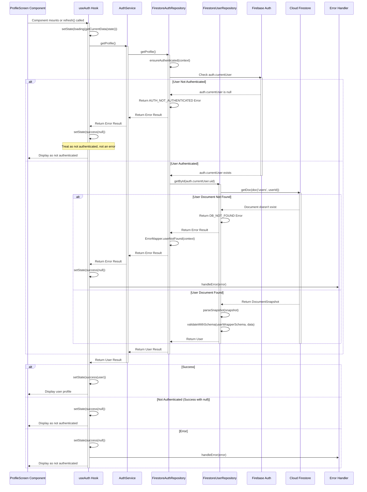
```mermaid
sequenceDiagram
    participant UI as ProfileScreen Component
    participant Hook as useAuth Hook
    participant Service as AuthService
    participant AuthRepo as FirestoreAuthRepository
    participant UserRepo as FirestoreUserRepository
    participant Firebase as Firebase Auth
    participant Firestore as Cloud Firestore
    participant ErrorHandler as Error Handler

    UI->>Hook: Component mounts or refresh() called
    activate Hook
    
    Hook->>Hook: setState(loading(getCurrentData(state)))
    Hook->>Service: getProfile()
    activate Service
    
    Service->>AuthRepo: getProfile()
    activate AuthRepo
    
    AuthRepo->>AuthRepo: ensureAuthenticated(context)
    AuthRepo->>Firebase: Check auth.currentUser
    activate Firebase
    alt User Not Authenticated
        Firebase-->>AuthRepo: auth.currentUser is null
        AuthRepo->>AuthRepo: Return AUTH_NOT_AUTHENTICATED Error
        AuthRepo-->>Service: Return Error Result
        Service-->>Hook: Return Error Result
        Hook->>Hook: setState(success(null))
        Note over Hook: Treat as not authenticated, not an error
        Hook-->>UI: Display as not authenticated
    else User Authenticated
        Firebase-->>AuthRepo: auth.currentUser exists
        deactivate Firebase
        
        AuthRepo->>UserRepo: getById(auth.currentUser.uid)
        activate UserRepo
        UserRepo->>Firestore: getDoc(doc('users', userId))
        activate Firestore
        alt User Document Not Found
            Firestore-->>UserRepo: Document doesn't exist
            UserRepo->>UserRepo: Return DB_NOT_FOUND Error
            UserRepo-->>AuthRepo: Return Error Result
            AuthRepo->>AuthRepo: ErrorMapper.userNotFound(context)
            AuthRepo-->>Service: Return Error Result
            Service-->>Hook: Return Error Result
            Hook->>Hook: setState(success(null))
            Hook->>ErrorHandler: handleError(error)
        else User Document Found
            Firestore-->>UserRepo: Return DocumentSnapshot
            UserRepo->>UserRepo: parseSnapshot(snapshot)
            UserRepo->>UserRepo: validateWithSchema(userWrapperSchema, data)
            UserRepo-->>AuthRepo: Return User
        end
        deactivate Firestore
        deactivate UserRepo
        AuthRepo-->>Service: Return User Result
    end
    deactivate AuthRepo
    
    Service-->>Hook: Return User Result
    deactivate Service
    
    alt Success
        Hook->>Hook: setState(success(user))
        Hook-->>UI: Display user profile
    else Not Authenticated (Success with null)
        Hook->>Hook: setState(success(null))
        Hook-->>UI: Display as not authenticated
    else Error
        Hook->>Hook: setState(success(null))
        Hook->>ErrorHandler: handleError(error)
        Hook-->>UI: Display as not authenticated
    end
    deactivate Hook
```

---

## Auth State Management

### useAuth Hook Flow

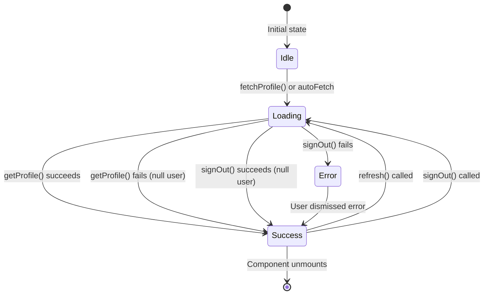
```mermaid
stateDiagram-v2
    [*] --> Idle: Initial state
    Idle --> Loading: fetchProfile() or autoFetch
    Loading --> Success: getProfile() succeeds
    Loading --> Success: getProfile() fails (null user)
    Success --> Loading: refresh() called
    Success --> Loading: signOut() called
    Loading --> Success: signOut() succeeds (null user)
    Loading --> Error: signOut() fails
    Error --> Success: User dismissed error
    Success --> [*]: Component unmounts
```

### Auth Store (Zustand) Flow

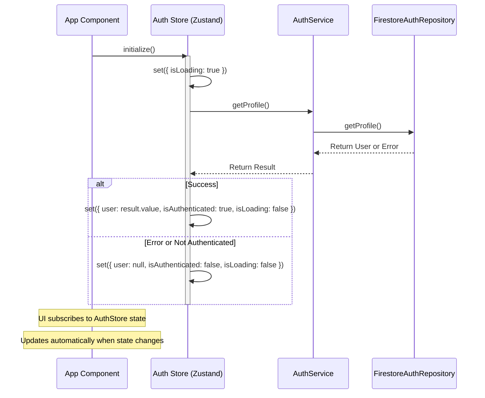
```mermaid
sequenceDiagram
    participant UI as App Component
    participant AuthStore as Auth Store (Zustand)
    participant Service as AuthService
    participant AuthRepo as FirestoreAuthRepository

    UI->>AuthStore: initialize()
    activate AuthStore
    AuthStore->>AuthStore: set({ isLoading: true })
    AuthStore->>Service: getProfile()
    Service->>AuthRepo: getProfile()
    AuthRepo-->>Service: Return User or Error
    Service-->>AuthStore: Return Result
    
    alt Success
        AuthStore->>AuthStore: set({ user: result.value, isAuthenticated: true, isLoading: false })
    else Error or Not Authenticated
        AuthStore->>AuthStore: set({ user: null, isAuthenticated: false, isLoading: false })
    end
    deactivate AuthStore
    
    Note over UI: UI subscribes to AuthStore state
    Note over UI: Updates automatically when state changes
```

### Auth Initialization on App Start

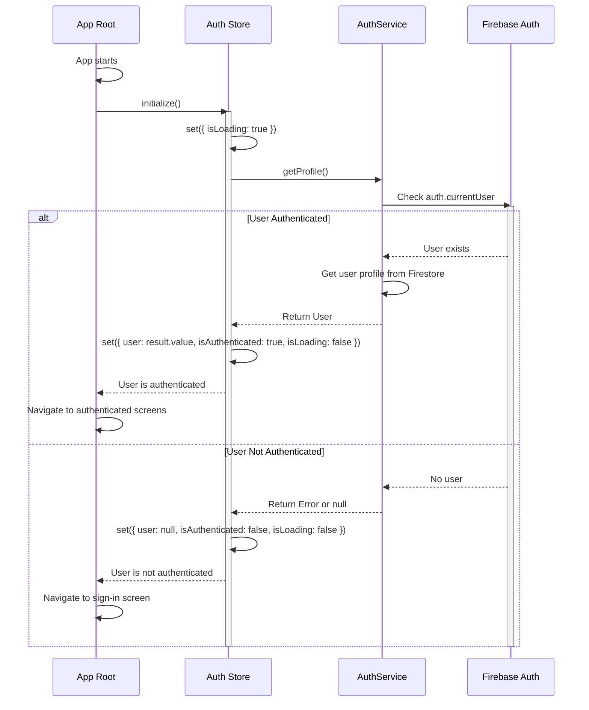
```mermaid
sequenceDiagram
    participant App as App Root
    participant AuthStore as Auth Store
    participant Service as AuthService
    participant Firebase as Firebase Auth

    App->>App: App starts
    App->>AuthStore: initialize()
    activate AuthStore
    AuthStore->>AuthStore: set({ isLoading: true })
    AuthStore->>Service: getProfile()
    Service->>Firebase: Check auth.currentUser
    activate Firebase
    
    alt User Authenticated
        Firebase-->>Service: User exists
        Service->>Service: Get user profile from Firestore
        Service-->>AuthStore: Return User
        AuthStore->>AuthStore: set({ user: result.value, isAuthenticated: true, isLoading: false })
        AuthStore-->>App: User is authenticated
        App->>App: Navigate to authenticated screens
    else User Not Authenticated
        Firebase-->>Service: No user
        Service-->>AuthStore: Return Error or null
        AuthStore->>AuthStore: set({ user: null, isAuthenticated: false, isLoading: false })
        AuthStore-->>App: User is not authenticated
        App->>App: Navigate to sign-in screen
    end
    deactivate Firebase
    deactivate AuthStore
```

---

## Data Structures

### SignUpInput Structure

```typescript
interface SignUpInput {
  email: string;                    // Valid email format
  password: string;                  // Min 8 chars, complexity requirements
  confirmPassword: string;           // Must match password
  displayName: string;              // 1-100 characters, trimmed
  subscriptionPlan: SubscriptionPlan; // FREE | PRO | STUDIO
  acceptTerms: boolean;             // Must be true
  acceptPrivacy: boolean;           // Must be true
  acceptMarketing?: boolean;        // Optional
}
```

### SignInInput Structure

```typescript
interface SignInInput {
  email: string;                    // Valid email format
  password: string;                  // Min 8 chars
  rememberMe?: boolean;             // Optional, default: false
}
```

### PasswordResetInput Structure

```typescript
interface PasswordResetInput {
  email: string;                    // Valid email format
}
```

### PasswordResetConfirm Structure

```typescript
interface PasswordResetConfirm {
  password: string;                  // Min 8 chars, complexity requirements
  confirmPassword: string;           // Must match password
  token: string;                     // Reset token from email link
}
```

### PasswordChangeInput Structure

```typescript
interface PasswordChangeInput {
  currentPassword: string;          // Current password
  newPassword: string;              // Min 8 chars, complexity requirements
  confirmPassword: string;          // Must match newPassword
  // Validation: newPassword !== currentPassword
}
```

### EmailVerification Structure

```typescript
interface EmailVerification {
  token: string;                    // Verification token from email link
  email: string;                    // User's email address
}
```

---

## Validation & Sanitization

### Validation Rules

**Sign-Up Validation** (`signUpInputSchema`):
- `email`: Must be valid email format
- `password`: Min 8 characters, complexity requirements
- `confirmPassword`: Must match `password`
- `displayName`: 1-100 characters, trimmed
- `subscriptionPlan`: Must be valid `SubscriptionPlan` enum
- `acceptTerms`: Must be `true`
- `acceptPrivacy`: Must be `true`
- `acceptMarketing`: Optional boolean

**Sign-In Validation** (`signInInputSchema`):
- `email`: Must be valid email format
- `password`: Min 8 characters
- `rememberMe`: Optional boolean, default `false`

**Password Reset Validation** (`passwordResetInputSchema`):
- `email`: Must be valid email format

**Password Reset Confirm Validation** (`passwordResetConfirmSchema`):
- `password`: Min 8 characters, complexity requirements
- `confirmPassword`: Must match `password`
- `token`: Required string, min 1 character

**Password Change Validation** (`passwordChangeInputSchema`):
- `currentPassword`: Min 8 characters
- `newPassword`: Min 8 characters, complexity requirements
- `confirmPassword`: Must match `newPassword`
- Custom refinement: `newPassword !== currentPassword`

**Email Verification Validation** (`emailVerificationSchema`):
- `token`: Required string, min 1 character, trimmed
- `email`: Must be valid email format

### Sanitization Process

**Email Sanitization**:
```typescript
function sanitizeEmail(email: string): string | null {
  // 1. Trim whitespace
  const trimmed = sanitizeString(email);
  if (!trimmed) return null;
  
  // 2. Convert to lowercase
  const lowercased = trimmed.toLowerCase();
  
  // 3. Basic email regex check
  const emailRegex = /^[^\s@]+@[^\s@]+\.[^\s@]+$/;
  if (!emailRegex.test(lowercased)) return null;
  
  return lowercased;
}
```

**Display Name Sanitization**:
```typescript
// Trimmed and validated (1-100 chars)
const sanitized = sanitizeString(displayName); // Trim only
// Length validation handled by Zod schema
```

**Password**: No sanitization (handled by Firebase Auth)

---

## Error Handling

### Error Types

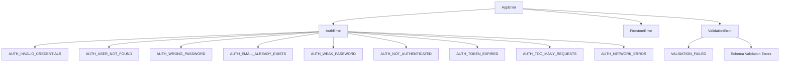
```mermaid
graph TD
    A[AppError] --> B[AuthError]
    A --> C[FirestoreError]
    A --> D[ValidationError]
    
    B --> E[AUTH_INVALID_CREDENTIALS]
    B --> F[AUTH_USER_NOT_FOUND]
    B --> G[AUTH_WRONG_PASSWORD]
    B --> H[AUTH_EMAIL_ALREADY_EXISTS]
    B --> I[AUTH_WEAK_PASSWORD]
    B --> J[AUTH_NOT_AUTHENTICATED]
    B --> K[AUTH_TOKEN_EXPIRED]
    B --> L[AUTH_TOO_MANY_REQUESTS]
    B --> M[AUTH_NETWORK_ERROR]
    
    D --> N[VALIDATION_FAILED]
    D --> O[Schema Validation Errors]
```

### Error Mapping (Firebase Auth Errors)

| Firebase Error Code | Mapped Error | User Message |
|---------------------|--------------|--------------|
| `auth/user-not-found` | `AUTH_USER_NOT_FOUND` | "User not found" |
| `auth/wrong-password` | `AUTH_WRONG_PASSWORD` | "Invalid password" |
| `auth/email-already-in-use` | `AUTH_EMAIL_ALREADY_EXISTS` | "This email is already registered" |
| `auth/weak-password` | `AUTH_WEAK_PASSWORD` | "Password is too weak" |
| `auth/invalid-email` | `AUTH_INVALID_CREDENTIALS` | "Invalid email address" |
| `auth/requires-recent-login` | `AUTH_NOT_AUTHENTICATED` | "Please sign in again" |
| `auth/expired-action-code` | `AUTH_TOKEN_EXPIRED` | "Reset link has expired" |
| `auth/invalid-action-code` | `AUTH_INVALID_CREDENTIALS` | "Invalid verification link" |
| `auth/too-many-requests` | `AUTH_TOO_MANY_REQUESTS` | "Too many requests. Please try again later" |
| `auth/network-request-failed` | `AUTH_NETWORK_ERROR` | "Network error. Please check your connection" |

### Error Handling Flow

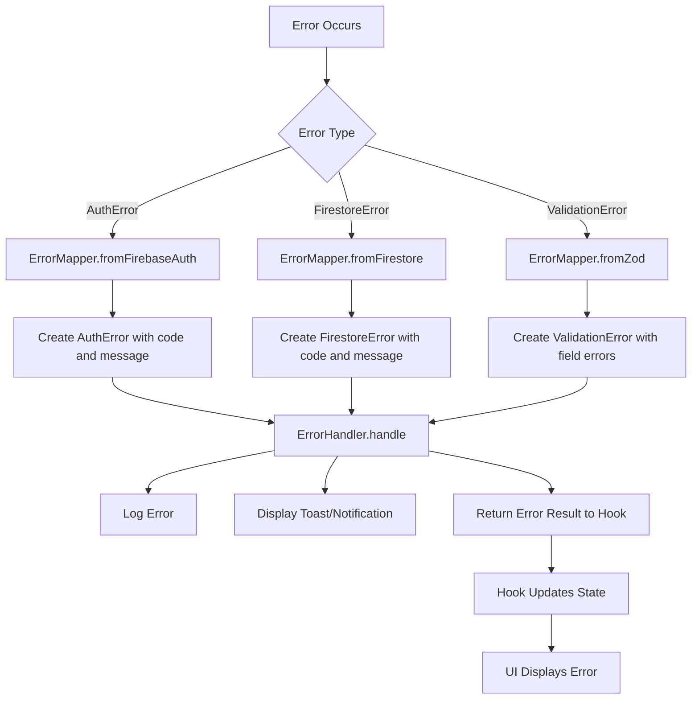
```mermaid
graph TD
    A[Error Occurs] --> B{Error Type}
    B -->|AuthError| C[ErrorMapper.fromFirebaseAuth]
    B -->|FirestoreError| D[ErrorMapper.fromFirestore]
    B -->|ValidationError| E[ErrorMapper.fromZod]
    
    C --> F[Create AuthError with code and message]
    D --> G[Create FirestoreError with code and message]
    E --> H[Create ValidationError with field errors]
    
    F --> I[ErrorHandler.handle]
    G --> I
    H --> I
    
    I --> J[Log Error]
    I --> K[Display Toast/Notification]
    I --> L[Return Error Result to Hook]
    
    L --> M[Hook Updates State]
    M --> N[UI Displays Error]
```

---

## Loading States

### State Transitions

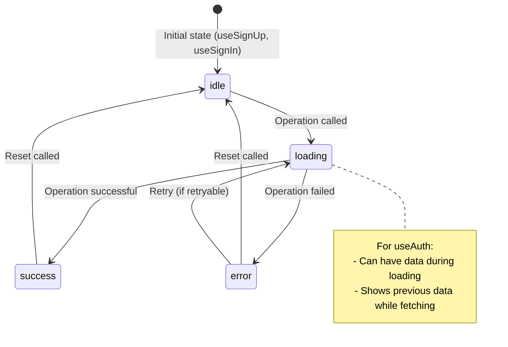
```mermaid
stateDiagram-v2
    [*] --> idle: Initial state (useSignUp, useSignIn)
    idle --> loading: Operation called
    loading --> success: Operation successful
    loading --> error: Operation failed
    success --> idle: Reset called
    error --> idle: Reset called
    error --> loading: Retry (if retryable)
    
    note right of loading
        For useAuth:
        - Can have data during loading
        - Shows previous data while fetching
    end note
```

### LoadingState Type

```typescript
type LoadingState<T> =
  | { status: 'idle' }                          // Initial (useSignUp, useSignIn)
  | { status: 'loading'; data?: T }          // Loading with optional previous data
  | { status: 'success'; data: T }          // Success with data
  | { status: 'error'; error: AppError }     // Error state
```

### Loading State Examples

**useSignUp / useSignIn**:
```typescript
// Initial
const [state, setState] = useState<LoadingState<User>>({ status: 'idle' });

// Loading
setState(loading());

// Success
setState(success(user));

// Error
setState(error(error));
```

**useAuth**:
```typescript
// Initial (with previous data preserved)
const [state, setState] = useState<LoadingState<User | null>>(loading());

// Loading (preserves previous data)
setState(loading(getCurrentData(state)));

// Success
setState(success(user)); // or success(null) if not authenticated

// Error
setState(error(error, getCurrentData(state))); // Preserves previous data
```

---

## File Structure

### Key Files

| File | Purpose |
|------|---------|
| `src/repositories/i-auth-repository.ts` | Port interface definition |
| `src/repositories/firestore/firestore-auth-repository.ts` | Repository implementation |
| `src/services/auth-service.ts` | Business logic layer |
| `src/hooks/use-auth.ts` | React hooks (useAuth, useSignUp, useSignIn, usePasswordReset, useEmailVerification) |
| `src/stores/use-auth-store.ts` | Zustand global auth state store |
| `src/domain/user/auth.schema.ts` | Zod schemas for auth inputs |
| `src/config/firebaseConfig.ts` | Firebase Auth initialization |

---

## Hooks Usage

### useAuth Hook

```typescript
const {
  user,
  isAuthenticated,
  state,
  loading,
  error,
  fetchProfile,
  signOut,
  refresh,
} = useAuth({ autoFetch: true });

// Check if authenticated
if (isAuthenticated) {
  // Show authenticated content
}

// Sign out
await signOut();
```

### useSignUp Hook

```typescript
const {
  state,
  loading,
  error,
  user,
  signUp,
  reset,
} = useSignUp();

// Sign up
const success = await signUp({
  email: 'user@example.com',
  password: 'password123',
  confirmPassword: 'password123',
  displayName: 'John Doe',
  subscriptionPlan: SubscriptionPlan.PRO,
  acceptTerms: true,
  acceptPrivacy: true,
  acceptMarketing: false,
});

if (success) {
  // Navigate to next screen
}

// Reset state
reset();
```

### useSignIn Hook

```typescript
const {
  state,
  loading,
  error,
  user,
  signIn,
  reset,
} = useSignIn();

// Sign in
const success = await signIn({
  email: 'user@example.com',
  password: 'password123',
  rememberMe: true,
});

if (success) {
  // Navigate to authenticated screens
}
```

### usePasswordReset Hook

```typescript
const {
  state,
  loading,
  error,
  sendResetEmail,
  confirmReset,
  changePassword,
  reset,
} = usePasswordReset();

// Send reset email
await sendResetEmail({ email: 'user@example.com' });

// Confirm reset (from email link)
await confirmReset({
  token: 'reset-token-from-email',
  password: 'newpassword123',
  confirmPassword: 'newpassword123',
});

// Change password (when logged in)
await changePassword({
  currentPassword: 'oldpassword',
  newPassword: 'newpassword123',
  confirmPassword: 'newpassword123',
});
```

### useEmailVerification Hook

```typescript
const {
  state,
  loading,
  error,
  verifyEmail,
  resendVerification,
  reset,
} = useEmailVerification();

// Verify email (from email link)
await verifyEmail({
  token: 'verification-token-from-email',
  email: 'user@example.com',
});

// Resend verification email
await resendVerification();
```

### useAuthStore (Zustand)

```typescript
const {
  user,
  isLoading,
  isAuthenticated,
  error,
  signIn,
  signUp,
  signOut,
  initialize,
  clearError,
} = useAuthStore();

// Initialize on app start
await initialize();

// Sign in
const success = await signIn(email, password);

// Sign out
await signOut();

// Clear error
clearError();
```

---

## Ports & Adapters

### Architecture Pattern

- **Port**: `IAuthRepository` interface
- **Adapter**: `FirestoreAuthRepository` implementation
- **Service**: `AuthService` business logic
- **Hook**: `useAuth`, `useSignUp`, `useSignIn`, `usePasswordReset`, `useEmailVerification` React hooks
- **Store**: `useAuthStore` Zustand store for global state

### Dependency Injection

```typescript
// Service Factory creates service with repositories
const authService = new AuthService(authRepository, userRepository);
```

### Repository Methods

| Method | Purpose |
|--------|---------|
| `signUp(payload)` | Register new user, create Firebase Auth user and Firestore user document |
| `signIn(payload)` | Authenticate user, fetch user profile, update last login |
| `signOut()` | Sign out current user |
| `passwordReset(payload)` | Send password reset email |
| `passwordResetConfirm(payload)` | Confirm password reset with token |
| `passwordChange(payload)` | Change password for authenticated user |
| `getProfile()` | Get current authenticated user's profile |
| `verifyEmail(payload)` | Verify email with token |
| `resendEmailVerification()` | Resend verification email |

---

## Simple Explanations

### What is Authentication?

**Authentication** is the process of verifying who you are. It includes:
- **Signing Up**: Creating a new account with email and password
- **Signing In**: Logging in with your email and password
- **Signing Out**: Logging out of your account
- **Password Reset**: Resetting your password if you forget it
- **Email Verification**: Confirming your email address is real

### What Happens When You Sign Up?

1. **Validate Your Input**: System checks email format, password strength, terms acceptance
2. **Clean Your Email**: Email is trimmed and converted to lowercase
3. **Create Account**: Firebase Auth creates your account with email and password
4. **Send Verification Email**: System sends you an email to verify your address
5. **Create Your Profile**: System creates your full profile in Firestore with:
   - Your name (parsed from display name)
   - Default preferences (notifications on, dark mode off, etc.)
   - Your subscription plan
   - Setup flags (first time setup = true)
   - Empty projects list
6. **Handle Errors**: If profile creation fails, the system automatically deletes the Firebase Auth account to prevent orphaned accounts
7. **Welcome**: You're signed in and redirected to onboarding

### What Happens When You Sign In?

1. **Validate Input**: System checks email format and password
2. **Clean Email**: Email is sanitized (trimmed, lowercased)
3. **Authenticate**: Firebase Auth checks your credentials
4. **Fetch Profile**: System retrieves your full profile from Firestore
5. **Update Last Login**: System records when you last signed in
6. **Welcome Back**: You're signed in and redirected to your dashboard

### What is Password Reset?

**Password Reset** lets you create a new password if you forgot your old one:

1. **Enter Email**: You enter your email address
2. **Send Email**: System sends you a password reset link
3. **Click Link**: You click the link in your email (contains a special token)
4. **Enter New Password**: You enter and confirm your new password
5. **Reset Password**: System updates your password in Firebase Auth

**Security**: Even if the email doesn't exist, the system says "email sent" to prevent email enumeration attacks.

### What is Email Verification?

**Email Verification** confirms your email address is real:

1. **Receive Email**: After sign-up, you get a verification email
2. **Click Link**: You click the verification link (contains a token)
3. **Verify**: System marks your email as verified
4. **Update Status**: Your user profile is updated with `isEmailVerified: true`

**Benefits**: 
- Proves you own the email address
- Required for certain features
- Prevents fake accounts

### What is Password Change?

**Password Change** lets you update your password when you're logged in:

1. **Enter Current Password**: You enter your current password
2. **Enter New Password**: You enter your new password twice
3. **Validate**: System checks:
   - New password matches confirmation
   - New password is different from current password
   - New password meets strength requirements
4. **Update**: System updates your password in Firebase Auth

**Note**: Some operations (like changing password) require recent login for security.

### How Does Auth State Management Work?

**Auth State Management** keeps track of whether you're logged in:

1. **useAuth Hook**: Manages current user state in a component
   - Fetches profile on mount
   - Updates when you sign in/out
   - Provides loading states

2. **Auth Store (Zustand)**: Global state management
   - Shared across entire app
   - Automatically updates when auth state changes
   - Initializes on app start

3. **Firebase Auth Persistence**: Firebase remembers your session
   - Stays logged in between app restarts
   - Automatically checks auth state on app start

### What Happens When You Sign Out?

1. **Call Firebase Sign Out**: System calls Firebase Auth `signOut()`
2. **Clear Auth State**: Global auth state is cleared (user = null)
3. **Navigate**: You're redirected to sign-in screen
4. **Clear Cache**: Any cached user data is cleared
5. **Reset State**: App state is reset for next user

### Error Handling Explained

**Common Errors**:
- **Invalid Credentials**: Wrong email or password
- **Email Already Exists**: Email is already registered (during sign-up)
- **Weak Password**: Password doesn't meet requirements
- **User Not Found**: Email doesn't exist (during sign-in)
- **Token Expired**: Reset/verification link expired
- **Network Error**: No internet connection
- **Too Many Requests**: Rate limit exceeded (try again later)

**Error Flow**:
1. Error occurs (Firebase Auth, Firestore, Validation)
2. Error is mapped to user-friendly message
3. Error is logged for debugging
4. Toast/notification is displayed to user
5. Error is returned to hook
6. Hook updates state with error
7. UI displays error message

### Cleanup on Sign-Up Failure

**Problem**: If Firebase Auth user is created but Firestore user document creation fails, you'd have an "orphaned" account.

**Solution**: Automatic cleanup:
1. If user document creation fails after Firebase Auth user is created
2. System automatically deletes the Firebase Auth user
3. Prevents orphaned accounts
4. Returns error to user

**Note**: Cleanup errors are logged but don't fail the operation (best effort).

### Default Values on Sign-Up

When you sign up, the system sets these defaults:

- **Preferences**: Notifications on, dark mode off, English language, metric units, UTC timezone
- **Subscription**: Your chosen plan, active, auto-renew on, monthly billing
- **Setup**: First time setup = true, show onboarding = true, all customizations = false
- **Projects**: Zero active and total projects
- **Role**: USER (not admin)
- **Status**: Active, not banned, email not verified initially

---

## Summary Flow Charts

### Complete Authentication Lifecycle

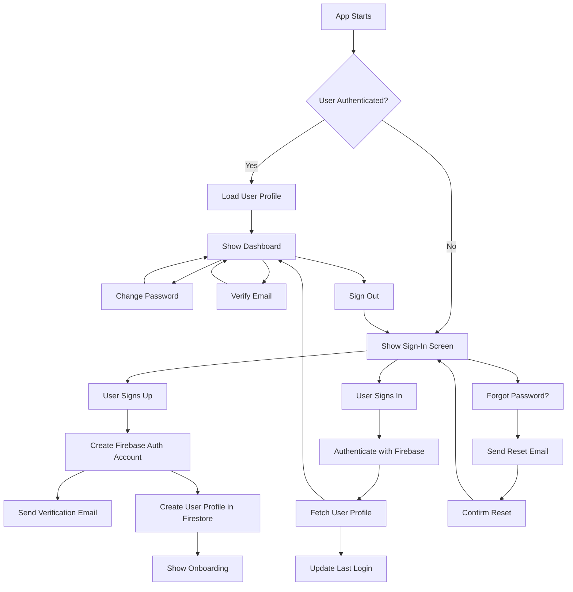
```mermaid
graph TD
    Start[App Starts] --> CheckAuth{User Authenticated?}
    CheckAuth -->|Yes| LoadProfile[Load User Profile]
    CheckAuth -->|No| ShowSignIn[Show Sign-In Screen]
    
    ShowSignIn --> SignIn[User Signs In]
    ShowSignIn --> SignUp[User Signs Up]
    
    SignUp --> CreateAccount[Create Firebase Auth Account]
    CreateAccount --> SendVerification[Send Verification Email]
    CreateAccount --> CreateProfile[Create User Profile in Firestore]
    CreateProfile --> Onboarding[Show Onboarding]
    
    SignIn --> Authenticate[Authenticate with Firebase]
    Authenticate --> FetchProfile[Fetch User Profile]
    FetchProfile --> UpdateLogin[Update Last Login]
    FetchProfile --> Dashboard[Show Dashboard]
    
    LoadProfile --> Dashboard
    
    Dashboard --> ChangePassword[Change Password]
    Dashboard --> VerifyEmail[Verify Email]
    Dashboard --> SignOut[Sign Out]
    
    ChangePassword --> Dashboard
    VerifyEmail --> Dashboard
    SignOut --> ShowSignIn
    
    ShowSignIn --> ForgotPassword[Forgot Password?]
    ForgotPassword --> ResetEmail[Send Reset Email]
    ResetEmail --> ResetConfirm[Confirm Reset]
    ResetConfirm --> ShowSignIn
```

### Auth State Transitions

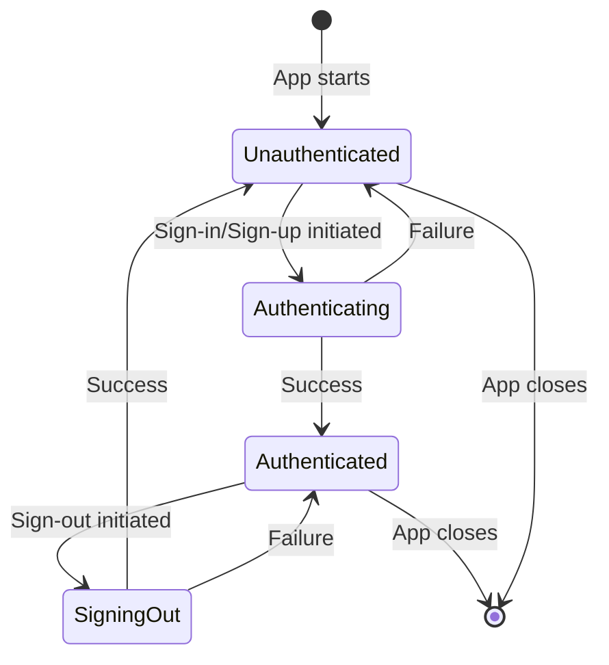
```mermaid
stateDiagram-v2
    [*] --> Unauthenticated: App starts
    Unauthenticated --> Authenticating: Sign-in/Sign-up initiated
    Authenticating --> Authenticated: Success
    Authenticating --> Unauthenticated: Failure
    Authenticated --> SigningOut: Sign-out initiated
    SigningOut --> Unauthenticated: Success
    SigningOut --> Authenticated: Failure
    Authenticated --> [*]: App closes
    Unauthenticated --> [*]: App closes
```

---

## Key Takeaways

1. **Sign-Up Flow**: Creates Firebase Auth user, sends verification email, creates Firestore user document with defaults, handles cleanup on failure
2. **Sign-In Flow**: Authenticates with Firebase Auth, fetches user profile, updates last login timestamp
3. **Sign-Out Flow**: Calls Firebase sign out, clears global auth state, navigates to sign-in
4. **Password Reset**: Two-step process (send email, confirm with token)
5. **Password Change**: Requires authentication, validates current password and new password requirements
6. **Email Verification**: Verifies email with token, updates user document status
7. **Auth State Management**: Both hook-based (`useAuth`) and store-based (`useAuthStore`) for different use cases
8. **Error Handling**: Comprehensive error mapping from Firebase Auth errors to user-friendly messages
9. **Validation**: Zod schema validation at service layer for all inputs
10. **Sanitization**: Email sanitization (trim, lowercase, basic regex) before Firebase Auth operations
11. **Cleanup**: Automatic cleanup of orphaned Firebase Auth accounts if Firestore user creation fails
12. **Default Values**: Comprehensive default values applied during sign-up (preferences, subscription, setup, projects)

---

*Document generated: 2025-01-XX*
*Last updated: Based on current codebase structure*

