# Complete Business Card Processes Documentation

## Overview

This document traces **all** business card processes including saving data, creating QR codes and vCards, capturing screenshots, uploading to Firebase Storage, updating user documents, updating/deleting cards, and loading/displaying images.

---

## Table of Contents

1. [High-Level Architecture](#high-level-architecture)
2. [Complete Business Card Flow](#complete-business-card-flow)
3. [Save Business Card Data Flow](#save-business-card-data-flow)
4. [QR Code Generation Flow](#qr-code-generation-flow)
5. [vCard Generation Flow](#vcard-generation-flow)
6. [Screenshot Capture Flow](#screenshot-capture-flow)
7. [Image Upload to Firebase Storage Flow](#image-upload-to-firebase-storage-flow)
8. [Update User Document Flow](#update-user-document-flow)
9. [Update Business Card Flow](#update-business-card-flow)
10. [Delete Business Card Flow](#delete-business-card-flow)
11. [Load and Display Image Flow](#load-and-display-image-flow)
12. [Data Structures](#data-structures)
13. [Validation & Sanitization](#validation--sanitization)
14. [Error Handling](#error-handling)
15. [Loading States](#loading-states)
16. [File Structure](#file-structure)
17. [Hooks Usage](#hooks-usage)
18. [Ports & Adapters](#ports--adapters)
19. [Simple Explanations](#simple-explanations)

---

## High-Level Architecture

### Architecture Overview

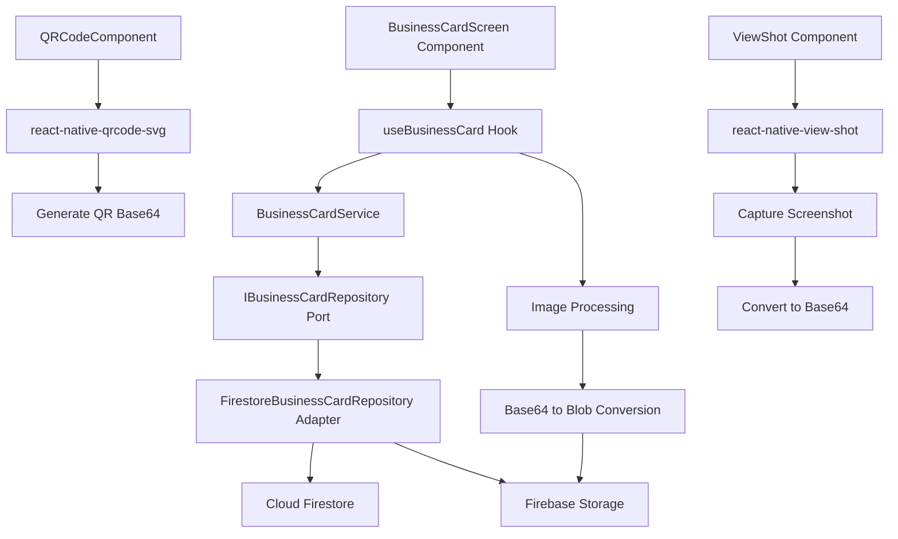

### Data Flow Hierarchy

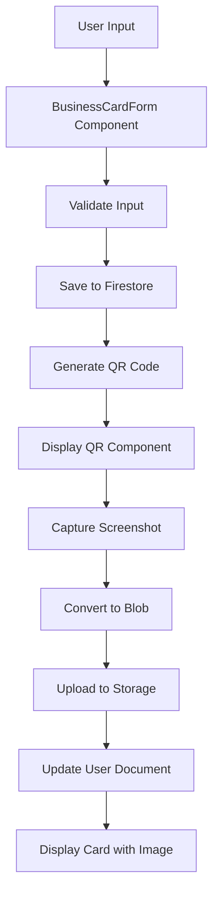

---

## Complete Business Card Flow

### End-to-End Save with QR Code Flow

```mermaid
sequenceDiagram
    participant UI as BusinessCardScreen Component
    participant Form as BusinessCardForm Component
    participant QRComp as QRCodeComponent
    participant ViewShot as ViewShot Component
    participant Hook as useBusinessCard Hook
    participant Service as BusinessCardService
    participant Repo as FirestoreBusinessCardRepository
    participant QRGen as react-native-qrcode-svg
    participant ScreenCap as react-native-view-shot
    participant Storage as Firebase Storage
    participant Firestore as Cloud Firestore
    participant ErrorHandler as Error Handler

    UI->>Form: User fills form and clicks "Save"
    activate Form
    Form->>Form: Validate businessCardInputSchema
    
    alt Validation Fails
        Form-->>UI: Show validation errors
    else Validation Success
        Form->>QRGen: Generate QR Code from card data
        activate QRGen
        QRGen->>QRGen: Create QR with vCard data or URL
        QRGen-->>Form: Return QR SVG/Image (base64)
        deactivate QRGen
        
        Form->>ViewShot: Capture screenshot of QR component
        activate ViewShot
        ViewShot->>ScreenCap: captureRef(cardViewRef)
        ScreenCap->>ScreenCap: Capture view as image
        ScreenCap-->>ViewShot: Return base64 image data URL
        ViewShot-->>Form: Return base64 image
        deactivate ViewShot
        
        Form->>Hook: saveCardWithQR(cardData, qrImageData)
        activate Hook
        Hook->>Hook: setError(null)
        
        Hook->>Service: saveBusinessCardWithQR(userId, cardData, qrImageData)
        activate Service
        
        Service->>Service: Convert base64 to Blob
        activate Service
        Service->>Service: Extract base64 data (remove data:image/png;base64, prefix)
        Service->>Service: atob(base64Data) - Decode base64
        Service->>Service: Convert to Uint8Array
        Service->>Service: Create Blob([byteArray], { type: 'image/png' })
        alt Conversion Fails
            Service-->>Hook: Return IMAGE_NOT_FOUND Error
            Hook->>ErrorHandler: handleError(error)
        else Conversion Success
            deactivate Service
        end
        
        Service->>Repo: create(userId, cardData)
        activate Repo
        Repo->>Repo: Validate businessCardInputSchema
        Repo->>Firestore: updateDoc(doc('users', userId), {businessCard: newCard, 'setup.customBusinessCardSetup': true})
        activate Firestore
        alt Write Fails
            Firestore-->>Repo: Error
            Repo->>Repo: ErrorMapper.fromFirestore(error)
            Repo-->>Service: Return Error Result
            Service-->>Hook: Return Error Result
            Hook->>ErrorHandler: handleError(error)
        else Write Success
            Firestore-->>Repo: Success
        end
        deactivate Firestore
        Repo-->>Service: Return BusinessCard
        deactivate Repo
        
        Service->>Repo: uploadQRImage(userId, qrImageBlob)
        activate Repo
        Repo->>Storage: uploadBytes(ref('business-cards/{userId}/user-business-card-qr.png'), blob)
        activate Storage
        alt Upload Fails
            Storage-->>Repo: Error
            Repo->>Repo: ErrorMapper.fromFirestore(error)
            Repo-->>Service: Return Error Result
            Service-->>Hook: Return Error Result
            Hook->>ErrorHandler: handleError(error)
        else Upload Success
            Storage-->>Repo: Success
        end
        deactivate Storage
        
        Repo->>Storage: getDownloadURL(storageRef)
        activate Storage
        Storage-->>Repo: Return download URL
        deactivate Storage
        
        Repo->>Firestore: updateDoc(doc('users', userId), {'setup.businessCardPath': url})
        activate Firestore
        Firestore-->>Repo: Success
        deactivate Firestore
        Repo-->>Service: Return { qrImageUrl: url }
        deactivate Repo
        
        Service-->>Hook: Return Success Result
        deactivate Service
        
        Hook->>Hook: getCard() [Refresh card data]
        Hook-->>UI: Card saved with QR image URL
    end
    deactivate Hook
    deactivate Form
```

---

## Save Business Card Data Flow

### Create Business Card Flow


---

## QR Code Generation Flow

### QR Code Generation Process

```mermaid
sequenceDiagram
    participant UI as BusinessCardScreen Component
    participant QRComp as QRCodeComponent
    participant QRGen as react-native-qrcode-svg
    participant Service as BusinessCardService
    participant Repo as FirestoreBusinessCardRepository
    participant Storage as Firebase Storage

    UI->>QRComp: Render QRCodeComponent
    activate QRComp
    
    QRComp->>Hook: generateVCard()
    Hook->>Service: generateVCard(userId)
    Service->>Repo: generateVCard(userId, config)
    Repo->>Repo: getCard(userId)
    Repo->>Repo: Format vCard string
    Repo-->>Service: Return vCard string
    Service-->>Hook: Return vCard string
    Hook-->>QRComp: vCard data available
    
    QRComp->>QRGen: <QRCodeSVG value={vCard} size={300} />
    activate QRGen
    QRGen->>QRGen: Generate QR code matrix
    QRGen->>QRGen: Render as SVG/Image
    QRGen-->>QRComp: Display QR code
    
    alt User clicks "Save QR Code"
        QRComp->>QRComp: Capture QR as base64
        QRComp->>QRComp: Convert to data URL (data:image/png;base64,...)
        QRComp-->>UI: Return base64 image data
    end
    deactivate QRGen
    deactivate QRComp
```

### QR Code Component (Placeholder)

**Component Logic** (Placeholder):
```typescript
// BusinessCardQRCodeComponent.tsx
import QRCode from 'react-native-qrcode-svg';
import { View, ViewShot } from 'react-native-view-shot';
import { useBusinessCard } from '@/hooks/use-business-card';

const BusinessCardQRCodeComponent = () => {
  const { card, generateVCard } = useBusinessCard(userId);
  const [vCardData, setVCardData] = useState<string | null>(null);
  const qrRef = useRef<ViewShot>(null);

  useEffect(() => {
    const fetchVCard = async () => {
      const vCard = await generateVCard();
      setVCardData(vCard);
    };
    fetchVCard();
  }, [card]);

  const captureQRCode = async () => {
    if (!qrRef.current) return null;
    
    try {
      const uri = await qrRef.current.capture();
      // Convert to base64
      const base64 = await FileSystem.readAsStringAsync(uri, {
        encoding: FileSystem.EncodingType.Base64,
      });
      return `data:image/png;base64,${base64}`;
    } catch (error) {
      console.error('Failed to capture QR code:', error);
      return null;
    }
  };

  if (!vCardData) return <LoadingIndicator />;

  return (
    <ViewShot ref={qrRef}>
      <QRCode
        value={vCardData}
        size={300}
        backgroundColor="white"
        color="black"
      />
    </ViewShot>
  );
};
```

---

## vCard Generation Flow

### vCard Creation Process

```mermaid
sequenceDiagram
    participant UI as BusinessCardScreen Component
    participant Hook as useBusinessCard Hook
    participant Service as BusinessCardService
    participant Repo as FirestoreBusinessCardRepository
    participant Firestore as Cloud Firestore

    UI->>Hook: generateVCard()
    activate Hook
    Hook->>Service: generateVCard(userId, config?)
    activate Service
    Service->>Repo: generateVCard(userId, config)
    activate Repo
    
    Repo->>Firestore: getDoc(doc('users', userId))
    Firestore-->>Repo: Return user document
    Repo->>Repo: Extract businessCard from user data
    Repo->>Repo: Validate businessCardSchema
    
    alt Card Not Found
        Repo-->>Service: Return DB_NOT_FOUND Error
        Service-->>Hook: Return Error Result
        Hook->>Hook: setError(error)
    else Card Found
        Repo->>Repo: Build vCard string
        activate Repo
        Repo->>Repo: BEGIN:VCARD
        Repo->>Repo: VERSION:3.0 or 4.0
        Repo->>Repo: FN:displayName
        Repo->>Repo: ORG:company.companyName (if exists)
        Repo->>Repo: TITLE:company.jobTitle (if exists)
        Repo->>Repo: EMAIL:contact.email (if exists)
        Repo->>Repo: TEL:contact.phone (if exists)
        Repo->>Repo: ADR:;;address;;; (if exists)
        Repo->>Repo: URL:website (if exists)
        Repo->>Repo: END:VCARD
        Repo->>Repo: Filter empty lines and join with \n
        Repo-->>Repo: Return vCard string
        deactivate Repo
        
        Repo-->>Service: Return vCard string
        deactivate Repo
        Service-->>Hook: Return Success Result
        deactivate Service
        
        Hook->>Hook: Return vCard string
        Hook-->>UI: vCard data available
    end
    deactivate Hook
```

### vCard Format Example

```typescript
// Example vCard output
BEGIN:VCARD
VERSION:3.0
FN:John Doe
ORG:Acme Photography
TITLE:Lead Photographer
EMAIL:john@acme.com
TEL:+1234567890
ADR:;;123 Main St, New York, NY 10001;;;
URL:https://www.acmephoto.com
END:VCARD
```

---

## Screenshot Capture Flow

### Screenshot Process

```mermaid
sequenceDiagram
    participant UI as BusinessCardScreen Component
    participant CardView as BusinessCardView Component
    participant ViewShot as ViewShot Component
    participant ScreenCap as react-native-view-shot
    participant FileSystem as expo-file-system

    UI->>CardView: Render business card preview
    CardView->>ViewShot: Wrap card content in <ViewShot>
    activate ViewShot
    
    UI->>ViewShot: captureRef(cardViewRef)
    activate ScreenCap
    ScreenCap->>ScreenCap: Capture view as image
    ScreenCap->>FileSystem: Save to temporary file
    activate FileSystem
    FileSystem-->>ScreenCap: Return file URI
    deactivate FileSystem
    
    ScreenCap-->>ViewShot: Return image URI
    deactivate ScreenCap
    
    ViewShot->>FileSystem: readAsStringAsync(uri, { encoding: Base64 })
    activate FileSystem
    FileSystem-->>ViewShot: Return base64 string
    deactivate FileSystem
    
    ViewShot->>ViewShot: Format as data URL: data:image/png;base64,{base64}
    ViewShot-->>UI: Return base64 data URL
    deactivate ViewShot
```

### Screenshot Component (Placeholder)

**Component Logic** (Placeholder):
```typescript
// BusinessCardViewShotComponent.tsx
import { captureRef } from 'react-native-view-shot';
import * as FileSystem from 'expo-file-system';
import { View } from 'react-native';
import { useRef } from 'react';

const BusinessCardViewShotComponent = ({ card }: { card: BusinessCard }) => {
  const cardViewRef = useRef<View>(null);

  const captureCardScreenshot = async (): Promise<string | null> => {
    if (!cardViewRef.current) return null;

    try {
      // Capture view as image
      const uri = await captureRef(cardViewRef, {
        format: 'png',
        quality: 1.0,
        result: 'tmpfile', // or 'data-uri'
      });

      // If not already base64, convert to base64
      if (uri.startsWith('file://')) {
        const base64 = await FileSystem.readAsStringAsync(uri, {
          encoding: FileSystem.EncodingType.Base64,
        });
        return `data:image/png;base64,${base64}`;
      }

      // If already data URI, return as is
      return uri;
    } catch (error) {
      console.error('Failed to capture screenshot:', error);
      return null;
    }
  };

  return (
    <View ref={cardViewRef} collapsable={false}>
      {/* Business card UI content */}
      <BusinessCardContent card={card} />
    </View>
  );
};
```

---

## Image Upload to Firebase Storage Flow

### Upload Process

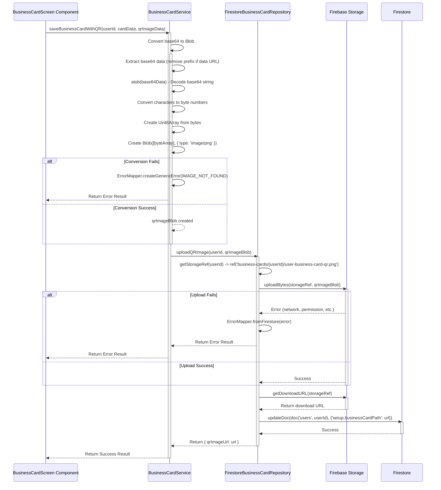

---

## Update User Document Flow

### Update User Document with Image Path

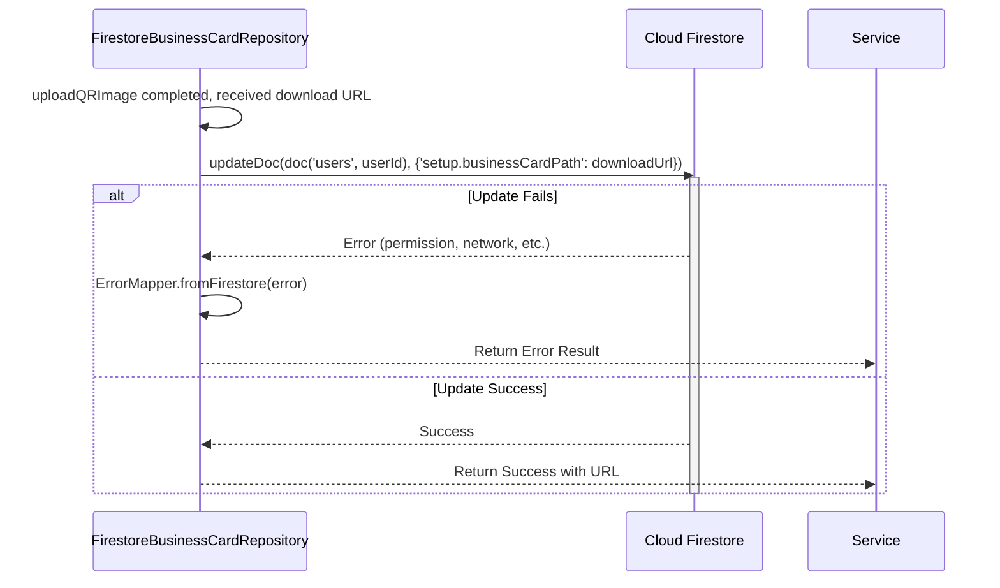

---

## Update Business Card Flow

### Update Business Card Process

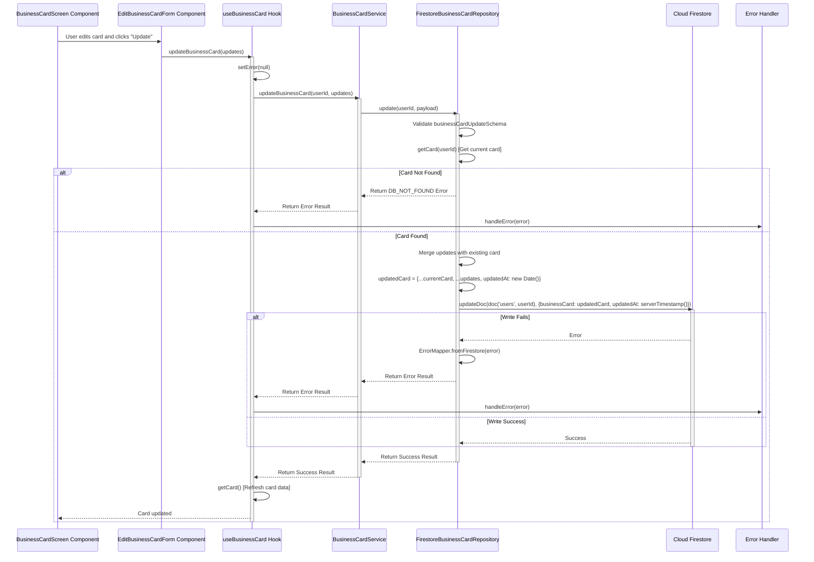

### Partial Updates

**Update Contact**:
```typescript
// Update only contact information
await updateContact({
  email: 'newemail@example.com',
  phone: '+1234567890',
});
```

**Update Customizations**:
```typescript
// Update only customizations
await updateCustomizations({
  primaryColor: '#FF5733',
  logoUrl: 'https://example.com/logo.png',
});
```

**Update Social Media**:
```typescript
// Update only social media
await updateSocialMedia({
  instagram: '@newhandle',
  twitter: '@newhandle',
});
```

---

## Delete Business Card Flow

### Delete Process

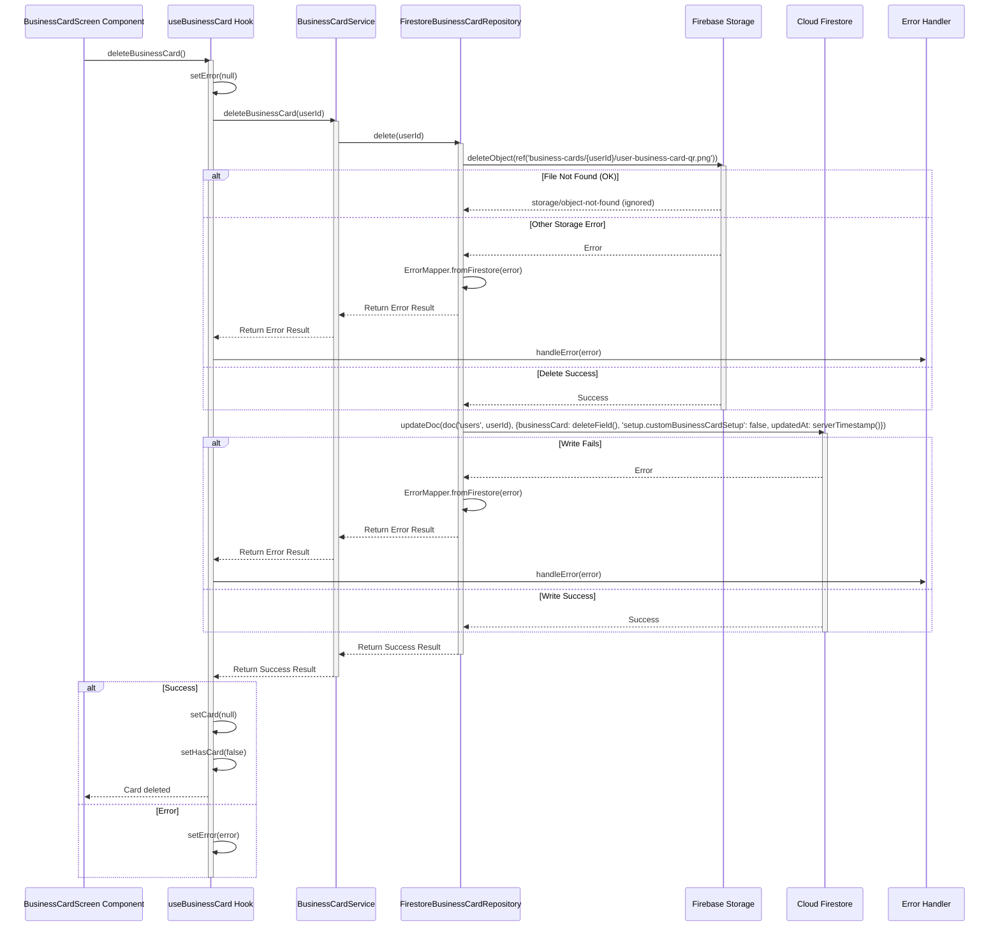

---

## Load and Display Image Flow

### Load QR Image from Storage

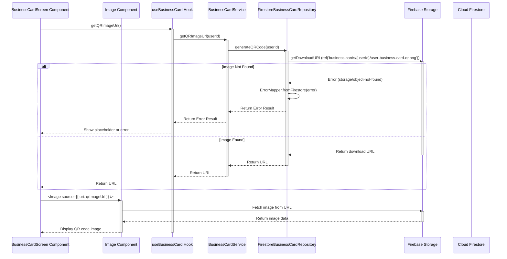

### Alternative: Load from User Document

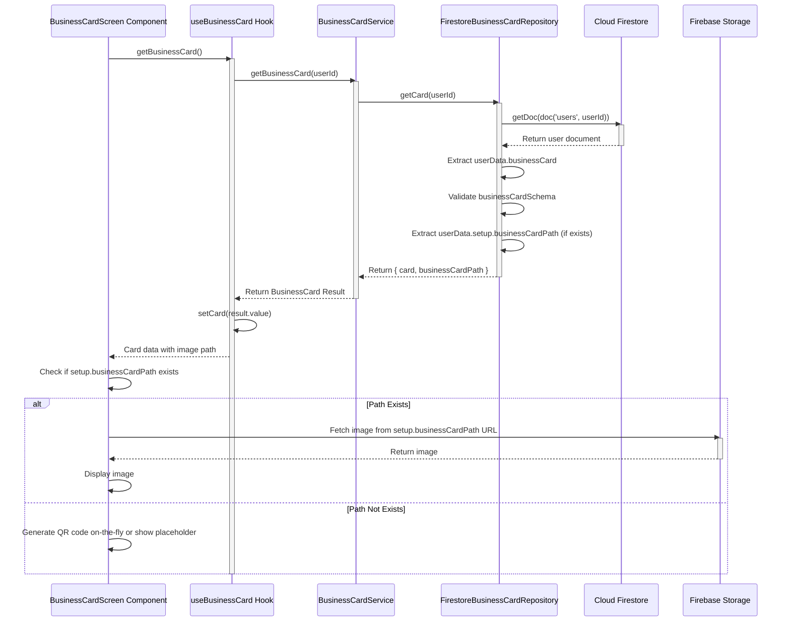

---

## Data Structures

### BusinessCard Structure

```typescript
interface BusinessCard {
  id: string;                           // User ID
  name: PersonInfo;                     // { firstName, lastName }
  displayName: string;                  // 1-100 chars, trimmed
  company?: BusinessInfo;              // { companyName, jobTitle }
  address?: AddressInfo;               // Address object or string
  website?: string | null;             // Valid URL or null
  contact?: ContactInfo;               // { email, phone }
  socialMedia?: SocialMediaInfo;       // { instagram, twitter, facebook, linkedIn }
  customizations?: CustomizationsInfo | null;  // { primaryColor, logoUrl, etc. }
  notes?: string;                      // Max 2000 chars
  createdAt?: Date;
  updatedAt?: Date;
}
```

### BusinessCardInput Structure

```typescript
interface BusinessCardInput {
  name: PersonInfo;
  displayName: string;
  company?: BusinessInfo;
  address?: AddressInfo;
  website?: string | null;
  contact?: ContactInfo;
  socialMedia?: SocialMediaInfo;
  customizations?: CustomizationsInfo | null;
  notes?: string;
  // Excludes: id, createdAt, updatedAt
}
```

### Storage Path Structure

- **QR Image Path**: `business-cards/{userId}/user-business-card-qr.png`
- **User Document Path**: `users/{userId}`
- **Image URL Stored At**: `users/{userId}/setup/businessCardPath`

---

## Validation & Sanitization

### Validation Rules

**BusinessCardInput Validation**:
- Uses `businessCardInputSchema` (Zod schema)
- Validates all nested schemas: `personInfoSchema`, `businessInfoSchema`, `contactInfoSchema`, etc.
- `displayName`: Required, 1-100 characters, trimmed
- `website`: Optional, must be valid URL if provided
- `contact`: At least one contact method (email, phone, or website) required for complete card

**QR Code Config Validation**:
- `format`: 'png' | 'svg'
- `size`: Integer, min 100, max 1000, default 300
- `includeBackground`: Boolean, default true

**vCard Config Validation**:
- `version`: '3.0' | '4.0', default from DEFAULTS

### Sanitization Process

**Note**: The business card repository does not have explicit sanitization methods. Sanitization is handled at the schema validation level through Zod's `.trim()` and type coercion.

**String Fields**:
- `displayName`: Trimmed automatically by Zod schema
- All text fields: Trimmed by Zod `.trim()`

**Image Conversion**:
- Base64 string extracted from data URL
- Decoded using `atob()`
- Converted to `Uint8Array`
- Wrapped in `Blob` with `type: 'image/png'`

---

## Error Handling

### Error Types

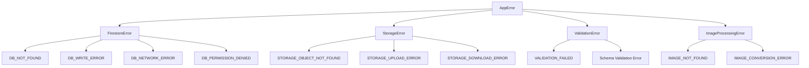

### Error Mapping

- **Business Card Not Found**: `DB_NOT_FOUND` - "Business card not found."
- **User Not Found**: `USER_NOT_FOUND` - "User not found."
- **Validation Errors**: `VALIDATION_FAILED` - Field-specific errors from Zod
- **Storage Upload Errors**: `STORAGE_UPLOAD_ERROR` - "Failed to upload image. Please try again."
- **Storage Download Errors**: `STORAGE_DOWNLOAD_ERROR` - "Failed to load image."
- **Image Conversion Errors**: `IMAGE_NOT_FOUND` or `IMAGE_CONVERSION_ERROR` - "Failed to process QR image. Please try again."
- **Network Errors**: `DB_NETWORK_ERROR` - "Service temporarily unavailable."
- **Permission Errors**: `DB_PERMISSION_DENIED` - "You do not have permission."

### Error Handling Strategy

1. **Non-Critical Storage Deletion**: When deleting a business card, if the storage file doesn't exist, it's ignored (not treated as an error)
2. **Graceful Degradation**: If QR image can't be loaded, show placeholder or generate on-the-fly
3. **User-Friendly Messages**: All errors are mapped to user-friendly messages via `ErrorMapper`

---

## Loading States

### State Transitions

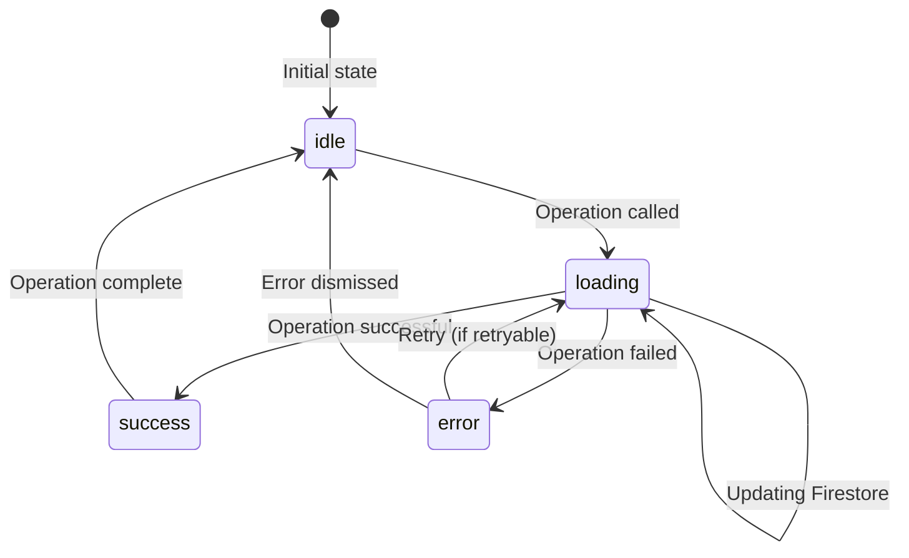

### Loading State Management

```typescript
const [card, setCard] = useState<BusinessCard | null>(null);
const [loading, setLoading] = useState(autoFetch);
const [error, setError] = useState<AppError | null>(null);
const [hasCard, setHasCard] = useState(false);

// Fetch operations
setLoading(true);  // Start
// ... async operation ...
setLoading(false); // End

// Optimistic updates (if applicable)
// Not used for business cards currently
```

---

## File Structure

### Key Files

| File | Purpose |
|------|---------|
| `src/repositories/i-business-card-repository.ts` | Port interface definition |
| `src/repositories/firestore/firestore-business-card-repository.ts` | Repository implementation (Firestore + Storage) |
| `src/services/business-card-service.ts` | Business logic layer |
| `src/hooks/use-business-card.ts` | React hook for business card operations |
| `src/domain/user/business-card.schema.ts` | Zod schemas for business card data |
| `src/config/firebaseConfig.ts` | Firebase configuration (Storage, Firestore) |

### Dependencies

- **QR Generation**: `react-native-qrcode-svg` (line 41 in package.json)
- **Screenshot**: `react-native-view-shot` (line 48 in package.json)
- **File System**: `expo-file-system` (line 21 in package.json)
- **Firebase Storage**: `firebase/storage` (uploadBytes, getDownloadURL, deleteObject)
- **Firebase Firestore**: `firebase/firestore` (updateDoc, getDoc, deleteField, serverTimestamp)

---

## Hooks Usage

### useBusinessCard Hook

```typescript
const {
  card,
  loading,
  error,
  hasCard,
  getBusinessCard,
  createBusinessCard,
  updateBusinessCard,
  deleteBusinessCard,
  saveCardWithQR,
  addContact,
  updateContact,
  addCustomizations,
  updateCustomizations,
  addSocialMedia,
  updateSocialMedia,
  generateQRCode,
  generateVCard,
  getQRImageUrl,
  clearError,
  refresh,
} = useBusinessCard(userId, { autoFetch: true });

// Create card
await createBusinessCard(cardData);

// Save card with QR code (from screenshot)
const qrImageUrl = await saveCardWithQR(cardData, qrImageBase64);

// Update card
await updateBusinessCard({ displayName: 'New Name' });

// Generate vCard
const vCard = await generateVCard();

// Get QR image URL
const qrUrl = await getQRImageUrl();

// Delete card
await deleteBusinessCard();
```

---

## Ports & Adapters

### Architecture Pattern

- **Port**: `IBusinessCardRepository` interface
- **Adapter**: `FirestoreBusinessCardRepository` implementation
- **Service**: `BusinessCardService` business logic
- **Hook**: `useBusinessCard` React hook

### Dependency Injection

```typescript
// Service Factory creates service with repository
const businessCardService = new BusinessCardService(businessCardRepository);
```

### Repository Methods

| Method | Purpose |
|--------|---------|
| `hasCard(userId)` | Check if user has a business card |
| `getCard(userId)` | Retrieve business card |
| `create(userId, payload)` | Create new business card |
| `update(userId, payload)` | Update existing card |
| `delete(userId)` | Delete card and storage image |
| `uploadQRImage(userId, blob)` | Upload QR image to Storage |
| `generateQRCode(userId, config)` | Get QR code URL from Storage |
| `generateVCard(userId, config)` | Generate vCard string |
| `updateContact(userId, payload)` | Update contact info |
| `updateCustomizations(userId, payload)` | Update customizations |
| `updateSocialMedia(userId, payload)` | Update social media |

---

## Simple Explanations

### What Happens When You Save a Business Card with QR Code?

1. **Validate Input**: System validates all form fields
2. **Generate vCard**: Creates vCard string from card data
3. **Generate QR Code**: Uses `react-native-qrcode-svg` to create QR code from vCard
4. **Capture Screenshot**: Uses `react-native-view-shot` to capture QR component as image
5. **Convert to Blob**: Converts base64 image to Blob for upload
6. **Save Card Data**: Writes business card to `users/{userId}/businessCard` in Firestore
7. **Upload Image**: Uploads QR image to `business-cards/{userId}/user-business-card-qr.png` in Storage
8. **Get Download URL**: Retrieves public URL for the uploaded image
9. **Update User Document**: Saves image URL to `users/{userId}/setup/businessCardPath`
10. **Refresh Card**: Fetches updated card data to display

### What is a vCard?

A **vCard** (Virtual Contact File) is a standard format for sharing contact information. It's a text file that contains:
- Name
- Company and job title
- Email and phone
- Address
- Website

When someone scans a QR code containing a vCard, their phone automatically adds the contact information to their address book.

### What Happens When You Update a Business Card?

1. **Validate Updates**: System validates only the fields being updated
2. **Fetch Current Card**: Gets existing card from Firestore
3. **Merge Updates**: Combines existing card with new updates
4. **Update Firestore**: Writes merged card back to Firestore
5. **Refresh**: Fetches updated card to display

**Note**: QR code is NOT automatically regenerated on update. User must regenerate if card data changed.

### What Happens When You Delete a Business Card?

1. **Delete Storage Image**: Removes QR image from Firebase Storage (if exists, errors ignored)
2. **Delete Firestore Data**: Removes `businessCard` field from user document
3. **Update Setup Flag**: Sets `setup.customBusinessCardSetup` to `false`
4. **Update Timestamp**: Updates `updatedAt` field
5. **Clear State**: Removes card from UI state

### How Are Images Loaded and Displayed?

**Option 1: From Storage URL**
1. **Get Image URL**: Calls `getQRImageUrl()` which retrieves URL from Storage
2. **Fetch Image**: Uses React Native `Image` component with `source={{ uri: url }}`
3. **Display**: Image loads automatically from Firebase Storage CDN

**Option 2: From User Document**
1. **Get Card**: Fetches business card from Firestore
2. **Check Path**: Checks if `setup.businessCardPath` exists in user document
3. **Load Image**: If path exists, fetches image from that URL
4. **Fallback**: If no path, generates QR code on-the-fly or shows placeholder

### QR Code Generation Explained

**QR Code** contains a vCard string that looks like:
```
BEGIN:VCARD
VERSION:3.0
FN:John Doe
EMAIL:john@example.com
...
END:VCARD
```

When scanned, the phone reads this vCard and asks if you want to add the contact.

**Generation Process**:
1. Business card data is formatted into vCard string
2. vCard string is passed to `react-native-qrcode-svg`
3. Library generates QR code matrix
4. QR code is rendered as SVG/Image
5. Component can be captured as screenshot for saving

### Screenshot Capture Explained

**Screenshot** captures the rendered QR code component as an image file.

**Process**:
1. QR code component is wrapped in `ViewShot`
2. `captureRef()` is called on the ViewShot reference
3. Component is rendered to an image buffer
4. Image is saved as temporary file or returned as data URI
5. Base64 encoding is applied for upload

---

## Summary Flow Charts

### Complete Business Card Lifecycle

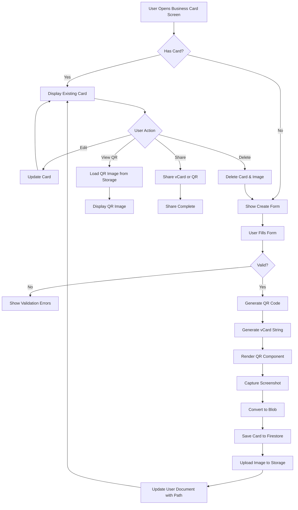

### Image Upload and Storage Flow

```mermaid
graph TD
    Start[QR Code Generated] --> Screenshot[Capture Screenshot]
    Screenshot --> Base64[Base64 Image Data]
    Base64 --> Extract[Extract Base64 String]
    Extract --> Decode[Decode with atob]
    Decode --> Bytes[Convert to Byte Array]
    Bytes --> Blob[Create Blob]
    Blob --> Upload[Upload to Firebase Storage]
    Upload -->|Path| business-cards/userId/user-business-card-qr.png
    Upload --> URL[Get Download URL]
    URL --> UpdateDoc[Update User Document]
    UpdateDoc -->|Field| setup.businessCardPath = url
    UpdateDoc --> Complete[Upload Complete]
```

---

## Key Takeaways

1. **Dual Storage**: Business card data in Firestore, QR images in Firebase Storage
2. **QR Generation**: Uses `react-native-qrcode-svg` with vCard data
3. **Screenshot Capture**: Uses `react-native-view-shot` to capture QR component
4. **Image Conversion**: Base64 → Blob → Firebase Storage
5. **Path Tracking**: Image URL stored in `users/{userId}/setup/businessCardPath`
6. **vCard Format**: Standard contact format for QR codes
7. **Validation**: Comprehensive Zod schema validation
8. **Error Handling**: Graceful handling of missing images and storage errors
9. **Partial Updates**: Support for updating contact, customizations, and social media separately
10. **Cleanup**: Deletion removes both Firestore data and Storage image

---

*Document generated: 2025-01-XX*
*Last updated: Based on current codebase structure*

