# Complete Error Handling & Logging Processes Documentation

## Overview

This document traces **all** error handling, catching, and logging processes including error boundaries, global error handlers, error classification, mapping, context capture, logging, recovery strategies, toast notifications, and UI display.

---

## Table of Contents

1. [High-Level Architecture](#high-level-architecture)
2. [Error Catching Mechanisms](#error-catching-mechanisms)
3. [Error Classification Flow](#error-classification-flow)
4. [Error Mapping Flow](#error-mapping-flow)
5. [Error Context Building & Capture](#error-context-building--capture)
6. [Error Handler Flow](#error-handler-flow)
7. [Logging Service Flow](#logging-service-flow)
8. [Global Error Handler Flow](#global-error-handler-flow)
9. [Error Boundary Flow](#error-boundary-flow)
10. [Toast Notification Flow](#toast-notification-flow)
11. [Error Recovery Strategies](#error-recovery-strategies)
12. [Result Pattern Usage](#result-pattern-usage)
13. [Data Structures](#data-structures)
14. [Error Code Registry](#error-code-registry)
15. [File Structure](#file-structure)
16. [Simple Explanations](#simple-explanations)

---

## High-Level Architecture

### Error Handling Architecture Overview

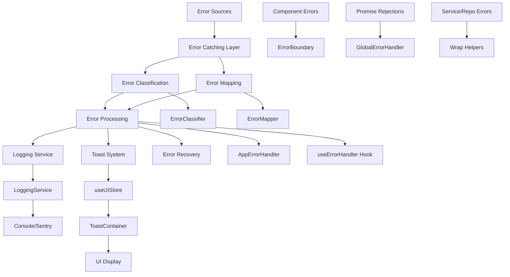
```mermaid
graph TD
    A[Error Sources] --> B[Error Catching Layer]
    B --> C[Error Classification]
    B --> D[Error Mapping]
    C --> E[Error Processing]
    D --> E
    E --> F[Logging Service]
    E --> G[Toast System]
    E --> H[Error Recovery]
    
    A1[Component Errors] --> B1[ErrorBoundary]
    A2[Promise Rejections] --> B2[GlobalErrorHandler]
    A3[Service/Repo Errors] --> B3[Wrap Helpers]
    
    C --> C1[ErrorClassifier]
    D --> D1[ErrorMapper]
    
    E --> E1[AppErrorHandler]
    E --> E2[useErrorHandler Hook]
    
    F --> F1[LoggingService]
    F1 --> F2[Console/Sentry]
    
    G --> G1[useUIStore]
    G1 --> G2[ToastContainer]
    G2 --> G3[UI Display]
```

### Error Flow Layers

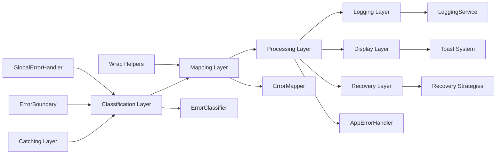
```mermaid
graph LR
    A[Catching Layer] --> B[Classification Layer]
    B --> C[Mapping Layer]
    C --> D[Processing Layer]
    D --> E[Logging Layer]
    D --> F[Display Layer]
    D --> G[Recovery Layer]
    
    A1[ErrorBoundary] --> B
    A2[GlobalErrorHandler] --> B
    A3[Wrap Helpers] --> C
    
    B --> B1[ErrorClassifier]
    C --> C1[ErrorMapper]
    D --> D1[AppErrorHandler]
    E --> E1[LoggingService]
    F --> F1[Toast System]
    G --> G1[Recovery Strategies]
```

---

## Error Catching Mechanisms

### Three Main Catching Mechanisms

#### 1. Error Boundary (React Component Errors)

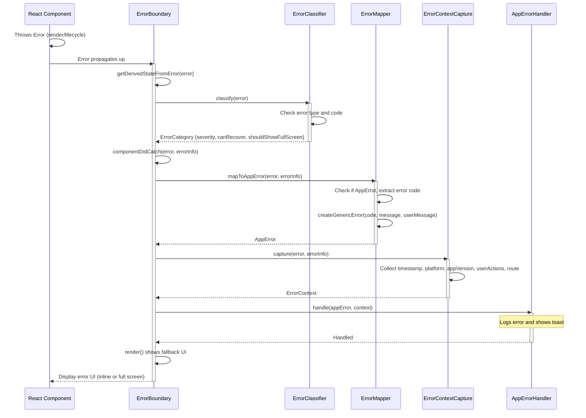
```mermaid
sequenceDiagram
    participant Component as React Component
    participant ErrorBoundary as ErrorBoundary
    participant ErrorClassifier as ErrorClassifier
    participant ErrorMapper as ErrorMapper
    participant ErrorContextCapture as ErrorContextCapture
    participant AppErrorHandler as AppErrorHandler

    Component->>Component: Throws Error (render/lifecycle)
    Component->>ErrorBoundary: Error propagates up
    activate ErrorBoundary
    
    ErrorBoundary->>ErrorBoundary: getDerivedStateFromError(error)
    ErrorBoundary->>ErrorClassifier: classify(error)
    activate ErrorClassifier
    ErrorClassifier->>ErrorClassifier: Check error type and code
    ErrorClassifier-->>ErrorBoundary: ErrorCategory {severity, canRecover, shouldShowFullScreen}
    deactivate ErrorClassifier
    
    ErrorBoundary->>ErrorBoundary: componentDidCatch(error, errorInfo)
    ErrorBoundary->>ErrorMapper: mapToAppError(error, errorInfo)
    activate ErrorMapper
    ErrorMapper->>ErrorMapper: Check if AppError, extract error code
    ErrorMapper->>ErrorMapper: createGenericError(code, message, userMessage)
    ErrorMapper-->>ErrorBoundary: AppError
    deactivate ErrorMapper
    
    ErrorBoundary->>ErrorContextCapture: capture(error, errorInfo)
    activate ErrorContextCapture
    ErrorContextCapture->>ErrorContextCapture: Collect timestamp, platform, appVersion, userActions, route
    ErrorContextCapture-->>ErrorBoundary: ErrorContext
    deactivate ErrorContextCapture
    
    ErrorBoundary->>AppErrorHandler: handle(appError, context)
    activate AppErrorHandler
    Note over AppErrorHandler: Logs error and shows toast
    AppErrorHandler-->>ErrorBoundary: Handled
    deactivate AppErrorHandler
    
    ErrorBoundary->>ErrorBoundary: render() shows fallback UI
    ErrorBoundary-->>Component: Display error UI (inline or full screen)
    deactivate ErrorBoundary
```

#### 2. Global Error Handler (Unhandled Errors)

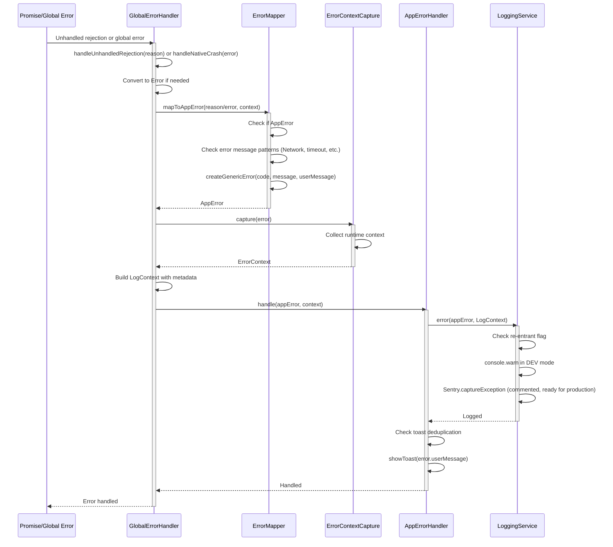
```mermaid
sequenceDiagram
    participant Promise as Promise/Global Error
    participant GlobalErrorHandler as GlobalErrorHandler
    participant ErrorMapper as ErrorMapper
    participant ErrorContextCapture as ErrorContextCapture
    participant AppErrorHandler as AppErrorHandler
    participant LoggingService as LoggingService

    Promise->>GlobalErrorHandler: Unhandled rejection or global error
    activate GlobalErrorHandler
    
    GlobalErrorHandler->>GlobalErrorHandler: handleUnhandledRejection(reason) or handleNativeCrash(error)
    GlobalErrorHandler->>GlobalErrorHandler: Convert to Error if needed
    GlobalErrorHandler->>ErrorMapper: mapToAppError(reason/error, context)
    activate ErrorMapper
    ErrorMapper->>ErrorMapper: Check if AppError
    ErrorMapper->>ErrorMapper: Check error message patterns (Network, timeout, etc.)
    ErrorMapper->>ErrorMapper: createGenericError(code, message, userMessage)
    ErrorMapper-->>GlobalErrorHandler: AppError
    deactivate ErrorMapper
    
    GlobalErrorHandler->>ErrorContextCapture: capture(error)
    activate ErrorContextCapture
    ErrorContextCapture->>ErrorContextCapture: Collect runtime context
    ErrorContextCapture-->>GlobalErrorHandler: ErrorContext
    deactivate ErrorContextCapture
    
    GlobalErrorHandler->>GlobalErrorHandler: Build LogContext with metadata
    GlobalErrorHandler->>AppErrorHandler: handle(appError, context)
    activate AppErrorHandler
    AppErrorHandler->>LoggingService: error(appError, LogContext)
    activate LoggingService
    LoggingService->>LoggingService: Check re-entrant flag
    LoggingService->>LoggingService: console.warn in DEV mode
    LoggingService->>LoggingService: Sentry.captureException (commented, ready for production)
    LoggingService-->>AppErrorHandler: Logged
    deactivate LoggingService
    
    AppErrorHandler->>AppErrorHandler: Check toast deduplication
    AppErrorHandler->>AppErrorHandler: showToast(error.userMessage)
    AppErrorHandler-->>GlobalErrorHandler: Handled
    deactivate AppErrorHandler
    
    GlobalErrorHandler-->>Promise: Error handled
    deactivate GlobalErrorHandler
```

#### 3. Wrap Helpers (Service/Repository Errors)

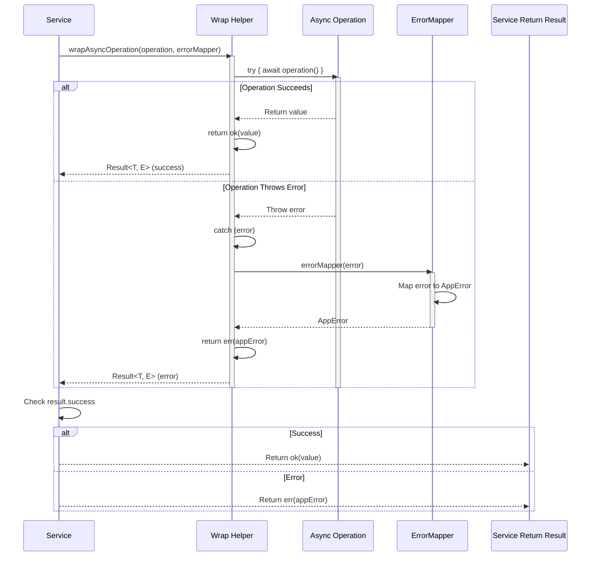
```mermaid
sequenceDiagram
    participant Service as Service
    participant WrapHelper as Wrap Helper
    participant Operation as Async Operation
    participant ErrorMapper as ErrorMapper
    participant ServiceReturn as Service Return Result

    Service->>WrapHelper: wrapAsyncOperation(operation, errorMapper)
    activate WrapHelper
    
    WrapHelper->>Operation: try { await operation() }
    activate Operation
    alt Operation Succeeds
        Operation-->>WrapHelper: Return value
        WrapHelper->>WrapHelper: return ok(value)
        WrapHelper-->>Service: Result<T, E> (success)
    else Operation Throws Error
        Operation-->>WrapHelper: Throw error
        WrapHelper->>WrapHelper: catch (error)
        WrapHelper->>ErrorMapper: errorMapper(error)
        activate ErrorMapper
        ErrorMapper->>ErrorMapper: Map error to AppError
        ErrorMapper-->>WrapHelper: AppError
        deactivate ErrorMapper
        WrapHelper->>WrapHelper: return err(appError)
        WrapHelper-->>Service: Result<T, E> (error)
    end
    deactivate Operation
    deactivate WrapHelper
    
    Service->>Service: Check result.success
    alt Success
        Service-->>ServiceReturn: Return ok(value)
    else Error
        Service-->>ServiceReturn: Return err(appError)
    end
```

---

## Error Classification Flow

### Error Classification Process

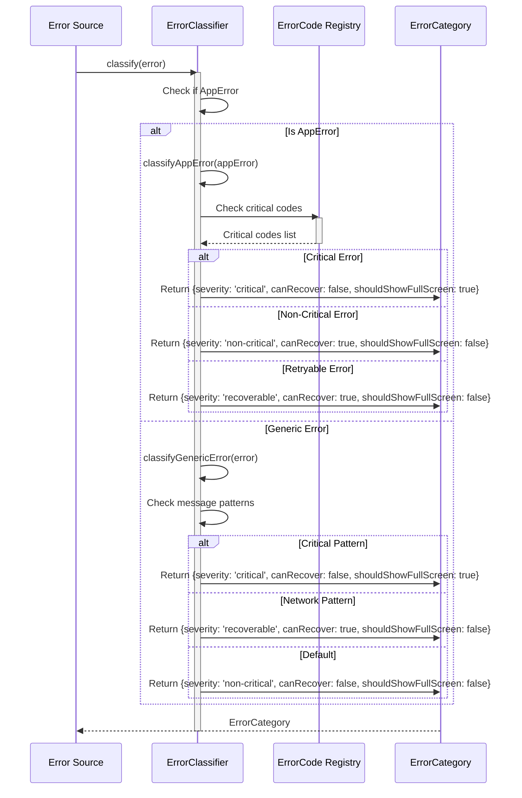
```mermaid
sequenceDiagram
    participant Source as Error Source
    participant ErrorClassifier as ErrorClassifier
    participant ErrorCodeRegistry as ErrorCode Registry
    participant Category as ErrorCategory

    Source->>ErrorClassifier: classify(error)
    activate ErrorClassifier
    
    ErrorClassifier->>ErrorClassifier: Check if AppError
    alt Is AppError
        ErrorClassifier->>ErrorClassifier: classifyAppError(appError)
        ErrorClassifier->>ErrorCodeRegistry: Check critical codes
        activate ErrorCodeRegistry
        ErrorCodeRegistry-->>ErrorClassifier: Critical codes list
        deactivate ErrorCodeRegistry
        
        alt Critical Error
            ErrorClassifier->>Category: Return {severity: 'critical', canRecover: false, shouldShowFullScreen: true}
        else Non-Critical Error
            ErrorClassifier->>Category: Return {severity: 'non-critical', canRecover: true, shouldShowFullScreen: false}
        else Retryable Error
            ErrorClassifier->>Category: Return {severity: 'recoverable', canRecover: true, shouldShowFullScreen: false}
        end
    else Generic Error
        ErrorClassifier->>ErrorClassifier: classifyGenericError(error)
        ErrorClassifier->>ErrorClassifier: Check message patterns
        alt Critical Pattern
            ErrorClassifier->>Category: Return {severity: 'critical', canRecover: false, shouldShowFullScreen: true}
        else Network Pattern
            ErrorClassifier->>Category: Return {severity: 'recoverable', canRecover: true, shouldShowFullScreen: false}
        else Default
            ErrorClassifier->>Category: Return {severity: 'non-critical', canRecover: false, shouldShowFullScreen: false}
        end
    end
    
    Category-->>Source: ErrorCategory
    deactivate ErrorClassifier
```

### Critical vs Non-Critical Errors

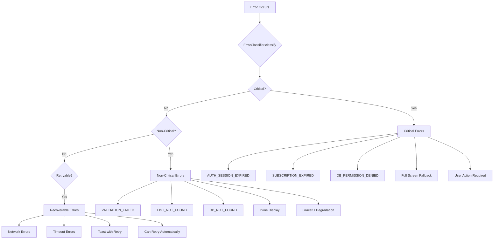
```mermaid
graph TD
    A[Error Occurs] --> B{ErrorClassifier.classify}
    B --> C{Critical?}
    C -->|Yes| D[Critical Errors]
    C -->|No| E{Non-Critical?}
    E -->|Yes| F[Non-Critical Errors]
    E -->|No| G{Retryable?}
    G -->|Yes| H[Recoverable Errors]
    
    D --> D1[AUTH_SESSION_EXPIRED]
    D --> D2[SUBSCRIPTION_EXPIRED]
    D --> D3[DB_PERMISSION_DENIED]
    D --> D4[Full Screen Fallback]
    D --> D5[User Action Required]
    
    F --> F1[VALIDATION_FAILED]
    F --> F2[LIST_NOT_FOUND]
    F --> F3[DB_NOT_FOUND]
    F --> F4[Inline Display]
    F --> F5[Graceful Degradation]
    
    H --> H1[Network Errors]
    H --> H2[Timeout Errors]
    H --> H3[Toast with Retry]
    H --> H4[Can Retry Automatically]
```

---

## Error Mapping Flow

### Error Mapping Process

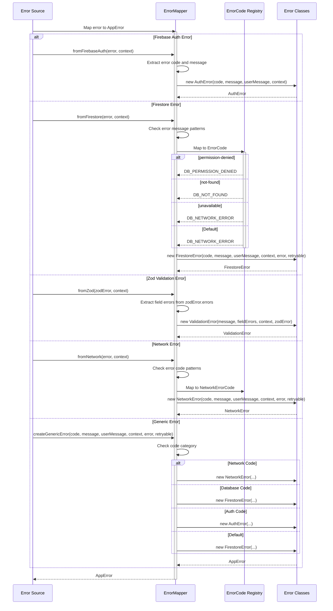
```mermaid
sequenceDiagram
    participant Source as Error Source
    participant ErrorMapper as ErrorMapper
    participant ErrorCodeRegistry as ErrorCode Registry
    participant ErrorClasses as Error Classes

    Source->>ErrorMapper: Map error to AppError
    activate ErrorMapper
    
    alt Firebase Auth Error
        Source->>ErrorMapper: fromFirebaseAuth(error, context)
        ErrorMapper->>ErrorMapper: Extract error code and message
        ErrorMapper->>ErrorClasses: new AuthError(code, message, userMessage, context)
        ErrorClasses-->>ErrorMapper: AuthError
    else Firestore Error
        Source->>ErrorMapper: fromFirestore(error, context)
        ErrorMapper->>ErrorMapper: Check error message patterns
        ErrorMapper->>ErrorCodeRegistry: Map to ErrorCode
        activate ErrorCodeRegistry
        alt permission-denied
            ErrorCodeRegistry-->>ErrorMapper: DB_PERMISSION_DENIED
        else not-found
            ErrorCodeRegistry-->>ErrorMapper: DB_NOT_FOUND
        else unavailable
            ErrorCodeRegistry-->>ErrorMapper: DB_NETWORK_ERROR
        else Default
            ErrorCodeRegistry-->>ErrorMapper: DB_NETWORK_ERROR
        end
        deactivate ErrorCodeRegistry
        ErrorMapper->>ErrorClasses: new FirestoreError(code, message, userMessage, context, error, retryable)
        ErrorClasses-->>ErrorMapper: FirestoreError
    else Zod Validation Error
        Source->>ErrorMapper: fromZod(zodError, context)
        ErrorMapper->>ErrorMapper: Extract field errors from zodError.errors
        ErrorMapper->>ErrorClasses: new ValidationError(message, fieldErrors, context, zodError)
        ErrorClasses-->>ErrorMapper: ValidationError
    else Network Error
        Source->>ErrorMapper: fromNetwork(error, context)
        ErrorMapper->>ErrorMapper: Check error code patterns
        ErrorMapper->>ErrorCodeRegistry: Map to NetworkErrorCode
        ErrorMapper->>ErrorClasses: new NetworkError(code, message, userMessage, context, error, retryable)
        ErrorClasses-->>ErrorMapper: NetworkError
    else Generic Error
        Source->>ErrorMapper: createGenericError(code, message, userMessage, context, error, retryable)
        ErrorMapper->>ErrorMapper: Check code category
        alt Network Code
            ErrorMapper->>ErrorClasses: new NetworkError(...)
        else Database Code
            ErrorMapper->>ErrorClasses: new FirestoreError(...)
        else Auth Code
            ErrorMapper->>ErrorClasses: new AuthError(...)
        else Default
            ErrorMapper->>ErrorClasses: new FirestoreError(...)
        end
        ErrorClasses-->>ErrorMapper: AppError
    end
    
    ErrorMapper-->>Source: AppError
    deactivate ErrorMapper
```

### Error Mapping Examples

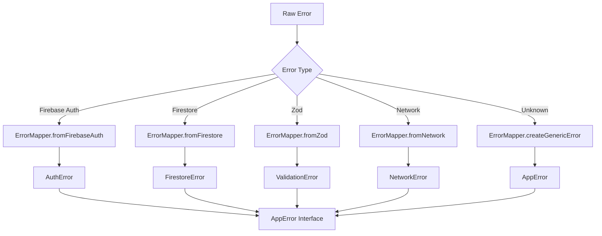
```mermaid
graph TD
    A[Raw Error] --> B{Error Type}
    B -->|Firebase Auth| C[ErrorMapper.fromFirebaseAuth]
    B -->|Firestore| D[ErrorMapper.fromFirestore]
    B -->|Zod| E[ErrorMapper.fromZod]
    B -->|Network| F[ErrorMapper.fromNetwork]
    B -->|Unknown| G[ErrorMapper.createGenericError]
    
    C --> C1[AuthError]
    D --> D1[FirestoreError]
    E --> E1[ValidationError]
    F --> F1[NetworkError]
    G --> G1[AppError]
    
    C1 --> H[AppError Interface]
    D1 --> H
    E1 --> H
    F1 --> H
    G1 --> H
```

---

## Error Context Building & Capture

### Context Building Flow

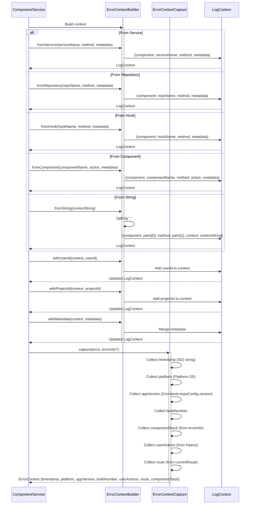
```mermaid
sequenceDiagram
    participant Component as Component/Service
    participant ErrorContextBuilder as ErrorContextBuilder
    participant ErrorContextCapture as ErrorContextCapture
    participant LogContext as LogContext

    Component->>ErrorContextBuilder: Build context
    activate ErrorContextBuilder
    
    alt From Service
        Component->>ErrorContextBuilder: fromService(serviceName, method, metadata)
        ErrorContextBuilder->>LogContext: {component: serviceName, method, metadata}
        LogContext-->>Component: LogContext
    else From Repository
        Component->>ErrorContextBuilder: fromRepository(repoName, method, metadata)
        ErrorContextBuilder->>LogContext: {component: repoName, method, metadata}
        LogContext-->>Component: LogContext
    else From Hook
        Component->>ErrorContextBuilder: fromHook(hookName, method, metadata)
        ErrorContextBuilder->>LogContext: {component: hookName, method, metadata}
        LogContext-->>Component: LogContext
    else From Component
        Component->>ErrorContextBuilder: fromComponent(componentName, action, metadata)
        ErrorContextBuilder->>LogContext: {component: componentName, method: action, metadata}
        LogContext-->>Component: LogContext
    else From String
        Component->>ErrorContextBuilder: fromString(contextString)
        ErrorContextBuilder->>ErrorContextBuilder: Split by '.'
        ErrorContextBuilder->>LogContext: {component: parts[0], method: parts[1], context: contextString}
        LogContext-->>Component: LogContext
    end
    
    Component->>ErrorContextBuilder: withUserId(context, userId)
    ErrorContextBuilder->>LogContext: Add userId to context
    LogContext-->>Component: Updated LogContext
    
    Component->>ErrorContextBuilder: withProjectId(context, projectId)
    ErrorContextBuilder->>LogContext: Add projectId to context
    LogContext-->>Component: Updated LogContext
    
    Component->>ErrorContextBuilder: withMetadata(context, metadata)
    ErrorContextBuilder->>LogContext: Merge metadata
    LogContext-->>Component: Updated LogContext
    deactivate ErrorContextBuilder
    
    Component->>ErrorContextCapture: capture(error, errorInfo?)
    activate ErrorContextCapture
    ErrorContextCapture->>ErrorContextCapture: Collect timestamp (ISO string)
    ErrorContextCapture->>ErrorContextCapture: Collect platform (Platform.OS)
    ErrorContextCapture->>ErrorContextCapture: Collect appVersion (Constants.expoConfig.version)
    ErrorContextCapture->>ErrorContextCapture: Collect buildNumber
    ErrorContextCapture->>ErrorContextCapture: Collect componentStack (from errorInfo)
    ErrorContextCapture->>ErrorContextCapture: Collect userActions (from history)
    ErrorContextCapture->>ErrorContextCapture: Collect route (from currentRoute)
    ErrorContextCapture-->>Component: ErrorContext {timestamp, platform, appVersion, buildNumber, userActions, route, componentStack}
    deactivate ErrorContextCapture
```

### User Action Tracking

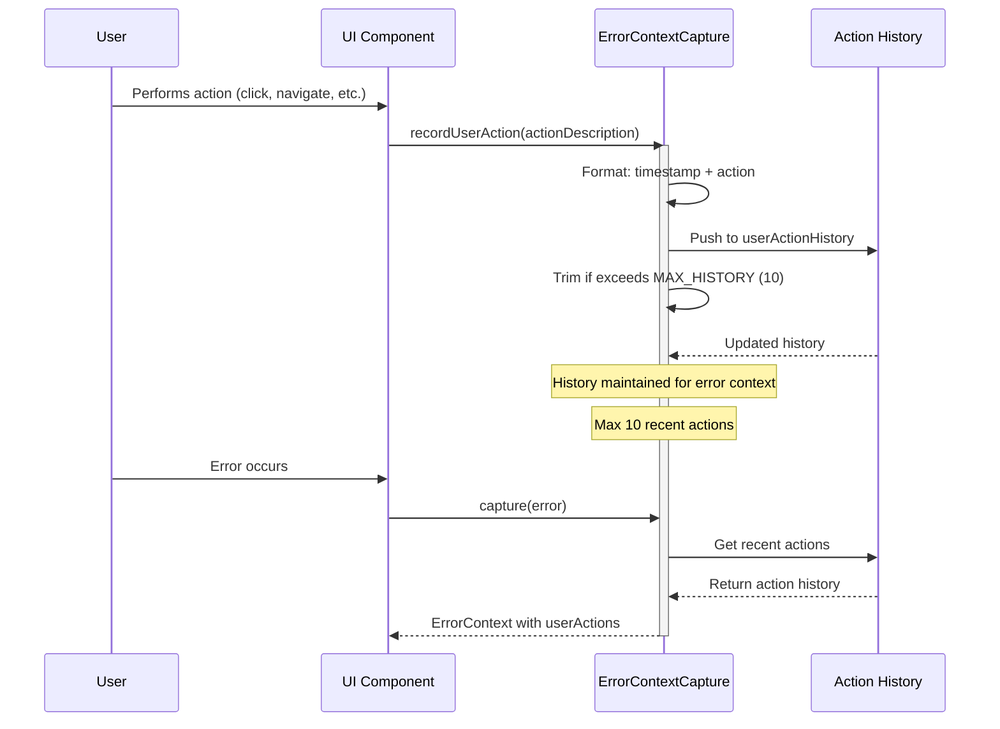
```mermaid
sequenceDiagram
    participant User as User
    participant UI as UI Component
    participant ErrorContextCapture as ErrorContextCapture
    participant History as Action History

    User->>UI: Performs action (click, navigate, etc.)
    UI->>ErrorContextCapture: recordUserAction(actionDescription)
    activate ErrorContextCapture
    
    ErrorContextCapture->>ErrorContextCapture: Format: timestamp + action
    ErrorContextCapture->>History: Push to userActionHistory
    ErrorContextCapture->>ErrorContextCapture: Trim if exceeds MAX_HISTORY (10)
    History-->>ErrorContextCapture: Updated history
    
    Note over ErrorContextCapture: History maintained for error context
    Note over ErrorContextCapture: Max 10 recent actions
    
    User->>UI: Error occurs
    UI->>ErrorContextCapture: capture(error)
    ErrorContextCapture->>History: Get recent actions
    History-->>ErrorContextCapture: Return action history
    ErrorContextCapture-->>UI: ErrorContext with userActions
    deactivate ErrorContextCapture
```

---

## Error Handler Flow

### Complete Error Handling Sequence

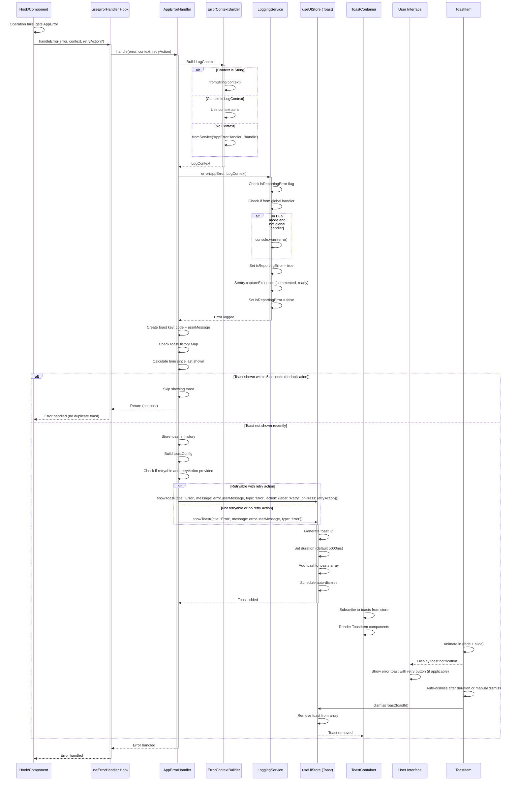
```mermaid
sequenceDiagram
    participant Hook as Hook/Component
    participant useErrorHandler as useErrorHandler Hook
    participant AppErrorHandler as AppErrorHandler
    participant ErrorContextBuilder as ErrorContextBuilder
    participant LoggingService as LoggingService
    participant ToastStore as useUIStore (Toast)
    participant ToastContainer as ToastContainer
    participant UI as User Interface

    Hook->>Hook: Operation fails, gets AppError
    Hook->>useErrorHandler: handleError(error, context, retryAction?)
    activate useErrorHandler
    
    useErrorHandler->>AppErrorHandler: handle(error, context, retryAction)
    activate AppErrorHandler
    
    AppErrorHandler->>ErrorContextBuilder: Build LogContext
    activate ErrorContextBuilder
    alt Context is String
        ErrorContextBuilder->>ErrorContextBuilder: fromString(context)
    else Context is LogContext
        ErrorContextBuilder->>ErrorContextBuilder: Use context as-is
    else No Context
        ErrorContextBuilder->>ErrorContextBuilder: fromService('AppErrorHandler', 'handle')
    end
    ErrorContextBuilder-->>AppErrorHandler: LogContext
    deactivate ErrorContextBuilder
    
    AppErrorHandler->>LoggingService: error(appError, LogContext)
    activate LoggingService
    LoggingService->>LoggingService: Check isReportingError flag
    LoggingService->>LoggingService: Check if from global handler
    alt In DEV mode and not global handler
        LoggingService->>LoggingService: console.warn(error)
    end
    LoggingService->>LoggingService: Set isReportingError = true
    LoggingService->>LoggingService: Sentry.captureException (commented, ready)
    LoggingService->>LoggingService: Set isReportingError = false
    LoggingService-->>AppErrorHandler: Error logged
    deactivate LoggingService
    
    AppErrorHandler->>AppErrorHandler: Create toast key: code + userMessage
    AppErrorHandler->>AppErrorHandler: Check toastHistory Map
    AppErrorHandler->>AppErrorHandler: Calculate time since last shown
    
    alt Toast shown within 5 seconds (deduplication)
        AppErrorHandler->>AppErrorHandler: Skip showing toast
        AppErrorHandler-->>useErrorHandler: Return (no toast)
        useErrorHandler-->>Hook: Error handled (no duplicate toast)
    else Toast not shown recently
        AppErrorHandler->>AppErrorHandler: Store toast in history
        AppErrorHandler->>AppErrorHandler: Build toastConfig
        AppErrorHandler->>AppErrorHandler: Check if retryable and retryAction provided
        
        alt Retryable with retry action
            AppErrorHandler->>ToastStore: showToast({title: 'Error', message: error.userMessage, type: 'error', action: {label: 'Retry', onPress: retryAction}})
        else Not retryable or no retry action
            AppErrorHandler->>ToastStore: showToast({title: 'Error', message: error.userMessage, type: 'error'})
        end
        
        activate ToastStore
        ToastStore->>ToastStore: Generate toast ID
        ToastStore->>ToastStore: Set duration (default 5000ms)
        ToastStore->>ToastStore: Add toast to toasts array
        ToastStore->>ToastStore: Schedule auto-dismiss
        ToastStore-->>AppErrorHandler: Toast added
        deactivate ToastStore
        
        ToastContainer->>ToastContainer: Subscribe to toasts from store
        ToastContainer->>ToastContainer: Render ToastItem components
        ToastItem->>ToastItem: Animate in (fade + slide)
        ToastItem-->>UI: Display toast notification
        UI->>UI: Show error toast with retry button (if applicable)
        
        ToastItem->>ToastItem: Auto-dismiss after duration or manual dismiss
        ToastItem->>ToastStore: dismissToast(toastId)
        ToastStore->>ToastStore: Remove toast from array
        ToastStore-->>ToastContainer: Toast removed
    end
    
    AppErrorHandler-->>useErrorHandler: Error handled
    deactivate AppErrorHandler
    useErrorHandler-->>Hook: Error handled
    deactivate useErrorHandler
```

---

## Logging Service Flow

### Logging Process

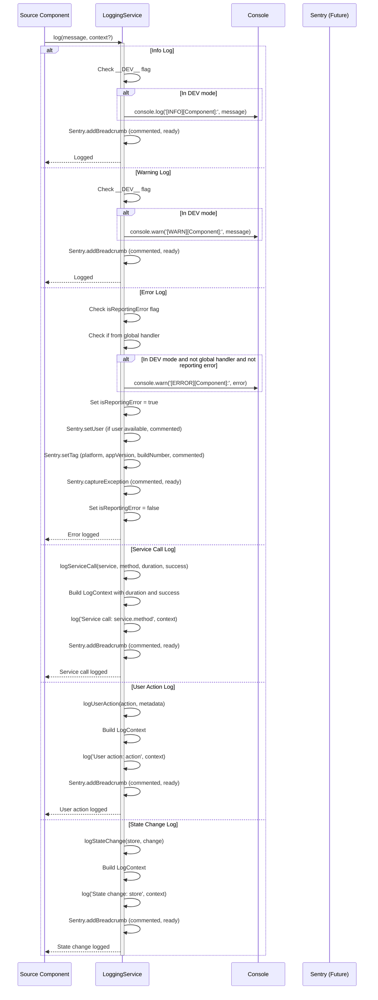
```mermaid
sequenceDiagram
    participant Source as Source Component
    participant LoggingService as LoggingService
    participant Console as Console
    participant Sentry as Sentry (Future)

    Source->>LoggingService: log(message, context?)
    activate LoggingService
    
    alt Info Log
        LoggingService->>LoggingService: Check __DEV__ flag
        alt In DEV mode
            LoggingService->>Console: console.log('[INFO][Component]:', message)
        end
        LoggingService->>LoggingService: Sentry.addBreadcrumb (commented, ready)
        LoggingService-->>Source: Logged
    else Warning Log
        LoggingService->>LoggingService: Check __DEV__ flag
        alt In DEV mode
            LoggingService->>Console: console.warn('[WARN][Component]:', message)
        end
        LoggingService->>LoggingService: Sentry.addBreadcrumb (commented, ready)
        LoggingService-->>Source: Logged
    else Error Log
        LoggingService->>LoggingService: Check isReportingError flag
        LoggingService->>LoggingService: Check if from global handler
        alt In DEV mode and not global handler and not reporting error
            LoggingService->>Console: console.warn('[ERROR][Component]:', error)
        end
        LoggingService->>LoggingService: Set isReportingError = true
        LoggingService->>LoggingService: Sentry.setUser (if user available, commented)
        LoggingService->>LoggingService: Sentry.setTag (platform, appVersion, buildNumber, commented)
        LoggingService->>LoggingService: Sentry.captureException (commented, ready)
        LoggingService->>LoggingService: Set isReportingError = false
        LoggingService-->>Source: Error logged
    else Service Call Log
        LoggingService->>LoggingService: logServiceCall(service, method, duration, success)
        LoggingService->>LoggingService: Build LogContext with duration and success
        LoggingService->>LoggingService: log('Service call: service.method', context)
        LoggingService->>LoggingService: Sentry.addBreadcrumb (commented, ready)
        LoggingService-->>Source: Service call logged
    else User Action Log
        LoggingService->>LoggingService: logUserAction(action, metadata)
        LoggingService->>LoggingService: Build LogContext
        LoggingService->>LoggingService: log('User action: action', context)
        LoggingService->>LoggingService: Sentry.addBreadcrumb (commented, ready)
        LoggingService-->>Source: User action logged
    else State Change Log
        LoggingService->>LoggingService: logStateChange(store, change)
        LoggingService->>LoggingService: Build LogContext
        LoggingService->>LoggingService: log('State change: store', context)
        LoggingService->>LoggingService: Sentry.addBreadcrumb (commented, ready)
        LoggingService-->>Source: State change logged
    end
    
    deactivate LoggingService
```

### Re-entrant Error Prevention

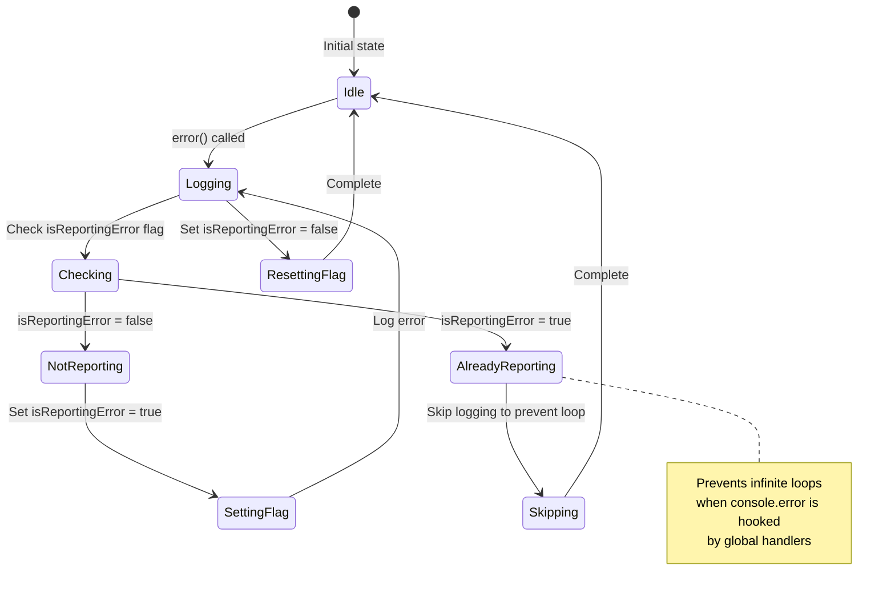
```mermaid
stateDiagram-v2
    [*] --> Idle: Initial state
    Idle --> Logging: error() called
    Logging --> Checking: Check isReportingError flag
    Checking --> AlreadyReporting: isReportingError = true
    Checking --> NotReporting: isReportingError = false
    
    NotReporting --> SettingFlag: Set isReportingError = true
    SettingFlag --> Logging: Log error
    Logging --> ResettingFlag: Set isReportingError = false
    ResettingFlag --> Idle: Complete
    
    AlreadyReporting --> Skipping: Skip logging to prevent loop
    Skipping --> Idle: Complete
    
    note right of AlreadyReporting
        Prevents infinite loops
        when console.error is hooked
        by global handlers
    end note
```

---

## Global Error Handler Flow

### Global Error Handler Initialization

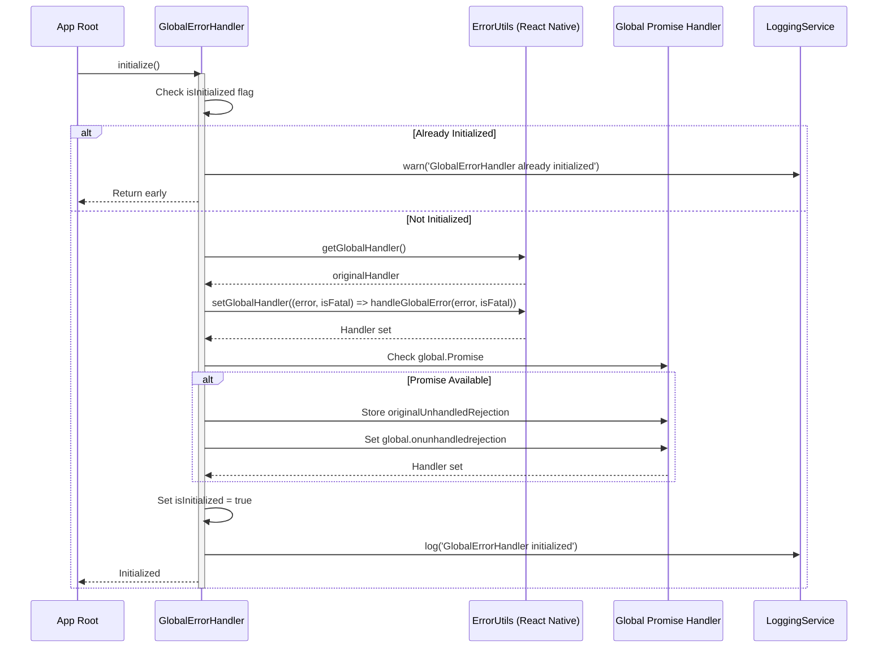
```mermaid
sequenceDiagram
    participant App as App Root
    participant GlobalErrorHandler as GlobalErrorHandler
    participant ErrorUtils as ErrorUtils (React Native)
    participant GlobalPromise as Global Promise Handler
    participant LoggingService as LoggingService

    App->>GlobalErrorHandler: initialize()
    activate GlobalErrorHandler
    
    GlobalErrorHandler->>GlobalErrorHandler: Check isInitialized flag
    alt Already Initialized
        GlobalErrorHandler->>LoggingService: warn('GlobalErrorHandler already initialized')
        GlobalErrorHandler-->>App: Return early
    else Not Initialized
        GlobalErrorHandler->>ErrorUtils: getGlobalHandler()
        ErrorUtils-->>GlobalErrorHandler: originalHandler
        GlobalErrorHandler->>ErrorUtils: setGlobalHandler((error, isFatal) => handleGlobalError(error, isFatal))
        ErrorUtils-->>GlobalErrorHandler: Handler set
        
        GlobalErrorHandler->>GlobalPromise: Check global.Promise
        alt Promise Available
            GlobalErrorHandler->>GlobalPromise: Store originalUnhandledRejection
            GlobalErrorHandler->>GlobalPromise: Set global.onunhandledrejection
            GlobalPromise-->>GlobalErrorHandler: Handler set
        end
        
        GlobalErrorHandler->>GlobalErrorHandler: Set isInitialized = true
        GlobalErrorHandler->>LoggingService: log('GlobalErrorHandler initialized')
        GlobalErrorHandler-->>App: Initialized
    end
    deactivate GlobalErrorHandler
```

### Global Error Handling Sequence

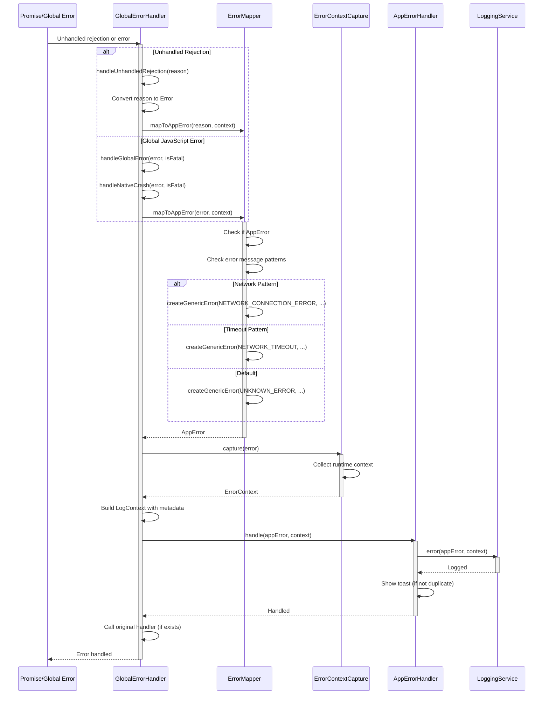
```mermaid
sequenceDiagram
    participant Promise as Promise/Global Error
    participant GlobalErrorHandler as GlobalErrorHandler
    participant ErrorMapper as ErrorMapper
    participant ErrorContextCapture as ErrorContextCapture
    participant AppErrorHandler as AppErrorHandler
    participant LoggingService as LoggingService

    Promise->>GlobalErrorHandler: Unhandled rejection or error
    activate GlobalErrorHandler
    
    alt Unhandled Rejection
        GlobalErrorHandler->>GlobalErrorHandler: handleUnhandledRejection(reason)
        GlobalErrorHandler->>GlobalErrorHandler: Convert reason to Error
        GlobalErrorHandler->>ErrorMapper: mapToAppError(reason, context)
    else Global JavaScript Error
        GlobalErrorHandler->>GlobalErrorHandler: handleGlobalError(error, isFatal)
        GlobalErrorHandler->>GlobalErrorHandler: handleNativeCrash(error, isFatal)
        GlobalErrorHandler->>ErrorMapper: mapToAppError(error, context)
    end
    
    activate ErrorMapper
    ErrorMapper->>ErrorMapper: Check if AppError
    ErrorMapper->>ErrorMapper: Check error message patterns
    alt Network Pattern
        ErrorMapper->>ErrorMapper: createGenericError(NETWORK_CONNECTION_ERROR, ...)
    else Timeout Pattern
        ErrorMapper->>ErrorMapper: createGenericError(NETWORK_TIMEOUT, ...)
    else Default
        ErrorMapper->>ErrorMapper: createGenericError(UNKNOWN_ERROR, ...)
    end
    ErrorMapper-->>GlobalErrorHandler: AppError
    deactivate ErrorMapper
    
    GlobalErrorHandler->>ErrorContextCapture: capture(error)
    activate ErrorContextCapture
    ErrorContextCapture->>ErrorContextCapture: Collect runtime context
    ErrorContextCapture-->>GlobalErrorHandler: ErrorContext
    deactivate ErrorContextCapture
    
    GlobalErrorHandler->>GlobalErrorHandler: Build LogContext with metadata
    GlobalErrorHandler->>AppErrorHandler: handle(appError, context)
    activate AppErrorHandler
    AppErrorHandler->>LoggingService: error(appError, context)
    activate LoggingService
    LoggingService-->>AppErrorHandler: Logged
    deactivate LoggingService
    AppErrorHandler->>AppErrorHandler: Show toast (if not duplicate)
    AppErrorHandler-->>GlobalErrorHandler: Handled
    deactivate AppErrorHandler
    
    GlobalErrorHandler->>GlobalErrorHandler: Call original handler (if exists)
    GlobalErrorHandler-->>Promise: Error handled
    deactivate GlobalErrorHandler
```

---

## Error Boundary Flow

### Error Boundary Complete Flow

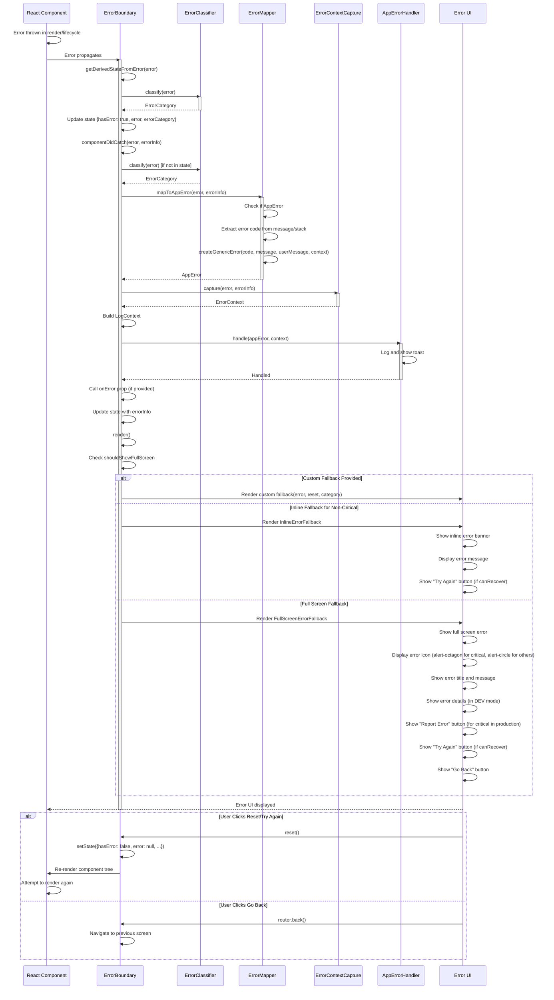
```mermaid
sequenceDiagram
    participant Component as React Component
    participant ErrorBoundary as ErrorBoundary
    participant ErrorClassifier as ErrorClassifier
    participant ErrorMapper as ErrorMapper
    participant ErrorContextCapture as ErrorContextCapture
    participant AppErrorHandler as AppErrorHandler
    participant UI as Error UI

    Component->>Component: Error thrown in render/lifecycle
    Component->>ErrorBoundary: Error propagates
    activate ErrorBoundary
    
    ErrorBoundary->>ErrorBoundary: getDerivedStateFromError(error)
    ErrorBoundary->>ErrorClassifier: classify(error)
    activate ErrorClassifier
    ErrorClassifier-->>ErrorBoundary: ErrorCategory
    deactivate ErrorClassifier
    ErrorBoundary->>ErrorBoundary: Update state {hasError: true, error, errorCategory}
    
    ErrorBoundary->>ErrorBoundary: componentDidCatch(error, errorInfo)
    ErrorBoundary->>ErrorClassifier: classify(error) [if not in state]
    ErrorClassifier-->>ErrorBoundary: ErrorCategory
    ErrorBoundary->>ErrorMapper: mapToAppError(error, errorInfo)
    activate ErrorMapper
    ErrorMapper->>ErrorMapper: Check if AppError
    ErrorMapper->>ErrorMapper: Extract error code from message/stack
    ErrorMapper->>ErrorMapper: createGenericError(code, message, userMessage, context)
    ErrorMapper-->>ErrorBoundary: AppError
    deactivate ErrorMapper
    
    ErrorBoundary->>ErrorContextCapture: capture(error, errorInfo)
    activate ErrorContextCapture
    ErrorContextCapture-->>ErrorBoundary: ErrorContext
    deactivate ErrorContextCapture
    
    ErrorBoundary->>ErrorBoundary: Build LogContext
    ErrorBoundary->>AppErrorHandler: handle(appError, context)
    activate AppErrorHandler
    AppErrorHandler->>AppErrorHandler: Log and show toast
    AppErrorHandler-->>ErrorBoundary: Handled
    deactivate AppErrorHandler
    
    ErrorBoundary->>ErrorBoundary: Call onError prop (if provided)
    ErrorBoundary->>ErrorBoundary: Update state with errorInfo
    
    ErrorBoundary->>ErrorBoundary: render()
    ErrorBoundary->>ErrorBoundary: Check shouldShowFullScreen
    
    alt Custom Fallback Provided
        ErrorBoundary->>UI: Render custom fallback(error, reset, category)
    else Inline Fallback for Non-Critical
        ErrorBoundary->>UI: Render InlineErrorFallback
        UI->>UI: Show inline error banner
        UI->>UI: Display error message
        UI->>UI: Show "Try Again" button (if canRecover)
    else Full Screen Fallback
        ErrorBoundary->>UI: Render FullScreenErrorFallback
        UI->>UI: Show full screen error
        UI->>UI: Display error icon (alert-octagon for critical, alert-circle for others)
        UI->>UI: Show error title and message
        UI->>UI: Show error details (in DEV mode)
        UI->>UI: Show "Report Error" button (for critical in production)
        UI->>UI: Show "Try Again" button (if canRecover)
        UI->>UI: Show "Go Back" button
    end
    
    UI-->>Component: Error UI displayed
    deactivate ErrorBoundary
    
    alt User Clicks Reset/Try Again
        UI->>ErrorBoundary: reset()
        ErrorBoundary->>ErrorBoundary: setState({hasError: false, error: null, ...})
        ErrorBoundary->>Component: Re-render component tree
        Component->>Component: Attempt to render again
    else User Clicks Go Back
        UI->>ErrorBoundary: router.back()
        ErrorBoundary->>ErrorBoundary: Navigate to previous screen
    end
```

### Error Boundary State Management

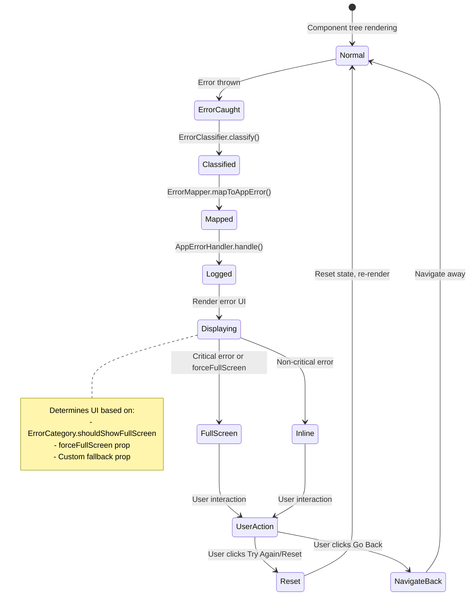
```mermaid
stateDiagram-v2
    [*] --> Normal: Component tree rendering
    Normal --> ErrorCaught: Error thrown
    ErrorCaught --> Classified: ErrorClassifier.classify()
    Classified --> Mapped: ErrorMapper.mapToAppError()
    Mapped --> Logged: AppErrorHandler.handle()
    Logged --> Displaying: Render error UI
    
    Displaying --> FullScreen: Critical error or forceFullScreen
    Displaying --> Inline: Non-critical error
    
    FullScreen --> UserAction: User interaction
    Inline --> UserAction: User interaction
    
    UserAction --> Reset: User clicks Try Again/Reset
    UserAction --> NavigateBack: User clicks Go Back
    
    Reset --> Normal: Reset state, re-render
    NavigateBack --> Normal: Navigate away
    
    note right of Displaying
        Determines UI based on:
        - ErrorCategory.shouldShowFullScreen
        - forceFullScreen prop
        - Custom fallback prop
    end note
```

---

## Toast Notification Flow

### Toast Display Sequence

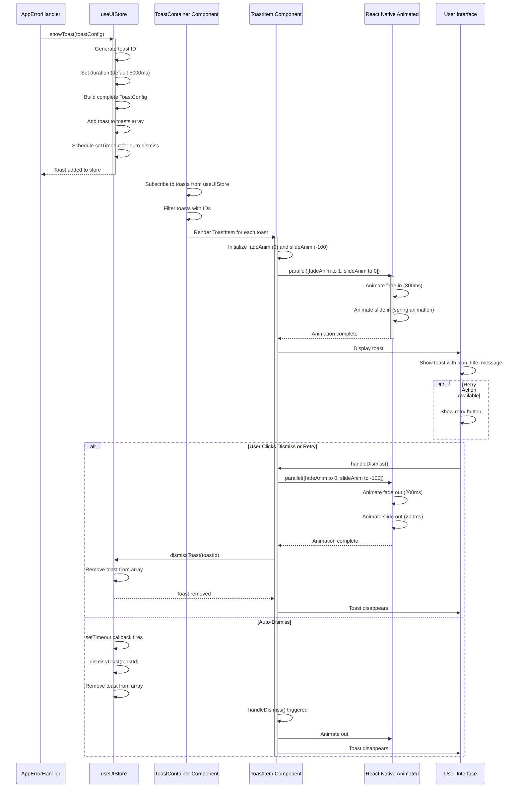
```mermaid
sequenceDiagram
    participant AppErrorHandler as AppErrorHandler
    participant ToastStore as useUIStore
    participant ToastContainer as ToastContainer Component
    participant ToastItem as ToastItem Component
    participant Animated as React Native Animated
    participant UI as User Interface

    AppErrorHandler->>ToastStore: showToast(toastConfig)
    activate ToastStore
    
    ToastStore->>ToastStore: Generate toast ID
    ToastStore->>ToastStore: Set duration (default 5000ms)
    ToastStore->>ToastStore: Build complete ToastConfig
    ToastStore->>ToastStore: Add toast to toasts array
    ToastStore->>ToastStore: Schedule setTimeout for auto-dismiss
    ToastStore-->>AppErrorHandler: Toast added to store
    deactivate ToastStore
    
    ToastContainer->>ToastContainer: Subscribe to toasts from useUIStore
    ToastContainer->>ToastContainer: Filter toasts with IDs
    ToastContainer->>ToastItem: Render ToastItem for each toast
    activate ToastItem
    
    ToastItem->>ToastItem: Initialize fadeAnim (0) and slideAnim (-100)
    ToastItem->>Animated: parallel([fadeAnim to 1, slideAnim to 0])
    activate Animated
    Animated->>Animated: Animate fade in (300ms)
    Animated->>Animated: Animate slide in (spring animation)
    Animated-->>ToastItem: Animation complete
    deactivate Animated
    
    ToastItem->>UI: Display toast
    UI->>UI: Show toast with icon, title, message
    alt Retry Action Available
        UI->>UI: Show retry button
    end
    
    alt User Clicks Dismiss or Retry
        UI->>ToastItem: handleDismiss()
        ToastItem->>Animated: parallel([fadeAnim to 0, slideAnim to -100])
        Animated->>Animated: Animate fade out (200ms)
        Animated->>Animated: Animate slide out (200ms)
        Animated-->>ToastItem: Animation complete
        ToastItem->>ToastStore: dismissToast(toastId)
        ToastStore->>ToastStore: Remove toast from array
        ToastStore-->>ToastItem: Toast removed
        ToastItem->>UI: Toast disappears
    else Auto-Dismiss
        ToastStore->>ToastStore: setTimeout callback fires
        ToastStore->>ToastStore: dismissToast(toastId)
        ToastStore->>ToastStore: Remove toast from array
        ToastItem->>ToastItem: handleDismiss() triggered
        ToastItem->>Animated: Animate out
        ToastItem->>UI: Toast disappears
    end
    deactivate ToastItem
```

### Toast Deduplication Flow

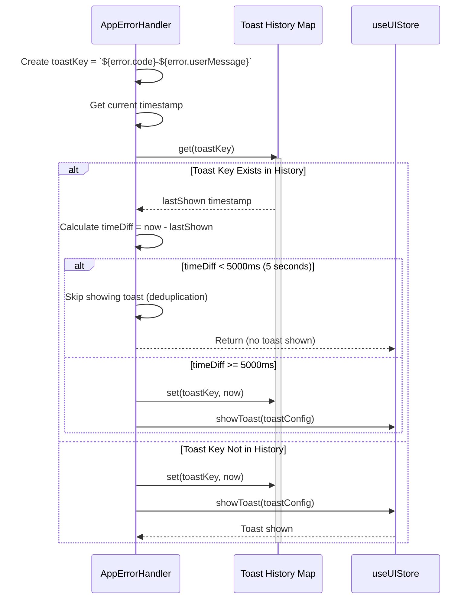
```mermaid
sequenceDiagram
    participant AppErrorHandler as AppErrorHandler
    participant ToastHistory as Toast History Map
    participant ToastStore as useUIStore

    AppErrorHandler->>AppErrorHandler: Create toastKey = `${error.code}-${error.userMessage}`
    AppErrorHandler->>AppErrorHandler: Get current timestamp
    AppErrorHandler->>ToastHistory: get(toastKey)
    activate ToastHistory
    
    alt Toast Key Exists in History
        ToastHistory-->>AppErrorHandler: lastShown timestamp
        AppErrorHandler->>AppErrorHandler: Calculate timeDiff = now - lastShown
        alt timeDiff < 5000ms (5 seconds)
            AppErrorHandler->>AppErrorHandler: Skip showing toast (deduplication)
            AppErrorHandler-->>ToastStore: Return (no toast shown)
        else timeDiff >= 5000ms
            AppErrorHandler->>ToastHistory: set(toastKey, now)
            AppErrorHandler->>ToastStore: showToast(toastConfig)
        end
    else Toast Key Not in History
        AppErrorHandler->>ToastHistory: set(toastKey, now)
        AppErrorHandler->>ToastStore: showToast(toastConfig)
        ToastStore-->>AppErrorHandler: Toast shown
    end
    deactivate ToastHistory
```

### Toast Types and Colors

```mermaid
graph TD
    A[Toast Type] --> B{Type}
    B -->|success| C[Green Colors]
    B -->|error| D[Red Colors]
    B -->|warning| E[Orange Colors]
    B -->|info| F[Blue Colors]
    
    C --> C1[Icon: check-circle]
    C --> C2[BG: #E8F5E9]
    C --> C3[Icon Color: #4CAF50]
    C --> C4[Text: #1B5E20]
    
    D --> D1[Icon: alert-circle]
    D --> D2[BG: #FFEBEE]
    D --> D3[Icon Color: #F44336]
    D --> D4[Text: #B71C1C]
    
    E --> E1[Icon: alert]
    E --> E2[BG: #FFF3E0]
    E --> E3[Icon Color: #FF9800]
    E --> E4[Text: #E65100]
    
    F --> F1[Icon: information]
    F --> F2[BG: #E3F2FD]
    F --> F3[Icon Color: #2196F3]
    F --> F4[Text: #0D47A1]
```

---

## Error Recovery Strategies

### Retry Strategy Flow

```mermaid
sequenceDiagram
    participant Service as Service
    participant withRetry as withRetry
    participant Operation as Operation
    participant LoggingService as LoggingService

    Service->>withRetry: withRetry(operation, {maxAttempts, delayMs, exponential})
    activate withRetry
    
    loop For each attempt (1 to maxAttempts)
        withRetry->>Operation: Execute operation()
        activate Operation
        Operation-->>withRetry: Result<T, E>
        deactivate Operation
        
        alt Operation Succeeds
            withRetry->>LoggingService: log('Operation succeeded on attempt N')
            withRetry-->>Service: Return ok(value)
        else Operation Fails
            withRetry->>withRetry: Store lastError
            withRetry->>withRetry: Check error.retryable
            alt Not Retryable
                withRetry->>LoggingService: log('Non-retryable error on attempt N')
                withRetry-->>Service: Return err(error)
            else Retryable and not last attempt
                withRetry->>withRetry: Calculate delay
                alt Exponential Backoff
                    withRetry->>withRetry: delay = delayMs * 2^(attempt - 1)
                else Fixed Delay
                    withRetry->>withRetry: delay = delayMs
                end
                withRetry->>LoggingService: log('Retrying in delayMs (attempt N+1/maxAttempts)')
                withRetry->>withRetry: sleep(delay)
            else Last Attempt Failed
                withRetry->>LoggingService: log('Operation failed after maxAttempts attempts')
                withRetry-->>Service: Return err(lastError)
            end
        end
    end
    deactivate withRetry
```

### Fallback Strategy Flow

```mermaid
sequenceDiagram
    participant Service as Service
    participant withFallback as withFallback
    participant Operation as Operation
    participant LoggingService as LoggingService

    Service->>withFallback: withFallback(operation, fallbackValue)
    activate withFallback
    
    withFallback->>Operation: Execute operation()
    activate Operation
    Operation-->>withFallback: Result<T, E>
    deactivate Operation
    
    alt Operation Succeeds
        withFallback-->>Service: Return ok(value)
    else Operation Fails
        withFallback->>LoggingService: log('Operation failed, using fallback value')
        withFallback->>withFallback: Return ok(fallbackValue)
        withFallback-->>Service: Return ok(fallbackValue)
    end
    deactivate withFallback
```

### Timeout Strategy Flow

```mermaid
sequenceDiagram
    participant Service as Service
    participant withTimeout as withTimeout
    participant Operation as Operation
    participant TimeoutTimer as Timeout Timer
    participant ErrorMapper as ErrorMapper

    Service->>withTimeout: withTimeout(operation, timeoutMs)
    activate withTimeout
    
    withTimeout->>TimeoutTimer: setTimeout(() => timeoutError, timeoutMs)
    activate TimeoutTimer
    
    withTimeout->>Operation: Execute operation()
    activate Operation
    
    alt Operation Completes Before Timeout
        Operation-->>withTimeout: Result<T, E>
        withTimeout->>TimeoutTimer: clearTimeout(timeoutId)
        TimeoutTimer-->>withTimeout: Timer cleared
        withTimeout-->>Service: Return result
    else Timeout Occurs Before Operation Completes
        TimeoutTimer->>TimeoutTimer: Timeout fires
        TimeoutTimer->>ErrorMapper: createGenericError(NETWORK_TIMEOUT, ...)
        activate ErrorMapper
        ErrorMapper-->>TimeoutTimer: NetworkError
        deactivate ErrorMapper
        TimeoutTimer->>withTimeout: Return err(timeoutError)
        withTimeout->>Operation: Operation may still be running (not cancelled)
        withTimeout-->>Service: Return err(timeoutError)
    end
    deactivate Operation
    deactivate TimeoutTimer
    deactivate withTimeout
```

### Circuit Breaker Flow

```mermaid
stateDiagram-v2
    [*] --> CLOSED: Initial state
    CLOSED --> Executing: Operation called
    Executing --> CLOSED: Operation succeeds
    Executing --> CountingFailures: Operation fails
    CountingFailures --> CLOSED: failureCount < threshold
    CountingFailures --> OPEN: failureCount >= threshold
    
    OPEN --> Waiting: State is OPEN
    Waiting --> HALF_OPEN: resetTimeoutMs elapsed
    Waiting --> ReturningError: State still OPEN
    ReturningError --> Waiting: Return circuit breaker error
    
    HALF_OPEN --> Executing: Test operation
    Executing --> CLOSED: Test succeeds
    Executing --> OPEN: Test fails
    
    note right of CLOSED
        Normal operation
        All requests pass through
    end note
    
    note right of OPEN
        Circuit is open
        Requests fail immediately
        Prevents cascading failures
    end note
    
    note right of HALF_OPEN
        Testing if service recovered
        Single request allowed
        Success → CLOSED
        Failure → OPEN
    end note
```

### Bulkhead Flow

```mermaid
sequenceDiagram
    participant Service as Service
    participant Bulkhead as Bulkhead
    participant Queue as Operation Queue
    participant Operation as Operation

    Service->>Bulkhead: execute()
    activate Bulkhead
    Bulkhead->>Bulkhead: Check activeOperations < maxConcurrency
    
    alt Active Operations < Max
        Bulkhead->>Bulkhead: Increment activeOperations
        Bulkhead->>Operation: Execute operation()
        activate Operation
        Operation-->>Bulkhead: Result<T, E>
        Bulkhead->>Bulkhead: Decrement activeOperations
        Bulkhead->>Queue: Check for queued operations
        alt Queue Not Empty
            Queue->>Queue: Shift next operation
            Queue->>Bulkhead: Execute next operation
            Bulkhead->>Operation: Execute queued operation
        end
        Bulkhead-->>Service: Return result
        deactivate Operation
    else Active Operations >= Max
        Bulkhead->>Queue: Push operation to queue
        Bulkhead-->>Service: Return ok(undefined) [Immediate return, operation queued]
        Note over Bulkhead: Operation will be executed when slot available
    end
    deactivate Bulkhead
```

---

## Result Pattern Usage

### Result Pattern in Service Layer

```mermaid
sequenceDiagram
    participant Hook as Hook
    participant Service as Service
    participant Repository as Repository
    participant Firebase as Firebase API
    participant ErrorMapper as ErrorMapper
    participant Result as Result Type

    Hook->>Service: Call service method
    Service->>Repository: Call repository method
    Repository->>Firebase: Call Firebase API
    
    alt Firebase API Success
        Firebase-->>Repository: Return data
        Repository->>Result: return ok(data)
        Repository-->>Service: Result<T, E> (success)
        Service-->>Hook: Result<T, E> (success)
        Hook->>Hook: Check result.success
        Hook->>Hook: Use result.value
    else Firebase API Error
        Firebase-->>Repository: Throw error
        Repository->>ErrorMapper: fromFirestore(error, context)
        ErrorMapper-->>Repository: AppError
        Repository->>Result: return err(appError)
        Repository-->>Service: Result<T, E> (error)
        Service-->>Hook: Result<T, E> (error)
        Hook->>Hook: Check result.success
        Hook->>Hook: Handle result.error
        Hook->>Hook: Call handleError(result.error)
    end
```

### Result Pattern Type Flow

```mermaid
graph TD
    A[Operation] --> B{Result Type}
    B -->|Success| C[Ok T]
    B -->|Failure| D[Err E]
    
    C --> C1[success: true]
    C --> C2[value: T]
    
    D --> D1[success: false]
    D --> D2[error: E AppError]
    
    C1 --> E[Type Narrowing]
    D1 --> E
    
    E --> F{isOk result}
    F -->|true| G[Access result.value]
    F -->|false| H[Access result.error]
```

---

## Data Structures

### AppError Interface

```typescript
interface AppError {
  readonly code: ErrorCode;              // Unique error code (e.g., 'AUTH_001')
  readonly message: string;               // Technical message for logging
  readonly userMessage: string;            // User-friendly message for UI
  readonly context?: string;              // Optional context about where error occurred
  readonly retryable: boolean;            // Whether error can be retried
  readonly originalError?: unknown;       // Original error object for stack traces
  readonly timestamp: Date;              // When error was created
}
```

### Error Category Structure

```typescript
interface ErrorCategory {
  severity: 'critical' | 'non-critical' | 'recoverable';
  canRecover: boolean;
  shouldShowFullScreen: boolean;
  requiresUserAction: boolean;
}
```

### LogContext Structure

```typescript
interface LogContext {
  component?: string;                     // Component/service name
  method?: string;                        // Method/action name
  userId?: string;                       // User ID (if applicable)
  projectId?: string;                    // Project ID (if applicable)
  duration?: number;                      // Operation duration (for performance)
  metadata?: Record<string, unknown>;     // Additional metadata
  context?: string;                      // Backward compatibility string
}
```

### ErrorContext Structure

```typescript
interface ErrorContext {
  timestamp: string;                      // ISO timestamp
  platform: string;                       // 'ios' | 'android' | 'web'
  appVersion: string;                     // App version from Constants
  buildNumber: string;                   // Build number
  userAgent?: string;                     // User agent (web only)
  componentStack?: string;              // React component stack
  userActions?: string[];              // Recent user actions (max 10)
  route?: string;                      // Current route/screen
  userId?: string;                     // Current user ID
}
```

### ToastConfig Structure

```typescript
interface ToastConfig {
  id?: string;                           // Auto-generated if not provided
  title?: string;                        // Toast title
  message: string;                       // Toast message (required)
  type: 'success' | 'error' | 'warning' | 'info';
  duration?: number;                     // Auto-dismiss duration (default 5000ms)
  action?: ToastAction;                  // Optional retry action
}

interface ToastAction {
  label: string;                         // Action button label
  onPress: () => void;                  // Action handler
}
```

### Result Type Structure

```typescript
type Result<T, E = AppError> = Ok<T> | Err<E>;

interface Ok<T> {
  readonly success: true;
  readonly value: T;
}

interface Err<E> {
  readonly success: false;
  readonly error: E;
}
```

---

## Error Code Registry

### Error Code Categories

```mermaid
graph TD
    A[ErrorCode Enum] --> B[LIST Errors]
    A --> C[IMAGE Errors]
    A --> D[AUTH Errors]
    A --> E[SUBSCRIPTION Errors]
    A --> F[VALIDATION Errors]
    A --> G[DATABASE Errors]
    A --> H[STORAGE Errors]
    A --> I[NETWORK Errors]
    A --> J[LOCATION Errors]
    A --> K[PAYMENT Errors]
    A --> L[QR CODE Errors]
    A --> M[CAMERA Errors]
    A --> N[FILE Errors]
    A --> O[PERMISSION Errors]
    A --> P[WEATHER Errors]
    A --> Q[GENERIC Errors]
    
    B --> B1[LIST_001: List not found]
    B --> B2[LIST_002: List not found for user]
    B --> B3[LIST_003: List not found for project]
    B --> B4[LIST_004: Failed to add item]
    
    D --> D1[AUTH_001: Invalid credentials]
    D --> D2[AUTH_002: User not found]
    D --> D3[AUTH_003: Email in use]
    D --> D4[AUTH_004: Weak password]
    D --> D5[AUTH_005: Email not verified]
    D --> D6[AUTH_006: Session expired]
    
    G --> G1[DB_001: Document not found]
    G --> G2[DB_002: Permission denied]
    G --> G3[DB_003: Network error]
    G --> G4[DB_004: Write error]
    G --> G5[DB_005: Read error]
    
    I --> I1[NET_001: Timeout]
    I --> I2[NET_002: Connection error]
    I --> I3[NET_003: Server error]
    I --> I4[NET_004: Circuit breaker open]
```

---

## File Structure

### Error Handling File Organization

```
src/
├── domain/
│   └── common/
│       ├── errors.ts                    # AppError interface, error classes
│       └── result.ts                    # Result<T, E> type
│
├── services/
│   ├── error-handler-service.ts         # AppErrorHandler (logging + toast)
│   ├── global-error-handler-service.ts  # GlobalErrorHandler (unhandled errors)
│   └── logging-service.ts              # LoggingService (structured logging)
│
├── utils/
│   ├── error-mapper.ts                 # ErrorMapper (error conversion)
│   ├── error-classifier.ts             # ErrorClassifier (error categorization)
│   ├── error-context-builder.ts        # ErrorContextBuilder (context creation)
│   ├── error-context-capture.ts        # ErrorContextCapture (runtime context)
│   ├── error-recovery.ts               # Recovery strategies (retry, timeout, etc.)
│   └── result-helpers.ts               # Wrap helpers (wrapAsyncOperation, etc.)
│
├── components/
│   └── common/
│       ├── error-boundary.tsx           # ErrorBoundary component
│       └── toast.tsx                    # ToastContainer and ToastItem
│
├── hooks/
│   └── use-error-handler.ts             # useErrorHandler hook
│
├── stores/
│   └── use-ui-store.ts                  # Toast state management (Zustand)
│
└── constants/
    └── error-code-registry.ts           # ErrorCode enum
```

---

## Simple Explanations

### What is Error Handling?

**Error Handling** is how the app catches, processes, and responds to errors. It ensures:
- Errors are caught at the right level
- Errors are logged for debugging
- Users see friendly error messages
- Errors can be retried when possible
- The app doesn't crash unexpectedly

### How Does Error Catching Work?

There are **three main ways** errors are caught:

1. **Error Boundary**: Catches errors in React components (during render or lifecycle)
   - Wraps components that might throw errors
   - Shows error UI instead of crashing
   - Can show inline or full-screen error

2. **Global Error Handler**: Catches unhandled errors and promise rejections
   - Set up once at app startup
   - Catches errors that slip through other handlers
   - Ensures no error goes unlogged

3. **Wrap Helpers**: Wraps service/repository operations
   - Converts thrown errors to `Result<T, E>` type
   - Used in try/catch blocks
   - Ensures errors are typed as `AppError`

### What is Error Classification?

**Error Classification** determines how serious an error is:

- **Critical**: Requires full-screen error, user must take action
  - Examples: Session expired, subscription expired, permission denied

- **Non-Critical**: Can show inline, app continues normally
  - Examples: Validation errors, data not found

- **Recoverable**: Can be retried automatically or manually
  - Examples: Network errors, timeouts

Classification affects:
- How the error is displayed (inline vs full-screen)
- Whether the user can retry
- Whether the app can recover automatically

### What is Error Mapping?

**Error Mapping** converts raw errors into structured `AppError` objects:

- **Firebase Auth errors** → `AuthError`
- **Firestore errors** → `FirestoreError`
- **Zod validation errors** → `ValidationError`
- **Network errors** → `NetworkError`

Each mapped error has:
- **Error code**: Unique identifier (e.g., `AUTH_001`)
- **Technical message**: For developers/logging
- **User message**: Friendly message for users
- **Retryable flag**: Whether the operation can be retried

### What is Error Context?

**Error Context** is information about where and when an error occurred:

- **Component/Service name**: Where the error happened
- **Method name**: What operation was running
- **User ID**: Which user experienced the error
- **Project ID**: Which project was involved
- **Metadata**: Additional helpful information
- **Runtime context**: Platform, app version, user actions, route

Context helps:
- **Debugging**: Know exactly where error occurred
- **Monitoring**: Track error patterns
- **Support**: Understand user's actions before error

### How Does Logging Work?

**Logging** records errors and important events:

1. **Info logs**: General information (development only)
2. **Warning logs**: Potential issues (development only)
3. **Error logs**: Actual errors (always logged)
   - Uses `console.warn` in development (avoids infinite loops)
   - Ready for Sentry integration in production

**Re-entrant protection**: Prevents infinite loops when global handlers hook `console.error`.

### How Does Toast Deduplication Work?

**Toast Deduplication** prevents showing the same error multiple times:

1. **Create key**: `${errorCode}-${userMessage}`
2. **Check history**: Look up when this toast was last shown
3. **Time check**: If shown within 5 seconds, skip showing
4. **Show**: If not shown recently, display toast and record timestamp

**Benefits**: 
- Prevents spam when same error occurs multiple times
- Better user experience
- Less toast clutter

### What are Error Recovery Strategies?

**Error Recovery Strategies** help operations succeed despite transient failures:

1. **Retry** (`withRetry`):
   - Tries operation multiple times
   - Uses delays between attempts
   - Supports exponential backoff
   - Only retries if error is retryable

2. **Fallback** (`withFallback`):
   - Returns default value if operation fails
   - Useful for optional features
   - App continues with fallback data

3. **Timeout** (`withTimeout`):
   - Cancels operation if it takes too long
   - Prevents hanging operations
   - Returns timeout error

4. **Circuit Breaker** (`CircuitBreaker`):
   - Prevents cascading failures
   - Opens circuit after threshold failures
   - Tests recovery after timeout
   - Protects downstream services

5. **Bulkhead** (`Bulkhead`):
   - Limits concurrent operations
   - Queues excess requests
   - Prevents resource exhaustion

### What is the Result Pattern?

**Result Pattern** (`Result<T, E>`) is a way to handle errors without try/catch:

- **Success**: `ok(value)` - Contains the successful value
- **Error**: `err(error)` - Contains the error

**Benefits**:
- **Type-safe**: TypeScript knows if operation succeeded
- **Explicit**: Must check `result.success` before accessing value
- **Composable**: Can chain operations
- **No exceptions**: Errors are values, not thrown

**Usage**:
```typescript
const result = await service.getData();
if (result.success) {
  console.log(result.value);  // TypeScript knows value exists
} else {
  console.error(result.error); // TypeScript knows error exists
}
```

### How Does Error Boundary Work?

**Error Boundary** is a React component that catches errors in child components:

1. **Error occurs**: Component throws error during render/lifecycle
2. **Catch**: `getDerivedStateFromError` catches error
3. **Classify**: Determine error severity
4. **Map**: Convert to `AppError`
5. **Log**: Log error via `AppErrorHandler`
6. **Display**: Show error UI (inline or full-screen)
7. **Reset**: User can reset and try again

**Limitations**:
- Only catches errors in render/lifecycle
- Doesn't catch errors in event handlers
- Doesn't catch errors in async code

### How Does Global Error Handler Work?

**Global Error Handler** catches unhandled errors at the app level:

1. **Initialize**: Set up once at app startup
2. **Hook handlers**: Replace React Native's error handlers
3. **Catch errors**: Intercept unhandled errors and promise rejections
4. **Map**: Convert to `AppError`
5. **Log**: Log via `LoggingService`
6. **Display**: Show toast notification
7. **Call original**: Call original handler as fallback

**Catches**:
- Unhandled promise rejections
- Global JavaScript errors
- Native crashes (if fatal)

### What is Error Context Capture?

**Error Context Capture** collects runtime information when error occurs:

- **Timestamp**: When error happened
- **Platform**: iOS, Android, or Web
- **App version**: Current app version
- **Build number**: Current build number
- **User actions**: Last 10 user actions (clicks, navigation, etc.)
- **Route**: Current screen/route
- **Component stack**: React component tree where error occurred

**Useful for**:
- **Reproducing errors**: Know what user did before error
- **Debugging**: Understand error environment
- **Monitoring**: Track error patterns by platform/version

### How Does Toast System Work?

**Toast System** displays temporary error messages to users:

1. **Show toast**: `AppErrorHandler` calls `useUIStore.showToast()`
2. **Store**: Toast added to Zustand store array
3. **Render**: `ToastContainer` subscribes to store and renders toasts
4. **Animate**: Each toast animates in (fade + slide)
5. **Display**: Shows icon, title, message, and optional retry button
6. **Auto-dismiss**: Automatically dismisses after duration (default 5s)
7. **Manual dismiss**: User can tap close button or retry button

**Features**:
- **Multiple toasts**: Can show multiple toasts at once
- **Animations**: Smooth fade and slide animations
- **Retry actions**: Can include retry button for retryable errors
- **Auto-dismiss**: Automatically removes after duration
- **Deduplication**: Prevents duplicate toasts (handled by `AppErrorHandler`)

---

## Summary Flow Charts

### Complete Error Handling Lifecycle

```mermaid
graph TD
    Start[Error Occurs] --> Catch{Error Source}
    Catch -->|Component| ErrorBoundary[ErrorBoundary]
    Catch -->|Promise/Global| GlobalHandler[GlobalErrorHandler]
    Catch -->|Service/Repo| WrapHelper[Wrap Helper]
    
    ErrorBoundary --> Classify[ErrorClassifier.classify]
    GlobalHandler --> Map[ErrorMapper.mapToAppError]
    WrapHelper --> Map
    
    Classify --> Category[ErrorCategory]
    Map --> AppError[AppError]
    
    Category --> Handler[AppErrorHandler.handle]
    AppError --> Handler
    
    Handler --> Log[LoggingService.error]
    Handler --> Toast[Toast System]
    
    Log --> Console[Console/Sentry]
    Toast --> UI[User Interface]
    
    Handler --> Recovery{Recoverable?}
    Recovery -->|Yes| Retry[Retry Strategy]
    Recovery -->|No| End[End]
    Retry --> RetryOp[Retry Operation]
    RetryOp --> End
```

### Error Processing Pipeline

```mermaid
flowchart LR
    A[Raw Error] --> B[Catch]
    B --> C[Classify]
    C --> D[Map]
    D --> E[Context]
    E --> F[Log]
    F --> G[Display]
    
    B --> B1[ErrorBoundary<br/>GlobalHandler<br/>WrapHelper]
    C --> C1[ErrorClassifier]
    D --> D1[ErrorMapper]
    E --> E1[ContextBuilder<br/>ContextCapture]
    F --> F1[LoggingService]
    G --> G1[Toast<br/>Error UI]
```

---

## Key Takeaways

1. **Three Catching Mechanisms**: ErrorBoundary (React), GlobalErrorHandler (unhandled), Wrap Helpers (service/repo)
2. **Error Classification**: Categorizes errors by severity (critical, non-critical, recoverable)
3. **Error Mapping**: Converts raw errors to structured `AppError` objects
4. **Context Management**: Captures and builds context for better debugging
5. **Centralized Handling**: `AppErrorHandler` is single entry point for all error side-effects
6. **Structured Logging**: `LoggingService` provides consistent logging with context
7. **Toast Deduplication**: Prevents duplicate error messages within 5 seconds
8. **Recovery Strategies**: Retry, fallback, timeout, circuit breaker, bulkhead patterns
9. **Result Pattern**: Type-safe error handling without try/catch
10. **Error Codes**: Comprehensive registry with categorized error codes
11. **User-Friendly Messages**: Separate technical and user messages
12. **Re-entrant Protection**: Prevents infinite logging loops

---

*Document generated: 2025-01-XX*
*Last updated: Based on current codebase structure*

