# Complete List Processes Documentation

## Overview

This document traces **all** list processes for **Kit**, **Tasks**, **Group-Shots**, and **Couple-Shots** lists. It covers master lists, user lists, project lists, CRUD operations, optimistic updates, rollbacks, category-based display, and item checking/unchecking.

---

## Table of Contents

1. [High-Level Architecture](#high-level-architecture)
2. [List Types Overview](#list-types-overview)
3. [Master List Flow](#master-list-flow)
4. [User List Flows](#user-list-flows)
5. [Project List Flows](#project-list-flows)
6. [CRUD Operations](#crud-operations)
7. [Optimistic Updates & Rollbacks](#optimistic-updates--rollbacks)
8. [Category-Based Display](#category-based-display)
9. [Item Checking/Unchecking](#item-checkingunchecking)
10. [Data Structures](#data-structures)
11. [Validation & Sanitization](#validation--sanitization)
12. [Error Handling](#error-handling)
13. [Loading States](#loading-states)
14. [File Structure](#file-structure)
15. [Hooks Usage](#hooks-usage)
16. [Ports & Adapters](#ports--adapters)
17. [Simple Explanations](#simple-explanations)

---

## High-Level Architecture

### Architecture Overview

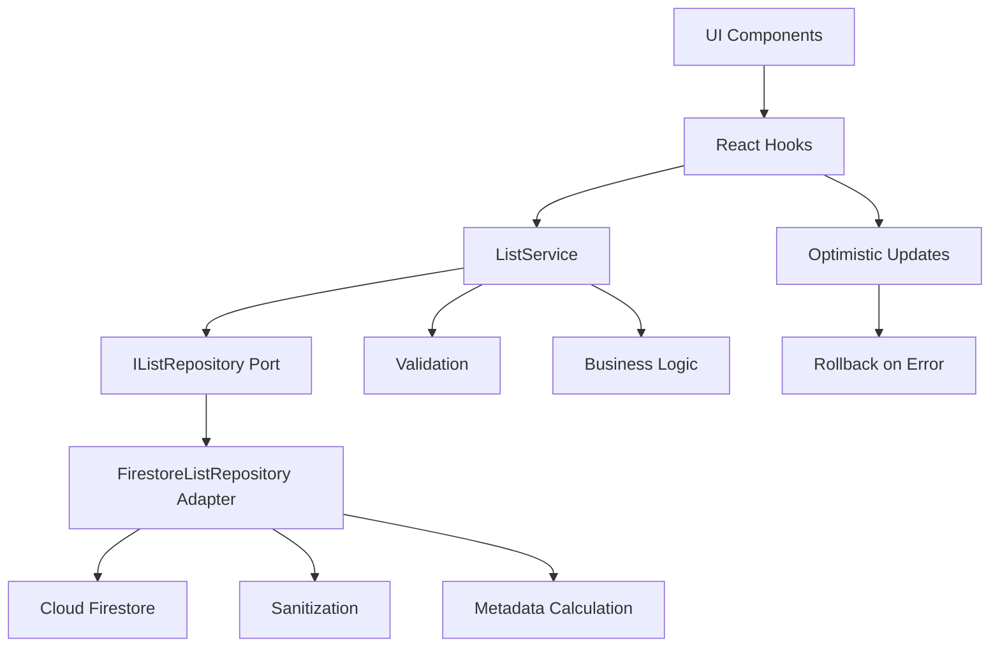
```mermaid
graph TD
    A[UI Components] --> B[React Hooks]
    B --> C[ListService]
    C --> D[IListRepository Port]
    D --> E[FirestoreListRepository Adapter]
    E --> F[Cloud Firestore]

    B --> G[Optimistic Updates]
    G --> H[Rollback on Error]

    C --> I[Validation]
    C --> J[Business Logic]

    E --> K[Sanitization]
    E --> L[Metadata Calculation]
```

### List Hierarchy

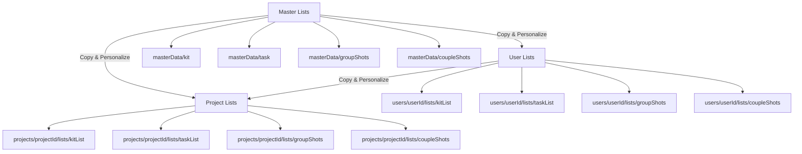
```mermaid
graph TD
    A[Master Lists] -->|Copy & Personalize| B[User Lists]
    A -->|Copy & Personalize| C[Project Lists]
    B -->|Copy & Personalize| C

    A --> A1[masterData/kit]
    A --> A2[masterData/task]
    A --> A3[masterData/groupShots]
    A --> A4[masterData/coupleShots]

    B --> B1[users/userId/lists/kitList]
    B --> B2[users/userId/lists/taskList]
    B --> B3[users/userId/lists/groupShots]
    B --> B4[users/userId/lists/coupleShots]

    C --> C1[projects/projectId/lists/kitList]
    C --> C2[projects/projectId/lists/taskList]
    C --> C3[projects/projectId/lists/groupShots]
    C --> C4[projects/projectId/lists/coupleShots]
```

---

## List Types Overview

### Kit List

- **Type**: `ListType.KIT`
- **Item Schema**: Extends `listBaseItemSchema` with `quantity: number`
- **Master Path**: `masterData/kit`
- **User Path**: `users/{userId}/lists/kitList`
- **Project Path**: `projects/{projectId}/lists/kitList`

### Task List

- **Type**: `ListType.TASKS`
- **Item Schema**: Uses `listBaseItemSchema` (no extensions)
- **Master Path**: `masterData/task`
- **User Path**: `users/{userId}/lists/taskList`
- **Project Path**: `projects/{projectId}/lists/taskList`

### Group Shot List

- **Type**: `ListType.GROUP_SHOTS`
- **Item Schema**: Extends `listBaseItemSchema` with `clientSelected: boolean` and `time: number`
- **Master Path**: `masterData/groupShots`
- **User Path**: `users/{userId}/lists/groupShots`
- **Project Path**: `projects/{projectId}/lists/groupShots`

### Couple Shot List

- **Type**: `ListType.COUPLE_SHOTS`
- **Item Schema**: Extends `listBaseItemSchema` with `clientSelected: boolean` and `time: number`
- **Master Path**: `masterData/coupleShots`
- **User Path**: `users/{userId}/lists/coupleShots`
- **Project Path**: `projects/{projectId}/lists/coupleShots`

---

## Master List Flow

### Fetch Master List Flow

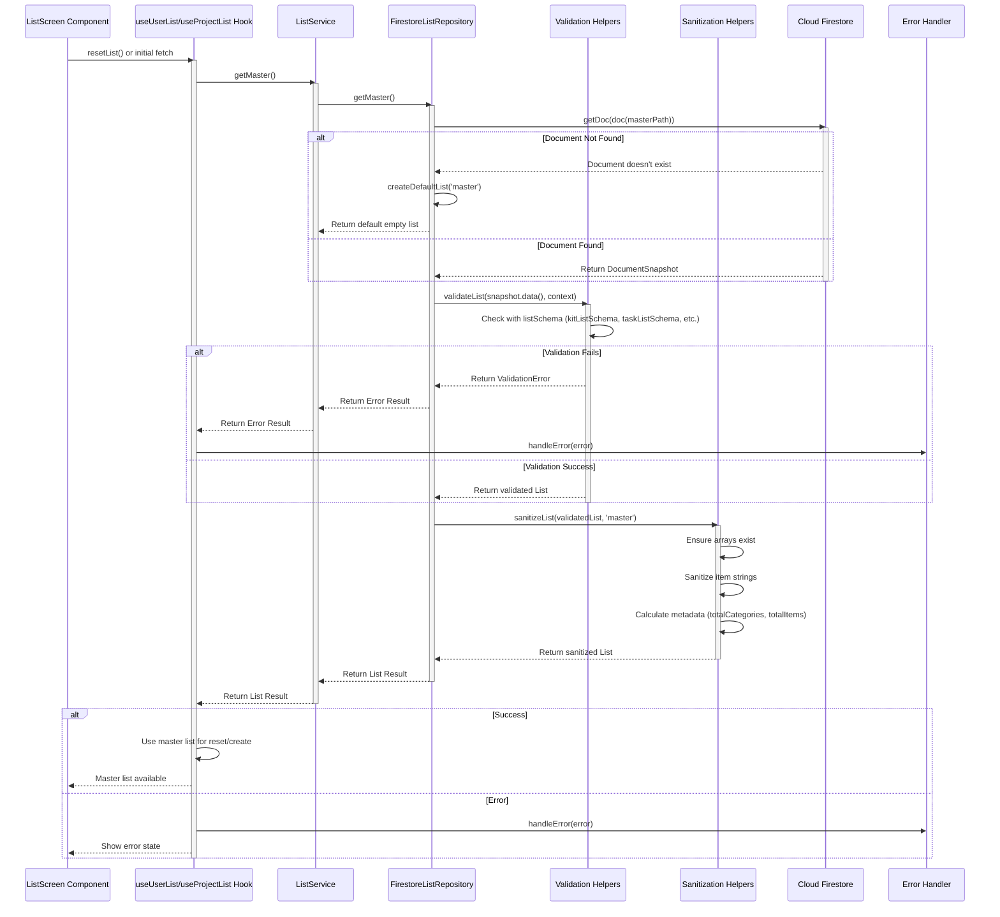
```mermaid
sequenceDiagram
    participant UI as ListScreen Component
    participant Hook as useUserList/useProjectList Hook
    participant Service as ListService
    participant Repo as FirestoreListRepository
    participant Validate as Validation Helpers
    participant Sanitize as Sanitization Helpers
    participant Firestore as Cloud Firestore
    participant ErrorHandler as Error Handler

    UI->>Hook: resetList() or initial fetch
    activate Hook
    Hook->>Service: getMaster()
    activate Service
    Service->>Repo: getMaster()
    activate Repo

    Repo->>Firestore: getDoc(doc(masterPath))
    activate Firestore
    alt Document Not Found
        Firestore-->>Repo: Document doesn't exist
        Repo->>Repo: createDefaultList('master')
        Repo-->>Service: Return default empty list
    else Document Found
        Firestore-->>Repo: Return DocumentSnapshot
    end
    deactivate Firestore

    Repo->>Validate: validateList(snapshot.data(), context)
    activate Validate
    Validate->>Validate: Check with listSchema (kitListSchema, taskListSchema, etc.)
    alt Validation Fails
        Validate-->>Repo: Return ValidationError
        Repo-->>Service: Return Error Result
        Service-->>Hook: Return Error Result
        Hook->>ErrorHandler: handleError(error)
    else Validation Success
        Validate-->>Repo: Return validated List
    end
    deactivate Validate

    Repo->>Sanitize: sanitizeList(validatedList, 'master')
    activate Sanitize
    Sanitize->>Sanitize: Ensure arrays exist
    Sanitize->>Sanitize: Sanitize item strings
    Sanitize->>Sanitize: Calculate metadata (totalCategories, totalItems)
    Sanitize-->>Repo: Return sanitized List
    deactivate Sanitize

    Repo-->>Service: Return List Result
    deactivate Repo
    Service-->>Hook: Return List Result
    deactivate Service

    alt Success
        Hook->>Hook: Use master list for reset/create
        Hook-->>UI: Master list available
    else Error
        Hook->>ErrorHandler: handleError(error)
        Hook-->>UI: Show error state
    end
    deactivate Hook
```

---

## User List Flows

### Create/Reset User List Flow

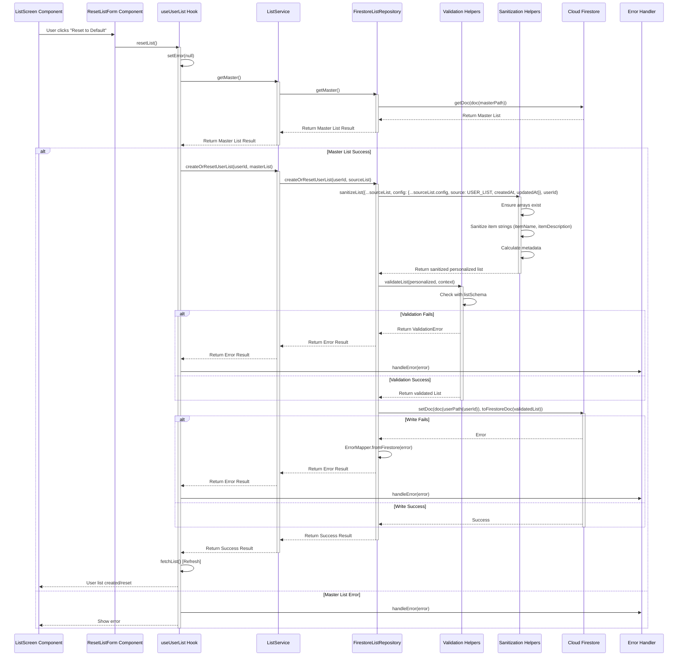
```mermaid
sequenceDiagram
    participant UI as ListScreen Component
    participant Form as ResetListForm Component
    participant Hook as useUserList Hook
    participant Service as ListService
    participant Repo as FirestoreListRepository
    participant Validate as Validation Helpers
    participant Sanitize as Sanitization Helpers
    participant Firestore as Cloud Firestore
    participant ErrorHandler as Error Handler

    UI->>Form: User clicks "Reset to Default"
    Form->>Hook: resetList()
    activate Hook
    Hook->>Hook: setError(null)

    Hook->>Service: getMaster()
    activate Service
    Service->>Repo: getMaster()
    activate Repo
    Repo->>Firestore: getDoc(doc(masterPath))
    Firestore-->>Repo: Return Master List
    Repo-->>Service: Return Master List Result
    deactivate Repo
    Service-->>Hook: Return Master List Result
    deactivate Service

    alt Master List Success
        Hook->>Service: createOrResetUserList(userId, masterList)
        activate Service
        Service->>Repo: createOrResetUserList(userId, sourceList)
        activate Repo

        Repo->>Sanitize: sanitizeList({...sourceList, config: {...sourceList.config, source: USER_LIST, createdAt, updatedAt}}, userId)
        activate Sanitize
        Sanitize->>Sanitize: Ensure arrays exist
        Sanitize->>Sanitize: Sanitize item strings (itemName, itemDescription)
        Sanitize->>Sanitize: Calculate metadata
        Sanitize-->>Repo: Return sanitized personalized list
        deactivate Sanitize

        Repo->>Validate: validateList(personalized, context)
        activate Validate
        Validate->>Validate: Check with listSchema
        alt Validation Fails
            Validate-->>Repo: Return ValidationError
            Repo-->>Service: Return Error Result
            Service-->>Hook: Return Error Result
            Hook->>ErrorHandler: handleError(error)
        else Validation Success
            Validate-->>Repo: Return validated List
        end
        deactivate Validate

        Repo->>Firestore: setDoc(doc(userPath(userId)), toFirestoreDoc(validatedList))
        activate Firestore
        alt Write Fails
            Firestore-->>Repo: Error
            Repo->>Repo: ErrorMapper.fromFirestore(error)
            Repo-->>Service: Return Error Result
            Service-->>Hook: Return Error Result
            Hook->>ErrorHandler: handleError(error)
        else Write Success
            Firestore-->>Repo: Success
        end
        deactivate Firestore

        Repo-->>Service: Return Success Result
        deactivate Repo
        Service-->>Hook: Return Success Result
        deactivate Service

        Hook->>Hook: fetchList() [Refresh]
        Hook-->>UI: User list created/reset
    else Master List Error
        Hook->>ErrorHandler: handleError(error)
        Hook-->>UI: Show error
    end
    deactivate Hook
```

### Fetch User List Flow

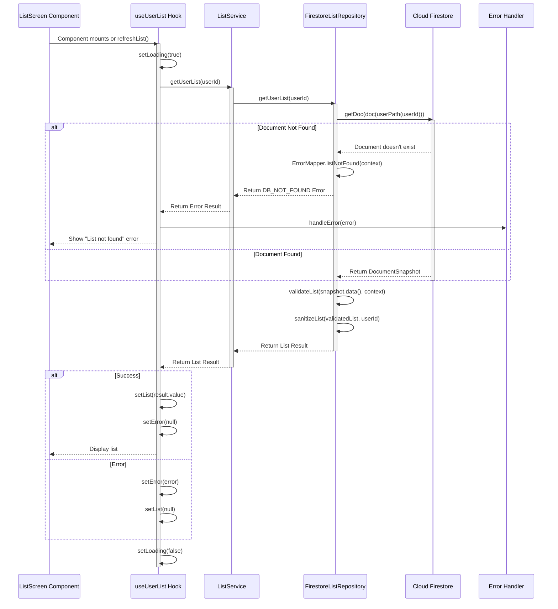
```mermaid
sequenceDiagram
    participant UI as ListScreen Component
    participant Hook as useUserList Hook
    participant Service as ListService
    participant Repo as FirestoreListRepository
    participant Firestore as Cloud Firestore
    participant ErrorHandler as Error Handler

    UI->>Hook: Component mounts or refreshList()
    activate Hook
    Hook->>Hook: setLoading(true)
    Hook->>Service: getUserList(userId)
    activate Service
    Service->>Repo: getUserList(userId)
    activate Repo

    Repo->>Firestore: getDoc(doc(userPath(userId)))
    activate Firestore
    alt Document Not Found
        Firestore-->>Repo: Document doesn't exist
        Repo->>Repo: ErrorMapper.listNotFound(context)
        Repo-->>Service: Return DB_NOT_FOUND Error
        Service-->>Hook: Return Error Result
        Hook->>ErrorHandler: handleError(error)
        Hook-->>UI: Show "List not found" error
    else Document Found
        Firestore-->>Repo: Return DocumentSnapshot
    end
    deactivate Firestore

    Repo->>Repo: validateList(snapshot.data(), context)
    Repo->>Repo: sanitizeList(validatedList, userId)
    Repo-->>Service: Return List Result
    deactivate Repo
    Service-->>Hook: Return List Result
    deactivate Service

    alt Success
        Hook->>Hook: setList(result.value)
        Hook->>Hook: setError(null)
        Hook-->>UI: Display list
    else Error
        Hook->>Hook: setError(error)
        Hook->>Hook: setList(null)
    end
    Hook->>Hook: setLoading(false)
    deactivate Hook
```

### Save User List Flow

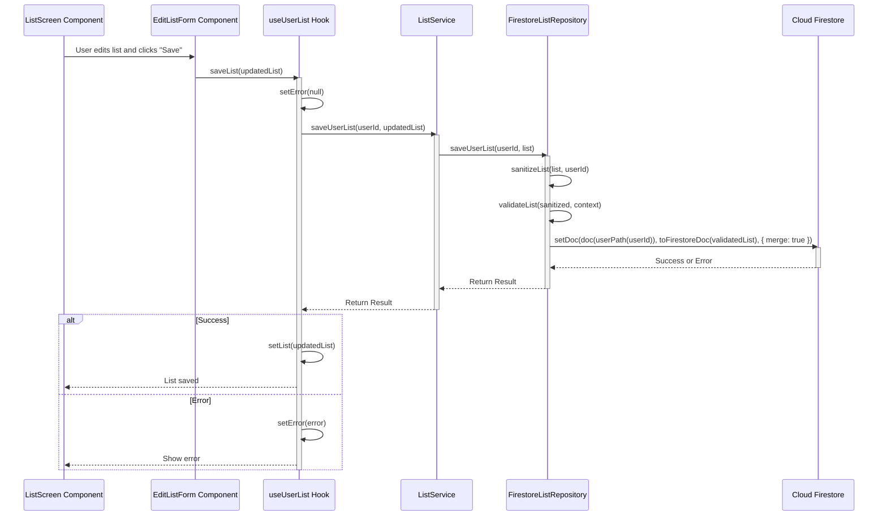
```mermaid
sequenceDiagram
    participant UI as ListScreen Component
    participant Form as EditListForm Component
    participant Hook as useUserList Hook
    participant Service as ListService
    participant Repo as FirestoreListRepository
    participant Firestore as Cloud Firestore

    UI->>Form: User edits list and clicks "Save"
    Form->>Hook: saveList(updatedList)
    activate Hook
    Hook->>Hook: setError(null)
    Hook->>Service: saveUserList(userId, updatedList)
    activate Service
    Service->>Repo: saveUserList(userId, list)
    activate Repo

    Repo->>Repo: sanitizeList(list, userId)
    Repo->>Repo: validateList(sanitized, context)
    Repo->>Firestore: setDoc(doc(userPath(userId)), toFirestoreDoc(validatedList), { merge: true })
    activate Firestore
    Firestore-->>Repo: Success or Error
    deactivate Firestore
    Repo-->>Service: Return Result
    deactivate Repo
    Service-->>Hook: Return Result
    deactivate Service

    alt Success
        Hook->>Hook: setList(updatedList)
        Hook-->>UI: List saved
    else Error
        Hook->>Hook: setError(error)
        Hook-->>UI: Show error
    end
    deactivate Hook
```

---

## Project List Flows

### Create Project List from User List Flow

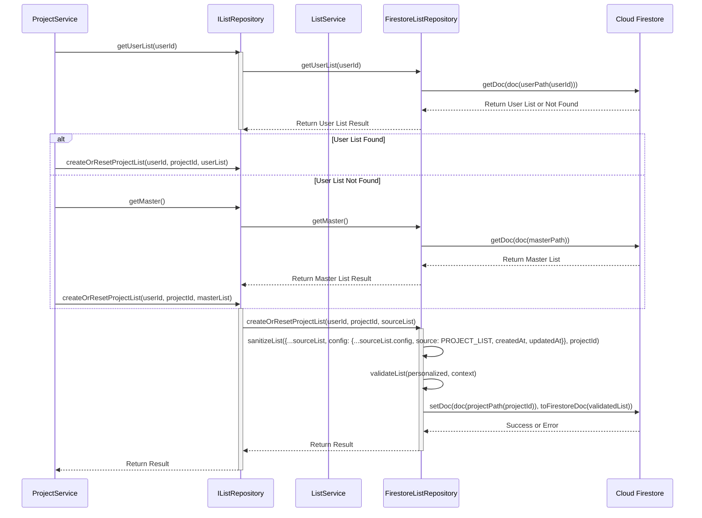
```mermaid
sequenceDiagram
    participant ProjectService as ProjectService
    participant ListRepo as IListRepository
    participant Service as ListService
    participant Repo as FirestoreListRepository
    participant Firestore as Cloud Firestore

    ProjectService->>ListRepo: getUserList(userId)
    activate ListRepo
    ListRepo->>Repo: getUserList(userId)
    Repo->>Firestore: getDoc(doc(userPath(userId)))
    Firestore-->>Repo: Return User List or Not Found
    Repo-->>ListRepo: Return User List Result
    deactivate ListRepo

    alt User List Found
        ProjectService->>ListRepo: createOrResetProjectList(userId, projectId, userList)
    else User List Not Found
        ProjectService->>ListRepo: getMaster()
        ListRepo->>Repo: getMaster()
        Repo->>Firestore: getDoc(doc(masterPath))
        Firestore-->>Repo: Return Master List
        Repo-->>ListRepo: Return Master List Result
        ProjectService->>ListRepo: createOrResetProjectList(userId, projectId, masterList)
    end

    activate ListRepo
    ListRepo->>Repo: createOrResetProjectList(userId, projectId, sourceList)
    activate Repo

    Repo->>Repo: sanitizeList({...sourceList, config: {...sourceList.config, source: PROJECT_LIST, createdAt, updatedAt}}, projectId)
    Repo->>Repo: validateList(personalized, context)
    Repo->>Firestore: setDoc(doc(projectPath(projectId)), toFirestoreDoc(validatedList))
    Firestore-->>Repo: Success or Error
    Repo-->>ListRepo: Return Result
    deactivate Repo
    ListRepo-->>ProjectService: Return Result
    deactivate ListRepo
```

---

## CRUD Operations

### Add Item Flow (with Optimistic Update)

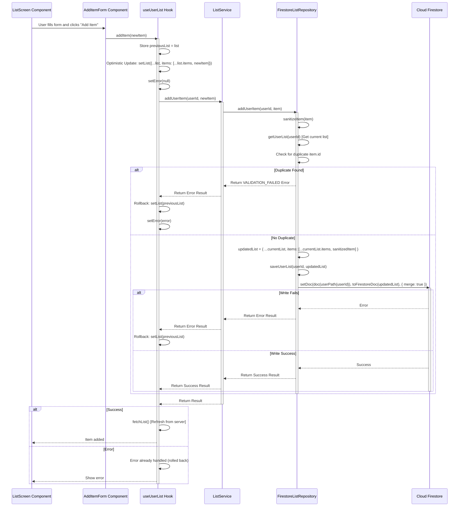
```mermaid
sequenceDiagram
    participant UI as ListScreen Component
    participant Form as AddItemForm Component
    participant Hook as useUserList Hook
    participant Service as ListService
    participant Repo as FirestoreListRepository
    participant Firestore as Cloud Firestore

    UI->>Form: User fills form and clicks "Add Item"
    Form->>Hook: addItem(newItem)
    activate Hook

    Hook->>Hook: Store previousList = list
    Hook->>Hook: Optimistic Update: setList({...list, items: [...list.items, newItem]})
    Hook->>Hook: setError(null)

    Hook->>Service: addUserItem(userId, newItem)
    activate Service
    Service->>Repo: addUserItem(userId, item)
    activate Repo

    Repo->>Repo: sanitizeItem(item)
    Repo->>Repo: getUserList(userId) [Get current list]
    Repo->>Repo: Check for duplicate item.id
    alt Duplicate Found
        Repo-->>Service: Return VALIDATION_FAILED Error
        Service-->>Hook: Return Error Result
        Hook->>Hook: Rollback: setList(previousList)
        Hook->>Hook: setError(error)
    else No Duplicate
        Repo->>Repo: updatedList = { ...currentList, items: [...currentList.items, sanitizedItem] }
        Repo->>Repo: saveUserList(userId, updatedList)
        Repo->>Firestore: setDoc(doc(userPath(userId)), toFirestoreDoc(updatedList), { merge: true })
        activate Firestore
        alt Write Fails
            Firestore-->>Repo: Error
            Repo-->>Service: Return Error Result
            Service-->>Hook: Return Error Result
            Hook->>Hook: Rollback: setList(previousList)
        else Write Success
            Firestore-->>Repo: Success
            Repo-->>Service: Return Success Result
            Service-->>Hook: Return Success Result
        end
        deactivate Firestore
    end
    deactivate Repo
    Service-->>Hook: Return Result
    deactivate Service

    alt Success
        Hook->>Hook: fetchList() [Refresh from server]
        Hook-->>UI: Item added
    else Error
        Hook->>Hook: Error already handled (rolled back)
        Hook-->>UI: Show error
    end
    deactivate Hook
```

### Delete Item Flow (with Optimistic Update)

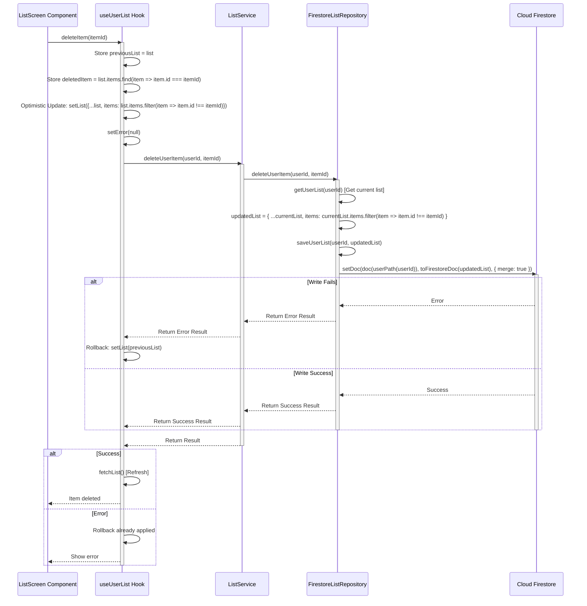
```mermaid
sequenceDiagram
    participant UI as ListScreen Component
    participant Hook as useUserList Hook
    participant Service as ListService
    participant Repo as FirestoreListRepository
    participant Firestore as Cloud Firestore

    UI->>Hook: deleteItem(itemId)
    activate Hook

    Hook->>Hook: Store previousList = list
    Hook->>Hook: Store deletedItem = list.items.find(item => item.id === itemId)
    Hook->>Hook: Optimistic Update: setList({...list, items: list.items.filter(item => item.id !== itemId)})
    Hook->>Hook: setError(null)

    Hook->>Service: deleteUserItem(userId, itemId)
    activate Service
    Service->>Repo: deleteUserItem(userId, itemId)
    activate Repo

    Repo->>Repo: getUserList(userId) [Get current list]
    Repo->>Repo: updatedList = { ...currentList, items: currentList.items.filter(item => item.id !== itemId) }
    Repo->>Repo: saveUserList(userId, updatedList)
    Repo->>Firestore: setDoc(doc(userPath(userId)), toFirestoreDoc(updatedList), { merge: true })
    activate Firestore
    alt Write Fails
        Firestore-->>Repo: Error
        Repo-->>Service: Return Error Result
        Service-->>Hook: Return Error Result
        Hook->>Hook: Rollback: setList(previousList)
    else Write Success
        Firestore-->>Repo: Success
        Repo-->>Service: Return Success Result
        Service-->>Hook: Return Success Result
    end
    deactivate Firestore
    deactivate Repo
    Service-->>Hook: Return Result
    deactivate Service

    alt Success
        Hook->>Hook: fetchList() [Refresh]
        Hook-->>UI: Item deleted
    else Error
        Hook->>Hook: Rollback already applied
        Hook-->>UI: Show error
    end
    deactivate Hook
```

### Update Items Flow (Batch Update with Optimistic Update)

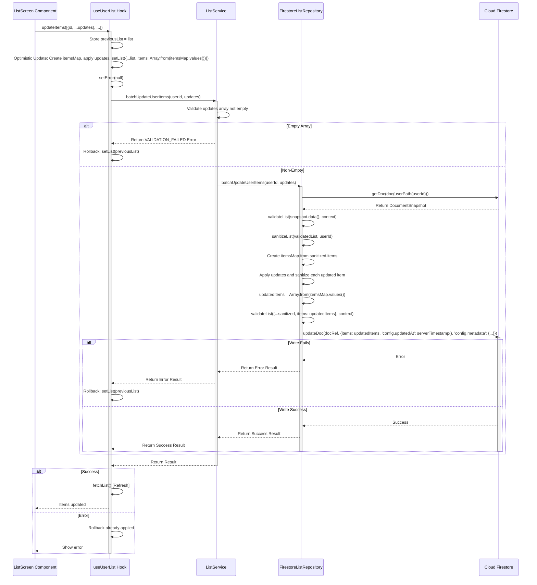
```mermaid
sequenceDiagram
    participant UI as ListScreen Component
    participant Hook as useUserList Hook
    participant Service as ListService
    participant Repo as FirestoreListRepository
    participant Firestore as Cloud Firestore

    UI->>Hook: updateItems([{id, ...updates}, ...])
    activate Hook

    Hook->>Hook: Store previousList = list
    Hook->>Hook: Optimistic Update: Create itemsMap, apply updates, setList({...list, items: Array.from(itemsMap.values())})
    Hook->>Hook: setError(null)

    Hook->>Service: batchUpdateUserItems(userId, updates)
    activate Service

    Service->>Service: Validate updates array not empty
    alt Empty Array
        Service-->>Hook: Return VALIDATION_FAILED Error
        Hook->>Hook: Rollback: setList(previousList)
    else Non-Empty
        Service->>Repo: batchUpdateUserItems(userId, updates)
        activate Repo

        Repo->>Firestore: getDoc(doc(userPath(userId)))
        Firestore-->>Repo: Return DocumentSnapshot
        Repo->>Repo: validateList(snapshot.data(), context)
        Repo->>Repo: sanitizeList(validatedList, userId)
        Repo->>Repo: Create itemsMap from sanitized.items
        Repo->>Repo: Apply updates and sanitize each updated item
        Repo->>Repo: updatedItems = Array.from(itemsMap.values())
        Repo->>Repo: validateList({...sanitized, items: updatedItems}, context)
        Repo->>Firestore: updateDoc(docRef, {items: updatedItems, 'config.updatedAt': serverTimestamp(), 'config.metadata': {...}})
        activate Firestore
        alt Write Fails
            Firestore-->>Repo: Error
            Repo-->>Service: Return Error Result
            Service-->>Hook: Return Error Result
            Hook->>Hook: Rollback: setList(previousList)
        else Write Success
            Firestore-->>Repo: Success
            Repo-->>Service: Return Success Result
            Service-->>Hook: Return Success Result
        end
        deactivate Firestore
        deactivate Repo
    end
    Service-->>Hook: Return Result
    deactivate Service

    alt Success
        Hook->>Hook: fetchList() [Refresh]
        Hook-->>UI: Items updated
    else Error
        Hook->>Hook: Rollback already applied
        Hook-->>UI: Show error
    end
    deactivate Hook
```

### Delete Items Flow (Batch Delete with Optimistic Update)

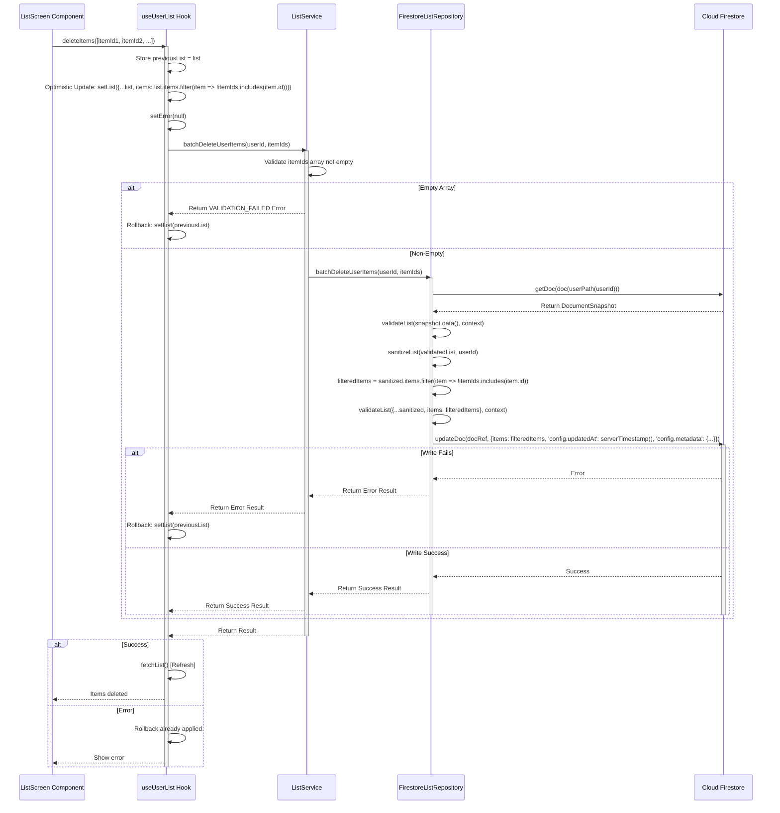
```mermaid
sequenceDiagram
    participant UI as ListScreen Component
    participant Hook as useUserList Hook
    participant Service as ListService
    participant Repo as FirestoreListRepository
    participant Firestore as Cloud Firestore

    UI->>Hook: deleteItems([itemId1, itemId2, ...])
    activate Hook

    Hook->>Hook: Store previousList = list
    Hook->>Hook: Optimistic Update: setList({...list, items: list.items.filter(item => !itemIds.includes(item.id))})
    Hook->>Hook: setError(null)

    Hook->>Service: batchDeleteUserItems(userId, itemIds)
    activate Service

    Service->>Service: Validate itemIds array not empty
    alt Empty Array
        Service-->>Hook: Return VALIDATION_FAILED Error
        Hook->>Hook: Rollback: setList(previousList)
    else Non-Empty
        Service->>Repo: batchDeleteUserItems(userId, itemIds)
        activate Repo

        Repo->>Firestore: getDoc(doc(userPath(userId)))
        Firestore-->>Repo: Return DocumentSnapshot
        Repo->>Repo: validateList(snapshot.data(), context)
        Repo->>Repo: sanitizeList(validatedList, userId)
        Repo->>Repo: filteredItems = sanitized.items.filter(item => !itemIds.includes(item.id))
        Repo->>Repo: validateList({...sanitized, items: filteredItems}, context)
        Repo->>Firestore: updateDoc(docRef, {items: filteredItems, 'config.updatedAt': serverTimestamp(), 'config.metadata': {...}})
        activate Firestore
        alt Write Fails
            Firestore-->>Repo: Error
            Repo-->>Service: Return Error Result
            Service-->>Hook: Return Error Result
            Hook->>Hook: Rollback: setList(previousList)
        else Write Success
            Firestore-->>Repo: Success
            Repo-->>Service: Return Success Result
            Service-->>Hook: Return Success Result
        end
        deactivate Firestore
        deactivate Repo
    end
    Service-->>Hook: Return Result
    deactivate Service

    alt Success
        Hook->>Hook: fetchList() [Refresh]
        Hook-->>UI: Items deleted
    else Error
        Hook->>Hook: Rollback already applied
        Hook-->>UI: Show error
    end
    deactivate Hook
```

---

## Optimistic Updates & Rollbacks

### Optimistic Update Pattern

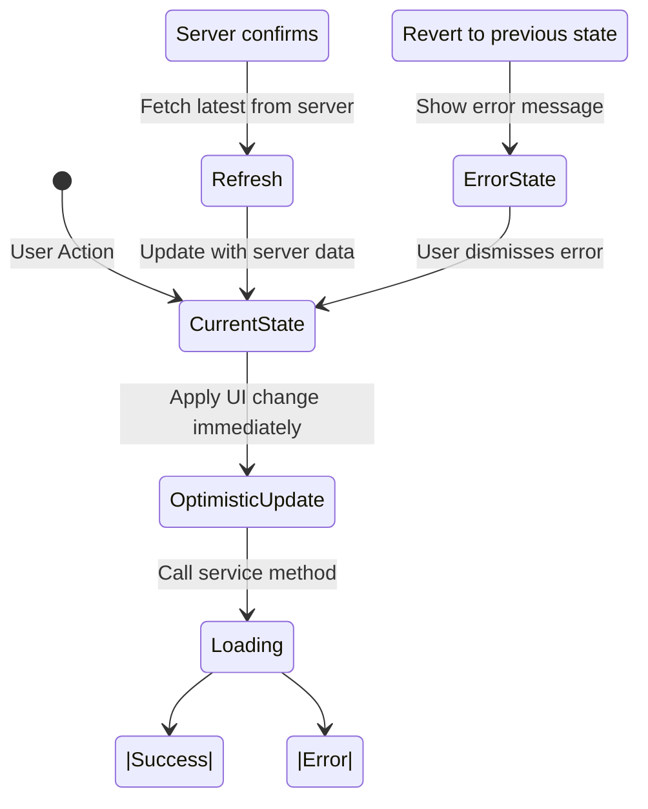
```mermaid
stateDiagram-v2
    [*] --> CurrentState: User Action
    CurrentState --> OptimisticUpdate: Apply UI change immediately
    OptimisticUpdate --> Loading: Call service method
    Loading -->|Success| ServerState: Server confirms
    Loading -->|Error| Rollback: Revert to previous state
    Rollback --> ErrorState: Show error message
    ServerState --> Refresh: Fetch latest from server
    Refresh --> CurrentState: Update with server data
    ErrorState --> CurrentState: User dismisses error
```

### Rollback Mechanism

**Hook Implementation**:

```typescript
// Store previous state
const previousList = list;

// Apply optimistic update
if (optimistic && previousList) {
  const optimisticList = {
    ...previousList,
    items: [...previousList.items, newItem],  // or filter/update
  };
  setList(optimisticList);
  setError(null);
}

// Call service
const result = await service.addUserItem(userId, item);

// Rollback on error
if (!result.success) {
  if (optimistic && previousList) {
    setList(previousList);  // Restore previous state
  }
  setError(result.error);
  handleError(result.error, {...});
}
```

---

## Category-Based Display

### Category Filtering Logic

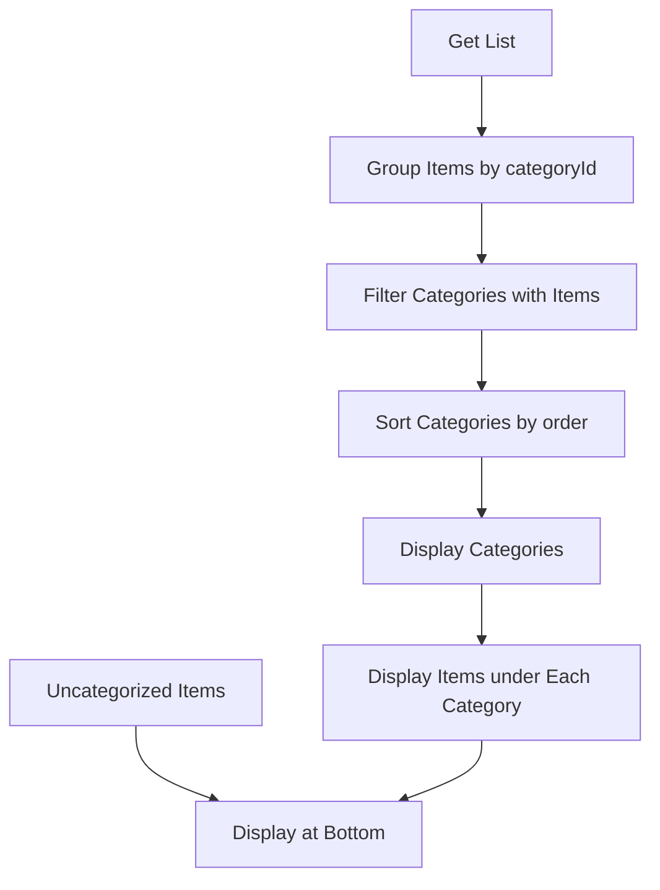
```mermaid
graph TD
    A[Get List] --> B[Group Items by categoryId]
    B --> C[Filter Categories with Items]
    C --> D[Sort Categories by order]
    D --> E[Display Categories]
    E --> F[Display Items under Each Category]

    G[Uncategorized Items] --> H[Display at Bottom]
    F --> H
```

### Category Display Process

**Component Logic** (Placeholder):

```typescript
// Group items by category
const itemsByCategory = useMemo(() => {
  const grouped = new Map<string, TItem[]>();

  // Group by categoryId
  list.items.forEach(item => {
    const categoryId = item.categoryId || 'uncategorized';
    if (!grouped.has(categoryId)) {
      grouped.set(categoryId, []);
    }
    grouped.get(categoryId)!.push(item);
  });

  return grouped;
}, [list.items]);

// Filter categories that have items
const categoriesWithItems = list.categories.filter(category =>
  itemsByCategory.has(category.id)
);

// Sort categories by order (if available)
const sortedCategories = [...categoriesWithItems].sort((a, b) => {
  if (a.order !== undefined && b.order !== undefined) {
    return a.order - b.order;
  }
  return a.catName.localeCompare(b.catName);
});

// Render
sortedCategories.map(category => (
  <CategorySection
    key={category.id}
    category={category}
    items={itemsByCategory.get(category.id) || []}
  />
));
```

---

## Item Checking/Unchecking

### Toggle Item Checked Status Flow

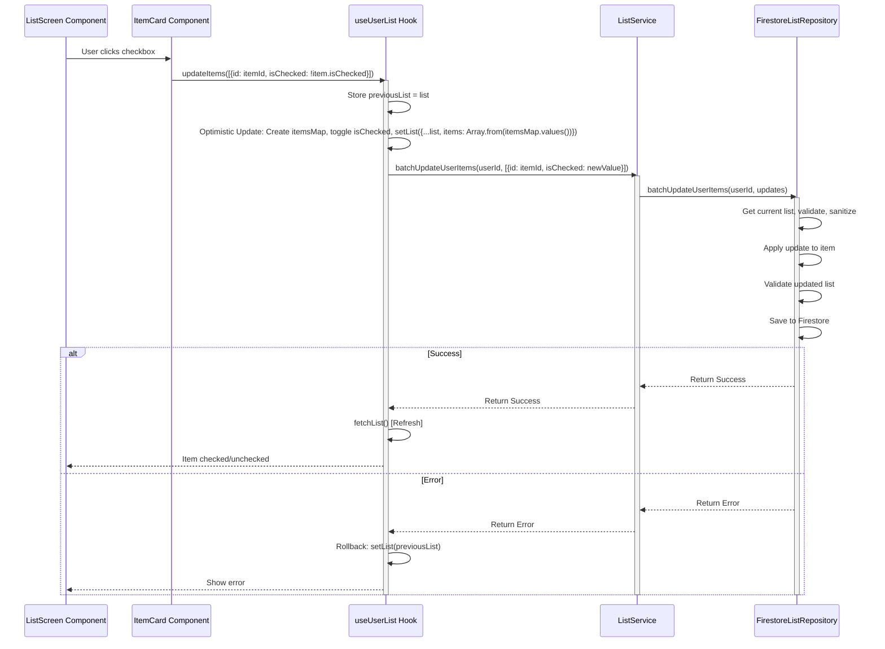
```mermaid
sequenceDiagram
    participant UI as ListScreen Component
    participant ItemCard as ItemCard Component
    participant Hook as useUserList Hook
    participant Service as ListService
    participant Repo as FirestoreListRepository

    UI->>ItemCard: User clicks checkbox
    ItemCard->>Hook: updateItems([{id: itemId, isChecked: !item.isChecked}])
    activate Hook

    Hook->>Hook: Store previousList = list
    Hook->>Hook: Optimistic Update: Create itemsMap, toggle isChecked, setList({...list, items: Array.from(itemsMap.values())})

    Hook->>Service: batchUpdateUserItems(userId, [{id: itemId, isChecked: newValue}])
    activate Service
    Service->>Repo: batchUpdateUserItems(userId, updates)
    activate Repo

    Repo->>Repo: Get current list, validate, sanitize
    Repo->>Repo: Apply update to item
    Repo->>Repo: Validate updated list
    Repo->>Repo: Save to Firestore

    alt Success
        Repo-->>Service: Return Success
        Service-->>Hook: Return Success
        Hook->>Hook: fetchList() [Refresh]
        Hook-->>UI: Item checked/unchecked
    else Error
        Repo-->>Service: Return Error
        Service-->>Hook: Return Error
        Hook->>Hook: Rollback: setList(previousList)
        Hook-->>UI: Show error
    end

    deactivate Repo
    deactivate Service
    deactivate Hook
```

### Check/Uncheck Multiple Items

```typescript
// Toggle multiple items
const toggleMultipleItems = async (itemIds: string[], checked: boolean) => {
  const updates = itemIds.map(id => ({
    id,
    isChecked: checked,
  }));

  return await updateItems(updates);
};

// Toggle all items in category
const toggleCategoryItems = async (categoryId: string, checked: boolean) => {
  const categoryItems = list.items.filter(item => item.categoryId === categoryId);
  const updates = categoryItems.map(item => ({
    id: item.id,
    isChecked: checked,
  }));

  return await updateItems(updates);
};
```

---

## Data Structures

### Base List Structure

```typescript
interface BaseList<TItem> {
  config: {
    id: string; // UUID
    type: ListType; // KIT, TASKS, GROUP_SHOTS, COUPLE_SHOTS
    source: ListSource; // MASTER_LIST, USER_LIST, PROJECT_LIST
    audit: AuditMetadata;
    defaultValues: boolean;
    version: string;
    createdAt?: Date;
    updatedAt?: Date;
    metadata?: {
      totalCategories: number;
      totalItems: number;
      lastModified: Date;
      lastModifiedBy: string;
    };
  };
  categories: Category[];
  items: TItem[];
  pendingUpdates?: PendingUpdate[];
}
```

### Kit Item Structure

```typescript
interface KitItem extends ListBaseItem {
  id: string;
  categoryId?: string;
  itemName: string; // 1-50 chars, trimmed
  itemDescription: string; // 1-500 chars, trimmed
  quantity: number; // Integer, min 1, default 1
  isCustom: boolean;
  isChecked: boolean;
  isDisabled: boolean;
}
```

### Task Item Structure

```typescript
interface TaskItem extends ListBaseItem {
  id: string;
  categoryId?: string;
  itemName: string; // 1-50 chars, trimmed
  itemDescription: string; // 1-500 chars, trimmed
  isCustom: boolean;
  isChecked: boolean;
  isDisabled: boolean;
}
```

### Group Shot Item Structure

```typescript
interface GroupShotItem extends ListBaseItem {
  id: string;
  categoryId?: string;
  itemName: string; // 1-50 chars, trimmed
  itemDescription: string; // 1-500 chars, trimmed
  clientSelected: boolean; // Default false
  time: number; // Integer, min 0, default 0
  isCustom: boolean;
  isChecked: boolean;
  isDisabled: boolean;
}
```

### Couple Shot Item Structure

```typescript
interface CoupleShotItem extends ListBaseItem {
  id: string;
  categoryId?: string;
  itemName: string; // 1-50 chars, trimmed
  itemDescription: string; // 1-500 chars, trimmed
  clientSelected: boolean; // Default false
  time: number; // Integer, min 0, default 0
  isCustom: boolean;
  isChecked: boolean;
  isDisabled: boolean;
}
```

### Category Structure

```typescript
interface Category {
  id: string;
  catName: string; // 1-50 chars, trimmed
  catDescription: string; // 1-500 chars, trimmed
  iconName?: string; // Max 50 chars
  isCustom: boolean;
  isComplete: boolean;
  itemIds: string[]; // IDs of items in this category
  show: boolean;
  order?: number; // Integer, min 0
  color?: string; // Hex color
}
```

---

## Validation & Sanitization

### Validation Rules

**List Schema Validation**:

- Uses specific schema: `kitListSchema`, `taskListSchema`, `groupShotListSchema`, `coupleShotListSchema`
- Validates `config`, `categories`, `items`, `pendingUpdates`

**Item Validation**:

- `itemName`: Required, 1-50 characters (default), trimmed
- `itemDescription`: Required, 1-500 characters (default), trimmed
- `id`: Required string, min 1 character
- `categoryId`: Optional string
- `isCustom`, `isChecked`, `isDisabled`: Boolean defaults

**Kit-Specific**:

- `quantity`: Integer, min 1, default 1

**Shot-Specific**:

- `clientSelected`: Boolean, default false
- `time`: Integer, min 0, default 0

### Sanitization Process

**Sanitize Item**:

```typescript
private sanitizeItem(item: TItem): TItem {
  return {
    ...item,
    itemName: sanitizeString(item.itemName),      // Trim whitespace
    itemDescription: sanitizeString(item.itemDescription),  // Trim whitespace
  };
}
```

**Sanitize List**:

```typescript
private sanitizeList(list: TList, lastModifiedBy: string): TList {
  // Ensure arrays exist
  const categories = Array.isArray(list.categories) ? list.categories : [];
  const items = Array.isArray(list.items) ? sanitizeArray(list.items) : [];

  // Sanitize item strings
  const sanitizedItems = items.map(item => this.sanitizeItem(item));

  // Calculate metadata
  const categoriesWithItems = categories.filter(category =>
    sanitizedItems.some(item => item.categoryId === category.id)
  );

  const metadata = {
    ...list.config.metadata,
    totalCategories: categoriesWithItems.length,
    totalItems: sanitizedItems.length,
    lastModified: new Date(),
    lastModifiedBy,
  };

  return {
    ...list,
    config: { ...list.config, metadata },
    categories,
    items: sanitizedItems,
  };
}
```

---

## Error Handling

### Error Types

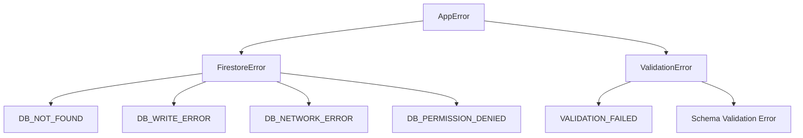
```mermaid
graph TD
    A[AppError] --> B[FirestoreError]
    A --> C[ValidationError]

    B --> D[DB_NOT_FOUND]
    B --> E[DB_WRITE_ERROR]
    B --> F[DB_NETWORK_ERROR]
    B --> G[DB_PERMISSION_DENIED]

    C --> H[VALIDATION_FAILED]
    C --> I[Schema Validation Error]
```

### Error Mapping

- **Document Not Found**: `DB_NOT_FOUND` - "List not found."
- **Write Errors**: `DB_WRITE_ERROR` - "Failed to save list. Please try again."
- **Network Errors**: `DB_NETWORK_ERROR` - "Service temporarily unavailable."
- **Permission Errors**: `DB_PERMISSION_DENIED` - "You do not have permission."
- **Validation Errors**: `VALIDATION_FAILED` - Field-specific errors
- **Duplicate Item**: `VALIDATION_FAILED` - "This item already exists in the list."

---

## Loading States

### State Transitions

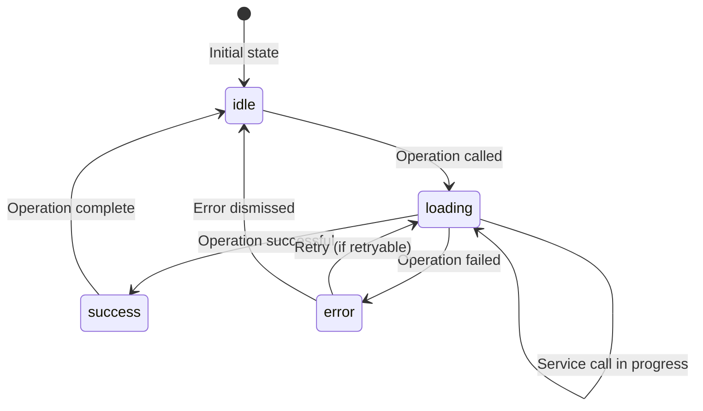
```mermaid
stateDiagram-v2
    [*] --> idle: Initial state
    idle --> loading: Operation called
    loading --> loading: Optimistic update applied
    loading --> loading: Service call in progress
    loading --> success: Operation successful
    loading --> error: Operation failed
    error --> loading: Retry (if retryable)
    success --> idle: Operation complete
    error --> idle: Error dismissed
```

### Loading State Management

```typescript
const [list, setList] = useState<TList | null>(null);
const [loading, setLoading] = useState(autoFetch);
const [error, setError] = useState<AppError | null>(null);

// Optimistic updates don't change loading state (immediate UI update)
// Only setLoading(true) on fetch operations
// SetLoading(false) after service call completes
```

---

## File Structure

### Key Files

| File                                                      | Purpose                                          |
| --------------------------------------------------------- | ------------------------------------------------ |
| `src/repositories/i-list-repository.ts`                   | Port interface definition                        |
| `src/repositories/firestore/firestore-list-repository.ts` | Generic repository implementation                |
| `src/repositories/firestore/list.repository.ts`           | Specific repository instances (kit, task, shots) |
| `src/services/ListService.ts`                             | Business logic layer                             |
| `src/hooks/use-list-actions.ts`                           | React hooks (useUserList, useProjectList)        |
| `src/domain/common/list-base.schema.ts`                   | Base schemas                                     |
| `src/domain/user/kit.schema.ts`                           | Kit list schemas                                 |
| `src/domain/user/task.schema.ts`                          | Task list schemas                                |
| `src/domain/user/shots.schema.ts`                         | Shot list schemas                                |

### Repository Configurations

```typescript
// Kit Repository
export const kitRepository = new FirestoreListRepository<KitList, KitItem>({
  masterPath: 'masterData/kit',
  userPath: (userId: string) => ['users', userId, 'lists', 'kitList'] as const,
  projectPath: (projectId: string) => ['projects', projectId, 'lists', 'kitList'] as const,
  listSchema: kitListSchema,
  listType: ListType.KIT,
  serviceName: 'KitRepository',
});

// Task Repository (similar structure)
// Group Shot Repository (similar structure)
// Couple Shot Repository (similar structure)
```

---

## Hooks Usage

### useUserList Hook

```typescript
const {
  list,
  loading,
  error,
  fetchList,
  saveList,
  addItem,
  deleteItem,
  updateItems,
  deleteItems,
  resetList,
  clearError,
  refreshList,
} = useUserList(
  kitService, // or taskService, groupShotService, coupleShotService
  userId,
  { autoFetch: true, enableRealtime: false },
);

// Add item with optimistic update
await addItem(newKitItem);

// Update items (e.g., check/uncheck)
await updateItems([{ id: 'item1', isChecked: true }]);

// Delete item with optimistic update
await deleteItem('item1');

// Reset list from master
await resetList();
```

### useProjectList Hook

```typescript
const {
  list,
  loading,
  error,
  fetchList,
  saveList,
  addItem,
  deleteItem,
  updateItems,
  deleteItems,
  resetList,
  clearError,
  refreshList,
} = useProjectList(kitService, projectId, { autoFetch: true, enableRealtime: true });

// Same API as useUserList, but operates on project lists
```

---

## Ports & Adapters

### Architecture Pattern

- **Port**: `IListRepository<TList, TItem>` interface
- **Adapter**: `FirestoreListRepository<TList, TItem>` implementation
- **Service**: `ListService<TList, TItem>` business logic
- **Hook**: `useUserList` / `useProjectList` React hooks

### Dependency Injection

```typescript
// Service Factory creates services with repositories
const kitService = new ListService(kitRepository);
const taskService = new ListService(taskRepository);
const groupShotService = new ListService(groupShotRepository);
const coupleShotService = new ListService(coupleShotRepository);
```

---

## Simple Explanations

### What is a Master List?

A **Master List** is the default template list stored in Firestore at paths like:

- `masterData/kit`
- `masterData/task`
- `masterData/groupShots`
- `masterData/coupleShots`

Master lists serve as templates that users can copy to create their own personalized lists.

### What Happens When You Reset Your List?

1. **Fetch Master List**: The system fetches the master list from Firestore
2. **Personalize**: Changes the `source` to `USER_LIST` and sets timestamps
3. **Sanitize**: Cleans all item strings (names, descriptions)
4. **Validate**: Checks the list against the schema
5. **Save**: Writes the personalized list to `users/{userId}/lists/{listType}`
6. **Refresh**: Fetches the new list to display

### What is a User List?

A **User List** is your personalized copy of a master list, stored at:

- `users/{userId}/lists/kitList`
- `users/{userId}/lists/taskList`
- `users/{userId}/lists/groupShots`
- `users/{userId}/lists/coupleShots`

You can customize user lists by adding, removing, or modifying items.

### What is a Project List?

A **Project List** is a copy of your user list (or master list) created for a specific project, stored at:

- `projects/{projectId}/lists/kitList`
- `projects/{projectId}/lists/taskList`
- `projects/{projectId}/lists/groupShots`
- `projects/{projectId}/lists/coupleShots`

Project lists are independent copies that can be customized per project without affecting your master user list.

### What Happens When You Add an Item?

1. **Optimistic Update**: Item appears immediately in the UI
2. **Validation**: System checks for duplicate item IDs
3. **Sanitization**: Item name and description are trimmed
4. **Save**: Updated list is saved to Firestore
5. **Refresh**: List is refreshed from server to get final state
6. **Rollback**: If save fails, item is removed from UI and error is shown

### What Happens When You Check/Uncheck an Item?

1. **Optimistic Update**: Checkbox state changes immediately
2. **Batch Update**: Item's `isChecked` property is updated via `batchUpdateUserItems`
3. **Validation**: Updated list is validated
4. **Save**: Only the `items` array and metadata are updated in Firestore
5. **Refresh**: List is refreshed to get final state
6. **Rollback**: If save fails, checkbox reverts and error is shown

### How Are Items Displayed by Category?

1. **Group Items**: Items are grouped by their `categoryId`
2. **Filter Categories**: Only categories that have items are shown
3. **Sort Categories**: Categories are sorted by `order` (if available) or alphabetically
4. **Display**: Each category section shows its items
5. **Uncategorized**: Items without a `categoryId` are shown in an "Uncategorized" section

### Optimistic Updates Explained

**Optimistic Updates** make the UI feel instant by updating it immediately, before the server confirms the change.

**Process**:

1. User performs action (add, delete, update)
2. UI updates immediately (optimistic)
3. Server operation happens in background
4. If successful: UI refreshes with server state
5. If failed: UI rolls back to previous state and shows error

**Benefits**:

- Feels instant and responsive
- Better user experience
- Handles errors gracefully with rollback

---

## Summary Flow Charts

### Complete User List Lifecycle

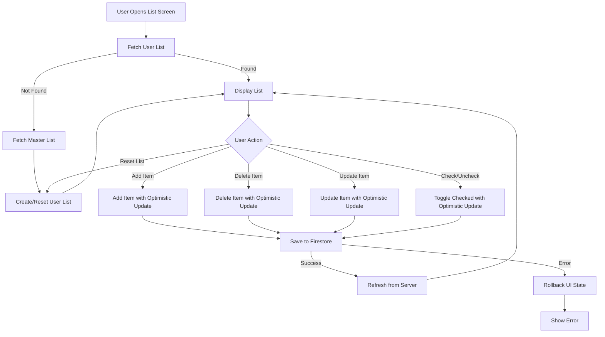
```mermaid
graph TD
    Start[User Opens List Screen] --> FetchUser[Fetch User List]
    FetchUser -->|Found| Display[Display List]
    FetchUser -->|Not Found| FetchMaster[Fetch Master List]
    FetchMaster --> Reset[Create/Reset User List]
    Reset --> Display

    Display --> UserAction{User Action}
    UserAction -->|Add Item| Add[Add Item with Optimistic Update]
    UserAction -->|Delete Item| Delete[Delete Item with Optimistic Update]
    UserAction -->|Update Item| Update[Update Item with Optimistic Update]
    UserAction -->|Check/Uncheck| Toggle[Toggle Checked with Optimistic Update]
    UserAction -->|Reset List| Reset

    Add --> Save[Save to Firestore]
    Delete --> Save
    Update --> Save
    Toggle --> Save

    Save -->|Success| Refresh[Refresh from Server]
    Save -->|Error| Rollback[Rollback UI State]
    Rollback --> ShowError[Show Error]
    Refresh --> Display
```

### Complete Project List Creation Flow

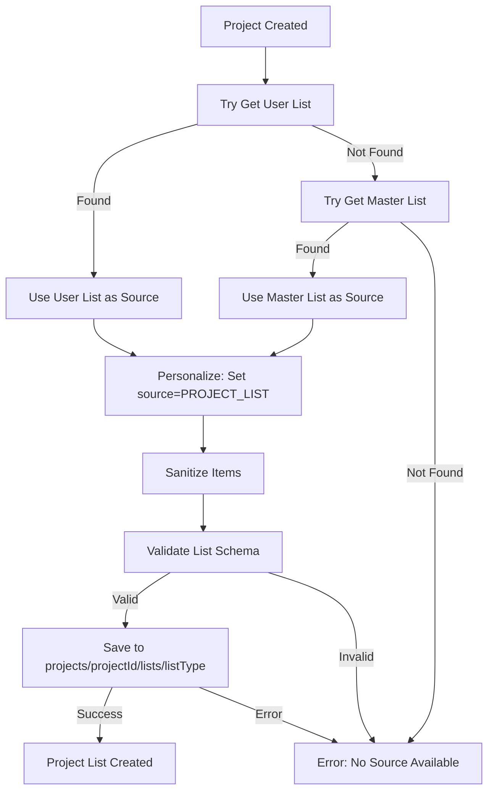
```mermaid
graph TD
    Start[Project Created] --> TryUser[Try Get User List]
    TryUser -->|Found| UseUser[Use User List as Source]
    TryUser -->|Not Found| TryMaster[Try Get Master List]
    TryMaster -->|Found| UseMaster[Use Master List as Source]
    TryMaster -->|Not Found| Error[Error: No Source Available]

    UseUser --> Personalize[Personalize: Set source=PROJECT_LIST]
    UseMaster --> Personalize

    Personalize --> Sanitize[Sanitize Items]
    Sanitize --> Validate[Validate List Schema]
    Validate -->|Valid| Save[Save to projects/projectId/lists/listType]
    Validate -->|Invalid| Error

    Save -->|Success| Complete[Project List Created]
    Save -->|Error| Error
```

---

## Key Takeaways

1. **Generic Architecture**: All list types use the same generic `FirestoreListRepository` with configuration
2. **Three-Tier Hierarchy**: Master Lists → User Lists → Project Lists
3. **Optimistic Updates**: All item operations (add, delete, update) use optimistic updates with rollback
4. **Category-Based Display**: Items are grouped and displayed by category with sorting support
5. **Item Checking**: Toggle `isChecked` property via batch updates with optimistic UI
6. **Validation**: Comprehensive validation at schema level and business logic level
7. **Sanitization**: All string fields trimmed, arrays filtered, metadata calculated
8. **Error Handling**: Graceful error handling with user-friendly messages and rollback
9. **Real-time Subscriptions**: Optional real-time updates via Firestore `onSnapshot`
10. **Metadata Tracking**: Automatic calculation of `totalCategories`, `totalItems`, `lastModified`, `lastModifiedBy`

---

_Document generated: 2025-01-XX_
_Last updated: Based on current codebase structure_
