# Complete Portal Flow Documentation

## Overview

This document traces **all** Portal processes for managing client portals in the Eye-Doo application. The Portal system manages portal setup, access control, step management, expiration, and client-facing workflows.

---

## Table of Contents

1. [High-Level Flow Overview](#high-level-flow-overview)
2. [Detailed Process Flows](#detailed-process-flows)
   - [Setup Client Portal](#setup-client-portal-flow)
   - [Get Portal Data](#get-portal-data-flow)
   - [List User Portals](#list-user-portals-flow)
   - [Subscribe to User Portals (Real-time)](#subscribe-to-user-portals-real-time-flow)
   - [Update Portal](#update-portal-flow)
   - [Delete Portal](#delete-portal-flow)
   - [Enable Portal Access](#enable-portal-access-flow)
   - [Disable Portal Access](#disable-portal-access-flow)
   - [Update Portal Message](#update-portal-message-flow)
   - [Update Section Status](#update-section-status-flow)
   - [Extend Portal Expiration](#extend-portal-expiration-flow)
   - [Reset Portal Steps](#reset-portal-steps-flow)
   - [Lock Client Portal](#lock-client-portal-flow)
3. [Business Logic Methods](#business-logic-methods)
   - [Create Portal Steps Array](#create-portal-steps-array)
   - [Update Step Status](#update-step-status)
   - [Reset Steps to Locked](#reset-steps-to-locked)
   - [Get Step by ID](#get-step-by-id)
   - [Calculate Completion Stats](#calculate-completion-stats)
   - [Is Portal Expired](#is-portal-expired)
   - [Get Portal Stats](#get-portal-stats)
4. [UI Component Structure](#ui-component-structure)
5. [Data Structures](#data-structures)
6. [Input Validation](#input-validation)
7. [Sanitization Process](#sanitization-process)
8. [Loading States](#loading-states)
9. [Error Handling](#error-handling)
10. [Cloud Functions Integration](#cloud-functions-integration)
11. [File Structure & Function Calls](#file-structure--function-calls)
12. [Hooks Usage](#hooks-usage)
13. [Ports & Adapters](#ports--adapters)
14. [Simple Explanation](#simple-explanation)

---

## High-Level Flow Overview

### Portal Operations Overview

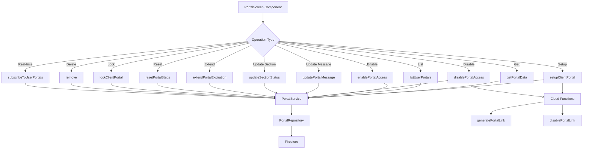
```mermaid
graph TD
    A[PortalScreen Component] --> B{Operation Type}
    B -->|Setup| C[setupClientPortal]
    B -->|Get| D[getPortalData]
    B -->|List| E[listUserPortals]
    B -->|Enable| F[enablePortalAccess]
    B -->|Disable| G[disablePortalAccess]
    B -->|Update Message| H[updatePortalMessage]
    B -->|Update Section| I[updateSectionStatus]
    B -->|Extend| J[extendPortalExpiration]
    B -->|Reset| K[resetPortalSteps]
    B -->|Lock| L[lockClientPortal]
    B -->|Delete| M[remove]
    B -->|Real-time| N[subscribeToUserPortals]
    
    C --> O[PortalService]
    D --> O
    E --> O
    F --> O
    G --> O
    H --> O
    I --> O
    J --> O
    K --> O
    L --> O
    M --> O
    N --> O
    
    O --> P[PortalRepository]
    P --> Q[Firestore]
    
    C --> R[Cloud Functions]
    G --> R
    
    R --> S[generatePortalLink]
    R --> T[disablePortalLink]
```

### Core Portal Flow

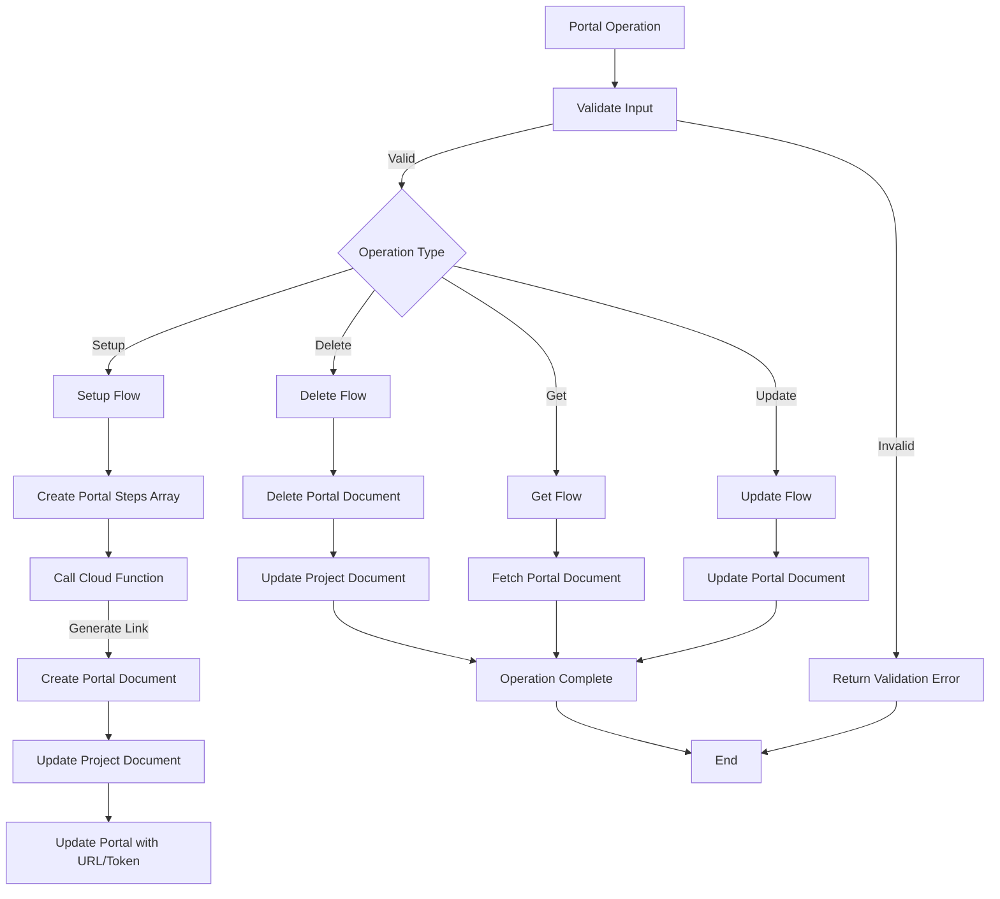
```mermaid
graph TD
    Start[Portal Operation] --> Validate[Validate Input]
    Validate -->|Invalid| Error1[Return Validation Error]
    Validate -->|Valid| CheckOperation{Operation Type}
    CheckOperation -->|Setup| SetupFlow[Setup Flow]
    CheckOperation -->|Update| UpdateFlow[Update Flow]
    CheckOperation -->|Get| GetFlow[Get Flow]
    CheckOperation -->|Delete| DeleteFlow[Delete Flow]
    
    SetupFlow --> CreateSteps[Create Portal Steps Array]
    CreateSteps --> CloudFunction[Call Cloud Function]
    CloudFunction -->|Generate Link| CreateDoc[Create Portal Document]
    CreateDoc --> UpdateProject[Update Project Document]
    UpdateProject --> UpdatePortal[Update Portal with URL/Token]
    
    UpdateFlow --> UpdateDoc[Update Portal Document]
    UpdateDoc --> Success[Operation Complete]
    
    GetFlow --> FetchDoc[Fetch Portal Document]
    FetchDoc --> Success
    
    DeleteFlow --> DeleteDoc[Delete Portal Document]
    DeleteDoc --> UpdateProject2[Update Project Document]
    UpdateProject2 --> Success
    
    Error1 --> End[End]
    Success --> End
```

---

## Detailed Process Flows

### Setup Client Portal Flow

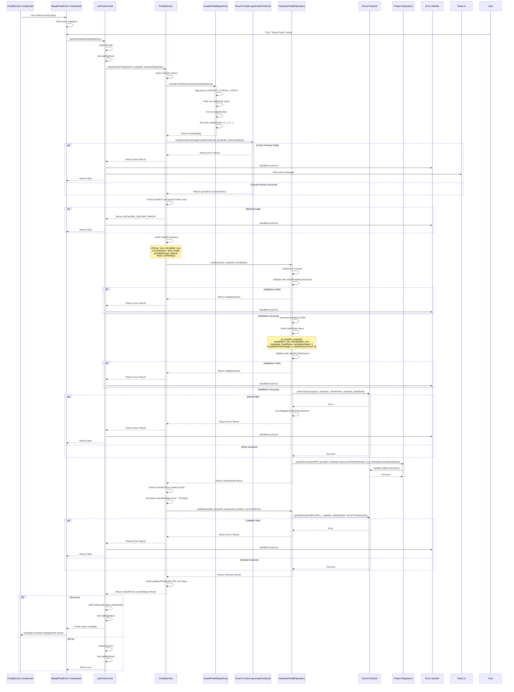
```mermaid
sequenceDiagram
    participant UI as PortalScreen Component
    participant Form as SetupPortalForm Component
    participant Hook as usePortal Hook
    participant Service as PortalService
    participant Steps as createPortalStepsArray
    participant CloudFunc as Cloud Function generatePortalLink
    participant Repo as FirestorePortalRepository
    participant Firestore as Cloud Firestore
    participant ProjectRepo as Project Repository
    participant ErrorHandler as Error Handler
    participant Toast as Toast UI

    UI->>Form: User selects portal steps
    Form->>Form: Client-side validation
    User->>Form: Click "Setup Portal" button
    Form->>Hook: setupPortal(selectedStepKeys)
    activate Hook
    
    Hook->>Hook: setError(null)
    Hook->>Hook: setLoading(true)
    Hook->>Service: setupClientPortal(userId, projectId, selectedStepKeys)
    activate Service
    
    Service->>Service: Build method context
    Service->>Steps: createPortalStepsArray(selectedStepKeys)
    activate Steps
    Steps->>Steps: Map keys to DEFAULT_PORTAL_STEPS
    Steps->>Steps: Filter out undefined steps
    Steps->>Steps: Sort by stepNumber
    Steps->>Steps: Re-index stepNumber (1, 2, 3...)
    Steps-->>Service: Return PortalStep[]
    deactivate Steps
    
    Service->>CloudFunc: wrapCloudFunction(generatePortalLink, {projectId, selectedSteps})
    activate CloudFunc
    alt Cloud Function Fails
        CloudFunc-->>Service: Return Error Result
        Service-->>Hook: Return Error Result
        Hook->>ErrorHandler: handleError(error)
        Hook->>Toast: Show error message
        Hook-->>Form: Return false
    else Cloud Function Success
        CloudFunc-->>Service: Return {portalUrl, accessToken}
    end
    deactivate CloudFunc
    
    Service->>Service: Check portalUrl and accessToken exist
    alt Missing Data
        Service-->>Hook: Return NETWORK_SERVER_ERROR
        Hook->>ErrorHandler: handleError(error)
        Hook-->>Form: Return false
    end
    
    Service->>Service: Build ClientPortalInput
    Note over Service: isSetup: true, isEnabled: true,<br/>currentStepID: WELCOME,<br/>portalMessage: default,<br/>steps: portalSteps
    
    Service->>Repo: create(userId, projectId, portalInput)
    activate Repo
    
    Repo->>Repo: Build Error Context
    Repo->>Repo: Validate with clientPortalInputSchema
    alt Validation Fails
        Repo-->>Service: Return ValidationError
        Service-->>Hook: Return Error Result
        Hook->>ErrorHandler: handleError(error)
    else Validation Success
    end
    
    Repo->>Repo: Generate portalId (UUID)
    Repo->>Repo: Build newPortal object
    Note over Repo: id: portalId, projectId,<br/>setupDate: now, lastUpdated: now,<br/>metadata: {totalSteps, completedSteps: 0,<br/>completionPercentage: 0, clientAccessCount: 0}
    
    Repo->>Repo: Validate with clientPortalSchema
    alt Validation Fails
        Repo-->>Service: Return ValidationError
        Service-->>Hook: Return Error Result
        Hook->>ErrorHandler: handleError(error)
    else Validation Success
    end
    
    Repo->>Firestore: setDoc(doc('projects', projectId, 'clientPortal', portalId), portalData)
    activate Firestore
    alt Write Fails
        Firestore-->>Repo: Error
        Repo->>Repo: ErrorMapper.fromFirestore(error)
        Repo-->>Service: Return Error Result
        Service-->>Hook: Return Error Result
        Hook->>ErrorHandler: handleError(error)
        Hook-->>Form: Return false
    else Write Success
        Firestore-->>Repo: Success
    end
    deactivate Firestore
    
    Repo->>ProjectRepo: updateDoc(projectRef, {portalId, metadata.hasLaunchedDashboard: true, metadata.portalSetupDate})
    activate ProjectRepo
    ProjectRepo->>Firestore: Update project document
    Firestore-->>ProjectRepo: Success
    deactivate ProjectRepo
    
    Repo-->>Service: Return ClientPortal Result
    deactivate Repo
    
    Service->>Service: Extract portalId from created portal
    Service->>Service: Calculate expirationDate (now + 30 days)
    Service->>Repo: update(portalId, projectId, {expiresAt, portalUrl, accessToken})
    activate Repo
    Repo->>Firestore: updateDoc(portalDocRef, {...updates, lastUpdated: serverTimestamp()})
    activate Firestore
    alt Update Fails
        Firestore-->>Repo: Error
        Repo-->>Service: Return Error Result
        Service-->>Hook: Return Error Result
        Hook->>ErrorHandler: handleError(error)
        Hook-->>Form: Return false
    else Update Success
        Firestore-->>Repo: Success
    end
    deactivate Firestore
    Repo-->>Service: Return Success Result
    deactivate Repo
    
    Service->>Service: Build updatedPortal with URL and token
    Service-->>Hook: Return {clientPortal, portalSteps} Result
    deactivate Service
    
    alt Success
        Hook->>Hook: setPortal(result.value.clientPortal)
        Hook->>Hook: setLoading(false)
        Hook-->>Form: Portal setup complete
        Form->>UI: Navigate to portal management screen
    else Error
        Hook->>Hook: setError(error)
        Hook->>Hook: setLoading(false)
        Hook-->>Form: Show error
    end
    deactivate Hook
```

### Get Portal Data Flow

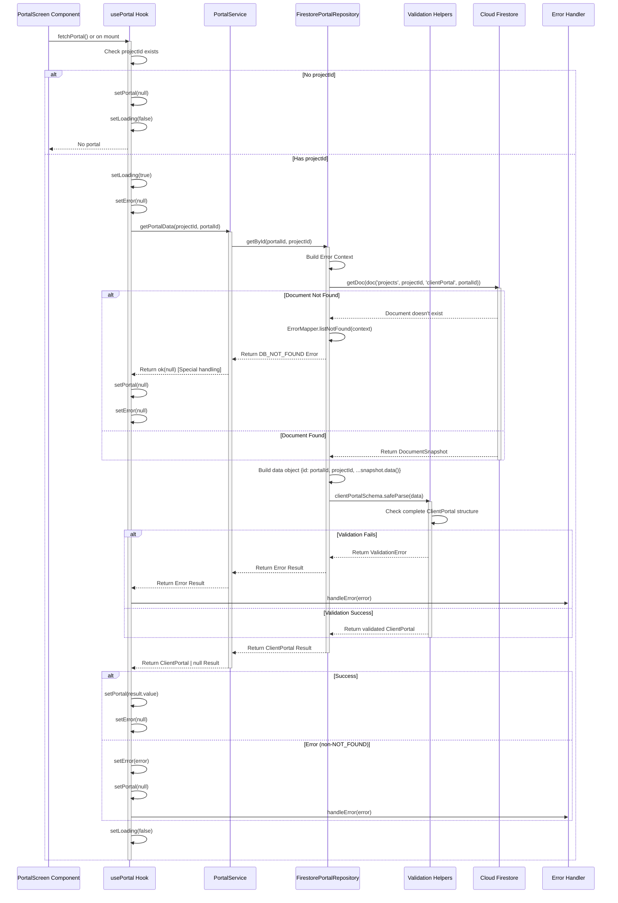
```mermaid
sequenceDiagram
    participant UI as PortalScreen Component
    participant Hook as usePortal Hook
    participant Service as PortalService
    participant Repo as FirestorePortalRepository
    participant Validate as Validation Helpers
    participant Firestore as Cloud Firestore
    participant ErrorHandler as Error Handler

    UI->>Hook: fetchPortal() or on mount
    activate Hook
    
    Hook->>Hook: Check projectId exists
    alt No projectId
        Hook->>Hook: setPortal(null)
        Hook->>Hook: setLoading(false)
        Hook-->>UI: No portal
    else Has projectId
        Hook->>Hook: setLoading(true)
        Hook->>Hook: setError(null)
        Hook->>Service: getPortalData(projectId, portalId)
        activate Service
        
        Service->>Repo: getById(portalId, projectId)
        activate Repo
        
        Repo->>Repo: Build Error Context
        Repo->>Firestore: getDoc(doc('projects', projectId, 'clientPortal', portalId))
        activate Firestore
        alt Document Not Found
            Firestore-->>Repo: Document doesn't exist
            Repo->>Repo: ErrorMapper.listNotFound(context)
            Repo-->>Service: Return DB_NOT_FOUND Error
            Service-->>Hook: Return ok(null) [Special handling]
            Hook->>Hook: setPortal(null)
            Hook->>Hook: setError(null)
        else Document Found
            Firestore-->>Repo: Return DocumentSnapshot
        end
        deactivate Firestore
        
        Repo->>Repo: Build data object {id: portalId, projectId, ...snapshot.data()}
        Repo->>Validate: clientPortalSchema.safeParse(data)
        activate Validate
        Validate->>Validate: Check complete ClientPortal structure
        alt Validation Fails
            Validate-->>Repo: Return ValidationError
            Repo-->>Service: Return Error Result
            Service-->>Hook: Return Error Result
            Hook->>ErrorHandler: handleError(error)
        else Validation Success
            Validate-->>Repo: Return validated ClientPortal
        end
        deactivate Validate
        
        Repo-->>Service: Return ClientPortal Result
        deactivate Repo
        
        Service-->>Hook: Return ClientPortal | null Result
        deactivate Service
        
        alt Success
            Hook->>Hook: setPortal(result.value)
            Hook->>Hook: setError(null)
        else Error (non-NOT_FOUND)
            Hook->>Hook: setError(error)
            Hook->>Hook: setPortal(null)
            Hook->>ErrorHandler: handleError(error)
        end
        Hook->>Hook: setLoading(false)
    end
    deactivate Hook
```

### List User Portals Flow

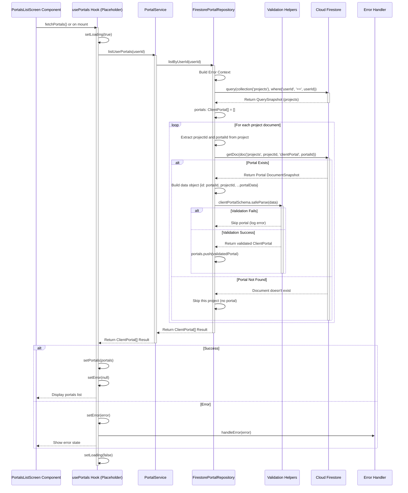
```mermaid
sequenceDiagram
    participant UI as PortalsListScreen Component
    participant Hook as usePortals Hook (Placeholder)
    participant Service as PortalService
    participant Repo as FirestorePortalRepository
    participant Validate as Validation Helpers
    participant Firestore as Cloud Firestore
    participant ErrorHandler as Error Handler

    UI->>Hook: fetchPortals() or on mount
    activate Hook
    Hook->>Hook: setLoading(true)
    Hook->>Service: listUserPortals(userId)
    activate Service
    
    Service->>Repo: listByUserId(userId)
    activate Repo
    
    Repo->>Repo: Build Error Context
    Repo->>Firestore: query(collection('projects'), where('userId', '==', userId))
    activate Firestore
    Firestore-->>Repo: Return QuerySnapshot (projects)
    deactivate Firestore
    
    Repo->>Repo: portals: ClientPortal[] = []
    
    loop For each project document
        Repo->>Repo: Extract projectId and portalId from project
        Repo->>Firestore: getDoc(doc('projects', projectId, 'clientPortal', portalId))
        activate Firestore
        alt Portal Exists
            Firestore-->>Repo: Return Portal DocumentSnapshot
            Repo->>Repo: Build data object {id: portalId, projectId, ...portalData}
            Repo->>Validate: clientPortalSchema.safeParse(data)
            activate Validate
            alt Validation Fails
                Validate-->>Repo: Skip portal (log error)
            else Validation Success
                Validate-->>Repo: Return validated ClientPortal
                Repo->>Repo: portals.push(validatedPortal)
            end
            deactivate Validate
        else Portal Not Found
            Firestore-->>Repo: Document doesn't exist
            Repo->>Repo: Skip this project (no portal)
        end
        deactivate Firestore
    end
    
    Repo-->>Service: Return ClientPortal[] Result
    deactivate Repo
    
    Service-->>Hook: Return ClientPortal[] Result
    deactivate Service
    
    alt Success
        Hook->>Hook: setPortals(portals)
        Hook->>Hook: setError(null)
        Hook-->>UI: Display portals list
    else Error
        Hook->>Hook: setError(error)
        Hook->>ErrorHandler: handleError(error)
        Hook-->>UI: Show error state
    end
    Hook->>Hook: setLoading(false)
    deactivate Hook
```

### Subscribe to User Portals (Real-time) Flow

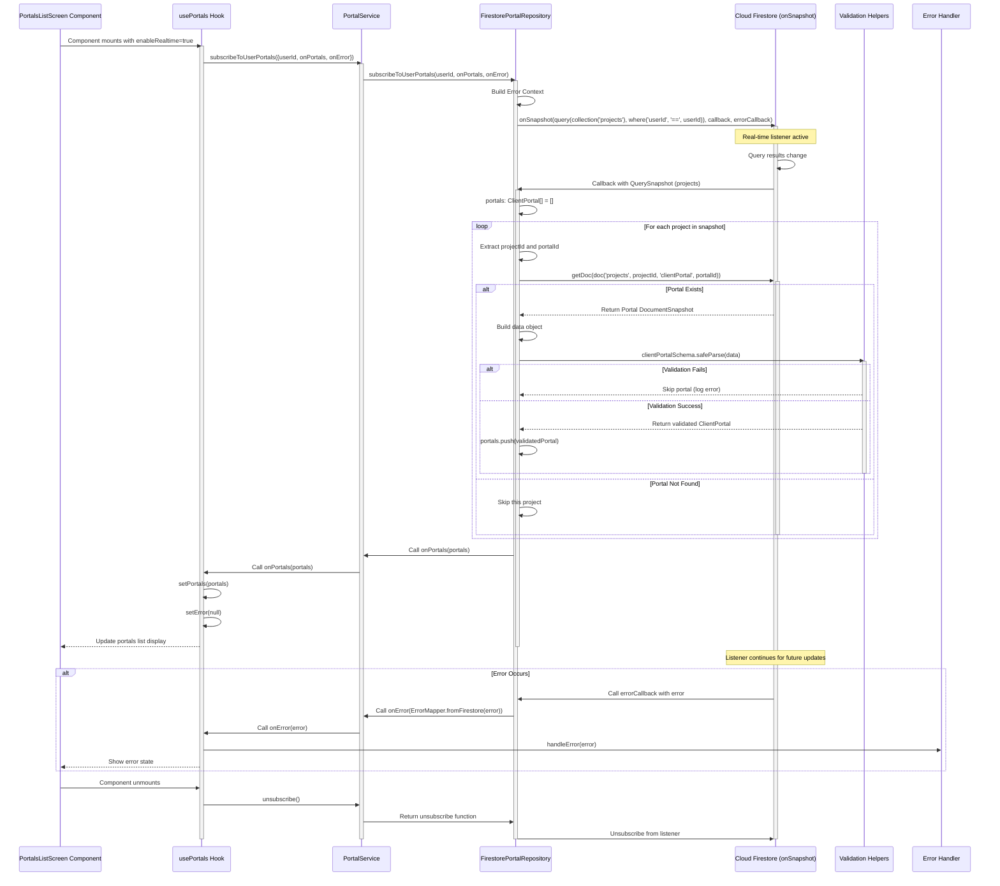
```mermaid
sequenceDiagram
    participant UI as PortalsListScreen Component
    participant Hook as usePortals Hook
    participant Service as PortalService
    participant Repo as FirestorePortalRepository
    participant Firestore as Cloud Firestore (onSnapshot)
    participant Validate as Validation Helpers
    participant ErrorHandler as Error Handler

    UI->>Hook: Component mounts with enableRealtime=true
    activate Hook
    
    Hook->>Service: subscribeToUserPortals({userId, onPortals, onError})
    activate Service
    
    Service->>Repo: subscribeToUserPortals(userId, onPortals, onError)
    activate Repo
    
    Repo->>Repo: Build Error Context
    Repo->>Firestore: onSnapshot(query(collection('projects'), where('userId', '==', userId)), callback, errorCallback)
    activate Firestore
    Note over Firestore: Real-time listener active
    
    Firestore->>Firestore: Query results change
    Firestore->>Repo: Callback with QuerySnapshot (projects)
    activate Repo
    
    Repo->>Repo: portals: ClientPortal[] = []
    
    loop For each project in snapshot
        Repo->>Repo: Extract projectId and portalId
        Repo->>Firestore: getDoc(doc('projects', projectId, 'clientPortal', portalId))
        activate Firestore
        alt Portal Exists
            Firestore-->>Repo: Return Portal DocumentSnapshot
            Repo->>Repo: Build data object
            Repo->>Validate: clientPortalSchema.safeParse(data)
            activate Validate
            alt Validation Fails
                Validate-->>Repo: Skip portal (log error)
            else Validation Success
                Validate-->>Repo: Return validated ClientPortal
                Repo->>Repo: portals.push(validatedPortal)
            end
            deactivate Validate
        else Portal Not Found
            Repo->>Repo: Skip this project
        end
        deactivate Firestore
    end
    
    Repo->>Service: Call onPortals(portals)
    Service->>Hook: Call onPortals(portals)
    
    Hook->>Hook: setPortals(portals)
    Hook->>Hook: setError(null)
    Hook-->>UI: Update portals list display
    
    deactivate Repo
    
    Note over Firestore: Listener continues for future updates
    
    alt Error Occurs
        Firestore->>Repo: Call errorCallback with error
        Repo->>Service: Call onError(ErrorMapper.fromFirestore(error))
        Service->>Hook: Call onError(error)
        Hook->>ErrorHandler: handleError(error)
        Hook-->>UI: Show error state
    end
    
    UI->>Hook: Component unmounts
    Hook->>Service: unsubscribe()
    Service->>Repo: Return unsubscribe function
    Repo->>Firestore: Unsubscribe from listener
    deactivate Firestore
    deactivate Repo
    deactivate Service
    deactivate Hook
```

### Update Portal Flow

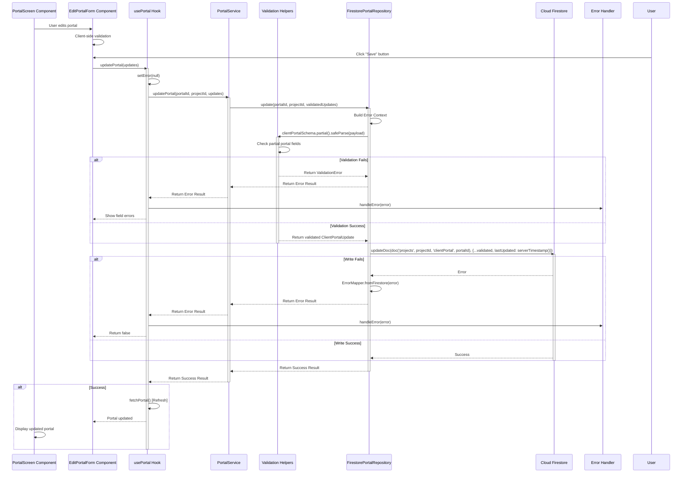
```mermaid
sequenceDiagram
    participant UI as PortalScreen Component
    participant Form as EditPortalForm Component
    participant Hook as usePortal Hook
    participant Service as PortalService
    participant Validate as Validation Helpers
    participant Repo as FirestorePortalRepository
    participant Firestore as Cloud Firestore
    participant ErrorHandler as Error Handler

    UI->>Form: User edits portal
    Form->>Form: Client-side validation
    User->>Form: Click "Save" button
    Form->>Hook: updatePortal(updates)
    activate Hook
    
    Hook->>Hook: setError(null)
    Hook->>Service: updatePortal(portalId, projectId, updates)
    activate Service
    
    Service->>Repo: update(portalId, projectId, validatedUpdates)
    activate Repo
    
    Repo->>Repo: Build Error Context
    Repo->>Validate: clientPortalSchema.partial().safeParse(payload)
    activate Validate
    Validate->>Validate: Check partial portal fields
    alt Validation Fails
        Validate-->>Repo: Return ValidationError
        Repo-->>Service: Return Error Result
        Service-->>Hook: Return Error Result
        Hook->>ErrorHandler: handleError(error)
        Hook-->>Form: Show field errors
    else Validation Success
        Validate-->>Repo: Return validated ClientPortalUpdate
    end
    deactivate Validate
    
    Repo->>Firestore: updateDoc(doc('projects', projectId, 'clientPortal', portalId), {...validated, lastUpdated: serverTimestamp()})
    activate Firestore
    alt Write Fails
        Firestore-->>Repo: Error
        Repo->>Repo: ErrorMapper.fromFirestore(error)
        Repo-->>Service: Return Error Result
        Service-->>Hook: Return Error Result
        Hook->>ErrorHandler: handleError(error)
        Hook-->>Form: Return false
    else Write Success
        Firestore-->>Repo: Success
    end
    deactivate Firestore
    
    Repo-->>Service: Return Success Result
    deactivate Repo
    
    Service-->>Hook: Return Success Result
    deactivate Service
    
    alt Success
        Hook->>Hook: fetchPortal() [Refresh]
        Hook-->>Form: Portal updated
        UI->>UI: Display updated portal
    end
    deactivate Hook
```

### Delete Portal Flow

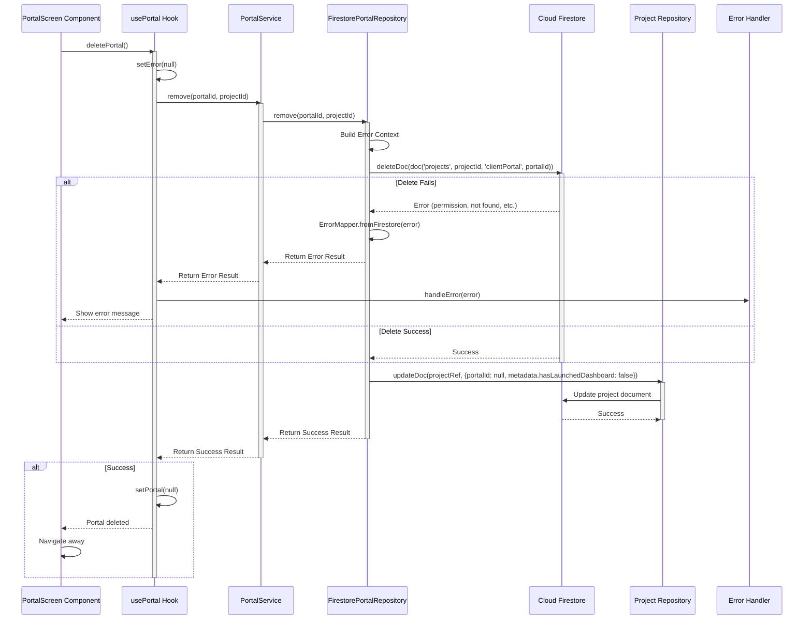
```mermaid
sequenceDiagram
    participant UI as PortalScreen Component
    participant Hook as usePortal Hook
    participant Service as PortalService
    participant Repo as FirestorePortalRepository
    participant Firestore as Cloud Firestore
    participant ProjectRepo as Project Repository
    participant ErrorHandler as Error Handler

    UI->>Hook: deletePortal()
    activate Hook
    
    Hook->>Hook: setError(null)
    Hook->>Service: remove(portalId, projectId)
    activate Service
    
    Service->>Repo: remove(portalId, projectId)
    activate Repo
    
    Repo->>Repo: Build Error Context
    Repo->>Firestore: deleteDoc(doc('projects', projectId, 'clientPortal', portalId))
    activate Firestore
    alt Delete Fails
        Firestore-->>Repo: Error (permission, not found, etc.)
        Repo->>Repo: ErrorMapper.fromFirestore(error)
        Repo-->>Service: Return Error Result
        Service-->>Hook: Return Error Result
        Hook->>ErrorHandler: handleError(error)
        Hook-->>UI: Show error message
    else Delete Success
        Firestore-->>Repo: Success
    end
    deactivate Firestore
    
    Repo->>ProjectRepo: updateDoc(projectRef, {portalId: null, metadata.hasLaunchedDashboard: false})
    activate ProjectRepo
    ProjectRepo->>Firestore: Update project document
    Firestore-->>ProjectRepo: Success
    deactivate ProjectRepo
    
    Repo-->>Service: Return Success Result
    deactivate Repo
    
    Service-->>Hook: Return Success Result
    deactivate Service
    
    alt Success
        Hook->>Hook: setPortal(null)
        Hook-->>UI: Portal deleted
        UI->>UI: Navigate away
    end
    deactivate Hook
```

### Enable Portal Access Flow

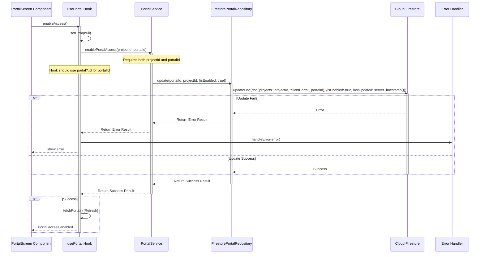
```mermaid
sequenceDiagram
    participant UI as PortalScreen Component
    participant Hook as usePortal Hook
    participant Service as PortalService
    participant Repo as FirestorePortalRepository
    participant Firestore as Cloud Firestore
    participant ErrorHandler as Error Handler

    UI->>Hook: enableAccess()
    activate Hook
    
    Hook->>Hook: setError(null)
    Hook->>Service: enablePortalAccess(projectId, portalId)
    activate Service
    
    Note over Service: Requires both projectId and portalId
    Note over Hook: Hook should use portal?.id for portalId
    
    Service->>Repo: update(portalId, projectId, {isEnabled: true})
    activate Repo
    
    Repo->>Firestore: updateDoc(doc('projects', projectId, 'clientPortal', portalId), {isEnabled: true, lastUpdated: serverTimestamp()})
    activate Firestore
    alt Update Fails
        Firestore-->>Repo: Error
        Repo-->>Service: Return Error Result
        Service-->>Hook: Return Error Result
        Hook->>ErrorHandler: handleError(error)
        Hook-->>UI: Show error
    else Update Success
        Firestore-->>Repo: Success
    end
    deactivate Firestore
    
    Repo-->>Service: Return Success Result
    deactivate Repo
    
    Service-->>Hook: Return Success Result
    deactivate Service
    
    alt Success
        Hook->>Hook: fetchPortal() [Refresh]
        Hook-->>UI: Portal access enabled
    end
    deactivate Hook
```

### Disable Portal Access Flow

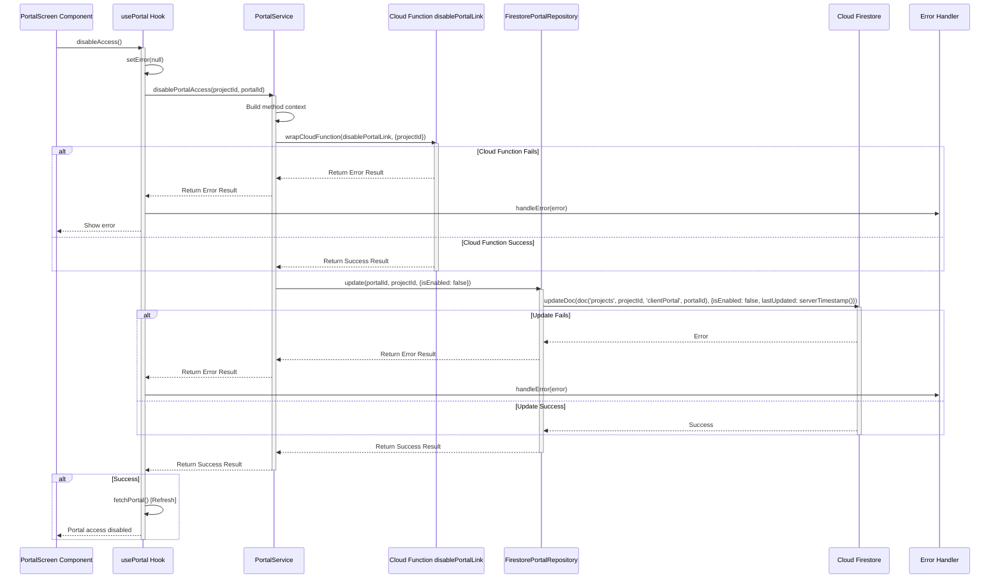
```mermaid
sequenceDiagram
    participant UI as PortalScreen Component
    participant Hook as usePortal Hook
    participant Service as PortalService
    participant CloudFunc as Cloud Function disablePortalLink
    participant Repo as FirestorePortalRepository
    participant Firestore as Cloud Firestore
    participant ErrorHandler as Error Handler

    UI->>Hook: disableAccess()
    activate Hook
    
    Hook->>Hook: setError(null)
    Hook->>Service: disablePortalAccess(projectId, portalId)
    activate Service
    
    Service->>Service: Build method context
    Service->>CloudFunc: wrapCloudFunction(disablePortalLink, {projectId})
    activate CloudFunc
    alt Cloud Function Fails
        CloudFunc-->>Service: Return Error Result
        Service-->>Hook: Return Error Result
        Hook->>ErrorHandler: handleError(error)
        Hook-->>UI: Show error
    else Cloud Function Success
        CloudFunc-->>Service: Return Success Result
    end
    deactivate CloudFunc
    
    Service->>Repo: update(portalId, projectId, {isEnabled: false})
    activate Repo
    
    Repo->>Firestore: updateDoc(doc('projects', projectId, 'clientPortal', portalId), {isEnabled: false, lastUpdated: serverTimestamp()})
    activate Firestore
    alt Update Fails
        Firestore-->>Repo: Error
        Repo-->>Service: Return Error Result
        Service-->>Hook: Return Error Result
        Hook->>ErrorHandler: handleError(error)
    else Update Success
        Firestore-->>Repo: Success
    end
    deactivate Firestore
    
    Repo-->>Service: Return Success Result
    deactivate Repo
    
    Service-->>Hook: Return Success Result
    deactivate Service
    
    alt Success
        Hook->>Hook: fetchPortal() [Refresh]
        Hook-->>UI: Portal access disabled
    end
    deactivate Hook
```

### Update Portal Message Flow

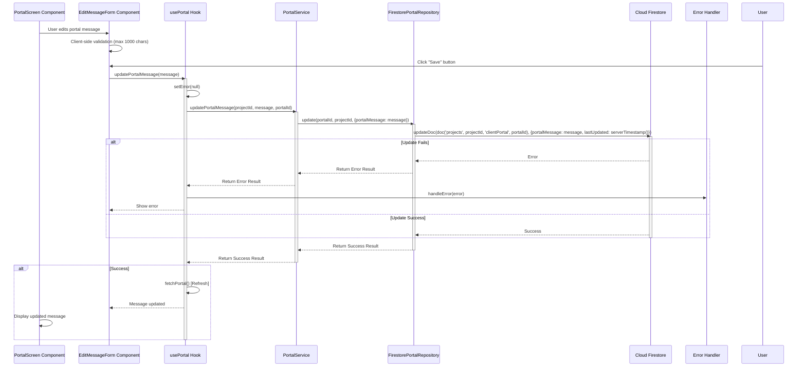
```mermaid
sequenceDiagram
    participant UI as PortalScreen Component
    participant Form as EditMessageForm Component
    participant Hook as usePortal Hook
    participant Service as PortalService
    participant Repo as FirestorePortalRepository
    participant Firestore as Cloud Firestore
    participant ErrorHandler as Error Handler

    UI->>Form: User edits portal message
    Form->>Form: Client-side validation (max 1000 chars)
    User->>Form: Click "Save" button
    Form->>Hook: updatePortalMessage(message)
    activate Hook
    
    Hook->>Hook: setError(null)
    Hook->>Service: updatePortalMessage(projectId, message, portalId)
    activate Service
    
    Service->>Repo: update(portalId, projectId, {portalMessage: message})
    activate Repo
    
    Repo->>Firestore: updateDoc(doc('projects', projectId, 'clientPortal', portalId), {portalMessage: message, lastUpdated: serverTimestamp()})
    activate Firestore
    alt Update Fails
        Firestore-->>Repo: Error
        Repo-->>Service: Return Error Result
        Service-->>Hook: Return Error Result
        Hook->>ErrorHandler: handleError(error)
        Hook-->>Form: Show error
    else Update Success
        Firestore-->>Repo: Success
    end
    deactivate Firestore
    
    Repo-->>Service: Return Success Result
    deactivate Repo
    
    Service-->>Hook: Return Success Result
    deactivate Service
    
    alt Success
        Hook->>Hook: fetchPortal() [Refresh]
        Hook-->>Form: Message updated
        UI->>UI: Display updated message
    end
    deactivate Hook
```

### Update Section Status Flow

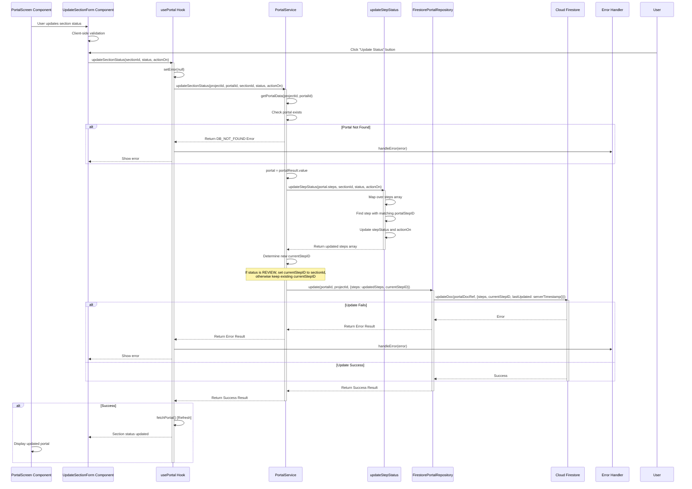
```mermaid
sequenceDiagram
    participant UI as PortalScreen Component
    participant Form as UpdateSectionForm Component
    participant Hook as usePortal Hook
    participant Service as PortalService
    participant BusinessLogic as updateStepStatus
    participant Repo as FirestorePortalRepository
    participant Firestore as Cloud Firestore
    participant ErrorHandler as Error Handler

    UI->>Form: User updates section status
    Form->>Form: Client-side validation
    User->>Form: Click "Update Status" button
    Form->>Hook: updateSectionStatus(sectionId, status, actionOn)
    activate Hook
    
    Hook->>Hook: setError(null)
    Hook->>Service: updateSectionStatus(projectId, portalId, sectionId, status, actionOn)
    activate Service
    
    Service->>Service: getPortalData(projectId, portalId)
    Service->>Service: Check portal exists
    alt Portal Not Found
        Service-->>Hook: Return DB_NOT_FOUND Error
        Hook->>ErrorHandler: handleError(error)
        Hook-->>Form: Show error
    end
    
    Service->>Service: portal = portalResult.value
    Service->>BusinessLogic: updateStepStatus(portal.steps, sectionId, status, actionOn)
    activate BusinessLogic
    BusinessLogic->>BusinessLogic: Map over steps array
    BusinessLogic->>BusinessLogic: Find step with matching portalStepID
    BusinessLogic->>BusinessLogic: Update stepStatus and actionOn
    BusinessLogic-->>Service: Return updated steps array
    deactivate BusinessLogic
    
    Service->>Service: Determine new currentStepID
    Note over Service: If status is REVIEW, set currentStepID to sectionId,<br/>otherwise keep existing currentStepID
    
    Service->>Repo: update(portalId, projectId, {steps: updatedSteps, currentStepID})
    activate Repo
    
    Repo->>Firestore: updateDoc(portalDocRef, {steps, currentStepID, lastUpdated: serverTimestamp()})
    activate Firestore
    alt Update Fails
        Firestore-->>Repo: Error
        Repo-->>Service: Return Error Result
        Service-->>Hook: Return Error Result
        Hook->>ErrorHandler: handleError(error)
        Hook-->>Form: Show error
    else Update Success
        Firestore-->>Repo: Success
    end
    deactivate Firestore
    
    Repo-->>Service: Return Success Result
    deactivate Repo
    
    Service-->>Hook: Return Success Result
    deactivate Service
    
    alt Success
        Hook->>Hook: fetchPortal() [Refresh]
        Hook-->>Form: Section status updated
        UI->>UI: Display updated portal
    end
    deactivate Hook
```

### Extend Portal Expiration Flow

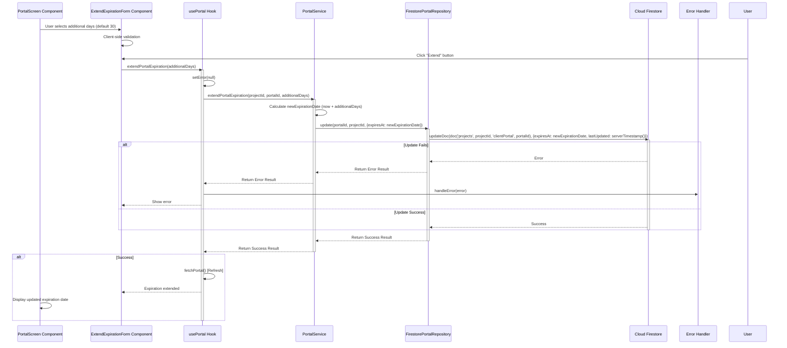
```mermaid
sequenceDiagram
    participant UI as PortalScreen Component
    participant Form as ExtendExpirationForm Component
    participant Hook as usePortal Hook
    participant Service as PortalService
    participant Repo as FirestorePortalRepository
    participant Firestore as Cloud Firestore
    participant ErrorHandler as Error Handler

    UI->>Form: User selects additional days (default 30)
    Form->>Form: Client-side validation
    User->>Form: Click "Extend" button
    Form->>Hook: extendPortalExpiration(additionalDays)
    activate Hook
    
    Hook->>Hook: setError(null)
    Hook->>Service: extendPortalExpiration(projectId, portalId, additionalDays)
    activate Service
    
    Service->>Service: Calculate newExpirationDate (now + additionalDays)
    Service->>Repo: update(portalId, projectId, {expiresAt: newExpirationDate})
    activate Repo
    
    Repo->>Firestore: updateDoc(doc('projects', projectId, 'clientPortal', portalId), {expiresAt: newExpirationDate, lastUpdated: serverTimestamp()})
    activate Firestore
    alt Update Fails
        Firestore-->>Repo: Error
        Repo-->>Service: Return Error Result
        Service-->>Hook: Return Error Result
        Hook->>ErrorHandler: handleError(error)
        Hook-->>Form: Show error
    else Update Success
        Firestore-->>Repo: Success
    end
    deactivate Firestore
    
    Repo-->>Service: Return Success Result
    deactivate Repo
    
    Service-->>Hook: Return Success Result
    deactivate Service
    
    alt Success
        Hook->>Hook: fetchPortal() [Refresh]
        Hook-->>Form: Expiration extended
        UI->>UI: Display updated expiration date
    end
    deactivate Hook
```

### Reset Portal Steps Flow

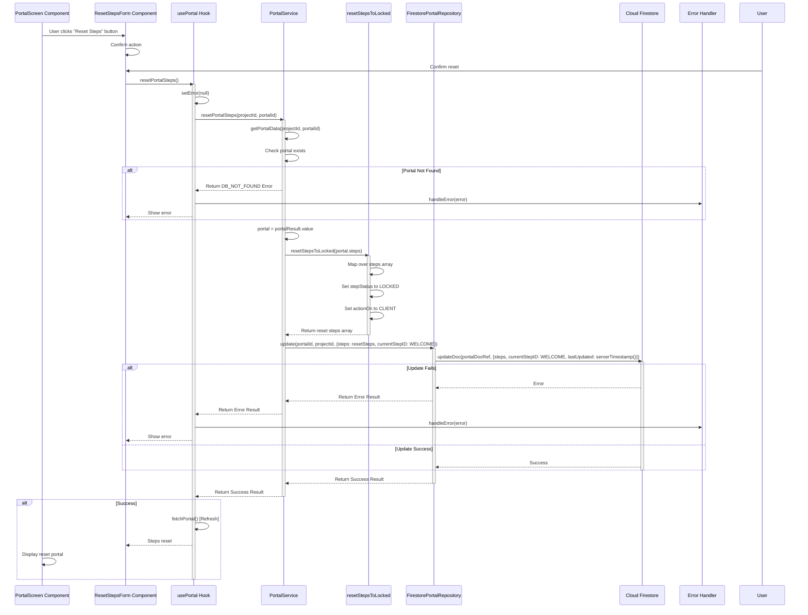
```mermaid
sequenceDiagram
    participant UI as PortalScreen Component
    participant Form as ResetStepsForm Component
    participant Hook as usePortal Hook
    participant Service as PortalService
    participant BusinessLogic as resetStepsToLocked
    participant Repo as FirestorePortalRepository
    participant Firestore as Cloud Firestore
    participant ErrorHandler as Error Handler

    UI->>Form: User clicks "Reset Steps" button
    Form->>Form: Confirm action
    User->>Form: Confirm reset
    Form->>Hook: resetPortalSteps()
    activate Hook
    
    Hook->>Hook: setError(null)
    Hook->>Service: resetPortalSteps(projectId, portalId)
    activate Service
    
    Service->>Service: getPortalData(projectId, portalId)
    Service->>Service: Check portal exists
    alt Portal Not Found
        Service-->>Hook: Return DB_NOT_FOUND Error
        Hook->>ErrorHandler: handleError(error)
        Hook-->>Form: Show error
    end
    
    Service->>Service: portal = portalResult.value
    Service->>BusinessLogic: resetStepsToLocked(portal.steps)
    activate BusinessLogic
    BusinessLogic->>BusinessLogic: Map over steps array
    BusinessLogic->>BusinessLogic: Set stepStatus to LOCKED
    BusinessLogic->>BusinessLogic: Set actionOn to CLIENT
    BusinessLogic-->>Service: Return reset steps array
    deactivate BusinessLogic
    
    Service->>Repo: update(portalId, projectId, {steps: resetSteps, currentStepID: WELCOME})
    activate Repo
    
    Repo->>Firestore: updateDoc(portalDocRef, {steps, currentStepID: WELCOME, lastUpdated: serverTimestamp()})
    activate Firestore
    alt Update Fails
        Firestore-->>Repo: Error
        Repo-->>Service: Return Error Result
        Service-->>Hook: Return Error Result
        Hook->>ErrorHandler: handleError(error)
        Hook-->>Form: Show error
    else Update Success
        Firestore-->>Repo: Success
    end
    deactivate Firestore
    
    Repo-->>Service: Return Success Result
    deactivate Repo
    
    Service-->>Hook: Return Success Result
    deactivate Service
    
    alt Success
        Hook->>Hook: fetchPortal() [Refresh]
        Hook-->>Form: Steps reset
        UI->>UI: Display reset portal
    end
    deactivate Hook
```

### Lock Client Portal Flow

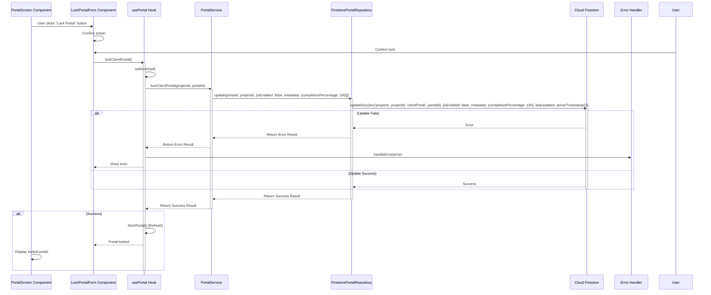
```mermaid
sequenceDiagram
    participant UI as PortalScreen Component
    participant Form as LockPortalForm Component
    participant Hook as usePortal Hook
    participant Service as PortalService
    participant Repo as FirestorePortalRepository
    participant Firestore as Cloud Firestore
    participant ErrorHandler as Error Handler

    UI->>Form: User clicks "Lock Portal" button
    Form->>Form: Confirm action
    User->>Form: Confirm lock
    Form->>Hook: lockClientPortal()
    activate Hook
    
    Hook->>Hook: setError(null)
    Hook->>Service: lockClientPortal(projectId, portalId)
    activate Service
    
    Service->>Repo: update(portalId, projectId, {isEnabled: false, metadata: {completionPercentage: 100}})
    activate Repo
    
    Repo->>Firestore: updateDoc(doc('projects', projectId, 'clientPortal', portalId), {isEnabled: false, metadata: {completionPercentage: 100}, lastUpdated: serverTimestamp()})
    activate Firestore
    alt Update Fails
        Firestore-->>Repo: Error
        Repo-->>Service: Return Error Result
        Service-->>Hook: Return Error Result
        Hook->>ErrorHandler: handleError(error)
        Hook-->>Form: Show error
    else Update Success
        Firestore-->>Repo: Success
    end
    deactivate Firestore
    
    Repo-->>Service: Return Success Result
    deactivate Repo
    
    Service-->>Hook: Return Success Result
    deactivate Service
    
    alt Success
        Hook->>Hook: fetchPortal() [Refresh]
        Hook-->>Form: Portal locked
        UI->>UI: Display locked portal
    end
    deactivate Hook
```

---

## Business Logic Methods

### Create Portal Steps Array

**File**: `src/services/portal-service.ts`

**Function**: `createPortalStepsArray(selectedStepKeys: string[]): PortalStep[]`

**Process**:
1. Map each key to `DEFAULT_PORTAL_STEPS[key]`
2. Filter out undefined steps
3. Sort by original `stepNumber`
4. Re-index `stepNumber` to sequential (1, 2, 3...)

**Input**: Array of step keys (e.g., `['KEY_PEOPLE', 'LOCATIONS', 'TIMELINE']`)

**Output**: Array of `PortalStep` objects with sequential step numbers

**Example**:
```typescript
selectedStepKeys = ['LOCATIONS', 'KEY_PEOPLE', 'TIMELINE']
// After sorting and re-indexing:
[
  { portalStepID: KEY_PEOPLE, stepNumber: 1, ... },
  { portalStepID: LOCATIONS, stepNumber: 2, ... },
  { portalStepID: TIMELINE, stepNumber: 3, ... }
]
```

### Update Step Status

**File**: `src/services/portal-service.ts`

**Function**: `updateStepStatus(steps: PortalStep[], sectionId: PortalStepID, status: SectionStatus, actionOn: ActionOn): PortalStep[]`

**Process**:
1. Map over steps array
2. Find step where `portalStepID === sectionId`
3. Update `stepStatus` and `actionOn` for that step
4. Return updated array

**Input**: Current steps array, section ID, new status, action owner

**Output**: Updated steps array with modified step

### Reset Steps to Locked

**File**: `src/services/portal-service.ts`

**Function**: `resetStepsToLocked(steps: PortalStep[]): PortalStep[]`

**Process**:
1. Map over steps array
2. Set `stepStatus` to `SectionStatus.LOCKED`
3. Set `actionOn` to `ActionOn.CLIENT`
4. Return reset array

**Input**: Current steps array

**Output**: Steps array with all steps locked

### Get Step by ID

**File**: `src/services/portal-service.ts`

**Function**: `getStepById(steps: PortalStep[], stepId: PortalStepID): PortalStep | undefined`

**Process**: Find step where `portalStepID === stepId`

**Returns**: Step if found, undefined otherwise

### Calculate Completion Stats

**File**: `src/services/portal-service.ts`

**Function**: `calculateCompletionStats(steps: PortalStep[])`

**Process**:
1. Count steps with `stepStatus === SectionStatus.FINALIZED`
2. Calculate `completionPercentage = (completedSteps / totalSteps) * 100`

**Returns**:
```typescript
{
  totalSteps: number,
  completedSteps: number,
  completionPercentage: number
}
```

### Is Portal Expired

**File**: `src/services/portal-service.ts`

**Function**: `isPortalExpired(clientPortal: ClientPortal): boolean`

**Process**:
1. Check if `expiresAt` exists
2. Convert `expiresAt` to Date (using `timestampPreprocessor`)
3. Compare with current date
4. Return `true` if expired, `false` otherwise

**Returns**: Boolean indicating if portal is expired

### Get Portal Stats

**File**: `src/services/portal-service.ts`

**Function**: `getPortalStats(clientPortal: ClientPortal, portalSteps: PortalStep[])`

**Process**:
1. Calculate total steps
2. Count completed steps (status === FINALIZED)
3. Count in-progress steps (status === REVIEW)
4. Calculate pending steps
5. Calculate progress percentage
6. Check if complete (all steps finalized)
7. Check if active (enabled and not expired)

**Returns**:
```typescript
{
  totalSteps: number,
  completedSteps: number,
  inProgressSteps: number,
  pendingSteps: number,
  progressPercentage: number,
  isComplete: boolean,
  isActive: boolean
}
```

---

## UI Component Structure

### Component Hierarchy

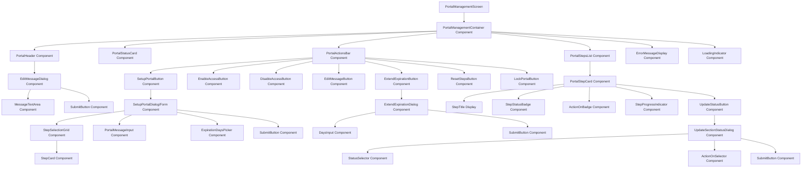
```mermaid
graph TD
    A[PortalManagementScreen] --> B[PortalManagementContainer Component]
    B --> C[PortalHeader Component]
    B --> D[PortalStatusCard Component]
    B --> E[PortalActionsBar Component]
    B --> F[PortalStepsList Component]
    B --> G[ErrorMessageDisplay Component]
    B --> H[LoadingIndicator Component]
    
    E --> I[SetupPortalButton Component]
    E --> J[EnableAccessButton Component]
    E --> K[DisableAccessButton Component]
    E --> L[EditMessageButton Component]
    E --> M[ExtendExpirationButton Component]
    E --> N[ResetStepsButton Component]
    E --> O[LockPortalButton Component]
    
    I --> P[SetupPortalDialog/Form Component]
    P --> Q[StepSelectionGrid Component]
    Q --> R[StepCard Component]
    P --> S[PortalMessageInput Component]
    P --> T[ExpirationDaysPicker Component]
    P --> U[SubmitButton Component]
    
    F --> V[PortalStepCard Component]
    V --> W[StepTitle Display]
    V --> X[StepStatusBadge Component]
    V --> Y[ActionOnBadge Component]
    V --> Z[StepProgressIndicator Component]
    V --> AA[UpdateStatusButton Component]
    
    AA --> AB[UpdateSectionStatusDialog Component]
    AB --> AC[StatusSelector Component]
    AB --> AD[ActionOnSelector Component]
    AB --> AE[SubmitButton Component]
    
    C --> AF[EditMessageDialog Component]
    AF --> AG[MessageTextArea Component]
    AF --> AH[SubmitButton Component]
    
    M --> AI[ExtendExpirationDialog Component]
    AI --> AJ[DaysInput Component]
    AI --> AK[SubmitButton Component]
```

### Placeholder Components

#### PortalManagementScreen Component

**Location**: `src/app/(features)/portal/[projectId]/index.tsx` (placeholder)

**Responsibilities**:
- Container for portal management
- Navigation setup
- Project context (projectId)
- Error boundary wrapping
- Layout and styling

**Props**:
```typescript
interface PortalManagementScreenProps {
  navigation: NavigationProp;
  route: { params: { projectId: string } };
}
```

**Usage**:
```typescript
const PortalManagementScreen = ({ navigation, route }: PortalManagementScreenProps) => {
  const { projectId } = route.params;
  const { userId } = useAuth();
  
  const { 
    portal, 
    loading, 
    error, 
    setupPortal,
    enableAccess,
    disableAccess,
    updatePortalMessage,
    updateSectionStatus,
    extendPortalExpiration,
    resetPortalSteps,
    lockClientPortal,
    getPortalStats,
    isExpired,
    refresh,
    clearError 
  } = usePortal(
    userId,
    projectId,
    { autoFetch: true }
  );

  return (
    <PortalManagementContainer
      portal={portal}
      loading={loading}
      error={error}
      onSetupPortal={handleSetupPortal}
      onEnableAccess={enableAccess}
      onDisableAccess={disableAccess}
      onUpdateMessage={updatePortalMessage}
      onUpdateSectionStatus={updateSectionStatus}
      onExtendExpiration={extendPortalExpiration}
      onResetSteps={resetPortalSteps}
      onLockPortal={lockClientPortal}
      portalStats={getPortalStats()}
      isExpired={isExpired()}
      onRefresh={refresh}
      onClearError={clearError}
    />
  );
};
```

#### SetupPortalForm Component

**Location**: `src/components/portal/SetupPortalForm.tsx` (placeholder)

**Responsibilities**:
- Form state management for setting up portal
- Step selection
- Message input
- Submission handling

**Props**:
```typescript
interface SetupPortalFormProps {
  onSubmit?: (selectedStepKeys: string[]) => Promise<void>;
  onCancel?: () => void;
  isLoading?: boolean;
}
```

**State**:
```typescript
{
  selectedSteps: string[];
  portalMessage?: string;
  fieldErrors: Record<string, string>;
}
```

**Behavior**:
- Allows multi-select of portal steps
- Validates at least one step selected
- Calls `onSubmit` with selected step keys
- Shows validation errors

#### PortalStepCard Component

**Location**: `src/components/portal/PortalStepCard.tsx` (placeholder)

**Responsibilities**:
- Display step information
- Show step status
- Show action owner
- Update status action

**Props**:
```typescript
interface PortalStepCardProps {
  step: PortalStep;
  onUpdateStatus?: (step: PortalStep) => void;
}
```

---

## Data Structures

### ClientPortalInput Structure

```typescript
// ClientPortalInput (from portal.schema.ts)
interface ClientPortalInput {
  isSetup: boolean;                       // true
  isEnabled: boolean;                     // true
  currentStepID: PortalStepID;           // WELCOME (default)
  portalMessage?: string;                // Optional, max 1000 chars
  steps: PortalStep[];                   // Required array
  // Note: id, projectId, setupDate, lastUpdated, expiresAt, portalUrl, accessToken, metadata are omitted
}
```

### ClientPortal Structure (Complete)

```typescript
// ClientPortal (complete structure)
interface ClientPortal {
  id: string;                            // UUID generated on create
  projectId: string;                     // ID of project
  isSetup: boolean;                      // true after setup
  isEnabled: boolean;                    // true/false for access control
  setupDate?: Date;                      // Optional timestamp
  lastUpdated: Date;                     // Required timestamp
  expiresAt?: Date;                      // Optional expiration date
  portalUrl?: string;                    // Optional secure URL
  accessToken?: string;                  // Optional access token
  currentStepID: PortalStepID;           // Current step (default: WELCOME)
  portalMessage?: string;                // Optional message (max 1000 chars)
  steps: PortalStep[];                   // Array of portal steps
  metadata: PortalMetadata;              // Completion stats
}
```

### PortalStep Structure

```typescript
// PortalStep (discriminated union)
type PortalStep = 
  | KeyPeopleStep 
  | LocationsStep 
  | GroupShotsStep 
  | PhotoRequestsStep 
  | TimelineStep;

// Base structure for all steps
interface BasePortalStep {
  portalStepID: PortalStepID;            // Step identifier
  stepTitle: string;                     // Display title
  stepNumber: number;                    // Sequential number (1, 2, 3...)
  stepIcon: string;                     // Icon path/URL
  stepStatus: SectionStatus;            // Current status (LOCKED, UNLOCKED, REVIEW, etc.)
  requiredStep: boolean;                // Whether step is required
  actionOn: ActionOn;                   // Who the action is for (CLIENT, PHOTOGRAPHER, NONE)
  data?: ListData;                      // Optional step-specific data (depends on step type)
}
```

### PortalMetadata Structure

```typescript
// PortalMetadata
interface PortalMetadata {
  totalSteps: number;                    // Total number of steps
  completedSteps: number;                // Number of finalized steps
  completionPercentage: number;          // 0-100
  lastClientActivity?: Date;             // Optional timestamp
  clientAccessCount: number;              // Number of times client accessed portal
}
```

### PortalStepID Enum

```typescript
enum PortalStepID {
  KEY_PEOPLE = 'keyPeople',
  LOCATIONS = 'locations',
  GROUP_SHOTS = 'groupShots',
  PHOTO_REQUESTS = 'photoRequests',
  TIMELINE = 'timeline',
  WELCOME = 'welcome',
}
```

### SectionStatus Enum

```typescript
enum SectionStatus {
  NONE = 'none',
  LOCKED = 'locked',
  UNLOCKED = 'unlocked',
  REVIEW = 'review',
  IN_PROGRESS = 'inProgress',
  COMPLETED = 'completed',
  FINALIZED = 'finalized',
  CANCELLED = 'cancelled',
}
```

### ActionOn Enum

```typescript
enum ActionOn {
  CLIENT = 'client',
  PHOTOGRAPHER = 'photographer',
  NONE = 'none',
}
```

### Firestore Document Structure

```typescript
// Document saved to Firestore (subcollection)
{
  id: string,                            // UUID
  projectId: string,                    // Project ID
  isSetup: boolean,                     // true
  isEnabled: boolean,                   // true/false
  setupDate?: Timestamp,                // Optional
  lastUpdated: Timestamp,               // Required
  expiresAt?: Timestamp,                // Optional
  portalUrl?: string,                   // Optional
  accessToken?: string,                 // Optional
  currentStepID: PortalStepID,          // Current step
  portalMessage?: string,              // Optional
  steps: PortalStep[],                  // Array of steps
  metadata: {
    totalSteps: number,
    completedSteps: number,
    completionPercentage: number,
    lastClientActivity?: Timestamp,
    clientAccessCount: number,
  },
}
```

---

## Input Validation

### ClientPortalInput Validation

**File**: `src/domain/project/portal.schema.ts`

```typescript
export const clientPortalInputSchema = clientPortalSchema.omit({
  id: true,
  projectId: true,
  setupDate: true,
  lastUpdated: true,
  expiresAt: true,
  portalUrl: true,
  accessToken: true,
  metadata: true,
});
```

**Validation Rules**:
- `isSetup`: Boolean, defaults to false
- `isEnabled`: Boolean, defaults to false
- `currentStepID`: Required, must be `PortalStepID` enum (default: WELCOME)
- `portalMessage`: Optional string, max 1000 characters
- `steps`: Required array of `PortalStep[]` (must match discriminated union schema)

**PortalStep Validation**:
- Each step validated against discriminated union schema
- Base fields: `stepTitle` (required, min 1), `stepNumber` (int, min 0), `stepIcon` (string), `stepStatus` (enum), `requiredStep` (boolean), `actionOn` (enum)
- Step-specific `data` field validated against corresponding list schema if provided

### ClientPortalUpdate Validation

**File**: `src/domain/project/portal.schema.ts`

```typescript
export const clientPortalUpdateSchema = clientPortalSchema
  .omit({
    id: true,
    projectId: true,
    setupDate: true,
    lastUpdated: true,
  })
  .partial();
```

**Validation Rules**:
- All fields from `clientPortalSchema` are optional (partial)
- Provided fields validated according to their schemas
- `lastUpdated` automatically set by repository

### ClientPortal Schema Validation

**File**: `src/domain/project/portal.schema.ts`

```typescript
export const clientPortalSchema = z.object({
  id: idSchema,
  projectId: idSchema,
  isSetup: z.boolean().default(DEFAULTS.DISABLED),
  isEnabled: z.boolean().default(DEFAULTS.DISABLED),
  setupDate: optionalTimestampSchema,
  lastUpdated: requiredTimestampSchema,
  expiresAt: optionalTimestampSchema,
  portalUrl: urlSchema.optional(),
  accessToken: z.string().min(1, 'Access token is required').optional(),
  currentStepID: z.nativeEnum(PortalStepID).default(PortalStepID.WELCOME),
  portalMessage: z.string().max(1000, 'Message is too long').optional(),
  steps: z.array(portalStepSchema).default([]),
  metadata: portalMetadataSchema.default({}),
});
```

**Validation Flow**:

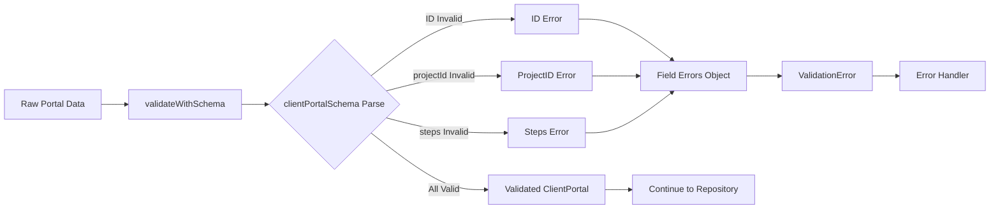
```mermaid
graph LR
    A[Raw Portal Data] --> B[validateWithSchema]
    B --> C{clientPortalSchema Parse}
    C -->|ID Invalid| D[ID Error]
    C -->|projectId Invalid| E[ProjectID Error]
    C -->|steps Invalid| F[Steps Error]
    C -->|All Valid| G[Validated ClientPortal]
    
    D --> H[Field Errors Object]
    E --> H
    F --> H
    H --> I[ValidationError]
    I --> J[Error Handler]
    
    G --> K[Continue to Repository]
```

---

## Sanitization Process

**Note**: Portals do not have explicit sanitization methods in the repository layer. However, Zod schema validation applies trimming and type coercion.

**Implicit Sanitization via Zod**:
- String fields are trimmed by Zod schemas (`.trim()` in schema)
- `portalMessage`: Trimmed automatically, max 1000 characters
- `stepTitle`: Trimmed automatically
- Optional fields are normalized to undefined if null/empty
- Timestamps are converted to Date objects
- URLs validated via `urlSchema`

**Repository Layer**:
- No explicit `sanitizePortal` method
- Validation happens through Zod schemas
- String trimming handled by Zod's `.trim()`

**Service Layer**:
- No explicit sanitization
- Validation and type coercion handled by Zod
- Step array creation from `DEFAULT_PORTAL_STEPS` constant

**Cloud Function Integration**:
- Cloud functions handle secure URL and token generation
- No client-side sanitization of URLs/tokens (server-generated)

---

## Loading States

### State Transitions

#### General Portal Operations

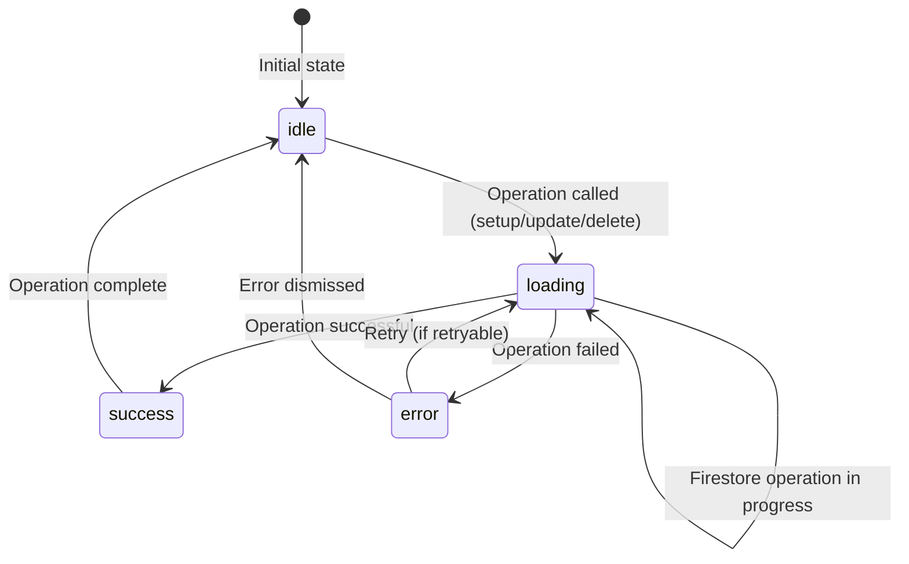
```mermaid
stateDiagram-v2
    [*] --> idle: Initial state
    idle --> loading: Operation called (setup/update/delete)
    loading --> loading: Validation in progress
    loading --> loading: Cloud Function call (if needed)
    loading --> loading: Firestore operation in progress
    loading --> success: Operation successful
    loading --> error: Operation failed
    error --> loading: Retry (if retryable)
    success --> idle: Operation complete
    error --> idle: Error dismissed
```

#### Setup Portal States

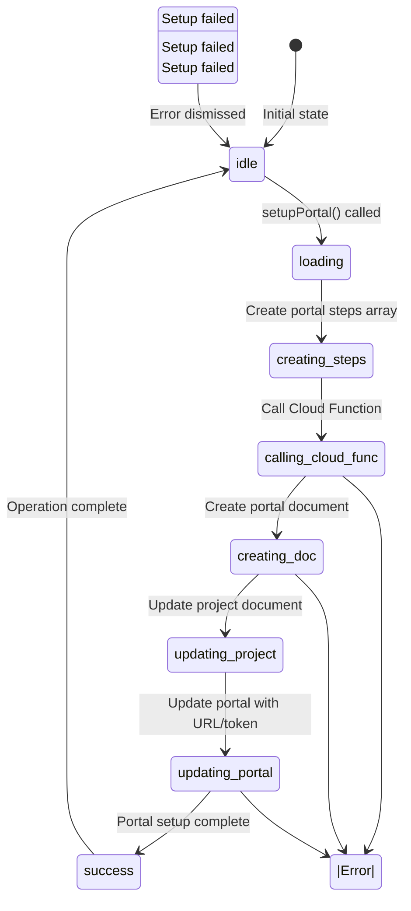
```mermaid
stateDiagram-v2
    [*] --> idle: Initial state
    idle --> loading: setupPortal() called
    loading --> creating_steps: Create portal steps array
    creating_steps --> calling_cloud_func: Call Cloud Function
    calling_cloud_func --> creating_doc: Create portal document
    creating_doc --> updating_project: Update project document
    updating_project --> updating_portal: Update portal with URL/token
    updating_portal --> success: Portal setup complete
    calling_cloud_func -->|Error| error: Setup failed
    creating_doc -->|Error| error: Setup failed
    updating_portal -->|Error| error: Setup failed
    success --> idle: Operation complete
    error --> idle: Error dismissed
```

### Loading State Management

**File**: `src/hooks/use-portal.ts`

**State Management**:
```typescript
const [portal, setPortal] = useState<ClientPortal | null>(null);
const [loading, setLoading] = useState(autoFetch);
const [error, setError] = useState<AppError | null>(null);
```

**Setup Portal Flow**:
```typescript
const setupPortal = useCallback(
  async (selectedStepKeys: string[]): Promise<boolean> => {
    if (!userId || !projectId) return false;
    
    setError(null);
    setLoading(true);
    
    const result = await portalService.setupClientPortal(userId, projectId, selectedStepKeys);
    
    if (!isMountedRef.current) return false;
    
    if (result.success) {
      setPortal(result.value.clientPortal);
      setLoading(false);
      return true;
    } else {
      setError(result.error);
      setLoading(false);
      handleError(result.error, {...});
      return false;
    }
  },
  [userId, projectId, handleError],
);
```

**Other Operations**:
```typescript
// All operations follow similar pattern:
// 1. setError(null)
// 2. Call service method
// 3. If success: fetchPortal() to refresh, return true
// 4. If error: setError(error), handleError(), return false
```

---

## Error Handling

### Error Types

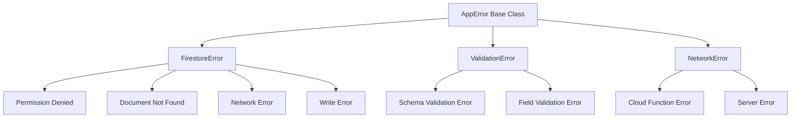
```mermaid
graph TD
    A[AppError Base Class] --> B[FirestoreError]
    A --> C[ValidationError]
    A --> D[NetworkError]
    
    B --> E[Permission Denied]
    B --> F[Document Not Found]
    B --> G[Network Error]
    B --> H[Write Error]
    
    C --> I[Schema Validation Error]
    C --> J[Field Validation Error]
    
    D --> K[Cloud Function Error]
    D --> L[Server Error]
```

### Error Flow

```mermaid
sequenceDiagram
    participant Layer as Any Layer
    participant Error as Error Occurs
    participant Mapper as ErrorMapper
    participant Handler as ErrorHandler
    participant Logger as Logging Service
    participant Toast as Toast UI

    Layer->>Error: Error thrown/caught
    
    Error->>Mapper: Map to AppError
    Mapper->>Mapper: Determine error type
    Mapper->>Mapper: Create user-friendly message
    Mapper-->>Layer: Return AppError
    
    Layer->>Handler: handleError(error, context)
    Handler->>Handler: Build context
    Handler->>Logger: Log error with metadata
    Handler->>Handler: Check toast deduplication
    Handler->>Toast: Show error toast (if not duplicate)
```

### Error Mapping

**File**: `src/utils/error-mapper.ts`

**Firestore Errors**:
- `permission-denied` → `DB_PERMISSION_DENIED`
  - User message: "You do not have permission to perform this action."
  - Retryable: false

- `not-found` → `DB_NOT_FOUND` (via `listNotFound()`)
  - User message: "Portal not found."
  - Retryable: false

- `unavailable` → `DB_NETWORK_ERROR`
  - User message: "Service temporarily unavailable. Please try again."
  - Retryable: true

- Write errors → `DB_WRITE_ERROR`
  - User message: "Failed to save portal. Please try again."
  - Retryable: true

**Cloud Function Errors**:
- Network errors → `NETWORK_ERROR`
  - User message: "Failed to connect to server. Please try again."
  - Retryable: true

- Server errors → `NETWORK_SERVER_ERROR`
  - User message: "Server error. Please try again later."
  - Retryable: true

- Missing data → `NETWORK_SERVER_ERROR`
  - User message: "Failed to generate portal link. Please try again."
  - Retryable: true

**Validation Errors**:
- Schema validation failures → `VALIDATION_ERROR`
  - User message: "Please check your input and try again."
  - Field-specific errors in `fieldErrors`
  - Retryable: false

---

## Cloud Functions Integration

### generatePortalLink

**Purpose**: Generate secure portal URL and access token

**Request**:
```typescript
interface GeneratePortalLinkRequest {
  projectId: string;
  selectedSteps: string[];
}
```

**Response**:
```typescript
interface GeneratePortalLinkResponse {
  portalUrl: string;
  accessToken: string;
}
```

**Usage**:
- Called during `setupClientPortal`
- Wraps with `wrapCloudFunction` helper
- Errors mapped via `ErrorMapper.fromFirestore`

**Error Handling**:
- Network errors → `NETWORK_ERROR`
- Server errors → `NETWORK_SERVER_ERROR`
- Missing response data → `NETWORK_SERVER_ERROR`

### disablePortalLink

**Purpose**: Disable portal link access on server side

**Request**:
```typescript
interface DisablePortalRequest {
  projectId: string;
}
```

**Response**: `void`

**Usage**:
- Called during `disablePortalAccess`
- Wraps with `wrapCloudFunction` helper
- Errors mapped via `ErrorMapper.fromFirestore`

**Error Handling**:
- Network errors → `NETWORK_ERROR`
- Server errors → `NETWORK_SERVER_ERROR`

### Cloud Function Wrapper

**File**: `src/utils/result-helpers.ts`

**Function**: `wrapCloudFunction<TRequest, TResponse, E extends AppError>`

**Process**:
1. Calls cloud function with request
2. Extracts `result.data` from response
3. Returns `ok(result.data)` on success
4. Maps error with provided error mapper on failure
5. Returns `err(appError)` on error

**Usage Pattern**:
```typescript
const linkResult = await wrapCloudFunction(
  generatePortalLink,
  { projectId, selectedSteps },
  error => ErrorMapper.fromFirestore(error, context),
  context,
);
```

---

## File Structure & Function Calls

### Complete Call Stack Examples

#### Setup Portal Call Stack

```
PortalScreen Component (placeholder)
  └─> SetupPortalForm Component (placeholder)
      └─> usePortal.setupPortal(selectedStepKeys)
          └─> portalService.setupClientPortal(userId, projectId, selectedStepKeys)
              ├─> createPortalStepsArray(selectedStepKeys)
              │   ├─> Map keys to DEFAULT_PORTAL_STEPS
              │   ├─> Filter undefined
              │   ├─> Sort by stepNumber
              │   └─> Re-index stepNumber
              │
              ├─> wrapCloudFunction(generatePortalLink, {...})
              │   └─> Cloud Function API
              │
              └─> portalRepository.create(userId, projectId, portalInput)
                  ├─> clientPortalInputSchema.safeParse(payload)
                  ├─> Generate portalId (UUID)
                  ├─> Build newPortal object with metadata
                  ├─> clientPortalSchema.safeParse(newPortal)
                  ├─> setDoc(doc('projects', projectId, 'clientPortal', portalId), ...)
                  │   └─> Firestore API
                  └─> updateDoc(projectRef, {portalId, metadata.hasLaunchedDashboard, ...})
                      └─> Firestore API
              
              └─> portalRepository.update(portalId, projectId, {expiresAt, portalUrl, accessToken})
                  └─> updateDoc(portalDocRef, {...updates, lastUpdated: serverTimestamp()})
                      └─> Firestore API
```

#### Update Section Status Call Stack

```
PortalScreen Component (placeholder)
  └─> UpdateSectionStatusForm Component (placeholder)
      └─> usePortal.updateSectionStatus(sectionId, status, actionOn)
          └─> portalService.updateSectionStatus(projectId, portalId, sectionId, status, actionOn)
              ├─> getPortalData(projectId, portalId)
              │   └─> portalRepository.getById(portalId, projectId)
              │       └─> getDoc(doc('projects', projectId, 'clientPortal', portalId))
              │           └─> Firestore API
              │
              ├─> updateStepStatus(portal.steps, sectionId, status, actionOn)
              │   └─> Map and update step
              │
              └─> portalRepository.update(portalId, projectId, {steps, currentStepID})
                  └─> updateDoc(portalDocRef, {steps, currentStepID, lastUpdated: serverTimestamp()})
                      └─> Firestore API
```

### Files Involved

| File | Purpose | Key Functions |
|------|---------|---------------|
| `src/app/(features)/portal/[projectId]/index.tsx` | Portal management screen (placeholder) | Screen component |
| `src/components/portal/SetupPortalForm.tsx` | Setup portal form (placeholder) | Setup form component |
| `src/components/portal/PortalStepCard.tsx` | Portal step card (placeholder) | Step display component |
| `src/components/portal/PortalManagementContainer.tsx` | Portal container (placeholder) | Management container component |
| `src/hooks/use-portal.ts` | React hook for portal | `usePortal()`, all operations |
| `src/services/portal-service.ts` | Business logic orchestration | All CRUD operations, business logic |
| `src/repositories/firestore/firestore-portal-repository.ts` | Firestore portal adapter | All repository methods |
| `src/repositories/i-portal-repository.ts` | Portal repository interface | Port definition |
| `src/domain/project/portal.schema.ts` | Portal validation schemas | `clientPortalSchema`, `clientPortalInputSchema`, `clientPortalUpdateSchema`, `portalStepSchema` |
| `src/constants/portal.ts` | Portal constants | `DEFAULT_PORTAL_STEPS` |
| `src/utils/result-helpers.ts` | Cloud function wrapper | `wrapCloudFunction()` |
| `src/utils/error-mapper.ts` | Error type mapping | `fromFirestore()`, `listNotFound()` |
| `src/services/error-handler-service.ts` | Centralized error handling | `handle()` |
| `src/services/logging-service.ts` | Logging service | `LoggingService.error()` |

---

## Hooks Usage

### usePortal Hook

**File**: `src/hooks/use-portal.ts`

**Usage Pattern**:
```typescript
const { 
  portal, 
  loading, 
  error, 
  fetchPortal,
  setupPortal,
  disableAccess,
  enableAccess,
  updatePortalMessage,
  updateSectionStatus,
  extendPortalExpiration,
  resetPortalSteps,
  lockClientPortal,
  getPortalStats,
  isExpired,
  clearError,
  refresh
} = usePortal(
  userId,
  projectId,
  { autoFetch: true }
);

// Setup portal
const handleSetupPortal = async (selectedStepKeys: string[]) => {
  const success = await setupPortal(selectedStepKeys);
  if (success) {
    // Portal setup complete
  }
};

// Enable/disable access
const handleEnableAccess = async () => {
  const success = await enableAccess();
  if (success) {
    // Access enabled
  }
};

// Update section status
const handleUpdateSectionStatus = async (
  sectionId: PortalStepID,
  status: SectionStatus,
  actionOn: ActionOn
) => {
  const success = await updateSectionStatus(sectionId, status, actionOn);
  if (success) {
    // Status updated
  }
};

// Get portal stats
const stats = getPortalStats();
if (stats) {
  console.log(`Progress: ${stats.progressPercentage}%`);
  console.log(`Complete: ${stats.isComplete}`);
  console.log(`Active: ${stats.isActive}`);
}
```

**Hook Interface**:
```typescript
interface UsePortalResult {
  portal: ClientPortal | null;
  loading: boolean;
  error: AppError | null;
  
  // Operations
  fetchPortal: () => Promise<void>;
  setupPortal: (selectedStepKeys: string[]) => Promise<boolean>;
  disableAccess: () => Promise<boolean>;
  enableAccess: () => Promise<boolean>;
  updatePortalMessage: (message: string) => Promise<boolean>;
  updateSectionStatus: (
    sectionId: PortalStepID,
    status: SectionStatus,
    actionOn: ActionOn,
  ) => Promise<boolean>;
  extendPortalExpiration: (additionalDays?: number) => Promise<boolean>;
  resetPortalSteps: () => Promise<boolean>;
  lockClientPortal: () => Promise<boolean>;
  
  // Helpers
  getPortalStats: () => ReturnType<typeof portalService.getPortalStats> | null;
  isExpired: () => boolean;
  clearError: () => void;
  refresh: () => Promise<void>;
}
```

**Lifecycle**:
```typescript
// Component mount
useEffect(() => {
  return () => {
    isMountedRef.current = false;
  };
}, []);

// Note: Auto-fetch is commented out in current implementation
// useEffect(() => {
//   if (autoFetch && projectId) {
//     fetchPortal();
//   }
// }, [autoFetch, projectId, fetchPortal]);
```

**Important Notes**:
- **PortalId Management**: Some service methods require both `projectId` and `portalId`. The hook should extract `portalId` from `portal?.id` when calling these methods. However, the current hook implementation may have some mismatches where it only passes `projectId`. This should be reviewed and fixed.
- **Error Handling**: All operations use `useErrorHandler` for centralized error handling
- **Refresh Pattern**: Most update operations automatically refresh the portal after success

---

## Ports & Adapters

### Architecture Pattern

The application uses **Ports & Adapters (Hexagonal Architecture)**:

- **Ports**: Interfaces defining contracts (`IPortalRepository`)
- **Adapters**: Concrete implementations (`FirestorePortalRepository`)

### Ports (Interfaces)

#### IPortalRepository

**File**: `src/repositories/i-portal-repository.ts`

**Contract**:
```typescript
interface IPortalRepository {
  create(userId: string, projectId: string, payload: ClientPortalInput): Promise<Result<ClientPortal, AppError>>;
  getById(portalId: string, projectId: string): Promise<Result<ClientPortal, AppError>>;
  listByUserId(userId: string): Promise<Result<ClientPortal[], AppError>>;
  subscribeToUserPortals(userId: string, onData: (portals: ClientPortal[]) => void, onError: (error: AppError) => void): () => void;
  update(portalId: string, projectId: string, payload: ClientPortalUpdate): Promise<Result<void, AppError>>;
  remove(portalId: string, projectId: string): Promise<Result<void, AppError>>;
}
```

**Purpose**: Defines the contract for portal operations (project-level subcollection)

### Adapters (Implementations)

#### FirestorePortalRepository

**File**: `src/repositories/firestore/firestore-portal-repository.ts`

**Implements**: `IPortalRepository`

**Responsibilities**:
- Firestore subcollection document operations
- Portal validation and parsing
- Real-time subscriptions via project queries
- Project document updates (for portalId reference)

**Key Characteristics**:
- Uses subcollection structure (`projects/{projectId}/clientPortal/{portalId}`)
- Portal documents stored with projectId field
- Real-time subscriptions via `onSnapshot` on project queries (then fetch portals)
- Document parsing with validation
- Updates project document when creating/deleting portal

**Dependencies**:
- Firestore SDK
- Zod schemas for validation
- Error mapping utilities
- UUID generation utilities

### Dependency Injection

**File**: `src/services/ServiceFactory.ts`

**Pattern**: Service Factory creates services with injected repositories

```typescript
export class PortalService {
  constructor(private repository: IPortalRepository) {}
}
```

**Factory Setup**:
```typescript
const portalRepository = new FirestorePortalRepository();
const portalService = new PortalService(portalRepository);
```

---

## Simple Explanation

### What is a Portal?

A Portal is a client-facing interface where clients can provide information for their photo shoot. Each portal has:
- Steps (sections) for different types of information (key people, locations, timeline, etc.)
- Access control (enabled/disabled)
- Expiration date
- Secure URL and access token
- Progress tracking

### What Happens When You Setup a Portal?

#### Step 1: Select Portal Steps
- **Setup Portal Form**: You select which steps to include:
  - Key People
  - Locations
  - Group Shots
  - Photo Requests
  - Timeline
- At least one step must be selected

#### Step 2: Create Portal Steps Array
- **Business Logic**: The system creates a steps array from your selection:
  - Maps your selected keys to `DEFAULT_PORTAL_STEPS`
  - Filters out invalid steps
  - Sorts steps by original order
  - Re-numbers steps sequentially (1, 2, 3...)
  - All steps start as `UNLOCKED` with `CLIENT` action

#### Step 3: Generate Secure Link
- **Cloud Function**: The system calls a cloud function to generate:
  - Secure `portalUrl` (unique URL for client access)
  - `accessToken` (authentication token)
- This happens on the server for security

#### Step 4: Create Portal Document
- **Firestore Create**: The portal document is created:
  - Gets a unique `portalId` (UUID)
  - Stores in subcollection: `projects/{projectId}/clientPortal/{portalId}`
  - Sets default values:
    - `isSetup: true`
    - `isEnabled: true`
    - `currentStepID: WELCOME`
    - `portalMessage: default welcome message`
    - `steps: portalSteps array`
    - `metadata: {totalSteps, completedSteps: 0, completionPercentage: 0, clientAccessCount: 0}`
  - Sets timestamps (`setupDate`, `lastUpdated`)

#### Step 5: Update Project Document
- **Project Reference**: The project document is updated:
  - `portalId: portalId` (reference to portal)
  - `metadata.hasLaunchedDashboard: true`
  - `metadata.portalSetupDate: now`

#### Step 6: Update Portal with URL/Token
- **Second Update**: The portal is updated with:
  - `expiresAt: now + 30 days` (default)
  - `portalUrl: generated URL`
  - `accessToken: generated token`

#### Step 7: Success!
- **Complete**: The portal is now set up
- You get the portal URL and token
- Client can access the portal using the secure URL

### What Happens When You Update Section Status?

#### Step 1: Get Current Portal
- **Fetch**: The system fetches the current portal to get the steps array

#### Step 2: Update Step
- **Business Logic**: The system updates the specific step:
  - Finds step with matching `portalStepID`
  - Updates `stepStatus` (e.g., to `REVIEW`, `FINALIZED`)
  - Updates `actionOn` (who the action is for)

#### Step 3: Update Current Step
- **Navigation**: If status is `REVIEW`, sets `currentStepID` to that section
- Otherwise, keeps existing `currentStepID`

#### Step 4: Save Changes
- **Firestore Update**: The updated steps array and `currentStepID` are saved
- Portal is refreshed to show new status

### What Happens When You Disable Portal Access?

#### Step 1: Call Cloud Function
- **Server-Side**: Calls cloud function to disable the portal link on the server
- This ensures the secure URL stops working

#### Step 2: Update Portal Document
- **Firestore Update**: Sets `isEnabled: false`
- Portal is no longer accessible

#### Step 3: Refresh Portal
- Portal is refreshed to reflect disabled state

### What Happens When You Enable Portal Access?

#### Step 1: Update Portal Document
- **Firestore Update**: Sets `isEnabled: true`
- Portal becomes accessible again

#### Step 2: Refresh Portal
- Portal is refreshed to reflect enabled state

### What Happens When You Reset Portal Steps?

#### Step 1: Get Current Portal
- **Fetch**: The system fetches the current portal

#### Step 2: Reset All Steps
- **Business Logic**: All steps are reset:
  - `stepStatus` → `LOCKED`
  - `actionOn` → `CLIENT`

#### Step 3: Reset Current Step
- **Navigation**: `currentStepID` → `WELCOME`

#### Step 4: Save Changes
- **Firestore Update**: The reset steps array and `currentStepID` are saved
- Portal is refreshed

### What Happens When You Lock Portal?

#### Step 1: Update Portal Document
- **Firestore Update**:
  - `isEnabled: false` (disables access)
  - `metadata.completionPercentage: 100` (marks as complete)

#### Step 2: Refresh Portal
- Portal is refreshed to reflect locked state

### Portal Steps Explained

**What are Portal Steps?**
- Portal steps are sections in the client portal
- Each step represents a type of information to collect
- Steps can be required or optional
- Steps have statuses (LOCKED, UNLOCKED, REVIEW, FINALIZED, etc.)
- Steps have action owners (CLIENT, PHOTOGRAPHER, NONE)

**Default Steps**:
- **Key People**: Identify important people (optional)
- **Locations**: Venue and location details (required)
- **Group Shots**: Group photo combinations (required)
- **Photo Requests**: Specific photo requests (optional)
- **Timeline**: Event timeline (required)

**Step Status Flow**:
- **LOCKED**: Step is not accessible
- **UNLOCKED**: Step is accessible, waiting for client input
- **REVIEW**: Step is in review by photographer
- **FINALIZED**: Step is complete and finalized

**Step Selection**:
- During setup, you select which steps to include
- Steps are ordered by their default order (Key People, Locations, Group Shots, Photo Requests, Timeline)
- Selected steps are re-numbered sequentially (1, 2, 3...)

### Portal Expiration Explained

**What is Expiration?**
- Portals have an expiration date
- After expiration, portal is no longer accessible (even if enabled)
- Default expiration: 30 days from setup

**Extending Expiration**:
- You can extend expiration by adding additional days
- Default extension: 30 days
- New expiration = current date + additional days

**Expiration Checking**:
- `isPortalExpired()` checks if `expiresAt` is in the past
- Used in `getPortalStats()` to determine if portal is active

### Portal Access Control Explained

**What is Access Control?**
- Portals have `isEnabled` flag
- When enabled, portal is accessible via secure URL
- When disabled, portal is not accessible (even with correct URL/token)

**Enable Access**:
- Sets `isEnabled: true`
- Portal becomes accessible

**Disable Access**:
- Calls cloud function to disable link on server
- Sets `isEnabled: false`
- Portal becomes inaccessible

**Lock Portal**:
- Sets `isEnabled: false`
- Sets `metadata.completionPercentage: 100`
- Marks portal as complete and locks it

### Portal Stats Explained

**What are Portal Stats?**
- Statistics about portal progress and status
- Calculated from steps and portal state

**Stats Include**:
- `totalSteps`: Total number of steps
- `completedSteps`: Number of finalized steps
- `inProgressSteps`: Number of steps in review
- `pendingSteps`: Number of steps not completed
- `progressPercentage`: Percentage complete (0-100)
- `isComplete`: All steps finalized
- `isActive`: Portal enabled and not expired

**Usage**:
- Display progress bars
- Show completion status
- Determine if portal can be locked
- Show client activity

---

## Summary Flow Charts

### Setup Portal Summary

```mermaid
graph TD
    Start[User Selects Portal Steps] --> CreateSteps[Create Portal Steps Array]
    CreateSteps --> CloudFunc[Call Cloud Function]
    CloudFunc -->|Generate Link| CreateDoc[Create Portal Document]
    CreateDoc --> UpdateProject[Update Project Document]
    UpdateProject --> UpdatePortal[Update Portal with URL/Token]
    UpdatePortal --> Success[Portal Setup Complete!]
    CloudFunc -->|Error| Error1[Show Error]
    CreateDoc -->|Error| Error1
    UpdatePortal -->|Error| Error1
    Error1 --> End[End]
    Success --> End
```

### Update Section Status Summary

```mermaid
graph TD
    Start[User Updates Section Status] --> GetPortal[Get Current Portal]
    GetPortal --> UpdateStep[Update Step in Array]
    UpdateStep --> CheckStatus{Status is REVIEW?}
    CheckStatus -->|Yes| SetCurrent[Set currentStepID to sectionId]
    CheckStatus -->|No| KeepCurrent[Keep existing currentStepID]
    SetCurrent --> Save[Save Changes]
    KeepCurrent --> Save
    Save --> Refresh[Refresh Portal]
    Refresh --> Success[Section Status Updated!]
    GetPortal -->|Error| Error1[Show Error]
    Save -->|Error| Error1
    Error1 --> End[End]
    Success --> End
```

### Disable Access Summary

```mermaid
graph TD
    Start[User Disables Access] --> CloudFunc[Call Cloud Function]
    CloudFunc -->|Success| UpdateDoc[Update Portal Document]
    UpdateDoc -->|Set isEnabled: false| Refresh[Refresh Portal]
    Refresh --> Success[Access Disabled!]
    CloudFunc -->|Error| Error1[Show Error]
    UpdateDoc -->|Error| Error1
    Error1 --> End[End]
    Success --> End
```

---

## Key Takeaways

1. **Portal Operations**:
   - Setup Portal: Creates portal with selected steps, generates secure link, updates project
   - Get Portal Data: Fetches portal by ID
   - List User Portals: Lists all portals for a user (via project queries)
   - Subscribe to User Portals: Real-time updates for user's portals
   - Update Portal: Updates portal with partial validation
   - Delete Portal: Removes portal and updates project
   - Enable/Disable Access: Controls portal accessibility
   - Update Portal Message: Updates welcome message
   - Update Section Status: Updates individual step status
   - Extend Portal Expiration: Adds days to expiration date
   - Reset Portal Steps: Resets all steps to LOCKED
   - Lock Client Portal: Disables and marks as complete

2. **Portal Steps**:
   - Created from `DEFAULT_PORTAL_STEPS` constant
   - Selected steps sorted and re-indexed sequentially
   - Each step has status and action owner
   - Steps stored in portal document as array

3. **Cloud Functions Integration**:
   - `generatePortalLink`: Generates secure URL and token
   - `disablePortalLink`: Disables portal link on server
   - Wrapped with `wrapCloudFunction` for error handling

4. **Data Structure**:
   - Portal stored in subcollection: `projects/{projectId}/clientPortal/{portalId}`
   - Project document references portal via `portalId` field
   - Portal has steps array, metadata, expiration, URL, token

5. **Validation**:
   - Input validated with `clientPortalInputSchema`
   - Updates validated with `clientPortalUpdateSchema` (partial)
   - Complete portal validated with `clientPortalSchema`
   - Steps validated with discriminated union schema

6. **Error Handling**:
   - Comprehensive error handling with user-friendly messages
   - Cloud function errors mapped to network errors
   - Retry support for retryable errors

7. **Real-time Updates**:
   - Firestore `onSnapshot` on project query for user's portals
   - Automatic updates when portals change
   - Unsubscribe on component unmount

8. **Repository Pattern**:
   - Subcollection-based structure
   - Project document updates when creating/deleting portal
   - Query-based operations for listing user portals

9. **Service Layer**:
   - PortalService handles business logic
   - Orchestrates cloud function calls
   - Manages step array creation and updates
   - Calculates completion stats

10. **Key Differences from Other Entities**:
    - Subcollection-based (not collection)
    - Cloud function integration for secure links
    - Project document updates required
    - Steps array management with business logic
    - Expiration date management

11. **User Experience**:
    - Portals created with secure links ready to share
    - Steps can be customized per portal
    - Progress tracked via metadata
    - Access control for security
    - Expiration management for time-limited access

12. **Business Logic**:
    - Step array creation from constants
    - Step status updates
    - Completion percentage calculation
    - Expiration checking
    - Portal stats calculation

---

*Document generated: 2025-01-XX*
*Last updated: Based on current codebase structure*

