# Complete Project Flow Documentation

## Overview

This document traces **all** Project processes for managing projects in the Eye-Doo application. The Project system manages project creation, user list copying, updates, deletion, real-time subscriptions, and launch validation.

---

## Table of Contents

1. [High-Level Flow Overview](#high-level-flow-overview)
2. [Detailed Process Flows](#detailed-process-flows)
   - [Create Project](#create-project-flow)
   - [Get Project by ID](#get-project-by-id-flow)
   - [Get Projects for User](#get-projects-for-user-flow)
   - [Update Project](#update-project-flow)
   - [Delete Project](#delete-project-flow)
   - [Subscribe to User Projects (Real-time)](#subscribe-to-user-projects-real-time-flow)
   - [Get Project for Launch](#get-project-for-launch-flow)
3. [Subcollection Initialization](#subcollection-initialization)
   - [Copy User List to Project](#copy-user-list-to-project-flow)
4. [UI Component Structure](#ui-component-structure)
5. [Data Structures](#data-structures)
6. [Input Validation](#input-validation)
7. [Sanitization Process](#sanitization-process)
8. [Loading States](#loading-states)
9. [Error Handling](#error-handling)
10. [File Structure & Function Calls](#file-structure--function-calls)
11. [Hooks Usage (Placeholder)](#hooks-usage-placeholder)
12. [Ports & Adapters](#ports--adapters)
13. [Simple Explanation](#simple-explanation)

---

## High-Level Flow Overview

### Project Operations Overview

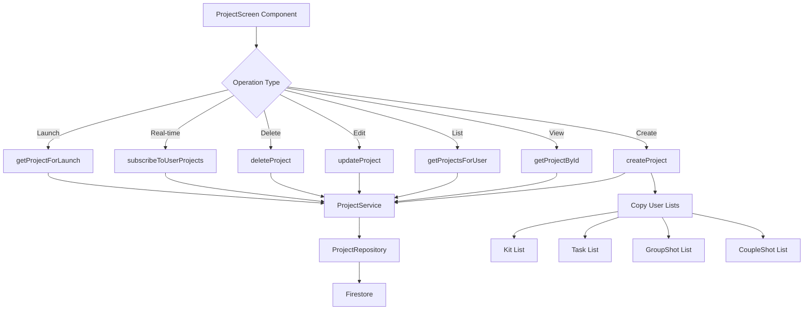
```mermaid
graph TD
    A[ProjectScreen Component] --> B{Operation Type}
    B -->|Create| C[createProject]
    B -->|View| D[getProjectById]
    B -->|List| E[getProjectsForUser]
    B -->|Edit| F[updateProject]
    B -->|Delete| G[deleteProject]
    B -->|Real-time| H[subscribeToUserProjects]
    B -->|Launch| I[getProjectForLaunch]
    
    C --> J[ProjectService]
    D --> J
    E --> J
    F --> J
    G --> J
    H --> J
    I --> J
    
    J --> K[ProjectRepository]
    K --> L[Firestore]
    
    C --> M[Copy User Lists]
    M --> N[Kit List]
    M --> O[Task List]
    M --> P[GroupShot List]
    M --> Q[CoupleShot List]
```

### Core Project Flow

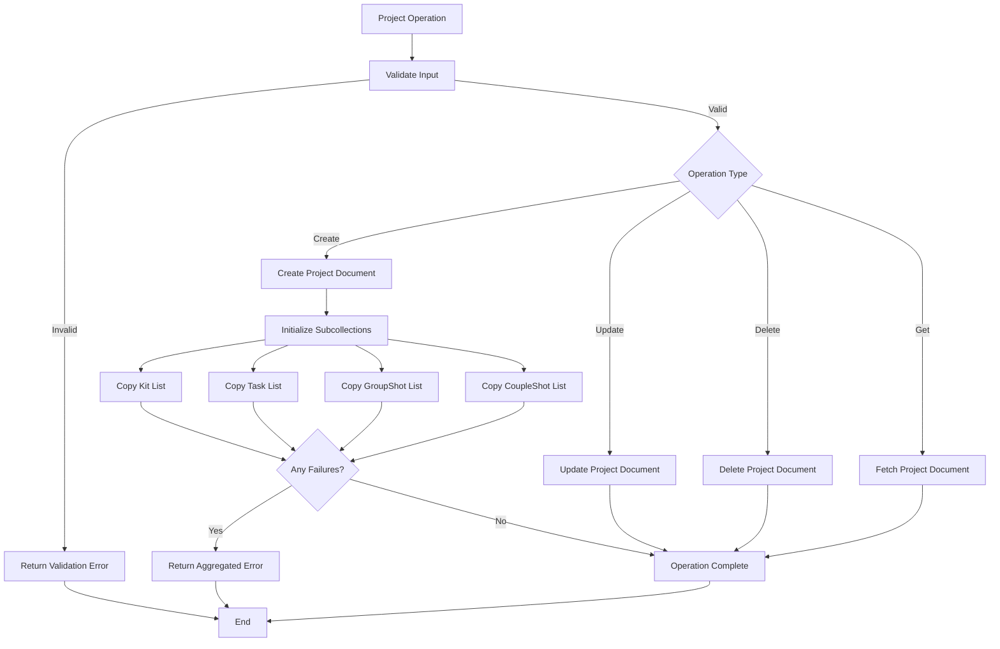
```mermaid
graph TD
    Start[Project Operation] --> Validate[Validate Input]
    Validate -->|Invalid| Error1[Return Validation Error]
    Validate -->|Valid| CheckOperation{Operation Type}
    CheckOperation -->|Create| CreateDoc[Create Project Document]
    CheckOperation -->|Update| UpdateDoc[Update Project Document]
    CheckOperation -->|Delete| DeleteDoc[Delete Project Document]
    CheckOperation -->|Get| FetchDoc[Fetch Project Document]
    
    CreateDoc --> InitSubcollections[Initialize Subcollections]
    InitSubcollections --> CopyKit[Copy Kit List]
    InitSubcollections --> CopyTask[Copy Task List]
    InitSubcollections --> CopyGroupShot[Copy GroupShot List]
    InitSubcollections --> CopyCoupleShot[Copy CoupleShot List]
    
    CopyKit --> CheckFailures{Any Failures?}
    CopyTask --> CheckFailures
    CopyGroupShot --> CheckFailures
    CopyCoupleShot --> CheckFailures
    
    CheckFailures -->|Yes| Error2[Return Aggregated Error]
    CheckFailures -->|No| Success[Operation Complete]
    
    UpdateDoc --> Success
    DeleteDoc --> Success
    FetchDoc --> Success
    
    Error1 --> End[End]
    Error2 --> End
    Success --> End
```

---

## Detailed Process Flows

### Create Project Flow


```mermaid
sequenceDiagram
    participant UI as ProjectScreen Component
    participant Form as CreateProjectForm Component
    participant Hook as useProject Hook (Placeholder)
    participant Service as ProjectService
    participant Validate as Validation Helpers
    participant Repo as FirestoreProjectRepository
    participant ListRepo1 as KitListRepository
    participant ListRepo2 as TaskListRepository
    participant ListRepo3 as GroupShotRepository
    participant ListRepo4 as CoupleShotRepository
    participant Firestore as Cloud Firestore
    participant ErrorHandler as Error Handler
    participant Logger as Logging Service
    participant Toast as Toast UI

    UI->>Form: User fills Create Project form
    Form->>Form: Client-side validation
    User->>Form: Click "Create Project" button
    Form->>Hook: createProject(projectInput)
    activate Hook
    
    Hook->>Hook: setState(loading())
    Hook->>Service: createProject(userId, projectInput)
    activate Service
    
    Service->>Service: Build Error Context
    Service->>Validate: validateWithSchema(projectInputSchema, projectInput)
    activate Validate
    Validate->>Validate: Check projectName (required, 1-50 chars, trimmed)
    Validate->>Validate: Check personA (personInfoSchema)
    Validate->>Validate: Check personB (personInfoSchema)
    Validate->>Validate: Check contact (contactInfoSchema)
    Validate->>Validate: Check eventDate (required timestamp)
    Validate->>Validate: Check coverImage (optional string)
    alt Validation Fails
        Validate-->>Service: Return ValidationError with field errors
        Service-->>Hook: Return Error Result
        Hook->>ErrorHandler: handleError(error)
        ErrorHandler->>Toast: Show field errors
        Hook-->>Form: Return false
    else Validation Success
        Validate-->>Service: Return validated ProjectInput
    end
    deactivate Validate
    
    Service->>Repo: create(userId, validatedInput)
    activate Repo
    
    Repo->>Repo: Build Error Context
    Repo->>Validate: validateWithSchema(projectInputSchema, payload)
    activate Validate
    alt Validation Fails
        Validate-->>Repo: Return ValidationError
        Repo-->>Service: Return Error Result
        Service-->>Hook: Return Error Result
        Hook->>ErrorHandler: handleError(error)
    else Validation Success
        Validate-->>Repo: Return validated ProjectInput
    end
    deactivate Validate
    
    Repo->>Firestore: addDoc(collection('projects'), {...validated, userId, createdAt, updatedAt, portalId: null, portalIsSetup: false, portalIsEnabled: false, metadata: { hasLaunchedDashboard: false }})
    activate Firestore
    alt Write Fails
        Firestore-->>Repo: Error (permission, network, etc.)
        Repo->>Repo: ErrorMapper.fromFirestore(error)
        Repo-->>Service: Return FirestoreError Result
        Service-->>Hook: Return Error Result
        Hook->>ErrorHandler: handleError(error)
        Hook-->>Form: Return false
    else Write Success
        Firestore-->>Repo: Return DocumentReference
    end
    
    Repo->>Firestore: getDoc(newProjectRef)
    Firestore-->>Repo: Return DocumentSnapshot
    Repo->>Repo: parseSnapshot(snapshot, context)
    Repo->>Validate: validateWithSchema(projectSchema, { id: snapshot.id, ...data })
    activate Validate
    Validate->>Validate: Validate complete Project structure
    alt Validation Fails
        Validate-->>Repo: Return ValidationError
        Repo-->>Service: Return Error Result
        Service-->>Hook: Return Error Result
        Hook->>ErrorHandler: handleError(error)
    else Validation Success
        Validate-->>Repo: Return validated Project
    end
    deactivate Validate
    
    Repo-->>Service: Return Project Result
    deactivate Repo
    
    Service->>Service: Store newProject = projectResult.value
    
    Note over Service: Orchestration: Copy User Lists to Project
    
    Service->>Service: Promise.all([copyKit, copyTask, copyGroupShot, copyCoupleShot])
    activate Service
    
    par Copy Kit List
        Service->>ListRepo1: getUserList(userId)
        activate ListRepo1
        alt User List Found
            ListRepo1-->>Service: Return KitList
            Service->>ListRepo1: createOrResetProjectList(userId, projectId, kitList)
            ListRepo1-->>Service: Return Success Result
        else User List Not Found
            Service->>ListRepo1: getMaster()
            alt Master List Found
                ListRepo1-->>Service: Return Master KitList
                Service->>ListRepo1: createOrResetProjectList(userId, projectId, masterKitList)
                ListRepo1-->>Service: Return Success Result
            else Master List Not Found
                ListRepo1-->>Service: Return DB_NOT_FOUND Error
                Service->>Logger: Log error for kit list
            end
        end
        deactivate ListRepo1
    and Copy Task List
        Service->>ListRepo2: getUserList(userId)
        activate ListRepo2
        alt User List Found
            ListRepo2-->>Service: Return TaskList
            Service->>ListRepo2: createOrResetProjectList(userId, projectId, taskList)
            ListRepo2-->>Service: Return Success Result
        else User List Not Found
            Service->>ListRepo2: getMaster()
            alt Master List Found
                ListRepo2-->>Service: Return Master TaskList
                Service->>ListRepo2: createOrResetProjectList(userId, projectId, masterTaskList)
                ListRepo2-->>Service: Return Success Result
            else Master List Not Found
                ListRepo2-->>Service: Return DB_NOT_FOUND Error
                Service->>Logger: Log error for task list
            end
        end
        deactivate ListRepo2
    and Copy GroupShot List
        Service->>ListRepo3: getUserList(userId)
        activate ListRepo3
        alt User List Found
            ListRepo3-->>Service: Return GroupShotList
            Service->>ListRepo3: createOrResetProjectList(userId, projectId, groupShotList)
            ListRepo3-->>Service: Return Success Result
        else User List Not Found
            Service->>ListRepo3: getMaster()
            alt Master List Found
                ListRepo3-->>Service: Return Master GroupShotList
                Service->>ListRepo3: createOrResetProjectList(userId, projectId, masterGroupShotList)
                ListRepo3-->>Service: Return Success Result
            else Master List Not Found
                ListRepo3-->>Service: Return DB_NOT_FOUND Error
                Service->>Logger: Log error for groupShot list
            end
        end
        deactivate ListRepo3
    and Copy CoupleShot List
        Service->>ListRepo4: getUserList(userId)
        activate ListRepo4
        alt User List Found
            ListRepo4-->>Service: Return CoupleShotList
            Service->>ListRepo4: createOrResetProjectList(userId, projectId, coupleShotList)
            ListRepo4-->>Service: Return Success Result
        else User List Not Found
            Service->>ListRepo4: getMaster()
            alt Master List Found
                ListRepo4-->>Service: Return Master CoupleShotList
                Service->>ListRepo4: createOrResetProjectList(userId, projectId, masterCoupleShotList)
                ListRepo4-->>Service: Return Success Result
            else Master List Not Found
                ListRepo4-->>Service: Return DB_NOT_FOUND Error
                Service->>Logger: Log error for coupleShot list
            end
        end
        deactivate ListRepo4
    end
    
    Service->>Service: Collect failures from copyResults
    alt Any Failures
        Service->>Service: Build aggregated error message
        Service->>Service: Create DB_WRITE_ERROR with failure details
        Service-->>Hook: Return Aggregated Error Result
        Hook->>ErrorHandler: handleError(error)
        ErrorHandler->>Toast: Show "Failed to initialize X subcollection(s)" message
        Hook-->>Form: Return false (Project created but subcollections failed)
    else All Success
        Service-->>Hook: Return Project Result
    end
    deactivate Service
    
    alt Success
        Hook->>Hook: setState(success(project))
        Hook-->>Form: Project created
        Form->>UI: Navigate to project detail screen
    end
    deactivate Hook
```

### Get Project by ID Flow

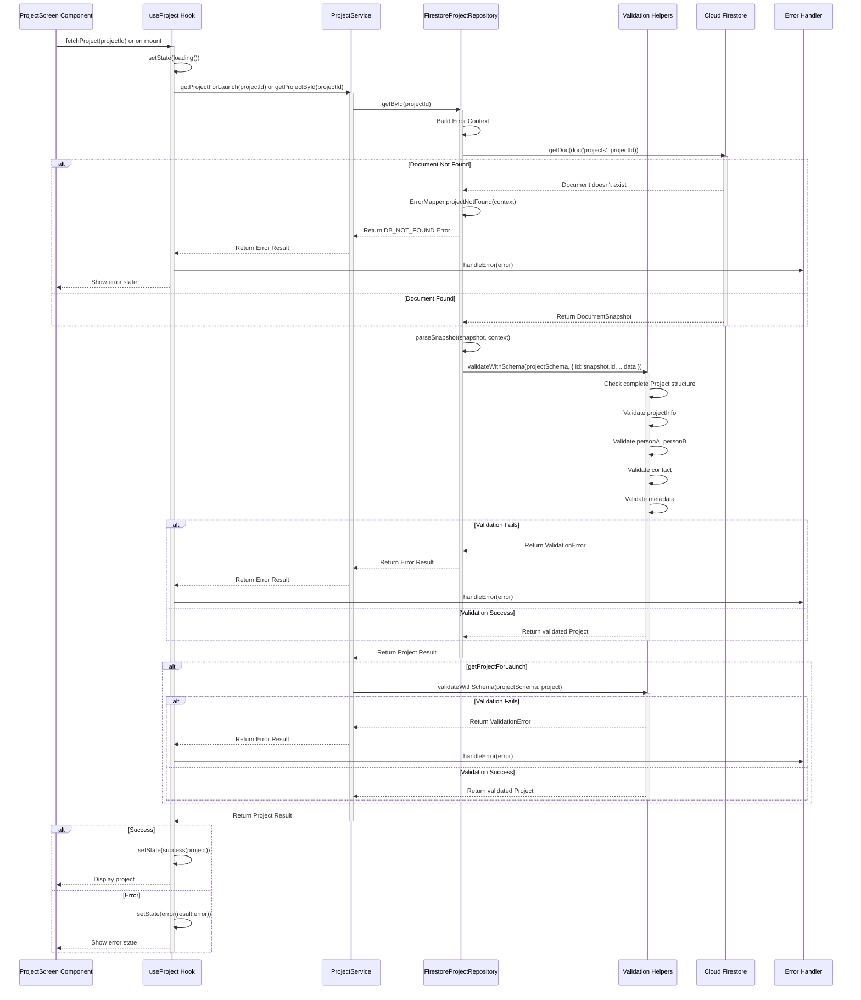
```mermaid
sequenceDiagram
    participant UI as ProjectScreen Component
    participant Hook as useProject Hook
    participant Service as ProjectService
    participant Repo as FirestoreProjectRepository
    participant Validate as Validation Helpers
    participant Firestore as Cloud Firestore
    participant ErrorHandler as Error Handler

    UI->>Hook: fetchProject(projectId) or on mount
    activate Hook
    Hook->>Hook: setState(loading())
    Hook->>Service: getProjectForLaunch(projectId) or getProjectById(projectId)
    activate Service
    
    Service->>Repo: getById(projectId)
    activate Repo
    
    Repo->>Repo: Build Error Context
    Repo->>Firestore: getDoc(doc('projects', projectId))
    activate Firestore
    alt Document Not Found
        Firestore-->>Repo: Document doesn't exist
        Repo->>Repo: ErrorMapper.projectNotFound(context)
        Repo-->>Service: Return DB_NOT_FOUND Error
        Service-->>Hook: Return Error Result
        Hook->>ErrorHandler: handleError(error)
        Hook-->>UI: Show error state
    else Document Found
        Firestore-->>Repo: Return DocumentSnapshot
    end
    deactivate Firestore
    
    Repo->>Repo: parseSnapshot(snapshot, context)
    Repo->>Validate: validateWithSchema(projectSchema, { id: snapshot.id, ...data })
    activate Validate
    Validate->>Validate: Check complete Project structure
    Validate->>Validate: Validate projectInfo
    Validate->>Validate: Validate personA, personB
    Validate->>Validate: Validate contact
    Validate->>Validate: Validate metadata
    alt Validation Fails
        Validate-->>Repo: Return ValidationError
        Repo-->>Service: Return Error Result
        Service-->>Hook: Return Error Result
        Hook->>ErrorHandler: handleError(error)
    else Validation Success
        Validate-->>Repo: Return validated Project
    end
    deactivate Validate
    
    Repo-->>Service: Return Project Result
    deactivate Repo
    
    alt getProjectForLaunch
        Service->>Validate: validateWithSchema(projectSchema, project)
        activate Validate
        alt Validation Fails
            Validate-->>Service: Return ValidationError
            Service-->>Hook: Return Error Result
            Hook->>ErrorHandler: handleError(error)
        else Validation Success
            Validate-->>Service: Return validated Project
        end
        deactivate Validate
    end
    
    Service-->>Hook: Return Project Result
    deactivate Service
    
    alt Success
        Hook->>Hook: setState(success(project))
        Hook-->>UI: Display project
    else Error
        Hook->>Hook: setState(error(result.error))
        Hook-->>UI: Show error state
    end
    deactivate Hook
```

### Get Projects for User Flow

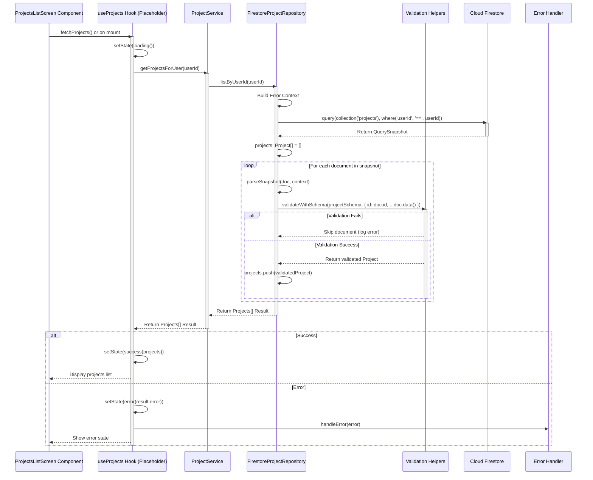
```mermaid
sequenceDiagram
    participant UI as ProjectsListScreen Component
    participant Hook as useProjects Hook (Placeholder)
    participant Service as ProjectService
    participant Repo as FirestoreProjectRepository
    participant Validate as Validation Helpers
    participant Firestore as Cloud Firestore
    participant ErrorHandler as Error Handler

    UI->>Hook: fetchProjects() or on mount
    activate Hook
    Hook->>Hook: setState(loading())
    Hook->>Service: getProjectsForUser(userId)
    activate Service
    
    Service->>Repo: listByUserId(userId)
    activate Repo
    
    Repo->>Repo: Build Error Context
    Repo->>Firestore: query(collection('projects'), where('userId', '==', userId))
    activate Firestore
    Firestore-->>Repo: Return QuerySnapshot
    deactivate Firestore
    
    Repo->>Repo: projects: Project[] = []
    loop For each document in snapshot
        Repo->>Repo: parseSnapshot(doc, context)
        Repo->>Validate: validateWithSchema(projectSchema, { id: doc.id, ...doc.data() })
        activate Validate
        alt Validation Fails
            Validate-->>Repo: Skip document (log error)
        else Validation Success
            Validate-->>Repo: Return validated Project
            Repo->>Repo: projects.push(validatedProject)
        end
        deactivate Validate
    end
    
    Repo-->>Service: Return Projects[] Result
    deactivate Repo
    
    Service-->>Hook: Return Projects[] Result
    deactivate Service
    
    alt Success
        Hook->>Hook: setState(success(projects))
        Hook-->>UI: Display projects list
    else Error
        Hook->>Hook: setState(error(result.error))
        Hook->>ErrorHandler: handleError(error)
        Hook-->>UI: Show error state
    end
    deactivate Hook
```

### Update Project Flow

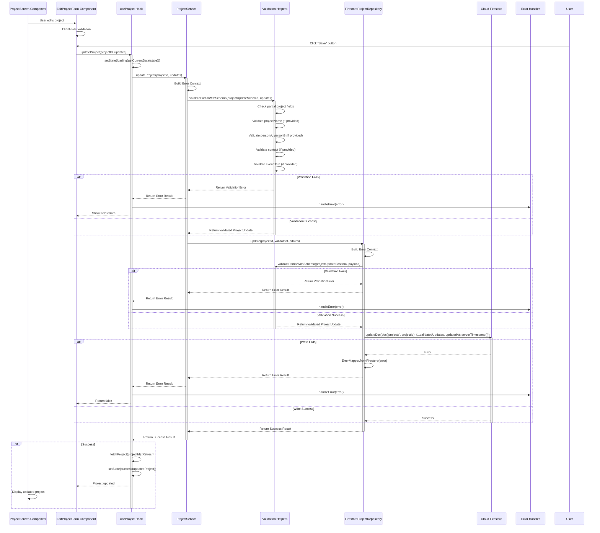
```mermaid
sequenceDiagram
    participant UI as ProjectScreen Component
    participant Form as EditProjectForm Component
    participant Hook as useProject Hook
    participant Service as ProjectService
    participant Validate as Validation Helpers
    participant Repo as FirestoreProjectRepository
    participant Firestore as Cloud Firestore
    participant ErrorHandler as Error Handler

    UI->>Form: User edits project
    Form->>Form: Client-side validation
    User->>Form: Click "Save" button
    Form->>Hook: updateProject(projectId, updates)
    activate Hook
    
    Hook->>Hook: setState(loading(getCurrentData(state)))
    Hook->>Service: updateProject(projectId, updates)
    activate Service
    
    Service->>Service: Build Error Context
    Service->>Validate: validatePartialWithSchema(projectUpdateSchema, updates)
    activate Validate
    Validate->>Validate: Check partial project fields
    Validate->>Validate: Validate projectName (if provided)
    Validate->>Validate: Validate personA, personB (if provided)
    Validate->>Validate: Validate contact (if provided)
    Validate->>Validate: Validate eventDate (if provided)
    alt Validation Fails
        Validate-->>Service: Return ValidationError
        Service-->>Hook: Return Error Result
        Hook->>ErrorHandler: handleError(error)
        Hook-->>Form: Show field errors
    else Validation Success
        Validate-->>Service: Return validated ProjectUpdate
    end
    deactivate Validate
    
    Service->>Repo: update(projectId, validatedUpdates)
    activate Repo
    
    Repo->>Repo: Build Error Context
    Repo->>Validate: validatePartialWithSchema(projectUpdateSchema, payload)
    activate Validate
    alt Validation Fails
        Validate-->>Repo: Return ValidationError
        Repo-->>Service: Return Error Result
        Service-->>Hook: Return Error Result
        Hook->>ErrorHandler: handleError(error)
    else Validation Success
        Validate-->>Repo: Return validated ProjectUpdate
    end
    deactivate Validate
    
    Repo->>Firestore: updateDoc(doc('projects', projectId), {...validatedUpdates, updatedAt: serverTimestamp()})
    activate Firestore
    alt Write Fails
        Firestore-->>Repo: Error
        Repo->>Repo: ErrorMapper.fromFirestore(error)
        Repo-->>Service: Return Error Result
        Service-->>Hook: Return Error Result
        Hook->>ErrorHandler: handleError(error)
        Hook-->>Form: Return false
    else Write Success
        Firestore-->>Repo: Success
    end
    deactivate Firestore
    
    Repo-->>Service: Return Success Result
    deactivate Repo
    
    Service-->>Hook: Return Success Result
    deactivate Service
    
    alt Success
        Hook->>Hook: fetchProject(projectId) [Refresh]
        Hook->>Hook: setState(success(updatedProject))
        Hook-->>Form: Project updated
        UI->>UI: Display updated project
    end
    deactivate Hook
```

### Delete Project Flow

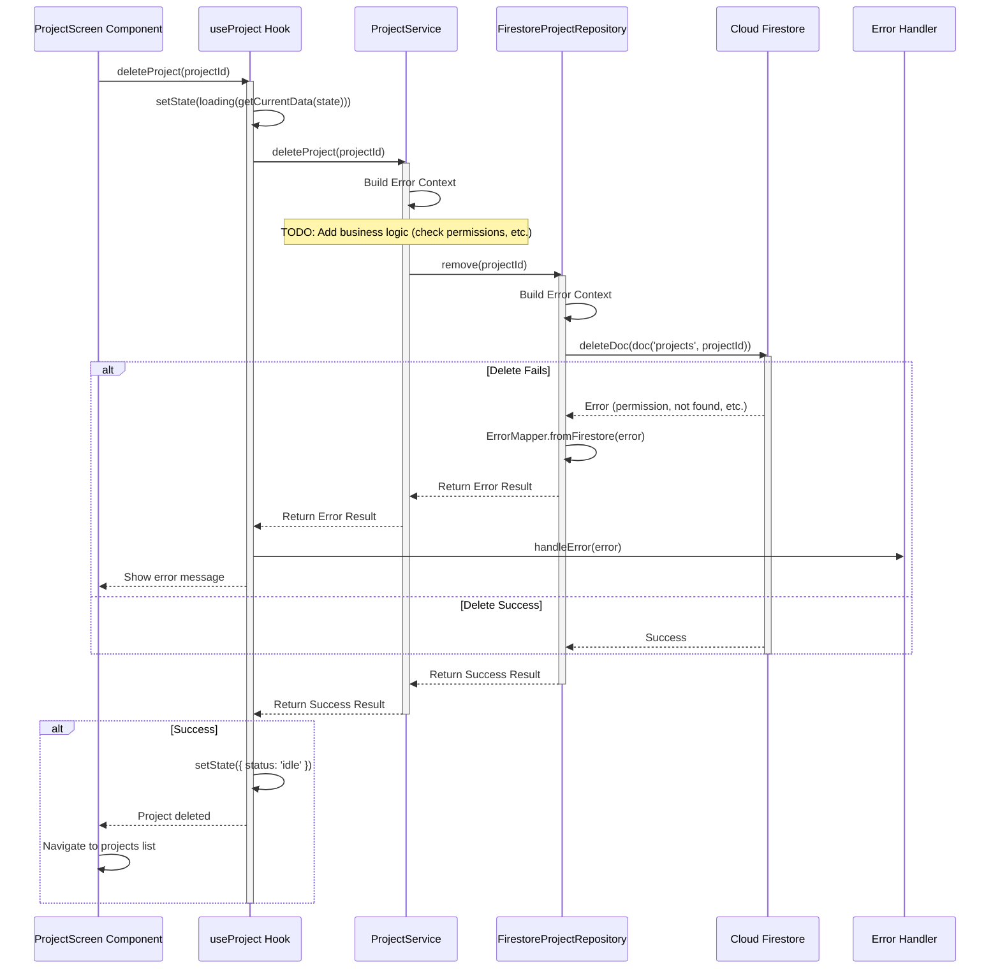
```mermaid
sequenceDiagram
    participant UI as ProjectScreen Component
    participant Hook as useProject Hook
    participant Service as ProjectService
    participant Repo as FirestoreProjectRepository
    participant Firestore as Cloud Firestore
    participant ErrorHandler as Error Handler

    UI->>Hook: deleteProject(projectId)
    activate Hook
    
    Hook->>Hook: setState(loading(getCurrentData(state)))
    Hook->>Service: deleteProject(projectId)
    activate Service
    
    Service->>Service: Build Error Context
    Note over Service: TODO: Add business logic (check permissions, etc.)
    
    Service->>Repo: remove(projectId)
    activate Repo
    
    Repo->>Repo: Build Error Context
    Repo->>Firestore: deleteDoc(doc('projects', projectId))
    activate Firestore
    alt Delete Fails
        Firestore-->>Repo: Error (permission, not found, etc.)
        Repo->>Repo: ErrorMapper.fromFirestore(error)
        Repo-->>Service: Return Error Result
        Service-->>Hook: Return Error Result
        Hook->>ErrorHandler: handleError(error)
        Hook-->>UI: Show error message
    else Delete Success
        Firestore-->>Repo: Success
    end
    deactivate Firestore
    
    Repo-->>Service: Return Success Result
    deactivate Repo
    
    Service-->>Hook: Return Success Result
    deactivate Service
    
    alt Success
        Hook->>Hook: setState({ status: 'idle' })
        Hook-->>UI: Project deleted
        UI->>UI: Navigate to projects list
    end
    deactivate Hook
```

### Subscribe to User Projects (Real-time) Flow

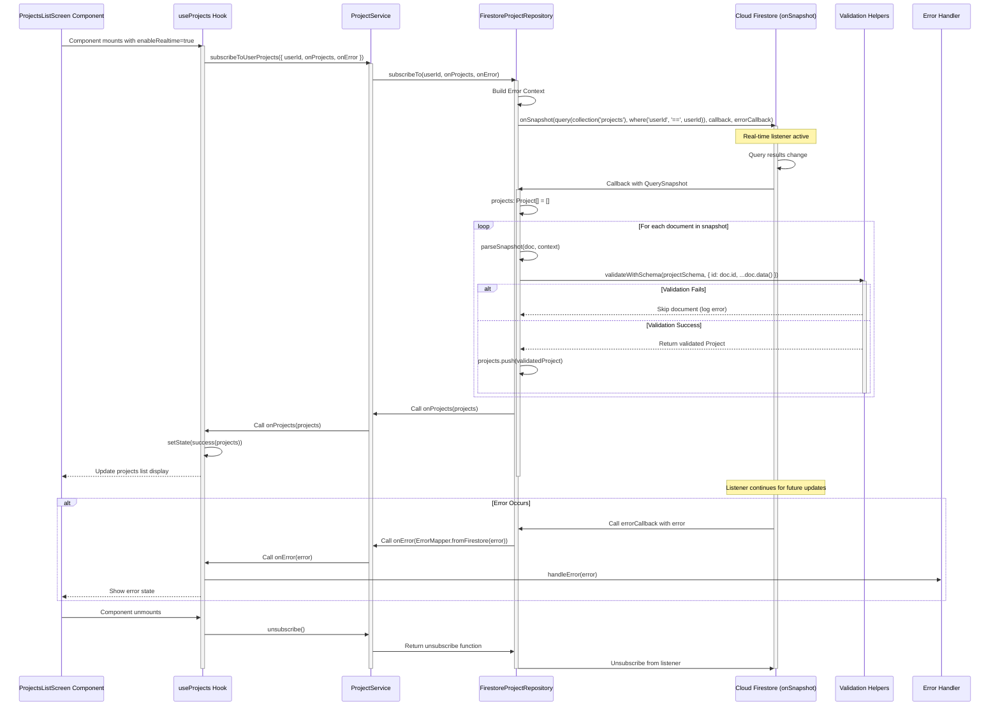
```mermaid
sequenceDiagram
    participant UI as ProjectsListScreen Component
    participant Hook as useProjects Hook
    participant Service as ProjectService
    participant Repo as FirestoreProjectRepository
    participant Firestore as Cloud Firestore (onSnapshot)
    participant Validate as Validation Helpers
    participant ErrorHandler as Error Handler

    UI->>Hook: Component mounts with enableRealtime=true
    activate Hook
    
    Hook->>Service: subscribeToUserProjects({ userId, onProjects, onError })
    activate Service
    
    Service->>Repo: subscribeTo(userId, onProjects, onError)
    activate Repo
    
    Repo->>Repo: Build Error Context
    Repo->>Firestore: onSnapshot(query(collection('projects'), where('userId', '==', userId)), callback, errorCallback)
    activate Firestore
    Note over Firestore: Real-time listener active
    
    Firestore->>Firestore: Query results change
    Firestore->>Repo: Callback with QuerySnapshot
    activate Repo
    
    Repo->>Repo: projects: Project[] = []
    loop For each document in snapshot
        Repo->>Repo: parseSnapshot(doc, context)
        Repo->>Validate: validateWithSchema(projectSchema, { id: doc.id, ...doc.data() })
        activate Validate
        alt Validation Fails
            Validate-->>Repo: Skip document (log error)
        else Validation Success
            Validate-->>Repo: Return validated Project
            Repo->>Repo: projects.push(validatedProject)
        end
        deactivate Validate
    end
    
    Repo->>Service: Call onProjects(projects)
    Service->>Hook: Call onProjects(projects)
    
    Hook->>Hook: setState(success(projects))
    Hook-->>UI: Update projects list display
    
    deactivate Repo
    
    Note over Firestore: Listener continues for future updates
    
    alt Error Occurs
        Firestore->>Repo: Call errorCallback with error
        Repo->>Service: Call onError(ErrorMapper.fromFirestore(error))
        Service->>Hook: Call onError(error)
        Hook->>ErrorHandler: handleError(error)
        Hook-->>UI: Show error state
    end
    
    UI->>Hook: Component unmounts
    Hook->>Service: unsubscribe()
    Service->>Repo: Return unsubscribe function
    Repo->>Firestore: Unsubscribe from listener
    deactivate Firestore
    deactivate Repo
    deactivate Service
    deactivate Hook
```

### Get Project for Launch Flow

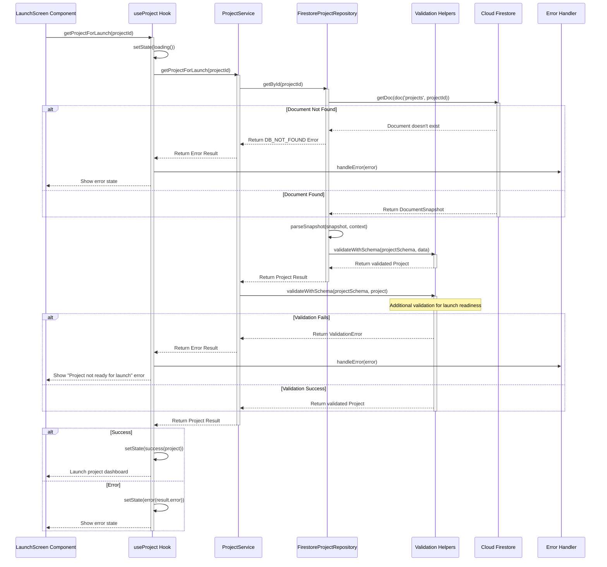
```mermaid
sequenceDiagram
    participant UI as LaunchScreen Component
    participant Hook as useProject Hook
    participant Service as ProjectService
    participant Repo as FirestoreProjectRepository
    participant Validate as Validation Helpers
    participant Firestore as Cloud Firestore
    participant ErrorHandler as Error Handler

    UI->>Hook: getProjectForLaunch(projectId)
    activate Hook
    
    Hook->>Hook: setState(loading())
    Hook->>Service: getProjectForLaunch(projectId)
    activate Service
    
    Service->>Repo: getById(projectId)
    activate Repo
    
    Repo->>Firestore: getDoc(doc('projects', projectId))
    activate Firestore
    alt Document Not Found
        Firestore-->>Repo: Document doesn't exist
        Repo-->>Service: Return DB_NOT_FOUND Error
        Service-->>Hook: Return Error Result
        Hook->>ErrorHandler: handleError(error)
        Hook-->>UI: Show error state
    else Document Found
        Firestore-->>Repo: Return DocumentSnapshot
    end
    deactivate Firestore
    
    Repo->>Repo: parseSnapshot(snapshot, context)
    Repo->>Validate: validateWithSchema(projectSchema, data)
    activate Validate
    Validate-->>Repo: Return validated Project
    deactivate Validate
    
    Repo-->>Service: Return Project Result
    deactivate Repo
    
    Service->>Validate: validateWithSchema(projectSchema, project)
    activate Validate
    Note over Validate: Additional validation for launch readiness
    alt Validation Fails
        Validate-->>Service: Return ValidationError
        Service-->>Hook: Return Error Result
        Hook->>ErrorHandler: handleError(error)
        Hook-->>UI: Show "Project not ready for launch" error
    else Validation Success
        Validate-->>Service: Return validated Project
    end
    deactivate Validate
    
    Service-->>Hook: Return Project Result
    deactivate Service
    
    alt Success
        Hook->>Hook: setState(success(project))
        Hook-->>UI: Launch project dashboard
    else Error
        Hook->>Hook: setState(error(result.error))
        Hook-->>UI: Show error state
    end
    deactivate Hook
```

### Copy User List to Project Flow

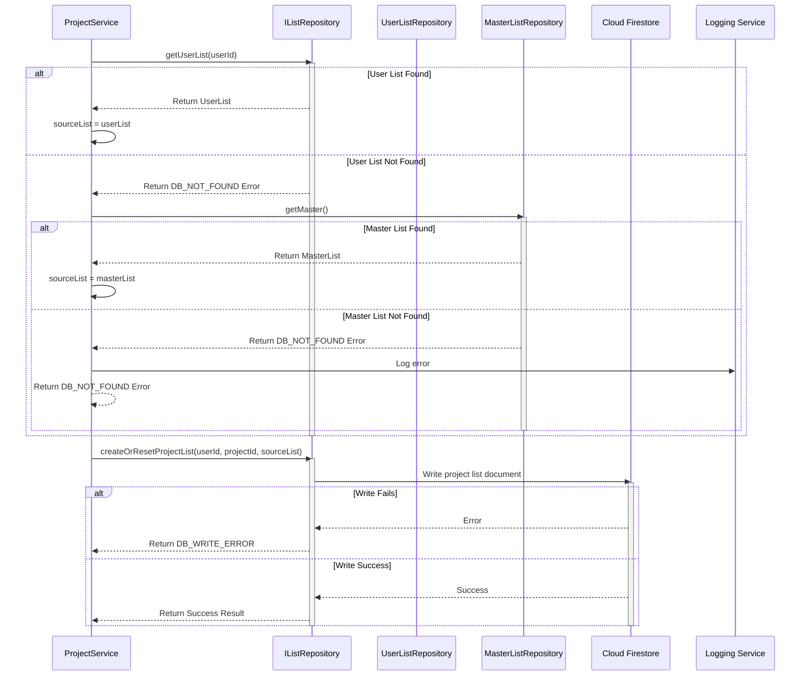
```mermaid
sequenceDiagram
    participant Service as ProjectService
    participant ListRepo as IListRepository
    participant UserRepo as UserListRepository
    participant MasterRepo as MasterListRepository
    participant Firestore as Cloud Firestore
    participant Logger as Logging Service

    Service->>ListRepo: getUserList(userId)
    activate ListRepo
    alt User List Found
        ListRepo-->>Service: Return UserList
        Service->>Service: sourceList = userList
    else User List Not Found
        ListRepo-->>Service: Return DB_NOT_FOUND Error
        Service->>MasterRepo: getMaster()
        activate MasterRepo
        alt Master List Found
            MasterRepo-->>Service: Return MasterList
            Service->>Service: sourceList = masterList
        else Master List Not Found
            MasterRepo-->>Service: Return DB_NOT_FOUND Error
            Service->>Logger: Log error
            Service-->>Service: Return DB_NOT_FOUND Error
        end
        deactivate MasterRepo
    end
    deactivate ListRepo
    
    Service->>ListRepo: createOrResetProjectList(userId, projectId, sourceList)
    activate ListRepo
    ListRepo->>Firestore: Write project list document
    activate Firestore
    alt Write Fails
        Firestore-->>ListRepo: Error
        ListRepo-->>Service: Return DB_WRITE_ERROR
    else Write Success
        Firestore-->>ListRepo: Success
        ListRepo-->>Service: Return Success Result
    end
    deactivate Firestore
    deactivate ListRepo
```

---

## UI Component Structure

### Component Hierarchy


```mermaid
graph TD
    A[ProjectsListScreen] --> B[ProjectsListContainer Component]
    B --> C[ProjectsListHeader Component]
    B --> D[ProjectsList Component]
    B --> E[CreateProjectButton Component]
    B --> F[SearchBar Component]
    B --> G[FilterButton Component]
    B --> H[SortButton Component]
    B --> I[ErrorMessageDisplay Component]
    B --> J[LoadingIndicator Component]
    
    D --> K[ProjectCard Component]
    K --> L[ProjectName Display]
    K --> M[EventDate Display]
    K --> N[PersonA/PersonB Display]
    K --> O[StatusBadge Component]
    K --> P[CoverImage Component]
    K --> Q[EditButton Component]
    K --> R[DeleteButton Component]
    K --> S[LaunchButton Component]
    
    E --> T[CreateProjectDialog/Form Component]
    T --> U[ProjectNameInput Component]
    T --> V[PersonAForm Component]
    T --> W[PersonBForm Component]
    T --> X[ContactForm Component]
    T --> Y[EventDatePicker Component]
    T --> Z[CoverImageUpload Component]
    T --> AA[SubmitButton Component]
    
    A --> AB[ProjectDetailScreen]
    AB --> AC[ProjectDetailContainer Component]
    AC --> AD[ProjectDetailHeader Component]
    AC --> AE[ProjectInfoDisplay Component]
    AC --> AF[ProjectActionsBar Component]
    AC --> AG[ProjectSubcollectionsNav Component]
    
    AF --> AH[EditProjectButton Component]
    AF --> AI[DeleteProjectButton Component]
    AF --> AJ[LaunchProjectButton Component]
    
    AH --> AK[EditProjectDialog/Form Component]
    AK --> AL[Same form fields as CreateProjectForm]
```

### Placeholder Components

#### ProjectsListScreen Component

**Location**: `src/app/(features)/projects/index.tsx` (placeholder)

**Responsibilities**:
- Container for projects list management
- Navigation setup
- User context (userId)
- Error boundary wrapping
- Layout and styling

**Props**:
```typescript
interface ProjectsListScreenProps {
  navigation: NavigationProp;
  userId: string;
}
```

**Usage**:
```typescript
const ProjectsListScreen = ({ navigation, userId }: ProjectsListScreenProps) => {
  const { 
    projects, 
    loading, 
    error, 
    createProject,
    refresh,
    clearError 
  } = useProjects(
    userId,
    { autoFetch: true, enableRealtime: true }
  );

  return (
    <ProjectsListContainer
      projects={projects}
      loading={loading}
      error={error}
      onCreateProject={handleCreateProject}
      onRefresh={refresh}
      onClearError={clearError}
    />
  );
};
```

#### CreateProjectForm Component

**Location**: `src/components/project/CreateProjectForm.tsx` (placeholder)

**Responsibilities**:
- Form state management for creating projects
- Field validation coordination
- Submission handling
- Person info forms (personA, personB)
- Contact info form

**Props**:
```typescript
interface CreateProjectFormProps {
  onSubmit?: (input: ProjectInput) => Promise<void>;
  onCancel?: () => void;
  isLoading?: boolean;
}
```

**State**:
```typescript
{
  projectName: string;
  personA: PersonInfo;
  personB: PersonInfo;
  contact: ContactInfo;
  eventDate: Date;
  coverImage?: string;
  fieldErrors: Record<string, string>;
}
```

**Behavior**:
- Validates fields before submission
- Calls `onSubmit` with ProjectInput
- Clears form on success
- Shows validation errors

#### ProjectCard Component

**Location**: `src/components/project/ProjectCard.tsx` (placeholder)

**Responsibilities**:
- Display project information
- Show project status
- Edit/delete/launch actions
- Navigation to project detail

**Props**:
```typescript
interface ProjectCardProps {
  project: Project;
  onEdit?: (project: Project) => void;
  onDelete?: (projectId: string) => void;
  onLaunch?: (projectId: string) => void;
}
```

#### ProjectDetailScreen Component

**Location**: `src/app/(features)/projects/[projectId]/index.tsx` (placeholder)

**Responsibilities**:
- Display single project details
- Navigation to subcollections
- Project actions (edit, delete, launch)
- Error boundary wrapping

**Props**:
```typescript
interface ProjectDetailScreenProps {
  navigation: NavigationProp;
  route: { params: { projectId: string } };
}
```

---

## Data Structures

### ProjectInput Structure

```typescript
// ProjectInput (from project.schema.ts)
interface ProjectInput {
  projectInfo: {
    projectName: string;              // Required, 1-50 chars, trimmed
    personA: PersonInfo;               // Required, personInfoSchema
    personB: PersonInfo;               // Required, personInfoSchema
    contact: ContactInfo;              // Required, contactInfoSchema
    eventDate: Date;                   // Required timestamp
    coverImage?: string;               // Optional string
    // Note: projectStatus is omitted (set automatically)
  };
}
```

### Project Structure (Complete)

```typescript
// Project (complete structure)
interface Project {
  id: string;                          // Firestore document ID
  userId: string;                      // UUID of user who owns project
  photographerName: PersonInfo;         // Photographer's name info
  projectInfo: {
    projectName: string;                // Sanitized and validated
    personA: PersonInfo;                // Person A information
    personB: PersonInfo;                // Person B information
    contact: ContactInfo;               // Contact information
    eventDate: Date;                   // Event date timestamp
    coverImage?: string;                // Optional cover image URL
  };
  portalId?: string;                   // Optional portal UUID
  portalIsSetup: boolean;              // false (default)
  portalIsEnabled: boolean;            // false (default)
  metadata?: {
    hasLaunchedDashboard: boolean;      // false (default)
    firstLaunchDate?: Date;            // Optional timestamp
  };
  createdAt?: Date;                    // Server timestamp
  updatedAt?: Date;                    // Server timestamp
}
```

### PersonInfo Structure

```typescript
// PersonInfo (from shared-schemas.ts)
interface PersonInfo {
  firstName: string;                   // Required, trimmed
  lastName: string;                    // Required, trimmed
}
```

### ContactInfo Structure

```typescript
// ContactInfo (from shared-schemas.ts)
interface ContactInfo {
  email?: string;                      // Optional, validated email
  phone?: string;                      // Optional, validated phone
  website?: string;                    // Optional, validated URL
}
```

### ProjectUpdate Structure

```typescript
// ProjectUpdate (from project.schema.ts)
interface ProjectUpdate {
  projectInfo?: {
    projectName?: string;
    personA?: PersonInfo;
    personB?: PersonInfo;
    contact?: ContactInfo;
    eventDate?: Date;
    coverImage?: string;
  };
  // All fields are optional (partial update)
}
```

### ProjectStatus Enum

```typescript
enum ProjectStatus {
  DRAFT = 'draft',            // Project is in draft state
  ACTIVE = 'active',          // Project is active
  COMPLETED = 'completed',   // Project is completed
  ARCHIVED = 'archived',      // Project is archived
  CANCELLED = 'cancelled',    // Project is cancelled
}
```

### Firestore Document Structure

```typescript
// Document saved to Firestore
{
  userId: string,                      // UUID of user
  photographerName: PersonInfo,        // Photographer's name
  projectInfo: {
    projectName: string,
    personA: PersonInfo,
    personB: PersonInfo,
    contact: ContactInfo,
    eventDate: Timestamp,
    coverImage?: string,
  },
  portalId: string | null,             // null initially
  portalIsSetup: boolean,              // false initially
  portalIsEnabled: boolean,            // false initially
  metadata: {
    hasLaunchedDashboard: boolean,      // false initially
    firstLaunchDate?: Timestamp,
  },
  createdAt: Timestamp,
  updatedAt: Timestamp,
}
```

---

## Input Validation

### ProjectInput Validation

**File**: `src/domain/project/project.schema.ts`

```typescript
export const projectInputSchema = projectSchema.omit({
  id: true,
  photographerName: true,
  userId: true,
  portalId: true,
  portalIsSetup: true,
  portalIsEnabled: true,
  metadata: true,
});
```

**Base ProjectInfo Schema**:
```typescript
export const projectInfoSchema = z.object({
  projectName: z.string()
    .min(1, 'Name is required')
    .max(DEFAULTS.TEXT_LENGTHS.NAME, 'Name is too long')
    .trim(),
  projectStatus: z.nativeEnum(ProjectStatus),
  personA: personInfoSchema,
  personB: personInfoSchema,
  contact: contactInfoSchema,
  eventDate: requiredTimestampSchema,
  coverImage: z.string().optional(),
});
```

**Validation Rules**:
- `projectName`: Required, 1-50 characters (default), trimmed
- `personA`: Required, must match `personInfoSchema` (firstName, lastName)
- `personB`: Required, must match `personInfoSchema` (firstName, lastName)
- `contact`: Required, must match `contactInfoSchema` (email, phone, website - all optional)
- `eventDate`: Required timestamp (Date)
- `coverImage`: Optional string

**PersonInfo Validation** (from shared-schemas.ts):
- `firstName`: Required string, trimmed
- `lastName`: Required string, trimmed

**ContactInfo Validation** (from shared-schemas.ts):
- `email`: Optional, validated email format if provided
- `phone`: Optional, validated phone format if provided
- `website`: Optional, validated URL format if provided

### ProjectUpdate Validation

**File**: `src/domain/project/project.schema.ts`

```typescript
export const projectUpdateSchema = projectInputSchema.partial();
```

**Validation Rules**:
- All fields from `projectInputSchema` are optional
- Partial validation allows updating only specific fields
- Each provided field is validated according to its schema

### Project Schema Validation

**File**: `src/domain/project/project.schema.ts`**

```typescript
export const projectSchema = z.object({
  id: idSchema,
  userId: uuidSchema,
  photographerName: personInfoSchema,
  projectInfo: projectInfoInputSchema,
  portalId: uuidSchema.optional(),
  portalIsSetup: z.boolean().default(DEFAULTS.DISABLED),
  portalIsEnabled: z.boolean().default(DEFAULTS.DISABLED),
  metadata: projectMetadataSchema.optional(),
});
```

**Validation Flow**:

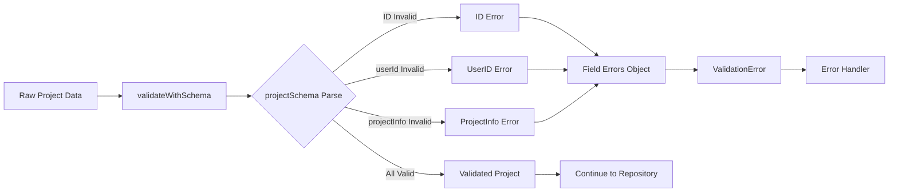
```mermaid
graph LR
    A[Raw Project Data] --> B[validateWithSchema]
    B --> C{projectSchema Parse}
    C -->|ID Invalid| D[ID Error]
    C -->|userId Invalid| E[UserID Error]
    C -->|projectInfo Invalid| F[ProjectInfo Error]
    C -->|All Valid| G[Validated Project]
    
    D --> H[Field Errors Object]
    E --> H
    F --> H
    H --> I[ValidationError]
    I --> J[Error Handler]
    
    G --> K[Continue to Repository]
```

---

## Sanitization Process

**Note**: Projects do not have explicit sanitization methods in the repository layer. However, Zod schema validation applies trimming and type coercion.

**Implicit Sanitization via Zod**:
- String fields are trimmed by Zod schemas (`.trim()` in schema)
- `projectName`: Trimmed automatically
- `personInfo.firstName`, `personInfo.lastName`: Trimmed automatically
- Optional fields are normalized to undefined if null/empty
- Timestamps are converted to Date objects

**Repository Layer**:
- No explicit `sanitizeProject` method
- Validation happens through Zod schemas
- String trimming handled by Zod's `.trim()`

**Service Layer**:
- No explicit sanitization
- Validation and type coercion handled by Zod

**PersonInfo and ContactInfo**:
- Sanitized through their respective schemas
- String fields trimmed
- Email/phone/URL validated and normalized if provided

---

## Loading States

### State Transitions

#### General Project Operations

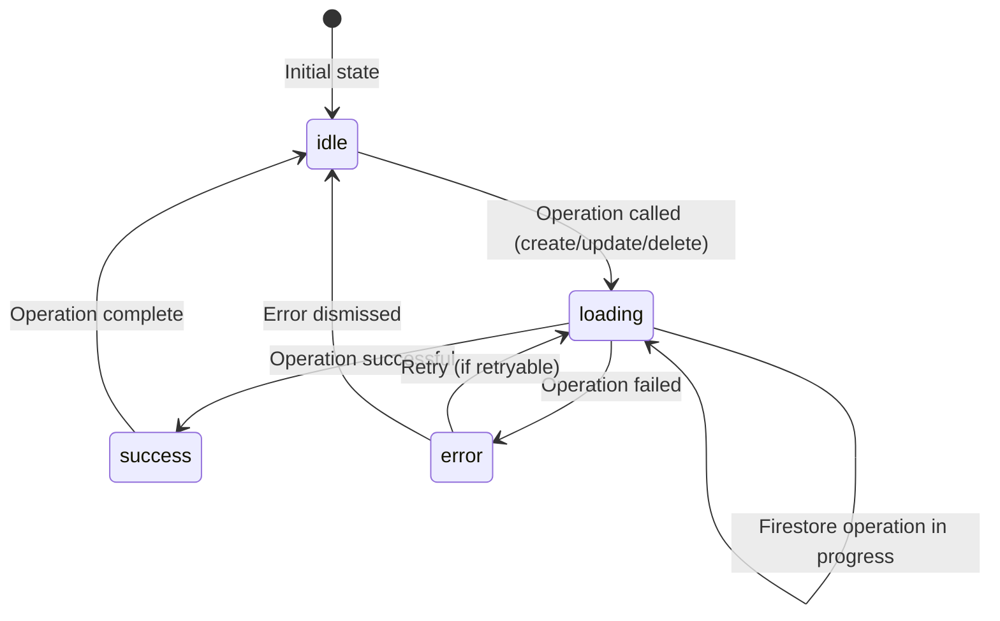
```mermaid
stateDiagram-v2
    [*] --> idle: Initial state
    idle --> loading: Operation called (create/update/delete)
    loading --> loading: Validation in progress
    loading --> loading: Firestore operation in progress
    loading --> success: Operation successful
    loading --> error: Operation failed
    error --> loading: Retry (if retryable)
    success --> idle: Operation complete
    error --> idle: Error dismissed
```

#### Create Project States (with Subcollections)

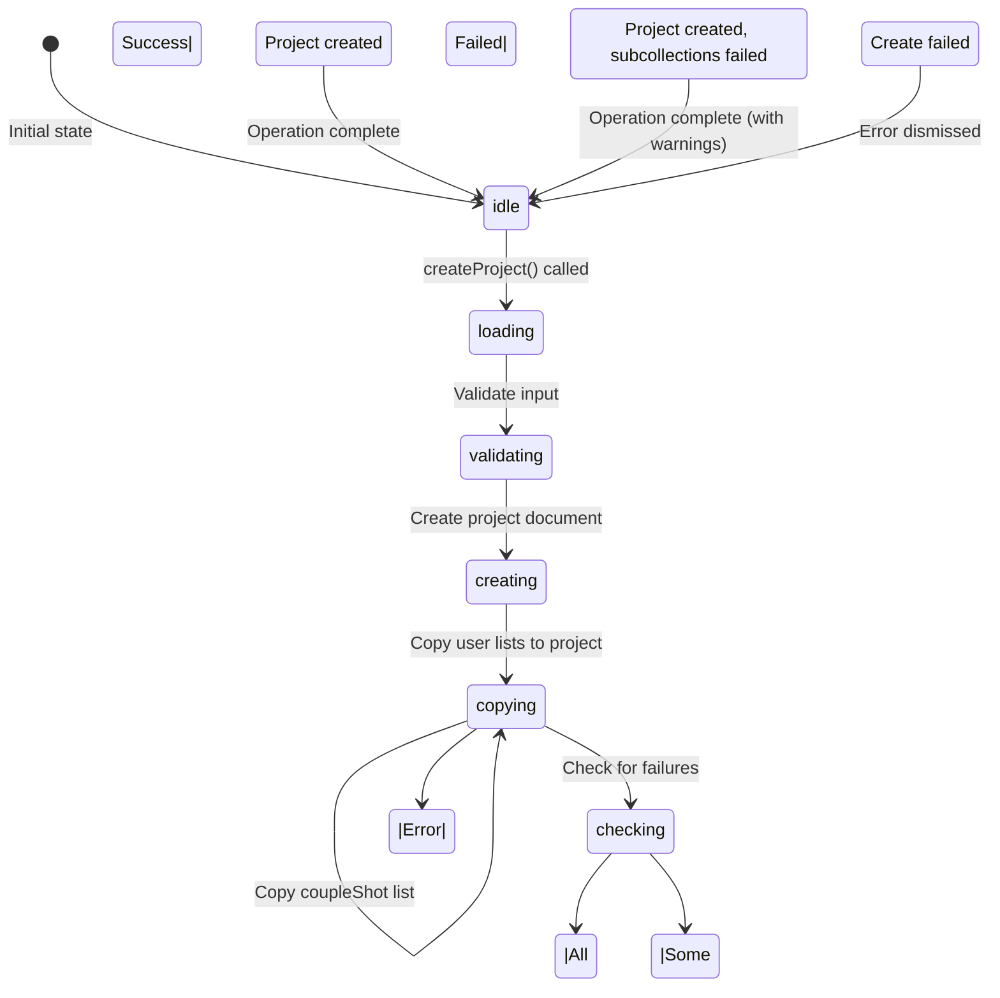
```mermaid
stateDiagram-v2
    [*] --> idle: Initial state
    idle --> loading: createProject() called
    loading --> validating: Validate input
    validating --> creating: Create project document
    creating --> copying: Copy user lists to project
    copying --> copying: Copy kit list
    copying --> copying: Copy task list
    copying --> copying: Copy groupShot list
    copying --> copying: Copy coupleShot list
    copying --> checking: Check for failures
    checking -->|All Success| success: Project created
    checking -->|Some Failed| partial_success: Project created, subcollections failed
    copying -->|Error| error: Create failed
    success --> idle: Operation complete
    partial_success --> idle: Operation complete (with warnings)
    error --> idle: Error dismissed
```

### Loading State Management (Placeholder Hook)

**File**: `src/hooks/use-project.ts` (placeholder - not yet implemented)

**State Management**:
```typescript
const [state, setState] = useState<LoadingState<Project | null>>(loading());
```

**Create Project Flow**:
```typescript
const createProject = useCallback(
  async (input: ProjectInput): Promise<boolean> => {
    if (!userId) return false;
    
    setState(loading(getCurrentData(state)));
    
    const result = await projectService.createProject(userId, input);
    
    if (!isMountedRef.current) return false;
    
    if (result.success) {
      setState(success(result.value));
      return true;
    } else {
      setState(error(result.error, getCurrentData(state)));
      handleError(result.error, {...});
      return false;
    }
  },
  [userId, state, handleError],
);
```

**Projects List State Management**:
```typescript
const [state, setState] = useState<LoadingState<Project[]>>(loading());
```

---

## Error Handling

### Error Types

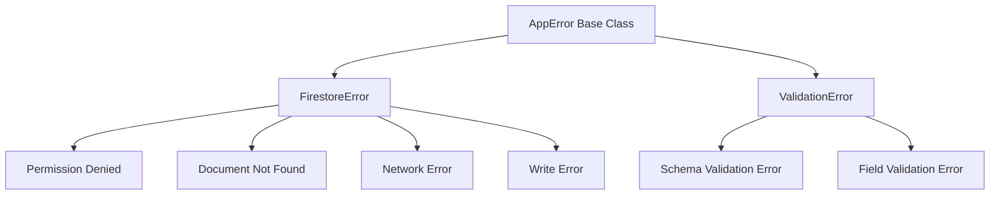
```mermaid
graph TD
    A[AppError Base Class] --> B[FirestoreError]
    A --> C[ValidationError]
    
    B --> D[Permission Denied]
    B --> E[Document Not Found]
    B --> F[Network Error]
    B --> G[Write Error]
    
    C --> H[Schema Validation Error]
    C --> I[Field Validation Error]
```

### Error Flow

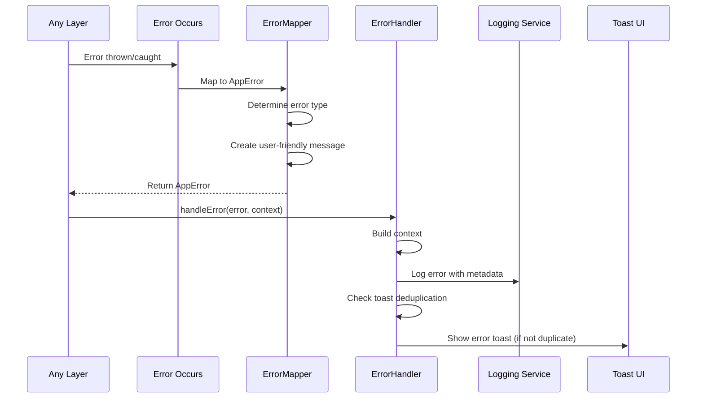
```mermaid
sequenceDiagram
    participant Layer as Any Layer
    participant Error as Error Occurs
    participant Mapper as ErrorMapper
    participant Handler as ErrorHandler
    participant Logger as Logging Service
    participant Toast as Toast UI

    Layer->>Error: Error thrown/caught
    
    Error->>Mapper: Map to AppError
    Mapper->>Mapper: Determine error type
    Mapper->>Mapper: Create user-friendly message
    Mapper-->>Layer: Return AppError
    
    Layer->>Handler: handleError(error, context)
    Handler->>Handler: Build context
    Handler->>Logger: Log error with metadata
    Handler->>Handler: Check toast deduplication
    Handler->>Toast: Show error toast (if not duplicate)
```

### Error Mapping

**File**: `src/utils/error-mapper.ts`

**Firestore Errors**:
- `permission-denied` → `DB_PERMISSION_DENIED`
  - User message: "You do not have permission to perform this action."
  - Retryable: false

- `not-found` → `DB_NOT_FOUND` (via `projectNotFound()`)
  - User message: "Project not found."
  - Retryable: false

- `unavailable` → `DB_NETWORK_ERROR`
  - User message: "Service temporarily unavailable. Please try again."
  - Retryable: true

- Write errors → `DB_WRITE_ERROR`
  - User message: "Failed to save project. Please try again."
  - Retryable: true

**Validation Errors**:
- Schema validation failures → `VALIDATION_ERROR`
  - User message: "Please check your input and try again."
  - Field-specific errors in `fieldErrors`
  - Retryable: false

**Subcollection Initialization Errors**:
- Aggregated error → `DB_WRITE_ERROR`
  - User message: "Failed to fully initialize project. Some features may not be available."
  - Detailed message: Lists which failed (e.g., "Failed to initialize 2 subcollection(s): kit: Error message; task: Error message")
  - Retryable: true (project is created, can retry subcollections)

---

## File Structure & Function Calls

### Complete Call Stack Examples

#### Create Project Call Stack

```
ProjectScreen Component (placeholder)
  └─> CreateProjectForm Component (placeholder)
      └─> useProject.createProject(input)
          └─> projectService.createProject(userId, input)
              ├─> ErrorContextBuilder.fromService()
              ├─> validateWithSchema(projectInputSchema, input)
              │   └─> projectInputSchema.safeParse()
              │
              └─> projectRepository.create(userId, validatedInput)
                  ├─> ErrorContextBuilder.fromRepository()
                  ├─> validateWithSchema(projectInputSchema, payload)
                  ├─> addDoc(collection('projects'), {...})
                  │   └─> Firestore API
                  ├─> getDoc(newProjectRef)
                  │   └─> Firestore API
                  └─> parseSnapshot(snapshot, context)
                      └─> validateWithSchema(projectSchema, { id, ...data })
              
              └─> Promise.all([copyKit, copyTask, copyGroupShot, copyCoupleShot])
                  ├─> copyUserListToProject(userId, projectId, kitRepository, 'kit')
                  │   ├─> kitRepository.getUserList(userId)
                  │   │   └─> getUserList() → Returns KitList or Error
                  │   ├─> [If user list not found] kitRepository.getMaster()
                  │   │   └─> getMaster() → Returns Master KitList or Error
                  │   └─> kitRepository.createOrResetProjectList(userId, projectId, sourceList)
                  │       └─> createOrResetProjectList() → Returns Success or Error
                  │
                  ├─> copyUserListToProject(userId, projectId, taskRepository, 'task')
                  │   └─> [Same flow as kit]
                  │
                  ├─> copyUserListToProject(userId, projectId, groupShotRepository, 'groupShot')
                  │   └─> [Same flow as kit]
                  │
                  └─> copyUserListToProject(userId, projectId, coupleShotRepository, 'coupleShot')
                      └─> [Same flow as kit]
              
              └─> Collect failures and return aggregated error (if any)
```

#### Update Project Call Stack

```
ProjectScreen Component (placeholder)
  └─> EditProjectForm Component (placeholder)
      └─> useProject.updateProject(projectId, updates)
          └─> projectService.updateProject(projectId, updates)
              ├─> ErrorContextBuilder.fromService()
              ├─> validatePartialWithSchema(projectUpdateSchema, updates)
              │   └─> projectUpdateSchema.safeParse()
              │
              └─> projectRepository.update(projectId, validatedUpdates)
                  ├─> ErrorContextBuilder.fromRepository()
                  ├─> validatePartialWithSchema(projectUpdateSchema, payload)
                  └─> updateDoc(doc('projects', projectId), {...validated, updatedAt: serverTimestamp()})
                      └─> Firestore API
```

### Files Involved

| File | Purpose | Key Functions |
|------|---------|---------------|
| `src/app/(features)/projects/index.tsx` | Projects list screen (placeholder) | Screen component |
| `src/app/(features)/projects/[projectId]/index.tsx` | Project detail screen (placeholder) | Project detail component |
| `src/components/project/CreateProjectForm.tsx` | Create project form (placeholder) | Create project form component |
| `src/components/project/EditProjectForm.tsx` | Edit project form (placeholder) | Edit project form component |
| `src/components/project/ProjectCard.tsx` | Project card (placeholder) | Project display component |
| `src/components/project/ProjectsListContainer.tsx` | Projects list container (placeholder) | List container component |
| `src/hooks/use-project.ts` | React hook for project (placeholder) | `useProject()`, operations |
| `src/hooks/use-projects.ts` | React hook for projects list (placeholder) | `useProjects()`, list operations |
| `src/services/project-service.ts` | Business logic orchestration | All CRUD operations, subcollection initialization |
| `src/repositories/firestore/firestore-project-repository.ts` | Firestore project adapter | All repository methods |
| `src/repositories/i-project-repository.ts` | Project repository interface | Port definition |
| `src/domain/project/project.schema.ts` | Project validation schemas | `projectSchema`, `projectInputSchema`, `projectUpdateSchema` |
| `src/domain/common/shared-schemas.ts` | Common schemas | `personInfoSchema`, `contactInfoSchema` |
| `src/utils/validation-helpers.ts` | Validation utilities | `validateWithSchema()`, `validatePartialWithSchema()` |
| `src/utils/error-mapper.ts` | Error type mapping | `fromFirestore()`, `projectNotFound()` |
| `src/services/error-handler-service.ts` | Centralized error handling | `handle()` |
| `src/services/logging-service.ts` | Logging service | `LoggingService.error()` |
| `src/repositories/firestore/list.repository.ts` | List repositories | Kit, Task, GroupShot, CoupleShot repositories |

---

## Hooks Usage (Placeholder)

### useProject Hook (Placeholder)

**File**: `src/hooks/use-project.ts` (placeholder - not yet implemented)

**Intended Usage Pattern**:
```typescript
const { 
  project, 
  loading, 
  error, 
  updateProject,
  deleteProject,
  getProjectForLaunch,
  clearError,
  refresh
} = useProject(
  projectId,
  { autoFetch: true }
);

// Update project
const handleUpdateProject = async (updates: ProjectUpdate) => {
  const success = await updateProject(updates);
  if (success) {
    // Project updated
  }
};

// Delete project
const handleDeleteProject = async () => {
  const success = await deleteProject();
  if (success) {
    // Project deleted, navigate away
  }
};

// Get project for launch
const handleLaunch = async () => {
  const project = await getProjectForLaunch();
  if (project) {
    // Navigate to project dashboard
  }
};
```

**Expected Hook Interface**:
```typescript
interface UseProjectResult {
  project: Project | null;
  loading: boolean;
  error: AppError | null;
  state: LoadingState<Project | null>;
  
  // Operations
  updateProject: (updates: ProjectUpdate) => Promise<boolean>;
  deleteProject: () => Promise<boolean>;
  getProjectForLaunch: () => Promise<Project | null>;
  
  // Helpers
  fetchProject: () => Promise<void>;
  refresh: () => Promise<void>;
  clearError: () => void;
}
```

### useProjects Hook (Placeholder)

**File**: `src/hooks/use-projects.ts` (placeholder - not yet implemented)

**Intended Usage Pattern**:
```typescript
const { 
  projects, 
  loading, 
  error, 
  createProject,
  refresh,
  clearError
} = useProjects(
  userId,
  { autoFetch: true, enableRealtime: true }
);

// Create project
const handleCreateProject = async (input: ProjectInput) => {
  const success = await createProject(input);
  if (success) {
    // Project created, navigate to project detail
  }
};
```

**Expected Hook Interface**:
```typescript
interface UseProjectsResult {
  projects: Project[];
  loading: boolean;
  error: AppError | null;
  state: LoadingState<Project[]>;
  
  // Operations
  createProject: (input: ProjectInput) => Promise<boolean>;
  
  // Helpers
  fetchProjects: () => Promise<void>;
  refresh: () => Promise<void>;
  clearError: () => void;
}
```

**Lifecycle** (Expected):
```typescript
// Component mount
useEffect(() => {
  return () => {
    isMountedRef.current = false;
    if (unsubscribeRef.current) {
      unsubscribeRef.current();  // Cleanup real-time subscription
    }
  };
}, []);

// Auto-fetch or real-time subscription
useEffect(() => {
  if (!userId) return;
  
  if (enableRealtime) {
    const unsubscribe = projectService.subscribeToUserProjects({
      userId,
      onProjects: (projects) => {
        setProjects(projects);
        setError(null);
      },
      onError: (error) => {
        setError(error);
        handleError(error, {...});
      },
    });
    unsubscribeRef.current = unsubscribe;
  } else if (autoFetch) {
    setTimeout(() => {
      fetchProjects();
    }, 0);
  }
}, [userId, enableRealtime, autoFetch, fetchProjects]);
```

---

## Ports & Adapters

### Architecture Pattern

The application uses **Ports & Adapters (Hexagonal Architecture)**:

- **Ports**: Interfaces defining contracts (`IProjectRepository`)
- **Adapters**: Concrete implementations (`FirestoreProjectRepository`)

### Ports (Interfaces)

#### IProjectRepository

**File**: `src/repositories/i-project-repository.ts`

**Contract**:
```typescript
interface IProjectRepository {
  create(userId: string, payload: ProjectInput): Promise<Result<Project, AppError>>;
  getById(projectId: string): Promise<Result<Project, AppError>>;
  listByUserId(userId: string): Promise<Result<Project[], AppError>>;
  subscribeTo(userId: string, onData: (projects: Project[]) => void, onError: (error: AppError) => void): () => void;
  update(projectId: string, payload: ProjectUpdate): Promise<Result<void, AppError>>;
  remove(projectId: string): Promise<Result<void, AppError>>;
}
```

**Purpose**: Defines the contract for project operations (user-level)

### Adapters (Implementations)

#### FirestoreProjectRepository

**File**: `src/repositories/firestore/firestore-project-repository.ts`

**Implements**: `IProjectRepository`

**Responsibilities**:
- Firestore document operations
- Project validation and parsing
- Real-time subscriptions
- Query operations (list by userId)

**Key Characteristics**:
- Uses collection structure (`projects` collection)
- Documents stored with userId field for filtering
- Real-time subscriptions via `onSnapshot` on queries
- Document parsing with validation

**Dependencies**:
- Firestore SDK
- Zod schemas for validation
- Error mapping utilities
- Context building utilities

### Dependency Injection

**File**: `src/services/ServiceFactory.ts`

**Pattern**: Service Factory creates services with injected repositories

```typescript
export class ProjectService {
  constructor(
    private projectRepo: IProjectRepository,
    private listRepositories: ListRepositories,
  ) {}
}
```

**Factory Setup**:
```typescript
const projectRepository = new FirestoreProjectRepository();
const listRepositories = {
  kit: kitRepository,
  task: taskRepository,
  groupShot: groupShotRepository,
  coupleShot: coupleShotRepository,
};

const projectService = new ProjectService(projectRepository, listRepositories);
```

---

## Simple Explanation

### What is a Project?

A Project represents a photo shoot or event (like a wedding). Each project has:
- Project name
- Two people involved (personA, personB)
- Contact information
- Event date
- Status (draft, active, completed, etc.)
- Associated lists (kit, tasks, shots, etc.)

### What Happens When You Create a Project?

#### Step 1: You Fill Out the Form
- **Create Project Form**: You enter project details:
  - Project name
  - Person A information (first name, last name)
  - Person B information (first name, last name)
  - Contact information (email, phone, website - optional)
  - Event date
  - Cover image (optional)

#### Step 2: Validate Your Input
- **Validation**: The system checks that everything is correct:
  - Project name is required and not too long (1-50 characters)
  - Person A and Person B have first and last names
  - Contact info is valid (if provided: email format, phone format, URL format)
  - Event date is provided
- If anything is wrong → **Error**: Shows specific field errors

#### Step 3: Create the Project Document
- **Firestore Create**: The project document is created:
  - Gets your userId (automatically)
  - Gets photographer name from your profile
  - Sets default values:
    - portalId: null
    - portalIsSetup: false
    - portalIsEnabled: false
    - metadata.hasLaunchedDashboard: false
  - Sets timestamps (createdAt, updatedAt)
  - Saves to `projects` collection
  - Gets the new project document back with its ID

#### Step 4: Copy Your Lists to the Project
- **Subcollection Initialization**: The system copies your user lists to the project:
  - **Kit List**: Gets your kit list (or master kit list if you don't have one), copies it to the project
  - **Task List**: Gets your task list (or master task list), copies it to the project
  - **Group Shot List**: Gets your group shot list (or master list), copies it to the project
  - **Couple Shot List**: Gets your couple shot list (or master list), copies it to the project
- All lists are copied in parallel (all at the same time)
- Each list is stored in a subcollection: `projects/{projectId}/lists/{listType}`

#### Step 5: Handle Any Failures
- **Failure Collection**: If any list copying fails:
  - The errors are collected
  - An aggregated error message is created
  - Error is logged for each failed list
- **If Some Lists Failed**:
  - Project is still created (it's already saved)
  - You get a warning: "Failed to fully initialize project. Some features may not be available."
  - Lists that succeeded are available
  - Lists that failed can be initialized later

#### Step 6: Success!
- **Complete**: The project is now created
- All subcollections are initialized (or mostly initialized)
- You can navigate to the project detail screen
- Project lists are ready to use

### What Happens When You Get Projects for a User?

#### Step 1: Query Firestore
- **Query**: The system queries Firestore for all projects where `userId` matches your user ID
- Uses Firestore query: `where('userId', '==', userId)`

#### Step 2: Parse Each Document
- **Parse**: For each project document found:
  - Combines document ID with document data
  - Validates with `projectSchema`
  - Converts to Project object

#### Step 3: Return Projects List
- **Return**: All valid projects are returned as an array
- If validation fails for a document, it's skipped (error logged)
- Projects can be sorted/filtered in the UI

### What Happens When You Update a Project?

Similar to creating, but:
1. **Partial Validation**: Only provided fields are validated (you can update just one field)
2. **Update Document**: Only the provided fields are updated in Firestore
3. **Timestamp Update**: `updatedAt` is automatically updated
4. **Refresh**: Project is refreshed from server after update

### What Happens When You Delete a Project?

1. **Delete Document**: Project document is deleted from Firestore
2. **Subcollections**: Note: Subcollections (lists, timeline, locations) may remain (cascade delete not implemented)
3. **Return**: Success or error
4. **Navigation**: Usually navigate back to projects list

### Subcollection Initialization Explained

**What are Subcollections?**
- Subcollections are collections nested under a project document
- Structure: `projects/{projectId}/lists/{listType}/data`
- Examples: Kit list, Task list, GroupShot list, CoupleShot list

**Why Copy User Lists?**
- Each project needs its own copy of lists
- Allows customization per project
- User's master lists stay unchanged
- Project lists are independent

**Copy Process**:
1. **Get Source**: Try to get user's list first
2. **Fallback**: If user doesn't have a list, use master (default) list
3. **Copy**: Copy the source list to the project's subcollection
4. **Personalize**: Update list config (source: PROJECT_LIST, etc.)

**Parallel Execution**:
- All lists are copied at the same time (Promise.all)
- Faster than copying one by one
- If one fails, others can still succeed

**Error Handling**:
- Each list copy is independent
- Failures are collected and reported together
- Project creation is not rolled back if list copying fails
- You can manually initialize failed lists later

### Real-time Subscriptions Explained

**What it means**: The projects list automatically updates when projects are added, updated, or deleted.

**How it works**:
1. Component subscribes to Firestore query (`where('userId', '==', userId)`)
2. Firestore sends updates whenever query results change
3. Projects list updates automatically
4. UI re-renders with new data

**Use cases**:
- Multiple devices viewing projects simultaneously
- Real-time collaboration
- Automatic refresh without manual refresh

**Unsubscribe**:
- Automatically cleaned up when component unmounts
- Prevents memory leaks

### Project Launch Explained

**What is Launch?**
- Launching a project means opening it in the dashboard/view mode
- `getProjectForLaunch` validates the project before launch
- Ensures project is in a valid state

**Launch Validation**:
- Validates project structure
- Ensures all required fields are present
- Checks project is ready to be viewed

**Launch Flow**:
1. Get project by ID
2. Validate project structure
3. If valid, navigate to project dashboard
4. If invalid, show error

---

## Summary Flow Charts

### Create Project Summary

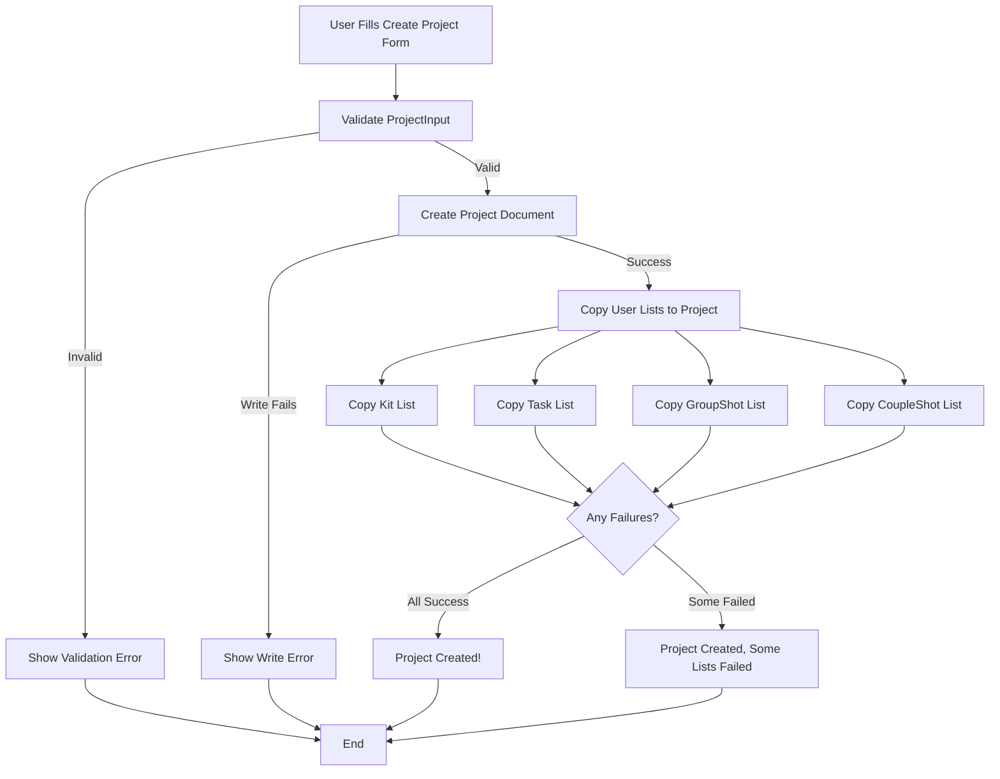
```mermaid
graph TD
    Start[User Fills Create Project Form] --> Validate[Validate ProjectInput]
    Validate -->|Invalid| Error1[Show Validation Error]
    Validate -->|Valid| CreateDoc[Create Project Document]
    CreateDoc -->|Write Fails| Error2[Show Write Error]
    CreateDoc -->|Success| CopyLists[Copy User Lists to Project]
    CopyLists --> CopyKit[Copy Kit List]
    CopyLists --> CopyTask[Copy Task List]
    CopyLists --> CopyGroupShot[Copy GroupShot List]
    CopyLists --> CopyCoupleShot[Copy CoupleShot List]
    CopyKit --> CheckFailures{Any Failures?}
    CopyTask --> CheckFailures
    CopyGroupShot --> CheckFailures
    CopyCoupleShot --> CheckFailures
    CheckFailures -->|All Success| Success[Project Created!]
    CheckFailures -->|Some Failed| PartialSuccess[Project Created, Some Lists Failed]
    Error1 --> End[End]
    Error2 --> End
    Success --> End
    PartialSuccess --> End
```

### Update Project Summary

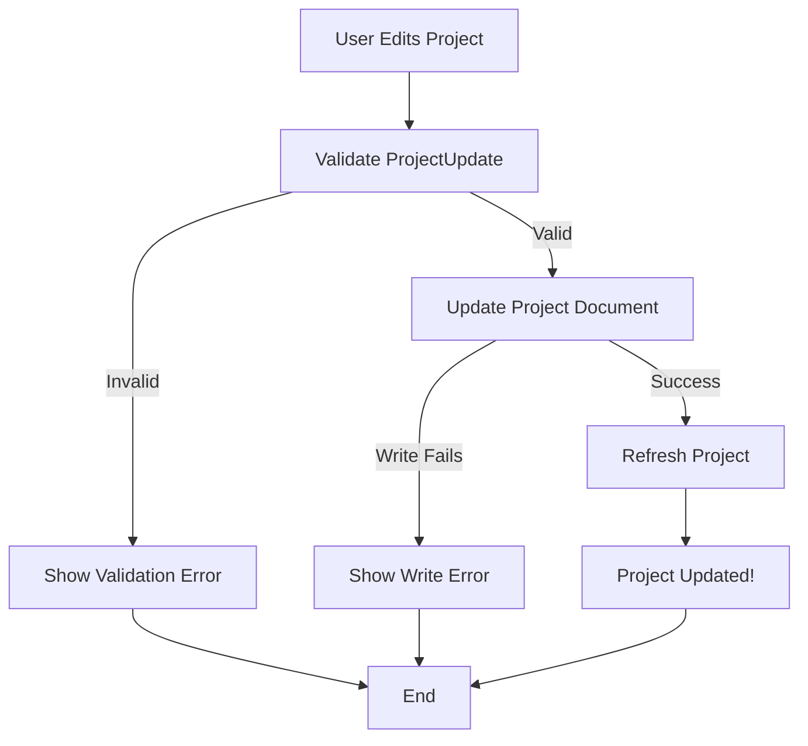
```mermaid
graph TD
    Start[User Edits Project] --> Validate[Validate ProjectUpdate]
    Validate -->|Invalid| Error1[Show Validation Error]
    Validate -->|Valid| Update[Update Project Document]
    Update -->|Write Fails| Error2[Show Write Error]
    Update -->|Success| Refresh[Refresh Project]
    Refresh --> Success[Project Updated!]
    Error1 --> End[End]
    Error2 --> End
    Success --> End
```

---

## Key Takeaways

1. **Project Operations**:
   - Create Project: Creates project document and initializes subcollections
   - Get Project by ID: Fetches single project with validation
   - Get Projects for User: Lists all projects for a user
   - Update Project: Updates project with partial validation
   - Delete Project: Removes project document
   - Subscribe to User Projects: Real-time updates for user's projects
   - Get Project for Launch: Validates project before launch

2. **Subcollection Initialization**:
   - Copies user lists (kit, task, groupShot, coupleShot) to project
   - Falls back to master lists if user lists don't exist
   - Executes in parallel (Promise.all)
   - Failures are aggregated but don't block project creation
   - Each list stored in: `projects/{projectId}/lists/{listType}/data`

3. **Data Structure**:
   - Project stored in `projects` collection
   - Documents queried by `userId` field
   - Contains projectInfo, photographerName, portal info, metadata
   - Subcollections for lists, timeline, locations

4. **Validation**:
   - Input validated with `projectInputSchema`
   - Updates validated with `projectUpdateSchema` (partial)
   - Complete project validated with `projectSchema`
   - PersonInfo and ContactInfo validated through their schemas
   - String fields automatically trimmed via Zod

5. **Error Handling**:
   - Comprehensive error handling with user-friendly messages
   - Subcollection failures aggregated into single error
   - Project creation succeeds even if some subcollections fail
   - Retry support for retryable errors

6. **Real-time Updates**:
   - Firestore `onSnapshot` on query for user's projects
   - Automatic updates when projects change
   - Unsubscribe on component unmount

7. **Repository Pattern**:
   - Dedicated IProjectRepository (not generic)
   - Collection-based structure (not subcollection)
   - Query-based operations (listByUserId)

8. **Service Layer**:
   - ProjectService handles business logic
   - Orchestrates subcollection initialization
   - Validates input before repository
   - Aggregates subcollection errors

9. **Key Differences from Other Entities**:
   - Collection-based (not subcollection)
   - Requires subcollection initialization on create
   - Parallel list copying
   - Aggregated error handling for subcollections
   - Real-time subscriptions on queries (not single document)

10. **User Experience**:
    - Projects created with all lists ready to use
    - Graceful handling of partial failures
    - Real-time updates across devices
    - Fast project creation with parallel operations

11. **Orchestration**:
    - `createProject` is an orchestration method
    - Coordinates project creation + subcollection initialization
    - Uses Promise.all for parallel execution
    - Collects and reports failures

12. **Photographer Name**:
    - Automatically set from user profile
    - Not provided in ProjectInput
    - Set during project creation in repository

---

*Document generated: 2025-01-XX*
*Last updated: Based on current codebase structure*

