# Complete Timeline Flow Documentation

## Overview

This document traces **all** Timeline processes for managing event timelines in projects. The Timeline system manages time-based events with status calculation, timing validation, conflict detection, and real-time updates.

---

## Table of Contents

1. [High-Level Flow Overview](#high-level-flow-overview)
2. [Detailed Process Flows](#detailed-process-flows)
   - [Create Initial](#create-initial-flow)
   - [Get Timeline](#get-timeline-flow)
   - [Update Config](#update-config-flow)
   - [Add Event](#add-event-flow)
   - [Update Event](#update-event-flow)
   - [Delete Event](#delete-event-flow)
   - [Set Events (Batch)](#set-events-batch-flow)
   - [Subscribe (Real-time)](#subscribe-real-time-flow)
3. [Business Logic Methods](#business-logic-methods)
   - [Status Calculation](#status-calculation)
   - [Event Timing Validation](#event-timing-validation)
   - [Event State Queries](#event-state-queries)
4. [UI Component Structure](#ui-component-structure)
5. [Data Structures](#data-structures)
6. [Input Validation](#input-validation)
7. [Sanitization Process](#sanitization-process)
8. [Loading States](#loading-states)
9. [Error Handling](#error-handling)
10. [Finalization Guard](#finalization-guard)
11. [File Structure & Function Calls](#file-structure--function-calls)
12. [Hooks Usage (Placeholder)](#hooks-usage-placeholder)
13. [Ports & Adapters](#ports--adapters)
14. [Simple Explanation](#simple-explanation)

---

## High-Level Flow Overview

### Timeline Operations Overview

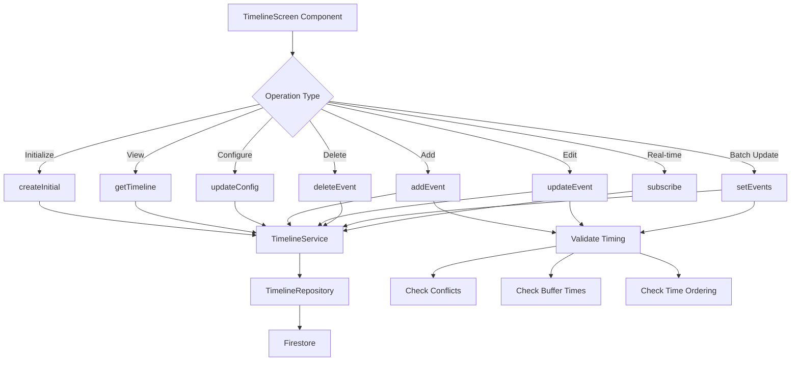
```mermaid
graph TD
    A[TimelineScreen Component] --> B{Operation Type}
    B -->|Initialize| C[createInitial]
    B -->|View| D[getTimeline]
    B -->|Configure| E[updateConfig]
    B -->|Add| F[addEvent]
    B -->|Edit| G[updateEvent]
    B -->|Delete| H[deleteEvent]
    B -->|Batch Update| I[setEvents]
    B -->|Real-time| J[subscribe]

    C --> K[TimelineService]
    D --> K
    E --> K
    F --> K
    G --> K
    H --> K
    I --> K
    J --> K

    K --> L[TimelineRepository]
    L --> M[Firestore]

    F --> N[Validate Timing]
    G --> N
    I --> N
    N --> O[Check Conflicts]
    N --> P[Check Buffer Times]
    N --> Q[Check Time Ordering]
```

### Core Timeline Flow

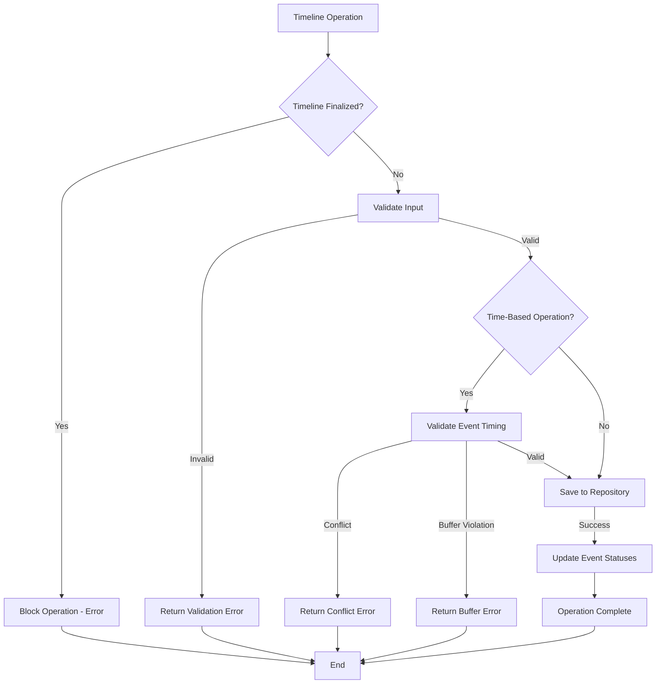
```mermaid
graph TD
    Start[Timeline Operation] --> CheckFinalized{Timeline Finalized?}
    CheckFinalized -->|Yes| Block[Block Operation - Error]
    CheckFinalized -->|No| Validate[Validate Input]
    Validate -->|Invalid| Error1[Return Validation Error]
    Validate -->|Valid| TimeCheck{Time-Based Operation?}
    TimeCheck -->|Yes| TimingValidation[Validate Event Timing]
    TimeCheck -->|No| Save[Save to Repository]
    TimingValidation -->|Conflict| Error2[Return Conflict Error]
    TimingValidation -->|Buffer Violation| Error3[Return Buffer Error]
    TimingValidation -->|Valid| Save
    Save -->|Success| UpdateStatus[Update Event Statuses]
    UpdateStatus --> Success[Operation Complete]
    Block --> End[End]
    Error1 --> End
    Error2 --> End
    Error3 --> End
    Success --> End
```

---

## Detailed Process Flows

### Create Initial Flow

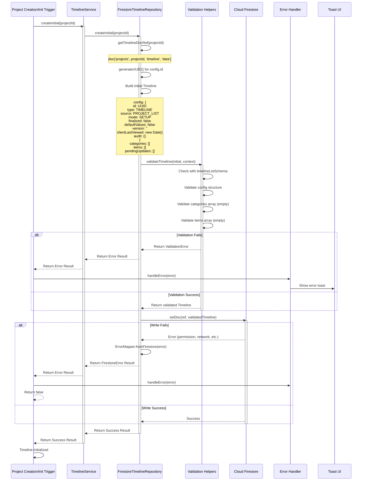
```mermaid
sequenceDiagram
    participant Trigger as Project Creation/Init Trigger
    participant Service as TimelineService
    participant Repo as FirestoreTimelineRepository
    participant Validate as Validation Helpers
    participant Firestore as Cloud Firestore
    participant ErrorHandler as Error Handler
    participant Toast as Toast UI

    Trigger->>Service: createInitial(projectId)
    activate Service
    Service->>Repo: createInitial(projectId)
    activate Repo

    Repo->>Repo: getTimelineDocRef(projectId)
    Note over Repo: doc('projects', projectId, 'timeline', 'data')

    Repo->>Repo: generateUUID() for config.id
    Repo->>Repo: Build initial Timeline
    Note over Repo: config: {<br/>id: UUID<br/>type: TIMELINE<br/>source: PROJECT_LIST<br/>mode: SETUP<br/>finalized: false<br/>defaultValues: false<br/>version: ''<br/>clientLastViewed: new Date()<br/>audit: {}<br/>}<br/>categories: []<br/>items: []<br/>pendingUpdates: []

    Repo->>Validate: validateTimeline(initial, context)
    activate Validate
    Validate->>Validate: Check with timelineListSchema
    Validate->>Validate: Validate config structure
    Validate->>Validate: Validate categories array (empty)
    Validate->>Validate: Validate items array (empty)
    alt Validation Fails
        Validate-->>Repo: Return ValidationError
        Repo-->>Service: Return Error Result
        Service-->>Trigger: Return Error Result
        Trigger->>ErrorHandler: handleError(error)
        ErrorHandler->>Toast: Show error toast
    else Validation Success
        Validate-->>Repo: Return validated Timeline
    end
    deactivate Validate

    Repo->>Firestore: setDoc(ref, validatedTimeline)
    activate Firestore
    alt Write Fails
        Firestore-->>Repo: Error (permission, network, etc.)
        Repo->>Repo: ErrorMapper.fromFirestore(error)
        Repo-->>Service: Return FirestoreError Result
        Service-->>Trigger: Return Error Result
        Trigger->>ErrorHandler: handleError(error)
        Trigger-->>Trigger: Return false
    else Write Success
        Firestore-->>Repo: Success
    end
    deactivate Firestore

    Repo-->>Service: Return Success Result
    deactivate Repo

    Service-->>Trigger: Return Success Result
    deactivate Service

    Trigger->>Trigger: Timeline initialized
```

### Get Timeline Flow

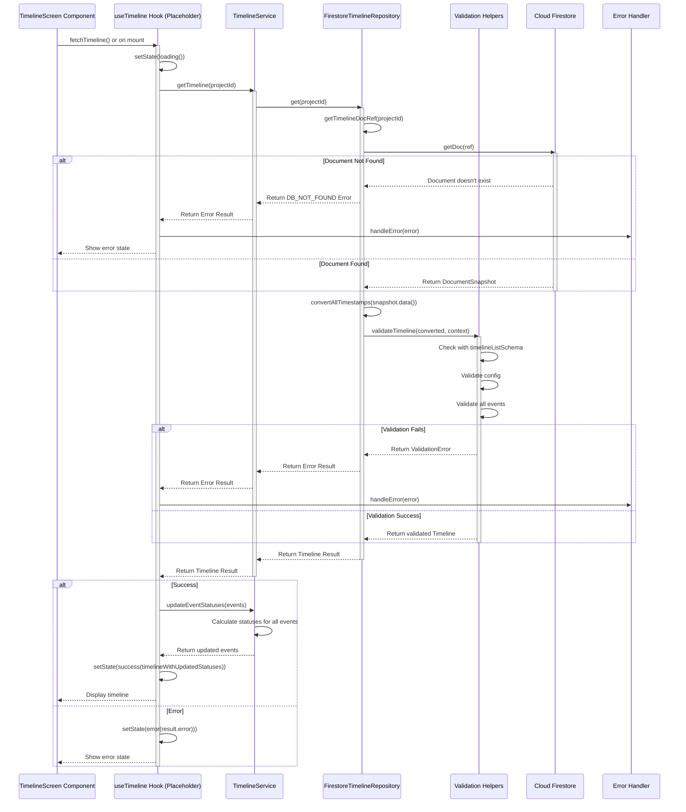
```mermaid
sequenceDiagram
    participant UI as TimelineScreen Component
    participant Hook as useTimeline Hook (Placeholder)
    participant Service as TimelineService
    participant Repo as FirestoreTimelineRepository
    participant Validate as Validation Helpers
    participant Firestore as Cloud Firestore
    participant ErrorHandler as Error Handler

    UI->>Hook: fetchTimeline() or on mount
    activate Hook
    Hook->>Hook: setState(loading())
    Hook->>Service: getTimeline(projectId)
    activate Service

    Service->>Repo: get(projectId)
    activate Repo

    Repo->>Repo: getTimelineDocRef(projectId)
    Repo->>Firestore: getDoc(ref)
    activate Firestore
    alt Document Not Found
        Firestore-->>Repo: Document doesn't exist
        Repo-->>Service: Return DB_NOT_FOUND Error
        Service-->>Hook: Return Error Result
        Hook->>ErrorHandler: handleError(error)
        Hook-->>UI: Show error state
    else Document Found
        Firestore-->>Repo: Return DocumentSnapshot
    end
    deactivate Firestore

    Repo->>Repo: convertAllTimestamps(snapshot.data())
    Repo->>Validate: validateTimeline(converted, context)
    activate Validate
    Validate->>Validate: Check with timelineListSchema
    Validate->>Validate: Validate config
    Validate->>Validate: Validate all events
    alt Validation Fails
        Validate-->>Repo: Return ValidationError
        Repo-->>Service: Return Error Result
        Service-->>Hook: Return Error Result
        Hook->>ErrorHandler: handleError(error)
    else Validation Success
        Validate-->>Repo: Return validated Timeline
    end
    deactivate Validate

    Repo-->>Service: Return Timeline Result
    deactivate Repo

    Service-->>Hook: Return Timeline Result
    deactivate Service

    alt Success
        Hook->>Service: updateEventStatuses(events)
        Service->>Service: Calculate statuses for all events
        Service-->>Hook: Return updated events
        Hook->>Hook: setState(success(timelineWithUpdatedStatuses))
        Hook-->>UI: Display timeline
    else Error
        Hook->>Hook: setState(error(result.error)))
        Hook-->>UI: Show error state
    end
    deactivate Hook
```

### Update Config Flow

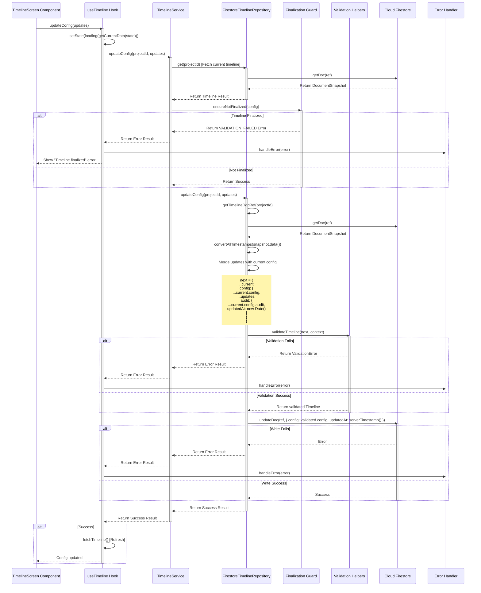
```mermaid
sequenceDiagram
    participant UI as TimelineScreen Component
    participant Hook as useTimeline Hook
    participant Service as TimelineService
    participant Repo as FirestoreTimelineRepository
    participant Guard as Finalization Guard
    participant Validate as Validation Helpers
    participant Firestore as Cloud Firestore
    participant ErrorHandler as Error Handler

    UI->>Hook: updateConfig(updates)
    activate Hook
    Hook->>Hook: setState(loading(getCurrentData(state)))
    Hook->>Service: updateConfig(projectId, updates)
    activate Service

    Service->>Repo: get(projectId) [Fetch current timeline]
    activate Repo
    Repo->>Firestore: getDoc(ref)
    Firestore-->>Repo: Return DocumentSnapshot
    Repo-->>Service: Return Timeline Result
    deactivate Repo

    Service->>Guard: ensureNotFinalized(config)
    activate Guard
    alt Timeline Finalized
        Guard-->>Service: Return VALIDATION_FAILED Error
        Service-->>Hook: Return Error Result
        Hook->>ErrorHandler: handleError(error)
        Hook-->>UI: Show "Timeline finalized" error
    else Not Finalized
        Guard-->>Service: Return Success
    end
    deactivate Guard

    Service->>Repo: updateConfig(projectId, updates)
    activate Repo

    Repo->>Repo: getTimelineDocRef(projectId)
    Repo->>Firestore: getDoc(ref)
    Firestore-->>Repo: Return DocumentSnapshot
    Repo->>Repo: convertAllTimestamps(snapshot.data())
    Repo->>Repo: Merge updates with current config
    Note over Repo: next = {<br/>...current,<br/>config: {<br/>...current.config,<br/>...updates,<br/>audit: {<br/>...current.config.audit,<br/>updatedAt: new Date()<br/>}<br/>}<br/>}

    Repo->>Validate: validateTimeline(next, context)
    activate Validate
    alt Validation Fails
        Validate-->>Repo: Return ValidationError
        Repo-->>Service: Return Error Result
        Service-->>Hook: Return Error Result
        Hook->>ErrorHandler: handleError(error)
    else Validation Success
        Validate-->>Repo: Return validated Timeline
    end
    deactivate Validate

    Repo->>Firestore: updateDoc(ref, { config: validated.config, updatedAt: serverTimestamp() })
    activate Firestore
    alt Write Fails
        Firestore-->>Repo: Error
        Repo-->>Service: Return Error Result
        Service-->>Hook: Return Error Result
        Hook->>ErrorHandler: handleError(error)
    else Write Success
        Firestore-->>Repo: Success
    end
    deactivate Firestore

    Repo-->>Service: Return Success Result
    deactivate Repo

    Service-->>Hook: Return Success Result
    deactivate Service

    alt Success
        Hook->>Hook: fetchTimeline() [Refresh]
        Hook-->>UI: Config updated
    end
    deactivate Hook
```

### Add Event Flow

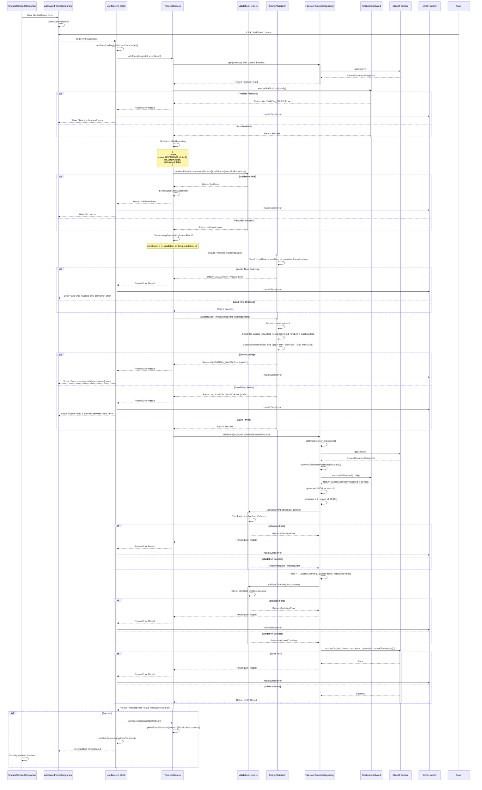
```mermaid
sequenceDiagram
    participant UI as TimelineScreen Component
    participant Form as AddEventForm Component
    participant Hook as useTimeline Hook
    participant Service as TimelineService
    participant Validate as Validation Helpers
    participant Timing as Timing Validation
    participant Repo as FirestoreTimelineRepository
    participant Guard as Finalization Guard
    participant Firestore as Cloud Firestore
    participant ErrorHandler as Error Handler

    UI->>Form: User fills Add Event form
    Form->>Form: Client-side validation
    User->>Form: Click "Add Event" button
    Form->>Hook: addEvent(eventInput)
    activate Hook

    Hook->>Hook: setState(loading(getCurrentData(state)))
    Hook->>Service: addEvent(projectId, eventInput)
    activate Service

    Service->>Repo: get(projectId) [Get current timeline]
    activate Repo
    Repo->>Firestore: getDoc(ref)
    Firestore-->>Repo: Return DocumentSnapshot
    Repo-->>Service: Return Timeline Result
    deactivate Repo

    Service->>Guard: ensureNotFinalized(config)
    activate Guard
    alt Timeline Finalized
        Guard-->>Service: Return VALIDATION_FAILED Error
        Service-->>Hook: Return Error Result
        Hook->>ErrorHandler: handleError(error)
        Hook-->>Form: Show "Timeline finalized" error
    else Not Finalized
        Guard-->>Service: Return Success
    end
    deactivate Guard

    Service->>Service: Build eventForRepository
    Note over Service: {<br/>...event,<br/>status: UPCOMING (default),<br/>isCustom: false,<br/>isDisabled: false<br/>}

    Service->>Validate: timelineEventSchema.omit({id: true}).safeParse(eventForRepository)
    activate Validate
    alt Validation Fails
        Validate-->>Service: Return ZodError
        Service->>Service: ErrorMapper.fromZod(error)
        Service-->>Hook: Return ValidationError
        Hook->>ErrorHandler: handleError(error)
        Hook-->>Form: Show field errors
    else Validation Success
        Validate-->>Service: Return validated event
    end
    deactivate Validate

    Service->>Service: Create tempEvent with placeholder ID
    Note over Service: tempEvent = { ...validated, id: 'temp-validation-id' }

    Service->>Timing: ensureTimeOrdering(tempEvent)
    activate Timing
    Timing->>Timing: Check if endTime > startTime (or calculate from duration)
    alt Invalid Time Ordering
        Timing-->>Service: Return VALIDATION_FAILED Error
        Service-->>Hook: Return Error Result
        Hook->>ErrorHandler: handleError(error)
        Hook-->>Form: Show "End time must be after start time" error
    else Valid Time Ordering
        Timing-->>Service: Return Success
    end
    deactivate Timing

    Service->>Timing: validateEventTiming(tempEvent, existingEvents)
    activate Timing
    Timing->>Timing: For each existing event:
    Timing->>Timing: Check for overlap (newStart < existingEnd && newEnd > existingStart)
    Timing->>Timing: Check minimum buffer time (gap < MIN_BUFFER_TIME_MINUTES)
    alt Event Overlaps
        Timing-->>Service: Return VALIDATION_FAILED Error (conflict)
        Service-->>Hook: Return Error Result
        Hook->>ErrorHandler: handleError(error)
        Hook-->>Form: Show "Event overlaps with [event name]" error
    else Insufficient Buffer
        Timing-->>Service: Return VALIDATION_FAILED Error (buffer)
        Service-->>Hook: Return Error Result
        Hook->>ErrorHandler: handleError(error)
        Hook-->>Form: Show "Events need 5 minutes between them" error
    else Valid Timing
        Timing-->>Service: Return Success
    end
    deactivate Timing

    Service->>Repo: addEvent(projectId, validatedEventWithoutId)
    activate Repo

    Repo->>Repo: getTimelineDocRef(projectId)
    Repo->>Firestore: getDoc(ref)
    Firestore-->>Repo: Return DocumentSnapshot
    Repo->>Repo: convertAllTimestamps(snapshot.data())
    Repo->>Guard: ensureNotFinalized(config)
    Guard-->>Repo: Return Success (already checked in service)

    Repo->>Repo: generateUUID() for event.id
    Repo->>Repo: candidate = { ...input, id: UUID }

    Repo->>Validate: validateEvent(candidate, context)
    activate Validate
    Validate->>Validate: Check with timelineEventSchema
    alt Validation Fails
        Validate-->>Repo: Return ValidationError
        Repo-->>Service: Return Error Result
        Service-->>Hook: Return Error Result
        Hook->>ErrorHandler: handleError(error)
    else Validation Success
        Validate-->>Repo: Return validated TimelineEvent
    end
    deactivate Validate

    Repo->>Repo: next = { ...current, items: [...current.items, validatedEvent] }

    Repo->>Validate: validateTimeline(next, context)
    activate Validate
    Validate->>Validate: Check complete timeline structure
    alt Validation Fails
        Validate-->>Repo: Return ValidationError
        Repo-->>Service: Return Error Result
        Service-->>Hook: Return Error Result
        Hook->>ErrorHandler: handleError(error)
    else Validation Success
        Validate-->>Repo: Return validated Timeline
    end
    deactivate Validate

    Repo->>Firestore: updateDoc(ref, { items: next.items, updatedAt: serverTimestamp() })
    activate Firestore
    alt Write Fails
        Firestore-->>Repo: Error
        Repo-->>Service: Return Error Result
        Service-->>Hook: Return Error Result
        Hook->>ErrorHandler: handleError(error)
    else Write Success
        Firestore-->>Repo: Success
        Repo-->>Service: Return UUID Result
    end
    deactivate Firestore

    Service-->>Hook: Return TimelineEvent Result (with generated ID)
    deactivate Service

    alt Success
        Hook->>Service: getTimeline(projectId) [Refresh]
        Service->>Service: updateEventStatuses(events) [Recalculate statuses]
        Hook->>Hook: setState(success(updatedTimeline))
        Hook-->>Form: Event added, form cleared
        UI->>UI: Display updated timeline
    end
    deactivate Hook
```

### Update Event Flow

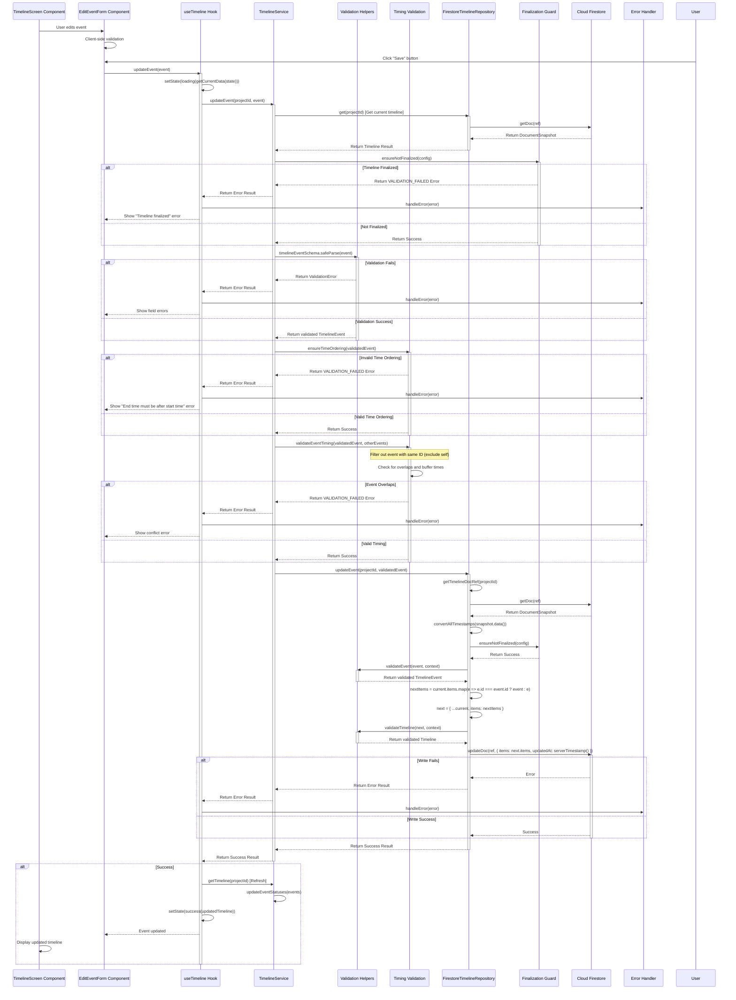
```mermaid
sequenceDiagram
    participant UI as TimelineScreen Component
    participant Form as EditEventForm Component
    participant Hook as useTimeline Hook
    participant Service as TimelineService
    participant Validate as Validation Helpers
    participant Timing as Timing Validation
    participant Repo as FirestoreTimelineRepository
    participant Guard as Finalization Guard
    participant Firestore as Cloud Firestore
    participant ErrorHandler as Error Handler

    UI->>Form: User edits event
    Form->>Form: Client-side validation
    User->>Form: Click "Save" button
    Form->>Hook: updateEvent(event)
    activate Hook

    Hook->>Hook: setState(loading(getCurrentData(state)))
    Hook->>Service: updateEvent(projectId, event)
    activate Service

    Service->>Repo: get(projectId) [Get current timeline]
    activate Repo
    Repo->>Firestore: getDoc(ref)
    Firestore-->>Repo: Return DocumentSnapshot
    Repo-->>Service: Return Timeline Result
    deactivate Repo

    Service->>Guard: ensureNotFinalized(config)
    activate Guard
    alt Timeline Finalized
        Guard-->>Service: Return VALIDATION_FAILED Error
        Service-->>Hook: Return Error Result
        Hook->>ErrorHandler: handleError(error)
        Hook-->>Form: Show "Timeline finalized" error
    else Not Finalized
        Guard-->>Service: Return Success
    end
    deactivate Guard

    Service->>Validate: timelineEventSchema.safeParse(event)
    activate Validate
    alt Validation Fails
        Validate-->>Service: Return ValidationError
        Service-->>Hook: Return Error Result
        Hook->>ErrorHandler: handleError(error)
        Hook-->>Form: Show field errors
    else Validation Success
        Validate-->>Service: Return validated TimelineEvent
    end
    deactivate Validate

    Service->>Timing: ensureTimeOrdering(validatedEvent)
    activate Timing
    alt Invalid Time Ordering
        Timing-->>Service: Return VALIDATION_FAILED Error
        Service-->>Hook: Return Error Result
        Hook->>ErrorHandler: handleError(error)
        Hook-->>Form: Show "End time must be after start time" error
    else Valid Time Ordering
        Timing-->>Service: Return Success
    end
    deactivate Timing

    Service->>Timing: validateEventTiming(validatedEvent, otherEvents)
    activate Timing
    Note over Timing: Filter out event with same ID (exclude self)
    Timing->>Timing: Check for overlaps and buffer times
    alt Event Overlaps
        Timing-->>Service: Return VALIDATION_FAILED Error
        Service-->>Hook: Return Error Result
        Hook->>ErrorHandler: handleError(error)
        Hook-->>Form: Show conflict error
    else Valid Timing
        Timing-->>Service: Return Success
    end
    deactivate Timing

    Service->>Repo: updateEvent(projectId, validatedEvent)
    activate Repo

    Repo->>Repo: getTimelineDocRef(projectId)
    Repo->>Firestore: getDoc(ref)
    Firestore-->>Repo: Return DocumentSnapshot
    Repo->>Repo: convertAllTimestamps(snapshot.data())
    Repo->>Guard: ensureNotFinalized(config)
    Guard-->>Repo: Return Success

    Repo->>Validate: validateEvent(event, context)
    activate Validate
    Validate-->>Repo: Return validated TimelineEvent
    deactivate Validate

    Repo->>Repo: nextItems = current.items.map(e => e.id === event.id ? event : e)
    Repo->>Repo: next = { ...current, items: nextItems }

    Repo->>Validate: validateTimeline(next, context)
    activate Validate
    Validate-->>Repo: Return validated Timeline
    deactivate Validate

    Repo->>Firestore: updateDoc(ref, { items: next.items, updatedAt: serverTimestamp() })
    activate Firestore
    alt Write Fails
        Firestore-->>Repo: Error
        Repo-->>Service: Return Error Result
        Service-->>Hook: Return Error Result
        Hook->>ErrorHandler: handleError(error)
    else Write Success
        Firestore-->>Repo: Success
    end
    deactivate Firestore

    Repo-->>Service: Return Success Result
    deactivate Repo

    Service-->>Hook: Return Success Result
    deactivate Service

    alt Success
        Hook->>Service: getTimeline(projectId) [Refresh]
        Service->>Service: updateEventStatuses(events)
        Hook->>Hook: setState(success(updatedTimeline))
        Hook-->>Form: Event updated
        UI->>UI: Display updated timeline
    end
    deactivate Hook
```

### Delete Event Flow

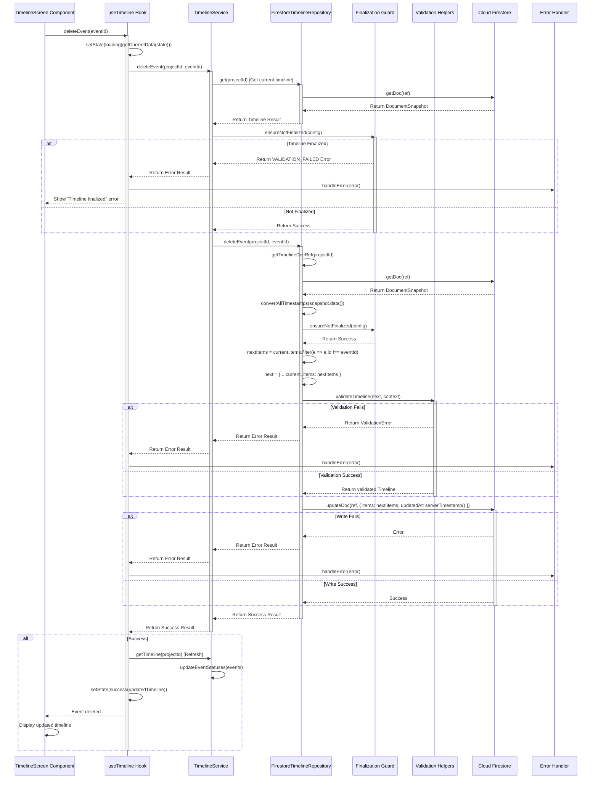
```mermaid
sequenceDiagram
    participant UI as TimelineScreen Component
    participant Hook as useTimeline Hook
    participant Service as TimelineService
    participant Repo as FirestoreTimelineRepository
    participant Guard as Finalization Guard
    participant Validate as Validation Helpers
    participant Firestore as Cloud Firestore
    participant ErrorHandler as Error Handler

    UI->>Hook: deleteEvent(eventId)
    activate Hook

    Hook->>Hook: setState(loading(getCurrentData(state)))
    Hook->>Service: deleteEvent(projectId, eventId)
    activate Service

    Service->>Repo: get(projectId) [Get current timeline]
    activate Repo
    Repo->>Firestore: getDoc(ref)
    Firestore-->>Repo: Return DocumentSnapshot
    Repo-->>Service: Return Timeline Result
    deactivate Repo

    Service->>Guard: ensureNotFinalized(config)
    activate Guard
    alt Timeline Finalized
        Guard-->>Service: Return VALIDATION_FAILED Error
        Service-->>Hook: Return Error Result
        Hook->>ErrorHandler: handleError(error)
        Hook-->>UI: Show "Timeline finalized" error
    else Not Finalized
        Guard-->>Service: Return Success
    end
    deactivate Guard

    Service->>Repo: deleteEvent(projectId, eventId)
    activate Repo

    Repo->>Repo: getTimelineDocRef(projectId)
    Repo->>Firestore: getDoc(ref)
    Firestore-->>Repo: Return DocumentSnapshot
    Repo->>Repo: convertAllTimestamps(snapshot.data())
    Repo->>Guard: ensureNotFinalized(config)
    Guard-->>Repo: Return Success

    Repo->>Repo: nextItems = current.items.filter(e => e.id !== eventId)
    Repo->>Repo: next = { ...current, items: nextItems }

    Repo->>Validate: validateTimeline(next, context)
    activate Validate
    alt Validation Fails
        Validate-->>Repo: Return ValidationError
        Repo-->>Service: Return Error Result
        Service-->>Hook: Return Error Result
        Hook->>ErrorHandler: handleError(error)
    else Validation Success
        Validate-->>Repo: Return validated Timeline
    end
    deactivate Validate

    Repo->>Firestore: updateDoc(ref, { items: next.items, updatedAt: serverTimestamp() })
    activate Firestore
    alt Write Fails
        Firestore-->>Repo: Error
        Repo-->>Service: Return Error Result
        Service-->>Hook: Return Error Result
        Hook->>ErrorHandler: handleError(error)
    else Write Success
        Firestore-->>Repo: Success
    end
    deactivate Firestore

    Repo-->>Service: Return Success Result
    deactivate Repo

    Service-->>Hook: Return Success Result
    deactivate Service

    alt Success
        Hook->>Service: getTimeline(projectId) [Refresh]
        Service->>Service: updateEventStatuses(events)
        Hook->>Hook: setState(success(updatedTimeline))
        Hook-->>UI: Event deleted
        UI->>UI: Display updated timeline
    end
    deactivate Hook
```

### Set Events (Batch) Flow

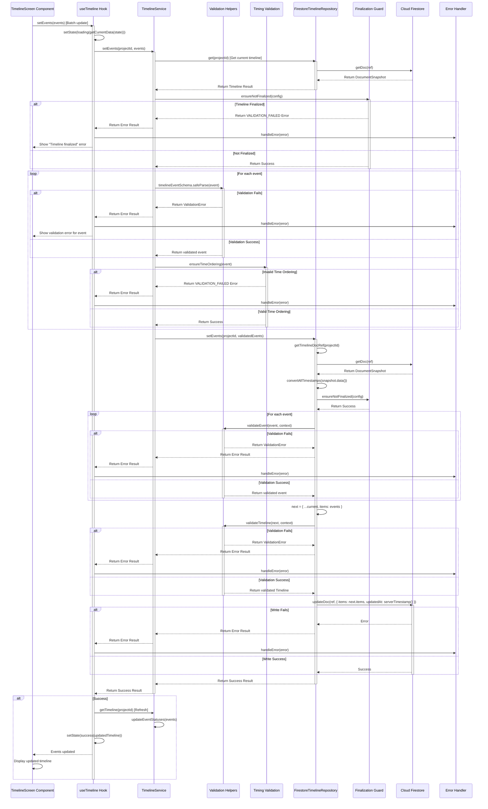
```mermaid
sequenceDiagram
    participant UI as TimelineScreen Component
    participant Hook as useTimeline Hook
    participant Service as TimelineService
    participant Validate as Validation Helpers
    participant Timing as Timing Validation
    participant Repo as FirestoreTimelineRepository
    participant Guard as Finalization Guard
    participant Firestore as Cloud Firestore
    participant ErrorHandler as Error Handler

    UI->>Hook: setEvents(events) [Batch update]
    activate Hook

    Hook->>Hook: setState(loading(getCurrentData(state)))
    Hook->>Service: setEvents(projectId, events)
    activate Service

    Service->>Repo: get(projectId) [Get current timeline]
    activate Repo
    Repo->>Firestore: getDoc(ref)
    Firestore-->>Repo: Return DocumentSnapshot
    Repo-->>Service: Return Timeline Result
    deactivate Repo

    Service->>Guard: ensureNotFinalized(config)
    activate Guard
    alt Timeline Finalized
        Guard-->>Service: Return VALIDATION_FAILED Error
        Service-->>Hook: Return Error Result
        Hook->>ErrorHandler: handleError(error)
        Hook-->>UI: Show "Timeline finalized" error
    else Not Finalized
        Guard-->>Service: Return Success
    end
    deactivate Guard

    loop For each event
        Service->>Validate: timelineEventSchema.safeParse(event)
        activate Validate
        alt Validation Fails
            Validate-->>Service: Return ValidationError
            Service-->>Hook: Return Error Result
            Hook->>ErrorHandler: handleError(error)
            Hook-->>UI: Show validation error for event
        else Validation Success
            Validate-->>Service: Return validated event
        end
        deactivate Validate

        Service->>Timing: ensureTimeOrdering(event)
        activate Timing
        alt Invalid Time Ordering
            Timing-->>Service: Return VALIDATION_FAILED Error
            Service-->>Hook: Return Error Result
            Hook->>ErrorHandler: handleError(error)
        else Valid Time Ordering
            Timing-->>Service: Return Success
        end
        deactivate Timing
    end

    Service->>Repo: setEvents(projectId, validatedEvents)
    activate Repo

    Repo->>Repo: getTimelineDocRef(projectId)
    Repo->>Firestore: getDoc(ref)
    Firestore-->>Repo: Return DocumentSnapshot
    Repo->>Repo: convertAllTimestamps(snapshot.data())
    Repo->>Guard: ensureNotFinalized(config)
    Guard-->>Repo: Return Success

    loop For each event
        Repo->>Validate: validateEvent(event, context)
        activate Validate
        alt Validation Fails
            Validate-->>Repo: Return ValidationError
            Repo-->>Service: Return Error Result
            Service-->>Hook: Return Error Result
            Hook->>ErrorHandler: handleError(error)
        else Validation Success
            Validate-->>Repo: Return validated event
        end
        deactivate Validate
    end

    Repo->>Repo: next = { ...current, items: events }

    Repo->>Validate: validateTimeline(next, context)
    activate Validate
    alt Validation Fails
        Validate-->>Repo: Return ValidationError
        Repo-->>Service: Return Error Result
        Service-->>Hook: Return Error Result
        Hook->>ErrorHandler: handleError(error)
    else Validation Success
        Validate-->>Repo: Return validated Timeline
    end
    deactivate Validate

    Repo->>Firestore: updateDoc(ref, { items: next.items, updatedAt: serverTimestamp() })
    activate Firestore
    alt Write Fails
        Firestore-->>Repo: Error
        Repo-->>Service: Return Error Result
        Service-->>Hook: Return Error Result
        Hook->>ErrorHandler: handleError(error)
    else Write Success
        Firestore-->>Repo: Success
    end
    deactivate Firestore

    Repo-->>Service: Return Success Result
    deactivate Repo

    Service-->>Hook: Return Success Result
    deactivate Service

    alt Success
        Hook->>Service: getTimeline(projectId) [Refresh]
        Service->>Service: updateEventStatuses(events)
        Hook->>Hook: setState(success(updatedTimeline))
        Hook-->>UI: Events updated
        UI->>UI: Display updated timeline
    end
    deactivate Hook
```

### Subscribe (Real-time) Flow

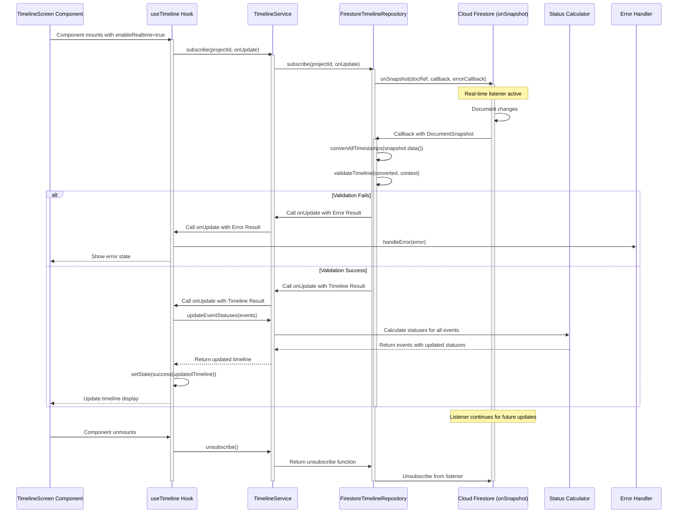
```mermaid
sequenceDiagram
    participant UI as TimelineScreen Component
    participant Hook as useTimeline Hook
    participant Service as TimelineService
    participant Repo as FirestoreTimelineRepository
    participant Firestore as Cloud Firestore (onSnapshot)
    participant StatusCalc as Status Calculator
    participant ErrorHandler as Error Handler

    UI->>Hook: Component mounts with enableRealtime=true
    activate Hook

    Hook->>Service: subscribe(projectId, onUpdate)
    activate Service

    Service->>Repo: subscribe(projectId, onUpdate)
    activate Repo

    Repo->>Firestore: onSnapshot(docRef, callback, errorCallback)
    activate Firestore
    Note over Firestore: Real-time listener active

    Firestore->>Firestore: Document changes
    Firestore->>Repo: Callback with DocumentSnapshot
    activate Repo

    Repo->>Repo: convertAllTimestamps(snapshot.data())
    Repo->>Repo: validateTimeline(converted, context)

    alt Validation Fails
        Repo->>Service: Call onUpdate with Error Result
        Service->>Hook: Call onUpdate with Error Result
        Hook->>ErrorHandler: handleError(error)
        Hook-->>UI: Show error state
    else Validation Success
        Repo->>Service: Call onUpdate with Timeline Result
        Service->>Hook: Call onUpdate with Timeline Result

        Hook->>Service: updateEventStatuses(events)
        Service->>StatusCalc: Calculate statuses for all events
        StatusCalc-->>Service: Return events with updated statuses
        Service-->>Hook: Return updated timeline

        Hook->>Hook: setState(success(updatedTimeline))
        Hook-->>UI: Update timeline display
    end
    deactivate Repo

    Note over Firestore: Listener continues for future updates

    UI->>Hook: Component unmounts
    Hook->>Service: unsubscribe()
    Service->>Repo: Return unsubscribe function
    Repo->>Firestore: Unsubscribe from listener
    deactivate Firestore
    deactivate Repo
    deactivate Service
    deactivate Hook
```

---

## Business Logic Methods

### Status Calculation

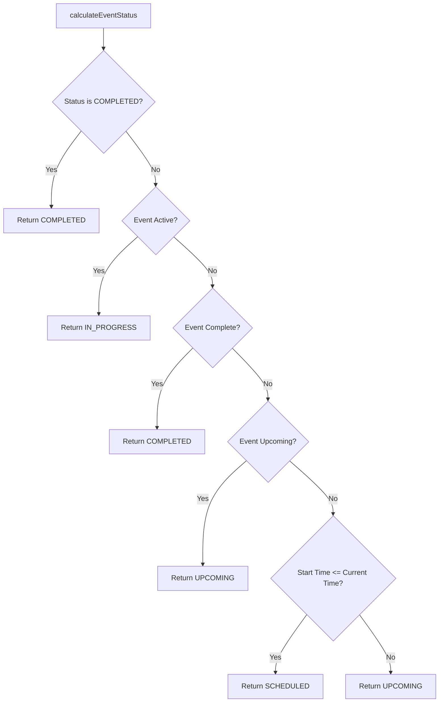
```mermaid
graph TD
    A[calculateEventStatus] --> B{Status is COMPLETED?}
    B -->|Yes| C[Return COMPLETED]
    B -->|No| D{Event Active?}
    D -->|Yes| E[Return IN_PROGRESS]
    D -->|No| F{Event Complete?}
    F -->|Yes| G[Return COMPLETED]
    F -->|No| H{Event Upcoming?}
    H -->|Yes| I[Return UPCOMING]
    H -->|No| J{Start Time <= Current Time?}
    J -->|Yes| K[Return SCHEDULED]
    J -->|No| L[Return UPCOMING]
```

### Event Timing Validation

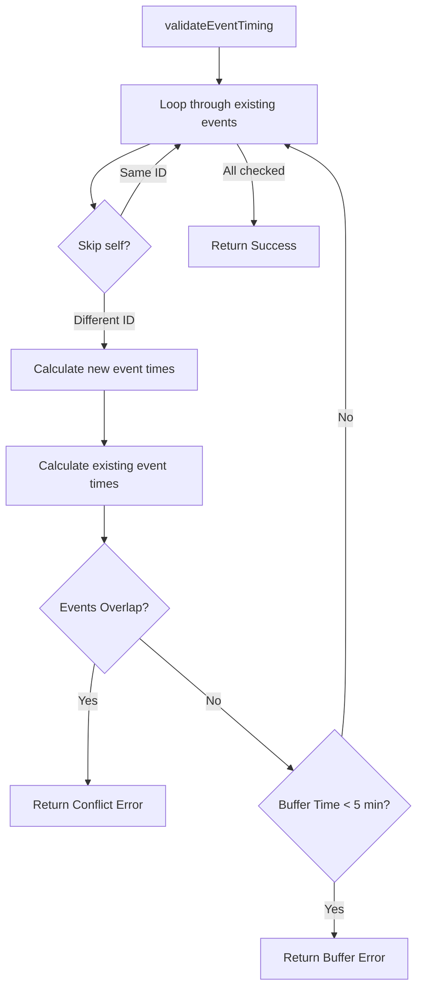
```mermaid
graph TD
    A[validateEventTiming] --> B[Loop through existing events]
    B --> C{Skip self?}
    C -->|Same ID| B
    C -->|Different ID| D[Calculate new event times]
    D --> E[Calculate existing event times]
    E --> F{Events Overlap?}
    F -->|Yes| G[Return Conflict Error]
    F -->|No| H{Buffer Time < 5 min?}
    H -->|Yes| I[Return Buffer Error]
    H -->|No| B
    B -->|All checked| J[Return Success]
```

---

## UI Component Structure

### Component Hierarchy

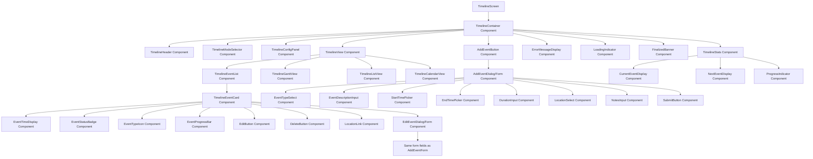
```mermaid
graph TD
    A[TimelineScreen] --> B[TimelineContainer Component]
    B --> C[TimelineHeader Component]
    B --> D[TimelineModeSelector Component]
    B --> E[TimelineConfigPanel Component]
    B --> F[TimelineView Component]
    B --> G[AddEventButton Component]
    B --> H[ErrorMessageDisplay Component]
    B --> I[LoadingIndicator Component]
    B --> J[FinalizedBanner Component]

    F --> K[TimelineEventList Component]
    K --> L[TimelineEventCard Component]
    L --> M[EventTimeDisplay Component]
    L --> N[EventStatusBadge Component]
    L --> O[EventTypeIcon Component]
    L --> P[EventProgressBar Component]
    L --> Q[EditButton Component]
    L --> R[DeleteButton Component]
    L --> S[LocationLink Component]

    G --> T[AddEventDialog/Form Component]
    T --> U[EventTypeSelect Component]
    T --> V[EventDescriptionInput Component]
    T --> W[StartTimePicker Component]
    T --> X[EndTimePicker Component]
    T --> Y[DurationInput Component]
    T --> Z[LocationSelect Component]
    T --> AA[NotesInput Component]
    T --> AB[SubmitButton Component]

    L --> AC[EditEventDialog/Form Component]
    AC --> AD[Same form fields as AddEventForm]

    F --> AE[TimelineGanttView Component]
    F --> AF[TimelineListView Component]
    F --> AG[TimelineCalendarView Component]

    B --> AH[TimelineStats Component]
    AH --> AI[CurrentEventDisplay Component]
    AH --> AJ[NextEventDisplay Component]
    AH --> AK[ProgressIndicator Component]
```

### Placeholder Components

#### TimelineScreen Component

**Location**: `src/app/(features)/timeline/index.tsx` (placeholder)

**Responsibilities**:

- Container for timeline management
- Navigation setup
- Project context (projectId)
- Error boundary wrapping
- Layout and styling

**Props**:

```typescript
interface TimelineScreenProps {
  navigation: NavigationProp;
  projectId: string;
}
```

**Usage**:

```typescript
const TimelineScreen = ({ navigation, projectId }: TimelineScreenProps) => {
  const {
    timeline,
    loading,
    error,
    addEvent,
    updateEvent,
    deleteEvent,
    setEvents,
    updateConfig,
    createInitial,
    clearError
  } = useTimeline(
    projectId,
    { autoFetch: true, enableRealtime: true }
  );

  // Initialize if needed
  const handleInitialize = async () => {
    const success = await createInitial();
    if (success) {
      // Timeline initialized
    }
  };

  return (
    <TimelineContainer
      timeline={timeline}
      loading={loading}
      error={error}
      onAddEvent={handleAddEvent}
      onUpdateEvent={handleUpdateEvent}
      onDeleteEvent={handleDeleteEvent}
      onSetEvents={handleSetEvents}
      onUpdateConfig={handleUpdateConfig}
      onInitialize={handleInitialize}
      onClearError={clearError}
    />
  );
};
```

#### AddEventForm Component

**Location**: `src/components/timeline/AddEventForm.tsx` (placeholder)

**Responsibilities**:

- Form state management for adding events
- Field validation coordination
- Timing validation display
- Conflict detection display
- Submission handling

**Props**:

```typescript
interface AddEventFormProps {
  onSubmit?: (input: TimelineEventInput) => Promise<void>;
  onCancel?: () => void;
  isLoading?: boolean;
  existingEvents?: TimelineEvent[];
}
```

**State**:

```typescript
{
  type: TimelineEventType;
  description?: string;
  notes?: string;
  startTime?: Date;
  endTime?: Date;
  duration?: number;
  locationId?: string;
  fieldErrors: Record<string, string>;
  timingErrors: string[];
}
```

**Behavior**:

- Validates fields before submission
- Checks for timing conflicts (if enabled)
- Calls `onSubmit` with TimelineEventInput
- Clears form on success
- Shows timing conflict warnings

#### TimelineEventCard Component

**Location**: `src/components/timeline/TimelineEventCard.tsx` (placeholder)

**Responsibilities**:

- Display event information
- Show event status
- Show event progress (if active)
- Edit/delete actions
- Link to location (if locationId present)

**Props**:

```typescript
interface TimelineEventCardProps {
  event: TimelineEvent;
  currentTime?: Date;
  onEdit?: (event: TimelineEvent) => void;
  onDelete?: (eventId: string) => void;
  showProgress?: boolean;
}
```

#### TimelineView Component

**Location**: `src/components/timeline/TimelineView.tsx` (placeholder)

**Responsibilities**:

- Render timeline in different views (Gantt, List, Calendar)
- Handle event ordering/sorting
- Filter events by status/type
- Display current/next event highlights

**Props**:

```typescript
interface TimelineViewProps {
  events: TimelineEvent[];
  currentEvent?: TimelineEvent;
  nextEvent?: TimelineEvent;
  viewMode: 'gantt' | 'list' | 'calendar';
  onEventClick?: (event: TimelineEvent) => void;
}
```

---

## Data Structures

### TimelineEventInput Structure

```typescript
// TimelineEventInput (from timeline.schema.ts)
interface TimelineEventInput {
  type: TimelineEventType; // Required enum (BRIDAL_PREP, CEREMONY_BEGINS, etc.)
  itemName: string; // Required, from listBaseItemSchema
  description?: string; // Optional, max 500 chars
  notes?: string; // Optional, max 500 chars
  status?: TimelineEventStatus; // Optional, defaults to UPCOMING
  startTime?: Date; // Optional timestamp
  endTime?: Date; // Optional timestamp
  duration?: number; // Optional, integer, min 0 (minutes)
  itemDescription?: string; // Optional, from listBaseItemSchema
  // Note: id, categoryId, isCustom, isDisabled, createdBy, updatedBy, locationId, weather are omitted
}
```

### TimelineEvent Structure (Complete)

```typescript
// TimelineEvent (complete event structure)
interface TimelineEvent {
  id: string; // Generated UUID (not Firestore doc ID)
  categoryId?: string; // Optional category association
  itemName: string; // Required, from listBaseItemSchema
  itemDescription?: string; // Optional, from listBaseItemSchema
  type: TimelineEventType; // Enum: event type
  description?: string; // Optional, max 500 chars
  notes?: string; // Optional, max 500 chars
  status: TimelineEventStatus; // Enum: UPCOMING, SCHEDULED, IN_PROGRESS, COMPLETED, etc.
  startTime?: Date; // Optional timestamp
  endTime?: Date; // Optional timestamp
  duration?: number; // Optional, integer, min 0 (minutes)
  locationId?: string; // Optional, links to location
  createdBy?: CreatedBy; // Optional (PHOTOGRAPHER, CLIENT, SYSTEM)
  updatedBy?: CreatedBy; // Optional
  notification?: NotificationData; // Optional notification settings
  weather?: WeatherData; // Optional weather data
  isCustom: boolean; // false (default)
  isChecked: boolean; // false (default)
  isDisabled: boolean; // false (default)
}
```

### TimelineConfig Structure

```typescript
// TimelineConfig (from timeline.schema.ts)
interface TimelineConfig {
  id: string; // Generated UUID
  type: ListType.TIMELINE; // Literal: 'timeline'
  source: ListSource.PROJECT_LIST; // PROJECT_LIST (default)
  defaultValues: boolean; // false (default)
  version: string; // '' (default, can be set)
  mode: TimelineMode; // SETUP, ACTIVE, REVIEW
  finalized: boolean; // false (default)
  clientLastViewed?: Date; // Optional timestamp
  audit: {
    createdAt?: Date; // Optional
    updatedAt?: Date; // Updated on changes
  };
  listMetadata?: ListMetadata; // Optional metadata
}
```

### TimelineList Structure

```typescript
// TimelineList (complete structure)
interface TimelineList {
  config: TimelineConfig; // Config with defaults
  categories: TimelineCategory[]; // Array of categories (optional)
  items: TimelineEvent[]; // Array of timeline events
  pendingUpdates?: TimelinePendingUpdate[]; // Array of pending updates (optional)
}
```

### TimelineEventType Enum

```typescript
enum TimelineEventType {
  BRIDAL_PREP = 'bridalPrep',
  GROOM_PREP = 'groomPrep',
  GUESTS_ARRIVE = 'guenziale',
  CEREMONY_BEGINS = 'ceremonyBegins',
  CONFETTI_AND_MINGLING = 'confettiAndMingling',
  RECEPTION_DRINKS = 'receptionDrinks',
  GROUP_PHOTOS = 'groupPhotos',
  COUPLE_PORTRAITS = 'couplePortraits',
  WEDDING_BREAKFAST = 'weddingBreakfast',
  SPEECHES = 'speeches',
  EVENING_GUESTS_ARRIVE = 'eveningGuestsArrive',
  CAKE_CUTTING = 'cakeCutting',
  FIRST_DANCE = 'firstDance',
  EVENING_ENTERTAINMENT = 'eveningEntertainment',
  EVENING_BUFFET = 'eveningBuffet',
  CARRIAGES = 'carriages',
  COCKTAIL_HOUR = 'cocktailHour',
  DINNER = 'dinner',
  BOUQUET_TOSS = 'bouquetToss',
  GARTER_TOSS = 'garterToss',
  OTHER = 'other',
}
```

### TimelineEventStatus Enum

```typescript
enum TimelineEventStatus {
  SCHEDULED = 'scheduled', // Event has a start time in the future
  IN_PROGRESS = 'inProgress', // Event is currently happening
  COMPLETED = 'completed', // Event has finished
  CANCELLED = 'cancelled', // Event was cancelled
  DELAYED = 'delayed', // Event is delayed
  UPCOMING = 'upcoming', // Event is upcoming (within threshold)
}
```

### TimelineMode Enum

```typescript
enum TimelineMode {
  SETUP = 'setup', // Timeline is being set up
  ACTIVE = 'active', // Timeline is active and being used
  REVIEW = 'review', // Timeline is in review mode
}
```

### Firestore Document Structure

```typescript
// Document saved to Firestore
{
  // Config fields (flat structure)
  config: {
    id: string,
    type: ListType.TIMELINE,
    source: ListSource.PROJECT_LIST,
    defaultValues: boolean,
    version: string,
    mode: TimelineMode,
    finalized: boolean,
    clientLastViewed: Timestamp | undefined,
    audit: {
      createdAt: Timestamp | undefined,
      updatedAt: Timestamp,
    },
    listMetadata: ListMetadata | undefined,
  },

  // List data
  categories: TimelineCategory[],        // Array of categories
  items: TimelineEvent[],                 // Array of events
  pendingUpdates: TimelinePendingUpdate[], // Array of pending updates
}
```

---

## Input Validation

### TimelineEventInput Validation

**File**: `src/domain/project/timeline.schema.ts`

```typescript
export const timelineEventInputSchema = timelineEventSchema.omit({
  id: true,
  categoryId: true,
  isCustom: true,
  isDisabled: true,
  createdBy: true,
  updatedBy: true,
  locationId: true,
  weather: true,
});
```

**Base TimelineEvent Schema**:

```typescript
export const timelineEventSchema = listBaseItemSchema.extend({
  type: z.nativeEnum(TimelineEventType).default(TimelineEventType.OTHER),
  description: z.string().max(500, 'Description is too long').optional(),
  notes: z.string().max(500, 'Notes are too long').optional(),
  status: z.nativeEnum(TimelineEventStatus).default(TimelineEventStatus.UPCOMING),
  startTime: optionalTimestampSchema,
  endTime: optionalTimestampSchema,
  duration: z.number().int().min(0).optional(),
  locationId: idSchema.optional(),
  createdBy: z.nativeEnum(CreatedBy).optional(),
  updatedBy: z.nativeEnum(CreatedBy).optional(),
  notification: notificationDataSchema.optional(),
  weather: weatherDataSchema.optional(),
});
```

**Validation Rules**:

- `type`: Required, must be valid TimelineEventType enum (defaults to OTHER)
- `itemName`: Required (from listBaseItemSchema), string
- `description`: Optional, max 500 characters
- `notes`: Optional, max 500 characters
- `status`: Optional, defaults to UPCOMING
- `startTime`: Optional timestamp (Date)
- `endTime`: Optional timestamp (Date)
- `duration`: Optional integer, min 0 (duration in minutes)
- `locationId`: Optional string ID

**Time Ordering Validation**:

```typescript
// In TimelineService.ensureTimeOrdering()
if (start && end && end < start) {
  return VALIDATION_FAILED error: 'End time must be after start time';
}
```

**Event Timing Validation** (in service):

- **Overlap Check**: Events cannot overlap in time
- **Buffer Time Check**: Events must have at least 5 minutes between them (configurable via `MIN_BUFFER_TIME_MINUTES`)

### TimelineConfig Validation

**File**: `src/domain/project/timeline.schema.ts`

```typescript
export const timelineConfigSchema = listBaseConfigSchema.extend({
  type: z.literal(ListType.TIMELINE), // Must be exactly 'timeline'
  source: z.nativeEnum(ListSource).default(ListSource.PROJECT_LIST),
  clientLastViewed: optionalTimestampSchema,
  mode: z.nativeEnum(TimelineMode).default(TimelineMode.SETUP),
  finalized: z.boolean().default(DEFAULTS.DISABLED),
});
```

**Validation Rules**:

- `type`: Must be `ListType.TIMELINE` (literal)
- `source`: Defaults to `ListSource.PROJECT_LIST`
- `mode`: Enum, defaults to `TimelineMode.SETUP`
- `finalized`: Boolean, defaults to false

### TimelineList Validation

**File**: `src/domain/project/timeline.schema.ts`

```typescript
export const timelineListSchema = listBaseWrapperSchema.extend({
  config: timelineConfigSchema,
  categories: z.array(timelineCategorySchema).optional().default([]),
  items: z.array(timelineEventSchema),
  pendingUpdates: z.array(listBasePendingUpdateSchema).optional().default([]),
});
```

**Validation Flow**:

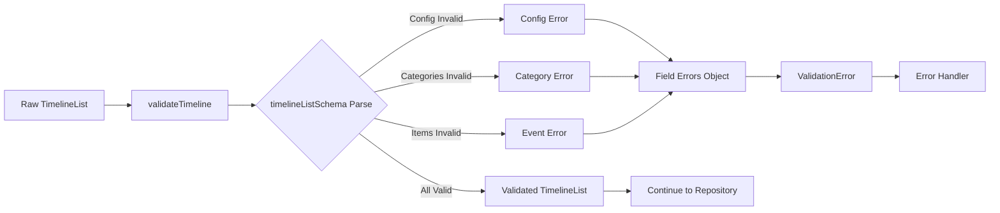
```mermaid
graph LR
    A[Raw TimelineList] --> B[validateTimeline]
    B --> C{timelineListSchema Parse}
    C -->|Config Invalid| D[Config Error]
    C -->|Categories Invalid| E[Category Error]
    C -->|Items Invalid| F[Event Error]
    C -->|All Valid| G[Validated TimelineList]

    D --> H[Field Errors Object]
    E --> H
    F --> H
    H --> I[ValidationError]
    I --> J[Error Handler]

    G --> K[Continue to Repository]
```

---

## Sanitization Process

**Note**: Timeline events do not have explicit sanitization in the repository layer like Location does. However, Zod schema validation applies trimming and type coercion.

**Implicit Sanitization via Zod**:

- String fields are trimmed by Zod schemas
- Timestamps are converted to Date objects
- Numbers are coerced to integers
- Optional fields are normalized to undefined if null/empty

**Repository Layer**:

- No explicit `sanitizeEvent` method
- Validation happens through Zod schemas
- Timestamps converted via `convertAllTimestamps`

**Service Layer**:

- No explicit sanitization
- Validation and type coercion handled by Zod

---

## Loading States

### State Transitions

#### General Timeline Operations

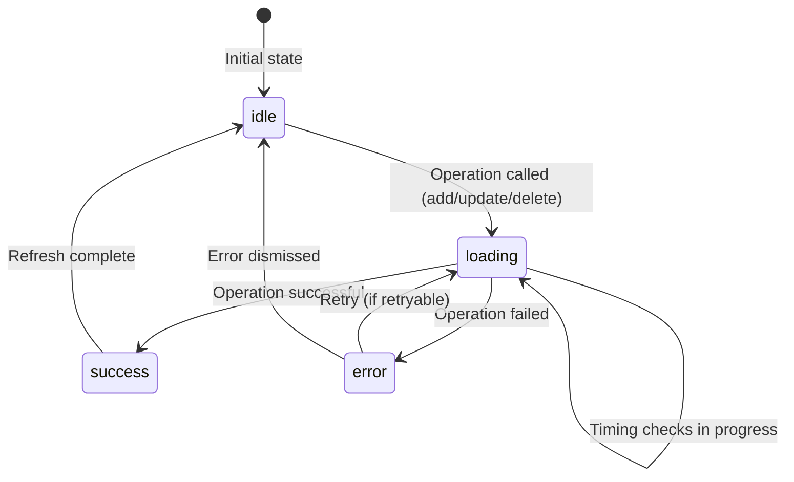
```mermaid
stateDiagram-v2
    [*] --> idle: Initial state
    idle --> loading: Operation called (add/update/delete)
    loading --> loading: Validation in progress
    loading --> loading: Timing checks in progress
    loading --> success: Operation successful
    loading --> error: Operation failed
    error --> loading: Retry (if retryable)
    success --> idle: Refresh complete
    error --> idle: Error dismissed
```

#### Real-time Subscription States

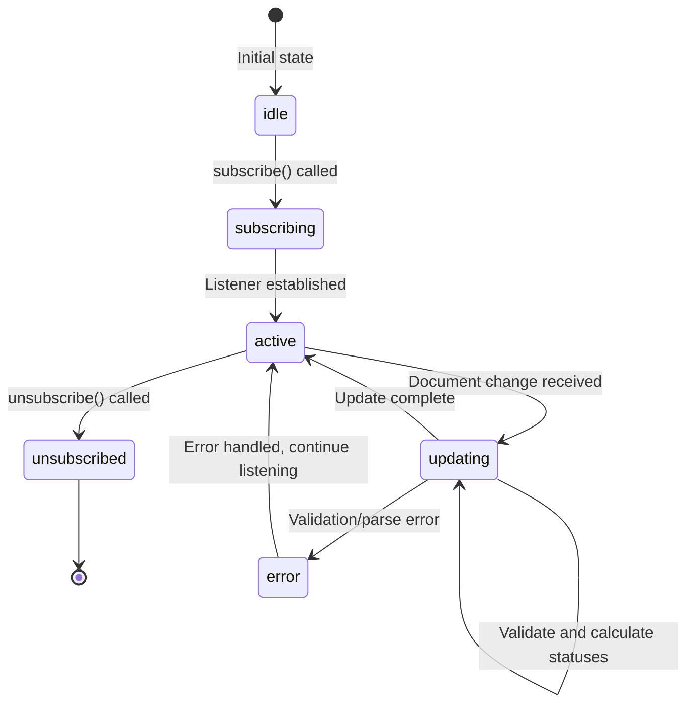
```mermaid
stateDiagram-v2
    [*] --> idle: Initial state
    idle --> subscribing: subscribe() called
    subscribing --> active: Listener established
    active --> updating: Document change received
    updating --> updating: Validate and calculate statuses
    updating --> active: Update complete
    active --> unsubscribed: unsubscribe() called
    unsubscribed --> [*]
    updating --> error: Validation/parse error
    error --> active: Error handled, continue listening
```

### Loading State Management (Placeholder Hook)

**File**: `src/hooks/use-timeline.ts` (placeholder)

**State Management**:

```typescript
const [state, setState] = useState<LoadingState<TimelineList | null>>(loading());
```

**Add Event Flow**:

```typescript
const addEvent = useCallback(
  async (input: TimelineEventInput): Promise<boolean> => {
    if (!projectId) return false;

    setState(loading(getCurrentData(state)));

    const result = await timelineService.addEvent(projectId, input);

    if (!isMountedRef.current) return false;

    if (result.success) {
      await fetchTimeline(); // Refresh to get updated statuses
      return true;
    } else {
      setState(error(result.error, getCurrentData(state)));
      handleError(result.error, {...});
      return false;
    }
  },
  [projectId, state, fetchTimeline, handleError],
);
```

---

## Error Handling

### Error Types

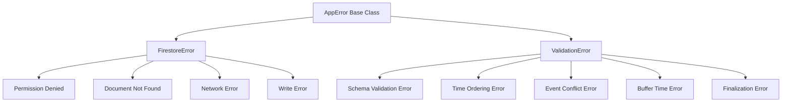
```mermaid
graph TD
    A[AppError Base Class] --> B[FirestoreError]
    A --> C[ValidationError]

    B --> D[Permission Denied]
    B --> E[Document Not Found]
    B --> F[Network Error]
    B --> G[Write Error]

    C --> H[Schema Validation Error]
    C --> I[Time Ordering Error]
    C --> J[Event Conflict Error]
    C --> K[Buffer Time Error]
    C --> L[Finalization Error]
```

### Error Flow

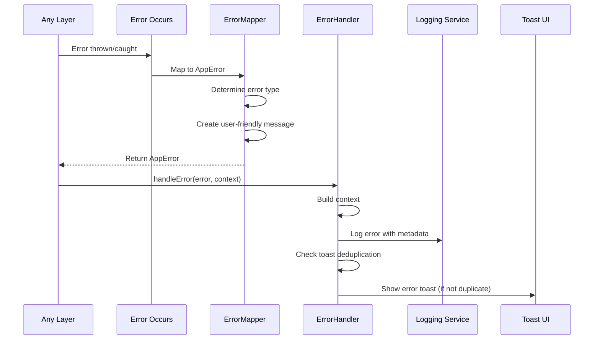
```mermaid
sequenceDiagram
    participant Layer as Any Layer
    participant Error as Error Occurs
    participant Mapper as ErrorMapper
    participant Handler as ErrorHandler
    participant Logger as Logging Service
    participant Toast as Toast UI

    Layer->>Error: Error thrown/caught

    Error->>Mapper: Map to AppError
    Mapper->>Mapper: Determine error type
    Mapper->>Mapper: Create user-friendly message
    Mapper-->>Layer: Return AppError

    Layer->>Handler: handleError(error, context)
    Handler->>Handler: Build context
    Handler->>Logger: Log error with metadata
    Handler->>Handler: Check toast deduplication
    Handler->>Toast: Show error toast (if not duplicate)
```

### Error Mapping

**File**: `src/utils/error-mapper.ts`

**Firestore Errors**:

- `permission-denied` → `DB_PERMISSION_DENIED`
  - User message: "You do not have permission to perform this action."
  - Retryable: false

- `not-found` → `DB_NOT_FOUND`
  - User message: "Timeline not found. Please initialize the timeline first."
  - Retryable: false

- `unavailable` → `DB_NETWORK_ERROR`
  - User message: "Service temporarily unavailable. Please try again."
  - Retryable: true

- Write errors → `DB_WRITE_ERROR`
  - User message: "Failed to save timeline. Please try again."
  - Retryable: true

**Validation Errors**:

- Schema validation failures → `VALIDATION_ERROR`
  - User message: "Please check your input and try again."
  - Field-specific errors in `fieldErrors`
  - Retryable: false

- Time ordering error → `VALIDATION_FAILED`
  - User message: "End time must be after start time."
  - Retryable: false

- Event conflict → `VALIDATION_FAILED`
  - User message: "This event overlaps with '[event name]'. Please adjust the timing."
  - Retryable: false

- Buffer time error → `VALIDATION_FAILED`
  - User message: "Events should have at least 5 minutes between them."
  - Retryable: false

- Finalization error → `VALIDATION_FAILED`
  - User message: "Timeline is finalized and cannot be edited."
  - Retryable: false

---

## Finalization Guard

### What is Finalization?

When a timeline is finalized, it cannot be edited. This prevents accidental changes to confirmed timelines.

### Finalization Check Flow

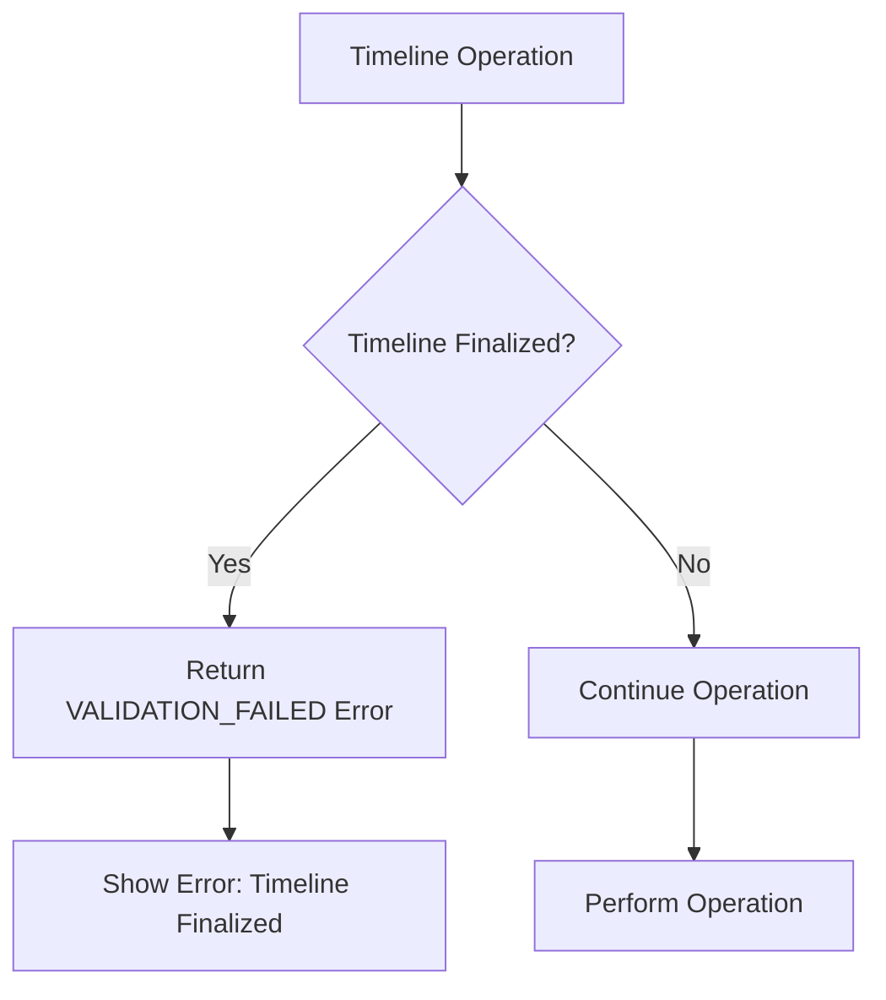
```mermaid
graph TD
    A[Timeline Operation] --> B{Timeline Finalized?}
    B -->|Yes| C[Return VALIDATION_FAILED Error]
    B -->|No| D[Continue Operation]
    C --> E[Show Error: Timeline Finalized]
    D --> F[Perform Operation]
```

### Implementation

**In Repository**:

```typescript
private ensureNotFinalized(config?: Timeline['config']): Result<void, AppError> {
  if (config?.finalized) {
    return err(
      ErrorMapper.fromFirestore(
        'Timeline is finalized and cannot be edited.',
        `${this.context}.guardFinalized`,
      ),
    );
  }
  return ok(undefined);
}
```

**In Service**:

```typescript
private ensureNotFinalized(config?: TimelineList['config']): Result<void, AppError> {
  if (config?.finalized) {
    return err(
      ErrorMapper.createGenericError(
        ErrorCode.VALIDATION_FAILED,
        'Timeline finalized',
        'Timeline is finalized and cannot be edited.',
        `${this.context}.ensureNotFinalized`,
      ),
    );
  }
  return ok(undefined);
}
```

**Operations Guarded**:

- `updateConfig`
- `addEvent`
- `updateEvent`
- `deleteEvent`
- `setEvents`

**Operations NOT Guarded**:

- `createInitial`
- `get`
- `subscribe`
- Business logic methods (status calculation, queries)

---

## File Structure & Function Calls

### Complete Call Stack Examples

#### Add Event Call Stack

```
TimelineScreen Component (placeholder)
  └─> AddEventForm Component (placeholder)
      └─> useTimeline.addEvent(input)
          └─> timelineService.addEvent(projectId, input)
              ├─> timelineRepository.get(projectId)
              │   └─> getDoc(doc('projects', projectId, 'timeline', 'data'))
              │
              ├─> ensureNotFinalized(config)
              │
              ├─> Build eventForRepository
              │   └─> Set defaults (status: UPCOMING, isCustom: false, isDisabled: false)
              │
              ├─> timelineEventSchema.omit({id: true}).safeParse(eventForRepository)
              │
              ├─> ensureTimeOrdering(tempEvent)
              │   ├─> convertTimestampToDate(startTime)
              │   ├─> Calculate endTime (from endTime or duration)
              │   └─> Check if endTime > startTime
              │
              ├─> validateEventTiming(tempEvent, existingEvents)
              │   └─> For each existing event:
              │       ├─> Calculate new event times
              │       ├─> Calculate existing event times
              │       ├─> Check for overlap
              │       └─> Check buffer time (MIN_BUFFER_TIME_MINUTES)
              │
              └─> timelineRepository.addEvent(projectId, validatedEventWithoutId)
                  ├─> getTimelineDocRef(projectId)
                  ├─> getDoc(ref)
                  ├─> ensureNotFinalized(config)
                  ├─> generateUUID() for event.id
                  ├─> validateEvent(candidate, context)
                  ├─> Build next = { ...current, items: [...items, newEvent] }
                  ├─> validateTimeline(next, context)
                  └─> updateDoc(ref, { items: next.items, updatedAt: serverTimestamp() })

          └─> fetchTimeline() [on success]
              └─> timelineService.getTimeline(projectId)
                  └─> timelineRepository.get(projectId)
                      └─> getDoc(ref) → validateTimeline → Return Timeline

              └─> timelineService.updateEventStatuses(events)
                  └─> For each event:
                      └─> calculateEventStatus(event, currentTime)
```

### Files Involved

| File                                                          | Purpose                               | Key Functions                                                           |
| ------------------------------------------------------------- | ------------------------------------- | ----------------------------------------------------------------------- |
| `src/app/(features)/timeline/index.tsx`                       | Timeline screen (placeholder)         | Screen component                                                        |
| `src/components/timeline/TimelineContainer.tsx`               | Timeline container (placeholder)      | Container component                                                     |
| `src/components/timeline/TimelineView.tsx`                    | Timeline view (placeholder)           | View component                                                          |
| `src/components/timeline/AddEventForm.tsx`                    | Add event form (placeholder)          | Add event form component                                                |
| `src/components/timeline/EditEventForm.tsx`                   | Edit event form (placeholder)         | Edit event form component                                               |
| `src/components/timeline/TimelineEventCard.tsx`               | Event card (placeholder)              | Event display component                                                 |
| `src/hooks/use-timeline.ts`                                   | React hook for timeline (placeholder) | `useTimeline()`, operations                                             |
| `src/services/timeline-service.ts`                            | Business logic orchestration          | All CRUD operations, business logic                                     |
| `src/repositories/firestore/firestore-timeline-repository.ts` | Firestore timeline adapter            | All repository methods                                                  |
| `src/repositories/i-timeline-repository.ts`                   | Timeline repository interface         | Port definition                                                         |
| `src/domain/project/timeline.schema.ts`                       | Timeline validation schemas           | `timelineListSchema`, `timelineEventSchema`, `timelineEventInputSchema` |
| `src/utils/id-generator.ts`                                   | ID generation utilities               | `generateUUID()`                                                        |
| `src/utils/validation-helpers.ts`                             | Validation utilities                  | `validateWithSchema()`                                                  |
| `src/utils/error-mapper.ts`                                   | Error type mapping                    | `fromFirestore()`, `fromZod()`, `listNotFound()`                        |
| `src/utils/date-time-utils.ts`                                | Timestamp utilities                   | `convertAllTimestamps()`, `convertTimestampToDate()`                    |
| `src/services/error-handler-service.ts`                       | Centralized error handling            | `handle()`                                                              |

---

## Hooks Usage (Placeholder)

### useTimeline Hook (Placeholder)

**File**: `src/hooks/use-timeline.ts` (placeholder - not yet implemented)

**Intended Usage Pattern**:

```typescript
const {
  timeline,
  loading,
  error,
  addEvent,
  updateEvent,
  deleteEvent,
  setEvents,
  updateConfig,
  createInitial,
  clearError,
  currentEvent,
  nextEvent,
  refresh,
} = useTimeline(projectId, {
  autoFetch: true, // Automatically fetch on mount
  enableRealtime: true, // Enable real-time updates
});

// Add event
const handleAddEvent = async (input: TimelineEventInput) => {
  const success = await addEvent(input);
  if (success) {
    // Event added, form can be cleared
  }
};

// Update event
const handleUpdateEvent = async (event: TimelineEvent) => {
  const success = await updateEvent(event);
  if (success) {
    // Event updated
  }
};

// Delete event
const handleDeleteEvent = async (eventId: string) => {
  const success = await deleteEvent(eventId);
  if (success) {
    // Event deleted
  }
};

// Update config
const handleUpdateConfig = async (updates: Partial<TimelineConfig>) => {
  const success = await updateConfig(updates);
  if (success) {
    // Config updated
  }
};

// Initialize (if needed)
const handleInitialize = async () => {
  const success = await createInitial();
  if (success) {
    // Timeline initialized
  }
};
```

**Expected Hook Interface**:

```typescript
interface UseTimelineResult {
  timeline: TimelineList | null;
  loading: boolean;
  error: AppError | null;
  state: LoadingState<TimelineList | null>;

  // Operations
  addEvent: (input: TimelineEventInput) => Promise<boolean>;
  updateEvent: (event: TimelineEvent) => Promise<boolean>;
  deleteEvent: (eventId: string) => Promise<boolean>;
  setEvents: (events: TimelineEvent[]) => Promise<boolean>;
  updateConfig: (updates: Partial<TimelineConfig>) => Promise<boolean>;
  createInitial: () => Promise<boolean>;

  // Queries
  currentEvent: TimelineEvent | undefined;
  nextEvent: TimelineEvent | undefined;

  // Helpers
  fetchTimeline: () => Promise<void>;
  refresh: () => Promise<void>;
  clearError: () => void;
}
```

**Lifecycle** (Expected):

```typescript
// Component mount
useEffect(() => {
  return () => {
    isMountedRef.current = false;
    if (unsubscribeRef.current) {
      unsubscribeRef.current(); // Cleanup real-time subscription
    }
  };
}, []);

// Auto-fetch or real-time subscription
useEffect(() => {
  if (!projectId) return;

  if (enableRealtime) {
    const unsubscribe = timelineService.subscribe(projectId, result => {
      // Handle real-time updates
      if (result.success) {
        // Update statuses
        const updated = timelineService.updateEventStatuses(result.value.items);
        setTimeline({ ...result.value, items: updated });
      }
    });
    unsubscribeRef.current = unsubscribe;
  } else if (autoFetch) {
    setTimeout(() => {
      fetchTimeline();
    }, 0);
  }
}, [projectId, enableRealtime, autoFetch, fetchTimeline]);
```

---

## Ports & Adapters

### Architecture Pattern

The application uses **Ports & Adapters (Hexagonal Architecture)**:

- **Ports**: Interfaces defining contracts (`ITimelineRepository`)
- **Adapters**: Concrete implementations (`FirestoreTimelineRepository`)

### Ports (Interfaces)

#### ITimelineRepository

**File**: `src/repositories/i-timeline-repository.ts`

**Contract**:

```typescript
interface ITimelineRepository {
  createInitial(projectId: string): Promise<Result<void, AppError>>;
  get(projectId: string): Promise<Result<TimelineList, AppError>>;
  updateConfig(
    projectId: string,
    updates: Partial<TimelineConfig>,
  ): Promise<Result<void, AppError>>;
  addEvent(projectId: string, event: Omit<TimelineEvent, 'id'>): Promise<Result<string, AppError>>;
  updateEvent(projectId: string, event: TimelineEvent): Promise<Result<void, AppError>>;
  deleteEvent(projectId: string, eventId: string): Promise<Result<void, AppError>>;
  setEvents(projectId: string, events: TimelineEvent[]): Promise<Result<void, AppError>>;
  subscribe(
    projectId: string,
    onUpdate: (result: Result<TimelineList | null, AppError>) => void,
  ): Unsubscribe;
}
```

**Purpose**: Defines the contract for timeline operations (project-level)

### Adapters (Implementations)

#### FirestoreTimelineRepository

**File**: `src/repositories/firestore/firestore-timeline-repository.ts`

**Implements**: `ITimelineRepository`

**Responsibilities**:

- Firestore document operations
- Event validation and validation
- Finalization guard
- Real-time subscriptions
- ID generation for events (UUID, not Firestore doc ID)

**Key Characteristics**:

- Uses single document structure (`projects/{projectId}/timeline/data`)
- Events stored in array within document
- Events use UUIDs (not Firestore document IDs)
- Finalization guard prevents edits to finalized timelines

**Dependencies**:

- Firestore SDK
- Zod schemas for validation
- Date/time utilities
- ID generator utilities

### Dependency Injection

**File**: `src/services/ServiceFactory.ts`

**Pattern**: Service Factory creates services with injected repositories

```typescript
export class TimelineService {
  constructor(private repository: ITimelineRepository) {}
}
```

**Factory Setup**:

```typescript
const timelineRepository = new FirestoreTimelineRepository();

const timelineService = new TimelineService(timelineRepository);
```

---

## Simple Explanation

### What is a Timeline?

A Timeline is a schedule of events for a project (e.g., wedding timeline). Each event has a type (ceremony, reception, photos), timing (start/end or duration), status (upcoming, in progress, completed), and can link to locations.

### What Happens When You Create an Initial Timeline?

#### Step 1: Trigger

- **Project Creation**: When a new project is created, the system may automatically create an empty timeline
- **Manual Init**: Or you can manually initialize if needed

#### Step 2: Generate Config ID

- **UUID Generation**: The system generates a unique ID for the timeline configuration

#### Step 3: Set Up Default Settings

- **Default Config**: The system sets up default settings:
  - Type: Timeline
  - Source: Project list (belongs to project)
  - Mode: SETUP (ready to add events)
  - Finalized: false (can be edited)
  - Default values: false
  - Version: '' (empty string)

#### Step 4: Create Empty Lists

- **Empty Arrays**: The system creates empty arrays for:
  - Categories: No categories yet
  - Items (Events): No events yet
  - Pending updates: No pending updates

#### Step 5: Validate Timeline

- **Validation**: The system validates the entire timeline structure

#### Step 6: Save to Database

- **Firestore Write**: The system saves the empty timeline to Firestore
- Stored at `projects/{projectId}/timeline/data`

#### Step 7: Success!

- **Complete**: The timeline is now initialized and ready for events to be added

### What Happens When You Add an Event?

#### Step 1: You Fill Out the Form

- **Add Event Form**: You enter event details:
  - Event type (ceremony, reception, photos, etc.)
  - Event name
  - Description (optional)
  - Start time (optional)
  - End time (optional)
  - OR duration in minutes (optional)
  - Location link (optional)
  - Notes (optional)

#### Step 2: Validate Your Input

- **Validation**: The system checks that everything is correct:
  - Event type is valid
  - Event name is provided
  - If both start and end times provided, end time is after start time
  - Description/notes are within character limits
- If anything is wrong → **Error**: Shows specific field errors

#### Step 3: Check if Timeline is Finalized

- **Finalization Guard**: The system checks if the timeline is finalized
- If finalized → **Error**: "Timeline is finalized and cannot be edited"
- If not finalized → Continue

#### Step 4: Check Time Ordering

- **Time Ordering**: The system checks that end time is after start time (if both provided)
- If invalid → **Error**: "End time must be after start time"

#### Step 5: Check for Conflicts and Buffer Times

- **Conflict Detection**: The system checks the new event against all existing events:
  - **Overlap Check**: Does the new event overlap with any existing event?
    - If yes → **Error**: "This event overlaps with '[event name]'. Please adjust the timing."
  - **Buffer Time Check**: Is there at least 5 minutes between events?
    - If no → **Error**: "Events should have at least 5 minutes between them."

#### Step 6: Generate Event ID

- **ID Generation**: The system generates a unique UUID for this event
- Not a Firestore document ID, but a UUID stored in the event data

#### Step 7: Validate Complete Event

- **Final Validation**: The system validates the complete event structure
- Makes sure everything is correct before saving

#### Step 8: Add Event to Timeline

- **Firestore Update**: The event is added to the timeline:
  - Gets current timeline document
  - Adds new event to items array
  - Updates the "updatedAt" timestamp
  - Saves back to Firestore

#### Step 9: Refresh and Calculate Statuses

- **Refresh**: After adding, the system fetches the timeline from the server
- **Status Calculation**: For each event, the system calculates its status:
  - If event is currently happening → IN_PROGRESS
  - If event is complete → COMPLETED
  - If event starts within 30 minutes → UPCOMING
  - If event has started but not complete → SCHEDULED
  - Otherwise → UPCOMING

#### Step 10: Success!

- **Complete**: The event is now permanently saved
- Timeline displays with updated statuses
- UI updates with the new event

### What Happens When You Update an Event?

Similar to adding, but:

1. **Get Current Event**: The system finds the existing event by ID
2. **Validation**: Same validation as adding (input, time ordering, conflicts)
3. **Exclude Self**: When checking conflicts, the system excludes the event being updated
4. **Update**: The event is replaced in the items array
5. **Refresh**: Timeline is refreshed with updated statuses

### What Happens When You Delete an Event?

1. **Finalization Check**: Ensures timeline is not finalized
2. **Remove**: Event is filtered out from the items array
3. **Save**: Updated items array is saved to Firestore
4. **Refresh**: Timeline is refreshed

### What is Event Status Calculation?

The system automatically calculates event status based on current time:

- **IN_PROGRESS**: Event is currently happening (current time is between start and end)
- **COMPLETED**: Event has finished (current time is after end time, or 1 hour after start if no end/duration)
- **UPCOMING**: Event starts within 30 minutes (configurable)
- **SCHEDULED**: Event has a start time that has passed, but event is not yet complete
- **UPCOMING** (default): Event is in the future

**Progress Calculation**: For active events, the system calculates progress percentage (0-100%) based on elapsed time.

### What is Finalization?

When a timeline is finalized, it cannot be edited. This is like "locking" the timeline to prevent accidental changes.

**Finalized Timeline**:

- Cannot add events
- Cannot update events
- Cannot delete events
- Cannot update config
- Can still view timeline
- Can still subscribe to real-time updates

**Why Finalize?**

- Prevents accidental changes to confirmed timelines
- Indicates timeline is ready/confirmed
- Can be used to trigger other workflows

### Event Timing Validation Explained

**Overlap Detection**:

- Two events overlap if: `newStart < existingEnd && newEnd > existingStart`
- Example: Event A (10:00-11:00) and Event B (10:30-11:30) overlap

**Buffer Time**:

- Events should have at least 5 minutes between them
- Prevents back-to-back events with no transition time
- Example: Event A ends at 10:00, Event B must start at 10:05 or later

**Time Calculation**:

- If event has `endTime`, use it
- If event has `duration` but no `endTime`, calculate: `endTime = startTime + duration`
- If event has neither, it's a point-in-time event

### Real-time Subscriptions Explained

**What it means**: The timeline automatically updates when changes are made (by you or others).

**How it works**:

1. Component subscribes to timeline document
2. Firestore sends updates whenever document changes
3. Timeline recalculates event statuses
4. UI updates automatically

**Use cases**:

- Multiple users editing timeline simultaneously
- Automatic status updates as time passes
- Live timeline view during events

---

## Summary Flow Charts

### Add Event Summary

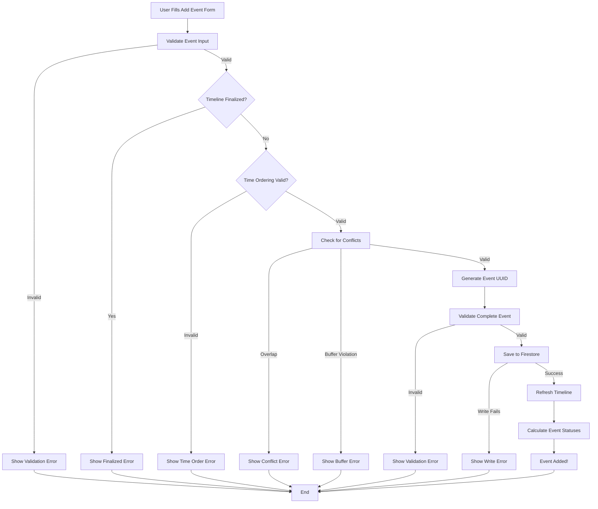
```mermaid
graph TD
    Start[User Fills Add Event Form] --> Validate[Validate Event Input]
    Validate -->|Invalid| Error1[Show Validation Error]
    Validate -->|Valid| CheckFinalized{Timeline Finalized?}
    CheckFinalized -->|Yes| Error2[Show Finalized Error]
    CheckFinalized -->|No| CheckTimeOrder{Time Ordering Valid?}
    CheckTimeOrder -->|Invalid| Error3[Show Time Order Error]
    CheckTimeOrder -->|Valid| CheckConflicts[Check for Conflicts]
    CheckConflicts -->|Overlap| Error4[Show Conflict Error]
    CheckConflicts -->|Buffer Violation| Error5[Show Buffer Error]
    CheckConflicts -->|Valid| GenerateID[Generate Event UUID]
    GenerateID --> ValidateComplete[Validate Complete Event]
    ValidateComplete -->|Invalid| Error6[Show Validation Error]
    ValidateComplete -->|Valid| Save[Save to Firestore]
    Save -->|Write Fails| Error7[Show Write Error]
    Save -->|Success| Refresh[Refresh Timeline]
    Refresh --> CalcStatus[Calculate Event Statuses]
    CalcStatus --> Success[Event Added!]
    Error1 --> End[End]
    Error2 --> End
    Error3 --> End
    Error4 --> End
    Error5 --> End
    Error6 --> End
    Error7 --> End
    Success --> End
```

### Update Event Summary

```mermaid
graph TD
    Start[User Edits Event] --> CheckFinalized{Timeline Finalized?}
    CheckFinalized -->|Yes| Error1[Show Finalized Error]
    CheckFinalized -->|No| Validate[Validate Event Input]
    Validate -->|Invalid| Error2[Show Validation Error]
    Validate -->|Valid| CheckTimeOrder{Time Ordering Valid?}
    CheckTimeOrder -->|Invalid| Error3[Show Time Order Error]
    CheckTimeOrder -->|Valid| CheckConflicts[Check Conflicts with Other Events]
    CheckConflicts -->|Overlap| Error4[Show Conflict Error]
    CheckConflicts -->|Valid| Update[Update in Firestore]
    Update -->|Write Fails| Error5[Show Write Error]
    Update -->|Success| Refresh[Refresh Timeline]
    Refresh --> CalcStatus[Calculate Event Statuses]
    CalcStatus --> Success[Event Updated!]
    Error1 --> End[End]
    Error2 --> End
    Error3 --> End
    Error4 --> End
    Error5 --> End
    Success --> End
```

---

## Key Takeaways

1. **Timeline Operations**:
   - Create Initial: Sets up empty timeline with default config
   - Get Timeline: Fetches timeline and calculates event statuses
   - Update Config: Updates timeline configuration (mode, finalized, etc.)
   - Add Event: Adds new event with timing validation and conflict detection
   - Update Event: Updates existing event with same validations
   - Delete Event: Removes event from timeline
   - Set Events: Batch update of all events
   - Subscribe: Real-time updates for timeline document

2. **Finalization Guard**:
   - Finalized timelines cannot be edited
   - Prevents accidental changes
   - Checked before all write operations

3. **Event Timing Validation**:
   - Time ordering: End time must be after start time
   - Overlap detection: Events cannot overlap
   - Buffer time: Events need at least 5 minutes between them
   - Handles events with endTime, duration, or point-in-time

4. **Status Calculation**:
   - Automatic status calculation based on current time
   - Statuses: UPCOMING, SCHEDULED, IN_PROGRESS, COMPLETED, CANCELLED, DELAYED
   - Progress calculation for active events (0-100%)
   - Status updates on fetch and real-time updates

5. **Business Logic**:
   - `calculateEventStatus`: Determines event status
   - `updateEventStatuses`: Updates all event statuses
   - `calculateEventProgress`: Calculates progress for active events
   - `getCurrentEvent`: Gets currently active event
   - `getNextEvent`: Gets next upcoming event
   - `isEventActive`: Checks if event is currently active
   - `isEventComplete`: Checks if event is complete
   - `isEventUpcoming`: Checks if event is upcoming
   - `getTimeUntilEvent`: Gets time remaining until event
   - `validateEventTiming`: Validates timing against existing events

6. **Data Structure**:
   - Single document structure (`projects/{projectId}/timeline/data`)
   - Events stored in array within document
   - Events use UUIDs (not Firestore document IDs)
   - Config embedded in document

7. **Error Handling**:
   - Comprehensive error handling with user-friendly messages
   - Finalization errors prevent edits
   - Timing validation errors (conflicts, buffer times)
   - Schema validation errors with field-specific messages
   - Retry support for retryable errors

8. **Repository Pattern**:
   - Dedicated ITimelineRepository (not generic)
   - Single document structure
   - UUID generation for events
   - Finalization guard in repository

9. **Service Layer**:
   - TimelineService handles business logic
   - Validates input before repository
   - Performs timing validation
   - Calculates event statuses
   - Orchestrates repository calls

10. **Real-time Updates**:
    - Firestore onSnapshot for real-time updates
    - Automatic status recalculation on updates
    - Unsubscribe on component unmount

11. **User Experience**:
    - Automatic status updates
    - Real-time collaboration support
    - Clear validation messages
    - Finalization prevents accidental edits
    - Conflict detection prevents scheduling issues

12. **Key Differences from Other Lists**:
    - Time-based validation (ordering, conflicts, buffers)
    - Status calculation based on current time
    - Finalization guard
    - Events use UUIDs (not Firestore doc IDs)
    - Business logic methods for event state queries
    - Progress calculation for active events

---

_Document generated: 2025-01-XX_
_Last updated: Based on current codebase structure_
