# Complete User Processes Documentation

## Overview

This document traces **all** user-related processes including user creation (during sign-up), retrieval, profile updates, preferences management, subscription management, setup updates, last login tracking, email verification, real-time subscriptions, and admin operations.

---

## Table of Contents

1. [High-Level Architecture](#high-level-architecture)
2. [User Creation Flow](#user-creation-flow)
3. [Get User by ID Flow](#get-user-by-id-flow)
4. [Update User Profile Flow](#update-user-profile-flow)
5. [Update User Preferences Flow](#update-user-preferences-flow)
6. [Update User Subscription Flow](#update-user-subscription-flow)
7. [Update User Setup Flow](#update-user-setup-flow)
8. [Update Last Login Flow](#update-last-login-flow)
9. [Update Email Verification Flow](#update-email-verification-flow)
10. [Real-time User Subscription Flow](#real-time-user-subscription-flow)
11. [Admin Operations](#admin-operations)
12. [Data Structures](#data-structures)
13. [Validation & Sanitization](#validation--sanitization)
14. [Error Handling](#error-handling)
15. [Loading States](#loading-states)
16. [File Structure](#file-structure)
17. [Hooks Usage](#hooks-usage)
18. [Ports & Adapters](#ports--adapters)
19. [Simple Explanations](#simple-explanations)

---

## High-Level Architecture

### Architecture Overview

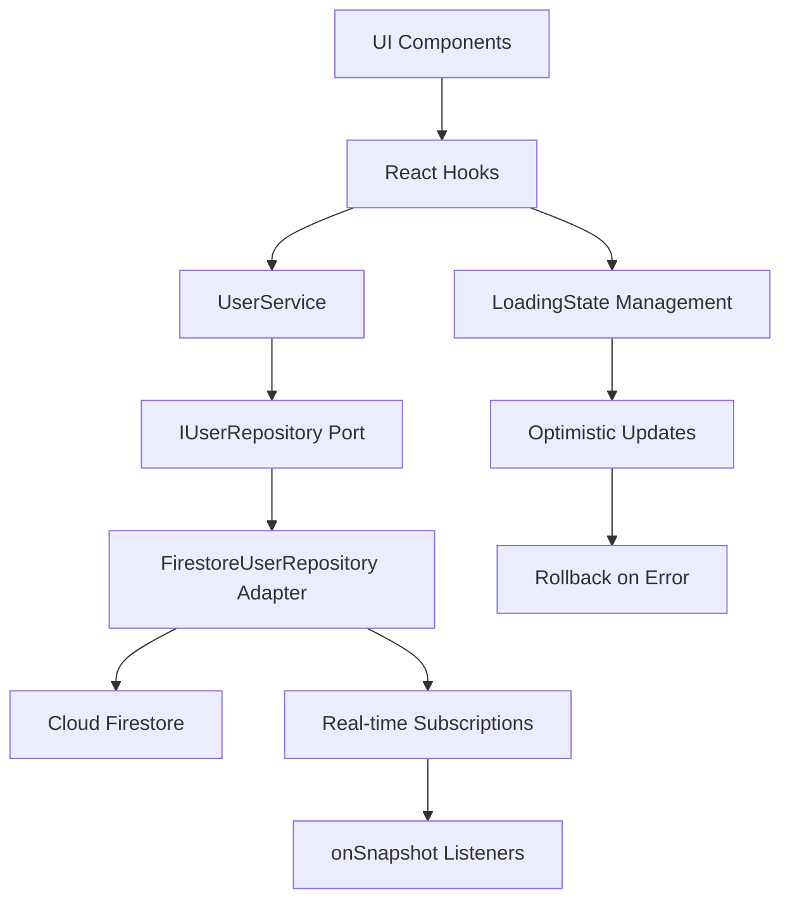
```mermaid
graph TD
    A[UI Components] --> B[React Hooks]
    B --> C[UserService]
    C --> D[IUserRepository Port]
    D --> E[FirestoreUserRepository Adapter]
    E --> F[Cloud Firestore]
    
    B --> G[LoadingState Management]
    G --> H[Optimistic Updates]
    H --> I[Rollback on Error]
    
    E --> J[Real-time Subscriptions]
    J --> K[onSnapshot Listeners]
```

### User Data Structure Hierarchy


```mermaid
graph TD
    A[User Document] --> B[Profile Data]
    A --> C[Preferences]
    A --> D[Subscription]
    A --> E[Setup Flags]
    A --> F[Projects]
    A --> G[Metadata]
    
    B --> B1[name: PersonInfo]
    B --> B2[displayName]
    B --> B3[email]
    B --> B4[phone]
    B --> B5[role]
    B --> B6[isEmailVerified]
    B --> B7[isActive]
    B --> B8[isBanned]
    
    C --> C1[notifications]
    C --> C2[darkMode]
    C --> C3[language]
    C --> C4[timezone]
    C --> C5[dateFormat]
    
    D --> D1[plan]
    D --> D2[isActive]
    D --> D3[autoRenew]
    D --> D4[billingCycle]
    
    E --> E1[firstTimeSetup]
    E --> E2[showOnboarding]
    E --> E3[customKitListSetup]
    E --> E4[customBusinessCardSetup]
```

---

## User Creation Flow

### User Creation During Sign-Up

**Note**: User creation happens during the sign-up process. See `signup.md` for complete flow. Here's a simplified view:

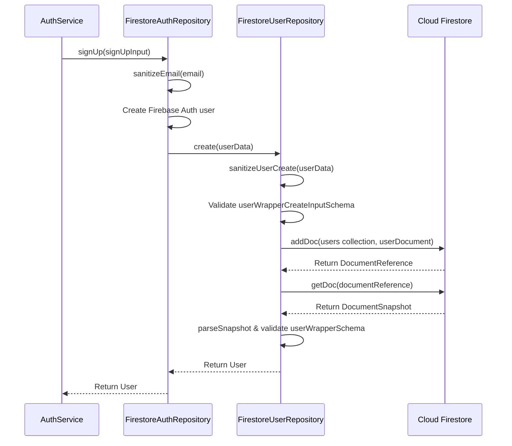
```mermaid
sequenceDiagram
    participant AuthService as AuthService
    participant AuthRepo as FirestoreAuthRepository
    participant UserRepo as FirestoreUserRepository
    participant Firestore as Cloud Firestore

    AuthService->>AuthRepo: signUp(signUpInput)
    AuthRepo->>AuthRepo: sanitizeEmail(email)
    AuthRepo->>AuthRepo: Create Firebase Auth user
    AuthRepo->>UserRepo: create(userData)
    
    UserRepo->>UserRepo: sanitizeUserCreate(userData)
    UserRepo->>UserRepo: Validate userWrapperCreateInputSchema
    UserRepo->>Firestore: addDoc(users collection, userDocument)
    Firestore-->>UserRepo: Return DocumentReference
    UserRepo->>Firestore: getDoc(documentReference)
    Firestore-->>UserRepo: Return DocumentSnapshot
    UserRepo->>UserRepo: parseSnapshot & validate userWrapperSchema
    UserRepo-->>AuthRepo: Return User
    AuthRepo-->>AuthService: Return User
```

### Default Values Applied

```typescript
// Default values set during user creation
preferences: defaultUserPreferences      // notifications: true, darkMode: false, etc.
subscription: defaultUserSubscription    // plan: PRO, isActive: true, etc.
setup: defaultUserSetup                  // firstTimeSetup: true, showOnboarding: true
projects: defaultUserProjects            // activeProjects: 0, totalProjects: 0
role: UserRole.USER                      // Default role
isActive: true                           // User is active by default
isBanned: false                          // User is not banned
isEmailVerified: false                   // Email not verified initially
```

---

## Get User by ID Flow

### Fetch User Profile Flow

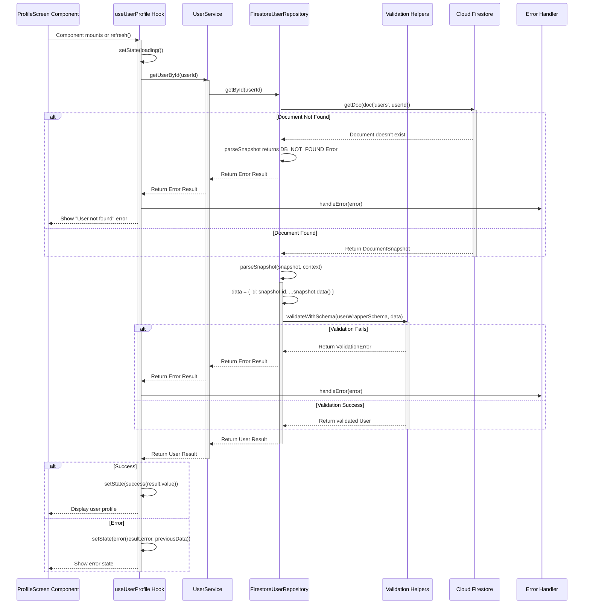
```mermaid
sequenceDiagram
    participant UI as ProfileScreen Component
    participant Hook as useUserProfile Hook
    participant Service as UserService
    participant Repo as FirestoreUserRepository
    participant Validate as Validation Helpers
    participant Firestore as Cloud Firestore
    participant ErrorHandler as Error Handler

    UI->>Hook: Component mounts or refresh()
    activate Hook
    Hook->>Hook: setState(loading())
    
    Hook->>Service: getUserById(userId)
    activate Service
    Service->>Repo: getById(userId)
    activate Repo
    
    Repo->>Firestore: getDoc(doc('users', userId))
    activate Firestore
    alt Document Not Found
        Firestore-->>Repo: Document doesn't exist
        Repo->>Repo: parseSnapshot returns DB_NOT_FOUND Error
        Repo-->>Service: Return Error Result
        Service-->>Hook: Return Error Result
        Hook->>ErrorHandler: handleError(error)
        Hook-->>UI: Show "User not found" error
    else Document Found
        Firestore-->>Repo: Return DocumentSnapshot
    end
    deactivate Firestore
    
    Repo->>Repo: parseSnapshot(snapshot, context)
    activate Repo
    Repo->>Repo: data = { id: snapshot.id, ...snapshot.data() }
    Repo->>Validate: validateWithSchema(userWrapperSchema, data)
    activate Validate
    alt Validation Fails
        Validate-->>Repo: Return ValidationError
        Repo-->>Service: Return Error Result
        Service-->>Hook: Return Error Result
        Hook->>ErrorHandler: handleError(error)
    else Validation Success
        Validate-->>Repo: Return validated User
    end
    deactivate Validate
    Repo-->>Service: Return User Result
    deactivate Repo
    Service-->>Hook: Return User Result
    deactivate Service
    
    alt Success
        Hook->>Hook: setState(success(result.value))
        Hook-->>UI: Display user profile
    else Error
        Hook->>Hook: setState(error(result.error, previousData))
        Hook-->>UI: Show error state
    end
    deactivate Hook
```

---

## Update User Profile Flow

### Update Profile with Optimistic Update

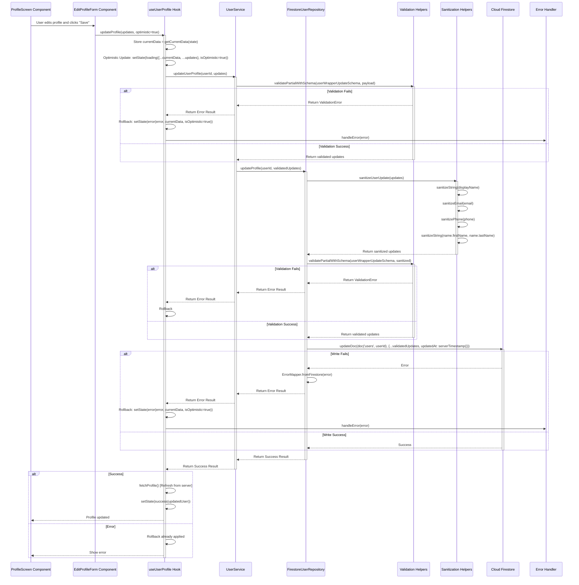
```mermaid
sequenceDiagram
    participant UI as ProfileScreen Component
    participant Form as EditProfileForm Component
    participant Hook as useUserProfile Hook
    participant Service as UserService
    participant Repo as FirestoreUserRepository
    participant Validate as Validation Helpers
    participant Sanitize as Sanitization Helpers
    participant Firestore as Cloud Firestore
    participant ErrorHandler as Error Handler

    UI->>Form: User edits profile and clicks "Save"
    Form->>Hook: updateProfile(updates, optimistic=true)
    activate Hook
    
    Hook->>Hook: Store currentData = getCurrentData(state)
    Hook->>Hook: Optimistic Update: setState(loading({...currentData, ...updates}, isOptimistic=true))
    
    Hook->>Service: updateUserProfile(userId, updates)
    activate Service
    
    Service->>Validate: validatePartialWithSchema(userWrapperUpdateSchema, payload)
    activate Validate
    alt Validation Fails
        Validate-->>Service: Return ValidationError
        Service-->>Hook: Return Error Result
        Hook->>Hook: Rollback: setState(error(error, currentData, isOptimistic=true))
        Hook->>ErrorHandler: handleError(error)
    else Validation Success
        Validate-->>Service: Return validated updates
        deactivate Validate
    end
    
    Service->>Repo: updateProfile(userId, validatedUpdates)
    activate Repo
    
    Repo->>Sanitize: sanitizeUserUpdate(updates)
    activate Sanitize
    Sanitize->>Sanitize: sanitizeString(displayName)
    Sanitize->>Sanitize: sanitizeEmail(email)
    Sanitize->>Sanitize: sanitizePhone(phone)
    Sanitize->>Sanitize: sanitizeString(name.firstName, name.lastName)
    Sanitize-->>Repo: Return sanitized updates
    deactivate Sanitize
    
    Repo->>Validate: validatePartialWithSchema(userWrapperUpdateSchema, sanitized)
    activate Validate
    alt Validation Fails
        Validate-->>Repo: Return ValidationError
        Repo-->>Service: Return Error Result
        Service-->>Hook: Return Error Result
        Hook->>Hook: Rollback
    else Validation Success
        Validate-->>Repo: Return validated updates
        deactivate Validate
    end
    
    Repo->>Firestore: updateDoc(doc('users', userId), {...validatedUpdates, updatedAt: serverTimestamp()})
    activate Firestore
    alt Write Fails
        Firestore-->>Repo: Error
        Repo->>Repo: ErrorMapper.fromFirestore(error)
        Repo-->>Service: Return Error Result
        Service-->>Hook: Return Error Result
        Hook->>Hook: Rollback: setState(error(error, currentData, isOptimistic=true))
        Hook->>ErrorHandler: handleError(error)
    else Write Success
        Firestore-->>Repo: Success
    end
    deactivate Firestore
    
    Repo-->>Service: Return Success Result
    deactivate Repo
    Service-->>Hook: Return Success Result
    deactivate Service
    
    alt Success
        Hook->>Hook: fetchProfile() [Refresh from server]
        Hook->>Hook: setState(success(updatedUser))
        Hook-->>UI: Profile updated
    else Error
        Hook->>Hook: Rollback already applied
        Hook-->>UI: Show error
    end
    deactivate Hook
```

---

## Update User Preferences Flow

### Update Preferences Process

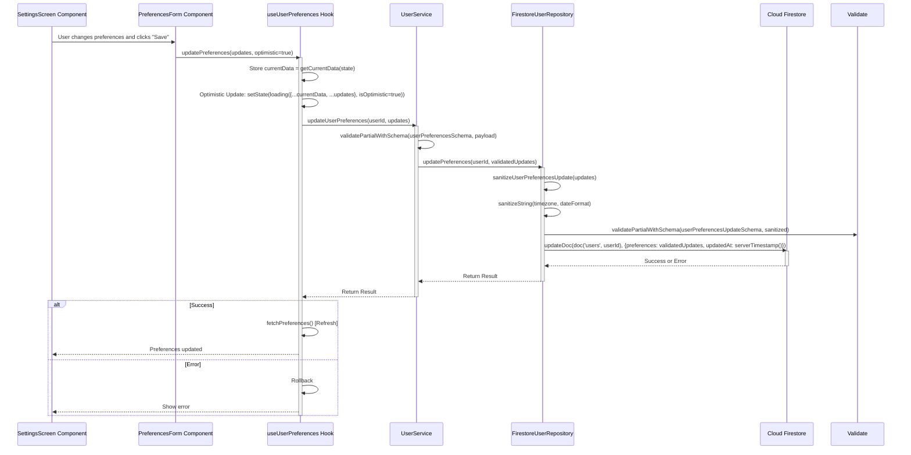
```mermaid
sequenceDiagram
    participant UI as SettingsScreen Component
    participant Form as PreferencesForm Component
    participant Hook as useUserPreferences Hook
    participant Service as UserService
    participant Repo as FirestoreUserRepository
    participant Firestore as Cloud Firestore

    UI->>Form: User changes preferences and clicks "Save"
    Form->>Hook: updatePreferences(updates, optimistic=true)
    activate Hook
    
    Hook->>Hook: Store currentData = getCurrentData(state)
    Hook->>Hook: Optimistic Update: setState(loading({...currentData, ...updates}, isOptimistic=true))
    
    Hook->>Service: updateUserPreferences(userId, updates)
    activate Service
    
    Service->>Service: validatePartialWithSchema(userPreferencesSchema, payload)
    Service->>Repo: updatePreferences(userId, validatedUpdates)
    activate Repo
    
    Repo->>Repo: sanitizeUserPreferencesUpdate(updates)
    Repo->>Repo: sanitizeString(timezone, dateFormat)
    Repo->>Validate: validatePartialWithSchema(userPreferencesUpdateSchema, sanitized)
    Repo->>Firestore: updateDoc(doc('users', userId), {preferences: validatedUpdates, updatedAt: serverTimestamp()})
    activate Firestore
    Firestore-->>Repo: Success or Error
    deactivate Firestore
    Repo-->>Service: Return Result
    deactivate Repo
    Service-->>Hook: Return Result
    deactivate Service
    
    alt Success
        Hook->>Hook: fetchPreferences() [Refresh]
        Hook-->>UI: Preferences updated
    else Error
        Hook->>Hook: Rollback
        Hook-->>UI: Show error
    end
    deactivate Hook
```

### Preferences Fields

- `notifications`: Boolean - Enable/disable notifications
- `darkMode`: Boolean - Dark mode toggle
- `language`: LanguageOption enum - UI language
- `weatherUnits`: WeatherUnit enum - Metric/Imperial
- `weekStartsOn`: Number (0-6) - Day week starts
- `marketingConsent`: Boolean - Marketing emails consent
- `timezone`: String - User timezone
- `dateFormat`: String - Date format preference
- `timeFormat`: '12h' | '24h' - Time format preference

---

## Update User Subscription Flow

### Update Subscription Process

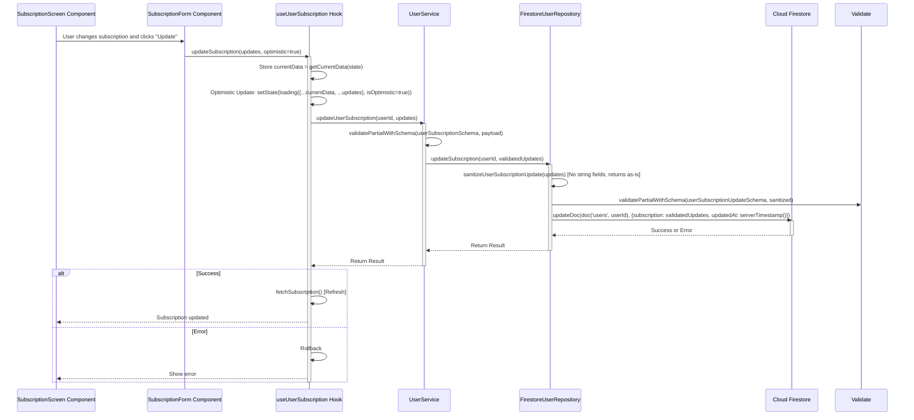
```mermaid
sequenceDiagram
    participant UI as SubscriptionScreen Component
    participant Form as SubscriptionForm Component
    participant Hook as useUserSubscription Hook
    participant Service as UserService
    participant Repo as FirestoreUserRepository
    participant Firestore as Cloud Firestore

    UI->>Form: User changes subscription and clicks "Update"
    Form->>Hook: updateSubscription(updates, optimistic=true)
    activate Hook
    
    Hook->>Hook: Store currentData = getCurrentData(state)
    Hook->>Hook: Optimistic Update: setState(loading({...currentData, ...updates}, isOptimistic=true))
    
    Hook->>Service: updateUserSubscription(userId, updates)
    activate Service
    
    Service->>Service: validatePartialWithSchema(userSubscriptionSchema, payload)
    Service->>Repo: updateSubscription(userId, validatedUpdates)
    activate Repo
    
    Repo->>Repo: sanitizeUserSubscriptionUpdate(updates) [No string fields, returns as-is]
    Repo->>Validate: validatePartialWithSchema(userSubscriptionUpdateSchema, sanitized)
    Repo->>Firestore: updateDoc(doc('users', userId), {subscription: validatedUpdates, updatedAt: serverTimestamp()})
    activate Firestore
    Firestore-->>Repo: Success or Error
    deactivate Firestore
    Repo-->>Service: Return Result
    deactivate Repo
    Service-->>Hook: Return Result
    deactivate Service
    
    alt Success
        Hook->>Hook: fetchSubscription() [Refresh]
        Hook-->>UI: Subscription updated
    else Error
        Hook->>Hook: Rollback
        Hook-->>UI: Show error
    end
    deactivate Hook
```

### Subscription Fields

- `plan`: SubscriptionPlan enum - FREE, PRO, STUDIO
- `isActive`: Boolean - Whether subscription is active
- `autoRenew`: Boolean - Auto-renewal setting
- `billingCycle`: PaymentInterval enum - MONTHLY, YEARLY
- `startDate`: Date - Subscription start date
- `endDate`: Date - Subscription end date
- `canceledAt`: Date - Cancellation date (if canceled)
- `trialEndsAt`: Date - Trial end date
- `lastPaymentDate`: Date - Last payment date
- `nextBillingDate`: Date - Next billing date

---

## Update User Setup Flow

### Update Setup Flags Process

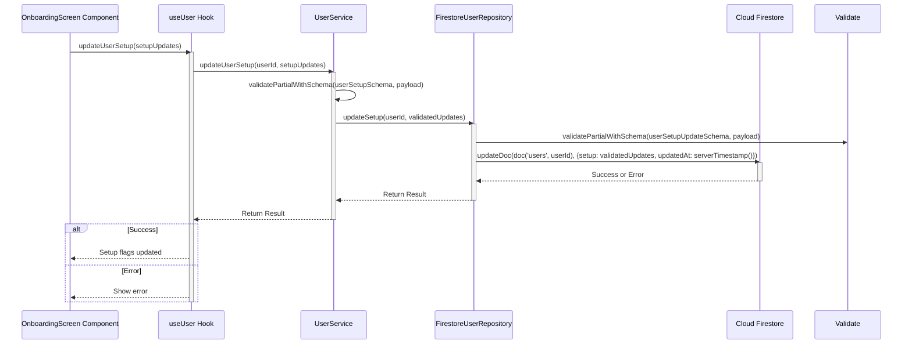
```mermaid
sequenceDiagram
    participant UI as OnboardingScreen Component
    participant Hook as useUser Hook
    participant Service as UserService
    participant Repo as FirestoreUserRepository
    participant Firestore as Cloud Firestore

    UI->>Hook: updateUserSetup(setupUpdates)
    activate Hook
    
    Hook->>Service: updateUserSetup(userId, setupUpdates)
    activate Service
    
    Service->>Service: validatePartialWithSchema(userSetupSchema, payload)
    Service->>Repo: updateSetup(userId, validatedUpdates)
    activate Repo
    
    Repo->>Validate: validatePartialWithSchema(userSetupUpdateSchema, payload)
    Repo->>Firestore: updateDoc(doc('users', userId), {setup: validatedUpdates, updatedAt: serverTimestamp()})
    activate Firestore
    Firestore-->>Repo: Success or Error
    deactivate Firestore
    Repo-->>Service: Return Result
    deactivate Repo
    Service-->>Hook: Return Result
    deactivate Service
    
    alt Success
        Hook-->>UI: Setup flags updated
    else Error
        Hook-->>UI: Show error
    end
    deactivate Hook
```

### Setup Flags

- `firstTimeSetup`: Boolean - First time setup flag
- `showOnboarding`: Boolean - Show onboarding flow
- `customKitListSetup`: Boolean - Kit list customized
- `customTaskListSetup`: Boolean - Task list customized
- `customBusinessCardSetup`: Boolean - Business card created
- `customGroupShotsSetup`: Boolean - Group shots list customized
- `customCoupleShotsSetup`: Boolean - Couple shots list customized
- `onboardingCompletedDate`: Date - When onboarding was completed

---

## Update Last Login Flow

### Update Last Login Timestamp

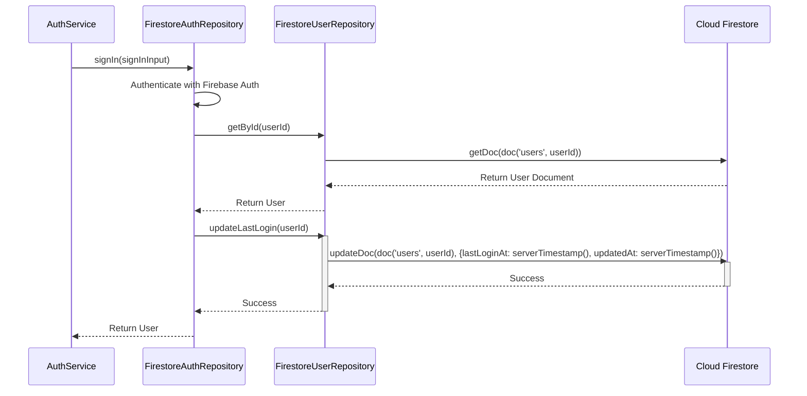
```mermaid
sequenceDiagram
    participant AuthService as AuthService
    participant AuthRepo as FirestoreAuthRepository
    participant UserRepo as FirestoreUserRepository
    participant Firestore as Cloud Firestore

    AuthService->>AuthRepo: signIn(signInInput)
    AuthRepo->>AuthRepo: Authenticate with Firebase Auth
    AuthRepo->>UserRepo: getById(userId)
    UserRepo->>Firestore: getDoc(doc('users', userId))
    Firestore-->>UserRepo: Return User Document
    UserRepo-->>AuthRepo: Return User
    
    AuthRepo->>UserRepo: updateLastLogin(userId)
    activate UserRepo
    UserRepo->>Firestore: updateDoc(doc('users', userId), {lastLoginAt: serverTimestamp(), updatedAt: serverTimestamp()})
    activate Firestore
    Firestore-->>UserRepo: Success
    deactivate Firestore
    UserRepo-->>AuthRepo: Success
    deactivate UserRepo
    AuthRepo-->>AuthService: Return User
```

---

## Update Email Verification Flow

### Update Email Verification Status

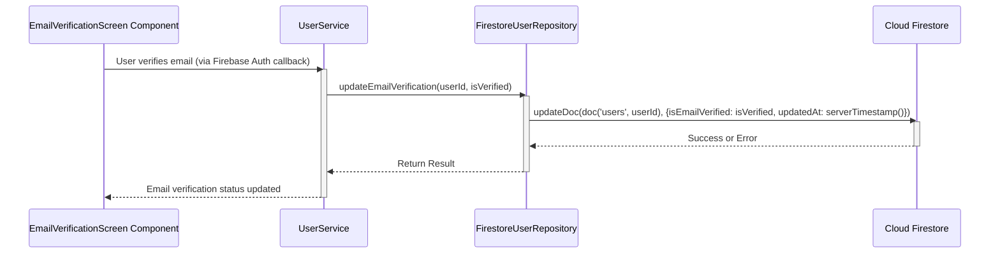
```mermaid
sequenceDiagram
    participant UI as EmailVerificationScreen Component
    participant Service as UserService
    participant Repo as FirestoreUserRepository
    participant Firestore as Cloud Firestore

    UI->>Service: User verifies email (via Firebase Auth callback)
    activate Service
    Service->>Repo: updateEmailVerification(userId, isVerified)
    activate Repo
    
    Repo->>Firestore: updateDoc(doc('users', userId), {isEmailVerified: isVerified, updatedAt: serverTimestamp()})
    activate Firestore
    Firestore-->>Repo: Success or Error
    deactivate Firestore
    Repo-->>Service: Return Result
    deactivate Repo
    Service-->>UI: Email verification status updated
    deactivate Service
```

---

## Real-time User Subscription Flow

### Subscribe to User Updates

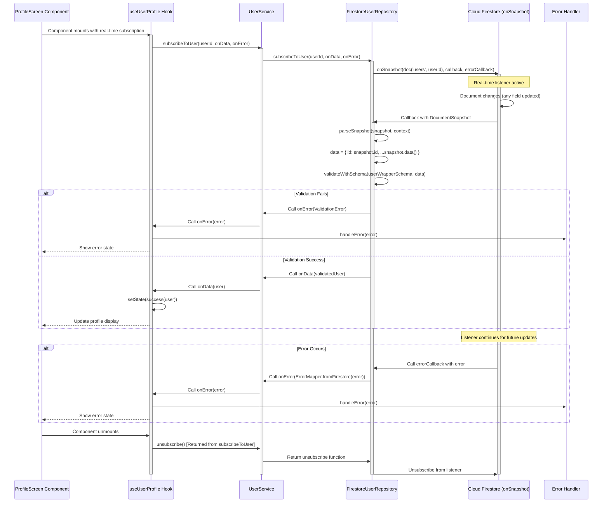
```mermaid
sequenceDiagram
    participant UI as ProfileScreen Component
    participant Hook as useUserProfile Hook
    participant Service as UserService
    participant Repo as FirestoreUserRepository
    participant Firestore as Cloud Firestore (onSnapshot)
    participant ErrorHandler as Error Handler

    UI->>Hook: Component mounts with real-time subscription
    activate Hook
    
    Hook->>Service: subscribeToUser(userId, onData, onError)
    activate Service
    Service->>Repo: subscribeToUser(userId, onData, onError)
    activate Repo
    
    Repo->>Firestore: onSnapshot(doc('users', userId), callback, errorCallback)
    activate Firestore
    Note over Firestore: Real-time listener active
    
    Firestore->>Firestore: Document changes (any field updated)
    Firestore->>Repo: Callback with DocumentSnapshot
    activate Repo
    
    Repo->>Repo: parseSnapshot(snapshot, context)
    Repo->>Repo: data = { id: snapshot.id, ...snapshot.data() }
    Repo->>Repo: validateWithSchema(userWrapperSchema, data)
    
    alt Validation Fails
        Repo->>Service: Call onError(ValidationError)
        Service->>Hook: Call onError(error)
        Hook->>ErrorHandler: handleError(error)
        Hook-->>UI: Show error state
    else Validation Success
        Repo->>Service: Call onData(validatedUser)
        Service->>Hook: Call onData(user)
        Hook->>Hook: setState(success(user))
        Hook-->>UI: Update profile display
    end
    deactivate Repo
    
    Note over Firestore: Listener continues for future updates
    
    alt Error Occurs
        Firestore->>Repo: Call errorCallback with error
        Repo->>Service: Call onError(ErrorMapper.fromFirestore(error))
        Service->>Hook: Call onError(error)
        Hook->>ErrorHandler: handleError(error)
        Hook-->>UI: Show error state
    end
    
    UI->>Hook: Component unmounts
    Hook->>Service: unsubscribe() [Returned from subscribeToUser]
    Service->>Repo: Return unsubscribe function
    Repo->>Firestore: Unsubscribe from listener
    deactivate Firestore
    deactivate Repo
    deactivate Service
    deactivate Hook
```

---

## Admin Operations

### Get All Users Flow

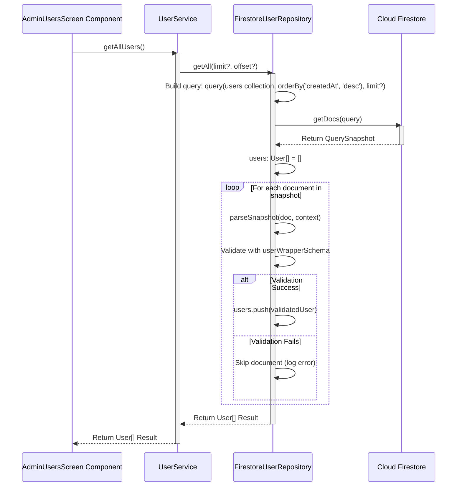
```mermaid
sequenceDiagram
    participant UI as AdminUsersScreen Component
    participant Service as UserService
    participant Repo as FirestoreUserRepository
    participant Firestore as Cloud Firestore

    UI->>Service: getAllUsers()
    activate Service
    Service->>Repo: getAll(limit?, offset?)
    activate Repo
    
    Repo->>Repo: Build query: query(users collection, orderBy('createdAt', 'desc'), limit?)
    Repo->>Firestore: getDocs(query)
    activate Firestore
    Firestore-->>Repo: Return QuerySnapshot
    deactivate Firestore
    
    Repo->>Repo: users: User[] = []
    loop For each document in snapshot
        Repo->>Repo: parseSnapshot(doc, context)
        Repo->>Repo: Validate with userWrapperSchema
        alt Validation Success
            Repo->>Repo: users.push(validatedUser)
        else Validation Fails
            Repo->>Repo: Skip document (log error)
        end
    end
    
    Repo-->>Service: Return User[] Result
    deactivate Repo
    Service-->>UI: Return User[] Result
    deactivate Service
```

### Ban User Flow

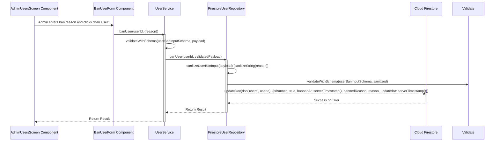
```mermaid
sequenceDiagram
    participant UI as AdminUsersScreen Component
    participant Form as BanUserForm Component
    participant Service as UserService
    participant Repo as FirestoreUserRepository
    participant Firestore as Cloud Firestore

    UI->>Form: Admin enters ban reason and clicks "Ban User"
    Form->>Service: banUser(userId, {reason})
    activate Service
    
    Service->>Service: validateWithSchema(userBanInputSchema, payload)
    Service->>Repo: banUser(userId, validatedPayload)
    activate Repo
    
    Repo->>Repo: sanitizeUserBanInput(payload) [sanitizeString(reason)]
    Repo->>Validate: validateWithSchema(userBanInputSchema, sanitized)
    Repo->>Firestore: updateDoc(doc('users', userId), {isBanned: true, bannedAt: serverTimestamp(), bannedReason: reason, updatedAt: serverTimestamp()})
    activate Firestore
    Firestore-->>Repo: Success or Error
    deactivate Firestore
    Repo-->>Service: Return Result
    deactivate Repo
    Service-->>UI: Return Result
    deactivate Service
```

### Unban User Flow

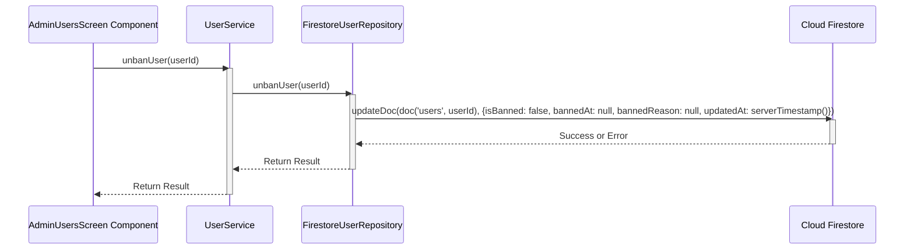
```mermaid
sequenceDiagram
    participant UI as AdminUsersScreen Component
    participant Service as UserService
    participant Repo as FirestoreUserRepository
    participant Firestore as Cloud Firestore

    UI->>Service: unbanUser(userId)
    activate Service
    Service->>Repo: unbanUser(userId)
    activate Repo
    
    Repo->>Firestore: updateDoc(doc('users', userId), {isBanned: false, bannedAt: null, bannedReason: null, updatedAt: serverTimestamp()})
    activate Firestore
    Firestore-->>Repo: Success or Error
    deactivate Firestore
    Repo-->>Service: Return Result
    deactivate Repo
    Service-->>UI: Return Result
    deactivate Service
```

### Update User Role Flow

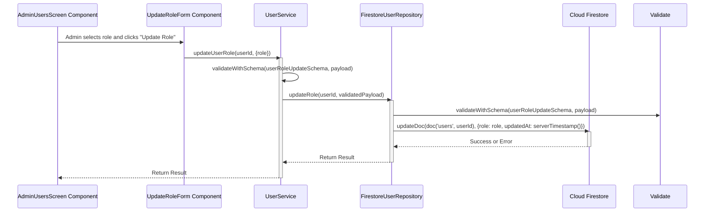
```mermaid
sequenceDiagram
    participant UI as AdminUsersScreen Component
    participant Form as UpdateRoleForm Component
    participant Service as UserService
    participant Repo as FirestoreUserRepository
    participant Firestore as Cloud Firestore

    UI->>Form: Admin selects role and clicks "Update Role"
    Form->>Service: updateUserRole(userId, {role})
    activate Service
    
    Service->>Service: validateWithSchema(userRoleUpdateSchema, payload)
    Service->>Repo: updateRole(userId, validatedPayload)
    activate Repo
    
    Repo->>Validate: validateWithSchema(userRoleUpdateSchema, payload)
    Repo->>Firestore: updateDoc(doc('users', userId), {role: role, updatedAt: serverTimestamp()})
    activate Firestore
    Firestore-->>Repo: Success or Error
    deactivate Firestore
    Repo-->>Service: Return Result
    deactivate Repo
    Service-->>UI: Return Result
    deactivate Service
```

### Delete User Flow (Soft Delete)

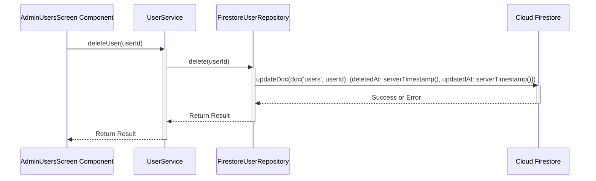
```mermaid
sequenceDiagram
    participant UI as AdminUsersScreen Component
    participant Service as UserService
    participant Repo as FirestoreUserRepository
    participant Firestore as Cloud Firestore

    UI->>Service: deleteUser(userId)
    activate Service
    Service->>Repo: delete(userId)
    activate Repo
    
    Repo->>Firestore: updateDoc(doc('users', userId), {deletedAt: serverTimestamp(), updatedAt: serverTimestamp()})
    activate Firestore
    Firestore-->>Repo: Success or Error
    deactivate Firestore
    Repo-->>Service: Return Result
    deactivate Repo
    Service-->>UI: Return Result
    deactivate Service
```

### Permanently Delete User Flow (Hard Delete)

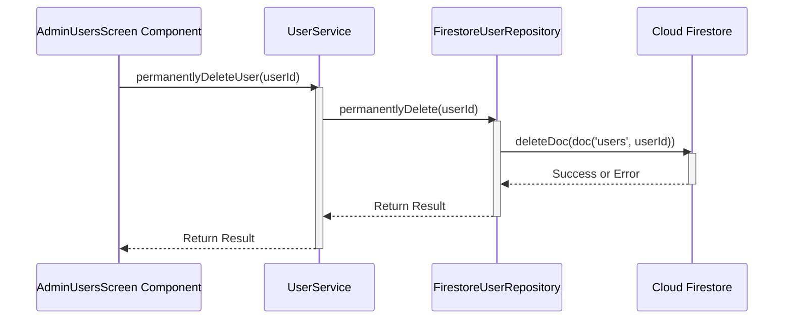
```mermaid
sequenceDiagram
    participant UI as AdminUsersScreen Component
    participant Service as UserService
    participant Repo as FirestoreUserRepository
    participant Firestore as Cloud Firestore

    UI->>Service: permanentlyDeleteUser(userId)
    activate Service
    Service->>Repo: permanentlyDelete(userId)
    activate Repo
    
    Repo->>Firestore: deleteDoc(doc('users', userId))
    activate Firestore
    Firestore-->>Repo: Success or Error
    deactivate Firestore
    Repo-->>Service: Return Result
    deactivate Repo
    Service-->>UI: Return Result
    deactivate Service
```

### Subscribe to All Users Flow (Admin)

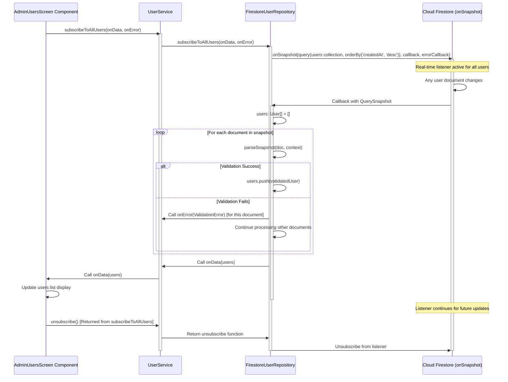
```mermaid
sequenceDiagram
    participant UI as AdminUsersScreen Component
    participant Service as UserService
    participant Repo as FirestoreUserRepository
    participant Firestore as Cloud Firestore (onSnapshot)

    UI->>Service: subscribeToAllUsers(onData, onError)
    activate Service
    Service->>Repo: subscribeToAllUsers(onData, onError)
    activate Repo
    
    Repo->>Firestore: onSnapshot(query(users collection, orderBy('createdAt', 'desc')), callback, errorCallback)
    activate Firestore
    Note over Firestore: Real-time listener active for all users
    
    Firestore->>Firestore: Any user document changes
    Firestore->>Repo: Callback with QuerySnapshot
    activate Repo
    
    Repo->>Repo: users: User[] = []
    loop For each document in snapshot
        Repo->>Repo: parseSnapshot(doc, context)
        alt Validation Success
            Repo->>Repo: users.push(validatedUser)
        else Validation Fails
            Repo->>Service: Call onError(ValidationError) [for this document]
            Repo->>Repo: Continue processing other documents
        end
    end
    
    Repo->>Service: Call onData(users)
    Service->>UI: Call onData(users)
    UI->>UI: Update users list display
    
    deactivate Repo
    Note over Firestore: Listener continues for future updates
    
    UI->>Service: unsubscribe() [Returned from subscribeToAllUsers]
    Service->>Repo: Return unsubscribe function
    Repo->>Firestore: Unsubscribe from listener
    deactivate Firestore
    deactivate Repo
    deactivate Service
```

---

## Data Structures

### User Structure

```typescript
interface User {
  id: string;                           // User ID (Firebase Auth UID)
  name: PersonInfo;                     // { firstName: string, lastName: string }
  displayName?: string;                 // 1-100 chars, trimmed
  email: string;                        // Valid email, sanitized and lowercased
  phone?: string;                      // Valid phone number or null
  lastLoginAt?: Date;                  // Last login timestamp
  role?: UserRole;                     // USER | ADMIN, default: USER
  isEmailVerified?: boolean;          // Default: false
  isActive?: boolean;                  // Default: true
  isBanned?: boolean;                  // Default: false
  bannedAt?: Date;                     // Ban timestamp
  bannedReason?: string;               // Ban reason
  deletedAt?: Date;                    // Soft delete timestamp
  preferences?: UserPreferences;       // User preferences object
  subscription?: UserSubscription;      // Subscription object
  setup?: UserSetup;                   // Setup flags object
  projects?: UserProjects;             // Projects tracking object
  customizations?: CustomizationsInfo;  // Customizations object
  metadata?: BaseMetadata;              // Metadata object
  createdAt?: Date;                    // Creation timestamp
  updatedAt?: Date;                    // Last update timestamp
}
```

### UserPreferences Structure

```typescript
interface UserPreferences {
  id: string;                           // Same as userId
  userId: string;                       // User ID
  notifications: boolean;               // Default: true
  darkMode: boolean;                    // Default: false
  language: LanguageOption;            // Default: ENGLISH
  weatherUnits: WeatherUnit;           // Default: METRIC
  weekStartsOn?: number;               // 0-6, Default: 1 (Monday)
  marketingConsent: boolean;           // Default: false
  timezone: string;                    // Default: 'UTC'
  dateFormat: string;                  // Default: 'DD/MM/YYYY'
  timeFormat: '12h' | '24h';           // Default: '24h'
}
```

### UserSubscription Structure

```typescript
interface UserSubscription {
  id: string;                           // Same as userId
  plan: SubscriptionPlan;              // FREE | PRO | STUDIO, Default: PRO
  isActive: boolean;                    // Default: true
  autoRenew: boolean;                   // Default: true
  startDate: Date;                      // Subscription start date
  endDate?: Date;                       // Subscription end date
  canceledAt?: Date;                    // Cancellation date
  trialEndsAt?: Date;                   // Trial end date
  transactionId?: string;              // Payment transaction ID
  receipt?: string;                    // Payment receipt
  lastPaymentDate?: Date;               // Last payment date
  nextBillingDate?: Date;              // Next billing date
  billingCycle: PaymentInterval;       // MONTHLY | YEARLY, Default: MONTHLY
}
```

### UserSetup Structure

```typescript
interface UserSetup {
  firstTimeSetup: boolean;             // Default: true
  showOnboarding: boolean;             // Default: true
  customKitListSetup: boolean;         // Default: false
  customTaskListSetup: boolean;        // Default: false
  customBusinessCardSetup: boolean;     // Default: false
  customGroupShotsSetup: boolean;       // Default: false
  customCoupleShotsSetup: boolean;      // Default: false
  onboardingCompletedDate?: Date;       // When onboarding completed
}
```

---

## Validation & Sanitization

### Validation Rules

**User Profile Validation**:
- Uses `userWrapperUpdateSchema` (partial schema)
- `displayName`: Optional, 1-100 characters if provided, trimmed
- `email`: Optional, must be valid email if provided, sanitized
- `phone`: Optional, must be valid phone format if provided
- `name`: Optional, must have `firstName` and `lastName` if provided

**UserPreferences Validation**:
- Uses `userPreferencesUpdateSchema` (partial schema)
- `notifications`, `darkMode`, `marketingConsent`: Boolean
- `language`: Must be valid `LanguageOption` enum
- `weatherUnits`: Must be valid `WeatherUnit` enum
- `timezone`: String, sanitized
- `dateFormat`: String, sanitized
- `timeFormat`: '12h' | '24h'

**UserSubscription Validation**:
- Uses `userSubscriptionUpdateSchema` (partial schema)
- `plan`: Must be valid `SubscriptionPlan` enum
- `isActive`, `autoRenew`: Boolean
- `billingCycle`: Must be valid `PaymentInterval` enum
- Date fields: Valid Date objects

**UserSetup Validation**:
- Uses `userSetupUpdateSchema` (partial schema)
- All fields: Boolean (except `onboardingCompletedDate` which is Date)

**UserBanInput Validation**:
- `reason`: Required string, 1-500 characters

**UserRoleUpdate Validation**:
- `role`: Required, must be valid `UserRole` enum

### Sanitization Process

**Sanitize User Update**:
```typescript
private sanitizeUserUpdate(payload: UserUpdate): UserUpdate {
  const sanitized: UserUpdate = { ...payload };
  
  if (sanitized.displayName !== undefined) {
    sanitized.displayName = sanitizeString(sanitized.displayName) || undefined;
  }
  if (sanitized.email !== undefined) {
    sanitized.email = sanitizeEmail(sanitized.email);
  }
  if (sanitized.phone !== undefined && sanitized.phone !== null) {
    sanitized.phone = sanitizePhone(sanitized.phone) || undefined;
  }
  if (sanitized.name !== undefined) {
    sanitized.name = {
      ...sanitized.name,
      firstName: sanitizeString(sanitized.name.firstName),
      lastName: sanitizeString(sanitized.name.lastName),
    };
  }
  
  return sanitized;
}
```

**Sanitize User Create**:
```typescript
private sanitizeUserCreate(payload: UserCreate): UserCreate {
  return {
    ...payload,
    displayName: payload.displayName ? sanitizeString(payload.displayName) : payload.displayName,
    email: sanitizeEmail(payload.email),
    phone: payload.phone ? sanitizePhone(payload.phone) : payload.phone,
    name: {
      ...payload.name,
      firstName: sanitizeString(payload.name.firstName),
      lastName: sanitizeString(payload.name.lastName),
    },
    bannedReason: payload.bannedReason
      ? sanitizeString(payload.bannedReason)
      : payload.bannedReason,
  };
}
```

**Sanitize User Preferences Update**:
```typescript
private sanitizeUserPreferencesUpdate(payload: UserPreferencesUpdate): UserPreferencesUpdate {
  const sanitized: UserPreferencesUpdate = { ...payload };
  
  if (sanitized.timezone !== undefined) {
    sanitized.timezone = sanitizeString(sanitized.timezone);
  }
  if (sanitized.dateFormat !== undefined) {
    sanitized.dateFormat = sanitizeString(sanitized.dateFormat);
  }
  
  return sanitized;
}
```

---

## Error Handling

### Error Types

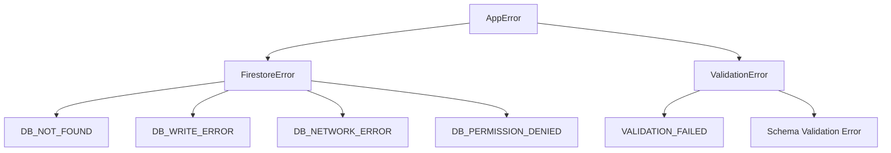
```mermaid
graph TD
    A[AppError] --> B[FirestoreError]
    A --> C[ValidationError]
    
    B --> D[DB_NOT_FOUND]
    B --> E[DB_WRITE_ERROR]
    B --> F[DB_NETWORK_ERROR]
    B --> G[DB_PERMISSION_DENIED]
    
    C --> H[VALIDATION_FAILED]
    C --> I[Schema Validation Error]
```

### Error Mapping

- **User Not Found**: `DB_NOT_FOUND` - "User not found."
- **Write Errors**: `DB_WRITE_ERROR` - "Failed to update user. Please try again."
- **Network Errors**: `DB_NETWORK_ERROR` - "Service temporarily unavailable."
- **Permission Errors**: `DB_PERMISSION_DENIED` - "You do not have permission."
- **Validation Errors**: `VALIDATION_FAILED` - Field-specific errors from Zod
- **Invalid Email**: `VALIDATION_FAILED` - "Please provide a valid email address."
- **Invalid Phone**: `VALIDATION_FAILED` - "Please provide a valid phone number."

---

## Loading States

### State Transitions

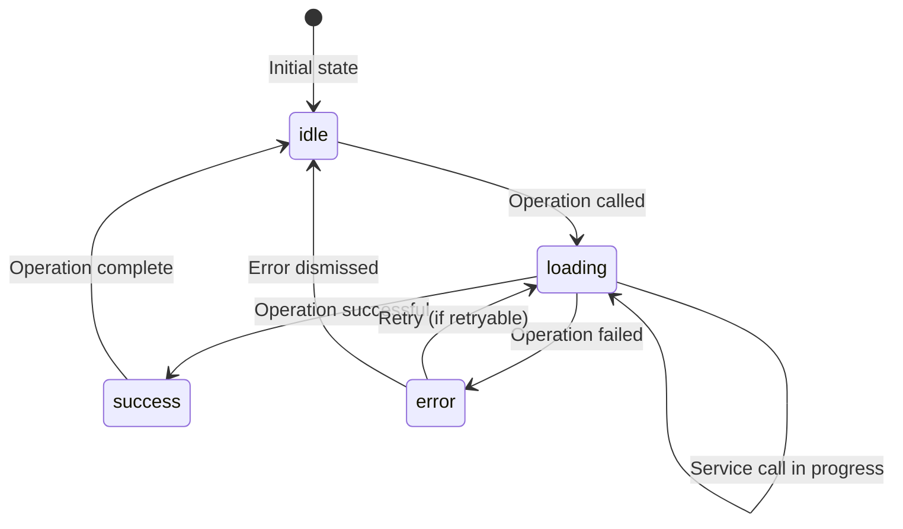
```mermaid
stateDiagram-v2
    [*] --> idle: Initial state
    idle --> loading: Operation called
    loading --> loading: Optimistic update applied (if enabled)
    loading --> loading: Service call in progress
    loading --> success: Operation successful
    loading --> error: Operation failed
    error --> loading: Retry (if retryable)
    success --> idle: Operation complete
    error --> idle: Error dismissed
```

### LoadingState Type

```typescript
type LoadingState<T> =
  | { status: 'idle' }
  | { status: 'loading'; data?: T; isOptimistic?: boolean }
  | { status: 'success'; data: T }
  | { status: 'error'; error: AppError; data?: T; isOptimistic?: boolean };
```

### Loading State Management

```typescript
// Initial state
const [state, setState] = useState<LoadingState<User>>(loading());

// Fetch operation
setState(prevState => loading(getCurrentData(prevState)));
// ... async operation ...
setState(success(data)); // or error(error, previousData)

// Optimistic update
setState(loading({...currentData, ...updates}, true)); // isOptimistic=true
// ... async operation ...
setState(success(updatedData)); // or error(error, currentData, true)
```

---

## File Structure

### Key Files

| File | Purpose |
|------|---------|
| `src/repositories/i-user-repository.ts` | Port interface definition |
| `src/repositories/firestore/firestore-user-repository.ts` | Repository implementation |
| `src/services/user-service.ts` | Business logic layer |
| `src/hooks/use-user.ts` | React hooks (useUserProfile, useUserPreferences, useUserSubscription) |
| `src/domain/user/user.schema.ts` | Zod schemas for user data |
| `src/utils/loading-state.ts` | Loading state utilities |

---

## Hooks Usage

### useUserProfile Hook

```typescript
const {
  profile,
  state,
  loading,
  error,
  fetchProfile,
  updateProfile,
  refresh,
} = useUserProfile(userId, { autoFetch: true });

// Update profile with optimistic update
await updateProfile({
  displayName: 'New Name',
  email: 'newemail@example.com',
}, true); // optimistic = true

// Fetch profile manually
await fetchProfile();
```

### useUserPreferences Hook

```typescript
const {
  preferences,
  state,
  loading,
  error,
  fetchPreferences,
  updatePreferences,
  refresh,
} = useUserPreferences(userId, { autoFetch: true });

// Update preferences
await updatePreferences({
  darkMode: true,
  language: LanguageOption.SPANISH,
  timezone: 'America/New_York',
}, true);
```

### useUserSubscription Hook

```typescript
const {
  subscription,
  state,
  loading,
  error,
  fetchSubscription,
  updateSubscription,
  refresh,
} = useUserSubscription(userId, { autoFetch: true });

// Update subscription
await updateSubscription({
  plan: SubscriptionPlan.STUDIO,
  autoRenew: true,
}, true);
```

---

## Ports & Adapters

### Architecture Pattern

- **Port**: `IUserRepository` interface
- **Adapter**: `FirestoreUserRepository` implementation
- **Service**: `UserService` business logic
- **Hook**: `useUserProfile`, `useUserPreferences`, `useUserSubscription` React hooks

### Dependency Injection

```typescript
// Service Factory creates service with repository
const userService = new UserService(userRepository);
```

### Repository Methods

| Method | Purpose |
|--------|---------|
| `getById(userId)` | Retrieve user by ID |
| `updateProfile(userId, payload)` | Update profile information |
| `updatePreferences(userId, payload)` | Update user preferences |
| `updateSubscription(userId, payload)` | Update subscription |
| `updateSetup(userId, payload)` | Update setup flags |
| `updateLastLogin(userId)` | Update last login timestamp |
| `updateEmailVerification(userId, isVerified)` | Update email verification status |
| `subscribeToUser(userId, onData, onError)` | Real-time user subscription |
| `create(payload)` | Create user (admin/internal) |
| `getAll(limit?, offset?)` | Get all users (admin) |
| `banUser(userId, payload)` | Ban user (admin) |
| `unbanUser(userId)` | Unban user (admin) |
| `updateRole(userId, payload)` | Update user role (admin) |
| `delete(userId)` | Soft delete user (admin) |
| `permanentlyDelete(userId)` | Hard delete user (admin) |
| `subscribeToAllUsers(onData, onError)` | Real-time all users subscription (admin) |

---

## Simple Explanations

### What is a User?

A **User** is your profile in the system. It contains:
- **Personal Info**: Name, email, phone
- **Preferences**: Language, theme, notifications, timezone, date format
- **Subscription**: Your plan, billing cycle, payment info
- **Setup Flags**: Which parts of the app you've set up
- **Projects**: Tracking of your photography projects
- **Status**: Active, banned, verified, etc.

### What Happens When You Update Your Profile?

1. **Validate Input**: System checks your changes are valid
2. **Sanitize**: Cleans strings (trims whitespace, normalizes email)
3. **Optimistic Update**: Changes appear immediately in UI
4. **Save to Firestore**: Updates are written to `users/{userId}` document
5. **Refresh**: Fetches updated profile from server
6. **Rollback**: If save fails, UI reverts to previous state

### What are User Preferences?

**User Preferences** are your app settings:
- **Notifications**: On/off toggle
- **Dark Mode**: Light/dark theme
- **Language**: UI language (English, Spanish, etc.)
- **Timezone**: Your timezone for dates/times
- **Date Format**: How dates are displayed
- **Time Format**: 12-hour or 24-hour clock

You can update preferences individually without affecting other parts of your profile.

### What is User Subscription?

**User Subscription** tracks your payment plan:
- **Plan**: FREE, PRO, or STUDIO
- **Active Status**: Whether subscription is currently active
- **Auto-renew**: Whether to automatically renew
- **Billing Cycle**: Monthly or yearly
- **Dates**: Start, end, trial end, payment dates

Subscription updates are typically handled by payment processing systems, but can be updated manually by admins.

### What are Setup Flags?

**Setup Flags** track which parts of the app you've configured:
- `firstTimeSetup`: True if you're a new user
- `showOnboarding`: Whether to show onboarding flow
- `customKitListSetup`: Whether you've customized your kit list
- `customBusinessCardSetup`: Whether you've created a business card
- etc.

These flags help the app show you the right screens and features.

### How Does Real-time Subscription Work?

**Real-time Subscription** automatically updates the UI when user data changes:

1. **Setup Listener**: Firestore `onSnapshot` listener is set up
2. **Monitor Changes**: Listener watches the user document
3. **Receive Updates**: When any field changes, callback fires
4. **Validate**: New data is validated against schema
5. **Update UI**: UI automatically updates with new data
6. **Cleanup**: Listener is removed when component unmounts

**Benefits**:
- UI stays in sync with database
- No need to manually refresh
- Multiple devices see updates instantly

### What Happens When You Update Preferences?

1. **Optimistic Update**: Preference change appears immediately
2. **Validate**: System validates the preference value
3. **Sanitize**: String fields are cleaned (timezone, dateFormat)
4. **Save**: Only `preferences` field is updated in Firestore
5. **Refresh**: Preferences are refreshed from server
6. **Rollback**: If save fails, preference reverts

### What is Last Login Tracking?

**Last Login** records when you last signed in:
- Updated automatically during sign-in
- Stored as `lastLoginAt` timestamp
- Used for analytics and security

### What is Email Verification?

**Email Verification** tracks if your email is verified:
- Set to `false` initially
- Updated when you verify via Firebase Auth email link
- Used to restrict certain features until verified

### Admin Operations Explained

**Get All Users**:
- Retrieves list of all users (for admin panels)
- Supports pagination with `limit` and `offset`
- Ordered by creation date (newest first)

**Ban User**:
- Sets `isBanned` to `true`
- Records `bannedAt` timestamp and `bannedReason`
- Banned users cannot access the app

**Unban User**:
- Sets `isBanned` to `false`
- Clears `bannedAt` and `bannedReason`

**Update Role**:
- Changes user's role (USER → ADMIN or vice versa)
- Affects permissions and feature access

**Delete User** (Soft Delete):
- Sets `deletedAt` timestamp
- User document remains in database
- Can be restored by clearing `deletedAt`

**Permanently Delete User** (Hard Delete):
- Removes user document from Firestore
- Cannot be undone
- Use with extreme caution

---

## Summary Flow Charts

### Complete User Lifecycle

```mermaid
graph TD
    Start[User Signs Up] --> CreateUser[Create User Document]
    CreateUser --> SetDefaults[Apply Default Preferences, Subscription, Setup]
    SetDefaults --> VerifyEmail[Send Email Verification]
    VerifyEmail --> Onboarding[Show Onboarding]
    
    Onboarding --> UserAction{User Action}
    UserAction -->|Update Profile| UpdateProfile[Update Profile with Optimistic Update]
    UserAction -->|Change Preferences| UpdatePreferences[Update Preferences]
    UserAction -->|Change Subscription| UpdateSubscription[Update Subscription]
    UserAction -->|Complete Setup| UpdateSetup[Update Setup Flags]
    
    UpdateProfile --> Save[Save to Firestore]
    UpdatePreferences --> Save
    UpdateSubscription --> Save
    UpdateSetup --> Save
    
    Save -->|Success| Refresh[Refresh from Server]
    Save -->|Error| Rollback[Rollback Optimistic Update]
    Rollback --> ShowError[Show Error]
    Refresh --> Display[Display Updated Data]
    
    UserAction -->|Sign In| UpdateLogin[Update Last Login]
    UpdateLogin --> Display
```

### Optimistic Update Pattern for User

```mermaid
stateDiagram-v2
    [*] --> CurrentState: User edits profile
    CurrentState --> OptimisticUpdate: Apply UI change immediately
    OptimisticUpdate --> Loading: Call updateUserProfile
    Loading -->|Success| ServerState: Server confirms
    Loading -->|Error| Rollback: Revert to previous state
    Rollback --> ErrorState: Show error message
    ServerState --> Refresh: Fetch latest from server
    Refresh --> CurrentState: Update with server data
    ErrorState --> CurrentState: User dismisses error
```

---

## Key Takeaways

1. **User Creation**: Happens during sign-up with default values for preferences, subscription, and setup
2. **Optimistic Updates**: Profile and preferences updates use optimistic UI with rollback on error
3. **Partial Updates**: Can update profile, preferences, subscription, or setup independently
4. **Real-time Subscriptions**: Optional real-time updates via Firestore `onSnapshot`
5. **Loading States**: Advanced `LoadingState` type with support for optimistic updates and error recovery
6. **Validation**: Comprehensive Zod schema validation at service and repository layers
7. **Sanitization**: All string fields sanitized (email, phone, displayName, timezone, etc.)
8. **Error Handling**: Graceful error handling with user-friendly messages and rollback
9. **Admin Operations**: Full suite of admin operations (get all, ban, unban, update role, delete)
10. **Default Values**: Comprehensive default values for preferences, subscription, setup, and projects

---

*Document generated: 2025-01-XX*
*Last updated: Based on current codebase structure*

