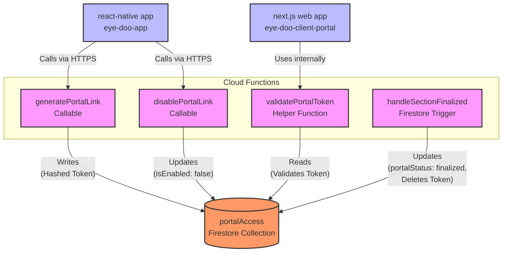
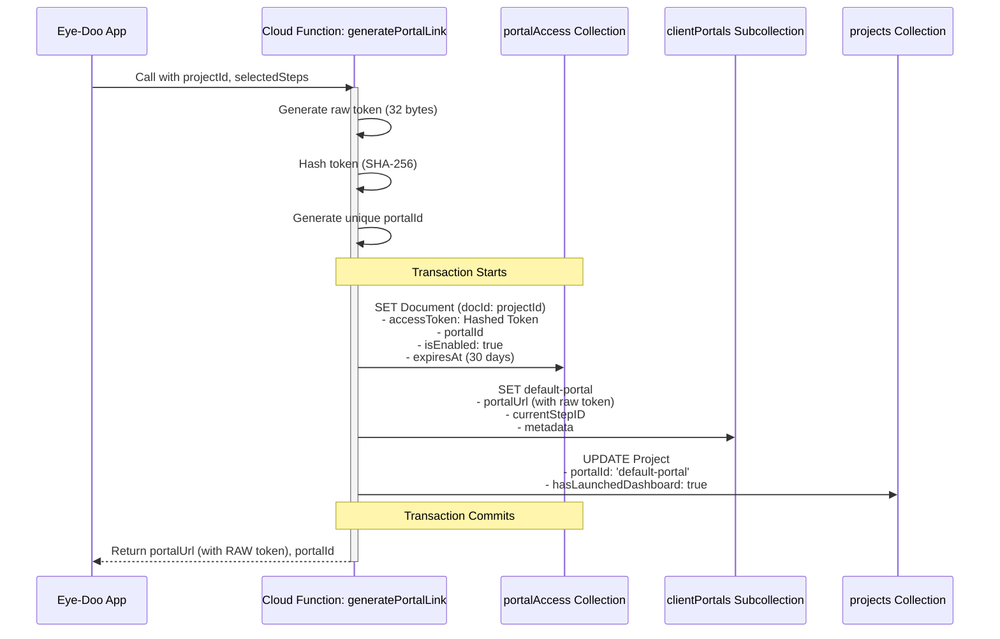
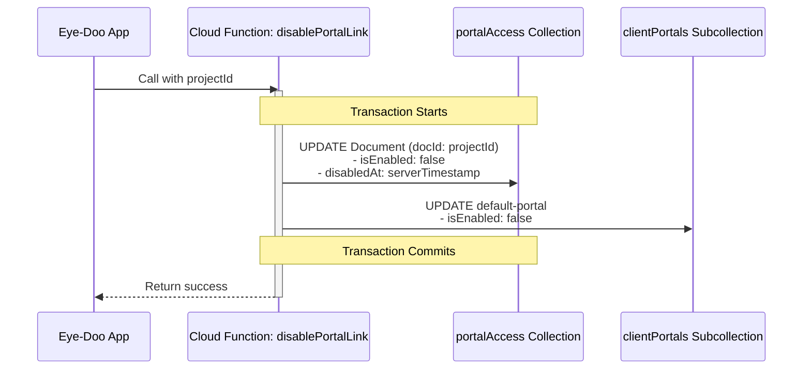
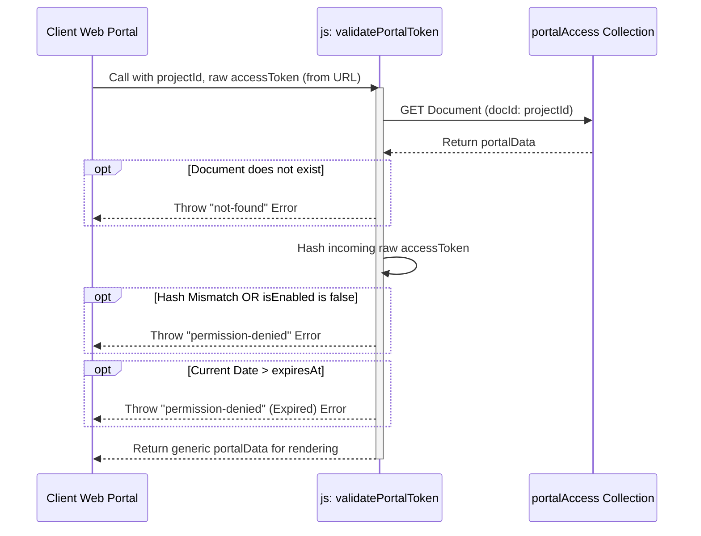
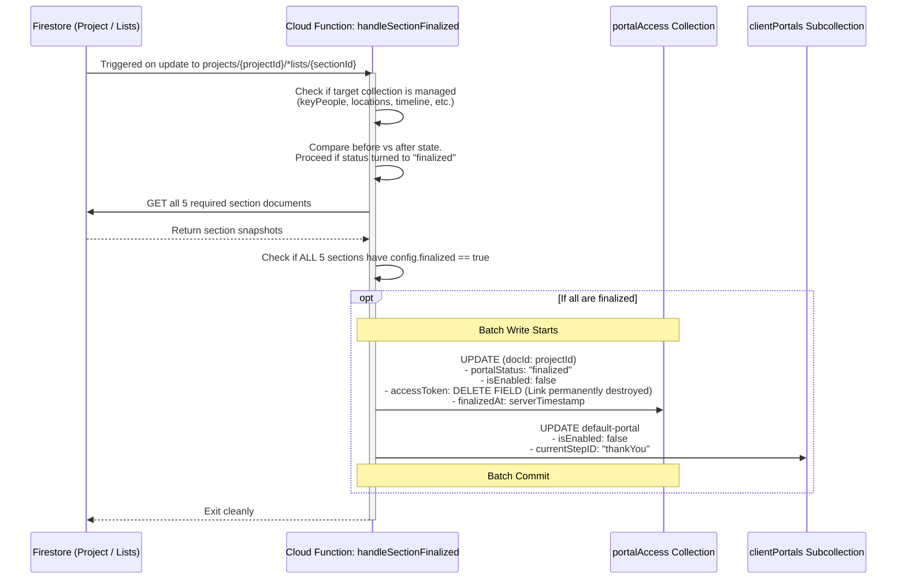

# `portalAccess` Firestore Collection Data Flows

This document contains Mermaid diagrams illustrating all interactions, triggers, Cloud Functions, and helpers that read from or write to the `portalAccess` Firestore collection based on current backend implementations.

## 1. High-Level Architecture & Interactions

This diagram shows the major components that interact with the `portalAccess` collection.

## 2. `generatePortalLink` Flow

Triggered when the photographer creates a new Client Portal. This function handles the secure token generation and storage.

## 3. `disablePortalLink` Flow

Triggered when the photographer manually revokes portal access.

## 4. `validatePortalToken` Flow

An internal helper function used to verify a client's access when they attempt to view the Web Portal.

## 5. Background Trigger (`handleSectionFinalized`) Flow

A Firestore `onDocumentUpdated` background trigger that locks the portal once all required sections are completed/finalized by the photographer.

## Relevant Code Files
- **Cloud Functions:** `functions/index.js` (Separate repository folder: `eye-doo-client-portal/functions`)
- **App Configuration:** `src/domain/project/portal.schema.ts` explicitly acknowledges `// accessToken is still excluded — it only lives in portalAccess collection.`
