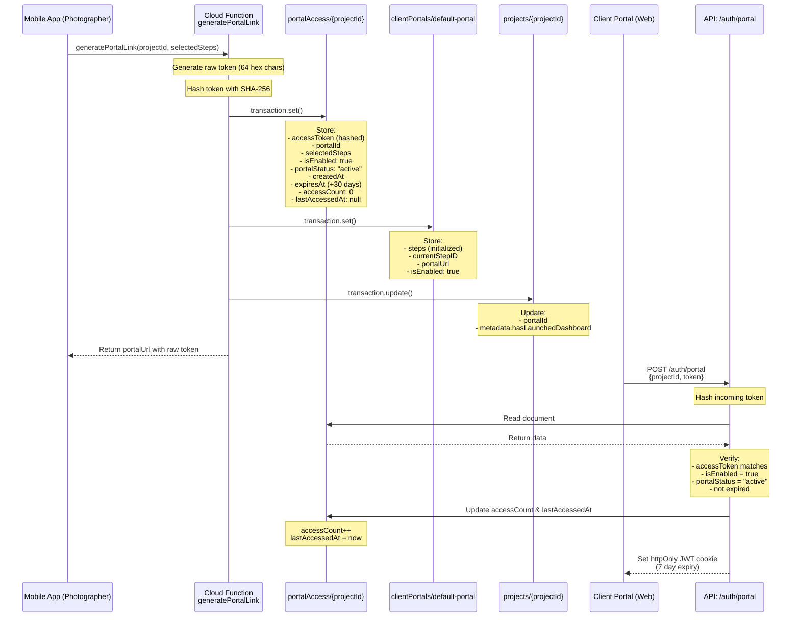
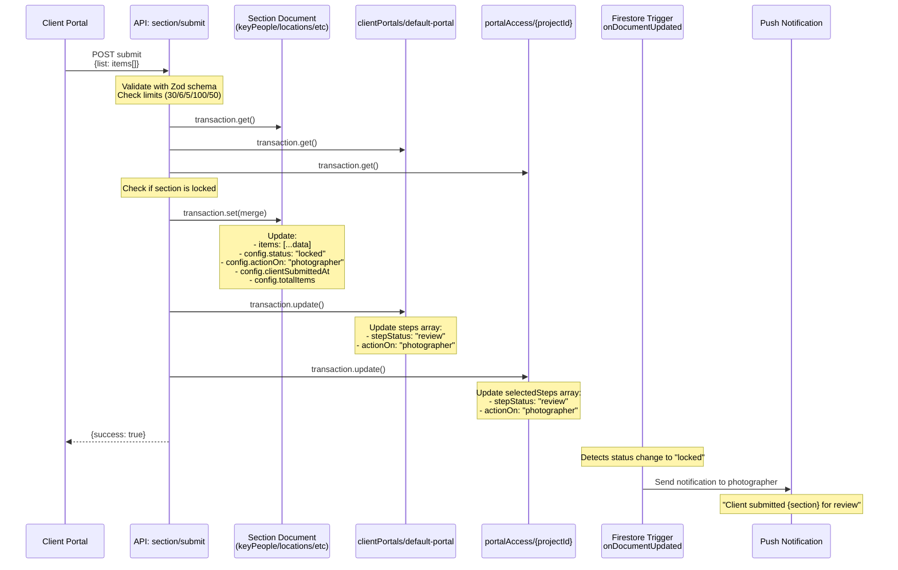
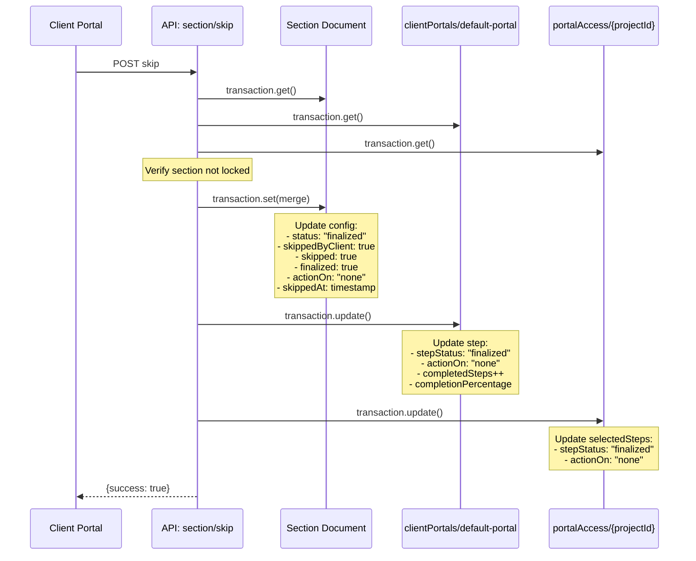
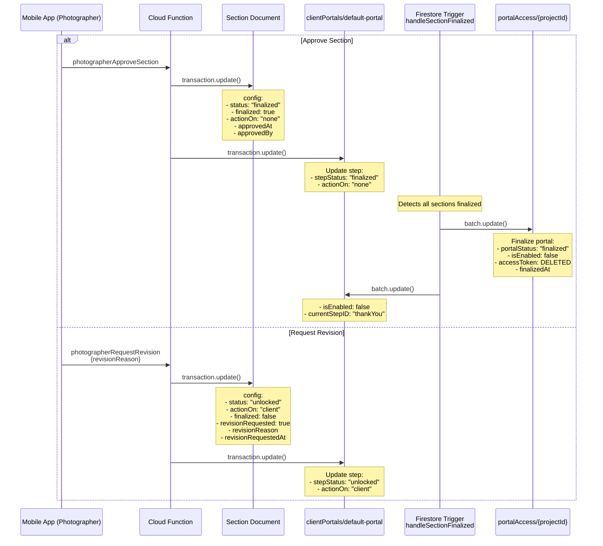
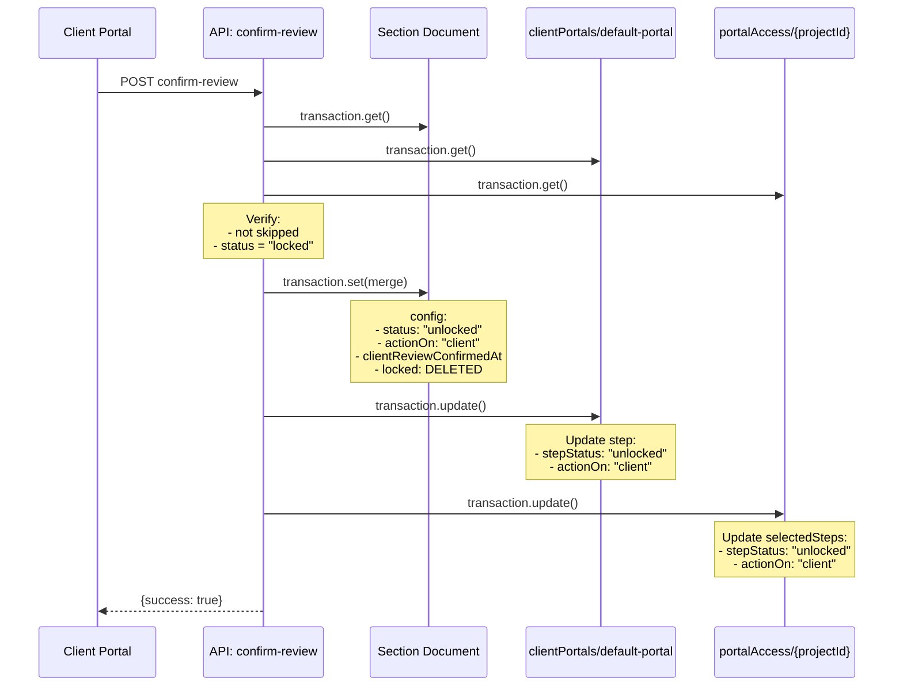
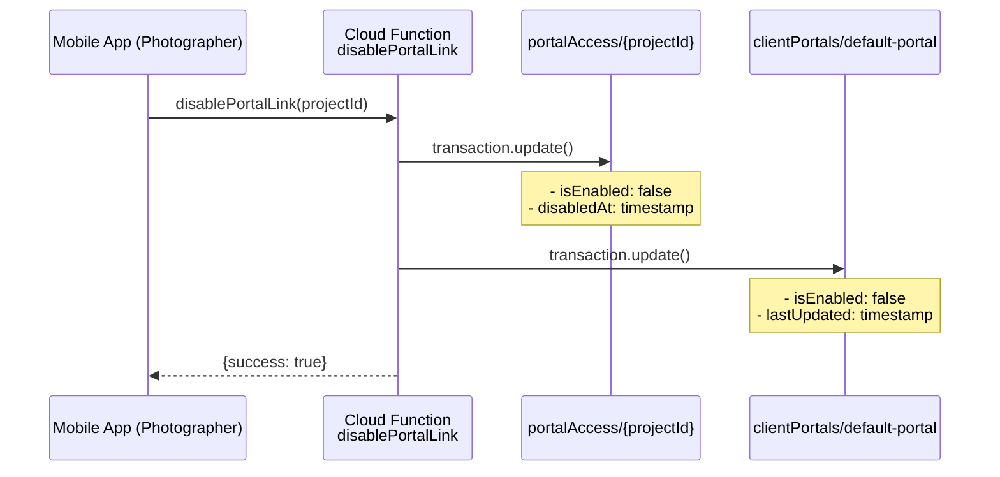
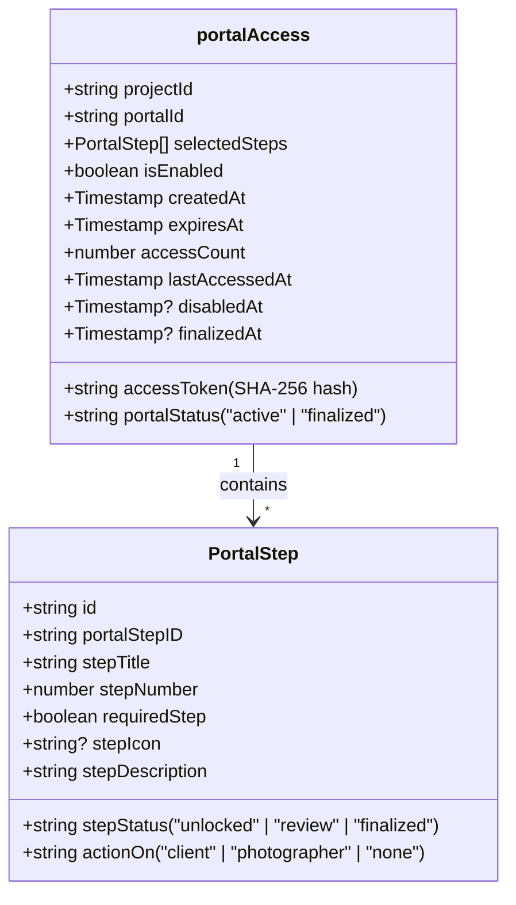

# Mermaid diagrams for portalAccess collection
_Exported on 3/10/2026 at 17:46:29 GMT from Cursor (2.6.14)_

---

**User**

Create mermaid diagrams that show all data flows, interactions, triggers, firebase functions, helpers and anything else that uses the firestore collection named "portalAccess"

---

**Cursor**

I'll help you create comprehensive Mermaid diagrams showing all data flows and interactions related to the `portalAccess` Firestore collection. Let me first search for all references to this collection across the codebase.

Now let me read the key files to understand the complete data flow:

Now let me check if there are any other files that interact with portalAccess:

Perfect! Now I have a complete picture of all the data flows related to the `portalAccess` collection. Let me create comprehensive Mermaid diagrams showing all interactions, triggers, and data flows.

Based on my analysis of the codebase, I've created comprehensive Mermaid diagrams showing all data flows and interactions with the `portalAccess` Firestore collection:

## 1. Portal Creation & Authentication Flow



## 2. Section Submission Flow



## 3. Section Skip Flow



## 4. Photographer Review Flow (Approve/Request Revision)



## 5. Confirm Review Flow (Client Acknowledges Feedback)



## 6. Portal Disable Flow



## 7. Complete Data Model & Relationships

```mermaid
graph TB
    subgraph "Firestore Collections"
        PA[portalAccess/{projectId}]
        Portal[projects/{projectId}/<br/>clientPortals/default-portal]
        Project[projects/{projectId}]
        Sections[Section Documents:<br/>- keyPeople<br/>- locations<br/>- groupShots<br/>- photoRequests<br/>- timeline]
    end
    
    subgraph "Cloud Functions"
        GenLink[generatePortalLink]
        DisLink[disablePortalLink]
        Approve[photographerApproveSection]
        Revision[photographerRequestRevision]
        TriggerSubmit[onDocumentUpdated<br/>handleSectionSubmitted]
        TriggerFinal[onDocumentUpdated<br/>handleSectionFinalized]
    end
    
    subgraph "API Routes"
        AuthAPI[/auth/portal]
        SubmitAPI[/section/submit]
        SkipAPI[/section/skip]
        ConfirmAPI[/section/confirm-review]
        TrackAPI[/track-access]
    end
    
    GenLink -->|Creates| PA
    GenLink -->|Creates| Portal
    GenLink -->|Updates| Project
    
    DisLink -->|Updates isEnabled| PA
    DisLink -->|Updates isEnabled| Portal
    
    AuthAPI -->|Reads & validates| PA
    AuthAPI -->|Updates accessCount| PA
    
    SubmitAPI -->|Reads| PA
    SubmitAPI -->|Updates selectedSteps| PA
    SubmitAPI -->|Updates| Sections
    SubmitAPI -->|Updates steps| Portal
    
    SkipAPI -->|Reads| PA
    SkipAPI -->|Updates selectedSteps| PA
    SkipAPI -->|Updates| Sections
    SkipAPI -->|Updates steps| Portal
    
    ConfirmAPI -->|Reads| PA
    ConfirmAPI -->|Updates selectedSteps| PA
    ConfirmAPI -->|Updates| Sections
    ConfirmAPI -->|Updates steps| Portal
    
    Approve -->|Updates| Sections
    Approve -->|Updates steps| Portal
    
    Revision -->|Updates| Sections
    Revision -->|Updates steps| Portal
    
    Sections -->|Triggers on update| TriggerSubmit
    Sections -->|Triggers on finalize| TriggerFinal
    
    TriggerFinal -->|Finalizes when all done| PA
    TriggerFinal -->|Disables| Portal
    
    style PA fill:#ff9999
    style Portal fill:#99ccff
    style Sections fill:#99ff99
```

## 8. portalAccess Document Schema



## Key Insights:

1. **portalAccess** is the **authentication & access control** document
2. It stores the **hashed token** (never the raw token)
3. It maintains a **synchronized copy** of `selectedSteps` that mirrors the portal's steps
4. **Three-way synchronization** happens on every section operation: Section → Portal → portalAccess
5. **Automatic finalization** when all sections are approved (via Firestore trigger)
6. **Access tracking** via `accessCount` and `lastAccessedAt`
7. **Security**: Token is deleted on finalization, making the link permanently invalid

