# Create Initial and Add Location Flow Documentation

## Overview

This document traces two related flows for managing Location lists:
1. **createInitial**: Creating an initial (empty) location list for a project
2. **addLocation**: Adding a new location item to a project's location list, including geocoding the address

Both operations work with project-level location data stored in Firestore subcollections.

---

## Table of Contents

1. [High-Level Flow](#high-level-flow)
2. [Detailed Sequence Diagrams](#detailed-sequence-diagrams)
   - [Create Initial Flow](#create-initial-flow-sequence)
   - [Add Location Flow](#add-location-flow-sequence)
3. [UI Component Structure](#ui-component-structure)
4. [Data Structures](#data-structures)
5. [Input Validation](#input-validation)
6. [Sanitization Process](#sanitization-process)
7. [Geocoding Process](#geocoding-process)
8. [Loading States](#loading-states)
9. [Error Handling](#error-handling)
10. [Optimistic Updates](#optimistic-updates)
11. [File Structure & Function Calls](#file-structure--function-calls)
12. [Hooks Usage](#hooks-usage)
13. [Ports & Adapters](#ports--adapters)
14. [Simple Explanation](#simple-explanation)

---

## High-Level Flow

### Create Initial Flow

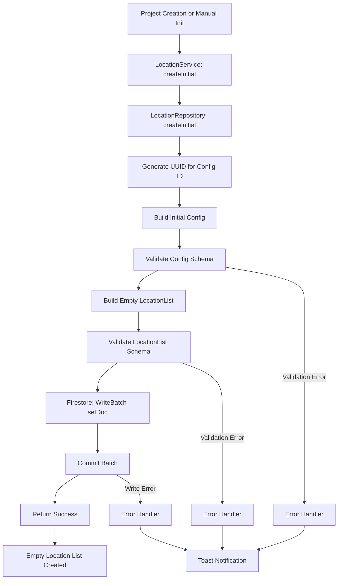

### Add Location Flow

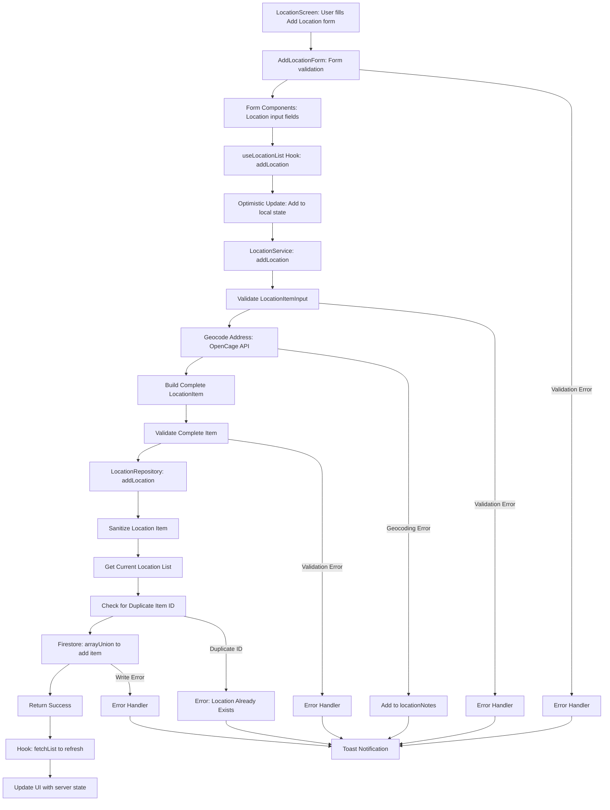

---

## Detailed Sequence Diagrams

### Create Initial Flow Sequence

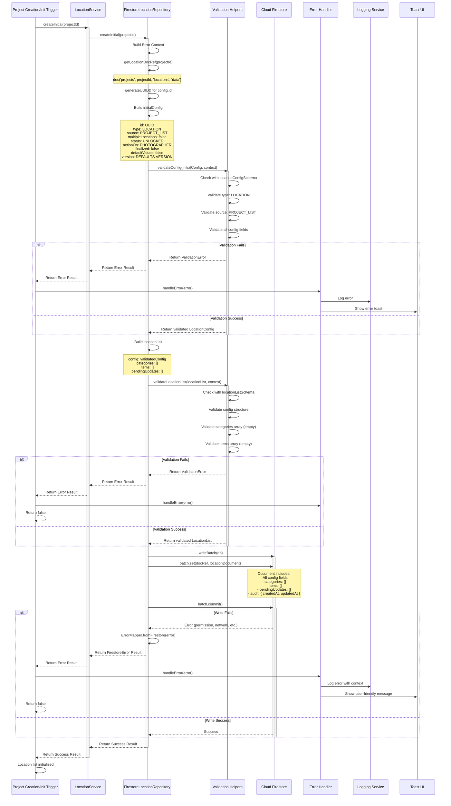

### Add Location Flow Sequence

```mermaid
sequenceDiagram
    participant UI as LocationScreen Component
    participant Form as AddLocationForm Component
    participant Inputs as Form Input Components
    participant Hook as useLocationList Hook
    participant Service as LocationService
    participant Geocode as OpenCage Geocoding API
    participant Repo as FirestoreLocationRepository
    participant Sanitize as Sanitization Helpers
    participant Validate as Validation Helpers
    participant Firestore as Cloud Firestore
    participant ErrorHandler as Error Handler
    participant Logger as Logging Service
    participant Toast as Toast UI

    UI->>Form: User fills Add Location form
    Form->>Inputs: Render locationName, locationAddress1, etc.
    User->>Inputs: Enter location details
    Inputs->>Form: Update form state
    
    User->>Form: Click "Add Location" button
    Form->>Form: Client-side validation (optional)
    alt Client-side validation fails
        Form->>UI: Show field errors
    else Client-side validation passes
        Form->>Hook: addLocation(locationItemInput, optimistic=true)
        activate Hook
        
        Note over Hook: Optimistic Update (if enabled)
        alt Optimistic Update Enabled
            Hook->>Hook: Get current list from state
            Hook->>Hook: Create optimistic item (temp ID)
            Hook->>Hook: Create optimistic list with new item
            Hook->>Hook: setState(loading(optimisticList, true))
            Hook->>UI: UI updates immediately (optimistic)
        else No Optimistic Update
            Hook->>Hook: setState(loading(getCurrentData(state)))
        end
        
        Hook->>Service: addLocation(projectId, input)
        activate Service
        
        Service->>Service: Build Error Context
        Service->>Validate: validateWithSchema(locationItemInputSchema, input)
        activate Validate
        Validate->>Validate: Check locationName (required, 1-50 chars)
        Validate->>Validate: Check locationAddress1 (required, 1-200 chars)
        Validate->>Validate: Check locationPostcode (required, 1-20 chars)
        Validate->>Validate: Check locationType (enum)
        Validate->>Validate: Check optional fields (notes, times, contact, etc.)
        alt Validation Fails
            Validate-->>Service: Return ValidationError with field errors
            Service-->>Hook: Return Error Result
            Hook->>Hook: Rollback optimistic update (if enabled)
            Hook->>ErrorHandler: handleError(error)
            ErrorHandler->>Logger: Log error
            ErrorHandler->>Toast: Show error toast with field errors
            Hook-->>Form: Return false
        else Validation Success
            Validate-->>Service: Return validated LocationItemInput
        end
        deactivate Validate
        
        Service->>Service: Build full address string
        Note over Service: fullAddress = "locationName, locationAddress1, locationPostcode"
        
        Service->>Service: geocodeAddress(fullAddress)
        activate Service
        Service->>Service: sanitizeString(address)
        Service->>Service: normalizeUKPostcode(address)
        Service->>Service: Check for EXPO_PUBLIC_OPENCAGE_API_KEY
        alt API Key Missing
            Service-->>Service: Return NETWORK_SERVER_ERROR
        else API Key Present
            Service->>Geocode: GET https://api.opencagedata.com/geocode/v1/json
            activate Geocode
            alt Geocoding Fails
                Geocode-->>Service: Error (404, network, invalid response)
                Service->>Service: Map to NetworkError
                Service-->>Service: Return Error Result
            else Geocoding Success
                Geocode-->>Service: Return coordinates { lat, lng }
                Service->>Service: Validate response with OpenCageResponseSchema
                alt Invalid Response Format
                    Service-->>Service: Return ValidationError
                else Valid Response
                    Service-->>Service: Extract first result.geometry
                    Service->>Service: Validate lat/lng are numbers
                    alt Invalid Coordinates
                        Service-->>Service: Return NETWORK_SERVER_ERROR
                    else Valid Coordinates
                        Service-->>Service: Return { lat, lng } Result
                    end
                end
            end
            deactivate Geocode
        end
        deactivate Service
        
        Service->>Service: Process geocoding result
        alt Geocoding Success
            Service->>Service: Set geopoint = { latitude: lat, longitude: lng }
            Service->>Service: Keep original locationNotes
        else Geocoding Failed
            Service->>Service: Set geopoint = null
            Service->>Service: Append geocoding error to locationNotes
            Note over Service: locationNotes = "Geocoding Issue: {error}. Please verify the address. {originalNotes}"
        end
        
        Service->>Service: Generate item ID
        Note over Service: id = doc(collection(db, 'tmp')).id
        
        Service->>Service: Build complete LocationItem
        Note over Service: id: generated ID<br/>itemName: locationName<br/>itemDescription: locationNotes<br/>geopoint: coordinates or null<br/>createdBy: PHOTOGRAPHER<br/>createdAt: new Date()
        
        Service->>Validate: validateWithSchema(locationItemSchema, newItem)
        activate Validate
        Validate->>Validate: Check complete item structure
        Validate->>Validate: Validate base item fields
        Validate->>Validate: Validate location-specific fields
        alt Validation Fails
            Validate-->>Service: Return ValidationError
            Service-->>Hook: Return Error Result
            Hook->>Hook: Rollback optimistic update
            Hook->>ErrorHandler: handleError(error)
            Hook-->>Form: Return false
        else Validation Success
            Validate-->>Service: Return validated LocationItem
        end
        deactivate Validate
        
        Service->>Repo: addLocation(projectId, validatedItem)
        activate Repo
        
        Repo->>Repo: Build Error Context
        Repo->>Sanitize: sanitizeLocationItem(item)
        activate Sanitize
        Sanitize->>Sanitize: sanitizeString(itemName)
        Sanitize->>Sanitize: sanitizeString(itemDescription)
        Sanitize->>Sanitize: sanitizeString(locationName)
        Sanitize->>Sanitize: sanitizeString(locationAddress1)
        Sanitize->>Sanitize: sanitizeString(locationPostcode)
        Sanitize->>Sanitize: sanitizeStringOrUndefined(locationNotes)
        Sanitize->>Sanitize: sanitizeStringOrUndefined(nextLocationTravelArrangements)
        Sanitize->>Sanitize: sanitizeString(notes) if present
        Sanitize-->>Repo: Return sanitized item
        deactivate Sanitize
        
        Repo->>Validate: validateLocationItem(sanitized, context)
        activate Validate
        Validate->>Validate: Check with locationItemSchema
        Validate->>Validate: Validate all location fields
        alt Validation Fails
            Validate-->>Repo: Return ValidationError
            Repo-->>Service: Return Error Result
            Service-->>Hook: Return Error Result
            Hook->>Hook: Rollback optimistic update
            Hook->>ErrorHandler: handleError(error)
            Hook-->>Form: Return false
        else Validation Success
            Validate-->>Repo: Return validated LocationItem
        end
        deactivate Validate
        
        Repo->>Firestore: getDoc(doc('projects', projectId, 'locations', 'data'))
        activate Firestore
        alt List Not Found
            Firestore-->>Repo: Document doesn't exist
            Repo-->>Service: Return DB_NOT_FOUND Error
            Service-->>Hook: Return Error Result
            Hook->>Hook: Rollback optimistic update
            Hook->>ErrorHandler: handleError(error)
            Hook-->>Form: Return false
        else List Found
            Firestore-->>Repo: Return DocumentSnapshot
        end
        deactivate Firestore
        
        Repo->>Repo: Extract existing items from snapshot
        Repo->>Repo: Check for duplicate item ID
        Note over Repo: if (existingItems.some(existing => existing.id === validatedItem.id))
        alt Duplicate Item ID Found
            Repo-->>Service: Return VALIDATION_FAILED Error
            Service-->>Hook: Return Error Result
            Hook->>Hook: Rollback optimistic update
            Hook->>ErrorHandler: handleError(error)
            ErrorHandler->>Logger: Log error
            ErrorHandler->>Toast: Show "Location already exists" message
            Hook-->>Form: Return false
        else No Duplicate
            Repo->>Firestore: updateDoc(docRef, { items: arrayUnion(validatedItem), updatedAt: serverTimestamp() })
            activate Firestore
            Note over Firestore: arrayUnion adds item to array<br/>atomically without overwriting
            alt Write Fails
                Firestore-->>Repo: Error (permission, network, etc.)
                Repo->>Repo: ErrorMapper.fromFirestore(error)
                Repo-->>Service: Return FirestoreError Result
                Service-->>Hook: Return Error Result
                Hook->>Hook: Rollback optimistic update
                Hook->>ErrorHandler: handleError(error)
                Hook-->>Form: Return false
            else Write Success
                Firestore-->>Repo: Success
            end
            deactivate Firestore
            
            Repo-->>Service: Return Success Result
        end
        deactivate Repo
        
        Service-->>Hook: Return validated LocationItem Result
        deactivate Service
        
        alt Success
            Hook->>Hook: fetchList() to get server state
            Hook->>Service: get(projectId)
            Service->>Repo: get(projectId)
            Repo->>Firestore: getDoc(doc)
            Firestore-->>Repo: Return DocumentSnapshot
            Repo->>Validate: validateLocationList(snapshot.data())
            Validate-->>Repo: Return validated LocationList
            Repo->>Sanitize: Sanitize all items in list
            Sanitize-->>Repo: Return sanitized list
            Repo-->>Service: Return LocationList Result
            Service-->>Hook: Return LocationList Result
            Hook->>Hook: setState(success(updatedList))
            Hook-->>Form: Return true
            Form->>UI: Update UI (location added, form cleared)
        end
        deactivate Hook
    end
```

---

## UI Component Structure

### Component Hierarchy

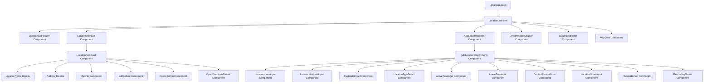

### Placeholder Components

#### LocationScreen Component

**Location**: `src/app/(features)/locations/index.tsx` (placeholder)

**Responsibilities**:
- Container for location list management
- Navigation setup
- Project context (projectId)
- Error boundary wrapping
- Layout and styling

**Props**:
```typescript
interface LocationScreenProps {
  navigation: NavigationProp;
  projectId: string;
}
```

**Usage**:
```typescript
const LocationScreen = ({ navigation, projectId }: LocationScreenProps) => {
  const { locationList, loading, error, addLocation, createInitial, clearError } = useLocationList(
    projectId,
    { autoFetch: true, enableRealtime: true }
  );

  // Initialize if needed
  const handleInitialize = async () => {
    const success = await createInitial();
    if (success) {
      // Refresh list
    }
  };

  return (
    <LocationListForm
      list={locationList}
      loading={loading}
      error={error}
      onAddLocation={handleAddLocation}
      onInitialize={handleInitialize}
      onClearError={clearError}
    />
  );
};
```

#### AddLocationForm Component

**Location**: `src/components/location/AddLocationForm.tsx` (placeholder)

**Responsibilities**:
- Form state management for adding locations
- Field validation coordination
- Geocoding status display
- Submission handling

**Props**:
```typescript
interface AddLocationFormProps {
  onSubmit?: (input: LocationItemInput) => Promise<void>;
  onCancel?: () => void;
  isLoading?: boolean;
  onGeocode?: (address: string) => Promise<GeocodeCoordinates | null>;
}
```

**State**:
```typescript
{
  locationName: string;
  locationAddress1: string;
  locationPostcode: string;
  locationType: LocationType;
  locationNotes?: string;
  arriveTime?: Date;
  leaveTime?: Date;
  locationContactPerson?: PersonInfo;
  locationContactInfo?: ContactInfo;
  nextLocationTravelTimeEstimate?: number;
  nextLocationTravelArrangements?: string;
  fieldErrors: Record<string, string>;
  geocodingStatus: 'idle' | 'geocoding' | 'success' | 'error';
}
```

**Behavior**:
- Validates fields before submission
- Calls `onSubmit` with LocationItemInput
- Optionally geocodes address on blur for preview
- Clears form on success
- Shows geocoding status indicator

#### LocationListForm Component

**Location**: `src/components/location/LocationListForm.tsx` (placeholder)

**Responsibilities**:
- List state management
- Location list display coordination
- Add action handling
- Map view coordination

**Props**:
```typescript
interface LocationListFormProps {
  list: LocationList | null;
  loading: boolean;
  error: AppError | null;
  onAddLocation?: (input: LocationItemInput) => Promise<void>;
  onInitialize?: () => Promise<void>;
  onClearError?: () => void;
}
```

#### GeocodingStatus Component

**Location**: `src/components/location/GeocodingStatus.tsx` (placeholder)

**Responsibilities**:
- Display geocoding progress
- Show success/error states
- Show map preview if geocoded

**Props**:
```typescript
interface GeocodingStatusProps {
  status: 'idle' | 'geocoding' | 'success' | 'error';
  coordinates?: GeocodeCoordinates;
  error?: string;
}
```

---

## Data Structures

### LocationItemInput Structure

```typescript
// LocationItemInput (from location.schema.ts)
interface LocationItemInput {
  locationType: LocationType;          // Required enum (MAIN_VENUE, CEREMONY, etc.)
  locationName: string;                 // Required, 1-50 chars, trimmed
  locationAddress1: string;            // Required, 1-200 chars
  locationPostcode: string;             // Required, 1-20 chars
  locationNotes?: string;               // Optional, max 500 chars
  locationContactPerson?: PersonInfo;   // Optional contact person
  locationContactInfo?: ContactInfo;    // Optional contact info
  arriveTime?: Date;                    // Optional arrival timestamp
  leaveTime?: Date;                     // Optional departure timestamp
  nextLocationTravelTimeEstimate?: number; // Optional, integer, min 0
  nextLocationTravelArrangements?: string; // Optional, max 500 chars
  notes?: string;                       // Optional, max 1000 chars
}
```

### LocationItem Structure (Complete)

```typescript
// LocationItem (complete item structure)
interface LocationItem {
  id: string;                           // Generated ID (Firestore doc ID)
  categoryId?: string;                  // Optional category association
  itemName: string;                     // Mapped from locationName
  itemDescription: string;              // Mapped from locationNotes
  locationType: LocationType;            // Enum: location type
  locationName: string;                 // Sanitized and validated
  locationAddress1: string;             // Sanitized and validated
  locationPostcode: string;             // Sanitized and validated
  locationNotes?: string;               // Optional, may include geocoding errors
  locationContactPerson?: PersonInfo;   // Optional
  locationContactInfo?: ContactInfo;    // Optional
  arriveTime?: Date;                    // Optional
  leaveTime?: Date;                     // Optional
  nextLocationTravelTimeEstimate?: number;
  nextLocationTravelArrangements?: string;
  geopoint: {                           // Geocoded coordinates or null
    latitude: number;
    longitude: number;
  } | null;
  createdBy: CreatedBy;                 // PHOTOGRAPHER (default)
  updatedBy: CreatedBy | null;           // PHOTOGRAPHER (default)
  createdAt: Date;                      // Current date
  updatedAt?: Date;                      // Undefined for new items
  isCustom: boolean;                    // false (default)
  isChecked: boolean;                   // false (default)
  isDisabled: boolean;                  // false (default)
  notes?: string;                       // Optional, max 1000 chars
}
```

### LocationConfig Structure (Initial)

```typescript
// LocationConfig (created in createInitial)
interface LocationConfig {
  id: string;                           // Generated UUID
  type: ListType.LOCATION;              // Literal: 'location'
  source: ListSource.PROJECT_LIST;      // PROJECT_LIST
  multipleLocations: boolean;           // false (default)
  status: SectionStatus;                // UNLOCKED (default)
  actionOn: ActionOn;                   // PHOTOGRAPHER (default)
  finalized: boolean;                   // false (default)
  defaultValues: boolean;               // false (default)
  version: string;                      // DEFAULTS.VERSION
  clientLastViewed?: Date;              // undefined (default)
  audit: {
    createdAt?: Date;                   // Server timestamp
    updatedAt: Date;                     // Server timestamp
  };
  listMetadata?: ListMetadata;          // undefined (default)
}
```

### LocationList Structure

```typescript
// LocationList (complete structure)
interface LocationList {
  config: LocationConfig;                // Config with defaults
  categories: LocationCategory[];       // Empty array initially
  items: LocationItem[];                 // Array of location items
  pendingUpdates?: LocationPendingUpdate[]; // Empty array initially
}
```

### LocationType Enum

```typescript
enum LocationType {
  SINGLE_LOCATION = 'singleLocation',
  MAIN_VENUE = 'mainVenue',
  CEREMONY = 'ceremony',
  GETTING_READY_1 = 'gettingReady1',
  GETTING_READY_2 = 'gettingReady2',
  RECEPTION = 'reception',
  PHOTO_LOCATION = 'photoLocation',
  ACCOMMODATION = 'accommodation',
  GETTING_READY = 'gettingReady',
  ENGAGEMENT = 'engagement',
  // ... other types
}
```

### Firestore Document Structure

```typescript
// Document saved to Firestore
{
  // Config fields (flat structure)
  id: string,
  type: ListType.LOCATION,
  source: ListSource.PROJECT_LIST,
  multipleLocations: boolean,
  status: SectionStatus,
  actionOn: ActionOn,
  finalized: boolean,
  defaultValues: boolean,
  version: string,
  clientLastViewed: Timestamp | undefined,
  audit: {
    createdAt: Timestamp,
    updatedAt: Timestamp,
  },
  listMetadata: ListMetadata | undefined,
  
  // List data
  categories: LocationCategory[],        // Empty array initially
  items: LocationItem[],                 // Array with added item
  pendingUpdates: LocationPendingUpdate[], // Empty array initially
}
```

---

## Input Validation

### LocationItemInput Validation

**File**: `src/domain/project/location.schema.ts`

```typescript
export const locationItemInputSchema = locationItemSchema.omit({
  id: true,
  categoryId: true,
  isCustom: true,
  isDisabled: true,
  createdBy: true,
  updatedBy: true,
  geopoint: true,
  createdAt: true,
  updatedAt: true,
});
```

**Base LocationItem Schema**:
```typescript
export const locationItemSchema = listBaseItemSchema.extend({
  locationType: z.nativeEnum(LocationType),      // Required enum
  locationName: z.string()
    .min(1, 'Location name is required')
    .max(DEFAULTS.TEXT_LENGTHS.NAME, 'Name is too long'),
  locationAddress1: z.string()
    .min(1, 'Address is required')
    .max(200, 'Address is too long'),
  locationPostcode: z.string()
    .min(1, 'Postcode is required')
    .max(20, 'Postcode is too long'),
  locationNotes: z.string()
    .max(500, 'Notes are too long')
    .optional(),
  locationContactPerson: personInfoSchema.optional().nullable(),
  locationContactInfo: contactInfoSchema.optional().nullable(),
  arriveTime: optionalTimestampSchema.optional(),
  leaveTime: optionalTimestampSchema.optional(),
  nextLocationTravelTimeEstimate: z.number().int().min(0).optional(),
  nextLocationTravelArrangements: z.string()
    .max(500, 'Travel arrangements are too long')
    .optional(),
  createdBy: z.nativeEnum(CreatedBy).optional(),
  updatedBy: z.nativeEnum(CreatedBy).optional().nullable(),
  geopoint: geoPointSchema.optional().nullable(),
  notes: z.string().max(1000, 'Notes are too long').optional().nullable(),
  createdAt: requiredTimestampSchema,
  updatedAt: optionalTimestampSchema.optional(),
});
```

**Validation Rules**:
- `locationType`: Required, must be valid LocationType enum
- `locationName`: Required, 1-50 characters (default), trimmed
- `locationAddress1`: Required, 1-200 characters, trimmed
- `locationPostcode`: Required, 1-20 characters, trimmed
- `locationNotes`: Optional, max 500 characters
- `arriveTime`/`leaveTime`: Optional timestamps
- `nextLocationTravelTimeEstimate`: Optional integer, min 0
- `locationContactPerson`: Optional PersonInfo (firstName, lastName)
- `locationContactInfo`: Optional ContactInfo (email, phone, website)
- `notes`: Optional, max 1000 characters

**Time Validation** (when both provided):
```typescript
.refine(data => {
  if (data.arriveTime && data.leaveTime) {
    return data.leaveTime > data.arriveTime;
  }
  return true;
}, {
  message: 'Leave time must be after arrive time',
  path: ['leaveTime'],
})
```

### LocationConfig Validation

**File**: `src/domain/project/location.schema.ts`

```typescript
export const locationConfigSchema = locationConfigBaseSchema.extend({
  type: z.literal(ListType.LOCATION),   // Must be exactly 'location'
  source: z.nativeEnum(ListSource).default(ListSource.PROJECT_LIST),
});
```

**Validation Rules**:
- `type`: Must be `ListType.LOCATION` (literal)
- `source`: Defaults to `ListSource.PROJECT_LIST`
- `multipleLocations`: Boolean, defaults to false
- `status`: Enum, defaults to `SectionStatus.UNLOCKED`
- `actionOn`: Enum, defaults to `ActionOn.PHOTOGRAPHER`
- `finalized`: Boolean, defaults to false

### LocationList Validation

**File**: `src/domain/project/location.schema.ts`

```typescript
export const locationListSchema = listBaseWrapperSchema.extend({
  config: locationConfigSchema,
  categories: z.array(locationCategorySchema).optional().default([]),
  items: z.array(locationItemSchema),
  pendingUpdates: z.array(listBasePendingUpdateSchema).optional().default([]),
});
```

**Validation Flow**:

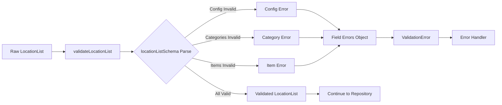

**Additional Validation** (in addLocation):
- **Duplicate ID Check**: 
  ```typescript
  if (existingItems.some(existing => existing.id === validation.value.id)) {
    return VALIDATION_FAILED error;
  }
  ```

---

## Sanitization Process

### Location Item Sanitization

**File**: `src/repositories/firestore/firestore-location-repository.ts`

**Function**: `sanitizeLocationItem(item: LocationItem): LocationItem`

**Process**:
```typescript
{
  ...item,
  itemName: sanitizeString(item.itemName),                    // Trim whitespace
  itemDescription: sanitizeString(item.itemDescription),      // Trim whitespace
  locationName: sanitizeString(item.locationName),             // Trim whitespace
  locationAddress1: sanitizeString(item.locationAddress1),   // Trim whitespace
  locationPostcode: sanitizeString(item.locationPostcode),    // Trim whitespace
  locationNotes: sanitizeStringOrUndefined(item.locationNotes ?? null), // Trim or undefined
  nextLocationTravelArrangements: sanitizeStringOrUndefined(
    item.nextLocationTravelArrangements ?? null
  ),                                                           // Trim or undefined
  notes: item.notes !== null && item.notes !== undefined 
    ? sanitizeString(item.notes) 
    : item.notes,                                             // Trim if present
}
```

**Sanitization Rules**:
- `itemName`: Trimmed (leading/trailing whitespace removed)
- `itemDescription`: Trimmed
- `locationName`: Trimmed
- `locationAddress1`: Trimmed
- `locationPostcode`: Trimmed
- `locationNotes`: Trimmed or converted to undefined if null/empty
- `nextLocationTravelArrangements`: Trimmed or converted to undefined if null/empty
- `notes`: Trimmed if present, otherwise preserved as null/undefined
- `geopoint`: No sanitization (already validated)
- Timestamps: No sanitization (already validated)

---

## Geocoding Process

### Geocoding Flow

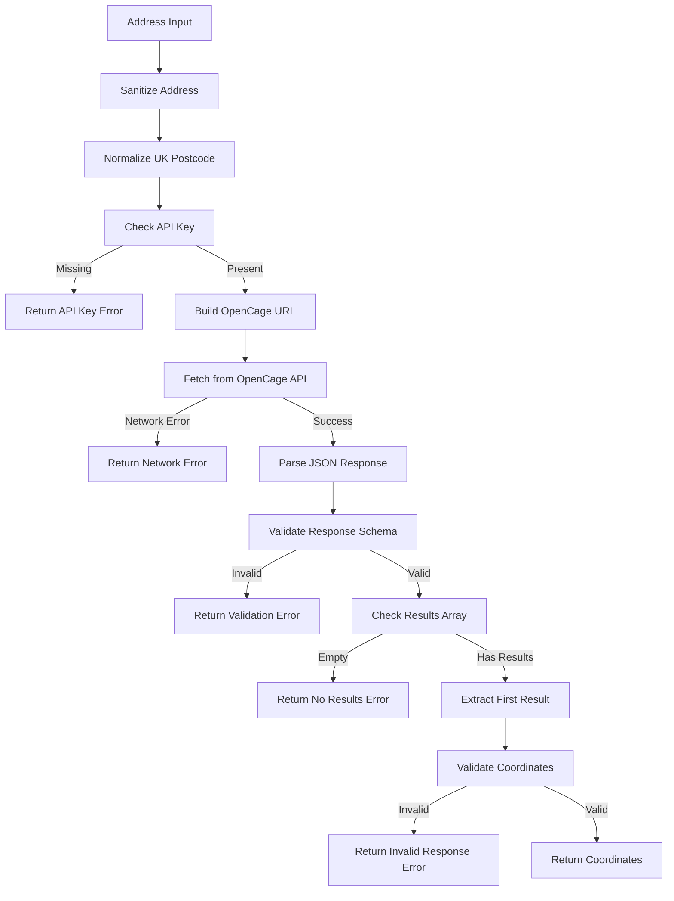

### Geocoding Implementation

**File**: `src/services/location-service.ts`

**Function**: `geocodeAddress(address: string): Promise<Result<GeocodeCoordinates, AppError>>`

**Process**:
1. **Sanitize Address**:
   ```typescript
   const sanitizedAddress = sanitizeString(address);
   if (!sanitizedAddress) {
     return VALIDATION_FAILED error;
   }
   ```

2. **Check API Key**:
   ```typescript
   const apiKey = process.env.EXPO_PUBLIC_OPENCAGE_API_KEY;
   if (!apiKey) {
     return NETWORK_SERVER_ERROR;
   }
   ```

3. **Normalize UK Postcode**:
   ```typescript
   const normalizedAddress = this.normalizeUKPostcode(sanitizedAddress);
   // Converts "SW1A1AA" to "SW1A 1AA"
   ```

4. **Build URL**:
   ```typescript
   const url = `https://api.opencagedata.com/geocode/v1/json?q=${encodeURIComponent(normalizedAddress)}&key=${apiKey}`;
   ```

5. **Fetch**:
   ```typescript
   const res = await fetch(url, {
     method: 'GET',
     headers: { 'Content-Type': 'application/json' },
   });
   ```

6. **Validate Response**:
   ```typescript
   const json = await res.json();
   const data = OpenCageResponseSchema.safeParse(json);
   // Validates: { results: [{ geometry: { lat, lng } }] }
   ```

7. **Extract Coordinates**:
   ```typescript
   const result = data.data.results[0];
   return { lat: result.geometry.lat, lng: result.geometry.lng };
   ```

### UK Postcode Normalization

**File**: `src/services/location-service.ts`

**Function**: `normalizeUKPostcode(address: string): string`

**Process**:
```typescript
// Regex: Matches UK postcode pattern (e.g., "SW1A1AA" or "SW1A 1AA")
address.replace(/\b([A-Z]{1,2}\d{1,2}[A-Z]?)\s*(\d[A-Z]{2})\b/i, '$1 $2')
```

**Examples**:
- `"SW1A1AA"` → `"SW1A 1AA"`
- `"SW1A 1AA"` → `"SW1A 1AA"` (already normalized)
- `"London SW1A1AA"` → `"London SW1A 1AA"`

### Geocoding Error Handling

**In addLocation**:
- If geocoding fails, the location is still created
- Error message is appended to `locationNotes`:
  ```typescript
  locationNotes = `Geocoding Issue: ${error.userMessage}. Please verify the address. ${originalNotes || ''}`
  ```
- `geopoint` is set to `null`

**Error Types**:
- `API_KEY_MISSING`: "Geocoding service is not configured"
- `NETWORK_ERROR`: "Unable to geocode address. Please check the address and try again."
- `NO_RESULTS`: "Could not find location for {address}. Please verify the address."
- `INVALID_RESPONSE`: "Invalid response from geocoding service. Please try again."

---

## Loading States

### State Transitions

#### Create Initial Flow

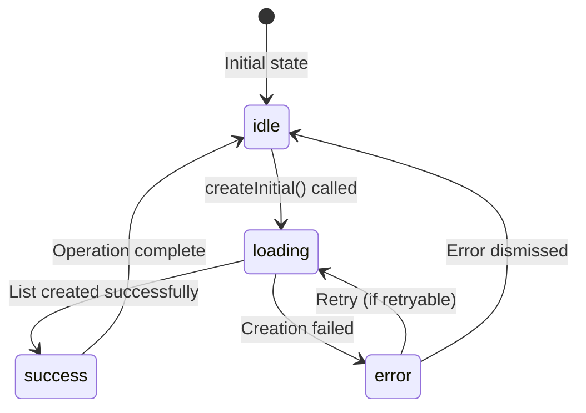

#### Add Location Flow

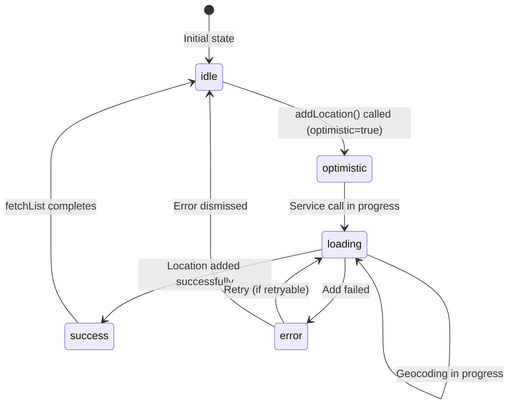

### Loading State Management

**File**: `src/hooks/use-location.ts`

**State Management**:
```typescript
const [state, setState] = useState<LoadingState<LocationList | null>>(loading());
```

**Add Location Flow**:
```typescript
const addLocation = useCallback(
  async (input: LocationItemInput, optimistic = true): Promise<boolean> => {
    if (!projectId) return false;
    
    const currentList = getCurrentData(state);
    
    // 1. Optimistic update (if enabled)
    if (optimistic && currentList) {
      const optimisticItem: LocationItem = {
        ...input,
        id: `temp-${Date.now()}`,
        // ... other fields with defaults
      };
      
      const optimisticList = {
        ...currentList,
        items: [...currentList.items, optimisticItem],
      };
      setState(loading(optimisticList, true));  // Optimistic flag set
    } else {
      setState(loading(getCurrentData(state)));
    }
    
    // 2. Call service
    const result = await locationService.addLocation(projectId, input);
    
    if (!isMountedRef.current) return false;
    
    // 3a. Success: Refresh from server
    if (result.success) {
      await fetchList();
      return true;
    }
    
    // 3b. Error: Rollback optimistic update
    else {
      if (optimistic && currentList) {
        setState(error(result.error, currentList, true));  // Rollback with optimistic flag
      } else {
        setState(error(result.error, getCurrentData(state)));
      }
      handleError(...);
      return false;
    }
  },
  [projectId, state, fetchList, handleError],
);
```

---

## Error Handling

### Error Types

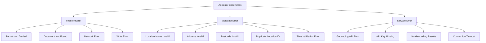

### Error Flow

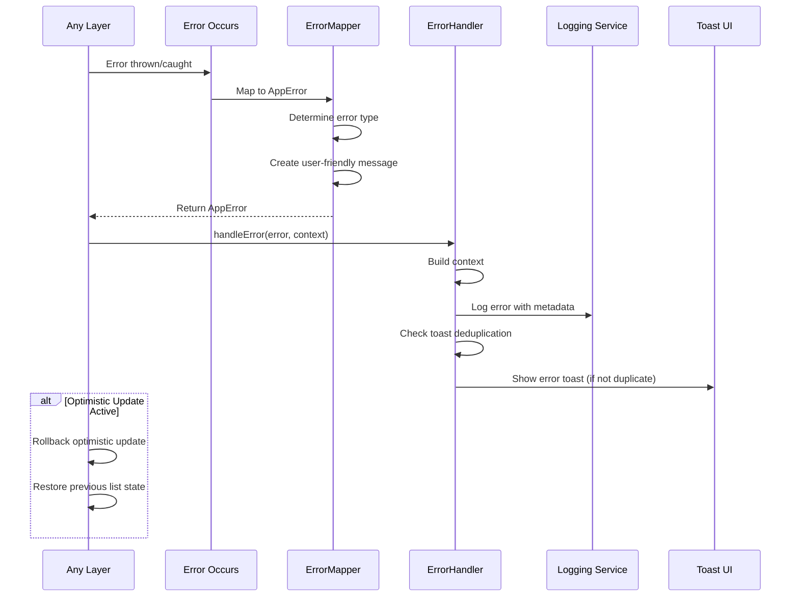

### Error Mapping

**File**: `src/utils/error-mapper.ts`

**Firestore Errors**:
- `permission-denied` → `DB_PERMISSION_DENIED`
  - User message: "You do not have permission to perform this action."
  - Retryable: false

- `not-found` → `DB_NOT_FOUND`
  - User message: "Location list not found. Please initialize the location list first."
  - Retryable: false

- `unavailable` → `DB_NETWORK_ERROR`
  - User message: "Service temporarily unavailable. Please try again."
  - Retryable: true

- Write errors → `DB_WRITE_ERROR`
  - User message: "Failed to save location. Please try again."
  - Retryable: true

**Geocoding Errors**:
- API key missing → `NETWORK_SERVER_ERROR`
  - User message: "Geocoding service is not configured. Please contact support."
  - Retryable: false

- No results → `NETWORK_SERVER_ERROR`
  - User message: "Could not find location for {address}. Please verify the address."
  - Retryable: false

- Network errors → `NETWORK_CONNECTION_ERROR`
  - User message: "Unable to geocode address. Please check your connection and try again."
  - Retryable: true

**Validation Errors**:
- Schema validation failures → `VALIDATION_ERROR`
  - User message: "Please check your input and try again."
  - Field-specific errors in `fieldErrors`
  - Retryable: false

- Duplicate ID → `VALIDATION_FAILED`
  - User message: "This location already exists in the list."
  - Retryable: false

---

## Optimistic Updates

### What are Optimistic Updates?

Optimistic updates update the UI immediately before the server confirms. If the operation fails, the UI is rolled back.

### Add Location Optimistic Update Flow

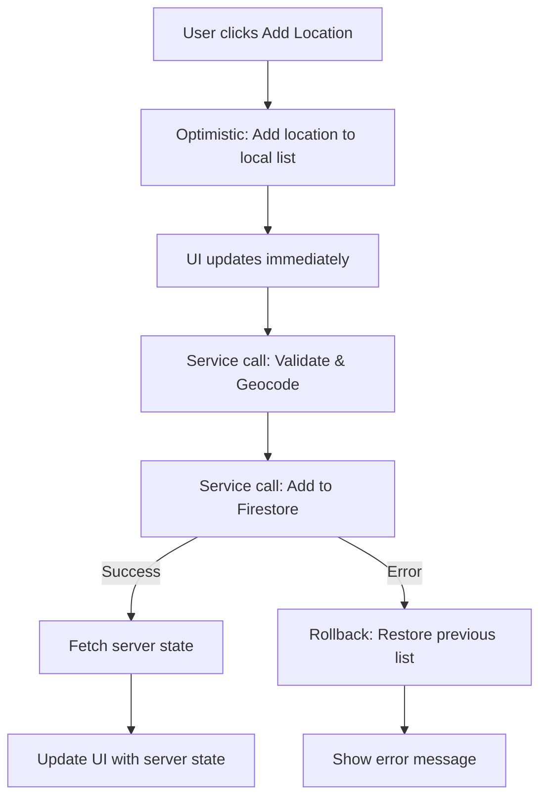

**Implementation Details**:

**In Hook**:
```typescript
// Before service call
const optimisticItem: LocationItem = {
  ...input,
  id: `temp-${Date.now()}`,  // Temporary ID
  geopoint: null,            // Will be geocoded in service
  // ... other defaults
};
const optimisticList = {
  ...currentList,
  items: [...currentList.items, optimisticItem],
};
setState(loading(optimisticList, true));  // Optimistic flag

// After service call (if error)
if (optimistic && currentList) {
  setState(error(result.error, currentList, true));  // Rollback
}
```

**In UI**:
```typescript
// User sees location immediately (with temp ID)
{list?.items.map(item => (
  <LocationItemCard 
    item={item} 
    isTemporary={item.id.startsWith('temp-')}  // Show loading indicator
  />
))}

// If error occurs, location disappears and error shows
{error && <ErrorMessageDisplay error={error} />}
```

---

## File Structure & Function Calls

### Create Initial Call Stack

```
Project Creation/Initialization Trigger
  └─> LocationService.createInitial(projectId)
      └─> LocationRepository.createInitial(projectId)
          ├─> ErrorContextBuilder.fromRepository()
          ├─> getLocationDocRef(projectId)
          │   └─> doc('projects', projectId, 'locations', 'data')
          │
          ├─> generateUUID() for config.id
          │   └─> crypto.randomUUID() or fallback
          │
          ├─> Build initialConfig
          │   └─> Set defaults (status, actionOn, finalized, etc.)
          │
          ├─> validateConfig(initialConfig)
          │   └─> validateWithSchema(locationConfigSchema, config)
          │       └─> locationConfigSchema.safeParse()
          │
          ├─> Build locationList
          │   └─> { config, categories: [], items: [], pendingUpdates: [] }
          │
          ├─> validateLocationList(locationList)
          │   └─> validateWithSchema(locationListSchema, list)
          │
          ├─> writeBatch(db)
          │   └─> batch.set(docRef, locationDocument)
          │   └─> batch.commit()
          │       └─> Firestore API
          │
          └─> Return Success Result
```

### Add Location Call Stack

```
UI Component (LocationScreen - placeholder)
  └─> AddLocationForm Component (placeholder)
      └─> useLocationList.addLocation(input, optimistic=true)
          ├─> [Optimistic Update] setState(loading(optimisticList, true))
          └─> locationService.addLocation(projectId, input)
              ├─> ErrorContextBuilder.fromService()
              ├─> validateWithSchema(locationItemInputSchema, input)
              │   └─> locationItemInputSchema.safeParse()
              │
              ├─> geocodeAddress(fullAddress)
              │   ├─> sanitizeString(address)
              │   ├─> normalizeUKPostcode(address)
              │   ├─> Check EXPO_PUBLIC_OPENCAGE_API_KEY
              │   ├─> fetch(OpenCage API URL)
              │   ├─> OpenCageResponseSchema.safeParse(response)
              │   └─> Extract coordinates from results[0].geometry
              │
              ├─> Process geocoding result
              │   ├─> If success: Set geopoint = { latitude, longitude }
              │   └─> If error: Set geopoint = null, append error to locationNotes
              │
              ├─> Generate item ID
              │   └─> doc(collection(db, 'tmp')).id
              │
              ├─> Build complete LocationItem
              │   ├─> Map locationName → itemName
              │   ├─> Map locationNotes → itemDescription
              │   ├─> Set createdBy: PHOTOGRAPHER
              │   └─> Set createdAt: new Date()
              │
              ├─> validateWithSchema(locationItemSchema, newItem)
              │   └─> locationItemSchema.safeParse()
              │
              └─> locationRepository.addLocation(projectId, validatedItem)
                  ├─> ErrorContextBuilder.fromRepository()
                  ├─> sanitizeLocationItem(item)
                  │   ├─> sanitizeString(locationName, locationAddress1, etc.)
                  │   └─> sanitizeStringOrUndefined(optional fields)
                  │
                  ├─> validateLocationItem(sanitized, context)
                  │   └─> validateWithSchema(locationItemSchema, item)
                  │
                  ├─> getDoc(doc('projects', projectId, 'locations', 'data'))
                  │   └─> Firestore API
                  │
                  ├─> Check for duplicate item.id
                  │
                  └─> updateDoc(docRef, { items: arrayUnion(validatedItem), updatedAt })
                      └─> Firestore API
          
          └─> fetchList() [on success]
              └─> locationService.get(projectId)
                  └─> locationRepository.get(projectId)
                      ├─> getDoc(doc)
                      ├─> validateLocationList(snapshot.data())
                      ├─> Validate and sanitize all items
                      └─> Return LocationList
```

### Files Involved

| File | Purpose | Key Functions |
|------|---------|---------------|
| `src/app/(features)/locations/index.tsx` | Location screen (placeholder) | Screen component |
| `src/components/location/LocationListForm.tsx` | Location list form (placeholder) | Form component |
| `src/components/location/AddLocationForm.tsx` | Add location form (placeholder) | Add location form component |
| `src/components/location/GeocodingStatus.tsx` | Geocoding status (placeholder) | Geocoding indicator |
| `src/hooks/use-location.ts` | React hook for location operations | `useLocationList()`, `addLocation()` |
| `src/services/location-service.ts` | Business logic orchestration | `createInitial()`, `addLocation()`, `geocodeAddress()` |
| `src/repositories/firestore/firestore-location-repository.ts` | Firestore location adapter | `createInitial()`, `addLocation()`, `sanitizeLocationItem()` |
| `src/repositories/i-location-repository.ts` | Location repository interface | Port definition |
| `src/domain/project/location.schema.ts` | Location validation schemas | `locationListSchema`, `locationItemSchema`, `locationItemInputSchema` |
| `src/utils/id-generator.ts` | ID generation utilities | `generateUUID()` |
| `src/utils/validation-helpers.ts` | Validation utilities | `validateWithSchema()`, `validatePartialWithSchema()` |
| `src/utils/sanitization-helpers.ts` | Input sanitization | `sanitizeString()`, `sanitizeStringOrUndefined()` |
| `src/utils/error-mapper.ts` | Error type mapping | `fromFirestore()`, `listNotFound()`, `fromUnknown()` |
| `src/services/error-handler-service.ts` | Centralized error handling | `handle()` |
| `src/utils/date-time-utils.ts` | Timestamp utilities | `convertAllTimestamps()` |

---

## Hooks Usage

### useLocationList Hook

**File**: `src/hooks/use-location.ts`

**Usage Pattern**:
```typescript
const { 
  locationList, 
  loading, 
  error, 
  addLocation, 
  createInitial,
  clearError 
} = useLocationList(
  projectId,
  { 
    autoFetch: true,      // Automatically fetch on mount
    enableRealtime: true  // Enable real-time updates
  }
);

// Add location
const handleAddLocation = async (input: LocationItemInput) => {
  const success = await addLocation(input, optimistic: true);
  if (success) {
    // Location added, form can be cleared
  }
};

// Initialize (if needed)
const handleInitialize = async () => {
  const success = await createInitial();
  if (success) {
    // Location list initialized
  }
};
```

**addLocation Function**:
```typescript
const addLocation = useCallback(
  async (input: LocationItemInput, optimistic = true): Promise<boolean> => {
    if (!projectId) return false;
    
    const currentList = getCurrentData(state);
    
    // Optimistic update
    if (optimistic && currentList) {
      const optimisticItem: LocationItem = {
        ...input,
        id: `temp-${Date.now()}`,
        // ... defaults
      };
      const optimisticList = {
        ...currentList,
        items: [...currentList.items, optimisticItem],
      };
      setState(loading(optimisticList, true));
    } else {
      setState(loading(getCurrentData(state)));
    }
    
    const result = await locationService.addLocation(projectId, input);
    
    if (!isMountedRef.current) return false;
    
    if (result.success) {
      await fetchList();  // Refresh to get server state
      return true;
    } else {
      // Rollback on error
      if (optimistic && currentList) {
        setState(error(result.error, currentList, true));
      } else {
        setState(error(result.error, getCurrentData(state)));
      }
      handleError(result.error, {...});
      return false;
    }
  },
  [projectId, state, fetchList, handleError],
);
```

**Lifecycle**:
```typescript
// Component mount
useEffect(() => {
  return () => {
    isMountedRef.current = false;
    if (unsubscribeRef.current) {
      unsubscribeRef.current();  // Cleanup real-time subscription
    }
  };
}, []);

// Auto-fetch or real-time subscription
useEffect(() => {
  if (!projectId) return;
  
  if (enableRealtime) {
    const unsubscribe = locationService.subscribe(projectId, result => {
      // Handle real-time updates
    });
    unsubscribeRef.current = unsubscribe;
  } else if (autoFetch) {
    setTimeout(() => {
      fetchList();
    }, 0);
  }
}, [projectId, enableRealtime, autoFetch, fetchList, handleError]);
```

---

## Ports & Adapters

### Architecture Pattern

The application uses **Ports & Adapters (Hexagonal Architecture)**:

- **Ports**: Interfaces defining contracts (`ILocationRepository`)
- **Adapters**: Concrete implementations (`FirestoreLocationRepository`)

### Ports (Interfaces)

#### ILocationRepository

**File**: `src/repositories/i-location-repository.ts`

**Contract**:
```typescript
interface ILocationRepository {
  createInitial(projectId: string): Promise<Result<void, AppError>>;
  get(projectId: string): Promise<Result<LocationList, AppError>>;
  addLocation(projectId: string, item: LocationItem): Promise<Result<void, AppError>>;
  updateLocation(projectId: string, item: LocationItem): Promise<Result<void, AppError>>;
  deleteLocation(projectId: string, itemId: string): Promise<Result<void, AppError>>;
  // ... other methods
}
```

**Purpose**: Defines the contract for location operations (project-level)

### Adapters (Implementations)

#### FirestoreLocationRepository

**File**: `src/repositories/firestore/firestore-location-repository.ts`

**Implements**: `ILocationRepository`

**Responsibilities**:
- Firestore document operations
- Location item sanitization and validation
- Duplicate checking
- Real-time subscriptions

**Key Differences from ListRepository**:
- Uses single document structure (`projects/{projectId}/locations/data`)
- Uses `arrayUnion` for adding items (atomic array operations)
- No master list concept (project-specific only)

**Dependencies**:
- Firestore SDK
- Zod schemas for validation
- Sanitization helpers
- Date/time utilities

### Dependency Injection

**File**: `src/services/ServiceFactory.ts`

**Pattern**: Service Factory creates services with injected repositories

```typescript
export class LocationService {
  constructor(private locationRepo: ILocationRepository) {}
}
```

**Factory Setup**:
```typescript
const locationRepository = new FirestoreLocationRepository();

const locationService = new LocationService(locationRepository);
```

---

## Simple Explanation

### What Happens When You Create an Initial Location List?

Imagine creating an initial location list is like setting up an empty address book for a project:

#### Step 1: Trigger
- **Project Creation**: When a new project is created, the system automatically creates an empty location list
- **Manual Init**: Or you can manually initialize if needed

#### Step 2: Generate Config ID
- **UUID Generation**: The system generates a unique ID for the location list configuration
- Like creating a unique identifier for this address book

#### Step 3: Set Up Default Settings
- **Default Config**: The system sets up default settings:
  - Type: Location list
  - Source: Project list (belongs to project)
  - Multiple locations: false (can be changed later)
  - Status: Unlocked (ready to use)
  - Action on: Photographer (default role)
  - Finalized: false (not finalized yet)

#### Step 4: Validate Configuration
- **Validation**: The system checks that all config values are valid
- Ensures everything is set up correctly before saving

#### Step 5: Create Empty Lists
- **Empty Arrays**: The system creates empty arrays for:
  - Categories: No categories yet
  - Items: No locations yet
  - Pending updates: No pending updates

#### Step 6: Validate Complete List
- **Final Validation**: The system validates the entire list structure
- Makes sure the empty list is valid

#### Step 7: Save to Database
- **Firestore Write**: The system saves the empty location list to Firestore
- Stored at `projects/{projectId}/locations/data`
- Uses write batch for atomic operation

#### Step 8: Success!
- **Complete**: The location list is now initialized and ready for locations to be added

### What Happens When You Add a Location?

Imagine adding a location is like adding an address entry to the address book and getting its GPS coordinates:

#### Step 1: You Fill Out the Form
- **Add Location Form**: You enter location details:
  - Location name (e.g., "Grand Hotel")
  - Address line 1
  - Postcode
  - Location type (venue, ceremony, etc.)
  - Optional: Arrival time, departure time, contact person, notes

#### Step 2: Optimistic Update (Immediate Feedback)
- **UI Update**: The location appears in your list immediately (before server confirms)
- Shows with a temporary ID
- If something goes wrong later, it will disappear

#### Step 3: Validate Your Input
- **Validation**: The system checks that everything is correct:
  - Name is required and not too long
  - Address is required and not too long
  - Postcode is required and valid length
  - Location type is valid
  - If arrival/leave times provided, leave time is after arrival time
- If anything is wrong → **Error**: Shows specific field errors

#### Step 4: Geocode the Address (Get GPS Coordinates)
- **Geocoding**: The system looks up the GPS coordinates for your address:
  - Builds full address: "Grand Hotel, 123 Main St, SW1A 1AA"
  - Normalizes UK postcodes (adds spaces if missing)
  - Calls OpenCage Geocoding API
  - Gets latitude and longitude coordinates
  
- **If Geocoding Succeeds**:
  - Coordinates are saved with the location
  - Can be displayed on a map
  
- **If Geocoding Fails**:
  - Location is still created (geocoding is optional)
  - Error message is added to location notes
  - You can geocode it later using "Finalize Locations"

#### Step 5: Generate Item ID
- **ID Generation**: The system generates a unique ID for this location
- Ensures no two locations have the same ID

#### Step 6: Clean Up the Data
- **Sanitization**: The system cleans up your input:
  - Trims whitespace from all text fields
  - Converts empty optional fields to undefined

#### Step 7: Check for Duplicates
- **Duplicate Check**: The system checks if a location with that ID already exists
- If duplicate → **Error**: "This location already exists in the list"

#### Step 8: Get Your Current List
- **Fetch List**: The system gets your current location list from the database
- If list doesn't exist → **Error**: "Location list not found. Please initialize first."

#### Step 9: Add Location to List
- **Firestore Update**: The location is added to your list:
  - Uses `arrayUnion` to add the item to the items array
  - This is atomic (won't conflict with other updates)
  - Updates the "updatedAt" timestamp

#### Step 10: Refresh from Server
- **Fetch Updated List**: After adding, the system fetches the list from the server
- This ensures your local copy matches what's stored
- The temporary ID is replaced with the real server ID
- UI updates with the server-confirmed location

#### Step 11: Success!
- **Complete**: The location is now permanently saved
- If there was an error, the optimistic update is rolled back and you see an error message

### Geocoding Explained

**What is geocoding?**
- Converting an address to GPS coordinates (latitude, longitude)
- Like asking "Where is this address on the map?" and getting coordinates back

**Why geocode?**
- Enables map display
- Calculates distances between locations
- Helps with navigation
- Useful for planning photo routes

**What happens if geocoding fails?**
- Location is still created (geocoding is optional)
- Error message is added to location notes
- You can try geocoding again later
- Or manually enter coordinates if needed

**Geocoding Service (OpenCage)**:
- External API service
- Requires API key
- May have rate limits or costs
- Returns coordinates for valid addresses

### Optimistic Updates Explained

**What it means**: The UI updates immediately, before the server confirms.

**Example for Add Location**:
1. You click "Add Location"
2. Location appears in list immediately (optimistic)
3. Server processes: validates, geocodes, saves
4. If server succeeds: Location stays, temp ID replaced (confirmed)
5. If server fails: Location disappears (rolled back), error shows

**Why use it**:
- Makes app feel fast
- Better user experience
- User can continue working while server processes

**When it fails**:
- User sees location briefly then it disappears
- Error message explains what went wrong
- User can retry if error is retryable

### Key Differences: Location vs KitList

**Location List**:
- **Project-specific**: Only exists for projects (not user-level)
- **Single document**: Stored in one Firestore document
- **Geocoding**: Includes address geocoding functionality
- **arrayUnion**: Uses Firestore arrayUnion for atomic adds
- **No master list**: No template/master list concept
- **Service pattern**: Has dedicated LocationService (not generic ListService)

**KitList**:
- **User-level**: Belongs to user (can be copied to projects)
- **Master list**: Has master template list
- **Generic repository**: Uses generic FirestoreListRepository
- **Save entire list**: Saves complete list on add
- **No geocoding**: Doesn't include geocoding

### Error Handling

If anything goes wrong:

1. **Error is Caught**: The system catches the error
2. **Error is Classified**: Determines error type (validation, geocoding, database, network)
3. **User-Friendly Message**: Converts to message you understand
4. **Optimistic Rollback**: If optimistic update was used, it's rolled back
5. **Error is Logged**: Technical details logged for developers
6. **You See a Toast**: Notification appears with error message
7. **Retry Option**: If retryable, you can try again
8. **Geocoding Errors**: Added to location notes (location still created)

### Loading States

Throughout the process, the UI shows different states:

- **Idle**: Nothing happening (initial state)
- **Optimistic**: Location shown immediately (with temp ID/loading indicator)
- **Loading**: Add in progress (geocoding, validation, saving)
- **Success**: Location added (confirmed from server)
- **Error**: Something went wrong (error message shown, location removed if optimistic)

---

## Summary Flow Charts

### Create Initial Summary

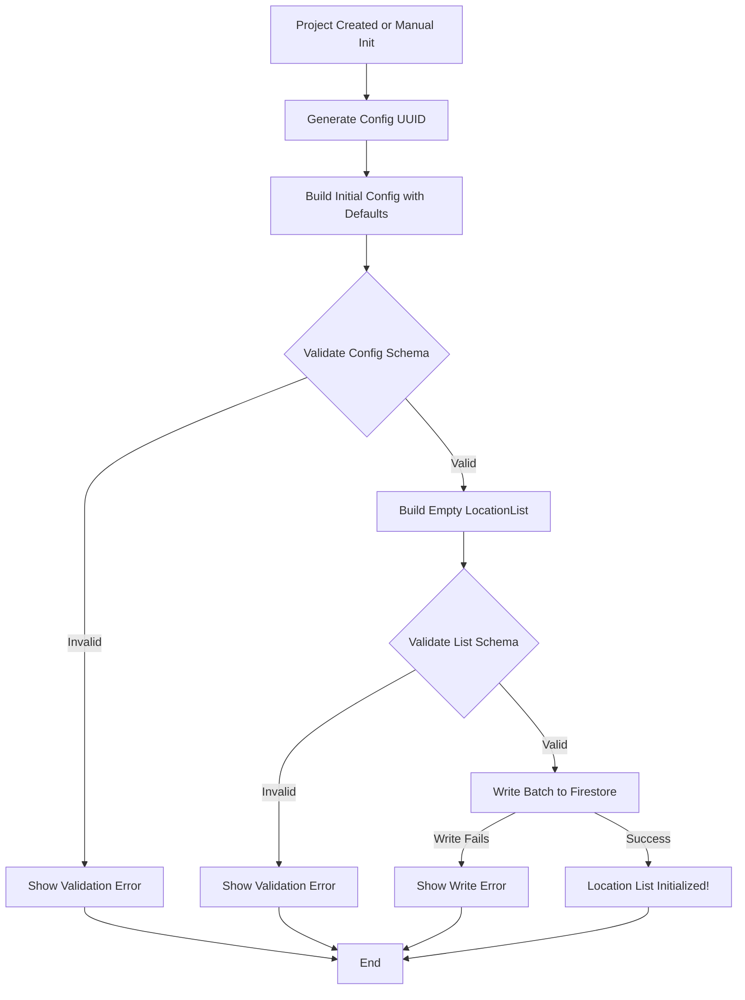

### Add Location Summary

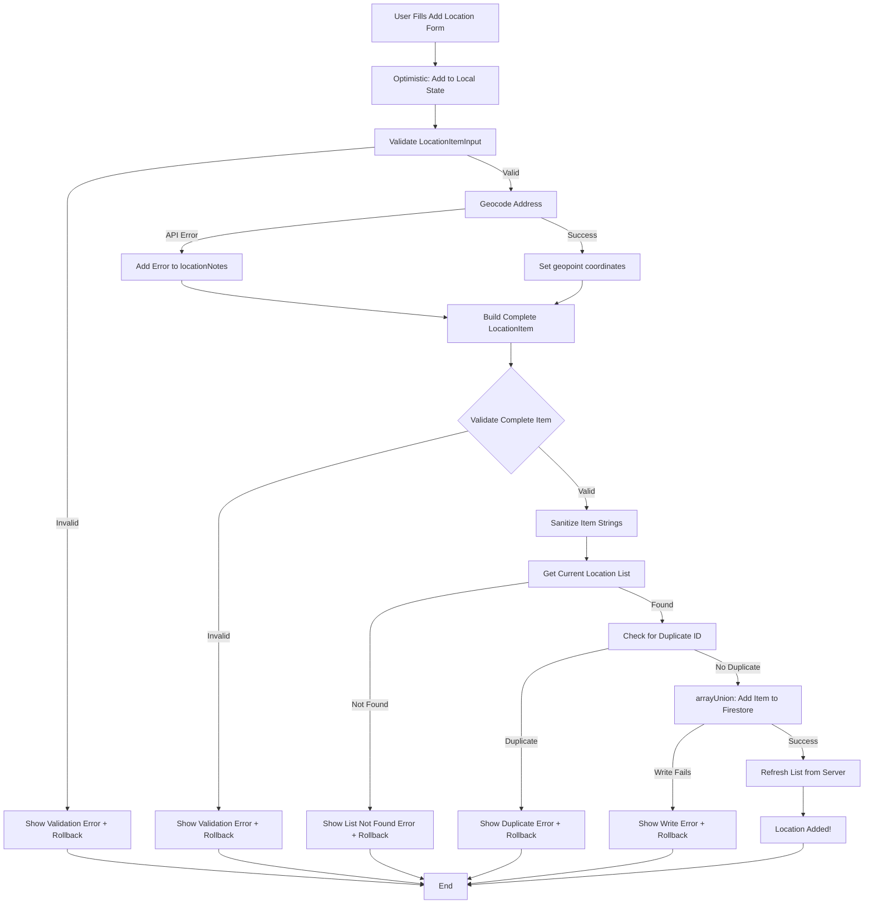

---

## Key Takeaways

1. **Create Initial Flow**:
   - Creates empty location list with default config
   - Uses write batch for atomic operation
   - No data copying (unlike KitList reset)
   - Project-specific only

2. **Add Location Flow**:
   - Includes geocoding step (optional but recommended)
   - Uses optimistic updates for immediate feedback
   - Validates input → geocodes → validates complete item → saves
   - Uses arrayUnion for atomic array addition
   - Geocoding errors don't prevent location creation

3. **Geocoding**:
   - Uses OpenCage Geocoding API
   - Normalizes UK postcodes
   - Non-blocking (location created even if geocoding fails)
   - Error messages added to locationNotes

4. **Sanitization**: 
   - All string fields are sanitized (trimmed)
   - Optional fields converted to undefined if empty
   - Geopoint preserved as-is

5. **Validation**:
   - Input validated with locationItemInputSchema
   - Complete item validated with locationItemSchema
   - Time validation (leave time after arrive time)
   - Duplicate ID check

6. **Optimistic Updates**:
   - Immediate UI feedback
   - Rollback on error
   - Better user experience

7. **Error Handling**: 
   - Comprehensive error handling with rollback
   - User-friendly error messages
   - Geocoding errors handled gracefully
   - Retry support for retryable errors

8. **Repository Pattern**: 
   - Dedicated ILocationRepository (not generic)
   - Single document structure
   - Uses arrayUnion for adds

9. **Loading States**: 
   - Clear loading state management
   - Optimistic updates with rollback
   - Geocoding status indicators

10. **Data Structure**: 
    - Flat document structure (config fields at root)
    - Items stored in array
    - Geopoint stored with each item

11. **Service Layer**: 
    - LocationService handles geocoding
    - Validates input before repository
    - Builds complete item structure

12. **User Experience**: 
    - Fast, responsive feel with optimistic updates
    - Geocoding happens automatically
    - Clear error messages
    - Map display ready with coordinates

---

*Document generated: 2025-01-XX*
*Last updated: Based on current codebase structure*

