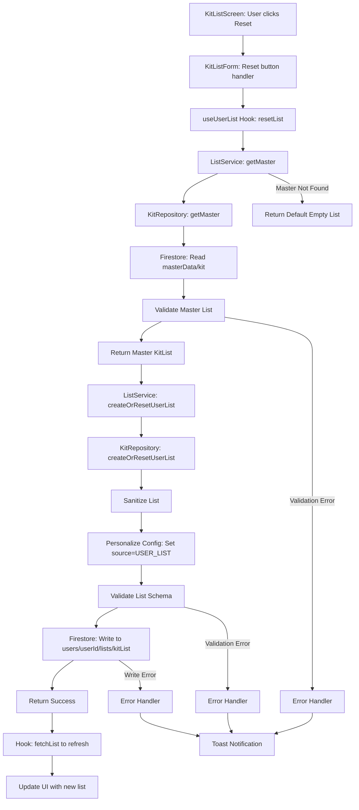
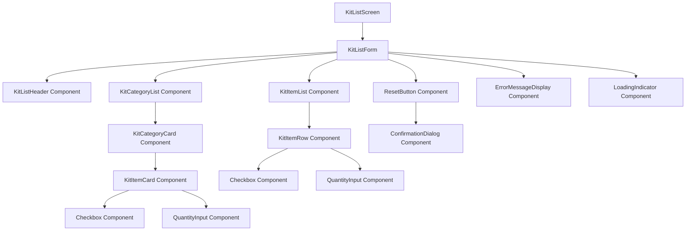
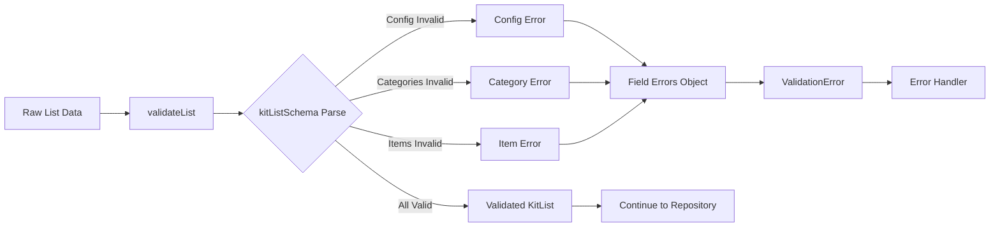
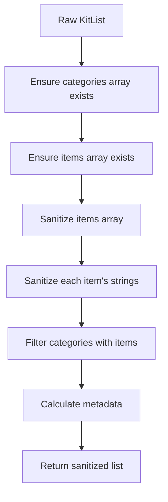
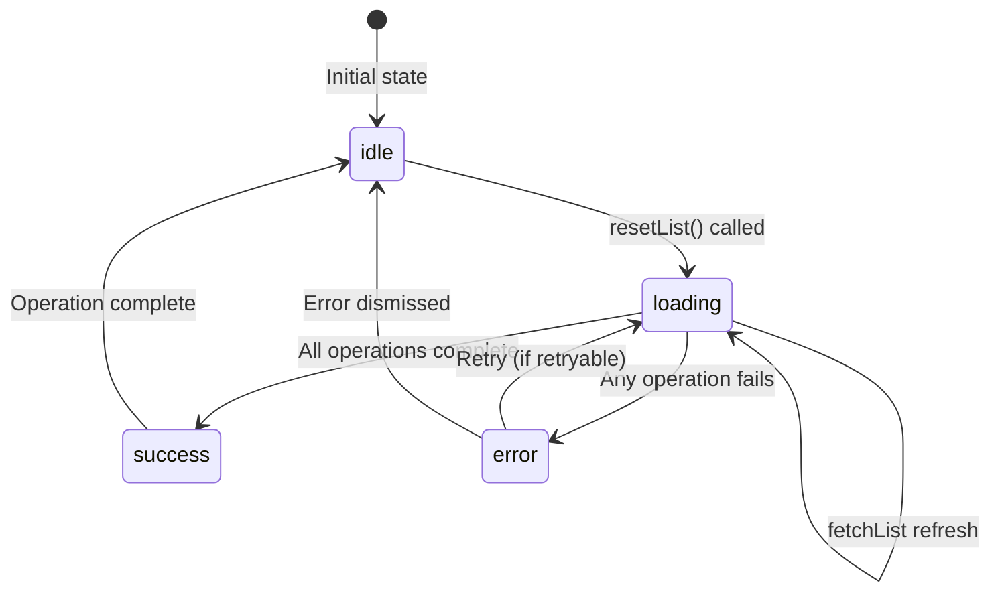
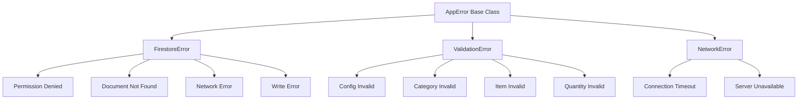
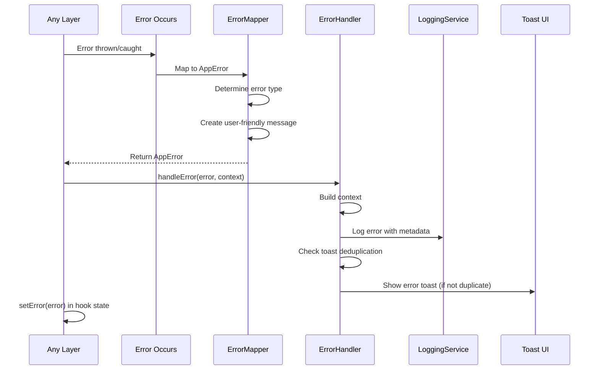
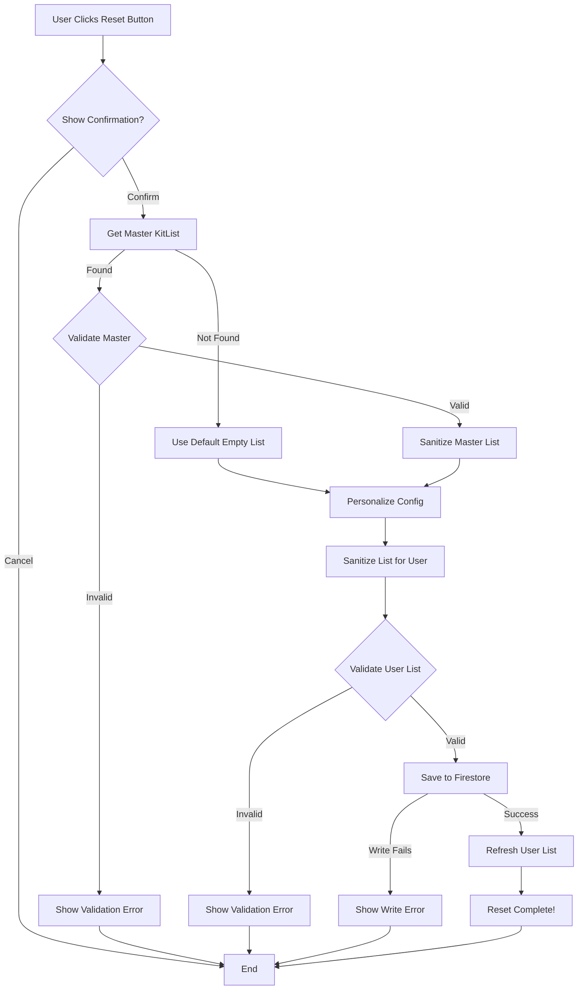

# Create or Reset User KitList Flow Documentation

## Overview

This document traces the complete flow for creating or resetting a user's KitList (equipment/gear list) from the master list. This operation copies the master kit list to the user's personal list, creating a fresh copy that can be customized.

---

## Table of Contents

1. [High-Level Flow](#high-level-flow)
2. [Detailed Sequence Diagram](#detailed-sequence-diagram)
3. [UI Component Structure](#ui-component-structure)
4. [Data Structures](#data-structures)
5. [Input Validation](#input-validation)
6. [Sanitization Process](#sanitization-process)
7. [Loading States](#loading-states)
8. [Error Handling](#error-handling)
9. [File Structure & Function Calls](#file-structure--function-calls)
10. [Hooks Usage](#hooks-usage)
11. [Ports & Adapters](#ports--adapters)
12. [Simple Explanation](#simple-explanation)

---

## High-Level Flow



---

## Detailed Sequence Diagram

```mermaid
sequenceDiagram
    participant UI as KitListScreen Component
    participant Form as KitListForm Component
    participant Hook as useUserList Hook
    participant Service as ListService
    participant Repo as FirestoreListRepository
    participant Sanitize as Sanitization Helpers
    participant Validate as Validation Helpers
    participant Firestore as Cloud Firestore
    participant ErrorHandler as Error Handler
    participant Logger as Logging Service
    participant Toast as Toast UI

    UI->>Form: User clicks "Reset to Default" button
    Form->>Hook: resetList()
    activate Hook
    Hook->>Hook: setError(null)
    
    Hook->>Service: getMaster()
    activate Service
    Service->>Repo: getMaster()
    activate Repo
    
    Repo->>Repo: Build Error Context
    Repo->>Firestore: getDoc(doc('masterData/kit'))
    activate Firestore
    alt Master List Not Found
        Firestore-->>Repo: Document doesn't exist
        Repo->>Repo: createDefaultList('master')
        Repo-->>Service: Return default empty KitList
    else Master List Found
        Firestore-->>Repo: Return DocumentSnapshot
        Repo->>Validate: validateList(snapshot.data(), context)
        activate Validate
        Validate->>Validate: Check with kitListSchema
        Validate->>Validate: Validate config, categories, items
        alt Validation Fails
            Validate-->>Repo: Return ValidationError
            Repo-->>Service: Return Error Result
            Service-->>Hook: Return Error Result
            Hook->>ErrorHandler: handleError(error)
            ErrorHandler->>Logger: Log error
            ErrorHandler->>Toast: Show error toast
            Hook->>Hook: setError(error)
            Hook-->>Form: Return false
        else Validation Success
            Validate-->>Repo: Return validated KitList
        end
        deactivate Validate
        
        Repo->>Repo: sanitizeList(validatedList, 'master')
        activate Sanitize
        Sanitize->>Sanitize: Sanitize item strings
        Sanitize->>Sanitize: Calculate metadata
        Sanitize-->>Repo: Return sanitized list
        deactivate Sanitize
        
        Repo-->>Service: Return KitList Result
    end
    deactivate Firestore
    deactivate Repo
    
    Service-->>Hook: Return Master KitList Result
    deactivate Service
    
    alt Master Fetch Failed
        Hook->>ErrorHandler: handleError(error)
        Hook->>Hook: setError(error)
        Hook-->>Form: Return false
    else Master Fetch Success
        Hook->>Service: createOrResetUserList(userId, masterList)
        activate Service
        Service->>Repo: createOrResetUserList(userId, sourceList)
        activate Repo
        
        Repo->>Repo: Build Error Context
        Repo->>Repo: Personalize list config
        Note over Repo: Set source: USER_LIST<br/>Set createdAt/updatedAt: serverTimestamp()<br/>Set lastModifiedBy: userId
        
        Repo->>Sanitize: sanitizeList(personalizedList, userId)
        activate Sanitize
        Sanitize->>Sanitize: Ensure categories array exists
        Sanitize->>Sanitize: Sanitize items array
        Sanitize->>Sanitize: Sanitize item strings (itemName, itemDescription)
        Sanitize->>Sanitize: Filter categories with items
        Sanitize->>Sanitize: Calculate metadata:
        Note over Sanitize: totalCategories: count categories with items<br/>totalItems: count sanitized items<br/>lastModified: new Date()<br/>lastModifiedBy: userId
        Sanitize-->>Repo: Return sanitized list
        deactivate Sanitize
        
        Repo->>Validate: validateList(sanitizedList, context)
        activate Validate
        Validate->>Validate: Check with kitListSchema
        Validate->>Validate: Validate config (type: KIT, source: USER_LIST)
        Validate->>Validate: Validate categories array
        Validate->>Validate: Validate items array (with quantity field)
        alt Validation Fails
            Validate-->>Repo: Return ValidationError
            Repo-->>Service: Return Error Result
            Service-->>Hook: Return Error Result
            Hook->>ErrorHandler: handleError(error)
            Hook-->>Form: Return false
        else Validation Success
            Validate-->>Repo: Return validated KitList
        end
        deactivate Validate
        
        Repo->>Repo: toFirestoreDoc(validatedList)
        Note over Repo: Extract config, categories, items<br/>Prepare for Firestore write
        
        Repo->>Firestore: setDoc(doc('users', userId, 'lists', 'kitList'), firestoreDoc)
        activate Firestore
        alt Write Fails
            Firestore-->>Repo: Error (permission, network, etc.)
            Repo->>Repo: ErrorMapper.fromFirestore(error)
            Repo-->>Service: Return FirestoreError Result
            Service-->>Hook: Return Error Result
            Hook->>ErrorHandler: handleError(error)
            ErrorHandler->>Logger: Log error with context
            ErrorHandler->>Toast: Show user-friendly message
            Hook->>Hook: setError(error)
            Hook-->>Form: Return false
        else Write Success
            Firestore-->>Repo: Success
        end
        deactivate Firestore
        
        Repo-->>Service: Return Success Result
        deactivate Repo
        
        Service-->>Hook: Return Success Result
        deactivate Service
        
        Hook->>Hook: fetchList() to refresh
        Hook->>Service: getUserList(userId)
        Service->>Repo: getUserList(userId)
        Repo->>Firestore: getDoc(doc('users', userId, 'lists', 'kitList'))
        Firestore-->>Repo: Return DocumentSnapshot
        Repo->>Validate: validateList(snapshot.data())
        Validate-->>Repo: Return validated KitList
        Repo-->>Service: Return KitList Result
        Service-->>Hook: Return KitList Result
        Hook->>Hook: setList(updatedList)
        
        Hook-->>Form: Return true
        Form->>UI: Update UI (list reset complete)
        deactivate Hook
    end
```



---

## UI Component Structure

### Component Hierarchy



### Placeholder Components

#### KitListScreen Component

**Location**: `src/app/(features)/kit/index.tsx` (placeholder)

**Responsibilities**:
- Container for kit list management
- Navigation setup
- User context (userId)
- Error boundary wrapping
- Layout and styling

**Props**:
```typescript
interface KitListScreenProps {
  navigation: NavigationProp;
  userId: string;
}
```

**Usage**:
```typescript
const KitListScreen = ({ navigation, userId }: KitListScreenProps) => {
  const kitService = serviceFactory.kitService;
  const { list, loading, error, resetList, clearError } = useUserList(
    kitService,
    userId,
    { autoFetch: true, enableRealtime: true }
  );

  const handleReset = async () => {
    const success = await resetList();
    if (success) {
      // Show success message
    }
  };

  return (
    <KitListForm
      list={list}
      loading={loading}
      error={error}
      onReset={handleReset}
      onClearError={clearError}
    />
  );
};
```

#### KitListForm Component

**Location**: `src/components/kit/KitListForm.tsx` (placeholder)

**Responsibilities**:
- Form state management
- List display coordination
- Reset action handling
- Error display coordination

**Props**:
```typescript
interface KitListFormProps {
  list: KitList | null;
  loading: boolean;
  error: AppError | null;
  onReset?: () => Promise<void>;
  onClearError?: () => void;
}
```

**State**:
```typescript
{
  selectedCategoryIds: string[];
  filteredItems: KitItem[];
  searchQuery: string;
  showResetConfirmation: boolean;
}
```

#### ResetButton Component

**Location**: `src/components/kit/ResetButton.tsx` (placeholder)

**Responsibilities**:
- Display reset button
- Show confirmation dialog
- Trigger reset action

**Props**:
```typescript
interface ResetButtonProps {
  onReset: () => Promise<void>;
  disabled?: boolean;
  loading?: boolean;
}
```

**Behavior**:
- Shows confirmation dialog: "Reset to default kit list? This will replace your current list."
- On confirm, calls `onReset()`
- Shows loading state during reset
- Disabled while loading or if no userId

#### KitCategoryList Component

**Location**: `src/components/kit/KitCategoryList.tsx` (placeholder)

**Responsibilities**:
- Display kit categories
- Category selection/filtering
- Collapsible category sections

**Props**:
```typescript
interface KitCategoryListProps {
  categories: KitCategory[];
  items: KitItem[];
  onCategorySelect?: (categoryId: string) => void;
}
```

#### KitItemList Component

**Location**: `src/components/kit/KitItemList.tsx` (placeholder)

**Responsibilities**:
- Display kit items
- Item selection/checking
- Quantity management
- Item actions (edit, delete)

**Props**:
```typescript
interface KitItemListProps {
  items: KitItem[];
  onItemUpdate?: (itemId: string, updates: Partial<KitItem>) => void;
  onItemDelete?: (itemId: string) => void;
}
```

---

## Data Structures

### KitList Structure

```typescript
// KitList (from kit.schema.ts)
interface KitList {
  config: KitConfig;
  categories: KitCategory[];
  items: KitItem[];
  pendingUpdates?: KitPendingUpdate[];
}

// KitConfig
interface KitConfig {
  id: string;                          // UUID
  type: ListType.KIT;                  // Literal: 'kit'
  source: ListSource;                  // MASTER_LIST | USER_LIST | PROJECT_LIST
  audit: AuditMetadata;
  defaultValues: boolean;
  version: string;
  listMetadata?: ListMetadata;
  createdAt?: Date;                    // Server timestamp
  updatedAt?: Date;                    // Server timestamp
  metadata?: {
    totalCategories: number;
    totalItems: number;
    lastModified: Date;
    lastModifiedBy: string;
  };
}

// KitCategory
interface KitCategory {
  id: string;
  catName: string;                     // 1-50 chars, trimmed
  catDescription: string;               // 1-500 chars, trimmed
  iconName?: string;                    // Max 50 chars
  isCustom: boolean;
  isComplete: boolean;
  itemIds: string[];                    // IDs of items in this category
  show: boolean;
  order?: number;
  color?: string;                       // Hex color
}

// KitItem (extends ListBaseItem)
interface KitItem {
  id: string;
  categoryId?: string;                  // Optional category association
  itemName: string;                    // 1-50 chars, trimmed
  itemDescription: string;             // 1-500 chars, trimmed
  quantity: number;                    // Integer, min 1, default 1
  isCustom: boolean;
  isChecked: boolean;
  isDisabled: boolean;
}
```

### Master List (Source)

```typescript
// Master KitList from Firestore
KitList {
  config: {
    type: ListType.KIT,
    source: ListSource.MASTER_LIST,    // From master list
    // ... other config fields
  },
  categories: KitCategory[],            // Master categories
  items: KitItem[],                     // Master items
}
```

### User List (Created/Reset)

```typescript
// User KitList after createOrResetUserList
KitList {
  config: {
    type: ListType.KIT,
    source: ListSource.USER_LIST,     // Changed to USER_LIST
    createdAt: Timestamp,              // Server timestamp (new)
    updatedAt: Timestamp,              // Server timestamp (new)
    // ... other config fields
  },
  categories: KitCategory[],           // Copied from master
  items: KitItem[],                    // Copied from master (with sanitized strings)
}
```

### Metadata Structure

```typescript
{
  totalCategories: number;                   // Count of categories that have items
  totalItems: number;                  // Count of all items
  lastModified: Date;                  // Current date/time
  lastModifiedBy: string;              // userId
}
```

---

## Input Validation

### Validation Schema

**File**: `src/domain/user/kit.schema.ts`

```typescript
export const kitListSchema = listBaseWrapperSchema.extend({
  config: kitConfigSchema,
  categories: z.array(kitCategorySchema),
  items: z.array(kitItemSchema),
  pendingUpdates: z.array(kitPendingUpdateSchema),
});
```

### KitConfig Validation

```typescript
export const kitConfigSchema = listBaseConfigSchema.extend({
  type: z.literal(ListType.KIT),       // Must be exactly 'kit'
});
```

**Rules**:
- `type`: Must be `ListType.KIT` (literal type)
- `source`: Must be `ListSource` enum value (MASTER_LIST, USER_LIST, PROJECT_LIST, CUSTOM)
- `id`: Must be valid UUID
- `version`: String, defaults to DEFAULTS.VERSION
- `createdAt`/`updatedAt`: Optional timestamps

### KitCategory Validation

**File**: `src/domain/common/list-base.schema.ts`

```typescript
export const listBaseCategorySchema = z.object({
  id: idSchema,                        // String, min 1 char
  catName: z.string()
    .min(1, 'Name is required')
    .max(DEFAULTS.TEXT_LENGTHS.NAME, 'Name too long')
    .trim(),
  catDescription: z.string()
    .min(1, 'Description is required')
    .max(DEFAULTS.TEXT_LENGTHS.DESCRIPTION, 'Description too long')
    .trim(),
  iconName: z.string()
    .max(DEFAULTS.TEXT_LENGTHS.ICON_NAME, 'Icon name too long')
    .optional(),
  isCustom: z.boolean().default(false),
  isComplete: z.boolean().default(false),
  itemIds: z.array(idSchema).default([]),
  show: z.boolean().default(true),
  order: z.number().int().min(0).optional(),
  color: hexColorSchema.optional(),
});
```

**Rules**:
- `id`: Required string, min 1 character
- `catName`: Required, 1-50 characters (default), trimmed
- `catDescription`: Required, 1-500 characters (default), trimmed
- `itemIds`: Array of item IDs in this category
- `isCustom`: Boolean, defaults to false
- `show`: Boolean, defaults to true

### KitItem Validation

**File**: `src/domain/user/kit.schema.ts`

```typescript
export const kitItemSchema = listBaseItemSchema.extend({
  quantity: z.number()
    .int()
    .min(1, 'Quantity must be at least 1')
    .default(1),
});
```

**Base Item Schema** (`src/domain/common/list-base.schema.ts`):
```typescript
export const listBaseItemSchema = z.object({
  id: idSchema,                        // String, min 1 char
  categoryId: idSchema.optional(),      // Optional category association
  itemName: z.string()
    .min(1, 'Name is required')
    .max(DEFAULTS.TEXT_LENGTHS.NAME, 'Name too long')
    .trim(),
  itemDescription: z.string()
    .min(1, 'Description is required')
    .max(DEFAULTS.TEXT_LENGTHS.DESCRIPTION, 'Description too long')
    .trim(),
  isCustom: z.boolean().default(false),
  isChecked: z.boolean().default(false),
  isDisabled: z.boolean().default(false),
});
```

**Rules**:
- `id`: Required string, min 1 character
- `itemName`: Required, 1-50 characters (default), trimmed
- `itemDescription`: Required, 1-500 characters (default), trimmed
- `quantity`: Integer, minimum 1, defaults to 1
- `categoryId`: Optional string (category association)
- `isChecked`: Boolean, defaults to false
- `isCustom`: Boolean, defaults to false

### Validation Flow



**Validation Function**: `validateList()` in `src/repositories/firestore/firestore-list-repository.ts`

**Process**:
1. Calls `validateWithSchema(kitListSchema, data, context)`
2. Validates config structure and type
3. Validates categories array
4. Validates items array (including quantity field)
5. Returns ValidationError with field-specific errors if invalid

**Error Format**:
```typescript
ValidationError {
  code: ErrorCode.VALIDATION_ERROR,
  message: "Validation failed: ...",
  userMessage: "Please check your input and try again",
  fieldErrors: {
    "config.type": "Expected 'kit', received ...",
    "items[0].quantity": "Quantity must be at least 1",
    "categories[0].catName": "Name is required",
  },
  context: "KitRepository.createOrResetUserList",
  retryable: false
}
```

---

## Sanitization Process

### List Sanitization

**File**: `src/repositories/firestore/firestore-list-repository.ts`

**Function**: `sanitizeList(list: TList, lastModifiedBy: string): TList`



**Process**:
1. **Ensure Arrays**: 
   ```typescript
   const categories = Array.isArray(list.categories) ? list.categories : [];
   const items = Array.isArray(list.items) ? sanitizeArray(list.items) : [];
   ```

2. **Sanitize Items**: 
   ```typescript
   const sanitizedItems = items.map(item => this.sanitizeItem(item));
   ```

3. **Filter Categories**: 
   ```typescript
   const categoriesWithItems = categories.filter(category =>
     sanitizedItems.some(item => item.categoryId === category.id)
   );
   ```

4. **Calculate Metadata**:
   ```typescript
   const metadata = {
     ...list.config.metadata,
     totalCategories: categoriesWithItems.length,
     totalItems: sanitizedItems.length,
     lastModified: new Date(),
     lastModifiedBy,
   };
   ```

5. **Return Sanitized List**:
   ```typescript
   return {
     ...list,
     config: {
       ...list.config,
       metadata,
     },
     categories,
     items: sanitizedItems,
   };
   ```

### Item Sanitization

**File**: `src/repositories/firestore/firestore-list-repository.ts`

**Function**: `sanitizeItem(item: TItem): TItem`

**Process**:
```typescript
{
  ...item,
  itemName: sanitizeString(item.itemName),              // Trim whitespace
  itemDescription: sanitizeString(item.itemDescription), // Trim whitespace
}
```

**Sanitization Rules**:
- `itemName`: Trimmed (leading/trailing whitespace removed)
- `itemDescription`: Trimmed (leading/trailing whitespace removed)
- `quantity`: No sanitization (already validated as integer)
- Other fields: Preserved as-is

### Personalization Process

**Location**: `createOrResetUserList()` in `firestore-list-repository.ts`

**Process**:
```typescript
const personalized = this.sanitizeList(
  {
    ...sourceList,
    config: {
      ...sourceList.config,
      source: ListSource.USER_LIST,        // Changed from MASTER_LIST
      createdAt: serverTimestamp(),        // New timestamp
      updatedAt: serverTimestamp(),        // New timestamp
    },
  },
  userId,                                  // lastModifiedBy
);
```

**Changes**:
1. **Source**: Changed from `ListSource.MASTER_LIST` to `ListSource.USER_LIST`
2. **Timestamps**: Set to current server timestamp
3. **lastModifiedBy**: Set to `userId`
4. **Metadata**: Recalculated with new counts and timestamps

---

## Loading States

### State Transitions



### Loading State Management

**File**: `src/hooks/use-list-actions.ts`

**State Management**:
```typescript
const [list, setList] = useState<KitList | null>(null);
const [loading, setLoading] = useState(autoFetch);
const [error, setError] = useState<AppError | null>(null);
```

**Loading Flow**:
```typescript
// resetList function
const resetList = useCallback(async (): Promise<boolean> => {
  if (!userId) return false;
  
  setError(null);                          // 1. Clear error
  
  // 2. Fetch master list
  const masterResult = await service.getMaster();
  // (loading managed internally by fetchList if called)
  
  if (!masterResult.success) {
    setError(masterResult.error);          // 3a. Set error
    handleError(...);
    return false;
  }
  
  // 4. Create/reset user list
  const createResult = await service.createOrResetUserList(userId, masterResult.value);
  // (loading state persists)
  
  if (!createResult.success) {
    setError(createResult.error);          // 5a. Set error
    handleError(...);
    return false;
  }
  
  // 6. Refresh list (loading continues)
  await fetchList();                       // Internally sets loading state
  // fetchList sets: setLoading(true) -> setLoading(false)
  
  return true;                             // 7. Success
}, [service, userId, fetchList, handleError]);
```

### Loading Indicators

**In UI Components**:
```typescript
{
  loading && <LoadingIndicator />          // Show spinner during operations
  error && <ErrorMessageDisplay error={error} /> // Show error if present
  list && <KitListDisplay list={list} />   // Show list when ready
}
```

---

## Error Handling

### Error Types



### Error Flow



### Error Mapping

**File**: `src/utils/error-mapper.ts`

**Firestore Errors**:
- `permission-denied` → `DB_PERMISSION_DENIED`
  - User message: "You do not have permission to perform this action."
  - Retryable: false

- `not-found` → `DB_NOT_FOUND`
  - User message: "The requested data was not found."
  - Retryable: false

- `unavailable` → `DB_NETWORK_ERROR`
  - User message: "Service temporarily unavailable. Please try again."
  - Retryable: true

- Write errors → `DB_WRITE_ERROR`
  - User message: "Failed to save changes. Please try again."
  - Retryable: true

**Validation Errors**:
- Schema validation failures → `VALIDATION_ERROR`
  - User message: "Please check your input and try again."
  - Field-specific errors in `fieldErrors`
  - Retryable: false

**Error Handler**

**File**: `src/services/error-handler-service.ts`

**Process**:
1. **Log Error**: Structured logging with context metadata
2. **Deduplication**: Prevents duplicate toasts within 5 seconds
3. **Toast Display**: Shows user-friendly error message
4. **Retry Support**: Adds retry button for retryable errors

**Toast Configuration**:
```typescript
{
  title: 'Error',
  message: error.userMessage,      // User-friendly message
  type: 'error',
  action: error.retryable ? {
    label: 'Retry',
    onPress: retryAction
  } : undefined
}
```

---

## File Structure & Function Calls

### Complete Call Stack

```
UI Component (KitListScreen - placeholder)
  └─> KitListForm Component (placeholder)
      └─> useUserList(kitService, userId).resetList()
          ├─> setError(null)
          └─> service.getMaster()
              └─> repository.getMaster()
                  ├─> ErrorContextBuilder.fromRepository()
                  ├─> getDoc(doc('masterData/kit'))
                  │   └─> Firestore API
                  │
                  ├─> validateList(snapshot.data())
                  │   └─> validateWithSchema(kitListSchema, data)
                  │       └─> kitListSchema.safeParse()
                  │
                  └─> sanitizeList(validatedList, 'master')
                      ├─> sanitizeArray(items)
                      └─> items.map(sanitizeItem)
                          └─> sanitizeString(itemName/itemDescription)
          
          └─> service.createOrResetUserList(userId, masterList)
              └─> repository.createOrResetUserList(userId, sourceList)
                  ├─> ErrorContextBuilder.fromRepository()
                  ├─> Personalize config:
                  │   ├─> Set source: USER_LIST
                  │   ├─> Set createdAt: serverTimestamp()
                  │   └─> Set updatedAt: serverTimestamp()
                  │
                  ├─> sanitizeList(personalizedList, userId)
                  │   ├─> Ensure arrays exist
                  │   ├─> sanitizeArray(items)
                  │   ├─> items.map(sanitizeItem)
                  │   ├─> Filter categories with items
                  │   └─> Calculate metadata
                  │
                  ├─> validateList(sanitizedList)
                  │   └─> validateWithSchema(kitListSchema, data)
                  │
                  ├─> toFirestoreDoc(validatedList)
                  │   └─> Extract config, categories, items
                  │
                  └─> setDoc(doc('users', userId, 'lists', 'kitList'), firestoreDoc)
                      └─> Firestore API
          
          └─> fetchList() [to refresh]
              └─> service.getUserList(userId)
                  └─> repository.getUserList(userId)
                      ├─> getDoc(doc('users', userId, 'lists', 'kitList'))
                      ├─> validateList(snapshot.data())
                      └─> sanitizeList(validatedList, userId)
```

### Files Involved

| File | Purpose | Key Functions |
|------|---------|---------------|
| `src/app/(features)/kit/index.tsx` | Kit list screen (placeholder) | Screen component |
| `src/components/kit/KitListForm.tsx` | Kit list form (placeholder) | Form component |
| `src/components/kit/ResetButton.tsx` | Reset button (placeholder) | Reset action trigger |
| `src/hooks/use-list-actions.ts` | React hook for list operations | `useUserList()`, `resetList()` |
| `src/services/ListService.ts` | Business logic orchestration | `getMaster()`, `createOrResetUserList()` |
| `src/repositories/firestore/firestore-list-repository.ts` | Firestore list adapter | `getMaster()`, `createOrResetUserList()`, `sanitizeList()` |
| `src/repositories/firestore/list.repository.ts` | Repository factory | `kitRepository` instance |
| `src/domain/user/kit.schema.ts` | Kit validation schemas | `kitListSchema`, `kitItemSchema`, `kitCategorySchema` |
| `src/domain/common/list-base.schema.ts` | Base list schemas | `listBaseItemSchema`, `listBaseCategorySchema` |
| `src/utils/validation-helpers.ts` | Validation utilities | `validateWithSchema()` |
| `src/utils/sanitization-helpers.ts` | Input sanitization | `sanitizeString()`, `sanitizeArray()` |
| `src/utils/error-mapper.ts` | Error type mapping | `fromFirestore()`, `listNotFound()` |
| `src/services/error-handler-service.ts` | Centralized error handling | `handle()` |
| `src/services/logging-service.ts` | Error logging | `error()` |
| `src/utils/error-context-builder.ts` | Error context creation | `fromRepository()` |

---

## Hooks Usage

### useUserList Hook

**File**: `src/hooks/use-list-actions.ts`

**Usage Pattern**:
```typescript
const kitService = serviceFactory.kitService;
const { list, loading, error, resetList, clearError } = useUserList(
  kitService,
  userId,
  { 
    autoFetch: true,      // Automatically fetch on mount
    enableRealtime: true // Enable real-time updates
  }
);

// In component
const handleReset = async () => {
  const success = await resetList();
  if (success) {
    // Show success message
    // List is automatically refreshed
  }
};
```

**State Management**:
- Uses `useState` for list, loading, and error state
- Uses `useRef` for mounting check and unsubscribe function
- Uses `useCallback` for memoized function creation
- Uses `useErrorHandler` hook for error handling

**resetList Function**:
```typescript
const resetList = useCallback(async (): Promise<boolean> => {
  if (!userId) return false;

  setError(null);                           // 1. Clear error
  
  // 2. Get master list
  const masterResult = await service.getMaster();
  
  if (!masterResult.success) {
    setError(masterResult.error);           // 3a. Set error
    handleError(masterResult.error, {...});
    return false;
  }
  
  // 4. Create/reset user list
  const createResult = await service.createOrResetUserList(
    userId, 
    masterResult.value
  );
  
  if (!isMountedRef.current) return false;  // 5. Check mounted
  
  if (createResult.success) {
    await fetchList();                      // 6. Refresh list
    return true;
  } else {
    setError(createResult.error);           // 7a. Set error
    handleError(createResult.error, {...});
    return false;
  }
}, [service, userId, fetchList, handleError]);
```

**Lifecycle**:
```typescript
// Component mount
useEffect(() => {
  return () => {
    isMountedRef.current = false;
    if (unsubscribeRef.current) {
      unsubscribeRef.current();  // Cleanup real-time subscription
    }
  };
}, []);

// Auto-fetch or real-time subscription
useEffect(() => {
  if (!userId) return;
  
  if (enableRealtime && service.subscribeToUserList) {
    // Setup real-time listener
  } else if (autoFetch) {
    fetchList();
  }
}, [userId, enableRealtime, autoFetch, service, fetchList]);
```

### useErrorHandler Hook

**File**: `src/hooks/use-error-handler.ts`

**Purpose**: Provides consistent error handling across hooks

**Usage**:
```typescript
const { handleError } = useErrorHandler();

handleError(error, {
  component: 'useUserList',
  method: 'resetList',
  userId: userId
});
```

---

## Ports & Adapters

### Architecture Pattern

The application uses **Ports & Adapters (Hexagonal Architecture)**:

- **Ports**: Interfaces defining contracts (`IListRepository<TList, TItem>`)
- **Adapters**: Concrete implementations (`FirestoreListRepository<KitList, KitItem>`)

### Ports (Interfaces)

#### IListRepository

**File**: `src/repositories/i-list-repository.ts`

**Contract**:
```typescript
interface IListRepository<TList extends ListConstraint<TItem>, TItem extends ListBaseItem> {
  getMaster(): Promise<Result<TList, AppError>>;
  createOrResetUserList(userId: string, sourceList: TList): Promise<Result<void, AppError>>;
  getUserList(userId: string): Promise<Result<TList, AppError>>;
  // ... other methods
}
```

**Purpose**: Defines the contract for list operations (generic for all list types)

### Adapters (Implementations)

#### FirestoreListRepository

**File**: `src/repositories/firestore/firestore-list-repository.ts`

**Implements**: `IListRepository<TList, TItem>`

**Type Parameters**:
- `TList`: Extends `ListConstraint<TItem>` (e.g., `KitList`)
- `TItem`: Extends `ListBaseItem` (e.g., `KitItem`)

**Configuration**:
```typescript
interface RepositoryConfig<TList, TItem> {
  masterPath: string;                           // Firestore path to master list
  userPath: (userId: string) => readonly string[];  // Function to generate user path
  projectPath: (projectId: string) => readonly string[]; // Function to generate project path
  listSchema: ZodSchema<TList>;                 // Validation schema
  listType: ListType;                          // Enum value (e.g., ListType.KIT)
  serviceName: string;                          // Service name for logging
}
```

**Kit Repository Configuration**:
```typescript
export const kitRepository = new FirestoreListRepository<KitList, KitItem>({
  masterPath: 'masterData/kit',
  userPath: (userId: string) => ['users', userId, 'lists', 'kitList'] as const,
  projectPath: (projectId: string) => ['projects', projectId, 'lists', 'kitList'] as const,
  listSchema: kitListSchema as ZodSchema<KitList>,
  listType: ListType.KIT,
  serviceName: 'KitRepository',
});
```

**Responsibilities**:
- Generic implementation for all list types
- Firestore document operations
- List sanitization and validation
- Metadata calculation
- Error mapping from Firestore errors

**Dependencies**:
- Firestore SDK
- Zod schemas for validation
- Sanitization helpers

### Dependency Injection

**File**: `src/services/ServiceFactory.ts`

**Pattern**: Service Factory creates services with injected repositories

```typescript
export class ListService<TList, TItem> {
  constructor(private repository: IListRepository<TList, TItem>) {}
}
```

**Factory Setup**:
```typescript
// In ServiceFactory
get kitService(): ListService<KitList, KitItem> {
  if (!this._kitService) {
    this._kitService = new ListService(this.config.kitRepository!);
  }
  return this._kitService;
}
```

---

## Simple Explanation

### What Happens When You Reset Your Kit List?

Imagine resetting your kit list is like getting a fresh copy of a master checklist:

#### Step 1: You Click Reset
- **UI Button**: You click "Reset to Default" button in the Kit List screen
- A confirmation dialog appears: "Reset to default kit list? This will replace your current list."

#### Step 2: Get the Master Template
- **Fetch Master List**: The system fetches the master kit list (the default template)
  - This is stored at `masterData/kit` in Firestore
  - Contains all default categories and items (cameras, lenses, lighting, etc.)
  - If master doesn't exist → Returns an empty default list

#### Step 3: Prepare Your Copy
- **Personalization**: The system prepares your personal copy:
  - Changes the "source" from "master list" to "user list"
  - Sets creation date to now
  - Sets last modified to now
  - Sets "last modified by" to your user ID

#### Step 4: Clean Up the Data
- **Sanitization**: The system cleans up the data:
  - Trims whitespace from item names and descriptions
  - Removes any invalid or empty items
  - Filters out categories that have no items
  - Counts how many categories and items you have

#### Step 5: Validate Everything
- **Validation**: The system checks that everything is correct:
  - Config is valid (type is "kit", source is "user list")
  - All categories are valid (names, descriptions within limits)
  - All items are valid (names, descriptions, quantities are correct)
  - If anything is invalid → **Error**: Shows specific field errors

#### Step 6: Save Your Copy
- **Write to Firestore**: Your personalized copy is saved:
  - Saved at `users/{yourUserId}/lists/kitList`
  - If list already exists, it's replaced (reset)
  - If list doesn't exist, it's created
  - If write fails → **Error**: "Failed to save. Please try again."

#### Step 7: Refresh Your View
- **Fetch Updated List**: The system fetches your newly reset list
- Updates the UI to show the fresh copy
- You can now see all default items again

### What Data Gets Created/Reset?

When you reset your kit list:

1. **Your Personal Copy**: A new KitList document saved under your user ID
   - **Config**: Type=KIT, Source=USER_LIST, timestamps set to now
   - **Categories**: All categories from master (e.g., "Cameras", "Lenses", "Lighting")
   - **Items**: All items from master with default quantities
   - **Metadata**: Counts of categories and items, last modified info

2. **Preserved Fields**: 
   - All items start with `isChecked: false` (unchecked)
   - All items start with `isCustom: false` (default items)
   - Quantities are preserved from master (or default to 1)

3. **Lost Fields**:
   - Any custom items you added → Removed (replaced with master)
   - Any modifications you made → Reverted to defaults
   - Any checked items → Reset to unchecked

### Error Handling

If anything goes wrong at any step:

1. **Error is Caught**: The system catches the error
2. **Error is Classified**: Determines what type of error (validation, database, network, etc.)
3. **User-Friendly Message**: Converts technical error to a message you understand
   - Example: "permission-denied" → "You do not have permission to perform this action."
4. **Error is Logged**: Technical details are logged for developers
5. **You See a Toast**: A notification appears telling you what went wrong
6. **Retry Option**: If it's a temporary error (like network issue), you can retry
7. **State Updated**: The error state is set in the hook, so UI can display it

### Loading States

Throughout the process, the UI shows different states:

- **Idle**: Nothing happening (initial state or after completion)
- **Loading**: Reset in progress (shows spinner/loading indicator)
  - Loading during: master fetch → list creation → list refresh
- **Success**: Reset complete (list refreshed and displayed)
- **Error**: Something went wrong (error message shown)

### Why This Architecture?

The code is organized in layers:

- **UI Components** (Presentation Layer): Screens and forms users interact with
- **Hooks** (UI Logic Layer): React hooks that connect UI to services
- **Services** (Business Logic): Orchestrate operations, minimal logic (mostly delegates)
- **Repositories** (Data Access): Handle actual database operations, sanitization, validation
- **Ports & Adapters**: Allow swapping implementations (generic repository for all list types)

This makes the code:
- **Reusable**: Same repository pattern works for Kit, Tasks, Shots, etc.
- **Testable**: Easy to test each layer independently
- **Maintainable**: Changes in one layer don't break others
- **Type-Safe**: Generic types ensure Kit operations work with KitList/KitItem
- **Consistent**: All list types follow the same patterns

---

## Summary Flow Chart



---

## Key Takeaways

1. **Master List Source**: Reset operation copies from master list template
2. **Personalization**: List is personalized with USER_LIST source and user timestamps
3. **Sanitization**: All string fields are sanitized (trimmed, arrays cleaned)
4. **Metadata Calculation**: Counts and timestamps are recalculated automatically
5. **Validation**: Comprehensive validation ensures data integrity
6. **Replace Behavior**: `createOrResetUserList` replaces existing list (reset)
7. **Auto Refresh**: Hook automatically refreshes list after successful reset
8. **Error Handling**: Comprehensive error handling with user-friendly messages
9. **Generic Pattern**: Same pattern works for all list types (Kit, Tasks, Shots, etc.)
10. **Type Safety**: Strong TypeScript types ensure correct usage
11. **Real-time Ready**: Can enable real-time updates after reset
12. **Loading States**: Clear loading state management for UI feedback

---

*Document generated: 2025-01-XX*
*Last updated: Based on current codebase structure*

