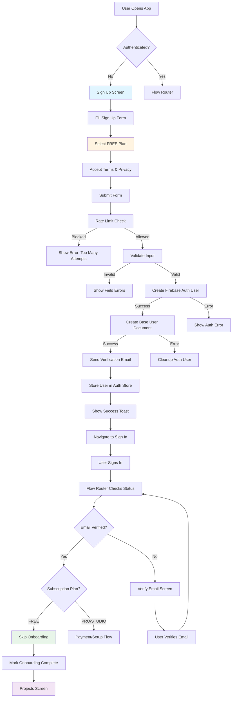
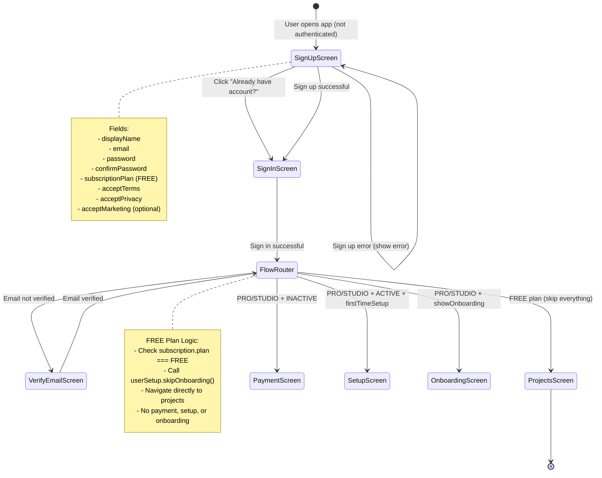
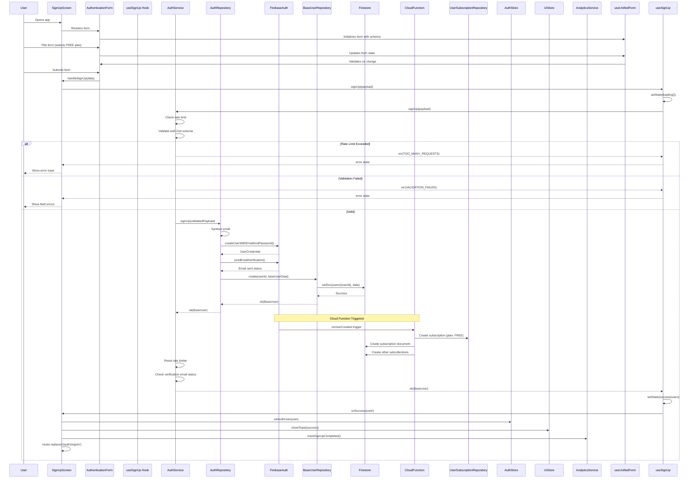
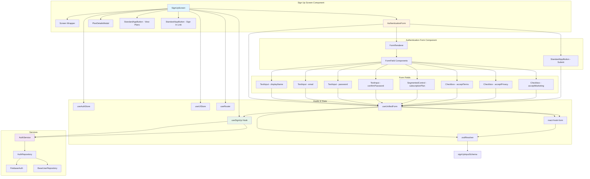
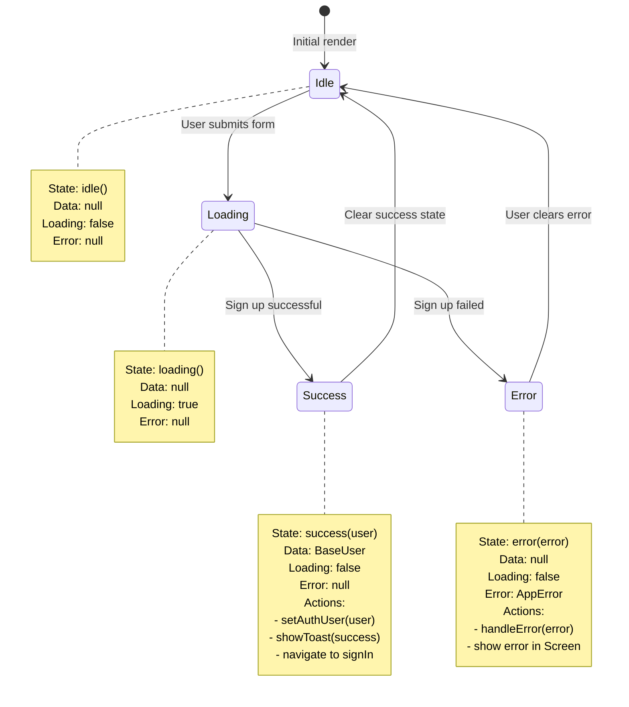
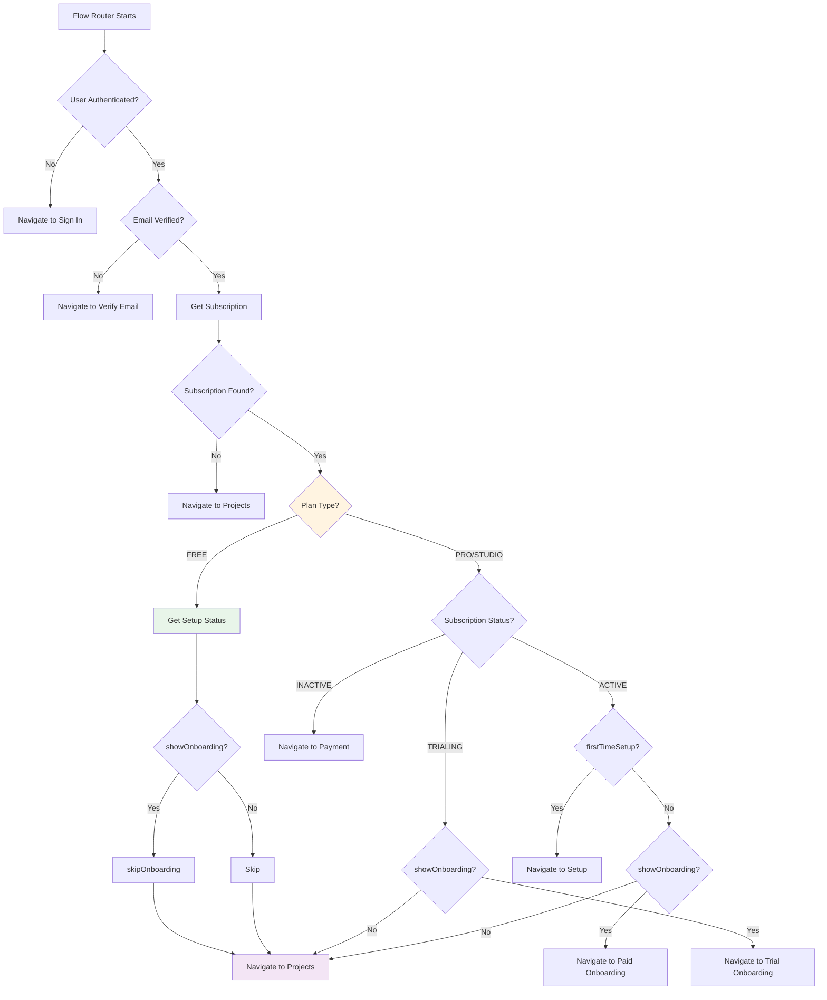
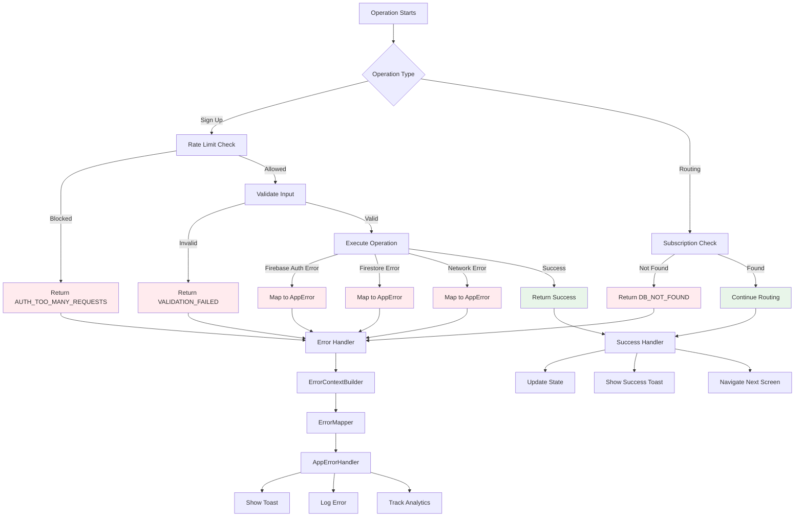
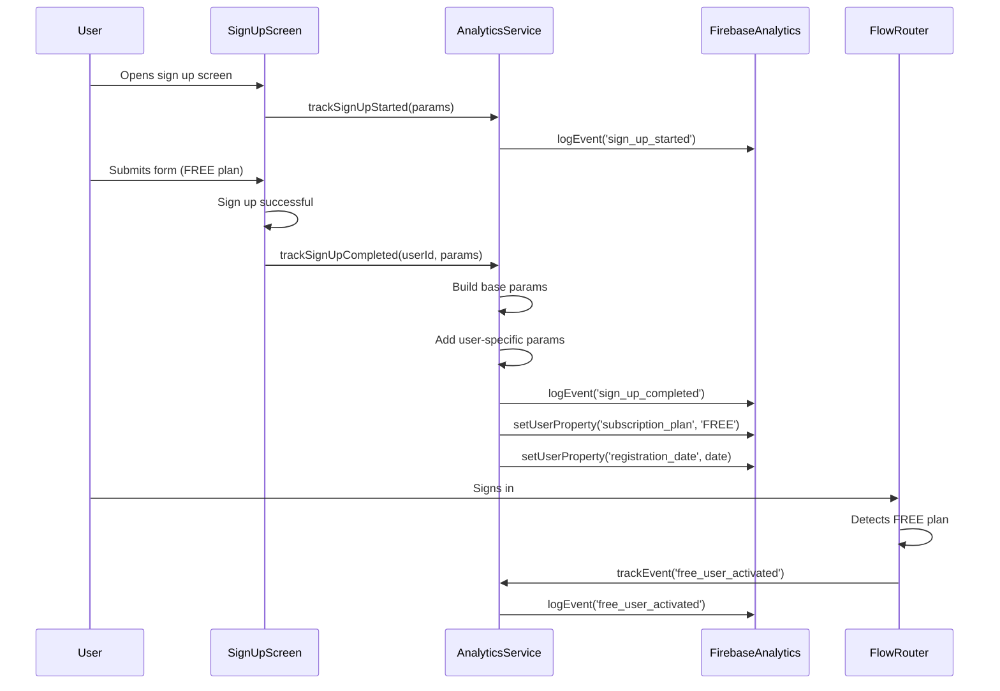

# Free Account Sign-Up Flow Documentation

## Overview

This document maps out the complete process of a new user signing up for a **free account** (FREE plan) in the Eye-Doo application. It covers all screens, interactions, data flow, state management, navigation, and triggers involved in the sign-up process.

---

## Table of Contents

1. [High-Level Flow](#high-level-flow)
2. [Screen Navigation Flow](#screen-navigation-flow)
3. [Data Flow Architecture](#data-flow-architecture)
4. [Component Interaction Flow](#component-interaction-flow)
5. [State Management Flow](#state-management-flow)
6. [Free Plan Routing Logic](#free-plan-routing-logic)
7. [Error Handling Flow](#error-handling-flow)
8. [Analytics Tracking Flow](#analytics-tracking-flow)
9. [Detailed Component Breakdown](#detailed-component-breakdown)

---

## High-Level Flow



---

## Screen Navigation Flow



---

## Data Flow Architecture



---

## Component Interaction Flow



---

## State Management Flow



### State Properties

#### useSignUp Hook State

```typescript
interface UseSignUpResult {
  loading: boolean; // true when signUp is in progress
  error: AppError | null; // error object if signUp failed
  state: LoadingState<BaseUser | null>; // full state object
  signUp: (payload: SignUpInput) => Promise<boolean>;
  clearError: () => void; // clears error state
}
```

#### SignUpScreen Component State

```typescript
// Local state
const [showPlanModal, setShowPlanModal] = useState(false);
const formRef = useRef<ReturnType<typeof useUnifiedForm<SignUpInput>> | null>(null);

// From hooks
const { loading, error, clearError, signUp } = useSignUp({...});
const setAuthUser = useAuthStore(state => state.setUser);
const showToast = useUIStore(state => state.showToast);
```

#### Form State (react-hook-form)

```typescript
interface FormState {
  values: SignUpInput;
  errors: FieldErrors<SignUpInput>;
  touchedFields: Partial<Record<keyof SignUpInput, boolean>>;
  isValid: boolean;
  isDirty: boolean;
  isSubmitting: boolean;
}
```

---

## Free Plan Routing Logic

```mermaid
sequenceDiagram
    participant User
    participant SignInScreen
    participant FlowRouter
    participant UserSubscriptionService
    participant UserSetupService
    participant Firestore
    participant ProjectsScreen
    
    User->>SignInScreen: Signs in
    SignInScreen->>FlowRouter: Navigate after sign in
    
    FlowRouter->>FlowRouter: Check email verification
    FlowRouter->>FlowRouter: user.isEmailVerified = true
    
    FlowRouter->>UserSubscriptionService: getByUserId(userId)
    UserSubscriptionService->>Firestore: Query subscription
    Firestore-->>UserSubscriptionService: subscription (plan: FREE)
    UserSubscriptionService-->>FlowRouter: ok(subscription)
    
    FlowRouter->>FlowRouter: Check subscription.plan === FREE
    
    FlowRouter->>UserSetupService: getByUserId(userId)
    UserSetupService->>Firestore: Query setup
    Firestore-->>UserSetupService: setup document
    UserSetupService-->>FlowRouter: ok(setup)
    
    FlowRouter->>FlowRouter: Check setup.showOnboarding
    
    alt showOnboarding === true
        FlowRouter->>UserSetupService: skipOnboarding(userId)
        UserSetupService->>Firestore: Update setup document
        Note over UserSetupService,Firestore: Set showOnboarding: false<br/>Set firstTimeSetup: false
        Firestore-->>UserSetupService: Success
        UserSetupService-->>FlowRouter: ok()
    end
    
    FlowRouter->>ProjectsScreen: router.replace('/(projects)')
    
    Note over FlowRouter,ProjectsScreen: FREE users skip:
    - Payment flow
    - Setup flow
    - Onboarding flow
    - Direct to projects
```

### Flow Router Decision Tree



---

## Error Handling Flow



### Error Types & Handling

| Error Type             | Code                        | User Message                                     | Action                          |
| ---------------------- | --------------------------- | ------------------------------------------------ | ------------------------------- |
| Rate Limit Exceeded    | `AUTH_TOO_MANY_REQUESTS`    | "Too many attempts. Try again in X minutes."     | Block further attempts          |
| Validation Failed      | `VALIDATION_FAILED`         | Field-specific error messages                    | Show field errors               |
| Email Already Exists   | `AUTH_EMAIL_ALREADY_IN_USE` | "This email is already registered."              | Suggest sign in                 |
| Weak Password          | `AUTH_WEAK_PASSWORD`        | "Password is too weak."                          | Show password requirements      |
| Network Error          | `NETWORK_ERROR`             | "Connection failed. Please check your internet." | Allow retry                     |
| Subscription Not Found | `DB_NOT_FOUND`              | "Subscription not found."                        | Navigate to projects (fallback) |

---

## Analytics Tracking Flow



### Analytics Events Tracked

| Event                | When                        | Parameters                                            |
| -------------------- | --------------------------- | ----------------------------------------------------- |
| `sign_up_started`    | User opens sign up screen   | `session_id`, `platform`, `app_version`               |
| `sign_up_completed`  | Sign up successful          | `user_id`, `method`, `user_type`, `subscription_plan` |
| `free_user_activated` | FREE user reaches projects  | `user_id`, `plan`, `skipped_onboarding`                |

---

## Detailed Component Breakdown

### 1. SignUpScreen Component

**File**: `src/app/(auth)/signUp.tsx`

**Props**: None (Screen component)

**State**:

```typescript
const [showPlanModal, setShowPlanModal] = useState(false);
const formRef = useRef<ReturnType<typeof useUnifiedForm<SignUpInput>> | null>(null);
```

**Hooks Used**:

- `useSignUp()` - Sign up operation
- `useAuthStore()` - Global auth state
- `useUIStore()` - Toast notifications
- `useRouter()` - Navigation
- `useAppStyles()` - Styling

**Key Functions**:

```typescript
handleSignUp(data: SignUpInput): Promise<boolean>
  - Calls signUp hook
  - Returns success/failure

handleFormReady(form): void
  - Stores form reference
  - Allows external form control

handlePlanSelect(plan: SubscriptionPlan): void
  - Updates form value for subscriptionPlan
  - Triggers validation
```

**Navigation**:

- Success: `router.replace('/(auth)/signIn')`
- Error: Stays on screen, shows error
- Link: `router.replace('/(auth)/signIn')` (already have account)

---

### 2. AuthenticationForm Component

**File**: `src/components/auth/AuthenticationForm.tsx`

**Props**:

```typescript
interface AuthenticationFormProps {
  mode: 'signUp' | 'signIn' | 'reset-password' | ...;
  onSubmit: (data: SignUpInput) => Promise<boolean>;
  loading?: boolean;
  onFormReady?: (form) => void;
}
```

**Internal State**:

- Managed by `useUnifiedForm` hook
- React Hook Form state
- Zod validation state

**Key Features**:

- Dynamic form rendering based on mode
- Real-time validation
- Field-level error display
- Submit button disabled when invalid/loading

---

### 3. useSignUp Hook

**File**: `src/hooks/use-sign-up.ts`

**Options**:

```typescript
interface UseSignUpOptions {
  onSuccess?: (user: BaseUser) => void;
  onError?: (error: AppError) => void;
}
```

**Returns**:

```typescript
interface UseSignUpResult {
  loading: boolean;
  error: AppError | null;
  state: LoadingState<BaseUser | null>;
  signUp: (payload: SignUpInput) => Promise<boolean>;
  clearError: () => void;
}
```

**Flow**:

1. `signUp()` called with payload
2. Set state to `loading()`
3. Call `AuthService.signUp()`
4. On success: `setState(success(user))`, call `onSuccess`
5. On error: `setState(error(error))`, call `onError`, handle error

---

### 4. AuthService

**File**: `src/services/auth-service.ts`

**Method**: `signUp(payload: SignUpInput): Promise<Result<BaseUser, AppError>>`

**Steps**:

1. **Rate Limiting**: Check `signUpRateLimiter.canAttempt()`
2. **Validation**: Validate with `signUpInputSchema`
3. **Repository Call**: Delegate to `authRepository.signUp()`
4. **Post-Processing**:
   - Reset rate limiter on success
   - Check verification email status
   - Show warning toast if email failed

---

### 5. AuthRepository

**File**: `src/repositories/firestore/firestore-auth-repository.ts`

**Method**: `signUp(payload: SignUpInput): Promise<Result<BaseUser, AppError>>`

**Steps**:

1. **Sanitize**: Sanitize email with `sanitizeEmail()`
2. **Create Auth User**: `createUserWithEmailAndPassword()`
3. **Send Verification**: `sendEmailVerification()` (non-blocking)
4. **Create Base User**: Call `baseUserRepository.create()`
5. **Return**: Return `BaseUser` or error

**Error Handling**:

- If base user creation fails, auth user cleanup handled by Cloud Function
- Verification email failure doesn't fail sign up

---

### 6. FlowRouter Component

**File**: `src/app/(flow-router)/index.tsx`

**State**:

```typescript
const [routing, setRouting] = useState(true);
```

**Flow**:

1. **Check Authentication**: If no user, navigate to sign in
2. **Check Email Verification**: If not verified, navigate to verify email
3. **Get Subscription**: Fetch user subscription
4. **Get Setup**: Fetch user setup status
5. **Route Based on Plan**:
   - **FREE Plan**: Skip onboarding, navigate to projects
   - **Paid Plans**: Continue with payment/setup/onboarding flow

**FREE Plan Logic**:

```typescript
if (subscription.plan === SubscriptionPlan.FREE) {
  if (setup.showOnboarding) {
    // Skip onboarding for FREE users
    await userSetup.skipOnboarding(user.id);
  }
  router.replace('/(projects)');
  return;
}
```

---

### 7. UserSetupService

**File**: `src/services/user-setup-service.ts`

**Method**: `skipOnboarding(userId: string): Promise<Result<void, AppError>>`

**Steps**:

1. Validate userId
2. Get current setup document
3. Update setup document:
   - `showOnboarding: false`
   - `firstTimeSetup: false`
4. Return success

---

## Data Structures

### SignUpInput

```typescript
interface SignUpInput {
  displayName: string; // Min 1, max 100 chars
  email: string; // Valid email format
  password: string; // Min 8 chars, letters + numbers
  confirmPassword: string; // Must match password
  subscriptionPlan: SubscriptionPlan; // FREE
  acceptTerms: boolean; // Must be true
  acceptPrivacy: boolean; // Must be true
  acceptMarketing?: boolean; // Optional
}
```

### BaseUser (Created)

```typescript
interface BaseUser {
  id: string; // Firebase Auth UID
  email: string; // Sanitized email
  displayName: string; // From input
  phone: null; // Set to null
  selectedSubscriptionPlan: SubscriptionPlan; // FREE
  role: UserRole.USER;
  isEmailVerified: false; // Set to false initially
  isActive: true;
  isBanned: false;
  hasCustomizations: false;
  lastLoginAt: null;
  deletedAt: null;
  createdAt: Date; // Server timestamp
  updatedAt: null;
}
```

### UserSubscription (Created by Cloud Function)

```typescript
interface UserSubscription {
  id: string; // Generated by Firestore
  userId: string;
  plan: SubscriptionPlan; // FREE
  status: SubscriptionStatus.INACTIVE; // Default for FREE
  isActive: false; // Default for FREE
  autoRenew: false;
  billingCycle: PaymentInterval.NONE; // No billing for FREE
  startDate: Date; // Current timestamp
  endDate: null;
  trialEndsAt: null; // No trial for FREE
  canceledAt: null;
  lastPaymentDate: null; // No payments for FREE
  nextBillingDate: null; // No billing for FREE
  transactionId: '';
  receipt: '';
  createdAt: Date; // Server timestamp
  updatedAt: null;
}
```

### UserSetup (After skipOnboarding)

```typescript
interface UserSetup {
  id: string;
  userId: string;
  showOnboarding: false; // Set to false
  firstTimeSetup: false; // Set to false
  // ... other fields
}
```

---

## Navigation Path Summary

```
1. App Start (not authenticated)
   → /(auth)/signUp

2. Sign Up Success (FREE plan)
   → /(auth)/signIn

3. Sign In Success
   → /(flow-router)

4. Flow Router Logic for FREE:
   - Email not verified → /(auth)/verify-email
   - Email verified + FREE plan → Skip onboarding → /(projects)

5. FREE users skip:
   - Payment flow
   - Setup flow
   - Onboarding flow
   - Direct to projects
```

---

## Key Differences: Free vs Paid Sign-Up

| Aspect                  | Free Sign-Up              | Paid Sign-Up                    |
| ----------------------- | ------------------------- | ------------------------------- |
| **Plan Selection**      | FREE                      | PRO or STUDIO                   |
| **After Sign Up**       | Direct to sign in         | Direct to sign in (same)        |
| **After Sign In**       | Direct to projects        | Payment required                |
| **Payment Flow**        | Not required              | Required (Stripe)               |
| **Subscription Status** | INACTIVE (default)        | INACTIVE → ACTIVE after payment |
| **Onboarding**          | Skipped automatically     | Short paid onboarding           |
| **Setup**               | Skipped automatically     | Required after payment          |
| **Trial Period**        | No trial                  | Trial available (PRO/STUDIO)    |
| **Billing Cycle**       | NONE                      | MONTHLY or ANNUALLY             |
| **Routing Logic**       | Skip all flows            | Payment → Setup → Onboarding    |

---

## Cloud Function Integration

### onUserCreated Trigger

When a user signs up, Firebase Cloud Function `onUserCreated` is automatically triggered:

```typescript
export const onUserCreated = functions.auth.user().onCreate(async (user) => {
  const uid = user.uid;
  const firestore = admin.firestore();
  
  // 1. Read selected plan from metadata (if available)
  let selectedPlan = SubscriptionPlan.FREE;
  
  // 2. Create subscription with correct plan
  const subData = defaultUserSubscription(uid);
  subData.plan = selectedPlan; // FREE for free users
  
  // For FREE plan:
  // - status: INACTIVE (default)
  // - isActive: false (default)
  // - billingCycle: NONE (default)
  // - No trial period
  
  // 3. Create all user documents:
  // - Base user (already created by client)
  // - Subscription subcollection
  // - Profile subcollection
  // - Preferences subcollection
  // - Customizations subcollection
  // - Setup subcollection
  // - Projects subcollection
});
```

**Key Points for FREE Users**:

- Subscription is created with `plan: FREE`
- `status: INACTIVE` (but user can still use app)
- `isActive: false` (but user can still use app)
- `billingCycle: NONE` (no billing)
- No trial period
- All subcollections created with defaults

---

## Summary

The free sign-up flow involves:

1. **Sign Up**: User fills form, selects FREE plan, submits
2. **Account Creation**: Firebase Auth user + Base User document created
3. **Cloud Function**: Automatically creates subscription and all subcollections
4. **Sign In**: User signs in with new credentials
5. **Flow Router**: Detects FREE plan, skips onboarding automatically
6. **Projects**: User reaches main app immediately

**Key Simplifications for FREE Users**:

- ✅ No payment processing
- ✅ No subscription activation
- ✅ No setup flow
- ✅ No onboarding flow
- ✅ Direct access to projects
- ✅ Automatic onboarding skip

The entire flow is tracked with analytics, handles errors gracefully, and follows the Result pattern for all async operations. FREE users get immediate access to the app with minimal friction.

