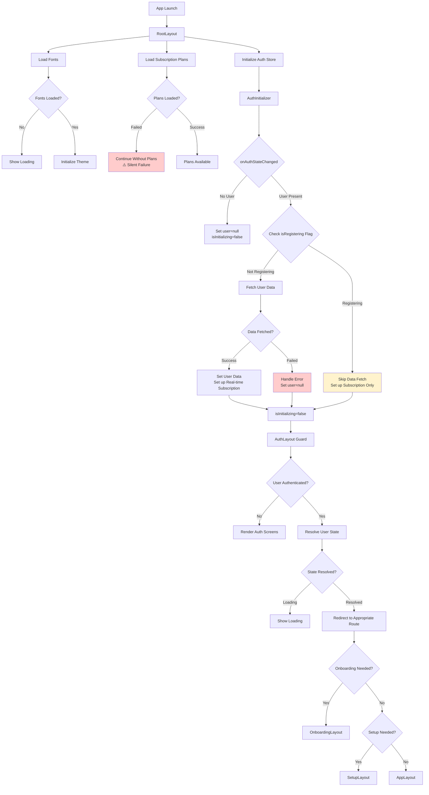

# Global Flow Analysis Report

## Executive Summary

The Eye-Doo app implements a complex authentication and user state management flow using React Native, Expo Router, Firebase Auth, and Zustand for state management. The flow involves multiple layout guards, async operations, and state synchronization that can lead to race conditions and inconsistent loading states.

## Architecture Overview

```
App Launch → RootLayout → AuthInitializer → Layout Guards → User State Resolution → Route Rendering
```

## Detailed Flow Analysis

### Step 1: App Launch & RootLayout Initialization

**Code Location**: `src/app/_layout.tsx`

**Flow**:

1. `SplashScreen.preventAutoHideAsync()` - Prevents splash screen from auto-hiding
2. Initialize global error handler
3. Load fonts asynchronously
4. Load subscription plans (non-blocking)
5. Initialize Stripe provider
6. Render Stack with no navigation guards

**Issues Identified**:

#### 🚨 **CRITICAL BUG**: Race Condition in Font Loading

```typescript
const [fontsLoaded, fontError] = useFonts(fontAssets);
const colorScheme = useColorScheme();

// Theme depends on colorScheme but renders even if fonts fail
if (!fontsLoaded && !fontError) {
  return null; // Still loading
}

// Render even if fonts fail to load (fallback to system fonts)
```

**Problems**:

- Theme is initialized before fonts load, potentially causing layout shifts
- Font loading failure doesn't prevent app rendering, but theme depends on `colorScheme`
- No error handling for font loading failures beyond basic fallback

#### ✅ **GOOD**: Error Boundary at Root Level

- Global error boundary wraps entire app
- Prevents crashes from propagating to native layer

#### ⚠️ **ISSUE**: Subscription Plans Loading

```typescript
// Non-blocking subscription loading
const loadPlans = async () => {
  try {
    await serviceFactory.subscription.loadAllPlans();
  } catch (error) {
    if (__DEV__) {
      console.warn('[RootLayout] Failed to load subscription plans (likely offline):', error);
    }
  }
};
```

**Problems**:

- No loading state exposed to UI
- No retry mechanism for failed loads
- Silent failures in production (**DEV** check)
- App continues without subscription data, potentially causing issues

### Step 2: Auth State Initialization

**Code Location**: `src/components/auth/AuthInitializer.tsx`

**Flow**:

1. Set `isInitializing = true`
2. Listen to Firebase `onAuthStateChanged`
3. Handle user presence/absence
4. Set up real-time user document subscription
5. Set `isInitializing = false`

**Issues Identified**:

#### 🚨 **CRITICAL BUG**: Race Condition with Registration Flow

```typescript
// Check isRegistering flag
if (isRegistering) {
  // Skip data fetch, set up subscription only
  setInitializing(false);
  return;
}
```

**Problems**:

- The `isRegistering` flag is set in `useRegister` hook, but there's a timing window where AuthInitializer might run before registration completes
- If Firebase auth state changes before `setRegistering(true)` is called, AuthInitializer will try to fetch user data that doesn't exist yet
- This can cause the app to show loading indefinitely or fetch incomplete data

#### ✅ **GOOD**: Proper Cleanup in useEffect

- Both auth and user subscriptions are properly cleaned up
- `isMountedRef` prevents state updates after unmount

#### ⚠️ **ISSUE**: Complex State Management

The AuthInitializer manages multiple loading states:

- `setInitializing(true)` - App launch
- `setLoading(true)` - Data fetching during sign-in
- `isRegistering` - Prevents conflicts during registration

**Problems**:

- Three different loading states that can conflict
- No clear ownership of these states
- Potential for loading states to get stuck

### Step 3: Auth Layout Guard

**Code Location**: `src/app/(auth)/_layout.tsx`

**Flow**:

1. Check if user is authenticated
2. If authenticated, redirect to appropriate protected route using `useUserState`
3. If not authenticated, render auth screens

**Issues Identified**:

#### ⚠️ **ISSUE**: Double State Checking

```typescript
const { user, loading, isRegistering } = useAuthStore();
const { state, loading: stateLoading } = useUserState();
```

**Problems**:

- Checks both raw user data and resolved state
- Two separate loading states to manage
- Potential inconsistency between auth store and user state

#### ✅ **GOOD**: Proper Redirect Logic

- Uses `UserStateResolver` to determine correct redirect path
- Handles onboarding, setup, and app routes appropriately

### Step 4: Protected Layout Guard

**Code Location**: `src/app/(protected)/_layout.tsx`

**Flow**:

1. Check authentication status
2. If not authenticated, redirect to welcome screen
3. If authenticated, render protected content

**Issues Identified**:

#### ✅ **GOOD**: Simple Authentication Check

- Clean separation of concerns
- Delegates to nested layouts for specific logic

### Step 5: Nested Layout Guards (Onboarding/Setup/Payment)

**Code Locations**:

- `src/app/(protected)/(onboarding)/_layout.tsx`
- `src/app/(protected)/(setup)/_layout.tsx`
- `src/app/(protected)/(payment)/_layout.tsx`

**Flow**: Each layout checks user state and redirects if user doesn't belong there.

**Issues Identified**:

#### ⚠️ **ISSUE**: Complex Redirect Logic

Each layout implements similar but slightly different redirect logic:

```typescript
// In onboarding layout
const shouldBeInOnboarding = state.allowedRouteGroup === RouteGroup.ONBOARDING;

// In setup layout
if (!state.needsSetup || state.needsOnboarding) {
  return <Redirect href={state.redirectPath} />;
}
```

**Problems**:

- Duplicated logic across layouts
- Potential for conflicting redirect rules
- Hard to maintain and debug

## Race Conditions & Timing Issues

### 1. **Auth State vs User Data Synchronization**

**Problem**: Firebase auth state can change before Firestore user document is created/updated by Cloud Functions.

**Impact**:

- AuthInitializer tries to fetch user data that doesn't exist yet
- User sees loading screen indefinitely
- App becomes unresponsive

**Current Mitigation**: `isRegistering` flag, but timing is fragile.

### 2. **Multiple Loading States**

**Problem**: Three different loading states managed by different components:

- `isInitializing` (AuthInitializer)
- `loading` (AuthStore)
- `isRegistering` (AuthStore)

**Impact**:

- Inconsistent loading UI
- Race conditions between state updates
- Difficult to debug loading issues

### 3. **Font Loading vs Theme Initialization**

**Problem**: Theme depends on `useColorScheme()` but fonts load asynchronously.

**Impact**:

- Layout shifts when fonts load
- Theme colors applied before fonts are ready
- Poor user experience

## Error Handling Issues

### 1. **Silent Failures in Production**

```typescript
if (__DEV__) {
  console.warn('[RootLayout] Failed to load subscription plans (likely offline):', error);
}
```

**Problems**:

- Subscription data failures are silent in production
- No user feedback or retry mechanism
- App continues with incomplete data

### 2. **Inconsistent Error Context**

Error contexts are built differently across the codebase:

- Some use `ErrorContextBuilder.fromService()`
- Some use `ErrorContextBuilder.fromComponent()`
- Some use string contexts

### 3. **Missing Error Recovery**

- No retry mechanisms for failed auth operations
- No offline handling for critical auth flows
- No graceful degradation when services fail

## State Inconsistencies

### 1. **Auth Store vs User State**

**Problem**: Two sources of truth for user state:

- `useAuthStore()` - Raw user object with loading states
- `useUserState()` - Resolved state with permissions and redirects

**Impact**:

- Components need to check both states
- Potential for state to be out of sync
- Complex conditional logic

### 2. **Loading State Management**

**Problem**: Loading states are managed at multiple levels:

- Component level (local loading)
- Hook level (operation loading)
- Store level (global loading)

**Impact**:

- Conflicting loading indicators
- Race conditions in state updates
- Poor UX with multiple spinners

## Recommended Fixes

### 1. **Fix Font Loading Race Condition**

```typescript
// Initialize theme after fonts load
useEffect(() => {
  if (fontsLoaded) {
    const colorScheme = useColorScheme();
    setTheme(colorScheme === 'dark' ? AppDarkTheme : AppLightTheme);
  }
}, [fontsLoaded]);

// Don't render until fonts are ready
if (!fontsLoaded && !fontError) {
  return <LoadingIndicator message="Loading fonts..." />;
}
```

### 2. **Consolidate Loading States**

Create a single loading state machine:

```typescript
type AppLoadingState =
  | 'initializing' // App launch
  | 'authenticating' // Auth check
  | 'loading-user' // User data fetch
  | 'registering' // Registration in progress
  | 'ready'; // App ready
```

### 3. **Fix Registration Race Condition**

Use a more robust mechanism for registration state:

```typescript
// Use Firebase auth state + local flag
const isInRegistrationFlow = useAuthStore(state => state.isRegistering && !state.user);
```

### 4. **Centralize Redirect Logic**

Create a single `useAppNavigation` hook that handles all redirects based on user state.

### 5. **Add Error Recovery**

Implement retry mechanisms and offline handling for critical operations.

## Mermaid Diagram



## Conclusion

The global flow has several interconnected issues that can cause race conditions, loading inconsistencies, and poor error handling. The main problems are:

1. **Race conditions** between auth state changes and data fetching
2. **Multiple conflicting loading states**
3. **Silent failures** in production
4. **Complex redirect logic** duplicated across layouts
5. **Timing issues** with font loading and theme initialization

These issues can lead to:

- Infinite loading screens
- Inconsistent UI states
- Poor error recovery
- Difficult debugging
- Bad user experience

The fixes require architectural changes to consolidate state management and add proper error handling and retry mechanisms.
