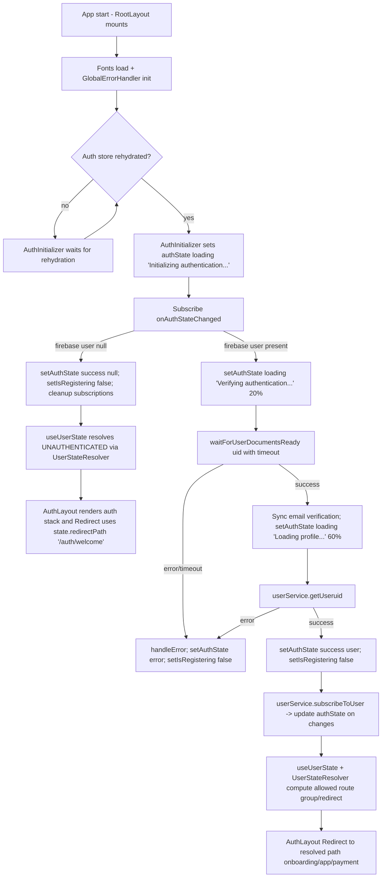

# Mermaid Flows (Auth & Signup)

## Global Flow



### Global Flow Risks

- Redirect path for blocked users is `/ (payment)/pricing` in `UserStateResolver`, but the stack only exposes `(auth)` and `(protected)` groups; likely needs `/(protected)/(payment)/pricing`, so blocked users may hit an invalid path or blank screen.
- `UserStateResolver.canAccessRoute` always permits payment routes and treats `PermissionLevel.READ_ONLY` (e.g., unverified free) as allowed for app routes; if payment routes live under protected groups this may bypass expected auth gating.
- `AuthInitializer` safety timeout forces an error after 30s but leaves the auth listener active; subsequent auth events could overwrite the error without resetting UI that depends on the error state.
- `setIsRegistering` is cleared only inside `AuthInitializer`; if `authService.register` succeeds but no auth event fires (edge case), the flag stays true and can mislead UI/guards.

## Registration Flow (Email/Password)

```mermaid
flowchart TD
  A[RegisterScreen] --> B[AuthenticationForm mode=register submit]
  B --> C[useRegister.register]
  C --> D[setIsRegistering true; authState loadingWithProgress 'Creating account...' 10%]
  D --> E[authService.register(input)]
  E -->|failure| F[setIsRegistering false; setAuthState error; handleError; return false]
  E -->|success| G[Return true to UI; await Firebase auth event]
  G --> H[AuthInitializer onAuthStateChanged(firebaseUser)]
  H --> I[waitForUserDocumentsReady + email verification sync]
  I -->|error/timeout| J[authState error with previous data; setIsRegistering false; show retry]
  I -->|success| K[userService.getUser -> authState success(user); setIsRegistering false]
  K --> L[userService.subscribeToUser for realtime updates]
  L --> M[UserStateResolver selects redirect (onboarding/app/payment)]
  M --> N[AuthLayout Redirect executes]
```

### Registration Risks

- If `authService.register` resolves success but fails to sign the user in, `AuthInitializer` never clears `_isRegistering` or moves past the loading state, leaving the flow stuck without a visible error.
- Errors during `waitForUserDocumentsReady` return to the UI, but the Firebase auth listener remains; repeated retries could stack subscriptions if not carefully cleaned up (only one ref is stored—cleanup relies on the callback running).

## Sign-Up Flow (User Journey + Verification)

```mermaid
flowchart TD
  A[Welcome screen] --> B[User taps Sign up -> NavigationRoute.REGISTER]
  B --> C[RegisterScreen form submission]
  C --> D[useRegister -> authService.register -> Firebase account]
  D --> E[AuthInitializer handles auth event, waits for documents, loads profile]
  E --> F{UserStateResolver state}
  F -->|Free + unverified| G[Redirect to onboarding/app with READ_ONLY permissions]
  G --> H[EmailVerificationModal (from pricing/onboarding) uses useEmailVerificationStatus]
  H --> I{checkVerificationStatus()}
  I -->|verified| J[authService.syncEmailVerification -> Firestore update -> success toast -> onVerified callback]
  I -->|not verified| K[Stay in flow; show error if any]
  K --> L[resendEmailVerification -> services.auth.resendEmailVerification; toasts]
  K --> M[skipVerification -> userService.updateSetup(skippedEmailVerification=true); optimistic update]
  F -->|Subscription blocked| N[Redirect (intended) to pricing flow]
  F -->|Paid active| O[Redirect to onboarding/setup/projects based on setup flags]
```

### Sign-Up Risks

- Email verification flow relies on `userService.getUser` refresh after skip; on failure it uses optimistic update without clearing the modal in some parent flows, which could leave UI thinking verification is incomplete.
- `checkVerificationStatus` throttles with `MIN_CHECK_INTERVAL_MS`, but the timestamp is captured before retries; rapid re-checks within one invocation may skip cooldown enforcement.
- Social sign-up buttons are stubbed; pressing them does nothing while the UI suggests third-party auth is available.
