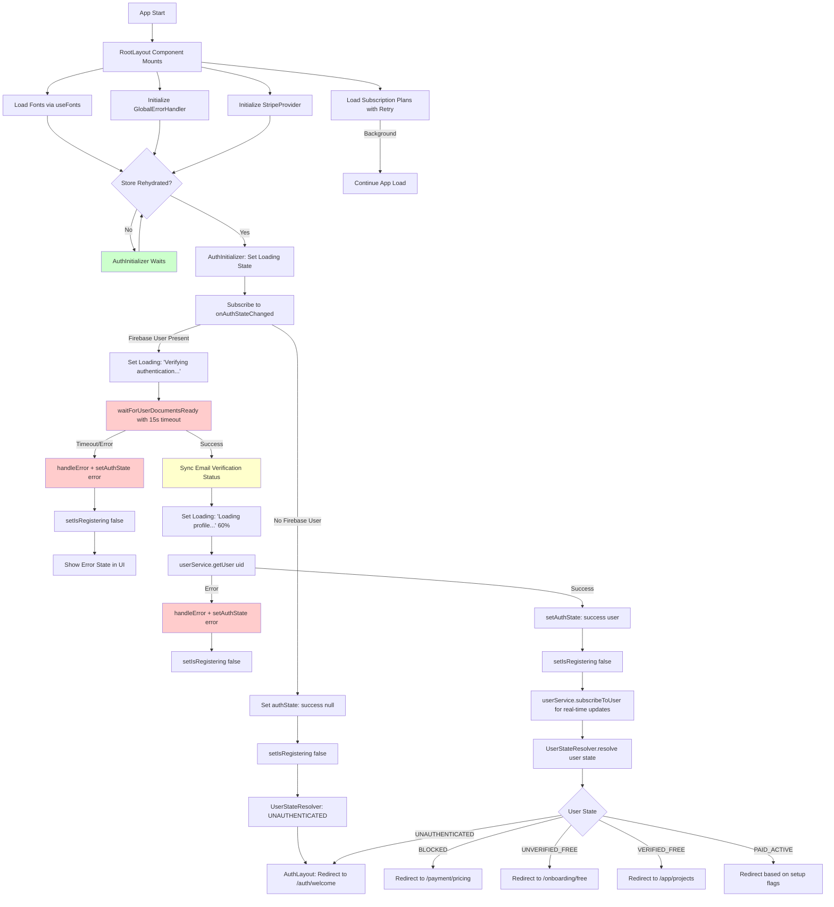
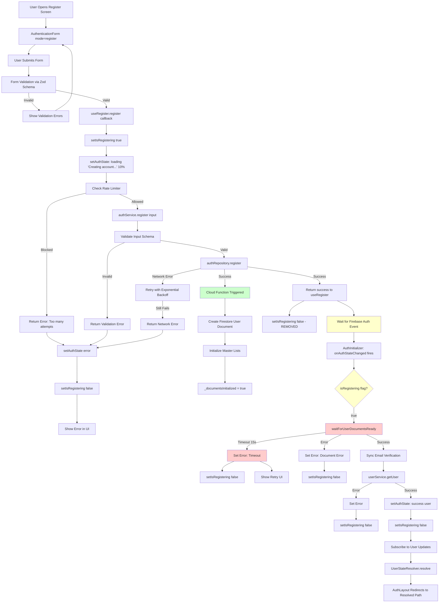
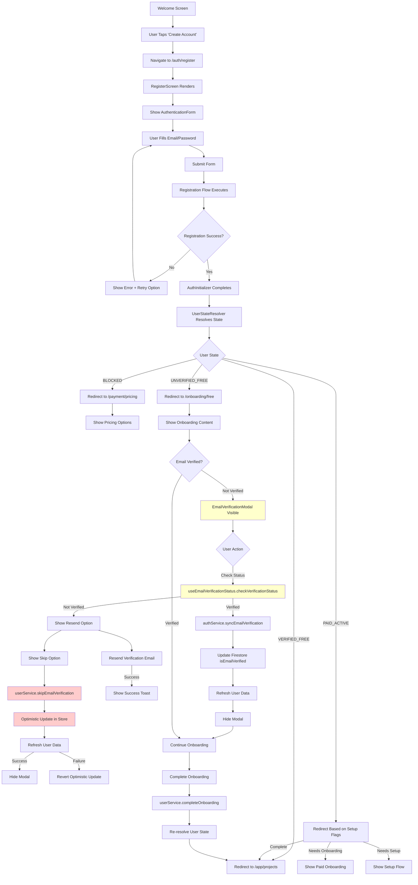

# Mermaid Flow Diagrams - Authentication & Registration Flows

This document contains detailed mermaid diagrams for the global app flow, registration flow, and sign-up flow, along with comprehensive analysis of potential bugs, race conditions, and issues.

---

## 1. Global App Initialization Flow

### Global Flow Issues & Risks

#### 🔴 Critical Issues

1. **Race Condition: Store Rehydration vs Auth Initialization**
   - **Location**: `AuthInitializer.tsx:38-43`
   - **Issue**: If rehydration completes but `useHasRehydrated` hook hasn't updated yet, initialization may be delayed unnecessarily
   - **Impact**: User sees loading screen longer than needed
   - **Fix**: Consider using a ref or direct store access for rehydration check

2. **Safety Timeout Leaves Listener Active**
   - **Location**: `AuthInitializer.tsx:52-70`
   - **Issue**: When timeout fires and sets error state, the `onAuthStateChanged` listener remains active. Subsequent auth events can overwrite the error without proper cleanup
   - **Impact**: Error state may be lost, user may see inconsistent UI
   - **Fix**: Clear timeout should also check if error was set and prevent overwriting

3. **Missing Cleanup on Component Unmount During Wait**
   - **Location**: `AuthInitializer.tsx:103-125`
   - **Issue**: If component unmounts during `waitForUserDocumentsReady`, the subscription cleanup in `waitForUserDocumentsReady` may not execute properly
   - **Impact**: Memory leak, potential duplicate subscriptions
   - **Fix**: Ensure `isMountedRef` is checked before all state updates

#### 🟡 Medium Issues

4. **Email Verification Sync May Block Initialization**
   - **Location**: `AuthInitializer.tsx:130-151`
   - **Issue**: Email verification sync is called synchronously during initialization. If Cloud Function is slow, it delays the entire auth flow
   - **Impact**: Slower app startup, potential timeout
   - **Fix**: Make sync non-blocking or move to background after user load

5. **Redirect Path Mismatch for Blocked Users**
   - **Location**: `user-state-resolver.ts:456`
   - **Issue**: Returns `'/(payment)/pricing'` but actual route is `'/(protected)/(payment)/pricing'`
   - **Impact**: Invalid navigation, blank screen or error
   - **Fix**: Update redirect path to match actual route structure

6. **Subscription Plans Load Failure Doesn't Block App**
   - **Location**: `_layout.tsx:82-113`
   - **Issue**: If subscription plans fail to load, app continues but pricing screen may show errors
   - **Impact**: Poor UX on pricing screen
   - **Fix**: Consider showing warning or retry mechanism

#### 🟢 Low Priority Issues

7. **Multiple `setIsRegistering(false)` Calls**
   - **Location**: Multiple locations in `AuthInitializer.tsx`
   - **Issue**: Flag is cleared multiple times redundantly
   - **Impact**: Minor performance, code clarity
   - **Fix**: Consolidate to single clear point

8. **User Subscription Cleanup Race**
   - **Location**: `AuthInitializer.tsx:183-200`
   - **Issue**: If user subscription is set up but component unmounts immediately after, cleanup may not run
   - **Impact**: Potential memory leak
   - **Fix**: Ensure cleanup runs in all code paths

---

## 2. Registration Flow (Email/Password)

### Registration Flow Issues & Risks

#### 🔴 Critical Issues

1. **Race Condition: Registration Flag Not Cleared on Success**
   - **Location**: `use-auth-actions.ts:69-87`
   - **Issue**: When `authService.register` succeeds, `setIsRegistering(false)` is NOT called. The flag remains true until `AuthInitializer` clears it, which may not happen if auth event doesn't fire
   - **Impact**: UI may show incorrect loading state, navigation guards may block access
   - **Fix**: Clear flag immediately after successful registration, or ensure AuthInitializer always clears it

2. **Silent Failure if Auth Event Never Fires**
   - **Location**: `use-auth-actions.ts:87` + `AuthInitializer.tsx:71-88`
   - **Issue**: If `authService.register` succeeds but Firebase doesn't emit `onAuthStateChanged` event (edge case), user is stuck in loading state
   - **Impact**: User cannot proceed, no error shown
   - **Fix**: Add timeout in `useRegister` to detect this case and show error

3. **Document Wait Timeout Too Short for Slow Cloud Functions**
   - **Location**: `AuthInitializer.tsx:103` (15s timeout)
   - **Issue**: Cloud Function may take longer than 15s during high load or cold starts
   - **Impact**: Legitimate registrations may timeout and show error
   - **Fix**: Increase timeout or make it configurable based on environment

#### 🟡 Medium Issues

4. **Multiple Subscription Cleanup Risk**
   - **Location**: `AuthInitializer.tsx:183-200`
   - **Issue**: If `waitForUserDocumentsReady` fails and user retries, multiple subscriptions may be created if cleanup doesn't run properly
   - **Impact**: Memory leak, duplicate listeners
   - **Fix**: Ensure cleanup always runs, check for existing subscription before creating new one

5. **Email Verification Sync Blocks Registration Flow**
   - **Location**: `AuthInitializer.tsx:130-151`
   - **Issue**: Email verification sync happens during registration, blocking the flow if Cloud Function is slow
   - **Impact**: Slower registration experience
   - **Fix**: Move sync to background or after user is fully loaded

6. **Rate Limiter Uses Email Without Normalization**
   - **Location**: `auth-service.ts:55`
   - **Issue**: Rate limiter normalizes email, but if user uses different casing, they may bypass rate limits
   - **Impact**: Potential abuse
   - **Fix**: Already uses `normalizeEmailForRateLimit` - verify it works correctly

#### 🟢 Low Priority Issues

7. **Optimistic Update Not Used During Registration**
   - **Location**: `use-auth-actions.ts`
   - **Issue**: Registration doesn't use optimistic updates, always shows loading state
   - **Impact**: Slightly slower perceived performance
   - **Fix**: Consider optimistic update after Firebase auth succeeds

8. **Error Messages Not User-Friendly**
   - **Location**: Various error handlers
   - **Issue**: Some errors show technical messages instead of user-friendly ones
   - **Impact**: Poor UX
   - **Fix**: Ensure all errors use `userMessage` field

---

## 3. Sign-Up Flow (Complete User Journey)

### Sign-Up Flow Issues & Risks

#### 🔴 Critical Issues

1. **Email Verification Status Check Throttling Race**
   - **Location**: `use-email-verification-status.ts` (throttling logic)
   - **Issue**: Throttle timestamp is captured before async operations, allowing rapid re-checks within same invocation
   - **Impact**: Excessive API calls, potential rate limiting
   - **Fix**: Move throttle check after async operations or use proper debouncing

2. **Optimistic Update Failure Leaves Modal Open**
   - **Location**: `use-email-verification-status.ts` (skip verification)
   - **Issue**: If optimistic update succeeds but `getUser` refresh fails, modal may remain open with stale state
   - **Impact**: User sees incorrect UI state
   - **Fix**: Ensure modal closes on optimistic update, handle refresh failure separately

3. **Redirect Path Mismatch for Payment Routes**
   - **Location**: `user-state-resolver.ts:456`
   - **Issue**: Returns `'/(payment)/pricing'` but route structure is `'/(protected)/(payment)/pricing'`
   - **Impact**: Navigation fails, blank screen
   - **Fix**: Update to correct path structure

#### 🟡 Medium Issues

4. **Social Sign-Up Buttons Are Stubbed**
   - **Location**: `register.tsx:98-130`
   - **Issue**: Google, Facebook, Apple sign-up buttons have no implementation
   - **Impact**: User confusion, broken functionality
   - **Fix**: Implement social auth or remove buttons

5. **Email Verification Sync May Fail Silently**
   - **Location**: `AuthInitializer.tsx:130-151`
   - **Issue**: Email verification sync errors are logged but don't block flow, user may not know sync failed
   - **Impact**: Email verification status may be out of sync
   - **Fix**: Show warning or retry mechanism

6. **Onboarding Completion Doesn't Refresh User State Immediately**
   - **Location**: `user-service.ts:171-188`
   - **Issue**: After completing onboarding, user state resolver may not immediately reflect changes
   - **Impact**: User may see incorrect redirect or permissions
   - **Fix**: Ensure state refresh after onboarding completion

#### 🟢 Low Priority Issues

7. **Multiple Email Verification Modals Can Be Shown**
   - **Location**: Multiple components use `EmailVerificationModal`
   - **Issue**: If multiple components mount simultaneously, multiple modals may appear
   - **Impact**: UI clutter
   - **Fix**: Use global modal state or singleton pattern

8. **Resend Email Rate Limiting Not User-Friendly**
   - **Location**: `auth-service.ts:200-217`
   - **Issue**: Rate limiter blocks resends but error message may not be clear
   - **Impact**: User confusion
   - **Fix**: Improve error messaging

---

## 4. Race Condition Analysis

### Race Condition #1: Store Rehydration vs Auth Initialization

**Location**: `AuthInitializer.tsx:38-43`

**Problem**: 
- Zustand store rehydration is async
- `useHasRehydrated` hook may not update immediately when rehydration completes
- AuthInitializer waits for hook to be true, causing delay

**Scenario**:
1. App starts, store begins rehydrating
2. Rehydration completes in background
3. Hook hasn't updated yet
4. AuthInitializer waits unnecessarily

**Fix**: Use direct store access or ref to check rehydration status

### Race Condition #2: Registration Flag Not Cleared

**Location**: `use-auth-actions.ts:69-87` + `AuthInitializer.tsx:90-175`

**Problem**:
- `setIsRegistering(true)` is set in `useRegister`
- Flag is only cleared in `AuthInitializer` when auth event fires
- If auth event doesn't fire, flag stays true forever

**Scenario**:
1. User registers successfully
2. `authService.register` returns success
3. Firebase auth event doesn't fire (edge case)
4. `setIsRegistering(false)` never called
5. UI stuck in loading state

**Fix**: Clear flag immediately after successful registration, or add timeout

### Race Condition #3: Multiple Subscriptions During Retry

**Location**: `AuthInitializer.tsx:183-200` + `user-document-waiter.ts:105-155`

**Problem**:
- If `waitForUserDocumentsReady` fails and user retries registration
- Multiple subscriptions may be created if cleanup doesn't run
- Each subscription updates auth state, causing flicker

**Scenario**:
1. Registration starts, subscription created
2. `waitForUserDocumentsReady` times out
3. User retries before cleanup runs
4. New subscription created
5. Both subscriptions active, state updates conflict

**Fix**: Ensure cleanup always runs, check for existing subscription before creating

### Race Condition #4: Email Verification Sync During Registration

**Location**: `AuthInitializer.tsx:130-151`

**Problem**:
- Email verification sync happens during registration flow
- If sync is slow, it blocks entire auth initialization
- User sees loading state longer than needed

**Scenario**:
1. User registers
2. AuthInitializer loads user
3. Email verification sync called
4. Cloud Function slow (cold start)
5. User waits unnecessarily

**Fix**: Move sync to background or after user is fully loaded

---

## 5. Bug Summary

### High Priority Bugs

1. **Registration flag not cleared on success** - Blocks UI
2. **Redirect path mismatch for blocked users** - Navigation fails
3. **Email verification sync blocks initialization** - Slow startup
4. **Social sign-up buttons stubbed** - Broken functionality

### Medium Priority Bugs

5. **Multiple subscriptions on retry** - Memory leak
6. **Email verification status check throttling** - Excessive API calls
7. **Optimistic update failure handling** - UI inconsistency
8. **Onboarding completion state refresh** - Incorrect redirects

### Low Priority Bugs

9. **Multiple email verification modals** - UI clutter
10. **Error messages not user-friendly** - Poor UX
11. **Redundant `setIsRegistering(false)` calls** - Code clarity

---

## 6. Recommendations

### Immediate Fixes

1. **Fix registration flag clearing**: Clear `isRegistering` immediately after successful registration
2. **Fix redirect paths**: Update all redirect paths to match actual route structure
3. **Add timeout for auth event**: Detect if auth event doesn't fire and show error
4. **Implement social auth or remove buttons**: Either implement or remove stubbed buttons

### Short-term Improvements

5. **Move email verification sync to background**: Don't block initialization
6. **Improve subscription cleanup**: Ensure cleanup always runs
7. **Fix throttling logic**: Proper debouncing for email verification checks
8. **Add retry mechanism for failed operations**: Better error recovery

### Long-term Enhancements

9. **Add comprehensive error boundaries**: Catch and handle all error states
10. **Implement proper loading states**: Better UX during async operations
11. **Add analytics for flow completion**: Track where users drop off
12. **Optimize Cloud Function cold starts**: Faster document initialization

---

## 7. Testing Recommendations

### Unit Tests Needed

1. Test `useRegister` hook flag clearing
2. Test `AuthInitializer` cleanup on unmount
3. Test `waitForUserDocumentsReady` timeout handling
4. Test `UserStateResolver` redirect paths

### Integration Tests Needed

1. Test complete registration flow end-to-end
2. Test email verification flow
3. Test navigation redirects for all user states
4. Test error recovery and retry mechanisms

### E2E Tests Needed

1. Test registration with slow Cloud Function
2. Test registration with network interruptions
3. Test email verification flow
4. Test onboarding completion flow

---

## Conclusion

The authentication and registration flows are generally well-structured but have several critical race conditions and bugs that need immediate attention. The most critical issues are:

1. Registration flag not being cleared properly
2. Redirect path mismatches
3. Email verification sync blocking initialization
4. Missing social auth implementation

Addressing these issues will significantly improve the reliability and user experience of the authentication system.

