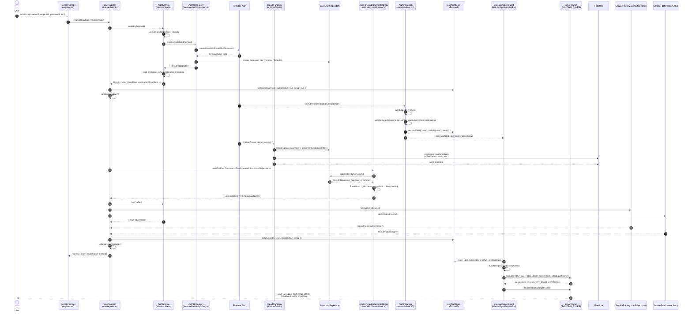

## Registration Flow – Sequence & Data Flow

```mermaid
sequenceDiagram
    autonumber

    actor U as User
    participant RS as RegisterScreen<br/>(register.tsx)
    participant UR as useRegister<br/>(use-register.ts)
    participant AS as AuthService<br/>(auth-service.ts)
    participant AR as AuthRepository<br/>(firestore-auth-repository.ts)
    participant FA as Firebase Auth
    participant CF as Cloud Function<br/>(onUserCreate)
    participant BUR as BaseUserRepository
    participant UDW as waitForUserDocumentsReady<br/>(user-document-waiter.ts)
    participant AI as AuthInitializer<br/>(AuthInitializer.tsx)
    participant ST as useAuthStore<br/>(Zustand)
    participant NG as useNavigationGuard<br/>(use-navigation-guard.ts)
    participant NAV as Expo Router<br/>(ROUTING_RULES)

    %% 1. User submits registration form
    U ->> RS: Submit registration form (email, password, etc.)
    RS ->> UR: register(payload: RegisterInput)

    %% 2. Service-layer registration
    UR ->> AS: register(payload)
    AS ->> AS: validate payload (Zod + Result)
    AS ->> AR: register(validatedPayload)
    AR ->> FA: createUserWithEmailAndPassword(...)
    FA -->> AR: FirebaseUser (uid)
    AR ->> BUR: create base user doc (minimal / defaults)
    AR -->> AS: Result<BaseUser>
    AS ->> AS: rate-limit reset, email verification metadata
    AS -->> UR: Result<{ user: BaseUser, verificationEmailSent }>

    %% 3. Hook: immediate store update to avoid nav race
    UR ->> ST: setUserData({ user, subscription: null, setup: null })
    UR ->> UR: setState(loading())

    %% 4. Firebase Auth state change
    FA -->> AI: onAuthStateChanged(firebaseUser)
    AI ->> AI: isInitializedRef check
    AI ->> AI: withRetry(authService.getProfile / userSubscription / userSetup)
    AI ->> ST: setUserData({ user?, subscription?, setup? })
    AI -->> NG: store updated (user/subscription/setup)

    %% 5. Cloud Function creates subcollections
    FA -->> CF: onUserCreate trigger (async)
    CF ->> BUR: create/update base user (_documentsInitialized=true)
    CF ->> Firestore: create user subcollections<br/>(subscription, setup, etc.)
    CF -->> Firestore: write complete

    %% 6. waitForUserDocumentsReady listens for _documentsInitialized
    UR ->> UDW: waitForUserDocumentsReady(user.id, baseUserRepository)
    UDW ->> BUR: subscribeToUser(userId)
    BUR -->> UDW: Result<BaseUser, AppError> (realtime)
    UDW ->> UDW: if !exists or ! _documentsInitialized → keep waiting
    UDW -->> UR: ok(BaseUser) OR timeout(AppError)

    %% 7. Hook fetches finalized documents
    UR ->> AS: getProfile()
    UR ->> ServiceFactory.userSubscription: getByUserId(user.id)
    UR ->> ServiceFactory.userSetup: getByUserId(user.id)
    AS -->> UR: Result<BaseUser>
    ServiceFactory.userSubscription -->> UR: Result<UserSubscription?>
    ServiceFactory.userSetup -->> UR: Result<UserSetup?>

    %% 8. Atomic store sync and success
    UR ->> ST: setUserData({ user, subscription, setup })
    UR ->> UR: setState(success(user))
    UR -->> RS: Promise<true> (registration finished)

    %% 9. Navigation guard evaluates routing rules
    NG ->> ST: read { user, subscription, setup, isInitializing }
    NG ->> NG: buildNavigationState(segments)
    NG ->> NAV: evaluate ROUTING_RULES(user, subscription, setup, pathname)
    NAV -->> NG: targetRoute (e.g. VERIFY_EMAIL or PRICING)
    NG ->> NAV: router.replace(targetRoute)
    NAV -->> U: User sees post-auth-setup screen<br/>(emailVerification or pricing)
```

