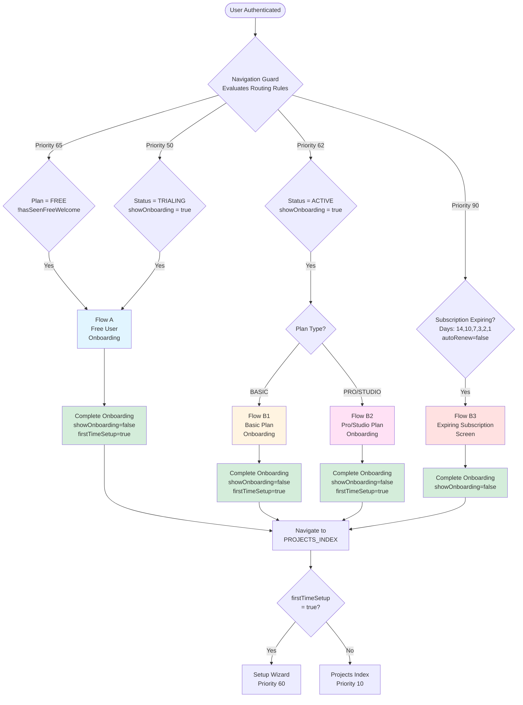
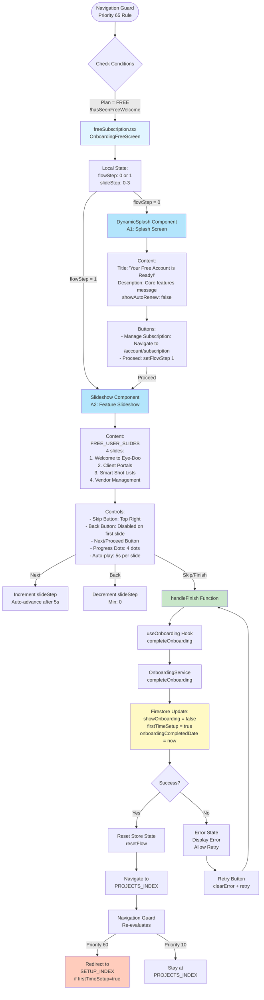
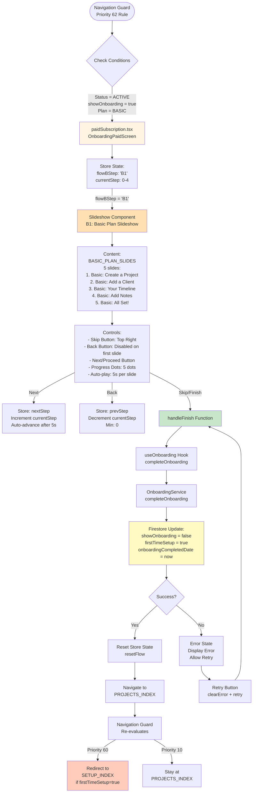
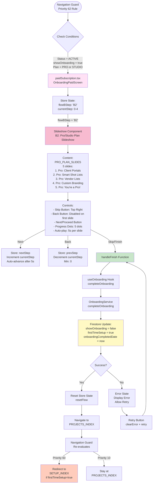
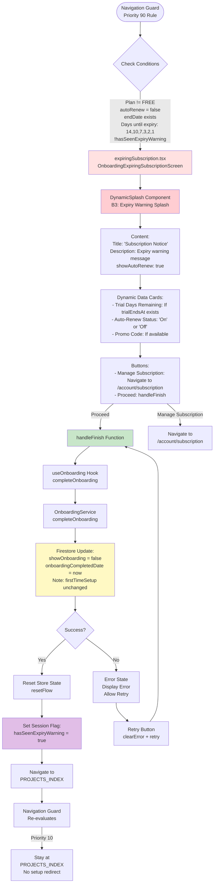
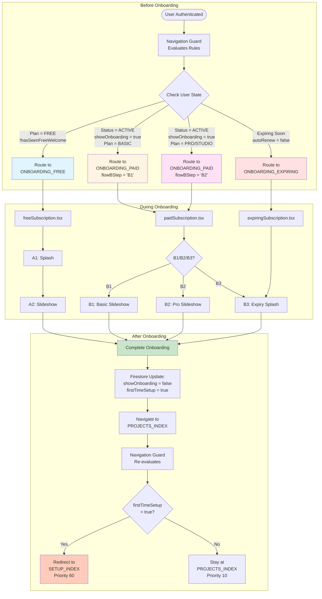
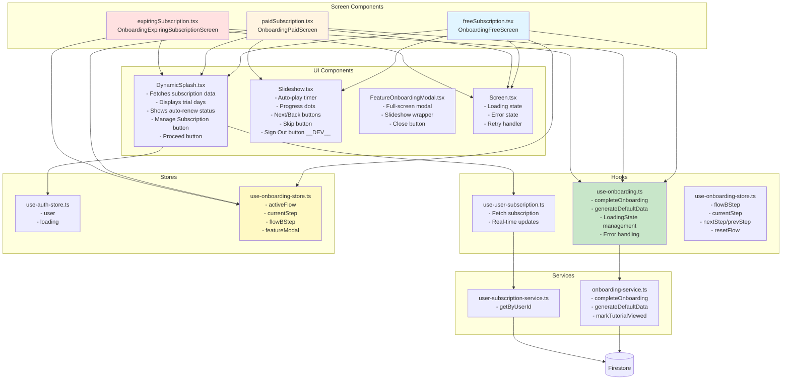
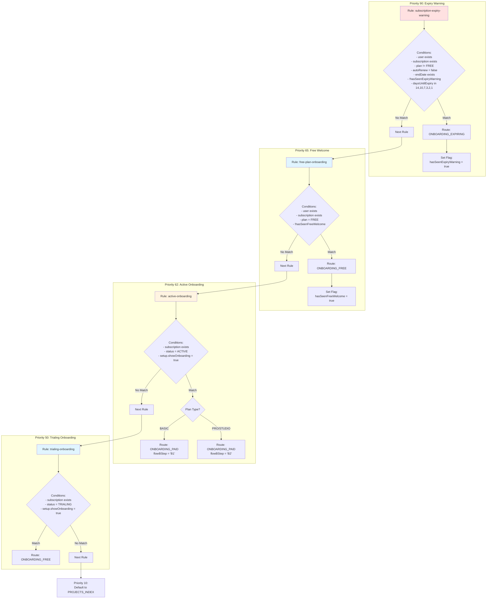
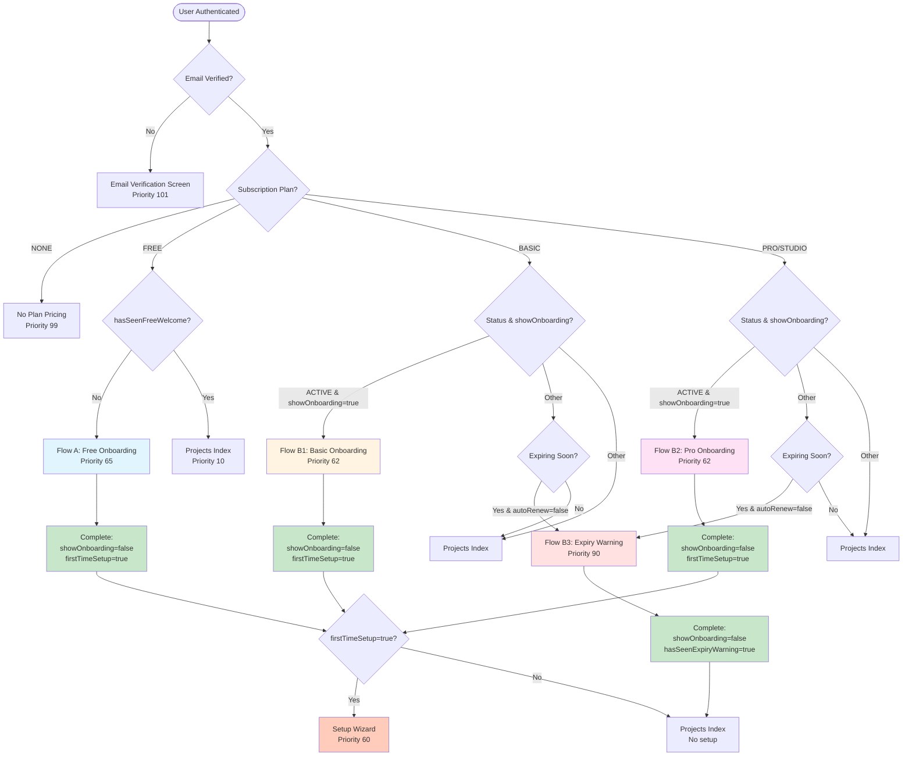

# Onboarding Module - Complete Flow Diagrams

This document provides comprehensive Mermaid diagrams detailing all onboarding flows, screens, components, states, triggers, and navigation paths.

## Table of Contents

1. [Overview - All Flows Combined](#overview---all-flows-combined)
2. [Flow A - Free User Onboarding](#flow-a---free-user-onboarding)
3. [Flow B1 - Basic Plan Onboarding](#flow-b1---basic-plan-onboarding)
4. [Flow B2 - Pro/Studio Plan Onboarding](#flow-b2---prostudio-plan-onboarding)
5. [Flow B3 - Expiring Subscription Warning](#flow-b3---expiring-subscription-warning)
6. [Navigation Flow - Before & After](#navigation-flow---before--after)
7. [Component Architecture](#component-architecture)
8. [State Management Flow](#state-management-flow)
9. [Trigger Conditions Reference](#trigger-conditions-reference)

---

## Overview - All Flows Combined



---

## Flow A - Free User Onboarding



### Flow A - State Variables

| Variable                          | Location                     | Type             | Values               | Description                     |
| --------------------------------- | ---------------------------- | ---------------- | -------------------- | ------------------------------- |
| `flowStep`                        | Local (freeSubscription.tsx) | number           | 0, 1                 | 0 = A1 Splash, 1 = A2 Slideshow |
| `slideStep`                       | Local (freeSubscription.tsx) | number           | 0-3                  | Current slide index in A2       |
| `loading`                         | Hook (useOnboarding)         | boolean          | true/false           | Loading state from hook         |
| `error`                           | Hook (useOnboarding)         | AppError \| null | Error object or null | Error state from hook           |
| `subscription.plan`               | Firestore                    | SubscriptionPlan | FREE                 | Determines flow entry           |
| `sessionFlags.hasSeenFreeWelcome` | Session                      | boolean          | true/false           | Prevents repeat in same session |
| `setup.showOnboarding`            | Firestore                    | boolean          | true/false           | Must be true to enter flow      |
| `setup.firstTimeSetup`            | Firestore                    | boolean          | true/false           | Set to true on completion       |

---

## Flow B1 - Basic Plan Onboarding



### Flow B1 - State Variables

| Variable               | Location                   | Type                         | Values     | Description                |
| ---------------------- | -------------------------- | ---------------------------- | ---------- | -------------------------- |
| `flowBStep`            | Store (useOnboardingStore) | 'B1' \| 'B2' \| 'B3' \| null | 'B1'       | Determines which paid flow |
| `currentStep`          | Store (useOnboardingStore) | number                       | 0-4        | Current slide index        |
| `subscription.plan`    | Firestore                  | SubscriptionPlan             | BASIC      | Determines flow B1         |
| `subscription.status`  | Firestore                  | SubscriptionStatus           | ACTIVE     | Must be ACTIVE             |
| `setup.showOnboarding` | Firestore                  | boolean                      | true/false | Must be true to enter flow |
| `setup.firstTimeSetup` | Firestore                  | boolean                      | true/false | Set to true on completion  |

---

## Flow B2 - Pro/Studio Plan Onboarding



### Flow B2 - State Variables

| Variable               | Location                   | Type                         | Values      | Description                |
| ---------------------- | -------------------------- | ---------------------------- | ----------- | -------------------------- |
| `flowBStep`            | Store (useOnboardingStore) | 'B1' \| 'B2' \| 'B3' \| null | 'B2'        | Determines which paid flow |
| `currentStep`          | Store (useOnboardingStore) | number                       | 0-4         | Current slide index        |
| `subscription.plan`    | Firestore                  | SubscriptionPlan             | PRO, STUDIO | Determines flow B2         |
| `subscription.status`  | Firestore                  | SubscriptionStatus           | ACTIVE      | Must be ACTIVE             |
| `setup.showOnboarding` | Firestore                  | boolean                      | true/false  | Must be true to enter flow |
| `setup.firstTimeSetup` | Firestore                  | boolean                      | true/false  | Set to true on completion  |

---

## Flow B3 - Expiring Subscription Warning



### Flow B3 - State Variables

| Variable                            | Location   | Type               | Values             | Description               |
| ----------------------------------- | ---------- | ------------------ | ------------------ | ------------------------- |
| `subscription.plan`                 | Firestore  | SubscriptionPlan   | BASIC, PRO, STUDIO | Must not be FREE          |
| `subscription.status`               | Firestore  | SubscriptionStatus | ACTIVE, TRIALING   | Active subscription       |
| `subscription.autoRenew`            | Firestore  | boolean            | false              | Must be false             |
| `subscription.endDate`              | Firestore  | Date               | Date object        | Required for expiry check |
| `subscription.trialEndsAt`          | Firestore  | Date \| null       | Date or null       | Displayed if exists       |
| `sessionFlags.hasSeenExpiryWarning` | Session    | boolean            | true/false         | Set to true on match      |
| `daysUntilExpiry`                   | Calculated | number             | 14,10,7,3,2,1      | Must match warning days   |

---

## Navigation Flow - Before & After



---

## Component Architecture



---

## State Management Flow

```mermaid
graph TB
    subgraph "Firestore State"
        UserDoc[(User Document<br/>users/{userId})]
        SetupDoc[(UserSetup Document<br/>users/{userId}/setup/{setupId})]
        SubDoc[(UserSubscription Document<br/>users/{userId}/subscription/{subId})]
    end

    subgraph "Zustand Stores"
        AuthStore[use-auth-store<br/>- user: BaseUser<br/>- loading: boolean]
        OnboardingStore[use-onboarding-store<br/>- activeFlow: A or B or null<br/>- currentStep: number<br/>- flowBStep: B1 or B2 or B3 or null<br/>- featureModal: object]
    end

    subgraph "Local Component State"
        FreeLocal[freeSubscription.tsx<br/>- flowStep: 0 or 1<br/>- slideStep: 0-3]
        PaidLocal[paidSubscription.tsx<br/>- Uses store state only]
        ExpiringLocal[expiringSubscription.tsx<br/>- No local state]
    end

    subgraph "Hook State"
        OnboardingHook[use-onboarding<br/>- LoadingState: idle or loading or success or error<br/>- error: AppError or null]
        SubscriptionHook[use-user-subscription<br/>- LoadingState: idle or loading or success or error<br/>- subscription: UserSubscription or null]
    end

    UserDoc --> AuthStore
    SetupDoc --> AuthStore
    SubDoc --> SubscriptionHook

    AuthStore --> FreeLocal
    AuthStore --> PaidLocal
    AuthStore --> ExpiringLocal

    OnboardingStore --> PaidLocal
    OnboardingStore --> ExpiringLocal

    SubscriptionHook --> DynamicSplash
    OnboardingHook --> FreeLocal
    OnboardingHook --> PaidLocal
    OnboardingHook --> ExpiringLocal

    FreeLocal -->|completeOnboarding| OnboardingHook
    PaidLocal -->|completeOnboarding| OnboardingHook
    ExpiringLocal -->|completeOnboarding| OnboardingHook

    OnboardingHook -->|Updates| SetupDoc

    style UserDoc fill:#fff9c4
    style SetupDoc fill:#fff9c4
    style SubDoc fill:#fff9c4
    style OnboardingStore fill:#e1bee7
    style OnboardingHook fill:#c8e6c9
```

---

## Trigger Conditions Reference

### Navigation Guard Rules



### Subscription Plan Values

| Plan   | Value      | Trial Days | Onboarding Flow      |
| ------ | ---------- | ---------- | -------------------- |
| NONE   | `'NONE'`   | 0          | No onboarding        |
| FREE   | `'FREE'`   | 5          | Flow A (Free)        |
| BASIC  | `'BASIC'`  | 14         | Flow B1 (Basic)      |
| PRO    | `'PRO'`    | 14         | Flow B2 (Pro/Studio) |
| STUDIO | `'STUDIO'` | 28         | Flow B2 (Pro/Studio) |

### Subscription Status Values

| Status    | Value         | Onboarding Eligibility                      |
| --------- | ------------- | ------------------------------------------- |
| NONE      | `'NONE'`      | No onboarding                               |
| INACTIVE  | `'INACTIVE'`  | No onboarding (routed to payment)           |
| ACTIVE    | `'ACTIVE'`    | Flow B1/B2 if showOnboarding=true           |
| PAST_DUE  | `'PAST_DUE'`  | No onboarding (routed to payment)           |
| EXPIRED   | `'EXPIRED'`   | No onboarding                               |
| CANCELLED | `'CANCELLED'` | No onboarding (routed to subscription gate) |

**Note:** Trial users have `status=ACTIVE` with `isTrial=true`. They see Flow A (Free) onboarding if `showOnboarding=true`. FREE trial users with verified emails and `firstTimeSetup=true` will have their lists auto-populated from master data.

### UserSetup Flags

| Flag                       | Type         | Default | Description                                      |
| -------------------------- | ------------ | ------- | ------------------------------------------------ |
| `showOnboarding`           | boolean      | true    | Must be true to enter any onboarding flow        |
| `firstTimeSetup`           | boolean      | true    | Set to true on completion, triggers setup wizard |
| `onboardingCompletedDate`  | Date \| null | null    | Timestamp when onboarding completed              |
| `viewedTutorials`          | string[]     | []      | Array of tutorial IDs viewed (for Option C)      |
| `skippedEmailVerification` | boolean      | false   | Affects email verification routing               |

### Session Flags

| Flag                   | Type    | Default | Description                                     |
| ---------------------- | ------- | ------- | ----------------------------------------------- |
| `hasSeenFreeWelcome`   | boolean | false   | Prevents repeat free onboarding in same session |
| `hasSeenExpiryWarning` | boolean | false   | Prevents repeat expiry warning in same session  |

---

## Component Button Actions

### DynamicSplash Component

| Button                  | Action                                   | Destination/Effect                              |
| ----------------------- | ---------------------------------------- | ----------------------------------------------- |
| **Manage Subscription** | `router.push('/(account)/subscription')` | Navigate to subscription management screen      |
| **Proceed**             | `onProceed()` callback                   | Calls parent's proceed handler (varies by flow) |

### Slideshow Component

| Button                      | Action                     | Destination/Effect                                   |
| --------------------------- | -------------------------- | ---------------------------------------------------- |
| **Skip** (Top Right)        | `onSkip()` callback        | Calls parent's skip handler (usually same as finish) |
| **Back**                    | `onBack()` callback        | Decrements step (disabled on first slide)            |
| **Next** / **Proceed**      | `onNext()` or `onFinish()` | Advances step or completes onboarding                |
| **Sign Out** (**DEV** only) | `auth.signOut()`           | Signs out user (testing only)                        |

### Screen Component Wrapper

| Element               | Action               | Destination/Effect                         |
| --------------------- | -------------------- | ------------------------------------------ |
| **Loading Indicator** | Auto-displayed       | Shows when `loading=true`                  |
| **Error Message**     | Auto-displayed       | Shows when `error!=null`                   |
| **Retry Button**      | `onRetry()` callback | Calls `clearError()` and retries operation |

---

## Complete Flow Decision Tree



---

## Summary

This document provides comprehensive diagrams showing:

1. **All onboarding flows** (A, B1, B2, B3) with detailed state management
2. **Navigation triggers** based on subscription plan, status, and user setup flags
3. **Component architecture** showing relationships between screens, components, hooks, and services
4. **State flow** from Firestore through stores to components
5. **Button actions** and their effects
6. **Complete decision tree** for routing users to appropriate onboarding flows

All flows follow the same pattern:

- **Entry**: Navigation guard evaluates conditions
- **Execution**: Screen renders appropriate components based on state
- **Completion**: Hook calls service to update Firestore
- **Exit**: Navigation guard re-evaluates and routes to next screen (setup or projects)
