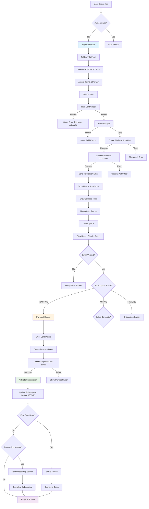
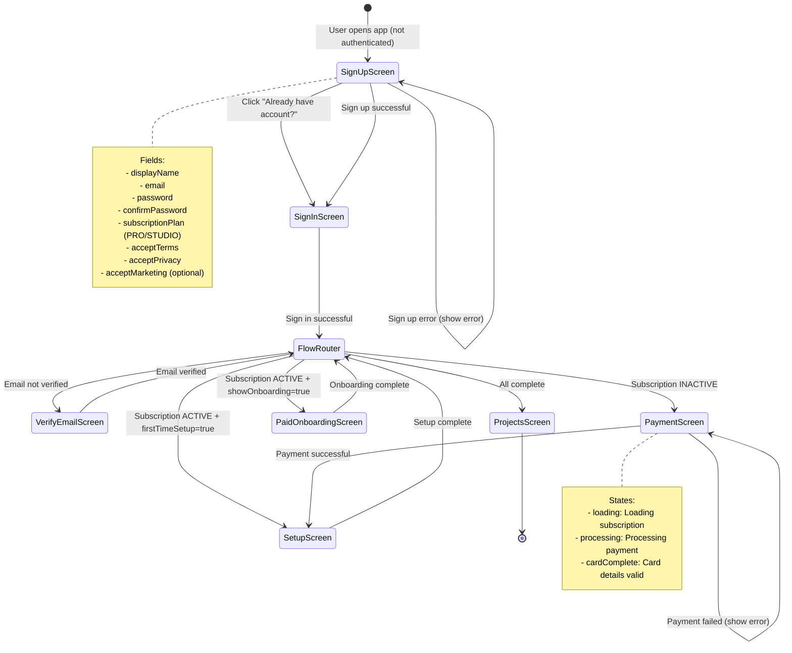
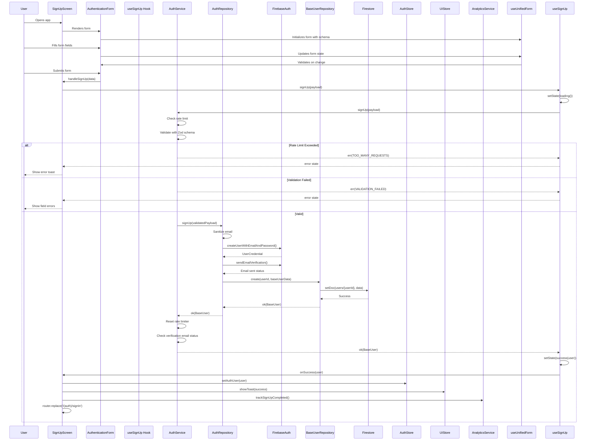
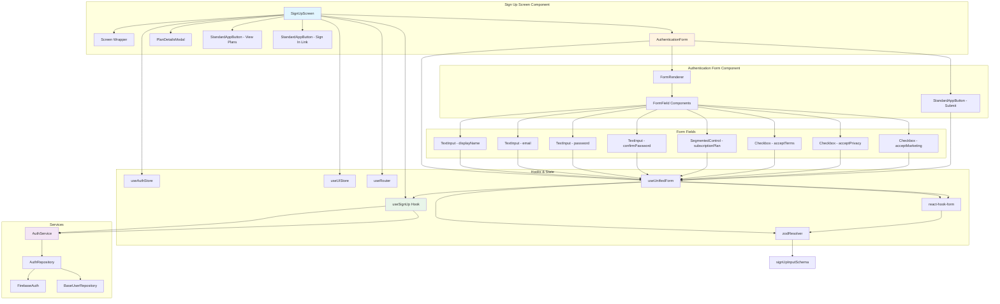
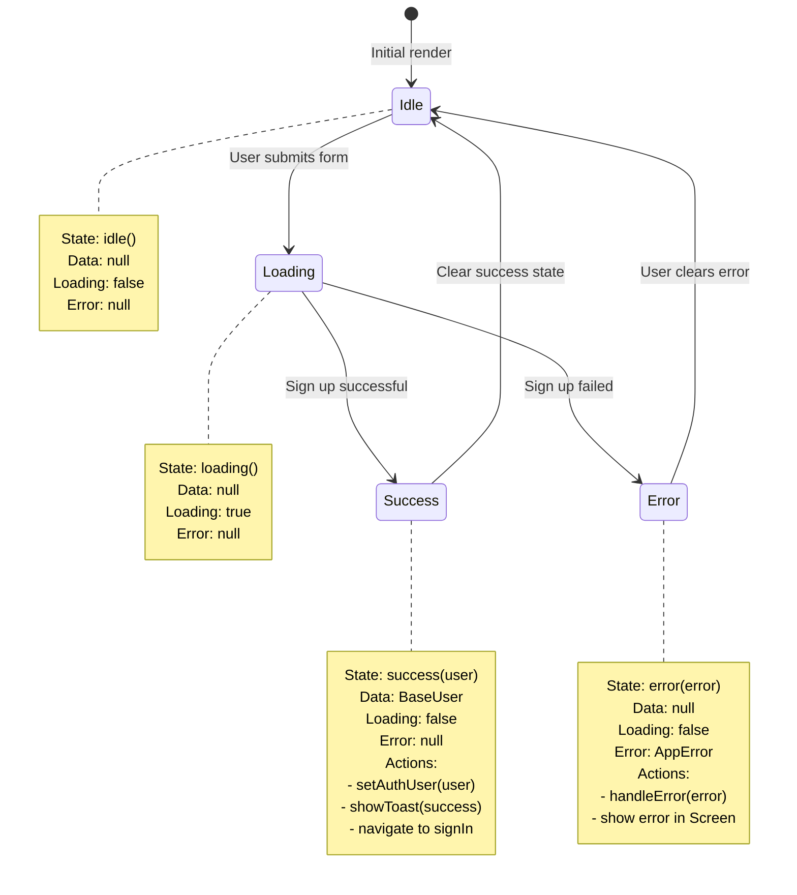
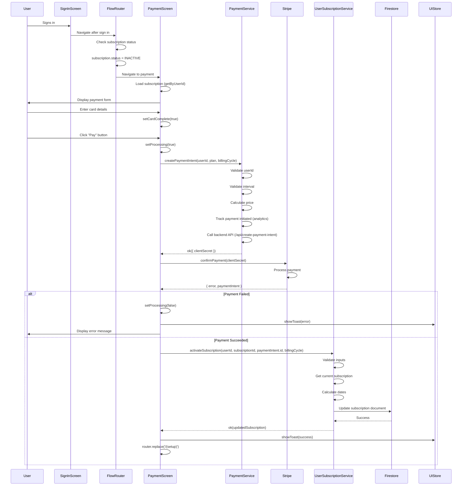
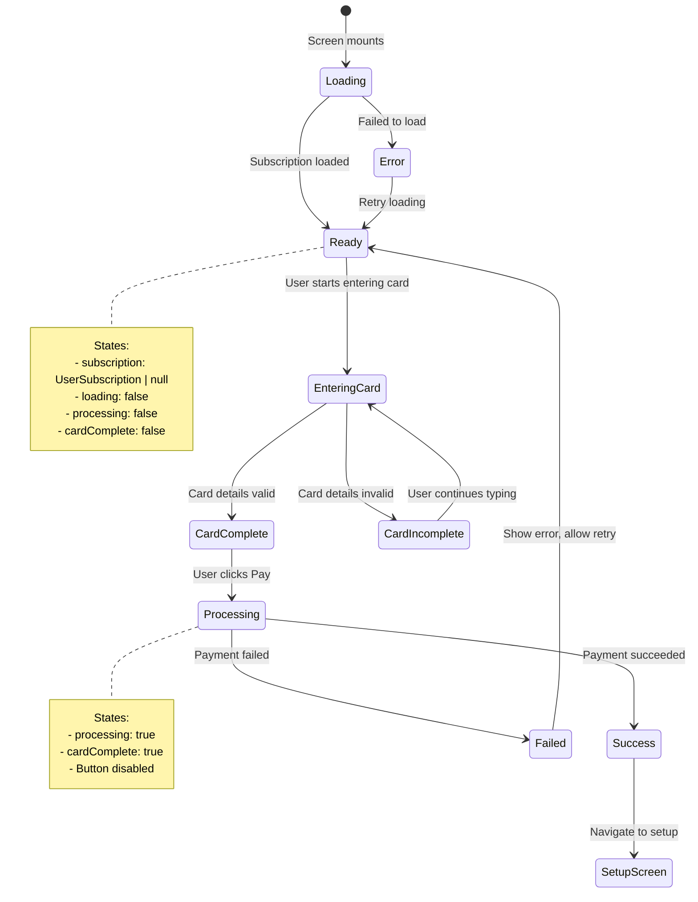
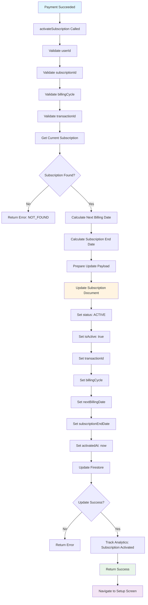
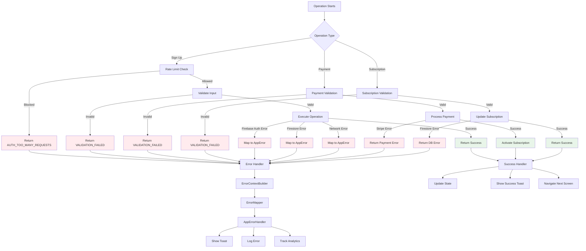
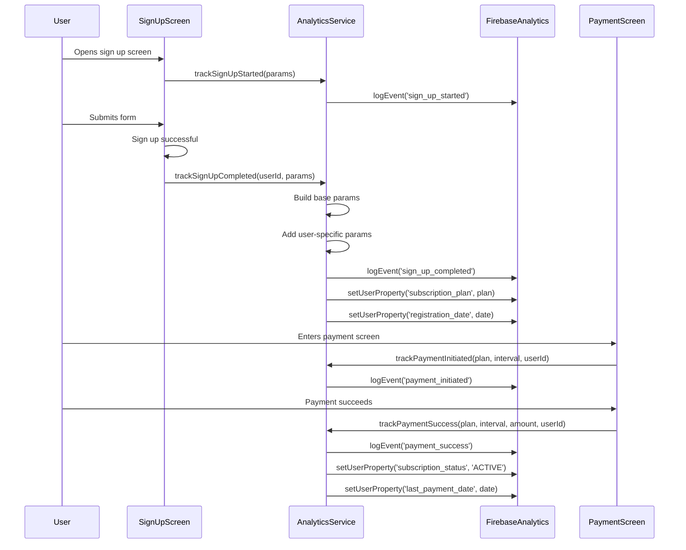

# Paid Account Sign-Up Flow Documentation

## Overview

This document maps out the complete process of a new user signing up for a **paid account** (PRO or STUDIO plan) in the Eye-Doo application. It covers all screens, interactions, data flow, state management, navigation, and triggers involved in the sign-up process.

---

## Table of Contents

1. [High-Level Flow](#high-level-flow)
2. [Screen Navigation Flow](#screen-navigation-flow)
3. [Data Flow Architecture](#data-flow-architecture)
4. [Component Interaction Flow](#component-interaction-flow)
5. [State Management Flow](#state-management-flow)
6. [Payment Processing Flow](#payment-processing-flow)
7. [Subscription Activation Flow](#subscription-activation-flow)
8. [Error Handling Flow](#error-handling-flow)
9. [Analytics Tracking Flow](#analytics-tracking-flow)
10. [Detailed Component Breakdown](#detailed-component-breakdown)

---

## High-Level Flow



---

## Screen Navigation Flow



---

## Data Flow Architecture



---

## Component Interaction Flow



---

## State Management Flow



### State Properties

#### useSignUp Hook State

```typescript
interface UseSignUpResult {
  loading: boolean; // true when signUp is in progress
  error: AppError | null; // error object if signUp failed
  state: LoadingState<BaseUser | null>; // full state object
  signUp: (payload: SignUpInput) => Promise<boolean>;
  clearError: () => void; // clears error state
}
```

#### SignUpScreen Component State

```typescript
// Local state
const [showPlanModal, setShowPlanModal] = useState(false);
const formRef = useRef<ReturnType<typeof useUnifiedForm<SignUpInput>> | null>(null);

// From hooks
const { loading, error, clearError, signUp } = useSignUp({...});
const setAuthUser = useAuthStore(state => state.setUser);
const showToast = useUIStore(state => state.showToast);
```

#### Form State (react-hook-form)

```typescript
interface FormState {
  values: SignUpInput;
  errors: FieldErrors<SignUpInput>;
  touchedFields: Partial<Record<keyof SignUpInput, boolean>>;
  isValid: boolean;
  isDirty: boolean;
  isSubmitting: boolean;
}
```

---

## Payment Processing Flow



### Payment Screen States



---

## Subscription Activation Flow



### Subscription Update Payload

```typescript
interface SubscriptionUpdate {
  status: SubscriptionStatus.ACTIVE;
  isActive: true;
  transactionId: string; // Payment intent ID from Stripe
  billingCycle: PaymentInterval; // MONTHLY or ANNUALLY
  nextBillingDate: Date; // Calculated based on billingCycle
  subscriptionEndDate: Date; // Calculated based on billingCycle
  activatedAt: Date; // Current timestamp
  updatedAt: Date; // Current timestamp
}
```

---

## Error Handling Flow



### Error Types & Handling

| Error Type             | Code                        | User Message                                     | Action                          |
| ---------------------- | --------------------------- | ------------------------------------------------ | ------------------------------- |
| Rate Limit Exceeded    | `AUTH_TOO_MANY_REQUESTS`    | "Too many attempts. Try again in X minutes."     | Block further attempts          |
| Validation Failed      | `VALIDATION_FAILED`         | Field-specific error messages                    | Show field errors               |
| Email Already Exists   | `AUTH_EMAIL_ALREADY_IN_USE` | "This email is already registered."              | Suggest sign in                 |
| Weak Password          | `AUTH_WEAK_PASSWORD`        | "Password is too weak."                          | Show password requirements      |
| Network Error          | `NETWORK_ERROR`             | "Connection failed. Please check your internet." | Allow retry                     |
| Payment Failed         | `PAYMENT_FAILED`            | Error message from Stripe                        | Allow retry with different card |
| Subscription Not Found | `DB_NOT_FOUND`              | "Subscription not found."                        | Navigate to pricing             |

---

## Analytics Tracking Flow



### Analytics Events Tracked

| Event                    | When                        | Parameters                                                |
| ------------------------ | --------------------------- | --------------------------------------------------------- |
| `sign_up_started`        | User opens sign up screen   | `session_id`, `platform`, `app_version`                   |
| `sign_up_completed`      | Sign up successful          | `user_id`, `method`, `user_type`, `subscription_plan`     |
| `payment_initiated`      | User clicks Pay button      | `user_id`, `plan`, `interval`, `amount`                   |
| `payment_success`        | Payment confirmed           | `user_id`, `plan`, `interval`, `amount`, `transaction_id` |
| `payment_failed`         | Payment fails               | `user_id`, `plan`, `interval`, `error_message`            |
| `subscription_activated` | Subscription status updated | `user_id`, `plan`, `status`, `billing_cycle`              |

---

## Detailed Component Breakdown

### 1. SignUpScreen Component

**File**: `src/app/(auth)/signUp.tsx`

**Props**: None (Screen component)

**State**:

```typescript
const [showPlanModal, setShowPlanModal] = useState(false);
const formRef = useRef<ReturnType<typeof useUnifiedForm<SignUpInput>> | null>(null);
```

**Hooks Used**:

- `useSignUp()` - Sign up operation
- `useAuthStore()` - Global auth state
- `useUIStore()` - Toast notifications
- `useRouter()` - Navigation
- `useAppStyles()` - Styling

**Key Functions**:

```typescript
handleSignUp(data: SignUpInput): Promise<boolean>
  - Calls signUp hook
  - Returns success/failure

handleFormReady(form): void
  - Stores form reference
  - Allows external form control

handlePlanSelect(plan: SubscriptionPlan): void
  - Updates form value for subscriptionPlan
  - Triggers validation
```

**Navigation**:

- Success: `router.replace('/(auth)/signIn')`
- Error: Stays on screen, shows error
- Link: `router.replace('/(auth)/signIn')` (already have account)

---

### 2. AuthenticationForm Component

**File**: `src/components/auth/AuthenticationForm.tsx`

**Props**:

```typescript
interface AuthenticationFormProps {
  mode: 'signUp' | 'signIn' | 'reset-password' | ...;
  onSubmit: (data: SignUpInput) => Promise<boolean>;
  loading?: boolean;
  onFormReady?: (form) => void;
}
```

**Internal State**:

- Managed by `useUnifiedForm` hook
- React Hook Form state
- Zod validation state

**Key Features**:

- Dynamic form rendering based on mode
- Real-time validation
- Field-level error display
- Submit button disabled when invalid/loading

---

### 3. useSignUp Hook

**File**: `src/hooks/use-sign-up.ts`

**Options**:

```typescript
interface UseSignUpOptions {
  onSuccess?: (user: BaseUser) => void;
  onError?: (error: AppError) => void;
}
```

**Returns**:

```typescript
interface UseSignUpResult {
  loading: boolean;
  error: AppError | null;
  state: LoadingState<BaseUser | null>;
  signUp: (payload: SignUpInput) => Promise<boolean>;
  clearError: () => void;
}
```

**Flow**:

1. `signUp()` called with payload
2. Set state to `loading()`
3. Call `AuthService.signUp()`
4. On success: `setState(success(user))`, call `onSuccess`
5. On error: `setState(error(error))`, call `onError`, handle error

---

### 4. AuthService

**File**: `src/services/auth-service.ts`

**Method**: `signUp(payload: SignUpInput): Promise<Result<BaseUser, AppError>>`

**Steps**:

1. **Rate Limiting**: Check `signUpRateLimiter.canAttempt()`
2. **Validation**: Validate with `signUpInputSchema`
3. **Repository Call**: Delegate to `authRepository.signUp()`
4. **Post-Processing**:
   - Reset rate limiter on success
   - Check verification email status
   - Show warning toast if email failed

---

### 5. AuthRepository

**File**: `src/repositories/firestore/firestore-auth-repository.ts`

**Method**: `signUp(payload: SignUpInput): Promise<Result<BaseUser, AppError>>`

**Steps**:

1. **Sanitize**: Sanitize email with `sanitizeEmail()`
2. **Create Auth User**: `createUserWithEmailAndPassword()`
3. **Send Verification**: `sendEmailVerification()` (non-blocking)
4. **Create Base User**: Call `baseUserRepository.create()`
5. **Return**: Return `BaseUser` or error

**Error Handling**:

- If base user creation fails, auth user cleanup handled by Cloud Function
- Verification email failure doesn't fail sign up

---

### 6. PaymentScreen Component

**File**: `src/app/(payment)/index.tsx`

**State**:

```typescript
const [subscription, setSubscription] = useState<UserSubscription | null>(null);
const [loading, setLoading] = useState(true);
const [processing, setProcessing] = useState(false);
const [cardComplete, setCardComplete] = useState(false);
```

**Flow**:

1. **Load Subscription**: `userSubscription.getByUserId(userId)`
2. **Display Form**: Show plan details and card input
3. **Card Input**: Stripe `CardField` component
4. **Payment**:
   - Create payment intent
   - Confirm with Stripe
   - Activate subscription on success
   - Navigate to setup

**Navigation**:

- Success: `router.replace('/(setup)')`
- Update Mode: `router.back()`

---

### 7. PaymentService

**File**: `src/services/payment-service.ts`

**Method**: `createPaymentIntent(userId, plan, interval, promoCode?): Promise<Result<{clientSecret}, AppError>>`

**Steps**:

1. Validate userId
2. Validate interval
3. Validate promo code (if provided)
4. Calculate price with discount
5. Track analytics: `trackPaymentInitiated()`
6. Call backend API: `/api/create-payment-intent`
7. Return client secret

---

### 8. UserSubscriptionService

**File**: `src/services/user-subscription-service.ts`

**Method**: `activateSubscription(userId, subscriptionId, transactionId, billingCycle): Promise<Result<UserSubscription, AppError>>`

**Steps**:

1. Validate all inputs
2. Get current subscription
3. Calculate `nextBillingDate`
4. Calculate `subscriptionEndDate`
5. Update subscription document:
   - `status: ACTIVE`
   - `isActive: true`
   - `transactionId`
   - `billingCycle`
   - `nextBillingDate`
   - `subscriptionEndDate`
   - `activatedAt`
6. Track analytics
7. Return updated subscription

---

## Data Structures

### SignUpInput

```typescript
interface SignUpInput {
  displayName: string; // Min 1, max 100 chars
  email: string; // Valid email format
  password: string; // Min 8 chars, letters + numbers
  confirmPassword: string; // Must match password
  subscriptionPlan: SubscriptionPlan; // PRO | STUDIO
  acceptTerms: boolean; // Must be true
  acceptPrivacy: boolean; // Must be true
  acceptMarketing?: boolean; // Optional
}
```

### BaseUser (Created)

```typescript
interface BaseUser {
  id: string; // Firebase Auth UID
  email: string; // Sanitized email
  displayName: string; // From input
  phone: null; // Set to null
  selectedSubscriptionPlan: SubscriptionPlan; // PRO or STUDIO
  role: UserRole.USER;
  isEmailVerified: false; // Set to false initially
  isActive: true;
  isBanned: false;
  hasCustomizations: false;
  lastLoginAt: null;
  deletedAt: null;
  createdAt: Date; // Server timestamp
  updatedAt: null;
}
```

### UserSubscription (After Payment)

```typescript
interface UserSubscription {
  id: string;
  userId: string;
  plan: SubscriptionPlan; // PRO or STUDIO
  status: SubscriptionStatus.ACTIVE;
  isActive: true;
  billingCycle: PaymentInterval; // MONTHLY or ANNUALLY
  transactionId: string; // Stripe payment intent ID
  nextBillingDate: Date; // Calculated
  subscriptionEndDate: Date; // Calculated
  activatedAt: Date; // Current timestamp
  // ... other fields
}
```

---

## Navigation Path Summary

```
1. App Start (not authenticated)
   → /(auth)/signUp

2. Sign Up Success
   → /(auth)/signIn

3. Sign In Success
   → /(flow-router)

4. Flow Router Logic:
   - Email not verified → /(auth)/verify-email
   - Subscription INACTIVE → /(payment)
   - Subscription ACTIVE + firstTimeSetup → /(setup)
   - Subscription ACTIVE + showOnboarding → /(onboarding)/paid
   - All complete → /(projects)

5. Payment Success
   → /(setup)

6. Setup Complete
   → /(flow-router) → /(projects) (or onboarding if needed)

7. Paid Onboarding Complete
   → /(flow-router) → /(projects)
```

---

## Key Differences: Paid vs Free Sign-Up

| Aspect                  | Free Sign-Up       | Paid Sign-Up                    |
| ----------------------- | ------------------ | ------------------------------- |
| **Plan Selection**      | FREE               | PRO or STUDIO                   |
| **After Sign Up**       | Direct to sign in  | Direct to sign in (same)        |
| **After Sign In**       | Skip to projects   | Payment required                |
| **Payment Flow**        | Not required       | Required (Stripe)               |
| **Subscription Status** | ACTIVE immediately | INACTIVE → ACTIVE after payment |
| **Onboarding**          | Skipped            | Short paid onboarding           |
| **Setup**               | Skipped            | Required after payment          |
| **Trial Period**        | No trial           | No trial (immediate payment)    |

---

## Summary

The paid sign-up flow involves:

1. **Sign Up**: User fills form, selects PRO/STUDIO plan, submits
2. **Account Creation**: Firebase Auth user + Base User document created
3. **Sign In**: User signs in with new credentials
4. **Payment**: User enters card details, payment processed via Stripe
5. **Subscription Activation**: Subscription status updated to ACTIVE
6. **Setup**: User completes first-time setup
7. **Onboarding**: Short paid onboarding (optional)
8. **Projects**: User reaches main app

The entire flow is tracked with analytics, handles errors gracefully, and follows the Result pattern for all async operations.
