# Eye-Doo Application: Phase 2 Architecture & Data Flow Report

**Version:** 2.1.0  
**Date:** December 2024  
**Status:** Phase 2 - Foundation Complete

---

## Table of Contents

1. [Executive Summary](#executive-summary)
2. [System Architecture Overview](#system-architecture-overview)
3. [Core Patterns & Principles](#core-patterns--principles)
4. [Module Architecture](#module-architecture)
   - [Authentication Module](#authentication-module)
   - [User Management Module](#user-management-module)
   - [Project Management Module](#project-management-module)
   - [List Management Module](#list-management-module)
   - [Timeline Module](#timeline-module)
   - [Supporting Modules](#supporting-modules)
5. [Data Flow Diagrams](#data-flow-diagrams)
6. [Sequence Diagrams](#sequence-diagrams)
7. [Class Diagrams](#class-diagrams)
8. [Error Handling Architecture](#error-handling-architecture)
9. [State Management](#state-management)

---

## Executive Summary

The Eye-Doo application is a React Native (Expo) event management application built with a **Ports & Adapters (Hexagonal) Architecture**. The system follows strict architectural patterns ensuring separation of concerns, type safety, and maintainability.

### Key Architectural Decisions

- **Ports & Adapters**: All data access through repository interfaces (ports), with Firestore implementations (adapters)
- **Result Pattern**: All async operations return `Result<T, AppError>` - no exceptions thrown
- **Service Layer**: Business logic orchestration and validation
- **Unidirectional Data Flow**: Component → Hook → Service → Repository → Firestore
- **Type Safety**: TypeScript + Zod schemas for runtime validation
- **Error Handling**: Centralized error mapping and context tracking

### Module Breakdown

- **Authentication**: Sign-up, sign-in, password management, email verification
- **User Management**: Profile, preferences, subscription, setup, customizations
- **Project Management**: Project CRUD, subcollection initialization
- **List Management**: Generic list system (Kit, Tasks, Shots, Notes, Vendors, etc.)
- **Timeline**: Event scheduling and validation
- **Supporting**: Business cards, locations, photo requests, tags, portal

---

## System Architecture Overview

### High-Level Architecture Diagram

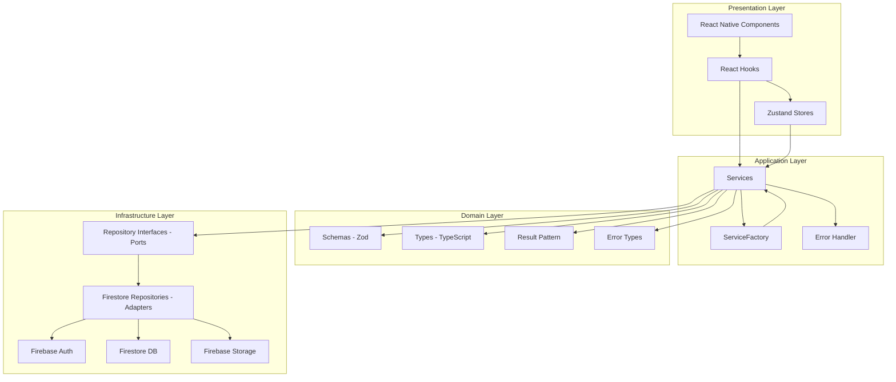
```mermaid
graph TB
    subgraph "Presentation Layer"
        A[React Native Components]
        B[React Hooks]
        C[Zustand Stores]
    end
    
    subgraph "Application Layer"
        D[Services]
        E[ServiceFactory]
        F[Error Handler]
    end
    
    subgraph "Domain Layer"
        G[Schemas - Zod]
        H[Types - TypeScript]
        I[Result Pattern]
        J[Error Types]
    end
    
    subgraph "Infrastructure Layer"
        K[Repository Interfaces - Ports]
        L[Firestore Repositories - Adapters]
        M[Firebase Auth]
        N[Firestore DB]
        O[Firebase Storage]
    end
    
    A --> B
    B --> C
    B --> D
    C --> D
    D --> E
    E --> D
    D --> F
    D --> G
    D --> H
    D --> I
    D --> J
    D --> K
    K --> L
    L --> M
    L --> N
    L --> O
```

### Ports & Adapters Architecture

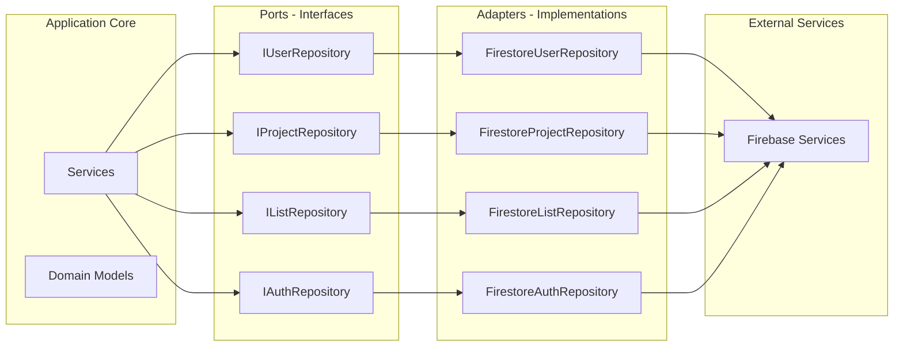
```mermaid
graph LR
    subgraph "Application Core"
        S[Services]
        D[Domain Models]
    end
    
    subgraph "Ports - Interfaces"
        IR[IUserRepository]
        IP[IProjectRepository]
        IL[IListRepository]
        IA[IAuthRepository]
    end
    
    subgraph "Adapters - Implementations"
        FR[FirestoreUserRepository]
        FP[FirestoreProjectRepository]
        FL[FirestoreListRepository]
        FA[FirestoreAuthRepository]
    end
    
    subgraph "External Services"
        FB[Firebase Services]
    end
    
    S --> IR
    S --> IP
    S --> IL
    S --> IA
    
    IR --> FR
    IP --> FP
    IL --> FL
    IA --> FA
    
    FR --> FB
    FP --> FB
    FL --> FB
    FA --> FB
```

### Data Flow Direction

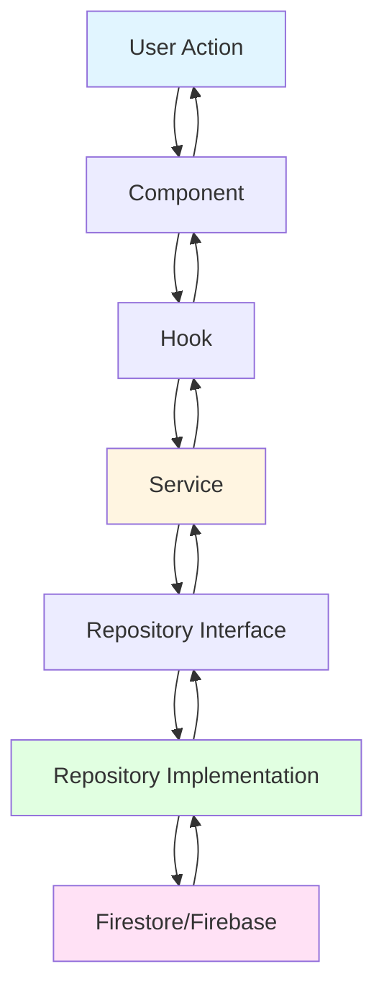
```mermaid
graph TD
    A[User Action] --> B[Component]
    B --> C[Hook]
    C --> D[Service]
    D --> E[Repository Interface]
    E --> F[Repository Implementation]
    F --> G[Firestore/Firebase]
    
    G --> F
    F --> E
    E --> D
    D --> C
    C --> B
    B --> A
    
    style A fill:#e1f5ff
    style G fill:#ffe1f5
    style D fill:#fff5e1
    style F fill:#e1ffe1
```

---

## Core Patterns & Principles

### Result Pattern Flow

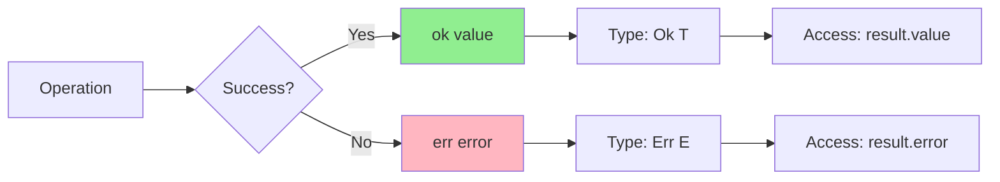
```mermaid
graph LR
    A[Operation] --> B{Success?}
    B -->|Yes| C[ok value]
    B -->|No| D[err error]
    
    C --> E[Type: Ok T]
    D --> F[Type: Err E]
    
    E --> G[Access: result.value]
    F --> H[Access: result.error]
    
    style C fill:#90EE90
    style D fill:#FFB6C1
```

### Validation & Sanitization Flow

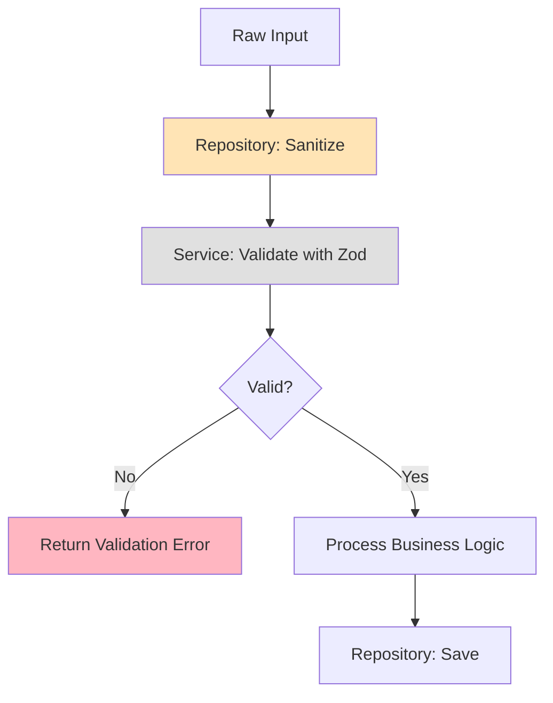
```mermaid
graph TD
    A[Raw Input] --> B[Repository: Sanitize]
    B --> C[Service: Validate with Zod]
    C --> D{Valid?}
    D -->|No| E[Return Validation Error]
    D -->|Yes| F[Process Business Logic]
    F --> G[Repository: Save]
    
    style B fill:#FFE4B5
    style C fill:#E0E0E0
    style E fill:#FFB6C1
```

### Error Handling Flow

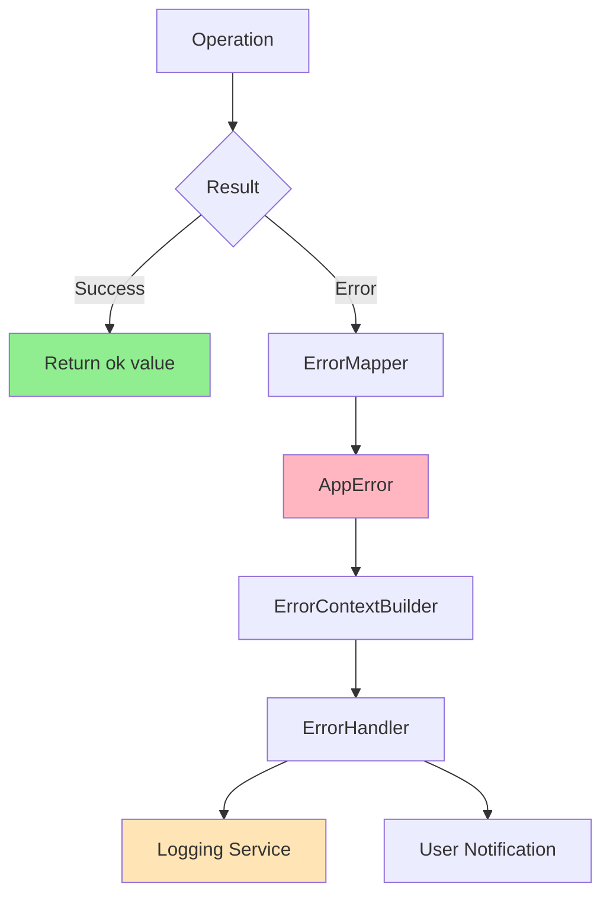
```mermaid
graph TD
    A[Operation] --> B{Result}
    B -->|Success| C[Return ok value]
    B -->|Error| D[ErrorMapper]
    D --> E[AppError]
    E --> F[ErrorContextBuilder]
    F --> G[ErrorHandler]
    G --> H[Logging Service]
    G --> I[User Notification]
    
    style C fill:#90EE90
    style E fill:#FFB6C1
    style H fill:#FFE4B5
```

---

## Module Architecture

### Authentication Module

#### Architecture Diagram

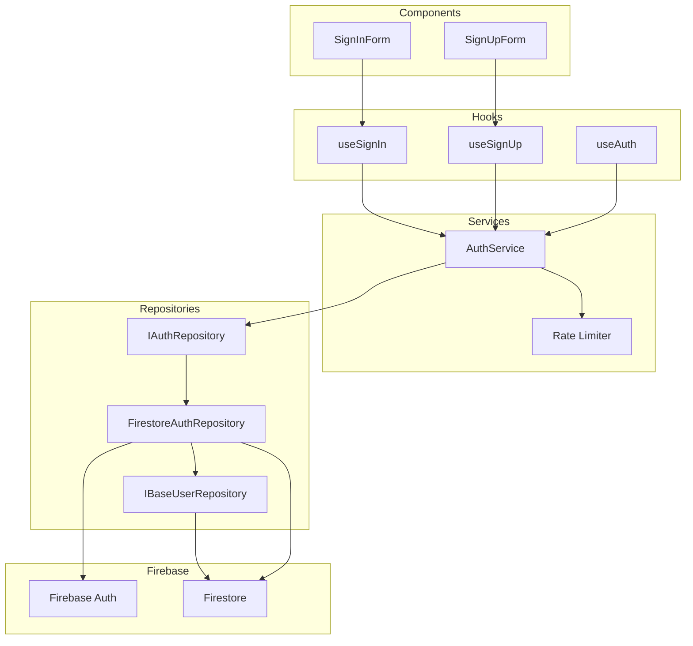
```mermaid
graph TB
    subgraph "Components"
        SF[SignInForm]
        SUF[SignUpForm]
    end
    
    subgraph "Hooks"
        UAI[useAuth]
        USI[useSignIn]
        USU[useSignUp]
    end
    
    subgraph "Services"
        AS[AuthService]
        RL[Rate Limiter]
    end
    
    subgraph "Repositories"
        IAR[IAuthRepository]
        FAR[FirestoreAuthRepository]
        IBUR[IBaseUserRepository]
    end
    
    subgraph "Firebase"
        FA[Firebase Auth]
        FS[Firestore]
    end
    
    SF --> USI
    SUF --> USU
    USI --> AS
    USU --> AS
    UAI --> AS
    
    AS --> RL
    AS --> IAR
    IAR --> FAR
    FAR --> FA
    FAR --> IBUR
    IBUR --> FS
    FAR --> FS
```

#### Authentication Data Flow

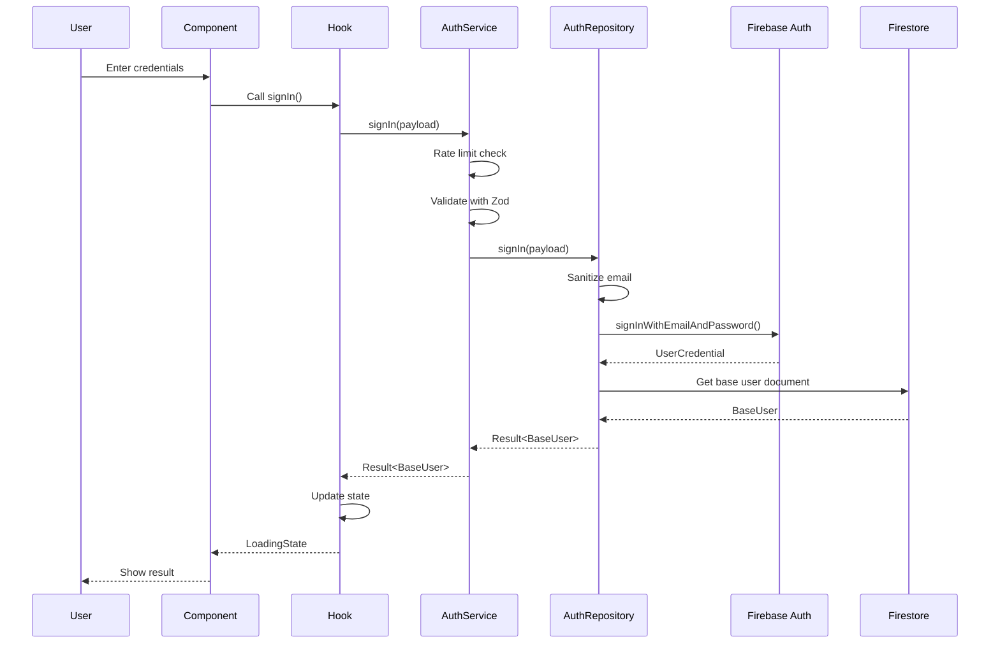
```mermaid
sequenceDiagram
    participant U as User
    participant C as Component
    participant H as Hook
    participant S as AuthService
    participant R as AuthRepository
    participant FA as Firebase Auth
    participant FS as Firestore
    
    U->>C: Enter credentials
    C->>H: Call signIn()
    H->>S: signIn(payload)
    S->>S: Rate limit check
    S->>S: Validate with Zod
    S->>R: signIn(payload)
    R->>R: Sanitize email
    R->>FA: signInWithEmailAndPassword()
    FA-->>R: UserCredential
    R->>FS: Get base user document
    FS-->>R: BaseUser
    R-->>S: Result<BaseUser>
    S-->>H: Result<BaseUser>
    H->>H: Update state
    H-->>C: LoadingState
    C-->>U: Show result
```

#### Sign-Up Sequence

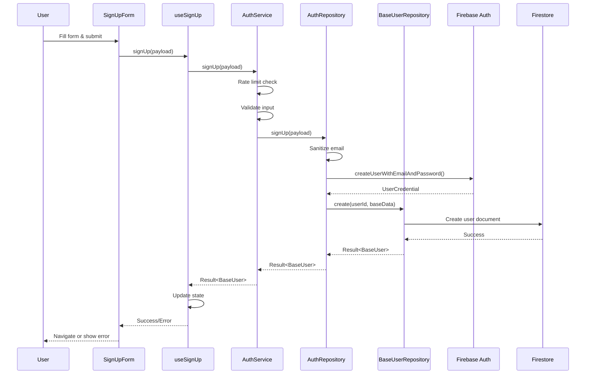
```mermaid
sequenceDiagram
    participant U as User
    participant C as SignUpForm
    participant H as useSignUp
    participant S as AuthService
    participant AR as AuthRepository
    participant BUR as BaseUserRepository
    participant FA as Firebase Auth
    participant FS as Firestore
    
    U->>C: Fill form & submit
    C->>H: signUp(payload)
    H->>S: signUp(payload)
    S->>S: Rate limit check
    S->>S: Validate input
    S->>AR: signUp(payload)
    AR->>AR: Sanitize email
    AR->>FA: createUserWithEmailAndPassword()
    FA-->>AR: UserCredential
    AR->>BUR: create(userId, baseData)
    BUR->>FS: Create user document
    FS-->>BUR: Success
    BUR-->>AR: Result<BaseUser>
    AR-->>S: Result<BaseUser>
    S-->>H: Result<BaseUser>
    H->>H: Update state
    H-->>C: Success/Error
    C-->>U: Navigate or show error
```

#### Class Structure - Authentication

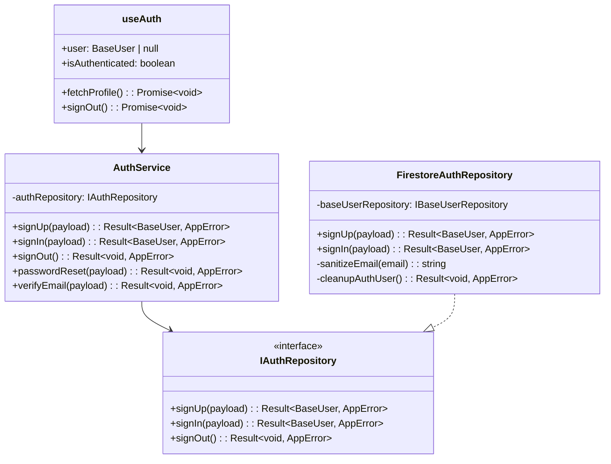
```mermaid
classDiagram
    class AuthService {
        -authRepository: IAuthRepository
        +signUp(payload): Result~BaseUser, AppError~
        +signIn(payload): Result~BaseUser, AppError~
        +signOut(): Result~void, AppError~
        +passwordReset(payload): Result~void, AppError~
        +verifyEmail(payload): Result~void, AppError~
    }
    
    class IAuthRepository {
        <<interface>>
        +signUp(payload): Result~BaseUser, AppError~
        +signIn(payload): Result~BaseUser, AppError~
        +signOut(): Result~void, AppError~
    }
    
    class FirestoreAuthRepository {
        -baseUserRepository: IBaseUserRepository
        +signUp(payload): Result~BaseUser, AppError~
        +signIn(payload): Result~BaseUser, AppError~
        -sanitizeEmail(email): string
        -cleanupAuthUser(): Result~void, AppError~
    }
    
    class useAuth {
        +user: BaseUser | null
        +isAuthenticated: boolean
        +fetchProfile(): Promise~void~
        +signOut(): Promise~void~
    }
    
    AuthService --> IAuthRepository
    FirestoreAuthRepository ..|> IAuthRepository
    useAuth --> AuthService
```

---

### User Management Module

#### Architecture Diagram

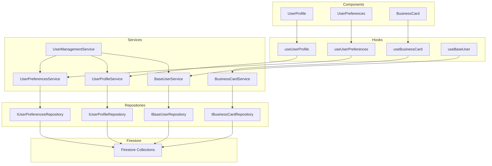
```mermaid
graph TB
    subgraph "Components"
        UP[UserProfile]
        UPR[UserPreferences]
        BC[BusinessCard]
    end
    
    subgraph "Hooks"
        UUP[useUserProfile]
        UUPR[useUserPreferences]
        UBC[useBusinessCard]
        UBU[useBaseUser]
    end
    
    subgraph "Services"
        UMS[UserManagementService]
        BUS[BaseUserService]
        UPS[UserProfileService]
        UPRS[UserPreferencesService]
        BCS[BusinessCardService]
    end
    
    subgraph "Repositories"
        IBUR[IBaseUserRepository]
        IUPR[IUserProfileRepository]
        IUPRR[IUserPreferencesRepository]
        IBCR[IBusinessCardRepository]
    end
    
    subgraph "Firestore"
        FS[Firestore Collections]
    end
    
    UP --> UUP
    UPR --> UUPR
    BC --> UBC
    
    UUP --> UPS
    UUPR --> UPRS
    UBC --> BCS
    UBU --> BUS
    
    UMS --> BUS
    UMS --> UPS
    UMS --> UPRS
    
    BUS --> IBUR
    UPS --> IUPR
    UPRS --> IUPRR
    BCS --> IBCR
    
    IBUR --> FS
    IUPR --> FS
    IUPRR --> FS
    IBCR --> FS
```

#### User Creation Flow

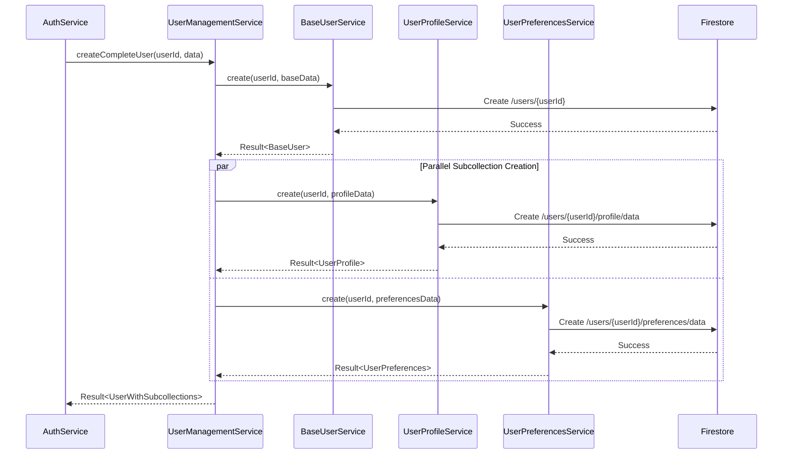
```mermaid
sequenceDiagram
    participant A as AuthService
    participant UMS as UserManagementService
    participant BUS as BaseUserService
    participant UPS as UserProfileService
    participant UPRS as UserPreferencesService
    participant FS as Firestore
    
    A->>UMS: createCompleteUser(userId, data)
    UMS->>BUS: create(userId, baseData)
    BUS->>FS: Create /users/{userId}
    FS-->>BUS: Success
    BUS-->>UMS: Result<BaseUser>
    
    par Parallel Subcollection Creation
        UMS->>UPS: create(userId, profileData)
        UPS->>FS: Create /users/{userId}/profile/data
        FS-->>UPS: Success
        UPS-->>UMS: Result<UserProfile>
    and
        UMS->>UPRS: create(userId, preferencesData)
        UPRS->>FS: Create /users/{userId}/preferences/data
        FS-->>UPRS: Success
        UPRS-->>UMS: Result<UserPreferences>
    end
    
    UMS-->>A: Result<UserWithSubcollections>
```

#### User Module Class Structure

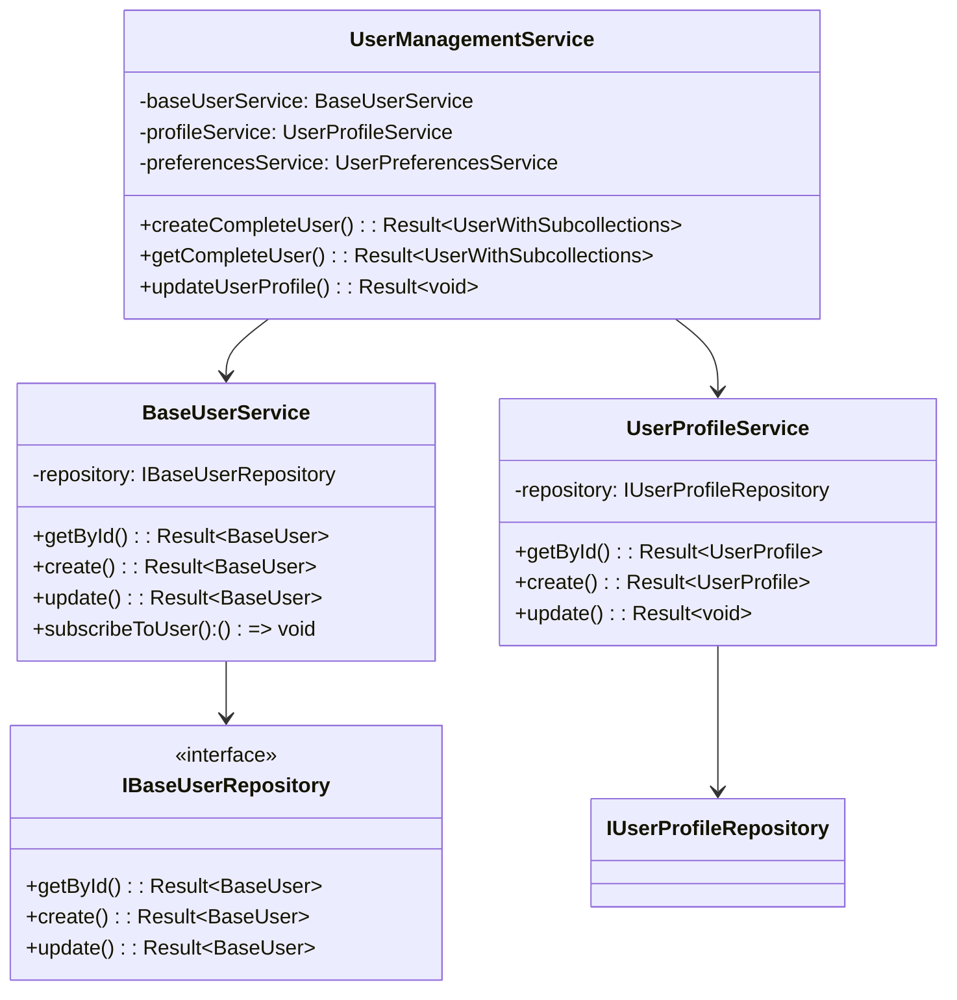
```mermaid
classDiagram
    class UserManagementService {
        -baseUserService: BaseUserService
        -profileService: UserProfileService
        -preferencesService: UserPreferencesService
        +createCompleteUser(): Result~UserWithSubcollections~
        +getCompleteUser(): Result~UserWithSubcollections~
        +updateUserProfile(): Result~void~
    }
    
    class BaseUserService {
        -repository: IBaseUserRepository
        +getById(): Result~BaseUser~
        +create(): Result~BaseUser~
        +update(): Result~BaseUser~
        +subscribeToUser(): () => void
    }
    
    class UserProfileService {
        -repository: IUserProfileRepository
        +getById(): Result~UserProfile~
        +create(): Result~UserProfile~
        +update(): Result~void~
    }
    
    class IBaseUserRepository {
        <<interface>>
        +getById(): Result~BaseUser~
        +create(): Result~BaseUser~
        +update(): Result~BaseUser~
    }
    
    UserManagementService --> BaseUserService
    UserManagementService --> UserProfileService
    BaseUserService --> IBaseUserRepository
    UserProfileService --> IUserProfileRepository
```

---

### Project Management Module

#### Architecture Diagram

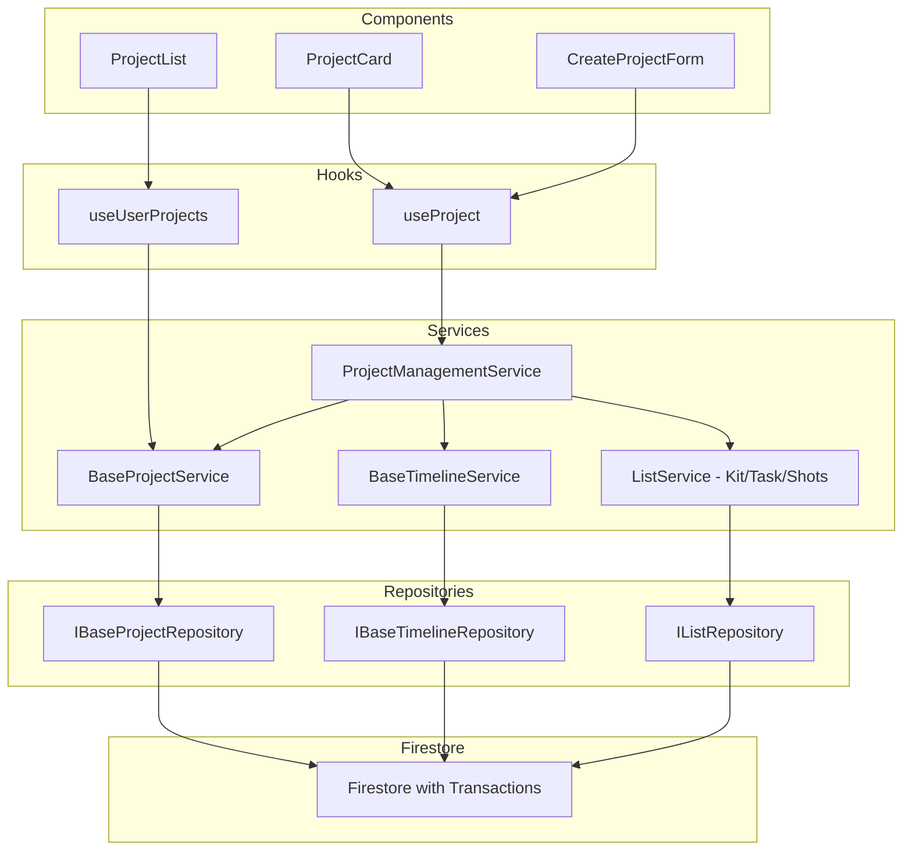
```mermaid
graph TB
    subgraph "Components"
        PL[ProjectList]
        PC[ProjectCard]
        CF[CreateProjectForm]
    end
    
    subgraph "Hooks"
        UP[useProject]
        UPL[useUserProjects]
    end
    
    subgraph "Services"
        PMS[ProjectManagementService]
        BPS[BaseProjectService]
        BTS[BaseTimelineService]
        LS[ListService - Kit/Task/Shots]
    end
    
    subgraph "Repositories"
        IBPR[IBaseProjectRepository]
        IBTR[IBaseTimelineRepository]
        ILR[IListRepository]
    end
    
    subgraph "Firestore"
        FS[Firestore with Transactions]
    end
    
    PL --> UPL
    PC --> UP
    CF --> UP
    
    UP --> PMS
    UPL --> BPS
    
    PMS --> BPS
    PMS --> BTS
    PMS --> LS
    
    BPS --> IBPR
    BTS --> IBTR
    LS --> ILR
    
    IBPR --> FS
    IBTR --> FS
    ILR --> FS
```

#### Project Creation Sequence

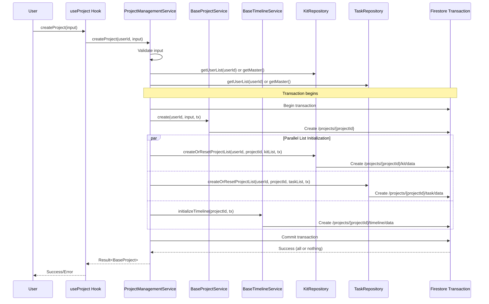
```mermaid
sequenceDiagram
    participant U as User
    participant H as useProject Hook
    participant PMS as ProjectManagementService
    participant BPS as BaseProjectService
    participant BTS as BaseTimelineService
    participant KR as KitRepository
    participant TR as TaskRepository
    participant FS as Firestore Transaction
    
    U->>H: createProject(input)
    H->>PMS: createProject(userId, input)
    PMS->>PMS: Validate input
    PMS->>KR: getUserList(userId) or getMaster()
    PMS->>TR: getUserList(userId) or getMaster()
    
    Note over PMS,FS: Transaction begins
    PMS->>FS: Begin transaction
    PMS->>BPS: create(userId, input, tx)
    BPS->>FS: Create /projects/{projectId}
    
    par Parallel List Initialization
        PMS->>KR: createOrResetProjectList(userId, projectId, kitList, tx)
        KR->>FS: Create /projects/{projectId}/kit/data
    and
        PMS->>TR: createOrResetProjectList(userId, projectId, taskList, tx)
        TR->>FS: Create /projects/{projectId}/task/data
    and
        PMS->>BTS: initializeTimeline(projectId, tx)
        BTS->>FS: Create /projects/{projectId}/timeline/data
    end
    
    PMS->>FS: Commit transaction
    FS-->>PMS: Success (all or nothing)
    PMS-->>H: Result<BaseProject>
    H-->>U: Success/Error
```

#### Project Module Class Structure

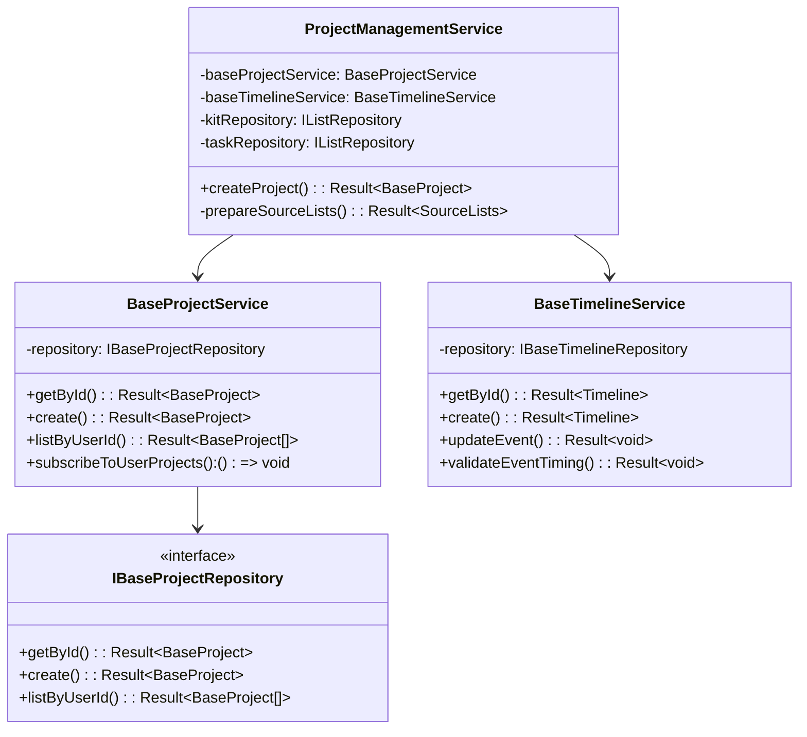
```mermaid
classDiagram
    class ProjectManagementService {
        -baseProjectService: BaseProjectService
        -baseTimelineService: BaseTimelineService
        -kitRepository: IListRepository
        -taskRepository: IListRepository
        +createProject(): Result~BaseProject~
        -prepareSourceLists(): Result~SourceLists~
    }
    
    class BaseProjectService {
        -repository: IBaseProjectRepository
        +getById(): Result~BaseProject~
        +create(): Result~BaseProject~
        +listByUserId(): Result~BaseProject[]~
        +subscribeToUserProjects(): () => void
    }
    
    class BaseTimelineService {
        -repository: IBaseTimelineRepository
        +getById(): Result~Timeline~
        +create(): Result~Timeline~
        +updateEvent(): Result~void~
        +validateEventTiming(): Result~void~
    }
    
    class IBaseProjectRepository {
        <<interface>>
        +getById(): Result~BaseProject~
        +create(): Result~BaseProject~
        +listByUserId(): Result~BaseProject[]~
    }
    
    ProjectManagementService --> BaseProjectService
    ProjectManagementService --> BaseTimelineService
    BaseProjectService --> IBaseProjectRepository
```

---

### List Management Module

#### Architecture Diagram

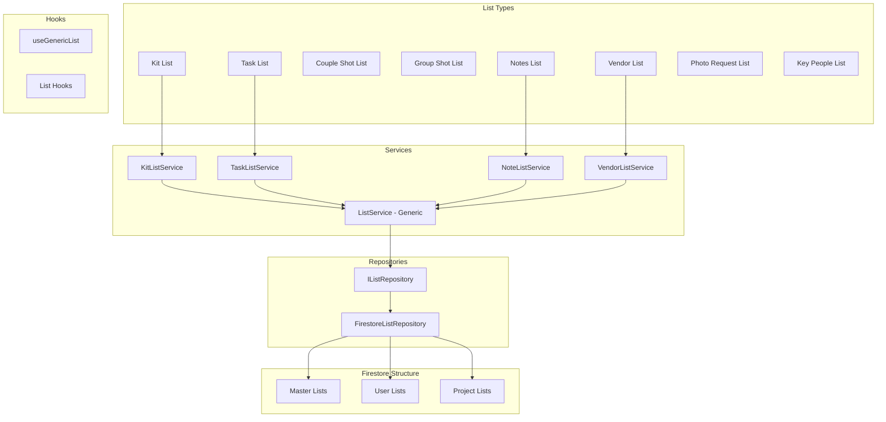
```mermaid
graph TB
    subgraph "List Types"
        KL[Kit List]
        TL[Task List]
        CSL[Couple Shot List]
        GSL[Group Shot List]
        NL[Notes List]
        VL[Vendor List]
        PRL[Photo Request List]
        KPL[Key People List]
    end
    
    subgraph "Hooks"
        UGL[useGenericList]
        ULH[List Hooks]
    end
    
    subgraph "Services"
        LS[ListService - Generic]
        KLS[KitListService]
        TLS[TaskListService]
        NLS[NoteListService]
        VLS[VendorListService]
    end
    
    subgraph "Repositories"
        ILR[IListRepository]
        FLR[FirestoreListRepository]
    end
    
    subgraph "Firestore Structure"
        MS[Master Lists]
        UL[User Lists]
        PL[Project Lists]
    end
    
    KL --> KLS
    TL --> TLS
    NL --> NLS
    VL --> VLS
    
    KLS --> LS
    TLS --> LS
    NLS --> LS
    VLS --> LS
    
    LS --> ILR
    ILR --> FLR
    
    FLR --> MS
    FLR --> UL
    FLR --> PL
```

#### List Hierarchy

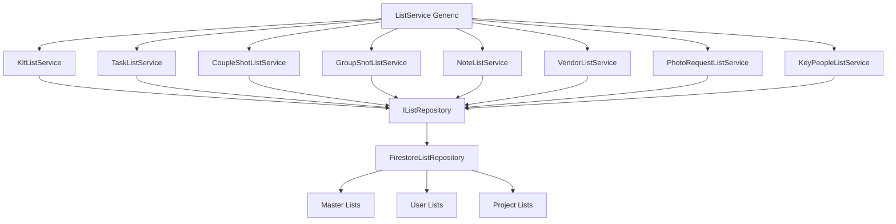
```mermaid
graph TD
    A[ListService Generic] --> B[KitListService]
    A --> C[TaskListService]
    A --> D[CoupleShotListService]
    A --> E[GroupShotListService]
    A --> F[NoteListService]
    A --> G[VendorListService]
    A --> H[PhotoRequestListService]
    A --> I[KeyPeopleListService]
    
    B --> J[IListRepository]
    C --> J
    D --> J
    E --> J
    F --> J
    G --> J
    H --> J
    I --> J
    
    J --> K[FirestoreListRepository]
    
    K --> L[Master Lists]
    K --> M[User Lists]
    K --> N[Project Lists]
```

#### List Data Flow

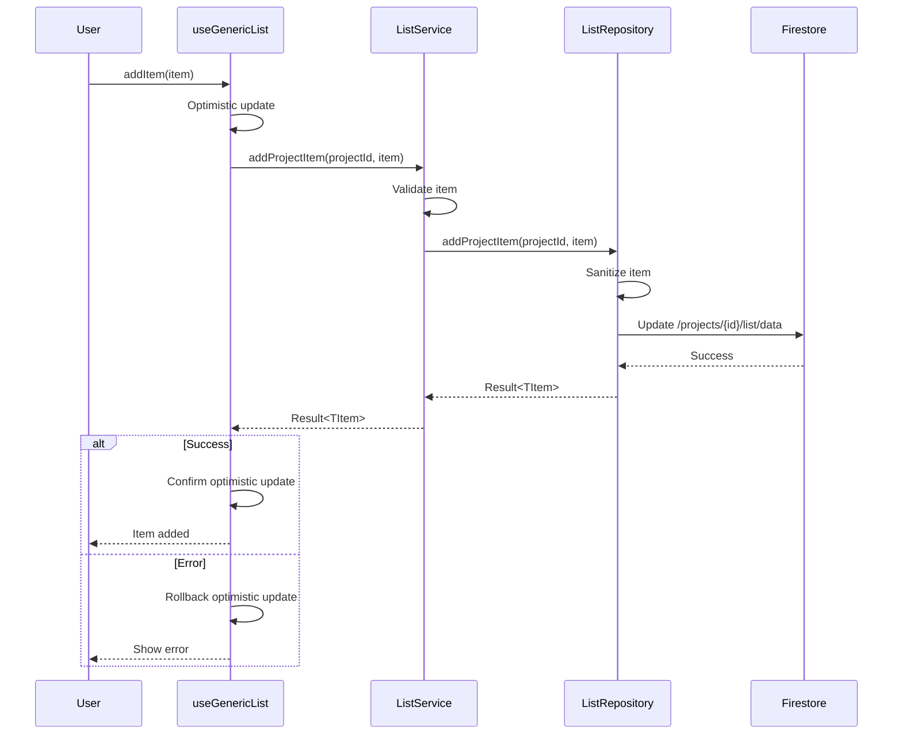
```mermaid
sequenceDiagram
    participant U as User
    participant H as useGenericList
    participant S as ListService
    participant R as ListRepository
    participant FS as Firestore
    
    U->>H: addItem(item)
    H->>H: Optimistic update
    H->>S: addProjectItem(projectId, item)
    S->>S: Validate item
    S->>R: addProjectItem(projectId, item)
    R->>R: Sanitize item
    R->>FS: Update /projects/{id}/list/data
    FS-->>R: Success
    R-->>S: Result<TItem>
    S-->>H: Result<TItem>
    
    alt Success
        H->>H: Confirm optimistic update
        H-->>U: Item added
    else Error
        H->>H: Rollback optimistic update
        H-->>U: Show error
    end
```

#### List Operations Flow

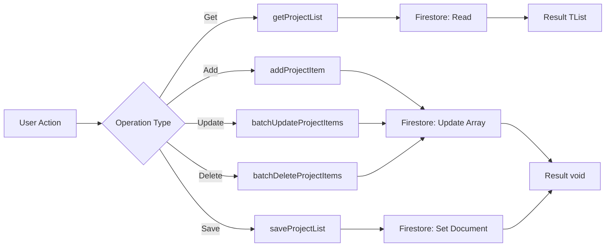
```mermaid
graph LR
    A[User Action] --> B{Operation Type}
    B -->|Get| C[getProjectList]
    B -->|Add| D[addProjectItem]
    B -->|Update| E[batchUpdateProjectItems]
    B -->|Delete| F[batchDeleteProjectItems]
    B -->|Save| G[saveProjectList]
    
    C --> H[Firestore: Read]
    D --> I[Firestore: Update Array]
    E --> I
    F --> I
    G --> J[Firestore: Set Document]
    
    H --> K[Result TList]
    I --> L[Result void]
    J --> L
```

#### List Class Structure

```mermaid
classDiagram
    class ListService~TList, TItem~ {
        -repository: IListRepository
        -listSchema: ZodSchema
        +getMaster(): Result~TList~
        +getUserList(): Result~TList~
        +getProjectList(): Result~TList~
        +addProjectItem(): Result~TItem~
        +batchUpdateProjectItems(): Result~void~
        +subscribeToProjectList(): () => void
    }
    
    class IListRepository~TList, TItem~ {
        <<interface>>
        +getMaster(): Result~TList~
        +getProjectList(): Result~TList~
        +addProjectItem(): Result~TItem~
        +batchUpdateProjectItems(): Result~void~
    }
    
    class FirestoreListRepository~TList, TItem~ {
        -paths: ListPaths
        +getProjectList(): Result~TList~
        +addProjectItem(): Result~TItem~
        -sanitizeItem(): TItem
        -toFirestoreDoc(): FirestoreData
    }
    
    class useGenericList~TList, TItem~ {
        +list: TList | null
        +loading: boolean
        +error: AppError | null
        +addItem(): Promise~boolean~
        +updateItems(): Promise~boolean~
        +deleteItems(): Promise~boolean~
    }
    
    ListService --> IListRepository
    FirestoreListRepository ..|> IListRepository
    useGenericList --> ListService
```

---

### Timeline Module

#### Timeline Architecture

```mermaid
graph TB
    subgraph "Components"
        TC[TimelineComponent]
        EC[EventCard]
        EF[EventForm]
    end
    
    subgraph "Hooks"
        UT[useTimeline]
    end
    
    subgraph "Services"
        BTS[BaseTimelineService]
    end
    
    subgraph "Repositories"
        IBTR[IBaseTimelineRepository]
        FBTR[FirestoreTimelineRepository]
    end
    
    subgraph "Firestore"
        FS[Timeline Document]
    end
    
    TC --> UT
    EC --> UT
    EF --> UT
    
    UT --> BTS
    
    BTS --> IBTR
    IBTR --> FBTR
    
    FBTR --> FS
```

#### Timeline Event Validation Flow

```mermaid
sequenceDiagram
    participant U as User
    participant H as useTimeline
    participant S as BaseTimelineService
    participant R as TimelineRepository
    participant FS as Firestore
    
    U->>H: addEvent(event)
    H->>S: addEvent(projectId, event)
    S->>S: Validate event schema
    S->>R: get(projectId)
    R->>FS: Get timeline document
    FS-->>R: Timeline data
    R-->>S: Result<Timeline>
    
    S->>S: validateEventTiming(newEvent, existingEvents)
    
    alt Validation Passes
        S->>S: Check overlaps
        S->>S: Check buffer times
        S->>R: addEvent(projectId, event)
        R->>FS: Update timeline.items array
        FS-->>R: Success
        R-->>S: Result<void>
        S-->>H: Result<void>
        H-->>U: Success
    else Validation Fails
        S-->>H: Result<void, ValidationError>
        H-->>U: Show error message
    end
```

---

### Supporting Modules

#### Business Card Module

```mermaid
graph LR
    A[BusinessCard Component] --> B[useBusinessCard]
    B --> C[BusinessCardService]
    C --> D[IBusinessCardRepository]
    D --> E[FirestoreBusinessCardRepository]
    E --> F[Firestore]
```

#### Location Module

```mermaid
graph LR
    A[Location Component] --> B[useLocation]
    B --> C[LocationService]
    C --> D[ILocationRepository]
    D --> E[FirestoreLocationRepository]
    E --> F[Firestore]
```

#### Photo Request Module

```mermaid
graph LR
    A[PhotoRequest Component] --> B[usePhotoRequest]
    B --> C[PhotoRequestListService]
    C --> D[IListRepository]
    C --> E[IStorageRepository]
    D --> F[FirestoreListRepository]
    E --> G[FirestoreStorageRepository]
    F --> H[Firestore]
    G --> I[Firebase Storage]
```

---

## Data Flow Diagrams

### Complete Request-Response Flow

```mermaid
sequenceDiagram
    participant UI as UI Component
    participant H as React Hook
    participant S as Service
    participant R as Repository
    participant DB as Firestore
    
    UI->>H: User action
    H->>H: Set loading state
    H->>S: Call service method
    S->>S: Build error context
    S->>S: Validate input (Zod)
    alt Validation fails
        S-->>H: err(ValidationError)
        H->>H: Set error state
        H-->>UI: Show error
    else Validation passes
        S->>R: Call repository method
        R->>R: Sanitize input
        R->>DB: Firestore operation
        alt DB success
            DB-->>R: Data
            R->>R: Parse to domain model
            R-->>S: ok(domainModel)
            S-->>H: ok(domainModel)
            H->>H: Set success state
            H-->>UI: Update UI
        else DB error
            DB-->>R: Error
            R->>R: Map to AppError
            R-->>S: err(AppError)
            S-->>H: err(AppError)
            H->>H: Set error state
            H-->>UI: Show error
        end
    end
```

### Real-time Subscription Flow

```mermaid
sequenceDiagram
    participant C as Component
    participant H as Hook
    participant S as Service
    participant R as Repository
    participant FS as Firestore
    participant CB as Callback
    
    C->>H: Mount component
    H->>S: subscribeToUser(userId, callback)
    S->>R: subscribeToUser(userId, callback)
    R->>FS: onSnapshot(docRef, callback)
    FS-->>R: Snapshot
    R->>R: Parse snapshot
    R-->>CB: Result<Data>
    CB->>H: Update state
    H-->>C: Re-render
    
    Note over FS,CB: Real-time updates continue
    
    C->>H: Unmount component
    H->>S: Cleanup subscription
    S->>R: Return unsubscribe
    R->>FS: Unsubscribe
```

### Batch Operation Flow

```mermaid
sequenceDiagram
    participant U as User
    participant H as Hook
    participant S as Service
    participant R as Repository
    participant FS as Firestore
    
    U->>H: Batch update items
    H->>H: Optimistic update
    H->>S: batchUpdateProjectItems(projectId, updates)
    S->>S: Validate updates
    S->>R: batchUpdateProjectItems(projectId, updates)
    R->>R: Sanitize all items
    R->>FS: Update document (array field)
    FS-->>R: Success
    R-->>S: Result<void>
    S-->>H: Result<void>
    
    alt Success
        H->>H: Confirm optimistic update
        H-->>U: Success
    else Error
        H->>H: Rollback optimistic update
        H-->>U: Show error
    end
```

---

## Sequence Diagrams

### User Sign-Up Complete Flow

```mermaid
sequenceDiagram
    participant U as User
    participant C as SignUpForm
    participant H as useSignUp
    participant AS as AuthService
    participant RL as RateLimiter
    participant AR as AuthRepository
    participant FA as Firebase Auth
    participant BUR as BaseUserRepository
    participant FS as Firestore
    
    U->>C: Fill form
    C->>H: signUp(payload)
    H->>AS: signUp(payload)
    AS->>RL: Check rate limit
    RL-->>AS: Allowed
    AS->>AS: Validate with Zod
    AS->>AR: signUp(payload)
    AR->>AR: Sanitize email
    AR->>FA: createUserWithEmailAndPassword()
    FA-->>AR: UserCredential
    AR->>BUR: create(userId, baseData)
    BUR->>FS: Create /users/{userId}
    FS-->>BUR: Success
    BUR-->>AR: Result<BaseUser>
    AR->>FA: sendEmailVerification()
    FA-->>AR: Success
    AR-->>AS: Result<BaseUser>
    AS->>RL: Reset rate limit
    AS-->>H: Result<BaseUser>
    H->>H: Update state
    H-->>C: Success
    C-->>U: Navigate to app
```

### Project Creation with Subcollections

```mermaid
sequenceDiagram
    participant U as User
    participant H as useProject
    participant PMS as ProjectManagementService
    participant BPS as BaseProjectService
    participant KR as KitRepository
    participant TR as TaskRepository
    participant BTS as BaseTimelineService
    participant FS as Firestore Transaction
    
    U->>H: createProject(input)
    H->>PMS: createProject(userId, input)
    PMS->>PMS: Validate input
    
    Note over PMS,FS: Prepare source lists (reads before transaction)
    PMS->>KR: getUserList(userId)
    KR-->>PMS: KitList or Master
    PMS->>TR: getUserList(userId)
    TR-->>PMS: TaskList or Master
    
    Note over PMS,FS: Begin transaction
    PMS->>FS: runTransaction()
    
    PMS->>BPS: create(userId, input, tx)
    BPS->>FS: Create /projects/{projectId} (tx)
    
    par Parallel initialization
        PMS->>KR: createOrResetProjectList(userId, projectId, kitList, tx)
        KR->>FS: Create /projects/{id}/kit/data (tx)
    and
        PMS->>TR: createOrResetProjectList(userId, projectId, taskList, tx)
        TR->>FS: Create /projects/{id}/task/data (tx)
    and
        PMS->>BTS: initializeTimeline(projectId, tx)
        BTS->>FS: Create /projects/{id}/timeline/data (tx)
    end
    
    PMS->>FS: Commit transaction
    FS-->>PMS: Success (atomic)
    PMS-->>H: Result<BaseProject>
    H-->>U: Success
```

### List Item Addition with Optimistic Update

```mermaid
sequenceDiagram
    participant U as User
    participant H as useGenericList
    participant S as ListService
    participant R as ListRepository
    participant FS as Firestore
    
    U->>H: addItem(newItem)
    H->>H: Optimistic update (immediate UI)
    H->>S: addProjectItem(projectId, item)
    S->>S: Validate item
    S->>R: addProjectItem(projectId, item)
    R->>R: Sanitize item
    R->>FS: Update array field
    FS-->>R: Success
    R-->>S: Result<TItem>
    S-->>H: Result<TItem>
    
    alt Success
        H->>H: Confirm optimistic update
        H-->>U: Item appears (already visible)
    else Error
        H->>H: Rollback optimistic update
        H-->>U: Show error, revert UI
    end
```

---

## Class Diagrams

### Service Factory Pattern

```mermaid
classDiagram
    class ServiceFactory {
        +auth: AuthService
        +baseUser: BaseUserService
        +userProfile: UserProfileService
        +userPreferences: UserPreferencesService
        +baseProject: BaseProjectService
        +baseTimeline: BaseTimelineService
        +projectManagement: ProjectManagementService
        +userManagement: UserManagementService
        +kit: KitListService
        +task: TaskListService
        +notes: NoteListService
        +vendor: VendorListService
        +photoRequest: PhotoRequestListService
        +keyPeople: KeyPeopleListService
    }
    
    class AuthService {
        -authRepository: IAuthRepository
        +signUp(): Result
        +signIn(): Result
    }
    
    class BaseUserService {
        -repository: IBaseUserRepository
        +getById(): Result
        +create(): Result
    }
    
    class ListService~TList, TItem~ {
        -repository: IListRepository
        +getProjectList(): Result
        +addProjectItem(): Result
    }
    
    ServiceFactory --> AuthService
    ServiceFactory --> BaseUserService
    ServiceFactory --> ListService
```

### Repository Pattern

```mermaid
classDiagram
    class IAuthRepository {
        <<interface>>
        +signUp(): Result~BaseUser~
        +signIn(): Result~BaseUser~
        +signOut(): Result~void~
    }
    
    class IBaseUserRepository {
        <<interface>>
        +getById(): Result~BaseUser~
        +create(): Result~BaseUser~
        +update(): Result~BaseUser~
        +subscribeToUser(): () => void
    }
    
    class IListRepository~TList, TItem~ {
        <<interface>>
        +getProjectList(): Result~TList~
        +addProjectItem(): Result~TItem~
        +batchUpdateProjectItems(): Result~void~
    }
    
    class FirestoreAuthRepository {
        -baseUserRepository: IBaseUserRepository
        +signUp(): Result~BaseUser~
        -sanitizeEmail(): string
    }
    
    class FirestoreBaseUserRepository {
        +getById(): Result~BaseUser~
        +create(): Result~BaseUser~
        -toFirestoreDoc(): FirestoreData
        -parseSnapshot(): BaseUser
    }
    
    class FirestoreListRepository~TList, TItem~ {
        -paths: ListPaths
        +getProjectList(): Result~TList~
        +addProjectItem(): Result~TItem~
        -sanitizeItem(): TItem
    }
    
    IAuthRepository <|.. FirestoreAuthRepository
    IBaseUserRepository <|.. FirestoreBaseUserRepository
    IListRepository <|.. FirestoreListRepository
```

### Domain Model Hierarchy

```mermaid
classDiagram
    class Result~T, E~ {
        <<union type>>
        +success: boolean
    }
    
    class Ok~T~ {
        +success: true
        +value: T
    }
    
    class Err~E~ {
        +success: false
        +error: E
    }
    
    class AppError {
        +code: ErrorCode
        +message: string
        +userMessage: string
        +context: string
        +retryable: boolean
        +timestamp: Date
    }
    
    class AuthError {
        +type: "auth"
    }
    
    class ValidationError {
        +type: "validation"
        +fieldErrors: Record
    }
    
    class FirestoreError {
        +type: "firestore"
        +code: string
    }
    
    Result <|-- Ok
    Result <|-- Err
    Err --> AppError
    AppError <|-- AuthError
    AppError <|-- ValidationError
    AppError <|-- FirestoreError
```

---

## Error Handling Architecture

### Error Flow Diagram

```mermaid
graph TD
    A[Operation] --> B{Result Type}
    B -->|Success| C[Return ok value]
    B -->|Error| D[ErrorMapper]
    
    D --> E{Error Source}
    E -->|Firebase Auth| F[AuthError]
    E -->|Firestore| G[FirestoreError]
    E -->|Zod Validation| H[ValidationError]
    E -->|Network| I[NetworkError]
    E -->|Generic| J[AppError]
    
    F --> K[ErrorContextBuilder]
    G --> K
    H --> K
    I --> K
    J --> K
    
    K --> L[AppErrorHandler]
    L --> M[LoggingService]
    L --> N[User Notification]
    
    style C fill:#90EE90
    style F fill:#FFB6C1
    style G fill:#FFB6C1
    style H fill:#FFB6C1
    style M fill:#FFE4B5
```

### Error Context Building

```mermaid
sequenceDiagram
    participant S as Service/Repository
    participant ECB as ErrorContextBuilder
    participant EM as ErrorMapper
    participant EH as ErrorHandler
    participant LS as LoggingService
    
    S->>S: Operation fails
    S->>ECB: fromService('ServiceName', 'methodName', userId, projectId, metadata)
    ECB-->>S: ErrorContext
    S->>EM: fromFirestore(error, context)
    EM->>EM: Map to AppError
    EM-->>S: AppError
    S->>EH: handle(error, context)
    EH->>LS: log(error, context)
    EH->>EH: Show user notification
```

### Error Recovery Flow

```mermaid
graph LR
    A[Error Occurs] --> B{Retryable?}
    B -->|Yes| C[Retry Strategy]
    B -->|No| D[Show Error]
    
    C --> E{Attempt < Max?}
    E -->|Yes| F[Wait & Retry]
    E -->|No| D
    
    F --> G{Success?}
    G -->|Yes| H[Return Success]
    G -->|No| E
    
    style H fill:#90EE90
    style D fill:#FFB6C1
```

---

## State Management

### Hook State Flow

```mermaid
graph TD
    A[Component] --> B[useHook]
    B --> C[LoadingState]
    C --> D{Status}
    D -->|idle| E[No data]
    D -->|loading| F[Loading with optional previous data]
    D -->|success| G[Data available]
    D -->|error| H[Error with optional previous data]
    
    G --> I[Component renders data]
    H --> J[Component shows error]
    F --> K[Component shows loading]
```

### Zustand Store Flow

```mermaid
graph LR
    A[Component] --> B[useAuthStore]
    B --> C[Zustand Store]
    C --> D[State]
    C --> E[Actions]
    
    E --> F[initialize]
    E --> G[signOut]
    E --> H[setUser]
    
    F --> I[ServiceFactory.auth.getProfile]
    G --> I
    I --> C
```

### Optimistic Update Pattern

```mermaid
sequenceDiagram
    participant U as User
    participant H as Hook
    participant OU as useOptimisticUpdate
    participant S as Service
    participant DB as Database
    
    U->>H: Update action
    H->>OU: update(optimisticData)
    OU->>H: Immediate UI update
    OU->>S: operation(optimisticData)
    S->>DB: Save
    
    alt Success
        DB-->>S: Success
        S-->>OU: ok(finalData)
        OU->>H: Confirm update
        H-->>U: UI reflects final state
    else Error
        DB-->>S: Error
        S-->>OU: err(AppError)
        OU->>H: Rollback
        H-->>U: Revert UI, show error
    end
```

---

## Module Dependencies

### Service Dependencies

```mermaid
graph TD
    A[ServiceFactory] --> B[AuthService]
    A --> C[UserManagementService]
    A --> D[ProjectManagementService]
    A --> E[ListService instances]
    
    C --> F[BaseUserService]
    C --> G[UserProfileService]
    C --> H[UserPreferencesService]
    
    D --> I[BaseProjectService]
    D --> J[BaseTimelineService]
    D --> K[KitListService]
    D --> L[TaskListService]
    
    B --> M[AuthRepository]
    F --> N[BaseUserRepository]
    I --> O[BaseProjectRepository]
    E --> P[ListRepository]
```

### Repository Dependencies

```mermaid
graph TD
    A[FirestoreAuthRepository] --> B[FirestoreBaseUserRepository]
    A --> C[Firebase Auth]
    
    D[FirestoreBaseUserRepository] --> E[Firestore]
    F[FirestoreBaseProjectRepository] --> E
    G[FirestoreListRepository] --> E
    H[FirestoreTimelineRepository] --> E
    
    I[FirestoreStorageRepository] --> J[Firebase Storage]
```

---

## Data Structure Hierarchy

### Firestore Collection Structure

```mermaid
graph TD
    A[Firestore Root] --> B[users]
    A --> C[projects]
    A --> D[master]
    
    B --> E[users/{userId}]
    B --> F[users/{userId}/profile]
    B --> G[users/{userId}/preferences]
    B --> H[users/{userId}/lists/kit]
    B --> I[users/{userId}/lists/task]
    
    C --> J[projects/{projectId}]
    C --> K[projects/{projectId}/kit]
    C --> L[projects/{projectId}/task]
    C --> M[projects/{projectId}/timeline]
    C --> N[projects/{projectId}/locations]
    
    D --> O[master/kit]
    D --> P[master/task]
    D --> Q[master/coupleShot]
    D --> R[master/groupShot]
```

### Domain Schema Hierarchy

```mermaid
graph TD
    A[Base Schemas] --> B[shared-schemas.ts]
    A --> C[list-base.schema.ts]
    A --> D[errors.ts]
    A --> E[result.ts]
    
    F[User Schemas] --> G[user.schema.ts]
    F --> H[auth.schema.ts]
    F --> I[business-card.schema.ts]
    F --> J[kit.schema.ts]
    F --> K[task.schema.ts]
    F --> L[shots.schema.ts]
    
    M[Project Schemas] --> N[project.schema.ts]
    M --> O[timeline.schema.ts]
    M --> P[location.schema.ts]
    M --> Q[photo-request.schema.ts]
    M --> R[key-people.schema.ts]
    M --> S[portal.schema.ts]
    
    T[Scoped Schemas] --> U[notes.schema.ts]
    T --> V[vendor.schema.ts]
    T --> W[tag.schema.ts]
    
    B --> G
    C --> J
    C --> K
    C --> L
```

---

## Summary

This document provides a comprehensive overview of the Eye-Doo application architecture, data flows, and module structures. The system follows strict architectural patterns:

- **Ports & Adapters** for data access abstraction
- **Result Pattern** for type-safe error handling
- **Service Layer** for business logic orchestration
- **Unidirectional Data Flow** from UI to database
- **Type Safety** with TypeScript and Zod validation
- **Centralized Error Handling** with context tracking

All modules follow consistent patterns, making the codebase maintainable, testable, and scalable.

