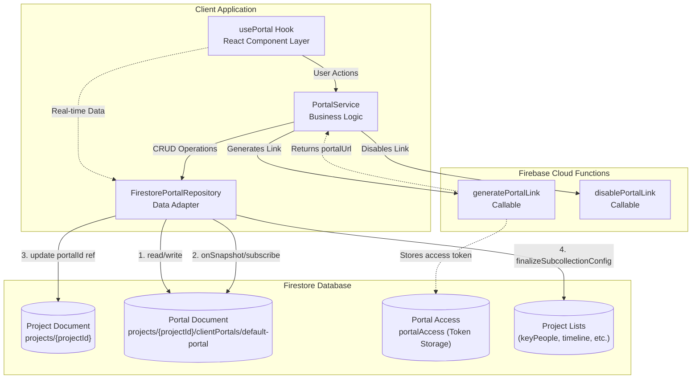
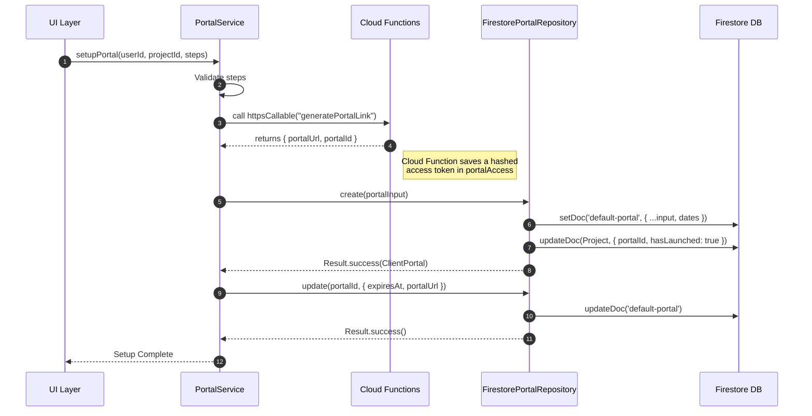
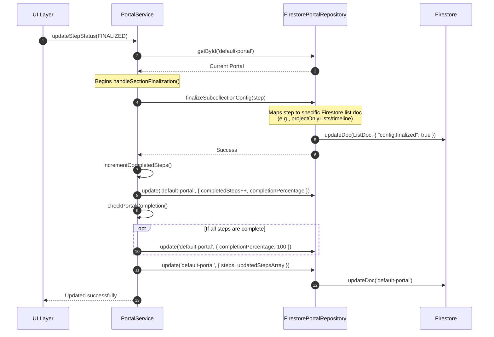
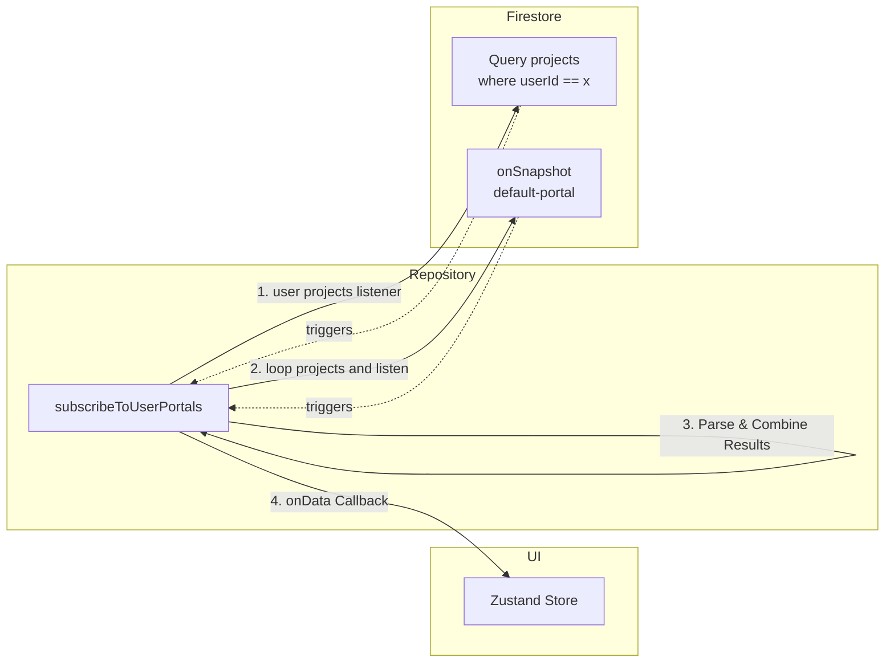

# Default-Portal Data Flows

The `default-portal` document in Firestore is the source of truth for a project's client portal state. It resides at `projects/{projectId}/clientPortals/default-portal`.

Below are the Mermaid diagrams visualizing all data flows, interactions, helpers, and cloud functions associated with this document.

---

## 1. High-Level Architecture & Interactions

This diagram shows the complete ecosystem of how the app interacts with the `default-portal` document, including UI hooks, services, repositories, and cloud functions.

---

## 2. Portal Setup Flow

When a photographer sets up a new portal for a project, the app interacts with Cloud Functions to generate secure tokens and initialises the Firestore structure.

---

## 3. Step Finalization & Subcollection Triggers

When a specific step in the portal (e.g., Timeline, Key People) is finalized, the `PortalService` calculates stats and `FirestorePortalRepository` explicitly updates deep `config.finalized` flags on related project lists.

---

## 4. Real-time Subscriptions Data Flow

The app maintains an optimized, parallel listener system to ensure UI stays in sync with `default-portal` document changes and project context.

## Summary of External Dependencies
1. **Firebase Cloud Functions**: `generatePortalLink`, `disablePortalLink`.
2. **Other Firestore Docs**:
   - Updates `projects/{projectId}`.
   - Updates `projects/{projectId}/projectOnlyLists/{sectionId}` (via finalization).
   - Updates `projects/{projectId}/lists/groupShots`.
3. **Core Helpers**: Validation (Zod schemas), result pattern returns, sanitization.
