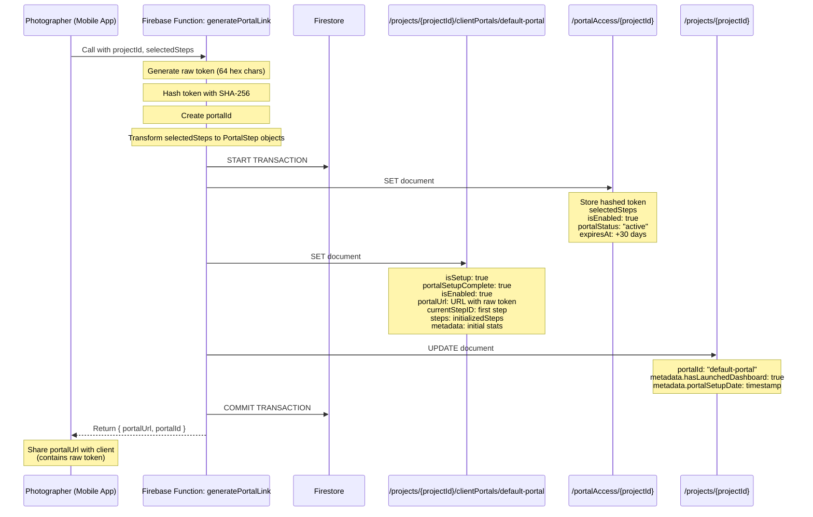
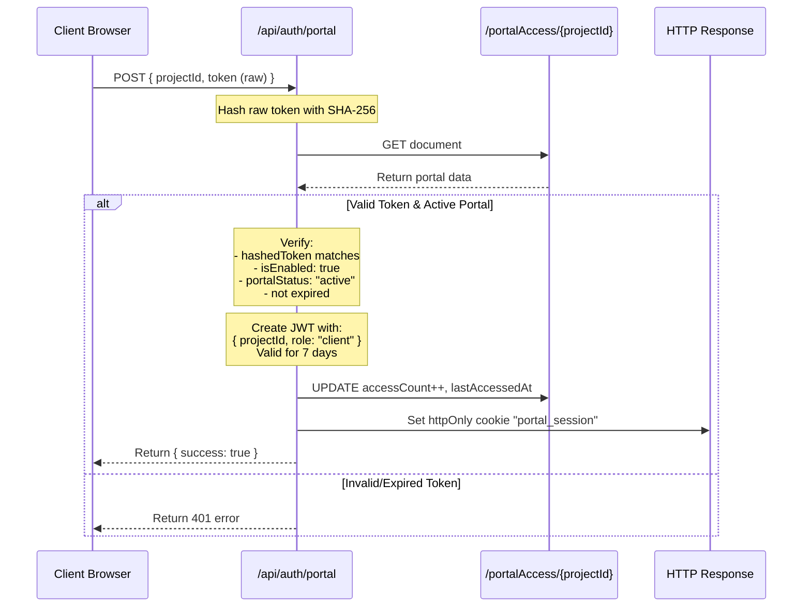
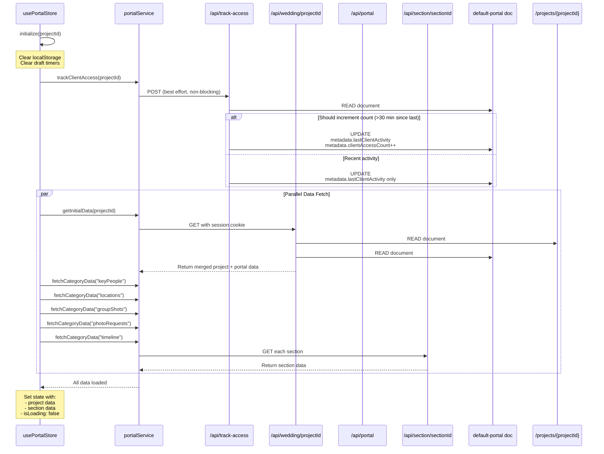
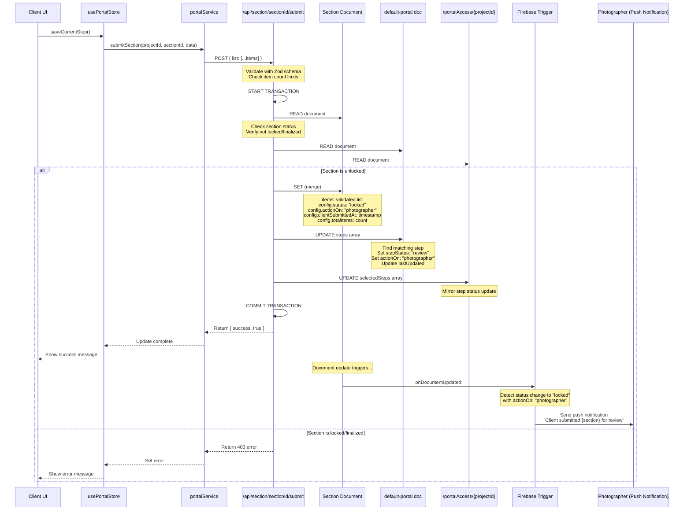
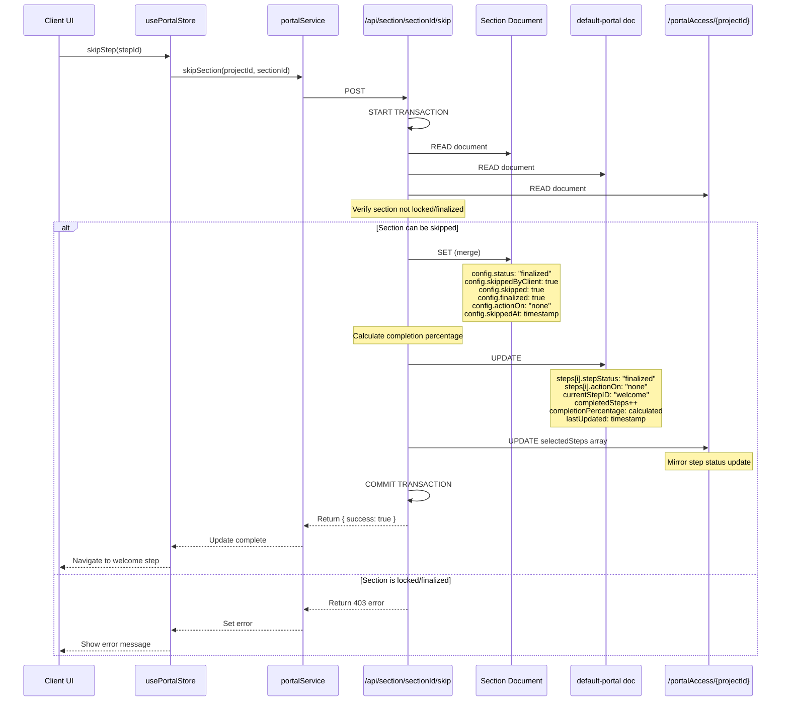
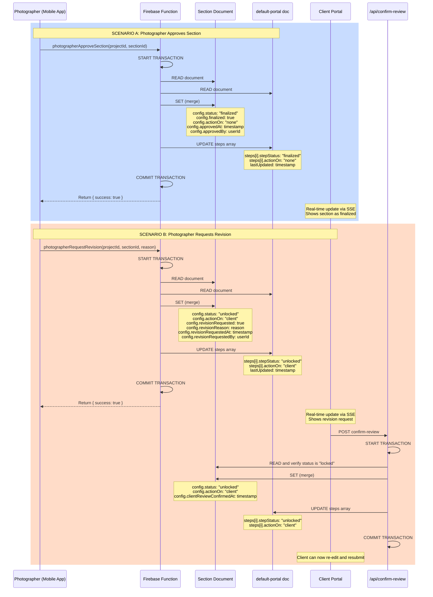
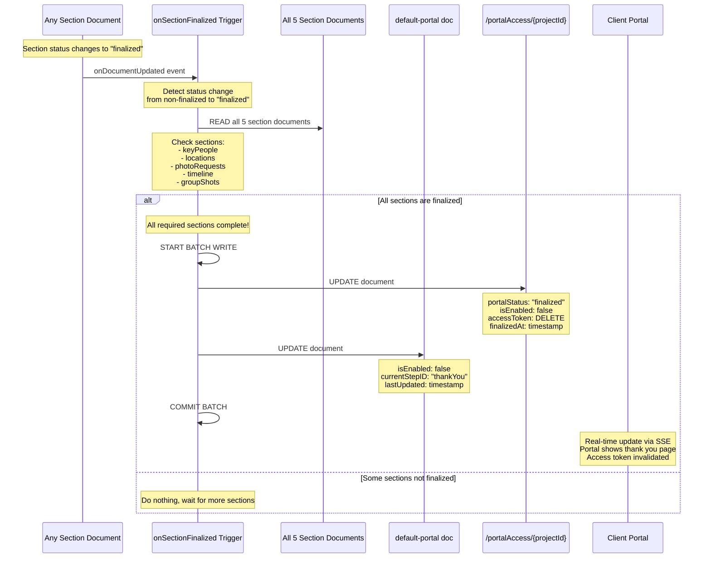
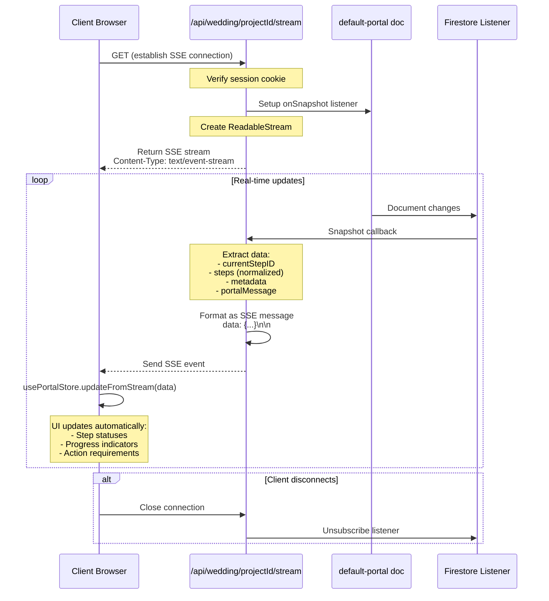
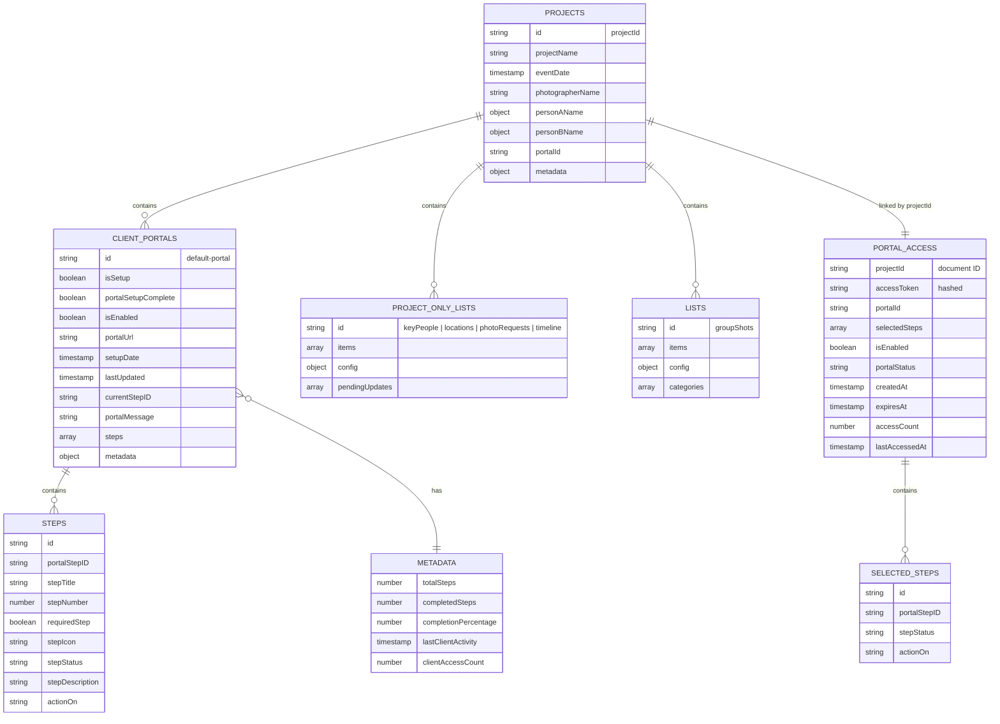

# Client Portal Data Flow Diagrams

This document contains comprehensive Mermaid diagrams showing all data flows, interactions, triggers, Firebase functions, and helpers that interact with the Firestore document at `/projects/{projectId}/clientPortals/default-portal`.

## Table of Contents
1. [High-Level Architecture](#1-high-level-architecture)
2. [Portal Creation Flow](#2-portal-creation-flow)
3. [Client Authentication Flow](#3-client-authentication-flow)
4. [Portal Data Read Operations](#4-portal-data-read-operations)
5. [Section Submit Flow](#5-section-submit-flow)
6. [Section Skip Flow](#6-section-skip-flow)
7. [Photographer Review Flow](#7-photographer-review-flow)
8. [Portal Finalization Flow](#8-portal-finalization-flow)
9. [Real-Time Updates (SSE)](#9-real-time-updates-sse)
10. [Helper Functions & Utilities](#10-helper-functions--utilities)
11. [Complete Entity Relationship](#11-complete-entity-relationship)

---

## 1. High-Level Architecture

```mermaid
graph TB
    subgraph "Client Portal App"
        UI[Client UI]
        Store[usePortalStore]
        Service[portalService]
    end
    
    subgraph "Next.js API Routes"
        AuthAPI[/api/auth/portal]
        ProjectAPI[/api/wedding/projectId]
        PortalAPI[/api/wedding/projectId/portal]
        SectionAPI[/api/wedding/projectId/section/sectionId/*]
        TrackAPI[/api/wedding/projectId/track-access]
        StepAPI[/api/wedding/projectId/current-step]
        StreamAPI[/api/wedding/projectId/stream]
    end
    
    subgraph "Firebase Functions"
        GenerateLink[generatePortalLink]
        DisableLink[disablePortalLink]
        ApproveSection[photographerApproveSection]
        RequestRevision[photographerRequestRevision]
        OnSubmitted[onSectionSubmitted Trigger]
        OnFinalized[onSectionFinalized Trigger]
    end
    
    subgraph "Firestore Collections"
        Projects[(projects)]
        ClientPortals[(clientPortals subcollection)]
        PortalAccess[(portalAccess)]
        ProjectOnlyLists[(projectOnlyLists)]
        Lists[(lists)]
    end
    
    subgraph "Key Document"
        DefaultPortal["/projects/{projectId}/clientPortals/default-portal"]
    end
    
    UI --> Store
    Store --> Service
    Service --> AuthAPI
    Service --> ProjectAPI
    Service --> PortalAPI
    Service --> SectionAPI
    Service --> TrackAPI
    Service --> StepAPI
    Service --> StreamAPI
    
    AuthAPI --> PortalAccess
    ProjectAPI --> Projects
    ProjectAPI --> DefaultPortal
    PortalAPI --> DefaultPortal
    SectionAPI --> DefaultPortal
    SectionAPI --> ProjectOnlyLists
    SectionAPI --> Lists
    SectionAPI --> PortalAccess
    TrackAPI --> DefaultPortal
    StepAPI --> DefaultPortal
    StreamAPI --> DefaultPortal
    
    GenerateLink --> DefaultPortal
    GenerateLink --> PortalAccess
    GenerateLink --> Projects
    DisableLink --> DefaultPortal
    DisableLink --> PortalAccess
    ApproveSection --> DefaultPortal
    ApproveSection --> ProjectOnlyLists
    ApproveSection --> Lists
    RequestRevision --> DefaultPortal
    RequestRevision --> ProjectOnlyLists
    RequestRevision --> Lists
    
    OnSubmitted --> ProjectOnlyLists
    OnSubmitted --> Lists
    OnFinalized --> DefaultPortal
    OnFinalized --> PortalAccess
    
    DefaultPortal -.part of.-> ClientPortals
    ClientPortals -.subcollection of.-> Projects
```

---

## 2. Portal Creation Flow



---

## 3. Client Authentication Flow



---

## 4. Portal Data Read Operations



---

## 5. Section Submit Flow



---

## 6. Section Skip Flow



---

## 7. Photographer Review Flow



---

## 8. Portal Finalization Flow



---

## 9. Real-Time Updates (SSE)



---

## 10. Helper Functions & Utilities

```mermaid
graph TB
    subgraph "portalAlignment.ts Helpers"
        GetPortalPath[getPortalDocPath]
        GetSectionPath[getCanonicalSectionDocPath]
        NormalizeSteps[normalizePortalSteps]
        PatchStep[patchPortalStep]
        GetStatus[getCanonicalSectionStatus]
        IsLocked[isSectionLockedLike]
    end
    
    subgraph "Firebase Functions Helpers"
        GetPortalRef[getPortalDocRef]
        GetSectionRef[getSectionDocRef]
        GetSectionState[getSectionState]
        BuildPayload[buildSectionWritePayload]
    end
    
    subgraph "Usage in API Routes"
        ProjectRoute[/api/wedding/projectId]
        PortalRoute[/api/portal]
        SectionRoutes[/api/section/*/]
        StreamRoute[/api/stream]
        StepRoute[/api/current-step]
    end
    
    subgraph "Usage in Firebase Functions"
        GenerateFn[generatePortalLink]
        DisableFn[disablePortalLink]
        ApproveFn[photographerApproveSection]
        RevisionFn[photographerRequestRevision]
        TriggerFns[onSection* Triggers]
    end
    
    GetPortalPath --> ProjectRoute
    GetPortalPath --> PortalRoute
    GetPortalPath --> StreamRoute
    GetPortalPath --> StepRoute
    
    GetSectionPath --> SectionRoutes
    
    NormalizeSteps --> ProjectRoute
    NormalizeSteps --> PortalRoute
    NormalizeSteps --> StreamRoute
    
    PatchStep --> SectionRoutes
    
    GetStatus --> SectionRoutes
    
    IsLocked --> SectionRoutes
    
    GetPortalRef --> GenerateFn
    GetPortalRef --> DisableFn
    GetPortalRef --> ApproveFn
    GetPortalRef --> RevisionFn
    GetPortalRef --> TriggerFns
    
    GetSectionRef --> ApproveFn
    GetSectionRef --> RevisionFn
    GetSectionRef --> TriggerFns
    
    GetSectionState --> TriggerFns
    
    BuildPayload --> TriggerFns
    
    style GetPortalPath fill:#e1f5ff
    style GetPortalRef fill:#e1f5ff
    style NormalizeSteps fill:#ffe1f5
    style PatchStep fill:#ffe1f5
```

---

## 11. Complete Entity Relationship



---

## Summary of Interactions with `/projects/{projectId}/clientPortals/default-portal`

### Write Operations (CREATE/UPDATE)

1. **generatePortalLink** (Firebase Function)
   - Creates the document with initial setup
   - Sets: `isSetup`, `portalSetupComplete`, `isEnabled`, `portalUrl`, `currentStepID`, `steps`, `metadata`

2. **disablePortalLink** (Firebase Function)
   - Updates: `isEnabled: false`, `lastUpdated`

3. **photographerApproveSection** (Firebase Function)
   - Updates: `steps` array (specific step status), `lastUpdated`

4. **photographerRequestRevision** (Firebase Function)
   - Updates: `steps` array (specific step status), `lastUpdated`

5. **POST /api/section/[sectionId]/submit**
   - Updates: `steps` array (set to "review"), `lastUpdated`

6. **POST /api/section/[sectionId]/skip**
   - Updates: `steps` array (set to "finalized"), `currentStepID`, `completedSteps`, `completionPercentage`, `lastUpdated`

7. **POST /api/section/[sectionId]/confirm-review**
   - Updates: `steps` array (set to "unlocked"), `lastUpdated`

8. **POST /api/track-access**
   - Updates: `metadata.lastClientActivity`, `metadata.clientAccessCount` (conditional), `lastUpdated`

9. **PATCH /api/current-step**
   - Updates: `currentStepID`, `lastUpdated`

10. **onSectionFinalized** (Firebase Trigger)
    - Updates: `isEnabled: false`, `currentStepID: "thankYou"`, `lastUpdated`

### Read Operations

1. **GET /api/wedding/[projectId]**
   - Reads: entire document for initial project load

2. **GET /api/portal**
   - Reads: entire document for portal-specific data

3. **GET /api/current-step**
   - Reads: `currentStepID`

4. **GET /api/stream** (SSE)
   - Listens: real-time updates to `currentStepID`, `steps`, `metadata`, `portalMessage`

5. **POST /api/track-access**
   - Reads: `metadata.lastClientActivity` (to determine if count should increment)

6. All section operation routes (submit, skip, confirm-review)
   - Read: `steps` array for transaction validation

### Helper Functions

- **getPortalDocPath()**: Returns canonical path string
- **normalizePortalSteps()**: Ensures consistent step structure
- **patchPortalStep()**: Updates specific step in steps array
- **getPortalDocRef()**: Returns Firestore document reference (Firebase Functions)

### Triggers

- **onProjectOnlyListSectionSubmitted**: Monitors section submissions, sends push notifications
- **onListSectionSubmitted**: Monitors groupShots submissions, sends push notifications
- **onProjectOnlyListSectionFinalized**: Checks if all sections finalized, updates portal
- **onListSectionFinalized**: Checks if all sections finalized, updates portal

---

**Document Version:** 1.0  
**Last Updated:** March 10, 2026  
**Owner:** Eye-Doo Team
