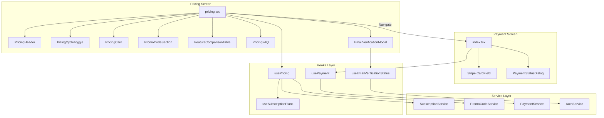
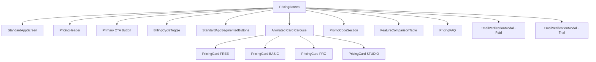
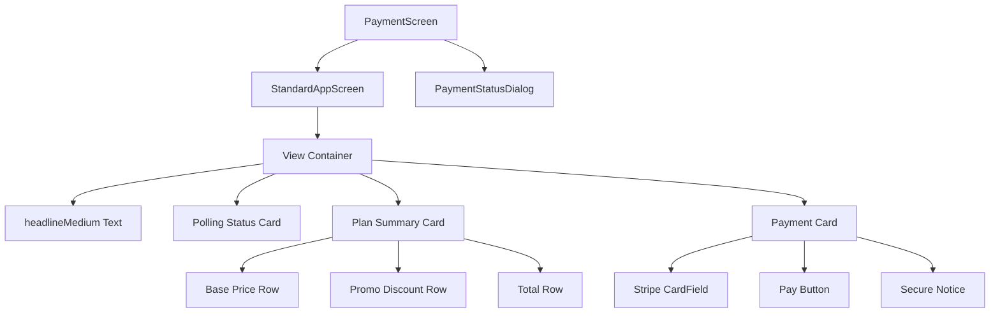
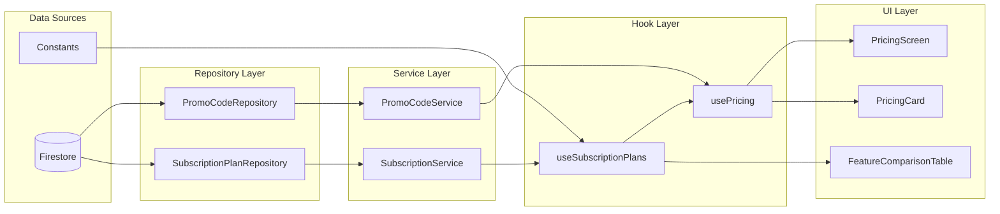
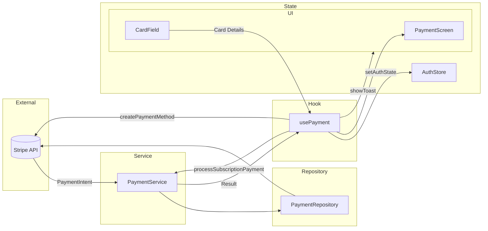
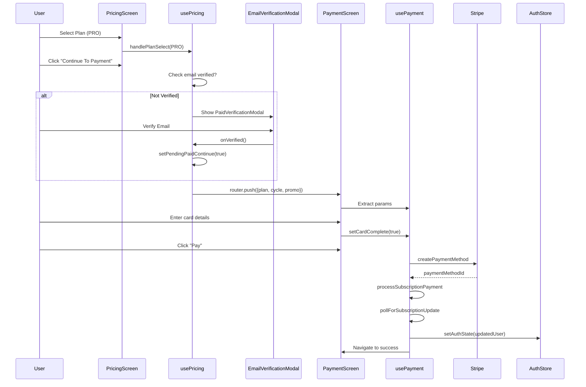
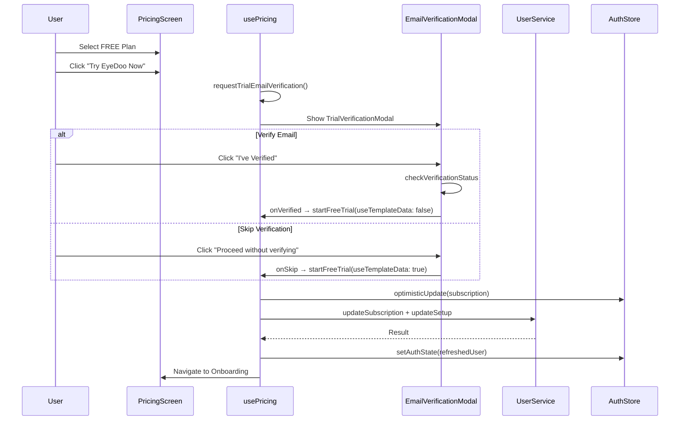
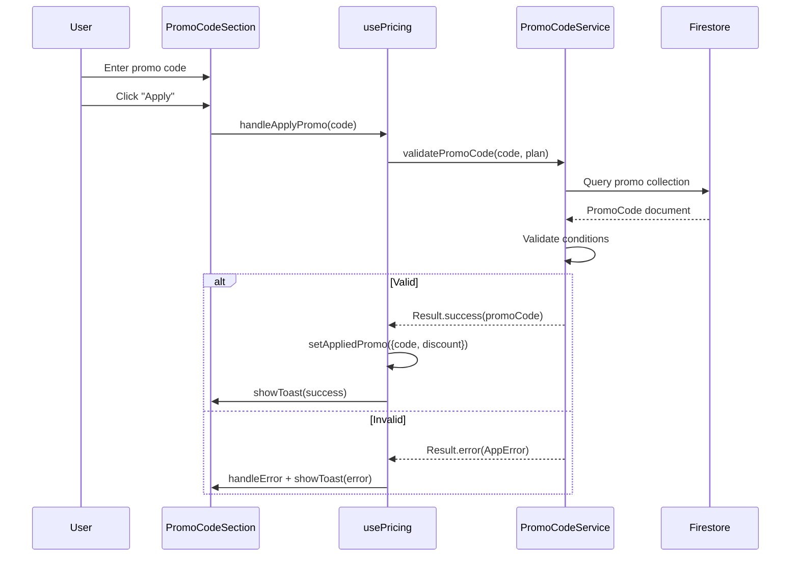
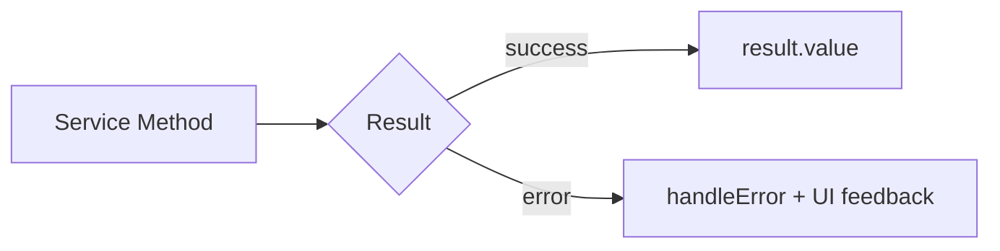
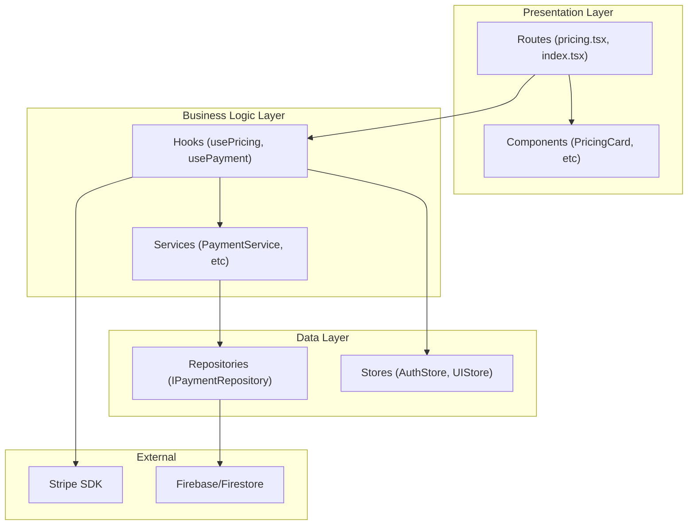

# Pricing & Payments Architecture Analysis

A comprehensive analysis of the Eye-Doo pricing and payment systems, covering data flows, interactions, sequences, dependencies, and recommendations.

---

## Table of Contents

1. [System Overview](#system-overview)
2. [File Structure & Dependencies](#file-structure--dependencies)
3. [Component Architecture](#component-architecture)
4. [Data Flow Diagrams](#data-flow-diagrams)
5. [State Management](#state-management)
6. [Interaction Sequences](#interaction-sequences)
7. [Service Layer](#service-layer)
8. [Recommendations](#recommendations)

---

## System Overview

The pricing and payments system consists of two main flows:

1. **Pricing Flow** - Plan selection, billing cycle toggle, promo codes, email verification gating
2. **Payment Flow** - Stripe integration, payment processing, subscription updates



---

## File Structure & Dependencies

### Route Files

| File                                                                                 | Purpose                              | Dependencies                                            |
| ------------------------------------------------------------------------------------ | ------------------------------------ | ------------------------------------------------------- |
| [\_layout.tsx](<file:///c:/AntigravTemps/src/app/(protected)/(payment)/_layout.tsx>) | Payment route layout with auth guard | `useAuthLoading`, `useUserState`, `useDesignSystem`     |
| [index.tsx](<file:///c:/AntigravTemps/src/app/(protected)/(payment)/index.tsx>)      | Payment completion screen            | `usePayment`, Stripe `CardField`, `PaymentStatusDialog` |
| [pricing.tsx](<file:///c:/AntigravTemps/src/app/(protected)/(payment)/pricing.tsx>)  | Plan selection screen                | `usePricing`, all pricing components                    |

### Pricing Components

| Component                                                                                                | Lines | Purpose                          | Key Dependencies                                         |
| -------------------------------------------------------------------------------------------------------- | ----- | -------------------------------- | -------------------------------------------------------- |
| [PricingHeader.tsx](file:///c:/AntigravTemps/src/components/pricing/PricingHeader.tsx)                   | 99    | Title and subtitle display       | Design system skeleton                                   |
| [BillingCycleToggle.tsx](file:///c:/AntigravTemps/src/components/pricing/BillingCycleToggle.tsx)         | 149   | Monthly/Yearly toggle with badge | `StandardAppSwitch`, a11y utils                          |
| [PricingCard.tsx](file:///c:/AntigravTemps/src/components/common/cards/PricingCard.tsx)                  | 119   | Individual plan card             | `StandardAppCard`, `getPriceDisplay`                     |
| [PromoCodeSection.tsx](file:///c:/AntigravTemps/src/components/pricing/PromoCodeSection.tsx)             | 179   | Promo code input and display     | `StandardAppTextInput`, `StandardAppButton`              |
| [FeatureComparisonTable.tsx](file:///c:/AntigravTemps/src/components/pricing/FeatureComparisonTable.tsx) | 273   | Feature matrix across plans      | `DataTable` (react-native-paper), `useSubscriptionPlans` |
| [PricingFAQ.tsx](file:///c:/AntigravTemps/src/components/pricing/PricingFAQ.tsx)                         | 81    | FAQ accordion                    | `FAQ_ITEMS` constant                                     |
| [EmailVerificationModal.tsx](file:///c:/AntigravTemps/src/components/pricing/EmailVerificationModal.tsx) | 529   | Email verification gating        | `EnhancedModal`, `useEmailVerificationStatus`            |
| [PlanDetailsModal.tsx](file:///c:/AntigravTemps/src/components/pricing/PlanDetailsModal.tsx)             | 269   | Detailed plan info modal         | `EnhancedModal`, `getSubscriptionPlanInfo`               |
| [UpgradeBanner.tsx](file:///c:/AntigravTemps/src/components/pricing/UpgradeBanner.tsx)                   | 233   | Upgrade CTA for FREE users       | Navigation to pricing                                    |

### Payment Components

| Component                                                                                          | Lines | Purpose                      |
| -------------------------------------------------------------------------------------------------- | ----- | ---------------------------- | --------------------------------------- |
| [PaymentStatusDialog.tsx](file:///c:/AntigravTemps/src/components/payment/PaymentStatusDialog.tsx) | 81    | Payment error/success dialog | `StandardAppDialog`, a11y announcements |

### Hooks

| Hook                                                                                                    | Lines | Purpose                      | Key Features                                                       |
| ------------------------------------------------------------------------------------------------------- | ----- | ---------------------------- | ------------------------------------------------------------------ |
| [use-pricing.ts](file:///c:/AntigravTemps/src/hooks/use-pricing.ts)                                     | 338   | Pricing screen orchestration | Plan selection, promo codes, modal states, email verification flow |
| [use-payment.ts](file:///c:/AntigravTemps/src/hooks/use-payment.ts)                                     | 309   | Payment processing           | Stripe integration, subscription polling, error handling           |
| [use-subscription-plans.ts](file:///c:/AntigravTemps/src/hooks/use-subscription-plans.ts)               | 205   | Plan data fetching           | Caches from SubscriptionService, fallback to constants             |
| [use-email-verification-status.ts](file:///c:/AntigravTemps/src/hooks/use-email-verification-status.ts) | 652   | Email verification logic     | Rate limiting, retry logic, FREE→verified upgrade                  |

### Services

| Service               | Purpose                     | Repository                    |
| --------------------- | --------------------------- | ----------------------------- |
| `PaymentService`      | Payment orchestration       | `IPaymentRepository`          |
| `PromoCodeService`    | Promo code validation/usage | `IPromoCodeRepository`        |
| `SubscriptionService` | Plan data caching           | `ISubscriptionPlanRepository` |

### Constants

| File                                                                          | Purpose                                    |
| ----------------------------------------------------------------------------- | ------------------------------------------ |
| [pricing-screen.ts](file:///c:/AntigravTemps/src/constants/pricing-screen.ts) | UI text, FAQ items, verification messaging |
| [subscriptions.ts](file:///c:/AntigravTemps/src/constants/subscriptions.ts)   | Pricing, trial days, helper functions      |

---

## Component Architecture

### Pricing Screen Component Hierarchy



### Payment Screen Component Hierarchy



---

## Data Flow Diagrams

### Pricing Data Flow



### Payment Data Flow



---

## State Management

### usePricing State Structure

```typescript
interface UsePricingState {
  // From useSubscriptionPlans
  plans: ExtendedPlanInfo[];
  loading: boolean;
  error: AppError | null;

  // Local State
  selectedCycle: BillingCycle; // MONTHLY | ANNUALLY
  selectedPlan: SubscriptionPlan | null;
  appliedPromo: AppliedPromo | null;

  // Modal States
  showPaidVerificationModal: boolean;
  showTrialVerificationModal: boolean;
  showFreeTrialDialog: boolean;

  // Loading States
  startingTrial: boolean;
  applyingPromo: boolean;
}
```

### usePayment State Structure

```typescript
interface UsePaymentState {
  // From URL params
  plan: SubscriptionPlan;
  cycle: BillingCycle;
  promo?: string;

  // Computed
  price: number;
  formattedPrice: string;
  discountAmount: number;

  // Local State
  cardComplete: boolean;
  processing: boolean;
  pollingSubscription: boolean;
  loadingState: LoadingState<any>;
  problemDialog: PaymentProblemDialog | null;
}
```

---

## Interaction Sequences

### Plan Selection → Payment Flow



### Free Trial Flow



### Promo Code Application



---

## Service Layer

### PaymentService Methods

| Method                       | Purpose                        | Input                                   | Output                                |
| ---------------------------- | ------------------------------ | --------------------------------------- | ------------------------------------- |
| `processSubscriptionPayment` | Orchestrates full payment flow | userId, plan, cycle, promo, stripeHooks | `Result<any, AppError>`               |
| `createPaymentIntent`        | Creates Stripe PaymentIntent   | userId, plan, cycle, promo?             | `Result<{clientSecret, finalAmount}>` |
| `createSubscription`         | Creates subscription record    | userId, plan, cycle, paymentMethodId    | `Result<{subscriptionId}>`            |
| `trackPaymentSuccess`        | Analytics tracking             | userId, plan, cycle, amount, promo?     | `Result<void>`                        |

### PromoCodeService Methods

| Method              | Purpose               | Input                                     | Output                        |
| ------------------- | --------------------- | ----------------------------------------- | ----------------------------- |
| `validatePromoCode` | Full promo validation | code, plan                                | `Result<PromoCode, AppError>` |
| `recordUsage`       | Track promo usage     | userId, promoCodeId, plan, discountAmount | `Result<void>`                |
| `hasUserUsedPromo`  | Check previous usage  | userId, promoCodeId                       | `Result<boolean>`             |
| `createPromoCode`   | Admin: create promo   | code, discountPercent, options, createdBy | `Result<PromoCode>`           |

### SubscriptionService Methods

| Method         | Purpose                     | Input  | Output                |
| -------------- | --------------------------- | ------ | --------------------- | ----- |
| `loadAllPlans` | Initialize cache on startup | -      | `Result<void>`        |
| `getPlanData`  | Get cached plan             | planId | `SubscriptionPlanData | null` |
| `refreshPlans` | Force cache refresh         | -      | `Result<void>`        |

---

## Recommendations

### 1. Code Organization

> [!WARNING]
> **Commented Legacy Code**: `FeatureComparisonTable.tsx` contains ~50 lines of commented legacy code (lines 225-272) that should be removed.

> [!TIP]
> **PlanDetailsModal Usage**: This component is defined but not used in `pricing.tsx`. Consider:
>
> - Integrating it as a "Learn More" option on `PricingCard`
> - Or removing if not needed

### 2. Feature Comparison Table Enhancement

The current `FEATURE_DEFINITIONS` array only has 2 features defined:

```typescript
const FEATURE_DEFINITIONS: Feature[] = [
  { category: "Timeline", name: "Portal Sync", key: "timeline.portalSync" },
  { category: "System", name: "Offline Sync", key: "offlineSync" },
];
```

> [!IMPORTANT]
> **Missing Features**: The comparison table should include all features from `COMPARISON_FEATURES` in `pricing-screen.ts` (Projects, Photo Requests, Key People, Vendors, Notes, Timeline Events, Custom Branding, QR Scan, NFC).

### 3. Design System Consistency

| Component                | Issue                                    | Recommendation                               |
| ------------------------ | ---------------------------------------- | -------------------------------------------- |
| `PricingCard`            | Uses hardcoded gap values (4, 12)        | Use `tokens.spacing`                         |
| `FeatureComparisonTable` | Uses `DataTable` from react-native-paper | Consider wrapping with design system styling |
| `UpgradeBanner`          | Mixed import paths for design system     | Standardize imports                          |

### 4. Accessibility Improvements

**Good Practices Already Implemented:**

- ✅ `accessibilityRole` on headers and buttons
- ✅ `accessibilityLabel` with `composeLabel` utility
- ✅ `accessibilityHint` for actions
- ✅ `useAppAccessibility` for announcements

**Improvements Needed:**

- `BillingCycleToggle` uses `accessibilityRole="radiogroup"` but individual items use `A11yRoles.BUTTON` - should be `A11yRoles.RADIO`
- Add live region announcements when promo code is applied

### 5. Error Handling Patterns

The system correctly follows the Result pattern:



**Improvement**: Some catch blocks still use raw `console.error`:

```typescript
// In handleApplyPromo
} catch (err) {
  console.error('Promo validation error:', err);  // Should use handleError
```

### 6. Rate Limiting Pattern

The email verification hook implements sophisticated rate limiting:

- Short cooldown (2s) between checks
- Rolling window limiter for abuse protection
- Cooldown state with visual feedback

> [!TIP]
> Consider extracting this pattern into a reusable `useRateLimitedAction` hook for other sensitive operations.

### 7. Loading State Improvements

Current implementation uses:

- `LoadingState<T>` discriminated union
- `INIT_IDLE()`, `INIT_AUTO_FETCH()` helpers
- Optimistic updates with rollback

**Recommendation**: The payment flow could benefit from a multi-stage progress indicator:

```typescript
// Current
setState(loadingWithProgress(undefined, false, "Confirming payment..."));

// Enhanced
setState(
  loadingWithProgress(undefined, false, "Creating payment method...", 0.25),
);
setState(loadingWithProgress(undefined, false, "Processing payment...", 0.5));
setState(
  loadingWithProgress(undefined, false, "Confirming subscription...", 0.75),
);
```

### 8. Carousel Animation

The pricing card carousel uses manual `Animated.View` with `translateX`:

```typescript
const translateX = useRef(new Animated.Value(0)).current;
Animated.timing(translateX, { toValue: -activePlanIndex * cardWidth, ... })
```

> [!TIP]
> Consider using a library like `react-native-reanimated-carousel` for better performance and gestures, or wrap this logic in a `usePricingCarousel` hook for reusability.

### 9. Type Safety

**Strong patterns:**

- Zod schemas for domain types
- Strict TypeScript enums for plans/cycles
- Result<T, AppError> for all async operations

**Improvements:**

- `PricingCard` has `limits?: any` and `planData?: any` - should use proper types
- URL params in `usePayment` are cast without validation

### 10. Architecture Summary



The architecture follows Clean Architecture principles with clear separation:

- **Routes** handle navigation and layout
- **Components** are presentation-only
- **Hooks** orchestrate UI state and side effects
- **Services** contain business logic
- **Repositories** abstract data access

This is a well-structured system that adheres to the project's coding standards.
