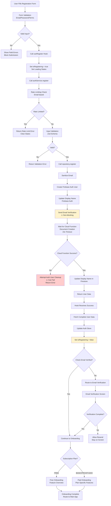

# Register Flow Analysis Report

## Executive Summary

The registration flow in Eye-Doo is a complex multi-step process involving Firebase authentication, Cloud Functions, Firestore document creation, email verification, and subscription-based onboarding routing. The flow handles multiple subscription plans (FREE, BASIC, PRO, STUDIO) and includes sophisticated error handling and race condition prevention. However, several critical issues exist around state management, error recovery, and timing dependencies.

## Architecture Overview

```
User Registration → Form Validation → AuthService → Firebase Auth → Cloud Function → Document Creation → AuthInitializer → Email Verification → Onboarding Routing
```

## Subscription Plan Structure

**FREE Plan (Default)**:

- No payment required
- Basic features only
- Users start here automatically
- Can upgrade later via pricing screen

**Paid Plans (BASIC/PRO/STUDIO)**:

- Require payment processing
- Full feature access
- Include trial periods
- Subscription management required

## Detailed Flow Analysis

### Step 1: User Input & Form Validation

**Code Location**: `src/components/auth/AuthenticationForm.tsx` & `src/app/(auth)/register.tsx`

**Flow**:

1. User enters email, password, confirm password, display name
2. Accepts terms and privacy policy
3. Optional marketing consent
4. Form validates with Zod schema
5. Calls `useRegister().register(data)`

**Issues Identified**:

#### ✅ **GOOD**: Comprehensive Form Validation

- Email format validation
- Password strength requirements
- Password confirmation matching
- Terms acceptance required
- Real-time field validation

#### ⚠️ **ISSUE**: Social Login Options Present But Non-Functional

```typescript
// Google and Apple sign-in buttons are rendered but not implemented
<StandardAppButton
  mode="outlined"
  icon="google"
  onPress={() => {
    /* Handle Google Sign-in */
  }}
  disabled={isLoading}
>
  Sign up with Google
</StandardAppButton>
```

**Problems**:

- UI suggests social login is available
- Buttons are clickable but do nothing
- Confuses users expecting social login
- Incomplete feature implementation

### Step 2: Hook-Level Processing

**Code Location**: `src/hooks/use-auth-actions.ts` - `useRegister`

**Flow**:

1. Sets `isRegistering = true` to prevent AuthInitializer conflicts
2. Calls `authService.register(input)`
3. Waits for Cloud Function to create documents
4. Fetches complete user data
5. Updates auth store
6. Routes based on email verification status

**Issues Identified**:

#### 🚨 **CRITICAL BUG**: Race Condition Prevention Logic

```typescript
// Step 1: Set flag BEFORE auth creation
setRegistering(true);

try {
  // Step 2: Create auth user
  const registerResult = await authService.register(input);

  // Step 5: Clear flag
  setRegistering(false);
} catch (error) {
  setRegistering(false); // Also in catch
} finally {
  setLocalLoading(false);
  setLoading(false);
}
```

**Problems**:

- The `setRegistering(true)` call happens before async operations
- If the hook unmounts or errors before completion, the flag stays `true`
- AuthInitializer checks this flag but there's no timeout mechanism
- Could cause permanent loading states

#### ⚠️ **ISSUE**: Email Verification Routing Logic

```typescript
// Route unverified users to verification screen
if (success) {
  const user = useAuthStore.getState().user;
  if (!user?.isEmailVerified) {
    router.replace('/(auth)/email-verification');
  }
}
```

**Problems**:

- Uses `getState()` instead of reactive state
- Router call happens immediately after registration
- No check if user data is fully loaded
- Could route before AuthInitializer completes

#### ✅ **GOOD**: Cloud Function Wait Logic

- Properly waits for user documents to be created
- Includes timeout (15 seconds)
- Handles document creation failures

### Step 3: Service-Level Validation & Processing

**Code Location**: `src/services/auth-service.ts` - `register`

**Flow**:

1. Rate limiting check (email-based)
2. Input validation with Zod schema
3. Call repository.register()
4. Return result (documents created by Cloud Function)

**Issues Identified**:

#### ✅ **GOOD**: Rate Limiting Implementation

- Prevents abuse with email-based rate limiting
- Clear error messages with time remaining
- Automatic rate limit reset on success

#### ⚠️ **ISSUE**: Single Responsibility Violation

The service handles both validation and orchestration, but the repository also does significant work:

**Service responsibilities**:

- Rate limiting
- Input validation
- Error handling

**Repository responsibilities**:

- Firebase auth creation
- Email verification sending
- Cloud Function triggering
- Document waiting logic

**Problem**: Business logic split between service and repository layers.

### Step 4: Repository-Level Firebase Operations

**Code Location**: `src/repositories/firestore/firestore-auth-repository.ts` - `register`

**Flow**:

1. Sanitize email input
2. Create Firebase Auth user
3. Update display name in Firebase Auth
4. Send email verification (non-blocking)
5. Wait for Cloud Function to create Firestore documents
6. Update display name in Firestore if provided
7. Return user data

**Issues Identified**:

#### 🚨 **CRITICAL BUG**: Auth User Cleanup Logic

```typescript
if (!waitResult.success) {
  // User document creation failed - cleanup auth user
  await this.cleanupAuthUser(userCredential, contextString);
  return err(waitResult.error);
}
```

**Problems**:

- `cleanupAuthUser` calls `userCredential.user.delete()`
- This can fail if the user is already partially deleted or if network issues occur
- No retry logic for cleanup failures
- Could leave orphaned auth accounts

#### ⚠️ **ISSUE**: Email Verification Status Tracking

```typescript
// Store verification email status
this.verificationEmailStatus.set(userCredential.user.uid, verificationEmailSent);
```

**Problems**:

- In-memory status tracking that could be lost
- No persistence of email sending status
- Service queries this status but it's not reliable

#### ✅ **GOOD**: Display Name Synchronization

Attempts to sync display name to both Firebase Auth and Firestore, with graceful error handling.

#### ⚠️ **ISSUE**: Error Context Inconsistency

```typescript
const context = ErrorContextBuilder.fromRepository('AuthRepository', 'register');
const contextString = ErrorContextBuilder.toString(context);
```

**Problems**:

- Some places use `context`, others use `contextString`
- Inconsistent error context building across the codebase

### Step 5: Cloud Function Document Creation

**Flow** (Inferred from code):

1. Firebase Auth user creation triggers Cloud Function
2. Cloud Function creates user document in Firestore
3. Initializes subscription with FREE plan
4. Creates basic user setup flags
5. Repository waits for completion

**Issues Identified**:

#### ⚠️ **ISSUE**: No Visibility into Cloud Function Process

**Problems**:

- No logging or progress indication during document creation
- Timeout (15 seconds) is hardcoded
- No way to diagnose Cloud Function failures
- User sees loading with no feedback

### Step 6: Auth State Synchronization

**Code Location**: `src/components/auth/AuthInitializer.tsx`

**Flow**:

1. Detects Firebase auth state change
2. Checks `isRegistering` flag
3. Fetches user data from Firestore
4. Sets up real-time subscription

**Issues Identified**:

#### 🚨 **CRITICAL BUG**: Registration Race Condition

```typescript
if (isRegistering) {
  // Skip data fetch during registration
  setInitializing(false);
  return;
}
```

**Problems**:

- Assumes `isRegistering` flag is reliable
- No timeout if registration never completes
- Could prevent AuthInitializer from ever running properly
- Manual flag management is error-prone

### Step 7: Email Verification Routing

**Code Location**: `src/app/(auth)/register.tsx` & `src/app/(auth)/email-verification.tsx`

**Flow**:

1. Unverified users routed to email verification screen
2. User can resend verification email
3. After verification, continue to onboarding

**Issues Identified**:

#### ⚠️ **ISSUE**: Verification Status Synchronization

**Problems**:

- Email verification status stored in Firebase Auth and Firestore
- Need to sync between both systems
- No automatic refresh of verification status
- Manual resend required

### Step 8: Onboarding Routing Based on Subscription

**Code Location**: `src/app/(protected)/(onboarding)/_layout.tsx`

**Flow**:

1. Check user subscription plan
2. Route to appropriate onboarding flow:
   - FREE users → Free onboarding (features overview)
   - Paid users → Plan-specific onboarding (feature deep-dive)
   - Expiring subscriptions → Warning flow

**Issues Identified**:

#### ✅ **GOOD**: Plan-Based Routing Logic

```typescript
// Route to correct onboarding screen based on flow
if (state.state === UserState.UNVERIFIED_FREE || state.state === UserState.VERIFIED_FREE) {
  if (!pathname.includes('/free')) {
    return <Redirect href="/(protected)/(onboarding)/free" />;
  }
} else if (state.state === UserState.PAID_ACTIVE && state.needsOnboarding) {
  if (!pathname.includes('/paid')) {
    return <Redirect href="/(protected)/(onboarding)/paid" />;
  }
}
```

**Strengths**:

- Clear routing based on user state
- Handles different subscription scenarios
- Prevents users from accessing wrong onboarding

## Subscription Upgrade Flow

### Step 1: Pricing Screen Selection

**Code Location**: `src/app/(protected)/(payment)/pricing.tsx`

**Flow**:

1. User selects plan from pricing screen
2. Email verification check (required for paid plans)
3. FREE plan: Direct activation
4. Paid plans: Navigate to payment screen

**Issues Identified**:

#### ⚠️ **ISSUE**: Email Verification Gate

```typescript
// Check email verification status
if (!user?.isEmailVerified) {
  // Store pending plan and show modal
  setPendingPlan(plan);
  setShowEmailModal(true);
  return;
}
```

**Problems**:

- Blocks paid plan selection for unverified users
- Requires verification before payment
- Could frustrate users wanting to purchase immediately

#### ✅ **GOOD**: FREE Plan Instant Activation

```typescript
if (plan === SubscriptionPlan.FREE) {
  const result = await userService.updateSubscription(user.id, {
    plan: SubscriptionPlan.FREE,
    status: SubscriptionStatus.ACTIVE,
    // ...
  });
}
```

**Strengths**:

- No payment required for FREE plan
- Immediate activation
- Direct onboarding routing

### Step 2: Payment Processing (Paid Plans)

**Flow** (Inferred):

1. User enters payment details
2. Stripe processes payment
3. Webhook updates subscription status
4. User redirected to appropriate onboarding

**Issues Identified**:

#### ⚠️ **ISSUE**: Payment Flow Not Analyzed

**Problems**:

- Payment screen implementation not reviewed
- Stripe integration not verified
- Webhook handling not checked
- Subscription activation flow not analyzed

## Race Conditions & Timing Issues

### 1. **Registration State Management**

**Problem**: Multiple async operations with shared state flags.

**Scenario**:

1. `useRegister` sets `isRegistering = true`
2. Firebase auth succeeds
3. Cloud Function starts document creation
4. AuthInitializer checks `isRegistering` flag
5. If `useRegister` fails before clearing flag, AuthInitializer never runs

### 2. **Document Creation Timing**

**Problem**: Repository waits for Cloud Function completion, but timeout is fixed.

**Impact**:

- Slow network = registration timeout
- Cloud Function delays = user stuck in loading
- No retry mechanism for document creation

### 3. **Email Verification Status Sync**

**Problem**: Verification status exists in multiple places (Firebase Auth, Firestore, local state).

**Impact**:

- Status can be out of sync
- User might see incorrect verification state
- Manual refresh required

## Error Handling Issues

### 1. **Cloud Function Failure Recovery**

**Problem**: If Cloud Function fails to create documents, cleanup is attempted but may fail.

```typescript
// Cleanup auth user before returning error
await this.cleanupAuthUser(userCredential, contextString);
```

**Issues**:

- Cleanup can fail silently
- Leaves user in inconsistent state
- No user-friendly error message

### 2. **Rate Limiting Error Messages**

**Problem**: Rate limiting uses generic error messages without context.

### 3. **Silent Failures in Development**

```typescript
// Many operations catch errors but only log in development
if (__DEV__) {
  console.warn('Failed to update display name during registration', error);
}
```

## State Inconsistencies

### 1. **Loading State Conflicts**

**Problem**: Multiple loading states during registration:

- `useRegister.localLoading`
- `useAuthStore.loading`
- `useAuthStore.isInitializing`
- `useAuthStore.isRegistering`

### 2. **User Data Synchronization**

**Problem**: User data fetched multiple times:

- After Firebase auth creation (repository)
- After document creation (repository)
- When AuthInitializer runs (initializer)

### 3. **Email Verification Status**

**Problem**: Verification status tracked in:

- Firebase Auth (`user.emailVerified`)
- Firestore user document
- Repository in-memory cache
- Local component state

## Recommended Fixes

### 1. **Fix Registration Race Condition**

Implement a more robust registration state machine:

```typescript
type RegistrationState = 'idle' | 'creating-auth' | 'waiting-documents' | 'complete' | 'failed';

// Use a single source of truth for registration status
const registrationState = useAuthStore(state => state.registrationState);
```

### 2. **Add Timeout and Retry Logic**

```typescript
// For document waiting
const waitForDocuments = async (
  userId: string,
  options: { timeoutMs: number; maxRetries: number },
) => {
  for (let attempt = 1; attempt <= options.maxRetries; attempt++) {
    try {
      const result = await waitForUserDocumentsReady(userId, repository, {
        timeoutMs: options.timeoutMs,
      });
      if (result.success) return result;
    } catch (error) {
      if (attempt === options.maxRetries) throw error;
      await delay(1000 * attempt);
    }
  }
};
```

### 3. **Implement Social Login**

Remove non-functional social login buttons or implement them properly.

### 4. **Centralize Error Handling**

Create consistent error handling patterns across all registration steps.

### 5. **Add Registration Progress Feedback**

```typescript
type RegistrationStep =
  | 'validating'
  | 'creating-account'
  | 'sending-verification'
  | 'setting-up-profile'
  | 'complete';

const [currentStep, setCurrentStep] = useState<RegistrationStep>('validating');
```

### 6. **Fix Email Verification Gate**

Consider allowing paid plan selection before verification, requiring verification only at payment time.

### 7. **Add Cloud Function Health Monitoring**

Implement monitoring for Cloud Function performance and failure rates.

## Mermaid Diagram



## Conclusion

The registration flow is architecturally sound but has several critical issues that can cause user experience problems:

1. **Race conditions** in state management between registration hook and auth initializer
2. **Incomplete error recovery** when Cloud Functions fail
3. **Poor user feedback** during long-running operations
4. **Inconsistent state management** across multiple loading flags
5. **Non-functional UI elements** (social login buttons)

The main architectural strength is the clean separation between authentication (Firebase), document creation (Cloud Functions), and state management (Zustand). However, the implementation has timing dependencies and error handling gaps that need to be addressed.

**Key Fixes Needed**:

- Implement robust registration state machine
- Add retry logic and better error recovery
- Remove or implement social login options
- Add progress feedback for long operations
- Centralize and improve error handling
- Fix race conditions in auth state synchronization
